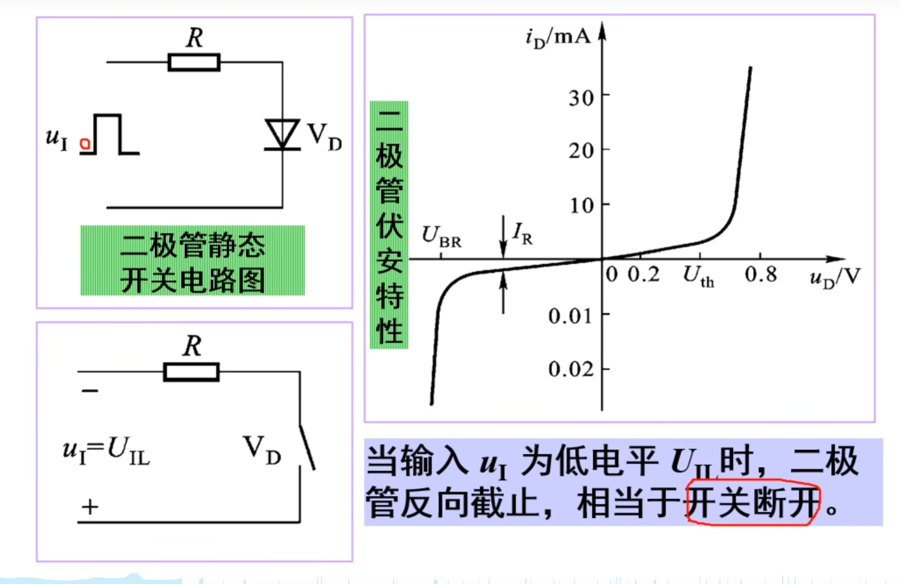
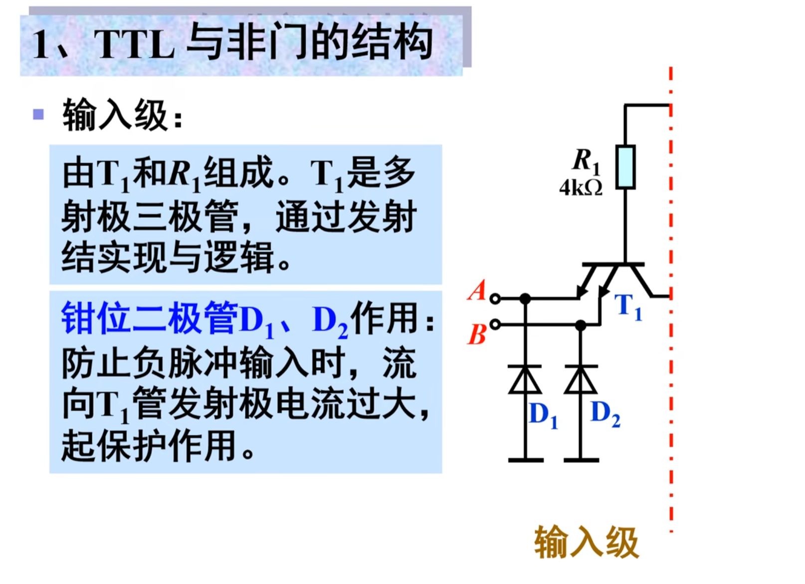
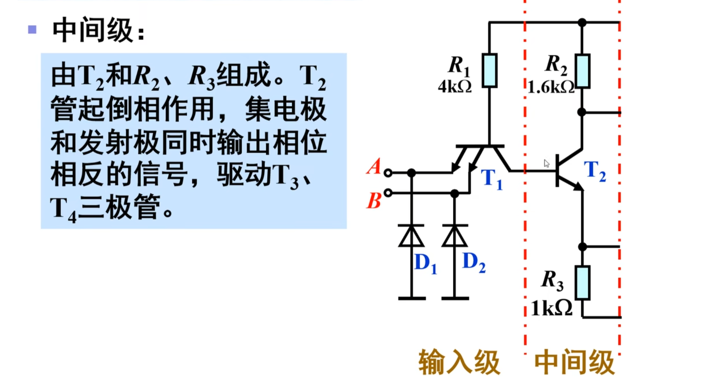
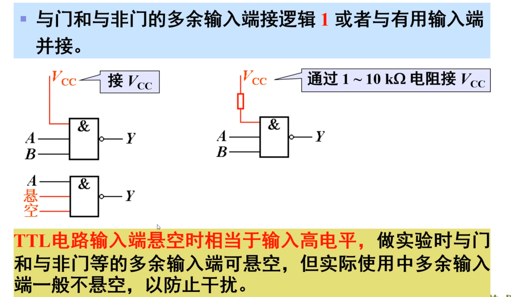

# 《数字电子技术 / 数字逻辑电路》知识点总结

## 1. 课程核心定位与应用场景

### 1.1 课程属性

- 专业基础课：面向**电气类、电子信息类、计算机类专业**，是后续专业课程（如单片机、FPGA、通信原理）的核心前置知识。
- 课程目标：掌握数字电路的逻辑分析与设计方法，实现具备特定功能的电子系统。

### 1.2 实际应用场景

数字电子技术的广泛应用，涵盖日常与工业领域：

- 日常生活：手机、数字手表、数字电视、共享单车（核心控制模块为数字电路）。
- 工业 / 科技领域：自动控制系统、电子测量仪表、通信系统、卫星系统、雷达设备。

## 2. 数字电子技术与传统电路的核心区别


| 对比维度     | 传统电路（如《电路分析》）               | 数字电子技术                                   |
| ------------ | ---------------------------------------- | ---------------------------------------------- |
| 学习核心目标 | 掌握电路分析方法（如基尔霍夫定律）、定律 | 掌握逻辑分析方法，实现特定功能逻辑电路         |
| 求解对象     | 电压、电流、功率等连续物理量             | 逻辑关系（0/1 状态），实现功能（如抢答、计数） |
| 核心数学工具 | 普通代数、微积分                         | **逻辑代数**（基于 “关系” 的代数体系）         |
| 输出成果     | 物理量计算结果                           | 可实现功能的硬件电路（或仿真电路）             |

## 3. 核心基础概念

### 3.1 逻辑的定义

- 视频核心解释：**逻辑是 “关系” 的描述**，在数字电路中特指 “输入与输出之间的因果关系”（如 “输入全 1 时输出 1”）。
- 物理载体：逻辑关系通过 “高低电平” 实现（通常用 1 表示高电平，0 表示低电平，具体数值因芯片类型而异）。

### 3.2 逻辑代数

- 定义：数字电子技术的数学基础，而非普通代数，核心研究 “逻辑变量”（取值仅 0/1）与 “逻辑运算”（与、或、非等）。
- 与普通代数的本质区别：不关注数值大小，仅关注 “逻辑状态”（0/1）的运算关系。

## 4. 关键逻辑芯片及功能解析

8 类核心逻辑芯片，按 “基础门电路” 和 “功能型芯片” 分类如下：

### 4.1 基础门电路（逻辑关系的最小单元）

| 芯片类型 | 核心功能                      | 真值表（以 2 输入为例）                    | C++ 仿真函数（模拟逻辑）                      |      |       |
| -------- | ----------------------------- | ------------------------------------------ | --------------------------------------------- | ---- | ----- |
| 与门     | 输入全 1 时输出 1，否则输出 0 | A=0,B=0→0；A=0,B=1→0；A=1,B=0→0；A=1,B=1→1 | `bool AND(bool A, bool B) { return A && B; }` |      |       |
| 或门     | 输入有 1 时输出 1，否则输出 0 | A=0,B=0→0；A=0,B=1→1；A=1,B=0→1；A=1,B=1→1 | `bool OR(bool A, bool B) { return A           |      | B; }` |
| 非门     | 输入与输出相反（仅 1 个输入） | A=0→1；A=1→0                               | `bool NOT(bool A) { return !A; }`             |      |       |

### 4.2 功能型逻辑芯片（复杂功能实现）

| 芯片类型 | 核心功能                                     | 应用场景示例                    | C++ 仿真核心逻辑（简化）                                     |
| -------- | -------------------------------------------- | ------------------------------- | ------------------------------------------------------------ |
| 加法器   | 实现二进制数的加法运算（分半加器、全加器）   | 计算器、CPU 算术单元            | 半加器：`struct HalfAdder { bool sum; bool carry; HalfAdder(bool A, bool B) { sum = A ^ B; carry = A && B; } };` |
| 编码器   | 将多个输入状态（如按键）转为二进制代码       | 键盘按键编码（如 8→3 线编码器） | `int Encoder(bool inputs[8]) { for(int i=0;i<8;i++) if(inputs[i]) return i; return -1; }` |
| 译码器   | 将二进制代码转为多个输出状态（与编码器相反） | 数码管显示（如 3→8 线译码器）   | `void Decoder(int code, bool outputs[8]) { memset(outputs, 0, 8); outputs[code] = 1; }` |
| 计数器   | 对输入脉冲（CP）进行计数，输出计数值         | 时钟计时、频率测量              | `class Counter { int cnt=0; public: void tick() { cnt++; } int getCnt() { return cnt; } };` |
| 寄存器   | 存储 1 位或多位二进制数据（依赖触发器）      | 数据暂存、移位操作              | `class Register { bool data=0; public: void set(bool d) { data = d; } bool get() { return data; } };` |

## 5. 课程核心章节知识点拆解（6 章）

详细梳理了课程的 6 章内容，明确章节间 “承前启后” 的逻辑关系，各章核心如下：

### 5.1 第 1 章：逻辑代数基础（核心基础）

- 核心内容：
	1. **基本概念**：逻辑变量（0/1）、基本逻辑运算（与、或、非）、复合逻辑运算（与非、或非、异或、同或）。
	2. **逻辑代数定律**：
		- 基本定律：交换律（A+B=B+A；A・B=B・A）、结合律（A+(B+C)=(A+B)+C；A・(B・C)=(A・B)・C）、分配律（A・(B+C)=A・B+A・C）。
		- 特殊定律：摩根定律（*A*+*B*=*A*⋅*B*；*A*⋅*B*=*A*+*B*）、0-1 律（A+0=A；A・1=A）、互补律（A+*A*=1；A·*A*=0）。
	3. **逻辑函数化简**：
		- 目的：减少逻辑门数量，简化电路，降低成本。
		- 方法：
			- 公式法：利用上述定律逐步化简（如*Y*=*A**B*+*A**C*+*BC*=*A**B*+*A**C*）。
			- 卡诺图法：将逻辑函数用 “方格图” 表示，相邻方格合并消去冗余变量（如 2 变量函数*Y*=*A*+*A**B*=*A*+*B*，卡诺图合并后消去*A*）。
- 重要性：后续所有章节（门电路、组合 / 时序电路）的数学基础，必须掌握。

### 5.2 第 2 章：逻辑门电路（物理实现）

- 核心内容：逻辑门的 “物理载体”，重点讲解两类主流门电路：

	| 门电路类型 | 核心特点                       | 适用场景                     | 特殊类型                                                  |
	| ---------- | ------------------------------ | ---------------------------- | --------------------------------------------------------- |
	| TTL        | 速度快、驱动能力强、功耗较高   | 高速数字系统（如早期 CPU）   | OC 门（集电极开路，可线与）、TSL 门（三态门，可总线传输） |
	| CMOS       | 功耗低、抗干扰能力强、集成度高 | 低功耗系统（如手机、单片机） | OD 门（漏极开路）、传输门（实现双向数据传输）             |

- 关键结论：TTL 与 CMOS 的**逻辑功能可能相同**（如都能实现与非门），但**电气特性（速度、功耗）不同**，需根据实际需求选择。

### 5.3 第 3 章：组合逻辑电路（无记忆功能）

- 定义：由门电路构成，**无记忆功能**，输出仅依赖 “当前输入”（与时间无关）。
- 核心流程：
	1. **组合电路分析**：已知电路→写逻辑表达式→化简→列真值表→确定功能。
		- 示例：分析 “2 输入与非门构成的电路”→表达式*Y*=*A**B*→真值表→功能：输入全 1 输出 0，否则 1。
	2. **组合电路设计**：已知功能→列真值表→写逻辑表达式→化简→画电路图。
		- 示例：设计 “1 位二进制加法器”→真值表（输入 A、B，输出 sum、carry）→表达式*s**u**m*=*A*⊕*B*、*c**a**rry*=*A**B*→用异或门 + 与门实现。
- 典型电路：加法器（半加器、全加器）、编码器（8-3 线）、译码器（3-8 线）、数据选择器（4 选 1）、数据分配器。

### 5.4 第 4 章：触发器（记忆功能核心）

- 定义：**具有记忆功能**的基本单元电路，能 “保持” 1 位二进制数据（0 或 1），是时序电路的核心。
- 核心特性：
	- 记忆功能：在无触发信号时，保持当前状态不变；在触发信号（如时钟 CP）作用下，更新为新状态。
	- 引入 “时间维度”：电路状态与 “时间” 相关（何时触发、何时更新），为时序电路奠定基础。
- 常见类型：RS 触发器、JK 触发器、D 触发器（最常用，*Q**n*+1=*D*，次态 = 输入）。

### 5.5 第 5 章：时序逻辑电路（有记忆功能）

- 定义：含触发器，**有记忆功能**，输出依赖 “当前输入 + 历史状态”（与时间有关）。

- 与组合电路的核心区别：

	| 对比维度   | 组合逻辑电路 | 时序逻辑电路           |
	| ---------- | ------------ | ---------------------- |
	| 核心组件   | 门电路       | 门电路 + 触发器        |
	| 记忆功能   | 无           | 有                     |
	| 输出依赖   | 仅当前输入   | 当前输入 + 历史状态    |
	| 时间相关性 | 与时间无关   | 与时间有关（依赖时钟） |

- 典型电路：

	1. 计数器：对时钟脉冲计数（如同步 4 位二进制计数器，从 0000→1111 循环）。
	2. 寄存器：存储数据（如 8 位寄存器，存储 1 字节数据）、移位寄存器（实现数据左移 / 右移）。

### 5.6 第 6 章：脉冲产生与整形电路

- 核心作用：为时序电路提供 “时钟脉冲（CP）”（时序电路的 “心跳”）。

- 两类核心电路：

	| 电路类型 | 核心功能                                           | 实现方式（视频重点）          | 示例                             |
	| -------- | -------------------------------------------------- | ----------------------------- | -------------------------------- |
	| 脉冲产生 | 从无到有生成标准脉冲（如矩形波）                   | 555 定时器构成 “多谐振荡器”   | 生成 1Hz 时钟脉冲（周期 1 秒）   |
	| 脉冲整形 | 将非标准波形（如正弦波、畸变矩形波）转为标准矩形波 | 555 定时器构成 “施密特触发器” | 将正弦波转为高低电平分明的矩形波 |

- 核心器件：555 定时器（通用性强，可实现两种功能，是视频重点提及的芯片）。

## 6. 典型应用案例与 C++ 仿真实现

明确提及 “抢答器” 和 “交通灯” 两个实际应用，以下为基于视频逻辑的 C++ 仿真代码（模拟硬件功能）：

### 6.1 案例 1：简易 4 人抢答器（组合 + 时序逻辑）

#### 功能需求：

- 4 个选手按键，先按者抢答成功。
- 抢答成功后，锁定其他按键，显示抢答者编号。

#### C++ 仿真代码：

cpp


```cpp
#include <iostream>
#include <vector>
#include <chrono>
#include <thread>
using namespace std;

// 模拟4个选手按键（0=未按，1=按下）
vector<bool> buttons(4, false);
// 抢答锁定标志（true=已锁定，false=未锁定）
bool isLocked = false;
// 抢答成功者编号（-1=无人抢答）
int winner = -1;

// 检测按键输入（模拟硬件按键检测）
void checkButtons() {
    while (!isLocked) {
        // 模拟按键输入（此处手动输入，实际硬件为引脚检测）
        int input;
        cout << "请输入选手编号（1-4，按0结束）：";
        cin >> input;
        
        if (input >= 1 && input <= 4 && !buttons[input-1]) {
            buttons[input-1] = true;
            isLocked = true;
            winner = input;
            cout << "抢答成功！选手" << winner << "获胜！" << endl;
            break;
        } else if (input == 0) {
            cout << "抢答结束，无人抢答！" << endl;
            break;
        } else {
            cout << "无效输入或该选手已抢答，请重新输入！" << endl;
        }
    }
}

int main() {
    cout << "简易4人抢答器仿真（视频案例）" << endl;
    cout << "规则：先按下按键的选手获胜，抢答成功后锁定其他按键" << endl;
    checkButtons();
    return 0;
}
```

### 6.2 案例 2：简易交通灯（时序逻辑）

#### 功能需求：

- 红绿灯循环：红→黄→绿→红（循环）。
- 时长设定：红灯 30 秒，黄灯 5 秒，绿灯 25 秒。

#### C++ 仿真代码：

cpp


```cpp
#include <iostream>
#include <chrono>
#include <thread>
using namespace std;

// 交通灯状态枚举（视频逻辑：红→黄→绿循环）
enum LightState { RED, YELLOW, GREEN };
LightState currentState = RED;

// 显示当前灯状态
void showState(LightState state) {
    cout << "当前交通灯状态：";
    switch (state) {
        case RED: cout << "红灯（禁止通行）" << endl; break;
        case YELLOW: cout << "黄灯（准备停车）" << endl; break;
        case GREEN: cout << "绿灯（可以通行）" << endl; break;
    }
}

// 状态切换（模拟时序逻辑，依赖时间）
void switchState() {
    while (true) {
        switch (currentState) {
            case RED:
                showState(RED);
                this_thread::sleep_for(chrono::seconds(30)); // 红灯30秒
                currentState = YELLOW;
                break;
            case YELLOW:
                showState(YELLOW);
                this_thread::sleep_for(chrono::seconds(5));  // 黄灯5秒
                currentState = GREEN;
                break;
            case GREEN:
                showState(GREEN);
                this_thread::sleep_for(chrono::seconds(25)); // 绿灯25秒
                currentState = RED;
                break;
        }
    }
}

int main() {
    cout << "简易交通灯仿真（视频案例）" << endl;
    cout << "循环规则：红灯30s → 黄灯5s → 绿灯25s" << endl;
    switchState();
    return 0;
}
```

## 7. 课程学习方法

1. **理论与实践结合**：
	- 理论：掌握逻辑代数、门电路、组合 / 时序电路的核心原理。
	- 实践：通过实验室搭电路（使用实际逻辑芯片）或仿真软件（提及的 Multisim）验证理论。
2. **注重应用导向**：学习的最终目标是 “实现功能”（如抢答器、交通灯），而非单纯记公式。
3. **理清章节逻辑**：章节间呈 “基础→应用” 递进关系（逻辑代数→门电路→组合电路→触发器→时序电路→脉冲电路），前一章是后一章的基础。


#  逻辑代数基础

## 1. 本章整体框架

本章共 7 个核心内容，是数字电子技术的基础，直接支撑后续组合逻辑电路（第 3 章）和时序逻辑电路（第 5 章）的学习，具体如下：

1. 概述（本章总结重点）
2. 数制：二进制、八进制、十进制、十六进制的定义及相互转换
3. 码制：用二进制表示对象的编码方式（如常用编码类型）
4. 逻辑代数基本内容：
	- 基本逻辑运算（与、或、非）与复合逻辑运算（异或、同或等）
	- 逻辑代数定律、规则
	- 逻辑函数的表示方法（真值表、逻辑表达式等）及相互转换
	- 逻辑函数化简：公式法化简、卡诺图化简

## 2. 1.1 概述核心知识点

### 2.1 学习要求

需掌握以下 4 点：

- 了解数字技术的发展历程及典型应用场景
- 掌握集成电路（IC）的分类与核心特点
- 明确模拟电路与数字电路的本质区别
- 理解数字电路的特点与分类方式

### 2.2 数字技术的发展与应用

数字技术的发展依赖于**电子器件的迭代**，按时间线和器件类型可分为以下阶段：

#### 2.2.1 集成电路（IC）的发展阶段（按年代划分）

| 年代       | 核心技术进展                                                 | 集成电路（IC）分类                                           | 关键特点                                                     |
| ---------- | ------------------------------------------------------------ | ------------------------------------------------------------ | ------------------------------------------------------------ |
| 60-70 年代 | IC 技术快速发展                                              | SSI（小规模）→ MSI（中规模）→ LSI（大规模）→ VLSI（超大规模） | 集成度逐步提升，基于传统半导体工艺                           |
| 80 年代后  | ULSI（甚大规模）技术成熟，ASIC（定制芯片）技术落地           | ULSI、ASIC                                                   | 芯片功能定制化，集成度进一步提高                             |
| 90 年代后  | 晶体管集成度突破 “几十亿 / 片”，芯片布线进入**纳米级**（如 5nm 工艺） | 超大规模可编程芯片（如 FPGA）                                | 时钟频率达 3GHz（10⁹Hz），支撑高性能计算（如手机、计算机 CPU） |
| 未来趋势   | 采用高分子材料 / 生物材料，研发**三维结构电路**              | 高密度三维集成芯片                                           | 进一步提升集成度和性能，降低功耗                             |

#### 2.2.2 电子器件的三大时代

1. **电子管时代（1906 年发明）**
	- 发明者：弗雷斯特
	- 技术原理：电真空器件，利用电场控制真空中的电子流，实现信号放大或振荡
	- 缺点：体积大、重量重、耗电大、寿命短
	- 应用场景：仅用于大功率发射装置
2. **晶体管时代（1947 年诞生）**
	- 发明者：美国贝尔实验室（肖克利、巴丁、布拉顿），1956 年获诺贝尔物理学奖
	- 核心器件：半导体二极管、三极管
	- 功能：二极管用于检波、整流、电子开关；三极管用于放大、开关、稳压、信号调制
	- 意义：标志半导体产业诞生，开启信息化时代
3. **半导体集成电路时代（1958 年诞生）**
	- 发明者：美国德州仪器工程师杰克・基尔比（“集成电路之父”），2000 年获诺贝尔物理学奖（滞后 42 年）
	- 技术突破：首次将电子器件集成到单块半导体材料上
	- 常见封装形式（视频中展示）：
		- DIP（双列直插）：实验室常用
		- 贴片式：无需过孔，用于小型设备（如手机）
		- 超大规模集成芯片：用于计算机、高端电子设备

### 2.3 电路设计方法

两种设计方法的对比，核心差异在于 “自上而下” 与 “自下而上” 的流程：

| 设计类型     | 核心思路（流程）                                             | 特点                                 | 工具 / 场景                                                  |
| ------------ | ------------------------------------------------------------ | ------------------------------------ | ------------------------------------------------------------ |
| 传统设计方法 | 自下而上：人工组装分立元件（电阻、电容等）→ 逐步焊接成大电路→ 反复调试修改 | 设计周期长、可靠性差、灵活性低       | 实验室课程设计                                               |
| 现代设计方法 | 自上而下（EDA 技术）：需求拆解→ 分模块设计→ 软件仿真→ 整体验证→ 下载到芯片 | 设计周期短、可靠性高、硬件设计软件化 | EDA 工具：Altera Quartus、Xilinx Foundation、Lattice ispLEVEL |

#### 2.3.1 EDA 技术核心流程

1. 设计输入：通过原理图或硬件描述语言（如 Verilog HDL，视频提及 “与 C 语言相似”）完成电路设计
2. 仿真验证：在计算机中模拟电路输入输出波形，验证逻辑功能是否符合要求（避免实物焊接后返工）
3. 布局布线：EDA 软件自动完成芯片内部的线路连接
4. 下载烧录：将验证通过的设计文件下载到可编程芯片（如 Altera Cyclone 系列 FPGA，视频展示实验板）

### 2.4 模拟电路与数字电路的区别

从 “信号、器件状态、研究内容” 三个维度明确差异，具体对比如下：

| 对比维度       | 模拟电路                                                     | 数字电路                                                     |
| -------------- | ------------------------------------------------------------ | ------------------------------------------------------------ |
| 核心信号       | 模拟信号：时间和幅度**连续变化**（如正弦波，视频展示波形图） | 数字信号：时间和幅度**断续跳变**（如方波，“t1 时刻从 0 跳变到 U1”） |
| 三极管工作状态 | 工作在**放大区**（核心功能：信号放大）                       | 工作在**饱和区 / 截止区**（核心功能：模拟开关，饱和 = 导通，截止 = 断开） |
| 基本元件       | 三极管、场效应管、集成运算放大器（运放）                     | 门电路（与门、或门、非门等）、触发器                         |
| 研究核心内容   | 信号放大、运算（如加法 / 减法）、信号处理（滤波、比较）、波形发生（正弦波） | 组合逻辑电路（加法器、译码器）、时序逻辑电路（寄存器、计数器）、A/D/D/A 转换 |
| 典型应用       | 音频放大器、传感器信号调理电路                               | 计算机 CPU、数字仪表、智能家居、数码相机                     |

### 2.5 数字信号的描述方法

#### 2.5.1 二值数字逻辑（核心）

- 定义：用**0 和 1**两个离散值描述数字信号，仅表示 “两种相反状态”，不代表数量大小（强调 “不能说 1 比 0 大”）
- 状态示例：开关闭合 = 1 / 断开 = 0；晶体管导通 = 1 / 截止 = 0；高电平 = 1 / 低电平 = 0

#### 2.5.2 逻辑电平（TTL 电路标准）

- 逻辑 1（高电平，H）：对应电压≈5V
- 逻辑 0（低电平，L）：对应电压≈0V
- 说明：TTL 电路对电压要求严格，是数字电路中最常用的电平标准

#### 2.5.3 逻辑体制

- 正逻辑（默认使用）：高电平 = 1，低电平 = 0（视频强调 “整本书以正逻辑为主”）
- 负逻辑（特殊场景）：高电平 = 0，低电平 = 1（视频提及 “极少使用，仅特殊场合”）

### 2.6 逻辑代数基础

又称 “布尔代数”“开关代数”，是分析数字电路的数学工具，明确其与普通代数的异同：

#### 2.6.1 与普通代数的异同

| 对比点     | 逻辑代数                                                     | 普通代数                                       |
| ---------- | ------------------------------------------------------------ | ---------------------------------------------- |
| 变量表示   | 用字母（A、B、C 等）表示逻辑变量                             | 用字母（x、y、z 等）表示数值变量               |
| 变量取值   | 仅能取 0 或 1（表示逻辑状态，非数量）                        | 可取任意实数 / 复数（表示数量大小）            |
| 核心运算   | 逻辑运算：与（・）、或（+）、非（¬）、异或（⊕）等（如 A+B 表示 “或” 非 “加法”） | 算术运算：加（+）、减（-）、乘（×）、除（÷）等 |
| 表达式意义 | 描述变量间的逻辑关系（因果关系）                             | 描述变量间的数值关系                           |

#### 2.6.2 逻辑变量的本质

- 仅表示 “相反状态”，例如：
	- 5V 电平 = 1，0V 电平 = 0
	- 灯亮 = 1，灯灭 = 0
	- 按键按下 = 1，按键弹起 = 0

## 3. 基于知识点的 C++ 代码实现（贴合逻辑代数与数字信号）

### 3.1 1. 逻辑运算实现


```cpp
#include <iostream>
#include <string>
using namespace std;

// 1. 非运算（视频：输入0输出1，输入1输出0）
int logic_NOT(int input) {
    // 逻辑变量仅能取0或1（视频知识点：二值逻辑）
    if (input != 0 && input != 1) {
        cout << "错误：逻辑变量仅能取0或1（二值逻辑）" << endl;
        return -1; // 非法输入标记
    }
    return input == 0 ? 1 : 0;
}

// 2. 与运算（视频：所有输入为1时输出1，否则为0）
int logic_AND(int a, int b) {
    if ((a != 0 && a != 1) || (b != 0 && b != 1)) {
        cout << "错误：逻辑变量仅能取0或1（二值逻辑）" << endl;
        return -1;
    }
    return (a == 1 && b == 1) ? 1 : 0;
}

// 3. 或运算（视频：任意输入为1时输出1，否则为0）
int logic_OR(int a, int b) {
    if ((a != 0 && a != 1) || (b != 0 && b != 1)) {
        cout << "错误：逻辑变量仅能取0或1（二值逻辑）" << endl;
        return -1;
    }
    return (a == 1 || b == 1) ? 1 : 0;
}

// 4. 异或运算（视频：输入不同输出1，输入相同输出0）
int logic_XOR(int a, int b) {
    if ((a != 0 && a != 1) || (b != 0 && b != 1)) {
        cout << "错误：逻辑变量仅能取0或1（二值逻辑）" << endl;
        return -1;
    }
    return (a != b) ? 1 : 0;
}

int main() {
    // 测试逻辑运算（贴合视频“基本逻辑运算”知识点）
    int x = 1, y = 0;
    cout << "逻辑运算测试（二值逻辑：0/1）" << endl;
    cout << "x = " << x << ", y = " << y << endl;
    cout << "NOT(x) = " << logic_NOT(x) << endl;       // 预期输出0
    cout << "AND(x, y) = " << logic_AND(x, y) << endl; // 预期输出0
    cout << "OR(x, y) = " << logic_OR(x, y) << endl;   // 预期输出1
    cout << "XOR(x, y) = " << logic_XOR(x, y) << endl; // 预期输出1

    return 0;
}
```

### 3.2 2. TTL 逻辑电平判断


```cpp
#include <iostream>
using namespace std;

// 视频知识点：TTL电平标准：5V≈1（高电平），0V≈0（低电平）
// 考虑实际电路误差，设定阈值：2.4V以上为1，0.8V以下为0
int ttl_level_to_logic(double voltage) {
    if (voltage >= 2.4) {
        return 1; // 高电平→逻辑1
    } else if (voltage <= 0.8) {
        return 0; // 低电平→逻辑0
    } else {
        cout << "警告：电压" << voltage << "V处于TTL电平不确定区间（0.8V~2.4V）" << endl;
        return -1; // 不确定状态
    }
}

int main() {
    // 测试TTL电平转换（视频中提及“5V为1，0V为0”）
    double voltages[] = {5.0, 3.3, 0.0, 1.5, 2.4, 0.8};
    int n = sizeof(voltages) / sizeof(voltages[0]);

    cout << "TTL电平→逻辑值转换（视频标准：5V=1，0V=0）" << endl;
    for (int i = 0; i < n; i++) {
        int logic_val = ttl_level_to_logic(voltages[i]);
        if (logic_val != -1) {
            cout << voltages[i] << "V → 逻辑" << logic_val << endl;
        }
    }

    return 0;
}
```

### 3.3 3. 简单与门电路仿真


```cpp
#include <iostream>
#include <vector>
using namespace std;

// 视频知识点：与门逻辑：所有输入为1时输出1，否则为0
int and_gate(const vector<int>& inputs) {
    // 验证输入是否符合二值逻辑（0/1）
    for (int val : inputs) {
        if (val != 0 && val != 1) {
            cout << "错误：门电路输入必须为0或1（二值逻辑）" << endl;
            return -1;
        }
    }
    // 与门逻辑：只要有一个0，输出0；全1则输出1
    for (int val : inputs) {
        if (val == 0) {
            return 0;
        }
    }
    return 1;
}

int main() {
    // 仿真与门电路（“门电路”知识点）
    cout << "简单与门电路仿真（逻辑：全1出1，有0出0）" << endl;

    // 测试用例：2输入与门
    vector<int> test1 = {1, 1};
    cout << "输入[1,1] → 输出：" << and_gate(test1) << endl; // 预期1

    vector<int> test2 = {1, 0};
    cout << "输入[1,0] → 输出：" << and_gate(test2) << endl; // 预期0

    vector<int> test3 = {0, 0};
    cout << "输入[0,0] → 输出：" << and_gate(test3) << endl; // 预期0

    // 测试用例：3输入与门（扩展场景，符合与门逻辑）
    vector<int> test4 = {1, 1, 0};
    cout << "输入[1,1,0] → 输出：" << and_gate(test4) << endl; // 预期0

    return 0;
}
```

## 4. 关键结论（核心考点）

1. 第 1 章是数电的 “基础之基础”，必须掌握逻辑代数、数字信号描述、门电路逻辑，否则后续章节（组合 / 时序电路）无法推进。
2. 电子器件的迭代是数字技术发展的核心驱动力（电子管→晶体管→集成电路），需牢记关键发明者与时间节点（如肖克利、杰克・基尔比）。
3. EDA 技术是现代数字电路设计的核心，核心流程为 “设计 - 仿真 - 下载”，需了解常用工具（Quartus、Foundation）。
4. 数字电路的本质是 “二值逻辑”，0 和 1 仅表示状态，不代表数量，这是与模拟电路的核心区别。


#  进制

## 一、学习要求

1. 理解各进制的计算规律及 “位权” 的核心概念；
2. 掌握二进制、八进制、十六进制与十进制之间的相互转换（重点讲解 “非十进制→十进制” 的按权展开转换法）。

## 二、数制基本概念

数制即 “计数进制” 的简称，是表示数值的规则体系，核心要素包括：

- **数码**：该进制下允许使用的基本数字符号（如十进制的 0-9）；
- **基数**：数码的总数（如十进制基数为 10，二进制基数为 2）；
- **位权**：数码所处位置对应的 “权重”，公式为 “基数ⁱ”（i 为位置指数，小数点左为正、右为负，从 0 开始递增 / 递减）；
- **进位规律**：当某一位数值达到基数时，向高位进 1（如十进制 “逢十进一”）；
- **按权展开式**：任何数均可表示为 “各位数码 × 对应位权” 的总和，该总和即为其十进制数值（非十进制转十进制的核心方法）。

## 三、各进制详细解析

### 3.1 十进制（Decimal）

#### 1. 核心属性

- **定义**：日常生活中最常用的进制，以 10 为基数；
- **数码**：0、1、2、3、4、5、6、7、8、9（共 10 个）；
- **基数**：10；
- **位权**：10ⁱ（i：小数点左侧从 0 开始递增，右侧从 - 1 开始递减）；
- **进位规律**：逢十进一（如 9+1=10，本位归 0、高位加 1）；
- **表示方法**：数字后加下标 “D” 或 “₁₀”（默认不写，多进制混合时必须标注）。

#### 2. 按权展开示例

- 案例 1：十进制数 `11.51₁₀`（或 11.51D）
	按权展开：
	`1×10¹ + 1×10⁰ + 5×10⁻¹ + 1×10⁻²`
	计算过程：
	`1×10 + 1×1 + 5×0.1 + 1×0.01 = 10 + 1 + 0.5 + 0.01 = 11.51`（结果仍为十进制）。
- 案例 2：十进制数 `385.64₁₀`（或 385.64D）
	按权展开：
	`3×10² + 8×10¹ + 5×10⁰ + 6×10⁻¹ + 4×10⁻²`
	计算过程：
	`3×100 + 8×10 + 5×1 + 6×0.1 + 4×0.01 = 300 + 80 + 5 + 0.6 + 0.04 = 385.64`。

### 3.2 二进制（Binary）

#### 1. 核心属性

- **定义**：数字电子技术的核心进制（仅需 0 和 1 表示电路高低电平），以 2 为基数；
- **数码**：0、1（仅 2 个，绝对不允许出现 “2”）；
- **基数**：2；
- **位权**：2ⁱ（i：小数点左侧从 0 开始递增，右侧从 - 1 开始递减）；
- **进位规律**：逢二进一（如 1+1=10，本位归 0、高位加 1；11+1=100，连续进位）；
- **表示方法**：数字后加下标 “B” 或 “₂”（必须标注，避免与十进制混淆）。

#### 2. 按权展开示例

- 案例：二进制数 `1011.11₂`（或 1011.11B）→ 转十进制
	按权展开：
	`1×2³ + 0×2² + 1×2¹ + 1×2⁰ + 1×2⁻¹ + 1×2⁻²`
	计算过程：
	`1×8 + 0×4 + 1×2 + 1×1 + 1×0.5 + 1×0.25 = 8 + 0 + 2 + 1 + 0.5 + 0.25 = 11.75₁₀`。

### 3.3 八进制（Octal）

#### 1. 核心属性

- **定义**：二进制的简化表示（1 位八进制 = 3 位二进制），以 8 为基数；
- **数码**：0、1、2、3、4、5、6、7（共 8 个，绝对不允许出现 “8” 或 “9”）；
- **基数**：8；
- **位权**：8ⁱ（i：小数点左侧从 0 开始递增，右侧从 - 1 开始递减）；
- **进位规律**：逢八进一（如 7+1=10，本位归 0、高位加 1）；
- **表示方法**：数字后加下标 “O” 或 “₈”（必须标注）。

#### 2. 按权展开示例

- 案例：八进制数 `573.46₈`（或 573.46O）→ 转十进制
	按权展开：
	`5×8² + 7×8¹ + 3×8⁰ + 4×8⁻¹ + 6×8⁻²`
	计算过程：
	`5×64 + 7×8 + 3×1 + 4×0.125 + 6×0.015625 = 320 + 56 + 3 + 0.5 + 0.09375 = 379.59375₁₀`。

### 3.4 十六进制（Hexadecimal）

#### 1. 核心属性

- **定义**：二进制的简化表示（1 位十六进制 = 4 位二进制），以 16 为基数；
- **数码**：0-9 + A-F（共 16 个，A=10、B=11、C=12、D=13、E=14、F=15，大小写均可）；
- **基数**：16；
- **位权**：16ⁱ（i：小数点左侧从 0 开始递增，右侧从 - 1 开始递减）；
- **进位规律**：逢十六进一（如 F+1=10，9+7=10，F+A+1=1A）；
- **表示方法**：数字后加下标 “H” 或 “₁₆”（必须标注）。

#### 2. 按权展开示例

- 案例：十六进制数 `5EC.D4₁₆`（或 5EC.D4H）→ 转十进制
	第一步：将十六进制字母转为十进制数码：E=14、C=12、D=13；
	按权展开：
	`5×16² + 14×16¹ + 12×16⁰ + 13×16⁻¹ + 4×16⁻²`
	计算过程：
	`5×256 + 14×16 + 12×1 + 13×0.0625 + 4×0.00390625 = 1280 + 224 + 12 + 0.8125 + 0.015625 = 1516.828125₁₀`。


# 数制转换知识点

## 一、非十进制数（二、八、十六进制）转换为十进制数

### 1. 核心方法：按位权展开求和

- **位权定义**：不同进制的位权以 “基数” 为底，指数（`i`）由小数点位置决定：
	- 二进制基数为`2`，位权为`2^i`
	- 八进制基数为`8`，位权为`8^i`
	- 十六进制基数为`16`，位权为`16^i`
- **指数规则**：
	- 小数点**左边第一位（整数最低位）** 对应`i=0`，向左依次递增（`i=1,2,3...`）
	- 小数点**右边第一位（小数最高位）** 对应`i=-1`，向右依次递减（`i=-2,-3...`）
- **计算步骤**：将每个数码乘以其对应位权，再将所有结果相加。

### 2. 各进制转换示例

#### （1）二进制数转十进制数

- **示例**：将二进制数 `101110.011` 转换为十进制数

- 步骤 1：标注每位对应的位权（从小数点为界拆分）

	| 整数部分数码 | 1    | 0    | 1    | 1    | 1    | 0    | .    | 0    | 1    | 1    |
	| ------------ | ---- | ---- | ---- | ---- | ---- | ---- | ---- | ---- | ---- | ---- |
	| 位权（2^i）  | 2^5  | 2^4  | 2^3  | 2^2  | 2^1  | 2^0  | .    | 2^-1 | 2^-2 | 2^-3 |

- 步骤 2：按位权展开求和（0 乘位权可省略，简化计算）

	plaintext

	```plaintext
	1×2^5 + 0×2^4 + 1×2^3 + 1×2^2 + 1×2^1 + 0×2^0 + 0×2^-1 + 1×2^-2 + 1×2^-3
	= 1×32 + 0 + 1×8 + 1×4 + 1×2 + 0 + 0 + 1×0.25 + 1×0.125
	= 32 + 8 + 4 + 2 + 0.25 + 0.125
	= 46.375
	```
	
- **结果**：二进制 `101110.011` = 十进制 `46.375`

#### （2）八进制数转十进制数

- **示例**：将八进制数 `637.34` 转换为十进制数

- 步骤 1：标注每位对应的位权

	| 整数部分数码 | 6    | 3    | 7    | .    | 3    | 4    |
	| ------------ | ---- | ---- | ---- | ---- | ---- | ---- |
	| 位权（8^i）  | 8^2  | 8^1  | 8^0  | .    | 8^-1 | 8^-2 |

- 步骤 2：按位权展开求和

	plaintext

	```plaintext
	6×8^2 + 3×8^1 + 7×8^0 + 3×8^-1 + 4×8^-2
	= 6×64 + 3×8 + 7×1 + 3×0.125 + 4×0.015625
	= 384 + 24 + 7 + 0.375 + 0.0625
	= 415.4375
	```
	
- **结果**：八进制 `637.34` = 十进制 `415.4375`

#### （3）十六进制数转十进制数

- **前提**：十六进制字母对应十进制数值：`A=10, B=11, C=12, D=13, E=14, F=15`

- **示例**：将十六进制数 `8ED.C7` 转换为十进制数

- 步骤 1：标注每位对应的位权（先将字母转为十进制数：E=14，D=13，C=12）

	| 整数部分数码 | 8    | E(14) | D(13) | .    | C(12) | 7     |
	| ------------ | ---- | ----- | ----- | ---- | ----- | ----- |
	| 位权（16^i） | 16^2 | 16^1  | 16^0  | .    | 16^-1 | 16^-2 |

- 步骤 2：按位权展开求和

	plaintext

	```plaintext
	8×16^2 + 14×16^1 + 13×16^0 + 12×16^-1 + 7×16^-2
	= 8×256 + 14×16 + 13×1 + 12×0.0625 + 7×0.00390625
	= 2048 + 224 + 13 + 0.75 + 0.02734375
	= 2285.77734375 ≈ 2285.7773
	```
	
- **结果**：十六进制 `8ED.C7` ≈ 十进制 `2285.7773`

## 二、十进制数转换为非十进制数（二、八、十六进制）

### 核心原则：整数部分与小数部分**分开转换**，最后合并结果

### 1. 整数部分转换：除基取余法

#### （1）方法步骤

1. **确定基数**：转换为二进制取基数`2`，八进制取`8`，十六进制取`16`；
2. **短除法运算**：用十进制整数除以基数，记录每次的**商**和**余数**（余数为当前位的数码）；
3. **终止条件**：持续除法，直到商为`0`；
4. **读取结果**：余数从**最后一次到第一次**依次排列（即 “从下往上读”）。

#### （2）示例

##### 示例 1：十进制整数 `26` 转换为二进制

- 基数 = 2，短除法过程：

	| 运算步骤 | 被除数（商） | 除数（2） | 商   | 余数（二进制数码） |
	| -------- | ------------ | --------- | ---- | ------------------ |
	| 1        | 26           | 2         | 13   | 0（最低位）        |
	| 2        | 13           | 2         | 6    | 1                  |
	| 3        | 6            | 2         | 3    | 0                  |
	| 4        | 3            | 2         | 1    | 1                  |
	| 5        | 1            | 2         | 0    | 1（最高位）        |

- 读取余数：从下往上（最后一次余数→第一次余数）→ `11010`

- **结果**：十进制 `26` = 二进制 `11010`

##### 示例 2：十进制整数 `26` 转换为十六进制

- 基数 = 16，短除法过程：

	| 运算步骤 | 被除数（商） | 除数（16） | 商   | 余数（十六进制数码）     |
	| -------- | ------------ | ---------- | ---- | ------------------------ |
	| 1        | 26           | 16         | 1    | 10（对应字母 A，最低位） |
	| 2        | 1            | 16         | 0    | 1（最高位）              |

- 读取余数：从下往上→ `1A`

- **结果**：十进制 `26` = 十六进制 `1A`

### 2. 小数部分转换：乘基取整法

#### （1）方法步骤

1. **确定基数**：同整数部分（二→2，八→8，十六→16）；
2. **乘法运算**：用十进制小数乘以基数，记录每次结果的**整数部分**（作为当前位的数码，0 或 1/0-7/0-F）；
3. **终止条件**：
	- 理想情况：小数部分乘到`0`，停止运算；
	- 非理想情况：若小数部分无法乘到`0`，取**2~3 位小数**即可（满足精度需求）；
4. **读取结果**：整数部分从**第一次到最后一次**依次排列（即 “从上往下读”）。

#### （2）关键提醒（强调的常见错误）

- 每次取完整数部分后，**仅保留小数部分**继续乘基数，而非用完整结果（整数 + 小数）重复运算；
- 例如：`1.5`取整数部分`1`后，需用剩余的`0.5`继续乘基数，而非用`1.5`再次运算。

#### （3）示例

- **示例**：将十进制小数 `0.375` 转换为二进制

- 基数 = 2，乘法过程：

	| 运算步骤 | 被乘数（小数部分） | 乘数（2） | 结果（整数 + 小数） | 整数部分（二进制数码） | 剩余小数部分 |
	| -------- | ------------------ | --------- | ------------------- | ---------------------- | ------------ |
	| 1        | 0.375              | 2         | 0.75（0+0.75）      | 0（最高位）            | 0.75         |
	| 2        | 0.75               | 2         | 1.5（1+0.5）        | 1                      | 0.5          |
	| 3        | 0.5                | 2         | 1.0（1+0.0）        | 1（最低位）            | 0.0（终止）  |

- 读取整数部分：从上往下→ `011`

- **结果**：十进制 `0.375` = 二进制 `0.011`

### 3. 完整带小数的十进制数转换（整数 + 小数合并）

- **示例**：十进制 `26.375` 转换为二进制
	- 整数部分 `26` → 二进制 `11010`（见 1.2.1 示例 1）；
	- 小数部分 `0.375` → 二进制 `0.011`（见 1.2.3 示例）；
	- 合并结果：`11010.011`
- **最终结果**：十进制 `26.375` = 二进制 `11010.011`


#  二、八、十六进制之间转换

## 1. 核心基础：进制对应关系与位权规则

前提：二进制与八进制、十六进制存在**1 对多的固定对应关系**，转换依赖「对照表」和「位权法」，无需通过十进制中转（即 “快速转换”）。

### 1.1 二、八、十六进制对照表（十进制 0-15 对应）

视频中明确给出 1 位八进制 / 十六进制与二进制的固定对应，是转换的核心依据，表格如下：

| 十进制数 | 二进制数（4 位补全） | 八进制数（1 位） | 十六进制数（1 位） |
| -------- | -------------------- | ---------------- | ------------------ |
| 0        | 0000                 | 0                | 0                  |
| 1        | 0001                 | 1                | 1                  |
| 2        | 0010                 | 2                | 2                  |
| 3        | 0011                 | 3                | 3                  |
| 4        | 0100                 | 4                | 4                  |
| 5        | 0101                 | 5                | 5                  |
| 6        | 0110                 | 6                | 6                  |
| 7        | 0111                 | 7                | 7                  |
| 8        | 1000                 | 10               | 8                  |
| 9        | 1001                 | 11               | 9                  |
| 10       | 1010                 | 12               | A                  |
| 11       | 1011                 | 13               | B                  |
| 12       | 1100                 | 14               | C                  |
| 13       | 1101                 | 15               | D                  |
| 14       | 1110                 | 16               | E                  |
| 15       | 1111                 | 17               | F                  |

**关键结论**：

- 1 位八进制数 ↔ 3 位二进制数（因 8=2³，3 位二进制可表示 0-7，覆盖 1 位八进制所有数码）
- 1 位十六进制数 ↔ 4 位二进制数（因 16=2⁴，4 位二进制可表示 0-15，覆盖 1 位十六进制所有数码）

### 1.2 位权速算规则

无需记忆完整对照表，通过「位权法」可快速计算二进制对应的八进制 / 十六进制：

- **八进制对应二进制位权**：`4 2 1`（3 位二进制，从左到右分别对应 2²、2¹、2⁰）
	例：二进制`110` = 4+2+0 = 6（对应八进制 6）；二进制`011`=0+2+1=3（对应八进制 3）。
- **十六进制对应二进制位权**：`8 4 2 1`（4 位二进制，从左到右分别对应 2³、2²、2¹、2⁰）
	例：二进制`1011`=8+0+2+1=11（对应十六进制 B）；二进制`1100`=8+4+0+0=12（对应十六进制 C）。

## 2. 二进制与八进制的相互转换

转换核心：以「小数点」为界，3 位二进制为一组，不足补 0（**仅能在两端补 0，中间补 0 会改变数值**）。

### 2.1 二进制数 → 八进制数（步骤 + 示例）

#### 转换步骤：

1. **定位小数点**：区分整数部分（小数点左侧）和小数部分（小数点右侧）。
2. **分组**：
	- 整数部分：从右往左，每 3 位分为一组；若最后一组不足 3 位，在**左侧补 0**（不改变整数大小）。
	- 小数部分：从左往右，每 3 位分为一组；若最后一组不足 3 位，在**右侧补 0**（不改变小数大小）。
3. **查表 / 位权计算**：每组 3 位二进制数，通过「421 位权」计算对应八进制数，依次排列即可。

#### 示例：

将二进制数 `110101.1101` 转换为八进制数：

1. 定位小数点：整数部分`110101`，小数部分`1101`。
2. 分组补 0：
	- 整数部分：从右往左分 3 位 → `110` `101`（刚好两组，无需补 0）。
	- 小数部分：从左往右分 3 位 → `110` `1`（最后一组不足 3 位，右侧补 2 个 0 → `100`）。
3. 位权计算：
	- `110` = 4+2+0 = 6；`101`=4+0+1=5 → 整数部分八进制为`65`。
	- `110`=4+2+0=6；`100`=4+0+0=4 → 小数部分八进制为`64`。
4. 结果：二进制`110101.1101` → 八进制`65.64`。

### 2.2 八进制数 → 二进制数（步骤 + 示例）

#### 转换步骤：

1. **逐位转换**：将八进制数的每 1 位，对应转换为 3 位二进制数（不足 3 位时，在**左侧补 0**，确保每组 3 位）。
2. **合并整理**：将所有 3 位二进制数依次拼接，整数部分前导 0 可删除，小数部分末尾 0 可删除（不影响数值）。

#### 示例（视频案例：八进制`745.361`）：

1. 逐位转 3 位二进制：
	- 7 → 111；4 → 100；5 → 101；3 → 011；6 → 110；1 → 001。
2. 拼接：
	- 整数部分：`111`+`100`+`101` = `111100101`（无多余前导 0，无需删）。
	- 小数部分：`011`+`110`+`001` = `011110001`（无多余末尾 0，无需删）。
3. 结果：八进制`745.361` → 二进制`111100101.011110001`。

## 3. 二进制与十六进制的相互转换

转换核心：以「小数点」为界，4 位二进制为一组，不足补 0（**仅能在两端补 0，中间补 0 会改变数值**）。

### 3.1 二进制数 → 十六进制数（步骤 + 示例）

#### 转换步骤：

1. **定位小数点**：区分整数部分和小数部分。
2. **分组**：
	- 整数部分：从右往左，每 4 位分为一组；不足 4 位时，**左侧补 0**。
	- 小数部分：从左往右，每 4 位分为一组；不足 4 位时，**右侧补 0**。
3. **查表 / 位权计算**：每组 4 位二进制数，通过「8421 位权」计算对应十六进制数（10=A、11=B、12=C、13=D、14=E、15=F），依次排列。

#### 示例（视频思路：二进制`10011111011.111011`）：

1. 定位小数点：整数部分`10011111011`，小数部分`111011`。
2. 分组补 0：
	- 整数部分：从右往左分 4 位 → `100` `1111` `0111`（第一组`100`不足 4 位，左侧补 1 个 0 → `0100`）。
	- 小数部分：从左往右分 4 位 → `1110` `11`（第二组`11`不足 4 位，右侧补 2 个 0 → `1100`）。
3. 位权计算：
	- `0100`=8*0+4*1+2*0+1*0=4；`1111`=8+4+2+1=15=F；`0111`=8*0+4*1+2*1+1*1=7 → 整数部分`4F7`。
	- `1110`=8+4+2+0=14=E；`1100`=8+4+0+0=12=C → 小数部分`EC`。
4. 结果：二进制`10011111011.111011` → 十六进制`4F7.EC`。

### 3.2 十六进制数 → 二进制数（步骤 + 示例）

#### 转换步骤：

1. **逐位转换**：将十六进制数的每 1 位，对应转换为 4 位二进制数（不足 4 位时，在**左侧补 0**，确保每组 4 位）。
2. **合并整理**：拼接所有 4 位二进制数，整数部分前导 0 可删，小数部分末尾 0 可删。

#### 示例（视频案例：十六进制`3BE5.97D`）：

1. 逐位转 4 位二进制：
	- 3 → 0011；B（11）→ 1011；E（14）→ 1110；5 → 0101；9 → 1001；7 → 0111；D（13）→ 1101。
2. 拼接：
	- 整数部分：`0011`+`1011`+`1110`+`0101` = `0011101111100101`（前导 0 可删，简化为`11101111100101`）。
	- 小数部分：`1001`+`0111`+`1101` = `100101111101`（无末尾 0，无需删）。
3. 结果：十六进制`3BE5.97D` → 二进制`11101111100101.100101111101`。

## 4. 八进制与十六进制的相互转换（需通过二进制中转）

八进制与十六进制无直接对应关系，必须以**二进制为中间桥梁**，转换分两步：

1. 第一步：将原八进制数 → 二进制数（按 “2.2” 规则）。
2. 第二步：将得到的二进制数 → 十六进制数（按 “3.1” 规则）；反之同理（十六进制→二进制→八进制）。

### 示例（视频案例：八进制`653.12` → 十六进制）

#### 第一步：八进制`653.12` → 二进制数

1. 逐位转 3 位二进制：
	- 6→110；5→101；3→011；1→001；2→010。
2. 拼接：整数部分`110101011`，小数部分`001010` → 二进制`110101011.001010`。

#### 第二步：二进制`110101011.001010` → 十六进制数

1. 分组补 0：
	- 整数部分`110101011`：从右往左分 4 位 → `110` `1010` `1101`（第一组`110`不足 4 位，左侧补 1 个 0 → `0110`）。
	- 小数部分`001010`：从左往右分 4 位 → `0010` `10`（第二组`10`不足 4 位，右侧补 2 个 0 → `1000`）。
2. 位权计算：
	- 整数部分：`0110`=6、`1010`=A、`1101`=D → `6AD`。
	- 小数部分：`0010`=2、`1000`=8 → `28`。

#### 最终结果：八进制`653.12` → 十六进制`6AD.28`。


#   码制知识点

## 1. 编码与二进制代码概念

### 1.1 编码的定义

用数码的特定组合来表示特定信息的过程，称为编码。

- 广义示例：给小孩起汉字名字（汉字编码）、运动会运动员编号（十进制数编码）；
- 数字电子技术中：主要讨论**二进制编码**（用 0 和 1 组合表示信息）。

### 1.2 二进制代码的定义

由若干个二进制数码（仅 0 或 1）按照一定规则排列，用于表示某种特定含义的代码，简称**二进制码**。

- 核心特征：排列规则不同，对应不同的编码方式；
- 常见应用：用 4 位二进制码表示 1 位十进制数（如 0000 表示 0、0001 表示 1，直至 1001 表示 9）。

### 1.3 自然态序二进制码

属于二进制码的一种，按 “加 1 递增” 规则排列 4 位二进制数，范围从`0000`（0）到`1111`（15），是最基础的二进制编码形式。

## 2. 二 - 十进制码（BCD 码）

### 2.1 BCD 码核心定义

全称 “Binary Coded Decimal”，即用**4 位二进制数表示 1 位十进制数（0-9）** 。

- 原理：1 位十进制数仅 0-9 共 10 个数值，而 4 位二进制数有`2^4=16`种组合，因此仅使用 10 种有效组合，剩余 6 种组合称为**伪码**（无效码）。

### 2.2 常见 BCD 码类型及细节

#### 2.2.1 8421 BCD 码（重点）

- 类型：**有权码**（每位二进制数有固定权值），权值从高位到低位依次为`8、4、2、1`；

- 有效组合：使用 4 位二进制数的前 10 种组合，即`0000`（0）~`1001`（9）；

- 伪码：`1010`~`1111`（共 6 种，在 8421 BCD 码中出现即代表错误）；

- 十进制 0-9 对应的 8421 BCD 码表：

	| 十进制数 | 8421 BCD 码 | 十进制数 | 8421 BCD 码 |
	| -------- | ----------- | -------- | ----------- |
	| 0        | 0000        | 5        | 0101        |
	| 1        | 0001        | 6        | 0110        |
	| 2        | 0010        | 7        | 0111        |
	| 3        | 0011        | 8        | 1000        |
	| 4        | 0100        | 9        | 1001        |

#### 2.2.2 2421 BCD 码

- 类型：**有权码**，权值从高位到低位依次为`2、4、2、1`；

- 特点：存在两种子类型（A 码、B 码），部分十进制数对应多个编码（如十进制 5 可表示为`0101`（4+1）或`0111`（2+2+1））；

- 示例（部分）：

	| 十进制数 | 2421 BCD 码（A） | 2421 BCD 码（B） |
	| -------- | ---------------- | ---------------- |
	| 5        | 0101（4+1）      | 0111（2+2+1）    |
	| 9        | 1111（2+4+2+1）  | 1111（2+4+2+1）  |

#### 2.2.3 5421 BCD 码

- 类型：**有权码**，权值从高位到低位依次为`5、4、2、1`；

- 有效组合：按权值累加结果对应十进制数，示例（部分）：

	| 十进制数 | 5421 BCD 码 | 权值计算（5*高位 + 4*次高 + 2*次低 + 1*低位） |
	| -------- | ----------- | --------------------------------------------- |
	| 5        | 1000        | 5*1 + 4*0 + 2*0 + 1*0 = 5                     |
	| 6        | 1001        | 5*1 + 4*0 + 2*0 + 1*1 = 6                     |
	| 8        | 1110        | 5*1 + 4*1 + 2*1 + 1*0 = 8                     |
	| 9        | 1100        | 5*1 + 4*1 + 2*0 + 1*0 = 9                     |

#### 2.2.4 余 3 码

- 类型：**无权码**（无固定权值，无法通过权值累加计算十进制数）；

- 核心规则：比对应 8421 BCD 码**多 3**（即二进制加`0011`）；

- 有效组合：范围为`0011`（0+3）~`1100`（9+3）；

- 伪码：`0000`~`0010`、`1101`~`1111`（共 6 种）；

- 示例：

	| 十进制数 | 8421 BCD 码 | 余 3 码（8421 BCD 码 + 0011） |
	| -------- | ----------- | ----------------------------- |
	| 0        | 0000        | 0011                          |
	| 3        | 0011        | 0110                          |
	| 9        | 1001        | 1100                          |

## 3. BCD 码与十进制数的转换（含示例）

### 3.1 转换规则

- 十进制整数 / 小数 → BCD 码：将十进制数的**每一位（整数位、小数位分别处理）** 转换为 4 位 BCD 码，中间用空格分隔（小数位保留 4 位一组）；
- BCD 码 → 十进制数：将 BCD 码按**4 位一组拆分**，每组转换为对应的十进制数，拼接后得到结果。

### 3.2 具体示例（均为 8421 BCD 码，视频重点）

#### 示例 1：十进制数 36 → 8421 BCD 码

- 拆分十进制位：3（十位）、6（个位）；
- 分别转换为 4 位 BCD 码：3→`0011`，6→`0110`；
- 结果：`0011 0110`。

#### 示例 2：十进制数 4.79 → 8421 BCD 码

- 拆分十进制位：4（整数位）、7（十分位）、9（百分位）；
- 分别转换为 4 位 BCD 码：4→`0100`，7→`0111`，9→`1001`；
- 结果：`0100 . 0111 1001`（小数点保留，前后 4 位一组）。

#### 示例 3：十进制数 153 → 8421 BCD 码（提及其为 “水仙花数”）

- 拆分十进制位：1（百位）、5（十位）、3（个位）；
- 分别转换为 4 位 BCD 码：1→`0001`，5→`0101`，3→`0011`；
- 结果：`0001 0101 0011`。

#### 示例 4：易错点 —— 十进制数 10 → 8421 BCD 码（强调错误案例）

- 错误做法：直接将 10 转换为二进制`1010`（此为 8421 BCD 码的伪码，无效）；
- 正确做法：拆分十进制位 1（十位）、0（个位），分别转换为`0001`和`0000`；
- 结果：`0001 0000`。

#### 示例 5：BCD 码`0101 0000` → 十进制数

- 拆分 BCD 码：`0101`（第一组）、`0000`（第二组）；
- 分别转换为十进制数：`0101`→5，`0000`→0；
- 结果：50。

## 4. 可靠性代码（用于信息传输，提高可靠性）

### 4.1 格雷码（又称 “循环码”“反射码”）

#### 4.1.1 核心特点

- 相邻性：任意两个相邻的代码（按顺序排列）之间**仅 1 位二进制数不同**；
- 循环性：第一个代码（`0000`）和最后一个代码（如 4 位格雷码的`1000`）之间也仅 1 位不同，形成循环；
- 位循环规律：
	- 最低位（最右位）：按`0110`循环；
	- 次低位（右数第 2 位）：按`00111100`循环；
	- 高位（右数第 3、4 位）：依次按`0000111111110000`、`0000000011111111`循环。

#### 4.1.2 4 位格雷码与十进制数对应表（视频示例）

| 十进制数 | 4 位格雷码 | 十进制数 | 4 位格雷码 |
| -------- | ---------- | -------- | ---------- |
| 0        | 0000       | 8        | 1100       |
| 1        | 0001       | 9        | 1101       |
| 2        | 0011       | 10       | 1111       |
| 3        | 0010       | 11       | 1110       |
| 4        | 0110       | 12       | 1010       |
| 5        | 0111       | 13       | 1011       |
| 6        | 0101       | 14       | 1001       |
| 7        | 0100       | 15       | 1000       |

#### 4.1.3 用途

- 通信传输：接收端若检测到相邻代码有 2 位不同，可判定传输错误；
- 数字电路：后续 “卡诺图化简” 需按格雷码规则排列坐标。

### 4.2 奇偶校验码

#### 4.2.1 组成结构

由两部分构成：

1. **信息码**：需要传输的原始信息（如 4 位二进制码`0000`）；
2. **校验码**：人为添加的 1 位二进制数（0 或 1），用于调整 “1 的总个数” 满足特定规则。

#### 4.2.2 两种校验规则

| 校验类型 | 规则（1 的总个数） | 示例（信息码为`0000`） | 示例（信息码为`0001`） |
| -------- | ------------------ | ---------------------- | ---------------------- |
| 奇校验   | 总个数为奇数       | 加 1→`00001`（1 个 1） | 加 0→`00010`（1 个 1） |
| 偶校验   | 总个数为偶数       | 加 0→`00000`（0 个 1） | 加 1→`00011`（2 个 1） |

#### 4.2.3 局限性

仅能检测出**1 位二进制数错误**，若同时发生 2 位错误，无法检测（但实际中 2 位错误概率极低）。

## 5. BCD 码与普通二进制码的区别（重点对比）

### 核心差异

- BCD 码：1 位十进制数对应 4 位二进制数，仅表示 0-9，是 “十进制的二进制编码”；
- 普通二进制码：直接将十进制数转换为二进制数，位数不固定（如 150→`10010110`），是 “十进制的二进制等值转换”。

### 对比示例（十进制数 150）

#### 步骤 1：150 的 8421 BCD 码

- 拆分十进制位：1（百位）、5（十位）、0（个位）；
- 转换为 4 位 BCD 码：1→`0001`，5→`0101`，0→`0000`；
- 结果：`0001 0101 0000`（共 12 位）。

#### 步骤 2：150 的普通二进制码（用 “短除法” 计算）

- 短除法过程：150÷2=75 余 0，75÷2=37 余 1，37÷2=18 余 1，18÷2=9 余 0，9÷2=4 余 1，4÷2=2 余 0，2÷2=1 余 0，1÷2=0 余 1；
- 结果：从后往前取余数→`10010110`（共 8 位）。

#### 结论

两者编码规则完全不同，数值相同的十进制数，其 BCD 码与普通二进制码的二进制形式完全不一样。


#  基本和复合逻辑运算

## 一、本节学习要求

1. 掌握逻辑代数的**3 种基本逻辑运算**，以及由基本运算组成的**复合逻辑运算**；

1. 掌握常用逻辑符号（门电路符号），区分**国家标准（国标）** 与**美国标准**，明确作业 / 考试用国标、仿真用美国标的使用场景。

## 二、基本逻辑运算（3 种）

基本逻辑运算为 “与、或、非”，均基于**二值逻辑**（输入 / 输出仅取 0 或 1，0 表示 “断开 / 灭”，1 表示 “闭合 / 亮”），核心工具是**真值表**（输入变量所有取值组合按 “自然态序” 排列，对应输出结果的表格；n 个输入变量有 2ⁿ种取值组合）。

### 1. 与运算（逻辑乘）

#### （1）定义

当决定某事件的**所有条件都满足**时，事件才发生（“全 1 则 1，有 0 则 0”）。


#### （2）电路示例

两个开关 A、B**串联**控制电灯 Y：仅当 A、B 同时闭合（都为 1）时，灯 Y 才亮（为 1）；只要有一个开关断开（为 0），灯就灭（为 0）。

#### （3）真值表

| 输入 A | 输入 B | 输出 Y |
| ------ | ------ | ------ |
| 0      | 0      | 0      |
| 0      | 1      | 0      |
| 1      | 0      | 0      |
| 1      | 1      | 1      |

#### （4）逻辑表达式

- 记为 Y = A · B（“・” 为逻辑与符号，可省略，简写为 Y = AB）；

- 常量运算规则：0·0=0、0·1=0、1·0=0、1·1=1。

#### （5）逻辑符号（国标）

- 门电路名称：**与门**；

- 符号特征：矩形框内标 “&”，左侧为输入端（A、B），右侧为输出端（Y）；

- 对应芯片（TTL 系列）：74LS08（2 输入端与门）。

### 2. 或运算（逻辑加）

#### （1）定义

当决定某事件的**至少一个条件满足**时，事件就发生（“有 1 则 1，全 0 则 0”）。


#### （2）电路示例

两个开关 A、B**并联**控制电灯 Y：只要 A、B 中有一个闭合（为 1），灯 Y 就亮（为 1）；仅当 A、B 同时断开（为 0）时，灯才灭（为 0）。

#### （3）真值表

| 输入 A | 输入 B | 输出 Y |
| ------ | ------ | ------ |
| 0      | 0      | 0      |
| 0      | 1      | 1      |
| 1      | 0      | 1      |
| 1      | 1      | 1      |

#### （4）逻辑表达式

- 记为 Y = A + B（“+” 为逻辑或符号，不可省略）；

- 关键易错点：逻辑加≠二进制加法，1+1=1（而非 10）；

- 常量运算规则：0+0=0、0+1=1、1+0=1、1+1=1。

#### （5）逻辑符号（国标）

- 门电路名称：**或门**；

- 符号特征：矩形框内标 “≥1”，左侧为输入端（A、B），右侧为输出端（Y）；

- 对应芯片（TTL 系列）：74LS32（2 输入端或门）。

### 3. 非运算（逻辑反）

#### （1）定义

事件的发生与条件满足状态**完全相反**（“入 0 出 1，入 1 出 0”），仅含 1 个输入变量。


#### （2）电路示例

开关 A 与电灯 Y 并联（含保护电阻）：当 A 断开（为 0）时，电流流经电灯，灯亮（Y=1）；当 A 闭合（为 1）时，电灯被短路，灯灭（Y=0）。

#### （3）真值表

| 输入 A | 输出 Y |
| ------ | ------ |
| 0      | 1      |
| 1      | 0      |

#### （4）逻辑表达式

- 记为 Y = Ā（“̄” 为非号，读作 “Y 等于 A 非” 或 “Y 等于 A 反”）；

- 常量运算规则：0̄=1、1̄=0。

#### （5）逻辑符号（国标）

- 门电路名称：**非门**（又称 “反向器”）；

- 符号特征：矩形框内标 “1”，左侧为输入端（A），右侧输出端带 “小圆圈”（表示取反）；

- 对应芯片（TTL 系列）：74LS04（非门）。

## 三、复合逻辑运算（5 种）

由 “与、或、非” 组合而成，核心是 “先基本运算，后取反” 或 “多步基本运算叠加”。

### 1. 与非运算

#### （1）定义

“先与后非”，即对 “与运算结果” 取反（“有 0 则 1，全 1 则 0”）。


#### （2）真值表

| 输入 A | 输入 B | 与运算结果（A・B） | 与非输出 Y（Ā・B） |
| ------ | ------ | ------------------ | ------------------ |
| 0      | 0      | 0                  | 1                  |
| 0      | 1      | 0                  | 1                  |
| 1      | 0      | 0                  | 1                  |
| 1      | 1      | 1                  | 0                  |

#### （3）逻辑表达式

Y = Ā·B（读作 “Y 等于 AB 非”）。

#### （4）逻辑符号（国标）

- 门电路名称：**与非门**；

- 符号特征：与门符号基础上，输出端加 “小圆圈”（表示取反）；

- 对应芯片（TTL 系列）：74LS00（2 输入端与非门）。

### 2. 或非运算

#### （1）定义

“先或后非”，即对 “或运算结果” 取反（“有 1 则 0，全 0 则 1”）。


#### （2）真值表

| 输入 A | 输入 B | 或运算结果（A+B） | 或非输出 Y（Ā+B） |
| ------ | ------ | ----------------- | ----------------- |
| 0      | 0      | 0                 | 1                 |
| 0      | 1      | 1                 | 0                 |
| 1      | 0      | 1                 | 0                 |
| 1      | 1      | 1                 | 0                 |

#### （3）逻辑表达式

Y = Ā+B（读作 “Y 等于 A 加 B 非”）。

#### （4）逻辑符号（国标）

- 门电路名称：**或非门**；

- 符号特征：或门符号基础上，输出端加 “小圆圈”（表示取反）。

### 3. 异或运算


#### （1）定义

输入变量取值**不同时输出 1，相同时输出 0**（“相同为 0，不同为 1”），仅支持 2 个输入变量（3 个变量需 2 个异或门级联）。

#### （2）真值表

| 输入 A | 输入 B | 输出 Y |
| ------ | ------ | ------ |
| 0      | 0      | 0      |
| 0      | 1      | 1      |
| 1      | 0      | 1      |
| 1      | 1      | 0      |

#### （3）逻辑表达式

- 记为 Y = A ⊕ B（“⊕” 为异或符号）；

- 展开式：Y = ĀB + AḂ（先分别 “非 A 与 B”“A 与非 B”，再或运算）。

#### （4）逻辑符号（国标）

- 门电路名称：**异或门**；

- 符号特征：矩形框内标 “=1”，无输出小圆圈（无需取反）。

### 4. 同或运算（异或非运算）

#### （1）定义

“先异或后非”，即输入变量取值**相同时输出 1，不同时输出 0**（“相同为 1，不同为 0”），是异或运算的反运算。


#### （2）真值表

| 输入 A | 输入 B | 异或结果（A⊕B） | 同或输出 Y（Ā⊕B） |
| ------ | ------ | --------------- | ----------------- |
| 0      | 0      | 0               | 1                 |
| 0      | 1      | 1               | 0                 |
| 1      | 0      | 1               | 0                 |
| 1      | 1      | 0               | 1                 |

#### （3）逻辑表达式

- 记为 Y = A ⊙ B（“⊙” 为同或符号）；

- 展开式：Y = ĀḂ + AB（先分别 “非 A 与非 B”“A 与 B”，再或运算），也可写为 Y = Ā⊕B。

#### （4）逻辑符号（国标）

- 门电路名称：**同或门**；

- 符号特征：异或门符号基础上，输出端加 “小圆圈”（表示取反）。

### 5. 与或非运算

#### （1）定义

“先与、后或、再非”，多输入变量分两组先做与运算，两组结果做或运算，最终对或运算结果取反。


#### （2）示例（4 输入变量）

输入变量 A、B、C、D：先算 “A 与 B”“C 与 D”，再算两者的或运算，最后取反。

#### （3）逻辑表达式

Y = ĀB + CD（读作 “Y 等于 AB 加 CD 非”）。

#### （4）逻辑符号（国标）

- 门电路名称：**与或非门**；

- 符号特征：矩形框内分三部分，左侧两部分标 “&”（分别对应 A 与 B、C 与 D），中间标 “≥1”（或运算），右侧输出端加 “小圆圈”（取反）。

## 四、常用逻辑符号标准对比

视频明确 “作业 / 考试用国标，仿真用美国标”，且同一电路图不可混用两种标准。以下为 4 种常用门电路的符号对比：

| 门电路类型 | 国家标准（国标）符号特征          | 美国标准符号特征                      |
| ---------- | --------------------------------- | ------------------------------------- |
| 与门       | 矩形框内标 “&”，无输出圆圈        | 三角形左侧带 “输入线”，无输出圆圈     |
| 或门       | 矩形框内标 “≥1”，无输出圆圈       | 三角形左侧带 “弯曲输入线”，无输出圆圈 |
| 非门       | 矩形框内标 “1”，输出端带 “小圆圈” | 三角形（无输入线），输出端带 “小圆圈” |
| 异或门     | 矩形框内标 “=1”，无输出圆圈       | 或门美国标基础上，输入线间加 “小弧线” |


# 门电路仿真 (Multisim 软件) 

## 一、前期知识回顾

1. **基本逻辑运算**：与、或、非
2. **复合逻辑运算**：与非、或非、异或、同或、与或非
3. **对应门电路**：实现上述运算的电子电路，包括与门、或门、非门、与非门、或非门、异或门、同或门等

## 二、Multisim 软件基础

### 1. 软件基本信息

- **出品公司**：美国 NI 公司
- **适用场景**：电路、数字电子技术（数电）、模拟电子技术（模电）实验仿真
- **核心特点**：可见即所得，熟悉界面后可快速搭建电路
- **版本说明**：各版本操作大同小异，视频中使用**NI Multisim 14.0 版本**，更新版本功能更丰富但核心操作一致

### 2. 核心菜单与功能

| 菜单 / 工具 | 核心功能     | 详细说明                                                     |
| ----------- | ------------ | ------------------------------------------------------------ |
| 文件菜单    | 基础文件操作 | 包含保存、打开、查看、打印等，与常规软件一致                 |
| 编辑菜单    | 电路编辑     | 包含复制、粘贴、删除等，用于调整电路元件位置和连接           |
| 视图菜单    | 界面调整     | 包含放大、缩小、显示 / 隐藏工具条，用于优化工作区视角        |
| 绘制菜单    | 电路元素添加 | 关键功能！用于在工作区放置元器件、节点、总线、注释文本等     |
| 仿真控制    | 电路仿真运行 | 包含**运行**（开始仿真）、**暂停**（暂停仿真）、**停止**（结束仿真）三个核心按钮，位于界面显眼位置 |

### 3. 元器件与工具条

#### （1）元器件调用方式

- **方式 1**：通过「绘制菜单」→ 选择「元器件」，弹出元器件对话框
- **方式 2**：直接使用「元器件工具条」（可拖动移动，未锁定时位置可调），点击任意图标即可弹出元器件对话框

#### （2）元器件分类与英文对照

| 元器件类别  | 英文名称           | 包含器件                                                     | 数电常用器件                                                 |
| ----------- | ------------------ | ------------------------------------------------------------ | ------------------------------------------------------------ |
| 电源        | Power sources      | AC power（交流电源）、DC power（直流电源）、Ground（地）     | DC power（5V 常用）、Ground（公共地）                        |
| 基础元件    | Basic              | Resistor（电阻）、Capacitor（电容）、Inductor（电感）、Switch（开关） | Resistor（1K/2K 常用）、Switch（单刀双掷 / 拨码开关）        |
| 半导体器件  | Diodes/Transistors | 二极管、三极管、MOS 管                                       | -                                                            |
| 集成运放    | Analog ICs         | 模拟运算放大器                                               | -                                                            |
| TTL 门电路  | TTL                | 74 系列 TTL 门电路芯片                                       | 74LS08（与门）、74LS32（或门）、74LS04（非门）、74LS00（与非门）、74LS86（异或门） |
| CMOS 门电路 | CMOS               | 40 系列 CMOS 门电路芯片                                      | CD4077（同或门）                                             |
| 显示器件    | Indicators         | Probe（探测灯）、数码管、灯泡                                | Probe（用于显示门电路输出电平，高电平亮、低电平灭）          |
| 仪器仪表    | Instruments        | 万用表、示波器、函数发生器、频率计等                         | 万用表（测电压 / 电流）、双通道示波器（观测波形）、逻辑分析仪（数电专用） |

#### （3）关键操作提示

- **元器件选择前提**：需熟悉器件英文名称，否则难以快速定位（如 “开关” 对应 “Switch”，“电阻” 对应 “Resistor”）
- **元器件属性修改**：双击元器件可修改参数（如电阻阻值 1K→2K，直流电源 5V→8V）
- **元器件旋转**：选中元器件后可旋转 90°/180°，便于电路布局（如电阻横向→纵向）

### 4. 核心仪器仪表使用

#### （1）万用表（Multimeter）

- **两种类型**：
	1. 基础款：2 个接线端（一进一出），双击打开面板，可测电流（A）、电压（V）、电阻（Ω）、分贝（dB）；面板中 “波浪线” 代表测交流，“直线” 代表测直流
	2. 安杰特（Agilent）款：5 个接线端（与实物万用表一致），功能更全，操作与实验室实物万用表完全吻合

#### （2）示波器（Oscilloscope）

- **两种类型**：
	1. 基础款：双通道，面板简洁，适合快速观测波形
	2. 安杰特款（如 Agilent 54622D）：外观与实验室数字示波器一致，旋钮可拖动操作（如 Power 开关、幅值调节、时间轴调节），仿真体验更逼真
- **数电用途**：观测门电路输入 / 输出端的电平波形，验证逻辑功能

#### （3）常用组合

- 数电仿真中，**万用表 + 示波器 + 探测灯**为核心工具组合：万用表测静态电平，示波器测动态波形，探测灯直观显示输出状态（亮 = 高电平，灭 = 低电平）

## 三、数电门电路仿真实战（含电路搭建与验证）

### 1. 通用电路搭建步骤

1. **添加电源**：从「Power sources」中拖入 DC power（设为 5V）和 Ground（公共地）
2. **添加输入控制**：从「Basic」中拖入 Switch（开关）和 Resistor（电阻，1K），搭建 “电子开关” 电路（控制输入电平）
3. **添加门电路芯片**：从「TTL/CMOS」中拖入对应门电路芯片（如 74LS08）
4. **添加输出显示**：从「Indicators」中拖入 Probe（探测灯），连接门电路输出端
5. **连线与节点**：将各元件管脚连接，导线交叉处需添加 “节点”（通过「绘制菜单」→「节点」）确保连通
6. **仿真验证**：点击「运行」按钮，操作开关改变输入电平，观察探测灯状态是否符合门电路逻辑

### 2. 典型门电路仿真案例

#### （1）与门（74LS08 芯片）

- **芯片参数**：14 管脚双列直插（DIP），TTL 系列，民用级（74 系列），低功耗肖特基型（LS）

- **管脚定义**：

	- 电源脚：14 脚接 VCC（5V），7 脚接 GND（地）
	- 逻辑脚：含 4 个独立与门，管脚对应关系为：
		1. 1 脚（输入 A1）、2 脚（输入 B1）→ 3 脚（输出 Y1）
		2. 4 脚（输入 A2）、5 脚（输入 B2）→ 6 脚（输出 Y2）
		3. 9 脚（输入 A3）、10 脚（输入 B3）→ 8 脚（输出 Y3）
		4. 12 脚（输入 A4）、13 脚（输入 B4）→ 11 脚（输出 Y4）

- **电子开关逻辑**：

	- 开关断开：输入电平 = 高电平（1，5V）（电阻无电流，两端电压为 0，等同于导线接 VCC）
	- 开关闭合：输入电平 = 低电平（0，0V）（VCC 通过电阻→开关→地形成通路，输入点被钳位在 0V）

- **仿真验证**：

	| 输入 A | 输入 B | 探测灯状态 | 逻辑结果 | 符合与门规则（全 1 为 1） |
	| ------ | ------ | ---------- | -------- | ------------------------- |
	| 0      | 0      | 灭         | 0        | 是                        |
	| 0      | 1      | 灭         | 0        | 是                        |
	| 1      | 0      | 灭         | 0        | 是                        |
	| 1      | 1      | 亮         | 1        | 是                        |

#### （2）或门（74LS32 芯片）

- **芯片参数**：14 管脚 DIP，TTL 系列（74LS），与 74LS08 管脚排列完全一致

- **核心逻辑**：有 1 为 1（只要一个输入为高电平，输出即为高电平）

- **仿真验证**：

	| 输入 A | 输入 B | 探测灯状态 | 逻辑结果 | 符合或门规则（有 1 为 1） |
	| ------ | ------ | ---------- | -------- | ------------------------- |
	| 0      | 0      | 灭         | 0        | 是                        |
	| 0      | 1      | 亮         | 1        | 是                        |
	| 1      | 0      | 亮         | 1        | 是                        |
	| 1      | 1      | 亮         | 1        | 是                        |

#### （3）非门（74LS04 芯片）

- **芯片参数**：14 管脚 DIP，TTL 系列（74LS），含 6 个独立非门

- **管脚定义**：

	- 电源脚：14 脚（VCC）、7 脚（GND）
	- 逻辑脚：1 脚（输入 A1）→2 脚（输出 Y1）；3 脚（输入 A2）→4 脚（输出 Y2）；5 脚（输入 A3）→6 脚（输出 Y3）；8 脚（输入 A4）→9 脚（输出 Y4）；10 脚（输入 A5）→11 脚（输出 Y5）；12 脚（输入 A6）→13 脚（输出 Y6）

- **核心逻辑**：输入与输出相反（0→1，1→0）

- **仿真验证**：

	| 输入 A | 探测灯状态 | 逻辑结果 | 符合非门规则（取反） |
	| ------ | ---------- | -------- | -------------------- |
	| 0      | 亮         | 1        | 是                   |
	| 1      | 灭         | 0        | 是                   |

#### （4）与非门（74LS00 芯片）

- **芯片参数**：14 管脚 DIP，TTL 系列（74LS），与 74LS08 管脚排列一致，仅逻辑功能不同

- **核心逻辑**：先与后非（全 1 为 0，有 0 为 1）

- **仿真验证**：

	| 输入 A | 输入 B | 探测灯状态 | 逻辑结果 | 符合与非门规则（全 1 为 0） |
	| ------ | ------ | ---------- | -------- | --------------------------- |
	| 0      | 0      | 亮         | 1        | 是                          |
	| 0      | 1      | 亮         | 1        | 是                          |
	| 1      | 0      | 亮         | 1        | 是                          |
	| 1      | 1      | 灭         | 0        | 是                          |

#### （5）异或门（74LS86 芯片）

- **芯片参数**：14 管脚 DIP，TTL 系列（74LS），与 74LS08 管脚排列一致

- **核心逻辑**：相同为 0，不同为 1（输入电平不同时输出 1，相同则输出 0）

- **仿真验证**：

	| 输入 A | 输入 B | 探测灯状态 | 逻辑结果 | 符合异或门规则（不同为 1） |
	| ------ | ------ | ---------- | -------- | -------------------------- |
	| 0      | 0      | 灭         | 0        | 是                         |
	| 0      | 1      | 亮         | 1        | 是                         |
	| 1      | 0      | 亮         | 1        | 是                         |
	| 1      | 1      | 灭         | 0        | 是                         |

#### （6）同或门（CD4077 芯片）

- **芯片参数**：CMOS 系列（CD4077），TTL 系列中较少见，需从「CMOS」分类中选择

- **核心逻辑**：相同为 1，不同为 0（与异或门相反，输入电平相同时输出 1，不同则输出 0）

- **仿真验证**：

	| 输入 A | 输入 B | 探测灯状态 | 逻辑结果 | 符合同或门规则（相同为 1） |
	| ------ | ------ | ---------- | -------- | -------------------------- |
	| 0      | 0      | 亮         | 1        | 是                         |
	| 0      | 1      | 灭         | 0        | 是                         |
	| 1      | 0      | 灭         | 0        | 是                         |
	| 1      | 1      | 亮         | 1        | 是                         |

### 3. 芯片与电路关键注意事项

1. **芯片电源连接**：
	- 若拖入 “整片芯片”（如 14 脚 74LS08），必须连接 14 脚（VCC，5V）和 7 脚（GND），否则无法工作；
	- 若拖入 “单个门逻辑符号”（如 74LS08 中的一个与门），无需额外接电源（软件已内置）。
2. **管脚识别规则**：
	- 芯片上的 “小缺口” 或 “小圆圈” 为标记，缺口下方为**1 号管脚**，按**逆时针方向**依次为 2、3、…、14 号管脚（双列直插芯片通用规则）。
3. **TTL 与 CMOS 区别**：
	- 逻辑功能完全一致，差异仅在实物特性（TTL 速度快、功耗较高；CMOS 功耗低、抗干扰强），仿真中可通用。

## 四、硬件实践补充（面包板与实物电路）

### 1. 面包板用途

- 替代实验室环境，可自行搭建实物电路，成本低（几块钱 / 片），适合个人练习
- 适用场景：将数电芯片（如 74LS08）、电阻、开关、LED 灯（替代探测灯）等通过导线连接，验证逻辑功能

### 2. 实物电路搭建要素

- **核心器件**：面包板、74 系列芯片（如 74LS08/32/04）、1K 电阻、单刀开关、LED 灯、电池盒（提供 5V 电源）
- **连接规则**：面包板内部有预设连通孔，需确认孔的连通关系（通常上下边为公共电源 / 地，中间为独立接线区）
- **成本参考**：基础芯片（如 74LS08）1 元以内 / 片，电阻、开关等元件成本可忽略

## 五、学习建议

1. **软件实操**：熟练掌握元器件调用、连线、仿真控制，确保能独立搭建与门 / 或门等基础电路；
2. **硬件动手**：条件允许时用面包板搭建实物电路，对比仿真与实物结果，加深理解；
3. **芯片手册**：学会查阅芯片 datasheet（技术手册），确认管脚定义和电气参数（如 VCC 电压、输入输出电平范围），为复杂电路设计打基础。


# 逻辑代数的基本定律、常用公式

## 一、学习要求

1. 掌握逻辑代数的基本定律和常用公式
2. 掌握逻辑代数的三个重要规则

## 二、逻辑代数基础前提

- **变量定义**：用字母（A、B、C…）表示，仅取两个值 ——**0（逻辑假）** 和 **1（逻辑真）**
- **常量定义**：固定取 0 或 1 的量，与变量相对
- **核心运算**：
	- 与运算（逻辑乘）：符号 “・”，如\(A·B\)（可简写为AB），口诀 “有 0 出 0，全 1 出 1”
	- 或运算（逻辑加）：符号 “+”，如\(A+B\)，口诀 “有 1 出 1，全 0 出 0”
	- 非运算（逻辑取反）：符号 “\(\overline{}\)”，如\(\overline{A}\)，口诀 “0 变 1，1 变 0”

## 三、逻辑代数的基本定律

### 1. 常量间的运算（0 与 1 的直接运算）

基于 “与、或、非” 基本运算定义，是逻辑运算的基础，公式及口诀如下：

| 运算类型                  | 公式 1             | 公式 2             | 公式 3    | 公式 4    | 核心口诀             |
| ------------------------- | ------------------ | ------------------ | --------- | --------- | -------------------- |
| 与运算（・）              | \(0·0=0\)          | \(0·1=0\)          | \(1·0=0\) | \(1·1=1\) | 有 0 出 0，全 1 出 1 |
| 或运算（+）               | \(0+0=0\)          | \(0+1=1\)          | \(1+0=1\) | \(1+1=1\) | 有 1 出 1，全 0 出 0 |
| 非运算（\(\overline{}\)） | \(\overline{0}=1\) | \(\overline{1}=0\) | -         | -         | 取反，0 变 1、1 变 0 |

### 2. 逻辑变量与常量的运算

变量（A、B 等）与常量（0、1）的运算，分 4 类定律，均通过 “变量取 0/1 验证” 推导：

#### （1）0-1 律（变量与 0/1 的与 / 或运算）

| 运算类型 | 公式          | 推导过程（A 取 0 或 1 验证）                                 |
| -------- | ------------- | ------------------------------------------------------------ |
| 或运算   | \(A + 0 = A\) | 若 A=0，则\(0+0=0=A\)；若 A=1，则\(1+0=1=A\) → 结果与 A 完全一致 |
| 或运算   | \(A + 1 = 1\) | 若 A=0，则\(0+1=1\)；若 A=1，则\(1+1=1\) → 或运算只要有 1，结果必为 1 |
| 与运算   | \(A · 0 = 0\) | 若 A=0，则\(0·0=0\)；若 A=1，则\(1·0=0\) → 与运算只要有 0，结果必为 0 |
| 与运算   | \(A · 1 = A\) | 若 A=0，则\(0·1=0=A\)；若 A=1，则\(1·1=1=A\) → 结果与 A 完全一致 |

**类比记忆**：类似普通代数 “0 加任何数等于原数，1 乘任何数等于原数”。

#### （2）同一律（变量与自身的运算）

- 公式 1：\(A + A = A\)

	

	推导：A=0 时

	\(0+0=0=A\)

	；A=1 时

	\(1+1=1=A\)

	 

	→ 变量与自身或运算，结果仍为自身

- 公式 2：\(A · A = A\)

	

	推导：A=0 时

	\(0·0=0=A\)

	；A=1 时

	\(1·1=1=A\)

	 

	→ 变量与自身与运算，结果仍为自身

**用途**：公式法化简时合并相同变量（如\(XXY=XY\)）。

#### （3）互补律（变量与反变量的运算）

- 公式 1：\(A + \overline{A} = 1\)推导：A=0 时\(\overline{A}=1\)，\(0+1=1\)；A=1 时\(\overline{A}=0\)，\(1+0=1\)

	→ 变量与反变量或运算，结果必为 1

- 公式 2：\(A · \overline{A} = 0\)

	推导：A=0 时

	\(\overline{A}=1\)，\(0·1=0\)；A=1 时\(\overline{A}=0\)，\(1·0=0\)

	→ 变量与反变量与运算，结果必为 0

**核心作用**：公式法化简中构造 “1” 或 “0”（如\(A(B+\overline{B})=A·1=A\)）。

#### （4）还原律（两次取反运算）

- 公式：\(\overline{\overline{A}} = A\)

	

	推导：A=0 时

	\(\overline{A}=1\)

	，

	\(\overline{\overline{A}}=\overline{1}=0=A\)

	；A=1 时

	\(\overline{A}=0\)

	，

	\(\overline{\overline{A}}=\overline{0}=1=A\)

	 

	→ 对变量两次取反，结果等于原变量

**示例**：\(\overline{\overline{XY}} = XY\)，\(\overline{\overline{A+B}} = A+B\)。

### 3. 与普通代数相似的定律（交换、结合、分配律）

部分规则与普通代数一致，但 “分配律” 存在逻辑代数特有形式，需重点区分：

#### （1）交换律（运算顺序不影响结果）

| 运算类型 | 公式              | 含义                   |
| -------- | ----------------- | ---------------------- |
| 或运算   | \(A + B = B + A\) | 或运算中变量顺序可互换 |
| 与运算   | \(A · B = B · A\) | 与运算中变量顺序可互换 |

**示例**：\(X+Y=Y+X\)，\(AB=BA\)。

#### （2）结合律（分组方式不影响结果）

| 运算类型 | 公式                          | 含义                 |
| -------- | ----------------------------- | -------------------- |
| 或运算   | \((A + B) + C = A + (B + C)\) | 或运算分组可任意调整 |
| 与运算   | \((A · B) · C = A · (B · C)\) | 与运算分组可任意调整 |

**示例**：\((X+Y)+Z=X+(Y+Z)\)，\((AB)C=A(BC)\)。

#### （3）分配律（逻辑代数特有形式是核心）

| 公式类型     | 公式                        | 说明                                                         |
| ------------ | --------------------------- | ------------------------------------------------------------ |
| 普通代数一致 | \(A · (B + C) = AB + AC\)   | 与运算对或运算的分配律，同普通代数 “乘法对加法分配”（如\(2×(3+4)=2×3+2×4\)） |
| 逻辑代数特有 | \(A + BC = (A + B)(A + C)\) | 或运算对与运算的分配律，普通代数无此形式（如\(2+3×4≠(2+3)×(2+4)\)），需强制记忆 |

**关键验证（重点推导）**：

用 “真值表法” 和 “公式法” 验证\(A + BC = (A + B)(A + C)\)，确保等式成立。

- **真值表法**（3 个变量共\(2^3=8\)种组合，逐一验证）：

	| A    | B    | C    | BC   | 左边：\(A+BC\) | A+B  | A+C  | 右边：\((A+B)(A+C)\) | 两边是否相等 |
	| ---- | ---- | ---- | ---- | -------------- | ---- | ---- | -------------------- | ------------ |
	| 0    | 0    | 0    | 0    | 0+0=0          | 0    | 0    | 0·0=0                | 是           |
	| 0    | 0    | 1    | 0    | 0+0=0          | 0    | 1    | 0·1=0                | 是           |
	| 0    | 1    | 0    | 0    | 0+0=0          | 1    | 0    | 1·0=0                | 是           |
	| 0    | 1    | 1    | 1    | 0+1=1          | 1    | 1    | 1·1=1                | 是           |
	| 1    | 0    | 0    | 0    | 1+0=1          | 1    | 1    | 1·1=1                | 是           |
	| 1    | 0    | 1    | 0    | 1+0=1          | 1    | 1    | 1·1=1                | 是           |
	| 1    | 1    | 0    | 0    | 1+0=1          | 1    | 1    | 1·1=1                | 是           |
	| 1    | 1    | 1    | 1    | 1+1=1          | 1    | 1    | 1·1=1                | 是           |

- **公式法**（对右边化简，推导至左边）：

	\(\begin{align*} (A + B)(A + C) &= AA + AC + BA + BC \quad \text{（分配律展开，类似普通代数多项式相乘）} \\ &= A + AC + AB + BC \quad \text{（同一律：}AA=A\text{）} \\ &= A(1 + C + B) + BC \quad \text{（提取公因子A，合并含A的项）} \\ &= A·1 + BC \quad \text{（0-1律：}1 + B + C=1\text{，或运算有1则为1）} \\ &= A + BC \quad \text{（0-1律：}A·1=A\text{）} \end{align*}\)

### 4. 摩根定律（反演律，化简核心工具）

用于将 “与非”“或非” 运算转换为 “或”“与” 运算，可推广到多变量，强调 “易错点” 需重点关注。

#### （1）基本形式（二变量）

| 原运算   | 公式                                            | 视频总结口诀                           |
| -------- | ----------------------------------------------- | -------------------------------------- |
| 与非运算 | \(\overline{AB} = \overline{A} + \overline{B}\) | 大非号拆分，“与” 变 “或”，变量各自取反 |
| 或非运算 | \(\overline{A+B} = \overline{A}·\overline{B}\)  | 大非号拆分，“或” 变 “与”，变量各自取反 |

**示例**：

- \(\overline{XY} = \overline{X} + \overline{Y}\)（与非→或）
- \(\overline{X+Y} = \overline{X}·\overline{Y}\)（或非→与）

#### （2）推广形式（多变量）

- 与非推广（n 个变量）：\(\overline{A_1A_2A_3…A_n} = \overline{A_1} + \overline{A_2} + \overline{A_3} + … + \overline{A_n}\)

	

	示例：

	\(\overline{ABC} = \overline{A} + \overline{B} + \overline{C}\)

	，

	\(\overline{ABCD} = \overline{A} + \overline{B} + \overline{C} + \overline{D}\)

- 或非推广（n 个变量）：\(\overline{A_1+A_2+A_3+…+A_n} = \overline{A_1}·\overline{A_2}·\overline{A_3}·…·\overline{A_n}\)

	

	示例：

	\(\overline{A+B+C} = \overline{A}·\overline{B}·\overline{C}\)

	，

	\(\overline{A+B+C+D} = \overline{A}·\overline{B}·\overline{C}·\overline{D}\)

#### （3）重点强调的易错点

- 错误写法 1：\(\overline{A}·\overline{B} \neq \overline{AB}\)（正确应为\(\overline{AB} = \overline{A} + \overline{B}\)）
- 错误写法 2：\(\overline{A} + \overline{B} \neq \overline{A+B}\)（正确应为\(\overline{A+B} = \overline{A}·\overline{B}\)）
- 本质原因：非号作用范围不同 ——\(\overline{AB}\)是非号作用于 “AB 整体”，\(\overline{A}·\overline{B}\)是非号作用于 “单个变量”，不可混淆。

## 四、逻辑代数的常用公式（化简专用）

由基本定律推导而来，核心作用是 “消去冗余变量 / 冗余项”，重点讲解 3 类：

### 1. 吸收律（消去冗余变量，共 3 条）

“吸收” 即 “消去对结果无影响的变量”，每条均需推导验证：

#### （1）公式 1：\(AB + A\overline{B} = A\)

- 推导：\(AB + A\overline{B} = A(B + \overline{B}) = A·1 = A \quad \text{（提取公因子A；互补律：}B+\overline{B}=1\text{；0-1律：}A·1=A\text{）}\)
- 含义：变量 A 与 “B”“\(\overline{B}\)” 分别做与运算后相加，B（原 / 反变量）被吸收，结果仅为 A。
- 示例：\(XZ + X\overline{Z} = X\)，\(CD + C\overline{D} = C\)。

#### （2）公式 2：\(A + AB = A\)

- 推导：\(A + AB = A(1 + B) = A·1 = A \quad \text{（提取公因子A；0-1律：}1+B=1\text{；0-1律：}A·1=A\text{）}\)
- 含义：变量 A 与 “AB” 做或运算，AB（含 A 的冗余项）被吸收，结果仅为 A。
- 示例：\(Y + YZ = Y\)，\(X + XYZ = X\)。

#### （3）公式 3：\(A + \overline{A}B = A + B\)

- 推导（用逻辑代数特有分配律）：\(A + \overline{A}B = (A + \overline{A})(A + B) = 1·(A + B) = A + B \quad \text{（分配律：}A+\overline{A}B=(A+\overline{A})(A+B)\text{；互补律：}A+\overline{A}=1\text{）}\)
- 含义：变量 A 与 “\(\overline{A}B\)” 做或运算，\(\overline{A}\)（冗余因子）被吸收，结果为\(A+B\)。
- 推广形式（对称）：\(\overline{A} + AB = \overline{A} + B\)（替换 A 为\(\overline{A}\)，推导相同）
- 示例：\(Z + \overline{Z}W = Z + W\)，\(\overline{X} + XY = \overline{X} + Y\)。

### 2. 冗余律（消去冗余项，核心公式）

当表达式中存在 “原 / 反变量对”（如 A 和\(\overline{A}\)）时，“剩余因子组成的与项” 为冗余项，可直接消去。

#### （1）基本形式：\(AB + \overline{A}C + BC = AB + \overline{A}C\)

- 特点：A 和\(\overline{A}\)是 “原 / 反变量对”，剩余因子 B、C 组成的BC是冗余项，可消去。
- 推导：\(\begin{align*} AB + \overline{A}C + BC &= AB + \overline{A}C + BC·(A + \overline{A}) \quad \text{（互补律：}A+\overline{A}=1\text{，乘1不改变结果）} \\ &= AB + \overline{A}C + ABC + \overline{A}BC \quad \text{（展开}BC·(A+\overline{A})\text{）} \\ &= AB(1 + C) + \overline{A}C(1 + B) \quad \text{（提取公因子：AB和}\overline{A}C\text{）} \\ &= AB·1 + \overline{A}C·1 \quad \text{（0-1律：}1+C=1\text{，}1+B=1\text{）} \\ &= AB + \overline{A}C \end{align*}\)
- 示例：\(XY + \overline{X}Z + YZ = XY + \overline{X}Z\)（消去YZ），\(CD + \overline{C}E + DE = CD + \overline{C}E\)（消去DE）。

#### （2）推广形式：\(AB + \overline{A}C + BCDEF = AB + \overline{A}C\)

- 含义：冗余项BC后增加任意变量（如 D、E、F），组成的BCDEF仍为冗余项，可消去（本质是BCDEF包含BC，仍满足冗余条件）。

- 推导（借用基本形式）：

	

	由基本形式知

	\(AB + \overline{A}C = AB + \overline{A}C + BC\)，两边加BCDEF：

	\(AB + \overline{A}C + BCDEF = AB + \overline{A}C + BC + BCDEF = AB + \overline{A}C + BC(1 + DEF) = AB + \overline{A}C\)

- 示例：\(XY + \overline{X}Z + YZMN = XY + \overline{X}Z\)（消去YZMN）。

### 3. 异或运算相关公式

异或运算定义：\(A \oplus B = A\overline{B} + \overline{A}B\)，口诀 “相同为 0，不同为 1”，公式及规则如下：

#### （1）基本性质（交换、结合、分配律）

| 性质   | 公式                                              | 说明                     |
| ------ | ------------------------------------------------- | ------------------------ |
| 交换律 | \(A \oplus B = B \oplus A\)                       | 异或顺序不影响结果       |
| 结合律 | \((A \oplus B) \oplus C = A \oplus (B \oplus C)\) | 异或分组不影响结果       |
| 分配律 | \(A·(B \oplus C) = AB \oplus AC\)                 | 与运算对异或运算的分配律 |

**示例**：

- 交换律：\(X \oplus Y = Y \oplus X\)
- 结合律：\((X \oplus Y) \oplus Z = X \oplus (Y \oplus Z)\)
- 分配律：\(X·(Y \oplus Z) = XY \oplus XZ\)

#### （2）变量与常量的异或（核心化简公式）

| 公式                          | 推导（用 “相同为 0，不同为 1” 验证）                         |
| ----------------------------- | ------------------------------------------------------------ |
| \(A \oplus 0 = A\)            | A=0 时\(0 \oplus 0=0=A\)；A=1 时\(1 \oplus 0=1=A\) → 与 0 异或，结果等于原变量 |
| \(A \oplus 1 = \overline{A}\) | A=0 时\(0 \oplus 1=1=\overline{A}\)；A=1 时\(1 \oplus 1=0=\overline{A}\) → 与 1 异或，结果等于变量取反 |
| \(A \oplus A = 0\)            | A=0 时\(0 \oplus 0=0\)；A=1 时\(1 \oplus 1=0\) → 变量与自身异或，结果必为 0 |
| \(A \oplus \overline{A} = 1\) | A=0 时\(0 \oplus 1=1\)；A=1 时\(1 \oplus 0=1\) → 变量与反变量异或，结果必为 1 |

#### （3）因果互换律

- 公式：若\(A \oplus B = C\)，则\(A \oplus C = B\)且\(B \oplus C = A\)
- 含义：异或等式中，任意一个变量可与结果互换位置，等式仍成立。
- 示例：若\(X \oplus Y = Z\)，则\(X \oplus Z = Y\)，\(Y \oplus Z = X\)。

## 五、逻辑等式的证明方法（重点）

证明 “逻辑等式\(F_1=F_2\)” 的两种核心方法，视频强调 “真值表法通用且不易错”：

### 1. 真值表法（通用方法）

- **步骤**：
	1. 列出所有变量的取值组合（n 个变量共\(2^n\)种，按 “000→001→…→111” 顺序排列，避免遗漏）；
	2. 分别计算\(F_1\)和\(F_2\)在每种组合下的结果；
	3. 若所有组合下\(F_1=F_2\)，则等式成立。
- **优点**：无论变量多少，只要按步骤计算，必能验证（变量多时有\(2^n\)种组合，但不易错）；
- **示例**：验证\(A + BC = (A + B)(A + C)\)（见本节 “分配律验证” 的真值表）。

### 2. 公式法（依赖定律熟练度）

- **步骤**：
	1. 选择等式一侧（通常选复杂侧，如右边）；
	2. 利用基本定律（0-1 律、互补律、分配律等）和常用公式（吸收律、冗余律等）逐步化简；
	3. 若化简结果等于等式另一侧，则等式成立。
- **优点**：效率高，无需列大量组合；
- **缺点**：需熟练掌握定律，否则难以推进；
- **示例**：验证\(A + \overline{A}B = A + B\)（见本节 “吸收律公式 3” 推导）。

## 六、关键思考题（逻辑代数与普通代数的差异）

视频强调 “逻辑代数≠普通代数”，通过以下两题说明：

### 1. 思考题 1：若\(A + B = A + C\)，是否一定有\(B = C\)？

- **结论**：不一定。

- **反例**：当\(A=1\)时，无论 B、C 取何值，\(A+B=1+B=1\)，\(A+C=1+C=1\)，等式均成立，但 B 和 C 可不等。

	

	例：A=1，B=0，C=1 → \(1+0=1\)，\(1+1=1\)（等式成立），但\(B=0≠C=1\)。

### 2. 思考题 2：若\(AB = AC\)，是否一定有\(B = C\)？

- **结论**：不一定。

- **反例**：当\(A=0\)时，无论 B、C 取何值，\(AB=0·B=0\)，\(AC=0·C=0\)，等式均成立，但 B 和 C 可不等。

	

	例：A=0，B=0，C=1 →\(0·0=0\)，\(0·1=0\)（等式成立），但\(B=0≠C=1\)。
	
	

# 逻辑代数的基本规则

## 一、代入规则

### 1. 定义

若某逻辑等式两边**所有出现同一变量**的位置，均用**同一个逻辑函数**替代，则替换后的等式依然成立。

### 2. 核心作用

将逻辑代数的基本定律从 “少变量” 扩展到 “多变量”，或推导基本定律的推广公式（视频强调 “快速扩展定律应用范围”）。

### 3. 视频示例

#### 示例 1：基于 “吸收律” 的推广

- 原基本吸收律等式：\(A + \overline{A}B = A + B\)

	

	（视频中 “A非” 表述为 “非A”，此处用符号\(\overline{A}\)表示，与视频逻辑一致；“与” 运算符号 “・” 可省略，如\(\overline{A}B\)即\(\overline{A} \cdot B\)）

- 代入操作：将等式中**所有A** 替换为\(\overline{A}\)（同一变量A用逻辑函数\(\overline{A}\)替代）

- 替换后等式：\(\overline{A} + A B = \overline{A} + B\)

	

	（视频明确：此式为吸收律的推广公式，由代入规则直接推导）

#### 示例 2：基于 “摩根定理” 的多变量扩展

- 原两变量摩根定理：\(\overline{A + B} = \overline{A} \cdot \overline{B}\)

	（视频中 “\((A+B)\)非” 表示为\(\overline{A+B}\)，“与” 运算用 “・” 表示）

- 代入操作：将等式中**所有B** 替换为\(B + C\)（同一变量B用逻辑函数\(B + C\)替代）

- 第一步替换结果：\(\overline{A + (B + C)} = \overline{A} \cdot \overline{B + C}\)

- 二次应用摩根定理：对\(\overline{B + C}\)再次使用摩根定理，得\(\overline{B} \cdot \overline{C}\)

- 最终扩展结果：\(\overline{A + B + C} = \overline{A} \cdot \overline{B} \cdot \overline{C}\)

	

	（视频结论：由此将 “两变量摩根定理” 扩展为 “三变量摩根定理”）

## 二、反演规则

### 1. 定义

用于求解逻辑函数Y的**反函数\(\overline{Y}\)**（即 “Y非”），通过对Y进行 “全量变换” 实现。

### 2. 核心变换步骤（视频要求 “全部变换，缺一不可”）

1. **逻辑运算符互换**：与运算（\(\cdot\)）\(\leftrightarrow\) 或运算（\(+\)）

	

	（视频中 “点” 代表与，“加号” 代表或，需严格互换）

2. **常量互换**：\(0 \leftrightarrow 1\)

3. **变量互换**：原变量 \(\leftrightarrow\) 反变量

	

	（例：\(A \leftrightarrow \overline{A}\)，\(\overline{B} \leftrightarrow B\)，即 “无横线变有横线，有横线变无横线”）

### 3. 关键注意事项（重点强调，直接影响结果正确性）

1. **不改变原表达式的运算顺序**：

	

	逻辑运算优先级为 “非运算（\(\overline{\quad}\)）> 与运算（\(\cdot\)）> 或运算（\(+\)）”，变换后需通过加括号保证优先级不变，否则结果错误。

2. **长非号保持不变**：

	

	“长非号” 指 “覆盖多个变量的非号”（例：\(\overline{B + C}\)中，非号同时覆盖B和C），仅 “单个变量的非号”（例：\(\overline{A}\)）需参与 “变量互换”。

### 4. 示例

#### 示例 1：已知\(Y_1 = A \cdot \overline{B + C} + C D\)，求\(\overline{Y_1}\)

- 步骤 1：确定原表达式的运算顺序（视频分析）

	1. 先算\(\overline{B + C}\)（非运算优先级最高）；
	2. 再算\(A \cdot \overline{B + C}\)（与运算）和C D（与运算）；
	3. 最后算两者的或运算（或运算优先级最低）。

- 步骤 2：按反演规则逐项变换

	1. A（原变量）\(\rightarrow \overline{A}\)（反变量）；
	2. \(\cdot\)（与运算）\(\rightarrow +\)（或运算）；
	3. \(\overline{B + C}\)（长非号，不变）：内部\(B \rightarrow \overline{B}\)、\(C \rightarrow \overline{C}\)、\(+ \rightarrow \cdot\)，即\(\overline{\overline{B} \cdot \overline{C}}\)；
	4. \(+\)（或运算）\(\rightarrow \cdot\)（与运算）；
	5. \(C \rightarrow \overline{C}\)、\(D \rightarrow \overline{D}\)（原变量换反变量），\(\cdot\)（与运算）\(\rightarrow +\)（或运算），即\(\overline{C} + \overline{D}\)。

- 步骤 3：加括号保持运算顺序，最终结果

	\(\overline{Y_1} = \left( \overline{A} + \overline{\overline{B} \cdot \overline{C}} \right) \cdot \left( \overline{C} + \overline{D} \right)\)

	（视频警告：此处括号不可省略，若省略会导致 “先算\(\overline{A} + \overline{\overline{B} \cdot \overline{C}}\)” 与 “\(\overline{C} + \overline{D}\)” 的顺序混乱，结果错误）

#### 示例 2：含多非号的复杂表达式

已知\(Y_2 = \overline{\overline{A \cdot \overline{B} + C} + D + E}\)，求\(\overline{Y_2}\)

- 关键处理：
	- 长非号\(\overline{\overline{A \cdot \overline{B} + C} + D + E}\)和\(\overline{A \cdot \overline{B} + C}\)保持不变；
	- 单个变量的非号\(\overline{B}\)换为B，运算符互换（\(\cdot \leftrightarrow +\)），加括号保顺序；
- 最终结果：\(\overline{Y_2} = \overline{\left( \overline{A} + B \right) \cdot \overline{C} \cdot \overline{D} \cdot \overline{E}}\)

## 三、对偶规则

### 1. 定义

用于求解逻辑函数Y的**对偶式\(Y'\)**，对偶式与原函数在结构上对称，核心区别于 “反演规则” 的是 “变量不互换”。

### 2. 核心变换步骤（视频明确对比反演规则）

1. **逻辑运算符互换**：与运算（\(\cdot\)）\(\leftrightarrow\) 或运算（\(+\)）；
2. **常量互换**：\(0 \leftrightarrow 1\)；
3. **变量完全不变**：原变量仍为原变量（A保持A），反变量仍为反变量（\(\overline{B}\)保持\(\overline{B}\)）—— 此为与反演规则的**核心差异**。

### 3. 关键注意事项（视频强调）

1. **不改变原表达式的运算顺序**：与反演规则一致，需通过加括号保证优先级；
2. **所有非号保持不变**：无论 “长非号”（\(\overline{B + C}\)）还是 “单个变量非号”（\(\overline{A}\)），均不参与变换（因变量不互换）。

### 4. 示例

#### 示例 1：基本定律的对偶扩展（视频表格化推导）

| 原等式（基本定律）           | 对偶变换过程                                                 | 对偶式（扩展定律）          |
| ---------------------------- | ------------------------------------------------------------ | --------------------------- |
| \(0 \cdot 0 = 0\)            | \(0 \rightarrow 1\)、\(\cdot \rightarrow +\)、右边\(0 \rightarrow 1\) | \(1 + 1 = 1\)               |
| \(A \cdot \overline{A} = 0\) | \(\cdot \rightarrow +\)、右边\(0 \rightarrow 1\)、变量A和\(\overline{A}\)不变 | \(A + \overline{A} = 1\)    |
| \(A(B + C) = AB + AC\)       | \(\cdot \rightarrow +\)、\(+ \rightarrow \cdot\)、变量不变、加括号保顺序 | \(A + BC = (A + B)(A + C)\) |
| （分配律）                   | （原等式 “A与\((B+C)\)” 变为 “A或BC”，右边 “AB或AC” 变为 “\((A+B)\)与\((A+C)\)”） | （对偶分配律）              |

#### 示例 2：复杂表达式的对偶式（基于视频\(Y_2\)）

已知\(Y_2 = \overline{\overline{A \cdot \overline{B} + C} + D + E}\)，求\(Y_2'\)

- 变换步骤：仅互换与 / 或、0/1，变量（A、\(\overline{B}\)、C、D、E）和所有非号不变，加括号保顺序；

- 最终结果：\(Y_2' = \overline{\overline{A + \overline{B} \cdot C} \cdot D \cdot E}\)

	

	（视频对比：与反函数\(\overline{Y_2}\)的区别在于 “变量是否互换”—— 此式中\(\overline{B}\)仍为\(\overline{B}\)，而\(\overline{Y_2}\)中\(\overline{B}\)已换为B）


#  最小项 

## 一、本节学习要求

1. 理解并初步掌握逻辑函数的建立和表示方法；

1. 掌握逻辑表达式、真值表、逻辑图、波形图的特点及相互转换方法（卡诺图后续学习）；

1. 理解 “最小项” 的概念，了解其主要性质。

## 二、逻辑函数的建立（以楼道照明开关电路为例）

### 2.1 电路背景

- 电路组成：灯泡 Y、交流 220V 电源、2 个单刀双掷开关 A（楼上）、B（楼下）；

- 功能需求：楼上 / 楼下可分别控制灯的亮灭（开关同侧时灯亮，异侧时灯灭）。

### 2.2 建立步骤（核心流程）

#### 步骤 1：确定输入 / 输出变量及状态赋值

- **输入变量**：开关 A、开关 B；

**状态赋值**：开关打到左侧为 0，右侧为 1；

- **输出变量**：灯泡 Y；

**状态赋值**：灯亮为 1，灯灭为 0。

#### 步骤 2：列写真值表

2 个输入变量共 4 种取值组合（按 00→01→10→11 顺序排列），结合电路功能得真值表：

| A    | B    | Y（灯状态） | 逻辑关系 |
| ---- | ---- | ----------- | -------- |
| 0    | 0    | 1（亮）     | 同或     |
| 0    | 1    | 0（灭）     | -        |
| 1    | 0    | 0（灭）     | -        |
| 1    | 1    | 1（亮）     | 同或     |

#### 步骤 3：写出逻辑表达式

- 由真值表可知为 “同或” 关系，表达式：

\(Y = A \odot B\)（同或符号）

等价形式：\(Y = \overline{A}\overline{B} + AB\)（与或表达式），或 \(Y = \overline{A \oplus B}\)（异或非，\(\oplus\)为异或符号）。

#### 步骤 4：绘制逻辑图（两种实现方式对比）

逻辑图是与实际电路最接近的表示形式，需对应门电路：

1. **基于**\(Y = \overline{A}\overline{B} + AB\)**的实现**：

- 需 2 个非门（获取\(\overline{A}\)、\(\overline{B}\)）、2 个与门（实现\(\overline{A}\overline{B}\)、\(AB\)）、1 个或门（实现相加）；

- 对应芯片型号：非门（74LS04）、与门（74LS08）、或门（74LS32）。

1. **基于**\(Y = \overline{A \oplus B}\)**的实现（简化）**：

- 仅需 1 个异或门（实现\(A \oplus B\)）、1 个非门（实现取反）；

- 对应芯片型号：异或门（74LS86）、非门（74LS04）；

- 设计原则：电路最简（门电路数量少、类型少）。

## 三、逻辑函数的表示方法

视频明确逻辑函数有 5 种表示形式（重点讲前 4 种，卡诺图后续学习）：

| 表示形式   | 特点与说明                                                   |
| ---------- | ------------------------------------------------------------ |
| 逻辑表达式 | 简洁，分多种形式（见 3.1），需标注变量（如\(Y=F(A,B,C)\)）避免歧义 |
| 真值表     | 直观反映输入输出对应关系，n 个变量有\(2^n\)种取值组合        |
| 逻辑图     | 与实际电路直接对应，可用于搭建物理电路                       |
| 波形图     | 按时间顺序反映输入输出电平变化（后续详细学习）               |
| 卡诺图     | 用于逻辑函数化简（后续学习）                                 |

### 3.1 逻辑表达式的常见形式及转换

#### （1）四种核心形式

以\(Y = \overline{A}B + A\overline{B}\)（异或）为例：

1. **与或表达式**：\(Y = \overline{A}B + A\overline{B}\)（先与后或，最基础形式）；

1. **或与表达式**：\(Y = (A+B)(\overline{A}+\overline{B})\)（先或后与，由与或式通过摩根定律推导）；

1. **与非 - 与非表达式**：\(Y = \overline{\overline{\overline{A}B} \cdot \overline{A\overline{B}}}\)（工程常用，仅需与非门实现）；

1. **或非 - 或非表达式**：\(Y = \overline{\overline{A+B} + \overline{\overline{A}+\overline{B}}}\)（较少用）。

#### （2）关键转换：与或表达式 → 与非 - 与非表达式

- 方法：**两次取反 + 摩根定律**；

- 示例（以\(Y = A\overline{B} + BC\)为例）：

第一步：对与或式两次取反（值不变）：\(Y = \overline{\overline{A\overline{B} + BC}}\)；

第二步：对内层非号应用摩根定律（“+” 变 “・”，每项取反）：\(Y = \overline{\overline{A\overline{B}} \cdot \overline{BC}}\)；

结果即为与非 - 与非表达式，可仅用与非门实现。

## 四、最小项的核心概念

### 4.1 定义

满足两个条件的 “与项”（乘积项）称为最小项：

1. 包含逻辑函数的**全部变量**；

1. 每个变量仅以**原变量（如 A）或反变量（如**\(\overline{A}\)**）** 形式出现一次。

#### 反例（3 变量 A、B、C 场景）

- \(A\overline{A}BC\)：变量 A 重复（原 + 反），不符合条件 2；

- \(BC\)：缺变量 A，不符合条件 1，可拆分为\(\overline{A}BC + ABC\)（两个最小项）。

#### 最小项数量

- n 个变量的逻辑函数，共有\(2^n\)个最小项；

- 示例：2 变量（A、B）→ 4 个最小项；3 变量（A、B、C）→ 8 个最小项。

### 4.2 最小项的性质（以 3 变量 A、B、C 为例）

1. **取值唯一性**：变量任一组取值，仅 1 个最小项为 1，其余为 0；

示例：当 A=0、B=0、C=0 时，仅\(\overline{A}\overline{B}\overline{C}\)（m0）为 1，其余最小项均为 0。

1. **取值差异性**：不同最小项，使其为 1 的变量取值组合不同；

示例：m0（\(\overline{A}\overline{B}\overline{C}\)）为 1 的取值是 000，m1（\(\overline{A}\overline{B}C\)）为 1 的取值是 001。

1. **互斥性**：同一组变量取值下，任意两个最小项的 “与” 为 0；

示例：当取值为 000 时，m0・m1 = 1・0 = 0。

1. **完备性**：同一组变量取值下，所有最小项的 “或” 为 1；

示例：当取值为 000 时，m0+m1+m2+m3+m4+m5+m6+m7 = 1+0+0+0+0+0+0+0 = 1。

### 4.3 最小项的编号（mi 表示法）

- 符号：用\(m_i\)表示最小项，\(m\)为最小项标识，\(i\)为十进制编号；

- 编号规则：

1. 最小项中，原变量记为 1，反变量记为 0，构成二进制数；

1. 将二进制数转换为十进制数，即为\(i\)的值。

#### 3 变量（A、B、C）最小项编号示例

| 变量取值（A,B,C） | 最小项（与项）                           | 对应二进制数 | 编号（i） | 符号 |
| ----------------- | ---------------------------------------- | ------------ | --------- | ---- |
| 0,0,0             | \(\overline{A}\overline{B}\overline{C}\) | 000          | 0         | m0   |
| 0,0,1             | \(\overline{A}\overline{B}C\)            | 001          | 1         | m1   |
| 0,1,0             | \(\overline{A}B\overline{C}\)            | 010          | 2         | m2   |
| 0,1,1             | \(\overline{A}BC\)                       | 011          | 3         | m3   |
| 1,0,0             | \(A\overline{B}\overline{C}\)            | 100          | 4         | m4   |
| 1,0,1             | \(A\overline{B}C\)                       | 101          | 5         | m5   |
| 1,1,0             | \(AB\overline{C}\)                       | 110          | 6         | m6   |
| 1,1,1             | \(ABC\)                                  | 111          | 7         | m7   |

## 五、标准与或表达式（最小项之和表达式）

### 5.1 定义

由 “最小项” 相加构成的与或表达式，称为标准与或表达式（又称最小项之和表达式），其形式**唯一**（逻辑函数化简后形式可能不唯一，但标准与或式唯一）。

### 5.2 转换方法（非标准与或式 → 标准与或式）

- 核心：对缺少变量的 “与项”，乘以 “该变量原 + 反”（如缺 A 则乘\(A+\overline{A}\)，因\(A+\overline{A}=1\)，不改变原式值），展开后得到最小项。

#### 示例（3 变量 Y=F (A,B,C)，非标准式\(Y=AB + \overline{A}C\)）

1. 处理\(AB\)（缺变量 C）：

\(AB = AB \cdot (C + \overline{C}) = ABC + AB\overline{C}\)（展开为 m7、m6）；

1. 处理\(\overline{A}C\)（缺变量 B）：

\(\overline{A}C = \overline{A}C \cdot (B + \overline{B}) = \overline{A}BC + \overline{A}\overline{B}C\)（展开为 m3、m1）；

1. 合并最小项：

\(Y = ABC + AB\overline{C} + \overline{A}BC + \overline{A}\overline{B}C = m1 + m3 + m6 + m7\)；

1. 简记形式：用求和符号\(\Sigma\)表示，即\(Y = \Sigma m(1,3,6,7)\)。

以上总结严格依据视频内容，涵盖了逻辑函数建立、表示方法、最小项概念 / 性质 / 编号及标准与或表达式等核心知识点，并保留了视频中的楼道开关示例、门电路型号、最小项转换示例等关键细节。若需对某部分进一步细化或调整格式，可随时告知。

#  真值表和逻辑图 

## 一、真值表基础

### 1. 真值表的定义

真值表是**用表格形式全面描述逻辑函数输入变量所有取值组合与对应输出逻辑值关系**的工具，是逻辑函数的 “穷举表示法”，能直观反映逻辑关系（n 个输入变量有 2ⁿ种取值组合，且按二进制递增顺序排列，确保不遗漏、不重复）。

### 2. 真值表的组成要素

| 组成部分   | 说明                                                         |
| ---------- | ------------------------------------------------------------ |
| 输入变量列 | 列出所有参与逻辑运算的变量（如 A、B、C），变量取值仅为 0（逻辑假）或 1（逻辑真） |
| 输出变量列 | 对应每一组输入组合，列出逻辑函数的输出结果（如 Y），取值同样为 0 或 1 |
| 取值组合行 | 输入变量的所有可能组合，n 个变量对应 2ⁿ行，按 “从 0 到 2ⁿ-1 的二进制数” 顺序排列 |

### 3. 真值表的绘制步骤

以 “2 输入与非门（逻辑函数 Y=¬(A・B)）” 为例，绘制步骤如下：

1. **确定输入 / 输出变量**：输入变量为 A、B（2 个），输出变量为 Y；
2. **列出所有输入组合**：2 个变量共 2²=4 种组合，按二进制递增排列（00→01→10→11）；
3. **计算每个组合的输出**：根据逻辑函数 Y=¬(A・B)（先算 A 与 B，再取反），逐行计算输出值；
4. **整理成表格**：将输入组合与对应输出对齐，形成完整真值表。

### 4. 真值表示例（基础逻辑门）

#### 示例 1：2 输入与非门（Y=¬(A・B)）

| 输入 A | 输入 B | 中间结果（A・B） | 输出 Y=¬(A・B) |
| ------ | ------ | ---------------- | -------------- |
| 0      | 0      | 0                | 1              |
| 0      | 1      | 0                | 1              |
| 1      | 0      | 0                | 1              |
| 1      | 1      | 1                | 0              |

#### 示例 2：3 输入或门（Y=A+B+C）

| 输入 A | 输入 B | 输入 C | 输出 Y=A+B+C |
| ------ | ------ | ------ | ------------ |
| 0      | 0      | 0      | 0            |
| 0      | 0      | 1      | 1            |
| 0      | 1      | 0      | 1            |
| 0      | 1      | 1      | 1            |
| 1      | 0      | 0      | 1            |
| 1      | 0      | 1      | 1            |
| 1      | 1      | 0      | 1            |
| 1      | 1      | 1      | 1            |

## 二、逻辑图基础

### 1. 逻辑图的定义

逻辑图是**用标准逻辑门符号（与门、或门、非门等）按逻辑函数运算顺序连接而成的图形**，是逻辑函数的 “硬件实现表示法”，可直接用于实际数字电路的设计与搭建。

### 2. 常用逻辑门的标准符号及功能

| 逻辑门类型 | 标准符号描述                                      | 逻辑表达式      | 核心功能（输入为 A、B，输出为 Y）                 |
| ---------- | ------------------------------------------------- | --------------- | ------------------------------------------------- |
| 非门       | 矩形框内标注 “1”，输出端加小圆圈（表示 “非运算”） | Y=¬A            | 输入为 0 时输出 1，输入为 1 时输出 0（取反）      |
| 与门       | 矩形框内标注 “&”，无输出小圆圈                    | Y=A·B           | 所有输入为 1 时，输出才为 1（缺一不可）           |
| 或门       | 矩形框内标注 “≥1”，无输出小圆圈                   | Y=A+B           | 任意一个输入为 1 时，输出就为 1（有一即可）       |
| 与非门     | 矩形框内标注 “&”，输出端加小圆圈                  | Y=¬(A·B)        | 所有输入为 1 时输出 0，其他情况输出 1（与门取反） |
| 或非门     | 矩形框内标注 “≥1”，输出端加小圆圈                 | Y=¬(A+B)        | 所有输入为 0 时输出 1，其他情况输出 0（或门取反） |
| 异或门     | 矩形框内标注 “=1”，无输出小圆圈                   | Y=A⊕B=¬A·B+A·¬B | 输入 A、B 不同时输出 1，相同时输出 0              |

### 3. 逻辑图的核心特点

- **直观性**：直接反映 “用哪些门、如何连接”，便于硬件实现；
- **层次性**：复杂逻辑图可分解为 “输入级→中间级→输出级”，符合逻辑运算顺序；
- **唯一性**：同一逻辑函数的简化表达式唯一时，逻辑图唯一（未简化时可能有多种形式）。

## 三、真值表与逻辑图的相互转换

### 1. 从真值表到逻辑图（核心流程）

#### 转换步骤

1. ** Step 1：由真值表写逻辑表达式（最小项之和形式）**
	- 最小项定义：n 个变量的 “与项”，每个变量以原变量（A）或反变量（¬A）形式出现且仅出现一次，记为 mᵢ（i 为二进制对应的十进制数）；
	- 取真值表中 “输出 Y=1” 的所有行，将每行输入组合对应的最小项相加，得到 “最小项之和表达式”（标准与或式）。
2. ** Step 2：简化逻辑表达式（可选，用逻辑代数基本定律）**
	- 利用之前学过的逻辑代数定律（如 A+¬A=1、A・(B+C)=A・B+A・C）简化表达式，减少门的数量和输入端数，降低电路复杂度。
3. ** Step 3：根据简化表达式画逻辑图 **
	- 按 “先与后或、先非后与 / 或” 的运算顺序，选择对应逻辑门；
	- 连接规则：输入变量（或反变量）接门的输入端，前一级门的输出接后一级门的输入端，最终输出为逻辑函数 Y。

#### 示例：3 输入多数表决电路（2 个及以上输入为 1 时，输出 Y=1）

##### （1）列真值表

| 输入 A | 输入 B | 输入 C | 输出 Y | 对应最小项（Y=1 时） |
| ------ | ------ | ------ | ------ | -------------------- |
| 0      | 0      | 0      | 0      | -                    |
| 0      | 0      | 1      | 0      | -                    |
| 0      | 1      | 0      | 0      | -                    |
| 0      | 1      | 1      | 1      | m₃=¬A·B·C            |
| 1      | 0      | 0      | 0      | -                    |
| 1      | 0      | 1      | 1      | m₅=A·¬B·C            |
| 1      | 1      | 0      | 1      | m₆=A·B·¬C            |
| 1      | 1      | 1      | 1      | m₇=A·B·C             |

##### （2）写最小项之和表达式

Y = m₃ + m₅ + m₆ + m₇ = ¬A·B·C + A·¬B·C + A·B·¬C + A·B·C

##### （3）简化表达式

plaintext

```plaintext
Y = ¬A·B·C + A·¬B·C + A·B·¬C + A·B·C
// 分组提取公因子（利用A+¬A=1）
= B·C·(¬A + A) + A·C·(¬B + B) + A·B·¬C
= B·C·1 + A·C·1 + A·B·¬C
// 再次提取公因子A·B（¬C + C=1）
= A·B·(¬C + C) + B·C + A·C
= A·B + B·C + A·C
```

##### （4）画逻辑图

- 输入级：3 个输入变量 A、B、C（无需非门，因简化式无反变量）；
- 中间级：3 个与门（分别实现 A・B、B・C、A・C）；
	- 与门 1：输入端接 A、B，输出为 A・B；
	- 与门 2：输入端接 B、C，输出为 B・C；
	- 与门 3：输入端接 A、C，输出为 A・C；
- 输出级：1 个或门，输入端接 3 个与门的输出，最终输出 Y=A・B+B・C+A・C。

### 2. 从逻辑图到真值表（核心流程）

#### 转换步骤

1. ** Step 1：确定输入 / 输出变量 **
	- 逻辑图最左侧的输入端子为 “输入变量”（如 A、B），最右侧的输出端子为 “输出变量”（如 Y）；
	- 标注中间级门的输出（如 Y₁、Y₂），便于逐级推导。
2. ** Step 2：由逻辑图写逻辑表达式（从输入到输出逐级推导）**
	- 从输入变量开始，按 “输入→中间门→输出门” 的顺序，写出每个中间门和输出门的逻辑表达式；
	- 最终得到输出变量 Y 与输入变量的逻辑表达式。
3. ** Step 3：根据逻辑表达式列真值表 **
	- 列出输入变量的所有取值组合（2ⁿ种）；
	- 逐行代入逻辑表达式计算输出 Y 的值，整理成表格。

#### 示例：异或逻辑图（由 2 个非门、2 个与门、1 个或门组成）

##### （1）分析逻辑图结构

- 输入变量：A、B；
- 中间门：
	- 非门 1：输入 A，输出 Y₁=¬A；
	- 非门 2：输入 B，输出 Y₂=¬B；
	- 与门 1：输入 Y₁、B，输出 Y₃=Y₁・B=¬A・B；
	- 与门 2：输入 A、Y₂，输出 Y₄=A・Y₂=A・¬B；
- 输出门：或门，输入 Y₃、Y₄，输出 Y=Y₃+Y₄。

##### （2）推导逻辑表达式

Y = Y₃ + Y₄ = ¬A・B + A・¬B = A⊕B（异或表达式）

##### （3）列真值表

| 输入 A | 输入 B | 中间 Y₁=¬A | 中间 Y₂=¬B | 中间 Y₃=¬A・B | 中间 Y₄=A・¬B | 输出 Y=Y₃+Y₄ |
| ------ | ------ | ---------- | ---------- | ------------- | ------------- | ------------ |
| 0      | 0      | 1          | 1          | 0             | 0             | 0            |
| 0      | 1      | 1          | 0          | 1             | 0             | 1            |
| 1      | 0      | 0          | 1          | 0             | 1             | 1            |
| 1      | 1      | 0          | 0          | 0             | 0             | 0            |


#  逻辑函数的波形图

## 一、波形图的定义与核心作用

波形图是**逻辑函数的第四种描述方法**，核心定义与作用如下：

- **定义**：将逻辑函数的**输入变量**（如 A、B、C）和**对应输出变量**（如 Y）随时间变化的电平（0 或 1）波形绘制在同一图中，直观体现输入与输出的时间对应规律。
- **电平含义**：图中 “低电平” 对应逻辑值**0**，“高电平” 对应逻辑值**1**，无需额外标注 “低 / 高”，通过波形高低直接区分。

## 二、波形图的绘制核心规则

| 规则类别     | 具体要求                                                     | 常见错误（禁止）                                             |
| ------------ | ------------------------------------------------------------ | ------------------------------------------------------------ |
| 坐标轴规范   | 横坐标代表 “时间轴”，纵坐标代表 “变量取值（0/1）”；**无需标注横、纵坐标轴**，但需明确波形高低对应的 0/1。 | 标注坐标轴（多余）；混淆高低电平与 0/1 的对应关系。          |
| 输入输出对应 | 1. 所有输入变量（如 A、B）和输出变量（如 Y）必须**绘制在同一图中**； 2. 输入与输出的对应关系需通过**竖直辅助线**对齐，确保同一时间点的输入与输出能直接关联。 | 1. 只画输出波形（如只画 Y，不画 A、B）； 2. 输入与输出分开画（如 A、B 画在左，Y 画在右，无竖直对应）。 |
| 波形完整性   | 需完整绘制输入变量的全部时间区间波形，不可遗漏某段输入波形。 | 输入波形不完整（如 A 的某段低电平未画）。                    |

### 示例


假设输入为 A、B，输出为 Y：

- 同一图中绘制 3 条波形：A（最上方）、B（中间）、Y（最下方）；
- 在 A、B、Y 的电平跳变处（如 A 从 0→1 的时刻）画竖直虚线，确保该时刻 A、B 的取值与 Y 的取值在竖直线上对齐。

## 三、关键转换 1：由波形图推导逻辑表达式

由波形图求逻辑表达式的**唯一可靠方法是通过 “真值表” 作为桥梁**，不可直接推导（易出错），步骤共 4 步，结合视频示例（输入 A、B，输出 Y）详细说明：

### 步骤 1：确定输入变量与取值组合

根据输入变量个数，列出所有可能的逻辑取值组合（n 个变量有 2ⁿ组组合，按 “从小到大” 排序）：

- 示例：输入为 A、B（2 个变量），取值组合共 4 组：**00、01、10、11**。

### 步骤 2：用辅助线分割波形图的 “时间区间”

在输入变量（A、B）或输出变量（Y）的**所有电平跳变处**画竖直辅助线，将整个时间轴分割为多个 “稳定区间”—— 每个区间内，所有输入变量的取值（0/1）保持不变，输出变量的取值也保持不变。

### 步骤 3：提取每个区间的 “输入 - 输出对应关系”，填充真值表

对每个 “稳定区间”，读取该区间内输入变量的 0/1 值和输出变量的 0/1 值，填入真值表：

- 视频示例波形分析（分割后共 4 个关键区间）：
	1. 区间 1：A=0、B=0 → Y=0；
	2. 区间 2：A=1、B=0 → Y=0；
	3. 区间 3：A=1、B=1 → Y=1；
	4. 区间 4：A=0、B=1 → Y=0。
- 填充后的真值表（与视频完全一致）：
	| 输入 A | 输入 B | 输出 Y |
	|-------|-------|-------|
	| 0 | 0 | 0 |
	| 0 | 1 | 0 |
	| 1 | 0 | 0 |
	| 1 | 1 | 1 |

### 步骤 4：根据真值表推导逻辑表达式

逻辑表达式的推导规则：**只保留输出 Y=1 的输入组合，每组组合对应一个 “乘积项”（变量为 1 用原变量，为 0 用反变量），所有乘积项相加**。

- 示例：真值表中仅 “A=1、B=1” 时 Y=1，对应乘积项为 “AB”，无其他乘积项，因此逻辑表达式为：
	**Y = AB**（符合 “与运算” 规律：有 0 出 0，全 1 出 1）。

## 四、关键转换 2：由逻辑表达式绘制波形图


### 步骤 1：确定输入变量与取值组合

根据逻辑表达式中的输入变量个数，列出所有可能的取值组合（n 个变量有 2ⁿ组，按 “从小到大” 排序）：

- 示例：输入为 A、B、C（3 个变量），取值组合共 8 组：**000、001、010、011、100、101、110、111**。

### 步骤 2：代入逻辑表达式，计算每组组合的输出 Y，完成真值表

将每组输入组合代入逻辑表达式，计算 Y 的 0/1 值（视频中逐组计算过程如下）：

- 000：Y=0×0 + 0×0 = 0；
- 001：Y=0×0 + 0×1 = 0；
- 010：Y=0×1 + 1×0 = 0；
- 011：Y=0×1 + 1×1 = 1；
- 100：Y=1×0 + 0×0 = 0；
- 101：Y=1×0 + 0×1 = 0；
- 110：Y=1×1 + 1×0 = 1；
- 111：Y=1×1 + 1×1 = 1。
- 填充后的真值表
	| 输入 A | 输入 B | 输入 C | 输出 Y |
	|-------|-------|-------|-------|
	| 0 | 0 | 0 | 0 |
	| 0 | 0 | 1 | 0 |
	| 0 | 1 | 0 | 0 |
	| 0 | 1 | 1 | 1 |
	| 1 | 0 | 0 | 0 |
	| 1 | 0 | 1 | 0 |
	| 1 | 1 | 0 | 1 |
	| 1 | 1 | 1 | 1 |

### 步骤 3：绘制输入变量波形，用辅助线分割 “时间区间”


1. 先在同一图中绘制已知的输入变量波形（A、B、C）；
2. 在 A、B、C 的**所有电平跳变处**画竖直辅助线，将时间轴分割为多个 “稳定区间”—— 每个区间内 A、B、C 的取值保持不变。

### 步骤 4：每个区间查真值表得 Y 值，绘制输出波形

对每个 “稳定区间”，读取该区间内 A、B、C 的取值组合，查真值表得到对应的 Y 值，在输入波形下方绘制 Y 的波形（高低电平对应 Y 的 1/0）：

- 视频示例区间分析（部分关键区间，与视频一致）：
	1. 区间 1：A=0、B=0、C=0 → 查真值表 Y=0 → 绘制 Y 的低电平；
	2. 区间 2：A=1、B=0、C=0 → 查真值表 Y=0 → 保持 Y 的低电平；
	3. 区间 3：A=1、B=1、C=0 → 查真值表 Y=1 → 切换为 Y 的高电平；
	4. 区间 4：A=0、B=1、C=0 → 查真值表 Y=0 → 切换为 Y 的低电平；
	5. 区间 5：A=0、B=1、C=1 → 查真值表 Y=1 → 切换为 Y 的高电平；
	6. 区间 6：A=1、B=0、C=1 → 查真值表 Y=0 → 切换为 Y 的低电平；
	7. 区间 7：A=1、B=1、C=0 → 查真值表 Y=1 → 切换为 Y 的高电平；
	8. 区间 8：A=1、B=1、C=1 → 查真值表 Y=1 → 保持 Y 的高电平；
	9. 区间 9：A=0、B=1、C=1 → 查真值表 Y=1 → 保持 Y 的高电平；
	10. 区间 10：A=0、B=0、C=1 → 查真值表 Y=0 → 切换为 Y 的低电平；
	11. 后续区间：按上述逻辑，根据 A、B、C 组合查真值表，确定 Y 的电平并绘制。

## 五、核心结论

1. 波形图的核心价值是 “**时间对应关系**”，输入与输出必须同图、同竖直方向对齐，否则无意义；
2. 波形图与逻辑表达式的双向转换，**必须以 “真值表” 为中间桥梁**，直接转换易出错；
3. 绘制波形图时，“竖直辅助线” 是保证时间对应关系的关键工具，不可省略。


#  逻辑函数的化简

## 一、本节学习要求

提出 4 项核心学习要求，需掌握以下内容：

1. 熟悉逻辑代数中**逻辑函数的公式化简法**；

1. 理解**卡诺图的意义和构成原则**；

1. 掌握用卡诺图**表示和化简逻辑函数的方法**；

1. 掌握**约束项的含义**及其在卡诺图化简法中的应用。

## 二、逻辑函数化简的核心分类

视频指出，逻辑函数化简主要分为两大类，后续会详细讲解具体方法：

- 方法 1：**公式化简法**—— 利用此前学习的逻辑代数定律（如交换律、结合律、分配律）和常用公式进行化简；

- 方法 2：**图形化简法**—— 使用 “卡诺图”（Karnaugh Map）作为工具进行化简。

## 三、逻辑函数化简的意义

化简的核心目标是使逻辑电路 “最简单”，具体意义体现在：

1. 减少实现逻辑函数所需的**门电路个数**；

1. 减少每个门电路的**输入端数量**；

1. 最终实现：节省元器件、优化生产工艺、降低成本、**提高系统可靠性**（越简单的电路，后期维护 / 修改更便捷，故障概率更低）。

### 关键引例

#### 需求：用门电路实现逻辑函数 \( Y = AB + A\overline{B} \)

##### 1. 未化简时的电路设计

- 逻辑表达式分析：输入变量为 \( A \)、\( B \)，表达式包含两个 “与项”（\( AB \) 和 \( A\overline{B} \)）和 1 个 “或运算”；

- 所需门电路：

- 1 个**非门**：将 \( B \) 转换为 \( \overline{B} \)（实现 \( B \to \overline{B} \)）；

- 2 个**与门**：分别实现 \( AB \)（2 输入端）和 \( A\overline{B} \)（2 输入端）；

- 1 个**或门**：将两个与门的输出进行或运算（2 输入端）；

- 总门电路数量：4 个（1 非 + 2 与 + 1 或）。

##### 2. 化简后的电路设计

- 化简过程：

1. 提取公共变量 \( A \)：\( Y = A(B + \overline{B}) \)；

1. 利用逻辑代数定律 \( B + \overline{B} = 1 \)（“或运算” 中含 1 则结果为 1）；

1. 进一步化简：\( Y = A \cdot 1 = A \)（“与运算” 中含 1 则结果为另一个变量）；

- 所需 “电路”：无需任何门电路，仅需将输入变量 \( A \) 用导线直接引出即可；

- 对比结论：化简后电路复杂度大幅降低，完全无需门电路，印证化简的重要性。

## 四、最简逻辑表达式的类型

 “标准与或式” 和 “最简式” 是两种极端形式：**标准与或式是 “最完整、最复杂” 的形式，最简式是 “最简单” 的形式**，并重点讲解两类核心最简式：

### 1. 最简与或式（核心类型）

#### 定义

逻辑函数经化简后，呈现 “与项（乘积项）相加” 的形式，且满足以下两个 “最简标准”，即为最简与或式：

- 标准 1：**与项（乘积项）的个数最少**—— 对应所需 “与门” 的个数最少（1 个与项对应 1 个与门）；

- 标准 2：**每个与项中的变量数最少**—— 对应每个 “与门” 的输入端个数最少。

#### 示例

以三变量（\( A, B, C \)）逻辑函数 \( Y = AB + \overline{B}C \) 为例：

- 化简验证：该表达式无法进一步化简（无公共变量可提取，无冗余变量）；

- 满足最简标准：

1. 与项个数：2 个（\( AB \) 和 \( \overline{B}C \)），对应仅需 2 个与门；

1. 每个与项变量数：均为 2 个（\( AB \) 含 \( A,B \)；\( \overline{B}C \) 含 \( \overline{B},C \)），对应每个与门仅需 2 个输入端；

- 若未化简（如含冗余变量 \( A \)，表达式为 \( Y = ABC + AB\overline{C} + \overline{B}C \)）：

- 与项个数：3 个（需 3 个与门）；

- 部分与项变量数：3 个（如 \( ABC \)，需 3 输入端与门），显然不符合 “最简”。

### 2. 最简与非 - 与非式（常用转换类型）

#### 核心作用

当题目要求仅用 “与非门” 实现逻辑电路时，需将 “最简与或式” 转换为 “最简与非 - 与非式”（仅含与非运算）。

#### 转换方法（推导：两次取反 + 摩根定律）

对 “最简与或式” 进行**两次取反**（逻辑值不变），再利用摩根定律（\( \overline{X+Y} = \overline{X} \cdot \overline{Y} \)）展开，即可得到与非 - 与非形式。

#### 示例

以最简与或式 \( Y = AB + \overline{B}C \) 为例，转换步骤如下：

1. 第一次取反：\( Y = \overline{\overline{AB + \overline{B}C}} \)（逻辑值不变，仅增加两层非号）；

1. 对内层非号应用摩根定律：\( \overline{AB + \overline{B}C} = \overline{AB} \cdot \overline{\overline{B}C} \)（或运算变与运算，每个与项加非号）；

1. 最终结果：\( Y = \overline{\overline{AB} \cdot \overline{\overline{B}C}} \)（此即为最简与非 - 与非式）；

#### 对应门电路

- 需 3 个与非门：

1. 与非门 1：输入 \( A,B \)，输出 \( \overline{AB} \)；

1. 与非门 2：输入 \( \overline{B},C \)，输出 \( \overline{\overline{B}C} \)；

1. 与非门 3：输入 \( \overline{AB}、\overline{\overline{B}C}  \)，输出 \( \overline{\overline{AB} \cdot \overline{\overline{B}C}} = Y \)；

- 特点：仅用一种类型的门电路（与非门），简化电路选型和搭建。

## 五、核心结论

1. 逻辑函数实现前必须先判断是否为 “最简”，若否需先化简（优先求 “最简与或式”）；

1. 最简与或式是基础，可根据门电路类型需求（如与非门）转换为其他最简形式（如与非 - 与非式）；

1. 化简的核心价值是 “降复杂度、提可靠性”，是后续组合逻辑电路 / 时序逻辑电路设计的关键基础。


# 逻辑函数的公式化简法 

## 一、公式化简法的前提：逻辑代数基础

公式化简法的核心是**运用逻辑代数的基本定律和常用公式**对逻辑表达式进行化简，需熟练掌握以下定律：

| 定律名称     | 逻辑表达式                                                   |
| ------------ | ------------------------------------------------------------ |
| 0-1 律       | \(A + 0 = A\)；\(A + 1 = 1\)；\(A \cdot 0 = 0\)；\(A \cdot 1 = A\) |
| 交换律       | \(A + B = B + A\)；\(A \cdot B = B \cdot A\)                 |
| 结合律       | \((A + B) + C = A + (B + C)\)；\((A \cdot B) \cdot C = A \cdot (B \cdot C)\) |
| 分配律       | \(A \cdot (B + C) = A \cdot B + A \cdot C\)；\(A + B \cdot C = (A + B) \cdot (A + C)\) |
| 互补律       | \(A + \overline{A} = 1\)；\(A \cdot \overline{A} = 0\)（核心定律，多个方法依赖此律） |
| 重叠律       | \(A + A = A\)；\(A \cdot A = A\)                             |
| 摩根定律     | \(\overline{A + B} = \overline{A} \cdot \overline{B}\)；\(\overline{A \cdot B} = \overline{A} + \overline{B}\)（拆项 / 合并关键） |
| 常用冗余公式 | \(AB + \overline{A}C + BC = AB + \overline{A}C\)（\(BC\)为冗余项，可消去）；推论：\(AB + \overline{A}C + BCDE = AB + \overline{A}C\) |

## 二、四大核心化简方法

### 1. 并项法：合并两项消去 1 个变量

#### 核心原理

利用**互补律**，将形式为 \(AB + A\overline{B}\) 的表达式合并，消去变量 \(B\)：

\(AB + A\overline{B} = A(B + \overline{B}) = A \cdot 1 = A\)

（本质：提取公共因子 \( A \)，剩余部分 \( B + \overline{B} = 1 \)）

#### 例题

##### 例题 1：化简 \(Y_1 = A\overline{B}C + A\overline{B}\overline{C}\)

- 步骤 1：提取公共因子 \(A\overline{B}\)

\(Y_1 = A\overline{B}(C + \overline{C})\)

- 步骤 2：应用互补律 \(C + \overline{C} = 1\)

\(Y_1 = A\overline{B} \cdot 1 = A\overline{B}\)

##### 例题 2：化简 \(Y_2 = A(BC + \overline{B}\overline{C}) + A(B\overline{C} + \overline{B}C)\)

- 关键观察：\(BC + \overline{B}\overline{C} = \overline{B \oplus C}\)（同或），\(B\overline{C} + \overline{B}C = B \oplus C\)（异或）

- 步骤 1：提取公共因子 \(A\)

\(Y_2 = A\left[ \overline{B \oplus C} + (B \oplus C) \right]\)

- 步骤 2：应用互补律 \(\overline{X} + X = 1\)（令 \(X = B \oplus C\)）

\(Y_2 = A \cdot 1 = A\)

- （视频补充第二种解法）拆项合并：

\(Y_2 = ABC + A\overline{B}\overline{C} + AB\overline{C} + A\overline{B}C = AB(C + \overline{C}) + A\overline{B}(\overline{C} + C) = AB + A\overline{B} = A\)

### 2. 吸收法：消去冗余项或多余因子

#### 核心公式

- 公式 1：\(A + AB = A\)（提取 \(A\) 后 \(1 + B = 1\)）

- 公式 2：\(AB + \overline{A}C + BC = AB + \overline{A}C\)（\(BC\) 为冗余项，因 \(AB + \overline{A}C + BC = AB + \overline{A}C + BC(A + \overline{A}) = AB + \overline{A}C\)）

#### 例题

##### 例题 1：化简 \(Y = AB + AB(E + F)\)

- 步骤 1：提取公共因子 \(AB\)

\(Y = AB\left[ 1 + (E + F) \right]\)

- 步骤 2：应用 \(1 + X = 1\)（\(X = E + F\)）

\(Y = AB \cdot 1 = AB\)

##### 例题 2：化简 \(Y = \overline{AB} + \overline{A}D + \overline{B}E\)

- 步骤 1：用摩根定律拆 \(\overline{AB} = \overline{A} + \overline{B}\)

\(Y = \overline{A} + \overline{B} + \overline{A}D + \overline{B}E\)

- 步骤 2：分组应用公式 1 \(A + AB = A\)

\(\overline{A} + \overline{A}D = \overline{A}(1 + D) = \overline{A}\)；\(\overline{B} + \overline{B}E = \overline{B}(1 + E) = \overline{B}\)

- 步骤 3：合并结果 \(Y = \overline{A} + \overline{B} = \overline{AB}\)（视频强调：用 1 个与非门实现，比 2 个非门 + 1 个或门更简洁）

##### 例题 3：化简 \(Y_3 = \overline{A}B + AC + \overline{B}\overline{C} + A\overline{B} + \overline{A}\overline{C} + BC\)

- 核心：识别冗余项（满足 “原变量 + 反变量 + 剩余因子构成第三项”）

- 步骤 1：消去第一组冗余项（\(\overline{A}B + AC + BC\) 中 \(BC\) 冗余）→ 去掉 \(BC\)

- 步骤 2：消去第二组冗余项（\(AC + \overline{B}\overline{C} + A\overline{B}\) 中 \(A\overline{B}\) 冗余）→ 去掉 \(A\overline{B}\)

- 步骤 3：消去第三组冗余项（\(\overline{A}B + \overline{B}\overline{C} + \overline{A}\overline{C}\) 中 \(\overline{A}\overline{C}\) 冗余）→ 去掉 \(\overline{A}\overline{C}\)

- 最终结果：\(Y_3 = \overline{A}B + AC + \overline{B}\overline{C}\)

- （补充反向解法）从后三项消去前三项，可得 \(Y_3 = A\overline{B} + \overline{A}C + B\overline{C}\)，证明**逻辑函数化简结果不唯一但等价**（真值表相同）

### 3. 消去法：消去无关因子

#### 核心公式

- 公式 1：\(A + \overline{A}B = A + B\)（分配律展开：\((A + \overline{A})(A + B) = 1 \cdot (A + B) = A + B\)）

- 公式 2：\(\overline{A} + AB = \overline{A} + B\)（同公式 1 逻辑）

#### 例题

##### 例题 1：化简 \(Y_1 = \overline{A} + AB + \overline{B}C\)

- 步骤 1：应用公式 2 \(\overline{A} + AB = \overline{A} + B\)

\(Y_1 = \overline{A} + B + \overline{B}C\)

- 步骤 2：应用公式 1 \(B + \overline{B}C = B + C\)

\(Y_1 = \overline{A} + B + C = \overline{A \cdot \overline{B} \cdot \overline{C}}\)（反演规则，反演就是求反，反演和对偶都是等式的变形，左右两边都要变，等式成立但是两边的值已经变了。这里是等价代换，求反再求反，值不变）

##### 例题 2：化简 \(Y_2 = \overline{AB} + AC + BD\)

- 步骤 1：拆 \(\overline{AB} = \overline{A} + \overline{B}\)

\(Y_2 = \overline{A} + \overline{B} + AC + BD\)

- 步骤 2：分组应用消去公式

\(\overline{A} + AC = \overline{A} + C\)；\(\overline{B} + BD = \overline{B} + D\)

- 最终结果：\(Y_2 = \overline{A} + \overline{B} + C + D = \overline{AB \cdot \overline{C} \cdot \overline{D}}\)

##### 例题 3：化简 \(AB + \overline{A}C + \overline{B}C\)

- 步骤 1：合并后两项 \(\overline{A}C + \overline{B}C = C(\overline{A} + \overline{B})\)

- 步骤 2：用摩根定律变形 \(\overline{A} + \overline{B} = \overline{AB}\)

\(Y = AB + C\overline{AB}\)

- 步骤 3：应用公式 1 \(AB + \overline{AB} \cdot C = AB + C\)（令 \(A = AB\)，\(B = C\)）

最终结果：\(Y = AB + C\)

### 4. 配项法：添加辅助项（乘 1 或加冗余项）

#### 核心思路

- 思路 1：对某一项乘 \(X + \overline{X} = 1\)（\(X\) 为任意变量），将一项拆为两项，便于合并；

- 思路 2：添加冗余项 \(AB + \overline{A}C\)（基于公式 \(AB + \overline{A}C = AB + \overline{A}C + BC\)），辅助消去其他项。

#### 视频例题

##### 例题 1：化简 \(Y_1 = AB + \overline{B}\overline{C} + A\overline{C}D\)

- 步骤 1：对 \(A\overline{C}D\) 乘 \(B + \overline{B} = 1\)

\(A\overline{C}D = AB\overline{C}D + A\overline{B}\overline{C}D\)

- 步骤 2：代入原式分组合并

\(Y_1 = (AB + AB\overline{C}D) + (\overline{B}\overline{C} + A\overline{B}\overline{C}D) = AB(1 + \overline{C}D) + \overline{B}\overline{C}(1 + AD)\)

- 步骤 3：应用 \(1 + X = 1\)

\(Y_1 = AB + \overline{B}\overline{C}\)

##### 例题 2：化简 \(Y_2 = A\overline{B} + \overline{A}B + B\overline{C} + \overline{B}C\)（异或组合）

- 关键：看似最简，实则可通过加冗余项化简

- 步骤 1：添加冗余项 \(\overline{A}C\)（基于 \(\overline{A}B + \overline{B}C = \overline{A}B + \overline{B}C + \overline{A}C\)）

\(Y_2 = A\overline{B} + \overline{A}B + B\overline{C} + \overline{B}C + \overline{A}C\)

- 步骤 2：消去冗余项

\(\overline{A}B + \overline{A}C = \overline{A}(B + C)\)，与 \(\overline{B}C\) 组合：\(\overline{A}(B + C) + \overline{B}C = \overline{A}B + \overline{A}C + \overline{B}C\)，消去 \(\overline{B}C\)；

\(A\overline{B} + \overline{A}C = A\overline{B} + \overline{A}C\)，与 \(\overline{A}B\) 组合：消去 \(\overline{A}B\)；

- 最终结果：\(Y_2 = A\overline{B} + B\overline{C} + \overline{A}C\)

- （视频补充）若添加冗余项 \(A\overline{C}\)，可得到等价结果 \(Y_2 = \overline{A}B + B\overline{C} + A\overline{C}\)

## 三、综合应用例题（视频重点讲解）

### 例题 1：化简 \(Y = AD + A\overline{D} + AB + \overline{A}C + BD + ACEF + \overline{B}E + DEF\)

- 步骤 1：合并前 4 项（含公共因子 \(A\)）

\(AD + A\overline{D} = A\)；\(A + AB + ACEF = A(1 + B + CEF) = A\)

→ 原式变为 \(Y = A + \overline{A}C + BD + \overline{B}E + DEF\)

- 步骤 2：应用消去法 \(A + \overline{A}C = A + C\)

→ \(Y = A + C + BD + \overline{B}E + DEF\)

- 步骤 3：识别冗余项 \(DEF\)（\(BD + \overline{B}E + DEF\) 中，\(DEF\) 是 \(BD\) 和 \(\overline{B}E\) 的冗余项）

→ 最终结果：\(Y = A + C + BD + \overline{B}E\)

### 例题 2：化简 \(Y = AC + \overline{A}D + \overline{B}D + B\overline{C}\)

- 步骤 1：合并后两项 \(\overline{A}D + \overline{B}D = D(\overline{A} + \overline{B}) = D\overline{AB}\)（摩根定律）

→ \(Y = AC + B\overline{C} + D\overline{AB}\)

- 步骤 2：添加冗余项 \(AB\)（基于 \(AC + B\overline{C} = AC + B\overline{C} + AB\)）

→ \(Y = AC + B\overline{C} + AB + D\overline{AB}\)

- 步骤 3：消去冗余项

\(AB + D\overline{AB} = AB + D\)（消去法）；\(AC + B\overline{C} + AB = AC + B\overline{C}\)（\(AB\) 冗余）

→ 最终结果：\(Y = AC + B\overline{C} + D\)

## 四、公式化简法的局限

1. **结果不唯一**：同一逻辑函数可化简为多个等价表达式（如 \(A\overline{B} + B\overline{C} + \overline{A}C\) 与 \(\overline{A}B + B\overline{C} + A\overline{C}\)）；

1. **难以判定最简**：缺乏直观性，无法确定当前表达式是否为 “最少项、最少变量” 的最简形式；

1. **补充方案**：需后续 “卡诺图化简法” 解决（直观性强，可直接得到最简结果）。


#  卡诺图的绘制 

## 1. 卡诺图化简法的优势（对比公式化简法）

- 公式化简法的不足：逻辑函数化简结果是否为 “最简” 难以判断，直观性差（可能化简到某一步后，无法确定是否还能继续化简）。

- 卡诺图化简法的核心优势：

1. 结果确定性：只要正确使用，化简结果必为最简形式。

1. 检验功能：可用于检验公式化简法的结果是否为最简。

1. 优先性：无特殊要求时，直接用卡诺图可快速得到最简结果。

## 2. 核心概念：相邻最小项

### 2.1 定义

两个最小项中，**仅一个变量互为反变量**（即一个为原变量\(X\)，另一个为反变量\(\overline{X}\)），**其余所有变量均相同**，则这两个最小项称为 “相邻最小项”（简称 “相邻项”）。

- 注意：“相邻” 不仅指几何上紧挨着的方格，还包括其他循环相邻情况（后续详细说明）。

### 2.2 关键特点

2 个相邻最小项进行 “或运算”（相加）时，可合并为一项，并**消去互为反变量的那个变量**。

- 原理：互为反变量的变量相加为 1（\(X + \overline{X} = 1\)），可消去该变量。

### 2.3 示例

已知两个相邻最小项：\(ABC\) 和 \(AB\overline{C}\)

- 分析：仅变量\(C\)互为反变量（\(C\)和\(\overline{C}\)），其余变量\(A、B\)均相同。

- 合并运算：

\(ABC + AB\overline{C} = AB(C + \overline{C}) = AB \cdot 1 = AB\)

- 结果：消去反变量\(C\)，合并为\(AB\)。

## 3. 卡诺图的组成原则

卡诺图的绘制需遵循两个核心原则，确保相邻最小项在几何位置上满足 “仅一个变量不同”：

1. **小方格数量**：\(n\)个变量的卡诺图，包含\(2^n\)个小方格，每个小方格对应一个最小项。

1. **变量排列规则**：卡诺图的行、列变量必须按**循环码（格雷码 / 反射码）** 顺序排列，而非二进制自然顺序。

- 循环码特点：任意相邻的两个编码（行 / 列取值）仅一位不同，可保证几何相邻的小方格对应 “相邻最小项”。

## 4. 不同变量卡诺图的绘制

### 4.1 2 变量卡诺图（变量\(A、B\)）

#### 4.1.1 绘制步骤

1. **小方格数量**：\(2^2 = 4\)个，呈 2 行 2 列的正方形。

1. **变量标注**：

- 左上角画斜线，斜线两侧标注变量（按**顺时针顺序**读，斜线左下为\(A\)，右上为\(B\)）。

- 行标注（\(A\)的取值）：第 1 行标\(0\)（表示\(A=0\)），第 2 行标\(1\)（表示\(A=1\)）。

- 列标注（\(B\)的取值）：按循环码顺序标\(0、1\)（第 1 列\(B=0\)，第 2 列\(B=1\)）。

1. **循环码推导**（视频反射法）：

- 1 位循环码：\(0、1\)。

- 平面镜置于 1 位循环码下方，上方补\(0\)，下方补\(1\)，得到 2 位循环码：\(00、01、11、10\)。

1. **最小项标注**：

- 每个小方格的最小项用\(m_i\)表示（\(i\)为变量取值的二进制转十进制）。

- 小方格对应关系（按循环码顺序）：

| \(A\setminus B\) | \(0\)（\(B=0\)）                        | \(1\)（\(B=1\)）             |
| ---------------- | --------------------------------------- | ---------------------------- |
| \(0\)（\(A=0\)） | \(m_0\)（\(\overline{A}\overline{B}\)） | \(m_1\)（\(\overline{A}B\)） |
| \(1\)（\(A=1\)） | \(m_2\)（\(A\overline{B}\)）            | \(m_3\)（\(AB\)）            |

### 4.2 3 变量卡诺图（变量\(A、B、C\)）

#### 4.2.1 绘制步骤

1. **小方格数量**：\(2^3 = 8\)个，呈 2 行 4 列。

1. **变量标注**：

- 左上角斜线：左下标\(A\)（控制 2 行，取值\(0、1\)），右上标\(BC\)（控制 4 列，按循环码排列）。

- 行标注（\(A\)）：第 1 行\(0\)（\(A=0\)），第 2 行\(1\)（\(A=1\)）。

- 列标注（\(BC\)）：按 3 变量循环码顺序标\(00、01、11、10\)（关键：第 3 列标\(11\)，第 4 列标\(10\)，非自然顺序）。

1. **循环码推导**：

- 2 位循环码：\(00、01、11、10\)。

- 平面镜置于 2 位循环码下方，上方补\(0\)，下方补\(1\)，得到 3 位循环码：\(000、001、011、010、110、111、101、100\)。

1. **最小项标注**：

- 小方格对应关系（行：\(A\)；列：\(BC\)）：

| \(A\setminus BC\) | \(00\)（\(B=0,C=0\)）                               | \(01\)（\(B=0,C=1\)）                    | \(11\)（\(B=1,C=1\)）         | \(10\)（\(B=1,C=0\)）                    |
| ----------------- | --------------------------------------------------- | ---------------------------------------- | ----------------------------- | ---------------------------------------- |
| \(0\)（\(A=0\)）  | \(m_0\)（\(\overline{A}\overline{B}\overline{C}\)） | \(m_1\)（\(\overline{A}\overline{B}C\)） | \(m_3\)（\(\overline{A}BC\)） | \(m_2\)（\(\overline{A}B\overline{C}\)） |
| \(1\)（\(A=1\)）  | \(m_4\)（\(A\overline{B}\overline{C}\)）            | \(m_5\)（\(A\overline{B}C\)）            | \(m_7\)（\(ABC\)）            | \(m_6\)（\(AB\overline{C}\)）            |

### 4.3 4 变量卡诺图（变量\(A、B、C、D\)）

#### 4.3.1 绘制步骤

1. **小方格数量**：\(2^4 = 16\)个，呈 4 行 4 列的正方形。

1. **变量标注**：

- 左上角斜线：左下标\(AB\)（控制 4 行，按循环码排列），右上标\(CD\)（控制 4 列，按循环码排列）。

- 行标注（\(AB\)）：按循环码标\(00、01、11、10\)（第 1 行\(00\)，第 2 行\(01\)，第 3 行\(11\)，第 4 行\(10\)）。

- 列标注（\(CD\)）：按循环码标\(00、01、11、10\)（同 3 变量列标注规则）。

1. **循环码推导**：

- 3 位循环码：\(000、001、011、010、110、111、101、100\)。

- 平面镜置于 3 位循环码下方，上方补\(0\)，下方补\(1\)，得到 4 位循环码：\(0000、0001、0011、0010、0110、0111、0101、0100、1100、1101、1111、1110、1010、1011、1001、1000\)。

1. **最小项标注**：

- 小方格对应关系（行：\(AB\)；列：\(CD\)）：

| \(AB\setminus CD\) | \(00\)     | \(01\)     | \(11\)     | \(10\)     |
| ------------------ | ---------- | ---------- | ---------- | ---------- |
| \(00\)             | \(m_0\)    | \(m_1\)    | \(m_3\)    | \(m_2\)    |
| \(01\)             | \(m_4\)    | \(m_5\)    | \(m_7\)    | \(m_6\)    |
| \(11\)             | \(m_{12}\) | \(m_{13}\) | \(m_{15}\) | \(m_{14}\) |
| \(10\)             | \(m_8\)    | \(m_9\)    | \(m_{11}\) | \(m_{10}\) |

## 5. 卡诺图中的 “相邻情况”（3 种）

卡诺图中相邻最小项的几何位置包含 3 种情况，均满足 “仅一个变量互为反变量”：

### 5.1 情况 1：几何上紧挨着的小方格

- 示例（4 变量卡诺图）：

- 方格\(m_1\)（\(0001\)，\(\overline{A}\overline{B}\overline{C}D\)）与\(m_3\)（\(0011\)，\(\overline{A}\overline{B}CD\)）：仅\(C\)互为反变量（\(\overline{C}\)和\(C\)），其余变量相同，可合并为\(\overline{A}\overline{B}D\)。

### 5.2 情况 2：同一行的两端小方格

- 原理：行取值按循环码排列，首尾编码仅一位不同，故两端方格相邻。

- 示例（4 变量卡诺图，第 1 行）：

- 方格\(m_0\)（\(0000\)，\(\overline{A}\overline{B}\overline{C}\overline{D}\)）与\(m_2\)（\(0010\)，\(\overline{A}\overline{B}C\overline{D}\)）：仅\(C\)互为反变量（\(\overline{C}\)和\(C\)），其余变量相同，可合并为\(\overline{A}\overline{B}\overline{D}\)。

### 5.3 情况 3：同一列的两端小方格

- 原理：列取值按循环码排列，首尾编码仅一位不同，故两端方格相邻。

- 示例（4 变量卡诺图，第 1 列）：

- 方格\(m_0\)（\(0000\)，\(\overline{A}\overline{B}\overline{C}\overline{D}\)）与\(m_8\)（\(1000\)，\(A\overline{B}\overline{C}\overline{D}\)）：仅\(A\)互为反变量（\(\overline{A}\)和\(A\)），其余变量相同，可合并为\(\overline{B}\overline{C}\overline{D}\)。

## 6. 最小项与卡诺图方格的双向对应

### 6.1 已知最小项，找对应卡诺图方格（以 4 变量为例）

#### 示例：已知最小项\(A\overline{B}\overline{C}D\)，找 4 变量卡诺图中的方格

1. **步骤 1：将最小项转换为二进制编码**：

- 规则：原变量取\(1\)，反变量取\(0\)。

- 变量顺序：按卡诺图变量标注顺序（\(A、B、C、D\)）。

- 计算：\(A=1\)，\(\overline{B}=0\)，\(\overline{C}=0\)，\(D=1\) → 二进制编码\(1001\)。

1. **步骤 2：确定行和列**：

- 行控制变量：\(AB\)（编码前 2 位：\(10\)）→ 对应 4 变量卡诺图第 4 行（\(AB=10\)）。

- 列控制变量：\(CD\)（编码后 2 位：\(01\)）→ 对应 4 变量卡诺图第 2 列（\(CD=01\)）。

1. **步骤 3：找交集**：第 4 行与第 2 列的交集方格，即\(m_9\)（\(1001\)转十进制为\(9\)）。

### 6.2 已知卡诺图方格，写对应最小项（以 4 变量为例）

#### 示例：已知 4 变量卡诺图中 “\(AB=01\)行、\(CD=11\)列” 的方格，写最小项

1. **步骤 1：确定行、列的变量取值**：

- 行（\(AB=01\)）：\(A=0\)（反变量\(\overline{A}\)），\(B=1\)（原变量\(B\)）。

- 列（\(CD=11\)）：\(C=1\)（原变量\(C\)），\(D=1\)（原变量\(D\)）。

1. **步骤 2：组合变量**：

- 规则：\(0\)对应反变量，\(1\)对应原变量，变量顺序为\(A、B、C、D\)。

- 最小项：\(\overline{A}BCD\)（二进制编码\(0111\)，对应\(m_7\)）。


# 具体函数的卡诺图填入

## 一、卡诺图填入的核心前提

1. **卡诺图填入内容**：仅在对应小方格填入 “1”，“0” 一般不填（特殊情况除外）

1. **卡诺图与真值表的关系**：卡诺图是 “变相的真值表”，与逻辑表达式、真值表、逻辑图、波形图均为逻辑函数的描述形式，可相互转换

## 二、卡诺图填入的三大步骤

### 步骤 1：获取逻辑函数的两种关键形式

逻辑函数需满足以下任一形式，无需相互转换，直接用于填入：

- **形式 1：真值表**：直接反映变量取值组合与函数值（Y=0 或 Y=1）的对应关系

- **形式 2：与或式**：分为两类

- 标准与或式：即 “最小项之和”（每一项均为最小项，如\(\sum m(0,1,12,13,15)\)）

- 一般与或式：至少有一项非最小项（如\(AB+\overline{A}D+B\overline{C}D\)）

### 步骤 2：根据变量个数绘制空白卡诺图

1. **变量个数与方格数的关系**：

- 2 变量：\(2^2=4\)个方格

- 3 变量：\(2^3=8\)个方格

- 4 变量：\(2^4=16\)个方格

1. **卡诺图的排列规则**：

- 变量标注位置：横向（如 CD）标注在卡诺图上方，纵向（如 AB）标注在左侧

- 取值顺序：必须按 “循环码” 排列（相邻取值仅 1 位不同），具体如下：

- 2 变量（AB）：00→01→11→10

- 3 变量（BC）：00→01→11→10；A：0（对应前 4 格）、1（对应后 4 格）

- 4 变量（AB）：00→01→11→10；（CD）：00→01→11→10

1. **方格编号记忆**（4 变量为例，从左到右、从上到下）：

| AB\CD | 00   | 01   | 11   | 10   |
| ----- | ---- | ---- | ---- | ---- |
| 00    | 0    | 1    | 3    | 2    |
| 01    | 4    | 5    | 7    | 6    |
| 11    | 12   | 13   | 15   | 14   |
| 10    | 8    | 9    | 11   | 10   |

### 步骤 3：根据逻辑函数形式填入 “1”

#### 案例 1：已知真值表（3 变量，Y=F (A,B,C)）

1. **步骤 1：确定变量与卡诺图**：3 变量→8 方格卡诺图，纵向 A（0、1），横向 BC（00→01→11→10）

1. **步骤 2：提取真值表中 Y=1 的变量组合**：假设真值表中 Y=1 对应组合为（A,B,C）=（0,0,0）、（0,1,0）、（1,0,0）、（1,1,0）

1. **步骤 3：转换为最小项编号**：

- （0,0,0）→十进制 0→\(m_0\)

- （0,1,0）→十进制 2→\(m_2\)

- （1,0,0）→十进制 4→\(m_4\)

- （1,1,0）→十进制 6→\(m_6\)

1. **步骤 4：填入卡诺图**：在编号为 0、2、4、6 的方格中填 “1”，其余留空

| A\BC | 00   | 01   | 11   | 10   |
| ---- | ---- | ---- | ---- | ---- |
| 0    | 1    |      |      | 1    |
| 1    | 1    |      |      | 1    |

#### 案例 2：已知标准与或式（4 变量，\(Y=F(A,B,C,D)=\sum m(0,1,12,13,15)\)）

1. **步骤 1：确定变量与卡诺图**：4 变量→16 方格卡诺图，纵向 AB（00→01→11→10），横向 CD（00→01→11→10）

1. **步骤 2：提取最小项编号**：直接获取表达式中的编号 0、1、12、13、15

1. **步骤 3：填入卡诺图**：在对应编号的方格中填 “1”，其余留空

| AB\CD | 00   | 01   | 11   | 10   |
| ----- | ---- | ---- | ---- | ---- |
| 00    | 1    | 1    |      |      |
| 01    |      |      |      |      |
| 11    | 1    | 1    | 1    |      |
| 10    |      |      |      |      |

#### 案例 3：已知一般与或式（4 变量，\(Y=F(A,B,C,D)=AB+\overline{A}D+B\overline{C}D\)）

核心方法：**逐次分析每个与项，找到变量取值的 “公共交集” 方格，填入 “1”（重复方格无需重复填 1）**


1. **步骤 1：绘制 4 变量空白卡诺图**（同案例 2）

1. **步骤 2：分析第一个与项 “AB”**：

- 变量取值：A=1（原变量）、B=1（原变量）

- 寻找交集：AB=11 对应纵向第 3 行（AB=11），横向无限制（CD 任意）→第 3 行 4 个方格（编号 12、13、15、14）填 “1”

1. **步骤 3：分析第二个与项 “**\(\overline{A}D\)**”**：

- 变量取值：A=0（反变量）、D=1（原变量）

- 寻找交集：

- A=0→纵向第 1、2 行（AB=00、01）

- D=1→横向第 2、3 列（CD=01、11）

- 交集方格：编号 1、3、5、7→填 “1”

1. **步骤 4：分析第三个与项 “**\(B\overline{C}D\)**”**：

- 变量取值：B=1（原变量）、C=0（反变量）、D=1（原变量）

- 寻找交集：

- B=1→纵向第 2、3 行（AB=01、11）

- C=0→横向第 1、2 列（CD=00、01）

- D=1→横向第 2 列（CD=01）

- 交集方格：编号 5（AB=01,CD=01）、13（AB=11,CD=01）→已填 1，无需重复填

1. **最终卡诺图结果**：

	

| AB\CD | 00   | 01   | 11   | 10   |
| ----- | ---- | ---- | ---- | ---- |
| 00    |      | 1    | 1    |      |
| 01    |      | 1    | 1    |      |
| 11    | 1    | 1    | 1    | 1    |
| 10    |      |      |      |      |

## 三、关键易错点与技巧

1. **变量取值顺序**：严格按循环码排列（如 CD 不能写为 00→01→10→11），否则相邻方格逻辑相邻性失效

1. **一般与或式分析**：

- 原变量对应取值 “1”，反变量对应取值 “0”

- 未出现的变量表示 “任意取值”（对该变量无限制）

1. **重复方格处理**：多个与项交集重叠时，仅填 1 次 “1”（因 1+1=1，逻辑或运算特性）

1. **新手辅助技巧**：绘制卡诺图时，可在方格角落用铅笔标注编号（如 0、1、3、2），熟悉后可省略


#  公式化简法与卡诺图化简法对比

| 对比维度     | 公式化简法                                     | 卡诺图化简法                                                |
| ------------ | ---------------------------------------------- | ----------------------------------------------------------- |
| 变量个数限制 | 无限制（可处理 4 个以上，如 A、B、C、D、E、F） | 仅适用于 4 个及以下变量（4 变量 16 格，5 变量 32 格易繁琐） |
| 操作难度     | 需熟练掌握公式 / 定理，依赖技巧                | 简单直观，有固定步骤                                        |
| 结果判断     | 不易判断是否为最简式                           | 结果必为最简式（若结果可再化简，说明卡诺圈画错）            |

## 二、卡诺图化简依据 —— 相邻性

### 1. 相邻的定义

两个最小项 “相邻”：仅**一个变量互为反变量**，其余变量完全相同。

例：\(\overline{A}\overline{B}\overline{C}\)（m0）与\(\overline{A}\overline{B}C\)（m1），仅 C 互为反变量，其余 A、B 相同，故相邻。

### 2. 相邻的三种情况

| 相邻类型         | 示例（以 3 变量 / 4 变量卡诺图为例）                         |
| ---------------- | ------------------------------------------------------------ |
| 紧挨着（背靠背） | 3 变量卡诺图中，m0（000）与 m1（001）、m1（001）与 m3（011） |
| 同一行两端       | 4 变量卡诺图中，第一行 m0（0000）与 m2（0010）（行 AB=00，列 CD=00 与 10） |
| 同一列两端       | 4 变量卡诺图中，第一列 m0（0000）与 m8（1000）（列 CD=00，行 AB=00 与 10） |

### 3. 化简原理

相邻的两个最小项合并（相或）时，互为反变量的变量消去，保留相同变量，即：

\(\overline{A}\overline{B}\overline{C} + \overline{A}\overline{B}C = \overline{A}\overline{B}(\overline{C}+C) = \overline{A}\overline{B}\)

## 三、卡诺图化简规律（核心）

卡诺圈（合并圈）需包含\(2^n\)个小方格（n=0,1,2,3，即 1、2、4、8 个方格），圈越大，消去变量越多。

### 1. 规律 1：2 个小方格相邻（\(2^1\)个）

- **消去变量数**：1 个

- **适用场景**：3 种相邻情况（紧挨着、同一行两端、同一列两端）

- **核心口诀**：消异存同（变量取值不同则消去，相同则保留：同为 0 留反变量，同为 1 留原变量）

#### 示例 1：3 变量卡诺图（紧挨着）

| AB\C                               | 0（\(\overline{C}\)）                             | 1（C）                                 |
| ---------------------------------- | ------------------------------------------------- | -------------------------------------- |
| 00（\(\overline{A}\overline{B}\)） | 1（m0：\(\overline{A}\overline{B}\overline{C}\)） | 1（m1：\(\overline{A}\overline{B}C\)） |
| 01（\(\overline{A}B\)）            | 0                                                 | 0                                      |
| 11（AB）                           | 0                                                 | 0                                      |
| 10（A\(\overline{B}\)）            | 0                                                 | 0                                      |

- 分析：A 取值均为 0（保留\(\overline{A}\)），B 取值均为 0（保留\(\overline{B}\)），C 取值 0/1（消去）

- 合并结果：\(\overline{A}\overline{B}\)

#### 示例 2：4 变量卡诺图（同一行两端）

| AB\CD                              | 00（\(\overline{C}\overline{D}\)） | 01（\(\overline{C}D\)） | 11（CD） | 10（C\(\overline{D}\)） |
| ---------------------------------- | ---------------------------------- | ----------------------- | -------- | ----------------------- |
| 00（\(\overline{A}\overline{B}\)） | 1（m0）                            | 0                       | 0        | 1（m2）                 |
| 01（\(\overline{A}B\)）            | 0                                  | 0                       | 0        | 0                       |
| 11（AB）                           | 0                                  | 0                       | 0        | 0                       |
| 10（A\(\overline{B}\)）            | 0                                  | 0                       | 0        | 0                       |

- 分析：A 取值均为 0（\(\overline{A}\)），B 取值 0/0（\(\overline{B}\)），C 取值 0/1（消去），D 取值 0/0（\(\overline{D}\)）

- 合并结果：\(\overline{A}\overline{C}\overline{D}\)

#### 示例 3：4 变量卡诺图（同一列两端）

| AB\CD                              | 00（\(\overline{C}\overline{D}\)） | 01（\(\overline{C}D\)） | 11（CD） | 10（C\(\overline{D}\)） |
| ---------------------------------- | ---------------------------------- | ----------------------- | -------- | ----------------------- |
| 00（\(\overline{A}\overline{B}\)） | 1（m0）                            | 0                       | 0        | 0                       |
| 01（\(\overline{A}B\)）            | 0                                  | 0                       | 0        | 0                       |
| 11（AB）                           | 0                                  | 0                       | 0        | 0                       |
| 10（A\(\overline{B}\)）            | 1（m8）                            | 0                       | 0        | 0                       |

- 分析：A 取值 0/1（消去），B 取值均为 0（\(\overline{B}\)），C 取值均为 0（\(\overline{C}\)），D 取值均为 0（\(\overline{D}\)）

- 合并结果：\(\overline{B}\overline{C}\overline{D}\)

### 2. 规律 2：4 个小方格相邻（\(2^2\)个）

- **消去变量数**：2 个

- **适用场景**：5 种形式（2×2 方块、同一行、同一列、两行两端、四个角）

#### 示例 1：4 变量卡诺图（2×2 方块）

| AB\CD | 00      | 01      | 11   | 10   |
| ----- | ------- | ------- | ---- | ---- |
| 00    | 1（m0） | 1（m1） | 0    | 0    |
| 01    | 1（m4） | 1（m5） | 0    | 0    |
| 11    | 0       | 0       | 0    | 0    |
| 10    | 0       | 0       | 0    | 0    |

- 分析：A 取值均为 0（\(\overline{A}\)），B 取值 0/1（消去），C 取值均为 0（\(\overline{C}\)），D 取值 0/1（消去）

- 合并结果：\(\overline{A}\overline{C}\)

#### 示例 2：4 变量卡诺图（同一行）

| AB\CD                   | 00      | 01      | 11      | 10      |
| ----------------------- | ------- | ------- | ------- | ------- |
| 01（\(\overline{A}B\)） | 1（m4） | 1（m5） | 1（m7） | 1（m6） |
| 00                      | 0       | 0       | 0       | 0       |
| 11                      | 0       | 0       | 0       | 0       |
| 10                      | 0       | 0       | 0       | 0       |

- 分析：A 取值均为 0（\(\overline{A}\)），B 取值均为 1（B），C/D 取值 00-10（消去）

- 合并结果：\(\overline{A}B\)

#### 示例 3：4 变量卡诺图（四个角）

| AB\CD | 00      | 01   | 11   | 10       |
| ----- | ------- | ---- | ---- | -------- |
| 00    | 1（m0） | 0    | 0    | 1（m2）  |
| 01    | 0       | 0    | 0    | 0        |
| 11    | 0       | 0    | 0    | 0        |
| 10    | 1（m8） | 0    | 0    | 1（m10） |

- 分析：A 取值 0/1（消去），B 取值均为 0（\(\overline{B}\)），C 取值 0/1（消去），D 取值均为 0（\(\overline{D}\)）

- 合并结果：\(\overline{B}\overline{D}\)

### 3. 规律 3：8 个小方格相邻（\(2^3\)个）

- **消去变量数**：3 个

- **适用场景**：2 种形式（两行、两列）

#### 示例：4 变量卡诺图（两行）

| AB\CD                   | 00   | 01   | 11   | 10   |
| ----------------------- | ---- | ---- | ---- | ---- |
| 01（\(\overline{A}B\)） | 1    | 1    | 1    | 1    |
| 11（AB）                | 1    | 1    | 1    | 1    |
| 00                      | 0    | 0    | 0    | 0    |
| 10                      | 0    | 0    | 0    | 0    |

- 分析：A 取值 0/1（消去），B 取值均为 1（B），C/D 取值 00-10（消去）

- 合并结果：B

## 四、卡诺圈绘制规则（必遵循）

1. **方格数规则**：卡诺圈包含的小方格数必须是\(2^n\)（n=0,1,2,3），即 1、2、4、8 个（无 3、5、6、7 个等）；

1. **大小与数量规则**：卡诺圈尽量大（消去变量多），圈数尽量少（与项少）；

1. **独占规则**：新圈必须至少包含 1 个未被其他圈覆盖的 “1”（若所有 “1” 已被其他圈覆盖，此圈多余）；

1. **全覆盖规则**：所有标 “1” 的小方格必须被圈完（孤立的 “1” 需单独画圈，1 个方格消去 0 个变量）。

## 五、卡诺图化简完整步骤

1. **画卡诺图**：根据变量数确定表格（n 变量：\(2^n\)个方格，行 / 列按循环码排列，如 4 变量行 AB=00,01,11,10，列 CD=00,01,11,10）；

1. **填 “1”**：根据逻辑函数（标准式 / 非标准式），在对应最小项方格填 “1”（标准式\(\Sigma m(...) \)直接填，非标准式需找变量交集填）；

1. **画卡诺圈**：按上述 4 条规则画圈；

1. **写最简与或式**：每个卡诺圈用 “消异存同” 写与项，所有与项相或（+）。

## 六、典型例题解析

### 例题 1：标准与或式化简

**题目**：化简\(Y=F(A,B,C,D)=\Sigma m(0,2,4,5,6,7,9,15)\)

#### 步骤 1：画 4 变量卡诺图

| AB\CD                              | 00（\(\overline{C}\overline{D}\)） | 01（\(\overline{C}D\)） | 11（CD） | 10（C\(\overline{D}\)） |
| ---------------------------------- | ---------------------------------- | ----------------------- | -------- | ----------------------- |
| 00（\(\overline{A}\overline{B}\)） | 1（m0）                            | 0                       | 0        | 1（m2）                 |
| 01（\(\overline{A}B\)）            | 1（m4）                            | 1（m5）                 | 1（m7）  | 1（m6）                 |
| 11（AB）                           | 0                                  | 0                       | 1（m15） | 0                       |
| 10（A\(\overline{B}\)）            | 0                                  | 1（m9）                 | 0        | 0                       |

#### 步骤 2：画卡诺圈（4 个圈）

| 圈号 | 覆盖的最小项                                       | 卡诺圈类型             |
| ---- | -------------------------------------------------- | ---------------------- |
| a    | m9（10,01）                                        | 1 个方格（孤立 1）     |
| b    | m7（01,11）、m15（11,11）                          | 2 个方格（同一列两端） |
| c    | m4（01,00）、m5（01,01）、m6（01,10）、m7（01,11） | 4 个方格（同一行）     |
| d    | m0（00,00）、m2（00,10）                           | 2 个方格（同一行两端） |

#### 步骤 3：写每个圈的与项

- 圈 a（m9：A\(\overline{B}\overline{C}D\)）：无变量可消，结果\(A\overline{B}\overline{C}D\)；

- 圈 b（m7、m15）：A 取 0/1（消去），B 取 1（B），C 取 1（C），D 取 1（D），结果\(BCD\)；

- 圈 c（m4-m7）：A 取 0（\(\overline{A}\)），B 取 1（B），C/D 取 00-10（消去），结果\(\overline{A}B\)；

- 圈 d（m0、m2）：A 取 0（\(\overline{A}\)），B 取 0（\(\overline{B}\)），C 取 0/1（消去），D 取 0（\(\overline{D}\)），结果\(\overline{A}\overline{D}\)。

#### 步骤 4：最简与或式

\(Y = A\overline{B}\overline{C}D + BCD + \overline{A}B + \overline{A}\overline{D}\)

### 例题 2：非标准与或式化简

**题目**：化简\(Y=\overline{A}\overline{B}CD + \overline{A}B\overline{C}\overline{D} + A\overline{C}D + ABC + BD\)

#### 步骤 1：填 4 变量卡诺图（找变量交集）

| AB\CD | 00                                             | 01                          | 11                                  | 10           |
| ----- | ---------------------------------------------- | --------------------------- | ----------------------------------- | ------------ |
| 00    | 0                                              | 0                           | 1（\(\overline{A}\overline{B}CD\)） | 0            |
| 01    | 1（\(\overline{A}B\overline{C}\overline{D}\)） | 1（BD）                     | 1（BD）                             | 1（BD）      |
| 11    | 0                                              | 1（A\(\overline{C}D\)、BD） | 1（ABC、BD）                        | 1（ABC、BD） |
| 10    | 0                                              | 1（A\(\overline{C}D\)）     | 0                                   | 0            |

#### 步骤 2：画卡诺圈（4 个圈，均为 2 个方格）

| 圈号 | 覆盖的 “1”   | 与项结果                       |
| ---- | ------------ | ------------------------------ |
| 1    | 00,11；01,11 | \(\overline{A}\overline{B}CD\) |
| 2    | 01,00；01,10 | \(\overline{A}B\overline{C}\)  |
| 3    | 10,01；11,01 | \(A\overline{C}D\)             |
| 4    | 11,11；11,10 | \(ABC\)                        |

#### 步骤 3：最简与或式

\(Y = \overline{A}\overline{B}CD + \overline{A}B\overline{C} + A\overline{C}D + ABC\)


# 有约束的逻辑函数化简

## 一、逻辑函数的分类

根据变量取值组合是否均有对应输出，逻辑函数分为两类：

1. **一般逻辑函数**

所有变量取值组合都有确定的输出（Y 值）。

例：3 变量（A,B,C）有 8 种取值组合（000~111），每种组合均对应唯一 Y 值。

1. **有约束的逻辑函数**

部分变量取值组合**不可能出现**（无输出），这类组合称为 “约束”，对应的逻辑函数称为有约束的逻辑函数。

核心场景：实际电路中存在操作限制（如按钮不能同时按下），导致部分取值组合无效。

## 二、约束项与约束条件

### 1. 核心定义

- **约束项**：不可能出现的变量取值组合对应的**最小项**（用 “×” 或 “d” 标记，区别于 “0”（无结果）和 “1”（有结果））。

- **约束条件**：所有约束项之和恒等于 0 的逻辑表达式（因约束项本身恒为 0，其和也恒为 0）。

### 2. 引例：计算器操作控制（3 变量 A,B,C）

#### （1）场景设定

- 输入变量：A（加法，按下 = 1）、B（减法，按下 = 1）、C（乘法，按下 = 1）

- 输出变量：Y（正常运算 = 1，无运算 = 0）

- 约束规则：计算器某时刻只能进行一种运算，**不允许 2 个及以上按钮同时按下**（部分取值组合不可能出现）。

#### （2）真值表（含约束项）

| A（加法） | B（减法） | C（乘法） | 取值组合 | 逻辑含义                       | Y（输出） | 备注（约束项标记） |
| --------- | --------- | --------- | -------- | ------------------------------ | --------- | ------------------ |
| 0         | 0         | 0         | 000      | 无操作                         | 0         | 正常组合           |
| 0         | 0         | 1         | 001      | 仅乘法                         | 1         | 正常组合           |
| 0         | 1         | 0         | 010      | 仅减法                         | 1         | 正常组合           |
| 0         | 1         | 1         | 011      | 减法 + 乘法（同时按下）        | ×         | 约束项（不可能）   |
| 1         | 0         | 0         | 100      | 仅加法                         | 1         | 正常组合           |
| 1         | 0         | 1         | 101      | 加法 + 乘法（同时按下）        | ×         | 约束项（不可能）   |
| 1         | 1         | 0         | 110      | 加法 + 减法（同时按下）        | ×         | 约束项（不可能）   |
| 1         | 1         | 1         | 111      | 加法 + 减法 + 乘法（同时按下） | ×         | 约束项（不可能）   |

#### （3）约束项与约束条件推导

- **约束项（最小项形式）**：

011→¬ABC、101→A¬BC、110→AB¬C、111→ABC

- **约束条件的 3 种表示形式**：

① 标准与或式：¬ABC + A¬BC + AB¬C + ABC = 0

② 最小项求和形式（Σd 表示）：Σd(3,5,6,7) = 0（3=011、5=101、6=110、7=111）

③ 一般与或式（化简后）：

对标准式化简：¬ABC + A¬BC + AB¬C + ABC = BC(¬A+A) + AB(¬C+C) = BC + AB = AB + BC + AC，即 AB + BC + AC = 0

### 3. 补充示例：8421BCD 码的约束项

- 8421BCD 码用 4 位二进制数表示 1 位十进制数（0~9），对应取值组合 0000~1001。

- 不可能出现的组合：1010~1111（共 6 种），对应的约束项为：

m10(A¬B CD)、m11(A¬BCD)、m12(AB¬C¬D)、m13(AB¬CD)、m14(ABCD¬)、m15(ABCD)

- 约束条件：Σd(10,11,12,13,14,15) = 0

## 三、有约束的逻辑函数卡诺图化简原则

### 1. 核心前提

约束项值恒为 0，将其加入逻辑函数与或式中**不改变函数值**，因此化简时可灵活处理：

- 对化简**有利**（能扩大卡诺圈、减少与项数量）：将约束项（×）看作 “1”，纳入卡诺圈。

- 对化简**不利**（会增加与项数量）：将约束项（×）看作 “0”，不纳入卡诺圈。

### 2. 卡诺图基础规则

- 变量划分：

- 3 变量：行 = AB（取值 00,01,11,10），列 = C（取值 0,1）

- 4 变量：行 = AB（取值 00,01,11,10），列 = CD（取值 00,01,11,10）

- 卡诺圈要求：仅含 “1” 和 “×”，且必须包含至少 1 个 “1”（不能全为 ×），圈的大小为 2ⁿ（n=0,1,2,...）。

## 四、典型例题

### 例题 1：3 变量函数化简（非标准式约束）

#### （1）题干

化简逻辑函数：Y = F(A,B,C) = AC + ¬A¬BC，约束条件：¬B¬C = 0

#### （2）步骤 1：绘制卡诺图（3 变量）

| AB\C | 0（C=0）  | 1（C=1）   |
| ---- | --------- | ---------- |
| 00   | ×（¬B¬C） | 1（¬A¬BC） |
| 01   | 0         | 0          |
| 11   | 0         | 1（AC）    |
| 10   | ×（¬B¬C） | 1（AC）    |

- 注：约束条件¬B¬C=0对应 B=0 且 C=0，即 AB=00,C=0 和 AB=10,C=0，标记为 ×。

#### （3）步骤 2：分情况化简

- **不考虑约束项（× 看作 0）**：

卡诺圈：① AC（AB=10,C=1；AB=11,C=1）；② ¬A¬BC（AB=00,C=1）

结果：Y = AC + ¬B C

- **考虑约束项（× 看作 1，有利）**：

卡诺圈：① AC（同上）；② ¬B（AB=00,C=0；AB=00,C=1；AB=10,C=0；AB=10,C=1）

结果：Y = AC + ¬B（更简）

### 例题 2：3 变量函数化简（真值表含约束项）

#### （1）题干

已知 3 变量函数 Y 的真值表（含约束项 ×），求最简与或式：

| A    | B    | C    | Y    |
| ---- | ---- | ---- | ---- |
| 0    | 0    | 0    | 1    |
| 0    | 0    | 1    | 1    |
| 0    | 1    | 0    | 0    |
| 0    | 1    | 1    | ×    |
| 1    | 0    | 0    | 0    |
| 1    | 0    | 1    | 1    |
| 1    | 1    | 0    | 0    |
| 1    | 1    | 1    | 0    |

#### （2）步骤 1：绘制卡诺图

| AB\C | 0    | 1    |
| ---- | ---- | ---- |
| 00   | 1    | 1    |
| 01   | 0    | ×    |
| 11   | 0    | 0    |
| 10   | 0    | 1    |

#### （3）步骤 2：判断约束项是否有利

- 约束项 ×（AB=01,C=1）若看作 1，需新增 1 个卡诺圈（与其他 1 无关联），对化简不利，故看作 0。

- 卡诺圈：① ¬A¬B（AB=00,C=0；AB=00,C=1）；② ¬B C（AB=00,C=1；AB=10,C=1）

- 结果：Y = ¬A¬B + ¬B C

### 例题 3：4 变量函数化简（标准式约束）

#### （1）题干

化简逻辑函数：Y = F(A,B,C,D) = Σm(3,6,8,10,13)，约束条件：Σd(0,2,5,7,11,12,15) = 0

#### （2）步骤 1：绘制卡诺图（4 变量）

| AB\CD | 00（CD=00） | 01（CD=01） | 11（CD=11） | 10（CD=10） |
| ----- | ----------- | ----------- | ----------- | ----------- |
| 00    | ×（m0）     | 0           | 1（m3）     | ×（m2）     |
| 01    | 0           | ×（m5）     | ×（m7）     | 1（m6）     |
| 11    | ×（m12）    | 1（m13）    | ×（m15）    | 0           |
| 10    | 1（m8）     | 0           | ×（m11）    | 1（m10）    |

- 注：m3=0011、m6=0110、m8=1000、m10=1010、m13=1101；约束项 d 对应最小项标记为 ×。

#### （3）步骤 2：画卡诺圈（× 看作 1，有利）

- 卡诺圈 1：¬A C（AB=00,C=1；AB=01,C=1）→ 包含 m3、m6、×(m5,m7)

- 卡诺圈 2：¬B ¬D（AB=00,D=0；AB=10,D=0）→ 包含 m8、×(m0)

- 卡诺圈 3：B D（AB=01,D=1；AB=11,D=1）→ 包含 m13、×(m15)

- 结果：Y = ¬A C + ¬B ¬D + B D，约束条件：Σd(0,2,5,7,11,12,15) = 0

### 例题 4：4 变量函数化简（非标准式约束）

#### （1）题干

化简逻辑函数：Y = F(A,B,C,D) = ¬A¬B¬D + ¬ABD + A¬B¬C，约束条件：AB + AC = 0

#### （2）步骤 1：分析函数与约束项的卡诺图位置

- **函数项（填 1）**：

① ¬A¬B¬D：A=0,B=0,D=0 → AB=00,CD=00/10 → 格子 (00,00)、(00,10)

② ¬ABD：A=0,B=1,D=1 → AB=01,CD=01/11 → 格子 (01,01)、(01,11)

③ A¬B¬C：A=1,B=0,C=0 → AB=10,CD=00/01 → 格子 (10,00)、(10,01)

- **约束项（填 ×）**：

① AB=0：A=1,B=1 → AB=11,CD=00/01/11/10 → 格子 (11,00)、(11,01)、(11,11)、(11,10)

② AC=0：A=1,C=1 → AB=10/11,CD=01/11 → 格子 (10,01)、(10,11)、(11,01)、(11,11)（与 AB 约束重叠部分不重复填）

#### （2）步骤 2：绘制卡诺图

| AB\CD | 00   | 01   | 11   | 10   |
| ----- | ---- | ---- | ---- | ---- |
| 00    | 1    | 0    | 0    | 1    |
| 01    | 0    | 1    | 1    | 0    |
| 11    | ×    | ×    | ×    | ×    |
| 10    | 1    | 1    | ×    | 0    |

#### （3）步骤 3：化简（× 看作 1，有利）

- 卡诺圈 1：A（AB=10/11,CD=00/01）→ 包含 (10,00)、(10,01)、×(11,00)、×(11,01)

- 卡诺圈 2：BD（AB=01/11,CD=01/11）→ 包含 (01,01)、(01,11)、×(11,01)、×(11,11)

- 卡诺圈 3：¬B¬D（AB=00/10,CD=00/10）→ 包含 (00,00)、(00,10)、(10,00)

- 结果：Y = A + BD + ¬B¬D，约束条件：AB + AC = 0

## 五、核心总结

1. 约束的本质：部分变量取值组合不可能出现，对应约束项恒为 0。

1. 约束条件表示：标准与或式、Σd 形式、一般与或式（化简后）。

1. 卡诺图化简关键：约束项 “有利则为 1，不利则为 0”，卡诺圈需含至少 1 个 “1”，大小为 2ⁿ。

1. 应用场景：实际电路操作限制（如按钮、编码规则），需结合具体场景识别约束项。


# 第 1 章小结

## 一、数字电路基本概念

1. **定义**：传递和处理数字信号的电子电路

1. **分类**：

- 分立元件电路：由单独的元件连接组成（第二章将详细讲解）

- 集成电路：元件集成在一个芯片上（第二章将详细讲解）

1. **发展与特点**：

- 目前以中大规模以上集成电路为主，高度集成化

- 核心特点：工作可靠性高、抗干扰能力强、保密性好

## 二、逻辑代数（分析数字电路的数学工具）

### 1. 逻辑代数定律

| 类别           | 具体定律                                                     | 说明                                                      |
| -------------- | ------------------------------------------------------------ | --------------------------------------------------------- |
| 与普通代数类似 | 交换律：\(A+B=B+A\)、\(AB=BA\)结合律：\((A+B)+C=A+(B+C)\)、\((AB)C=A(BC)\)第一种分配律：\(A(B+C)=AB+AC\) | 运算规则与普通代数一致                                    |
| 与普通代数不同 | 第二种分配律：\(A+BC=(A+B)(A+C)\)吸收律：\(A+A\overline{B}=A+B\)摩根定律：\(\overline{AB}=\overline{A}+\overline{B}\)、\(\overline{A+B}=\overline{A}\overline{B}\) | 摩根定律需注意 “砍非号、变运算符号”，吸收律可消去冗余变量 |

### 2. 逻辑运算类型

- 无减法、除法运算，仅 3 种基本运算：

- 逻辑乘（逻辑与）：对应 “与运算”

- 逻辑加（逻辑或）：对应 “或运算”

- 逻辑反（非运算）：对应 “非运算”

## 三、逻辑变量与二值逻辑

1. **逻辑变量与取值**：

- 逻辑变量（如\(A、B、C\)）和逻辑函数（如\(Y\)）的取值仅为**0 或 1**

- 0 和 1 不代表数量大小，仅代表两种相反状态（如高 / 低电平、通 / 断），称为 “二值逻辑”

1. **逻辑体制**：

- 正逻辑（默认，无特殊说明时采用）：高电平 = 逻辑 1，低电平 = 逻辑 0

- 负逻辑（特殊场景用）：低电平 = 逻辑 1，高电平 = 逻辑 0

1. **数字信号**：以高、低电平形式存在，对应二进制的 0 和 1（如脉冲波形中，高电平为 1，低电平为 0）

## 四、计数进制及转换

### 1. 常用进制

| 进制     | 应用场景                  | 基数 | 权值                     |
| -------- | ------------------------- | ---- | ------------------------ |
| 二进制   | 计算机内部运算            | 2    | \(2^n\)（\(n\)为位序号） |
| 八进制   | 编程 / 数据表示（更简洁） | 8    | \(8^n\)                  |
| 十六进制 | 编程 / 数据表示（更简洁） | 16   | \(16^n\)                 |
| 十进制   | 日常计数                  | 10   | \(10^n\)                 |

### 2. 进制转换方法（核心：基数与权值的应用）

#### （1）二进制 → 十进制：按权展开求和

- 示例：将\(101_2\)转换为十进制

\(101_2 = 1×2^2 + 0×2^1 + 1×2^0 = 4 + 0 + 1 = 5_{10}\)

#### （2）十进制 → 二进制：整数、小数分别处理

- 整数部分：除 2 取余，**余数从最低位→最高位读取**

示例：将\(13_{10}\)转换为二进制

\(13÷2=6\)余\(1\)（最低位）→ \(6÷2=3\)余\(0\) → \(3÷2=1\)余\(1\) → \(1÷2=0\)余\(1\)（最高位）

结果：\(1101_2\)

- 小数部分：乘 2 取整，**整数从最高位→最低位读取**（取整后原小数部分变为 0，继续乘 2）

示例：将\(0.25_{10}\)转换为二进制

\(0.25×2=0.5\)取\(0\)（最高位）→ \(0.5×2=1.0\)取\(1\)（最低位）

结果：\(0.01_2\)

#### （3）八 / 十六进制 ↔ 十进制：方法同二进制↔十进制，仅将基数改为 8/16

- 示例：十六进制\(A3_{16}\)→十进制

\(A3_{16} = 10×16^1 + 3×16^0 = 160 + 3 = 163_{10}\)

## 五、二进制代码

### 1. 定义：若干个 0 和 1 按规则排列，表示特定含义的代码

### 2. 常用二进制代码

| 代码类型                       | 子类        | 特点 / 规则                                                  | 示例                                                   |
| ------------------------------ | ----------- | ------------------------------------------------------------ | ------------------------------------------------------ |
| BCD 码（十进制数的二进制编码） | 8421 BCD 码 | 有权码，位权：8、4、2、1（最常用）                           | \(5_{10}\)→\(0101_{8421}\)                             |
|                                | 5421 BCD 码 | 有权码，位权：5、4、2、1                                     | \(5_{10}\)→\(1000_{5421}\)                             |
|                                | 2421 BCD 码 | 有权码，位权：2、4、2、1                                     | \(5_{10}\)→\(1011_{2421}\)                             |
|                                | 余 3 码     | 无权码，比 8421 BCD 码大 3                                   | \(5_{10}\)→\(1000_{余3}\)                              |
| 可靠性代码                     | 格雷码      | 相邻代码仅 1 位不同，抗干扰强                                | \(3_{10}\)→\(0010_{格雷}\)，\(4_{10}\)→\(0110_{格雷}\) |
|                                | 奇偶校验码  | 加 1 位 “校验位”，使代码中 1 的个数为奇数（奇校验）或偶数（偶校验） | 8421 码\(1001\)（1 的个数 2，偶）→奇校验加 1→\(11001\) |

## 六、基本与复合逻辑运算

### 1. 基本逻辑运算（3 种）

| 运算类型         | 逻辑表达式         | 运算规律             | 门电路符号 | 真值表（两变量）                                   |
| ---------------- | ------------------ | -------------------- | ---------- | -------------------------------------------------- |
| 与运算（逻辑乘） | \(Y=AB\)           | 有 0 出 0，全 1 出 1 | &          | A=0,B=0→Y=0；A=0,B=1→Y=0；A=1,B=0→Y=0；A=1,B=1→Y=1 |
| 或运算（逻辑加） | \(Y=A+B\)          | 有 1 出 1，全 0 出 0 | ≥1         | A=0,B=0→Y=0；A=0,B=1→Y=1；A=1,B=0→Y=1；A=1,B=1→Y=1 |
| 非运算（逻辑反） | \(Y=\overline{A}\) | 入 0 出 1，入 1 出 0 | 1（带圈）  | A=0→Y=1；A=1→Y=0                                   |

### 2. 复合逻辑运算（由基本运算组合而成）

| 运算类型           | 逻辑表达式                                  | 运算规则                             | 门电路符号  |
| ------------------ | ------------------------------------------- | ------------------------------------ | ----------- |
| 与非运算           | \(Y=\overline{AB}\)                         | 与运算后取反（全 1 出 0，有 0 出 1） | &（带圈）   |
| 或非运算           | \(Y=\overline{A+B}\)                        | 或运算后取反（全 0 出 1，有 1 出 0） | ≥1（带圈）  |
| 与或非运算         | \(Y=\overline{AB+CD}\)                      | 先与（AB、CD），再或，最后取反       | &+≥1 + 带圈 |
| 异或运算           | \(Y=A\oplus B=\overline{A}B+A\overline{B}\) | 相同出 0，不同出 1                   | =1          |
| 同或运算（异或非） | \(Y=A\odot B=AB+\overline{A}\overline{B}\)  | 相同出 1，不同出 0                   | =1（带圈）  |

## 七、逻辑函数的表示方法（5 种，可相互转换）

### 1. 各表示方法及作用

| 表示方法   | 核心作用                                                  | 示例（以\(Y=AB+\overline{A}B\)为例）                         |
| ---------- | --------------------------------------------------------- | ------------------------------------------------------------ |
| 真值表     | 分析逻辑功能、建立逻辑函数、证明逻辑等式、电路设计        | A=0,B=0→Y=0；A=0,B=1→Y=1；A=1,B=0→Y=1；A=1,B=1→Y=0（异或运算真值表） |
| 逻辑表达式 | 便于运算、变换、化简                                      | \(Y=AB+\overline{A}B\)（可化简为\(Y=B\)）                    |
| 卡诺图     | 直观化简逻辑函数（适用于 4 变量及以下）                   | 2 变量卡诺图（表格形式）：                                   |
| 逻辑图     | 与实际电路最接近，用于分析 / 安装电路（按表达式选门电路） | 用 2 个与门（实现 AB、\(\overline{A}B\)）+1 个或门（实现相加）组成 |
| 波形图     | 分析输入 / 输出信号随时间变化的规律（根据真值表绘制）     | 若 A 波形为 0→1→0→1，B 波形为 0→0→1→1，则 Y 波形为 0→0→1→1   |

### 2. 核心转换关系（以关键转换为例）

#### （1）真值表 → 逻辑表达式（标准与或式，最小项相加）

- 步骤：① 找出所有\(Y=1\)的变量组合；② 变量取 0 用反变量（\(\overline{A}\)），取 1 用原变量（\(A\)），构成与项（最小项）；③ 所有与项相或。

- 示例：根据异或真值表（A=0,B=1→Y=1；A=1,B=0→Y=1），表达式为\(Y=\overline{A}B+A\overline{B}\)

#### （2）逻辑表达式 → 卡诺图

- 标准式（最小项）：直接在对应最小项方格填 1

示例：\(Y=\overline{A}B+A\overline{B}\)，在 2 变量卡诺图的 (0,1)、(1,0) 方格填 1

- 非标准式：先展开为最小项或找变量公共交集，再填 1

示例：\(Y=B+\overline{A}C\)（3 变量），在 B=1 的所有方格、A=0 且 C=1 的方格填 1

#### （3）逻辑表达式 → 逻辑图

- 步骤：按运算优先级，“非” 用非门，“与” 用与门，“或” 用或门，逐级连接。

- 示例：\(Y=\overline{AB}+C\)，先用与门实现 AB，再用非门取反，最后用或门与 C 相加。

## 八、逻辑函数化简

### 1. 化简目的：获得最简逻辑式，使电路简单、成本低、可靠性高

- 示例：\(Y=AB+A\overline{B}\)化简为\(Y=A\)，原电路需 2 个与门 + 1 个或门 + 1 个非门，化简后仅需导线（无门电路）

### 2. 最简逻辑式标准

| 逻辑式类型        | 最简标准                                                     |
| ----------------- | ------------------------------------------------------------ |
| 最简与或式        | ① 与项个数最少；② 每个与项中的变量数最少                     |
| 最简与非 - 与非式 | ① 非号个数最少；② 每个非号中的变量数最少（通过 “两次取反” 从与或式转换） |

### 3. 化简方法

#### （1）代数法（公式法）

- 工具：逻辑代数定律（如吸收律、摩根定律、分配律）

- 特点：无变量数量限制，但需技巧，难判断是否为最简

- 示例：\(Y=A\overline{B}+A\overline{B}C+A\overline{B}CD = A\overline{B}(1+C+CD) = A\overline{B}\)（用吸收律\(1+X=1\)）

#### （2）卡诺图法（图形法）

- 适用范围：4 变量及以下逻辑函数

- 核心原理：相邻最小项（仅 1 位变量相反）可合并，消去不同变量

合并规律：\(2^n\)个相邻最小项可消去\(n\)个变量（\(n=1\)→2 个消 1 个；\(n=2\)→4 个消 2 个；\(n=3\)→8 个消 3 个）

- 示例：4 个相邻最小项\(\overline{A}\overline{B}C+\overline{A}BC+A\overline{B}C+ABC = C(\overline{A}\overline{B}+\overline{A}B+A\overline{B}+AB) = C\)（消去 A、B）

- 卡诺图化简步骤：

1. 绘制对应变量的卡诺图（以 3 变量为例，A 为行，BC 为列，列序 00、01、11、10）：

| A\BC     | 00（m0） | 01（m1） | 11（m3） | 10（m2） |
| -------- | -------- | -------- | -------- | -------- |
| 0（A=0） | m0       | m1       | m3       | m2       |
| 1（A=1） | m4       | m5       | m7       | m6       |

1. 画卡诺圈（需满足：① 包含\(2^n\)个 1；② 圈越大越好，圈数越少越好；③ 1 可重复圈，但每圈有新 1；④ 不漏任何 1）

1. 每个卡诺圈化简为 1 个与项（保留相同变量，消去相反变量），所有与项相或即为最简式

- 约束项处理：约束项取值不影响函数值，化简时 “有利则视为 1（扩大卡诺圈），不利则视为 0（不圈）”

- 示例：函数\(Y=\overline{A}\overline{B}\overline{C}\)，约束项\(\overline{A}BC+A\overline{B}C+ABC=0\)，可将约束项视为 1，合并为\(Y=\overline{A}\overline{B}\overline{C}+C=\overline{A}\overline{B}+C\)


# 第2章概述 

## 一、第 2 章整体学习内容

本章核心围绕 “门电路” 展开，共 5 个核心学习模块，具体如下：

1. **半导体器件的开关特性**

	

	需掌握 3 种半导体器件：二极管、三极管、场效应管（MOS 管）的开关特性，补充器件的构成、内部结构（涉及部分模拟电路知识）。

2. **基本逻辑门电路**

	

	由分立半导体器件（二极管、三极管）与基础元件（电阻、电容）组合构成，实现单一逻辑功能，常见类型：与门、或门、非门。

3. **TTL 集成门电路**

	

	结构以三极管为核心，是常用集成门电路类型之一，后续会详细讲解其工作原理、电气特性等。

4. **CMOS 集成门电路**

	

	结构以 MOS 管为核心，与 TTL 门电路结构不同，属于另一类核心集成门电路。

5. **集成门电路的接口**

	

	解决不同类型门电路（如 TTL 与 CMOS）搭配使用时的兼容性问题，核心要求：

	电平匹配

	（前级输出高低电平符合后级输入要求）、

	电流足够

	（前级能为后级提供足够输入 / 输出电流）。

## 二、2.1 半导体器件的开关特性（学习目标）

本节需达成 3 个核心目标：

1. 了解逻辑门电路的作用和常用类型；
2. 理解高电平、低电平信号的含义；
3. 了解二极管、三极管、MOS 管的开关特性（含器件构成、内部结构补充）。

## 三、门电路的作用与常用类型

### 1. 门电路的定义

门电路（英文：Gate Circuit）是**用以实现基本逻辑运算和常用复合逻辑关系的电子电路**，其功能与逻辑运算一一对应。

### 2. 逻辑运算与对应门电路

基于第 1 章所学逻辑运算，对应门电路如下：

| 逻辑运算类型     | 对应门电路名称                           |
| ---------------- | ---------------------------------------- |
| 基本逻辑运算     | 与门、或门、非门                         |
| 常用复合逻辑运算 | 与非门、或非门、异或门、同或门、与或非门 |

### 3. 门电路的分类

#### （1）按电路结构分类

- **TTL 集成门电路**

	

	英文全称：Transistor Transistor Logic（晶体管 - 晶体管逻辑电路），其

	输入端和输出端均由三极管构成

	。

- **CMOS 集成门电路**

	

	英文全称：Complementary Metal-Oxide-Semiconductor（互补对称金属氧化物半导体电路），其核心由

	MOS 管构成

	。

#### （2）按功能特点分类

- **普通门电路（推拉式输出）**

	

	核心特点：通过 “灌电流”（电流流入器件）和 “拉电流”（电流流出器件）实现高低电平输出，是最基础的功能类型。

- **输出开路门（OC 门）**

	

	结构特点：将器件的 “集电极”（三极管）或 “漏极”（MOS 管）设计为开路状态，属于特殊功能门电路。

- **三态门（TSL 门）**

	

	拥有三种状态：逻辑 0（低电平）、逻辑 1（高电平）、

	高阻状态

	（既不输出 0 也不输出 1，相当于断开）。

- **传输门**

	

	用于实现信号的传输控制，后续章节会详细讲解其工作原理。

## 四、高电平与低电平的含义

### 1. 核心属性

高电平、低电平是**规定范围内的电位值**，而非固定数值，具体范围由门电路类型决定（需查阅对应器件技术资料）。

### 2. 正逻辑与负逻辑

- **正逻辑（默认采用）**：低电平对应逻辑 0，高电平对应逻辑 1；
- **负逻辑**：高电平对应逻辑 0，低电平对应逻辑 1；
- **中间电位**：无定义，既不属于高电平也不属于低电平，门电路不识别此类电位。

### 3. 典型示例：TTL 电平标准

视频中明确给出 TTL 门电路的电平范围（TTL 工作电源常为 5V）：

- 输出高电平：**>2.4V**（范围：2.4V~5V），常温下典型值为 3.5V；
- 输出低电平：**<0.4V**，常温下典型值为 0.2V。

## 五、电子开关（高低电平的产生方式）

### 1. 电子开关的作用

用于产生高电平、低电平信号，核心优势：半导体构成的电子开关速度远快于人工机械开关（频率取决于输入信号频率）。

### 2. 典型电路结构

电路组成：电源 Vcc、限流电阻 R、开关 S、输出端 uo、接地端 GND（电路示意图如下）：

plaintext

```plaintext
Vcc
 |
 R（限流电阻）
 |
 uo（输出端）
 |
 S（电子开关）
 |
 GND（接地）
```

### 3. 两种工作状态分析

#### （1）开关 S 断开时：输出高电平（逻辑 1）

- 电路状态：无电流回路（Vcc 无法通过 R 流向 GND），限流电阻 R 相当于导线；
- 输出结果：uo = Vcc（高电平），若 Vcc=5V（符合 TTL 电源），则 uo=5V>2.4V，满足 TTL 高电平要求，对应逻辑 1。

#### （2）开关 S 闭合时：输出低电平（逻辑 0）

- 电路状态：形成完整回路（Vcc→R→S→GND），电流流过 R，uo 被 “钳位” 到地；
- 输出结果：uo = GND（低电平，约 0V），0V<0.4V，满足 TTL 低电平要求，对应逻辑 0。


# 二极管的开关特性

## 1 半导体基础概念

### 1.1 导体、绝缘体与半导体的区别

- **导体**：易导电物质，如金属、水；电阻率低，电流易通过
- **绝缘体**：不导电物质，如橡皮、陶瓷、塑料、干燥木头；电阻率极高，电流难以通过
- **半导体**：导电能力介于导体与绝缘体之间的物质，典型材料为锗（Ge）、硅（Si）、砷化镓、硫化物、氧化物（“硅谷” 核心材料为硅 / 锗，用于制造半导体器件）

### 1.2 本征半导体

- **定义**：完全纯净、结构完整的半导体晶体
- **原子结构与共价键**：
	- 硅 / 锗原子最外层有 4 个价电子，晶体中原子按四角形系统构成晶体点阵，每个原子位于四面体中心
	- 相邻原子通过价电子形成**共价键**（2 个价电子结合），使每个原子外层形成 8 电子稳定结构
- **载流子相关概念**：
	- **束缚电子**：共价键中的电子被紧密约束，常温下难以脱离共价键
	- **本征激发（热激发）**：常温下部分价电子获得能量，脱离共价键约束成为**自由电子**，其原位置留下**空位（空穴）**
	- **载流子**：自由电子（带负电）和空穴（等效带正电），二者成对产生，数量始终相等
- **导电能力特性**：
	- 本征激发产生的载流子浓度低，故导电能力弱
	- 温度越高，载流子浓度越高，导电能力越强（**温敏特性**），可用于制作温敏传感器、温敏二极管

## 2 杂质半导体

- **定义**：向本征半导体中掺入微量杂质元素形成的半导体，通过**掺杂特性**大幅提升导电能力
- **分类（按掺杂元素类型）**：

### 2.1 N 型（电子型）半导体

- **掺杂元素**：五价元素（如磷 P，最外层有 5 个价电子）
- **原子结合结构**：
	- 磷原子与周围硅 / 锗原子形成 4 个共价键（消耗 4 个价电子），剩余 1 个价电子不受共价键约束，成为自由电子
- **载流子分布**：
	- **多数载流子（多子）**：自由电子（数量远多于本征激发产生的载流子）
	- **少数载流子（少子）**：空穴（仅由本征激发产生，数量极少）
- **电中性**：磷原子失去 1 个自由电子后成为固定不动的正离子，整体半导体对外不显电性

### 2.2 P 型（空穴型）半导体

- **掺杂元素**：三价元素（如硼 B，最外层有 3 个价电子）
- **原子结合结构**：
	- 硼原子与周围硅 / 锗原子形成 3 个共价键（消耗 3 个价电子），剩余 1 个空位（空穴）
- **载流子分布**：
	- **多数载流子（多子）**：空穴（数量远多于本征激发产生的载流子）
	- **少数载流子（少子）**：自由电子（仅由本征激发产生，数量极少）
- **电中性**：硼原子获得 1 个电子（填补空穴）后成为固定不动的负离子，整体半导体对外不显电性

## 3 PN 结的形成与单向导电性

### 3.1 PN 结的形成过程


1. **扩散运动**：
	- P 型半导体（多子空穴）与 N 型半导体（多子自由电子）接触后，因载流子浓度差，空穴向 N 区扩散，自由电子向 P 区扩散
2. **复合与空间电荷区**：
	- 扩散到界面的自由电子与空穴发生**复合**，在界面附近形成**空间电荷区**（P 区侧为负离子，N 区侧为正离子，均固定不动）
3. **内电场产生**：
	- 空间电荷区产生从 N 区指向 P 区的**内电场**，内电场方向与多子扩散方向相反，抑制扩散运动
4. **漂移运动**：
	- 内电场使 P 区少子（自由电子）向 N 区移动、N 区少子（空穴）向 P 区移动，形成**漂移运动**（方向与扩散运动相反）
5. **动态平衡**：
	- 当扩散运动与漂移运动的速率相等时，空间电荷区厚度稳定，形成**PN 结**

### 3.2 PN 结的单向导电性

#### 3.2.1 正向偏置（正偏）—— 导通状态


- **偏置条件**：P 区（阳极）接电源正极，N 区（阴极）接电源负极
- **外电场作用**：外电场方向与内电场方向相反，削弱内电场，空间电荷区变薄
- **载流子运动**：多子扩散运动加剧，形成较大的**正向电流（If）**（主要由多子定向移动产生）
- **状态特征**：导电能力强，PN 结导通

#### 3.2.2 反向偏置（反偏）—— 截止状态


- **偏置条件**：P 区（阳极）接电源负极，N 区（阴极）接电源正极
- **外电场作用**：外电场方向与内电场方向相同，加强内电场，空间电荷区变厚
- **载流子运动**：多子扩散运动被完全抑制，仅少子漂移形成微弱的**反向电流（IR）**（数量极少，通常近似为 0）
- **状态特征**：导电能力极弱，近似开路，PN 结截止

#### 3.2.3 反向击穿现象

- **定义**：当反向电压增大到某一临界值（**击穿电压 UBR**）时，反向电流急剧增大，PN 结损坏（普通二极管需避免此状态）
- **特殊应用**：稳压二极管专门工作在反向击穿状态（数电不深入讲解，模拟电子技术课程覆盖）

## 4 二极管的构成与符号

### 4.1 二极管的构成

- **结构**：PN 结 + 管壳（保护 PN 结） + 两根引线（电极）
- **常见类型**：普通二极管、发光二极管（LED，Light Emitting Diode）

### 4.2 二极管的符号与电极定义

- **电路符号**：用字母 “D” 表示，三角形一侧为**阳极（A）**（对应 PN 结的 P 区），竖线一侧为**阴极（K）**（对应 PN 结的 N 区）
- **偏置对应关系**：
	- 正向偏置：阳极 A 接电源正极，阴极 K 接电源负极
	- 反向偏置：阳极 A 接电源负极，阴极 K 接电源正极

## 5 二极管的静态开关特性

### 5.1 静态开关特性核心逻辑





- **导通**：正向偏置（输入电压克服死区电压），等效为开关 “闭合”
- **截止**：反向偏置，等效为开关 “断开”
- 核心作用：通过输入高低电平控制偏置状态，实现 “通 / 断” 两种开关状态，为数字电路中的门电路等应用奠定基础

### 5.2 二极管伏安特性曲线（iD - uD 关系）

伏安特性曲线描述二极管电流（iD）与两端电压（uD）的关系，是分析静态开关特性的核心依据：

#### 5.2.1 正向特性（uD > 0）

- **死区（截止区）**：
	- 正向电压 uD < 死区电压 Uth 时，内电场未被完全克服，正向电流 iD 极小（近似为 0）
	- 硅管死区电压 Uth≈0.5V
- **导通区**：
	- 正向电压 uD > Uth 后，内电场被克服，正向电流 iD 急剧增大
	- 导通后 uD 基本稳定在**导通电压**（硅管≈0.7V），不再随 iD 增大而明显变化

#### 5.2.2 反向特性（uD < 0）

- **反向截止区**：
	- 反向电压未达 UBR 时，仅少子漂移形成微弱反向电流 IR（近似为 0），且 IR 基本不随反向电压增大而变化
- **反向击穿区**：
	- 反向电压达到 UBR 后，反向电流急剧增大，PN 结损坏（普通二极管禁用）

### 5.3 二极管静态等效电路（工程分析用）

根据伏安特性，二极管在不同状态下可等效为简化电路，便于数字电路分析：

#### 5.3.1 正向导通等效电路

1. **实际二极管等效**：

	- 导通后 uD≈0.7V（硅管），等效为 “0.7V 电压源（上正下负）+ 理想二极管”（电压源方向与导通电压一致）

	- **示例电路**：

		

		输入 UI（高电平，UI > 0.7V）→ 限流电阻 R → 二极管 VD（A 接 UI 正极，K 接 R）→ 输出 UD

		

		电路分析：UI 克服死区电压，VD 导通，UD≈0.7V（R 起限流作用，防止 iD 过大烧毁 VD）

2. **理想二极管等效（简化分析用）**：

	- 忽略死区电压和导通电压，导通后等效为 “短路导线”，UD≈0V
	- 适用场景：无需精确计算电压，仅需判断通断状态时使用

#### 5.3.2 反向截止等效电路

- **等效模型**：反向偏置时 IR≈0，等效为 “开路”（断开的开关）

- **示例电路**：

	

	输入 UI（低电平，UI≈0V，反向偏置）→ 限流电阻 R → 二极管 VD → 输出 UD

	

	电路分析：VD 截止（开路），电路无电流，R 无压降，UD≈UI≈0V

### 5.4 二极管开关特性的应用特点

- **开关速度**：远超机械开关，可实现每秒百万次级的通断切换（取决于输入信号频率）
- **可靠性**：基于 PN 结的物理特性，无机械磨损，寿命长
- **核心限制**：普通二极管存在反向恢复时间（动态特性，本视频暂不覆盖），高频应用需考虑此参数


# 二极管限幅电路例题

## 一、前置基础知识点

### 1.1 理想二极管的开关特性

| 状态 | 判断条件（阳极电位\(U_A\) vs 阴极电位\(U_K\)） | 等效电路画法             | 关键结论                                   |
| ---- | ---------------------------------------------- | ------------------------ | ------------------------------------------ |
| 导通 | \(U_A > U_K\)（阳极电位高于阴极）              | 画一条直线（代表导线）   | 导通后\(U_A \approx U_K\)                  |
| 截止 | \(U_A < U_K\)（阳极电位低于阴极）              | 画断开的线段（代表开路） | 截止后无电流，串联电阻等效为导线（无压降） |

### 1.2 输入正弦电压参数

输入电压固定为 \(u_i = 10\sin(\omega t) \, \text{V}\)，**波形画法指引**：

- 横坐标：标注\(\omega t\)（相位，范围\(0 \sim 2\pi\)），而非时间\(t\)；

- 纵坐标：标注电压\(u\)（范围\(-10\,\text{V} \sim +10\,\text{V}\)）；

- 波形形状：从原点\((0,0)\)开始，正半周（\(\omega t \in [0,\pi]\)）向上到峰值\((π/2,10\,\text{V})\)，负半周（\(\omega t \in [π,2π]\)）向下到谷值\((3π/2,-10\,\text{V})\)。

### 1.3 电阻的作用与处理

电路中电阻仅起 “保护二极管” 作用，分析时**先视为导线**（画图时仍需画出电阻符号，但分析通断时忽略其压降）；若二极管截止，电阻无电流，等效为导线（画图时仍保留电阻符号，无需额外标注压降）。

## 二、5 个例题的电路结构、分析步骤与画图指引

所有例题均以 \(u_i = 10\sin(\omega t) \, \text{V}\) 为输入，核心是 “判断二极管通断→画等效电路→求输出\(u_o\)→画输出波形”。

### 例题 1：基础单二极管限幅电路（接地型）

#### 1. 电路结构（画图指引）

（画图时仍需画出电阻符号，但分析通断时忽略其压降）；若二极管截止，电阻无电流，等效为导线（画图时仍保留电阻符号，无需额外标注压降）。

## 二、5 个例题的电路结构、分析步骤


- 元件位置：从左到右依次为 “输入\(u_i\)（+ 端）→电阻\(R\)→二极管\(D\)→接地（GND，0V）”；

- 二极管方向：阳极（A）接电阻\(R\)，阴极（K）接 GND；

- 输出\(u_{o1}\)：两端分别接 “电阻与二极管的连接点” 和 “GND”（即取二极管两端电压）；

- 画图符号：\(u_i\)用 “波浪线 + 正负号” 标注，\(R\)用矩形电阻符号，\(D\)用三角形（阳极）+ 竖线（阴极）符号，GND 用 “⊥” 符号。

#### 2. 分析步骤

| 输入区间                                        | 二极管状态 | 等效电路画法调整                   | 输出\(u_{o1}\)计算                                 |
| ----------------------------------------------- | ---------- | ---------------------------------- | -------------------------------------------------- |
| 正半周（\(\omega t \in [0,\pi]\)）：\(u_i > 0\) | 导通       | 二极管处画导线（替代原二极管符号） | \(u_{o1} = 0\,\text{V}\)（导线两端无压降）         |
| 负半周（\(\omega t \in [π,2π]\)）：\(u_i < 0\)  | 截止       | 二极管处画开路（断开线段）         | \(u_{o1} = u_i\)（电阻等效为导线，输出与输入一致） |

#### 3. 输出波形画法指引

- 正半周（\(\omega t \in [0,\pi]\)）：画一条水平直线，纵坐标为\(0\,\text{V}\)（与 GND 平齐）；

- 负半周（\(\omega t \in [π,2π]\)）：复制输入\(u_i\)的负半周波形（从\((π,0)\)到\((3π/2,-10\,\text{V})\)再到\((2π,0)\)）；

- 标注：在波形上方写 “\(u_{o1}\)”，正半周线段旁标注 “\(0\,\text{V}\)”。

### 例题 2：单二极管 + 5V 正向直流电源限幅电路

#### 1. 电路结构


- 元件位置：从下到上依次为 “GND→5V 直流电源（+ 端向上，- 端接 GND）→二极管\(D\)→电阻\(R\)→输入\(u_i\)（+ 端）”；

- 二极管方向：阳极（A）接 5V 电源 + 端，阴极（K）接电阻\(R\)；

- 输出\(u_{o2}\)：两端分别接 “电阻与二极管的连接点” 和 “GND”；

- 画图符号：5V 电源用 “长横线（+）+ 短横线（-）” 标注，旁写 “5V”。

#### 2. 分析步骤

| 输入区间                                                     | 二极管状态 | 等效电路画法调整 | 输出\(u_{o2}\)计算                         |
| ------------------------------------------------------------ | ---------- | ---------------- | ------------------------------------------ |
| \(u_i < 5\,\text{V}\)（含负半周 + 正半周\(\omega t \in [0,\arcsin(5/10)]\)） | 导通       | 二极管处画导线   | \(u_{o2} = 5\,\text{V}\)（与电源电压一致） |
| \(u_i > 5\,\text{V}\)（正半周\(\omega t \in [\arcsin(5/10), π - \arcsin(5/10)]\)） | 截止       | 二极管处画开路   | \(u_{o2} = u_i\)（输出与输入一致）         |

#### 3. 输出波形画法指引

- 第一步：先画一条水平辅助线，纵坐标为\(5\,\text{V}\)（贯穿\(\omega t \in [0,2π]\)）；

- 第二步：\(u_i < 5\,\text{V}\)区间：画水平直线（与\(5\,\text{V}\)辅助线重合）；

- 第三步：\(u_i > 5\,\text{V}\)区间：复制输入\(u_i\)的波形（高于\(5\,\text{V}\)的部分，峰值仍为\(10\,\text{V}\)）；

- 标注：在波形上方写 “\(u_{o2}\)”，水平线段旁标注 “\(5\,\text{V}\)”。

### 例题 3：电阻与二极管对调 + 5V 电源限幅电路

#### 1. 电路结构


- 元件位置：从左到右依次为 “输入\(u_i\)（+ 端）→二极管\(D\)→电阻\(R\)→5V 直流电源（+ 端接电阻，- 端接 GND）”；

- 二极管方向：阳极（A）接\(u_i\)，阴极（K）接电阻\(R\)；

- 输出\(u_{o3}\)：两端分别接 “二极管与电阻的连接点” 和 “GND”；

- 画图符号：与例题 2 一致，仅二极管和电阻位置互换。

#### 2. 分析步骤

| 输入区间                                     | 二极管状态 | 等效电路画法调整 | 输出\(u_{o3}\)计算                         |
| -------------------------------------------- | ---------- | ---------------- | ------------------------------------------ |
| \(u_i > 5\,\text{V}\)（正半周高段）          | 导通       | 二极管处画导线   | \(u_{o3} = u_i\)（输出与输入一致）         |
| \(u_i < 5\,\text{V}\)（负半周 + 正半周低段） | 截止       | 二极管处画开路   | \(u_{o3} = 5\,\text{V}\)（与电源电压一致） |

#### 3. 输出波形画法指引

- 与例题 2 完全相同：\(5\,\text{V}\)以下波形被削平为\(5\,\text{V}\)，\(5\,\text{V}\)以上保留输入波形（电路不同但输出波形一致，视频重点强调）。

### 例题 4：二极管反向 + 5V 电源限幅电路

#### 1. 电路结构


- 元件位置：从左到右依次为 “输入\(u_i\)（+ 端）→电阻\(R\)→二极管\(D\)→5V 直流电源（- 端接二极管，+ 端接 GND）”；

- 二极管方向：阴极（K）接电阻\(R\)，阳极（A）接 5V 电源 - 端；

- 输出\(u_{o4}\)：两端分别接 “电阻与二极管的连接点” 和 “GND”；

- 画图符号：二极管方向与例题 3 相反（三角形朝右，竖线朝左），5V 电源 “+ 端接 GND，- 端接二极管”。

#### 2. 分析步骤

| 输入区间                                     | 二极管状态 | 等效电路画法调整 | 输出\(u_{o4}\)计算                         |
| -------------------------------------------- | ---------- | ---------------- | ------------------------------------------ |
| \(u_i < 5\,\text{V}\)（负半周 + 正半周低段） | 导通       | 二极管处画导线   | \(u_{o4} = u_i\)（输出与输入一致）         |
| \(u_i > 5\,\text{V}\)（正半周高段）          | 截止       | 二极管处画开路   | \(u_{o4} = 5\,\text{V}\)（与电源电压一致） |

#### 3. 输出波形画法指引（与例题 2/3 相反）

- 第一步：画\(5\,\text{V}\)水平辅助线；

- 第二步：\(u_i > 5\,\text{V}\)区间：画水平直线（与\(5\,\text{V}\)辅助线重合）；

- 第三步：\(u_i < 5\,\text{V}\)区间：复制输入\(u_i\)的波形（含负半周和正半周低段）；

- 标注：水平线段旁标注 “\(5\,\text{V}\)”，波形上方写 “\(u_{o4}\)”。

### 例题 5：双二极管 + 双电源（3V+6V）双向限幅电路

#### 1. 电路结构


- 元件位置：

1. 下支路：GND→3V 电源（+ 端向上）→二极管\(D_1\)（阳极接 3V + 端，阴极接公共点）；

1. 上支路：GND→6V 电源（- 端向下）→二极管\(D_2\)（阴极接 6V - 端，阳极接公共点）；

1. 公共端：连接\(D_1\)阴极、\(D_2\)阳极、电阻\(R\)一端；

1. 输入输出：电阻\(R\)另一端接\(u_i\)（+ 端），输出\(u_{o5}\)取 “公共端” 与 “GND” 之间的电压；

- 画图符号：\(D_1\)（下支，向上导通）、\(D_2\)（上支，向下导通），3V 电源 “+ 上 - 下”，6V 电源 “- 上 + 下”。

#### 2. 分析步骤

| 输入区间                                          | \(D_1\)状态 | \(D_2\)状态 | 等效电路画法调整             | 输出\(u_{o5}\)计算                         |
| ------------------------------------------------- | ----------- | ----------- | ---------------------------- | ------------------------------------------ |
| \(u_i < 3\,\text{V}\)（负半周 + 正半周低段）      | 导通        | 截止        | \(D_1\)画导线，\(D_2\)画开路 | \(u_{o5} = 3\,\text{V}\)（与 3V 电源一致） |
| \(3\,\text{V} < u_i < 6\,\text{V}\)（正半周中段） | 截止        | 截止        | \(D_1\)、\(D_2\)均画开路     | \(u_{o5} = u_i\)（输出与输入一致）         |
| \(u_i > 6\,\text{V}\)（正半周高段）               | 截止        | 导通        | \(D_1\)画开路，\(D_2\)画导线 | \(u_{o5} = 6\,\text{V}\)（与 6V 电源一致） |

#### 3. 输出波形画法指引

- 第一步：画两条水平辅助线，分别标注 “\(3\,\text{V}\)” 和 “\(6\,\text{V}\)”（贯穿\(\omega t \in [0,2π]\)）；

- 第二步：\(u_i < 3\,\text{V}\)区间：画水平直线（与\(3\,\text{V}\)辅助线重合）；

- 第三步：\(3\,\text{V} < u_i < 6\,\text{V}\)区间：复制输入\(u_i\)的波形（介于两辅助线之间）；

- 第四步：\(u_i > 6\,\text{V}\)区间：画水平直线（与\(6\,\text{V}\)辅助线重合）；

- 标注：波形上方写 “\(u_{o5}\)”，两条水平线段分别标注 “\(3\,\text{V}\)” 和 “\(6\,\text{V}\)”。

## 三、核心总结

1. **画图优先步骤**：

① 先画输入\(u_i\)的正弦波形（固定\(10\sin\omega t\)）；

② 标注二极管的\(A\)、\(K\)极，明确\(U_A\)、\(U_K\)的固定电位（如 GND=0V、电源电压）；

③ 按输入区间判断通断，画等效电路（导线 / 开路）；

④ 按等效电路画输出波形（削平部分画水平直线，保留部分复制输入波形）。

1. **限幅本质**：

- 单限幅（例题 1-4）：1 个二极管 + 1 个电源，限制波形的 “一半或一段”（如正半周、5V 以下）；

- 双向限幅（例题 5）：2 个二极管 + 2 个电源，限制波形的 “两端”（如 3V 以下和 6V 以上）。


#  复杂二极管限幅电路例题

## 一、电路核心特点

与前期讲解的 5 个二极管限幅电路的核心区别：

**公共端（输入电压`ui`的 “-” 端）存在二极管**，而非单纯导线，电路结构更复杂，需通过电位分析判断二极管状态，进而推导输出。

## 二、电路分析通用前提

1. **参考电位设定原则**

	选择输入电压`ui`的 “-” 端作为**公共地（参考地，电位 = 0V）** ，简化电位计算（视频明确此设定可降低分析难度）。

2. **理想二极管特性**

	- 导通：阳极电位＞阴极电位，等效为**闭合导线**（无压降）；
	- 截止：阳极电位＜阴极电位，等效为**开路**（无电流）。

3. **限流电阻处理**

	分析初期先将限流电阻`R`看作**导线（短接）** ，优先判断二极管状态，后续再结合电阻特性推导输出。

## 三、例题 1：二极管正向接法（阳极接地）

### 1. 电路组成

| 元件     | 参数 / 连接方式                                              |
| -------- | ------------------------------------------------------------ |
| 输入电压 | `ui = 10sinωt V`（正弦交流电，波形为标准正弦波）             |
| 二极管   | 理想二极管`D`，阳极接`ui`“-” 端（公共地），阴极接 5V 电源 “-” 端 |
| 直流电源 | 5V，左正右负，“+” 端接`ui`“+” 端                             |
| 限流电阻 | `R`（保护电阻，串联在输出端）                                |
| 输出电压 | `uo1`（取自电阻`R`两端）                                     |

### 2. 电位关系分析（短接`R`后）

- 二极管阳极`A`：接公共地，电位`UA = 0V`；

- 二极管阴极`K`：接 5V 电源 “-” 端，且 5V 电源 “+” 端接`ui`“+” 端（`ui`“+” 端电位 = `ui`），因此阴极电位：

	```
	UK = ui - 5V
	```

	（因 5V 电源 “+” 比 “-” 高 5V，故 “-” 端电位 =“+” 端电位 - 5V =

	```
	ui - 5V
	```

### 3. 二极管导通 / 截止判断（分两种情况）

#### 情况 1：`ui < 5V` → 二极管导通

- 电位条件：`UK = ui - 5V < 0V = UA`（阳极电位＞阴极电位），满足导通条件；
- 等效电路：二极管`D`为闭合导线，`ui`、5V 电源、`R`构成闭合回路。

#### 情况 2：`ui > 5V` → 二极管截止

- 电位条件：`UK = ui - 5V > 0V = UA`（阳极电位＜阴极电位），满足截止条件；
- 等效电路：二极管`D`为开路，回路无电流（`I = 0A`）。

### 4. 输出电压`uo1`计算

#### （1）导通时（`ui < 5V`）：列 KVL 方程

- 绕行方向：顺时针（视频指定方向）；
- KVL 方程：`-ui + 5V + uo1 = 0`（绕行时先遇`ui`“-” 端，故为`-ui`；先遇 5V“+” 端，故为`+5V`；先遇`uo1`“+” 端，故为`+uo1`）；
- 推导结果：`uo1 = ui - 5V`（输出为输入波形**竖直下移 5V**）。

#### （2）截止时（`ui > 5V`）：电阻无电流

- 因二极管开路，回路电流`I = 0A`；
- 输出电压：`uo1 = I × R = 0V`（电阻无压降）。

### 5. 输出波形及示例（`ui = 10sinωt V`）


| `ui`取值 | `ui`与 5V 关系 | `uo1`计算结果  | 波形对应部分                |
| -------- | -------------- | -------------- | --------------------------- |
| 10V      | `ui > 5V`      | 0V             | 正弦波峰值部分（限幅为 0V） |
| 5V       | `ui = 5V`      | 0V（临界值）   | 波形转折点                  |
| 0V       | `ui < 5V`      | 0 - 5 = -5V    | 正弦波零点下移 5V           |
| -10V     | `ui < 5V`      | -10 - 5 = -15V | 正弦波谷值下移 5V           |

**波形特征**：保留`ui < 5V`的部分（下移 5V），`ui > 5V`的部分被限幅为 0V。

## 四、例题 2：二极管反向接法（阴极接地）

### 1. 电路差异

仅二极管`D`的**阳极与阴极对调**，其他元件（`ui=10sinωt V`、5V 电源、`R`）连接方式不变，输出电压改为`uo2`。

### 2. 电位关系分析（短接`R`后）

- 二极管阴极`K`：接公共地，电位`UK = 0V`；
- 二极管阳极`A`：接 5V 电源 “-” 端，同理推导阳极电位：`UA = ui - 5V`。

### 3. 二极管导通 / 截止判断（分两种情况）

#### 情况 1：`ui > 5V` → 二极管导通

- 电位条件：`UA = ui - 5V > 0V = UK`（阳极电位＞阴极电位），满足导通条件；
- 等效电路：二极管`D`为闭合导线，`ui`、5V 电源、`R`构成闭合回路。

#### 情况 2：`ui < 5V` → 二极管截止

- 电位条件：`UA = ui - 5V < 0V = UK`（阳极电位＜阴极电位），满足截止条件；
- 等效电路：二极管`D`为开路，回路无电流（`I = 0A`）。

### 4. 输出电压`uo2`计算

#### （1）导通时（`ui > 5V`）：同例题 1 的 KVL 逻辑

- KVL 方程：`-ui + 5V + uo2 = 0`；
- 推导结果：`uo2 = ui - 5V`（输出仍为输入波形**竖直下移 5V**）。

#### （2）截止时（`ui < 5V`）：同例题 1 的电阻无电流逻辑

- 电流`I = 0A`，输出电压：`uo2 = I × R = 0V`。

### 5. 输出波形及示例（`ui = 10sinωt V`）


| `ui`取值 | `ui`与 5V 关系 | `uo2`计算结果 | 波形对应部分                |
| -------- | -------------- | ------------- | --------------------------- |
| 10V      | `ui > 5V`      | 10 - 5 = 5V   | 正弦波峰值下移 5V           |
| 5V       | `ui = 5V`      | 0V（临界值）  | 波形转折点                  |
| 0V       | `ui < 5V`      | 0V            | 正弦波零点部分（限幅为 0V） |
| -10V     | `ui < 5V`      | 0V            | 正弦波谷值部分（限幅为 0V） |

**波形特征**：保留`ui > 5V`的部分（下移 5V），`ui < 5V`的部分被限幅为 0V。

## 五、两例题核心差异对比

| 对比项       | 例题 1（阳极接地）                | 例题 2（阴极接地）                |
| ------------ | --------------------------------- | --------------------------------- |
| 二极管接法   | 阳极→公共地，阴极→5V “-” 端       | 阴极→公共地，阳极→5V “-” 端       |
| 导通条件     | `ui < 5V`（`UA > UK`）            | `ui > 5V`（`UA > UK`）            |
| 截止条件     | `ui > 5V`（`UA < UK`）            | `ui < 5V`（`UA < UK`）            |
| 输出结果     | 导通：`uo1=ui-5V`；截止：`uo1=0V` | 导通：`uo2=ui-5V`；截止：`uo2=0V` |
| 波形保留部分 | `ui < 5V`的下移波形               | `ui > 5V`的下移波形               |

## 六、关键结论

1. 复杂二极管限幅电路的核心是**通过公共地设定，分析二极管阴阳极电位差**，判断导通 / 截止状态；
2. 导通时输出由`ui - 5V`决定（波形下移 5V），截止时输出恒为 0V；
3. 二极管的正反向接法直接改变**导通条件和波形保留范围**，但导通时的输出计算逻辑一致；
4. 理想二极管、公共地设定、限流电阻简化分析是电路推导的三大关键前提。


#  三极管的开关特性

## 一、三极管的发展背景与应用领域区分

1. **发展历程**

- 1947 年 12 月：美国贝尔实验室的肖克利、巴丁和布拉顿研制出**点接触型锗晶体管**。

- 1950 年：第一支**PN 型晶体管**问世。

- 1956 年：肖克利、巴丁、布拉顿三人共同获得**诺贝尔物理学奖**。

- 地位：晶体管是 20 世纪重大发明，为集成电路的诞生奠定基础，在电子电路中占据核心地位。

1. **不同领域应用差异**

- 数字电路（数电）：仅关注**开关特性**，核心是判断三极管 “断开” 与 “闭合” 的状态。

- 模拟电路（模电）：主要研究**放大特性**，关注小电流对大电流的控制作用。

## 二、三极管的结构与符号

### 1. 基本定义

- 晶体管包含多种半导体器件，但多数场景下 “晶体管特指三极管”，因三极管具有三个极而得名。

### 2. 两种类型三极管的结构


| 类型   | 半导体构成                                    | 核心组成                                                     |
| ------ | --------------------------------------------- | ------------------------------------------------------------ |
| NPN 型 | 1 块 P 半导体 + 2 块 N 半导体（特殊工艺结合） | 2 个 PN 结（发射结、集电结）、3 个区（发射区、基区、集电区） |
| PNP 型 | 1 块 N 半导体 + 2 块 P 半导体（特殊工艺结合） | 2 个 PN 结（发射结、集电结）、3 个区（发射区、基区、集电区） |

### 3. 三个区的特性


| 区域名称 | 功能             | 掺杂浓度               | 厚度特点                             |
| -------- | ---------------- | ---------------------- | ------------------------------------ |
| 发射区   | 发射自由电子     | 较高（自由电子数量多） | -                                    |
| 基区     | 控制自由电子运动 | 较低（空穴数量少）     | 较薄，减少体电阻，便于集电区收集电子 |
| 集电区   | 收集自由电子     | -                      | 面积最大，利于高效收集电子           |

### 4. 三个电极与两个结

- **三个电极**：从三个区引出，分别为

- 发射极（E，Emitter）、基极（B，Base）、集电极（C，Collector）。

- **两个结**：

- 发射区与基区之间的结：**发射结**；

- 集电区与基区之间的结：**集电结**。

### 5. 电路符号与判断方法

| 类型   | 符号特征           | 判断规则                                                     |
| ------ | ------------------ | ------------------------------------------------------------ |
| NPN 型 | 发射极箭头**朝外** | 箭头方向由 P 指向 N；集电极（C）与发射极（E）对应半导体类型相同（均为 N 型） |
| PNP 型 | 发射极箭头**朝内** | 箭头方向由 P 指向 N；集电极（C）与发射极（E）对应半导体类型相同（均为 P 型） |

- 核心判断依据：通过发射极箭头方向区分类型，且箭头始终遵循 “P 指向 N” 的规律。

## 三、三极管的封装形式

| 封装类型   | 外观与结构特点                               | 应用场景                                         |
| ---------- | -------------------------------------------- | ------------------------------------------------ |
| 金属封装   | 传统金属外壳，结构稳固                       | 早期电子电路、对稳定性要求较高的场景             |
| 塑料封装   | 最常见，多为三个引出电极，外观带斜半圆或平边 | 实验室电路、常规电子设备（如小型家电）           |
| 大功率封装 | 体积大，带散热安装结构（如固定散热片的螺孔） | 驱动大功率负载（如电机），需快速散热避免器件损坏 |
| 中功率封装 | 外观类似稳压器，自带简易散热结构             | 中等功率电路（如电源模块）                       |

## 四、三极管的工作状态

### 1. 四种工作状态及条件

| 工作状态 | 发射结偏置             | 集电结偏置             | 核心应用领域                           |
| -------- | ---------------------- | ---------------------- | -------------------------------------- |
| 放大状态 | 正偏（P 接正、N 接负） | 反偏（P 接负、N 接正） | 模拟电路（模电），实现小电流控制大电流 |
| 截止状态 | 反偏                   | 反偏                   | 数字电路（数电），对应开关 “断开” 状态 |
| 饱和状态 | 正偏                   | 正偏                   | 数字电路（数电），对应开关 “闭合” 状态 |
| 倒置状态 | 反偏                   | 正偏                   | 构造特定器件（如特殊门电路）           |

### 2. 各状态核心特征

- **截止状态**：内部自由电子与空穴几乎不运动，基极电流\(I_B \approx 0\)，集电极电流\(I_C \approx 0\)。

- **饱和状态**：类似 “水桶满水”，电流、电压不再随输入线性变化；硅管饱和时，\(U_{BES} \approx 0.7\,\text{V}\)，\(U_{CES} \approx 0.3\,\text{V}\)（分析时可近似为 0V，等效为导线）。

- **放大状态**：满足\(I_C = \beta I_B\)（\(\beta\)为电流放大倍数，通常为几十倍），属于**电流控制器件**，小电流\(I_B\)控制大电流\(I_C\)。

- **倒置状态**：与放大状态偏置条件相反，仅用于特殊电路设计。

## 五、三极管内部载流子运动（以 NPN 管放大状态为例）

### 1. 外部电压条件

- 发射结正偏：基极电位\(U_B >\) 发射极电位\(U_E\)；

- 集电结反偏：集电极电位\(U_C >\) 基极电位\(U_B\)；

- 整体电位关系：\(U_C > U_B > U_E\)。

### 2. 载流子运动过程（分三步）


1. **发射区扩散**

- 发射区（N 型）掺杂浓度高，大量自由电子向基区（P 型）扩散，形成发射极电流\(I_E\)（电流方向与自由电子运动方向相反）。

1. **基区复合与穿越**

- 少量自由电子在基区与空穴复合，形成基极电流\(I_{BE}\)（近似等于基极电流\(I_B\)）；

- 多数未复合的自由电子因基区薄、掺杂浓度低，快速穿越基区到达集电结附近。

1. **集电区收集**

- 集电结反偏，集电区（N 型）将穿越基区的自由电子收集，形成集电极电流\(I_{CE}\)（近似等于集电极电流\(I_C\)）；

- 集电区少子（空穴）向基区漂移，形成反向电流\(I_{CBO}\)（数值极小，分析时可忽略）。

### 3. 电流关系

- 发射极电流：\(I_E = I_B + I_C\)（忽略\(I_{CBO}\)，近似成立）；

- 集电极电流：\(I_C = \beta I_B\)（\(\beta\)为共发射极电流放大倍数）；

- 基极电流：\(I_B \approx I_{BE}\)（忽略\(I_{CBO}\)，近似成立）。

## 六、三极管的静态开关特性

### 1. 静态开关电路结构（NPN 管典型电路）

```
// 电路结构描述（与视频一致）
输入回路：输入信号uI → 基极电阻RB → 基极B → 发射极E → 地
输出回路：电源VCC → 集电极电阻RC → 集电极C → 发射极E → 地
输出电压uO：取自集电极C与发射极E之间
核心参数：基极电流IB、集电极电流IC、输出电压uO
```

### 2. 截止状态（开关 “断开”）


#### （1）截止条件

- 输入\(u_I\)为低电平（约 0~0.2V），使得发射结电压\(u_{BE} <\) 门限电压（死区电压，硅管约 0.5V），无法克服 PN 结内电场；

- 可靠截止条件：\(u_{BE} \leq 0\,\text{V}\)（确保完全不导通）。

#### （2）等效电路

- 基极 B 与发射极 E 之间：断开（\(I_B \approx 0\)）；

- 集电极 C 与发射极 E 之间：断开（\(I_C \approx 0\)），等效为开路开关；

- 输出电压：\(u_O \approx V_{CC}\)（因\(I_C \approx 0\)，RC 无压降）。

### 3. 饱和状态（开关 “闭合”）


#### （1）饱和条件

- 输入\(u_I\)为高电平，基极电流\(I_B >\) 临界饱和电流\(I_{BS}\)；

- 临界饱和电流\(I_{BS}\)计算公式（视频推导过程）：

1. 饱和时\(U_{CES} \approx 0\,\text{V}\)，临界饱和集电极电流\(I_{CS} = \frac{V_{CC}}{R_C}\)；

1. 由放大状态关系\(I_{CS} = \beta I_{BS}\)，推导得\(I_{BS} = \frac{I_{CS}}{\beta} = \frac{V_{CC}}{\beta \cdot R_C}\)。

#### （2）等效电路

- 基极 B 与发射极 E 之间：\(u_{BE} = U_{BES} \approx 0.7\,\text{V}\)（硅管），等效为 0.7V 电压源；

- 集电极 C 与发射极 E 之间：\(u_{CE} = U_{CES} \approx 0.3\,\text{V}\)（硅管），分析时可近似为 0V，等效为闭合导线；

- 输出电压：\(u_O \approx 0\,\text{V}\)（近似短路）。

### 4. 静态工作点（Q 点）与负载线

#### （1）直流负载线绘制

- 依据集电极回路方程：\(u_{CE} = V_{CC} - I_C \cdot R_C\)；

- 与 uCE 轴交点（截止点 A）：\(I_C = 0\)时，\(u_{CE} = V_{CC}\)；

- 与 iC 轴交点（饱和点 S）：\(u_{CE} = 0\)时，\(I_C = I_{CS} = \frac{V_{CC}}{R_C}\)。

#### （2）静态工作点 Q 的意义

- 定义：直流负载线与某一固定\(I_B\)对应的输出特性曲线的交点；

- 位置要求：Q 点应处于放大区中间，避免靠近截止区（导致截止失真）或饱和区（导致饱和失真）；

- 数电开关应用：通过控制\(I_B\)，使 Q 点快速在 “截止区” 与 “饱和区” 切换，实现开关功能。

## 七、三极管开关工作核心总结（视频重点）

| 开关状态     | 触发条件                                                     | 电流特征                                                     | 电压特征（硅管）                                             | 等效电路                         |
| ------------ | ------------------------------------------------------------ | ------------------------------------------------------------ | ------------------------------------------------------------ | -------------------------------- |
| 断开（截止） | \(u_{BE} < 0.5\,\text{V}\)（门限电压），可靠截止\(u_{BE} \leq 0\,\text{V}\) | \(I_B \approx 0\)，\(I_C \approx 0\)                         | \(u_{CE} \approx V_{CC}\)                                    | B-E、C-E 均开路                  |
| 闭合（饱和） | \(I_B > I_{BS} = \frac{V_{CC}}{\beta \cdot R_C}\)            | \(I_C \approx I_{CS} = \frac{V_{CC}}{R_C}\)，不随\(I_B\)变化 | \(U_{BES} \approx 0.7\,\text{V}\)，\(U_{CES} \approx 0.3\,\text{V}\)（近似 0V） | B-E 接 0.7V 电压源，C-E 近似短路 |

### 关键公式

1. 临界饱和集电极电流：\(I_{CS} = \frac{V_{CC}}{R_C}\)（因\(U_{CES} \approx 0\)）

1. 临界饱和基极电流：\(I_{BS} = \frac{I_{CS}}{\beta} = \frac{V_{CC}}{\beta \cdot R_C}\)

1. 放大状态电流关系：\(I_C = \beta I_B\)


#  MOS 管的开关特性

## 一、MOS 管的基本类型与结构

### 1. 核心分类：按沟道类型与导电特性划分

| 类型                  | 多数载流子 | 关键特征（视频强调）                                 | 对应图示                        |
| --------------------- | ---------- | ---------------------------------------------------- | ------------------------------- |
| **NMOS 管（N 沟道）** | 自由电子   | 需栅极加正向电压（\(V_{GS} > V_{GS(th)N}\)）形成沟道 | 图 1（NMOS 管符号与结构）       |
| **PMOS 管（P 沟道）** | 空穴       | 需栅极加反向电压（\(V_{GS} < V_{GS(th)P}\)）形成沟道 | 图 2、图 3（PMOS 管符号与结构） |

### 2. 视频补充：增强型与耗尽型的区别

- **增强型**：无原始导电沟道，需\(V_{GS}\)达到开启电压才形成沟道（NMOS 需正电压，PMOS 需负电压），符号中沟道为 “三段断开线”；


- **耗尽型**：有原始沟道，\(V_{GS}=0\)时即可导通，增大\(V_{GS}\)会使沟道夹断，符号中沟道为 “一条实线”。


## 二、MOS 管开关特性核心原理

视频将 MOS 管开关特性类比为 “机械开关的通断”，结合图 4、图 5、图 6 的电路示意图，分 “截止” 和 “导通” 两种状态分析，核心逻辑与电路现象完全匹配。

### 1. 截止状态（开关断开）：对应图 5

- **触发条件**（视频字幕原文）：\(V_{GS} < V_{GS(th)N}\)（NMOS 开启电压\(V_{GS(th)N}\)典型值 2~4V，视频取 2V）；

例：\(V_I=0V\)（低电平），\(V_{GS}=0V < 2V\)，满足截止条件。

- **电路特性**（结合图 5 与视频推导）：

1. 沟道未形成，S-D 间无导电通路（图 5 中 S-D 间为 “开路”）；

1. 漏极电流\(I_D \approx 0\)，\(R_L\)无压降，故\(V_O = V_{DD}\)（高电平）；

1. 功耗近似为 0（仅微弱漏电流，视频忽略）。

- **图示匹配**：图 5 中输入为低电平，输出端接\(V_{DD}\)，直观体现 “截止时输出高电平” 的现象。

### 2. 导通状态（开关闭合）：对应图 6

- **触发条件**（视频字幕原文）：\(V_{GS} > V_{GS(th)N}\)；

例：\(V_I=5V\)（高电平），\(V_{GS}=5V > 2V\)，满足导通条件。

- **电路特性**（结合图 6 与视频推导）：

1. 沟道形成，S-D 间导通，等效为 “闭合开关 + 导通电阻\(R_{ON}\)”（图 6 中 S-D 间标注\(R_{ON}\)，视频中\(R_{ON}\)典型值几欧～几十欧，可近似为 0）；

1. 漏极电流\(I_D \approx \frac{V_{DD} - V_{DS(on)}}{R_L + R_{ON}} \approx \frac{V_{DD}}{R_L}\)（因\(R_{ON} \ll R_L\)），例：\(V_{DD}=5V\)，\(R_L=1k\Omega\)，则\(I_D \approx 5mA\)；

1. 输出电压\(V_O = I_D \times R_{ON} \approx 0V\)（低电平），功耗主要来自\(R_{ON}\)的损耗（\(P=I_D^2 R_{ON}\)）。

- **图示匹配**：图 6 中输入为高电平，输出端接地，直观体现 “导通时输出低电平” 的现象。

## 三、MOS 管开关特性的等效电路

### 1. 截止状态等效电路：对应图 7


```
// 视频中NMOS管截止等效电路（与图7完全一致）
VDD ──┬── R_L ──┬── 漏极(D)
      │          │
      │          └── 开路（沟道未形成）── 源极(S) ── GND
      └── 栅极(G) ── 低电平(V_GS < V_GS(th)N)
```

- **核心逻辑**（视频强调）：S-D 间为 “开路”，无电流通路，\(V_O\)由\(V_{DD}\)直接决定，故\(V_O=V_{DD}\)（高电平），与图 7 中 “输出端接\(V_{DD}\)” 的标注一致。

### 2. 导通状态等效电路：对应图 8


```
// 视频中NMOS管导通等效电路（与图8完全一致）
VDD ──┬── R_L ──┬── 漏极(D)
      │          │
      │          └── 导通电阻R_ON ── 源极(S) ── GND
      └── 栅极(G) ── 高电平(V_GS > V_GS(th)N)
```

- **核心逻辑**（视频强调）：S-D 间用 “\(R_{ON}\)” 等效，因\(R_{ON}\)极小，\(V_O \approx 0V\)（低电平），与图 8 中 “输出端接地” 的标注一致。

## 四、MOS 管开关特性的关键参数

视频结合开关特性，明确 3 个核心参数，直接影响电路性能，与前文状态分析呼应：

| 参数名称                | 定义与视频典型值                         | 对开关特性的影响（视频结论）                            |
| ----------------------- | ---------------------------------------- | ------------------------------------------------------- |
| 开启电压\(V_{GS(th)}\)  | NMOS：2~4V（正值）；PMOS：-2~-4V（负值） | 决定\(V_{GS}\)的阈值，是判断 “截止 / 导通” 的核心依据   |
| 导通电阻\(R_{ON}\)      | 几欧～几十欧（随\(V_{GS}\)增大而减小）   | \(R_{ON}\)越小，\(V_{DS(on)}\)越小，输出低电平越接近 0V |
| 开关时间（\(t_r/t_f\)） | 纳秒级（无少子存储效应）                 | \(t_r\)（低→高）、\(t_f\)（高→低）越小，高频性能越好    |

- **视频补充**：MOS 管无 “少子存储效应”（三极管有），故开关时间远小于三极管，适合高频数字电路（如 CPU、FPGA）。

## 五、MOS 管与三极管的对比

视频承接数电 26（三极管开关特性），明确两者核心差异，突出 MOS 管优势：

| 对比维度 | MOS 管（电压控制）             | 三极管（电流控制）             |
| -------- | ------------------------------ | ------------------------------ |
| 控制方式 | \(V_{GS}\)控制（栅极电流≈0）   | \(I_B\)控制（需基极驱动电流）  |
| 驱动功耗 | 极低（仅栅极电容充放电）       | 较高（基极电流消耗）           |
| 开关速度 | 快（纳秒级，无少子存储）       | 慢（微秒级，少子存储导致延迟） |
| 集成度   | 高（结构简单，占用芯片面积小） | 低（需基极回路，面积大）       |

## 六、应用示例：MOS 管构成非门

视频以 NMOS 非门为例，验证开关特性的实际应用，电路与前文开关电路一致：

```
// 视频中NMOS非门电路（简化版）
VDD ── R_L ── 漏极(D) ── 输出V_O
                  │
                  └── 源极(S) ── GND
                  │
                  └── 栅极(G) ── 输入V_I
```

- **逻辑功能**（视频推导）：

1. \(V_I=0V\)（低电平）→ NMOS 截止 → \(V_O=V_{DD}\)（高电平）；

1. \(V_I=5V\)（高电平）→ NMOS 导通 → \(V_O≈0V\)（低电平）；

1. 实现\(V_O = \overline{V_I}\)（非逻辑），为后续 CMOS 反相器（数电 35）铺垫。

## 七、核心结论

1. MOS 管开关特性的本质是 “\(V_{GS}\)控制沟道通断”，仅工作在 “截止” 和 “导通” 两种状态；

1. 等效电路是简化分析的关键：截止时 S-D 开路，导通时 S-D 用\(R_{ON}\)等效；

1. 关键参数（\(V_{GS(th)}\)、\(R_{ON}\)、开关时间）决定 MOS 管的 “低功耗、高速度、高集成度” 特性；

1. MOS 管是现代数字电路（逻辑门、微处理器）的核心器件，优势远大于三极管。


#  分立元件门电路

## 一、课程导入与核心概念

1. **前置知识回顾**：上一节介绍半导体器件（二极管、三极管、MOS 管），本节聚焦由这三种器件构成的**分立元件门电路**

1. **门电路定义**：实现逻辑运算的电子电路，核心类型包括与门（与逻辑）、或门（或逻辑）、非门（非逻辑）

1. **关键难点**：二极管 “钳位” 作用（钳位后电位计算是核心考点）

1. **电平标准**：采用 TTL 电平，低电平为 0V，高电平为 3V；二极管导通压降\(U_D=0.7V\)（非理想二极管模型）

## 二、二极管构成的与门

### 1. 电路结构

- **核心元件**：2 个二极管（\(D_1\)、\(D_2\)）、1 个限流电阻\(R_0\)（保护电阻，不可省略）、电源\(V_{CC}=10V\)

- **连接方式**：

- 二极管阴极分别接输入端\(u_A\)、\(u_B\)

- 二极管阳极共接后分两路：一路接限流电阻\(R_0\)→连接\(V_{CC}\)；另一路作为输出端\(u_Y\)

- 所有电位均为**对地电压**（测量时万用表黑表笔接地，红表笔测对应点）

### 2. 与逻辑运算规则

- 逻辑关系：\(Y = A \cdot B\)（有 0 出 0，全 1 出 1）

- 电压判断标准：输出\(u_Y \approx 0.7V\)对应逻辑 0，\(u_Y \approx 3.7V\)对应逻辑 1

### 3. 四种输入组合分析

#### （1）输入\(u_A=0V\)、\(u_B=0V\)（逻辑 00）

- **二极管状态**：\(D_1\)、\(D_2\)同时导通（假设先忽略\(R_0\)，阳极电位暂视为 10V，阴极 0V，\(U_D=10V>0.5V\)死区电压）

- **钳位作用**：导通后二极管等效为 0.7V 电压源（阳极正、阴极负），阳极电位被钳位在\(0V + 0.7V = 0.7V\)

- **输出结果**：\(u_Y = 0.7V\)（逻辑 0）

#### （2）输入\(u_A=0V\)、\(u_B=3V\)（逻辑 01）

- **二极管状态**：\(D_1\)优先导通（\(D_1\)两端电压\(10V-0V=10V\)，\(D_2\)两端电压\(10V-3V=7V\)，\(D_1\)压降更大优先导通）

- **钳位作用**：\(D_1\)导通后阳极电位钳位在\(0.7V\)，导致\(D_2\)阳极电位（0.7V）< 阴极电位（3V），\(D_2\)反向偏置截止

- **输出结果**：\(u_Y = 0.7V\)（逻辑 0）

#### （3）输入\(u_A=3V\)、\(u_B=0V\)（逻辑 10）

- **二极管状态**：\(D_2\)优先导通（\(D_2\)压降\(10V-0V=10V>D_1\)的\(10V-3V=7V\)）

- **钳位作用**：\(D_2\)导通后阳极电位钳位在\(0.7V\)，\(D_1\)阳极电位（0.7V）< 阴极电位（3V），\(D_1\)截止

- **输出结果**：\(u_Y = 0.7V\)（逻辑 0）

#### （4）输入\(u_A=3V\)、\(u_B=3V\)（逻辑 11）

- **二极管状态**：\(D_1\)、\(D_2\)同时导通（两端电压均为\(10V-3V=7V\)，无优先顺序）

- **钳位作用**：导通后阳极电位被钳位在\(3V + 0.7V = 3.7V\)

- **输出结果**：\(u_Y = 3.7V\)（逻辑 1）

### 4. 电压关系表与真值表


| 输入\(u_A\)（V） | 输入\(u_B\)（V） | \(D_1\)状态 | \(D_2\)状态 | 输出\(u_Y\)（V） | 逻辑 A | 逻辑 B | 逻辑 Y |
| ---------------- | ---------------- | ----------- | ----------- | ---------------- | ------ | ------ | ------ |
| 0                | 0                | 导通        | 导通        | 0.7              | 0      | 0      | 0      |
| 0                | 3                | 导通        | 截止        | 0.7              | 0      | 1      | 0      |
| 3                | 0                | 截止        | 导通        | 0.7              | 1      | 0      | 0      |
| 3                | 3                | 导通        | 导通        | 3.7              | 1      | 1      | 1      |

## 三、二极管构成的或门

### 1. 电路结构

- **核心元件**：2 个二极管（\(D_1\)、\(D_2\)）、1 个限流电阻\(R_0\)、负电源\(V_{SS}=-10V\)

- **连接方式**：

- 二极管阳极分别接输入端\(u_A\)、\(u_B\)

- 二极管阴极共接后分两路：一路接限流电阻\(R_0\)→连接\(V_{SS}\)；另一路作为输出端\(u_Y\)

- 所有电位均为对地电压

### 2. 或逻辑运算规则

- 逻辑关系：\(Y = A + B\)（有 1 出 1，全 0 出 0）

- 电压判断标准：输出\(u_Y \approx -0.7V\)对应逻辑 0，\(u_Y \approx 2.3V\)对应逻辑 1

### 3. 四种输入组合分析

#### （1）输入\(u_A=0V\)、\(u_B=0V\)（逻辑 00）

- **二极管状态**：\(D_1\)、\(D_2\)同时导通（忽略\(R_0\)时阴极电位暂视为 - 10V，阳极 0V，\(U_D=0V - (-10V)=10V>0.5V\)）

- **钳位作用**：导通后二极管等效为 0.7V 电压源（阳极正、阴极负），阴极电位被钳位在\(0V - 0.7V = -0.7V\)

- **输出结果**：\(u_Y = -0.7V\)（逻辑 0）

#### （2）输入\(u_A=0V\)、\(u_B=3V\)（逻辑 01）

- **二极管状态**：\(D_2\)优先导通（\(D_2\)两端电压\(3V - (-10V)=13V>D_1\)的\(0V - (-10V)=10V\)）

- **钳位作用**：\(D_2\)导通后阴极电位钳位在\(3V - 0.7V = 2.3V\)，\(D_1\)阴极电位（2.3V）> 阳极电位（0V），\(D_1\)截止

- **输出结果**：\(u_Y = 2.3V\)（逻辑 1）

#### （3）输入\(u_A=3V\)、\(u_B=0V\)（逻辑 10）

- **二极管状态**：\(D_1\)优先导通（\(D_1\)压降\(3V - (-10V)=13V>D_2\)的\(0V - (-10V)=10V\)）

- **钳位作用**：\(D_1\)导通后阴极电位钳位在\(3V - 0.7V = 2.3V\)，\(D_2\)阴极电位（2.3V）> 阳极电位（0V），\(D_2\)截止

- **输出结果**：\(u_Y = 2.3V\)（逻辑 1）

#### （4）输入\(u_A=3V\)、\(u_B=3V\)（逻辑 11）

- **二极管状态**：\(D_1\)、\(D_2\)同时导通（两端电压均为\(3V - (-10V)=13V\)）

- **钳位作用**：导通后阴极电位被钳位在\(3V - 0.7V = 2.3V\)

- **输出结果**：\(u_Y = 2.3V\)（逻辑 1）

### 4. 电压关系表与真值表


| 输入\(u_A\)（V） | 输入\(u_B\)（V） | \(D_1\)状态 | \(D_2\)状态 | 输出\(u_Y\)（V） | 逻辑 A | 逻辑 B | 逻辑 Y |
| ---------------- | ---------------- | ----------- | ----------- | ---------------- | ------ | ------ | ------ |
| 0                | 0                | 导通        | 导通        | -0.7             | 0      | 0      | 0      |
| 0                | 3                | 截止        | 导通        | 2.3              | 0      | 1      | 1      |
| 3                | 0                | 导通        | 截止        | 2.3              | 1      | 0      | 1      |
| 3                | 3                | 导通        | 导通        | 2.3              | 1      | 1      | 1      |

## 四、三极管构成的非门

### 1. 电路结构

- **核心元件**：NPN 型三极管（电流放大倍数\(\beta=30\)）、基极电阻\(R_B=4.3k\Omega\)、集电极电阻\(R_C=1k\Omega\)、电源\(V_{CC}=5V\)

- **连接方式**：

- 三极管基极通过\(R_B\)接输入端\(u_I\)

- 集电极通过\(R_C\)接\(V_{CC}\)，同时作为输出端\(u_O\)

- 发射极直接接地

- 工作区域：仅利用**截止区**和**饱和区**（数字电路中不使用放大区）

### 2. 非逻辑运算规则

- 逻辑关系：\(Y = \overline{A}\)（输入 0 出 1，输入 1 出 0）

- 电压判断标准：输出\(u_O \approx 5V\)对应逻辑 1，\(u_O \approx 0.3V\)对应逻辑 0

### 3. 两种输入组合分析d

#### （1）输入\(u_I=0V\)（逻辑 0）

- **三极管状态**：截止（发射结电压\(U_{BE}=0V \leq 0.5V\)死区电压，无基极电流\(I_B\)）

- **等效电路**：集电极（C）与发射极（E）之间相当于 “断开的开关”

- **输出计算**：\(R_C\)无电流（无回路），视为导线，\(u_O = V_{CC}=5V\)

- **输出结果**：\(u_O=5V\)（逻辑 1）

#### （2）输入\(u_I=5V\)（逻辑 1）

- **三极管状态**：饱和导通（需满足饱和条件\(I_B > I_{BS}\)，\(I_{BS}\)为临界饱和基极电流）

- 基极电流\(I_B \approx \frac{u_I - U_{BE}}{R_B} \approx \frac{5V - 0.7V}{4.3k\Omega} \approx 1mA\)

- 临界饱和电流\(I_{BS} = \frac{V_{CC}}{β \cdot R_C} = \frac{5V}{30 \times 1k\Omega} \approx 0.17mA\)

- 因\(I_B（1mA）> I_{BS}（0.17mA）\)，三极管工作在饱和区

- **等效电路**：C 与 E 之间相当于 “闭合的开关”，饱和压降\(U_{CES} \leq 0.3V\)

- **输出计算**：\(u_O = U_{CES} \approx 0.3V\)

- **输出结果**：\(u_O=0.3V\)（逻辑 0）

### 4. 电压关系表与真值表


| 输入\(u_I\)（V） | 三极管状态 | 输出\(u_O\)（V） | 逻辑 A | 逻辑 Y |
| ---------------- | ---------- | ---------------- | ------ | ------ |
| 0                | 截止       | 5                | 0      | 1      |
| 5                | 饱和导通   | 0.3              | 1      | 0      |

## 五、核心总结

1. **门电路核心逻辑**：

- 与门：二极管阴极共接，依赖 “优先导通 + 钳位” 实现 “全 1 出 1”

- 或门：二极管阳极共接，依赖 “优先导通 + 钳位” 实现 “有 1 出 1”

- 非门：NPN 三极管通过 “截止 / 饱和” 状态切换实现 “输入输出反相”

1. **钳位作用本质**：导通的二极管将某点电位固定在特定值（如与门阳极钳位在\(0.7V\)或\(3.7V\)），是分立元件门电路分析的关键

1. **器件模型**：均采用非理想模型（二极管导通压降\(0.7V\)，三极管饱和压降\(0.3V\)），需与理想模型区分


# TTL集成与非门的工作原理

## 一、TTL 集成与非门概述

1. **定义**

TTL（Transistor-Transistor Logic）集成与非门是一种以双极型晶体管为核心器件，采用集成工艺制作的逻辑门电路，核心功能是实现**与非逻辑运算**，是数字电路中常用的基本逻辑单元。

1. **核心特点**

- 采用晶体管构成输入、中间、输出三级电路，结构紧凑；

- 输入输出电平符合 TTL 标准（低电平约 0.3V，高电平约 3.6V）；

- 带负载能力强、开关速度较快，适合数字系统中的逻辑控制场景。

## 二、TTL 集成与非门的典型电路结构

TTL 与非门通常由**输入级、中间级、输出级**三部分组成，典型电路（以 3 输入为例）结构如下：






| 电路级别 | 组成部件                                  | 核心作用                                                     |
| -------- | ----------------------------------------- | ------------------------------------------------------------ |
| 输入级   | 多发射极三极管 T₁、基极电阻 R₁            | 接收外部输入信号（A、B、C），等效为 “二极管与门”，实现输入信号的 “与” 逻辑预处理 |
| 中间级   | 三极管 T₂、电阻 R₂、R₃                    | 对输入级信号进行 “倒相” 放大，为输出级提供足够的驱动电流，确保输出级可靠开关 |
| 输出级   | 三极管 T₃（NPN型）、T₄（NPN 型）、电阻 R₄ | 推拉式结构，低电平时 T₄导通输出低电平，高电平时 T₃导通输出高电平，降低输出电阻、提升带负载能力 |

> 注：电源 V_CC 通常为 5V，接地端 GND 为 0V，是 TTL 电路的标准供电方式。

## 三、核心工作原理分析

TTL 与非门的工作状态由输入电平决定，分为 “输入全为高电平” 和 “至少一个输入为低电平” 两种情况，具体分析如下：

### 3.1 情况 1：至少一个输入为低电平（如 A=0.3V，B=3.6V，C=3.6V）

#### （1）输入级（T₁）状态

- 低电平输入端（A=0.3V）的发射结正偏导通（硅管导通电压 V_BE≈0.7V），因此 T₁基极电位被钳位：

\(V_{B1} = V_{A} + V_{BE1} = 0.3V + 0.7V = 1V\)

- 其他高电平输入端（B、C=3.6V）的发射结反偏（因\(V_{B1}=1V < V_{B}=3.6V\)），无电流流过；

- T₁集电极电位\(V_{C1}\)由中间级 T₂的发射结决定：\(V_{C1} = V_{B2} + V_{BC1}\)，但此时\(V_{B1}=1V\)，若 T₂发射结导通需\(V_{B2}≥0.7V\)，则\(V_{C1}≤1V - 0.7V=0.3V\)，T₁集电结正偏，T₁工作在饱和区。

#### （2）中间级（T₂）状态

- T₂基极电位\(V_{B2} = V_{C1} - V_{BC1} ≈ 0.3V - 0.7V\)（负电压），T₂发射结反偏，**T₂截止**；

- T₂截止时，其集电极电位\(V_{C2} ≈ V_{CC}=5V\)（无电流流过 R₂），发射极电位\(V_{E2}≈0V\)。

#### （3）输出级（T₃、T₄）状态

- T₃基极电位\(V_{B3} = V_{C2}=5V\)，T₃发射结正偏导通：\(V_{E3} = V_{B3} - V_{BE3} = 5V - 0.7V = 4.3V\)；

- T₄基极电位\(V_{B4} = V_{E2}≈0V\)，T₄发射结反偏，**T₄截止**；

- 输出端 Y 通过导通的 T₃接 V_CC，输出高电平：\(V_Y ≈ V_{E3} - V_{BE4（截止）} ≈ 3.6V\)（实际因 T₃导通压降，典型值 3.6V）。

### 3.2 情况 2：所有输入为高电平（A=B=C=3.6V）

#### （1）输入级（T₁）状态

- 所有输入均为 3.6V，T₁发射结反偏（\(V_{B1} > V_{A/B/C}\)），基极电流\(I_{B1}\)无法从发射极流出，只能通过 T₁集电结流向中间级 T₂；

- T₁基极电位由 T₁集电结、T₂发射结串联导通决定：

\(V_{B1} = V_{BC1} + V_{BE2} + V_{E2（地）} ≈ 0.7V + 0.7V = 1.4V\)

- T₁发射结反偏、集电结正偏，工作在 “倒置放大区”（等效为一个反向导通的二极管）。

#### （2）中间级（T₂）状态

- T₂基极电位\(V_{B2}=V_{B1} - V_{BC1}≈1.4V - 0.7V=0.7V\)，T₂发射结正偏导通，**T₂饱和导通**；

- T₂饱和导通时，其集电极电位\(V_{C2} = V_{CE2（饱和）} + V_{E2} ≈ 0.3V + 0V = 0.3V\)（饱和压降\(V_{CE(sat)}≈0.3V\)），发射极电位\(V_{E2}=I_{E2}R_3≈1V\)（因\(I_{E2}\)较大，R₃压降明显）。

#### （3）输出级（T₃、T₄）状态

- T₃基极电位\(V_{B3}=V_{C2}=0.3V\)，T₃发射结反偏（需\(V_{B3}≥0.7V\)才导通），**T₃截止**；

- T₄基极电位\(V_{B4}=V_{E2}≈1V\)，T₄发射结正偏导通，且有足够基极电流，**T₄饱和导通**；

- 输出端 Y 通过饱和导通的 T₄接地，输出低电平：\(V_Y ≈ V_{CE4（饱和）} ≈ 0.3V\)。

## 四、逻辑功能与真值表

### 4.1 逻辑表达式

TTL 集成与非门实现 “先与后非” 逻辑，n 个输入时逻辑表达式为：

\(Y = \overline{A \cdot B \cdot C \cdot ... \cdot N}\)

（以 3 输入为例：\(Y = \overline{A \cdot B \cdot C}\)）

### 4.2 真值表（输入 / 输出电平对应表）

| 输入 A（V） | 输入 B（V） | 输入 C（V） | 输出 Y（V） | 逻辑状态（1 = 高，0 = 低）                        |
| ----------- | ----------- | ----------- | ----------- | ------------------------------------------------- |
| 0.3（0）    | 0.3（0）    | 0.3（0）    | 3.6（1）    | \(Y=\overline{0 \cdot 0 \cdot 0}=\overline{0}=1\) |
| 0.3（0）    | 0.3（0）    | 3.6（1）    | 3.6（1）    | \(Y=\overline{0 \cdot 0 \cdot 1}=\overline{0}=1\) |
| 0.3（0）    | 3.6（1）    | 0.3（0）    | 3.6（1）    | \(Y=\overline{0 \cdot 1 \cdot 0}=\overline{0}=1\) |
| 0.3（0）    | 3.6（1）    | 3.6（1）    | 3.6（1）    | \(Y=\overline{0 \cdot 1 \cdot 1}=\overline{0}=1\) |
| 3.6（1）    | 0.3（0）    | 0.3（0）    | 3.6（1）    | \(Y=\overline{1 \cdot 0 \cdot 0}=\overline{0}=1\) |
| 3.6（1）    | 0.3（0）    | 3.6（1）    | 3.6（1）    | \(Y=\overline{1 \cdot 0 \cdot 1}=\overline{0}=1\) |
| 3.6（1）    | 3.6（1）    | 0.3（0）    | 3.6（1）    | \(Y=\overline{1 \cdot 1 \cdot 0}=\overline{0}=1\) |
| 3.6（1）    | 3.6（1）    | 3.6（1）    | 0.3（0）    | \(Y=\overline{1 \cdot 1 \cdot 1}=\overline{1}=0\) |

## 五、关键部件作用总结

1. **多发射极三极管 T₁**：

等效为 “多个输入二极管与门”，仅当所有发射极输入高电平时，基极电流才流向中间级，实现输入 “与” 逻辑预处理。

1. **中间级 T₂**：

实现 “倒相” 功能 —— 输入全高时 T₂导通，为 T₄提供驱动；输入有低时 T₂截止，为 T₃提供驱动，确保输出级 “推拉” 动作可靠。

1. **输出级（T₃+T₄）**：

推拉式结构，T₃（上管）导通时输出高电平，T₄（下管）导通时输出低电平，特点是：

- 输出电阻小（高电平时 T₃工作在射极输出器，低电平时 T₄饱和）；

- 带负载能力强（可驱动多个 TTL 门或其他负载）；

- 开关速度快（避免了单管输出时的大功耗问题）。


#   集电极开路与非门 (OC 门) 

## 1. OC 门的基本定义

- **名称由来**：OC 是 “Open Collector” 的缩写，即 “集电极开路”，全称为 “集电极开路与非门”，属于**特殊类型的 TTL 门电路**。

- **核心功能**：与普通 TTL 与非门一致，实现 “与非” 逻辑功能，逻辑表达式为 \(\boldsymbol{Y = \overline{AB}}\)（A、B 为输入，Y 为输出），但需满足特定工作条件（外接元件）。

## 2. OC 门的电路结构

视频中明确 OC 门内部包含 3 个三极管，结构特点如下：

- **三极管组成**：

- \(\boldsymbol{T_1}\)：多发射极三极管（输入级，接收输入信号 A、B）；

- \(\boldsymbol{T_2}\)：普通三极管（中间级，传递信号）；

- \(\boldsymbol{T_4}\)：普通三极管（输出级，**核心特点是集电极开路**，即 T4 的集电极无内部连接，呈悬空状态）；

- **关键区别**：与普通 TTL 与非门相比，OC 门缺少普通 TTL 门输出级的 T3 三极管和二极管，因此 T4 集电极无法通过内部电路获得高电平，需外部辅助。

## 3. OC 门的工作原理（需外接上拉电阻\(\boldsymbol{R_c}\)和电源\(\boldsymbol{V_{CC}'}\)）

OC 门工作的前提：**必须外接上拉电阻**\(\boldsymbol{R_c}\)**和外加电源**\(\boldsymbol{V_{CC}'}\)（\(\boldsymbol{V_{CC}'}\)可等于 TTL 门的工作电压\(\boldsymbol{V_{CC}=5V}\)，也可不等于，后续应用会用到）。

工作状态分两种情况（输入电平定义：0 态 = 0.3V，1 态 = 3.6V）：

### 3.1 输入条件：A、B 中至少一个为 0（如 00、01、10）

- **三极管状态**：

- 输入为 0 的发射极（如 A=0.3V）会吸引\(\boldsymbol{V_{CC}=5V}\)经\(\boldsymbol{R_1}\)的电流，使\(\boldsymbol{T_1}\)基极电流大、集电极电流小（反向电流），\(\boldsymbol{T_1}\)进入**深度饱和状态**；

- \(\boldsymbol{T_1}\)饱和时，其集电极与发射极之间电压\(\boldsymbol{V_{CE1}\approx0.1V}\)，导致\(\boldsymbol{T_2}\)基极电压约为 0.4V（0.3V+0.1V），无法使\(\boldsymbol{T_2}\)导通，因此\(\boldsymbol{T_2}\)、\(\boldsymbol{T_4}\)均**截止**；

- **输出状态**：

- 由于\(\boldsymbol{T_4}\)截止，输出端 Y 无电流通路，需通过外接上拉电阻\(\boldsymbol{R_c}\)从\(\boldsymbol{V_{CC}'}\)获取电流，输出高电平\(\boldsymbol{Y \approx V_{CC}'}\)（如\(\boldsymbol{V_{CC}'=5V}\)时，Y≈5V）。

### 3.2 输入条件：A、B 全为 1（即 11）

- **三极管状态**：

- 输入全为 3.6V 时，\(\boldsymbol{T_1}\)发射极反偏，\(\boldsymbol{V_{CC}=5V}\)经\(\boldsymbol{R_1}\)、\(\boldsymbol{T_1}\)集电结、\(\boldsymbol{T_2}\)基极的电流通路导通，使\(\boldsymbol{T_1}\)、\(\boldsymbol{T_2}\)、\(\boldsymbol{T_4}\)均**导通**；

- \(\boldsymbol{T_4}\)导通后进入**饱和状态**，其集电极与发射极之间电压\(\boldsymbol{V_{CE4}\approx0.3V}\)（理想状态下可视为接地）；

- **输出状态**：

- \(\boldsymbol{T_4}\)饱和时，输出端 Y 被钳位在低电平，\(\boldsymbol{Y \approx 0.3V}\)。

## 4. OC 门的电路符号

- **基础符号**：保留普通 TTL 与非门的核心标识 ——“&”（表示 “与” 逻辑）和输出端的 “小圆圈”（表示 “非” 逻辑）；

- **区别标识**：在输出端额外增加 “菱形 + 横线”，明确标注 “集电极开路” 特性；

- **必备标注**：符号旁必须注明 “外接上拉电阻\(\boldsymbol{R_c}\)” 和 “外加电源\(\boldsymbol{V_{CC}'}\)”，否则 OC 门无法正常输出高电平。

## 5. OC 门的核心特点

1. **依赖外部元件**：无外接上拉电阻和\(\boldsymbol{V_{CC}'}\)时，仅能输出低电平，无法输出高电平；

1. **电源灵活性**：\(\boldsymbol{V_{CC}'}\)可根据需求选择（不必与 TTL 的\(\boldsymbol{V_{CC}=5V}\)一致），为后续 “电平转换” 应用提供可能；

1. **输出端可并联**：允许多个 OC 门输出端直接连接（普通 TTL 门禁止此操作，会导致短路烧毁），实现 “线与” 功能。

## 6. OC 门的三大典型应用（视频重点讲解）

### 6.1 应用 1：实现 “线与” 逻辑功能

- **线与定义**：将 2 个或多个 OC 门的输出端直接连接，外接一个公共上拉电阻\(\boldsymbol{R_c}\)和\(\boldsymbol{V_{CC}'}\)，其总输出\(\boldsymbol{Y = Y_1 \cdot Y_2 \cdot ... \cdot Y_n}\)（\(\boldsymbol{Y_1=\overline{AB}}\)、\(\boldsymbol{Y_2=\overline{CD}}\)等，即各 OC 门输出的 “与” 逻辑），仅通过导线连接实现 “与”，故称 “线与”。

- **工作原理（以 2 个 OC 门为例）**：

| \(\boldsymbol{Y_1}\)（\(\overline{AB}\)） | \(\boldsymbol{Y_2}\)（\(\overline{CD}\)） | 三极管状态（\(\boldsymbol{T_{4-1}}\)、\(\boldsymbol{T_{4-2}}\)） | 总输出\(\boldsymbol{Y}\)               |
| ----------------------------------------- | ----------------------------------------- | ------------------------------------------------------------ | -------------------------------------- |
| 0（低电平）                               | 0（低电平）                               | 均饱和导通                                                   | 0（低电平，≈0.3V）                     |
| 0（低电平）                               | 1（高电平）                               | \(\boldsymbol{T_{4-1}}\)饱和、\(\boldsymbol{T_{4-2}}\)截止   | 0（低电平，≈0.3V）                     |
| 1（高电平）                               | 0（低电平）                               | \(\boldsymbol{T_{4-1}}\)截止、\(\boldsymbol{T_{4-2}}\)饱和   | 0（低电平，≈0.3V）                     |
| 1（高电平）                               | 1（高电平）                               | 均截止                                                       | 1（高电平，≈\(\boldsymbol{V_{CC}'}\)） |

- **与普通 TTL 门的关键区别**：

普通 TTL 门若输出端直接连接，当一个门输出 1（高电平）、另一个输出 0（低电平）时，会形成电源到地的短路电流（极大），导致门电路烧毁；而 OC 门因\(\boldsymbol{T_4}\)截止时无电流通路，饱和时仅灌电流，不会短路。

### 6.2 应用 2：驱动指示灯（LED）或继电器

- **核心原因**：普通 TTL 门的 “拉电流” 能力极弱（约 0.4mA），无法满足 LED 发光所需电流（约 10mA）；OC 门可通过 “灌电流” 形式提供足够电流。

- **电路连接**：LED 串联在上拉电阻\(\boldsymbol{R_c}\)与 OC 门输出端 Y 之间（电流路径：\(\boldsymbol{V_{CC}' \to R_c \to LED \to Y \to T_4 \to 地}\)）。

- **工作过程（以 LED 为例）**：

- 当输入 A、B 全为 1 时：\(\boldsymbol{T_4}\)饱和导通，电流从\(\boldsymbol{V_{CC}'}\)经\(\boldsymbol{R_c}\)、LED 流入\(\boldsymbol{T_4}\)到地，LED 发光（灌电流满足 10mA 需求）；

- 当输入 A、B 中有一个为 0 时：\(\boldsymbol{T_4}\)截止，无电流通路，LED 不发光。

### 6.3 应用 3：实现电平转换（TTL 门驱动 CMOS 门）

- **问题背景**：

- TTL 门工作电压固定为\(\boldsymbol{V_{CC}=5V}\)（允许 ±10% 波动），输出高电平最高≈5V；

- CMOS 门工作电压范围宽（3V~15V），若 CMOS 门需 12V 工作电压，普通 TTL 门的 5V 高电平无法驱动。

- **OC 门解决方案**：

- 将 OC 门的外接电源\(\boldsymbol{V_{CC}'}\)设置为 CMOS 门的工作电压（如 12V）；

- 当 OC 门输出高电平时，Y≈\(\boldsymbol{V_{CC}'=12V}\)，满足 CMOS 门对高电平的要求；

- 当 OC 门输出低电平时，Y≈0.3V，同样符合 CMOS 门的低电平要求，实现 TTL 与 CMOS 门的电平匹配。

## 7. OC 门与普通 TTL 与非门的关键区别

| 对比项                 | 集电极开路与非门（OC 门）                                    | 普通 TTL 与非门                                    |
| ---------------------- | ------------------------------------------------------------ | -------------------------------------------------- |
| 输出级结构             | \(\boldsymbol{T_4}\)集电极开路（悬空）                       | 输出级含\(\boldsymbol{T_3}\)三极管和二极管，无开路 |
| 高电平输出条件         | 必须外接上拉电阻\(\boldsymbol{R_c}\)和\(\boldsymbol{V_{CC}'}\) | 无需外接元件，内部电路可直接输出高电平             |
| 输出端并联能力         | 可并联实现 “线与” 功能                                       | 禁止并联，否则会短路烧毁                           |
| 驱动能力（大电流负载） | 可通过灌电流驱动 LED、继电器（需 10mA 级电流）               | 拉电流弱（0.4mA），无法驱动大电流负载              |
| 电平灵活性             | \(\boldsymbol{V_{CC}'}\)可调整，支持电平转换                 | 输出高电平固定≈\(\boldsymbol{V_{CC}=5V}\)          |


#  TTL 三态门 (TSL 门) 

## 1. TSL 门的基本定义与核心特性

- **定义**：TTL 三态门（Tri-State Logic Gate，简称 TSL 门）是一种特殊的 TTL 门电路，在普通 TTL 门（如与非门）的基础上增加了**控制端（使能端）** ，可实现三种输出状态，而非普通 TTL 门的 “高电平” 和 “低电平” 两态。

- **三态类型**：

1. **高电平状态（逻辑 1）**：与普通 TTL 门的高电平一致，典型值约 3.6V，符合 TTL 电平标准。

1. **低电平状态（逻辑 0）**：与普通 TTL 门的低电平一致，典型值约 0.3V，符合 TTL 电平标准。

1. **高阻态（High-Impedance State）**：输出端对外电路呈现极高的阻抗（近似开路），既不向外部灌电流，也不从外部拉电流，相当于与外电路断开。

## 2. TSL 门的电路结构（基于普通 TTL 与非门改进）

视频中明确 TSL 门的电路结构是在**普通 TTL 与非门**的基础上增加两部分：

1. **控制端（使能端，记为 EN 或**\(\overline{EN}\)**）**：用于控制门电路的工作状态（正常工作 / 高阻态）。

1. **控制逻辑电路**：由三极管、电阻等组成，接收控制端信号，控制普通 TTL 与非门的中间级或输出级三极管的导通 / 截止，从而实现高阻态。

- 对比普通 TTL 与非门：普通门无控制端，仅能输出高 / 低电平；TSL 门通过控制端切换 “正常工作（高 / 低电平）” 与 “高阻态”。

## 3. TSL 门的工作原理（分控制端类型）

视频中重点讲解了**高有效控制端（EN）** 和**低有效控制端（**\(\overline{EN}\)**）** 两种类型，核心是 “控制端有效时正常工作，无效时进入高阻态”。

### 3.1 高有效控制端（EN，无小圈标识）

- **控制端有效（EN=1，TTL 高电平 3.6V）**：

- 控制逻辑电路使普通 TTL 与非门的中间级、输出级三极管正常工作，门电路实现**与非逻辑功能**。

- 输入信号（如 A、B）决定输出电平：

- 若输入 A/B 中有 0（0.3V）：输出高电平（3.6V，逻辑 1）；

- 若输入 A/B 均为 1（3.6V）：输出低电平（0.3V，逻辑 0）。

- 示例：输入 A=0、B=1（EN=1），输出 = 1；输入 A=1、B=1（EN=1），输出 = 0。

- **控制端无效（EN=0，TTL 低电平 0.3V）**：

- 控制逻辑电路使普通 TTL 与非门的**中间级三极管截止**，进而导致输出级的上下两个三极管（如 T3、T4）均截止。

- 输出端既无电流流出也无电流流入，对外呈现**高阻态**（近似开路），此时输入 A/B 的电平不影响输出。

### 3.2 低有效控制端（\(\overline{EN}\)，有小圈标识）

- **控制端有效（**\(\overline{EN}\)**=0，TTL 低电平 0.3V）**：

- 控制逻辑电路失效，普通 TTL 与非门正常工作，同样实现**与非逻辑功能**。

- 示例：\(\overline{EN}\)=0，输入 A=0、B=0，输出 = 1；输入 A=1、B=0，输出 = 1；输入 A=1、B=1，输出 = 0。

- **控制端无效（**\(\overline{EN}\)**=1，TTL 高电平 3.6V）**：

- 控制逻辑电路使输出级三极管（T3、T4）均截止，输出端进入**高阻态**，与输入 A/B 无关。

## 4. TSL 门的逻辑符号

视频中给出明确的逻辑符号规范，核心是 “控制端的小圈标识有效电平”：

| 控制端类型                  | 逻辑符号特征                           | 符号描述                                                     |
| --------------------------- | -------------------------------------- | ------------------------------------------------------------ |
| 高有效（EN）                | 控制端无小圈，标注 “EN”                | 普通与非门符号右侧（或上方）增加控制端 “EN”，无小圈          |
| 低有效（\(\overline{EN}\)） | 控制端有小圈，标注 “\(\overline{EN}\)” | 普通与非门符号右侧（或上方）增加控制端 “\(\overline{EN}\)”，控制端末端加小圈（表示非逻辑） |

- 示例符号描述：高有效 TSL 与非门符号为 “&”（与非标识）+ 输入 A/B + 控制端 “EN”（无小圈）；低有效则控制端为 “\(\overline{EN}\)”（带小圈）。

## 5. TSL 门的逻辑功能表（真值表）

视频中通过输入组合推导了功能表，以下分两种控制端类型列出（以 2 输入 TSL 与非门为例）：

### 5.1 高有效控制端（EN）

| 控制端 EN | 输入 A    | 输入 B    | 输出状态    | 输出电平（典型值） |
| --------- | --------- | --------- | ----------- | ------------------ |
| 0（无效） | ×（任意） | ×（任意） | 高阻态      | -（悬浮）          |
| 1（有效） | 0         | 0         | 高电平（1） | 3.6V               |
| 1（有效） | 0         | 1         | 高电平（1） | 3.6V               |
| 1（有效） | 1         | 0         | 高电平（1） | 3.6V               |
| 1（有效） | 1         | 1         | 低电平（0） | 0.3V               |

### 5.2 低有效控制端（\(\overline{EN}\)）

| 控制端\(\overline{EN}\) | 输入 A    | 输入 B    | 输出状态    | 输出电平（典型值） |
| ----------------------- | --------- | --------- | ----------- | ------------------ |
| 1（无效）               | ×（任意） | ×（任意） | 高阻态      | -（悬浮）          |
| 0（有效）               | 0         | 0         | 高电平（1） | 3.6V               |
| 0（有效）               | 0         | 1         | 高电平（1） | 3.6V               |
| 0（有效）               | 1         | 0         | 高电平（1） | 3.6V               |
| 0（有效）               | 1         | 1         | 低电平（0） | 0.3V               |

注：“×” 表示输入电平不影响输出，仅控制端决定状态。

## 6. TSL 门与普通 TTL 门的核心区别

视频中明确对比了两者的关键差异，避免混淆：

| 对比维度   | TTL 三态门（TSL 门）                        | 普通 TTL 门（如与非门）          |
| ---------- | ------------------------------------------- | -------------------------------- |
| 输出状态   | 3 种：高电平、低电平、高阻态                | 2 种：高电平、低电平             |
| 控制端     | 有（EN 或\(\overline{EN}\)），控制工作状态  | 无，始终正常工作                 |
| 输出端并联 | 可并联（需控制使能端，同一时间仅 1 个有效） | 不可并联（会导致短路，损坏器件） |
| 应用场景   | 总线传输、信号隔离等                        | 简单逻辑运算（与非、或非等）     |

## 7. TSL 门的典型应用：总线传输（视频重点案例）

视频中最核心的应用是**共享总线（Bus）传输多路信号**，原理是 “通过控制各 TSL 门的使能端，实现同一时间仅 1 路信号占用总线”，避免信号冲突。

### 7.1 应用电路结构

- 多个 TSL 门（如 G1、G2、G3）的**输出端直接连接到同一条数据线（总线）**；

- 每个 TSL 门的控制端（EN 或\(\overline{EN}\)）独立控制，由系统时序信号管理；

- 总线另一端连接负载（如 CPU、存储器的输入端口）。

### 7.2 工作过程示例（3 个高有效 TSL 与非门共享总线）

1. **传输 G1 的信号**：使 G1 的 EN1=1（有效），G2 的 EN2=0（高阻）、G3 的 EN3=0（高阻）；此时 G1 根据输入 A1/B1 输出高 / 低电平，总线传输 G1 的信号，G2、G3 因高阻不影响总线。

1. **传输 G2 的信号**：使 G2 的 EN2=1（有效），G1 的 EN1=0（高阻）、G3 的 EN3=0（高阻）；总线切换为 G2 的输出信号。

1. **传输 G3 的信号**：使 G3 的 EN3=1（有效），G1 的 EN1=0、G2 的 EN2=0；总线传输 G3 的信号。

### 7.3 应用关键注意事项

- **使能端互斥**：必须保证同一时间**仅 1 个 TSL 门的控制端有效**，若 2 个及以上门同时有效，会导致输出高 / 低电平冲突，产生大短路电流，损坏器件。

- **高阻态隔离**：未被选中的 TSL 门需可靠进入高阻态，避免对总线信号产生干扰（如分压导致电平异常）。

## 8. 高阻态的关键特性

- **电气特性**：高阻态时输出端的阻抗极大（通常 MΩ 级），对外电路的电流贡献近似为 0（既不灌电流也不拉电流）。

- **测量特征**：用万用表测量高阻态输出端的电压时，读数会悬浮（不稳定），不同于固定的高电平（3.6V）或低电平（0.3V）。

- **逻辑属性**：高阻态不是 “逻辑 1” 或 “逻辑 0”，而是 “电路断开状态”，仅表示输出端与外电路无有效电连接。


# TTL集成门电路芯片

### 一、集电极开路与非门（OC 门）的基本定义与命名

1. **定义**：OC 门是一种特殊的 TTL 门电路，核心特征是输出级三极管（T4）的集电极处于 “开路”（悬空）状态，需外接元件才能正常输出高电平，且逻辑功能为 “与非”。

1. **命名来源**：英文全称为 “Open Collector AND-NOT Gate”，取 “Open” 和 “Collector” 的首字母缩写为 “OC”，名称直接反映其电路结构（集电极开路）的核心特点。

### 二、OC 门的电路结构

OC 门内部包含 3 个三极管，各元件功能及结构特点如下：

- **T1**：多发射极三极管，作为输入端（如 A、B 两个输入端），用于接收外部输入电平（0 电平：0.3V，1 电平：3.6V）。

- **T2**：普通三极管，作为中间放大级，状态由 T1 的输出控制。

- **T4**：普通三极管，作为输出级，**核心特点是集电极开路**（无普通 TTL 与非门中的 T3 三极管和二极管），集电极端悬空（电路中以 “接口” 符号表示断开），无法直接输出高电平。

- **关键缺失**：对比普通 TTL 与非门，OC 门无输出级的 T3 三极管和钳位二极管，因此必须通过外接元件补充高电平输出能力。

### 三、OC 门的工作原理（需外接上拉电阻 Rc 和外加电源 VCC'）

OC 门的逻辑功能为 “与非”（Y=(AB) 非），工作状态由输入端 A、B 的电平决定，需分两种情况分析，且**必须外接上拉电阻 Rc 和外加电源 VCC'**（VCC' 可等于 TTL 电路的 VCC=5V，也可不等于，用于电平匹配）。

#### 1. 输入情况 1：输入端至少有一个为 0 电平（输入组合：00、01、10，0 电平 = 0.3V，1 电平 = 3.6V）

- **电流走向**：+5V 电源经 R1（T1 基极电阻）的电流大部分流向 “0 电平输入端”（如 A=0.3V），仅极少量电流经 R2（T2 基极电阻）、T2 集电结流向 T1 集电极。

- **三极管状态**：

- T1：基极电流大、集电极电流极小，进入**深度饱和状态**，C-E 极间电压≈0.1V。

- T2：T1 饱和后，T2 基极电平≈0.3V（A 端电平）+0.1V（T1 C-E 电压）=0.4V，该电压不足以使 T2 导通，因此 T2**截止**。

- T4：T2 截止后无基极电流，T4**截止**（集电极开路）。

- **输出电平**：T4 截止时，输出端 Y 的电平由外接上拉电阻 Rc 和外加电源 VCC' 决定，即 Y=VCC'（高电平，满足 TTL 高电平要求）。

- **示例**：若 A=0.3V（0）、B=3.6V（1），外接 Rc=1kΩ、VCC'=5V，则 T2、T4 截止，Y=5V（高电平 1）。

#### 2. 输入情况 2：输入端全为 1 电平（输入组合：11，1 电平 = 3.6V）

- **电流走向**：+5V 电源经 R1 的电流极小（因 A、B 均为高电平，发射结反偏），电流主要经 R2 流向 T2 基极，再经 T4 基极电阻流向 T4 基极。

- **三极管状态**：

- T1：基极电流小，发射结反偏，T1**导通**（非饱和状态）。

- T2：基极有足够电流，T2**饱和导通**，向 T4 基极提供足够电流。

- T4：基极有电流，进入**饱和导通状态**，C-E 极间电压≈0.3V（TTL 低电平标准）。

- **输出电平**：T4 饱和后，输出端 Y 被钳位在 T4 的 C-E 电压，即 Y≈0.3V（低电平 0）。

- **示例**：若 A=B=3.6V（11），则 T2、T4 饱和，Y=0.3V（低电平 0），实现 “全 1 出 0” 的与非逻辑。

### 四、OC 门的电路符号

OC 门的电路符号基于普通 TTL 与非门改进，核心区别在于标注 “集电极开路” 特征：

- 保留普通与非门的核心符号：“&” 表示 “与” 逻辑，输出端的 “小圆圈” 表示 “非” 逻辑。

- 额外添加 “菱形 + 横线” 符号：标注在输出端与 “非” 圆圈之间，明确表示 “集电极开路” 结构。

- **关键提醒**：符号中未体现上拉电阻 Rc 和 VCC'，但实际使用时必须外接这两个元件，否则无法输出高电平。

### 五、OC 门的三大核心应用（视频重点讲解）

OC 门的特殊结构使其适用于普通 TTL 与非门无法实现的场景，核心应用包括以下三类：

#### 1. 应用 1：实现 “线与” 功能

- **“线与” 定义**：将 2 个或多个 OC 门的输出端直接连接在一起，外接 1 个公共上拉电阻 Rc 和 VCC'，此时总输出 Y 等于各 OC 门输出 Y1、Y2、…、Yn 的 “与” 逻辑（Y=Y1・Y2・…・Yn），仅通过 “导线连接” 实现与功能，故称 “线与”。

- **为何普通 TTL 门不能实现**：若普通 TTL 与非门输出端直接相连，若一个门输出 1（高电平 5V）、另一个门输出 0（低电平 0.3V），会形成 “高电平→低电平” 的短路电流（电流极大），导致芯片烧毁。

- **OC 门 “线与” 安全原理**：OC 门输出 1 时 T4 截止（相当于开路），输出 0 时 T4 饱和（相当于接地）；当多个 OC 门输出端相连时，仅当所有 OC 门均输出 1（T4 全截止），Y 才由 VCC' 提供高电平；只要有 1 个 OC 门输出 0（T4 饱和），Y 就被钳位在低电平，无短路电流。

- **示例**：2 个 OC 门 G1（输入 A、B，Y1=(AB) 非）和 G2（输入 C、D，Y2=(CD) 非），输出端相连后外接 Rc 和 VCC'=5V：

- 若 G1 输入 01（Y1=1）、G2 输入 11（Y2=0），则 Y=1・0=0（低电平 0.3V）。

- 若 G1 输入 00（Y1=1）、G2 输入 00（Y2=1），则 Y=1・1=1（高电平 5V）。

- 最终总逻辑：Y=(AB) 非・(CD) 非，实现 “线与”。

#### 2. 应用 2：驱动指示灯（LED）、继电器等外设

- **核心优势**：OC 门可提供较大的 “灌电流”（电流从外设流入 OC 门），满足 LED（需 10mA 电流发光）、继电器等外设的电流需求；而普通 TTL 与非门 “拉电流”（电流从门电路流出）仅约 0.4mA，无法驱动 LED。

- **电路连接**：OC 门外接 Rc（限流）、VCC'（如 5V）和 LED（阳极接 Rc，阴极接 OC 门输出端 Y）。

- **工作逻辑**：

- 当输入全 1（A=B=3.6V）：T4 饱和导通，电流路径为 VCC'→Rc→LED→T4→地，LED 因有 10mA 灌电流而发光。

- 当输入有 0（如 A=0.3V）：T4 截止，无电流流过 LED，LED 不发光。

- **示例**：外接 Rc=470Ω、VCC'=5V、LED（正向压降 1.8V），输入全 1 时，电流 I=(5V-1.8V-0.3V)/470Ω≈8.3mA（接近 10mA），LED 正常发光。

#### 3. 应用 3：实现 TTL 与 CMOS 门电路的电平转换

- **问题背景**：TTL 门电路工作电压固定为 5V（高电平≈5V，低电平≈0.3V），而 CMOS 门电路工作电压范围宽（3V~15V，如部分需 12V 高电平），普通 TTL 门输出的 5V 高电平无法驱动 12V 的 CMOS 门。

- **OC 门解决方案**：利用 OC 门需外接 VCC' 的特点，将 VCC' 设置为 CMOS 门的工作电压（如 12V），使 OC 门输出高电平时等于 VCC'（12V），匹配 CMOS 门的高电平需求。

- **电路连接**：TTL OC 门的输入端接 TTL 电路输出，OC 门输出端接 CMOS 门输入端，OC 门外接 Rc 和 VCC'=12V（CMOS 工作电压）。

- **工作逻辑**：

- OC 门输出高电平时：T4 截止，Y=VCC'=12V（满足 CMOS 高电平要求）。

- OC 门输出低电平时：T4 饱和，Y≈0.3V（满足 CMOS 低电平要求）。

- **示例**：TTL OC 门驱动 12V CMOS 与非门，VCC'=12V，当 OC 门输入全 1 时输出 0.3V（CMOS 低电平），输入有 0 时输出 12V（CMOS 高电平），实现电平匹配。

### 六、OC 门与普通 TTL 与非门的关键区别

| 对比维度       | 集电极开路与非门（OC 门）                       | 普通 TTL 与非门                       |
| -------------- | ----------------------------------------------- | ------------------------------------- |
| 输出级结构     | T4 集电极开路，无 T3 和钳位二极管               | T4 集电极接 T3 和钳位二极管，结构完整 |
| 高电平输出条件 | 必须外接上拉电阻 Rc 和 VCC'                     | 无需外接元件，T3 导通提供高电平       |
| 输出端连接能力 | 可多门输出端相连实现 “线与”                     | 输出端不能相连，否则会短路烧芯片      |
| 电平转换能力   | 可通过调整 VCC' 实现不同电平匹配（如 TTL→CMOS） | 仅输出 5V 高电平，无电平转换能力      |
| 驱动外设能力   | 灌电流大（可驱动 LED、继电器）                  | 拉电流小（0.4mA），无法驱动 LED       |


# TTL 集成门电路使用注意事项

## 一、输出端连接要求

视频明 TTL 集成门电路输出端连接需严格遵循以下规则，核心是避免短路和损坏芯片：

### 1. 普通 TTL 门电路（非 OC、非三态）

- **禁止直接并联**：若两个普通 TTL 门输出分别为高电平（约 3.6V）和低电平（约 0.3V），并联后会形成电源到地的直接回路，产生巨大短路电流，烧毁门电路。
- 示例：两个普通与非门输出端直接相连，当门 1 输出高、门 2 输出低时，短路电流可达数十 mA，远超芯片额定电流。

### 2. 三态输出门（TSL 门）

- **允许并联，但需控制使能端**：多个三态门输出端可并联到同一总线，但**同一时刻仅能有 1 个门的使能端有效**（使能信号触发门工作），其余门的使能端必须无效（门处于高阻状态，相当于断开）。
- 原理：高阻状态下门电路输出端等效为开路，避免与工作门的输出产生冲突。
- 示例：3 个三态非门并联到数据总线，当使能端`EN1=1`（有效）、`EN2=0`、`EN3=0`时，仅门 1 输出`!A`，门 2、3 呈高阻，总线输出为`!A`；若`EN1`和`EN2`同时有效，会导致输出冲突。

### 3. 集电极开路门（OC 门）

- **允许并联实现 “线与” 功能，但需外接元件**：多个 OC 门输出端并联后，必须外接**上拉电阻`Rc`** 和**外接电源`VCC`**（与芯片电源可同可异，需匹配芯片耐压），否则无法输出高电平。
- **“线与” 逻辑**：若两个 OC 与非门输出分别为`!A`和`!B`，并联后总输出`Y = !A & !B`（即 “线与”，等效于两个与非门输出再做与运算）。
- 示例：两个 OC 与非门（输入分别为`A`、`B`）输出端并联，外接`VCC=5V`和`Rc=1kΩ`，当`A=0`时门 1 输出低，`B=0`时门 2 输出低，仅当`A=1`且`B=1`时，两门关断，`Rc`将输出拉为高，即`Y = !(A) & !(B)`。

### 4. 通用禁忌

- **禁止直接接电源或接地**：输出端直接接`VCC`会导致电源通过芯片内部电路对地短路；直接接地会导致低电平输出时电流过大，均会烧毁芯片。
- **输出电流限制**：输出电流（灌电流或拉电流）必须小于芯片手册标注的最大值（通常灌电流最大值为 16mA~20mA，拉电流最大值为 0.4mA~0.8mA）。

## 二、闲置输入端处理

当 TTL 门电路输入端未全部使用（如 3 输入与非门仅用 2 个输入）时，闲置端需按门类型处理，避免干扰和逻辑错误：

### 1. 与门 / 与非门（逻辑特性：`Y = A & B & C`/`Y = !(A & B & C)`）

闲置端需接入**逻辑 “1”**（因 “与运算” 中`X & 1 = X`，不影响有效输入的逻辑结果），具体方法如下：




- **方法 1：直接接`VCC`（推荐）**

	示例：3 输入与非门，仅用输入

	```
	A
	```

	```
	B
	```

	闲置端

	```
	C
	```

	直接接

	```
	5V
	```

	（逻辑 1），最终逻辑为

	```
	Y = !(A & B & 1) = !(A & B)
	```

	，符合设计需求，且

	```
	VCC
	```

	能稳定提供高电平，抗干扰能力强。

- **方法 2：通过小电阻接`VCC`**

	

	电阻值推荐 1kΩ~10kΩ（具体参考手册），作用是减少芯片输入电流（TTL 门输入高电平时电流约 20μA，串电阻后电流更小），适用于对功耗敏感的场景。

- **方法 3：悬空（仅实验场景可用，实际工程禁止）**

	

	视频指出：TTL 门输入端悬空时，等效于接入逻辑 “1”（因输入级三极管截止，视为高电平），但悬空端易受电磁干扰（如外界杂波信号），导致逻辑状态不稳定。

	

	示例：实验中 3 输入与非门闲置端悬空，短时间内可实现

	```
	Y = !(A & B)
	```

	，但靠近强干扰源（如电机）时，悬空端可能误触发为低电平，导致

	```
	Y
	```

	错误跳变。

- **方法 4：与有用端并联（需谨慎）**

	

	将闲置端与已接信号的有效端并联（如 3 输入与非门闲置端

	```
	C
	```

	与有效端

	```
	B
	```

	并联），逻辑上

	```
	Y = !(A & B & B) = !(A & B)
	```

	，但需注意：

	- 有效端驱动电流需足够：并联后输入电流翻倍（如原`B`端输入电流 20μA，并联后变为 40μA），若驱动电路电流不足，可能导致输入电平达不到高电平阈值（3.6V），逻辑错误。

### 2. 或门 / 或非门（逻辑特性：`Y = A + B + C`/`Y = !(A + B + C)`）

闲置端需接入**逻辑 “0”**（因 “或运算” 中`X + 0 = X`，不影响有效输入的逻辑结果），具体方法如下：

- **方法 1：直接接地（推荐）**

	

	示例：3 输入或非门，仅用输入

	```
	A
	```

	```
	B
	```

	闲置端

	```
	C
	```

	直接接地（逻辑 0），最终逻辑为

	```
	Y = !(A + B + 0) = !(A + B)
	```

	，接地能稳定提供低电平，无干扰风险。

- **方法 2：与有用端并联（需谨慎）**

	

	将闲置端与有效端并联（如 3 输入或非门闲置端

	```
	C
	```

	与有效端

	```
	B
	```

	并联），逻辑上

	```
	Y = !(A + B + B) = !(A + B)
	```

	，但需注意驱动电流：

	- 有效端输出低电平时，需同时驱动两个输入端的灌电流（如原`B`端灌电流 1mA，并联后变为 2mA），若驱动电路灌电流能力不足，可能导致输入电平高于低电平阈值（0.8V），逻辑错误。

## 三、工作电压与电源干扰消除

### 1. 工作电压范围（视频明确区分两大系列）

TTL 门电路分为军用（54 系列）和民用（74 系列），电压波动范围不同：

- **54 系列**：工作电压`VCC = 5V ± 10%`，即电压范围`4.5V ~ 5.5V`，适用于电压波动较大的工业、军用场景。
- **74 系列**：工作电压`VCC = 5V ± 5%`，即电压范围`4.75V ~ 5.25V`，适用于电压稳定的民用、实验室场景。
- 工程建议：实验和常规设计中默认接`5V`直流电源，需确保电源模块输出波动在对应系列的允许范围内（如 74LS 系列电源波动不超过 ±0.25V）。

### 2. 电源干扰消除

- **高要求场景需滤波**：当电路处于强干扰环境（如电机、高频设备附近）时，电源线上会耦合杂波信号，需在电源输入端设计滤波电路：
	- 常用滤波类型：低通滤波（滤除高频干扰）、去耦电容（在芯片`VCC`引脚旁并联 0.1μF 陶瓷电容，就近滤除高频噪声）。
	- 示例：在 74LS00（4 二输入与非门）的`VCC`引脚与地之间并联 0.1μF 电容，可有效抑制高频干扰导致的逻辑误触发。

## 四、电路安装接线与焊接注意事项

视频强调物理连接环节对芯片可靠性的影响，核心是减少干扰和避免热损坏：

### 1. 电路安装接线要求

- **连线尽量短，优先用绞合线**：短连线可减少导线寄生电感和电容，降低信号延迟和干扰；绞合线（如双绞线）能抵消外界电磁干扰（如工频干扰）。
- **接地设计：粗且短**：地线需选用粗导线（如 1mm² 以上），且长度尽可能短，确保地线电阻趋近于 0，实现 “零电位接地”—— 避免因地线压降导致不同芯片接地电位不一致，引发逻辑错误。
	- 反例：地线过细或过长，当大电流流过时，地线压降可能达 0.5V，导致芯片实际接地电位为 0.5V，与其他芯片接地电位差引发信号误判。

### 2. 焊接操作规范

- **电烙铁功率≤25W**：TTL 芯片引脚为塑料封装，耐高温性差，若使用大功率电烙铁（如 50W），热量会快速传导至芯片内部，烧毁半导体器件。
- **焊接时间短**：每个引脚的焊接时间控制在 3 秒以内，烙铁嘴仅接触引脚和焊盘，避免长时间停留（超过 5 秒易导致引脚与芯片内部连线脱落）。
- **焊后清洗**：焊接完成后，用无水酒精擦拭焊盘，去除助焊剂残留 —— 助焊剂长期残留可能腐蚀引脚，导致接触不良。
