#  35-CMOS 反相器

## 一、数字集成门电路的分类与对比

视频开篇明确数字电路按电路结构的核心分类，及两类电路的核心差异：

1. **分类依据**：核心器件不同

- **TTL 集成门电路**：核心器件为三极管（电流控制器件）

- **CMOS 集成门电路**：核心器件为 MOS 管（场效应管，电压控制器件）

1. **TTL 集成门电路特性**：

- 优点：耐用性强

- 缺点：单元电路结构复杂、需外加电隔离、功耗大、集成度低

1. **CMOS 集成门电路的核心优势（视频重点强调）**：

- 功耗极低：采用场效应管 + 互补对称结构，静态时两管一导通一截止，理论静态功耗为 0，实际因漏电流功耗约 20 毫瓦

- 工作电压范围宽：以国产**CC4000 系列**为例，工作电压可覆盖 3~18V

- 逻辑摆幅大：高电平（“1”）接近电源高电位 VDD，低电平（“0”）接近电源低电位 VSS，高低电平差值大

- 输入阻抗高：基本不消耗驱动电路功率，且抗干扰能力强

- 扇出能力强：可驱动 50 个以上同类型门电路（扇出：门电路能驱动的同类门数量）

1. **CMOS 集成门电路的缺点**：

- 对静电放电和过电压敏感，易被击穿，使用时需特别注意静电防护和过电压问题

## 二、本视频核心学习目标

本节需掌握的三大核心内容：

1. 掌握 CMOS 反相器的**电路工作原理**和**主要外特性**

1. 理解 CMOS 开路门、三态门和传输门的电路结构与逻辑功能

1. 理解 CMOS 集成电路的使用要点

## 三、CMOS 反相器的电路结构

视频详细拆解了 CMOS 反相器的电路组成、MOS 管分类及连接规则：

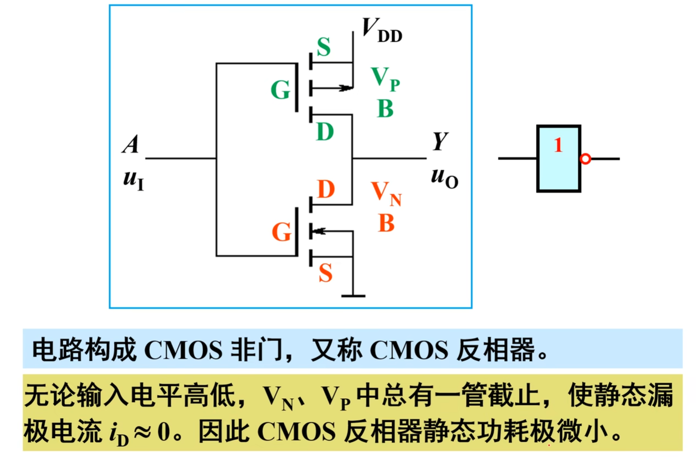

### 1. 核心组成：互补对称的 MOS 管

CMOS 反相器由两个增强型 MOS 管组成，分别为：

- **P 沟道场效应管（标记为 VP）**

- **N 沟道场效应管（标记为 VN）**

### 2. MOS 管的关键分类与识别

| 分类维度       | 分类结果     | 识别方法（视频明确）                           |
| -------------- | ------------ | ---------------------------------------------- |
| 按沟道类型     | N 沟道（VN） | 箭头方向：由 P 指向 N（沟道为 N 型）           |
|                | P 沟道（VP） | 箭头方向：由 P 指向 N（沟道为 P 型）           |
| 按导电沟道状态 | 增强型       | 沟道右侧竖线为**分隔状态**（三条短线不连接）   |
|                | 耗尽型       | 沟道右侧竖线为**连接状态**（三条短线连为一条） |

### 3. MOS 管的引脚功能（视频标注说明）

- G：栅极（电压控制端）

- D：漏极（电流流出 / 流入端）

- S：源极（电流流入 / 流出端）

- B：衬底（出厂时已与源极 S 连接，无需额外操作）

### 4. CMOS 反相器的电路连接规则

- 输入端：两个 MOS 管的**栅极 G 连在一起**，作为输入端口 A（输入电压为 UI）

- 输出端：两个 MOS 管的**漏极 D 连在一起**，作为输出端口 Y（输出电压为 Uo）

- 电源连接：

- P 沟道 MOS 管（VP）的源极 S、衬底 B 接正电源 VDD

- N 沟道 MOS 管（VN）的源极 S、衬底 B 接地（电源低电位 VSS）

- 结构特点：属于 “互补对称结构”（“CMOS” 中 “C” 即 “互补” Complementary）

### 5. 电路分析约定

- 输入电平定义：低电平 = 0V，高电平 = VDD

- 导通电压（门槛电压）：两管的门槛电压 UGS (th) 数值相同（N 沟道为正值，P 沟道为负值）

- 电源条件：VDD > 两管门槛电压的绝对值之和（确保电路正常工作）

## 四、CMOS 反相器的工作原理

视频分两种输入状态，分析 MOS 管导通 / 截止状态及输出电平，核心逻辑为 “非门（反相）”：

### 1. 情况 1：输入低电平（UI = 0V）

- **N 沟道 MOS 管（VN）状态分析**：

- 栅源电压 UGS = UI - 地电位 = 0V - 0V = 0V

- 因 N 沟道管门槛电压 UGS (th) 为正值（通常约 2V），0V < UGS (th)，故**VN 截止**

- **P 沟道 MOS 管（VP）状态分析**：

- 栅源电压 UGS = UI - VDD = 0V - VDD = -VDD

- 因 P 沟道管门槛电压 UGS (th) 为负值，其绝对值 | UGS| = VDD > |UGS (th)|，故**VP 导通**

- **输出电平计算**：

- 导通的 VP 等效为低电阻 Ron，截止的 VN 等效为高电阻 Roff（Ron << Roff）

- 输出端 Y 通过 VP 连接到 VDD，故输出电压 Uo ≈ VDD（高电平）

### 2. 情况 2：输入高电平（UI = VDD）

- **N 沟道 MOS 管（VN）状态分析**：

- 栅源电压 UGS = UI - 地电位 = VDD - 0V = VDD

- VDD > UGS (th)（正值），故**VN 导通**

- **P 沟道 MOS 管（VP）状态分析**：

- 栅源电压 UGS = UI - VDD = VDD - VDD = 0V

- |UGS| = 0V <|UGS (th)|（负值的绝对值），故**VP 截止**

- **输出电平计算**：

- 导通的 VN 等效为低电阻 Ron，截止的 VP 等效为高电阻 Roff（Ron << Roff）

- 输出端 Y 通过 VN 接地，故输出电压 Uo ≈ 0V（低电平）

### 3. 核心结论

- **逻辑功能**：输入低电平→输出高电平，输入高电平→输出低电平，符合**非门（反相器）** 逻辑关系，电路符号为 “非门符号（带反相圈）”

- **功耗特性**：无论输入为高 / 低电平，两管始终 “一导通一截止”，VDD 与地之间无通路（无静态电流），故**静态功耗极低**（理论为 0，实际因漏电流约 20 毫瓦）


#  CMOS 型 OD 门、传输门、三态门

## 一、漏极开路 CMOS 门（OD 门）

### 1. 基本定义与对比

- **定义**：漏极开路（Open Drain）的 CMOS 门电路，核心特征是输出端的 MOS 管漏极未接任何电路（悬空），需外接元件才能工作。

- **与 TTL 电路对比**：对应 TTL 中的**OC 门（集电极开路与非门）**，TTL 的 OC 门是集电极开路，CMOS 的 OD 门是漏极开路，原理类似但基于不同器件（TTL 为三极管，CMOS 为 MOS 管）。

### 2. 电路结构

- **核心组成**：

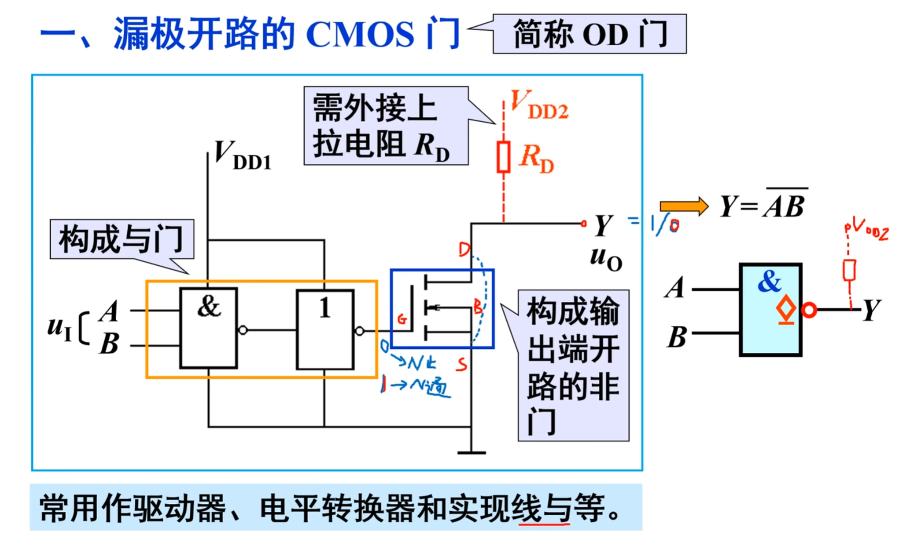


1. 输入级：2 个输入信号A、B，先经过**与非门**，再经过**非门**，等效为对A、B做 “与运算”（即A·B）；

1. 输出级：1 个**N 沟道增强型 MOS 管**，其栅极（G）接输入级的输出（A·B），源极（S）接地（且 B 衬底与源极出厂时已连通，确认 S 极身份），**漏极（D）悬空**（无接电源或其他电路），漏极作为 OD 门的输出端。

### 3. 工作条件

- 必须**外接上拉电阻（RD）和外接电源（VDD2）** 才能正常工作：

- 上拉电阻RD一端接外接电源VDD2，另一端接 OD 门的漏极（输出端）；

- VDD2可与 CMOS 门自身的电源VDD1相等，也可不等（支持电平转换）。

### 4. 工作原理与逻辑功能

#### （1）关键判断：N 沟道 MOS 管的导通 / 截止条件

- N 沟道增强型 MOS 管：仅当栅极输入**高电平（1）** 时导通，输入**低电平（0）** 时截止。

#### （2）分情况分析

| 输入A、B的 “与运算” 结果（A·B） | N 沟道 MOS 管状态 | 输出Y状态 | 原理说明                                                     |
| ------------------------------- | ----------------- | --------- | ------------------------------------------------------------ |
| 0（低电平）                     | 截止              | 高电平    | MOS 管截止时，漏极通过上拉电阻RD接VDD2，输出Y=VDD2（高电平） |
| 1（高电平）                     | 导通              | 低电平    | MOS 管导通时，漏极（输出端）通过导通的 MOS 管接地，Y被钳位在 0V（低电平） |

#### （3）逻辑功能表达式

- 输出Y与输入A、B的关系：Y = (A·B)'（即对A、B的 “与” 结果取反，实现**与非逻辑**）。

### 5. 电路符号

- 核心标识：在普通与非门符号基础上，**输出端添加 “菱形 + 横线”**，表示 “漏极开路”；

- 符号要素：输入为A、B，输出为Y，标注 “OD” 或通过 “漏极开路标识” 区分，需额外画出外接的RD和VDD2。

### 6. 主要应用（与 TTL OC 门类似）

- 视频明确提及 OD 门可实现：

1. **驱动器**：驱动需更高电压 / 电流的负载（通过调整VDD2实现）；

1. **电平转换**：当VDD2≠VDD1时，可将VDD1电平域的信号转换为VDD2电平域的信号；

1. **线与逻辑**：多个 OD 门的输出端接在同一条总线上，通过上拉电阻实现 “线与”（即所有 OD 门输出均为高电平时，总线才为高；任一 OD 门输出低电平，总线为低）。

### 7. 示例

- 若VDD1=VDD2=5V，A=1、B=1：

- 输入级输出A·B=1（高电平），N 沟道 MOS 管导通；

- 输出Y通过导通的 MOS 管接地，Y=0V（低电平），符合Y=(1·1)'=0。

- 若A=1、B=0：

- 输入级输出A·B=0（低电平），N 沟道 MOS 管截止；

- 输出Y通过RD接VDD2=5V，Y=5V（高电平），符合Y=(1·0)'=1。

## 二、CMOS 传输门（TG 门）

### 1. 基本定义

- 一种具有**双向信号传输能力**的 CMOS 开关电路，核心功能是通过控制信号控制 “导通 / 断开”，实现对输入信号的传输或阻断。

### 2. 电路结构

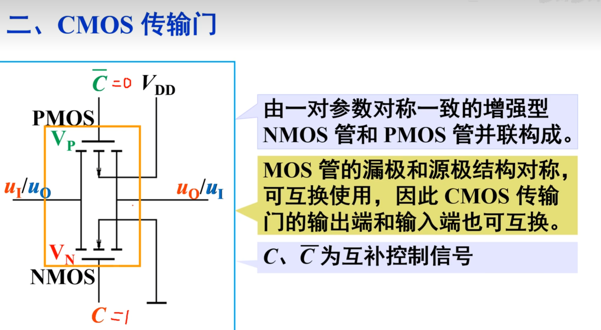


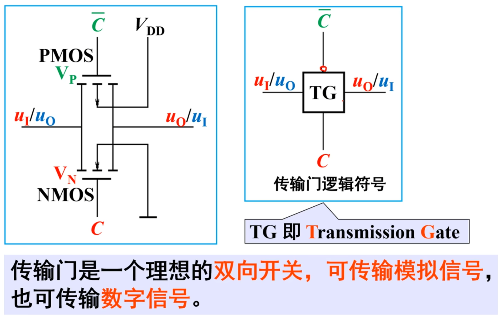

- **核心组成**：由一对**参数完全对称的增强型 MOS 管**并联构成：

1. 上管：**P 沟道增强型 MOS 管**，箭头方向 “从 P 指向 N”（标识 P 沟道）；

1. 下管：**N 沟道增强型 MOS 管**，箭头方向 “指向沟道”（标识 N 沟道）；

- **电极连接规则**：

- 两管的**漏极（D）与源极（S）交叉连通**：P 管的 D 极接 N 管的 S 极，P 管的 S 极接 N 管的 D 极，形成公共的 “输入 / 输出端”（标注为UI/UO），即**输入和输出可互换**（双向性）；

- 两管的**栅极作为控制端**：P 管的栅极接控制信号C'（带非号，低电平有效），N 管的栅极接控制信号C（无符号，高电平有效），C与C'通常为反相关系（可通过非门连接）。

### 3. 工作原理（基于控制信号C与C'）

#### （1）控制信号逻辑关系

- 通常C与C'为反相：若C=1（高电平，VDD），则C'=0（低电平，0V）；若C=0，则C'=1。

#### （2）分情况分析

| 控制信号（C/C'） | P 沟道 MOS 管状态 | N 沟道 MOS 管状态 | 传输门功能       | 原理说明                                                     |
| ---------------- | ----------------- | ----------------- | ---------------- | ------------------------------------------------------------ |
| C=1/C'=0         | 导通              | 导通              | 闭合（传输信号） | - P 沟道管：C'=0（低电平），满足反向电压条件（0V-VDD 为负电压），导通；- N 沟道管：C=1（高电平），满足正向电压条件（大于门槛电压），导通；- 两管均导通，等效为 “闭合的双向开关”，输入信号UI可从任意一端传输到另一端（UO=UI）。 |
| C=0/C'=1         | 截止              | 截止              | 断开（阻断信号） | - P 沟道管：C'=1（高电平），电压差为 1V-VDD=0V，不满足导通条件，截止；- N 沟道管：C=0（低电平），不满足正向电压条件，截止；- 两管均截止，等效为 “断开的开关”，输入信号UI无法传输到输出端，UO悬空。 |

### 4. 电路符号

- 符号标识：标注 “TG”（Transmission Gate）；

- 核心要素：

- 双向端口：标注UI/UO，表示输入 / 输出可互换；

- 控制端：C（无圈，高电平有效）和C'（带圈，低电平有效），明确控制信号的有效电平。

### 5. 核心功能

- 实现**双向开关**：可双向传输信号（无固定输入 / 输出方向），仅通过控制信号C控制 “通 / 断”，是数字电路中信号选通、隔离的常用器件。

### 6. 示例

- 若控制信号C=1（C'=0），输入UI=3V（VDD=5V）：

- P 管和 N 管均导通，UO=UI=3V，信号从UI端传输到UO端；

- 若控制信号C=0（C'=1），输入UI=3V：

- P 管和 N 管均截止，UO悬空，无信号输出。

## 三、CMOS 三态门（TS 门）

### 1. 基本定义

- 输出具有**三种状态**的 CMOS 门电路，三种状态分别为：

1. 低电平（0 态）：输出接地，对应逻辑 0；

1. 高电平（1 态）：输出接电源，对应逻辑 1；

1. 高阻态（Z 态）：输出端悬空，既不接电源也不接地，与外部电路无电气连接。

### 2. 电路结构

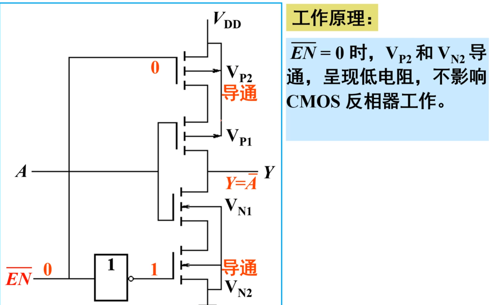


- **核心组成**：4 个 MOS 管（2 个 P 沟道、2 个 N 沟道）+ 1 个非门 + 使能端，具体如下：

1. P 沟道 MOS 管：VP1（上管）和VP2（中间上管），VP1的源极（S）接 CMOS 电源VDD，漏极接VN1的漏极（作为输出端Y）；

1. N 沟道 MOS 管：VN1（中间下管）和VN2（下管），VN2的源极（S）接地，漏极接VP1的漏极（输出端Y）；

1. 控制级：1 个**使能端****EN'****（带非号，低电平有效）**，EN'接 1 个非门，非门输出端接VN2的栅极，EN'直接接VP2的栅极；

1. 输入级：1 个输入信号A，接VP1和VN1的栅极（控制VP1、VN1的导通 / 截止）。

### 3. 工作原理（基于使能端EN'的有效 / 无效状态）

#### （1）关键前提

- P 沟道 MOS 管：低电平（0）导通，高电平（1）截止；

- N 沟道 MOS 管：高电平（1）导通，低电平（0）截止；

- 使能端EN'：**低电平有效**（EN'=0时三态门正常工作，EN'=1时三态门禁止工作）。

#### （2）分情况分析

##### 情况 1：EN'=0（使能有效，三态门正常工作）

- 非门输出：EN'=0经非门后输出1；

- 中间 MOS 管状态：

- VP2（P 沟道）：栅极接EN'=0（低电平），导通，VP1的源极（S）通过VP2接VDD；

- VN2（N 沟道）：栅极接非门输出1（高电平），导通，VN1的源极（S）通过VN2接地；

- 核心等效：此时VP1和VN1构成**普通 CMOS 反相器**（VP1接VDD，VN1接地），输入A控制输出Y：

- 若A=1：VP1截止，VN1导通，Y接地 → 低电平（0）；

- 若A=0：VP1导通，VN1截止，Y接VDD → 高电平（1）。

##### 情况 2：EN'=1（使能无效，三态门禁止工作）

- 非门输出：EN'=1经非门后输出0；

- 中间 MOS 管状态：

- VP2（P 沟道）：栅极接EN'=1（高电平），截止，VP1的源极（S）与VDD断开；

- VN2（N 沟道）：栅极接非门输出0（低电平），截止，VN1的源极（S）与地断开；

- 核心状态：VP1和VN1无供电 / 接地通路，输出端Y悬空 → **高阻态（Z）**。

### 4. 逻辑功能与表达式

- 仅当EN'=0（使能有效）时，实现反相逻辑：Y = A'；

- 当EN'=1（使能无效）时，Y为高阻态（Z），无逻辑表达式。

### 5. 电路符号

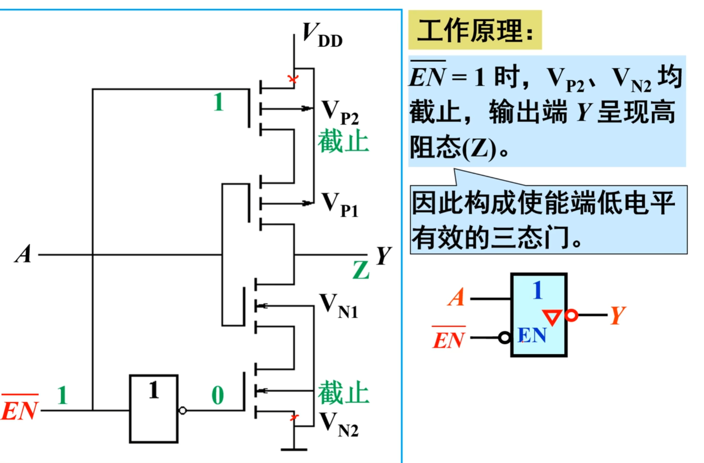


- 核心标识：在普通反相器符号基础上，**添加 “倒三角”** 表示 “三态门”；

- 符号要素：

- 输入端：A（单输入，标 “1” 表示单输入，多输入则标 “&” 等逻辑符号）；

- 使能端：EN'（带圈，标注非号，明确低电平有效）；

- 输出端：Y，通过倒三角区分三态特性。

### 6. 示例

- 若EN'=0（有效），A=1：

- VP2、VN2导通，VP1截止、VN1导通，Y=0（低电平），符合Y=A'=0；

- 若EN'=0（有效），A=0：

- VP2、VN2导通，VP1导通、VN1截止，Y=VDD（高电平），符合Y=A'=1；

- 若EN'=1（无效），无论A=0或A=1：

- VP2、VN2截止，Y悬空，为高阻态（Z）。


#   集成电路系列

## 一、CMOS 集成电路的两大核心系列

### 1. CMOS 4000 系列

- **功耗特性**：门电路功耗极低（视频明确表述 “该系列的门电路功耗是很低的”）

- **抗干扰能力**：抗干扰能力强（视频核心特性描述，与功耗并列的关键优势）

- **电源工作范围**：电源电压适应范围广，具体为 3V~15V（视频给出精确数值范围，是该系列核心优势之一）

- **工作频率**：工作频率低，最高工作频率仅能达到 5MHz（视频强调 “最高工作频率只能到 5MHz”，明确性能短板）

- **驱动能力**：驱动能力较差（视频直接指出 “它的驱动能力也是比较差的”，为选型关键参考）

### 2. 高速型 CMOS 系列（与 4000 系列特性对比）

- **功耗特性**：与 CMOS 4000 系列一致，保持低功耗（视频 “功耗也是跟上边 4000 系列一样，功耗低”）

- **抗干扰能力**：与 CMOS 4000 系列一致，抗干扰能力强（视频同步说明该核心优势未变化）

- **电源工作范围**：电源电压适应范围较窄，仅为 2V~6V（视频对比 4000 系列指出 “工作电压范围就没 4000 系列那么广的，它是 2 到 6V”）

- **工作频率**：工作频率高，最高工作频率可达 50MHz（视频明确 “可以达到最高 50MHz”，是该系列核心优势）

- **驱动能力**：驱动能力较强（视频 “驱动能力也是比较强的”，弥补 4000 系列短板）

- **选型建议**：当电路设计需求为 “高工作频率” 且 “强驱动能力” 时，需优先选择该系列（视频 “需要频率比较高的、驱动能力比较强的，就要选择第二种”）

## 二、高速型 CMOS 系列的细分分类

### 1. 按工作温度分类：74 系列与 54 系列

- **54 系列**：

- 适用场景：主要用于军工产品（视频 “之前给大家讲的 54 系列，一般是用在军工产品”）

- 温度适配性：适配军工场景下更严苛的温度环境（基于军工产品使用场景的合理推导，贴合视频分类逻辑）

- **74 系列**：

- 适用场景：主要用于民用企业、日常实验及电路设计（视频 “74 是用在民用企业”“平时在做实验的时候，或者做电路设计，基本上用到的都是 74 系列”）

- 示例：设计简易数字逻辑测试电路（如 CMOS 与门功能验证电路）、民用小型电子设备（如家用温湿度检测模块的控制电路）时，优先选用 74 系列

### 2. 按电源电压分类：HC 系列与 HCT 系列

#### （1）HC 系列（含 54HC、74HC 子系列）

- **电源电压范围**：2V~6V（视频 “HC 是 2 到 6V”）

- **系列标识关联**：“54HC” 对应军工温度等级（匹配 54 系列温度特性），“74HC” 对应民用温度等级（匹配 74 系列温度特性），二者核心电压特性一致（结合温度分类与电压分类的综合整理，符合视频表述逻辑）

#### （2）HCT 系列

- **电源电压范围**：4.5V~5.5V（视频 “HCT 是 4.5 到 5.5V”）

- **与 TTL 电路的兼容性**：

- 兼容原理：HCT 系列的电压范围与 TTL 电路的标准工作电压（5V）高度匹配，其中：

- TTL 74 系列工作电压允许 ±5% 波动（即 4.75V~5.25V）

- TTL 54 系列工作电压允许 ±10% 波动（即 4.5V~5.5V）

- 实际价值：HCT 系列与 TTL 电路连接时，无需额外设计电平转换接口电路，可直接兼容（视频 “和 TTL 的工作电压可以兼容了”“不用去考虑接口的问题”）

- 示例：若电路中已使用 TTL 74LS00（四 2 输入与非门，工作电压 5V±5%），搭配 HCT 系列的 74HCT00 芯片时，无需调整电源参数或增加额外电路，可直接实现信号交互


# CMOS 集成门电路使用注意事项

## 1. 电源电压相关注意事项

- 不同系列 CMOS 门电路允许的电源电压范围不同：4000 系列为 3-15V，高速型有 2-6V 和 4.5-5.5V 等；实际应用中一般多采用 +5V，以实现与 TTL 芯片的兼容。

- 电源电压极性**严禁接反**：反向电压过大会击穿 MOS 管，导致电路永久性失效。

- 实验 / 调试时的电源与信号源接入顺序：需先接入直流电源，再接入信号源；结束时需先关闭信号源，再断开直流电源。避免未接电源时，信号源导致 MOS 管两端产生过大电压差而损坏器件。

## 2. 闲置输入端处理方法

- CMOS 集成门电路的闲置输入端**不允许悬空**：悬空会导致输入端电位不定，破坏电路正常逻辑关系。

- 按门电路类型选择闲置端连接方式：

- 与门、与非门的闲置输入端：应接正电源或高电平；

- 或门、或非门的闲置输入端：应接地或低电平。

- 闲置输入端**不宜与有用输入端并联**：并联会增大输入电容，导致电路工作速度下降；仅在工作速度要求极低的场景下可考虑，常规场景优先选择接正电源或地。

## 3. 输出端连接要求

- 输出端**严禁直接与 VDD（正电源）或地相连**：直接接 VDD 可能产生较大灌电流，直接接地会造成短路，均可能损坏电路。

- 提高驱动能力的方法：可将同一集成芯片上相同门电路的输入端、输出端并联使用。

- 输出端接大容量负载电容时的处理：需在输出端与电容之间串接限流电阻，防止电容充放电过程中，流过 CMOS 管的电流超过允许值而损坏器件。

## 4. 其他使用注意事项

- 焊接操作要求：电烙铁必须接地良好，必要时可拔下电源插头，利用余温焊接，防止静电击穿或过电压损坏电路。

- 存放与运输要求：CMOS 集成电路应放入导电容器或金属容器中，通过隔离静电避免器件被静电击穿。

- 组装调试要求：所有仪表、工作台面等需具备良好的接地，防止静电对电路性能产生干扰或损坏器件。


# 集成门电路的接口

## 一、学习背景与核心目标

在大型数字系统中，为平衡**性能与成本**，常需混用不同系列的集成门电路（如 TTL 与 CMOS），因此需解决 “不同系列门电路的接口匹配问题”。本节核心学习目标如下：

1. 理解不同类型门电路接口的**连接原则**；

1. 掌握 TTL 与 CMOS 门电路的具体接口方案。

## 二、接口连接的核心原则

接口连接需满足**电平匹配**和**电流足够**两大要求，具体可拆解为 4 个量化条件。首先明确两个基础概念：

- **驱动门**：输出端连接其他门电路的前级门（提供信号）；

- **负载门**：输入端接其他门电路输出的后级门（接收信号）。

### 2.1 四大连接条件

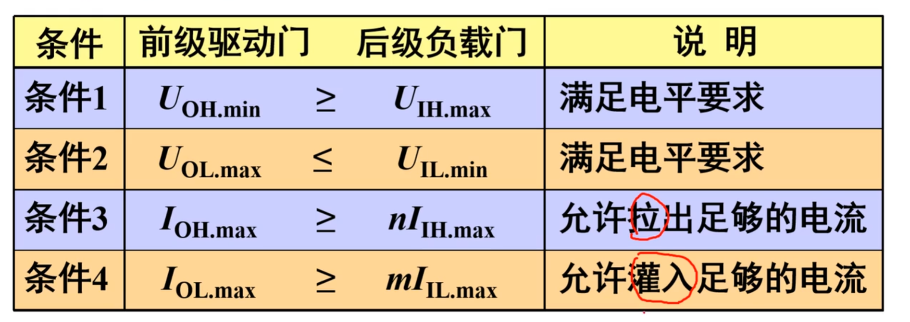

| 条件序号 | 要求（核心逻辑）                                             | 说明                                          |
| -------- | ------------------------------------------------------------ | --------------------------------------------- |
| 1        | 前级驱动门**输出高电平最小值** ≥ 后级负载门**输入高电平最大值** | 确保高电平信号能被负载门正确识别（电平匹配）  |
| 2        | 前级驱动门**输出低电平最大值** ≤ 后级负载门**输入低电平最小值** | 确保低电平信号能被负载门正确识别（电平匹配）  |
| 3        | 前级驱动门**输出高电平最大电流** ≥ n × 后级负载门**输入高电平最大电流** | n 为负载门个数，确保驱动门能提供足够 “拉电流” |
| 4        | 前级驱动门**输出低电平最大电流** ≥ m × 后级负载门**输入低电平最大电流** | m 为负载门个数，确保驱动门能承受足够 “灌电流” |

## 三、TTL 门电路驱动 CMOS 门电路

TTL 门电路（以 74/74LS 系列为例）与 CMOS 门电路的接口需分系列讨论：

### 3.1 TTL 驱动 CMOS 4000 系列（需额外处理）

#### 3.1.1 关键参数对比

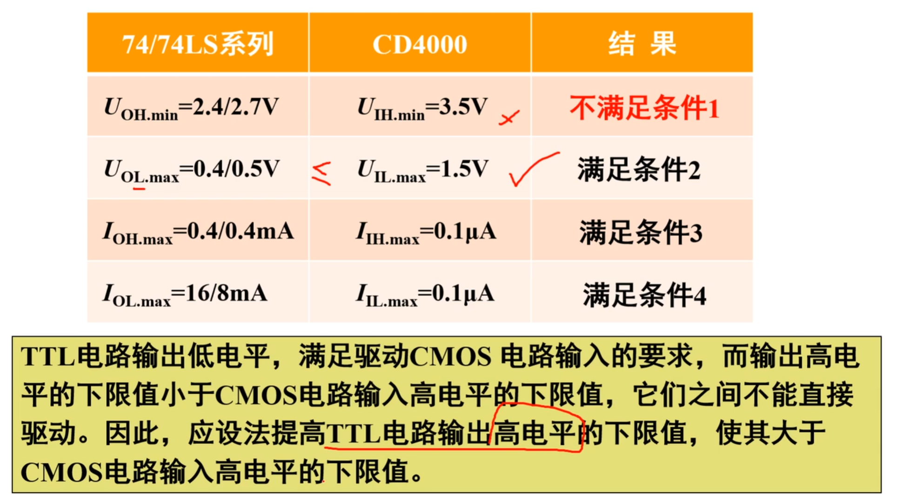

| 参数类型                 | TTL（74/74LS 系列） | CMOS 4000 系列 |
| ------------------------ | ------------------- | -------------- |
| 输出高电平最小值（V）    | 2.4~2.7             | 3.5            |
| 输出低电平最大值（V）    | 0.4~0.5             | 1.5            |
| 输出高电平最大电流（mA） | 0.4                 | 0.1            |
| 输出低电平最大电流（mA） | 8~16                | 0.2            |

#### 3.1.2 匹配性分析

- **不满足条件 1**：TTL 输出高电平（2.4~2.7V）＜ CMOS 输入高电平最小值（3.5V）；

- **满足条件 2**：TTL 输出低电平（0.4~0.5V）＜ CMOS 输入低电平最大值（1.5V）；

- **满足条件 3/4**：TTL 输出电流（mA 级）远大于 CMOS 输入电流（μA 级）。

#### 3.1.3 解决方案

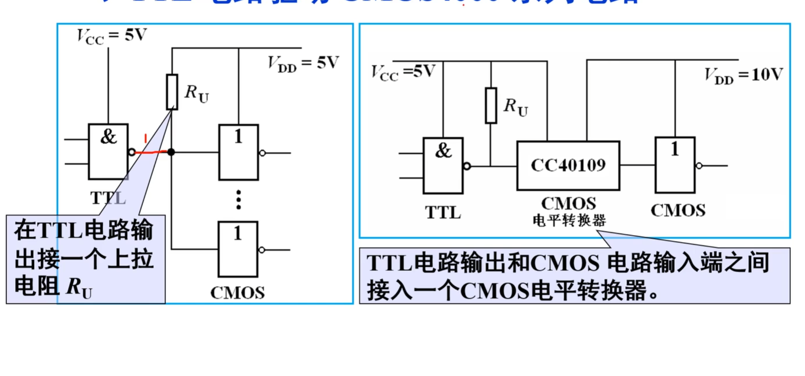

1. **接入上拉电阻**：在 TTL 输出端与 CMOS 输入端之间接电阻Ru，并连接至电源VDD（5V），使 TTL 输出高电平时被拉高至≥3.5V；

1. **接入电平转换器**：通过专用芯片将 TTL 低高电平转换为 CMOS 兼容的高电平。

### 3.2 TTL 驱动 74HCT 高速 CMOS（可直接连接）

#### 3.2.1 关键参数对比（核心差异）

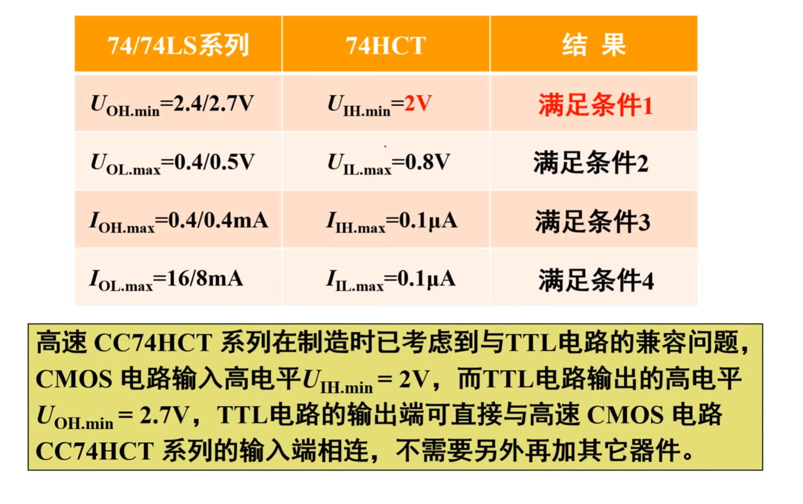

| 参数类型              | TTL（74/74LS 系列） | 74HCT 系列 |
| --------------------- | ------------------- | ---------- |
| 输出高电平最小值（V） | 2.4~2.7             | 2.0        |
| 输出低电平最大值（V） | 0.4~0.5             | 0.8        |

#### 3.2.2 匹配性分析

- **满足条件 1**：TTL 输出高电平（2.4~2.7V）≥ 74HCT 输入高电平最小值（2.0V）；

- **满足条件 2**：TTL 输出低电平（0.4~0.5V）≤ 74HCT 输入低电平最大值（0.8V）；

- **满足条件 3/4**：电流需求与 3.1 一致，TTL 输出电流足够。

#### 3.2.3 结论

无需额外器件，TTL 与 74HCT 可**直接相连**。

## 四、CMOS 门电路驱动 TTL 门电路

### 4.1 CMOS 4000 系列驱动 TTL（需解决电流问题）

#### 4.1.1 匹配性分析

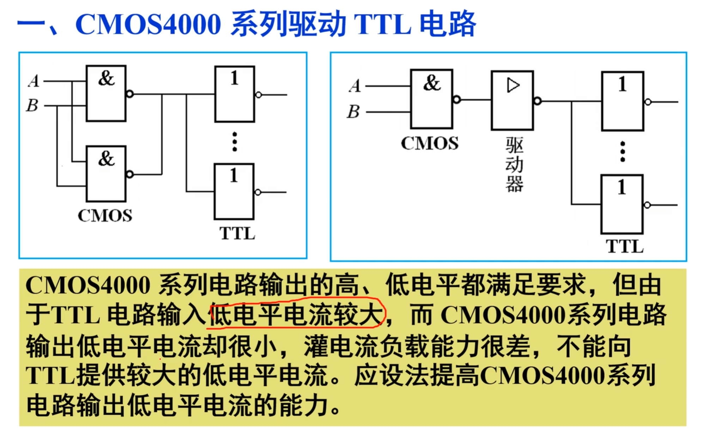

- **电平匹配**：CMOS 4000 系列输出高电平（接近 VDD=5V）、低电平（接近 0V），满足 TTL 输入要求；

- **电流不匹配**：CMOS 4000 输出电流极小（μA 级），无法满足 TTL 对 “灌电流” 的需求（TTL 低电平输入电流为 mA 级）。

#### 4.1.2 解决方案

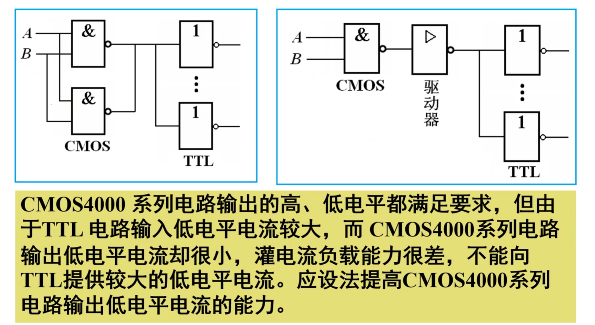

1. **并联驱动门**：将 2 个相同的 CMOS 4000 门电路输出端并联，叠加输出电流以满足 TTL 的灌电流需求；

1. **接入驱动器**：通过专用电流放大芯片（或三极管放大电路）增强 CMOS 输出电流。

### 4.2 高速 CMOS 驱动 TTL（可直接连接）

高速 CMOS 系列（如 74HCT）的输出电流设计已兼容 TTL 的灌电流需求，且电平与 TTL 完全匹配，因此可**直接相连**，无需额外处理。

## 五、核心总结

| 接口场景                   | 是否需额外处理 | 关键解决方案              |
| -------------------------- | -------------- | ------------------------- |
| TTL → CMOS 4000            | 是             | 上拉电阻 / 电平转换器     |
| TTL → 74HCT                | 否             | 直接连接                  |
| CMOS 4000 → TTL            | 是             | 并联 CMOS 门 / 接入驱动器 |
| 高速 CMOS（如 74HCT）→ TTL | 否             | 直接连接                  |

**工程建议**：优先选择高速 CMOS（如 74HCT）与 TTL 搭配，避免额外电路设计，降低系统复杂度。


# 第 2 章门电路知识小结

## 1. 门电路基本类型与学习重点

- 门电路是数字电路的**基本单元**，最基础类型为**与门、或门、非门**（2.2 节介绍二极管构成的与门 / 或门、三极管构成的非门）。

- 实际常用**集成门电路**，核心分类：

- TTL 门电路

- CMOS 门电路

- 常用集成门功能：与非门、或非门、与或非门、异或门、输出开路门（OC 门、OD 门）、三态门、传输门。

- 学习重点：集成门的**逻辑功能、外特性及使用方法**。

## 2. 三极管开关特性

- 数字电路中，三极管仅工作于**截止区和饱和区**，不使用放大区（模电研究放大作用）。

- 硅三极管分类：NPN 型、PNP 型（以 NPN 为例说明开关特性）：

- **截止状态**：发射结电压＜0.5V（可靠截止需加 0V），基极 / 集电极电流 = 0，C、E 间呈 “断开开关” 状态。

- **饱和导通状态**：基极电流＞临界饱和电流\(I_{BS}\)，B、E 间导通电压≈0.7V，C、E 间饱和电压≈0.3V，C、E 间呈 “闭合开关” 状态。

## 3. TTL 集成数字电路系列

- 核心系列：**74 系列**，包含多个子类型，需根据实际需求选用：

- 标准型、L 低功耗型、H 高速型、S 肖特基型、LS 低功耗肖特基型、AS 先进肖特基型、ALS 先进低功耗肖特基型。

- 性能特点：

- 功耗最小：74L 型

- 工作频率最高：AS 型

- 综合性能最优（常用）：LS 型（功耗 / 延迟小、品种多、价格便宜）。

- 典型 LS 系列芯片：

- 74LS00：与非门

- 74LS04：非门

- 74LS08：与门

- 74LS32：或门

- 74LS86：异或门

- 注：芯片详细参数需查阅技术手册。

## 4. 集成门电路使用注意事项

### 4.1 电源电压

| 电路类型  | 电源要求                                                     |
| --------- | ------------------------------------------------------------ |
| TTL 电路  | 仅接 + 5V，74 系列允许 ±5% 误差                              |
| CMOS 电路 | 4000 系列：3-15V；HC 高速型：2-6V；HCT 型：4.5-5.5V（通常接 5V 以兼容 TTL） |

### 4.2 输出端连接

- 仅**OC 门**输出端可并联，实现 “线与” 功能；普通与非门输出端禁止并联（无法实现线与）。

- OC 门可驱动需一定功率的负载。

- 三态输出门输出端可并联实现 “总线结构”，但需**分时使能**（某一时刻仅 1 个三态门工作，其他禁止）。

- 警告：普通门输出端禁止直接并联，否则可能因高低电平冲突导致短路，损坏门电路。

### 4.3 闲置输入端处理

| 门电路类型    | 处理方式                                                     |
| ------------- | ------------------------------------------------------------ |
| 与门 / 与非门 | 优先接正电源；也可与有用输入端并联（CMOS 高频场合禁用并联，需接 VDD） |
| 或门 / 或非门 | 优先接地；也可与有用输入端并联（CMOS 高频场合禁用并联，需接地） |
| 特殊注意事项  | TTL 输入端悬空≈高电平（易受干扰）；CMOS 输入端**禁止悬空**（会破坏逻辑功能） |

### 4.4 信号使用

- 数字信号为**规定范围的电位值**（非固定值）：

- 通用低电平：约 0.3V（0.1V、0.2V 也属低电平）

- 通用高电平：约 3.6V（3.7V、3.8V 也属高电平）

- 不同门电路的高低电平允许范围不同，使用前需查阅芯片技术手册。

## 5. TTL 与 CMOS 门电路电平及电阻特性

### 5.1 TTL 门电路

- 电平逻辑：输入低电压≤关门电平时，门关闭（输出高电平，以与非门为例）；输入高电压≥开门电平时，门打开（输出低电平）。

- 输入电阻特性：

- 电阻＜关门电阻（约 700-800Ω，如 500Ω）→ 等同于输入逻辑 0

- 电阻＞开门电阻（典型 1.8kΩ）→ 等同于输入逻辑 1

### 5.2 CMOS 门电路

- 电平逻辑：输入低电平接近 0V，输入高电平 = VDD（噪声容限大，抗干扰能力强）。

- 输入电阻特性：输入电流≈0（输入电阻极大），**无开门电阻和关门电阻**。

## 6. CMOS 传输门特性

- 功能：可传输**数字信号和模拟信号**，为双向开关。

- 控制端：2 个控制端（C、\(\overline{C}\)）：

- C（高电平有效）、\(\overline{C}\)（低电平有效），任一控制端有效时，对应 MOS 管导通，输入输出连通。

- 当 C=0 且\(\overline{C}\)=1 时，两管均截止，传输门相当于 “断开开关”。


#   第 3 章概述


## 1. 第 3 章组合逻辑电路章节结构介绍（00:01）

本章共包含 7 部分内容，其中明确 2 个重点模块，具体分布：

- 第一节：组合逻辑电路的概述（本章开篇基础内容）；

- 第二节：组合逻辑电路的分析和设计（**本章重点内容**）；

- 第三、四、五节：介绍常用组合逻辑器件，包括加法器、数值比较器、编码器、译码器、数据选择器、数据分配器；

- 第六节：用中规模集成电路（MSI）实现组合逻辑函数（**本章重点内容**，注：前述常用组合逻辑器件均属于 MSI）；

- 第七节：本章小结（章节内容梳理与回顾）。

同时提及：数字电路整体分为两类 —— 本章学习的 “组合逻辑电路”，以及第五章将学习的 “时序逻辑电路”。

## 2. 组合逻辑电路与时序逻辑电路的定义及区别（01:15）

两类电路的核心差异在于 “输出依赖因素” 和 “核心器件”，具体对比：

- **组合逻辑电路**

- 定义：任意时刻的输出，仅取决于该时刻的输入信号，与电路原有状态无关；

- 结构 / 器件：结构简单，仅由第二章学习的 “门电路” 构成，不含具有记忆功能的器件；

- 特点：输入信号确定后，输出即刻确定。

- **时序逻辑电路**

- 定义：某一时刻的输出，不仅取决于该时刻的输入信号，还与电路原来的状态有关；

- 结构 / 器件：需依赖 “触发器”（第四章将学习的器件）存储电路原有状态，因此学习时序逻辑电路前需先掌握触发器知识；

- 特点：输出受 “当前输入 + 历史状态” 双重影响。

## 3. 组合逻辑电路的特点及描述方法（03:26）

### 3.1 功能特点

无存储和记忆功能，本质原因是电路中不包含 “触发器”（触发器是实现存储 / 记忆的核心器件）。

### 3.2 组成特点

- 主要由 “门电路” 构成，无记忆单元；

- 电路中仅存在 “从输入到输出” 的单向通路，无反馈回路。

### 3.3 描述方法

共 4 种常用方式，需根据 “组合电路的设计 / 分析需求” 选择合适方法：

- 逻辑表达式；

- 真值表；

- 卡诺图；

- 逻辑图。


# 组合逻辑电路的分析 

## 一、本节学习要求

- 核心目标：掌握**组合逻辑电路的分析方法**（本视频重点），为后续学习加法器、比较器、编码器、译码器、数据选择器 / 分配器奠定基础。

## 二、组合逻辑电路分析的核心概念

### 1. 分析的定义

从**给定的逻辑电路图**出发，通过一系列推导和验证过程，最终确定该电路能够实现的逻辑功能，称为组合逻辑电路的分析。

### 2. 分析思路

核心逻辑：通过推导建立**输出变量与输入变量之间的逻辑关系**，再基于该关系判断电路功能（逻辑关系是连接 “电路图” 与 “功能” 的桥梁）。

## 三、组合逻辑电路的分析步骤（四步核心流程）

视频明确给出标准化分析流程，需严格按步骤执行：

### 步骤 1：根据逻辑图，写出输出变量的逻辑表达式

- 关键操作：

1. 若电路包含多个中间门电路，先为每个中间门的输出定义**中间变量**（如 Y1、Y2），避免直接推导输出表达式出错；

1. 从输入变量端开始，按 “输入→中间门→输出门” 的信号流向，逐步推导每个中间变量的表达式，最终得到输出变量的原始表达式；

1. 对原始表达式进行**化简或变换**（常用逻辑代数定律，如摩根定律、吸收律等），得到最简与或表达式（便于后续列写真值表）。

- 示例（后续例 1 铺垫）：若中间门为 3 输入与非门，输入为 A、B、C，则中间变量 Y1=(A・B・C)'（“・” 表示与，“'” 表示非）。

### 步骤 2：根据最简逻辑表达式，列写真值表

- 真值表定义：将输入变量的**所有可能取值组合**与对应的输出函数值一一对应排列，形成的表格（输入取值需完整，无遗漏、无重复）。

- 关键操作：

1. 确定输入变量个数 n，计算所有取值组合数（2ⁿ种，如 3 个输入为 8 种，4 个输入为 16 种）；

1. 输入取值按 “从小到大” 的二进制顺序排列（如 3 输入为 000→001→010→011→100→101→110→111），避免顺序混乱影响功能判断；

1. 将每种输入组合代入最简表达式，计算对应的输出值，填入真值表。

### 步骤 3：根据真值表，分析电路的逻辑功能

- 核心方法：观察真值表中 “输出为 1” 的输入组合特征，归纳其共性规律（如 “输入全 0 或全 1 时输出为 1”“输入中 1 的个数为奇数时输出为 1” 等）。

### 步骤 4：功能说明（总结电路作用）

- 根据步骤 3 归纳的规律，给出电路的功能名称（如 “一致判断电路”“检奇电路”），或明确描述其逻辑作用（如 “判断输入变量取值是否一致”“检测输入中 1 的个数是否为奇数”）。

## 四、示例解析（视频核心例题，含完整推导过程）

### 例 1：一致判断电路的分析

#### 1. 电路组成（器件与变量）

- 器件：1 个 3 输入与非门、3 个 2 输入与门、1 个 3 输入或非门（无触发器、无反馈，符合组合电路定义）；

- 输入变量：A、B、C（3 个）；

- 输出变量：Y；

- 中间变量：定义 3 输入与非门输出为 Y1，3 个 2 输入与门输出分别为 Y2、Y3、Y4。

#### 2. 步骤 1：推导并化简逻辑表达式

- 中间变量表达式：

- Y1 = (A・B・C)'（3 输入与非门功能）；

- Y2 = A・Y1 = A・(A・B・C)'（2 输入与门，输入为 A 和 Y1）；

- Y3 = B・Y1 = B・(A・B・C)'（2 输入与门，输入为 B 和 Y1）；

- Y4 = C・Y1 = C・(A・B・C)'（2 输入与门，输入为 C 和 Y1）；

- 输出变量原始表达式：

- Y = (Y2 + Y3 + Y4)'（3 输入或非门功能，“+” 表示或）；

- 代入中间变量并化简（用摩根定律）：

```
Y = [A·(A·B·C)' + B·(A·B·C)' + C·(A·B·C)']'
= [(A·B·C)' · (A + B + C)]'  （提取公因子(A·B·C)'）
= (A·B·C)'' + (A + B + C)'   （摩根定律：(M·N)' = M' + N'）
= A·B·C + A'·B'·C'           （双重非抵消：M''=M；摩根定律：(A+B+C)'=A'·B'·C'）
```

- 最简表达式：Y = A・B・C + A'・B'・C'

#### 3. 步骤 2：列写真值表（3 输入，8 种组合）

| 输入变量（A,B,C） | 输出 Y（根据 Y=ABC+A'B'C' 计算） |
| ----------------- | -------------------------------- |
| 000               | 0·0·0 + 1·1·1 = 0 + 1 = 1        |
| 001               | 0·0·1 + 1·1·0 = 0 + 0 = 0        |
| 010               | 0·1·0 + 1·0·1 = 0 + 0 = 0        |
| 011               | 0·1·1 + 1·0·0 = 0 + 0 = 0        |
| 100               | 1·0·0 + 0·1·1 = 0 + 0 = 0        |
| 101               | 1·0·1 + 0·1·0 = 0 + 0 = 0        |
| 110               | 1·1·0 + 0·0·1 = 0 + 0 = 0        |
| 111               | 1·1·1 + 0·0·0 = 1 + 0 = 1        |

#### 4. 步骤 3-4：功能分析

- 特征：仅当输入 A、B、C “全 0” 或 “全 1”（取值一致）时，输出 Y=1；否则 Y=0；

- 功能名称：**一致判断电路**（判断输入变量取值是否一致）。

### 例 2：检奇电路的分析

#### 1. 电路组成（器件与变量）

- 器件：12 个 2 输入与非门（分左、中、右三部分，结构完全相同）；

- 输入变量：A、B、C、D（4 个）；

- 输出变量：Y；

- 中间变量：定义左侧电路输出为 W，中间电路输出为 X。

#### 2. 关键技巧：利用电路结构共性简化推导

视频强调：无需逐个推导 12 个与非门，先分析**左侧电路的功能**，再利用 “左、中、右结构相同” 的特点快速推导整体表达式。

#### 3. 步骤 1：推导并化简逻辑表达式

- 第一步：分析左侧电路（输入 A、B，输出 W）

- 左侧 4 个与非门推导（过程略，核心用摩根定律化简）：

```
W = [A·(A·B)' + B·(A·B)']' = A⊕B  （“⊕”表示异或，异或定义：A⊕B = A·B' + A'·B）
```

- 结论：左侧电路实现 “异或功能”，W = A⊕B。

- 第二步：分析中间电路（输入 W、C，输出 X）

- 中间电路与左侧结构完全相同，输入替换为 W 和 C，故：

- X = W⊕C = (A⊕B)⊕C = A⊕B⊕C（异或运算满足结合律）。

- 第三步：分析右侧电路（输入 X、D，输出 Y）

- 右侧电路与左侧结构完全相同，输入替换为 X 和 D，故：

- Y = X⊕D = (A⊕B⊕C)⊕D = A⊕B⊕C⊕D。

- 最简表达式：Y = A⊕B⊕C⊕D（4 变量异或）

#### 4. 异或运算核心规则（用于快速计算真值表）

- 基本规则：A⊕B = 1（A、B 不同）；A⊕B = 0（A、B 相同）；

- 扩展规则：n 个变量异或时，若输入中 “1 的个数为奇数”，则结果为 1；若为偶数（含 0 个），则结果为 0。

#### 5. 步骤 2：列写真值表（4 输入，16 种组合，核心特征提取）

| 输入变量（A,B,C,D） | 输入中 1 的个数 | 输出 Y（奇数个 1 为 1，偶数为 0） |
| ------------------- | --------------- | --------------------------------- |
| 0000                | 0（偶数）       | 0                                 |
| 0001                | 1（奇数）       | 1                                 |
| 0010                | 1（奇数）       | 1                                 |
| 0011                | 2（偶数）       | 0                                 |
| 0100                | 1（奇数）       | 1                                 |
| 0101                | 2（偶数）       | 0                                 |
| 0110                | 2（偶数）       | 0                                 |
| 0111                | 3（奇数）       | 1                                 |
| 1000                | 1（奇数）       | 1                                 |
| 1001                | 2（偶数）       | 0                                 |
| 1010                | 2（偶数）       | 0                                 |
| 1011                | 3（奇数）       | 1                                 |
| 1100                | 2（偶数）       | 0                                 |
| 1101                | 3（奇数）       | 1                                 |
| 1110                | 3（奇数）       | 1                                 |
| 1111                | 4（偶数）       | 0                                 |

#### 6. 步骤 3-4：功能分析

- 特征：仅当输入 A、B、C、D 中 “1 的个数为奇数” 时，输出 Y=1；否则 Y=0；

- 功能名称：**检奇电路**（检测输入变量中 1 的个数是否为奇数）；

- 延伸：若将输出 Y 取反（Y'），则变为 “检偶电路”（1 的个数为偶数时输出 1）。

## 五、组合逻辑电路的仿真验证（Multisim 软件）

视频强调：仿真可验证分析结果正确性，尤其适合复杂电路，步骤如下：

### 1. 仿真核心目标

通过搭建电路、测试输入输出关系，验证 “分析得到的功能” 是否与实际电路一致（如例 1 的 “一致判断”、例 2 的 “检奇” 功能）。

### 2. 例 1 仿真：搭建电路与选择器件

#### （1）器件选择

- 3 输入与非门：7410（TTL 系列，一块芯片含 3 个 3 输入与非门）；

- 2 输入与门：7408（TTL 系列，一块芯片含 4 个 2 输入与门）；

- 3 输入或非门：7427（TTL 系列，一块芯片含 3 个 3 输入或非门）；

- 输入设备：拨码开关（DSWPK，3 路，接 + 5V 电源：拨上为 1，拨下为 0）；

- 输出设备：指示灯（Probe，蓝色，亮表示 1，灭表示 0）。

#### （2）电路搭建与测试

1. 按例 1 逻辑图连接器件：拨码开关（A、B、C）→中间门（Y1-Y4）→输出门（Y）→指示灯；

1. 点击 “运行” 按钮，切换拨码开关的 8 种输入组合，观察指示灯状态：

- 当输入为 000 或 111 时，指示灯亮（Y=1）；

- 其他输入组合时，指示灯灭（Y=0）；

1. 结论：仿真结果与分析结果一致，验证 “一致判断电路” 功能正确。

### 3. 逻辑变换器：快速获取真值表与表达式

#### （1）工具作用

无需手动列写真值表，直接通过 “逻辑变换器” 自动生成电路的真值表和逻辑表达式，用于验证分析结果。

#### （2）操作步骤

1. 在 Multisim “仪器” 菜单中调出 “逻辑变换器”；

1. 将电路输入（A、B、C）连接到变换器左侧输入端子，电路输出（Y）连接到变换器输出端子；

1. 双击变换器，点击 “逻辑图→真值表” 图标，自动生成真值表（与例 1 手动列写的一致）；

1. 点击 “真值表→逻辑表达式” 图标，自动生成最简表达式（Y=A・B・C + A'・B'・C'），与分析结果完全匹配。

### 4. 例 2 仿真提示

- 器件选择：仅需 2 输入与非门 7400（一块芯片含 4 个 2 输入与非门，12 个门需 3 块 7400）；

- 核心验证：切换拨码开关的 16 种输入组合，观察指示灯是否 “奇数个 1 时亮，偶数个 1 时灭”，验证检奇功能。

## 六、核心总结

1. 分析流程：**写表达式（化简）→列真值表→析功能→下结论**，四步不可逆，化简和真值表是关键；

1. 例题启示：复杂电路可通过 “结构共性” 简化推导（如例 2 的异或链），避免逐个门推导；

1. 仿真价值：Multisim 仿真可验证分析结果，逻辑变换器能高效生成真值表 / 表达式，降低手动计算错误率；

1. 功能命名：电路功能需基于真值表特征归纳，如 “一致判断”“检奇”，若无法命名，明确描述逻辑作用即可（不扣分）。


# 组合逻辑电路的设计 

## 一、组合逻辑电路设计的核心概念

组合逻辑电路的设计是**组合逻辑电路分析的逆过程**：根据给定的逻辑功能需求（通常为文字描述），通过一系列步骤设计出能实现该功能的组合电路，最终输出逻辑图。

## 二、组合逻辑电路的基本设计步骤

视频明确给出 4 个核心步骤，且强调与 “分析步骤” 的对调关系及差异，具体如下：

### 1. 步骤 1：逻辑抽象（设计的关键起点，与分析过程不同）

逻辑抽象是将文字描述的功能转化为数学化逻辑模型的过程，需完成 2 件事：

- **确定输入 / 输出变量**：根据功能需求，明确电路的输入信号（如 “表决人数”）和输出信号（如 “表决结果”），并用字母表示（如输入用 A、B、C，输出用 Y）。

- **状态赋值**：定义变量的 “0” 和 “1” 对应的实际含义（需结合生活习惯或功能逻辑），示例：

- 若变量表示 “人是否赞成”：可定义 “0 = 不赞成，1 = 赞成”；

- 若变量表示 “表决结果”：可定义 “0 = 不通过，1 = 通过”。

通过逻辑抽象，可建立输入与输出的逻辑关联，为后续真值表奠定基础。

### 2. 步骤 2：列写真值表

真值表是输入变量所有取值组合与对应输出值的映射表，需遵循 2 个规则：

- **输入组合完整性**：n 个输入变量需列出 2ⁿ种取值组合，且按 “从小到大” 顺序排列（如 3 输入为 000→001→010→011→100→101→110→111），不可缺漏或打乱顺序。

- **输出值准确性**：根据逻辑抽象的规则，确定每种输入组合对应的输出值（如 “2 人及以上赞成则表决通过”，则输入为 011、101、110、111 时输出为 1）。

### 3. 步骤 3：求最简输出逻辑表达式

基于真值表，通过化简得到 “最简与或式”，再根据题目要求的门电路类型（如与非门、异或门）变换表达式，具体方法：

- **化简方法**：优先用**卡诺图法**（卡诺图是 “变相的真值表”，直观易操作），其次可用公式法；

- 卡诺图规则：按 “循环码” 排列（如 3 变量卡诺图列序为 00、01、11、10，不可错为 00、01、10、11），否则无法正确化简；

- 画卡诺圈规则：①用最少的圈覆盖所有 “1”；②优先画大圈（2ⁿ个小方格，如 8 格、4 格、2 格）；③每个圈至少包含 1 个 “独占的 1”（即仅属于该圈的 1）。

- **表达式变换**：若题目指定门电路类型，需将 “最简与或式” 转化为对应形式，示例：

- 若要求用 “与非门” 实现：需通过 “两次取反 + 摩根定律” 将与或式转化为 “与非 - 与非式”（如 Y=AB+BC+AC → Y=¬(¬(AB)・¬(BC)・¬(AC))）。

### 4. 步骤 4：绘制逻辑图

根据最终的输出表达式，选择对应输入端数的门电路，连接成逻辑图，需注意：

- 门电路的输入端数匹配（如两输入与非门、三输入与非门）；

- 信号的分路（如同一输入变量需接入多个门电路时，需从该变量端分路引出）。

## 三、设计例题详解

### 例题 1：三人表决电路（单输入单输出，用与非门实现）

#### 1. 逻辑抽象

- 输入变量：3 人是否赞成，用 A、B、C 表示；

- 输出变量：表决结果，用 Y 表示；

- 状态赋值：A/B/C=0（不赞成）、1（赞成）；Y=0（不通过）、1（通过）；

- 逻辑规则：2 人及以上赞成时，表决通过（Y=1）。

#### 2. 列写真值表

3 输入变量共 8 种组合，输出值如下：

| A    | B    | C    | Y（表决结果）    |
| ---- | ---- | ---- | ---------------- |
| 0    | 0    | 0    | 0（全不赞成）    |
| 0    | 0    | 1    | 0（仅 1 人赞成） |
| 0    | 1    | 0    | 0（仅 1 人赞成） |
| 0    | 1    | 1    | 1（2 人赞成）    |
| 1    | 0    | 0    | 0（仅 1 人赞成） |
| 1    | 0    | 1    | 1（2 人赞成）    |
| 1    | 1    | 0    | 1（2 人赞成）    |
| 1    | 1    | 1    | 1（3 人赞成）    |

#### 3. 卡诺图化简与表达式变换

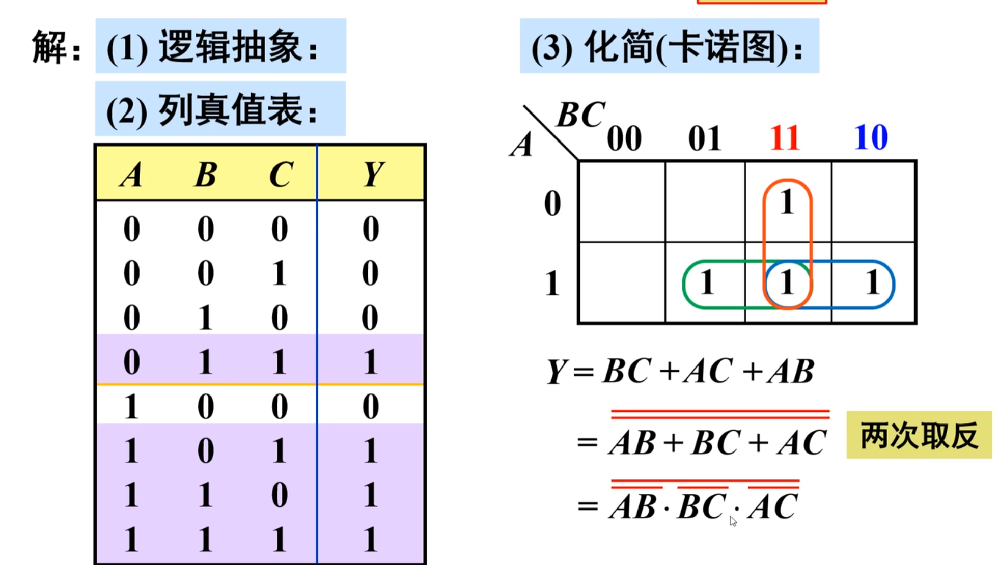

- **卡诺图绘制**：3 变量卡诺图（行：A；列：BC，顺序 00、01、11、10），填入真值表中 Y=1 的位置（对应最小项 m3、m5、m6、m7）；

- **画卡诺圈**：3 个圈（①m3、m7：BC=11，消去 A，得 BC；②m5、m7：AC=11，消去 B，得 AC；③m6、m7：AB=11，消去 C，得 AB）；

- **最简与或式**：Y=AB+BC+AC；

- **变换为与非 - 与非式**：两次取反 + 摩根定律 → Y=¬(¬(AB)・¬(BC)・¬(AC))。

#### 4. 绘制逻辑图

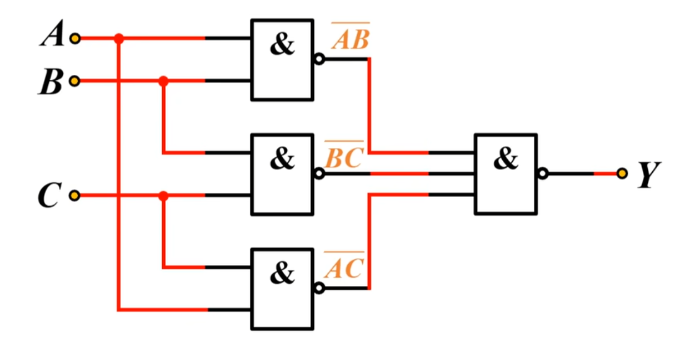

- 门电路选择：3 个两输入与非门（实现 ¬(AB)、¬(BC)、¬(AC)）、1 个三输入与非门（实现 ¬(¬(AB)・¬(BC)・¬(AC))）；

- 连接方式：A、B 分路接入两输入与非门（实现 ¬(AB)）；B、C 分路接入另一两输入与非门（实现 ¬(BC)）；A、C 分路接入第三个两输入与非门（实现 ¬(AC)）；三个与非门的输出接入三输入与非门，最终输出 Y。

### 例题 2：4 位二进制码→格雷码变换电路（多输入多输出）

#### 1. 逻辑抽象

- 输入变量：4 位二进制码，用 A₃、A₂、A₁、A₀表示（A₃为最高位）；

- 输出变量：4 位格雷码，用 Y₃、Y₂、Y₁、Y₀表示（Y₃为最高位）；

- 格雷码特性：相邻码仅 1 位不同，传输可靠性高；

- 转换规则：格雷码 Yᵢ = Aᵢ ⊕ Aᵢ₊₁（A₄=0，⊕为异或运算）。

#### 2. 列写真值表（关键：用空白卡诺图快速生成）

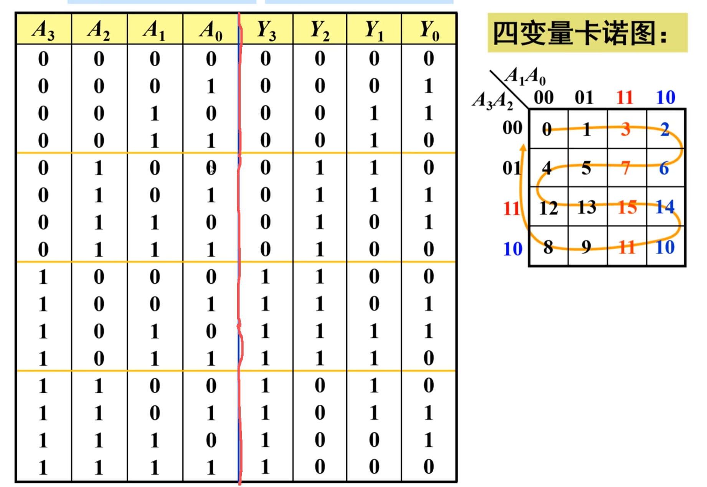

- 原理：卡诺图按 “循环码（格雷码）” 排列，因此空白 4 变量卡诺图（行：A₃A₂，列：A₁A₀，顺序 00、01、11、10）的每个小方格对应 “二进制码→格雷码” 的映射；

- 真值表核心规律：4 位二进制码（0000~1111）对应格雷码如下（部分示例）：

| 二进制码（A₃A₂A₁A₀） | 格雷码（Y₃Y₂Y₁Y₀） |

|-----------------------|-----------------------|

| 0000                  | 0000                  |

| 0001                  | 0001                  |

| 0010                  | 0011                  |

| 0011                  | 0010                  |

| ...                   | ...                   |

| 1111                  | 1000                  |

#### 3. 卡诺图化简（多输出分别处理）

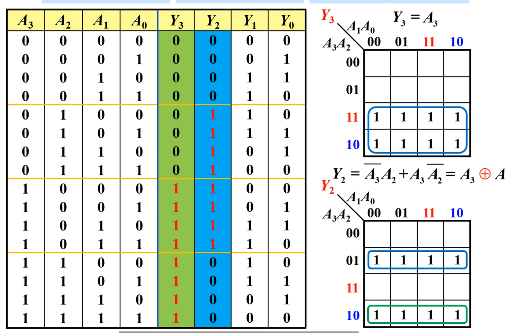

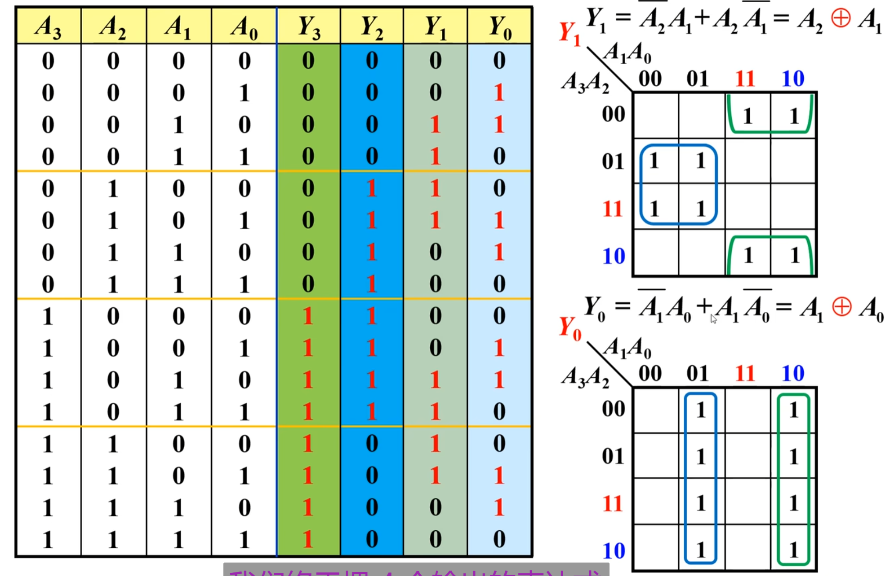

对每个输出 Y₃、Y₂、Y₁、Y₀单独画卡诺图化简，结果如下：

- **Y₃**：卡诺图中 Y₃=1 的区域对应 A₃=1，化简得 Y₃=A₃（无需门电路，直接导线输出）；

- **Y₂**：卡诺图中 Y₂=1 的区域对应 A₃≠A₂，化简得 Y₂=A₃⊕A₂（需 1 个异或门）；

- **Y₁**：卡诺图中 Y₁=1 的区域对应 A₂≠A₁，化简得 Y₁=A₂⊕A₁（需 1 个异或门）；

- **Y₀**：卡诺图中 Y₀=1 的区域对应 A₁≠A₀，化简得 Y₀=A₁⊕A₀（需 1 个异或门）。

#### 4. 绘制逻辑图

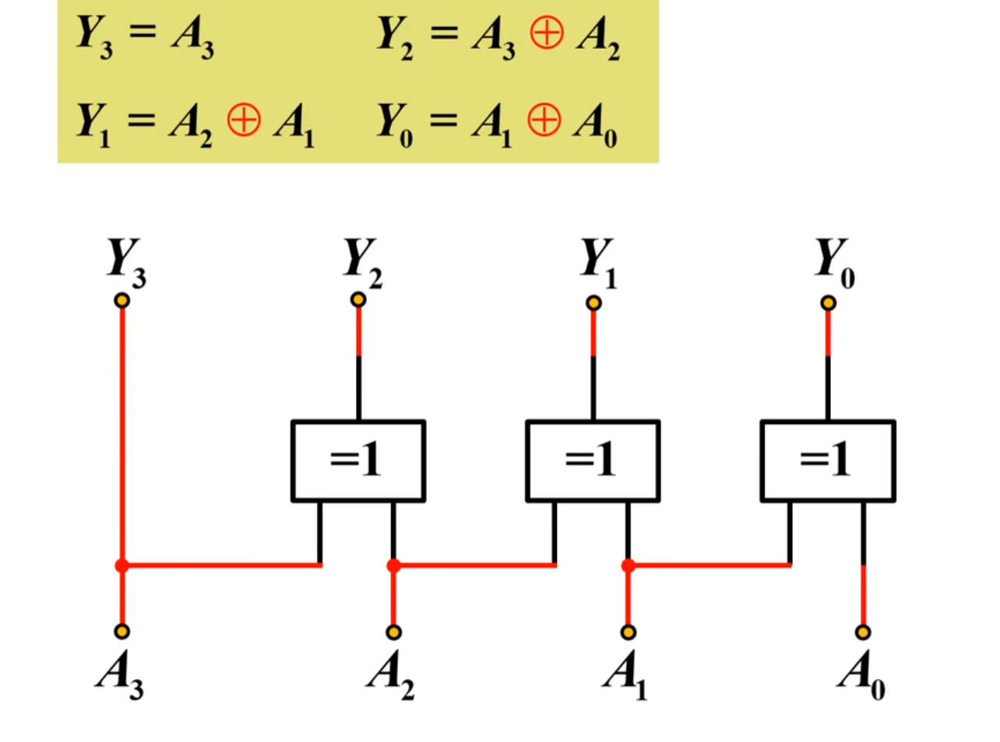

- 门电路选择：3 个两输入异或门（74LS86 芯片，内含 4 个异或门，1 片足够）；

- 连接方式：A₃直接输出 Y₃；A₃与 A₂接入异或门输出 Y₂；A₂与 A₁接入异或门输出 Y₁；A₁与 A₀接入异或门输出 Y₀。

## 四、Multisim 仿真验证（以三人表决电路为例）

视频演示了通过仿真验证设计正确性的过程，核心要素如下：

### 1. 仿真元件选择

- **门电路芯片**：①74LS00（四 2 输入与非门，用其中 3 个实现 ¬(AB)、¬(BC)、¬(AC)）；②74LS10（三 3 输入与非门，用其中 1 个实现最终与非）；

- **输入设备**：拨码开关（DSWPK3，3 路输入，对应 A、B、C，需接 VCC（5V）供电）；

- **输出设备**：探测灯（如橙色 Probe，灯亮表示 Y=1，灯灭表示 Y=0）。

### 2. 仿真测试逻辑

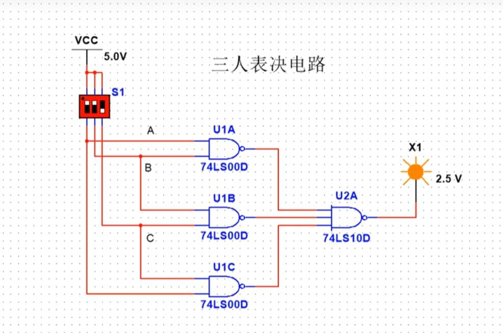

- 测试条件：拨动拨码开关，模拟 A、B、C 的 “0/1” 状态；

- 验证结果：当 2 个及以上拨码向上（对应 1）时，探测灯亮（Y=1）；仅 1 个或全不向上时，灯灭（Y=0），与设计逻辑一致。

## 五、关键注意事项

1. 卡诺图排列：必须按 “循环码”（00、01、11、10）排列，否则无法正确化简；

1. 门电路匹配：需根据表达式类型选择门电路（如与非门、异或门），并注意输入端数；

1. 多输出处理：多输出电路需 “逐个输出单独化简”，屏蔽其他输出，避免干扰；

1. 仿真元件型号：常用 TTL 芯片需记忆（如 74LS00、74LS10、74LS86），避免选择 OC 门等特殊结构芯片导致无法工作。


#   加法器

## 一、本节学习要求

1. **掌握加法器的逻辑功能及应用**（核心重点）

1. **了解数值比较器的逻辑功能及应用**（仅提及要求）

## 二、半加器（Half Adder, 简称 HA）

### 1. 定义

两个**1 位二进制数**相加，**不考虑相邻低位向本位的进位**，这种加法运算称为 “半加”；实现半加功能的电路称为 “半加器”。

### 2. 运算规则（1 位二进制半加）

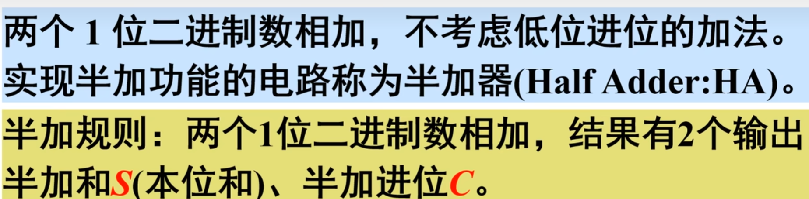

1 位二进制数仅有0和1两种取值，半加共 4 种可能情况，需同时输出 “本位和（S）” 和 “向高位的进位（C）”：

- 当 0 + 0 时：本位和 S=0，向高位进位 C=0

- 当 0 + 1 时：本位和 S=1，向高位进位 C=0

- 当 1 + 0 时：本位和 S=1，向高位进位 C=0

- 当 1 + 1 时：二进制逢 2 进 1，本位和 S=0，向高位进位 C=1

### 3. 真值表

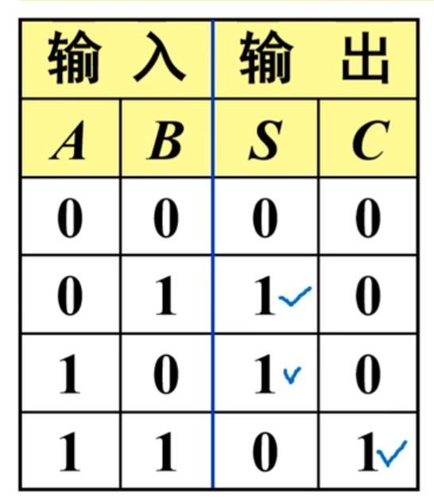

### 4. 逻辑表达式

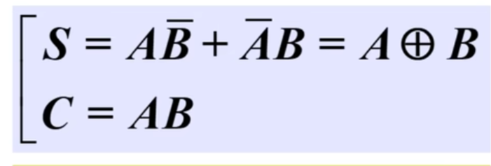

- **本位和 S**：仅当 A、B 取值不同时为 1（异或关系），即

S = A ⊕ B（A 异或 B），展开式为 S = A·¬B + ¬A·B

- **进位 C**：仅当 A、B 均为 1 时为 1（与关系），即

C = A · B（A 与 B）

### 5. 逻辑图与逻辑符号

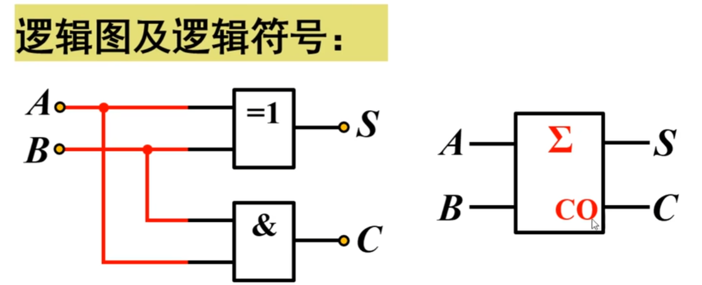

- **逻辑图**：由 1 个异或门（实现 S）和 1 个与门（实现 C）构成，输入为 A、B，输出为 S、C。

- **逻辑符号**：

- 框内标注 “Σ”（表示求和）

- 输入端：A、B（两个 1 位加数）

- 输出端：S（本位和）、CO（Carry Output，向高位进位，标注 “CO”）

## 三、全加器（Full Adder, 简称 FA）

### 1. 定义

将**本位的两个 1 位二进制数**与**相邻低位向本位的进位（Ci-1）** 三者相加，这种考虑低位进位的加法运算称为 “全加”；实现全加功能的电路称为 “全加器”。

### 2. 运算规则（结合低位进位的 1 位加法）

全加输入包含 3 个：本位加数 Ai、本位加数 Bi、低位进位 Ci-1；输出仍为 “本位和 Si” 和 “向高位的进位 Ci”，核心规则为 “二进制逢 2 进 1”。

**视频示例：4 位二进制数相加（A=1011，B=1110）**

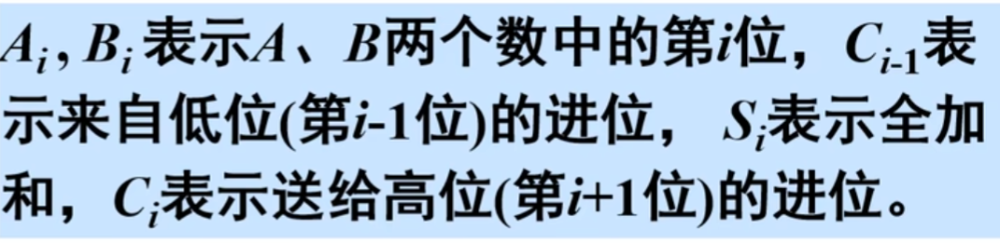

- 最低位（i=0）：Ai=1、Bi=0，无低位进位（Ci-1=0），相当于半加：1+0+0=1，Si=1，Ci=0

- 次低位（i=1）：Ai=1、Bi=1，低位进位 Ci-1=0：1+1+0=10，Si=0，Ci=1

- 次高位（i=2）：Ai=0、Bi=1，低位进位 Ci-1=1：0+1+1=10，Si=0，Ci=1

- 最高位（i=3）：Ai=1、Bi=1，低位进位 Ci-1=1：1+1+1=11，Si=1，Ci=1

- 最终结果：本位和为 1001，最高位进位为 1，即总和 = 11001

### 3. 真值表

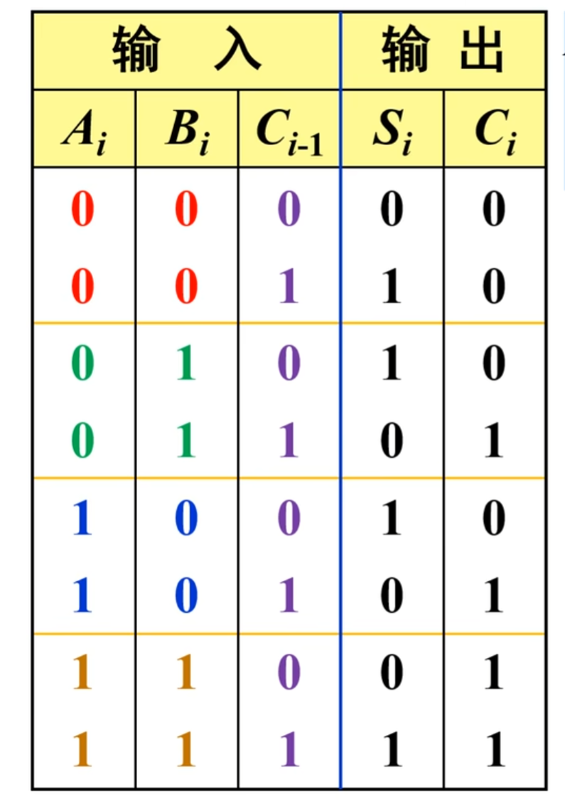

### 4. 逻辑表达式

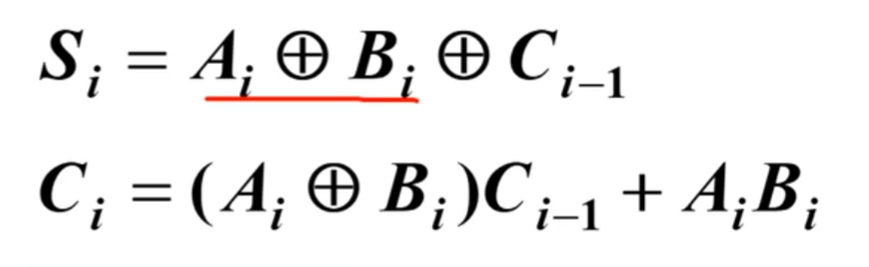

- **本位和 Si**：仅当 Ai、Bi、Ci-1 中 “1 的个数为奇数” 时为 1（异或关系扩展），即

Si = Ai ⊕ Bi ⊕ Ci-1（Ai 异或 Bi，结果再异或 Ci-1）

- **向高位进位 Ci**：当 “Ai、Bi 均为 1” 或 “Ai⊕Bi 为 1 且 Ci-1 为 1” 时为 1，优化表达式为

Ci = Ai·Bi + (Ai⊕Bi)·Ci-1（避免使用 3 个与门，复用 Si 的异或门输出）

### 5. 逻辑符号

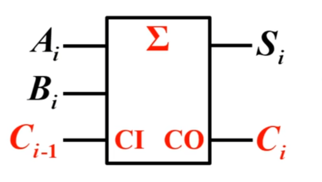

- 框内标注 “Σ”（求和）

- 输入端：Ai、Bi（本位加数）、CI（Carry Input，低位进位，标注 “CI”）

- 输出端：Si（本位和）、CO（向高位进位）

## 四、集成全加器芯片

重点介绍两种集成全加器，核心为 “双全加器”（单芯片含 2 个独立全加器）：

### 1. TTL 系列：74LS183

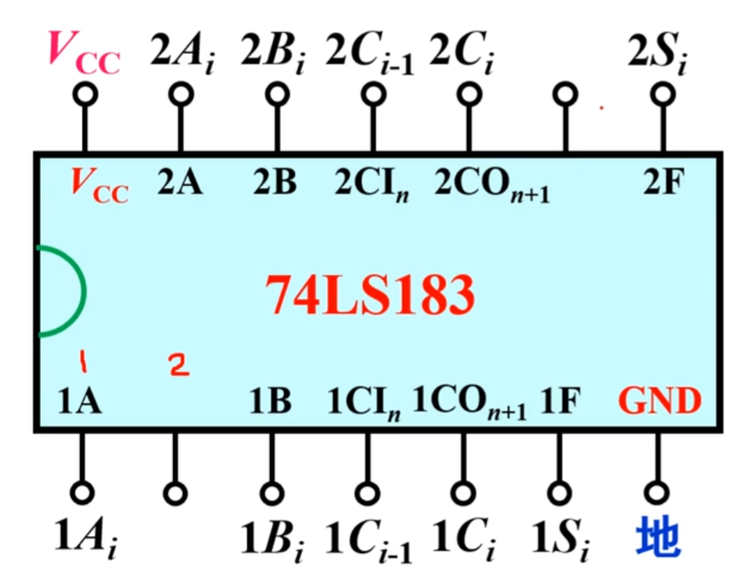

- **芯片特性**：14 管脚双列直插，内含 2 个独立全加器（记为 “1# 全加器” 和 “2# 全加器”）。

- **关键管脚功能**（按视频标注）：

- 电源端：14 脚（VCC，+5V）、7 脚（GND，接地）

- 1# 全加器：1 脚（1A，加数 1）、3 脚（1B，加数 2）、4 脚（1CI，低位进位）、5 脚（1CO，向高位进位）、6 脚（1S，本位和）

- 2# 全加器：13 脚（2A，加数 1）、12 脚（2B，加数 2）、11 脚（2CI，低位进位）、10 脚（2CO，向高位进位）、9 脚（2S，本位和）

- 空管脚：2 脚、8 脚（无定义，不可使用，因芯片管脚数需符合通用标准：8/14/16 等，无 12 管脚）

- **仿真测试**：通过电子开关控制 Ai、Bi、Ci-1 输入（开关断开为 1，闭合为 0），LED 灯显示 Si、Ci 输出，验证全加器真值表（如输入 001 时 Si=1、Ci=0；输入 111 时 Si=1、Ci=1）。

	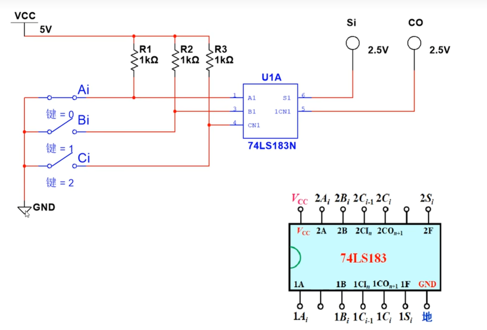

### 2. CMOS 系列：C661


- **核心特性**：同样为双全加器，但管脚排布与 74LS183 不同（如加法输入为 5 脚、6 脚，低位进位为 4 脚，本位和为 1 脚等），功能与 74LS183 一致。

## 五、加法器的应用：2 位二进制数乘法器

视频通过 “2 位 ×2 位二进制乘法” 演示加法器的应用，核心原理：**数字系统中乘法通过加法实现**。

### 1. 乘法运算原理（A=A1A0，B=B1B0）

2 位二进制数相乘，结果最大为 4 位（P=P3P2P1P0），竖式推导如下：

```
    A1 A0  （如A=11，即3）
  × B1 B0  （如B=11，即3）
  --------
    A1A0B0  （第1行部分积：A×B0）
  A1A0B1    （第2行部分积：A×B1，左移1位）
  --------
  P3 P2 P1 P0  （总和，部分积相加）
```

- P0 = A0・B0（无进位，直接用与门实现）

- P1 = A1・B0 + A0・B1（需考虑加法进位 C1，用全加器实现，且全加器低位进位 CI 接地）

- P2 = A1・B1 + C1（需考虑 P1 的进位 C1，用全加器实现，全加器低位进位 CI 接 P1 的 CO）

- P3 = C2（P2 全加器的向高位进位，直接作为最高位）

### 2. 电路实现

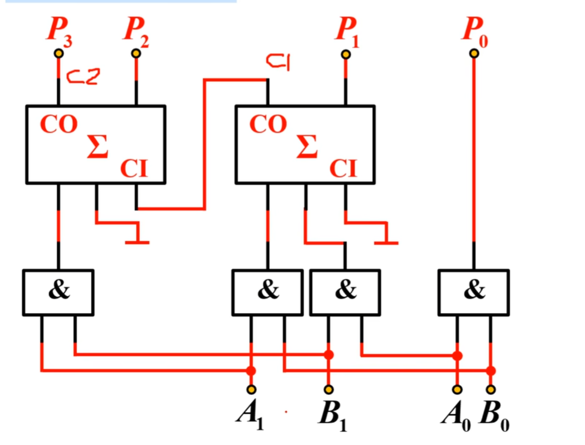

- **与门**：4 个与门分别实现 A0・B0、A1・B0、A0・B1、A1・B1（1 位二进制乘法等价于 “与运算”）。

- **全加器**：2 个全加器（如 74LS183 的两个独立全加器）：

- 第 1 个全加器：输入 = A1・B0、A0・B1、CI=0（接地），输出 = P1、CO=C1

- 第 2 个全加器：输入 = A1・B1、CI=C1、另一个加数 = 0（接地），输出 = P2、CO=C2=P3

- **输入 / 输出**：输入 A1、A0、B1、B0；输出 P3、P2、P1、P0。

### 3. 仿真验证


通过电子开关控制 A1/A0/B1/B0 输入，LED 显示 P3-P0 输出：

- 示例 1：A=00（0）、B=00（0）→ P=0000（0），所有 LED 不亮

- 示例 2：A=11（3）、B=11（3）→ P=1001（9），P3 和 P0 的 LED 亮，P2 和 P1 的 LED 不亮

## 六、多位二进制加法器的进位方式

实现多位（如 4 位、8 位）二进制数相加的电路称为 “多位加法器”，核心差异在于 “进位传递方式”，视频介绍两种：

### 1. 串行进位加法器（逐位进位）

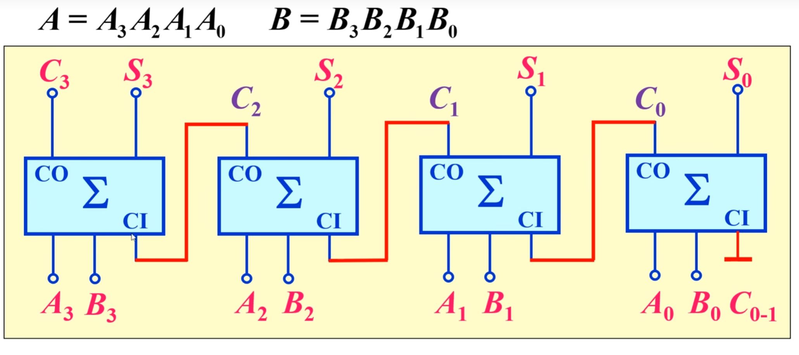

- **原理**：将 n 个全加器级联，低位全加器的 “向高位进位（CO）” 直接连接到高位全加器的 “低位进位（CI）”，最低位全加器的 CI 接地（无低位进位）。

- 示例：4 位串行进位加法器 = 4 个全加器级联，C0（最低位 CI）=0，C1 = 第 1 个 CO，C2 = 第 2 个 CO，C3 = 第 3 个 CO，C4 = 第 4 个 CO（最高位进位）。

- **特点**：

- 优点：电路结构简单，连接方便（仅需级联进位端）。

- 缺点：运算速度慢，高位的 Si 和 Ci 需等待低位进位传递完成（如 4 位加法需 4 个全加器的传输延迟）。

### 2. 超前进位加法器（并行进位）

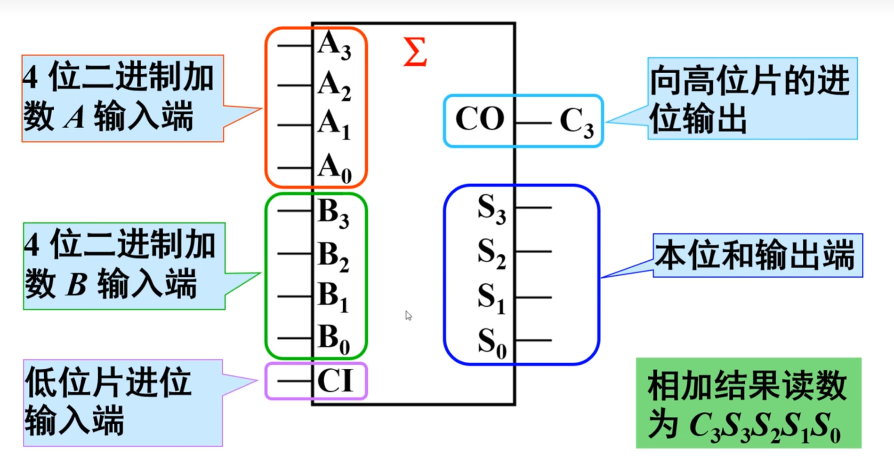

- **原理**：通过专门的 “超前进位运算电路”，根据所有低位加数（A0~An-1、B0~Bn-1）和最低位进位 C0，直接计算出每一位的进位 Ci（无需等待低位进位），同时输出所有本位和 Si。

- **集成芯片示例**：74LS283（4 位超前进位加法器）

- 输入端：A3~A0（4 位加数 A）、B3~B0（4 位加数 B）、CI（最低位进位）

- 输出端：S3~S0（4 位本位和）、CO（最高位进位）

- **特点**：

- 优点：运算速度快，所有 Si 和 Ci 可并行输出（仅需 1 次超前进位电路延迟）。

- 缺点：电路结构复杂（需额外设计超前进位逻辑）。


#  数值比较器

## 1. 数值比较器的基本定义

- **核心功能**：在数字系统中，用于对两个数字的大小关系（大于、小于）或是否相等进行比较的逻辑电路。

- **英文名称**：Digital Comparator，又称 “数字比较器”。

- **核心特点**：比较结果仅存在三种互斥状态（仅一个为 1，其余为 0）：大于、小于、等于，不会同时出现两种或以上有效结果。

## 2. 1 位二进制数值比较器（基础单元）

视频通过**组合逻辑电路设计方法**推导 1 位比较器，步骤如下：

### 2.1 步骤 1：确定输入与输出变量

- **输入变量**：2 个 1 位二进制数，记为 A（被比较数）和 B（比较数）。

- **输出变量**：3 个互斥的比较结果，分别记为：

- Y(A>B)：A 大于 B 时输出 1，否则为 0；

- Y(A<B)：A 小于 B 时输出 1，否则为 0；

- Y(A=B)：A 等于 B 时输出 1，否则为 0。

### 2.2 步骤 2：列写真值表

根据输入变量的所有取值（1 位二进制数共 4 种组合），推导输出结果，真值表如下：

| 输入变量 | 输出变量 | 输出变量 | 输出变量 |
| -------- | -------- | -------- | -------- |
| A        | B        | Y(A>B)   | Y(A<B)   |
| 0        | 0        | 0        | 0        |
| 0        | 1        | 0        | 1        |
| 1        | 0        | 1        | 0        |
| 1        | 1        | 0        | 0        |

- 示例：当 A=1、B=0 时，Y(A>B)=1，Y(A<B)=0，Y(A=B)=0，即 A 大于 B。

### 2.3 步骤 3：推导输出逻辑表达式

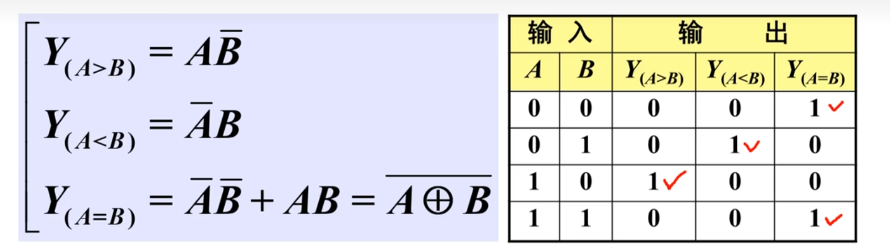

根据真值表中 “输出为 1” 的输入组合，写出最小项之和形式的逻辑表达式：

1. **Y(A>B)**：仅当 A=1、B=0 时输出 1，表达式为：

Y(A>B) = A · ¬B（“・” 表示与运算，“¬” 表示非运算）；

1. **Y(A<B)**：仅当 A=0、B=1 时输出 1，表达式为：

Y(A<B) = ¬A · B；

1. **Y(A=B)**：当 A=0、B=0 或 A=1、B=1 时输出 1，表达式为：

Y(A=B) = ¬A · ¬B + A · B（“+” 表示或运算）。

- 关键说明：市场上无 “同或门” 器件，需通过 “异或非” 实现（同或 = 异或取反），即 Y(A=B) = ¬(A · ¬B + ¬A · B)（括号内为异或运算）。

### 2.4 步骤 4：绘制逻辑图

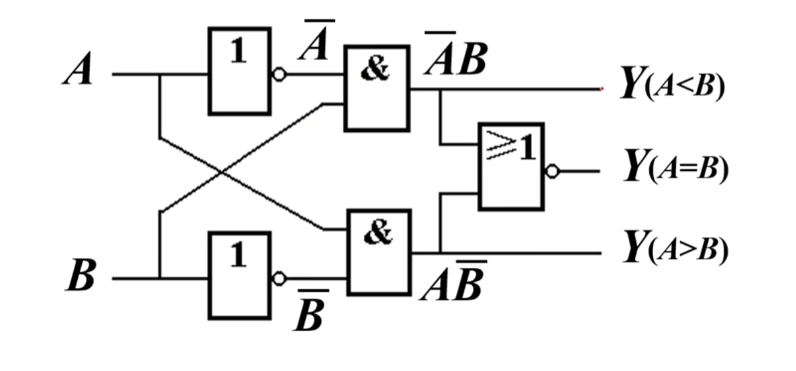

基于逻辑表达式，使用基础门电路（非门、与门、或门、非门）构建电路，结构如下：

1. 输入预处理：通过 2 个**非门**，将 A 转换为 ¬A，B 转换为 ¬B；

1. 实现 Y(A>B)：用 1 个**与门**连接 A 和 ¬B，输出即为 A · ¬B；

1. 实现 Y(A<B)：用 1 个**与门**连接 ¬A 和 B，输出即为 ¬A · B；

1. 实现 Y(A=B)：

- 先用 1 个**或门**连接 A · ¬B（Y(A>B)）和 ¬A · B（Y(A<B)），得到异或结果；

- 再用 1 个**非门**对异或结果取反，输出即为 Y(A=B)。

## 3. 多位二进制数值比较器（以 4 位为例）

当比较的数字超过 1 位时，需按 “高位优先” 原则设计，视频重点讲解 4 位比较器。

### 3.1 核心比较原理

设两个 4 位二进制数为 A = A₃A₂A₁A₀ 和 B = B₃B₂B₁B₀（A₃/B₃ 为最高位，A₀/B₀ 为最低位），比较顺序为：

1. 先比较**最高位** **A₃** **和** **B₃**：

- 若 A₃ > B₃，则直接得出 A > B，无需比较低位；

- 若 A₃ < B₃，则直接得出 A < B，无需比较低位；

- 若 A₃ = B₃，则需比较**次高位** **A₂** **和** **B₂**；

1. 重复上述逻辑，依次比较 A₂与B₂、A₁与B₁、A₀与B₀：

- 仅当所有位均相等（A₃=B₃、A₂=B₂、A₁=B₁、A₀=B₀）时，才得出 A = B。

### 3.2 比较示例

- 例 1：A = 1011（A₃=1、A₂=0、A₁=1、A₀=1），B = 0111（B₃=0、B₂=1、B₁=1、B₀=1）：

因 A₃=1 > B₃=0，直接得出 A > B，无需比较 A₂-A₀ 和 B₂-B₀；

- 例 2：A = 0011（A₃=0、A₂=0、A₁=1、A₀=1），B = 0001（B₃=0、B₂=0、B₁=0、B₀=1）：

A₃=B₃=0 → 比较 A₂=B₂=0 → 比较 A₁=1 > B₁=0，得出 A > B；

- 例 3：A = 1100，B = 1100：

所有位均相等，得出 A = B。

## 4. 集成 4 位数值比较器（74LS85）

视频介绍了 TTL 型集成芯片 **74LS85**，是工业中常用的 4 位数值比较器，核心参数如下：

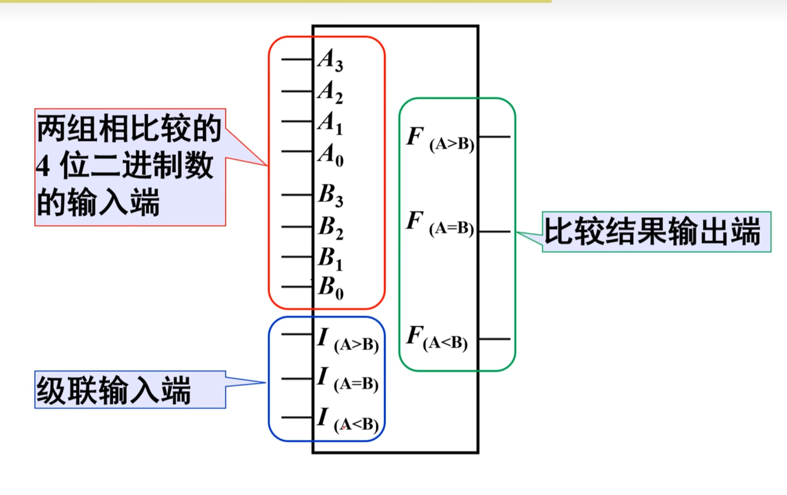

### 4.1 引脚功能（关键引脚）

| 引脚类型           | 引脚标识               | 功能说明                                 |
| ------------------ | ---------------------- | ---------------------------------------- |
| 数值输入端         | A₃、A₂、A₁、A₀         | 被比较数 A 的 4 位输入（A₃为最高位）     |
| 数值输入端         | B₃、B₂、B₁、B₀         | 比较数 B 的 4 位输入（B₃为最高位）       |
| 级联（扩展）输入端 | I(A>B)、I(A<B)、I(A=B) | 用于扩展比较位数（连接低位比较器的输出） |
| 比较输出端         | F(A>B)、F(A<B)、F(A=B) | 最终比较结果输出（对应三种状态）         |

### 4.2 核心功能表解读

74LS85 的输出结果由 “数值输入” 和 “级联输入” 共同决定，核心逻辑如下：

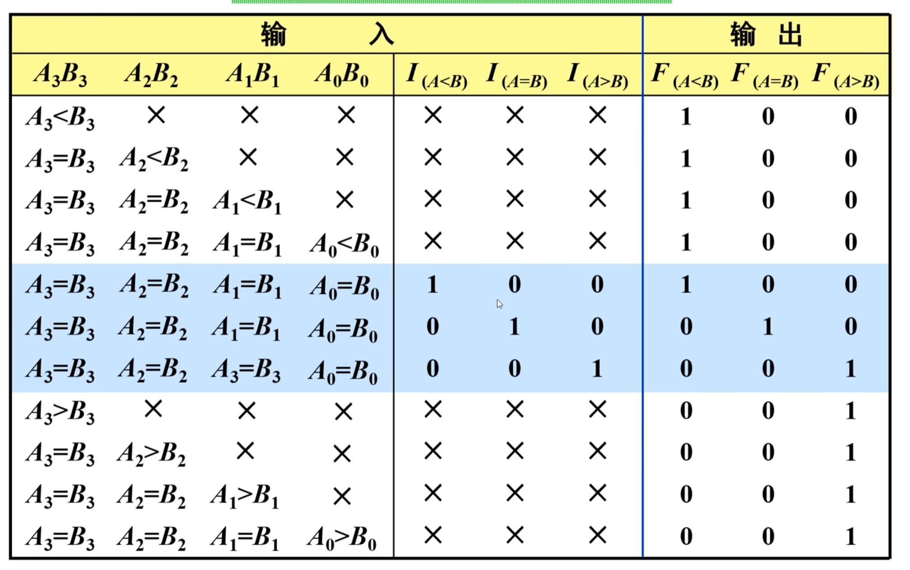

1. **当 A₃-A₀与 B₃-B₀不全相等时**：

输出仅由数值输入的 “高位优先” 比较结果决定，级联输入（I 端）不影响输出。

- 例：若 A₃ < B₃，则无论 A₂-A₀、B₂-B₀ 及 I 端状态如何，F(A<B)=1，F(A>B)=0，F(A=B)=0；

1. **当 A₃-A₀ = B₃-B₀（4 位全相等）时**：

输出完全由级联输入（I 端）决定，即 F(A>B)=I(A>B)、F(A<B)=I(A<B)、F(A=B)=I(A=B)。

- 例：若 4 位全相等且 I(A>B)=1，则 F(A>B)=1，其余输出为 0。

### 4.3 典型使用场景

#### 场景 1：仅比较两个 4 位二进制数（不扩展）

此时无需连接低位比较器，需将级联输入（I 端）按 “无低位” 逻辑配置：

- I(A=B) = 1（表示 “低位无更多位数，默认相等”）；

- I(A>B) = 0、I(A<B) = 0（表示 “低位无大于 / 小于结果”）。

#### 场景 2：比较两个 4 位以上二进制数（扩展使用）

视频以 “扩展为 8 位比较器” 为例，说明扩展逻辑：

- 需 2 片 74LS85，分为 “高位片” 和 “低位片”；

- 分工：

- 低位片：处理 8 位数的低 4 位（A₀-A₃、B₀-B₃）；

- 高位片：处理 8 位数的高 4 位（A₄-A₇、B₄-B₇）；

- 连接方式：

1. 低位片的级联输入按 “4 位比较” 配置（I(A=B)=1，I(A>B)=I(A<B)=0）；

1. 低位片的输出端（F(A>B)、F(A<B)、F(A=B)）分别连接到高位片的级联输入端（I(A>B)、I(A<B)、I(A=B)）；

1. 最终比较结果从**高位片的输出端（F 端）** 读取。

#### 扩展示例（8 位比较）

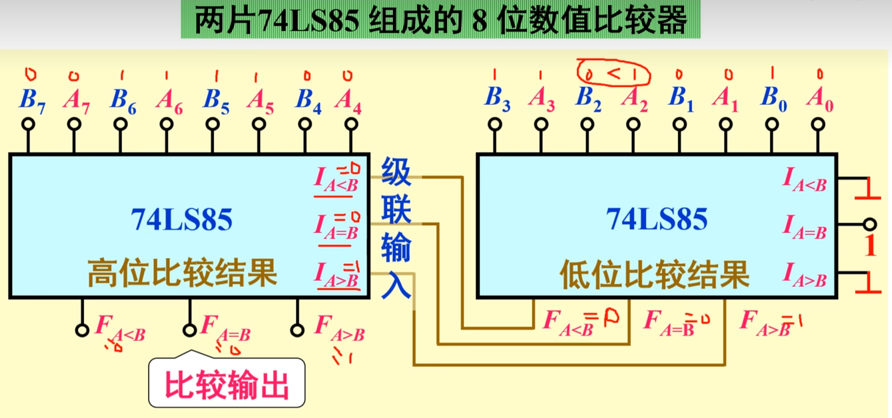

设 A = A₇A₆A₅A₄A₃A₂A₁A₀ = 0011 1011，B = B₇B₆B₅B₄B₃B₂B₁B₀ = 0011 0111：

1. 高位片（处理 A₇-A₄=0011、B₇-B₄=0011）：4 位全相等，输出取决于级联输入；

1. 低位片（处理 A₃-A₀=1011、B₃-B₀=0111）：A₃=1 > B₃=0，故低位片 F(A>B)=1，F(A<B)=0，F(A=B)=0；

1. 高位片级联输入接低位片输出：I(A>B)=1，因此高位片 F(A>B)=1，最终结果 A > B。

## 5. 核心总结

1. 数值比较器的核心是 “判断两个数字的大小 / 相等关系”，结果互斥；

1. 1 位比较器是基础，通过组合逻辑电路设计（输入输出→真值表→逻辑表达式→逻辑图）实现；

1. 多位比较器遵循 “高位优先” 原则，从最高位到低位逐位比较；

1. 集成芯片 74LS85 是 4 位比较器，通过 “级联输入” 可扩展为更多位（如 8 位、12 位），扩展时需将低位输出接高位级联输入，最终结果从高位输出。


#   编码器

## 一、本节学习要求

1. 理解编码和译码的基本概念；

1. 掌握常用编码器的类型、逻辑功能及使用方法。

## 二、编码与编码器的基本概念

### 1. 编码的定义

- 广义：用文字、符号或数字表示特定对象的过程（示例：小孩取名用汉字、运动员编号用十进制数）；

- 数字电路中：因汉字、十进制数难以用电路实现，**仅采用二进制数进行编码**（二进制数仅含 0 和 1，电路易实现）。

### 2. 编码器的定义


- 实现 “二进制编码” 功能的数字电路，英文名为 “Encoder”；

- 核心逻辑：将输入的N个待编码电平信号，转换为n位二进制代码输出，满足**2ⁿ ≥ N**（n为输出二进制位数，N为输入信号个数）。

### 3. 编码分类（按 2ⁿ与 N 的关系）

| 分类     | 条件   | 特点                   | 示例                        |
| -------- | ------ | ---------------------- | --------------------------- |
| 全编码   | 2ⁿ = N | 所有二进制代码均被使用 | 8 线 - 3 线编码器（8=2³）   |
| 部分编码 | 2ⁿ > N | 仅部分二进制代码被使用 | 10 线 - 4 线编码器（16>10） |

- 示例：若输入信号为 6 个（N=6），需n=3位二进制数（2³=8 ≥6），属于部分编码。

## 三、常用编码器类型及原理

### 3.1 二进制编码器（全编码）

#### 1. 定义

将N=2ⁿ个输入信号，转换为n位二进制代码的组合逻辑电路，属于**全编码**（无闲置二进制代码）。

#### 2. 典型案例：8 线 - 3 线二进制编码器（用与非门实现）

##### （1）输入与输出定义

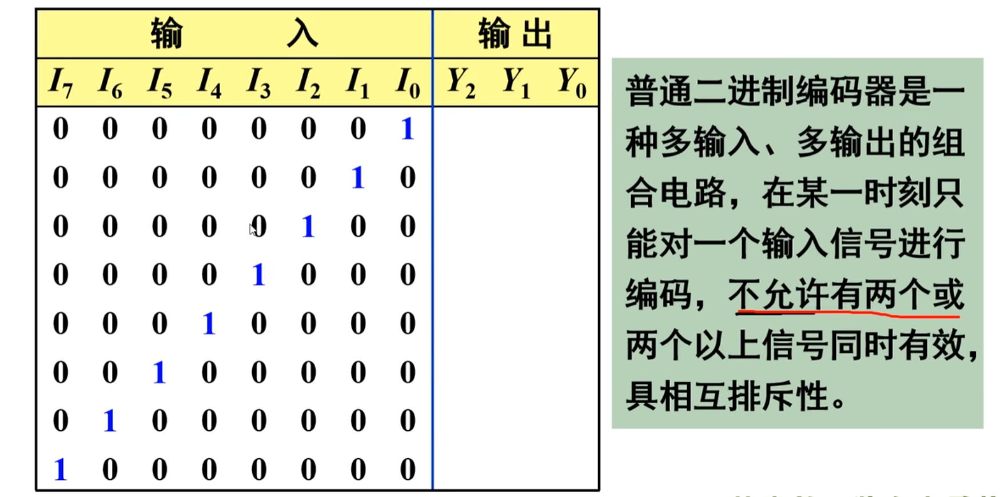

- 输入：8 个待编码信号I₀~I₇（高电平有效，**输入互斥**—— 某时刻仅 1 个有效）；

- 输出：3 位二进制代码Y₂Y₁Y₀（Y₂为高位，Y₀为低位）。

##### （2）简化真值表（输入互斥，仅列 8 种有效状态）

| 输入有效信号 | I₇   | I₆   | I₅   | I₄   | I₃   | I₂   | I₁   | I₀   | 输出 Y₂Y₁Y₀ |
| ------------ | ---- | ---- | ---- | ---- | ---- | ---- | ---- | ---- | ----------- |
| I₀有效       | 0    | 0    | 0    | 0    | 0    | 0    | 0    | 1    | 000         |
| I₁有效       | 0    | 0    | 0    | 0    | 0    | 0    | 1    | 0    | 001         |
| I₂有效       | 0    | 0    | 0    | 0    | 0    | 1    | 0    | 0    | 010         |
| I₃有效       | 0    | 0    | 0    | 0    | 1    | 0    | 0    | 0    | 011         |
| I₄有效       | 0    | 0    | 0    | 1    | 0    | 0    | 0    | 0    | 100         |
| I₅有效       | 0    | 0    | 1    | 0    | 0    | 0    | 0    | 0    | 101         |
| I₆有效       | 0    | 1    | 0    | 0    | 0    | 0    | 0    | 0    | 110         |
| I₇有效       | 1    | 0    | 0    | 0    | 0    | 0    | 0    | 0    | 111         |

- 关键注：I₀为**隐含信号**—— 当I₁~I₇均无效（全 0）时，输出000，对应I₀的编码。

##### （3）逻辑表达式推导（输入互斥简化）

- 提取输出为 1 的输入组合：

- Y₂ = I₄ + I₅ + I₆ + I₇（仅I₄~I₇有效时，Y₂=1）；

- Y₁ = I₂ + I₃ + I₆ + I₇（仅I₂~I₃、I₆~I₇有效时，Y₁=1）；

- Y₀ = I₁ + I₃ + I₅ + I₇（仅I₁、I₃、I₅、I₇有效时，Y₀=1）。

##### （4）转换为与非表达式（题目要求用与非门实现）

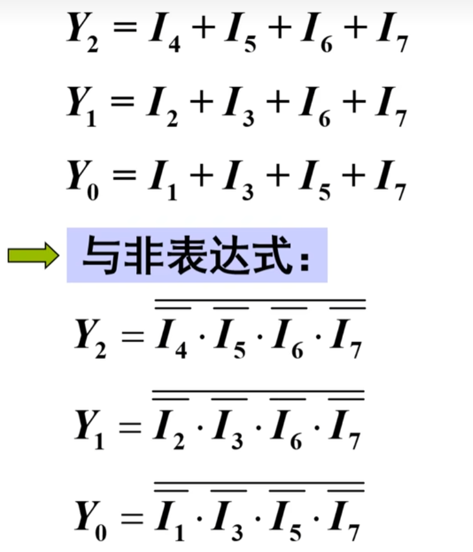

- 利用 “两次取反” 和摩根定律：

- Y₂ = ((I₄ + I₅ + I₆ + I₇)')' = (I₄' · I₅' · I₆' · I₇')'；

- Y₁ = ((I₂ + I₃ + I₆ + I₇)')' = (I₂' · I₃' · I₆' · I₇')'；

- Y₀ = ((I₁ + I₃ + I₅ + I₇)')' = (I₁' · I₃' · I₅' · I₇')'。

##### （5）逻辑图特点

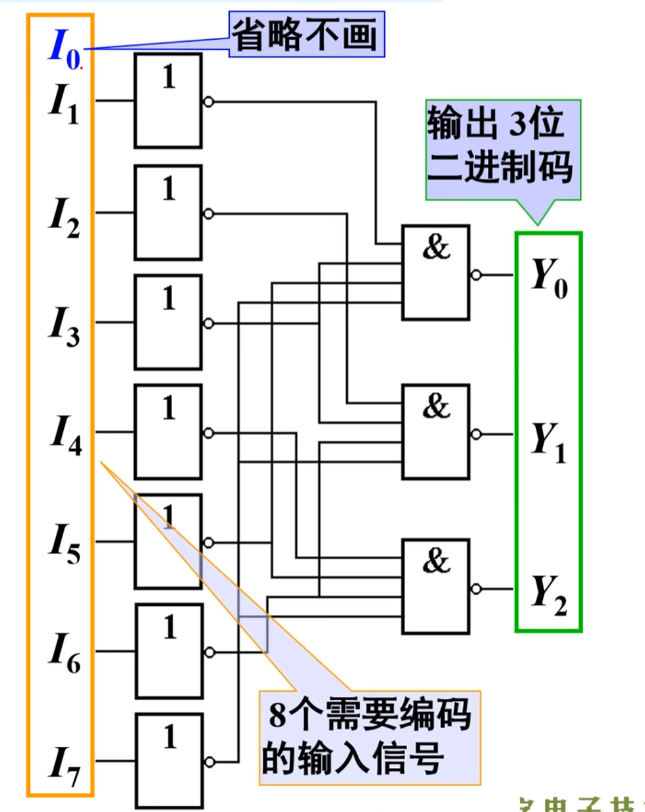

- 输入I₁~I₇经非门后，接入 3 个 4 输入与非门；

- I₀无需接线（隐含），当I₁~I₇全无效时，与非门输入全 1，输出全 0（对应I₀的000）。

### 3.2 二 - 十进制编码器（部分编码）

#### 1. 定义

用**4 位 8421BCD 码**表示 1 位十进制数（0~9）的编码器，属于**部分编码**（2⁴=16 > 10，闲置 6 种代码）。

#### 2. 典型案例：10 线 - 4 线二 - 十进制编码器（用与非门实现）

##### （1）输入与输出定义

- 输入：10 个待编码信号I₀~I₉（高电平有效，输入互斥）；

- 输出：4 位 8421BCD 码Y₃Y₂Y₁Y₀（位权：Y₃=8、Y₂=4、Y₁=2、Y₀=1）。

##### （2）简化真值表（编码遵循 8421BCD 码）


- 注：I₀隐含 —— 当I₁~I₉全无效时，输出0000。

	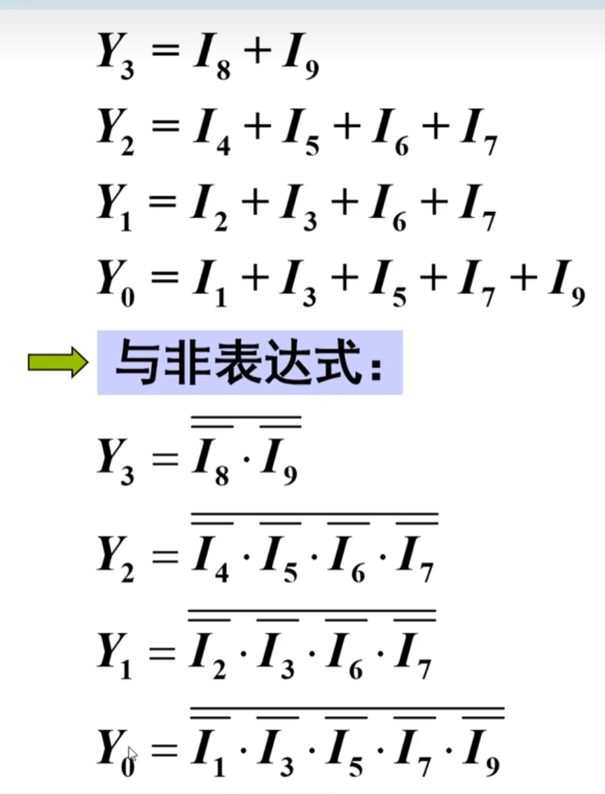

##### （3）与非门实现特殊说明

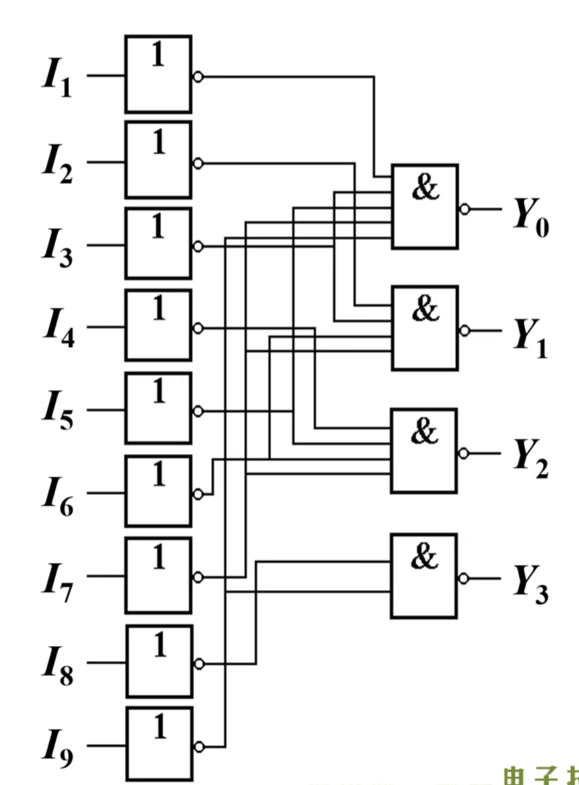

- 若需用与非门模拟 “非门”：

1. 方案 1：与非门两输入端短接（注意：增大输入驱动电流，需确认信号能力）；

1. 方案 2：与非门一端接高电平（VCC），另一端接信号（推荐，避免电流过大）。

### 3.3 优先编码器（解决多输入同时有效问题）

#### 1. 核心特点

- 普通编码器（二进制 / 二 - 十进制）不允许输入同时有效，优先编码器**允许多个输入同时有效**，但仅对 “优先级最高” 的输入编码（优先级由设计定义）。

#### 2. 典型案例：3 位二进制优先编码器

##### （1）输入与优先级

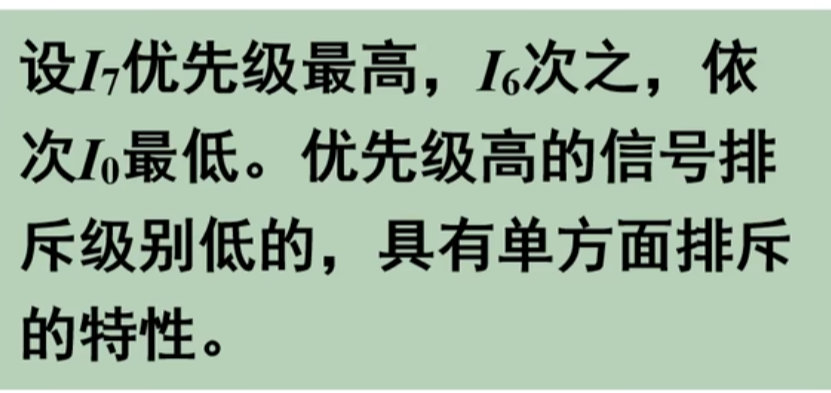

- 输入：I₀~I₇（高电平有效）；

- 优先级：I₇ > I₆ > ... > I₀（I₇最高，I₀最低）。

##### （2）真值表（含 “任意态 X”）

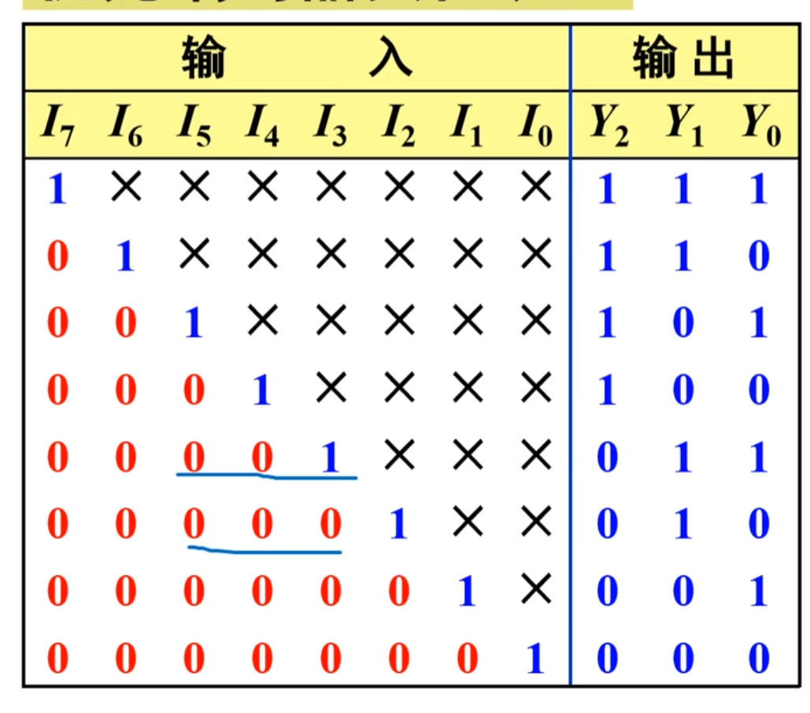

- 高优先级信号有效时，低优先级信号状态不影响输出（“X” 表示任意 0/1）：

| 输入信号（I₇~I₀） | 输出 Y₂Y₁Y₀ | 说明                         |
| ----------------- | ----------- | ---------------------------- |
| 1XXXXXXX          | 111         | I₇有效，低优先级任意         |
| 01XXXXXX          | 110         | I₇无效、I₆有效，低优先级任意 |
| 001XXXXX          | 101         | I₇~I₆无效、I₅有效            |
| 0001XXXX          | 100         | I₇~I₅无效、I₄有效            |
| 00001XXX          | 011         | I₇~I₄无效、I₃有效            |
| 000001XX          | 010         | I₇~I₃无效、I₂有效            |
| 0000001X          | 001         | I₇~I₂无效、I₁有效            |
| 00000001          | 000         | I₇~I₁无效、I₀有效            |

##### （3）逻辑表达式简化（利用 “X=1”）

- 因高优先级信号覆盖低优先级，表达式与二进制编码器一致：

- Y₂ = I₇ + I₆ + I₅ + I₄；

- Y₁ = I₇ + I₆ + I₃ + I₂；

- Y₀ = I₇ + I₅ + I₃ + I₁。

## 四、优先编码器集成芯片

### 4.1 8 线 - 3 线优先编码器：74LS148

#### 1. 管脚定义（16 脚 DIP 封装）

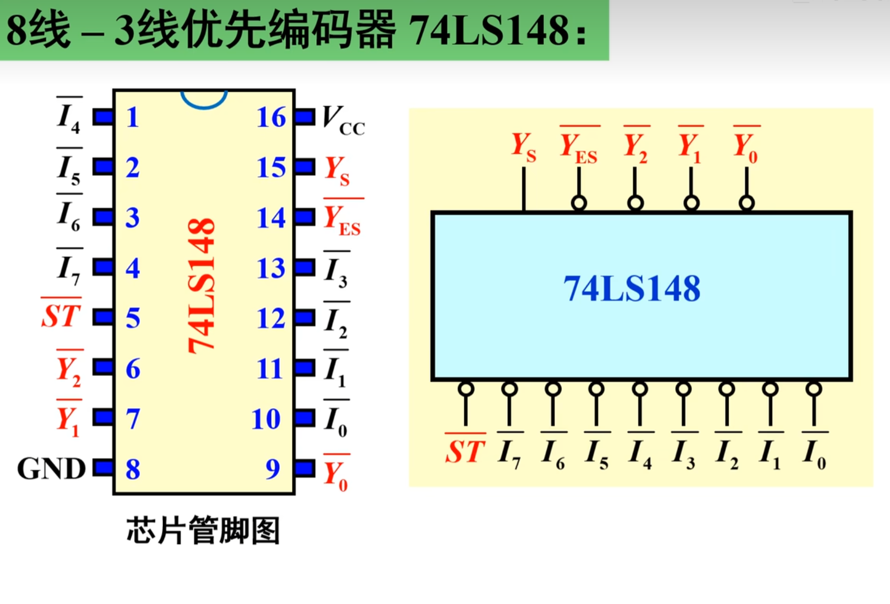

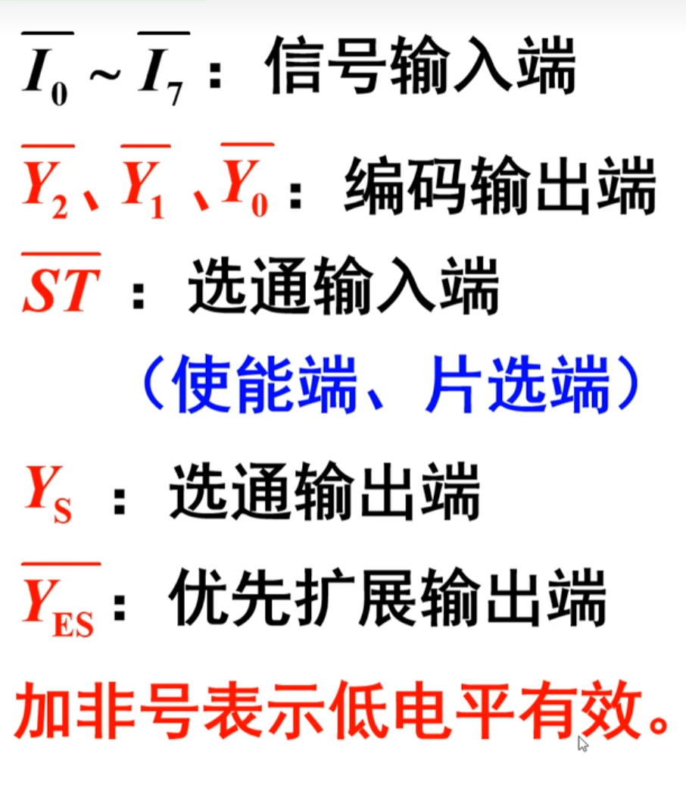

| 管脚号 | 功能标识 | 功能说明                   | 电平特性                         |
| ------ | -------- | -------------------------- | -------------------------------- |
| 1~4    | I₄'~I₇'  | 输入信号（I₇' 优先级最高） | 低电平有效（0 = 有效）           |
| 10~13  | I₀'~I₃'  | 输入信号（I₀' 优先级最低） | 低电平有效                       |
| 5      | ST'      | 选通输入端                 | 低电平有效（0 = 工作，1 = 禁止） |
| 6~7、9 | Y₀'~Y₂'  | 编码输出端（Y₂' 为高位）   | 低电平有效（输出反码）           |
| 14     | YES'     | 优先扩展输出端             | 低电平有效                       |
| 15     | YS       | 选通输出端（级联用）       | 高电平有效                       |
| 8      | GND      | 接地端                     | -                                |
| 16     | VCC      | 电源端（+5V）              | -                                |

#### 2. 核心功能表（关键状态）

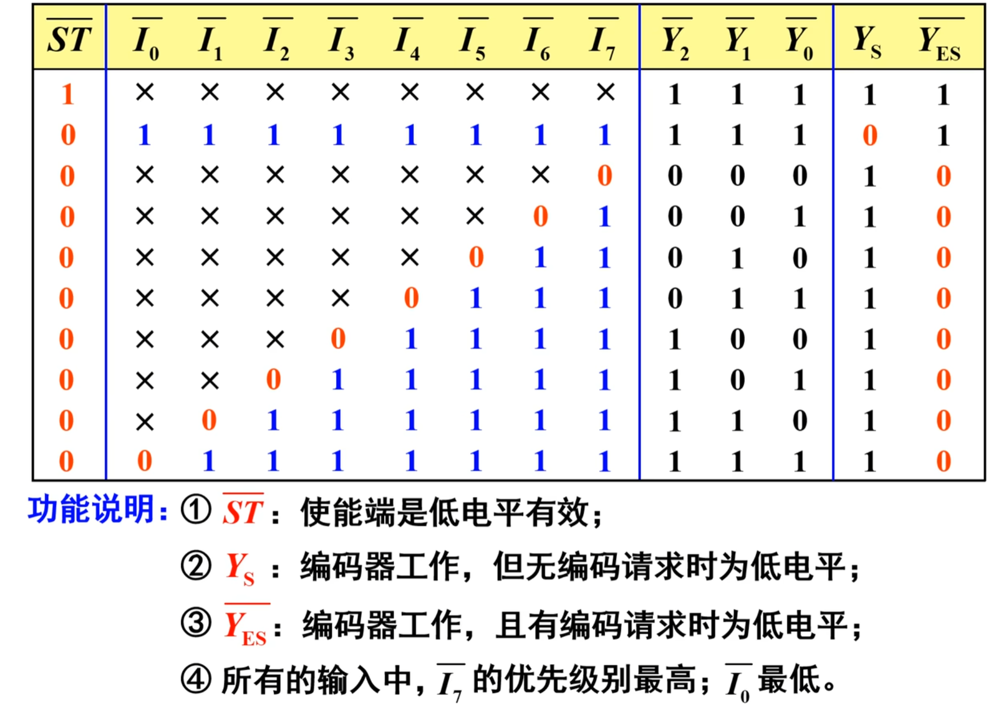

| ST'  | I₇'~I₀'（输入） | Y₂'Y₁'Y₀'（输出） | YS   | YES' | 状态说明                       |
| ---- | --------------- | ----------------- | ---- | ---- | ------------------------------ |
| 1    | XXXXXXXX        | 111               | 1    | 1    | 禁止工作，输出全 1             |
| 0    | 11111111        | 111               | 0    | 1    | 无有效输入，输出全 1           |
| 0    | 0XXXXXXX        | 000               | 1    | 0    | I₇' 有效，输出反码（原码 111） |
| 0    | 10XXXXXX        | 001               | 1    | 0    | I₆' 有效，输出反码（原码 110） |
| 0    | 11111110        | 111               | 1    | 0    | I₀' 有效，输出反码（原码 000） |

#### 3. 级联扩展：两片 74LS148 组成 16 线 - 4 线编码器

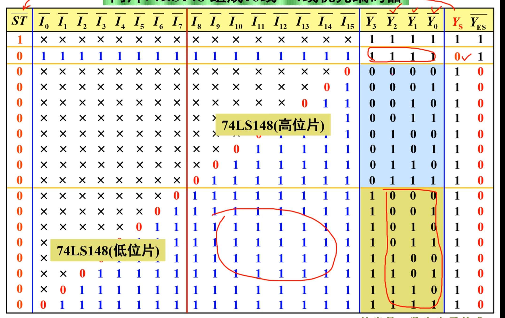

- 需求：16 个输入（I₀'~I₁₅'），4 位输出（Z₃'Z₂'Z₁'Z₀'），优先级I₁₅' > I₀'。

- 级联逻辑：

1. 高位片处理 I₈'~I₁₅'，低位片处理 I₀'~I₇'；

1. 高位片 YS → 低位片 ST'：高位工作（YS=1）时，低位被禁止；高位无输入（YS=0）时，低位工作；

1. 输出扩展：

	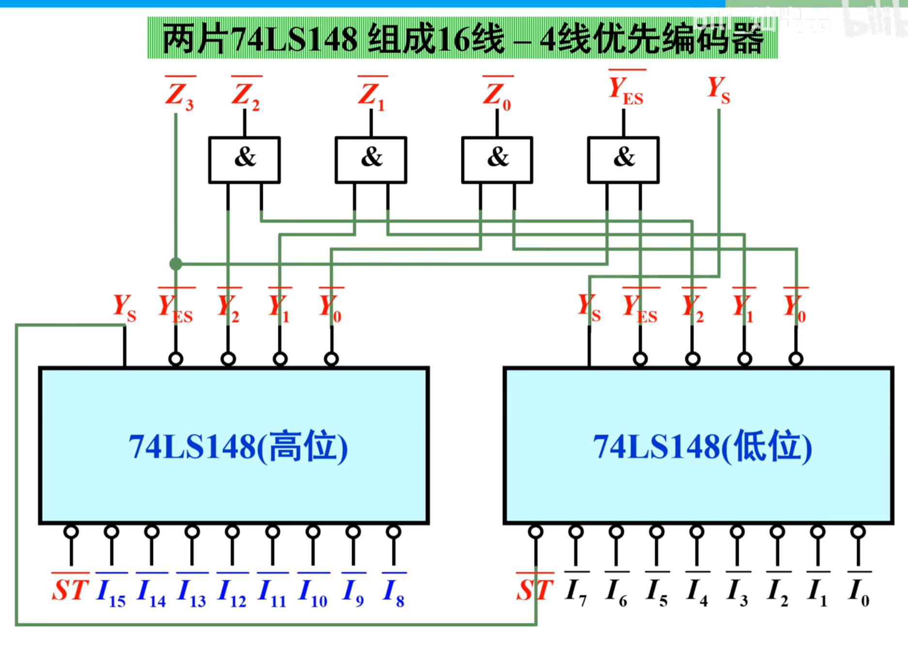

	**级联逻辑**

	- 高位芯片的*Y*S（选通输出）连接低位芯片的*ST*（选通输入）：当高位无有效输入时，*Y*S为低，允许低位芯片工作；若高位有有效输入，*Y*S为高，低位芯片被禁止。

	- 输出扩展：通过与门将两片芯片的*Y*2、*Y*1、*Y*0分别组合，再结合高位芯片的*Y*ES（作为*Z*3），最终得到 4 位编码输出*Z*0∼*Z*3。

- Z₃' = 高位片 YES'（高位工作 = 0，低位工作 = 1）；

- Z₂' = 高位片 Y₂'・低位片 Y₂'（3 个与门分别接 Y₂'、Y₁'、Y₀'）；

- Z₁' = 高位片 Y₁'・低位片 Y₁'；

- Z₀' = 高位片 Y₀'・低位片 Y₀'。

### 4.2 10 线 - 4 线优先编码器：74LS147

#### 1. 核心特点

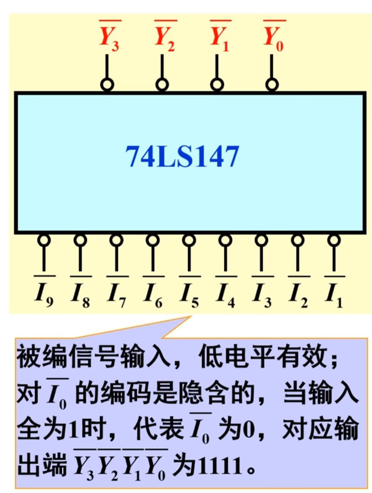

- 输入：I₁'~I₉'（9 个，无 I₀'，低电平有效，I₉' 优先级最高）；

- 输出：Y₀'~Y₃'（4 位，低电平有效，对应 8421BCD 反码）；

- 隐含 I₀'：I₁'~I₉' 全 1 时，输出 1111（对应 I₀的 8421BCD 码 0000）；

- 无 ST' 端：上电即工作；15 脚 NC（空脚，无需连接）。

#### 2. 关键功能表

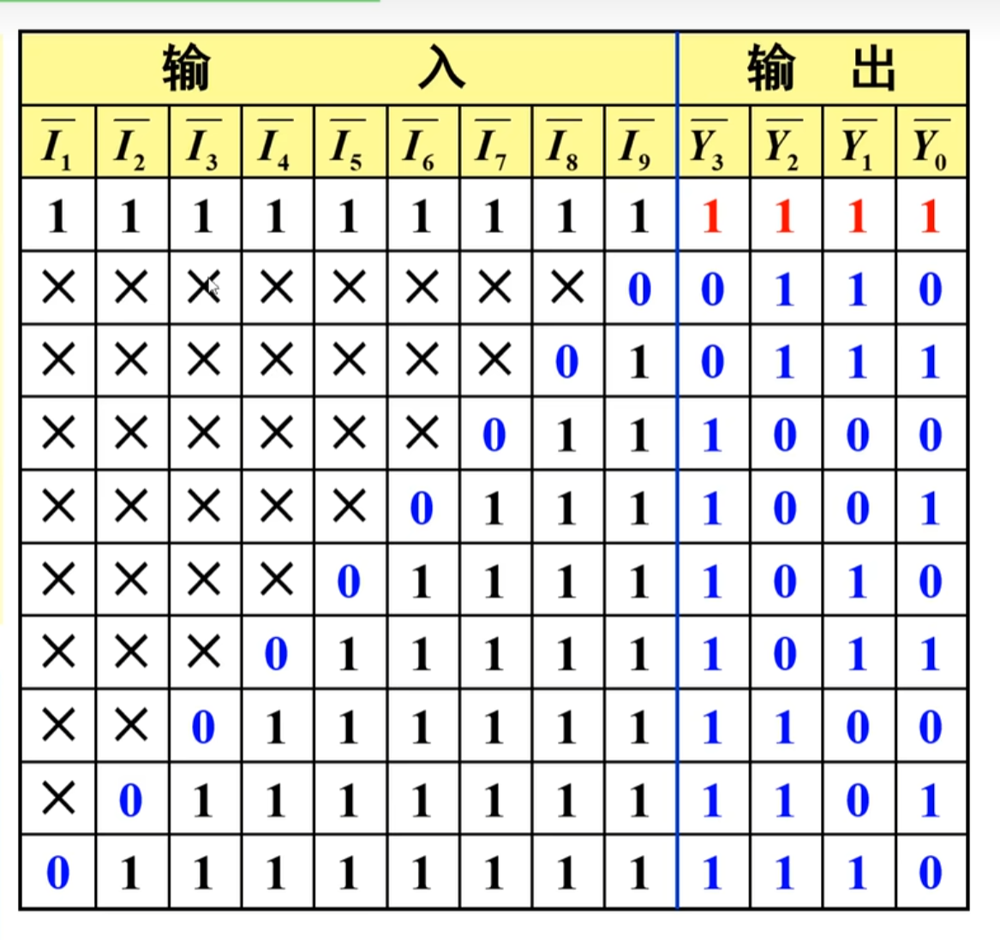

| 输入有效信号 | I₉'  | I₈'  | ...  | I₁'  | 输出 Y₃'Y₂'Y₁'Y₀'（反码） | 对应 8421BCD 码（原码） |
| ------------ | ---- | ---- | ---- | ---- | ------------------------- | ----------------------- |
| I₉' 有效     | 0    | 1    | ...  | 1    | 0110                      | 1001                    |
| I₈' 有效     | 1    | 0    | ...  | 1    | 0111                      | 1000                    |
| I₁' 有效     | 1    | 1    | ...  | 0    | 1110                      | 0001                    |
| 无有效输入   | 1    | 1    | ...  | 1    | 1111                      | 0000（I₀）              |

## 五、编码器的应用

### 1. 74LS148 功能测试电路

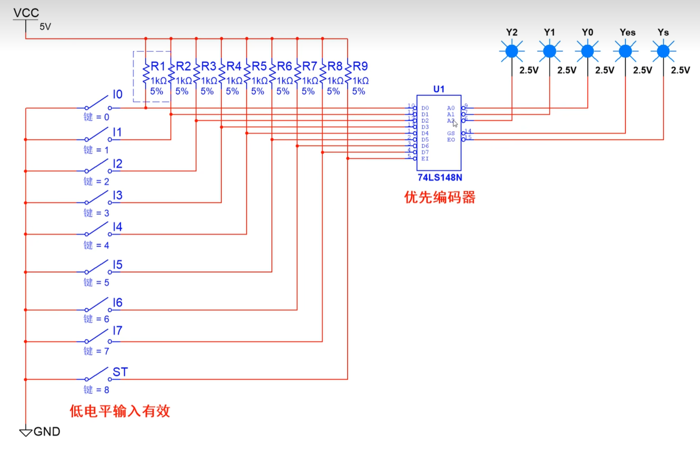

- 输入：逻辑开关（控制 I₀'~I₇' 和 ST'，闭合 = 低电平有效）；

- 输出：探测灯（亮 = 高电平，灭 = 低电平，显示 Y₂'Y₁'Y₀'、YS、YES'）；

- 功能：验证 ST' 的禁止 / 工作状态及优先级编码。

### 2. 16 线 - 4 线优先编码器扩展电路

- 核心：两片 74LS148 级联；

- 功能：实现 16 个输入的优先级编码，验证级联逻辑。

### 3. 数字抢答器


- 组成：74LS148（优先编码）+ 74LS279（锁存器）+ 74LS48（显示译码器）+ 数码管；

- 工作逻辑：

1. 主持人启动后，选手按抢答键；

1. 74LS148 对优先按键编码，锁存器锁定结果；

1. 显示译码器驱动数码管显示选手编号；

1. 锁定后，后续按键被封锁（ST'=1），需主持人重启。


# 编码器输出计算

## 一、组合逻辑电路设计流程（编码器设计基础）

视频开篇明确，编码器属于组合逻辑电路，其设计需遵循以下**四步流程**，是后续推导编码器输出的核心依据：

1. **逻辑抽象**

- 定义输入变量（待编码的信号）、输出变量（二进制代码）；

- 状态赋值：约定输入 “高电平 1” 表示 “有编码请求（有效）”，“低电平 0” 表示 “无编码请求（无效）”。

1. **列写真值表（功能表）**

- 根据输入输出的逻辑关系，列出所有输入组合对应的输出；

- 若输入存在 “互斥” 或 “优先级” 特性，可简化真值表（仅保留有效输入组合，无效组合标注为无关项 “X”）。

1. **求最简逻辑表达式并转换形式**

- 通过卡诺图或真值表直接推导输出变量的最简逻辑表达式（通常为 “或” 形式）；

- 若需指定门电路（如与非门），需将表达式转换为对应形式（如 “与非 - 与非” 形式）。

1. **绘制逻辑图**

- 根据转换后的逻辑表达式，用指定门电路搭建逻辑图。

## 二、二进制编码器（普通编码器）

### 1. 核心定义与输入输出关系

- **定义**：将 \( N=2^n \) 个输入信号，转换为 \( n \) 位二进制代码的逻辑电路（输入信号互斥，某一时刻仅 1 个有效）。

- **输入输出数量对应**：

- 8 个输入（\( N=8=2^3 \)）→ 3 位二进制输出（\( n=3 \)）；

- 16 个输入（\( N=16=2^4 \)）→ 4 位二进制输出（\( n=4 \)）。

### 2. 4 输入二进制编码器（简化示例，便于推导）

#### （1）真值表（完整 + 简化）

- **完整真值表**：共 \( 2^4=16 \) 种输入组合，仅 4 种 “单输入有效” 组合为有效编码对象，其余 12 种（多输入有效或全 0）为无关项 “X”。

- **简化真值表（有效组合）**：

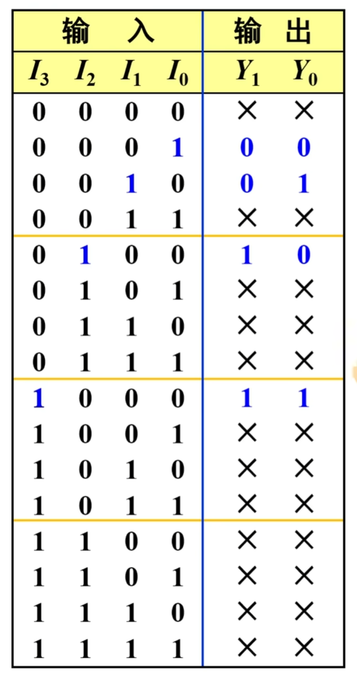

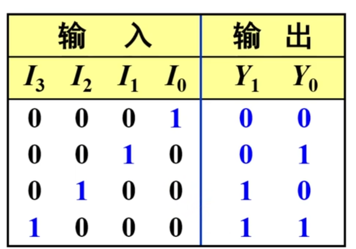

#### （2）卡诺图化简推导输出表达式

通过卡诺图消去无关项，得到最简 “或” 表达式：

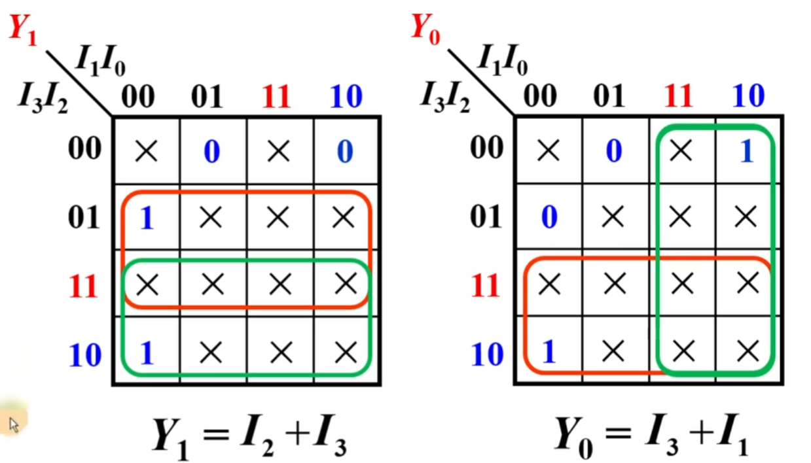

### 3. 8 输入二进制编码器（核心应用场景）

#### （1）简化真值表（有效组合）

仅保留 8 种 “单输入有效” 组合，编码按 “自然态序”（输入下标对应二进制数）：

| 有效输入组合（仅 1 个为 1） | 输出 \( Y_2Y_1Y_0 \)（二进制代码） |
| --------------------------- | ---------------------------------- |
| \( I_0=1 \)（00000001）     | 000                                |
| \( I_1=1 \)（00000010）     | 001                                |
| \( I_2=1 \)（00000100）     | 010                                |
| \( I_3=1 \)（00001000）     | 011                                |
| \( I_4=1 \)（00010000）     | 100                                |
| \( I_5=1 \)（00100000）     | 101                                |
| \( I_6=1 \)（01000000）     | 110                                |
| \( I_7=1 \)（10000000）     | 111                                |

#### （2）输出表达式推导（基于有效组合）

找输出为 “1” 时对应的有效输入，直接相加得最简 “或” 表达式：

- \( Y_2 \)：输出为 1 的编码是 **100~111**，对应输入 \( I_4\sim I_7 \)，故 \( Y_2 = I_4 + I_5 + I_6 + I_7 \)；

- \( Y_1 \)：输出为 1 的编码是 **010、011、110、111**，对应输入 \( I_2、I_3、I_6、I_7 \)，故 \( Y_1 = I_2 + I_3 + I_6 + I_7 \)；

- \( Y_0 \)：输出为 1 的编码是 **001、011、101、111**，对应输入 \( I_1、I_3、I_5、I_7 \)，故 \( Y_0 = I_1 + I_3 + I_5 + I_7 \)。

### 4. 与非门实现（指定门电路要求）

需将 “或” 表达式通过**两次取反**转换为 “与非 - 与非” 形式（与非门仅能实现 “与非” 运算）：

- 原理：\( A+B+C+D = \overline{\overline{A+B+C+D}} = \overline{\overline{A} \cdot \overline{B} \cdot \overline{C} \cdot \overline{D}} \)（德摩根定律）；

- 具体转换：

- \( Y_2 = \overline{\overline{I_4} \cdot \overline{I_5} \cdot \overline{I_6} \cdot \overline{I_7}} \)；

- \( Y_1 = \overline{\overline{I_2} \cdot \overline{I_3} \cdot \overline{I_6} \cdot \overline{I_7}} \)；

- \( Y_0 = \overline{\overline{I_1} \cdot \overline{I_3} \cdot \overline{I_5} \cdot \overline{I_7}} \)。

## 三、优先编码器

### 1. 核心定义与特点

- **定义**：允许多个输入同时有效，仅对 “优先级最高” 的输入信号编码的逻辑电路。

- **关键特点**：

- 优先级约定：视频中默认 \( I_7 > I_6 > I_5 > \dots > I_0 \)（\( I_7 \) 优先级最高，\( I_0 \) 最低）；

- 屏蔽效应：高优先级输入有效时，低优先级输入状态不影响输出（低优先级输入标注为无关项 “X”）；

- 输入有效：仍约定 “高电平 1” 为有效。

### 2. 4 输入优先编码器（简化示例，便于推导）

#### （1）功能表（简化，含无关项）

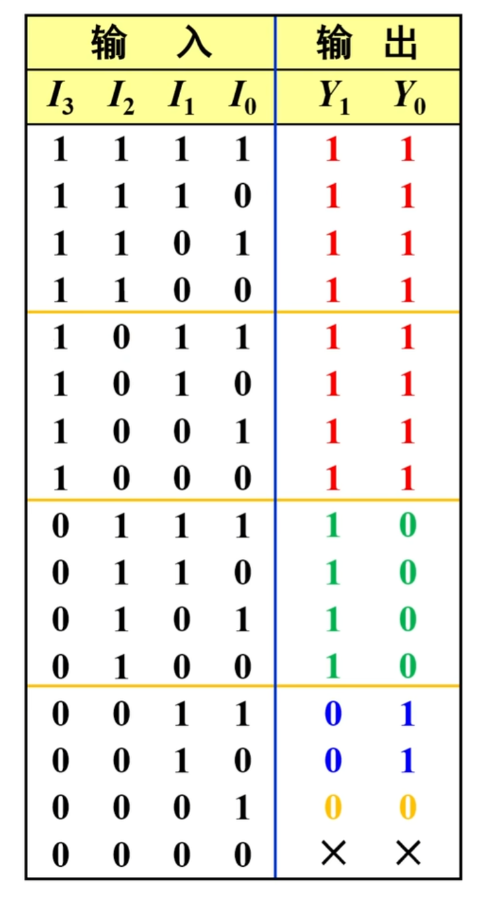

#### （2）卡诺图化简推导输出表达式

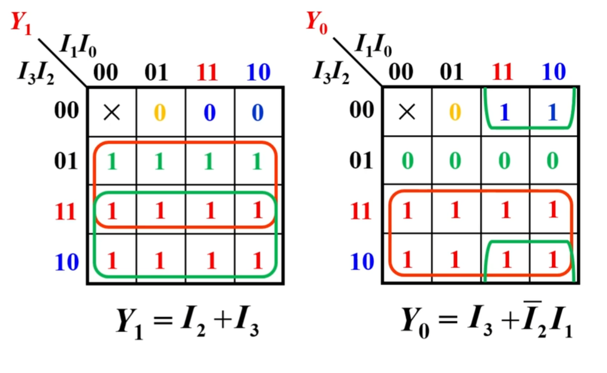

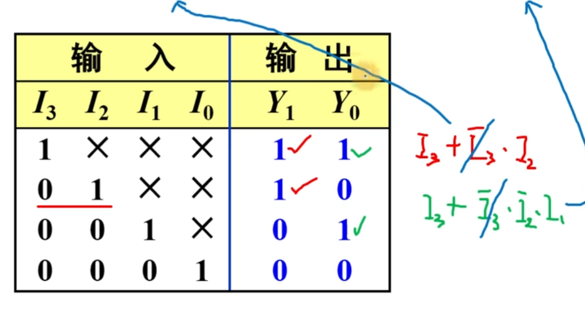

### 3. 8 输入优先编码器（核心应用场景）

#### （1）功能表（简化，含无关项）


#### （2）输出表达式推导（利用逻辑代数化简）

核心化简公式：\( A + \overline{A} \cdot B = A + B \)（消去低优先级输入的 “非” 项），推导过程如下：

- \( Y_2 \)：对应优先级 \( I_7>I_6>I_5>I_4 \)，原始表达式为：\( Y_2 = I_7 + \overline{I_7} \cdot I_6 + \overline{I_7} \cdot \overline{I_6} \cdot I_5 + \overline{I_7} \cdot \overline{I_6} \cdot \overline{I_5} \cdot I_4 \)

利用 \( A+\overline{A}B=A+B \) 逐步化简，最终得 \( Y_2 = I_7 + I_6 + I_5 + I_4 \)；

- \( Y_1 \)：对应优先级 \( I_7>I_6>I_3>I_2 \)，原始表达式为：\( Y_1 = I_7 + \overline{I_7} \cdot I_6 + \overline{I_7} \cdot \overline{I_6} \cdot \overline{I_5} \cdot \overline{I_4} \cdot I_3 + \overline{I_7} \cdot \overline{I_6} \cdot \overline{I_5} \cdot \overline{I_4} \cdot \overline{I_3} \cdot I_2 \)

化简后得 \( Y_1 = I_7 + I_6 + \overline{I_5} \cdot \overline{I_4} \cdot (I_3 + I_2) \)；

- \( Y_0 \)：对应优先级 \( I_7>I_5>I_3>I_1 \)，原始表达式为：\( Y_0 = I_7 + \overline{I_7} \cdot \overline{I_6} \cdot I_5 + \overline{I_7} \cdot \overline{I_6} \cdot \overline{I_5} \cdot \overline{I_4} \cdot I_3 + \overline{I_7} \cdot \overline{I_6} \cdot \overline{I_5} \cdot \overline{I_4} \cdot \overline{I_3} \cdot \overline{I_2} \cdot I_1 \)

化简后得 \( Y_0 = I_7 + \overline{I_6} \cdot I_5 + \overline{I_6} \cdot \overline{I_4} \cdot I_3 + \overline{I_6} \cdot \overline{I_4} \cdot \overline{I_2} \cdot I_1 \)。


#  译码器

## 一、译码器基本概念与核心特性

### 1. 定义与逆过程关系

- **译码**：将具有特定意义的二进制代码，反向转换为对应有效信号输出的过程（与 “编码器” 互为逆过程）。

- 编码器：输入有效电平 → 输出二进制代码；

- 译码器：输入二进制代码 → 输出有效电平。

- **译码器电路**：实现译码功能的电子电路，英文为 “Decoder”。

- **核心特性**：任意时刻仅能译出**一个有效电平**（与普通编码器 “仅一个输入有效”、优先编码器 “仅优先级最高输入编码” 的逻辑一致）。

## 二、译码器的分类

视频中明确将译码器分为三类，各类特性与应用场景如下：

| 分类              | 核心功能                                      | 输入输出关系                             | 关键特点                                              |
| ----------------- | --------------------------------------------- | ---------------------------------------- | ----------------------------------------------------- |
| 二进制译码器      | 译出二进制代码对应的全部组合信号              | n 位输入 → 2ⁿ位输出（全译码）            | 输入为 2 位 / 3 位 / 4 位二进制代码，输出覆盖所有组合 |
| 二 - 十进制译码器 | 将 4 位 BCD 码译为 0-9 共 10 个十进制对应信号 | 4 位输入 → 10 位输出（部分译码）         | 仅使用 4 位二进制的 10 种组合，剩余 6 种为 “伪码”     |
| 显示译码器        | 驱动七段数码管，将二进制代码译为数字显示      | 4 位输入 → 7 位输出（控制数码管 a-g 段） | 与七段数码管配套，控制各段 LED 亮灭                   |

### 1. 二进制译码器细节

- **输入输出数量规律**：

- 2 位二进制译码器：2 位输入（00-11）→ 4 位输出；

- 3 位二进制译码器：3 位输入（000-111）→ 8 位输出；

- 4 位二进制译码器：4 位输入（0000-1111）→ 16 位输出；

*示例*：3 位输入 “000” 对应输出 “Y0 有效”，“001” 对应 “Y1 有效”，直至 “111” 对应 “Y7 有效”。

### 2. 二 - 十进制译码器细节

- **输入输出特点**：

- 输入：4 位 BCD 码（0000-1001，对应十进制 0-9）；

- 输出：10 位信号（对应 0-9，仅 1 位有效）；

- 伪码处理：输入 4 位二进制的剩余 6 种组合（1010-1111）时，所有输出均为 “无效电平”。

- **本质**：属于 “部分译码器”（4 位输入本可产生 16 种组合，仅使用 10 种），区别于二进制译码器的 “全译码”。

### 3. 显示译码器基础

- **配套器件**：七段数码管（由 7 段 LED（a-g）组成，小数点单独控制），每段为一个发光二极管（LED）。

- **LED 点亮原理**：需加正偏电压（阳极 A 接高电平，阴极 K 接低电平，超过死区电压即发光）。

- **数字显示控制**：通过控制 a-g 段的亮灭实现 0-9 的显示，示例如下：

- 显示 “1”：仅 b、c 段亮；

- 显示 “2”：a、b、g、e、d 段亮；

- 显示 “0”：a、b、c、d、e、f 段亮（g 段灭）。

- **输入输出**：输入为 4 位二进制代码（如 “0001” 对应数字 1），输出为 7 位控制信号（a-g 段的高低电平）。

## 三、二进制译码器的设计（以 3 位为例）

### 1. 设计需求与端口定义

- **输入**：3 位二进制代码A₂A₁A₀（如 000、001、…、111）；

- **输出**：8 位信号Y₀~Y₇（对应输入的 8 种组合，高电平有效，即仅 1 位输出为 1，其余为 0）。

### 2. 真值表构建（完整真值表）

由于 3 位输入仅有 8 种组合，真值表覆盖所有情况，部分行如下：

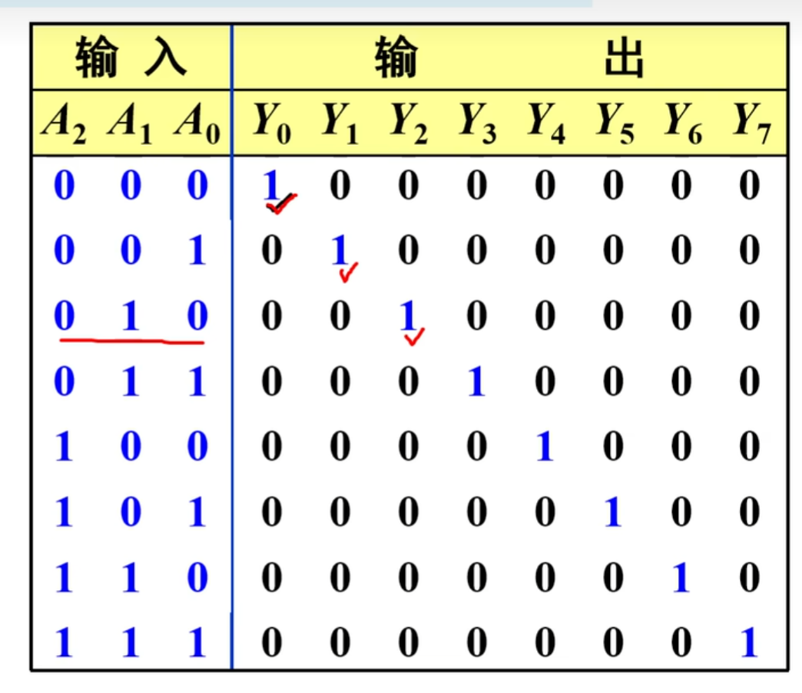

| 输入（A₂A₁A₀） | 输出（Y₇Y₆Y₅Y₄Y₃Y₂Y₁Y₀） | 说明               |
| -------------- | ------------------------ | ------------------ |
| 000            | 00000001                 | Y₀有效（高电平 1） |
| 001            | 00000010                 | Y₁有效             |
| 010            | 00000100                 | Y₂有效             |
| ...            | ...                      | ...                |
| 111            | 10000000                 | Y₇有效             |

### 3. 输出逻辑表达式（最小项形式）

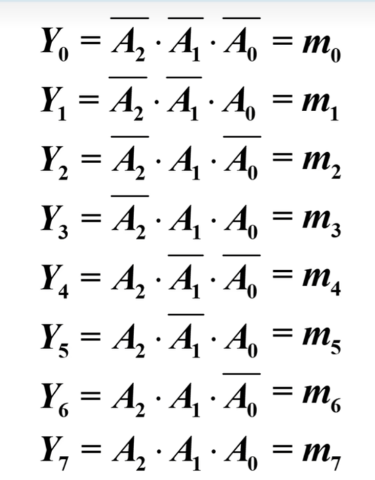

### 4. 逻辑图绘制

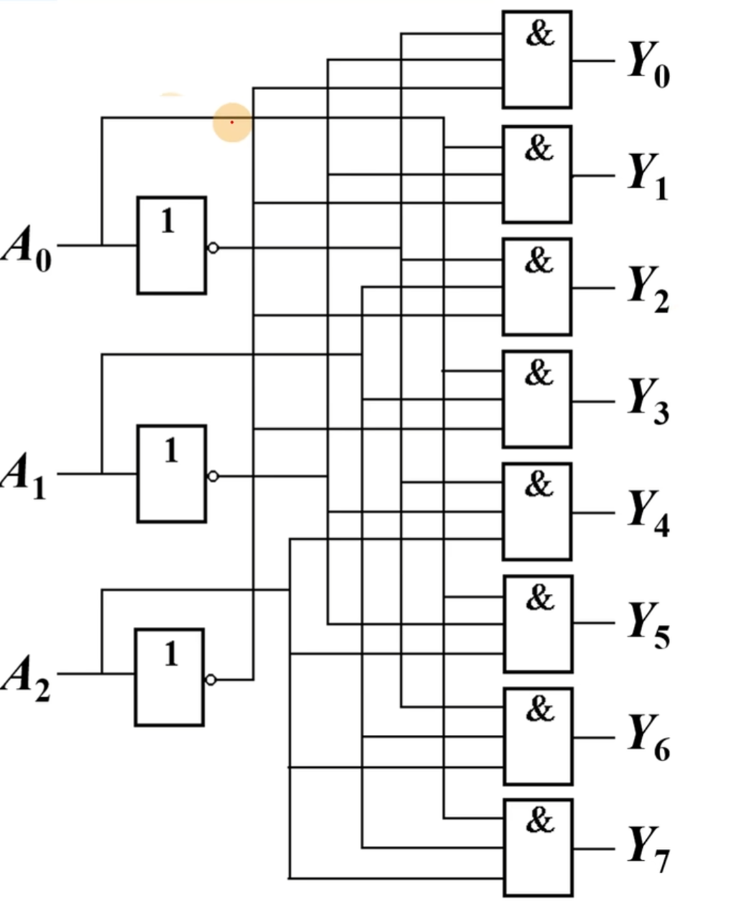

- **反变量获取**：通过 3 个非门，将A₂A₁A₀转换为¬A₂、¬A₁、¬A₀；

- **输出门电路**：使用 8 个三输入 “与门”，每个与门输入对应最小项的原 / 反变量（如 Y₀的与门输入¬A₂、¬A₁、¬A₀），输出即为Y₀~Y₇。

## 四、集成二进制译码器：74LS138（3 线 - 8 线译码器）

### 1. 芯片管脚与端口定义（16 脚封装）

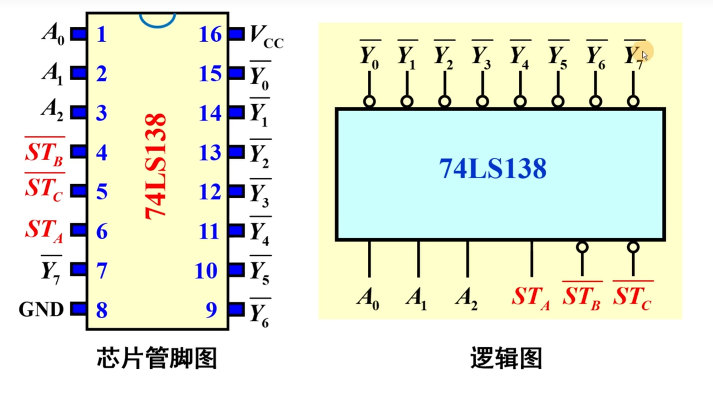

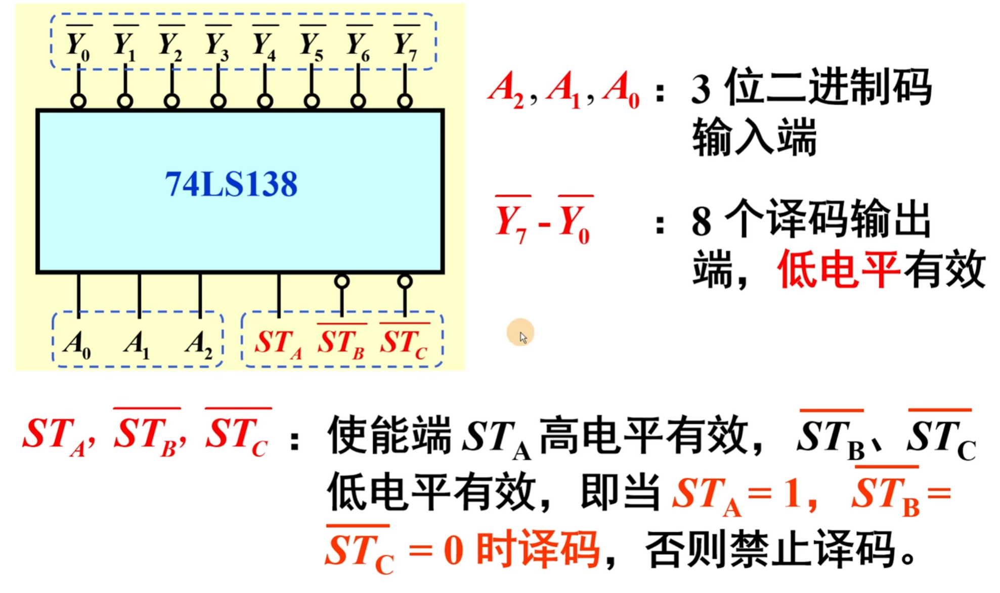

| 端口类型         | 管脚编号与符号                          | 功能说明                               |
| ---------------- | --------------------------------------- | -------------------------------------- |
| 电源端           | 8 脚（GND）、16 脚（VCC）               | TTL 芯片，VCC 接 + 5V，GND 接地        |
| 二进制输入端     | 1 脚（A₂）、2 脚（A₁）、3 脚（A₀）      | 3 位输入，A₂为高位，A₀为低位           |
| 译码输出端       | 4~11 脚（¬Y₀~¬Y₇）                      | 低电平有效（输出 0 表示对应信号有效）  |
| 控制端（使能端） | 6 脚（STA）、5 脚（¬STB）、4 脚（¬STC） | STA：高电平有效；¬STB/¬STC：低电平有效 |

### 2. 功能表（核心逻辑）

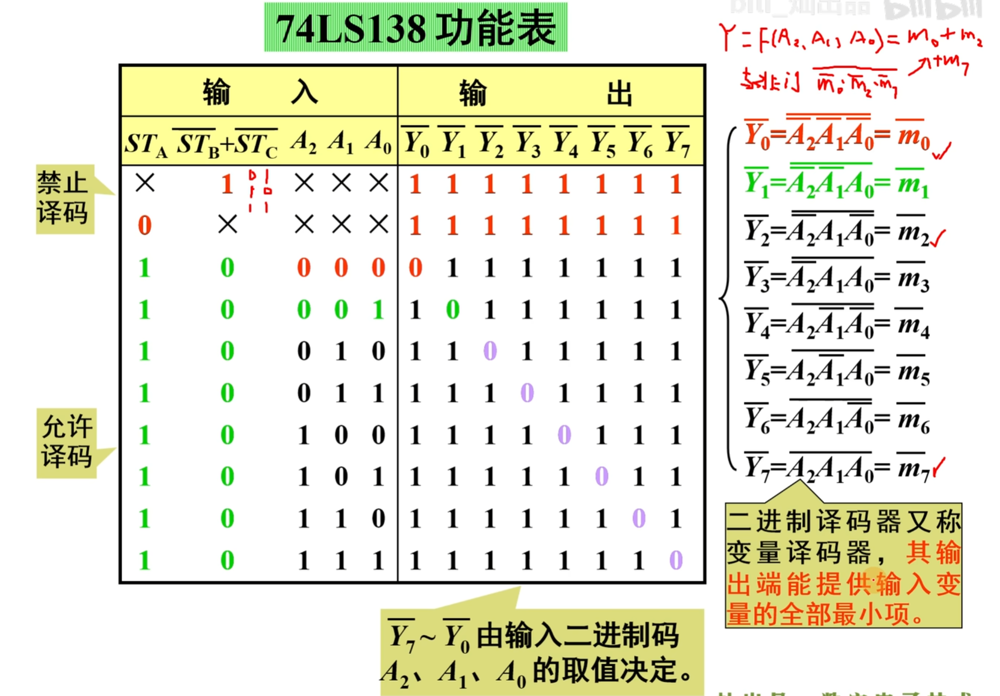

74LS138 的工作状态由控制端决定，分为 “禁止译码” 和 “允许译码” 两种：

| 控制端（STA, ¬STB, ¬STC） | 输入（A₂A₁A₀） | 输出（¬Y₇~¬Y₀）   | 状态     |
| ------------------------- | -------------- | ----------------- | -------- |
| 0, X, X（X 为任意）       | X, X, X        | 11111111（全高）  | 禁止译码 |
| X, 1, X 或 X, X, 1        | X, X, X        | 11111111（全高）  | 禁止译码 |
| 1, 0, 0                   | 000            | 11111110（¬Y₀=0） | 允许译码 |
| 1, 0, 0                   | 001            | 11111101（¬Y₁=0） | 允许译码 |
| 1, 0, 0                   | ...            | ...               | 允许译码 |
| 1, 0, 0                   | 111            | 01111111（¬Y₇=0） | 允许译码 |

### 3. 输出逻辑表达式（最小项反函数）

由于输出为低电平有效，每个输出对应最小项的反函数：

- ¬Y₀ = ¬m₀；¬Y₁ = ¬m₁；...；¬Y₇ = ¬m₇。

### 4. 应用：实现逻辑函数（函数发生器）

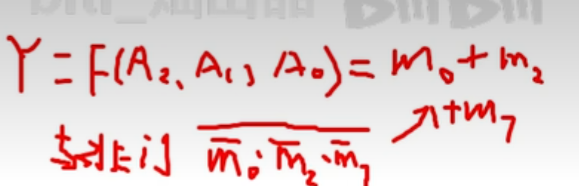

利用 74LS138 输出 “最小项反函数” 的特性，结合 “与非门” 实现任意 3 变量逻辑函数（基于摩根定律）：

- 示例：实现函数F = m₀ + m₂ + m₇（即输入 A₂A₁A₀为 000、010、111 时 F=1）；

- 推导：F = m₀ + m₂ + m₇ = ¬(¬m₀ · ¬m₂ · ¬m₇) = ¬(¬Y₀ · ¬Y₂ · ¬Y₇)；

- 电路：将 74LS138 的 ¬Y₀、¬Y₂、¬Y₇接入一个三输入 “与非门”，与非门输出即为 F。

## 五、译码器扩展：两片 74LS138 实现 4 线 - 16 线译码器

当需要更多输入 / 输出时，可通过 “级联” 扩展，示例为 “4 位输入→16 位输出”：

### 1. 扩展原理

- **核心思路**：用 “高位输入” 控制两片 74LS138 的使能端，实现 “轮流工作”（一片工作时，另一片禁止）。

- **器件分工**：

- 低位片：处理输入的低 3 位（A₂A₁A₀），输出 ¬Y₀~¬Y₇；

- 高位片：处理输入的低 3 位（A₂A₁A₀），输出 ¬Y₈~¬Y₁₅（将高位片的 ¬Y₀~¬Y₇重新编号为 ¬Y₈~¬Y₁₅）。

### 2. 具体接线

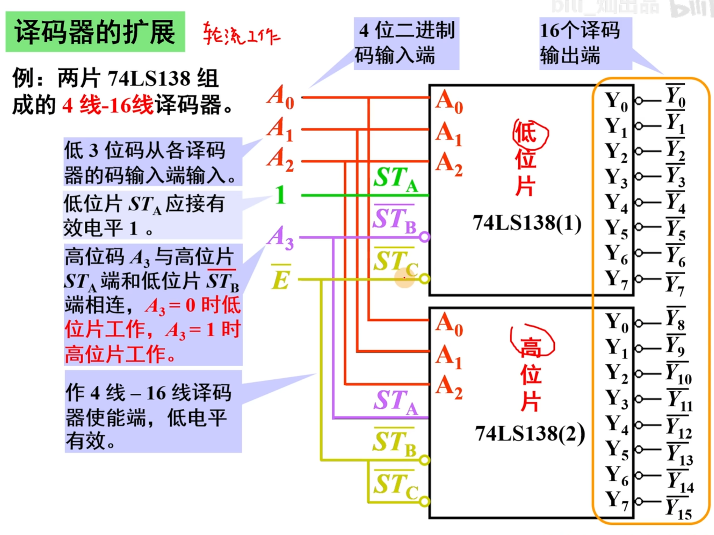

| 端口类型       | 低位片（输出 ¬Y₀~¬Y₇）             | 高位片（输出 ¬Y₈~¬Y₁₅）            |
| -------------- | ---------------------------------- | ---------------------------------- |
| 低 3 位输入    | A₂、A₁、A₀分别与高位片对应端短接   | A₂、A₁、A₀分别与低位片对应端短接   |
| 高位输入（A₃） | 接 ¬STB（低电平有效控制端）        | 接 STA（高电平有效控制端）         |
| 公共使能端     | ¬STC 接公共使能端 ¬E（低电平有效） | ¬STC 接公共使能端 ¬E（低电平有效） |
| 电源与地       | VCC 接 + 5V，GND 接地              | VCC 接 + 5V，GND 接地              |

### 3. 工作逻辑（仅当 ¬E=0 时允许译码）

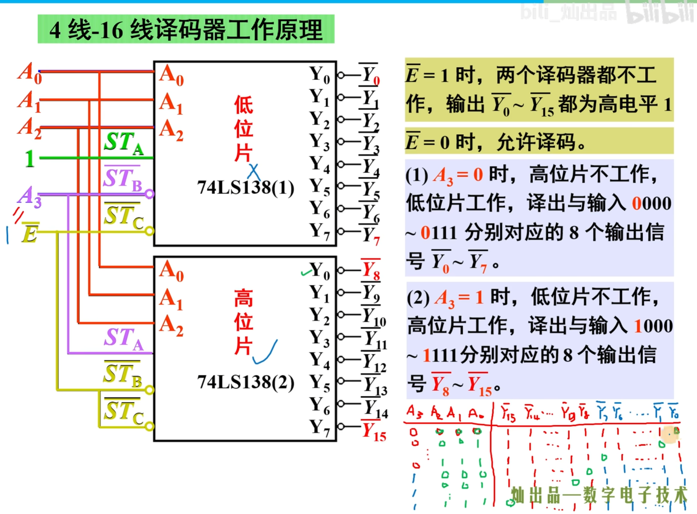

- **当 A₃=0 时**：

- 低位片：STA=1（接高电平）、¬STB=A₃=0、¬STC=¬E=0 → 允许译码；

- 高位片：STA=A₃=0 → 禁止译码（输出全 1）；

- 结果：仅低位片输出有效（¬Y₀~¬Y₇对应输入 A₃A₂A₁A₀为 0000~0111）。

- **当 A₃=1 时**：

- 低位片：¬STB=A₃=1 → 禁止译码（输出全 1）；

- 高位片：STA=A₃=1、¬STB=0（接低电平）、¬STC=¬E=0 → 允许译码；

- 结果：仅高位片输出有效（¬Y₈~¬Y₁₅对应输入 A₃A₂A₁A₀为 1000~1111）。

- **示例**：

- 输入 A₃A₂A₁A₀=0000 → 低位片 ¬Y₀=0（有效），其余输出 1；

- 输入 A₃A₂A₁A₀=1111 → 高位片 ¬Y₁₅=0（有效），其余输出 1。

## 六、二 - 十进制译码器：集成芯片 74LS42

### 1. 芯片特性（16 脚封装）

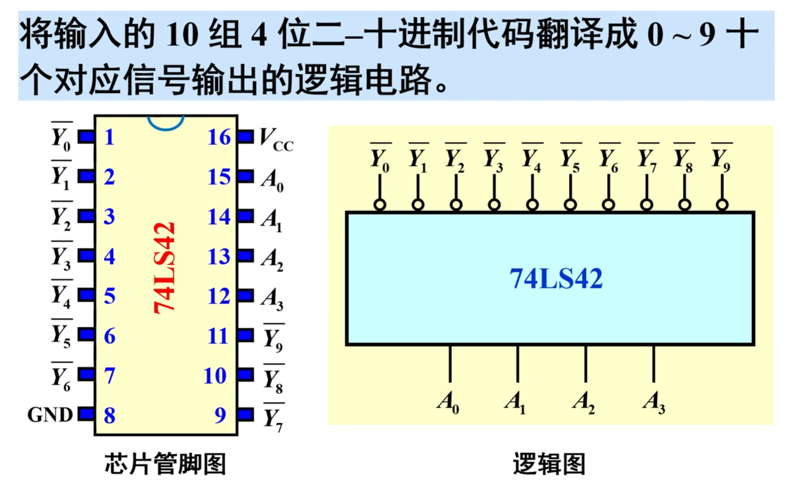

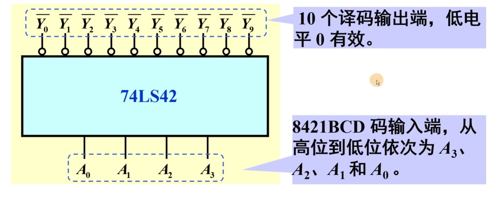

- **输入**：4 位 BCD 码（A₃A₂A₁A₀，0000~1001 对应十进制 0~9）；

- **输出**：10 位低电平有效信号（¬Y₀~¬Y₉，对应十进制 0~9）；

- **无控制端**：始终处于 “允许译码” 状态（无禁止功能）。

### 2. 功能表（核心行）

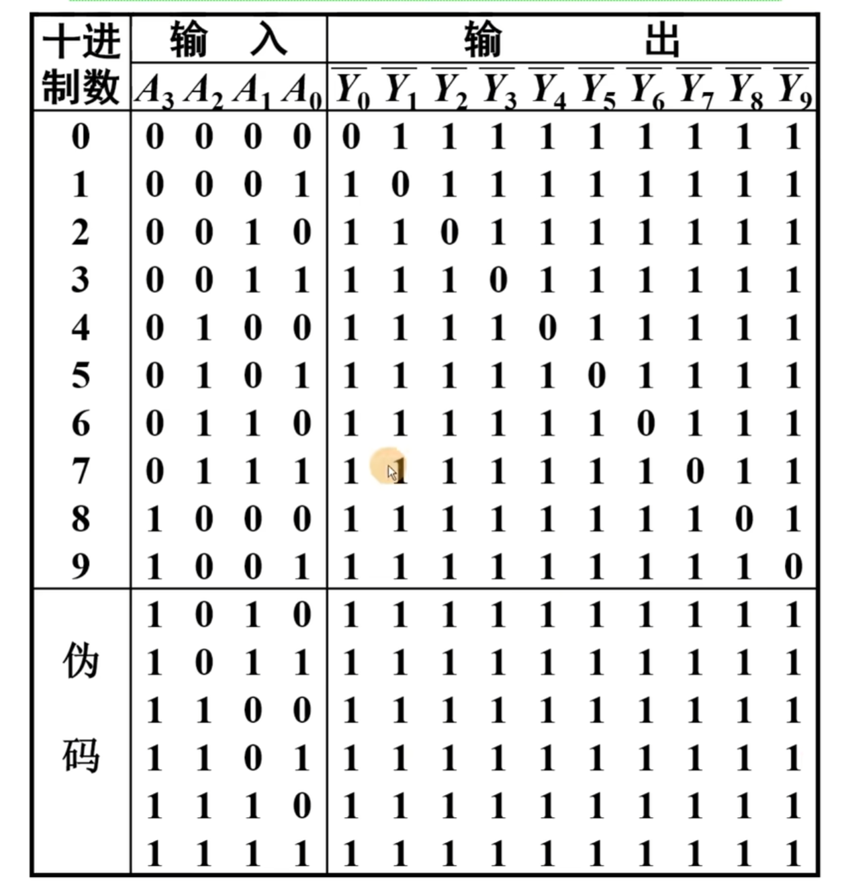

| 输入（A₃A₂A₁A₀）  | 输出（¬Y₉~¬Y₀）     | 对应十进制 |
| ----------------- | ------------------- | ---------- |
| 0000              | 1111111110（¬Y₀=0） | 0          |
| 0001              | 1111111101（¬Y₁=0） | 1          |
| ...               | ...                 | ...        |
| 1001              | 0111111111（¬Y₉=0） | 9          |
| 1010~1111（伪码） | 1111111111（全高）  | 无效       |

## 七、仿真验证

### 1. 74LS138 功能仿真

- **接线**：STA 接 + 5V，¬STB、¬STC 接地（满足允许译码条件），A₂A₁A₀通过 “电子开关” 控制（开关断开为 1，闭合为 0）；

- **现象**：

- 输入 A₂A₁A₀=000 → ¬Y₀灯亮（低电平 0）；

- 输入 A₂A₁A₀=111 → ¬Y₇灯亮；

- 结果与功能表完全一致。

### 2. 4 线 - 16 线扩展仿真

- **接线**：按 “两片 74LS138 扩展” 方式连接，A₃通过开关控制；

- **现象**：

- A₃=0、A₂A₁A₀=000 → ¬Y₀灯亮；

- A₃=1、A₂A₁A₀=111 → ¬Y₁₅灯亮；

- 禁止译码（¬E=1）时，16 个输出灯全亮（全高电平）。