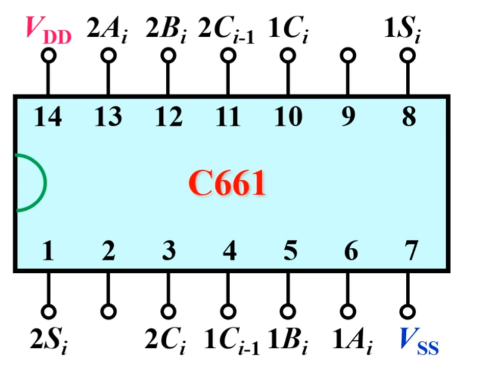
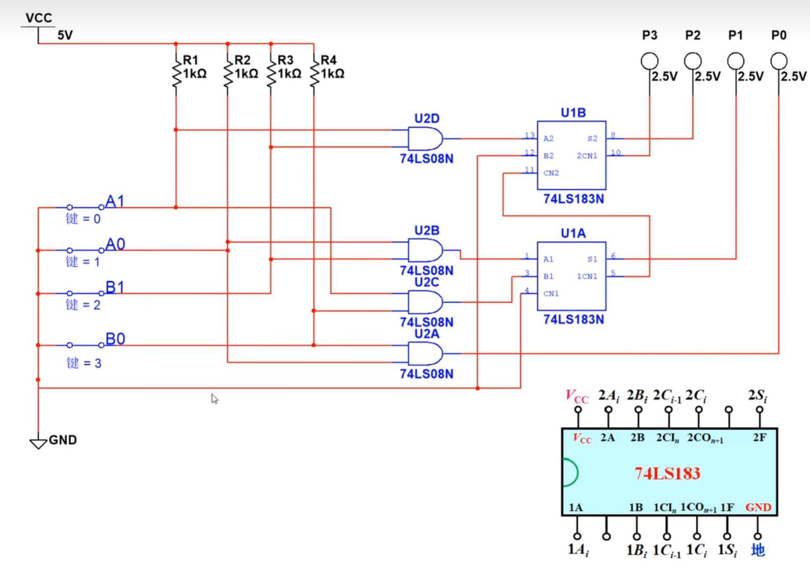
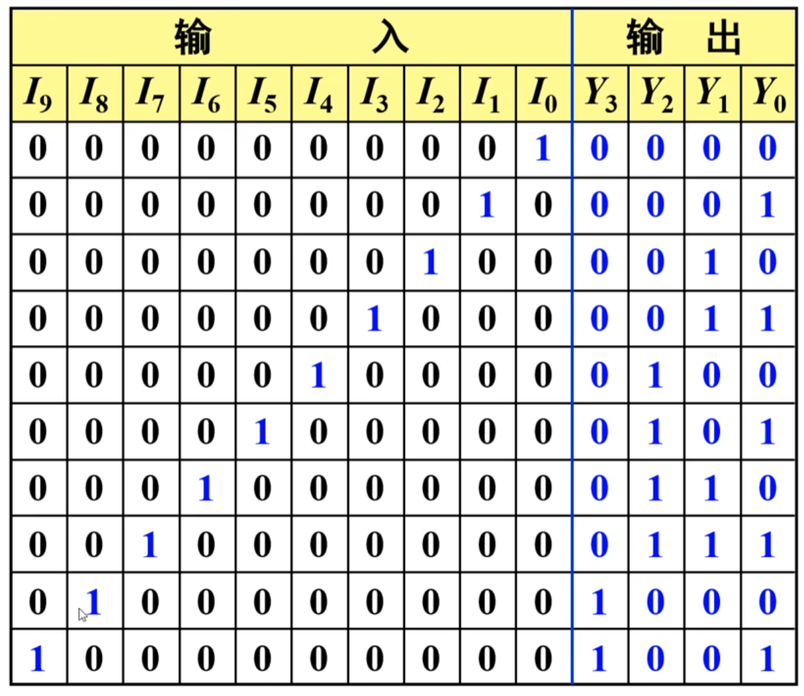
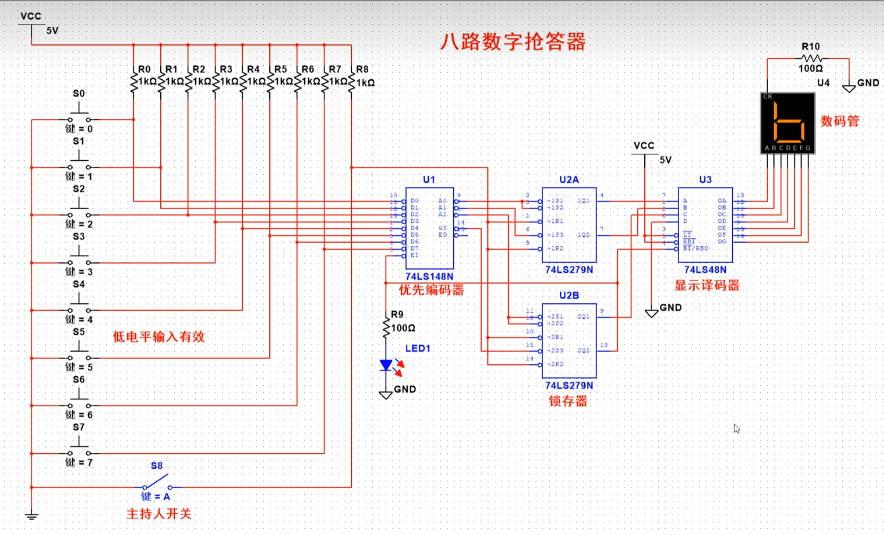
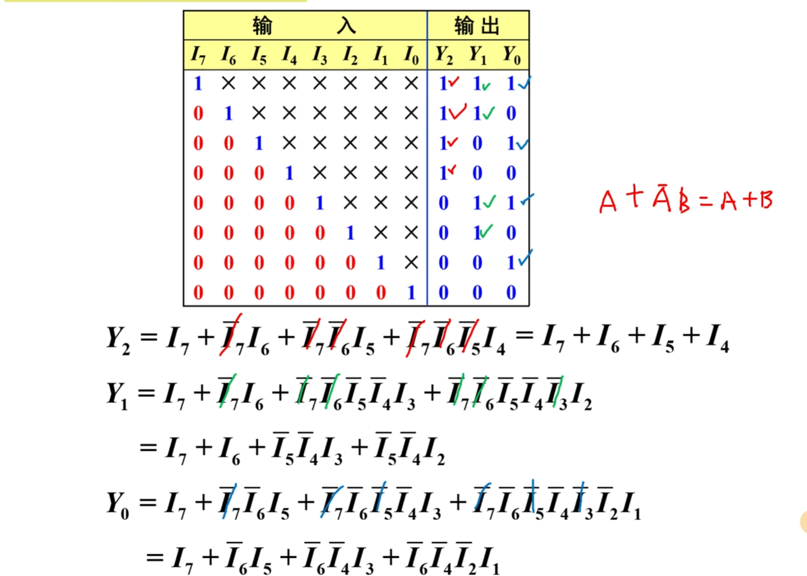
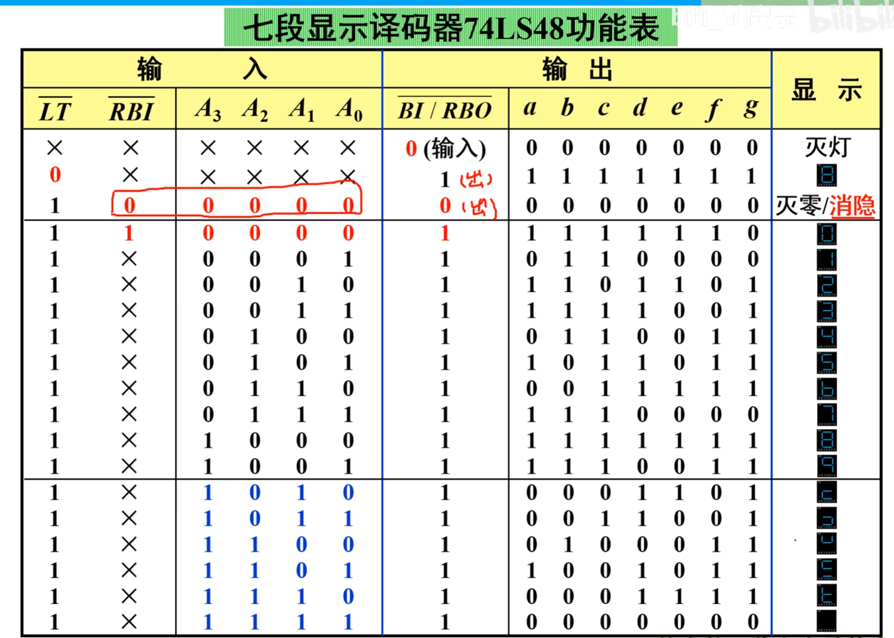
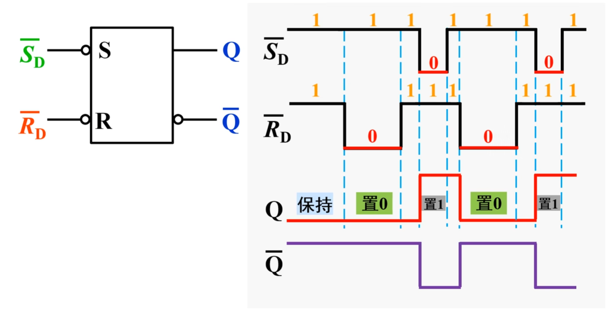
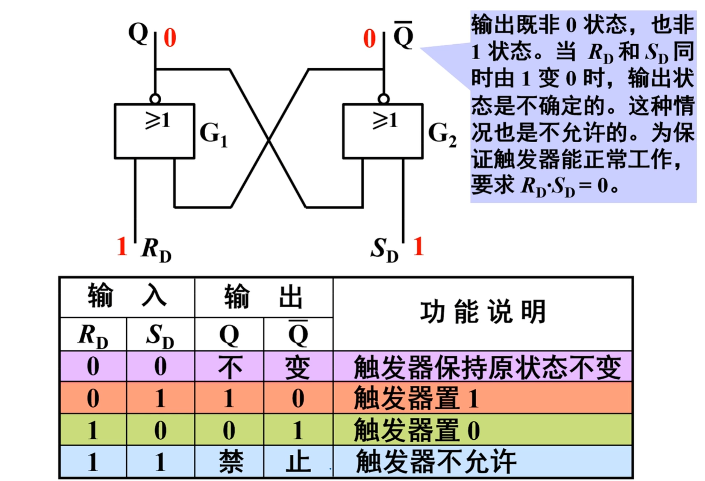

#  35-CMOS 反相器

## 一、数字集成门电路的分类与对比

视频开篇明确数字电路按电路结构的核心分类，及两类电路的核心差异：

1. **分类依据**：核心器件不同

- **TTL 集成门电路**：核心器件为三极管（电流控制器件）

- **CMOS 集成门电路**：核心器件为 MOS 管（场效应管，电压控制器件）

1. **TTL 集成门电路特性**：

- 优点：耐用性强

- 缺点：单元电路结构复杂、需外加电隔离、功耗大、集成度低

1. **CMOS 集成门电路的核心优势（视频重点强调）**：

- 功耗极低：采用场效应管 + 互补对称结构，静态时两管一导通一截止，理论静态功耗为 0，实际因漏电流功耗约 20 毫瓦

- 工作电压范围宽：以国产**CC4000 系列**为例，工作电压可覆盖 3~18V

- 逻辑摆幅大：高电平（“1”）接近电源高电位 VDD，低电平（“0”）接近电源低电位 VSS，高低电平差值大

- 输入阻抗高：基本不消耗驱动电路功率，且抗干扰能力强

- 扇出能力强：可驱动 50 个以上同类型门电路（扇出：门电路能驱动的同类门数量）

1. **CMOS 集成门电路的缺点**：

- 对静电放电和过电压敏感，易被击穿，使用时需特别注意静电防护和过电压问题

## 二、本视频核心学习目标

本节需掌握的三大核心内容：

1. 掌握 CMOS 反相器的**电路工作原理**和**主要外特性**

1. 理解 CMOS 开路门、三态门和传输门的电路结构与逻辑功能

1. 理解 CMOS 集成电路的使用要点

## 三、CMOS 反相器的电路结构

视频详细拆解了 CMOS 反相器的电路组成、MOS 管分类及连接规则：


### 1. 核心组成：互补对称的 MOS 管

CMOS 反相器由两个增强型 MOS 管组成，分别为：

- **P 沟道场效应管（标记为 VP）**

- **N 沟道场效应管（标记为 VN）**

### 2. MOS 管的关键分类与识别

| 分类维度       | 分类结果     | 识别方法（视频明确）                           |
| -------------- | ------------ | ---------------------------------------------- |
| 按沟道类型     | N 沟道（VN） | 箭头方向：由 P 指向 N（沟道为 N 型）           |
|                | P 沟道（VP） | 箭头方向：由 P 指向 N（沟道为 P 型）           |
| 按导电沟道状态 | 增强型       | 沟道右侧竖线为**分隔状态**（三条短线不连接）   |
|                | 耗尽型       | 沟道右侧竖线为**连接状态**（三条短线连为一条） |

### 3. MOS 管的引脚功能（视频标注说明）

- G：栅极（电压控制端）

- D：漏极（电流流出 / 流入端）

- S：源极（电流流入 / 流出端）

- B：衬底（出厂时已与源极 S 连接，无需额外操作）

### 4. CMOS 反相器的电路连接规则

- 输入端：两个 MOS 管的**栅极 G 连在一起**，作为输入端口 A（输入电压为 UI）

- 输出端：两个 MOS 管的**漏极 D 连在一起**，作为输出端口 Y（输出电压为 Uo）

- 电源连接：

- P 沟道 MOS 管（VP）的源极 S、衬底 B 接正电源 VDD

- N 沟道 MOS 管（VN）的源极 S、衬底 B 接地（电源低电位 VSS）

- 结构特点：属于 “互补对称结构”（“CMOS” 中 “C” 即 “互补” Complementary）

### 5. 电路分析约定

- 输入电平定义：低电平 = 0V，高电平 = VDD

- 导通电压（门槛电压）：两管的门槛电压 UGS (th) 数值相同（N 沟道为正值，P 沟道为负值）

- 电源条件：VDD > 两管门槛电压的绝对值之和（确保电路正常工作）

## 四、CMOS 反相器的工作原理

视频分两种输入状态，分析 MOS 管导通 / 截止状态及输出电平，核心逻辑为 “非门（反相）”：

### 1. 情况 1：输入低电平（UI = 0V）

- **N 沟道 MOS 管（VN）状态分析**：

- 栅源电压 UGS = UI - 地电位 = 0V - 0V = 0V

- 因 N 沟道管门槛电压 UGS (th) 为正值（通常约 2V），0V < UGS (th)，故**VN 截止**

- **P 沟道 MOS 管（VP）状态分析**：

- 栅源电压 UGS = UI - VDD = 0V - VDD = -VDD

- 因 P 沟道管门槛电压 UGS (th) 为负值，其绝对值 | UGS| = VDD > |UGS (th)|，故**VP 导通**

- **输出电平计算**：

- 导通的 VP 等效为低电阻 Ron，截止的 VN 等效为高电阻 Roff（Ron << Roff）

- 输出端 Y 通过 VP 连接到 VDD，故输出电压 Uo ≈ VDD（高电平）

### 2. 情况 2：输入高电平（UI = VDD）

- **N 沟道 MOS 管（VN）状态分析**：

- 栅源电压 UGS = UI - 地电位 = VDD - 0V = VDD

- VDD > UGS (th)（正值），故**VN 导通**

- **P 沟道 MOS 管（VP）状态分析**：

- 栅源电压 UGS = UI - VDD = VDD - VDD = 0V

- |UGS| = 0V <|UGS (th)|（负值的绝对值），故**VP 截止**

- **输出电平计算**：

- 导通的 VN 等效为低电阻 Ron，截止的 VP 等效为高电阻 Roff（Ron << Roff）

- 输出端 Y 通过 VN 接地，故输出电压 Uo ≈ 0V（低电平）

### 3. 核心结论

- **逻辑功能**：输入低电平→输出高电平，输入高电平→输出低电平，符合**非门（反相器）** 逻辑关系，电路符号为 “非门符号（带反相圈）”

- **功耗特性**：无论输入为高 / 低电平，两管始终 “一导通一截止”，VDD 与地之间无通路（无静态电流），故**静态功耗极低**（理论为 0，实际因漏电流约 20 毫瓦）


#  CMOS 型 OD 门、传输门、三态门

## 一、漏极开路 CMOS 门（OD 门）

### 1. 基本定义与对比

- **定义**：漏极开路（Open Drain）的 CMOS 门电路，核心特征是输出端的 MOS 管漏极未接任何电路（悬空），需外接元件才能工作。

- **与 TTL 电路对比**：对应 TTL 中的**OC 门（集电极开路与非门）**，TTL 的 OC 门是集电极开路，CMOS 的 OD 门是漏极开路，原理类似但基于不同器件（TTL 为三极管，CMOS 为 MOS 管）。

### 2. 电路结构

- **核心组成**：


1. 输入级：2 个输入信号A、B，先经过**与非门**，再经过**非门**，等效为对A、B做 “与运算”（即A·B）；

1. 输出级：1 个**N 沟道增强型 MOS 管**，其栅极（G）接输入级的输出（A·B），源极（S）接地（且 B 衬底与源极出厂时已连通，确认 S 极身份），**漏极（D）悬空**（无接电源或其他电路），漏极作为 OD 门的输出端。

### 3. 工作条件

- 必须**外接上拉电阻（RD）和外接电源（VDD2）** 才能正常工作：

- 上拉电阻RD一端接外接电源VDD2，另一端接 OD 门的漏极（输出端）；

- VDD2可与 CMOS 门自身的电源VDD1相等，也可不等（支持电平转换）。

### 4. 工作原理与逻辑功能

#### （1）关键判断：N 沟道 MOS 管的导通 / 截止条件

- N 沟道增强型 MOS 管：仅当栅极输入**高电平（1）** 时导通，输入**低电平（0）** 时截止。

#### （2）分情况分析

| 输入A、B的 “与运算” 结果（A·B） | N 沟道 MOS 管状态 | 输出Y状态 | 原理说明                                                     |
| ------------------------------- | ----------------- | --------- | ------------------------------------------------------------ |
| 0（低电平）                     | 截止              | 高电平    | MOS 管截止时，漏极通过上拉电阻RD接VDD2，输出Y=VDD2（高电平） |
| 1（高电平）                     | 导通              | 低电平    | MOS 管导通时，漏极（输出端）通过导通的 MOS 管接地，Y被钳位在 0V（低电平） |

#### （3）逻辑功能表达式

- 输出Y与输入A、B的关系：Y = (A·B)'（即对A、B的 “与” 结果取反，实现**与非逻辑**）。

### 5. 电路符号

- 核心标识：在普通与非门符号基础上，**输出端添加 “菱形 + 横线”**，表示 “漏极开路”；

- 符号要素：输入为A、B，输出为Y，标注 “OD” 或通过 “漏极开路标识” 区分，需额外画出外接的RD和VDD2。

### 6. 主要应用（与 TTL OC 门类似）

- 视频明确提及 OD 门可实现：

1. **驱动器**：驱动需更高电压 / 电流的负载（通过调整VDD2实现）；

1. **电平转换**：当VDD2≠VDD1时，可将VDD1电平域的信号转换为VDD2电平域的信号；

1. **线与逻辑**：多个 OD 门的输出端接在同一条总线上，通过上拉电阻实现 “线与”（即所有 OD 门输出均为高电平时，总线才为高；任一 OD 门输出低电平，总线为低）。

### 7. 示例

- 若VDD1=VDD2=5V，A=1、B=1：

- 输入级输出A·B=1（高电平），N 沟道 MOS 管导通；

- 输出Y通过导通的 MOS 管接地，Y=0V（低电平），符合Y=(1·1)'=0。

- 若A=1、B=0：

- 输入级输出A·B=0（低电平），N 沟道 MOS 管截止；

- 输出Y通过RD接VDD2=5V，Y=5V（高电平），符合Y=(1·0)'=1。

## 二、CMOS 传输门（TG 门）

### 1. 基本定义

- 一种具有**双向信号传输能力**的 CMOS 开关电路，核心功能是通过控制信号控制 “导通 / 断开”，实现对输入信号的传输或阻断。

### 2. 电路结构


- **核心组成**：由一对**参数完全对称的增强型 MOS 管**并联构成：

1. 上管：**P 沟道增强型 MOS 管**，箭头方向 “从 P 指向 N”（标识 P 沟道）；

1. 下管：**N 沟道增强型 MOS 管**，箭头方向 “指向沟道”（标识 N 沟道）；

- **电极连接规则**：

- 两管的**漏极（D）与源极（S）交叉连通**：P 管的 D 极接 N 管的 S 极，P 管的 S 极接 N 管的 D 极，形成公共的 “输入 / 输出端”（标注为UI/UO），即**输入和输出可互换**（双向性）；

- 两管的**栅极作为控制端**：P 管的栅极接控制信号C'（带非号，低电平有效），N 管的栅极接控制信号C（无符号，高电平有效），C与C'通常为反相关系（可通过非门连接）。

### 3. 工作原理（基于控制信号C与C'）

#### （1）控制信号逻辑关系

- 通常C与C'为反相：若C=1（高电平，VDD），则C'=0（低电平，0V）；若C=0，则C'=1。

#### （2）分情况分析

| 控制信号（C/C'） | P 沟道 MOS 管状态 | N 沟道 MOS 管状态 | 传输门功能       | 原理说明                                                     |
| ---------------- | ----------------- | ----------------- | ---------------- | ------------------------------------------------------------ |
| C=1/C'=0         | 导通              | 导通              | 闭合（传输信号） | - P 沟道管：C'=0（低电平），满足反向电压条件（0V-VDD 为负电压），导通；- N 沟道管：C=1（高电平），满足正向电压条件（大于门槛电压），导通；- 两管均导通，等效为 “闭合的双向开关”，输入信号UI可从任意一端传输到另一端（UO=UI）。 |
| C=0/C'=1         | 截止              | 截止              | 断开（阻断信号） | - P 沟道管：C'=1（高电平），电压差为 1V-VDD=0V，不满足导通条件，截止；- N 沟道管：C=0（低电平），不满足正向电压条件，截止；- 两管均截止，等效为 “断开的开关”，输入信号UI无法传输到输出端，UO悬空。 |

### 4. 电路符号

- 符号标识：标注 “TG”（Transmission Gate）；

- 核心要素：

- 双向端口：标注UI/UO，表示输入 / 输出可互换；

- 控制端：C（无圈，高电平有效）和C'（带圈，低电平有效），明确控制信号的有效电平。

### 5. 核心功能

- 实现**双向开关**：可双向传输信号（无固定输入 / 输出方向），仅通过控制信号C控制 “通 / 断”，是数字电路中信号选通、隔离的常用器件。

### 6. 示例

- 若控制信号C=1（C'=0），输入UI=3V（VDD=5V）：

- P 管和 N 管均导通，UO=UI=3V，信号从UI端传输到UO端；

- 若控制信号C=0（C'=1），输入UI=3V：

- P 管和 N 管均截止，UO悬空，无信号输出。

## 三、CMOS 三态门（TS 门）

### 1. 基本定义

- 输出具有**三种状态**的 CMOS 门电路，三种状态分别为：

1. 低电平（0 态）：输出接地，对应逻辑 0；

1. 高电平（1 态）：输出接电源，对应逻辑 1；

1. 高阻态（Z 态）：输出端悬空，既不接电源也不接地，与外部电路无电气连接。

### 2. 电路结构


- **核心组成**：4 个 MOS 管（2 个 P 沟道、2 个 N 沟道）+ 1 个非门 + 使能端，具体如下：

1. P 沟道 MOS 管：VP1（上管）和VP2（中间上管），VP1的源极（S）接 CMOS 电源VDD，漏极接VN1的漏极（作为输出端Y）；

1. N 沟道 MOS 管：VN1（中间下管）和VN2（下管），VN2的源极（S）接地，漏极接VP1的漏极（输出端Y）；

1. 控制级：1 个**使能端****EN'****（带非号，低电平有效）**，EN'接 1 个非门，非门输出端接VN2的栅极，EN'直接接VP2的栅极；

1. 输入级：1 个输入信号A，接VP1和VN1的栅极（控制VP1、VN1的导通 / 截止）。

### 3. 工作原理（基于使能端EN'的有效 / 无效状态）

#### （1）关键前提

- P 沟道 MOS 管：低电平（0）导通，高电平（1）截止；

- N 沟道 MOS 管：高电平（1）导通，低电平（0）截止；

- 使能端EN'：**低电平有效**（EN'=0时三态门正常工作，EN'=1时三态门禁止工作）。

#### （2）分情况分析

##### 情况 1：EN'=0（使能有效，三态门正常工作）

- 非门输出：EN'=0经非门后输出1；

- 中间 MOS 管状态：

- VP2（P 沟道）：栅极接EN'=0（低电平），导通，VP1的源极（S）通过VP2接VDD；

- VN2（N 沟道）：栅极接非门输出1（高电平），导通，VN1的源极（S）通过VN2接地；

- 核心等效：此时VP1和VN1构成**普通 CMOS 反相器**（VP1接VDD，VN1接地），输入A控制输出Y：

- 若A=1：VP1截止，VN1导通，Y接地 → 低电平（0）；

- 若A=0：VP1导通，VN1截止，Y接VDD → 高电平（1）。

##### 情况 2：EN'=1（使能无效，三态门禁止工作）

- 非门输出：EN'=1经非门后输出0；

- 中间 MOS 管状态：

- VP2（P 沟道）：栅极接EN'=1（高电平），截止，VP1的源极（S）与VDD断开；

- VN2（N 沟道）：栅极接非门输出0（低电平），截止，VN1的源极（S）与地断开；

- 核心状态：VP1和VN1无供电 / 接地通路，输出端Y悬空 → **高阻态（Z）**。

### 4. 逻辑功能与表达式

- 仅当EN'=0（使能有效）时，实现反相逻辑：Y = A'；

- 当EN'=1（使能无效）时，Y为高阻态（Z），无逻辑表达式。

### 5. 电路符号


- 核心标识：在普通反相器符号基础上，**添加 “倒三角”** 表示 “三态门”；

- 符号要素：

- 输入端：A（单输入，标 “1” 表示单输入，多输入则标 “&” 等逻辑符号）；

- 使能端：EN'（带圈，标注非号，明确低电平有效）；

- 输出端：Y，通过倒三角区分三态特性。

### 6. 示例

- 若EN'=0（有效），A=1：

- VP2、VN2导通，VP1截止、VN1导通，Y=0（低电平），符合Y=A'=0；

- 若EN'=0（有效），A=0：

- VP2、VN2导通，VP1导通、VN1截止，Y=VDD（高电平），符合Y=A'=1；

- 若EN'=1（无效），无论A=0或A=1：

- VP2、VN2截止，Y悬空，为高阻态（Z）。


#   集成电路系列

## 一、CMOS 集成电路的两大核心系列

### 1. CMOS 4000 系列

- **功耗特性**：门电路功耗极低（视频明确表述 “该系列的门电路功耗是很低的”）

- **抗干扰能力**：抗干扰能力强（视频核心特性描述，与功耗并列的关键优势）

- **电源工作范围**：电源电压适应范围广，具体为 3V~15V（视频给出精确数值范围，是该系列核心优势之一）

- **工作频率**：工作频率低，最高工作频率仅能达到 5MHz（视频强调 “最高工作频率只能到 5MHz”，明确性能短板）

- **驱动能力**：驱动能力较差（视频直接指出 “它的驱动能力也是比较差的”，为选型关键参考）

### 2. 高速型 CMOS 系列（与 4000 系列特性对比）

- **功耗特性**：与 CMOS 4000 系列一致，保持低功耗（视频 “功耗也是跟上边 4000 系列一样，功耗低”）

- **抗干扰能力**：与 CMOS 4000 系列一致，抗干扰能力强（视频同步说明该核心优势未变化）

- **电源工作范围**：电源电压适应范围较窄，仅为 2V~6V（视频对比 4000 系列指出 “工作电压范围就没 4000 系列那么广的，它是 2 到 6V”）

- **工作频率**：工作频率高，最高工作频率可达 50MHz（视频明确 “可以达到最高 50MHz”，是该系列核心优势）

- **驱动能力**：驱动能力较强（视频 “驱动能力也是比较强的”，弥补 4000 系列短板）

- **选型建议**：当电路设计需求为 “高工作频率” 且 “强驱动能力” 时，需优先选择该系列（视频 “需要频率比较高的、驱动能力比较强的，就要选择第二种”）

## 二、高速型 CMOS 系列的细分分类

### 1. 按工作温度分类：74 系列与 54 系列

- **54 系列**：

- 适用场景：主要用于军工产品（视频 “之前给大家讲的 54 系列，一般是用在军工产品”）

- 温度适配性：适配军工场景下更严苛的温度环境（基于军工产品使用场景的合理推导，贴合视频分类逻辑）

- **74 系列**：

- 适用场景：主要用于民用企业、日常实验及电路设计（视频 “74 是用在民用企业”“平时在做实验的时候，或者做电路设计，基本上用到的都是 74 系列”）

- 示例：设计简易数字逻辑测试电路（如 CMOS 与门功能验证电路）、民用小型电子设备（如家用温湿度检测模块的控制电路）时，优先选用 74 系列

### 2. 按电源电压分类：HC 系列与 HCT 系列

#### （1）HC 系列（含 54HC、74HC 子系列）

- **电源电压范围**：2V~6V（视频 “HC 是 2 到 6V”）

- **系列标识关联**：“54HC” 对应军工温度等级（匹配 54 系列温度特性），“74HC” 对应民用温度等级（匹配 74 系列温度特性），二者核心电压特性一致（结合温度分类与电压分类的综合整理，符合视频表述逻辑）

#### （2）HCT 系列

- **电源电压范围**：4.5V~5.5V（视频 “HCT 是 4.5 到 5.5V”）

- **与 TTL 电路的兼容性**：

- 兼容原理：HCT 系列的电压范围与 TTL 电路的标准工作电压（5V）高度匹配，其中：

- TTL 74 系列工作电压允许 ±5% 波动（即 4.75V~5.25V）

- TTL 54 系列工作电压允许 ±10% 波动（即 4.5V~5.5V）

- 实际价值：HCT 系列与 TTL 电路连接时，无需额外设计电平转换接口电路，可直接兼容（视频 “和 TTL 的工作电压可以兼容了”“不用去考虑接口的问题”）

- 示例：若电路中已使用 TTL 74LS00（四 2 输入与非门，工作电压 5V±5%），搭配 HCT 系列的 74HCT00 芯片时，无需调整电源参数或增加额外电路，可直接实现信号交互


# CMOS 集成门电路使用注意事项

## 1. 电源电压相关注意事项

- 不同系列 CMOS 门电路允许的电源电压范围不同：4000 系列为 3-15V，高速型有 2-6V 和 4.5-5.5V 等；实际应用中一般多采用 +5V，以实现与 TTL 芯片的兼容。

- 电源电压极性**严禁接反**：反向电压过大会击穿 MOS 管，导致电路永久性失效。

- 实验 / 调试时的电源与信号源接入顺序：需先接入直流电源，再接入信号源；结束时需先关闭信号源，再断开直流电源。避免未接电源时，信号源导致 MOS 管两端产生过大电压差而损坏器件。

## 2. 闲置输入端处理方法

- CMOS 集成门电路的闲置输入端**不允许悬空**：悬空会导致输入端电位不定，破坏电路正常逻辑关系。

- 按门电路类型选择闲置端连接方式：

- 与门、与非门的闲置输入端：应接正电源或高电平；

- 或门、或非门的闲置输入端：应接地或低电平。

- 闲置输入端**不宜与有用输入端并联**：并联会增大输入电容，导致电路工作速度下降；仅在工作速度要求极低的场景下可考虑，常规场景优先选择接正电源或地。

## 3. 输出端连接要求

- 输出端**严禁直接与 VDD（正电源）或地相连**：直接接 VDD 可能产生较大灌电流，直接接地会造成短路，均可能损坏电路。

- 提高驱动能力的方法：可将同一集成芯片上相同门电路的输入端、输出端并联使用。

- 输出端接大容量负载电容时的处理：需在输出端与电容之间串接限流电阻，防止电容充放电过程中，流过 CMOS 管的电流超过允许值而损坏器件。

## 4. 其他使用注意事项

- 焊接操作要求：电烙铁必须接地良好，必要时可拔下电源插头，利用余温焊接，防止静电击穿或过电压损坏电路。

- 存放与运输要求：CMOS 集成电路应放入导电容器或金属容器中，通过隔离静电避免器件被静电击穿。

- 组装调试要求：所有仪表、工作台面等需具备良好的接地，防止静电对电路性能产生干扰或损坏器件。


# 集成门电路的接口

## 一、学习背景与核心目标

在大型数字系统中，为平衡**性能与成本**，常需混用不同系列的集成门电路（如 TTL 与 CMOS），因此需解决 “不同系列门电路的接口匹配问题”。本节核心学习目标如下：

1. 理解不同类型门电路接口的**连接原则**；

1. 掌握 TTL 与 CMOS 门电路的具体接口方案。

## 二、接口连接的核心原则

接口连接需满足**电平匹配**和**电流足够**两大要求，具体可拆解为 4 个量化条件。首先明确两个基础概念：

- **驱动门**：输出端连接其他门电路的前级门（提供信号）；

- **负载门**：输入端接其他门电路输出的后级门（接收信号）。

### 2.1 四大连接条件


| 条件序号 | 要求（核心逻辑）                                             | 说明                                          |
| -------- | ------------------------------------------------------------ | --------------------------------------------- |
| 1        | 前级驱动门**输出高电平最小值** ≥ 后级负载门**输入高电平最大值** | 确保高电平信号能被负载门正确识别（电平匹配）  |
| 2        | 前级驱动门**输出低电平最大值** ≤ 后级负载门**输入低电平最小值** | 确保低电平信号能被负载门正确识别（电平匹配）  |
| 3        | 前级驱动门**输出高电平最大电流** ≥ n × 后级负载门**输入高电平最大电流** | n 为负载门个数，确保驱动门能提供足够 “拉电流” |
| 4        | 前级驱动门**输出低电平最大电流** ≥ m × 后级负载门**输入低电平最大电流** | m 为负载门个数，确保驱动门能承受足够 “灌电流” |

## 三、TTL 门电路驱动 CMOS 门电路

TTL 门电路（以 74/74LS 系列为例）与 CMOS 门电路的接口需分系列讨论：

### 3.1 TTL 驱动 CMOS 4000 系列（需额外处理）

#### 3.1.1 关键参数对比


| 参数类型                 | TTL（74/74LS 系列） | CMOS 4000 系列 |
| ------------------------ | ------------------- | -------------- |
| 输出高电平最小值（V）    | 2.4~2.7             | 3.5            |
| 输出低电平最大值（V）    | 0.4~0.5             | 1.5            |
| 输出高电平最大电流（mA） | 0.4                 | 0.1            |
| 输出低电平最大电流（mA） | 8~16                | 0.2            |

#### 3.1.2 匹配性分析

- **不满足条件 1**：TTL 输出高电平（2.4~2.7V）＜ CMOS 输入高电平最小值（3.5V）；

- **满足条件 2**：TTL 输出低电平（0.4~0.5V）＜ CMOS 输入低电平最大值（1.5V）；

- **满足条件 3/4**：TTL 输出电流（mA 级）远大于 CMOS 输入电流（μA 级）。

#### 3.1.3 解决方案


1. **接入上拉电阻**：在 TTL 输出端与 CMOS 输入端之间接电阻Ru，并连接至电源VDD（5V），使 TTL 输出高电平时被拉高至≥3.5V；

1. **接入电平转换器**：通过专用芯片将 TTL 低高电平转换为 CMOS 兼容的高电平。

### 3.2 TTL 驱动 74HCT 高速 CMOS（可直接连接）

#### 3.2.1 关键参数对比（核心差异）


| 参数类型              | TTL（74/74LS 系列） | 74HCT 系列 |
| --------------------- | ------------------- | ---------- |
| 输出高电平最小值（V） | 2.4~2.7             | 2.0        |
| 输出低电平最大值（V） | 0.4~0.5             | 0.8        |

#### 3.2.2 匹配性分析

- **满足条件 1**：TTL 输出高电平（2.4~2.7V）≥ 74HCT 输入高电平最小值（2.0V）；

- **满足条件 2**：TTL 输出低电平（0.4~0.5V）≤ 74HCT 输入低电平最大值（0.8V）；

- **满足条件 3/4**：电流需求与 3.1 一致，TTL 输出电流足够。

#### 3.2.3 结论

无需额外器件，TTL 与 74HCT 可**直接相连**。

## 四、CMOS 门电路驱动 TTL 门电路

### 4.1 CMOS 4000 系列驱动 TTL（需解决电流问题）

#### 4.1.1 匹配性分析


- **电平匹配**：CMOS 4000 系列输出高电平（接近 VDD=5V）、低电平（接近 0V），满足 TTL 输入要求；

- **电流不匹配**：CMOS 4000 输出电流极小（μA 级），无法满足 TTL 对 “灌电流” 的需求（TTL 低电平输入电流为 mA 级）。

#### 4.1.2 解决方案


1. **并联驱动门**：将 2 个相同的 CMOS 4000 门电路输出端并联，叠加输出电流以满足 TTL 的灌电流需求；

1. **接入驱动器**：通过专用电流放大芯片（或三极管放大电路）增强 CMOS 输出电流。

### 4.2 高速 CMOS 驱动 TTL（可直接连接）

高速 CMOS 系列（如 74HCT）的输出电流设计已兼容 TTL 的灌电流需求，且电平与 TTL 完全匹配，因此可**直接相连**，无需额外处理。

## 五、核心总结

| 接口场景                   | 是否需额外处理 | 关键解决方案              |
| -------------------------- | -------------- | ------------------------- |
| TTL → CMOS 4000            | 是             | 上拉电阻 / 电平转换器     |
| TTL → 74HCT                | 否             | 直接连接                  |
| CMOS 4000 → TTL            | 是             | 并联 CMOS 门 / 接入驱动器 |
| 高速 CMOS（如 74HCT）→ TTL | 否             | 直接连接                  |

**工程建议**：优先选择高速 CMOS（如 74HCT）与 TTL 搭配，避免额外电路设计，降低系统复杂度。


# 第 2 章门电路知识小结

## 1. 门电路基本类型与学习重点

- 门电路是数字电路的**基本单元**，最基础类型为**与门、或门、非门**（2.2 节介绍二极管构成的与门 / 或门、三极管构成的非门）。

- 实际常用**集成门电路**，核心分类：

- TTL 门电路

- CMOS 门电路

- 常用集成门功能：与非门、或非门、与或非门、异或门、输出开路门（OC 门、OD 门）、三态门、传输门。

- 学习重点：集成门的**逻辑功能、外特性及使用方法**。

## 2. 三极管开关特性

- 数字电路中，三极管仅工作于**截止区和饱和区**，不使用放大区（模电研究放大作用）。

- 硅三极管分类：NPN 型、PNP 型（以 NPN 为例说明开关特性）：

- **截止状态**：发射结电压＜0.5V（可靠截止需加 0V），基极 / 集电极电流 = 0，C、E 间呈 “断开开关” 状态。

- **饱和导通状态**：基极电流＞临界饱和电流\(I_{BS}\)，B、E 间导通电压≈0.7V，C、E 间饱和电压≈0.3V，C、E 间呈 “闭合开关” 状态。

## 3. TTL 集成数字电路系列

- 核心系列：**74 系列**，包含多个子类型，需根据实际需求选用：

- 标准型、L 低功耗型、H 高速型、S 肖特基型、LS 低功耗肖特基型、AS 先进肖特基型、ALS 先进低功耗肖特基型。

- 性能特点：

- 功耗最小：74L 型

- 工作频率最高：AS 型

- 综合性能最优（常用）：LS 型（功耗 / 延迟小、品种多、价格便宜）。

- 典型 LS 系列芯片：

- 74LS00：与非门

- 74LS04：非门

- 74LS08：与门

- 74LS32：或门

- 74LS86：异或门

- 注：芯片详细参数需查阅技术手册。

## 4. 集成门电路使用注意事项

### 4.1 电源电压

| 电路类型  | 电源要求                                                     |
| --------- | ------------------------------------------------------------ |
| TTL 电路  | 仅接 + 5V，74 系列允许 ±5% 误差                              |
| CMOS 电路 | 4000 系列：3-15V；HC 高速型：2-6V；HCT 型：4.5-5.5V（通常接 5V 以兼容 TTL） |

### 4.2 输出端连接

- 仅**OC 门**输出端可并联，实现 “线与” 功能；普通与非门输出端禁止并联（无法实现线与）。

- OC 门可驱动需一定功率的负载。

- 三态输出门输出端可并联实现 “总线结构”，但需**分时使能**（某一时刻仅 1 个三态门工作，其他禁止）。

- 警告：普通门输出端禁止直接并联，否则可能因高低电平冲突导致短路，损坏门电路。

### 4.3 闲置输入端处理

| 门电路类型    | 处理方式                                                     |
| ------------- | ------------------------------------------------------------ |
| 与门 / 与非门 | 优先接正电源；也可与有用输入端并联（CMOS 高频场合禁用并联，需接 VDD） |
| 或门 / 或非门 | 优先接地；也可与有用输入端并联（CMOS 高频场合禁用并联，需接地） |
| 特殊注意事项  | TTL 输入端悬空≈高电平（易受干扰）；CMOS 输入端**禁止悬空**（会破坏逻辑功能） |

### 4.4 信号使用

- 数字信号为**规定范围的电位值**（非固定值）：

- 通用低电平：约 0.3V（0.1V、0.2V 也属低电平）

- 通用高电平：约 3.6V（3.7V、3.8V 也属高电平）

- 不同门电路的高低电平允许范围不同，使用前需查阅芯片技术手册。

## 5. TTL 与 CMOS 门电路电平及电阻特性

### 5.1 TTL 门电路

- 电平逻辑：输入低电压≤关门电平时，门关闭（输出高电平，以与非门为例）；输入高电压≥开门电平时，门打开（输出低电平）。

- 输入电阻特性：

- 电阻＜关门电阻（约 700-800Ω，如 500Ω）→ 等同于输入逻辑 0

- 电阻＞开门电阻（典型 1.8kΩ）→ 等同于输入逻辑 1

### 5.2 CMOS 门电路

- 电平逻辑：输入低电平接近 0V，输入高电平 = VDD（噪声容限大，抗干扰能力强）。

- 输入电阻特性：输入电流≈0（输入电阻极大），**无开门电阻和关门电阻**。

## 6. CMOS 传输门特性

- 功能：可传输**数字信号和模拟信号**，为双向开关。

- 控制端：2 个控制端（C、\(\overline{C}\)）：

- C（高电平有效）、\(\overline{C}\)（低电平有效），任一控制端有效时，对应 MOS 管导通，输入输出连通。

- 当 C=0 且\(\overline{C}\)=1 时，两管均截止，传输门相当于 “断开开关”。


#   第 3 章概述


## 1. 第 3 章组合逻辑电路章节结构介绍（00:01）

本章共包含 7 部分内容，其中明确 2 个重点模块，具体分布：

- 第一节：组合逻辑电路的概述（本章开篇基础内容）；

- 第二节：组合逻辑电路的分析和设计（**本章重点内容**）；

- 第三、四、五节：介绍常用组合逻辑器件，包括加法器、数值比较器、编码器、译码器、数据选择器、数据分配器；

- 第六节：用中规模集成电路（MSI）实现组合逻辑函数（**本章重点内容**，注：前述常用组合逻辑器件均属于 MSI）；

- 第七节：本章小结（章节内容梳理与回顾）。

同时提及：数字电路整体分为两类 —— 本章学习的 “组合逻辑电路”，以及第五章将学习的 “时序逻辑电路”。

## 2. 组合逻辑电路与时序逻辑电路的定义及区别（01:15）

两类电路的核心差异在于 “输出依赖因素” 和 “核心器件”，具体对比：

- **组合逻辑电路**

- 定义：任意时刻的输出，仅取决于该时刻的输入信号，与电路原有状态无关；

- 结构 / 器件：结构简单，仅由第二章学习的 “门电路” 构成，不含具有记忆功能的器件；

- 特点：输入信号确定后，输出即刻确定。

- **时序逻辑电路**

- 定义：某一时刻的输出，不仅取决于该时刻的输入信号，还与电路原来的状态有关；

- 结构 / 器件：需依赖 “触发器”（第四章将学习的器件）存储电路原有状态，因此学习时序逻辑电路前需先掌握触发器知识；

- 特点：输出受 “当前输入 + 历史状态” 双重影响。

## 3. 组合逻辑电路的特点及描述方法（03:26）

### 3.1 功能特点

无存储和记忆功能，本质原因是电路中不包含 “触发器”（触发器是实现存储 / 记忆的核心器件）。

### 3.2 组成特点

- 主要由 “门电路” 构成，无记忆单元；

- 电路中仅存在 “从输入到输出” 的单向通路，无反馈回路。

### 3.3 描述方法

共 4 种常用方式，需根据 “组合电路的设计 / 分析需求” 选择合适方法：

- 逻辑表达式；

- 真值表；

- 卡诺图；

- 逻辑图。


# 组合逻辑电路的分析 

## 一、本节学习要求

- 核心目标：掌握**组合逻辑电路的分析方法**（本视频重点），为后续学习加法器、比较器、编码器、译码器、数据选择器 / 分配器奠定基础。

## 二、组合逻辑电路分析的核心概念

### 1. 分析的定义

从**给定的逻辑电路图**出发，通过一系列推导和验证过程，最终确定该电路能够实现的逻辑功能，称为组合逻辑电路的分析。

### 2. 分析思路

核心逻辑：通过推导建立**输出变量与输入变量之间的逻辑关系**，再基于该关系判断电路功能（逻辑关系是连接 “电路图” 与 “功能” 的桥梁）。

## 三、组合逻辑电路的分析步骤（四步核心流程）

视频明确给出标准化分析流程，需严格按步骤执行：

### 步骤 1：根据逻辑图，写出输出变量的逻辑表达式

- 关键操作：

1. 若电路包含多个中间门电路，先为每个中间门的输出定义**中间变量**（如 Y1、Y2），避免直接推导输出表达式出错；

1. 从输入变量端开始，按 “输入→中间门→输出门” 的信号流向，逐步推导每个中间变量的表达式，最终得到输出变量的原始表达式；

1. 对原始表达式进行**化简或变换**（常用逻辑代数定律，如摩根定律、吸收律等），得到最简与或表达式（便于后续列写真值表）。

- 示例（后续例 1 铺垫）：若中间门为 3 输入与非门，输入为 A、B、C，则中间变量 Y1=(A・B・C)'（“・” 表示与，“'” 表示非）。

### 步骤 2：根据最简逻辑表达式，列写真值表

- 真值表定义：将输入变量的**所有可能取值组合**与对应的输出函数值一一对应排列，形成的表格（输入取值需完整，无遗漏、无重复）。

- 关键操作：

1. 确定输入变量个数 n，计算所有取值组合数（2ⁿ种，如 3 个输入为 8 种，4 个输入为 16 种）；

1. 输入取值按 “从小到大” 的二进制顺序排列（如 3 输入为 000→001→010→011→100→101→110→111），避免顺序混乱影响功能判断；

1. 将每种输入组合代入最简表达式，计算对应的输出值，填入真值表。

### 步骤 3：根据真值表，分析电路的逻辑功能

- 核心方法：观察真值表中 “输出为 1” 的输入组合特征，归纳其共性规律（如 “输入全 0 或全 1 时输出为 1”“输入中 1 的个数为奇数时输出为 1” 等）。

### 步骤 4：功能说明（总结电路作用）

- 根据步骤 3 归纳的规律，给出电路的功能名称（如 “一致判断电路”“检奇电路”），或明确描述其逻辑作用（如 “判断输入变量取值是否一致”“检测输入中 1 的个数是否为奇数”）。

## 四、示例解析（视频核心例题，含完整推导过程）

### 例 1：一致判断电路的分析

#### 1. 电路组成（器件与变量）

- 器件：1 个 3 输入与非门、3 个 2 输入与门、1 个 3 输入或非门（无触发器、无反馈，符合组合电路定义）；

- 输入变量：A、B、C（3 个）；

- 输出变量：Y；

- 中间变量：定义 3 输入与非门输出为 Y1，3 个 2 输入与门输出分别为 Y2、Y3、Y4。

#### 2. 步骤 1：推导并化简逻辑表达式

- 中间变量表达式：

- Y1 = (A・B・C)'（3 输入与非门功能）；

- Y2 = A・Y1 = A・(A・B・C)'（2 输入与门，输入为 A 和 Y1）；

- Y3 = B・Y1 = B・(A・B・C)'（2 输入与门，输入为 B 和 Y1）；

- Y4 = C・Y1 = C・(A・B・C)'（2 输入与门，输入为 C 和 Y1）；

- 输出变量原始表达式：

- Y = (Y2 + Y3 + Y4)'（3 输入或非门功能，“+” 表示或）；

- 代入中间变量并化简（用摩根定律）：

```
Y = [A·(A·B·C)' + B·(A·B·C)' + C·(A·B·C)']'
= [(A·B·C)' · (A + B + C)]'  （提取公因子(A·B·C)'）
= (A·B·C)'' + (A + B + C)'   （摩根定律：(M·N)' = M' + N'）
= A·B·C + A'·B'·C'           （双重非抵消：M''=M；摩根定律：(A+B+C)'=A'·B'·C'）
```

- 最简表达式：Y = A・B・C + A'・B'・C'

#### 3. 步骤 2：列写真值表（3 输入，8 种组合）

| 输入变量（A,B,C） | 输出 Y（根据 Y=ABC+A'B'C' 计算） |
| ----------------- | -------------------------------- |
| 000               | 0·0·0 + 1·1·1 = 0 + 1 = 1        |
| 001               | 0·0·1 + 1·1·0 = 0 + 0 = 0        |
| 010               | 0·1·0 + 1·0·1 = 0 + 0 = 0        |
| 011               | 0·1·1 + 1·0·0 = 0 + 0 = 0        |
| 100               | 1·0·0 + 0·1·1 = 0 + 0 = 0        |
| 101               | 1·0·1 + 0·1·0 = 0 + 0 = 0        |
| 110               | 1·1·0 + 0·0·1 = 0 + 0 = 0        |
| 111               | 1·1·1 + 0·0·0 = 1 + 0 = 1        |

#### 4. 步骤 3-4：功能分析

- 特征：仅当输入 A、B、C “全 0” 或 “全 1”（取值一致）时，输出 Y=1；否则 Y=0；

- 功能名称：**一致判断电路**（判断输入变量取值是否一致）。

### 例 2：检奇电路的分析

#### 1. 电路组成（器件与变量）

- 器件：12 个 2 输入与非门（分左、中、右三部分，结构完全相同）；

- 输入变量：A、B、C、D（4 个）；

- 输出变量：Y；

- 中间变量：定义左侧电路输出为 W，中间电路输出为 X。

#### 2. 关键技巧：利用电路结构共性简化推导

视频强调：无需逐个推导 12 个与非门，先分析**左侧电路的功能**，再利用 “左、中、右结构相同” 的特点快速推导整体表达式。

#### 3. 步骤 1：推导并化简逻辑表达式

- 第一步：分析左侧电路（输入 A、B，输出 W）

- 左侧 4 个与非门推导（过程略，核心用摩根定律化简）：

```
W = [A·(A·B)' + B·(A·B)']' = A⊕B  （“⊕”表示异或，异或定义：A⊕B = A·B' + A'·B）
```

- 结论：左侧电路实现 “异或功能”，W = A⊕B。

- 第二步：分析中间电路（输入 W、C，输出 X）

- 中间电路与左侧结构完全相同，输入替换为 W 和 C，故：

- X = W⊕C = (A⊕B)⊕C = A⊕B⊕C（异或运算满足结合律）。

- 第三步：分析右侧电路（输入 X、D，输出 Y）

- 右侧电路与左侧结构完全相同，输入替换为 X 和 D，故：

- Y = X⊕D = (A⊕B⊕C)⊕D = A⊕B⊕C⊕D。

- 最简表达式：Y = A⊕B⊕C⊕D（4 变量异或）

#### 4. 异或运算核心规则（用于快速计算真值表）

- 基本规则：A⊕B = 1（A、B 不同）；A⊕B = 0（A、B 相同）；

- 扩展规则：n 个变量异或时，若输入中 “1 的个数为奇数”，则结果为 1；若为偶数（含 0 个），则结果为 0。

#### 5. 步骤 2：列写真值表（4 输入，16 种组合，核心特征提取）

| 输入变量（A,B,C,D） | 输入中 1 的个数 | 输出 Y（奇数个 1 为 1，偶数为 0） |
| ------------------- | --------------- | --------------------------------- |
| 0000                | 0（偶数）       | 0                                 |
| 0001                | 1（奇数）       | 1                                 |
| 0010                | 1（奇数）       | 1                                 |
| 0011                | 2（偶数）       | 0                                 |
| 0100                | 1（奇数）       | 1                                 |
| 0101                | 2（偶数）       | 0                                 |
| 0110                | 2（偶数）       | 0                                 |
| 0111                | 3（奇数）       | 1                                 |
| 1000                | 1（奇数）       | 1                                 |
| 1001                | 2（偶数）       | 0                                 |
| 1010                | 2（偶数）       | 0                                 |
| 1011                | 3（奇数）       | 1                                 |
| 1100                | 2（偶数）       | 0                                 |
| 1101                | 3（奇数）       | 1                                 |
| 1110                | 3（奇数）       | 1                                 |
| 1111                | 4（偶数）       | 0                                 |

#### 6. 步骤 3-4：功能分析

- 特征：仅当输入 A、B、C、D 中 “1 的个数为奇数” 时，输出 Y=1；否则 Y=0；

- 功能名称：**检奇电路**（检测输入变量中 1 的个数是否为奇数）；

- 延伸：若将输出 Y 取反（Y'），则变为 “检偶电路”（1 的个数为偶数时输出 1）。

## 五、组合逻辑电路的仿真验证（Multisim 软件）

视频强调：仿真可验证分析结果正确性，尤其适合复杂电路，步骤如下：

### 1. 仿真核心目标

通过搭建电路、测试输入输出关系，验证 “分析得到的功能” 是否与实际电路一致（如例 1 的 “一致判断”、例 2 的 “检奇” 功能）。

### 2. 例 1 仿真：搭建电路与选择器件

#### （1）器件选择

- 3 输入与非门：7410（TTL 系列，一块芯片含 3 个 3 输入与非门）；

- 2 输入与门：7408（TTL 系列，一块芯片含 4 个 2 输入与门）；

- 3 输入或非门：7427（TTL 系列，一块芯片含 3 个 3 输入或非门）；

- 输入设备：拨码开关（DSWPK，3 路，接 + 5V 电源：拨上为 1，拨下为 0）；

- 输出设备：指示灯（Probe，蓝色，亮表示 1，灭表示 0）。

#### （2）电路搭建与测试

1. 按例 1 逻辑图连接器件：拨码开关（A、B、C）→中间门（Y1-Y4）→输出门（Y）→指示灯；

1. 点击 “运行” 按钮，切换拨码开关的 8 种输入组合，观察指示灯状态：

- 当输入为 000 或 111 时，指示灯亮（Y=1）；

- 其他输入组合时，指示灯灭（Y=0）；

1. 结论：仿真结果与分析结果一致，验证 “一致判断电路” 功能正确。

### 3. 逻辑变换器：快速获取真值表与表达式

#### （1）工具作用

无需手动列写真值表，直接通过 “逻辑变换器” 自动生成电路的真值表和逻辑表达式，用于验证分析结果。

#### （2）操作步骤

1. 在 Multisim “仪器” 菜单中调出 “逻辑变换器”；

1. 将电路输入（A、B、C）连接到变换器左侧输入端子，电路输出（Y）连接到变换器输出端子；

1. 双击变换器，点击 “逻辑图→真值表” 图标，自动生成真值表（与例 1 手动列写的一致）；

1. 点击 “真值表→逻辑表达式” 图标，自动生成最简表达式（Y=A・B・C + A'・B'・C'），与分析结果完全匹配。

### 4. 例 2 仿真提示

- 器件选择：仅需 2 输入与非门 7400（一块芯片含 4 个 2 输入与非门，12 个门需 3 块 7400）；

- 核心验证：切换拨码开关的 16 种输入组合，观察指示灯是否 “奇数个 1 时亮，偶数个 1 时灭”，验证检奇功能。

## 六、核心总结

1. 分析流程：**写表达式（化简）→列真值表→析功能→下结论**，四步不可逆，化简和真值表是关键；

1. 例题启示：复杂电路可通过 “结构共性” 简化推导（如例 2 的异或链），避免逐个门推导；

1. 仿真价值：Multisim 仿真可验证分析结果，逻辑变换器能高效生成真值表 / 表达式，降低手动计算错误率；

1. 功能命名：电路功能需基于真值表特征归纳，如 “一致判断”“检奇”，若无法命名，明确描述逻辑作用即可（不扣分）。


# 组合逻辑电路的设计 

## 一、组合逻辑电路设计的核心概念

组合逻辑电路的设计是**组合逻辑电路分析的逆过程**：根据给定的逻辑功能需求（通常为文字描述），通过一系列步骤设计出能实现该功能的组合电路，最终输出逻辑图。

## 二、组合逻辑电路的基本设计步骤

视频明确给出 4 个核心步骤，且强调与 “分析步骤” 的对调关系及差异，具体如下：

### 1. 步骤 1：逻辑抽象（设计的关键起点，与分析过程不同）

逻辑抽象是将文字描述的功能转化为数学化逻辑模型的过程，需完成 2 件事：

- **确定输入 / 输出变量**：根据功能需求，明确电路的输入信号（如 “表决人数”）和输出信号（如 “表决结果”），并用字母表示（如输入用 A、B、C，输出用 Y）。

- **状态赋值**：定义变量的 “0” 和 “1” 对应的实际含义（需结合生活习惯或功能逻辑），示例：

- 若变量表示 “人是否赞成”：可定义 “0 = 不赞成，1 = 赞成”；

- 若变量表示 “表决结果”：可定义 “0 = 不通过，1 = 通过”。

通过逻辑抽象，可建立输入与输出的逻辑关联，为后续真值表奠定基础。

### 2. 步骤 2：列写真值表

真值表是输入变量所有取值组合与对应输出值的映射表，需遵循 2 个规则：

- **输入组合完整性**：n 个输入变量需列出 2ⁿ种取值组合，且按 “从小到大” 顺序排列（如 3 输入为 000→001→010→011→100→101→110→111），不可缺漏或打乱顺序。

- **输出值准确性**：根据逻辑抽象的规则，确定每种输入组合对应的输出值（如 “2 人及以上赞成则表决通过”，则输入为 011、101、110、111 时输出为 1）。

### 3. 步骤 3：求最简输出逻辑表达式

基于真值表，通过化简得到 “最简与或式”，再根据题目要求的门电路类型（如与非门、异或门）变换表达式，具体方法：

- **化简方法**：优先用**卡诺图法**（卡诺图是 “变相的真值表”，直观易操作），其次可用公式法；

- 卡诺图规则：按 “循环码” 排列（如 3 变量卡诺图列序为 00、01、11、10，不可错为 00、01、10、11），否则无法正确化简；

- 画卡诺圈规则：①用最少的圈覆盖所有 “1”；②优先画大圈（2ⁿ个小方格，如 8 格、4 格、2 格）；③每个圈至少包含 1 个 “独占的 1”（即仅属于该圈的 1）。

- **表达式变换**：若题目指定门电路类型，需将 “最简与或式” 转化为对应形式，示例：

- 若要求用 “与非门” 实现：需通过 “两次取反 + 摩根定律” 将与或式转化为 “与非 - 与非式”（如 Y=AB+BC+AC → Y=¬(¬(AB)・¬(BC)・¬(AC))）。

### 4. 步骤 4：绘制逻辑图

根据最终的输出表达式，选择对应输入端数的门电路，连接成逻辑图，需注意：

- 门电路的输入端数匹配（如两输入与非门、三输入与非门）；

- 信号的分路（如同一输入变量需接入多个门电路时，需从该变量端分路引出）。

## 三、设计例题详解

### 例题 1：三人表决电路（单输入单输出，用与非门实现）

#### 1. 逻辑抽象

- 输入变量：3 人是否赞成，用 A、B、C 表示；

- 输出变量：表决结果，用 Y 表示；

- 状态赋值：A/B/C=0（不赞成）、1（赞成）；Y=0（不通过）、1（通过）；

- 逻辑规则：2 人及以上赞成时，表决通过（Y=1）。

#### 2. 列写真值表

3 输入变量共 8 种组合，输出值如下：

| A    | B    | C    | Y（表决结果）    |
| ---- | ---- | ---- | ---------------- |
| 0    | 0    | 0    | 0（全不赞成）    |
| 0    | 0    | 1    | 0（仅 1 人赞成） |
| 0    | 1    | 0    | 0（仅 1 人赞成） |
| 0    | 1    | 1    | 1（2 人赞成）    |
| 1    | 0    | 0    | 0（仅 1 人赞成） |
| 1    | 0    | 1    | 1（2 人赞成）    |
| 1    | 1    | 0    | 1（2 人赞成）    |
| 1    | 1    | 1    | 1（3 人赞成）    |

#### 3. 卡诺图化简与表达式变换


- **卡诺图绘制**：3 变量卡诺图（行：A；列：BC，顺序 00、01、11、10），填入真值表中 Y=1 的位置（对应最小项 m3、m5、m6、m7）；

- **画卡诺圈**：3 个圈（①m3、m7：BC=11，消去 A，得 BC；②m5、m7：AC=11，消去 B，得 AC；③m6、m7：AB=11，消去 C，得 AB）；

- **最简与或式**：Y=AB+BC+AC；

- **变换为与非 - 与非式**：两次取反 + 摩根定律 → Y=¬(¬(AB)・¬(BC)・¬(AC))。

#### 4. 绘制逻辑图


- 门电路选择：3 个两输入与非门（实现 ¬(AB)、¬(BC)、¬(AC)）、1 个三输入与非门（实现 ¬(¬(AB)・¬(BC)・¬(AC))）；

- 连接方式：A、B 分路接入两输入与非门（实现 ¬(AB)）；B、C 分路接入另一两输入与非门（实现 ¬(BC)）；A、C 分路接入第三个两输入与非门（实现 ¬(AC)）；三个与非门的输出接入三输入与非门，最终输出 Y。

### 例题 2：4 位二进制码→格雷码变换电路（多输入多输出）

#### 1. 逻辑抽象

- 输入变量：4 位二进制码，用 A₃、A₂、A₁、A₀表示（A₃为最高位）；

- 输出变量：4 位格雷码，用 Y₃、Y₂、Y₁、Y₀表示（Y₃为最高位）；

- 格雷码特性：相邻码仅 1 位不同，传输可靠性高；

- 转换规则：格雷码 Yᵢ = Aᵢ ⊕ Aᵢ₊₁（A₄=0，⊕为异或运算）。

#### 2. 列写真值表（关键：用空白卡诺图快速生成）


- 原理：卡诺图按 “循环码（格雷码）” 排列，因此空白 4 变量卡诺图（行：A₃A₂，列：A₁A₀，顺序 00、01、11、10）的每个小方格对应 “二进制码→格雷码” 的映射；

- 真值表核心规律：4 位二进制码（0000~1111）

#### 3. 卡诺图化简（多输出分别处理）


对每个输出 Y₃、Y₂、Y₁、Y₀单独画卡诺图化简，结果如下：

- **Y₃**：卡诺图中 Y₃=1 的区域对应 A₃=1，化简得 Y₃=A₃（无需门电路，直接导线输出）；

- **Y₂**：卡诺图中 Y₂=1 的区域对应 A₃≠A₂，化简得 Y₂=A₃⊕A₂（需 1 个异或门）；

- **Y₁**：卡诺图中 Y₁=1 的区域对应 A₂≠A₁，化简得 Y₁=A₂⊕A₁（需 1 个异或门）；

- **Y₀**：卡诺图中 Y₀=1 的区域对应 A₁≠A₀，化简得 Y₀=A₁⊕A₀（需 1 个异或门）。

#### 4. 绘制逻辑图


- 门电路选择：3 个两输入异或门（74LS86 芯片，内含 4 个异或门，1 片足够）；

- 连接方式：A₃直接输出 Y₃；A₃与 A₂接入异或门输出 Y₂；A₂与 A₁接入异或门输出 Y₁；A₁与 A₀接入异或门输出 Y₀。

## 四、Multisim 仿真验证（以三人表决电路为例）

视频演示了通过仿真验证设计正确性的过程，核心要素如下：

### 1. 仿真元件选择

- **门电路芯片**：①74LS00（四 2 输入与非门，用其中 3 个实现 ¬(AB)、¬(BC)、¬(AC)）；②74LS10（三 3 输入与非门，用其中 1 个实现最终与非）；

- **输入设备**：拨码开关（DSWPK3，3 路输入，对应 A、B、C，需接 VCC（5V）供电）；

- **输出设备**：探测灯（如橙色 Probe，灯亮表示 Y=1，灯灭表示 Y=0）。

### 2. 仿真测试逻辑


- 测试条件：拨动拨码开关，模拟 A、B、C 的 “0/1” 状态；

- 验证结果：当 2 个及以上拨码向上（对应 1）时，探测灯亮（Y=1）；仅 1 个或全不向上时，灯灭（Y=0），与设计逻辑一致。

## 五、关键注意事项

1. 卡诺图排列：必须按 “循环码”（00、01、11、10）排列，否则无法正确化简；

1. 门电路匹配：需根据表达式类型选择门电路（如与非门、异或门），并注意输入端数；

1. 多输出处理：多输出电路需 “逐个输出单独化简”，屏蔽其他输出，避免干扰；

1. 仿真元件型号：常用 TTL 芯片需记忆（如 74LS00、74LS10、74LS86），避免选择 OC 门等特殊结构芯片导致无法工作。


#   加法器

## 一、本节学习要求

1. **掌握加法器的逻辑功能及应用**（核心重点）

1. **了解数值比较器的逻辑功能及应用**（仅提及要求）

## 二、半加器（Half Adder, 简称 HA）

### 1. 定义

两个**1 位二进制数**相加，**不考虑相邻低位向本位的进位**，这种加法运算称为 “半加”；实现半加功能的电路称为 “半加器”。

### 2. 运算规则（1 位二进制半加）


1 位二进制数仅有0和1两种取值，半加共 4 种可能情况，需同时输出 “本位和（S）” 和 “向高位的进位（C）”：

- 当 0 + 0 时：本位和 S=0，向高位进位 C=0

- 当 0 + 1 时：本位和 S=1，向高位进位 C=0

- 当 1 + 0 时：本位和 S=1，向高位进位 C=0

- 当 1 + 1 时：二进制逢 2 进 1，本位和 S=0，向高位进位 C=1

### 3. 真值表


### 4. 逻辑表达式


- **本位和 S**：仅当 A、B 取值不同时为 1（异或关系），即

S = A ⊕ B（A 异或 B），展开式为 S = A·¬B + ¬A·B

- **进位 C**：仅当 A、B 均为 1 时为 1（与关系），即

C = A · B（A 与 B）

### 5. 逻辑图与逻辑符号


- **逻辑图**：由 1 个异或门（实现 S）和 1 个与门（实现 C）构成，输入为 A、B，输出为 S、C。

- **逻辑符号**：

- 框内标注 “Σ”（表示求和）

- 输入端：A、B（两个 1 位加数）

- 输出端：S（本位和）、CO（Carry Output，向高位进位，标注 “CO”）

## 三、全加器（Full Adder, 简称 FA）

### 1. 定义

将**本位的两个 1 位二进制数**与**相邻低位向本位的进位（Ci-1）** 三者相加，这种考虑低位进位的加法运算称为 “全加”；实现全加功能的电路称为 “全加器”。

### 2. 运算规则（结合低位进位的 1 位加法）

全加输入包含 3 个：本位加数 Ai、本位加数 Bi、低位进位 Ci-1；输出仍为 “本位和 Si” 和 “向高位的进位 Ci”，核心规则为 “二进制逢 2 进 1”。

**视频示例：4 位二进制数相加（A=1011，B=1110）**


- 最低位（i=0）：Ai=1、Bi=0，无低位进位（Ci-1=0），相当于半加：1+0+0=1，Si=1，Ci=0

- 次低位（i=1）：Ai=1、Bi=1，低位进位 Ci-1=0：1+1+0=10，Si=0，Ci=1

- 次高位（i=2）：Ai=0、Bi=1，低位进位 Ci-1=1：0+1+1=10，Si=0，Ci=1

- 最高位（i=3）：Ai=1、Bi=1，低位进位 Ci-1=1：1+1+1=11，Si=1，Ci=1

- 最终结果：本位和为 1001，最高位进位为 1，即总和 = 11001

### 3. 真值表


### 4. 逻辑表达式


- **本位和 Si**：仅当 Ai、Bi、Ci-1 中 “1 的个数为奇数” 时为 1（异或关系扩展），即

Si = Ai ⊕ Bi ⊕ Ci-1（Ai 异或 Bi，结果再异或 Ci-1）

- **向高位进位 Ci**：当 “Ai、Bi 均为 1” 或 “Ai⊕Bi 为 1 且 Ci-1 为 1” 时为 1，优化表达式为

Ci = Ai·Bi + (Ai⊕Bi)·Ci-1（避免使用 3 个与门，复用 Si 的异或门输出）

### 5. 逻辑符号


- 框内标注 “Σ”（求和）

- 输入端：Ai、Bi（本位加数）、CI（Carry Input，低位进位，标注 “CI”）

- 输出端：Si（本位和）、CO（向高位进位）

## 四、集成全加器芯片

重点介绍两种集成全加器，核心为 “双全加器”（单芯片含 2 个独立全加器）：

### 1. TTL 系列：74LS183


- **芯片特性**：14 管脚双列直插，内含 2 个独立全加器（记为 “1# 全加器” 和 “2# 全加器”）。

- **关键管脚功能**（按视频标注）：

- 电源端：14 脚（VCC，+5V）、7 脚（GND，接地）

- 1# 全加器：1 脚（1A，加数 1）、3 脚（1B，加数 2）、4 脚（1CI，低位进位）、5 脚（1CO，向高位进位）、6 脚（1S，本位和）

- 2# 全加器：13 脚（2A，加数 1）、12 脚（2B，加数 2）、11 脚（2CI，低位进位）、10 脚（2CO，向高位进位）、9 脚（2S，本位和）

- 空管脚：2 脚、8 脚（无定义，不可使用，因芯片管脚数需符合通用标准：8/14/16 等，无 12 管脚）

- **仿真测试**：通过电子开关控制 Ai、Bi、Ci-1 输入（开关断开为 1，闭合为 0），LED 灯显示 Si、Ci 输出，验证全加器真值表（如输入 001 时 Si=1、Ci=0；输入 111 时 Si=1、Ci=1）。

	

### 2. CMOS 系列：C661



- **核心特性**：同样为双全加器，但管脚排布与 74LS183 不同（如加法输入为 5 脚、6 脚，低位进位为 4 脚，本位和为 1 脚等），功能与 74LS183 一致。

## 五、加法器的应用：2 位二进制数乘法器

视频通过 “2 位 ×2 位二进制乘法” 演示加法器的应用，核心原理：**数字系统中乘法通过加法实现**。

### 1. 乘法运算原理（A=A1A0，B=B1B0）

2 位二进制数相乘，结果最大为 4 位（P=P3P2P1P0），竖式推导如下：

```
    A1 A0  （如A=11，即3）
  × B1 B0  （如B=11，即3）
  --------
    A1A0B0  （第1行部分积：A×B0）
  A1A0B1    （第2行部分积：A×B1，左移1位）
  --------
  P3 P2 P1 P0  （总和，部分积相加）
```

- P0 = A0・B0（无进位，直接用与门实现）

- P1 = A1・B0 + A0・B1（需考虑加法进位 C1，用全加器实现，且全加器低位进位 CI 接地）

- P2 = A1・B1 + C1（需考虑 P1 的进位 C1，用全加器实现，全加器低位进位 CI 接 P1 的 CO）

- P3 = C2（P2 全加器的向高位进位，直接作为最高位）

### 2. 电路实现


- **与门**：4 个与门分别实现 A0・B0、A1・B0、A0・B1、A1・B1（1 位二进制乘法等价于 “与运算”）。

- **全加器**：2 个全加器（如 74LS183 的两个独立全加器）：

- 第 1 个全加器：输入 = A1・B0、A0・B1、CI=0（接地），输出 = P1、CO=C1

- 第 2 个全加器：输入 = A1・B1、CI=C1、另一个加数 = 0（接地），输出 = P2、CO=C2=P3

- **输入 / 输出**：输入 A1、A0、B1、B0；输出 P3、P2、P1、P0。

### 3. 仿真验证



通过电子开关控制 A1/A0/B1/B0 输入，LED 显示 P3-P0 输出：

- 示例 1：A=00（0）、B=00（0）→ P=0000（0），所有 LED 不亮

- 示例 2：A=11（3）、B=11（3）→ P=1001（9），P3 和 P0 的 LED 亮，P2 和 P1 的 LED 不亮

## 六、多位二进制加法器的进位方式

实现多位（如 4 位、8 位）二进制数相加的电路称为 “多位加法器”，核心差异在于 “进位传递方式”，视频介绍两种：

### 1. 串行进位加法器（逐位进位）


- **原理**：将 n 个全加器级联，低位全加器的 “向高位进位（CO）” 直接连接到高位全加器的 “低位进位（CI）”，最低位全加器的 CI 接地（无低位进位）。

- 示例：4 位串行进位加法器 = 4 个全加器级联，C0（最低位 CI）=0，C1 = 第 1 个 CO，C2 = 第 2 个 CO，C3 = 第 3 个 CO，C4 = 第 4 个 CO（最高位进位）。

- **特点**：

- 优点：电路结构简单，连接方便（仅需级联进位端）。

- 缺点：运算速度慢，高位的 Si 和 Ci 需等待低位进位传递完成（如 4 位加法需 4 个全加器的传输延迟）。

### 2. 超前进位加法器（并行进位）


- **原理**：通过专门的 “超前进位运算电路”，根据所有低位加数（A0~An-1、B0~Bn-1）和最低位进位 C0，直接计算出每一位的进位 Ci（无需等待低位进位），同时输出所有本位和 Si。

- **集成芯片示例**：74LS283（4 位超前进位加法器）

- 输入端：A3~A0（4 位加数 A）、B3~B0（4 位加数 B）、CI（最低位进位）

- 输出端：S3~S0（4 位本位和）、CO（最高位进位）

- **特点**：

- 优点：运算速度快，所有 Si 和 Ci 可并行输出（仅需 1 次超前进位电路延迟）。

- 缺点：电路结构复杂（需额外设计超前进位逻辑）。


#  数值比较器

## 1. 数值比较器的基本定义

- **核心功能**：在数字系统中，用于对两个数字的大小关系（大于、小于）或是否相等进行比较的逻辑电路。

- **英文名称**：Digital Comparator，又称 “数字比较器”。

- **核心特点**：比较结果仅存在三种互斥状态（仅一个为 1，其余为 0）：大于、小于、等于，不会同时出现两种或以上有效结果。

## 2. 1 位二进制数值比较器（基础单元）

视频通过**组合逻辑电路设计方法**推导 1 位比较器，步骤如下：

### 2.1 步骤 1：确定输入与输出变量

- **输入变量**：2 个 1 位二进制数，记为 A（被比较数）和 B（比较数）。

- **输出变量**：3 个互斥的比较结果，分别记为：

- Y(A>B)：A 大于 B 时输出 1，否则为 0；

- Y(A<B)：A 小于 B 时输出 1，否则为 0；

- Y(A=B)：A 等于 B 时输出 1，否则为 0。

### 2.2 步骤 2：列写真值表

根据输入变量的所有取值（1 位二进制数共 4 种组合），推导输出结果，真值表如下：

| 输入变量 | 输出变量 | 输出变量 | 输出变量 |
| -------- | -------- | -------- | -------- |
| A        | B        | Y(A>B)   | Y(A<B)   |
| 0        | 0        | 0        | 0        |
| 0        | 1        | 0        | 1        |
| 1        | 0        | 1        | 0        |
| 1        | 1        | 0        | 0        |

- 示例：当 A=1、B=0 时，Y(A>B)=1，Y(A<B)=0，Y(A=B)=0，即 A 大于 B。

### 2.3 步骤 3：推导输出逻辑表达式


根据真值表中 “输出为 1” 的输入组合，写出最小项之和形式的逻辑表达式：

1. **Y(A>B)**：仅当 A=1、B=0 时输出 1，表达式为：

Y(A>B) = A · ¬B（“・” 表示与运算，“¬” 表示非运算）；

1. **Y(A<B)**：仅当 A=0、B=1 时输出 1，表达式为：

Y(A<B) = ¬A · B；

1. **Y(A=B)**：当 A=0、B=0 或 A=1、B=1 时输出 1，表达式为：

Y(A=B) = ¬A · ¬B + A · B（“+” 表示或运算）。

- 关键说明：市场上无 “同或门” 器件，需通过 “异或非” 实现（同或 = 异或取反），即 Y(A=B) = ¬(A · ¬B + ¬A · B)（括号内为异或运算）。

### 2.4 步骤 4：绘制逻辑图


基于逻辑表达式，使用基础门电路（非门、与门、或门、非门）构建电路，结构如下：

1. 输入预处理：通过 2 个**非门**，将 A 转换为 ¬A，B 转换为 ¬B；

1. 实现 Y(A>B)：用 1 个**与门**连接 A 和 ¬B，输出即为 A · ¬B；

1. 实现 Y(A<B)：用 1 个**与门**连接 ¬A 和 B，输出即为 ¬A · B；

1. 实现 Y(A=B)：

- 先用 1 个**或门**连接 A · ¬B（Y(A>B)）和 ¬A · B（Y(A<B)），得到异或结果；

- 再用 1 个**非门**对异或结果取反，输出即为 Y(A=B)。

## 3. 多位二进制数值比较器（以 4 位为例）

当比较的数字超过 1 位时，需按 “高位优先” 原则设计，视频重点讲解 4 位比较器。

### 3.1 核心比较原理

设两个 4 位二进制数为 A = A₃A₂A₁A₀ 和 B = B₃B₂B₁B₀（A₃/B₃ 为最高位，A₀/B₀ 为最低位），比较顺序为：

1. 先比较**最高位** **A₃** **和** **B₃**：

- 若 A₃ > B₃，则直接得出 A > B，无需比较低位；

- 若 A₃ < B₃，则直接得出 A < B，无需比较低位；

- 若 A₃ = B₃，则需比较**次高位** **A₂** **和** **B₂**；

1. 重复上述逻辑，依次比较 A₂与B₂、A₁与B₁、A₀与B₀：

- 仅当所有位均相等（A₃=B₃、A₂=B₂、A₁=B₁、A₀=B₀）时，才得出 A = B。

### 3.2 比较示例

- 例 1：A = 1011（A₃=1、A₂=0、A₁=1、A₀=1），B = 0111（B₃=0、B₂=1、B₁=1、B₀=1）：

因 A₃=1 > B₃=0，直接得出 A > B，无需比较 A₂-A₀ 和 B₂-B₀；

- 例 2：A = 0011（A₃=0、A₂=0、A₁=1、A₀=1），B = 0001（B₃=0、B₂=0、B₁=0、B₀=1）：

A₃=B₃=0 → 比较 A₂=B₂=0 → 比较 A₁=1 > B₁=0，得出 A > B；

- 例 3：A = 1100，B = 1100：

所有位均相等，得出 A = B。

## 4. 集成 4 位数值比较器（74LS85）

视频介绍了 TTL 型集成芯片 **74LS85**，是工业中常用的 4 位数值比较器，核心参数如下：


### 4.1 引脚功能（关键引脚）

| 引脚类型           | 引脚标识               | 功能说明                                 |
| ------------------ | ---------------------- | ---------------------------------------- |
| 数值输入端         | A₃、A₂、A₁、A₀         | 被比较数 A 的 4 位输入（A₃为最高位）     |
| 数值输入端         | B₃、B₂、B₁、B₀         | 比较数 B 的 4 位输入（B₃为最高位）       |
| 级联（扩展）输入端 | I(A>B)、I(A<B)、I(A=B) | 用于扩展比较位数（连接低位比较器的输出） |
| 比较输出端         | F(A>B)、F(A<B)、F(A=B) | 最终比较结果输出（对应三种状态）         |

### 4.2 核心功能表解读

74LS85 的输出结果由 “数值输入” 和 “级联输入” 共同决定，核心逻辑如下：


1. **当 A₃-A₀与 B₃-B₀不全相等时**：

输出仅由数值输入的 “高位优先” 比较结果决定，级联输入（I 端）不影响输出。

- 例：若 A₃ < B₃，则无论 A₂-A₀、B₂-B₀ 及 I 端状态如何，F(A<B)=1，F(A>B)=0，F(A=B)=0；

1. **当 A₃-A₀ = B₃-B₀（4 位全相等）时**：

输出完全由级联输入（I 端）决定，即 F(A>B)=I(A>B)、F(A<B)=I(A<B)、F(A=B)=I(A=B)。

- 例：若 4 位全相等且 I(A>B)=1，则 F(A>B)=1，其余输出为 0。

### 4.3 典型使用场景

#### 场景 1：仅比较两个 4 位二进制数（不扩展）

此时无需连接低位比较器，需将级联输入（I 端）按 “无低位” 逻辑配置：

- I(A=B) = 1（表示 “低位无更多位数，默认相等”）；

- I(A>B) = 0、I(A<B) = 0（表示 “低位无大于 / 小于结果”）。

#### 场景 2：比较两个 4 位以上二进制数（扩展使用）

视频以 “扩展为 8 位比较器” 为例，说明扩展逻辑：

- 需 2 片 74LS85，分为 “高位片” 和 “低位片”；

- 分工：

- 低位片：处理 8 位数的低 4 位（A₀-A₃、B₀-B₃）；

- 高位片：处理 8 位数的高 4 位（A₄-A₇、B₄-B₇）；

- 连接方式：

1. 低位片的级联输入按 “4 位比较” 配置（I(A=B)=1，I(A>B)=I(A<B)=0）；

1. 低位片的输出端（F(A>B)、F(A<B)、F(A=B)）分别连接到高位片的级联输入端（I(A>B)、I(A<B)、I(A=B)）；

1. 最终比较结果从**高位片的输出端（F 端）** 读取。

#### 扩展示例（8 位比较）


设 A = A₇A₆A₅A₄A₃A₂A₁A₀ = 0011 1011，B = B₇B₆B₅B₄B₃B₂B₁B₀ = 0011 0111：

1. 高位片（处理 A₇-A₄=0011、B₇-B₄=0011）：4 位全相等，输出取决于级联输入；

1. 低位片（处理 A₃-A₀=1011、B₃-B₀=0111）：A₃=1 > B₃=0，故低位片 F(A>B)=1，F(A<B)=0，F(A=B)=0；

1. 高位片级联输入接低位片输出：I(A>B)=1，因此高位片 F(A>B)=1，最终结果 A > B。

## 5. 核心总结

1. 数值比较器的核心是 “判断两个数字的大小 / 相等关系”，结果互斥；

1. 1 位比较器是基础，通过组合逻辑电路设计（输入输出→真值表→逻辑表达式→逻辑图）实现；

1. 多位比较器遵循 “高位优先” 原则，从最高位到低位逐位比较；

1. 集成芯片 74LS85 是 4 位比较器，通过 “级联输入” 可扩展为更多位（如 8 位、12 位），扩展时需将低位输出接高位级联输入，最终结果从高位输出。


#   编码器

## 一、本节学习要求

1. 理解编码和译码的基本概念；

1. 掌握常用编码器的类型、逻辑功能及使用方法。

## 二、编码与编码器的基本概念

### 1. 编码的定义

- 广义：用文字、符号或数字表示特定对象的过程（示例：小孩取名用汉字、运动员编号用十进制数）；

- 数字电路中：因汉字、十进制数难以用电路实现，**仅采用二进制数进行编码**（二进制数仅含 0 和 1，电路易实现）。

### 2. 编码器的定义


- 实现 “二进制编码” 功能的数字电路，英文名为 “Encoder”；

- 核心逻辑：将输入的N个待编码电平信号，转换为n位二进制代码输出，满足**2ⁿ ≥ N**（n为输出二进制位数，N为输入信号个数）。

### 3. 编码分类（按 2ⁿ与 N 的关系）

| 分类     | 条件   | 特点                   | 示例                        |
| -------- | ------ | ---------------------- | --------------------------- |
| 全编码   | 2ⁿ = N | 所有二进制代码均被使用 | 8 线 - 3 线编码器（8=2³）   |
| 部分编码 | 2ⁿ > N | 仅部分二进制代码被使用 | 10 线 - 4 线编码器（16>10） |

- 示例：若输入信号为 6 个（N=6），需n=3位二进制数（2³=8 ≥6），属于部分编码。

## 三、常用编码器类型及原理

### 3.1 二进制编码器（全编码）

#### 1. 定义

将N=2ⁿ个输入信号，转换为n位二进制代码的组合逻辑电路，属于**全编码**（无闲置二进制代码）。

#### 2. 典型案例：8 线 - 3 线二进制编码器（用与非门实现）

##### （1）输入与输出定义


- 输入：8 个待编码信号I₀~I₇（高电平有效，**输入互斥**—— 某时刻仅 1 个有效）；

- 输出：3 位二进制代码Y₂Y₁Y₀（Y₂为高位，Y₀为低位）。

##### （2）简化真值表（输入互斥，仅列 8 种有效状态）

| 输入有效信号 | I₇   | I₆   | I₅   | I₄   | I₃   | I₂   | I₁   | I₀   | 输出 Y₂Y₁Y₀ |
| ------------ | ---- | ---- | ---- | ---- | ---- | ---- | ---- | ---- | ----------- |
| I₀有效       | 0    | 0    | 0    | 0    | 0    | 0    | 0    | 1    | 000         |
| I₁有效       | 0    | 0    | 0    | 0    | 0    | 0    | 1    | 0    | 001         |
| I₂有效       | 0    | 0    | 0    | 0    | 0    | 1    | 0    | 0    | 010         |
| I₃有效       | 0    | 0    | 0    | 0    | 1    | 0    | 0    | 0    | 011         |
| I₄有效       | 0    | 0    | 0    | 1    | 0    | 0    | 0    | 0    | 100         |
| I₅有效       | 0    | 0    | 1    | 0    | 0    | 0    | 0    | 0    | 101         |
| I₆有效       | 0    | 1    | 0    | 0    | 0    | 0    | 0    | 0    | 110         |
| I₇有效       | 1    | 0    | 0    | 0    | 0    | 0    | 0    | 0    | 111         |

- 关键注：I₀为**隐含信号**—— 当I₁~I₇均无效（全 0）时，输出000，对应I₀的编码。

##### （3）逻辑表达式推导（输入互斥简化）

- 提取输出为 1 的输入组合：

- Y₂ = I₄ + I₅ + I₆ + I₇（仅I₄~I₇有效时，Y₂=1）；

- Y₁ = I₂ + I₃ + I₆ + I₇（仅I₂~I₃、I₆~I₇有效时，Y₁=1）；

- Y₀ = I₁ + I₃ + I₅ + I₇（仅I₁、I₃、I₅、I₇有效时，Y₀=1）。

##### （4）转换为与非表达式（题目要求用与非门实现）


- 利用 “两次取反” 和摩根定律：

- Y₂ = ((I₄ + I₅ + I₆ + I₇)')' = (I₄' · I₅' · I₆' · I₇')'；

- Y₁ = ((I₂ + I₃ + I₆ + I₇)')' = (I₂' · I₃' · I₆' · I₇')'；

- Y₀ = ((I₁ + I₃ + I₅ + I₇)')' = (I₁' · I₃' · I₅' · I₇')'。

##### （5）逻辑图特点


- 输入I₁~I₇经非门后，接入 3 个 4 输入与非门；

- I₀无需接线（隐含），当I₁~I₇全无效时，与非门输入全 1，输出全 0（对应I₀的000）。

### 3.2 二 - 十进制编码器（部分编码）

#### 1. 定义

用**4 位 8421BCD 码**表示 1 位十进制数（0~9）的编码器，属于**部分编码**（2⁴=16 > 10，闲置 6 种代码）。

#### 2. 典型案例：10 线 - 4 线二 - 十进制编码器（用与非门实现）

##### （1）输入与输出定义

- 输入：10 个待编码信号I₀~I₉（高电平有效，输入互斥）；

- 输出：4 位 8421BCD 码Y₃Y₂Y₁Y₀（位权：Y₃=8、Y₂=4、Y₁=2、Y₀=1）。

##### （2）简化真值表（编码遵循 8421BCD 码）



- 注：I₀隐含 —— 当I₁~I₉全无效时，输出0000。

	

##### （3）与非门实现特殊说明


- 若需用与非门模拟 “非门”：

1. 方案 1：与非门两输入端短接（注意：增大输入驱动电流，需确认信号能力）；

1. 方案 2：与非门一端接高电平（VCC），另一端接信号（推荐，避免电流过大）。

### 3.3 优先编码器（解决多输入同时有效问题）

#### 1. 核心特点

- 普通编码器（二进制 / 二 - 十进制）不允许输入同时有效，优先编码器**允许多个输入同时有效**，但仅对 “优先级最高” 的输入编码（优先级由设计定义）。

#### 2. 典型案例：3 位二进制优先编码器

##### （1）输入与优先级


- 输入：I₀~I₇（高电平有效）；

- 优先级：I₇ > I₆ > ... > I₀（I₇最高，I₀最低）。

##### （2）真值表（含 “任意态 X”）


- 高优先级信号有效时，低优先级信号状态不影响输出（“X” 表示任意 0/1）：

| 输入信号（I₇~I₀） | 输出 Y₂Y₁Y₀ | 说明                         |
| ----------------- | ----------- | ---------------------------- |
| 1XXXXXXX          | 111         | I₇有效，低优先级任意         |
| 01XXXXXX          | 110         | I₇无效、I₆有效，低优先级任意 |
| 001XXXXX          | 101         | I₇~I₆无效、I₅有效            |
| 0001XXXX          | 100         | I₇~I₅无效、I₄有效            |
| 00001XXX          | 011         | I₇~I₄无效、I₃有效            |
| 000001XX          | 010         | I₇~I₃无效、I₂有效            |
| 0000001X          | 001         | I₇~I₂无效、I₁有效            |
| 00000001          | 000         | I₇~I₁无效、I₀有效            |

##### （3）逻辑表达式简化（利用 “X=1”）

- 因高优先级信号覆盖低优先级，表达式与二进制编码器一致：

- Y₂ = I₇ + I₆ + I₅ + I₄；

- Y₁ = I₇ + I₆ + I₃ + I₂；

- Y₀ = I₇ + I₅ + I₃ + I₁。

## 四、优先编码器集成芯片

### 4.1 8 线 - 3 线优先编码器：74LS148

#### 1. 管脚定义（16 脚 DIP 封装）


| 管脚号 | 功能标识 | 功能说明                   | 电平特性                         |
| ------ | -------- | -------------------------- | -------------------------------- |
| 1~4    | I₄'~I₇'  | 输入信号（I₇' 优先级最高） | 低电平有效（0 = 有效）           |
| 10~13  | I₀'~I₃'  | 输入信号（I₀' 优先级最低） | 低电平有效                       |
| 5      | ST'      | 选通输入端                 | 低电平有效（0 = 工作，1 = 禁止） |
| 6~7、9 | Y₀'~Y₂'  | 编码输出端（Y₂' 为高位）   | 低电平有效（输出反码）           |
| 14     | YES'     | 优先扩展输出端             | 低电平有效                       |
| 15     | YS       | 选通输出端（级联用）       | 高电平有效                       |
| 8      | GND      | 接地端                     | -                                |
| 16     | VCC      | 电源端（+5V）              | -                                |

#### 2. 核心功能表（关键状态）


| ST'  | I₇'~I₀'（输入） | Y₂'Y₁'Y₀'（输出） | YS   | YES' | 状态说明                       |
| ---- | --------------- | ----------------- | ---- | ---- | ------------------------------ |
| 1    | XXXXXXXX        | 111               | 1    | 1    | 禁止工作，输出全 1             |
| 0    | 11111111        | 111               | 0    | 1    | 无有效输入，输出全 1           |
| 0    | 0XXXXXXX        | 000               | 1    | 0    | I₇' 有效，输出反码（原码 111） |
| 0    | 10XXXXXX        | 001               | 1    | 0    | I₆' 有效，输出反码（原码 110） |
| 0    | 11111110        | 111               | 1    | 0    | I₀' 有效，输出反码（原码 000） |

#### 3. 级联扩展：两片 74LS148 组成 16 线 - 4 线编码器


- 需求：16 个输入（I₀'~I₁₅'），4 位输出（Z₃'Z₂'Z₁'Z₀'），优先级I₁₅' > I₀'。

- 级联逻辑：

1. 高位片处理 I₈'~I₁₅'，低位片处理 I₀'~I₇'；

1. 高位片 YS → 低位片 ST'：高位工作（YS=1）时，低位被禁止；高位无输入（YS=0）时，低位工作；

1. 输出扩展：

	

	**级联逻辑**

	- 高位芯片的*Y*S（选通输出）连接低位芯片的*ST*（选通输入）：当高位无有效输入时，*Y*S为低，允许低位芯片工作；若高位有有效输入，*Y*S为高，低位芯片被禁止。

	- 输出扩展：通过与门将两片芯片的*Y*2、*Y*1、*Y*0分别组合，再结合高位芯片的*Y*ES（作为*Z*3），最终得到 4 位编码输出*Z*0∼*Z*3。

- Z₃' = 高位片 YES'（高位工作 = 0，低位工作 = 1）；

- Z₂' = 高位片 Y₂'・低位片 Y₂'（3 个与门分别接 Y₂'、Y₁'、Y₀'）；

- Z₁' = 高位片 Y₁'・低位片 Y₁'；

- Z₀' = 高位片 Y₀'・低位片 Y₀'。

### 4.2 10 线 - 4 线优先编码器：74LS147

#### 1. 核心特点


- 输入：I₁'~I₉'（9 个，无 I₀'，低电平有效，I₉' 优先级最高）；

- 输出：Y₀'~Y₃'（4 位，低电平有效，对应 8421BCD 反码）；

- 隐含 I₀'：I₁'~I₉' 全 1 时，输出 1111（对应 I₀的 8421BCD 码 0000）；

- 无 ST' 端：上电即工作；15 脚 NC（空脚，无需连接）。

#### 2. 关键功能表


| 输入有效信号 | I₉'  | I₈'  | ...  | I₁'  | 输出 Y₃'Y₂'Y₁'Y₀'（反码） | 对应 8421BCD 码（原码） |
| ------------ | ---- | ---- | ---- | ---- | ------------------------- | ----------------------- |
| I₉' 有效     | 0    | 1    | ...  | 1    | 0110                      | 1001                    |
| I₈' 有效     | 1    | 0    | ...  | 1    | 0111                      | 1000                    |
| I₁' 有效     | 1    | 1    | ...  | 0    | 1110                      | 0001                    |
| 无有效输入   | 1    | 1    | ...  | 1    | 1111                      | 0000（I₀）              |

## 五、编码器的应用

### 1. 74LS148 功能测试电路


- 输入：逻辑开关（控制 I₀'~I₇' 和 ST'，闭合 = 低电平有效）；

- 输出：探测灯（亮 = 高电平，灭 = 低电平，显示 Y₂'Y₁'Y₀'、YS、YES'）；

- 功能：验证 ST' 的禁止 / 工作状态及优先级编码。

### 2. 16 线 - 4 线优先编码器扩展电路

- 核心：两片 74LS148 级联；

- 功能：实现 16 个输入的优先级编码，验证级联逻辑。

### 3. 数字抢答器



- 组成：74LS148（优先编码）+ 74LS279（锁存器）+ 74LS48（显示译码器）+ 数码管；

- 工作逻辑：

1. 主持人启动后，选手按抢答键；

1. 74LS148 对优先按键编码，锁存器锁定结果；

1. 显示译码器驱动数码管显示选手编号；

1. 锁定后，后续按键被封锁（ST'=1），需主持人重启。


# 编码器输出计算

## 一、组合逻辑电路设计流程（编码器设计基础）

视频开篇明确，编码器属于组合逻辑电路，其设计需遵循以下**四步流程**，是后续推导编码器输出的核心依据：

1. **逻辑抽象**

- 定义输入变量（待编码的信号）、输出变量（二进制代码）；

- 状态赋值：约定输入 “高电平 1” 表示 “有编码请求（有效）”，“低电平 0” 表示 “无编码请求（无效）”。

1. **列写真值表（功能表）**

- 根据输入输出的逻辑关系，列出所有输入组合对应的输出；

- 若输入存在 “互斥” 或 “优先级” 特性，可简化真值表（仅保留有效输入组合，无效组合标注为无关项 “X”）。

1. **求最简逻辑表达式并转换形式**

- 通过卡诺图或真值表直接推导输出变量的最简逻辑表达式（通常为 “或” 形式）；

- 若需指定门电路（如与非门），需将表达式转换为对应形式（如 “与非 - 与非” 形式）。

1. **绘制逻辑图**

- 根据转换后的逻辑表达式，用指定门电路搭建逻辑图。

## 二、二进制编码器（普通编码器）

### 1. 核心定义与输入输出关系

- **定义**：将 \( N=2^n \) 个输入信号，转换为 \( n \) 位二进制代码的逻辑电路（输入信号互斥，某一时刻仅 1 个有效）。

- **输入输出数量对应**：

- 8 个输入（\( N=8=2^3 \)）→ 3 位二进制输出（\( n=3 \)）；

- 16 个输入（\( N=16=2^4 \)）→ 4 位二进制输出（\( n=4 \)）。

### 2. 4 输入二进制编码器（简化示例，便于推导）

#### （1）真值表（完整 + 简化）

- **完整真值表**：共 \( 2^4=16 \) 种输入组合，仅 4 种 “单输入有效” 组合为有效编码对象，其余 12 种（多输入有效或全 0）为无关项 “X”。

- **简化真值表（有效组合）**：


#### （2）卡诺图化简推导输出表达式

通过卡诺图消去无关项，得到最简 “或” 表达式：


### 3. 8 输入二进制编码器（核心应用场景）

#### （1）简化真值表（有效组合）

仅保留 8 种 “单输入有效” 组合，编码按 “自然态序”（输入下标对应二进制数）：

| 有效输入组合（仅 1 个为 1） | 输出 \( Y_2Y_1Y_0 \)（二进制代码） |
| --------------------------- | ---------------------------------- |
| \( I_0=1 \)（00000001）     | 000                                |
| \( I_1=1 \)（00000010）     | 001                                |
| \( I_2=1 \)（00000100）     | 010                                |
| \( I_3=1 \)（00001000）     | 011                                |
| \( I_4=1 \)（00010000）     | 100                                |
| \( I_5=1 \)（00100000）     | 101                                |
| \( I_6=1 \)（01000000）     | 110                                |
| \( I_7=1 \)（10000000）     | 111                                |

#### （2）输出表达式推导（基于有效组合）

找输出为 “1” 时对应的有效输入，直接相加得最简 “或” 表达式：

- \( Y_2 \)：输出为 1 的编码是 **100~111**，对应输入 \( I_4\sim I_7 \)，故 \( Y_2 = I_4 + I_5 + I_6 + I_7 \)；

- \( Y_1 \)：输出为 1 的编码是 **010、011、110、111**，对应输入 \( I_2、I_3、I_6、I_7 \)，故 \( Y_1 = I_2 + I_3 + I_6 + I_7 \)；

- \( Y_0 \)：输出为 1 的编码是 **001、011、101、111**，对应输入 \( I_1、I_3、I_5、I_7 \)，故 \( Y_0 = I_1 + I_3 + I_5 + I_7 \)。

### 4. 与非门实现（指定门电路要求）

需将 “或” 表达式通过**两次取反**转换为 “与非 - 与非” 形式（与非门仅能实现 “与非” 运算）：

- 原理：\( A+B+C+D = \overline{\overline{A+B+C+D}} = \overline{\overline{A} \cdot \overline{B} \cdot \overline{C} \cdot \overline{D}} \)（德摩根定律）；

- 具体转换：

- \( Y_2 = \overline{\overline{I_4} \cdot \overline{I_5} \cdot \overline{I_6} \cdot \overline{I_7}} \)；

- \( Y_1 = \overline{\overline{I_2} \cdot \overline{I_3} \cdot \overline{I_6} \cdot \overline{I_7}} \)；

- \( Y_0 = \overline{\overline{I_1} \cdot \overline{I_3} \cdot \overline{I_5} \cdot \overline{I_7}} \)。

## 三、优先编码器

### 1. 核心定义与特点

- **定义**：允许多个输入同时有效，仅对 “优先级最高” 的输入信号编码的逻辑电路。

- **关键特点**：

- 优先级约定：视频中默认 \( I_7 > I_6 > I_5 > \dots > I_0 \)（\( I_7 \) 优先级最高，\( I_0 \) 最低）；

- 屏蔽效应：高优先级输入有效时，低优先级输入状态不影响输出（低优先级输入标注为无关项 “X”）；

- 输入有效：仍约定 “高电平 1” 为有效。

### 2. 4 输入优先编码器（简化示例，便于推导）

#### （1）功能表（简化，含无关项）


#### （2）卡诺图化简推导输出表达式


### 3. 8 输入优先编码器（核心应用场景）

#### （1）功能表（简化，含无关项）



#### （2）输出表达式推导（利用逻辑代数化简）

核心化简公式：\( A + \overline{A} \cdot B = A + B \)（消去低优先级输入的 “非” 项），推导过程如下：

- \( Y_2 \)：对应优先级 \( I_7>I_6>I_5>I_4 \)，原始表达式为：\( Y_2 = I_7 + \overline{I_7} \cdot I_6 + \overline{I_7} \cdot \overline{I_6} \cdot I_5 + \overline{I_7} \cdot \overline{I_6} \cdot \overline{I_5} \cdot I_4 \)

利用 \( A+\overline{A}B=A+B \) 逐步化简，最终得 \( Y_2 = I_7 + I_6 + I_5 + I_4 \)；

- \( Y_1 \)：对应优先级 \( I_7>I_6>I_3>I_2 \)，原始表达式为：\( Y_1 = I_7 + \overline{I_7} \cdot I_6 + \overline{I_7} \cdot \overline{I_6} \cdot \overline{I_5} \cdot \overline{I_4} \cdot I_3 + \overline{I_7} \cdot \overline{I_6} \cdot \overline{I_5} \cdot \overline{I_4} \cdot \overline{I_3} \cdot I_2 \)

化简后得 \( Y_1 = I_7 + I_6 + \overline{I_5} \cdot \overline{I_4} \cdot (I_3 + I_2) \)；

- \( Y_0 \)：对应优先级 \( I_7>I_5>I_3>I_1 \)，原始表达式为：\( Y_0 = I_7 + \overline{I_7} \cdot \overline{I_6} \cdot I_5 + \overline{I_7} \cdot \overline{I_6} \cdot \overline{I_5} \cdot \overline{I_4} \cdot I_3 + \overline{I_7} \cdot \overline{I_6} \cdot \overline{I_5} \cdot \overline{I_4} \cdot \overline{I_3} \cdot \overline{I_2} \cdot I_1 \)

化简后得 \( Y_0 = I_7 + \overline{I_6} \cdot I_5 + \overline{I_6} \cdot \overline{I_4} \cdot I_3 + \overline{I_6} \cdot \overline{I_4} \cdot \overline{I_2} \cdot I_1 \)。


#  译码器

## 一、译码器基本概念与核心特性

### 1. 定义与逆过程关系

- **译码**：将具有特定意义的二进制代码，反向转换为对应有效信号输出的过程（与 “编码器” 互为逆过程）。

- 编码器：输入有效电平 → 输出二进制代码；

- 译码器：输入二进制代码 → 输出有效电平。

- **译码器电路**：实现译码功能的电子电路，英文为 “Decoder”。

- **核心特性**：任意时刻仅能译出**一个有效电平**（与普通编码器 “仅一个输入有效”、优先编码器 “仅优先级最高输入编码” 的逻辑一致）。

## 二、译码器的分类

视频中明确将译码器分为三类，各类特性与应用场景如下：

| 分类              | 核心功能                                      | 输入输出关系                             | 关键特点                                              |
| ----------------- | --------------------------------------------- | ---------------------------------------- | ----------------------------------------------------- |
| 二进制译码器      | 译出二进制代码对应的全部组合信号              | n 位输入 → 2ⁿ位输出（全译码）            | 输入为 2 位 / 3 位 / 4 位二进制代码，输出覆盖所有组合 |
| 二 - 十进制译码器 | 将 4 位 BCD 码译为 0-9 共 10 个十进制对应信号 | 4 位输入 → 10 位输出（部分译码）         | 仅使用 4 位二进制的 10 种组合，剩余 6 种为 “伪码”     |
| 显示译码器        | 驱动七段数码管，将二进制代码译为数字显示      | 4 位输入 → 7 位输出（控制数码管 a-g 段） | 与七段数码管配套，控制各段 LED 亮灭                   |

### 1. 二进制译码器细节

- **输入输出数量规律**：

- 2 位二进制译码器：2 位输入（00-11）→ 4 位输出；

- 3 位二进制译码器：3 位输入（000-111）→ 8 位输出；

- 4 位二进制译码器：4 位输入（0000-1111）→ 16 位输出；

*示例*：3 位输入 “000” 对应输出 “Y0 有效”，“001” 对应 “Y1 有效”，直至 “111” 对应 “Y7 有效”。

### 2. 二 - 十进制译码器细节

- **输入输出特点**：

- 输入：4 位 BCD 码（0000-1001，对应十进制 0-9）；

- 输出：10 位信号（对应 0-9，仅 1 位有效）；

- 伪码处理：输入 4 位二进制的剩余 6 种组合（1010-1111）时，所有输出均为 “无效电平”。

- **本质**：属于 “部分译码器”（4 位输入本可产生 16 种组合，仅使用 10 种），区别于二进制译码器的 “全译码”。

### 3. 显示译码器基础

- **配套器件**：七段数码管（由 7 段 LED（a-g）组成，小数点单独控制），每段为一个发光二极管（LED）。

- **LED 点亮原理**：需加正偏电压（阳极 A 接高电平，阴极 K 接低电平，超过死区电压即发光）。

- **数字显示控制**：通过控制 a-g 段的亮灭实现 0-9 的显示，示例如下：

- 显示 “1”：仅 b、c 段亮；

- 显示 “2”：a、b、g、e、d 段亮；

- 显示 “0”：a、b、c、d、e、f 段亮（g 段灭）。

- **输入输出**：输入为 4 位二进制代码（如 “0001” 对应数字 1），输出为 7 位控制信号（a-g 段的高低电平）。

## 三、二进制译码器的设计（以 3 位为例）

### 1. 设计需求与端口定义

- **输入**：3 位二进制代码A₂A₁A₀（如 000、001、…、111）；

- **输出**：8 位信号Y₀~Y₇（对应输入的 8 种组合，高电平有效，即仅 1 位输出为 1，其余为 0）。

### 2. 真值表构建（完整真值表）

由于 3 位输入仅有 8 种组合，真值表覆盖所有情况，部分行如下：


| 输入（A₂A₁A₀） | 输出（Y₇Y₆Y₅Y₄Y₃Y₂Y₁Y₀） | 说明               |
| -------------- | ------------------------ | ------------------ |
| 000            | 00000001                 | Y₀有效（高电平 1） |
| 001            | 00000010                 | Y₁有效             |
| 010            | 00000100                 | Y₂有效             |
| ...            | ...                      | ...                |
| 111            | 10000000                 | Y₇有效             |

### 3. 输出逻辑表达式（最小项形式）


### 4. 逻辑图绘制


- **反变量获取**：通过 3 个非门，将A₂A₁A₀转换为¬A₂、¬A₁、¬A₀；

- **输出门电路**：使用 8 个三输入 “与门”，每个与门输入对应最小项的原 / 反变量（如 Y₀的与门输入¬A₂、¬A₁、¬A₀），输出即为Y₀~Y₇。

## 四、集成二进制译码器：74LS138（3 线 - 8 线译码器）

### 1. 芯片管脚与端口定义（16 脚封装）


| 端口类型         | 管脚编号与符号                          | 功能说明                               |
| ---------------- | --------------------------------------- | -------------------------------------- |
| 电源端           | 8 脚（GND）、16 脚（VCC）               | TTL 芯片，VCC 接 + 5V，GND 接地        |
| 二进制输入端     | 1 脚（A₂）、2 脚（A₁）、3 脚（A₀）      | 3 位输入，A₂为高位，A₀为低位           |
| 译码输出端       | 4~11 脚（¬Y₀~¬Y₇）                      | 低电平有效（输出 0 表示对应信号有效）  |
| 控制端（使能端） | 6 脚（STA）、5 脚（¬STB）、4 脚（¬STC） | STA：高电平有效；¬STB/¬STC：低电平有效 |

### 2. 功能表（核心逻辑）


74LS138 的工作状态由控制端决定，分为 “禁止译码” 和 “允许译码” 两种：

| 控制端（STA, ¬STB, ¬STC） | 输入（A₂A₁A₀） | 输出（¬Y₇~¬Y₀）   | 状态     |
| ------------------------- | -------------- | ----------------- | -------- |
| 0, X, X（X 为任意）       | X, X, X        | 11111111（全高）  | 禁止译码 |
| X, 1, X 或 X, X, 1        | X, X, X        | 11111111（全高）  | 禁止译码 |
| 1, 0, 0                   | 000            | 11111110（¬Y₀=0） | 允许译码 |
| 1, 0, 0                   | 001            | 11111101（¬Y₁=0） | 允许译码 |
| 1, 0, 0                   | ...            | ...               | 允许译码 |
| 1, 0, 0                   | 111            | 01111111（¬Y₇=0） | 允许译码 |

### 3. 输出逻辑表达式（最小项反函数）

由于输出为低电平有效，每个输出对应最小项的反函数：

- ¬Y₀ = ¬m₀；¬Y₁ = ¬m₁；...；¬Y₇ = ¬m₇。

### 4. 应用：实现逻辑函数（函数发生器）


利用 74LS138 输出 “最小项反函数” 的特性，结合 “与非门” 实现任意 3 变量逻辑函数（基于摩根定律）：

- 示例：实现函数F = m₀ + m₂ + m₇（即输入 A₂A₁A₀为 000、010、111 时 F=1）；

- 推导：F = m₀ + m₂ + m₇ = ¬(¬m₀ · ¬m₂ · ¬m₇) = ¬(¬Y₀ · ¬Y₂ · ¬Y₇)；

- 电路：将 74LS138 的 ¬Y₀、¬Y₂、¬Y₇接入一个三输入 “与非门”，与非门输出即为 F。

## 五、译码器扩展：两片 74LS138 实现 4 线 - 16 线译码器

当需要更多输入 / 输出时，可通过 “级联” 扩展，示例为 “4 位输入→16 位输出”：

### 1. 扩展原理

- **核心思路**：用 “高位输入” 控制两片 74LS138 的使能端，实现 “轮流工作”（一片工作时，另一片禁止）。

- **器件分工**：

- 低位片：处理输入的低 3 位（A₂A₁A₀），输出 ¬Y₀~¬Y₇；

- 高位片：处理输入的低 3 位（A₂A₁A₀），输出 ¬Y₈~¬Y₁₅（将高位片的 ¬Y₀~¬Y₇重新编号为 ¬Y₈~¬Y₁₅）。

### 2. 具体接线


| 端口类型       | 低位片（输出 ¬Y₀~¬Y₇）             | 高位片（输出 ¬Y₈~¬Y₁₅）            |
| -------------- | ---------------------------------- | ---------------------------------- |
| 低 3 位输入    | A₂、A₁、A₀分别与高位片对应端短接   | A₂、A₁、A₀分别与低位片对应端短接   |
| 高位输入（A₃） | 接 ¬STB（低电平有效控制端）        | 接 STA（高电平有效控制端）         |
| 公共使能端     | ¬STC 接公共使能端 ¬E（低电平有效） | ¬STC 接公共使能端 ¬E（低电平有效） |
| 电源与地       | VCC 接 + 5V，GND 接地              | VCC 接 + 5V，GND 接地              |

### 3. 工作逻辑（仅当 ¬E=0 时允许译码）


- **当 A₃=0 时**：

- 低位片：STA=1（接高电平）、¬STB=A₃=0、¬STC=¬E=0 → 允许译码；

- 高位片：STA=A₃=0 → 禁止译码（输出全 1）；

- 结果：仅低位片输出有效（¬Y₀~¬Y₇对应输入 A₃A₂A₁A₀为 0000~0111）。

- **当 A₃=1 时**：

- 低位片：¬STB=A₃=1 → 禁止译码（输出全 1）；

- 高位片：STA=A₃=1、¬STB=0（接低电平）、¬STC=¬E=0 → 允许译码；

- 结果：仅高位片输出有效（¬Y₈~¬Y₁₅对应输入 A₃A₂A₁A₀为 1000~1111）。

- **示例**：

- 输入 A₃A₂A₁A₀=0000 → 低位片 ¬Y₀=0（有效），其余输出 1；

- 输入 A₃A₂A₁A₀=1111 → 高位片 ¬Y₁₅=0（有效），其余输出 1。

## 六、二 - 十进制译码器：集成芯片 74LS42

### 1. 芯片特性（16 脚封装）


- **输入**：4 位 BCD 码（A₃A₂A₁A₀，0000~1001 对应十进制 0~9）；

- **输出**：10 位低电平有效信号（¬Y₀~¬Y₉，对应十进制 0~9）；

- **无控制端**：始终处于 “允许译码” 状态（无禁止功能）。

### 2. 功能表（核心行）


| 输入（A₃A₂A₁A₀）  | 输出（¬Y₉~¬Y₀）     | 对应十进制 |
| ----------------- | ------------------- | ---------- |
| 0000              | 1111111110（¬Y₀=0） | 0          |
| 0001              | 1111111101（¬Y₁=0） | 1          |
| ...               | ...                 | ...        |
| 1001              | 0111111111（¬Y₉=0） | 9          |
| 1010~1111（伪码） | 1111111111（全高）  | 无效       |

## 七、仿真验证

### 1. 74LS138 功能仿真

- **接线**：STA 接 + 5V，¬STB、¬STC 接地（满足允许译码条件），A₂A₁A₀通过 “电子开关” 控制（开关断开为 1，闭合为 0）；

- **现象**：

- 输入 A₂A₁A₀=000 → ¬Y₀灯亮（低电平 0）；

- 输入 A₂A₁A₀=111 → ¬Y₇灯亮；

- 结果与功能表完全一致。

### 2. 4 线 - 16 线扩展仿真

- **接线**：按 “两片 74LS138 扩展” 方式连接，A₃通过开关控制；

- **现象**：

- A₃=0、A₂A₁A₀=000 → ¬Y₀灯亮；

- A₃=1、A₂A₁A₀=111 → ¬Y₁₅灯亮；

- 禁止译码（¬E=1）时，16 个输出灯全亮（全高电平）。


# 显示译码器

## 一、显示译码器的基本概念与核心区别

### 1. 与传统译码器的差异

- **传统译码器特点**：二进制译码器（如典型芯片 74LS138，俗称 “3-8 译码器”）、二 - 十进制译码器，译码时仅**1 个输出信号有效**，其余为无效电平（以 74LS138 为例：有效电平为低电平 0，无效电平为高电平 1）。

- **显示译码器定义**：专门用于驱动显示器的译码器，核心功能是将输入的**BCD 码**翻译成**多段输出信号组合**（非单一有效信号，可能 2 - 多个信号有效），驱动显示器显示对应数字（0-9）、字母（A-F）或字符。
- 

## 二、BCD 码的回顾（显示译码器输入基础）

### 1. BCD 码本质

- 用**4 位二进制数表示 1 位十进制数**（十进制数 0-9 共 10 个，4 位二进制数可表示 16 种组合，因此 BCD 码是 “不完全编码 / 部分编码”）。

- **有效编码范围**：0000（对应十进制 0）~1001（对应十进制 9），共 10 种。

- **伪码定义**：4 位二进制数中 1010~1111（共 6 种组合），不用于表示十进制数，称为 “伪码”。

## 三、七段数码显示器（显示译码器输出驱动对象）

### 1. 数码管材质分类


- **LED 型**：核心为发光二极管（LED），实验箱中常用，插拔更换方便；

- **LCD 型**：液晶材质，常见于数字万用表、液晶显示器，功耗低。

### 2. LED 型七段数码管结构

- **段结构**：共 7 段显示段（标注为 a、b、c、d、e、f、g）+1 个小数点（标注为 DP 或 h），每一段对应 1 个发光二极管（LED）；

- **管脚结构**：共 10 个管脚，其中**中间 2 个为公共端（COM）** （2 个 COM 端内部连通），剩余 8 个管脚分别对应 7 段显示段（a-g）和小数点（DP）；

- **管脚识别方法**：用数字万用表 “二极管档” 测量：

1. 红表笔接疑似 COM 端，黑表笔接其他管脚，观察对应段是否发光；

1. 若不发光，交换红黑表笔再次测量；

1. 发光时，接黑表笔的为 COM 端则数码管为 “共阴极”，接红表笔的为 COM 端则为 “共阳极”。

### 3. LED 数码管的两种连接方式（与译码器匹配关键）

#### （1）共阳极接法


- **接线逻辑**：所有 LED 的**阳极连在一起作为公共端（COM）** ，公共端接高电平 VCC（通常 + 5V）；LED 的阴极分别连接显示译码器的输出端（Ya~Yg、YDP）；

- **驱动逻辑**：**低电平有效**（译码器输出低电平时，对应 LED 两端形成正偏电压，LED 发光；输出高电平时，LED 不发光）；

- **匹配译码器**：需搭配 “输出低电平有效” 的显示译码器；

- **示例**：显示十进制 “0” 时，需 a、b、c、d、e、f 段亮（译码器输出 Ya~Yf 为 0），g 段不亮（Yg 为 1）。

#### （2）共阴极接法


- **接线逻辑**：所有 LED 的**阴极连在一起作为公共端（COM）** ，公共端接地（低电平 0）；LED 的阳极分别连接显示译码器的输出端（Ya~Yg、YDP）；

- **驱动逻辑**：**高电平有效**（译码器输出高电平时，对应 LED 两端形成正偏电压，LED 发光；输出低电平时，LED 不发光）；

- **匹配译码器**：需搭配 “输出高电平有效” 的显示译码器；

- **示例**：显示十进制 “0” 时，需 a、b、c、d、e、f 段亮（译码器输出 Ya~Yf 为 1），g 段不亮（Yg 为 0）。

#### 注意事项

- 部分场景需串联 “限流电阻”，防止驱动电流过大烧毁 LED（实验中常见数码管某段不亮，多因电流过大烧毁）。

## 四、常用集成显示译码器：74LS48（TTL 型）

### 1. 核心参数与管脚


- **类型**：TTL 型集成显示译码器；

- **输出特性**：**输出高电平有效**，需搭配 “共阴极 LED 数码管”；

- **管脚结构**：16 脚双列直插式，常规管脚分布：

- 电源端：右上角 16 脚接 VCC（+5V），左下角 8 脚接 GND（地）；

- 输入：A3、A2、A1、A0（4 位 BCD 码输入端，A3 为最高位，A0 为最低位）；

- 输出：a、b、c、d、e、f、g（7 段显示段输出端）；

- 控制端：3 脚（LT 非）、4 脚（RBI 非）、5 脚（BI/RBO 非，双向端）。

### 2. 三个关键控制端功能（结合功能表）



#### （1）灯测试端（LT 非，低电平有效）

- **功能**：用于测试数码管各段是否正常；

- **有效状态（LT 非 = 0）**：无论 BCD 码输入（A3~A0）和其他控制端状态，输出 a~g 全为 1（共阴极数码管全亮，显示 “8”），说明数码管各段正常；

- **无效状态（LT 非 = 1）**：不影响译码功能，显示译码器正常工作。

#### （2）灭零输入端（RBI 非，低电平有效）

- **功能**：仅对 “输入 BCD 码为 0000” 时生效，用于熄灭不需要显示的 “0”（如整数高位的 0、小数低位的 0）；

- **有效条件**：LT 非 = 1（灯测试无效）+ RBI 非 = 0（灭零有效）+ A3~A0=0000；

- **效果**：输出 a~g 全为 0（共阴极数码管全灭，不显示 “0”），且双向端 BI/RBO 非作为输出（RBO 非）时输出 0；

- **无效情况**：若 A3~A0≠0000，即使 RBI 非 = 0，也不影响显示（正常译码显示对应数字）。

#### （3）消隐输入 / 灭零输出端（BI/RBO 非，双向端）

- **作为输入（BI 非，低电平有效）**：优先级最高，用于强制熄灭数码管；

- 有效状态（BI 非 = 0）：无论 BCD 码输入和其他控制端状态，输出 a~g 全为 0（共阴极数码管全灭）；

- **作为输出（RBO 非）**：仅在 “LT 非 = 1+RBI 非 = 0+A3~A0=0000” 时输出 0，用于多位数码管级联灭零时，给相邻低位 / 高位的 RBI 非提供 “灭零有效” 信号；

- 其他情况（如 LT 非 = 0、RBI 非 = 1、A3~A0≠0000）：输出 1。

### 3. 74LS48 功能表关键补充

- **正常译码（LT 非 = 1+BI 非 = 1+RBI 非 = 1）**：输入 BCD 码 0000~1001，输出对应 a~g 电平，显示 0~9；

- **伪码处理（输入 1010~1111）**：输出非全 1，部分组合显示乱码（如 1010 显示 “┘” 状、1011 显示 “┐” 状），1111 时输出全 0（共阴极数码管全灭）。

## 五、显示译码器仿真（Multisim 与 Proteus）

### 1. Multisim 仿真

- **接线**：74LS48 输出端（a~g）直接接共阴极数码管（74LS48 内部含 2k 上拉电阻，无需外接限流电阻）；公共端 COM 接地；控制端 LT 非、RBI 非、BI 非接高电平（正常显示）；BCD 码输入端 A3~A0 接电子开关（控制输入 0000~1111）；

- **现象**：

- 输入 0000 显示 “0”，1000 显示 “8”，1001 显示 “9”；

- 输入伪码 1010~1110 显示乱码，1111 显示全灭；

- 问题：RBI 非的灭零功能在 Multisim 中无法正常实现（输入 0000+RBI 非 = 0 时仍显示 “8”，软件 bug）。

### 2. Proteus 仿真（解决 Multisim 灭零问题）


- **接线**：与 Multisim 一致，共阴极数码管公共端接地，74LS48 控制端 LT 非接高电平；

- **关键现象（灭零功能验证）**：

- 当 LT 非 = 1+RBI 非 = 0+A3~A0=0000 时，数码管全灭（成功消隐 “0”）；

- 当 A3~A0=0001+RBI 非 = 0 时，正常显示 “1”（灭零仅对 0000 生效）；

- 灯测试（LT 非 = 0）时显示 “8”，消隐输入（BI 非 = 0）时全灭，均正常。

## 六、多位数码管的动态灭零电路（级联应用）

### 1. 应用场景


- 需显示多位数字（如 6 位：4 位整数 + 2 位小数），需消隐 “无效 0”（如 “0502.60” 消隐后显示 “502.6”）。

### 2. 级联逻辑（以 6 位共阴极数码管 + 6 片 74LS48 为例）

- **整数部分（4 位，从左到右为高位到低位）**：

- 最高位（第 1 位）的 RBI 非接地（强制开启灭零）；

- 高位的 RBO 非（BI/RBO 非作为输出）接相邻低位的 RBI 非；

- 原理：若最高位输入 0000，RBO 非输出 0，触发低位 RBI 非有效；若低位输入≠0000，低位 RBO 非输出 1，后续低位即使输入 0000 也不灭零（如 “0502” 消隐为 “502”）。

- **小数部分（2 位，从右到左为低位到高位）**：

- 最低位（第 6 位）的 RBI 非接地（强制开启灭零）；

- 低位的 RBO 非接相邻高位的 RBI 非；

- 原理：若最低位输入 0000，RBO 非输出 0，触发高位 RBI 非有效；若高位输入≠0000，高位 RBO 非输出 1，后续高位即使输入 0000 也不灭零（如 “2.60” 消隐为 “2.6”）；

- **其他设置**：所有 74LS48 的 LT 非接高电平（灯测试无效）；小数点对应管脚接高电平（常亮）。

	

## 7、CMOS 集成显示译码器


- 类型：CMOS 电路类型，与 TTL 型 74LS48 功能类似，是另一类常用的集成显示译码器（如典型型号 CD4511）。

- 核心特性：

1. 输出特性：**输出高电平有效**，需配套共阴极 LED 数码管使用。

1. 电路优势：具有 CMOS 电路的低功耗、高抗干扰性、宽电压范围（通常支持 3V~18V）等特点，适用于低功耗设备。

1. 功能扩展：部分 CMOS 显示译码器（如 CD4511）集成 “锁存功能”，可锁存当前 BCD 码输入对应的段码输出，避免输入信号波动导致显示闪烁；同时包含消隐、灯测试等控制端，功能与 74LS48 兼容。

- 应用场景：常用于电池供电设备（如便携式仪表）、对功耗敏感的数字显示系统中。


# 数据选择器

## 一、学习要求

1. 理解数据选择器、数据分配器的作用

1. 掌握常用数据选择器的逻辑功能及其使用方法

## 二、数据选择器基础定义与核心特性

### 1. 定义


根据**地址信号**的要求，从**多路输入数据**中选择其中一路作为**单路输出**的逻辑电路，别称包括：

- 多路选择器（英文：Multiplexer，简称 MUX）

- 多路开关

### 2. 核心区别（与编码器 / 译码器）

| 电路类型        | 输入数量 | 输出数量 |
| --------------- | -------- | -------- |
| 数据选择器      | 多路     | 单路     |
| 编码器 / 译码器 | 多路     | 多路     |

## 三、4 选 1 数据选择器（基础模型）

### 1. 结构组成

- **数据输入端**：4 路（D₀、D₁、D₂、D₃）

- **输出端**：1 路（Y）

- **地址码端**：2 位（A₁、A₀，用于选择数据输入）

- **核心类比**：电子开关（通过地址码控制开关连接至不同 D 端）

### 2. 地址码位数与输入路数的关系

- 核心公式：**N = 2ⁿ**（N：数据输入路数；n：地址码位数）

- 推导逻辑：地址码的二进制取值需覆盖所有输入路数的编号（如 D₀→0 号、D₁→1 号、D₂→2 号、D₃→3 号）

- 示例：

- 4 选 1（N=4）：n=2（2 位二进制 00、01、10、11 覆盖 4 个编号）

- 8 选 1（N=8）：n=3（3 位二进制覆盖 8 个编号）

- 16 选 1（N=16）：n=4（4 位二进制覆盖 16 个编号）

### 3. 工作控制过程（无使能端时）

通过地址码 A₁A₀的不同取值，控制电子开关连接对应 D 端，输出 Y 等于所选 D 端的值，未选 D 端不影响输出：

| 地址码 A₁A₀ | 电子开关连接 | 输出 Y | 未选 D 端影响    |
| ----------- | ------------ | ------ | ---------------- |
| 00          | D₀           | Y=D₀   | D₁、D₂、D₃无影响 |
| 01          | D₁           | Y=D₁   | D₀、D₂、D₃无影响 |
| 10          | D₂           | Y=D₂   | D₀、D₁、D₃无影响 |
| 11          | D₃           | Y=D₃   | D₀、D₁、D₂无影响 |

## 四、4 选 1 数据选择器的完整设计（含使能端）

### 1. 使能控制端（ST 非，低电平有效）

- 作用：控制数据选择器是否工作

- 逻辑规则：

- ST 非 = 1（高电平）：电路不工作，输出 Y=0（与地址码、D 端无关）

- ST 非 = 0（低电平）：电路工作，按地址码选择 D 端输出

### 2. 功能表（含使能端）


| 使能端 ST 非 | 地址码 A₁ | 地址码 A₀ | 数据端 D₀ | 数据端 D₁ | 数据端 D₂ | 数据端 D₃ | 输出 Y |
| ------------ | --------- | --------- | --------- | --------- | --------- | --------- | ------ |
| 1            | X         | X         | X         | X         | X         | X         | 0      |
| 0            | 0         | 0         | D₀        | X         | X         | X         | D₀     |
| 0            | 0         | 1         | X         | D₁        | X         | X         | D₁     |
| 0            | 1         | 0         | X         | X         | D₂        | X         | D₂     |
| 0            | 1         | 1         | X         | X         | X         | D₃        | D₃     |

> 注：X 表示 “无关项”，即该端取值不影响输出

### 3. 输出逻辑表达式

#### 推导过程

- 使能端作用：ST 非 = 0 时，ST 非’=1（’表示非运算），电路工作；ST 非 = 1 时，ST 非’=0，输出 Y=0

- 地址码对应最小项：A₁’A₀’（对应地址 00）、A₁’A₀（对应 01）、A₁A₀’（对应 10）、A₁A₀（对应 11），均为地址码的最小项（含所有地址变量，且仅以原 / 反变量形式出现一次）

- 最终表达式：

```
Y = ST非’ · [D₀·A₁’A₀’ + D₁·A₁’A₀ + D₂·A₁A₀’ + D₃·A₁A₀]
```

#### 示例验证

- 当 ST 非 = 0、A₁A₀=00 时：Y=1・[D₀・1 + D₁・0 + D₂・0 + D₃・0] = D₀（符合功能表）

- 当 ST 非 = 0、A₁A₀=10 时：Y=1・[D₀・0 + D₁・0 + D₂・1 + D₃・0] = D₂（符合功能表）

### 4. 逻辑电路实现


- 核心器件：非门、与门、或门

- 电路结构：

1. 使能端 ST 非经 1 个非门，输出 ST 非’

1. 地址码 A₁、A₀经非门，得到 A₁’、A₀’

1. 4 路与门：分别输入（D₀+A₁’+A₀’）、（D₁+A₁’+A₀）、（D₂+A₁+A₀’）、（D₃+A₁+A₀）

1. 4 路与门输出与 ST 非’一起输入 1 个或门，最终输出 Y

## 五、常用集成数据选择器芯片

### 1. 双 4 选 1 数据选择器（74LS153，TTL 型）


#### 管脚与结构（16 管脚）

- 共用地址端：2 位（A₁、A₀，两片 4 选 1 共用）

- 第一片（低位）：使能端 1ST 非、数据端 1D₀~1D₃、输出端 1Y

- 第二片（高位）：使能端 2ST 非、数据端 2D₀~2D₃、输出端 2Y

- 电源端：VCC（正电源）、GND（地）

- 关键特性：两片独立工作，仅地址端共用（减少管脚数量，符合 16 管脚通用封装）

#### 功能表（单路）


与 “4 选 1 数据选择器（含使能端）” 功能表一致：

- 1ST 非 = 1 时，1Y=0；1ST 非 = 0 时，1Y 按 A₁A₀选择 1D₀~1D₃

- 2ST 非 = 1 时，2Y=0；2ST 非 = 0 时，2Y 按 A₁A₀选择 2D₀~2D₃

### 2. 8 选 1 数据选择器（74LS151，TTL 型）

#### 管脚与结构（16 管脚）


- 地址端：3 位（A₂、A₁、A₀，覆盖 8 路输入）

- 数据输入端：8 路（D₀~D₇）

- 使能端：ST 非（低电平有效）

- 输出端：2 路（Y、Y 非，互补输出，Y 非 = Y’）

- 电源端：VCC、GND

#### 功能表


| 使能端 ST 非 | 地址码 A₂ | 地址码 A₁ | 地址码 A₀ | 输出 Y | 输出 Y 非 |
| ------------ | --------- | --------- | --------- | ------ | --------- |
| 1            | X         | X         | X         | 0      | 1         |
| 0            | 0         | 0         | 0         | D₀     | D₀’       |
| 0            | 0         | 0         | 1         | D₁     | D₁’       |
| 0            | 0         | 1         | 0         | D₂     | D₂’       |
| 0            | 0         | 1         | 1         | D₃     | D₃’       |
| 0            | 1         | 0         | 0         | D₄     | D₄’       |
| 0            | 1         | 0         | 1         | D₅     | D₅’       |
| 0            | 1         | 1         | 0         | D₆     | D₆’       |
| 0            | 1         | 1         | 1         | D₇     | D₇’       |

#### 输出逻辑表达式


```
Y = ST非’ · [D₀·A₂’A₁’A₀’ + D₁·A₂’A₁’A₀ + D₂·A₂’A₁A₀’ + D₃·A₂’A₁A₀ + D₄·A₂A₁’A₀’ + D₅·A₂A₁’A₀ + D₆·A₂A₁A₀’ + D₇·A₂A₁A₀]
Y = ST非’ · Σ（Dᵢ·mᵢ）（i=0~7，mᵢ为A₂A₁A₀的最小项）
```

## 六、74LS151（8 选 1）仿真验证

### 1. 仿真电路构成

- 数据输入：拨码开关（D₀~D₇，左拨 = 接通 = 输入 1，右拨 = 断开 = 输入 0）

- 控制端：

- 使能端 ST 非：按键（闭合 = 0，断开 = 1）

- 地址码 A₂、A₁、A₀：按键（闭合 = 0，断开 = 1）

- 输出显示：探测灯（Y 灯亮 = 1，灭 = 0；Y 非灯与 Y 灯互补）

### 2. 关键仿真现象

1. **ST 非 = 1（断开）**：无论 A₂A₁A₀和 D₀~D₇如何取值，Y 灯灭（Y=0），Y 非灯亮（Y 非 = 1）→ 电路不工作

1. **ST 非 = 0（闭合）**：

- A₂A₁A₀=000：仅 D₀拨左（=1）时 Y 灯亮，D₁~D₇拨左不影响→ Y=D₀

- A₂A₁A₀=111：仅 D₇拨左（=1）时 Y 灯亮，D₀~D₆拨左不影响→ Y=D₇

- 其他地址码（如 001、010）：仅对应 D 端（D₁、D₂）拨左时 Y 灯亮→ 符合功能表

## 七、数据选择器的扩展（大容量设计）

### 1. 4 选 1 扩展为 8 选 1（用 74LS153 双 4 选 1）


#### 扩展思路

- 目标：8 路输入（D₀~D₇）、3 位地址（A₂、A₁、A₀）、1 路输出（Y）

- 硬件：1 片 74LS153（含 2 个 4 选 1）、1 个非门、1 个或门

- 电路连接：

| 部件        | 连接方式                                                     |
| ----------- | ------------------------------------------------------------ |
| 低位 4 选 1 | 数据端 = D₀~D₃，使能端 1ST 非 = A₂，地址端 = A₁、A₀，输出 = 1Y |
| 高位 4 选 1 | 数据端 = D₄~D₇，使能端 2ST 非 = A₂’（A₂经非门），地址端 = A₁、A₀，输出 = 2Y |
| 总输出      | 1Y 与 2Y 经或门→ 总输出 Y                                    |

#### 工作原理（按 A₂取值分两种情况）

1. **A₂=0**：

- 1ST 非 = 0（低位工作），2ST 非 = 1（高位不工作，2Y=0）

- 总输出 Y=1Y + 0=1Y，按 A₁A₀选择 D₀~D₃（如 A₁A₀=00→Y=D₀）

1. **A₂=1**：

- 1ST 非 = 1（低位不工作，1Y=0），2ST 非 = 0（高位工作）

- 总输出 Y=0 + 2Y=2Y，按 A₁A₀选择 D₄~D₇（如 A₁A₀=00→Y=D₄）

#### 扩展后功能表（核心部分）

| 地址码 A₂A₁A₀ | 低位工作状态 | 高位工作状态 | 总输出 Y |
| ------------- | ------------ | ------------ | -------- |
| 000           | 工作（Y=D₀） | 不工作（0）  | D₀       |
| 011           | 工作（Y=D₃） | 不工作（0）  | D₃       |
| 100           | 不工作（0）  | 工作（Y=D₄） | D₄       |
| 111           | 不工作（0）  | 工作（Y=D₇） | D₇       |

### 2. 8 选 1 扩展为 16 选 1（用 2 片 74LS151）

#### 扩展思路


- 目标：16 路输入（D₀~D₁₅）、4 位地址（A₃、A₂、A₁、A₀）、1 路输出（Y）

- 硬件：2 片 74LS151（8 选 1）、1 个非门、1 个或门

- 电路连接：

| 部件        | 连接方式                                                     |
| ----------- | ------------------------------------------------------------ |
| 低位 8 选 1 | 数据端 = D₀~D₇，使能端 ST 非₁=A₃，地址端 = A₂、A₁、A₀，输出 = Y₁ |
| 高位 8 选 1 | 数据端 = D₈~D₁₅，使能端 ST 非₂=A₃’（A₃经非门），地址端 = A₂、A₁、A₀，输出 = Y₂ |
| 总输出      | Y₁与 Y₂经或门→ 总输出 Y                                      |

#### 工作原理

1. **A₃=0**：低位工作（Y₁按 A₂A₁A₀选 D₀~D₇），高位不工作（Y₂=0）→ Y=Y₁

1. **A₃=1**：低位不工作（Y₁=0），高位工作（Y₂按 A₂A₁A₀选 D₈~D₁₅）→ Y=Y₂

- 示例：A₃A₂A₁A₀=0000→Y=D₀；A₃A₂A₁A₀=1111→Y=D₁₅


# 数据分配器

## 1. 数据分配器的基本定义与功能

### 1.1 核心定义


- 数据分配器是**数据选择器（MUX）的逆过程**，英文名称为 Demultiplexer，简称 DMUX。

- 功能：根据**地址信号**的要求，将**一路输入数据（D）** 分配到**多路输出（Y₀~Yₙ）中的某一路**，作为该路的输出逻辑电路。

## 2. 数据分配器的示意图与核心特点

### 2.1 示意图对比（与数据选择器）

| 电路类型           | 输入路数        | 输出路数        | 核心逻辑 |
| ------------------ | --------------- | --------------- | -------- |
| 数据选择器（MUX）  | 多路（如 4 路） | 1 路            | 多选 1   |
| 数据分配器（DMUX） | 1 路（D）       | 多路（如 4 路） | 1 分多   |

- 数据分配器示意图核心结构：1 路输入数据 D，多路输出（如 Y₀、Y₁、Y₂、Y₃），中间通过**电子开关**控制数据流向，电子开关的状态由**地址端**（如 A₁、A₀，2 位地址对应 4 路输出）决定。

### 2.2 核心特点

- 同一时间**仅 1 路输出有效**：电子开关只能连接到某一个输出端，无法同时连接多个输出端，因此 Y₀~Yₙ中仅 1 路输出与输入 D 一致，其余输出为无效电平（0）。

- 输入数据 D 为**单路**：必须满足 “1 路输入、多路输出”，不能是多路输入，否则不符合数据分配器定义。

## 3. 数据分配器的真值表（以 2 位地址、4 路输出为例）

### 3.1 真值表结构

- 地址端：2 位（A₁、A₀），共 4 种组合（00、01、10、11），对应 4 路输出（Y₀~Y₃）。

- 输出端：每行仅 1 路输出为**D**（D 可取值 0 或 1），其余输出为**0**（无效电平），区别于传统真值表（仅 0/1），因 D 的取值具有灵活性。

| 地址端（A₁A₀） | 输出端 Y₀ | 输出端 Y₁ | 输出端 Y₂ | 输出端 Y₃ |
| -------------- | --------- | --------- | --------- | --------- |
| 00             | D         | 0         | 0         | 0         |
| 01             | 0         | D         | 0         | 0         |
| 10             | 0         | 0         | D         | 0         |
| 11             | 0         | 0         | 0         | D         |

### 3.2 真值表示例解读

- 当地址 A₁A₀=11 时：电子开关连接 Y₃，输入 D 直接送到 Y₃，因此 Y₃=D（D=0 则 Y₃=0，D=1 则 Y₃=1），Y₀~Y₂均为 0。

- 当地址 A₁A₀=00 时：电子开关连接 Y₀，Y₀=D，Y₁~Y₃均为 0。

## 4. 数据分配器与二进制译码器的关联

### 4.1 功能相似性

- 两者均满足 “**多路输出中仅 1 路有效**” 的特性：

- 二进制译码器（如 3-8 译码器）：n 位输入对应 2ⁿ路输出，仅 1 路输出为有效电平（通常为低电平），其余为无效电平（高电平）。

- 数据分配器：1 路输入对应 2ⁿ路输出，仅 1 路输出为 D（有效），其余为 0（无效）。

- 地址端逻辑一致：两者均通过 n 位地址（或输入）控制 “哪一路输出有效”。

### 4.2 本质区别

- 二进制译码器：无 “输入数据 D”，输出仅反映地址对应的 “有效 / 无效” 状态（0/1）。

- 数据分配器：需接收 “输入数据 D”，有效输出端的电平与 D 一致，而非固定的 0/1。

## 5. 基于 74LS138 译码器构造数据分配器

### 5.1 核心前提


- 数据分配器**无专用集成芯片**，需借用二进制译码器改造，常用芯片为**74LS138（3 线 - 8 线译码器）**，改造后实现 “1 路输入、8 路输出” 的数据分配器。

### 5.2 74LS138 引脚改造方案

| 74LS138 原引脚功能            | 改造后功能               | 说明                                       |
| ----------------------------- | ------------------------ | ------------------------------------------ |
| 二进制码输入端 A₂、A₁、A₀     | 数据分配器的地址端       | 3 位地址对应 8 路输出（Y₀非～Y₇非）        |
| 译码输出端 Y₀非～Y₇非         | 数据分配器的输出端       | 输出电平需结合使能端接法判断               |
| 使能端（STA、STB 非、STC 非） | 数据分配器的输入数据端 D | 从 3 个使能端中选 1 个接 D，其余接固定电平 |

### 5.3 关键约束

- 必须保证 “1 路输入 D”：不可将多个使能端接不同数据，否则不符合数据分配器 “单路输入” 的定义。

## 6. 74LS138 构造数据分配器的两种典型接线方式

### 6.1 方式 1：输出为原码（Yₙ非 = D）

#### 6.1.1 接线逻辑

- 使能端 STA 接**高电平（1）**，STC 非接**低电平（地）**，STB 非接**输入数据 D**。

- 地址端 A₂、A₁、A₀：控制 “哪一路输出有效”。

- 输出端：Y₀非～Y₇非（8 路输出）。

#### 6.1.2 接线示例与验证（以地址 A₂A₁A₀=000 为例）

- 目标：将 D 分配到 Y₀非，使 Y₀非 = D（原码）。

- 验证过程：

1. 74LS138 工作条件：STA=1、STB 非 = 0、STC 非 = 0（三者同时满足才工作）。

1. 当 D=0 时：STB 非 = 0，满足工作条件，74LS138 译码工作，地址 000 对应 Y₀非 = 0（=D），Y₁非～Y₇非 = 1（无效电平）。

1. 当 D=1 时：STB 非 = 1，不满足工作条件，74LS138 不工作，所有输出为无效电平 1（=D），即 Y₀非 = 1（=D）。

- 结论：Y₀非 = D（原码），同理，地址 A₂A₁A₀=111 时，Y₇非 = D。

### 6.2 方式 2：输出为反码（Yₙ非 = D 非）

#### 6.2.1 接线逻辑

- 使能端 STB 非接**低电平（地）**，STC 非接**低电平（地）**，STA 接**输入数据 D**。

- 地址端 A₂、A₁、A₀：控制 “哪一路输出有效”。

- 输出端：Y₀非～Y₇非（8 路输出）。

#### 6.2.2 接线示例与验证（以地址 A₂A₁A₀=001 为例）

- 目标：将 D 分配到 Y₁非，使 Y₁非 = D 非（反码）。

- 验证过程：

1. 74LS138 工作条件：STA=1、STB 非 = 0、STC 非 = 0（三者同时满足才工作）。

1. 当 D=0 时：STA=0，不满足工作条件，74LS138 不工作，所有输出为无效电平 1（=D 非，因 D=0 则 D 非 = 1），即 Y₁非 = 1（=D 非）。

1. 当 D=1 时：STA=1，满足工作条件，74LS138 译码工作，地址 001 对应 Y₁非 = 0（=D 非，因 D=1 则 D 非 = 0），Y₀非、Y₂非～Y₇非 = 1（无效电平）。

- 结论：Y₁非 = D 非（反码），同理，地址 A₂A₁A₀=100 时，Y₄非 = D 非。

## 7. 数据分配器使用总结

1. 无专用芯片，需用二进制译码器（如 74LS138）改造。

1. 接线选择：

- 需**原码输出**：STA=1、STC 非 = 地、STB 非 = D（或 STA=1、STB 非 = 地、STC 非 = D）。

- 需**反码输出**：STB 非 = 地、STC 非 = 地、STA=D。

1. 核心逻辑：通过地址端控制 “哪一路输出有效”，有效输出端电平与 D（或 D 非）一致，其余输出为无效电平。


# 二进制译码器实现逻辑函数

## 一、中规模集成电路（MSI）基础

1. **定义**

英文为 Medium Scale Integration，简称 MSI，内部包含的门电路个数为 10~99 门。

1. **常见类型**

加法器、比较器、编码器、译码器、数据选择器、数据分配器对应的集成芯片。

1. **本节学习要求**

- 掌握用二进制译码器实现组合逻辑电路的方法；

- 掌握用数据选择器实现组合逻辑电路的方法（本节重点讲前者）。

## 二、组合逻辑函数的电路实现（引例）

以函数F=AB+BC+AC（3 变量 A、B、C）为例，说明实现方法的多样性：

### 1. 无变换的实现（与门 + 或门）

- **门电路选择**：

- 3 个两输入与门（分别实现AB、BC、AC，因每个与项仅 2 个变量）；

- 1 个三输入或门（汇总 3 个与门输出）。

- **逻辑图结构**：

	

输入 A、B、C → 分别接入 3 个两输入与门（A&B、B&C、A&C）→ 3 个与门输出接入三输入或门 → 输出Y=F。

### 2. 变换为与非 - 与非表达式的实现（全与非门）

- **变换过程**：

对F=AB+BC+AC两次取反，结合摩根定律：

F = ¬¬(AB+BC+AC) = ¬[¬(AB)·¬(BC)·¬(AC)]（与非 - 与非表达式）。

- **门电路选择**：

	

- 3 个两输入与非门（分别实现¬(AB)、¬(BC)、¬(AC)）；

- 1 个三输入与非门（汇总 3 个与非门输出，实现¬[¬(AB)·¬(BC)·¬(AC)]）。

- **核心结论**：同一逻辑函数的实现方法不唯一，可通过表达式变换改变门电路类型。

## 三、二进制译码器实现组合逻辑函数的原理

### 1. 二进制译码器的核心特性

- **最小项输出能力**：n 位二进制译码器可提供2ⁿ个最小项的输出（低电平有效时为 “最小项的非”）。

例：74LS138（3 线 - 8 线译码器）

- 输入：3 位二进制代码A₂、A₁、A₀；

- 输出：8 个低电平有效信号¬Y₀~¬Y₇，对应¬m₀~¬m₇（mᵢ为 3 变量最小项，如m₀=¬A₂¬A₁¬A₀、m₁=¬A₂¬A₁A₀）；

- 控制端：STA（高电平有效）、¬STB（低电平有效）、¬STC（低电平有效），需满足STA=1且¬STB=¬STC=0时译码器才工作（否则输出全高）。

- **逻辑函数的兼容性**：任一个组合逻辑函数都可变换为 “最小项之和” 的标准与或式，因此可通过译码器输出的最小项（或其非）结合门电路实现该函数。

### 2. 门电路匹配规则

- 若译码器输出为**低电平有效**（如 74LS138）：需搭配**与非门**（因F=Σmᵢ = ¬(Π¬mᵢ) = ¬(Π¬Yᵢ)，与非门实现 “先与后非”）；

- 若译码器输出为**高电平有效**：需搭配**或门**（直接汇总所需最小项）。

## 四、二进制译码器实现组合逻辑函数的步骤

以 74LS138（3 线 - 8 线，低电平有效）为例，标准步骤共 4 步：

### 步骤 1：选择合适的二进制译码器

- 依据：逻辑函数的变量个数n；

- 规则：n 个变量选择 n 线 -2ⁿ线译码器，如 3 变量选 74LS138（3 线 - 8 线）；4 变量需将 2 片 74LS138 扩展为 4 线 - 16 线译码器。

### 步骤 2：推导待求函数的标准与非 - 与非式

- 第一步：将函数变换为**标准与或式**（最小项之和）；

方法：对非最小项的与项，用 “缺项补全法”（如C缺 A、B，补(A+¬A)(B+¬B)，因A+¬A=1不改变函数值）。

- 第二步：对标准与或式**两次取反**，结合摩根定律得到标准与非 - 与非式。

### 步骤 3：确定变量连接关系

- 译码器输入与函数变量的对应：明确A₂、A₁、A₀与函数变量（如 A、B、C）的连接（例：令A₂=A、A₁=B、A₀=C，高低位不可乱换，否则输出错误）；

- 译码器输出与门电路的对应：根据与非 - 与非式，确定需接入与非门的¬Yᵢ（即¬mᵢ）。

### 步骤 4：选择门电路并绘制连线图

- 门电路选择：根据需接入的¬Yᵢ个数确定与非门输入数（例：需 5 个¬Yᵢ则选 5 输入与非门）；

- 控制端连接：74LS138 的STA接高电平，¬STB、¬STC接地（确保译码器工作）；

- 连线：函数变量→译码器A₂、A₁、A₀，译码器¬Yᵢ→与非门输入，与非门输出→函数输出F。

## 五、典型例题（视频重点讲解）

### 例题 1：单输出函数实现


**需求**：用 74LS138 和门电路实现F(A,B,C)=¬A¬B C + AB¬C + C。

1. **步骤 1：选译码器**

3 变量→选 74LS138（3 线 - 8 线）。

1. **步骤 2：推导标准与非 - 与非式**

	

- 补全最小项：C = C·(A+¬A)(B+¬B) = ¬A¬B C + ¬A B C + A¬B C + A B C = m₁ + m₃ + m₅ + m₇；

- 标准与或式：F = m₁ + m₃ + m₅ + m₆ + m₇（m₆=AB¬C）；

- 与非 - 与非式：F = ¬(¬m₁ · ¬m₃ · ¬m₅ · ¬m₆ · ¬m₇) = ¬(¬Y₁ · ¬Y₃ · ¬Y₅ · ¬Y₆ · ¬Y₇)。

1. **步骤 3：变量连接**

令A₂=A、A₁=B、A₀=C，则¬mᵢ=¬Yᵢ。

1. **步骤 4：连线与仿真**

- 门电路：5 输入与非门（或用 8 输入与非门 74LS30，多余端接高电平）；

- 连线：A→A₂、B→A₁、C→A₀，¬Y₁、¬Y₃、¬Y₅、¬Y₆、¬Y₇→与非门，与非门输出→F；

- 仿真验证：Multisim 中拨码开关控制 A、B、C，当 A,B,C 为 001、011、101、110、111 时，探测灯亮（F=1）；逻辑转换器验证最简式为F=AB+C。

### 例题 2：多输出函数实现

**需求**：用 74LS138 实现 3 个输出F₁=m₁+m₅+m₇、F₂=m₁+m₃+m₄+m₇、F₃=m₀+m₄+m₆（均为 3 变量 A、B、C 函数）。


1. **步骤 1：选译码器**

3 变量→选 74LS138（共用 1 片，无需额外译码器）。

1. **步骤 2：推导与非 - 与非式**

- F₁ = ¬(¬Y₁ · ¬Y₅ · ¬Y₇)；

- F₂ = ¬(¬Y₁ · ¬Y₃ · ¬Y₄ · ¬Y₇)；

- F₃ = ¬(¬Y₀ · ¬Y₄ · ¬Y₆)。

1. **步骤 3：连线**

	

- 变量连接：A₂=A、A₁=B、A₀=C；

- 门电路：F₁用 3 输入与非门，F₂用 4 输入与非门，F₃用 3 输入与非门；

- 输出：分别连接对应¬Yᵢ到与非门，输出 F₁、F₂、F₃。

### 例题 3：反向求最简表达式

**需求**：已知 74LS138 电路（A₂=A、A₁=B、A₀=C，控制端正常，5 输入与非门接¬Y₀、¬Y₁、¬Y₂、¬Y₄、¬Y₆），求 F 的最简与或式。

1. **步骤 1：确定卡诺图填 1 位置**

	

与非门接的¬Y下标为 0、1、2、4、6→对应最小项m₀、m₁、m₂、m₄、m₆，在 3 变量卡诺图（A 为行 0/1，B、C 为列 00/01/11/10）对应位置填 1。

1. **步骤 2：卡诺图化简**

- 画卡诺圈：

① 大圈：m₀（000）、m₁（001）、m₄（100）、m₅（101）→消去 A、B，得¬C；

② 小圈：m₀（000）、m₁（001）→消去 C，得¬A¬B；

- 最简与或式：F=¬A¬B + ¬C。

## 六、关键注意事项

1. 74LS138 的控制端必须满足STA=1且¬STB=¬STC=0，否则译码器输出全高，无法工作；

1. 译码器输入A₂、A₁、A₀与函数变量的对应关系需固定（如A₂=A、A₁=B、A₀=C），不可随意调换；

1. 与非门多余输入端需接高电平（避免干扰），或门多余输入端需接低电平。


# 数据选择器实现逻辑函数

## 1. 实现原理

数据选择器的输出为**标准与或式**，包含地址变量的全部最小项；而任何组合逻辑函数都可表示为**最小项之和**的形式。因此，通过将数据选择器的输入数据端（D 端）设置为 0、1 或待求函数的其他变量，即可让数据选择器输出与待求逻辑函数一致，从而实现组合逻辑函数。

### 1.1 典型数据选择器输出表达式

- **4 选 1 数据选择器**（2 个地址端 A1、A0）：

\(Y = D_0\overline{A_1}\overline{A_0} + D_1\overline{A_1}A_0 + D_2A_1\overline{A_0} + D_3A_1A_0\)

地址变量 A1、A0 的最小项为\(\overline{A_1}\overline{A_0}\)（00）、\(\overline{A_1}A_0\)（01）、\(A_1\overline{A_0}\)（10）、\(A_1A_0\)（11），共 4 个（\(2^2\)）。

- **8 选 1 数据选择器**（3 个地址端 A2、A1、A0）：

\(Y = D_0\overline{A_2}\overline{A_1}\overline{A_0} + D_1\overline{A_2}\overline{A_1}A_0 + D_2\overline{A_2}A_1\overline{A_0} + D_3\overline{A_2}A_1A_0 + D_4A_2\overline{A_1}\overline{A_0} + D_5A_2\overline{A_1}A_0 + D_6A_2A_1\overline{A_0} + D_7A_2A_1A_0\)

地址变量 A2、A1、A0 的最小项共 8 个（\(2^3\)），对应地址取值 000~111。

## 2. 核心概念定义

- **k**：待求组合逻辑函数的**变量个数**（如函数\(F=AB+BC+AC\)有 A、B、C 3 个变量，\(k=3\)）。

- **n**：数据选择器的**地址码个数**（如 8 选 1 有 3 个地址端，\(n=3\)；4 选 1 有 2 个地址端，\(n=2\)）。

- 数据选择器类型选择依据：

- 无需降维：\(n=k\)（地址码个数 = 函数变量数）；

- 需降维：\(n=k-1\)（地址码个数 = 函数变量数 - 1，需将 1 个变量作为 D 端输入）。

## 3. 通用实现步骤

1. **确定数据选择器类型**：根据\(n=k\)或\(n=k-1\)选择对应芯片（如\(n=3\)选 8 选 1 芯片 74LS151，\(n=2\)选 4 选 1 芯片 74LS153）；

1. **写出关键表达式**：

- 待求函数的**标准与或式**（最小项之和形式）；

- 所选数据选择器的**输出表达式**；

1. **对比确定连接关系**：令函数变量与数据选择器地址端对应，对比两者表达式，确定 D 端的取值（0、1 或其他变量）；

1. **绘制连线图**：根据地址端、D 端的连接关系，结合芯片选通端（需接低电平才能工作）绘制电路。

## 4. 无需降维（\(n=k\)）的实现示例

以**函数**\(F=AB+BC+AC\)**（**\(k=3\)**）** 为例，选择 8 选 1 数据选择器（74LS151，\( n=3 \)）。

### 4.1 步骤 1：确定数据选择器

\(k=3\)，按\(n=k\)选 8 选 1 芯片 74LS151（3 个地址端 A2、A1、A0）。

### 4.2 步骤 2：写表达式


- **待求函数标准与或式**：

对\(F=AB+BC+AC\)配项（缺变量乘\(\overline{X}+X\)），得：

\(F = \overline{A}BC + A\overline{B}C + AB\overline{C} + ABC = \sum m(3,5,6,7)\)（\(m3\)对应\(\overline{A}BC\)，\(m5\)对应\(A\overline{B}C\)，\(m6\)对应\(AB\overline{C}\)，\(m7\)对应\(ABC\)）。

- **8 选 1 输出表达式**：

\(Y = D_0\overline{A_2}\overline{A_1}\overline{A_0} + D_1\overline{A_2}\overline{A_1}A_0 + D_2\overline{A_2}A_1\overline{A_0} + D_3\overline{A_2}A_1A_0 + D_4A_2\overline{A_1}\overline{A_0} + D_5A_2\overline{A_1}A_0 + D_6A_2A_1\overline{A_0} + D_7A_2A_1A_0\)。

### 4.3 步骤 3：对比确定连接


- 令地址端与函数变量对应：\(A2=A\)、\(A1=B\)、\(A0=C\)；

- 对比\(F\)与\(Y\)的最小项：

\(F\)含\(m3\)（\(\overline{A}BC\)）、\(m5\)（\(A\overline{B}C\)）、\(m6\)（\(AB\overline{C}\)）、\(m7\)（\(ABC\)），对应\(Y\)中\(D3\)、\(D5\)、\(D6\)、\(D7\)的系数为 1；其余最小项（\(m0\)、\(m1\)、\(m2\)、\(m4\)）未出现，对应\(D0\)、\(D1\)、\(D2\)、\(D4\)的系数为 0。

最终得：\(D0=D1=D2=D4=0\)，\(D3=D5=D6=D7=1\)。

### 4.4 步骤 4：绘制连线图


- 74LS151 的选通端\(\overline{ST}\)接低电平（接地）；

- 地址端\(A2→A\)、\(A1→B\)、\(A0→C\)；

- 数据端\(D0/D1/D2/D4→GND\)（0），\(D3/D5/D6/D7→VCC\)（1）；

- 芯片输出端\(Y\)即为函数\(F\)。

### 4.5 卡诺图法验证（替代公式对比）

1. **绘制**\(F\)**的卡诺图**（3 变量，行 A、列 BC）：

	

| BC\A                               | 0（\(\overline{A}\)） | 1（A）  |
| ---------------------------------- | --------------------- | ------- |
| 00（\(\overline{B}\overline{C}\)） | 0（m0）               | 0（m4） |
| 01（\(\overline{B}C\)）            | 0（m1）               | 1（m5） |
| 11（\(BC\)）                       | 1（m3）               | 1（m7） |
| 10（\(B\overline{C}\)）            | 0（m2）               | 1（m6） |

1. **绘制 8 选 1 数据选择器的卡诺图**（地址端 A2A1A0，格子填 D0~D7）：

| A1A0\A2 | 0    | 1    |
| ------- | ---- | ---- |
| 00      | D0   | D4   |
| 01      | D1   | D5   |
| 11      | D3   | D7   |
| 10      | D2   | D6   |

1. **对比两卡诺图**：使格子值完全一致，得\(D0=D1=D2=D4=0\)，\(D3=D5=D6=D7=1\)，与公式法结果一致。

## 5. 需降维（\(n=k-1\)）的实现示例

仍以**函数**\(F=AB+BC+AC\)**（**\(k=3\)**）** 为例，选择 4 选 1 数据选择器（74LS153，\(n=2=3-1\)），需将 1 个变量（降最低位 C）作为 D 端输入。

### 5.1 步骤 1：确定数据选择器

\(k=3\)，按\(n=k-1\)选 4 选 1 芯片 74LS153（2 个地址端 A1、A0，双 4 选 1 结构，仅用 1 组）。

### 5.2 方法 1：拼凑法（公式对比）


1. **写表达式**：

- \(F\)的标准与或式：\(F = \overline{A}BC + A\overline{B}C + AB\overline{C} + ABC\)；

- 4 选 1 输出表达式：\(Y = D0\overline{A1}\overline{A0} + D1\overline{A1}A0 + D2A1\overline{A0} + D3A1A0\)。

1. **变量对应与拼凑**：

	

令地址端\(A1=A\)、\(A0=B\)，将\(F\)整理为以\(\overline{A}\overline{B}\)、\(\overline{A}B\)、\(A\overline{B}\)、\(AB\)为系数的形式：

\(F = 0·\overline{A}\overline{B} + C·\overline{A}B + C·A\overline{B} + 1·AB\)；

1. **确定 D 端**：对比\(Y\)与\(F\)，得\(D0=0\)、\(D1=D2=C\)、\(D3=1\)。

### 5.3 方法 2：降维卡诺图法


1. **绘制**\(F\)**的三维卡诺图**（同 4.5 中\(F\)的卡诺图）；

1. **降维（降 C 维）**：将 C 作为卡诺图格子的值，而非地址变量。按 AB 分组，分析每组中 F 与 C 的关系：

- \(AB=00\)（\(\overline{A}\overline{B}\)）：C 取 0 或 1 时 F 均为 0→格子填 0；

- \(AB=01\)（\(\overline{A}B\)）：C=0 时 F=0，C=1 时 F=1→格子填 C；

- \(AB=10\)（\(A\overline{B}\)）：C=0 时 F=0，C=1 时 F=1→格子填 C；

- \(AB=11\)（\(AB\)）：C 取 0 或 1 时 F 均为 1→格子填 1；


1. **绘制 4 选 1 数据选择器的卡诺图**（地址端 A1A0，格子填 D0~D3）：

| A1A0 | 00   | 01   | 10   | 11   |
| ---- | ---- | ---- | ---- | ---- |
| Y    | D0   | D1   | D2   | D3   |

1. **对比确定 D 端**：令\(A1=A\)、\(A0=B\)，得\(D0=0\)、\(D1=D2=C\)、\(D3=1\)，与拼凑法一致。

### 5.4 方法 3：降维真值表法（快速生成降维卡诺图）


1. **列降维真值表**：仅列\(F\)中含有的最小项\(\sum m(3,5,6,7)\)，降 C 维（在 C 与 AB 间画竖线）：

| mi   | A    | B    | C    | 方格（F 与 C 的关系）    |
| ---- | ---- | ---- | ---- | ------------------------ |
| m3   | 0    | 1    | 1    | C（AB=01，C=1 时 F=1）   |
| m5   | 1    | 0    | 1    | C（AB=10，C=1 时 F=1）   |
| m6   | 1    | 1    | 0    | 1（AB=11，C=0/1 时 F=1） |
| m7   | 1    | 1    | 1    | 1                        |

- 补充未出现的 AB 分组（AB=00）：无对应 mi，方格填 0；

1. **转降维卡诺图**：将真值表中 “方格” 列的值按 AB 填入，结果同 5.3 中降维卡诺图；

1. **后续步骤**：同 5.3，确定 D 端并画连线图。

### 5.5 绘制连线图

- 74LS153 的选通端\(\overline{ST}\)接低电平；

- 地址端\(A1→A\)、\(A0→B\)；

- 数据端\(D0→GND\)（0）、\(D1→C\)、\(D2→C\)、\(D3→VCC\)（1）；

- 输出端\(Y\)即为\(F\)。

## 6. 复杂示例：4 变量函数实现

以**函数**\(F=\sum m(3,4,5,6,7,8,9,10,12,14)\)**（**\(k=4\)**，变量 A、B、C、D）** 为例，选 8 选 1 芯片 74LS151（\(n=3=4-1\)，降 D 维）。

### 6.1 步骤 1：确定数据选择器

\(k=4\)，按\(n=k-1\)选 8 选 1 芯片 74LS151（\(n=3\)）。

### 6.2 步骤 2：列降维真值表（降 D 维）


仅列\(F\)含有的 mi，分析 AB C 分组与 D 的关系：

| mi   | A    | B    | C    | D    | 方格（F 与 D 的关系）                   |
| ---- | ---- | ---- | ---- | ---- | --------------------------------------- |
| m3   | 0    | 0    | 1    | 1    | D（ABC=001，D=1 时 F=1）                |
| m4   | 0    | 1    | 0    | 0    | 1（ABC=010，D=0/1 时 F=1）              |
| m5   | 0    | 1    | 0    | 1    | 1                                       |
| m6   | 0    | 1    | 1    | 0    | 1（ABC=011，D=0/1 时 F=1）              |
| m7   | 0    | 1    | 1    | 1    | 1                                       |
| m8   | 1    | 0    | 0    | 0    | 1（ABC=100，D=0/1 时 F=1）              |
| m9   | 1    | 0    | 0    | 1    | 1                                       |
| m10  | 1    | 0    | 1    | 0    | \(\overline{D}\)（ABC=101，D=0 时 F=1） |
| m12  | 1    | 1    | 0    | 0    | \(\overline{D}\)（ABC=110，D=0 时 F=1） |
| m14  | 1    | 1    | 1    | 0    | \(\overline{D}\)（ABC=111，D=0 时 F=1） |

- 补充 ABC=000：无 mi，方格填 0。

### 6.3 步骤 3：转降维卡诺图（ABC 为地址）


| ABC  | 000  | 001  | 010  | 011  | 100  | 101              | 110              | 111              |
| ---- | ---- | ---- | ---- | ---- | ---- | ---------------- | ---------------- | ---------------- |
| F    | 0    | D    | 1    | 1    | 1    | \(\overline{D}\) | \(\overline{D}\) | \(\overline{D}\) |

### 6.4 步骤 4：确定连接关系

- 地址端对应：\(A2=A\)、\(A1=B\)、\(A0=C\)；

- 对比 8 选 1 卡诺图，得 D 端取值：\(D0=0\)、\(D1=D\)、\(D2=D3=D4=1\)、\(D5=D6=D7=\overline{D}\)（\(\overline{D}\)由 D 经非门得到）。

### 6.5 步骤 5：绘制连线图


- 74LS151 的\(\overline{ST}\)接低电平；

- 地址端\(A2→A\)、\(A1→B\)、\(A0→C\)；

- 数据端\(D0→GND\)、\(D1→D\)、\(D2/D3/D4→VCC\)、\(D5/D6/D7→D\)（经非门后）；

- 输出端\(Y\)即为\(F\)。

## 7. 关键注意事项

1. **集成芯片选型**：

- 8 选 1 用 74LS151（3 个地址端）；

- 4 选 1 用 74LS153（2 个地址端，双 4 选 1，可单独使用 1 组）。

1. **选通端接法**：所有数据选择器的选通端（\(\overline{ST}\)）必须接低电平（接地），否则芯片不工作（输出为 0）。

1. **降维原则**：通常降**最低位变量**（如 3 变量降 C，4 变量降 D），简化分组分析。

1. **D 端取值**：\(n=k\)时 D 端仅为 0 或 1；\(n=k-1\)时 D 端可为 0、1 或待求函数的某一变量（或其反变量）。


#  第 3 章知识点小结

## 一、组合逻辑电路基本概念

### 1.1 定义

组合逻辑电路是由逻辑门电路（无记忆元件如触发器）构成的数字电路，其输出信号仅由**当前时刻的输入信号**唯一确定，与电路过往输入状态无关。

### 1.2 结构特点

1. 仅包含与门、或门、非门、与非门等基础逻辑门，无反馈回路；

1. 输入信号经门电路直接传输至输出端，无信号存储环节。

## 二、组合逻辑电路的分析方法

分析目标：根据已知逻辑电路图，推导电路的逻辑功能，核心步骤如下：

### 2.1 标准步骤

1. **写逻辑表达式**：从输入端到输出端，逐级写出每个门电路的逻辑表达式，最终整合为输出与输入的总表达式；

1. **化简表达式**：利用逻辑代数定律（如交换律、结合律、摩根定律）或卡诺图，将总表达式化为最简与或式（或其他简洁形式）；

1. **列真值表**：根据输入变量个数（n 个变量对应 2ⁿ种组合），列出所有输入取值及对应输出值；

1. **分析逻辑功能**：通过真值表总结电路实现的具体功能（如加法、比较、编码等）。

### 2.2 示例：2 输入与非门电路分析

- 电路结构：输入 A、B→与非门→输出 Y；

- 逻辑表达式：\(Y = \overline{A \cdot B}\)；

- 真值表：

| A    | B    | Y    |
| ---- | ---- | ---- |
| 0    | 0    | 1    |
| 0    | 1    | 1    |
| 1    | 0    | 1    |
| 1    | 1    | 0    |

- 逻辑功能：仅当 A、B 均为 1 时，输出 Y 为 0；其余输入组合下输出均为 1，实现 “与非” 逻辑。

## 三、组合逻辑电路的设计方法

设计目标：根据实际逻辑需求，构建对应的逻辑电路图，与分析过程逆向，核心步骤如下：

### 3.1 标准步骤

1. **明确逻辑需求**：确定输入变量（引发逻辑变化的因素）和输出变量（逻辑结果），定义变量取值含义（如 1 表示 “有效”，0 表示 “无效”）；

1. **列真值表**：根据需求列出所有输入组合对应的输出值；

1. **写逻辑表达式**：根据真值表写出输出变量的最小项表达式（或最大项表达式）；

1. **化简表达式**：通过逻辑代数或卡诺图化简，得到最简表达式；

1. **画逻辑电路图**：根据最简表达式，选择合适门电路（如优先用与非门减少器件种类），绘制电路图。

### 3.2 示例：1 位二进制半加器设计

- 需求：实现两个 1 位二进制数 A（被加数）、B（加数）的加法，输出 “和” S 与 “进位” C（无低位进位输入）；

- 真值表：

| A    | B    | S    | C    |
| ---- | ---- | ---- | ---- |
| 0    | 0    | 0    | 0    |
| 0    | 1    | 1    | 0    |
| 1    | 0    | 1    | 0    |
| 1    | 1    | 0    | 1    |

- 逻辑表达式：

- 最小项形式：\(S = \overline{A}B + A\overline{B}\)，\(C = AB\)；

- 化简结果：\(S = A \oplus B\)（异或），\(C = A \cdot B\)（与）；

- 电路图：S 由异或门实现，C 由与门实现。

## 四、典型组合逻辑电路

### 4.1 加法器（对应数电 44）

用于实现二进制数加法运算，按功能分为三类：

#### 4.1.1 半加器

- 功能：仅处理两个 1 位二进制数的加法，不考虑低位进位；

- 表达式：\(S = A \oplus B\)，\(C = A \cdot B\)；

- 特点：结构简单，仅适用于本位加法（如最低位加法）。

#### 4.1.2 全加器

- 功能：处理两个 1 位二进制数（A、B）与低位进位（\(C_I\)）的加法，输出本位和（S）与高位进位（\(C_O\)）；

- 表达式：

- \(S = A \oplus B \oplus C_I\)；

- \(C_O = AB + A C_I + B C_I\)；

- 特点：可串联实现多位数加法，传递进位信号。

#### 4.1.3 多位加法器

- 

1. 串行进位加法器：

- 结构：n 个全加器串联，低位\(C_O\)接高位\(C_I\)（如 2 位加法器由 2 个全加器构成）；

- 特点：结构简单，进位逐位传递，速度慢（适用于低速场景）。

- 

1. 并行进位加法器（超前进位）：

- 结构：通过 “超前进位逻辑” 提前计算所有位的进位信号（如集成芯片 74LS83 为 4 位并行加法器）；

- 特点：进位同时产生，速度快，结构较复杂（适用于高速运算）。

### 4.2 数值比较器（对应数电 45）

用于比较两个二进制数（A、B）的大小关系（A>B、A=B、A<B），按位数分类：

#### 4.2.1 1 位比较器

- 表达式：

- \(F_{A>B} = A \overline{B}\)；

- \(F_{A=B} = \overline{A \oplus B}\)；

- \(F_{A<B} = \overline{A} B\)；

- 真值表：

| A    | B    | \(F_{A>B}\) | \(F_{A=B}\) | \(F_{A<B}\) |
| ---- | ---- | ----------- | ----------- | ----------- |
| 0    | 0    | 0           | 1           | 0           |
| 0    | 1    | 0           | 0           | 1           |
| 1    | 0    | 1           | 0           | 0           |
| 1    | 1    | 0           | 1           | 0           |

#### 4.2.2 多位比较器（以 4 位芯片 74LS85 为例）

- 比较规则：从最高位到低位依次比较，某一位\(A_i \neq B_i\)时，该位结果即为最终结果；所有位相等则\(A=B\)；

- 扩展功能：含扩展端（\(I_{A>B}\)、\(I_{A=B}\)、\(I_{A<B}\)），2 片级联可实现 8 位比较（低位输出接高位扩展端）。

### 4.3 编码器（对应数电 46、47）

将多个输入信号转换为少数几位二进制编码，按输入优先级分类：

#### 4.3.1 普通编码器（8 线 - 3 线为例）

- 功能：8 个输入\(I_0 \sim I_7\)（仅允许 1 个有效，高电平）→3 位输出\(Y_2Y_1Y_0\)；

- 编码规则：\(I_i\)有效时，\(Y_2Y_1Y_0\)为 i 的二进制（如\(I_0\)有效→000，\(I_7\)有效→111）；

- 局限：不允许多个输入同时有效，否则编码混乱。

#### 4.3.2 优先编码器（74LS148，8 线 - 3 线）

- 功能：允许多个输入有效，仅对优先级最高的输入编码（\(I_7 > I_6 > \dots > I_0\)）；

- 电平特性：输入 / 输出均低电平有效，含选通端\(\overline{S}\)（低有效，\(\overline{S}=1\)禁止编码，输出全 1）；

- 输出计算要点（数电 47）：

1. 明确编码位数（如 10 线→4 线为 BCD 编码器）；

1. 确定输入优先级；

1. 区分有效电平，推导输出表达式（如\(\overline{S}=0\)时，\(I_7=0\)→\(\overline{Y_2Y_1Y_0}=000\)）。

### 4.4 译码器（对应数电 48、49 重录版）

将二进制编码转换为多个输出信号，与编码器逆过程，分两类：

#### 4.4.1 普通译码器（74LS138，3 线 - 8 线）

- 功能：3 位输入\(A_2A_1A_0\)→8 个输出\(\overline{Y_0} \sim \overline{Y_7}\)（低电平有效）；

- 使能端：\(G_1\)（高有效）、\(\overline{G_2A}\)、\(\overline{G_2B}\)（低有效），仅\(G_1=1\)且\(\overline{G_2A}=\overline{G_2B}=0\)时正常译码；

- 表达式（使能有效）：\(\overline{Y_0} = \overline{\overline{A_2}\overline{A_1}\overline{A_0}}\)，\(\overline{Y_1} = \overline{\overline{A_2}\overline{A_1}A_0}\)，…，\(\overline{Y_7} = \overline{A_2A_1A_0}\)；

- 扩展：2 片级联可实现 4 线 - 16 线译码（高位输入控制使能端）。

#### 4.4.2 显示译码器（74LS48，BCD - 七段）

- 功能：4 位 BCD 码（0000~1001）→七段数码管驱动信号\(a \sim g\)；

- 适配数码管：共阴极（输出高电平点亮对应段）；

- 核心功能：

1. 正常显示：0000→\(a \sim g=1111110\)（显示 0），0001→0110000（显示 1），…，1001→1111011（显示 9）；

1. 熄灭功能（\(\overline{BI/RBO}\)）：\(\overline{BI}=0\)时，\(a \sim g\)全 0，数码管熄灭；

1. 灭零功能（\(\overline{RBI}\)）：\(\overline{RBI}=0\)且输入 0000 时，熄灭无效 0（如多位显示时高位 0）；

- 注意：共阳数码管需用低电平输出译码器（如 74LS47）。

### 4.5 数据选择器（对应数电 51）

从多个输入数据中选 1 路输出，按输入路数分 2 选 1、4 选 1 等：

#### 4.5.1 4 选 1 选择器（74LS153）

- 结构：4 路数据\(D_0 \sim D_3\)，2 路选择端\(A_1A_0\)，使能端\(\overline{E}\)（低有效）；

- 表达式（\(\overline{E}=0\)）：\(Y = \overline{A_1}\overline{A_0}D_0 + \overline{A_1}A_0D_1 + A_1\overline{A_0}D_2 + A_1A_0D_3\)；

- 选择规则：\(A_1A_0=00\)→\(D_0\)，01→\(D_1\)，10→\(D_2\)，11→\(D_3\)；

- 用途：实现数据分时传输、逻辑函数等。

### 4.6 数据分配器（对应数电 52）

将 1 路输入数据分配到多个输出端，与选择器逆过程：

#### 4.6.1 1 分 4 分配器

- 结构：1 路数据 D，2 路分配端\(A_1A_0\)，使能端 E（高有效）；

- 表达式（E=1）：\(Y_0 = \overline{A_1}\overline{A_0}D\)，\(Y_1 = \overline{A_1}A_0D\)，\(Y_2 = A_1\overline{A_0}D\)，\(Y_3 = A_1A_0D\)；

- 分配规则：\(A_1A_0=00\)→\(Y_0=D\)，01→\(Y_1=D\)，10→\(Y_2=D\)，11→\(Y_3=D\)；

- 实现：可由 3 线 - 8 线译码器改接（使能端作数据输入，编码端作分配端）。

## 五、用典型器件实现逻辑函数（对应数电 53、54）

### 5.1 二进制译码器实现（以 74LS138 为例）

#### 原理

译码器输出为输入变量的最小项（低有效时为最小项非），函数可表示为最小项之和，通过或门（或与非门）组合输出端。

#### 示例：实现\(Y = AB + AC\)

1. 变量：A、B、C→3 线 - 8 线译码器（\(A_2=A\)，\(A_1=B\)，\(A_0=C\)）；

1. 展开函数：\(Y = AB\overline{C} + ABC + A\overline{B}C = m_5 + m_6 + m_7\)；

1. 匹配输出：74LS138 输出\(\overline{Y_5}=\overline{m_5}\)，\(\overline{Y_6}=\overline{m_6}\)，\(\overline{Y_7}=\overline{m_7}\)；

1. 电路：3 输入与非门接\(\overline{Y_5}\)、\(\overline{Y_6}\)、\(\overline{Y_7}\)，输出即为 Y（\(Y = \overline{\overline{Y_5}\overline{Y_6}\overline{Y_7}}\)）。

### 5.2 数据选择器实现（以 74LS153 为例）

#### 原理

选择器输出表达式与函数最小项形式一致，选择端对应函数部分变量，数据端对应剩余变量或固定电平。

#### 示例：实现\(Y = A \oplus B \oplus C\)

1. 变量：A、B、C→4 选 1 选择器（\(A_1=A\)，\(A_0=B\)，剩余变量 C）；

1. 分组函数：

- \(AB=00\)→\(Y=C\)；

- \(AB=01\)→\(Y=\overline{C}\)；

- \(AB=10\)→\(Y=\overline{C}\)；

- \(AB=11\)→\(Y=C\)；

1. 数据端：\(D_0=C\)，\(D_1=\overline{C}\)，\(D_2=\overline{C}\)，\(D_3=C\)；

1. 电路：选择端\(A_1=A\)、\(A_0=B\)，使能端\(\overline{E}=0\)，输出 Y 即为目标函数。

## 六、第 3 章核心总结

1. **知识体系**：组合逻辑电路 “概念→分析→设计→典型器件→函数实现” 闭环，聚焦 “输入 - 输出” 逻辑关系；

1. **关键技能**：

- 熟练分析 / 设计电路，推导逻辑功能；

- 掌握典型器件（加法器、比较器等）的原理与应用，理解有效电平、控制端作用；

- 利用典型器件实现任意逻辑函数，提升设计灵活性；

1. **应用重点**：器件选型（如显示译码器匹配数码管）、功能扩展（如译码器级联），确保电路稳定工作。


# 第4章概述

### 1.2 基本定义

- 英文名称：Flip Flop，简写为 “FF”，又称 “双稳态触发器”；

- 核心属性：具有双稳态特性，是数字电路中实现记忆功能的基础器件。

## 二、触发器的基本特点与记忆功能

### 2.1 特点 1：两个能自保持的稳定状态

- 状态定义依据：通过两个**互补输出端**（Q 端、Q 非端）的电平关系定义，需满足 “互补条件”；

- **0 状态**：Q=0 且 Q 非 = 1（二者必须同时满足，缺一不可）；

- **1 状态**：Q=1 且 Q 非 = 0（同样需满足互补）；

- 特殊情况：后续将学习的 “基本 RS 触发器” 可能出现 Q=Q 非 的非互补状态，此时既不是 0 状态也不是 1 状态，不符合触发器的基本稳态要求。

### 2.2 特点 2：稳态可转换与记忆功能

- 稳态转换（翻转）：在**输入信号作用**下，触发器可在两个稳态间相互转换（0→1 或 1→0，该过程称为 “翻转”）；

- 记忆功能：当输入信号消失后，触发器的状态会**长期保持不变**，即 “记忆” 当前存储的信息；

- 示例：若昨天向触发器输入并存储 “0” 状态，且后续无新输入信号，今天查看时触发器仍保持 “0” 状态，体现对二进制信息（0/1）的存储能力。

## 三、触发器的作用（与门电路的对比）

### 3.1 数字电路的基本单元

- 触发器与 “门电路”（基本门、复杂门、中规模门）共同构成数字电路的基本单元；

- 二者的核心差异在于 “是否具备记忆功能”，直接决定所构成电路的类型：

| 器件类型 | 记忆功能 | 构成电路类型            | 电路输出特点                              |
| -------- | -------- | ----------------------- | ----------------------------------------- |
| 门电路   | 无       | 组合逻辑电路（第 3 章） | 某时刻输出仅取决于该时刻的输入            |
| 触发器   | 有       | 时序逻辑电路（第 5 章） | 某时刻输出取决于该时刻的输入 + 电路原状态 |

## 四、触发器的分类

### 4.1 按逻辑功能分类（以输入信号命名）

- **RS 触发器**：包含两个输入端（R 端、S 端）；

- **D 触发器**：仅包含 1 个输入端（D 端）；

- 其他类型：JK 触发器、T 触发器、T' 触发器。

### 4.2 按触发方式分类

- **电平触发**：在输入脉冲的 “有效电平” 期间接收信号，典型代表为同步触发器；

- **边沿触发**：仅在输入脉冲的 “边沿” 时刻接收信号（边沿分为两种：上升沿 0→1、下降沿 1→0）；

- **主从触发**：属于选读内容（视频不详细讲解），特点是包含 “主触发器” 和 “从触发器” 结构，存在延时特性及 “一次变化” 问题，限制了实际使用，感兴趣可查阅额外资料。

### 4.3 按电路结构分类（逐步改良演进）

- 分类：基本 RS 触发器 → 同步触发器 → 主从触发器 → 边沿触发器；

- 改良逻辑：

1. 基本 RS 触发器存在功能局限，通过 “增加两个与非门” 改良为同步触发器；

1. 将两个同步触发器配合特定时序逻辑，进一步改良为主从触发器或边沿触发器，解决前者的触发时机问题。

## 五、触发器逻辑功能的描述方法

对比此前学习的 “逻辑函数描述方法”（逻辑表达式、真值表、卡诺图、时序图、逻辑图），触发器的逻辑功能有专属描述方法：

| 描述方法         | 核心特点                                                     |
| ---------------- | ------------------------------------------------------------ |
| 特性表           | 类似 “真值表”，用于直观展示触发器输入与输出状态（当前状态、次态）的对应关系 |
| 特性方程         | 由特性表通过 “卡诺图化简” 推导得出，是触发器逻辑功能的数学表达式 |
| 激励表（驱动表） | 与传统描述方法不同，核心是 “由输出状态（当前态→次态）反推所需输入信号” |
| 状态转换图       | 以图形形式展示触发器的两个稳态（0 态、1 态），标注状态转换的触发条件 |
| 波形图（时序图） | 本章核心考核内容：需根据触发器的类型（如 D、JK）和输入信号波形，绘制输出端（Q/Q 非）的准确波形；绘制关键：必须牢记触发器的功能特点（如触发方式、稳态规则），避免波形错误。 |


# 与非门构成的基本RS触发器

## 1. 本节学习要求

1. 掌握与非门结构基本 RS 触发器的电路组成和逻辑功能

1. 理解或非门结构基本 RS 触发器的电路组成和逻辑功能

1. 掌握触发器逻辑功能的描述方法（特性表、特性方程、状态转换图、驱动表）

1. 掌握基本 RS 触发器的工作特点和逻辑功能

## 2. 与非门基本 RS 触发器的电路结构

### 2.1 核心组成


- 由**2 个与非门（G1、G2）** 交叉反馈构成：

- G1 的输出端（Q）反馈至 G2 的输入端

- G2 的输出端（\(\overline{Q}\)）反馈至 G1 的输入端

- 输入端：\(\overline{SD}\)（置位端）、\(\overline{RD}\)（复位端）

- 输出端：Q（原变量输出）、\(\overline{Q}\)（反变量输出）

### 2.2 实际搭建示例

- 可使用**74LS00 芯片**（含 4 个独立与非门），取其中 2 个与非门，通过导线实现交叉反馈，即可搭建该触发器。

## 3. 输入输出端特性

### 3.1 输入端含义与有效电平

| 输入端            | 符号含义                               | 功能                     | 有效电平（关键） |
| ----------------- | -------------------------------------- | ------------------------ | ---------------- |
| \(\overline{SD}\) | S=Set（置 1）、\(\overline{}\)= 非号   | 使触发器输出 Q=1（置位） | 低电平（0）有效  |
| \(\overline{RD}\) | R=Reset（置 0）、\(\overline{}\)= 非号 | 使触发器输出 Q=0（复位） | 低电平（0）有效  |

> 注：输入端的 “非号” 或逻辑符号上的 “小圈”，均表示**低电平有效**（与三态门的\(\overline{EN}\)端逻辑一致）。

### 3.2 输出端特性

- **正常工作状态**：Q 与\(\overline{Q}\)必须互为相反状态（Q=1 时\(\overline{Q}=0\)；Q=0 时\(\overline{Q}=1\)）

- **异常工作状态**：Q 与\(\overline{Q}\)状态相同（仅当\(\overline{SD}=\overline{RD}=0\)时出现，为禁止状态）

- 触发器状态定义：以 Q 端为准 ——Q=1 为 “1 状态”，Q=0 为 “0 状态”

## 4. 逻辑功能分析（按输入组合分类）

设与非门逻辑：“有 0 出 1，全 1 出 0”，分 4 种输入组合分析：


### 4.1 组合 1：\(\overline{RD}=0\)、\(\overline{SD}=1\)（复位有效）

- 分析过程：

- G2（含\(\overline{RD}\)输入端）：\(\overline{RD}=0\)（有效）→ 与非门 “有 0 出 1”→ \(\overline{Q}=1\)

- G1（含\(\overline{SD}\)和\(\overline{Q}\)输入端）：\(\overline{SD}=1\)、\(\overline{Q}=1\)→ 全 1 出 0→ Q=0

- 结果：Q=0、\(\overline{Q}=1\)，触发器被**置 0**（复位），与初始状态无关。

### 4.2 组合 2：\(\overline{RD}=1\)、\(\overline{SD}=0\)（置位有效）

- 分析过程：

- G1（含\(\overline{SD}\)输入端）：\(\overline{SD}=0\)（有效）→ 与非门 “有 0 出 1”→ Q=1

- G2（含\(\overline{RD}\)和 Q 输入端）：\(\overline{RD}=1\)、Q=1→ 全 1 出 0→ \(\overline{Q}=0\)

- 结果：Q=1、\(\overline{Q}=0\)，触发器被**置 1**（置位），与初始状态无关。

### 4.3 组合 3：\(\overline{RD}=1\)、\(\overline{SD}=1\)（均无效）

- 分析过程：

- 输入均为高电平（无效），触发器输出由**反馈信号**决定：

- 若初始 Q=0（\(\overline{Q}=1\)）→ G1：\(\overline{SD}=1\)、\(\overline{Q}=1\)→ Q=0（保持）；G2：\(\overline{RD}=1\)、Q=0→ \(\overline{Q}=1\)（保持）

- 若初始 Q=1（\(\overline{Q}=0\)）→ G1：\(\overline{SD}=1\)、\(\overline{Q}=0\)→ Q=1（保持）；G2：\(\overline{RD}=1\)、Q=1→ \(\overline{Q}=0\)（保持）

- 结果：触发器**保持原状态不变**（实现 “记忆” 功能）。

### 4.4 组合 4：\(\overline{RD}=0\)、\(\overline{SD}=0\)（均有效，禁止状态）

- 分析过程：

- G1：\(\overline{SD}=0\)→ Q=1；G2：\(\overline{RD}=0\)→ \(\overline{Q}=1\)

- 结果：Q=1、\(\overline{Q}=1\)，**违反 “Q 与**\(\overline{Q}\)**相反” 的正常特性**，无法定义为 “0 状态” 或 “1 状态”，称为 “禁止状态” 或 “不定状态”，实际应用中不允许出现。

## 5. 触发器的功能描述方法

### 5.1 特性表（现态与次态的关系）

#### 定义

- 现态（\(Q^n\)）：触发器接收输入信号**之前**的状态（Q 端的历史状态）

- 次态（\(Q^{n+1}\)）：触发器接收输入信号**之后**的状态（Q 端的新状态）

- 特性表：描述\(\overline{SD}\)、\(\overline{RD}\)、\(Q^n\)与\(Q^{n+1}\)对应关系的表格

#### 完整特性表

| \(\overline{RD}\) | \(\overline{SD}\) | 现态\(Q^n\) | 次态\(Q^{n+1}\) | 功能说明                         |
| ----------------- | ----------------- | ----------- | --------------- | -------------------------------- |
| 0                 | 0                 | 0           | X（禁止）       | Q 与\(\overline{Q}\)均为 1，禁止 |
| 0                 | 0                 | 1           | X（禁止）       | Q 与\(\overline{Q}\)均为 1，禁止 |
| 0                 | 1                 | 0           | 0               | 置 0（复位）                     |
| 0                 | 1                 | 1           | 0               | 置 0（复位）                     |
| 1                 | 0                 | 0           | 1               | 置 1（置位）                     |
| 1                 | 0                 | 1           | 1               | 置 1（置位）                     |
| 1                 | 1                 | 0           | 0               | 保持原状态                       |
| 1                 | 1                 | 1           | 1               | 保持原状态                       |

#### 简化特性表（省略重复现态）

| \(\overline{RD}\) | \(\overline{SD}\) | 次态\(Q^{n+1}\) | 功能说明   |
| ----------------- | ----------------- | --------------- | ---------- |
| 0                 | 0                 | X（禁止）       | 禁止状态   |
| 0                 | 1                 | 0               | 置 0       |
| 1                 | 0                 | 1               | 置 1       |
| 1                 | 1                 | \(Q^n\)         | 保持原状态 |

### 5.2 约束条件

- 因\(\overline{RD}=0\)、\(\overline{SD}=0\)为禁止状态，需限制该输入组合，约束条件为：

\(\overline{RD} + \overline{SD} = 1\)（即\(\overline{RD}\)和\(\overline{SD}\)不能同时为 0）

- 若误输入\(\overline{RD}=\overline{SD}=0\)，需立即 “撤销”（将其中一个或两个输入变为 1）：

- **分时撤销**：先撤一个（如\(\overline{SD}\)先变 1），后撤另一个（\(\overline{RD}\)后变 1）→ 次态由 “后撤的输入” 决定（如\(\overline{RD}\)后撤，最终置 0）

- **同时撤销**：两个输入同时变 1→ 次态不定（因 G1、G2 的门电路延时存在差异，无法确定最终状态，称为 “竞态”）

### 5.3 特性方程（逻辑表达式）

#### 推导过程

- 以\(\overline{RD}\)、\(\overline{SD}\)、\(Q^n\)为输入变量，\(Q^{n+1}\)为输出变量，绘制卡诺图（含约束项 X）：

| \(\overline{RD}\overline{SD}\)$Q^n$       | 0（\(Q^n=0\)） | 1（\(Q^n=1\)） |
| ----------------------------------------- | -------------- | -------------- |
| 00（\(\overline{RD}=0,\overline{SD}=0\)） | X              | X              |
| 01（\(\overline{RD}=0,\overline{SD}=1\)） | 0              | 0              |
| 10（\(\overline{RD}=1,\overline{SD}=0\)） | 1              | 1              |
| 11（\(\overline{RD}=1,\overline{SD}=1\)） | 0              | 1              |

- 卡诺图化简（约束项 X 按 1 处理）：

	

\(Q^{n+1} = SD + \overline{RD} \cdot Q^n\)（注：\(SD = \overline{\overline{SD}}\)，即\(\overline{SD}\)取反）

#### 最终特性方程

\(\begin{cases} Q^{n+1} = \overline{\overline{SD}} + \overline{RD} \cdot Q^n \\ \overline{RD} + \overline{SD} = 1 \quad (\text{约束条件}) \end{cases}\)

### 5.4 状态转换图（直观体现状态变化）


- 两个稳定状态：“0 状态”（Q=0）、“1 状态”（Q=1）

- 箭头方向：表示从 “现态” 到 “次态” 的转换

- 箭头上标注：输入条件（\(\overline{RD},\overline{SD}\)），“X” 表示 “任意取值”

 

- 说明：

- 0 状态→0 状态：输入（X,1）（\(\overline{SD}=1\)，\(\overline{RD}\)任意）

- 0 状态→1 状态：输入（1,0）（\(\overline{SD}=0\)，\(\overline{RD}=1\)）

- 1 状态→0 状态：输入（0,X）（\(\overline{RD}=0\)，\(\overline{SD}\)任意）

- 1 状态→1 状态：输入（1,X）（\(\overline{RD}=1\)，\(\overline{SD}\)任意）

### 5.5 驱动表（设计用，由现态 / 次态求输入）


- 作用：根据 “现态\(Q^n\)” 和 “目标次态\(Q^{n+1}\)”，确定所需的输入\(\overline{RD}\)、\(\overline{SD}\)取值

	

| 现态\(Q^n\) | 次态\(Q^{n+1}\) | \(\overline{RD}\)（复位端） | \(\overline{SD}\)（置位端） |
| ----------- | --------------- | --------------------------- | --------------------------- |
| 0           | 0               | X（任意）                   | 1（无效）                   |
| 0           | 1               | 1（无效）                   | 0（有效）                   |
| 1           | 0               | 0（有效）                   | 1（无效）                   |
| 1           | 1               | 1（无效）                   | X（任意）                   |

## 6. 输出波形绘制示例（核心应用）

### 6.1 示例 1：无禁止状态的波形（初始状态\(Q^n=0\)）



#### 输入波形（\(\overline{RD}\)、\(\overline{SD}\)）

| 时间区间 | \(\overline{RD}\) | \(\overline{SD}\) |
| -------- | ----------------- | ----------------- |
| 1        | 1                 | 1                 |
| 2        | 0                 | 1                 |
| 3        | 1                 | 1                 |
| 4        | 1                 | 0                 |
| 5        | 1                 | 1                 |
| 6        | 0                 | 1                 |
| 7        | 1                 | 1                 |
| 8        | 1                 | 0                 |
| 9        | 1                 | 1                 |

#### 输出波形分析

- 区间 1：\(\overline{RD}=\overline{SD}=1\)→保持→Q=0，\(\overline{Q}=1\)

- 区间 2：\(\overline{RD}=0\)、\(\overline{SD}=1\)→置 0→Q=0，\(\overline{Q}=1\)（保持）

- 区间 3：\(\overline{RD}=\overline{SD}=1\)→保持→Q=0，\(\overline{Q}=1\)

- 区间 4：\(\overline{RD}=1\)、\(\overline{SD}=0\)→置 1→Q=1，\(\overline{Q}=0\)

- 区间 5：\(\overline{RD}=\overline{SD}=1\)→保持→Q=1，\(\overline{Q}=0\)

- 区间 6：\(\overline{RD}=0\)、\(\overline{SD}=1\)→置 0→Q=0，\(\overline{Q}=1\)

- 区间 7：\(\overline{RD}=\overline{SD}=1\)→保持→Q=0，\(\overline{Q}=1\)

- 区间 8：\(\overline{RD}=1\)、\(\overline{SD}=0\)→置 1→Q=1，\(\overline{Q}=0\)

- 区间 9：\(\overline{RD}=\overline{SD}=1\)→保持→Q=1，\(\overline{Q}=0\)

### 6.2 示例 2：含禁止状态与撤销的波形

#### 输入波形（含\(\overline{RD}=\overline{SD}=0\)）


| 时间区间 | \(\overline{RD}\) | \(\overline{SD}\) |
| -------- | ----------------- | ----------------- |
| 1        | 0                 | 1                 |
| 2        | 1                 | 1                 |
| 3        | 1                 | 0                 |
| 4        | 0                 | 0                 |
| 5        | 1                 | 0                 |
| 6        | 1                 | 1                 |
| 7        | 0                 | 0                 |
| 8        | 1                 | 1                 |
| 9        | 1                 | 0                 |
| 10       | 1                 | 1                 |

#### 输出波形分析

- 区间 1：\(\overline{RD}=0\)、\(\overline{SD}=1\)→置 0→Q=0，\(\overline{Q}=1\)

- 区间 2：\(\overline{RD}=\overline{SD}=1\)→保持→Q=0，\(\overline{Q}=1\)

- 区间 3：\(\overline{RD}=1\)、\(\overline{SD}=0\)→置 1→Q=1，\(\overline{Q}=0\)

- 区间 4：\(\overline{RD}=\overline{SD}=0\)→禁止→Q=1，\(\overline{Q}=1\)（异常）

- 区间 5：\(\overline{RD}=1\)、\(\overline{SD}=0\)（分时撤销，\(\overline{RD}\)先撤）→置 1→Q=1，\(\overline{Q}=0\)

- 区间 6：\(\overline{RD}=\overline{SD}=1\)→保持→Q=1，\(\overline{Q}=0\)

- 区间 7：\(\overline{RD}=\overline{SD}=0\)→禁止→Q=1，\(\overline{Q}=1\)（异常）

- 区间 8：\(\overline{RD}=\overline{SD}=1\)（同时撤销）→次态不定→Q=X（0/1），\(\overline{Q}=X（1/0）\)（用虚线标注）

- 区间 9：\(\overline{RD}=1\)、\(\overline{SD}=0\)→置 1→Q=1，\(\overline{Q}=0\)（恢复正常）

- 区间 10：\(\overline{RD}=\overline{SD}=1\)→保持→Q=1，\(\overline{Q}=0\)

#### 波形绘制注意事项

- 禁止状态（\(\overline{RD}=\overline{SD}=0\)）需明确标注 Q 与\(\overline{Q}\)均为 1，不可省略

- 同时撤销时的 “不定态” 用 “高低电平虚线” 表示，不可直接确定状态

- 不可先画 Q 再取反画\(\overline{Q}\)（因禁止状态下两者相同，取反会出错）


# 或非门构成的基本RS触发器

## 1. 电路组成与逻辑符号

### 1.1 电路结构特点

- **门电路类型**：由两个**或非门**交叉耦合构成（区别于 “与非门构成的基本 RS 触发器”）。

- **输入输出端**：

- 输入端：2 个，分别标识为RD（Reset 端，置 0 端）、SD（Set 端，置 1 端），**无非号**（与非门构成的触发器输入端有非号，如\(\overline{RD}\)、\(\overline{SD}\)）。

- 输出端：2 个互补输出，Q（原变量）和\(\overline{Q}\)（反变量），与与非门触发器一致。

- **输入输出对应关系**：Q输出端对应RD输入端，\(\overline{Q}\)输出端对应SD输入端（与非门触发器相反：Q对应\(\overline{SD}\)，\(\overline{Q}\)对应\(\overline{RD}\)）。

### 1.2 逻辑符号特征


- **输入端无圆圈**：逻辑符号中RD、SD输入端无小圆圈，代表**高电平输入有效**（与非门触发器输入端有圆圈，代表低电平有效）。

- **输出端圆圈**：\(\overline{Q}\)输出端有小圆圈，代表反变量输出，Q输出端无圆圈，代表原变量输出。

## 2. 逻辑功能分析（基于或非门逻辑：有 1 出 1，全 0 出 0，再取反）

以RD（置 0 端）、SD（置 1 端）为输入，分 4 种输入组合分析输出状态（Q、\(\overline{Q}\)）：



### 2.1 组合 1：\(RD=0\)，\(SD=1\)（\(SD\)高电平有效）

- 推导过程：

- 或非门逻辑：SD=1（高电平），则\(\overline{Q}\)所在或非门（G2）输入为 “\(SD + Q\)”，因SD=1，“或” 运算结果为 1，再取反得\(\overline{Q}=0\)。

- \(\overline{Q}=0\)反馈至Q所在或非门（G1），输入为 “\(RD + \overline{Q}\)”，RD=0且\(\overline{Q}=0\)，“或” 运算结果为 0，再取反得\(Q=1\)。

- 输出状态：\(Q=1\)，\(\overline{Q}=0\)，称为 **“1 状态”**，触发器被 “置 1”。

### 2.2 组合 2：\(RD=1\)，\(SD=0\)（\(RD\)高电平有效）

- 推导过程：

- RD=1（高电平），则Q所在或非门（G1）输入为 “\(RD + \overline{Q}\)”，“或” 运算结果为 1，再取反得\(Q=0\)。

- \(Q=0\)反馈至\(\overline{Q}\)所在或非门（G2），输入为 “\(SD + Q\)”，SD=0且\(Q=0\)，“或” 运算结果为 0，再取反得\(\overline{Q}=1\)。

- 输出状态：\(Q=0\)，\(\overline{Q}=1\)，称为 **“0 状态”**，触发器被 “置 0”。

### 2.3 组合 3：\(RD=0\)，\(SD=0\)（均为低电平，无效电平）

- 推导过程（公式 + 状态假设）：

- 公式推导：G1 输出\(Q = \overline{RD + \overline{Q}} = \overline{0 + \overline{Q}} = Q\)；G2 输出\(\overline{Q} = \overline{SD + Q} = \overline{0 + Q} = \overline{Q}\)，即输出保持原态。

- 状态假设：若原态\(Q=0\)（\(\overline{Q}=1\)），反馈后输出仍为\(Q=0\)、\(\overline{Q}=1\)；若原态\(Q=1\)（\(\overline{Q}=0\)），反馈后输出仍为\(Q=1\)、\(\overline{Q}=0\)。

- 输出状态：**保持原态不变**，体现触发器的 “记忆功能”。

### 2.4 组合 4：\(RD=1\)，\(SD=1\)（均为高电平，违反约束）

- 推导过程：

- RD=1且SD=1，G1 输入 “\(1 + \overline{Q}\)”→“或” 为 1→\(Q=\overline{1}=0\)；G2 输入 “\(1 + Q\)”→“或” 为 1→\(\overline{Q}=\overline{1}=0\)。

- 输出状态：\(Q=\overline{Q}=0\)，既非 “0 状态” 也非 “1 状态”，**不满足触发器互补输出定义**，称为 “禁止态”，实际应用中不允许出现。

- 特殊情况：若RD、SD同时由 1 变 0（“同时撤销”），输出状态不定（产生 “竞态”），取决于两个或非门的延迟时间；若 “分时撤销”（一个先变 0，一个后变 0），输出由 “后撤的有效电平” 决定（如SD先撤为 0，RD后撤为 0，按RD有效置 0）。

## 3. 特性表（输入与输出的对应关系）

### 3.1 完整特性表（含现态\(Q^n\)）


| 现态\(Q^n\) | 输入\(RD\) | 输入\(SD\) | 次态\(Q^{n+1}\) | 说明               |
| ----------- | ---------- | ---------- | --------------- | ------------------ |
| 0           | 0          | 0          | 0               | 保持原态（0 状态） |
| 1           | 0          | 0          | 1               | 保持原态（1 状态） |
| 0           | 0          | 1          | 1               | 置 1（SD 有效）    |
| 1           | 0          | 1          | 1               | 置 1（SD 有效）    |
| 0           | 1          | 0          | 0               | 置 0（RD 有效）    |
| 1           | 1          | 0          | 0               | 置 0（RD 有效）    |
| 0           | 1          | 1          | ×               | 禁止态（无效）     |
| 1           | 1          | 1          | ×               | 禁止态（无效）     |

- 注：\(Q^n\)为 “现态”（输入作用前的状态），\(Q^{n+1}\)为 “次态”（输入作用后的状态），“×” 表示禁止 / 不定。

### 3.2 简化特性表（省略现态重复项）

| 输入\(RD\) | 输入\(SD\) | 次态\(Q^{n+1}\) | 说明                  |
| ---------- | ---------- | --------------- | --------------------- |
| 0          | 0          | \(Q^n\)         | 保持原态              |
| 0          | 1          | 1               | 置 1（SD 高电平有效） |
| 1          | 0          | 0               | 置 0（RD 高电平有效） |
| 1          | 1          | ×               | 禁止态（不允许）      |

## 4. 特性方程（逻辑功能的数学表达）

### 4.1 推导过程


以\(RD\)、\(SD\)、\(Q^n\)为输入变量，\(Q^{n+1}\)为输出变量，通过卡诺图化简（将禁止态 “×” 视为约束项，利于化简）：

- 卡诺图填充：根据完整特性表，输入组合（\(RD,SD,Q^n\)）对应的\(Q^{n+1}\)值为：(0,0,0)→0；(0,0,1)→1；(0,1,0)→1；(0,1,1)→1；(1,0,0)→0；(1,0,1)→0；(1,1,0)→×；(1,1,1)→×。

- 化简结果：\(Q^{n+1} = \overline{RD}·Q^n + SD\)。

### 4.2 约束条件

因\(RD=1\)且\(SD=1\)为禁止态，故约束条件为：\(RD·SD = 0\)（即\(RD\)和\(SD\)不能同时为 1）。

## 5. 波形图绘制示例

### 5.1 已知条件


- 触发器初始状态：\(Q=0\)（\(\overline{Q}=1\)）。

- 输入波形（\(RD\)、\(SD\)）：分区间为 “00”→“11”→“01”→“10”→“11”→“00”。

### 5.2 分区间分析输出（\(Q\)、\(\overline{Q}\)）

| 区间 | 输入\(RD,SD\) | 输出\(Q\) | 输出\(\overline{Q}\) | 分析要点                                                     |
| ---- | ------------- | --------- | -------------------- | ------------------------------------------------------------ |
| 1    | 00            | 0         | 1                    | 无效电平，保持初始态（\(Q=0\)）                              |
| 2    | 11            | 0         | 0                    | 禁止态，输出同时为 0（不允许）                               |
| 3    | 01            | 0         | 1                    | \(RD=0\)、\(SD=1\)？不，此区间\(RD=0\)、\(SD=1\)？视频中实际为\(RD=1\)、\(SD=0\)？纠正：视频中 “01” 为\(RD=0\)、\(SD=1\)→置 1？不，视频案例中 “01” 为\(RD=0\)、\(SD=1\)时\(Q=1\)，需按视频实际波形：（视频案例：区间 2 后 “01” 为\(RD=0\)、\(SD=1\)→置 1，\(Q=1\)、\(\overline{Q}=0\)） |
| 4    | 10            | 0         | 1                    | \(RD=1\)、\(SD=0\)→置 0，\(Q=0\)、\(\overline{Q}=1\)         |
| 5    | 11            | 0         | 0                    | 再次禁止态，输出同时为 0                                     |
| 6    | 00            | 0         | 1                    | 无效电平，保持前一态（\(Q=0\)）                              |

- 关键注意：

- 绘制时需在电平转折处画 “辅助虚线”，划分区间。

- 禁止态后 “同时撤销”（\(RD、SD\)同时变 0）：输出用 “两条虚线” 表示不定（竞态）。

- 禁止态后 “分时撤销”（如\(SD\)先变 0，\(RD\)后变 0）：按 “后撤的有效电平” 分析（\(RD\)后撤，置 0）。

## 6. 与 “与非门构成的基本 RS 触发器” 对比


| 对比项               | 或非门构成的 RS 触发器        | 与非门构成的 RS 触发器                              |
| -------------------- | ----------------------------- | --------------------------------------------------- |
| 门电路类型           | 或非门                        | 与非门                                              |
| 输入端标识           | \(RD\)、\(SD\)（无小圆圈）    | \(\overline{RD}\)、\(\overline{SD}\)（有小圆圈）    |
| 电平有效性           | 高电平有效                    | 低电平有效                                          |
| 约束条件             | \(RD·SD=0\)（不能同时高电平） | \(\overline{RD}·\overline{SD}=0\)（不能同时低电平） |
| 无效电平输入（保持） | \(RD=0\)、\(SD=0\)            | \(\overline{RD}=1\)、\(\overline{SD}=1\)            |
| 禁止态输出           | \(Q=\overline{Q}=0\)          | \(Q=\overline{Q}=1\)                                |

## 7. 或非门构成的基本 RS 触发器优缺点

### 7.1 优点

- 电路结构简单：仅需 2 个或非门交叉耦合。

- 核心功能完整：具备 “置 0”“置 1”“保持” 功能，是构成同步 RS、D、JK 等复杂触发器的基础。

- 应用场景：可用于数据寄存、消抖开关（后续章节内容）、脉冲变换。

### 7.2 缺点

- 输入直接控制输出：\(RD\)、\(SD\)电平变化直接导致输出变化，抗干扰能力差（外界干扰可能误触发）。

- 存在约束条件：\(RD\)、\(SD\)不能同时为高电平，实际使用中需时刻避免，灵活性低。


# 集成基本RS触发器及应用

## 一、CMOS集成基本RS触发器（芯片型号：CC4044）

### 1.基本构成与管脚特性


**构成基础**：由CMOS场效应管构成，内部核心为与非门结构 

**管脚数量与定义**：共16个管脚，其中13号管脚无定义（因芯片插座多为8/14/16/18等标准管脚数，无15管脚规格，故预留空脚）

**逻辑结构组成**： 

- 包含4个独立的基本RS触发器（分别为：S1非/R1非-Q1、S2非/R2非-Q2、S3非/R3非-Q3、S4非/R4非-Q4）

- 8个带圆圈的输入端（S1非~S4非、R1非~R4非）：带圆圈表示**低电平输入有效**（因内部为与非门结构，低电平触发）
-  1个无圆圈的输入端（EN）：称为**使能端**，无圆圈表示**高电平有效**

### 2. 使能端（EN）的工作机制

- 核心控制对象：EN 连接到 4 个 RS 触发器输出端（Q1~Q4）后的传输门

- 不同 EN 电平下的状态：

- **EN=1（高电平有效）**：传输门正常工作，触发器的 Q 端信号可直接对外输出（例：Q1=1 时，对外输出 1；Q1=0 时，对外输出 0）

- **EN=0（低电平无效）**：传输门被禁止，触发器 Q 端与外部电路切断，外部呈现**高阻态**（用 “Z” 表示，例：Q1=1 时，外部检测为 Z；Q1=0 时，外部仍检测为 Z）

### 3. 整体工作原理

- 与 “与非门构成的基本 RS 触发器” 工作逻辑一致（满足 RS 触发器特性：S 非 = 0、R 非 = 1 时 Q=1；S 非 = 1、R 非 = 0 时 Q=0；S 非 = 1、R 非 = 1 时 Q 保持；S 非 = 0、R 非 = 0 时无效）

- 唯一区别：增加了 EN 使能端，可通过 EN 控制触发器输出是否对外有效，实现 “选通输出” 功能

## 二、TTL 集成基本 RS 触发器（芯片型号：74LS279）

### 1. 基本构成与管脚特性


- **构成基础**：由 TTL 晶体管构成，内部核心同样为与非门结构

- **管脚数量与定义**：共 16 个管脚，且**全部管脚均有定义**（无空脚，因 16 管脚为标准规格，可充分利用）

### 2. 逻辑结构特点

- 包含 4 个独立的基本 RS 触发器，所有输入端（S 非 / R 非）均带圆圈，**低电平输入有效**

- 触发器输入端的特殊设计：部分触发器的 S 端为 “双输入并联” 结构：

- 第 1 个 RS 触发器：S11 非、S12 非（两个 S 非端并联）、R1 非 → Q1

- 第 2 个 RS 触发器：S2 非、R2 非 → Q2

- 第 3 个 RS 触发器：S31 非、S32 非（两个 S 非端并联）、R3 非 → Q3

- 第 4 个 RS 触发器：S4 非、R4 非 → Q4

- 双输入 S 端作用：两个 S 非端功能一致，任一输入低电平均可触发 S 端（例：S11 非 = 0、S12 非 = 1 时，等同于 S 端有效，Q1=1）

### 3. 与 CC4044 的核心区别

| 对比项       | CC4044（CMOS）               | 74LS279（TTL）              |
| ------------ | ---------------------------- | --------------------------- |
| 使能端       | 有 EN 使能端（高电平有效）   | 无 EN 使能端                |
| S 端结构     | 单输入 S 非端                | 部分为双输入 S 非端（并联） |
| 管脚利用     | 13 号管脚无定义              | 16 个管脚全定义             |
| 输出控制方式 | 靠 EN 控制传输门实现输出选通 | 直接输出（无传输门）        |

## 三、74LS279 在八路抢答器中的应用

### 1. 抢答器核心电路组成

| 核心芯片 / 部件       | 功能作用                                | 关键连接关系                                                 |
| --------------------- | --------------------------------------- | ------------------------------------------------------------ |
| 74LS148（优先编码器） | 对 8 路抢答按键（D0~D7）进行优先级编码  | 输入：D0~D7 接抢答按键（低电平有效）；输出：A2/A1/A0（编码输出，低电平有效）、GS（扩展输出，无编码时 1，有编码时 0） |
| 74LS279（RS 触发器）  | 锁存编码结果，防止后续抢答信号干扰      | 输入：S 端接 74LS148 的 A0/A1/A2/GS；R 端接主持人复位按钮；输出：Q1/Q2/Q3/Q4 接 74LS48 |
| 74LS48（显示译码器）  | 将 74LS279 的锁存结果译为数码管显示信号 | 输入：A 接 1Q1、B 接 1Q2、C 接 2Q1、D 接地（8 路抢答仅需 3 位编码）；控制端：LT 非 / RBI 非接高电平（正常显示）、BI 非接 2Q2 |
| 共阴极数码管          | 显示抢答成功的选手编号（0~7）           | 与 74LS48 输出端连接（共阴极需接高电平点亮段）               |
| 上拉电阻（8 个）      | 保证抢答按键未按下时，D0~D7 为高电平    | 一端接 VCC，一端接 D0~D7                                     |
| 主持人复位按钮        | 重置抢答器状态，允许新一轮抢答          | 接 74LS279 的所有 R 端（R1/R2/R3/R4）                        |

### 2. 抢答器工作过程（分阶段）

#### 阶段 1：初始复位状态（未抢答）

- 主持人未按复位按钮：74LS279 的 R 端 = 1（高电平，无效）

- 抢答按键未按下：D0~D7 通过上拉电阻接 VCC，74LS148 输入 = 1（无效），编码输出 A2A1A0=111（无效），GS=1（无编码）

- 74LS279 状态：S 端 = 1（A2A1A0=111、GS=1），R 端 = 1，输出保持初始 0（1Q1=0、1Q2=0、2Q1=0、2Q2=0）

- 显示状态：74LS48 的 BI 非 = 2Q2=0（消隐功能），数码管黑屏（避免初始显示 0 误导，因 0 号选手存在）

- 74LS148 使能：2Q2=0 接 74LS148 的 EI 端（低电平有效），74LS148 处于工作状态

#### 阶段 2：抢答触发（某选手按下按键）

- 例：5 号选手按下按键 → D5=0（低电平，有效）

- 74LS148 编码：仅 D5 有效，编码输出 A2A1A0=010（低电平有效，对应 5 的 3 位二进制反码），GS=0（有编码）

- 74LS279 锁存：

- S 端：A0=0→1S1/1S2=0、A1=1→1S3=1、A2=0→2S1/2S2=0、GS=0→2S3=0

- 输出变化：1Q1=1（A0=0 触发）、1Q2=0（A1=1 未触发）、2Q1=1（A2=0 触发）、2Q2=1（GS=0 触发）

- 显示状态：74LS48 的 BI 非 = 2Q2=1（消隐解除），输入 A=1、B=0、C=1、D=0 → 译码为 “5”，数码管显示 5

- 锁存保护：2Q2=1 接 74LS148 的 EI 端 = 1（无效），74LS148 禁止工作，后续抢答按键（如 3 号）按下无效，结果锁定

#### 阶段 3：主持人复位（新一轮抢答）

- 主持人按下复位按钮：74LS279 的 R 端 = 0（低电平，有效）

- 74LS279 状态：R 端 = 0，输出置 0（1Q1=0、1Q2=0、2Q1=0、2Q2=0）

- 恢复初始状态：74LS148 EI=0（重新工作），数码管黑屏，等待新一轮抢答

### 3. 关键设计细节

- 消隐设计：通过 2Q2 控制 BI 非，避免未抢答时显示 0（因 0 号选手存在，初始 0 会误导）

- 锁存设计：利用 74LS148 的 EI 端（接 2Q2），抢答后禁止编码器，防止后续信号覆盖结果

- 编码匹配：8 路抢答仅需 3 位编码（000~111 对应 0~7），故 74LS48 的 D 端接地（固定 0）

- 数码管类型：74LS48 仅支持共阴极数码管，需确保数码管类型匹配（共阴极段点亮需高电平）

