# 主从(脉冲)JK触发器

### 1. 电路结构

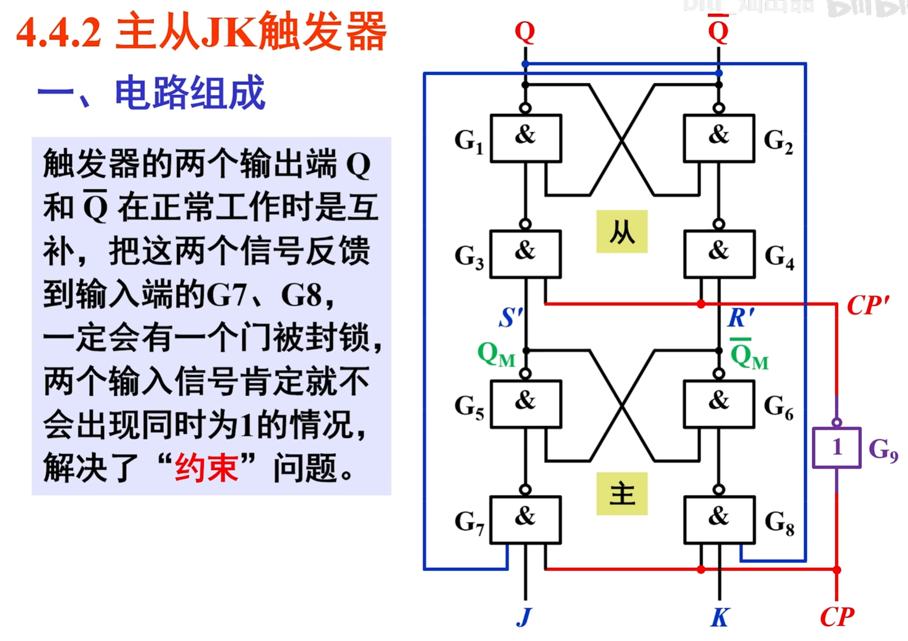

主从 JK 触发器由**主触发器**和**从触发器**两个基本 RS 触发器级联构成，核心结构特点如下：

- 主、从触发器均采用同步 RS 触发器（或基本 RS 触发器加门控），且共用一组 J、K 输入信号；

- 时钟信号（CP）通过非门分成两路：主触发器受**原 CP 信号**控制，从触发器受**反相 CP 信号（**\(\overline{CP}\)**）** 控制，实现 “主从分时工作”；

- 存在**反馈回路**：从触发器的输出端\(\overline{Q}\)反馈到主触发器的 R 端，输出端 Q 反馈到主触发器的 S 端，以此解决 RS 触发器的 “约束条件” 问题。

### 2. 工作原理（时钟脉冲控制下的状态变化）

主从 JK 触发器的工作过程严格依赖 CP 的电平变化，分为三个关键阶段，核心是 “CP=1 时主触发器接收信号，CP 下降沿时从触发器更新状态”：

#### （1）当 CP=0 时（低电平阶段）

- 主触发器：CP=0 使主触发器的门控端无效，主触发器**锁存当前状态**，不响应 J、K 输入信号；

- 从触发器：\(\overline{CP}=1\)（CP 反相后）使从触发器的门控端有效，但由于主触发器状态不变，从触发器**保持原有输出状态（Q、**\(\overline{Q}\)**不变）**。

#### （2）当 CP=1 时（高电平阶段）

- 主触发器：CP=1 使主触发器门控端有效，主触发器根据 J、K 信号和反馈的 Q、\(\overline{Q}\)信号，更新自身状态（此时从触发器因\(\overline{CP}=0\)无效，保持原状态）；

- 主触发器状态变化逻辑：\(S_{主}=J\overline{Q}\)，\(R_{主}=KQ\)（S 为主触发器置 1 端，R 为主触发器置 0 端），符合 RS 触发器 “置 1（S=1,R=0）、置 0（S=0,R=1）、保持（S=0,R=0）、翻转（S=1,R=1）” 逻辑；

- 从触发器：\(\overline{CP}=0\)使从触发器门控端无效，**输出状态保持不变**，即此时触发器的外部输出（Q）不随主触发器变化。

#### （3）当 CP 由 1→0 时（下降沿阶段）

- 主触发器：CP 突然变为 0，主触发器门控端无效，**锁存 CP=1 期间最终稳定的状态**，不再响应 J、K 信号；

- 从触发器：\(\overline{CP}\)突然由 0→1，从触发器门控端有效，**立即接收主触发器锁存的状态**，并更新自身输出（Q、\(\overline{Q}\)），此时触发器的外部输出发生变化。

#### （4）当 CP=0 稳定后

- 主、从触发器均保持状态不变，直到下一个 CP 高电平到来。

### 3. 逻辑符号

主从 JK 触发器的逻辑符号需标注关键引脚和触发方式，标准符号如下：

- 输入端：\(J\)（置 1 控制端）、\(K\)（置 0 控制端）、\(CP\)（时钟输入端，端末加 “小圆圈” 表示**下降沿触发**）；

- 直接控制端：\(\overline{R_D}\)（直接复位端，低电平有效，即\(\overline{R_D}=0\)时 Q=0）、\(\overline{S_D}\)（直接置位端，低电平有效，即\(\overline{S_D}=0\)时 Q=1），优先级高于 CP；

- 输出端：\(Q\)（原码输出）、\(\overline{Q}\)（反码输出）。

### 4. 特性表（次态与现态、J、K、CP 的关系）

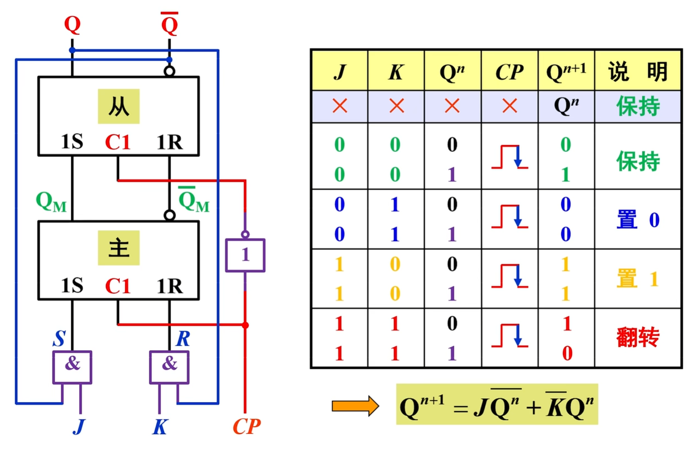

特性表描述：在\(\overline{R_D}=\overline{S_D}=1\)（直接控制端无效）的前提下，CP 下降沿时，次态\(Q^{n+1}\)与现态\(Q^n\)、J、K 的对应关系（CP 非下降沿时\(Q^{n+1}=Q^n\)）。

| 现态 \(Q^n\) | J    | K    | CP 触发方式 | 次态 \(Q^{n+1}\) | 逻辑功能 |
| ------------ | ---- | ---- | ----------- | ---------------- | -------- |
| 0            | 0    | 0    | 下降沿      | 0                | 保持     |
| 0            | 0    | 1    | 下降沿      | 0                | 置 0     |
| 0            | 1    | 0    | 下降沿      | 1                | 置 1     |
| 0            | 1    | 1    | 下降沿      | 1                | 翻转     |
| 1            | 0    | 0    | 下降沿      | 1                | 保持     |
| 1            | 0    | 1    | 下降沿      | 0                | 置 0     |
| 1            | 1    | 0    | 下降沿      | 1                | 置 1     |
| 1            | 1    | 1    | 下降沿      | 0                | 翻转     |

示例：若\(Q^n=0\)，J=1，K=1，CP 下降沿到来时，\(Q^{n+1}=1\)（翻转）；若 CP 为高电平或低电平（非下降沿），则\(Q^{n+1}=0\)（保持）。

### 5. 特性方程（状态转换公式）

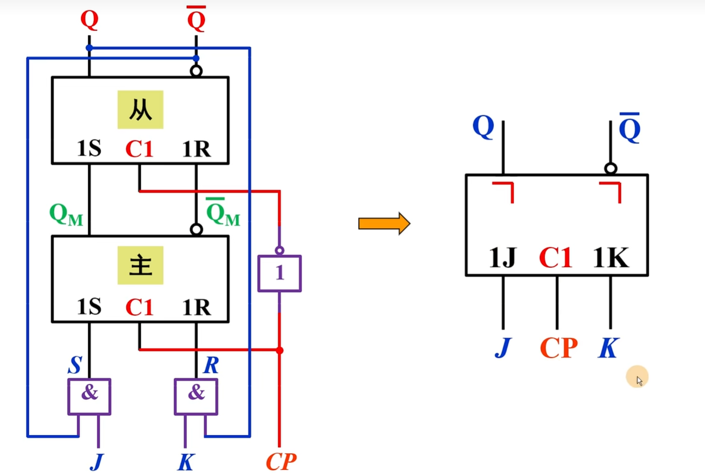

在\(\overline{R_D}=\overline{S_D}=1\)且**CP 下降沿有效**的条件下，主从 JK 触发器的状态转换满足以下方程：

\(Q^{n+1} = J\overline{Q^n} + \overline{K}Q^n\)

- 说明：该方程无约束条件（区别于 RS 触发器的\(SR=0\)约束），因反馈回路已通过\(J\overline{Q^n}\)和\(\overline{K}Q^n\)避免了 “\(S=1且R=1\)” 的矛盾状态；

- 触发条件：方程仅在 CP 由 1→0 的下降沿时刻成立，其他时刻\(Q^{n+1}=Q^n\)。

### 6. 核心特性：克服空翻与 “一次翻转” 现象

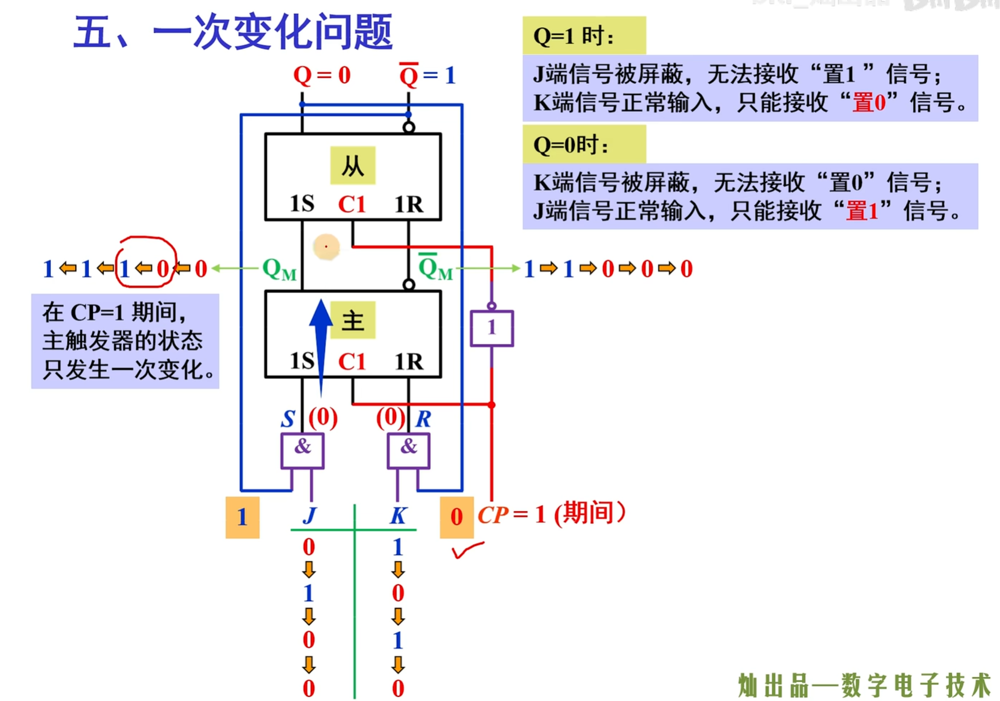

#### （1）克服空翻

- 空翻定义：同步 RS 触发器在 CP=1 期间，若输入信号变化会导致输出多次翻转的现象；

- 主从 JK 触发器的解决逻辑：CP=1 时仅主触发器变化，从触发器保持；CP 下降沿时从触发器仅更新一次，因此**在一个 CP 周期内，输出（Q）仅变化一次**，彻底克服空翻。

#### （2）一次翻转现象（主从结构的固有特点）

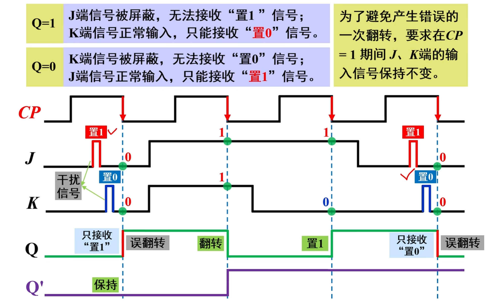

- 定义：在 CP=1 期间，主触发器一旦根据 J、K 信号发生一次状态变化（如从 0→1 或 1→0），后续即使 J、K 信号再变化，主触发器也不会再翻转，仅保持第一次变化后的状态，最终从触发器在 CP 下降沿仅接收主触发器的 “一次翻转后状态”。

- 示例：

初始状态\(Q^n=0\)，\(\overline{R_D}=\overline{S_D}=1\)，CP=1 期间：

① 先输入 J=1、K=0 → 主触发器\(Q_{主}=1\)（第一次翻转）；

② 随后输入 J=0、K=0 → 主触发器仍保持\(Q_{主}=1\)（不再变化）；

③ CP 下降沿到来 → 从触发器接收\(Q_{主}=1\)，最终\(Q^{n+1}=1\)（而非 J=0、K=0 时的 “保持 0”）。

- 影响：一次翻转会导致触发器状态与 “仅在 CP 下降沿采样 J、K” 的理想逻辑偏差，因此使用时需确保 CP=1 期间 J、K 信号**保持稳定**。

### 7. 直接置位（\(\overline{S_D}\)）与直接复位（\(\overline{R_D}\)）端

- 功能：不依赖 CP 信号，直接控制触发器输出状态，用于电路初始化（置 1 或置 0）；

- 电平有效性：低电平有效（即\(\overline{S_D}=0\)时置 1，\(\overline{R_D}=0\)时置 0）；

- 优先级：**高于 CP 信号**，即无论 CP 处于何种状态，只要\(\overline{S_D}=0\)或\(\overline{R_D}=0\)，触发器立即响应；

- 约束：\(\overline{S_D}\)和\(\overline{R_D}\)不能同时为 0（否则\(Q=\overline{Q}=1\)，违背触发器 “互补输出” 特性），正常工作时需保持\(\overline{S_D}=\overline{R_D}=1\)（无效状态）。

示例：若\(\overline{R_D}=0\)，\(\overline{S_D}=1\)，无论 J=1、K=1 且 CP 下降沿到来，触发器输出始终为 Q=0（复位）。

### 8. 典型应用

#### （1）构成 T 触发器（计数 / 保持触发器）

- 连接方式：令 J=K=T（T 为输入控制端）；

- 功能：

- 当 T=1 时，CP 下降沿触发翻转（\(Q^{n+1}=\overline{Q^n}\)），实现 “计数” 功能；

- 当 T=0 时，CP 下降沿触发保持（\(Q^{n+1}=Q^n\)），实现 “保持” 功能。

#### （2）构成 T' 触发器（翻转触发器）

- 连接方式：令 J=K=1（固定输入）；

- 功能：每到来一个 CP 下降沿，触发器必然翻转（\(Q^{n+1}=\overline{Q^n}\)），专门用于 “二分频” 或 “计数脉冲” 生成。

示例：T' 触发器初始 Q=0，连续输入 3 个 CP 下降沿 → 状态变化：0→1（第 1 个 CP）→0（第 2 个 CP）→1（第 3 个 CP），实现对 CP 脉冲的 “二分频”（输出脉冲频率为 CP 的 1/2）。


# 触发器例题

#### 1.2 触发器转换与输入特性

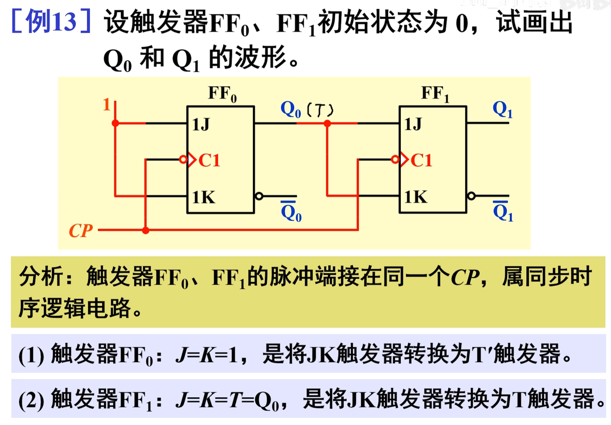

视频中明确 JK 触发器的转换规则及两个触发器的具体接线：

| 触发器   | J、K 端接线 | 转换结果              | 核心特性（基于 CP 下降沿）                                   |
| -------- | ----------- | --------------------- | ------------------------------------------------------------ |
| 触发器 0 | J=K=1       | 转为 T' 触发器        | 每来一个 CP 下降沿，输出Q0必翻转                             |
| 触发器 1 | J=K=Q0      | 转为 T 触发器（T=Q0） | 当T=0（即Q0=0）：输出Q1保持不变；当T=1（即Q0=1）：输出Q1翻转 |

#### 1.3 输出波形绘制步骤（含示例）

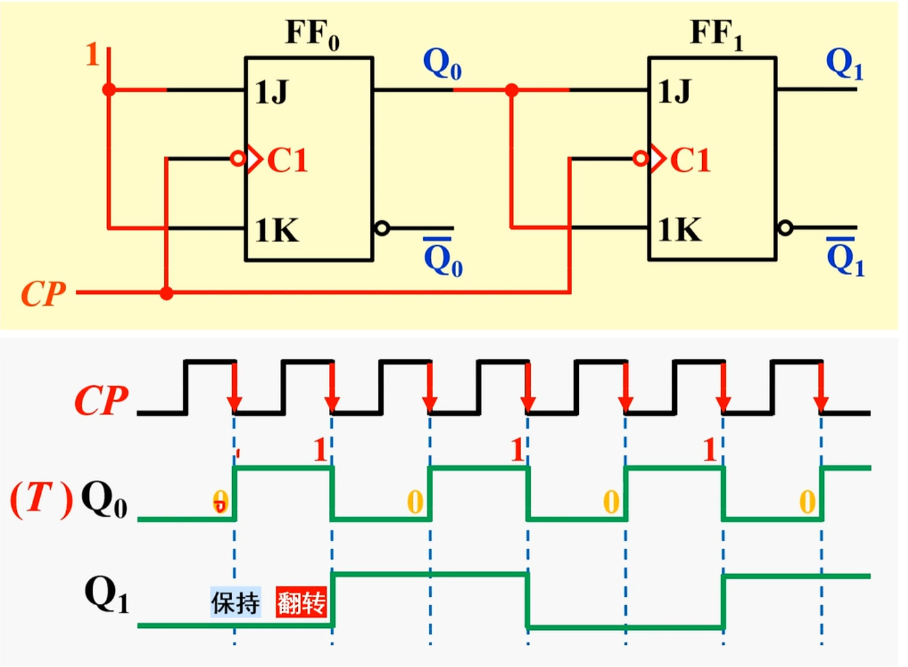

视频中波形绘制以 “先找触发边沿→再画各触发器输出” 为核心，具体步骤及示例如下：

1. **步骤 1：标记 CP 下降沿**

在 CP 波形中，标记所有 “1→0” 的跳变时刻（触发边沿），绘制垂直辅助线。

1. **步骤 2：绘制 Q0 波形（T' 触发器特性）**

- 初始状态：Q0=0（保持至第一个 CP 下降沿前）

- 第一个 CP 下降沿：Q0从 0 翻转为 1

- 第二个 CP 下降沿：Q0从 1 翻转为 0

- 第三个 CP 下降沿：Q0从 0 翻转为 1

- 第四个 CP 下降沿：Q0从 1 翻转为 0

- 示例波形（按时间顺序）：0 → 0（第一个边沿前）→ 1（第一个边沿后）→ 1（第二个边沿前）→ 0（第二个边沿后）→ ...

1. **步骤 3：绘制 Q1 波形（T=Q0 特性）**

关键原则：判断CP下降沿前一刻的Q0值（即 T 值），决定 Q1 状态：

- 初始状态：Q1=0（保持至第一个 CP 下降沿前）

- 第一个 CP 下降沿前：Q0=0（T=0）→ Q1 保持 0

- 第二个 CP 下降沿前：Q0=1（T=1）→ Q1 从 0 翻转为 1

- 第三个 CP 下降沿前：Q0=0（T=0）→ Q1 保持 1

- 第四个 CP 下降沿前：Q0=1（T=1）→ Q1 从 1 翻转为 0

- 示例波形（按时间顺序）：0 → 0（第一个边沿前）→ 0（第一个边沿后）→ 0（第二个边沿前）→ 1（第二个边沿后）→ ...

### 2. 异步时序逻辑电路例题（两个边沿 D 触发器构成）

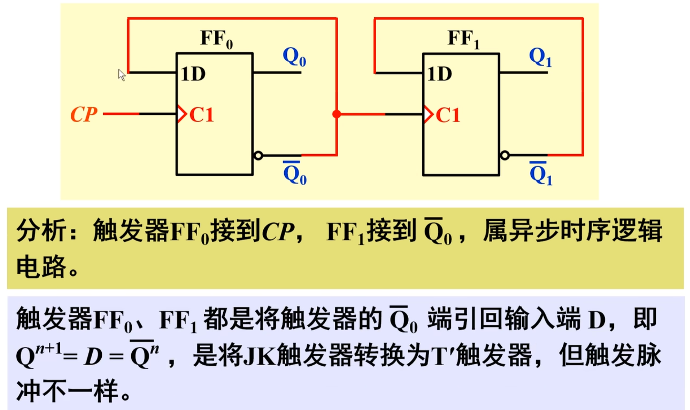

#### 2.1 电路基础信息

- **触发器类型**：2 个边沿 D 触发器（记为 “触发器 0”“触发器 1”）

- **初始状态**：两个触发器初始状态均为 Q=0

- **触发方式**：上升沿触发（CP 端无 “圆圈” 标识，触发边沿为信号从 0 跳变为 1 的时刻）

- **异步特性**：两个触发器的 CP 端不相连（触发器 0 的 CP 接外部 CP 信号，触发器 1 的 CP 接Q0非），属于**异步时序电路**（两个触发器的触发脉冲不同，状态变化不同步）

#### 2.2 触发器转换与输入特性

视频中明确 D 触发器的转换规则及两个触发器的具体接线：

| 触发器   | D 端接线 | 转换结果       | 核心特性（基于各自 CP 上升沿）       |
| -------- | -------- | -------------- | ------------------------------------ |
| 触发器 0 | D=Q0 非  | 转为 T' 触发器 | 每来一个外部 CP 上升沿，输出Q0必翻转 |
| 触发器 1 | D=Q1 非  | 转为 T' 触发器 | 每来一个Q0非上升沿，输出Q1必翻转     |

#### 2.3 输出波形绘制步骤（含示例）

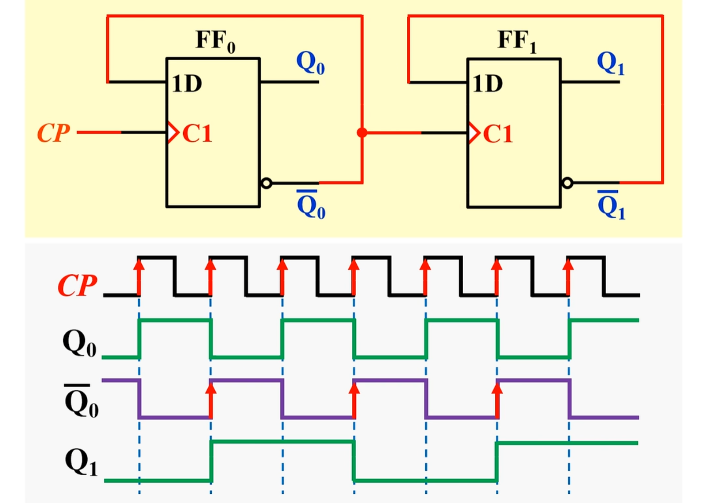

1. **步骤 1：标记触发器 0 的触发边沿（外部 CP 上升沿）**

在外部 CP 波形中，标记所有 “0→1” 的跳变时刻（触发器 0 的触发边沿）。

1. **步骤 2：绘制 Q0 波形（T' 触发器特性）**

- 初始状态：Q0=0（保持至第一个外部 CP 上升沿前）

- 第一个外部 CP 上升沿：Q0从 0 翻转为 1

- 第二个外部 CP 上升沿：Q0从 1 翻转为 0

- 第三个外部 CP 上升沿：Q0从 0 翻转为 1

- 第四个外部 CP 上升沿：Q0从 1 翻转为 0

- 示例波形：0 → 0（第一个边沿前）→ 1（第一个边沿后）→ 1（第二个边沿前）→ 0（第二个边沿后）→ ...

1. **步骤 3：绘制 Q0 非波形（Q0 取反）**

规则：Q0=0时Q0非=1，Q0=1时Q0非=0

- 示例波形（对应 Q0）：1 → 1（第一个边沿前）→ 0（第一个边沿后）→ 0（第二个边沿前）→ 1（第二个边沿后）→ ...

1. **步骤 4：标记触发器 1 的触发边沿（Q0 非上升沿）**

在Q0非波形中，标记所有 “0→1” 的跳变时刻（触发器 1 的触发边沿）。

1. **步骤 5：绘制 Q1 波形（T' 触发器特性）**

- 初始状态：Q1=0（保持至第一个 Q0 非上升沿前）

- 第一个 Q0 非上升沿：Q1从 0 翻转为 1

- 第二个 Q0 非上升沿：Q1从 1 翻转为 0

- 第三个 Q0 非上升沿：Q1从 0 翻转为 1

- 示例波形：0 → 0（第一个边沿前）→ 1（第一个边沿后）→ 1（第二个边沿前）→ 0（第二个边沿后）→ ...

### 3. 通用核心概念与规则

#### 3.1 触发器转换核心规则（仅视频提及的转换方式）

| 目标触发器 | 原始触发器 | 接线方式 | 关键特性           |
| ---------- | ---------- | -------- | ------------------ |
| T' 触发器  | JK 触发器  | J=K=1    | 每触发边沿必翻转   |
| T 触发器   | JK 触发器  | J=K=T    | T=0 保持，T=1 翻转 |
| T' 触发器  | D 触发器   | D=Q 非   | 每触发边沿必翻转   |

#### 3.2 触发边沿判断规则

- 下降沿触发：触发器 CP 端有 “圆圈”，触发边沿为信号 “1→0” 跳变

- 上升沿触发：触发器 CP 端无 “圆圈”，触发边沿为信号 “0→1” 跳变

#### 3.3 同步 vs 异步时序电路区别

| 类型         | CP 端连接方式                    | 状态变化同步性                 | 示例（视频中）     |
| ------------ | -------------------------------- | ------------------------------ | ------------------ |
| 同步时序电路 | 所有触发器 CP 端相连             | 同一 CP 边沿触发，状态同时变化 | 两个 JK 触发器电路 |
| 异步时序电路 | 触发器 CP 端不相连（接不同信号） | 不同触发脉冲，状态变化不同步   | 两个 D 触发器电路  |

#### 3.4 波形绘制核心原则

- 边沿触发电路：触发器状态仅在 “触发边沿时刻” 变化，变化依据为 “触发边沿前一刻的输入信号值”（而非边沿后的值）

- 无需绘制 “Q 非” 波形的情况：题目未要求时可省略（如同步电路例题）；需绘制 “Q 非” 波形的情况：异步电路中，若某触发器的 CP 接 “Q 非”（如 D 触发器例题中触发器 1 的 CP 接 Q0 非），必须先画 “Q 非” 波形以确定触发边沿


#  JK触发器典型例题

## 一、边沿 JK 触发器基础回顾

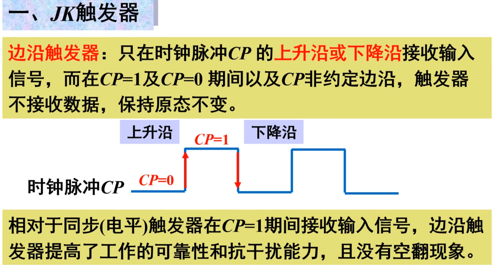

### 1. 定义与核心优势

- **定义**：仅在时钟脉冲 CP 的某一边沿（上升沿 / 下降沿）接收输入信号改变输出状态；CP=0、CP=1 期间或非约定边沿时，维持原态不变。

- **与同步触发器（电平触发器）的区别**：

- 同步触发器：CP=1 整个期间接收信号，易受干扰，存在 “空翻现象”（CP=1 期间输入多次改变→输出多次改变）。

- 边沿触发器：仅边沿时刻接收信号，抗干扰能力强、可靠性高，无空翻现象。

- **CP 边沿定义**：

- 上升沿（正跳变）：CP 由 0→1；

- 下降沿（负跳变）：CP 由 1→0。

### 2. 逻辑符号与关键标识

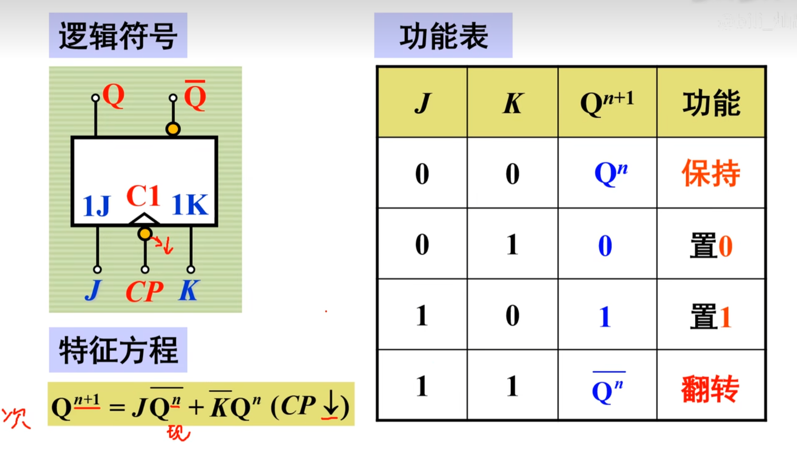

- **核心端子**：

- 信号输入端：1J、1K（“1” 表示 1 个输入端，若为 2J/2K 则为 2 个输入端）；

- 时钟端 C1：接 CP，关键标识：

- 小三角：表示边沿触发（无三角为同步触发）；

- 三角下方圆圈：表示下降沿有效（无圆圈为上升沿有效）；

- 输出端：Q（原态）、\(\overline{Q}\)（反态），二者互补。

### 3. 特征方程（状态方程）

- **表达式**：\(Q^{n+1} = J\cdot\overline{Q^n} + \overline{K}\cdot Q^n\)

- \(Q^n\)：现态（CP 边沿前的状态）；

- \(Q^{n+1}\)：次态（CP 边沿后的状态）；

- 适用条件：仅在 CP 有效边沿（上升沿 / 下降沿）时成立。

### 4. 功能表（核心功能）

| JK 输入 | 功能描述 | 次态与现态关系               |
| ------- | -------- | ---------------------------- |
| 00      | 保持     | \(Q^{n+1} = Q^n\)            |
| 01      | 置 0     | \(Q^{n+1} = 0\)              |
| 10      | 置 1     | \(Q^{n+1} = 1\)              |
| 11      | 翻转     | \(Q^{n+1} = \overline{Q^n}\) |

- **记忆口诀**：00 保持、11 翻转；01 置 0、10 置 1。

### 5. 集成芯片 74LS112（带异步端的边沿 JK 触发器）

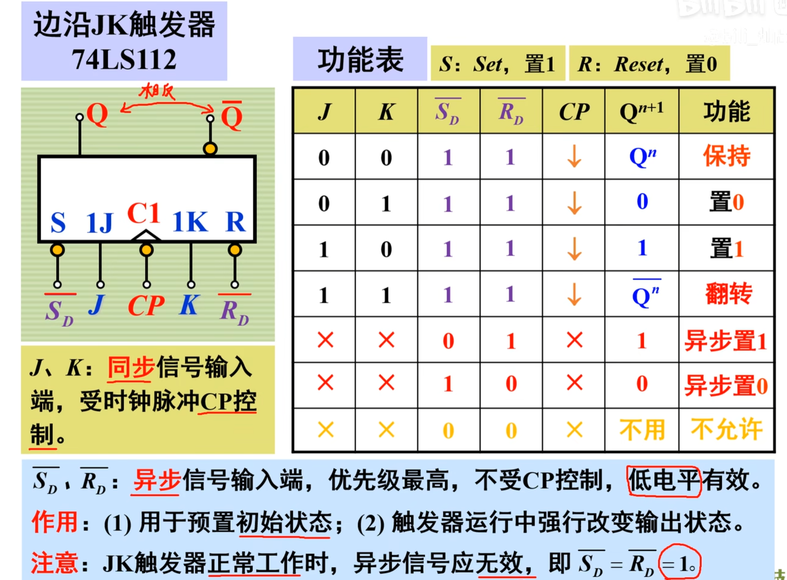

- **新增异步端**：\(\overline{SD}\)（置 1 端，Set 端）、\(\overline{RD}\)（置 0 端，Reset 端）；

- **关键特性**：

1. 异步触发：不受 CP 控制，优先级最高（高于 CP、J、K，可屏蔽后三者）；

1. 低电平有效：端子为 0 时有效，为 1 时无效；

1. 作用：

- 预置初始状态（替代 “假设初始状态”）；

- 运行中强行改变输出状态。

## 二、典型例题解析

### 例题 1：无异步端的边沿 JK 触发器波形绘制

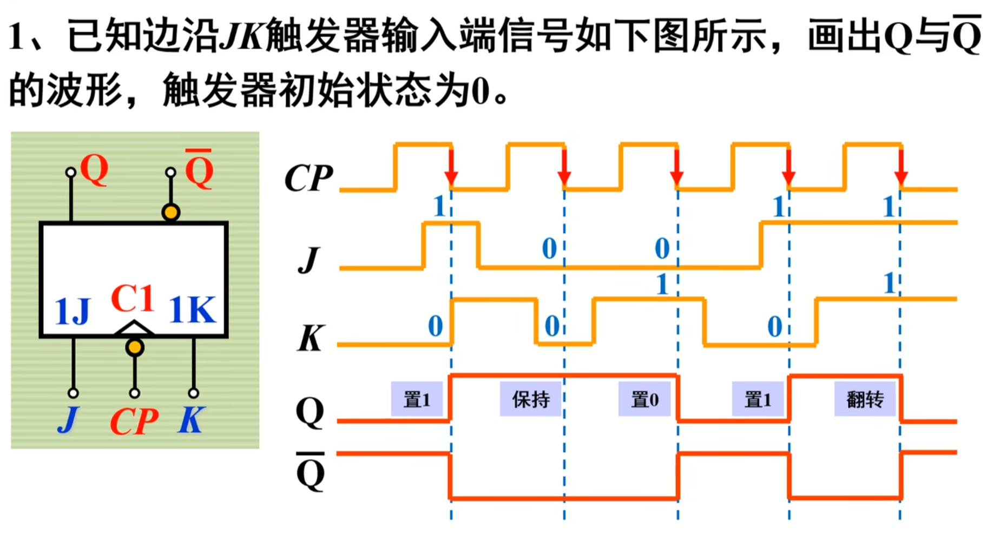

#### 已知条件

- 触发器类型：下降沿有效（CP 端带圆圈），无异步端；

- 输入：CP 脉冲波形、J/K 信号波形；

- 初始状态：\(Q^0 = 0\)（无异步端，需假设）。

#### 解题步骤

1. **确定 CP 有效边沿**：标记 CP 由 1→0 的下降沿（用虚线标注）；

1. **分段分析 Q 状态**：

- 初始阶段（第一个下降沿前）：\(Q = 0\)（初始状态）；

- 第一个下降沿：

- 读取 J/K 值（若 J/K 与边沿重合，取边沿左侧值）：J=1、K=0；

- 查功能表：JK=10→置 1，故\(Q\)由 0→1；

- 第二个下降沿：

- J=0、K=0→保持，\(Q\)维持 1；

- 第三个下降沿：

- J=0、K=1→置 0，\(Q\)由 1→0；

- 第四个下降沿：

- J=1、K=0→置 1，\(Q\)由 0→1；

- 第五个下降沿：

- J=1、K=1→翻转，\(Q\)由 1→0；

1. **绘制**\(\overline{Q}\)**波形**：将 Q 波形取反（如 Q=0 时\(\overline{Q}=1\)，Q=1 时\(\overline{Q}=0\)）。

#### 关键注意点

- 仅在 CP 有效边沿改变 Q 状态，其余时刻保持原态；

- J/K 与 CP 边沿重合时，取边沿左侧的稳定值。

### 例题 2：带异步端（74LS112）的边沿 JK 触发器波形绘制

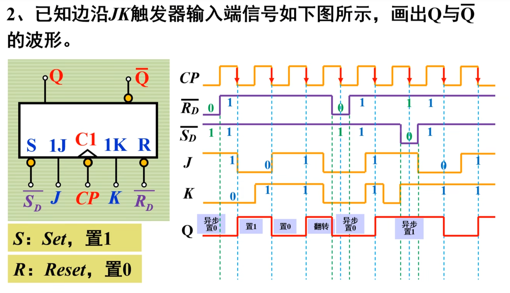

#### 已知条件

- 触发器类型：74LS112（带\(\overline{SD}\)、\(\overline{RD}\)），CP 下降沿有效；

- 输入：CP、J、K、\(\overline{SD}\)、\(\overline{RD}\)波形；

- 初始状态：由异步端预置（无需假设）。

#### 解题步骤

1. **标记关键区间**：

- 标记 CP 下降沿（虚线）；

- 标记\(\overline{SD}\)、\(\overline{RD}\)的低电平有效区间（虚线）；

1. **优先处理异步端**：

- 初始阶段：\(\overline{RD}=0\)、\(\overline{SD}=1\)→异步置 0，\(Q=0\)；

- 第一个异步有效区间（\(\overline{RD}=0\)）：

- 屏蔽 CP、J、K，\(Q\)强制为 0；

- 第二个异步有效区间（\(\overline{SD}=0\)）：

- 屏蔽 CP、J、K，\(Q\)强制为 1（原 Q=1，维持 1）；

1. **异步端无效时（**\(\overline{SD}=\overline{RD}=1\)**），按例题 1 方法分析 CP 边沿**：

- 第一个 CP 下降沿：J=1、K=0→置 1，\(Q\)由 0→1；

- 第二个 CP 下降沿：J=0、K=1→置 0，\(Q\)由 1→0；

- 第三个 CP 下降沿：J=1、K=1→翻转，\(Q\)由 0→1；

- 第四个 CP 下降沿：因\(\overline{RD}\)有效，CP 被屏蔽，\(Q\)维持 0；

1. **绘制**\(\overline{Q}\)**波形**：Q 取反。

#### 关键注意点

- 异步端优先级最高：只要\(\overline{SD}\)或\(\overline{RD}\)为 0（有效），立即改变 Q 状态，无需等待 CP；

- 异步端有效区间内，CP、J、K 完全被屏蔽，Q 保持异步端控制的状态。

### 例题 3：JK 触发器改造成 T' 触发器（二分频电路）

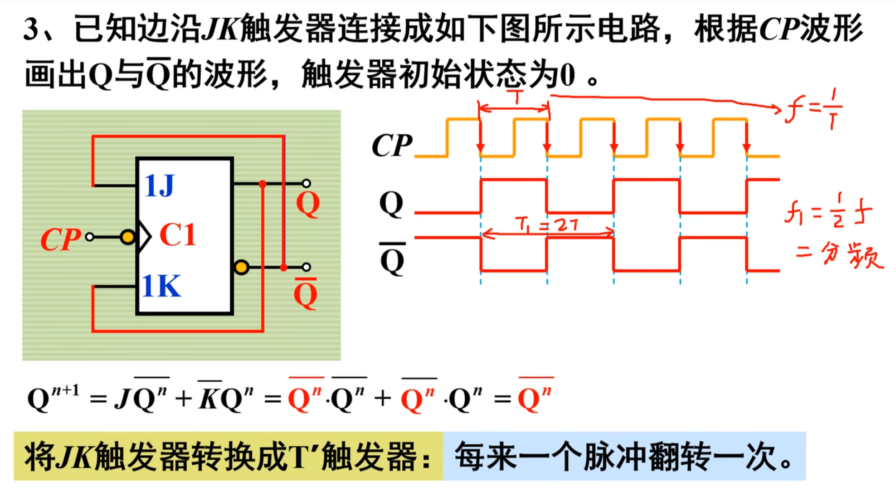

#### 已知条件

- 触发器类型：CP 下降沿有效边沿 JK 触发器；

- 外围接线：J 接\(\overline{Q}\)、K 接 Q（无外部 J/K 输入，仅 CP 输入）；

- 初始状态：\(Q^0 = 0\)。

#### 解题步骤

1. **推导新特征方程**：

- 原特征方程：\(Q^{n+1} = J\cdot\overline{Q^n} + \overline{K}\cdot Q^n\)；

- 代入接线关系：J=\(\overline{Q^n}\)、K=\(Q^n\)；

- 化简：

\(\begin{align*} Q^{n+1} &= \overline{Q^n}\cdot\overline{Q^n} + \overline{Q^n}\cdot Q^n \\ &= \overline{Q^n} + 0 \\ &= \overline{Q^n} \end{align*}\)

- 结论：次态 = 现态取反，即 T' 触发器功能（每来一个 CP 有效边沿，Q 翻转一次）。

1. **绘制 Q 波形**：

- 初始状态：Q=0；

- 第一个 CP 下降沿：翻转→Q=1；

- 第二个 CP 下降沿：翻转→Q=0；

- 第三个 CP 下降沿：翻转→Q=1；

- 以此类推，每一个 CP 下降沿翻转一次；

1. **分析分频特性**：

- CP 周期为 T，Q 波形周期为 2T（CP 每 2 个脉冲，Q 完成 1 个周期）；

- 频率关系：\(f_Q = \frac{1}{2}f_{CP}\)，即实现 “二分频”。

#### 关键注意点

- 通过外围接线可将 JK 触发器转换为其他功能触发器（如本例 T' 触发器）；

- 二分频电路的核心是 Q 每一个 CP 有效边沿翻转一次。

## 三、核心总结

1. 边沿 JK 触发器核心：仅 CP 有效边沿工作，无空翻，抗干扰强；

1. 74LS112 关键：异步端优先级最高，低电平有效，用于预置初始状态或强行改态；

1. 波形绘制口诀：先标有效沿（CP），再看异步端（优先），最后查功能表（JK→Q 态）；

1. 灵活应用：通过改变 JK 输入（如接 Q/\(\overline{Q}\)），可实现 T' 触发器等扩展功能（如二分频）。


# 异步端内容修正

## 1. 同步 RS 触发器异步端的原定义问题

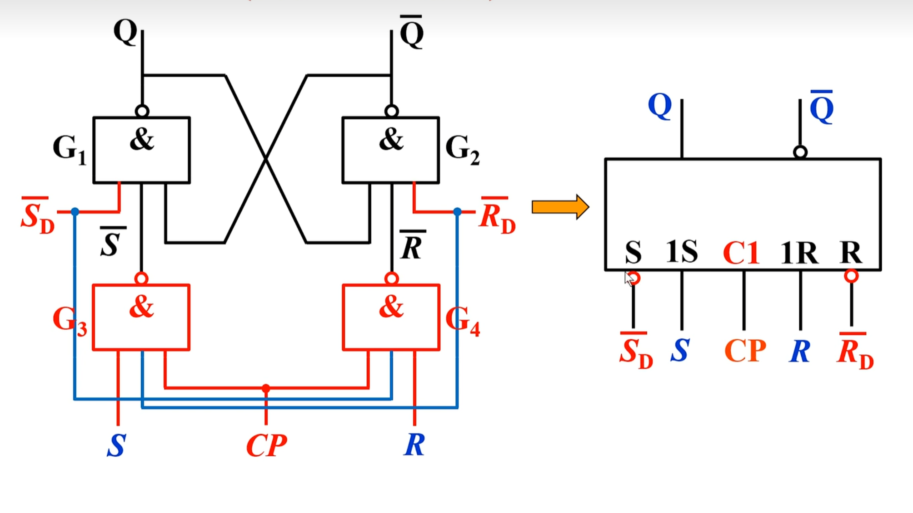

### 1.1 同步 RS 触发器的基础结构

- 核心构成：G1、G2 两个与非门构成**基本 RS 触发器**，在此基础上增加 G3、G4 两个与非门；

- 同步端定义：G3、G4 的公共输入端接时钟脉冲 CP，另外两个输入端分别定义为 S（置位端）、R（复位端），称为**同步输入端**；

- 同步特性：仅当 CP=1 时，S、R 信号才能传入触发器改变输出状态；CP=0 时，S、R 被屏蔽，无法改变输出。

- 原异步端定义：为避免与基本 RS 触发器的 “SD 非、RD 非”（下标 D）混淆，先去掉原基本 RS 触发器 “SD 非、RD 非” 的下标 D，再直接从 G1 输入端引出 “SD 非”、从 G2 输入端引出 “RD 非”，作为 “异步输入端”。

### 1.2 原定义的核心问题：无法保证输出状态符合触发器要求

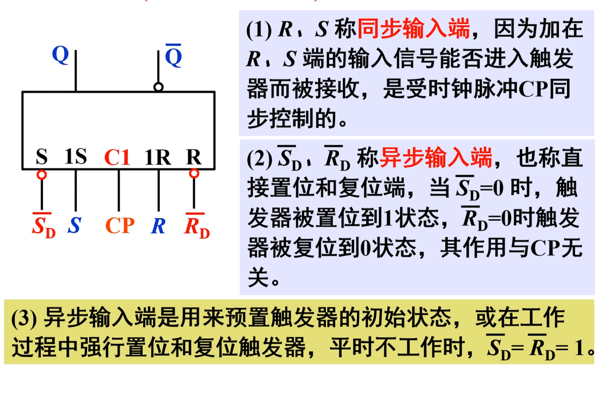

- 异步端特性前提：SD 非、RD 非为**低电平有效**，且不能同时为低电平（仅允许一个低电平有效）；

- 问题分析示例（以 SD 非 = 0、RD 非 = 1 为例）：

1. 按与非门逻辑，SD 非 = 0（低电平）输入 G1，G1 输出必为 1（与非门 “有 0 出 1”），该 1 反馈至 G2 输入端；

1. G2 的输入端包括 “RD 非 = 1”、“G4 的输出（即 R 非）”，但**无法保证 R 非 = 1**：

- 若 CP=1 且 R=1，G3 输入为 “CP=1+R=1”，与非后输出 R 非 = 0；

- G2 输入为 “RD 非 = 1+R 非 = 0+G1 反馈的 1”，与非后输出 Q 非 = 1；

- 最终 Q=1（G1 输出）、Q 非 = 1，违反触发器 “Q 与 Q 非相反” 的核心要求，证明原异步端定义无效。

## 2. 同步 RS 触发器异步端的修正方案及分析

### 2.1 修正方案：增加反馈线

- 关键改动：在原定义基础上，增加两条反馈线：

1. 将 “SD 非” 从 G1 引出后，额外反馈至 G4 的输入端；

1. 将 “RD 非” 从 G2 引出后，额外反馈至 G3 的输入端。

### 2.2 修正后的有效性分析（分两种有效场景）

#### 场景 1：SD 非 = 0（有效）、RD 非 = 1（无效）

1. G1 分析：SD 非 = 0 输入 G1，与非门 “有 0 出 1”，故 G1 输出 Q=1，该 1 反馈至 G2 输入端；

1. G4 分析：SD 非 = 0 反馈至 G4 输入端，G4 为与非门，“有 0 出 1”，故 G4 输出 = 1（即 R 非 = 1）；

1. G2 分析：G2 输入端为 “RD 非 = 1+R 非 = 1+Q=1”，三个 1 输入与非门，“全 1 出 0”，故 G2 输出 Q 非 = 0；

1. 结果：Q=1、Q 非 = 0，符合触发器 “Q 与 Q 非相反” 要求；且无论 CP、R、S 取何值（如 CP=1、R=1 或 S=0），均不影响输出，实现异步置 1 功能。

#### 场景 2：RD 非 = 0（有效）、SD 非 = 1（无效）

1. G2 分析：RD 非 = 0 输入 G2，与非门 “有 0 出 1”，故 G2 输出 Q 非 = 1，该 1 反馈至 G1 输入端；

1. G3 分析：RD 非 = 0 反馈至 G3 输入端，G3 为与非门，“有 0 出 1”，故 G3 输出 = 1（即 S 非 = 1）；

1. G1 分析：G1 输入端为 “SD 非 = 1+S 非 = 1+Q 非 = 1”，三个 1 输入与非门，“全 1 出 0”，故 G1 输出 Q=0；

1. 结果：Q=0、Q 非 = 1，符合触发器要求；且 CP、R、S 的取值不影响输出，实现异步置 0 功能。

## 3. 同步 RS 触发器异步端的核心特性

### 3.1 基本属性

- 名称：SD 非（直接置位端）、RD 非（直接复位端），统称 “异步输入端”；

- 有效电平：低电平有效（逻辑符号中输入端带 “小圆圈” 标识）；

- 优先级：**高于 CP 和同步端 S、R**，只要有一个异步端有效（低电平），CP 和 S、R 即被屏蔽，无法改变输出。

### 3.2 使用规则

- 禁忌：SD 非和 RD 非**不能同时为低电平**（会导致 Q=1、Q 非 = 1，触发器状态不定）；

- 闲置处理：若无需使用异步端功能，需将 SD 非、RD 非均置为**高电平 1**（无效电平），避免影响同步端和 CP 的正常工作。

### 3.3 功能作用

1. 预置初始状态：无需假设初始状态（如 “假设 Q 初始为 0”），可通过 SD 非 = 0（置 1）或 RD 非 = 0（置 0）直接设定触发器初始输出；

1. 工作中强行置位 / 复位：在触发器工作过程中，可通过异步端强行将输出置 1（SD 非 = 0）或置 0（RD 非 = 0），不受 CP 控制。

### 3.4 逻辑符号

- 基础：同步 RS 触发器逻辑符号；

- 异步端标识：在符号两侧分别增加 “SD 非”、“RD 非” 输入端，且每个输入端均带 “小圆圈”（表示低电平有效）。


## 4. 边沿 D 触发器的异步端

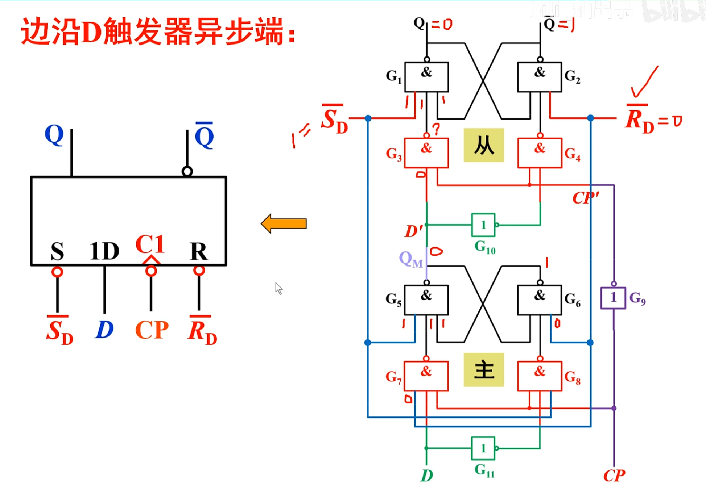

### 4.1 边沿 D 触发器的基础信息

- 结构：**主从结构**，触发方式为**下降沿触发**（CP 端带 “小圆圈” 标识，仅 CP 从 1 变 0 的瞬间响应输入）；

- 核心功能：通过 D 端输入信号，在 CP 下降沿时将 Q 置为 D 的值（Q=D）。

### 4.2 异步端的连线设计

- SD 非（直接置位端）：从 G1（基本 RS 触发器的置位门）引出，同时反馈至 G8（主触发器门）和 G5（主触发器门）的输入端；

- RD 非（直接复位端）：从 G2（基本 RS 触发器的复位门）引出，同时反馈至 G7（主触发器门）和 G6（主触发器门）的输入端。

### 4.3 异步端的有效性分析（分两种有效场景）

#### 场景 1：SD 非 = 0（有效）、RD 非 = 1（无效）

1. G1 分析：SD 非 = 0 输入 G1，与非门 “有 0 出 1”，故 G1 输出 Q=1，该 1 反馈至 G2 输入端；

1. G5、G8 分析：SD 非 = 0 分别反馈至 G5、G8，两与非门均 “有 0 出 1”，故 G5 输出 = 1、G8 输出 = 1；

1. G6 分析：G6 输入端为 “G5 输出 = 1+G8 输出 = 1+RD 非 = 1”，全 1 输入与非门，“全 1 出 0”，故 G6 输出 = 0；

1. G4 分析：G4 输入为 G6 输出 = 0，经非门后为 1，故 G4 输出 = 1；

1. G2 分析：G2 输入端为 “RD 非 = 1+G4 输出 = 1+Q=1”，全 1 输入与非门，“全 1 出 0”，故 G2 输出 Q 非 = 0；

1. 结果：Q=1、Q 非 = 0，符合要求；且 CP（无论高低电平或边沿）、D 的取值均被屏蔽，实现异步置 1。

#### 场景 2：RD 非 = 0（有效）、SD 非 = 1（无效）

1. G2 分析：RD 非 = 0 输入 G2，与非门 “有 0 出 1”，故 G2 输出 Q 非 = 1，该 1 反馈至 G1 输入端；

1. G7、G6 分析：RD 非 = 0 分别反馈至 G7、G6，两与非门均 “有 0 出 1”，故 G7 输出 = 1、G6 输出 = 1；

1. G5 分析：G5 输入端为 “G7 输出 = 1+G6 输出 = 1+SD 非 = 1”，全 1 输入与非门，“全 1 出 0”，故 G5 输出 = 0；

1. G3 分析：G3 输入为 G5 输出 = 0，经非门后为 1，故 G3 输出 = 1；

1. G1 分析：G1 输入端为 “SD 非 = 1+G3 输出 = 1+Q 非 = 1”，全 1 输入与非门，“全 1 出 0”，故 G1 输出 Q=0；

1. 结果：Q=0、Q 非 = 1，符合要求；且 CP、D 被屏蔽，实现异步置 0。

### 4.4 边沿 D 触发器异步端的逻辑符号

- 基础：边沿 D 触发器逻辑符号（CP 端带小圆圈，标识下降沿触发）；

- 异步端标识：在符号两侧增加 “SD 非”、“RD 非” 输入端，均带小圆圈（低电平有效）。


# 第4章小结

## 1. 触发器与门电路的核心定位

- 触发器和门电路是构成数字系统的基本逻辑单元

- **触发器**：具备记忆功能，用于构成**时序逻辑电路**（对应第 5 章内容）

- **门电路**：无记忆功能，用于构成**组合逻辑电路**（对应第 3 章内容）

## 2. 触发器的两个基本特点

### 2.1 双稳态特性（核心特征）

- 存在两个稳定状态，状态定义唯一：

- **0 状态**：触发器输出满足 Q=0 且 Q非=1

- **1 状态**：触发器输出满足 Q=1 且 Q非=0

### 2.2 状态可转换特性

- 在外信号（输入信号、时钟信号等）作用下，两个稳定状态可相互转换；

- 无外信号作用时，触发器保持原有状态不变，因此具备**记忆功能**，可用于保存二进制信息。

## 3. 触发器逻辑功能的描述方法

视频明确提及 5 种核心描述方法，需重点掌握：

1. 特性表（状态真值表）

1. 特性方程（逻辑表达式）

1. 驱动表（激励表）

1. 状态转移图

1. 波形图（时序图）

## 4. 触发器的分类

### 4.1 按逻辑功能分类（5 类核心触发器）

- RS 触发器、D 触发器、JK 触发器、T 触发器、T' 触发器

### 4.2 按电路结构分类

- 基本触发器、同步触发器、主从触发器、边沿触发器

- 注：视频明确说明 “主从触发器未介绍，需自行查找相关资料学习”

## 5. 各触发器的特性表与特性方程（重点强调 “需熟记”）

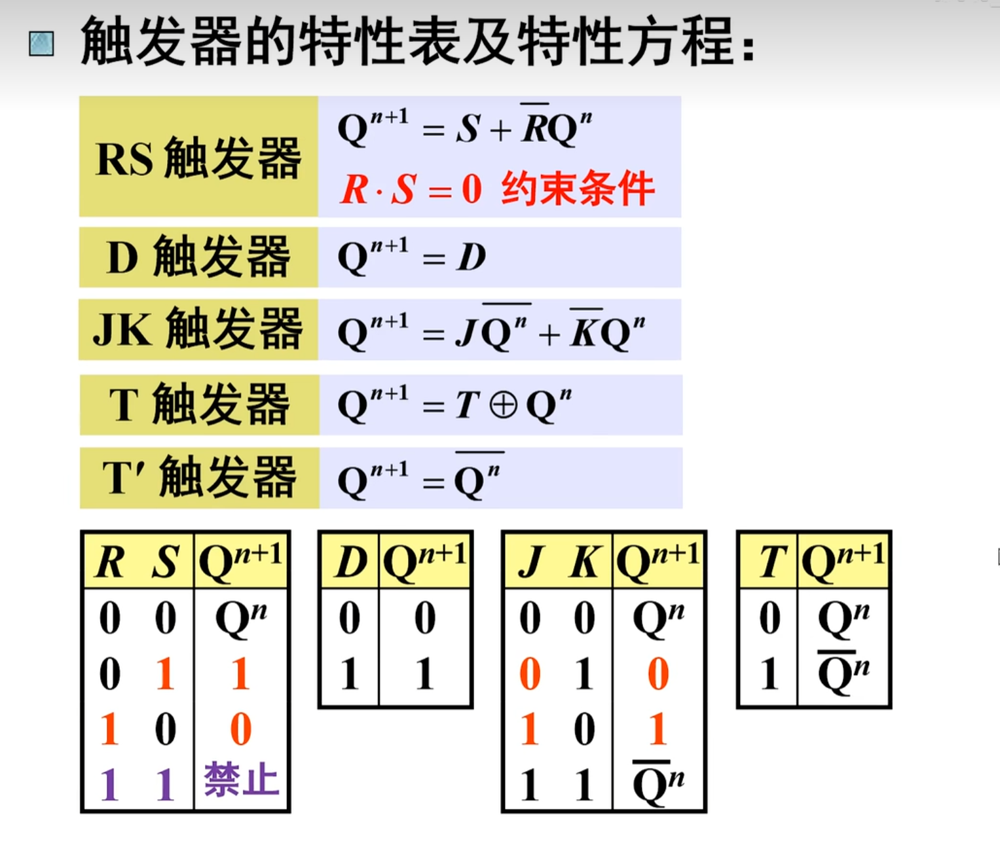

### 5.1 RS 触发器

- 类型细分：基本 RS 触发器（与非门构成、或非门构成）、同步 RS 触发器

- 共性：**特性方程统一**，均为 Qn+1 = S + R非·Qn（Qn为现态，Qn+1为次态）

- 差异：**约束条件不同**：

- 或非门构成的基本 RS 触发器 / 同步 RS 触发器：约束条件 RS=0（避免S=1且R=1的禁止态）

- 与非门构成的基本 RS 触发器：约束条件 RD非 + SD非 = 1（RD非为置 0 端，SD非为置 1 端）

- 特性表（以高电平有效为例）：

| S    | R    | Qn+1 | 功能说明             |
| ---- | ---- | ---- | -------------------- |
| 0    | 0    | Qn   | 保持原态             |
| 0    | 1    | 0    | 置 0（Reset）        |
| 1    | 0    | 1    | 置 1（Set）          |
| 1    | 1    | 不定 | 禁止（非 0 非 1 态） |

### 5.2 D 触发器

- 特性方程：Qn+1 = D（次态完全跟随输入 D）

- 特性表：

| D    | Qn+1 | 功能说明 |
| ---- | ---- | -------- |
| 0    | 0    | 次态为 0 |
| 1    | 1    | 次态为 1 |

### 5.3 JK 触发器（视频称 “功能最齐全”）

- 特性方程：Qn+1 = J·Qn非 + K非·Qn

- 特性表：

| J    | K    | Qn+1  | 功能说明 |
| ---- | ---- | ----- | -------- |
| 0    | 0    | Qn    | 保持原态 |
| 0    | 1    | 0     | 置 0     |
| 1    | 0    | 1     | 置 1     |
| 1    | 1    | Qn 非 | 翻转原态 |

### 5.4 T 触发器

- 特性方程：Qn+1 = T ⊕ Qn（异或逻辑，T 为控制端）

- 特性表：

| T    | Qn+1  | 功能说明 |
| ---- | ----- | -------- |
| 0    | Qn    | 保持原态 |
| 1    | Qn 非 | 翻转原态 |

### 5.5 T' 触发器

- 特性方程：Qn+1 = Qn非（无信号输入端，仅含脉冲输入端）

- 特性表：无单独列出（视频说明 “每来一个脉冲，状态翻转一次”）

## 6. 触发器的逻辑符号（强调 “需熟悉区分”）

### 6.1 基本 RS 触发器

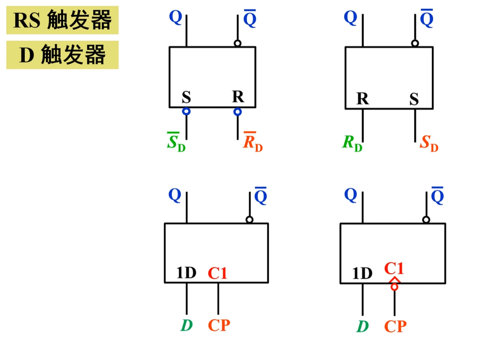

- 低电平有效型：输入端标 SD非、RD非，且符号带 “圆圈”（表示非逻辑）

- 高电平有效型：输入端标 S、R，无圆圈、无非号

### 6.2 同步 RS 触发器

- 比基本 RS 触发器多 1 个时钟端（标 C1），表示 “电平控制”（需与 CP 时钟同步）

### 6.3 D 触发器

- 同步 D 触发器：无 “三角形”，仅含 D 端和 C1 端（电平控制）

- 边沿 D 触发器：含 “三角形”（表示边沿触发），带 “圆圈” 为**下降沿触发**，无圆圈为**上升沿触发**

### 6.4 JK 触发器

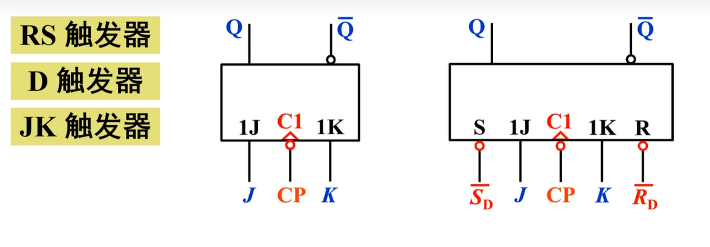

- 常规型：含 1J、1K 端（“1” 表示 1 个输入端）和 C1 端（例：带三角形 + 圆圈为下降沿触发）

- 带异步端型：额外含 SD非、RD非 端（带圆圈，低电平有效），**异步端优先级高于 CP 和 J/K 端**：

- 作用 1：预置初始状态（无需假设初始态，直接置 0/1）

- 作用 2：工作中强行置 0/1（屏蔽 CP 和 J/K 信号）

- 无效状态：异步端需置高电平（1），此时 CP 才控制 J/K

### 6.5 T 触发器

- 含 T 控制端和 C1 端（例：带三角形 + 圆圈为下降沿触发，也可设计为上升沿触发）

### 6.6 T' 触发器

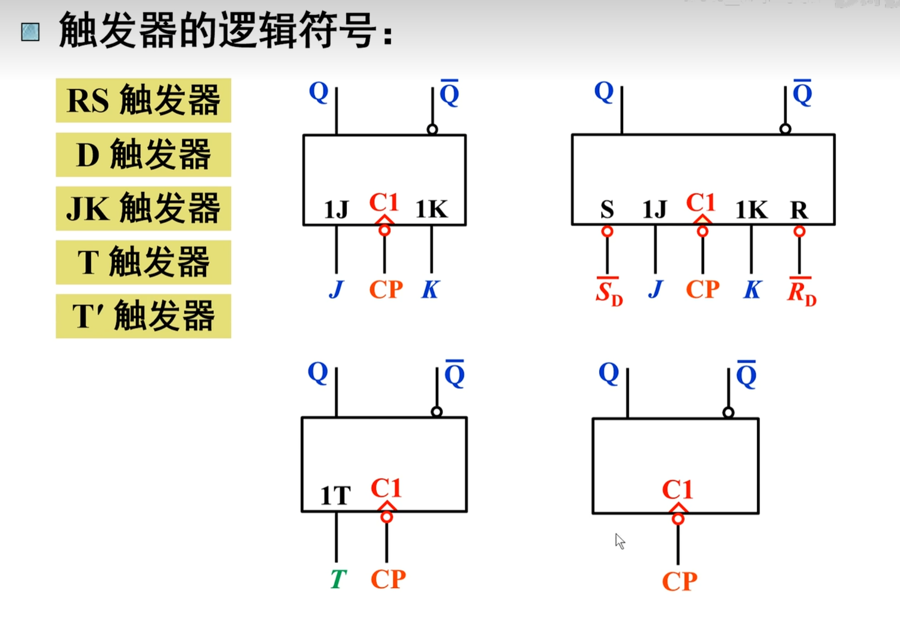

- 仅含 C1 端（脉冲输入端），无信号控制端（每来 1 个脉冲翻转 1 次）

## 7. 触发器之间的转换

视频明确提及转换方向（无需展开具体电路，掌握转换关系即可）：

- D 触发器 ↔ JK 触发器

- D 触发器 → T 触发器 / T' 触发器

- JK 触发器 → T 触发器 / T' 触发器

## 8. 本章核心学习要求

1. 熟记各触发器的特性表、特性方程及关键字母含义（如 R=Reset 置 0、S=Set 置 1）

1. 理解异步输入端的作用及优先级逻辑（结合例题掌握）

1. 能根据触发器的 “结构类型 + 触发方式 + 输入波形”，快速绘制输出波形（核心应用能力）


# 第5章概述

## 一、第 5 章整体学习内容与重点难点

### 1. 主要学习内容

- 模块 1：概述（本章第一节核心内容）

- 模块 2：时序电路的分析和设计

- 模块 3：计数器

- 模块 4：寄存器

- 模块 5：顺序脉冲发生器

- 模块 6：本章小节

### 2. 重点内容

- 核心重点 1：时序电路的分析和设计（第二节）

- 与第 3 章 “组合逻辑电路的分析和设计” 对比：步骤更复杂、计算量显著增加，需投入更多时间学习。

- 核心重点 2：计数器（第三节）

- 学习范畴：常用二进制计数器（3 位 / 4 位，对应八进制 / 十六进制）、十进制计数器的电路特点；

- 关键要求：掌握二进制计数器、十进制计数器的集成芯片原理。

### 3. 难点内容

- 核心难点：利用集成计数器芯片构造其他进制计数器

- 示例 1：基于十进制计数器集成芯片，构造七进制、五进制计数器；

- 示例 2：基于两个十六进制计数器集成芯片，先扩展为 256 进制计数器，再在 256 进制基础上，构造≤256 进制的任意进制计数器（如 100 进制、200 进制等）。

## 二、时序逻辑电路的基本特性（概述核心内容 1）

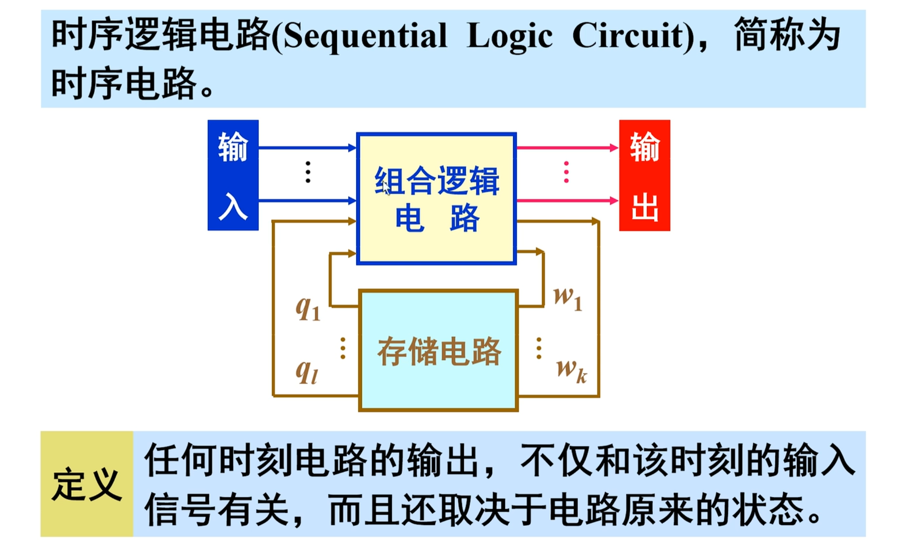

### 1. 定义与简称

- 英文名称：Sequential Logical Circuit，简称 “时序电路”。

### 2. 电路构成

- 组成部分：由 “组合逻辑电路” 和 “存储电路” 两部分构成

- 组合逻辑电路：第 3 章已学，核心组件为门电路，输入信号记为 X，输出信号记为 Y；

- 存储电路：第 4 章所学 “触发器”（因触发器具备 “记忆功能”，可实现数据 “保持”，即存储作用）；

- 信号流向：组合逻辑电路的部分输出 Y 反馈至存储电路，存储电路的输出 Q（状态信号）再回传至组合逻辑电路，形成闭环结构。

### 3. 核心特性（与组合逻辑电路的本质区别）

- 组合逻辑电路：某一时刻的输出，仅由该时刻的输入信号决定；

- 时序逻辑电路：任意时刻的输出，**不仅取决于该时刻的输入信号（X），还取决于电路的原始状态**（原始状态由存储电路的触发器状态 Q 体现）。

### 4. 时间因素关联

- 关联原因：存储电路采用 “边沿触发器”，而边沿触发器的状态更新需受时钟脉冲 “CP” 控制（仅在 CP 的上升沿或下降沿触发）；

- 结论：时序电路的工作与时间因素直接相关。

## 三、时序逻辑电路的类型（概述核心内容 2）

### 1. 按逻辑功能分类

#### （1）计数器

- 核心功能：对输入时钟脉冲 CP 的 “上升沿” 或 “下降沿” 的个数进行计数；

- 实际示例：十进制计数器，当计数到 10 个 CP 脉冲时，会自动产生一个 “进位脉冲”，用于提示计数已达到 10。

#### （2）寄存器

- 核心功能：存放数据，在需要时将数据完整送出；

- 类比示例：行李寄存 —— 行李按原始状态存入寄存处，领取时仍保持存入时的状态，仅起 “保管” 作用，不改变数据本身。

#### （3）移位寄存器

- 功能基础：基于 “寄存器” 的 “数据存储” 功能；

- 新增功能：具备 “数据移位” 能力；

- 典型应用：实现 “并行数据转串行数据” 或 “串行数据转并行数据” 的转换（如通信系统中的数据格式转换）。

#### （4）读写存储器（RAM）

- 学习说明：本章仅作概念介绍，无需深入学习，属于选读内容；

- 关联知识：第 3 章提及的 “只读存储器（ROM）”，可自行查阅资料补充学习。

#### （5）顺序脉冲发生器

- 核心功能：产生一系列按固定顺序排列的脉冲信号，控制被控设备按 “固定步调” 工作；

- 实际示例：多设备联动控制 —— 控制第一台设备启动并运行 5 秒后，启动第二台设备；第二台设备运行 8 秒后，启动第三台设备，确保设备按预设顺序执行操作。

### 2. 按电路结构分类

#### （1）同步时序逻辑电路

- 结构特点：所有触发器的时钟脉冲 CP 端 “全部连接在一起”，受**同一个 CP 信号控制**；

- 状态更新：当 CP 的有效边沿（上升沿或下降沿）到来时，所有触发器 “同步更新状态”（无先后顺序）。

#### （2）异步时序逻辑电路

- 结构特点：时钟脉冲 CP 仅控制 “部分触发器”，另一部分触发器不受 CP 控制，而是由 “电路内部信号” 触发；

- 状态更新：触发器状态更新 “不同步”——CP 控制的触发器先更新状态，内部信号触发的触发器在后续时刻更新状态，整体存在时间差。

### 3. 按信号输出特性分类（基于离散时间维度：tn 为 “现态时刻”，tn+1 为 “次态时刻”）

#### （1）Mealy 型时序逻辑电路

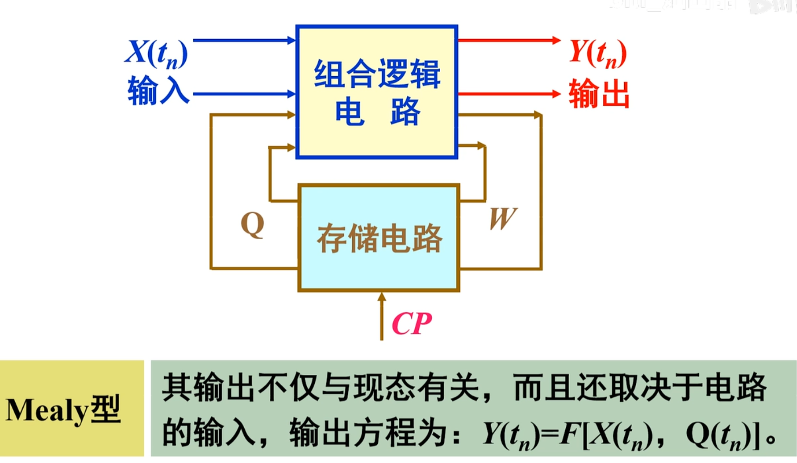

- 电路结构：组合逻辑电路的输入包含 “外部输入 X” 和 “存储电路现态 Q (tn)”，输出 Y 直接由该组合逻辑电路生成；

- 输出特性：输出信号 Y (tn) **同时依赖于现态 Q (tn) 和当前输入 X (tn)**；

- 输出方程：Y (tn) = F [X (tn), Q (tn)]（其中 F 表示特定的逻辑关系）；

- 复杂度：分析和设计难度高于 Moore 型电路（需同时处理 “输入信号” 和 “状态信号”）。

#### （2）Moore 型时序逻辑电路

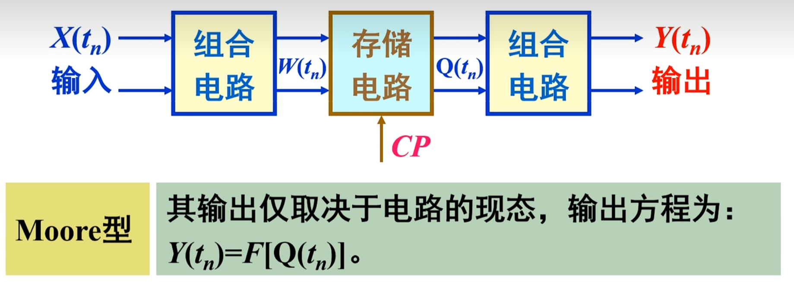

- 电路结构：包含 “左组合逻辑电路→存储电路→右组合逻辑电路” 的串联结构；左组合逻辑电路输入为 X，输出 W 送入存储电路；存储电路输出现态 Q (tn)，送入右组合逻辑电路；右组合逻辑电路输出最终信号 Y；

- 输出特性：输出信号 Y (tn) **仅由存储电路的现态 Q (tn) 决定**，与当前输入 X (tn) 无直接关联；

- 输出方程：Y (tn) = F [Q (tn)]（其中 F 表示特定的逻辑关系）；

- 复杂度：分析和设计难度低于 Mealy 型电路（仅需处理 “状态信号”）。


# 同步时序电路的分析

## 一、核心学习要求

视频明确本节需掌握以下 3 点核心内容：

1. 掌握时序电路的分析方法（重点为同步时序电路）；

1. 理解 4 类方程（时钟方程、输出方程、驱动方程、状态方程）及 3 类工具（状态表、状态转换图、时序图）的概念与分析方法；

1. 了解时序电路的设计方法（视频以同步 / 异步分类讲解，本节重点为同步）。

## 二、同步时序电路的核心特点

同步时序电路的关键特征的是**所有触发器的时钟端（CP）均连接在一起**，仅在时钟有效边沿（视频中为下降沿）到来时，所有触发器的输出状态才会同步更新。

- 示例：视频中例题使用 3 个**下降沿触发的 JK 触发器**（符号含 “三角形 + 圆圈”），3 个触发器的 CP 端全部连在一起，属于典型同步电路。

## 三、同步时序电路的分析六步法

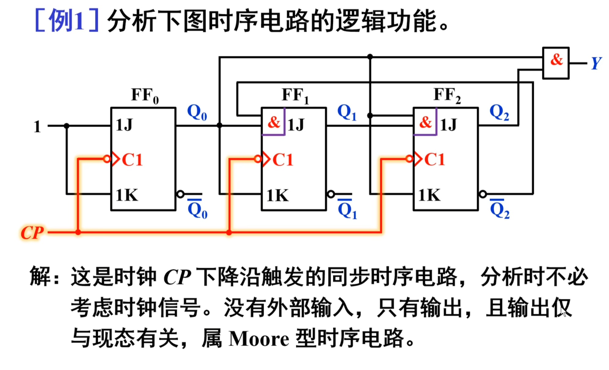

视频详细拆解了时序电路分析的 6 个步骤，并结合 “3 个 JK 触发器构成的无输入时序电路” 为例展开讲解。

### 步骤 1：写 3 类方程（时钟、输出、驱动方程）

需先列出电路的 3 类基础方程，同步电路中**时钟方程可省略**（因所有 CP 同源），异步电路必须写。

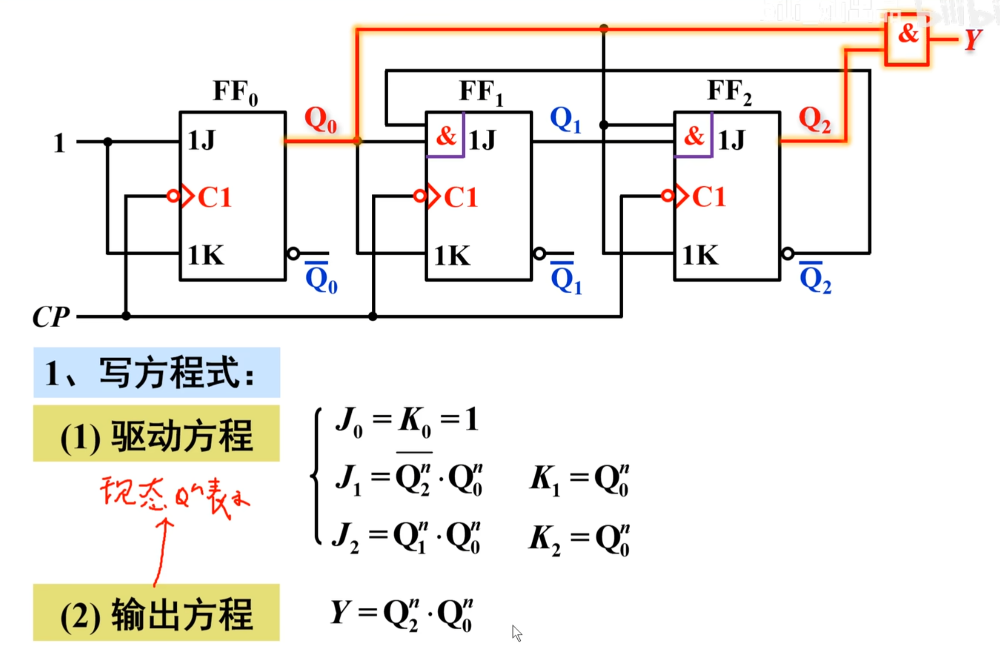

| 方程类型 | 定义（视频表述）                                             | 视频例题推导（3 个 JK 触发器，Q2Q1Q0 为现态，记为 Q2ⁿQ1ⁿQ0ⁿ） |
| -------- | ------------------------------------------------------------ | ------------------------------------------------------------ |
| 时钟方程 | 各触发器时钟信号的逻辑表达式                                 | 同步电路 CP 同源，省略（方程为：CP0=CP1=CP2=CP，下降沿有效） |
| 输出方程 | 时序电路输出的逻辑表达式，为**现态的函数**                   | 例题输出 Y 由 Q2ⁿ和 Q0ⁿ经与门得到，故 Y=Q2ⁿ・Q0ⁿ             |
| 驱动方程 | 触发器输入端（如 JK 触发器的 J、K 端）的逻辑表达式，同样为**现态的函数** | 例题中 3 个 JK 触发器的驱动方程：1. J0=K0=1（均接高电平）2. J1=Q2ⁿ’・Q0ⁿ（Q2 非与 Q0 现态的与），K1=Q0ⁿ3. J2=Q1ⁿ・Q0ⁿ（Q1 与 Q0 现态的与），K2=Q0ⁿ |

- 关键提醒：方程中必须标注 “现态（ⁿ）”，避免与次态（ⁿ⁺¹）混淆（视频反复强调此点）。

### 步骤 2：求状态方程

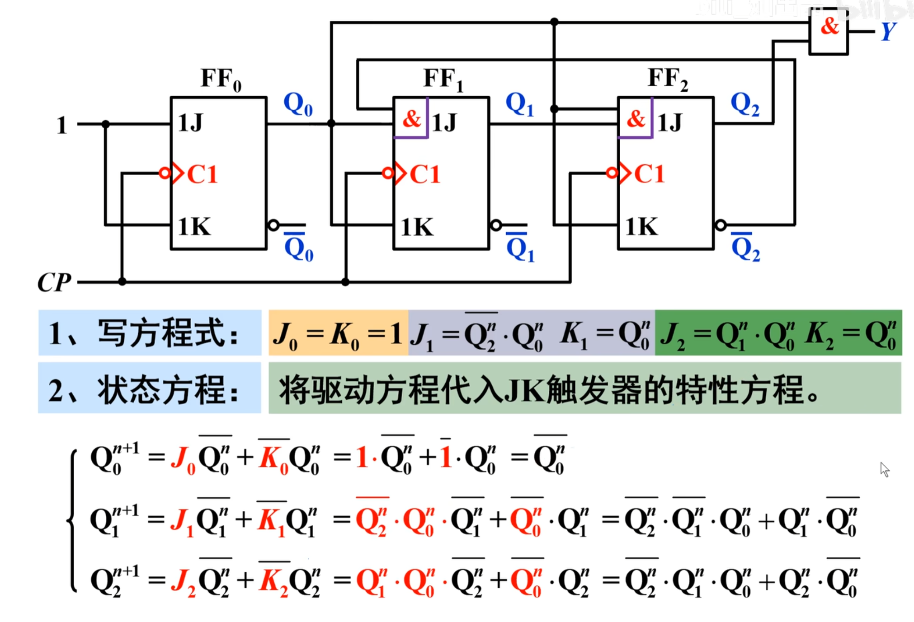

状态方程是**次态（Qⁿ⁺¹）与现态（Qⁿ）的关系**，需将 “驱动方程” 代入 “触发器特性方程” 推导得出。

视频中重点强调 2 类常用触发器的特性方程：

1. 边沿 D 触发器：Qⁿ⁺¹ = D

1. 边沿 JK 触发器：Qⁿ⁺¹ = J・Qⁿ’ + K’・Qⁿ（核心，例题均用此）

1. T’触发器（JK 触发器特例）：J=K=1 时，Qⁿ⁺¹ = Qⁿ’（视频中 J0=K0=1，故 Q0 为 T’触发器）

#### 视频例题状态方程推导：

- Q0ⁿ⁺¹：J0=1，K0=1 代入 JK 特性方程 → Q0ⁿ⁺¹ = 1・Q0ⁿ’ + 1’・Q0ⁿ = Q0ⁿ’

- Q1ⁿ⁺¹：J1=Q2ⁿ’・Q0ⁿ，K1=Q0ⁿ代入 → Q1ⁿ⁺¹ = (Q2ⁿ’・Q0ⁿ)・Q1ⁿ’ + (Q0ⁿ)’・Q1ⁿ

- Q2ⁿ⁺¹：J2=Q1ⁿ・Q0ⁿ，K2=Q0ⁿ代入 → Q2ⁿ⁺¹ = (Q1ⁿ・Q0ⁿ)・Q2ⁿ’ + (Q0ⁿ)’・Q2ⁿ

### 步骤 3：列状态表

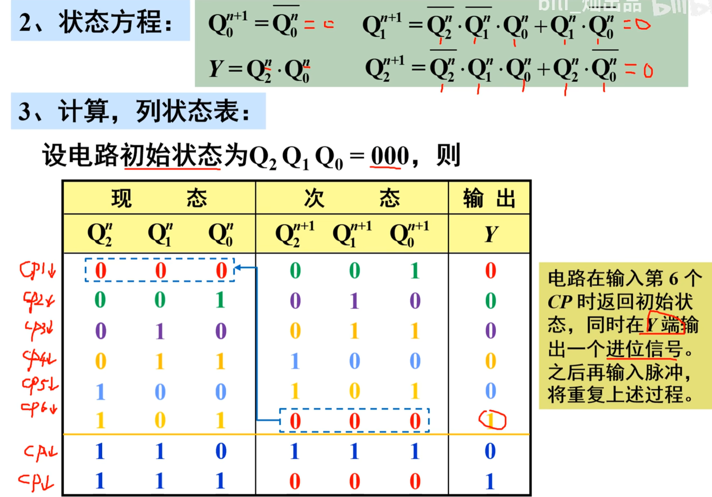

状态表是将 “现态” 代入 “状态方程” 和 “输出方程”，计算出 “次态” 和 “输出” 的表格。视频中介绍 2 种形式：

#### 1. 完整状态表（8 种状态，3 个触发器共 2³=8 种）

| 现态（Q2ⁿQ1ⁿQ0ⁿ） | 次态（Q2ⁿ⁺¹Q1ⁿ⁺¹Q0ⁿ⁺¹） | 输出 Y（Y=Q2ⁿ・Q0ⁿ） |
| ----------------- | ----------------------- | -------------------- |
| 000               | 001                     | 0（0·0=0）           |
| 001               | 010                     | 0（0·1=0）           |
| 010               | 011                     | 0（0·0=0）           |
| 011               | 100                     | 0（0·1=0）           |
| 100               | 101                     | 0（1·0=0）           |
| 101               | 000                     | 1（1·1=1）           |
| 110（无效）       | 111                     | 0（1·0=0）           |
| 111（无效）       | 000                     | 1（1·1=1）           |

#### 2. 简化状态表（按 CP 顺序，仅列有效循环 + 无效状态）

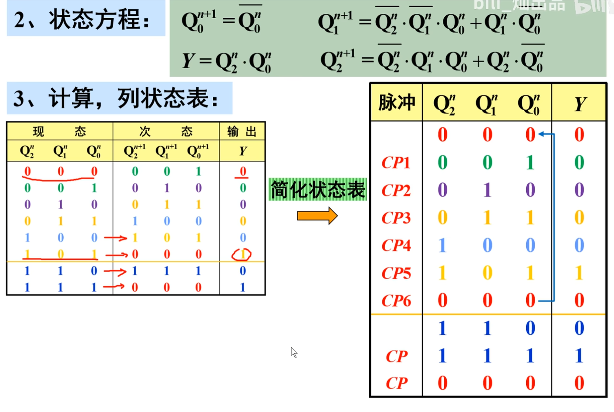

视频推荐此形式，更直观：

| CP 脉冲（下降沿） | 现态（Q2ⁿQ1ⁿQ0ⁿ） | 次态（Q2ⁿ⁺¹Q1ⁿ⁺¹Q0ⁿ⁺¹） | 输出 Y |
| ----------------- | ----------------- | ----------------------- | ------ |
| 1                 | 000（初始）       | 001                     | 0      |
| 2                 | 001               | 010                     | 0      |
| 3                 | 010               | 011                     | 0      |
| 4                 | 011               | 100                     | 0      |
| 5                 | 100               | 101                     | 0      |
| 6                 | 101               | 000（回到初始）         | 1      |
| -（无效状态）     | 110               | 111                     | 0      |
| -（无效状态）     | 111               | 000                     | 1      |

- 关键概念：

- 有效状态：参与正常循环的状态（例题中 000~101，共 6 种）；

- 无效状态：未参与正常循环的状态（例题中 110、111，共 2 种）。

### 步骤 4：画状态转换图与时序图

两者均是状态变化的可视化表达，与状态表含义一致，但形式不同。

#### 1. 状态转换图（视频重点推荐，直观判断自启动）

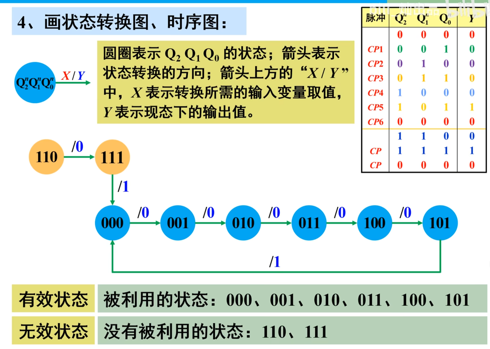

- 图形规则：

- 圆圈：代表一个稳定状态（标注 Q2Q1Q0）；

- 箭头：代表状态转换方向（CP 有效边沿触发）；

- 箭头标注：无输入时仅标输出 Y（格式：/Y，因 X = 无）。

#### 视频例题状态转换图结构：

- 有效循环：000 → 001 → 010 → 011 → 100 → 101 → 000（箭头标注均为 / Y=0，仅 101→000 标注 / Y=1）；

- 无效状态转换：110 → 111（/Y=0），111 → 000（/Y=1）。

#### 2. 时序图（波形图，视频中 6 个 CP 为例）

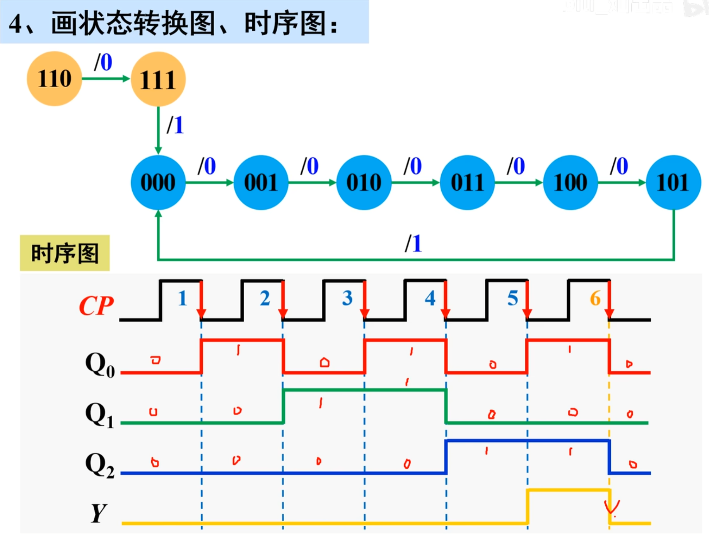

- 绘制对象：CP（下降沿有效）、Q2、Q1、Q0、Y；

- 初始状态：Q2Q1Q0=000；

- 波形特点：

- 仅在 CP 下降沿时，Q2Q1Q0 更新为次态；

- Y 仅在现态为 101 时输出高电平（对应 CP6 下降沿前），其余时刻为低电平。

### 步骤 5：检查电路能否自启动

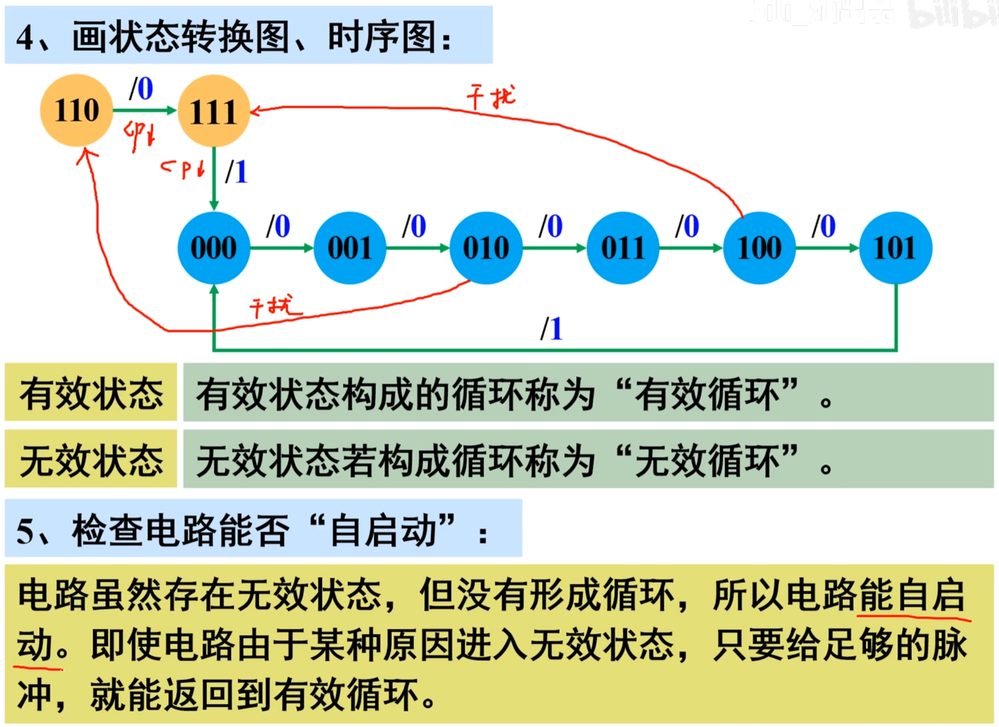

视频给出明确判断标准：

- 定义：电路受干扰进入 “无效状态” 后，能否通过 CP 脉冲自动回到 “有效循环”；

- 能自启动：无效状态**未形成循环**，最终能回到有效循环；

- 不能自启动：无效状态形成循环，无法回到有效循环。

#### 视频例题判断：

无效状态 110→111→000（000 为有效状态），未形成循环 → **电路能自启动**。

- 示例：若干扰使状态跳至 110，经 2 个 CP（110→111→000）回到有效循环；跳至 111，经 1 个 CP 回到有效循环。

### 步骤 6：说明电路逻辑功能

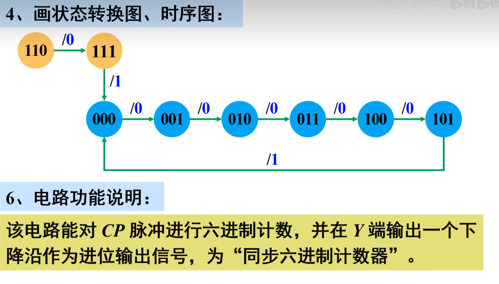

根据状态转换图 / 表，总结电路核心作用。

视频例题结论：该电路是**同步六进制加法计数器**，功能为：

- 对 CP 脉冲进行计数，每输入 6 个 CP 脉冲，状态回到初始值（000）；

- 计数满 6 时（现态 101），Y 端输出 1 个高电平，作为 “进位信号”。

## 四、电路仿真

视频用 Multisim 软件演示仿真，核心组件与连接：

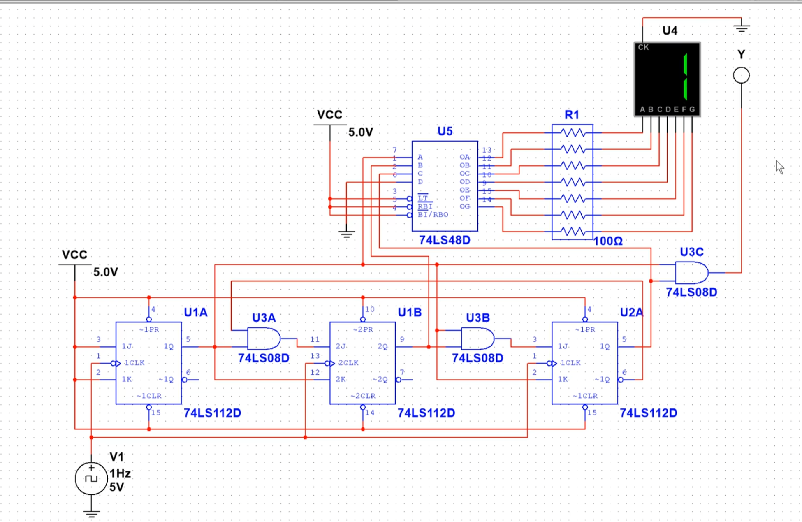

1. 核心芯片：

- 74LS112：双下降沿 JK 触发器（3 个，构成电路主体）；

- 74LS08：四 2 输入与门（3 个，实现驱动方程中的与逻辑）；

- 74LS48：BCD 七段显示译码器（连接共阴极数码管，显示 0~5）；

- 共阴极数码管（COM_K）：显示计数结果（0→1→2→3→4→5→0）；

- 探测灯：显示进位信号 Y（计数到 5 时灯亮）。

1. 时钟信号：

- 信号源：Clock Voltage（1Hz 方波，占空比 50%，下降沿有效）；

1. 仿真结果：数码管循环显示 0~5，Y 灯在显示 5 时点亮，与理论分析一致。


#  同步时序电路例题 2 的分析及仿真 

## 1. 电路结构分析（例题核心电路）

视频中例题 2 的时序电路由以下元器件构成：

- **触发器**：2 个**下降沿触发的 JK 触发器**（记为触发器 0 和触发器 1，分别输出 Q0、Q0' 和 Q1、Q1'），两个触发器的时钟脉冲端（CP）接在一起，确保状态同步更新。

- **门电路**：3 个**异或门**（逻辑符号标 “=1”）、1 个**与门**；异或门用于构建触发器的驱动信号，与门用于构建输出信号 Y。

- **外部信号**：1 个外部输入 X（控制信号）、1 个输出 Y（状态输出信号）。

## 2. 电路类型判断

根据电路结构和输出特性，判断为以下类型：

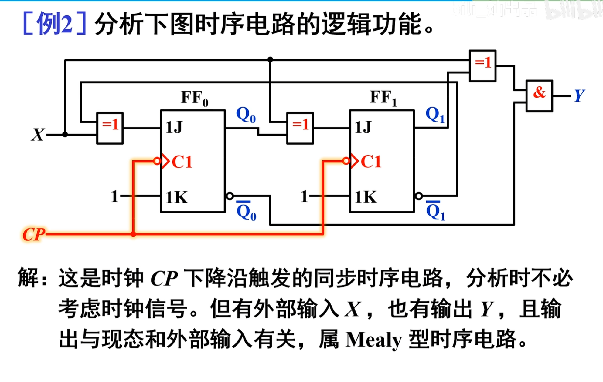

### 2.1 同步时序电路

- 依据：两个 JK 触发器的时钟脉冲端（CP）直接连接，触发信号同步输入，因此两个触发器的状态更新完全同步，无需单独考虑时钟信号的异步差异。

### 2.2 Mealy 型时序电路

- 依据：输出 Y 同时依赖**触发器现态**（Q0'、Q1）和**外部输入 X**，符合 Mealy 型时序电路的定义（输出与现态、外部输入均相关）；区别于 Moore 型（仅依赖现态）。

## 3. 例题详细分析步骤

视频中明确例题分析分为 “列方程→推状态→列状态表→画转换图→定功能” 五步，具体如下：

### 3.1 第一步：列写核心方程式（驱动方程、输出方程）

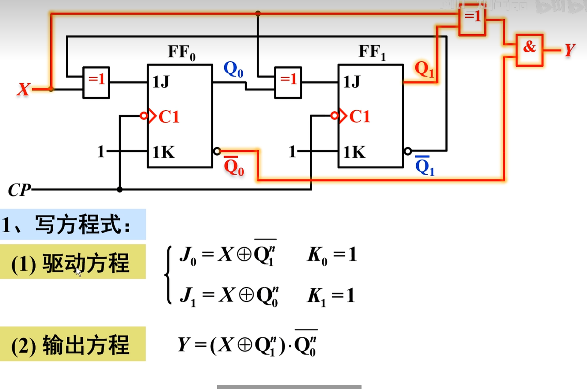

#### 3.1.1 驱动方程（触发器输入信号表达式）

驱动方程描述 JK 触发器的 J、K 端与外部输入 X、触发器现态（Q0、Q1、Q0'、Q1'）的关系，视频中推导结果如下：

- 触发器 0（输出 Q0）：

- J0 = X ⊕ Q1'（X 与 Q1 非经过异或门输出）

- K0 = 1（直接接高电平）

- 触发器 1（输出 Q1）：

- J1 = X ⊕ Q0（X 与 Q0 经过异或门输出）

- K1 = 1（直接接高电平）

#### 3.1.2 输出方程（输出 Y 表达式）

输出 Y 由 X、Q1、Q0' 经过 “异或 + 与” 逻辑构成，视频中推导结果：

- Y = (X ⊕ Q1)・Q0'（X 与 Q1 先异或，结果再与 Q0 非进行与运算）

### 3.2 第二步：推导状态方程（次态表达式）

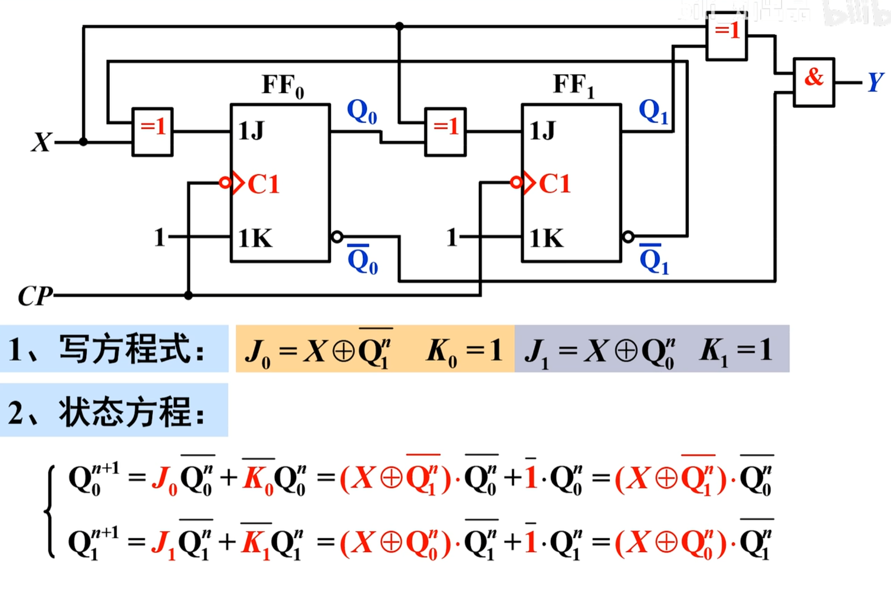

#### 3.2.1 JK 触发器特性方程（通式）

JK 触发器的次态（Q*，“*” 表示次态）与现态（Q）、驱动信号（J、K）的关系为：

- Q* = JQ' + K'Q（下降沿触发时，CP 有效沿到来后按此式更新状态）

#### 3.2.2 代入驱动方程求状态方程

将 3.1.1 中的驱动方程代入 JK 特性方程，视频中推导过程如下：

- 触发器 0 的次态 Q0*：

Q0* = J0Q0' + K0'Q0

代入 J0=X⊕Q1'、K0=1（则 K0'=0）：

Q0* = (X ⊕ Q1') · Q0' + 0 · Q0 = (X ⊕ Q1') · Q0'

- 触发器 1 的次态 Q1*：

Q1* = J1Q1' + K1'Q1

代入 J1=X⊕Q0、K1=1（则 K1'=0）：

Q1* = (X ⊕ Q0) · Q1' + 0 · Q1 = (X ⊕ Q0) · Q1'

### 3.3 第三步：列写状态表（分 X=0 和 X=1 两种场景）

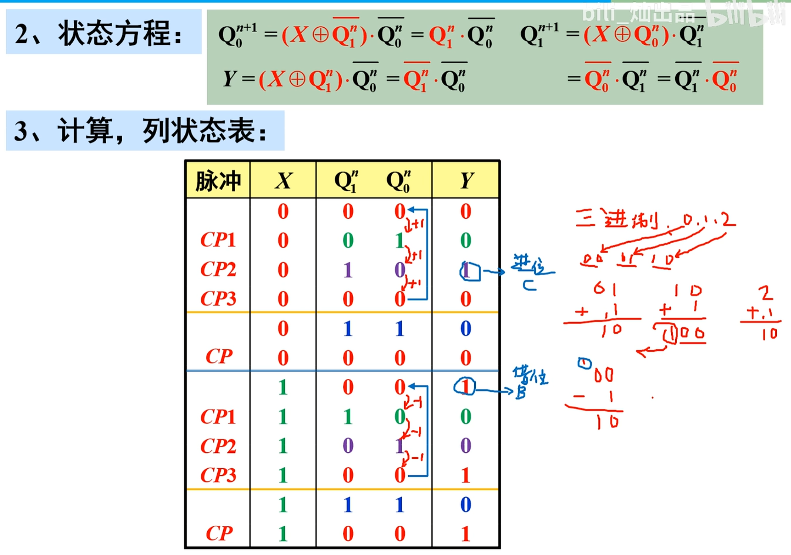

状态表需包含 “现态（Q1Q0）→次态（Q1*Q0*）→输出 Y” 的对应关系，且需考虑**有效状态**（参与循环的状态）和**无效状态**（未参与循环的状态），视频中详细推导如下：

#### 3.3.1 场景 1：外部输入 X=0

先简化 X=0 时的状态方程和输出方程（利用异或特性：0⊕A=A）：

- 状态方程简化：

Q0* = (0 ⊕ Q1')・Q0' = Q1'・Q0'

Q1* = (0 ⊕ Q0) · Q1' = Q0 · Q1'

- 输出方程简化：

Y = (0 ⊕ Q1)・Q0' = Q1・Q0'

再逐一枚举现态（Q1Q0 的所有可能：00、01、10、11），计算次态和 Y：

| 现态（Q1Q0） | 次态（Q1*Q0*）             | 输出 Y     | 状态类型 |
| ------------ | -------------------------- | ---------- | -------- |
| 00           | 01（Q1*=0·1=0，Q0*=1·1=1） | 0（0·1=0） | 有效状态 |
| 01           | 10（Q1*=1·1=1，Q0*=0·0=0） | 0（0·0=0） | 有效状态 |
| 10           | 00（Q1*=0·0=0，Q0*=0·1=0） | 1（1·1=1） | 有效状态 |
| 11（无效）   | 00（Q1*=1·0=0，Q0*=0·0=0） | 0（1·0=0） | 无效状态 |

- 关键结论：X=0 时，有效状态（00、01、10）构成循环 “00→01→10→00”，无效状态 11 在 CP 作用下可回到有效状态 00，电路具备**自启动性**。

#### 3.3.2 场景 2：外部输入 X=1

先简化 X=1 时的状态方程和输出方程（利用异或特性：1⊕A=A'）：

- 状态方程简化：

Q0* = (1 ⊕ Q1')・Q0' = Q1・Q0'（1⊕Q1'=Q1）

Q1* = (1 ⊕ Q0) · Q1' = Q0' · Q1'（1⊕Q0=Q0'）

- 输出方程简化：

Y = (1 ⊕ Q1)・Q0' = Q1'・Q0'（1⊕Q1=Q1'）

再逐一枚举现态，计算次态和 Y：

| 现态（Q1Q0） | 次态（Q1*Q0*）             | 输出 Y     | 状态类型 |
| ------------ | -------------------------- | ---------- | -------- |
| 00           | 10（Q1*=1·1=1，Q0*=0·1=0） | 1（1·1=1） | 有效状态 |
| 10           | 01（Q1*=1·0=0，Q0*=1·1=1） | 0（0·1=0） | 有效状态 |
| 01           | 00（Q1*=0·1=0，Q0*=0·0=0） | 0（1·0=0） | 有效状态 |
| 11（无效）   | 00（Q1*=0·0=0，Q0*=1·0=0） | 0（0·0=0） | 无效状态 |

- 关键结论：X=1 时，有效状态（00、01、10）构成循环 “00→10→01→00”，无效状态 11 在 CP 作用下可回到有效状态 00，电路具备**自启动性**。

### 3.4 第四步：绘制状态转换图

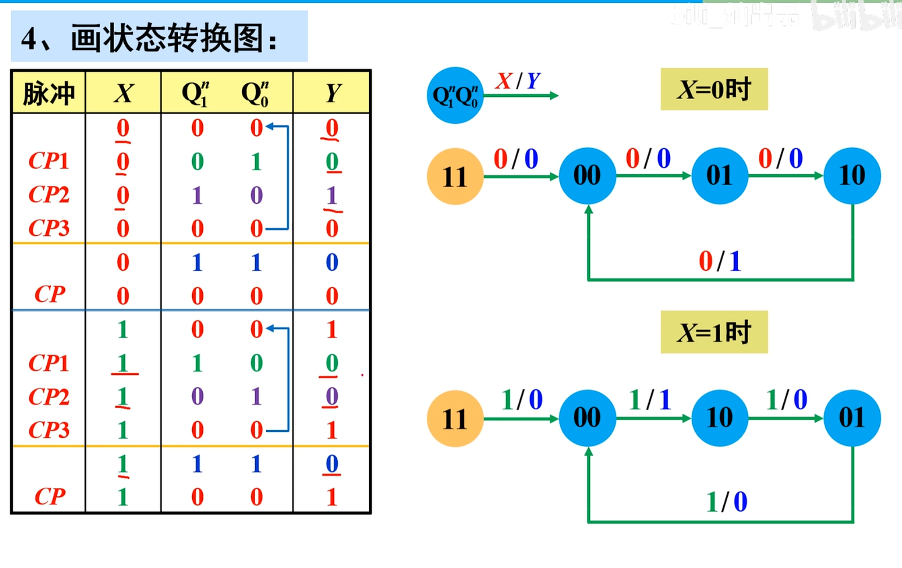

视频中状态转换图分 “分图（X=0、X=1 单独画）” 和 “合并图（X=0/X=1 合并画）” 两种形式，核心要素：

- 节点：表示触发器现态（Q1Q0），如 “00”“01”“10”“11”。

- 箭头：表示现态到次态的转换，箭头上方标注 “X/Y”（输入 X / 输出 Y）。

#### 3.4.1 X=0 时的状态转换图

- 有效循环：00（X=0/Y=0）→01（X=0/Y=0）→10（X=0/Y=1）→00

- 无效状态：11（X=0/Y=0）→00

#### 3.4.2 X=1 时的状态转换图

- 有效循环：00（X=1/Y=1）→10（X=1/Y=0）→01（X=1/Y=0）→00

- 无效状态：11（X=1/Y=0）→00

#### 3.4.3 合并状态转换图（X=0/X=1 整合）


- 00 节点：→01（X=0/Y=0）、→10（X=1/Y=1）

- 01 节点：→10（X=0/Y=0）、→00（X=1/Y=0）

- 10 节点：→00（X=0/Y=1）、→01（X=1/Y=0）

- 11 节点：→00（X=0/Y=0）、→00（X=1/Y=0）

### 3.5 第五步：分析电路功能

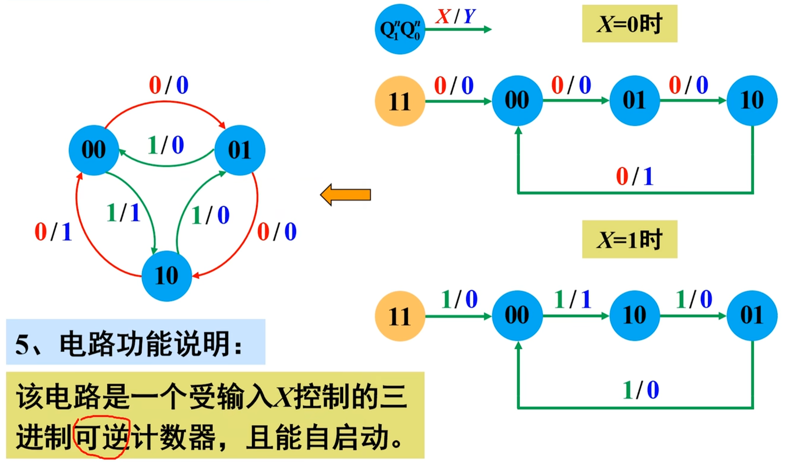

结合状态表和状态转换图，视频中明确电路的核心功能：

- **三进制可逆计数器**：外部输入 X 为控制端，实现加法 / 减法计数切换：

1. 当 X=0 时：三进制加法计数器

- 计数循环：00（十进制 0）→01（十进制 1）→10（十进制 2）→00

- 进位标志：当状态从 10→00 时，输出 Y=1（表示 “2+1” 溢出，产生进位）。

1. 当 X=1 时：三进制减法计数器

- 计数循环：00（十进制 0）→10（十进制 2）→01（十进制 1）→00

- 借位标志：当状态从 00→10 时，输出 Y=1（表示 “0-1” 不够减，产生借位）。

- **自启动特性**：无效状态 11 在任意 CP 脉冲作用下，均能自动回到有效循环（00），无需额外复位操作。

## 4. 电路仿真验证

视频中通过硬件仿真验证理论分析结果，详细说明仿真电路的构建和结果：

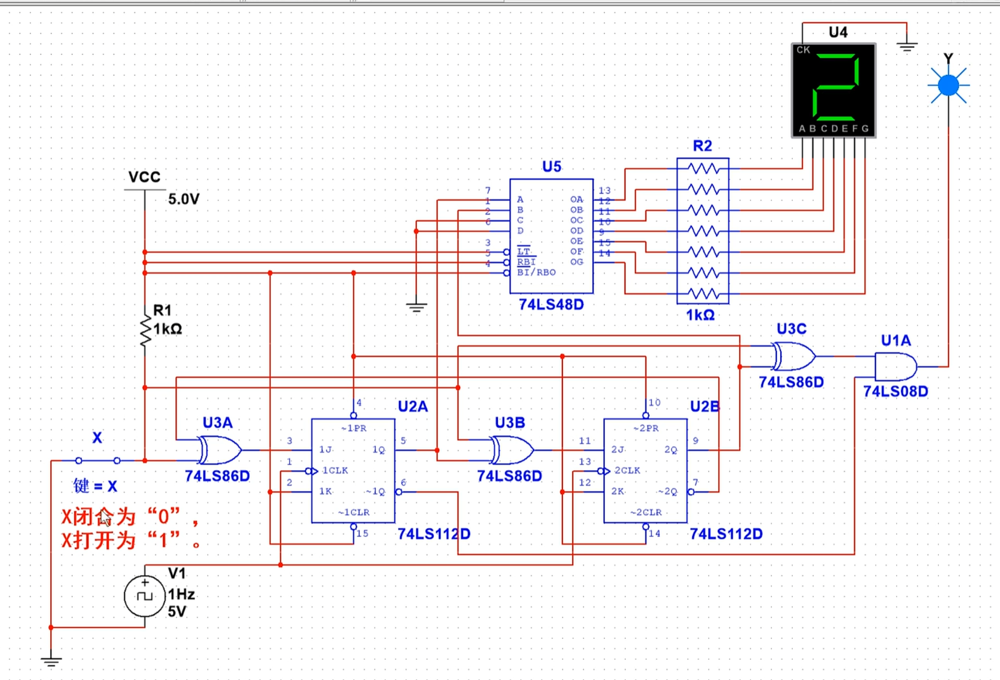

### 4.1 仿真元器件选择

| 元器件类型 | 型号 / 规格                   | 功能说明                                                     |
| ---------- | ----------------------------- | ------------------------------------------------------------ |
| JK 触发器  | 74LS112                       | 下降沿触发，异步置 1 端（PR）、异步清零端（CLR）均接 + 5V 高电平（异步端不工作）。 |
| 异或门     | 74LS86                        | 实现 X 与 Q1'、X 与 Q0 的异或运算，美国逻辑符号（或门基础上加弧线）。 |
| 显示译码器 | 74LS48                        | BCD 码译码器，三个控制端（LT、RBI、BI/RBO）均接 + 5V（正常译码，无消隐 / 测试）。 |
| 数码管     | 共阴极 7 段数码管             | 公共端接地，接收 74LS48 的译码输出，显示 Q1Q0 对应的十进制数（0、1、2）。 |
| 电阻       | 7 个电阻的电阻排（RPack）     | 连接 74LS48 与数码管，限制数码管电流，避免烧毁。             |
| 输入控制   | 单刀开关 + 1kΩ 电阻 + 5V 电源 | 控制外部输入 X：开关闭合→X=0（接地），开关打开→X=1（接 + 5V）。 |
| 时钟信号   | 1Hz 方波信号                  | 提供触发器的 CP 脉冲，确保状态按周期更新。                   |

### 4.2 仿真电路连接要点

- **JK 触发器连接**：触发器 0 的 J0 接 “X⊕Q1'” 异或门输出，K0 接 + 5V；触发器 1 的 J1 接 “X⊕Q0” 异或门输出，K1 接 + 5V；Q0、Q1 分别接 74LS48 的 A、B 端（74LS48 的 C、D 端接 0，因仅 2 位输出）。

- **输出 Y 连接**：(X⊕Q1) 与 Q0' 的与门输出端接 LED 指示灯，Y=1 时 LED 亮，Y=0 时 LED 灭。

### 4.3 仿真结果验证（与理论分析一致）

#### 4.3.1 X=0（开关闭合）：三进制加法计数

- 数码管显示循环：0 → 1 → 2 → 0 → ...

- LED 状态：仅当数码管显示 “2”（状态 10）时，LED 亮（Y=1，进位），其余时刻 LED 灭（Y=0）。

#### 4.3.2 X=1（开关打开）：三进制减法计数

- 数码管显示循环：0 → 2 → 1 → 0 → ...

- LED 状态：仅当数码管显示 “0”（状态 00）时，LED 亮（Y=1，借位），其余时刻 LED 灭（Y=0）。


# 同步时序电路分析习题

## 一、同步时序电路分析核心步骤

1. **列写方程**：包括时钟方程、驱动方程、输出方程

1. **推导状态方程**：将驱动方程代入触发器特性方程，得到次态与现态的关系

1. **编制状态表**：包含现态、次态、输出，需覆盖有效状态和无效状态

1. **绘制状态转换图**：区分有效循环（功能循环）和无效循环

1. **判断电路功能**：如计数器进制、计数方向等

1. **判断自启动能力**：观察无效状态是否能回到有效循环

## 二、习题电路结构（视频明确描述）

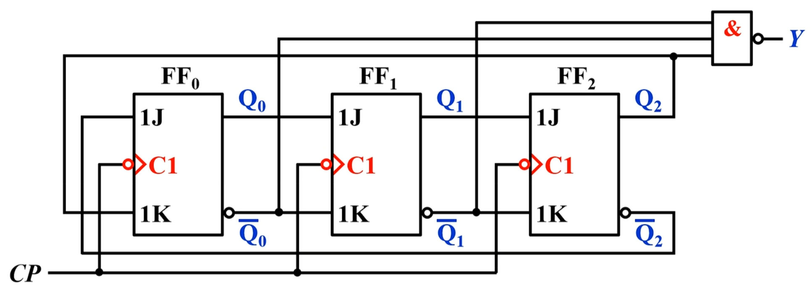

- **核心组件**：3 个**下降沿触发的 JK 触发器**（编号：触发器 0、触发器 1、触发器 2，对应输出 Q₀、Q₁、Q₂） + 1 个**三输入端与非门**（输出为 Y）

- **结构特点**：所有触发器输入端（J、K 端）前无额外门电路，仅直接连接信号，分析难度低于前序例题

## 三、方程列写（视频分步讲解）

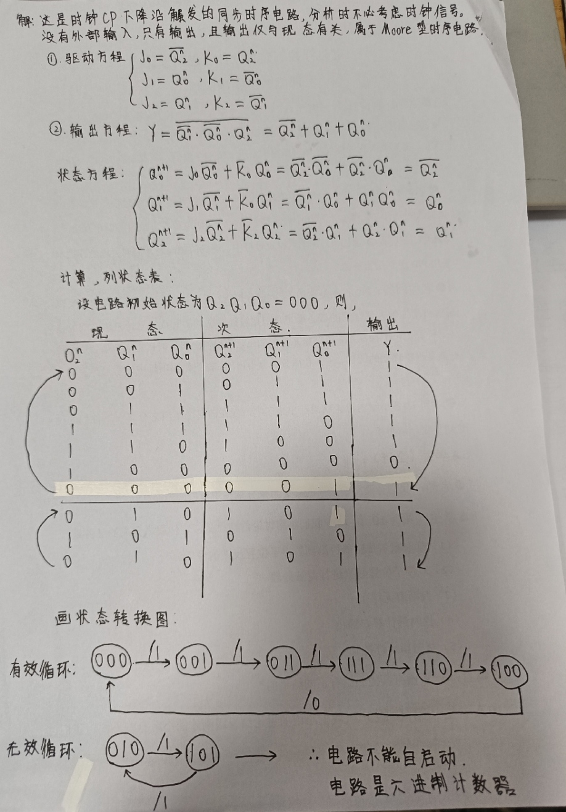

### 1. 时钟方程

- 同步时序电路特性：3 个 JK 触发器的时钟端接同一时钟信号，时钟同步触发（下降沿），无需区分时钟先后，方程可简化为 “CP₀=CP₁=CP₂=CP（下降沿有效）”

### 2. 驱动方程

- 驱动方程定义：各触发器 J、K 端的逻辑表达式（用现态 Q₂、Q₁、Q₀表示）

- 视频结论：因触发器输入端无额外门电路，可直接根据电路连接快速列写（具体表达式结合实物连接，核心是 “无额外逻辑门，表达式简洁”），示例格式如下：

- 触发器 0：J₀ = 某信号，K₀ = 某信号（视频强调 “结构简单，可快速写出”）

- 触发器 1：J₁ = 某信号，K₁ = 某信号

- 触发器 2：J₂ = 某信号，K₂ = 某信号

### 3. 输出方程

- 输出 Y 由**三输入端与非门**产生，逻辑关系为 “Y = 与非门输入信号的与非运算”

- 结合状态输出结果反推（视频中状态输出规律）：

- 当现态为 100 时，Y=0；

- 其他有效状态（000、001、011、111、110）及无效状态（010、101）时，Y=1；

- 核心：Y 的输出仅在现态 100 时为低电平，其余状态为高电平。

## 四、状态方程推导（视频核心计算步骤）

### 1. 基础：JK 触发器特性方程

- 视频明确使用公式：**Qⁿ⁺¹ = JQⁿ’ + K’Qⁿ**（Qⁿ为现态，Qⁿ⁺¹ 为次态，J、K 为驱动信号）

### 2. 代入驱动方程得 3 个状态方程

- 因有 3 个 JK 触发器，需推导 3 个状态方程（对应 Q₀ⁿ⁺¹、Q₁ⁿ⁺¹、Q₂ⁿ⁺¹）：

1. 触发器 0 状态方程：Q₀ⁿ⁺¹ = J₀Q₀ⁿ’ + K₀’Q₀ⁿ（代入 J₀、K₀的驱动方程）

1. 触发器 1 状态方程：Q₁ⁿ⁺¹ = J₁Q₁ⁿ’ + K₁’Q₁ⁿ（代入 J₁、K₁的驱动方程）

1. 触发器 2 状态方程：Q₂ⁿ⁺¹ = J₂Q₂ⁿ’ + K₂’Q₂ⁿ（代入 J₂、K₂的驱动方程）

- 视频结论：通过状态方程可计算任意现态对应的次态（后续状态表、状态图均基于此推导）

## 五、状态表编制（视频详细要求 + 示例）

### 1. 状态表设计原则

- 无外部输入 X（电路无外部控制信号），表格列项：**脉冲序号、现态（Q₂Q₁Q₀，从大到小排列）、次态（Q₂ⁿ⁺¹Q₁ⁿ⁺¹Q₀ⁿ⁺¹）、输出 Y**

- 需覆盖所有 3 位二进制状态（共 8 个：000、001、010、011、100、101、110、111），包含**有效状态**（参与功能循环）和**无效状态**（不参与功能循环）

- 初始状态假定：视频指定初始状态为 “000”

### 2. 完整状态表示例（视频推导结果）

| 脉冲序号 | 现态（Q₂Q₁Q₀） | 次态（Q₂ⁿ⁺¹Q₁ⁿ⁺¹Q₀ⁿ⁺¹） | 输出 Y | 状态类型 |
| -------- | -------------- | ----------------------- | ------ | -------- |
| 1        | 000            | 001                     | 1      | 有效     |
| 2        | 001            | 011                     | 1      | 有效     |
| 3        | 010            | 101                     | 1      | 无效     |
| 4        | 011            | 111                     | 1      | 有效     |
| 5        | 100            | 000                     | 0      | 有效     |
| 6        | 101            | 010                     | 1      | 无效     |
| 7        | 110            | 100                     | 1      | 有效     |
| 8        | 111            | 110                     | 1      | 有效     |

## 六、状态转换图（视频可视化描述）

### 1. 核心构成：有效循环 + 无效循环

#### （1）有效循环（电路功能循环，共 6 个有效状态）

- 转换路径：000（Y=1）→ 001（Y=1）→ 011（Y=1）→ 111（Y=1）→ 110（Y=1）→ 100（Y=0）→ 000（Y=1）

- 特点：循环闭合，覆盖 6 个状态，输出 Y 仅在 “100→000” 环节为 0，其余均为 1

#### （2）无效循环（2 个无效状态构成）

- 转换路径：010（Y=1）→ 101（Y=1）→ 010（Y=1）

- 特点：无效状态（010、101）无法回到有效循环，形成独立闭合循环

### 2. 状态转换图示意（文字描述）

```
有效循环：
000(1) → 001(1) → 011(1) → 111(1) → 110(1) → 100(0) → 000(1)

无效循环：
010(1) ↔ 101(1)
```

## 七、电路功能判断（视频明确结论）

- **功能类型**：同步计数器（时钟同步触发）

- **计数器进制**：六进制

- 依据：有效循环包含 6 个独立状态（000、001、011、111、110、100），满足 “N 进制计数器对应 N 个有效状态” 的规律

- **计数规律**：非 “加 1 / 减 1” 规律，而是 “1 左移挤除 0” 的特殊规律（视频比喻：1 逐步左移，将最左侧的 0 挤除，如 000→001（1 进入最低位）→011（1 左移至中间位）→111（1 左移至最高位）→110（最低位 0 挤除 1）→100（中间位 0 挤除 1）→000（最高位 0 挤除 1））

## 八、自启动能力判断（视频关键结论）

**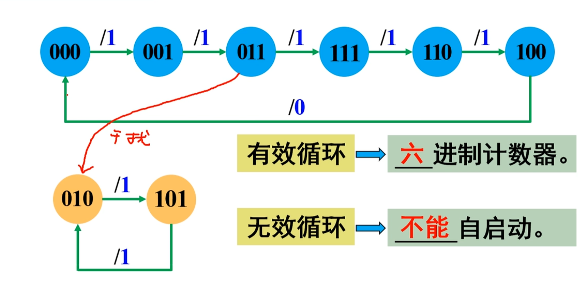**

### 1. 自启动定义

电路因干扰进入无效状态后，能否在时钟脉冲作用下自动回到有效循环。

### 2. 习题电路结论：不能自启动

- 依据：无效状态 010 和 101 构成**无效循环**（010→101→010），无论多少个时钟脉冲，均无法跳出无效循环回到有效状态，不符合 “自启动” 要求。

## 九、强调的关键注意点

1. 同步电路无需考虑时钟先后，仅需在时钟触发沿分析状态变化；

1. 状态表必须包含所有无效状态，否则无法判断自启动能力；

1. 输出 Y 的高低电平变化可作为 “循环结束” 的标志（如习题中 100 状态 Y=0，标识一次六进制计数完成）；

1. JK 触发器的 “下降沿触发” 特性不影响同步电路分析（因时钟同步），仅需确保在触发沿代入状态方程计算。


# 异步时序电路的分析

## 一、异步时序电路核心特点

1. **结构区别于同步时序电路**

- 同步时序电路：所有触发器的时钟脉冲端（CP）均连接在一起，由同一 CP 控制翻转。

- 异步时序电路：仅部分触发器由外部 CP 触发，其余触发器由电路内部信号（如其他触发器的输出 Q/\(\overline{Q}\)）触发。

1. **关键特性**

- 必须列写**时钟方程**（同步时序电路无需列写），明确每个触发器的触发信号及有效边沿。

- 触发器状态更新的前提：**时钟条件满足**（对应有效边沿到来）；若时钟条件不满足，触发器次态保持现态不变（仅当有效边沿触发时，状态方程才生效）。

## 二、异步时序电路通用分析步骤

1. **第一步：列写方程式**

- 时钟方程：确定每个触发器的触发信号（外部 CP 或内部信号）及有效边沿（如下降沿、上升沿）。

- 驱动方程：写出各触发器输入端（如 JK 触发器的 J/K、D 触发器的 D）的逻辑表达式（基于电路连接）。

- 输出方程：写出电路输出端与触发器现态的逻辑关系。

1. **第二步：推导状态方程**

- 将驱动方程代入对应触发器的**特性方程**，并标注时钟条件（仅当时钟有效时，状态方程生效）：

- JK 触发器特性方程：\(Q^* = J\overline{Q} + \overline{K}Q\)（需标注有效边沿，如下降沿）。

- D 触发器特性方程：\(Q^* = D\)（需标注有效边沿，如上升沿）。

1. **第三步：列写状态表**

- 假设初始状态（通常为全 0，如\(Q_2Q_1Q_0=000\)）。

- 逐次输入 CP，根据时钟方程判断各触发器是否满足触发条件：

- 满足触发条件：用状态方程计算次态。

- 不满足触发条件：次态 = 现态。

- 记录每次 CP 下的 “现态→次态” 及输出（基于输出方程），直至回到初始状态形成循环。

1. **第四步：绘制状态转换图**

- 节点：表示触发器的现态（如\(Q_2Q_1Q_0=000\)），标注输出\(Y\)。

- 箭头：表示状态转移方向，标注触发条件（因无外部输入，仅需体现 CP 触发逻辑）。

- 区分**有效状态**（参与循环的状态）和**无效状态**（不参与循环的状态）。

1. **第五步：判断电路自启动能力**

- 自启动定义：若所有无效状态均能在有限个 CP 后转移到有效状态（不形成无效循环），则电路能自启动；反之不能。

1. **第六步：确定电路功能**

- 根据有效状态的循环规律（如循环包含的状态数、计数方向），判断电路功能（如 N 进制计数器）。

## 三、例题 1：下降沿 JK 触发器构成的异步时序电路

### 1. 电路结构

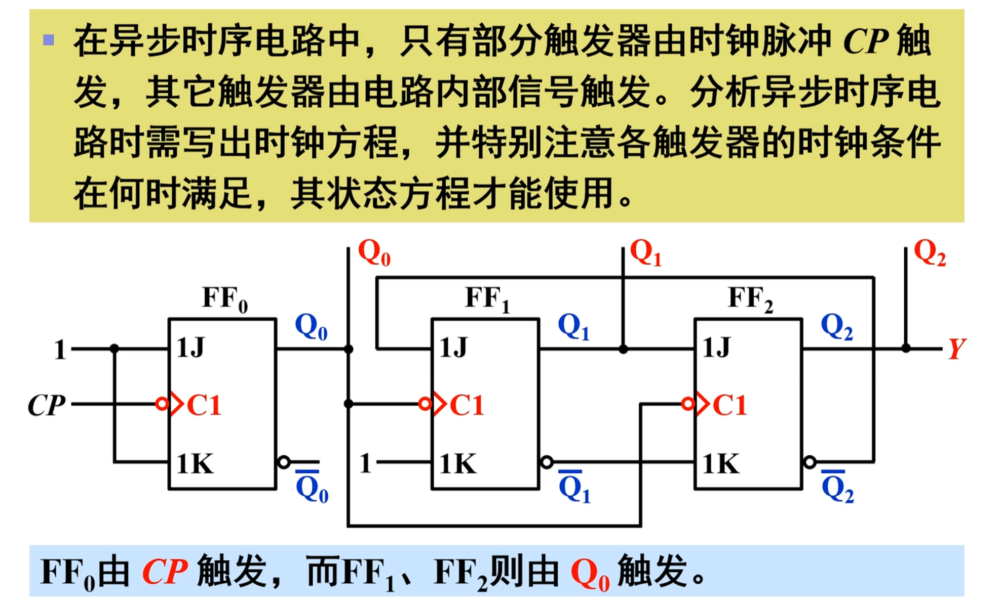

- 由 3 个**下降沿触发的 JK 触发器**（\(FF_0\)、\(FF_1\)、\(FF_2\)）构成。

- 时钟连接：\(FF_0\)的 CP 端接外部 CP；\(FF_1\)、\(FF_2\)的 CP 端接\(FF_0\)的输出\(Q_0\)（即\(FF_1\)、\(FF_2\)由\(Q_0\)的下降沿触发）。

- 无额外门电路（驱动信号直接由触发器输出或高电平 1 提供），输出端\(Y\)接\(FF_2\)的\(Q_2\)。

### 2. 列写方程式

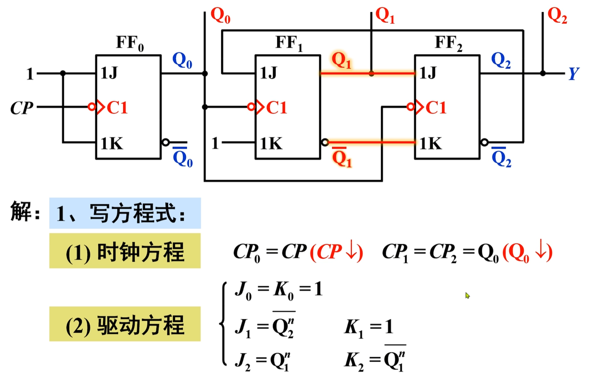

#### （1）时钟方程

- \(CP_0 = CP\)（\(FF_0\)由外部 CP 下降沿触发）

- \(CP_1 = Q_0\)（\(FF_1\)由\(Q_0\)下降沿触发）

- \(CP_2 = Q_0\)（\(FF_2\)由\(Q_0\)下降沿触发）

#### （2）驱动方程

- \(FF_0\)：\(J_0 = 1\)，\(K_0 = 1\)（J、K 均接高电平）

- \(FF_1\)：\(J_1 = \overline{Q_2}\)（J 端接\(FF_2\)的\(\overline{Q_2}\)），\(K_1 = 1\)（K 端接高电平）

- \(FF_2\)：\(J_2 = Q_1\)（J 端接\(FF_1\)的\(Q_1\)），\(K_2 = \overline{Q_1}\)（K 端接\(FF_1\)的\(\overline{Q_1}\)）

#### （3）输出方程

- \(Y = Q_2\)（输出直接取\(FF_2\)的现态\(Q_2\)）

### 3. 推导状态方程

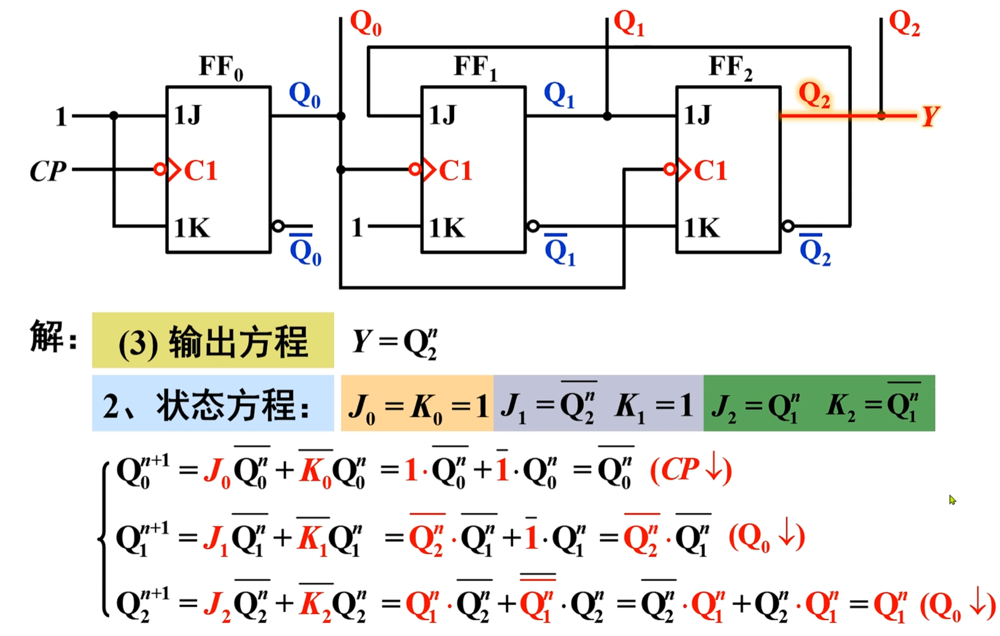

将驱动方程代入 JK 触发器特性方程\(Q^* = J\overline{Q} + \overline{K}Q\)，并标注时钟条件：

- \(FF_0\)：\(J_0=K_0=1\)，代入得 \(Q_0^* = \overline{Q_0}\)（\(CP\)下降沿触发，时钟条件满足时生效）。

- \(FF_1\)：\(J_1=\overline{Q_2}\)、\(K_1=1\)，代入得 \(Q_1^* = \overline{Q_2}\overline{Q_1}\)（\(Q_0\)下降沿触发，时钟条件满足时生效）。

- \(FF_2\)：\(J_2=Q_1\)、\(K_2=\overline{Q_1}\)，代入得 \(Q_2^* = Q_1\)（\(Q_0\)下降沿触发，时钟条件满足时生效）。

### 4. 列写状态表（初始状态\(Q_2Q_1Q_0=000\)）

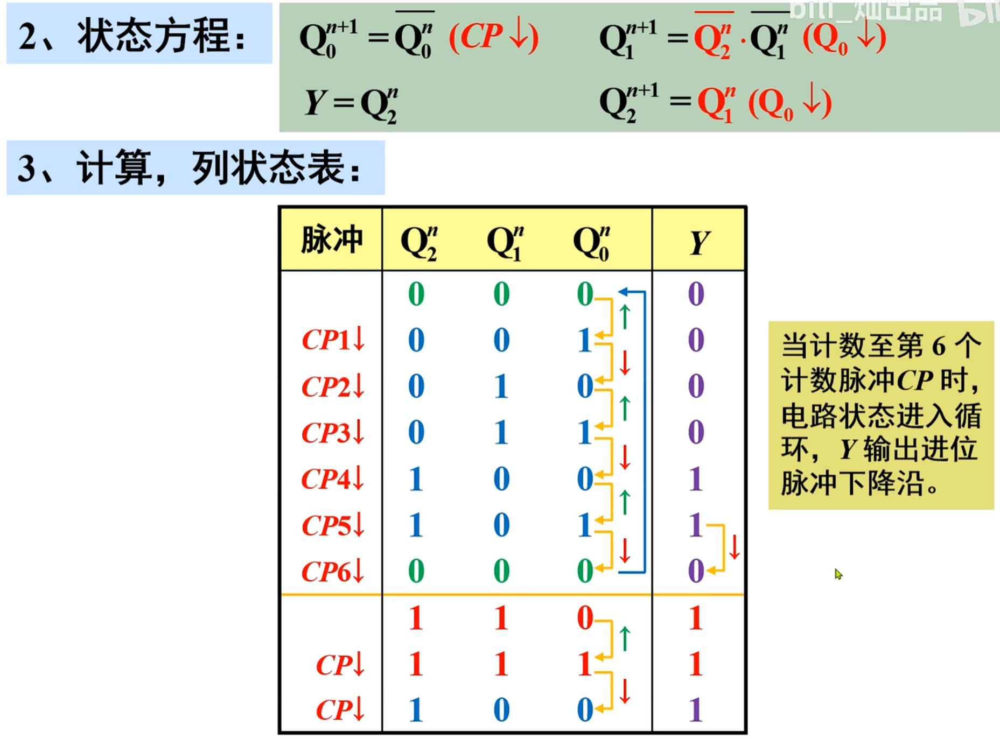

| 输入 CP | 现态\(Q_2Q_1Q_0\) | 时钟条件判断（\(CP_0/CP_1/CP_2\)）                           | 次态\(Q_2^*Q_1^*Q_0^*\) | 输出\(Y=Q_2\) |
| ------- | ----------------- | ------------------------------------------------------------ | ----------------------- | ------------- |
| 初始    | 000            -  | 000                                                          | 0                       |               |
| CP1     | 000               | \(CP_0\)下降沿（满足），\(Q_0\)从 0→1（无下降沿，\(CP_1/CP_2\)不满足） | 001                     | 0             |
| CP2     | 001               | \(CP_0\)下降沿（满足），\(Q_0\)从 1→0（下降沿，\(CP_1/CP_2\)满足） | 010                     | 0             |
| CP3     | 010               | \(CP_0\)下降沿（满足），\(Q_0\)从 0→1（无下降沿，\(CP_1/CP_2\)不满足） | 011                     | 0             |
| CP4     | 011               | \(CP_0\)下降沿（满足），\(Q_0\)从 1→0（下降沿，\(CP_1/CP_2\)满足） | 100                     | 0             |
| CP5     | 100               | \(CP_0\)下降沿（满足），\(Q_0\)从 0→1（无下降沿，\(CP_1/CP_2\)不满足） | 101                     | 1             |
| CP6     | 101               | \(CP_0\)下降沿（满足），\(Q_0\)从 1→0（下降沿，\(CP_1/CP_2\)满足） | 000                     | 1             |

#### 无效状态分析（共 8 种状态，有效状态 6 种，无效状态 2 种：110、111）

| 现态\(Q_2Q_1Q_0\) | 时钟条件判断              | 次态\(Q_2^*Q_1^*Q_0^*\) | 输出\(Y\) | 备注（是否回到有效状态） |
| ----------------- | ------------------------- | ----------------------- | --------- | ------------------------ |
| 110               | \(Q_0\)从 0→1（无下降沿） | 111                     | 1         | 无效状态→无效状态        |
| 111               | \(Q_0\)从 1→0（下降沿）   | 100                     | 1         | 无效状态→有效状态（100） |

### 5. 状态转换图（文字描述）

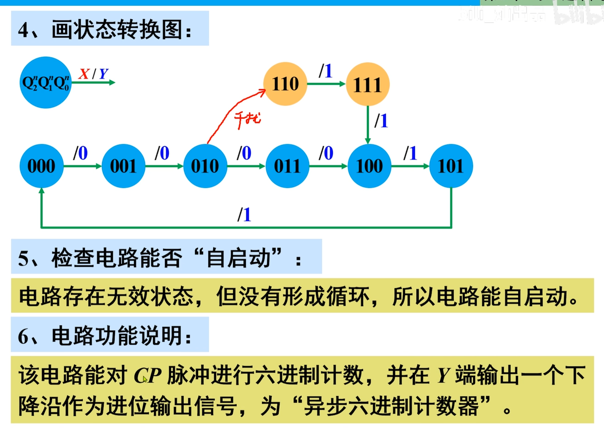

- **有效循环**：\(000 \xrightarrow{CP} 001 \xrightarrow{CP} 010 \xrightarrow{CP} 011 \xrightarrow{CP} 100 \xrightarrow{CP} 101 \xrightarrow{CP} 000\)（输出\(Y\)：0→0→0→0→1→1→0）。

- **无效状态转移**：\(110 \xrightarrow{CP} 111 \xrightarrow{CP} 100\)（100 为有效状态）。

### 6. 自启动判断

- 无效状态（110、111）未形成循环，且最终能转移到有效状态（100），因此**电路能自启动**。

### 7. 电路功能

- 有效循环包含 6 个状态，经 6 个 CP 后回到初始状态，且输出\(Y\)在\(Q_2=1\)时为 1（100、101 状态），产生进位脉冲下降沿（1→0），因此该电路为**异步六进制加法计数器**。

### 8. 仿真电路要点

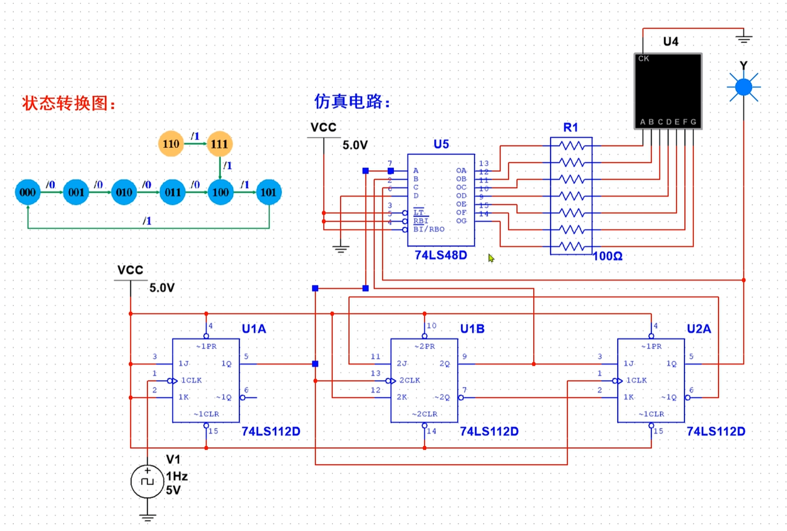

- 触发器型号：JK 触发器采用 74LS112（下降沿触发，每片含 2 个 JK 触发器，需 2 片芯片：U1A、U1B、U2A）。

- 辅助电路：置 1 端（\(\overline{S_D}\)）、置 0 端（\(\overline{R_D}\)）均接高电平（避免异步复位 / 置 1）；CP 接 1Hz、5V 脉冲；输出\(Q_2Q_1Q_0\)经 74LS48 显示译码器接共阴极数码管（显示十进制状态），\(Y\)为进位脉冲输出。

## 四、例题 2：上升沿 D 触发器构成的异步时序电路

### 1. 电路结构

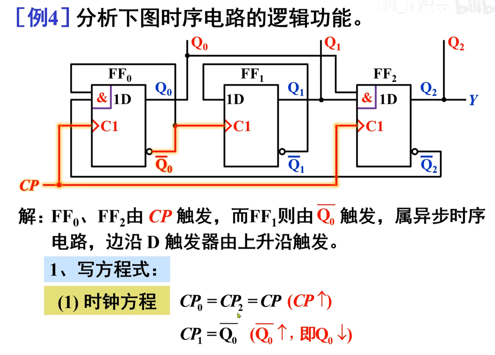

- 由 3 个**上升沿触发的 D 触发器**（\(FF_0\)、\(FF_1\)、\(FF_2\)）构成。

- 时钟连接：\(FF_0\)、\(FF_2\)的 CP 端接外部 CP（上升沿触发）；\(FF_1\)的 CP 端接\(FF_0\)的\(\overline{Q_0}\)（即\(FF_1\)由\(\overline{Q_0}\)的上升沿触发，等效于\(Q_0\)的下降沿触发）。

- 驱动信号含与门：\(FF_0\)的 D 端接\(\overline{Q_2}\overline{Q_0}\)，\(FF_2\)的 D 端接\(Q_1Q_0\)；输出端\(Y\)接\(FF_2\)的\(Q_2\)。

### 2. 列写方程式

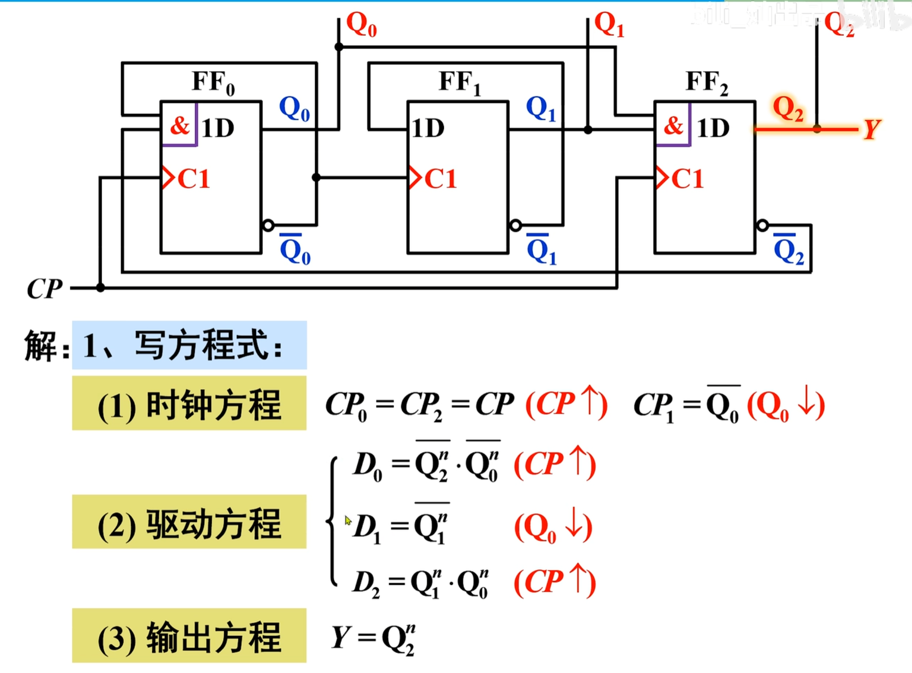

#### （1）时钟方程

- \(CP_0 = CP\)（\(FF_0\)由外部 CP 上升沿触发）

- \(CP_1 = \overline{Q_0}\)（\(FF_1\)由\(\overline{Q_0}\)上升沿触发，等效于\(Q_0\)下降沿触发）

- \(CP_2 = CP\)（\(FF_2\)由外部 CP 上升沿触发）

#### （2）驱动方程

- \(FF_0\)：\(D_0 = \overline{Q_2}\overline{Q_0}\)（D 端接\(\overline{Q_2}\)与\(\overline{Q_0}\)的与逻辑）

- \(FF_1\)：\(D_1 = \overline{Q_1}\)（D 端接自身\(\overline{Q_1}\)，构成 T' 触发器）

- \(FF_2\)：\(D_2 = Q_1Q_0\)（D 端接\(Q_1\)与\(Q_0\)的与逻辑）

#### （3）输出方程

- \(Y = Q_2\)（输出直接取\(FF_2\)的现态\(Q_2\)）

### 3. 推导状态方程

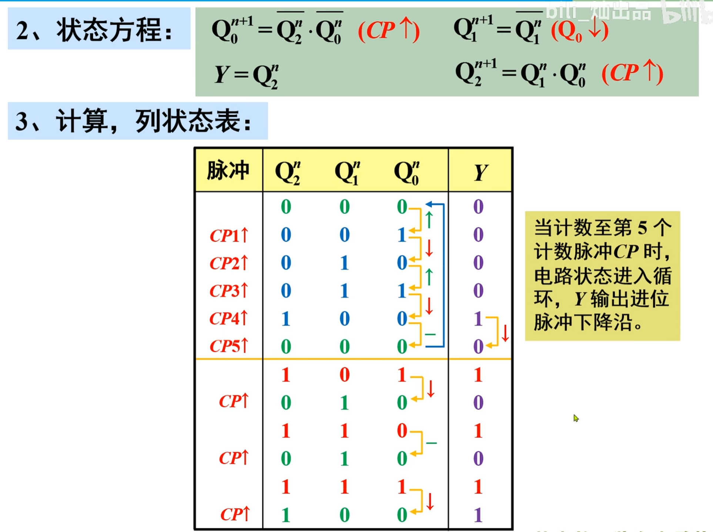

将驱动方程代入 D 触发器特性方程\(Q^* = D\)，并标注时钟条件：

- \(FF_0\)：\(Q_0^* = \overline{Q_2}\overline{Q_0}\)（\(CP\)上升沿触发，时钟条件满足时生效）。

- \(FF_1\)：\(Q_1^* = \overline{Q_1}\)（\(Q_0\)下降沿触发，时钟条件满足时生效）。

- \(FF_2\)：\(Q_2^* = Q_1Q_0\)（\(CP\)上升沿触发，时钟条件满足时生效）。

### 4. 列写状态表（初始状态\(Q_2Q_1Q_0=000\)）

| 输入 CP | 现态\(Q_2Q_1Q_0\) | 时钟条件判断（\(CP_0/CP_1/CP_2\)）                           | 次态\(Q_2^*Q_1^*Q_0^*\) | 输出\(Y=Q_2\) |
| ------- | ----------------- | ------------------------------------------------------------ | ----------------------- | ------------- |
| 初始    | 000            -  | 000                                                          | 0                       |               |
| CP1     | 000               | \(CP\)上升沿（\(CP_0/CP_2\)满足），\(Q_0\)从 0→1（无下降沿，\(CP_1\)不满足） | 001                     | 0             |
| CP2     | 001               | \(CP\)上升沿（\(CP_0/CP_2\)满足），\(Q_0\)从 1→0（下降沿，\(CP_1\)满足） | 010                     | 0             |
| CP3     | 010               | \(CP\)上升沿（\(CP_0/CP_2\)满足），\(Q_0\)从 0→1（无下降沿，\(CP_1\)不满足） | 011                     | 0             |
| CP4     | 011               | \(CP\)上升沿（\(CP_0/CP_2\)满足），\(Q_0\)从 1→0（下降沿，\(CP_1\)满足） | 100                     | 0             |
| CP5     | 100               | \(CP\)上升沿（\(CP_0/CP_2\)满足），\(Q_0\)从 0→0（无边沿，\(CP_1\)不满足） | 000                     | 1             |

#### 无效状态分析（共 8 种状态，有效状态 5 种，无效状态 3 种：101、110、111）

| 现态\(Q_2Q_1Q_0\) | 时钟条件判断                          | 次态\(Q_2^*Q_1^*Q_0^*\) | 输出\(Y\) | 备注（是否回到有效状态） |
| ----------------- | ------------------------------------- | ----------------------- | --------- | ------------------------ |
| 101               | \(CP\)上升沿，\(Q_0\)从 1→0（下降沿） | 010                     | 1         | 无效→有效（010）         |
| 110               | \(CP\)上升沿，\(Q_0\)从 0→0（无边沿） | 010                     | 1         | 无效→有效（010）         |
| 111               | \(CP\)上升沿，\(Q_0\)从 1→0（下降沿） | 100                     | 1         | 无效→有效（100）         |

### 5. 状态转换图（文字描述）

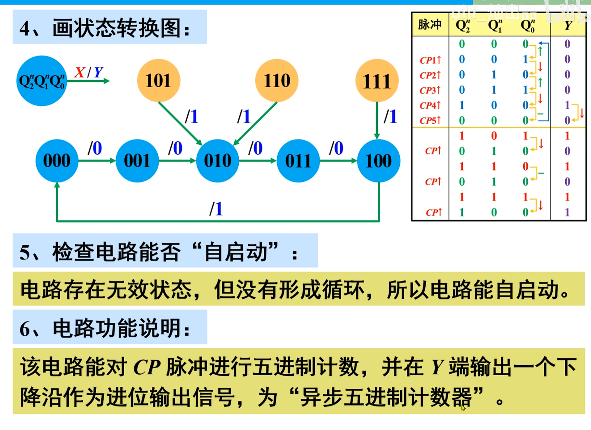

- **有效循环**：\(000 \xrightarrow{CP} 001 \xrightarrow{CP} 010 \xrightarrow{CP} 011 \xrightarrow{CP} 100 \xrightarrow{CP} 000\)（输出\(Y\)：0→0→0→0→1→0）。

- **无效状态转移**：\(101 \xrightarrow{CP} 010\)（有效）、\(110 \xrightarrow{CP} 010\)（有效）、\(111 \xrightarrow{CP} 100\)（有效）。

### 6. 自启动判断

- 所有无效状态（101、110、111）均能在 1 个 CP 后转移到有效状态，未形成无效循环，因此**电路能自启动**。

### 7. 电路功能

- 有效循环包含 5 个状态，经 5 个 CP 后回到初始状态，输出\(Y\)在\(Q_2=1\)时为 1（100 状态），产生进位脉冲下降沿（1→0），因此该电路为**异步五进制计数器**。

### 8. 仿真电路要点

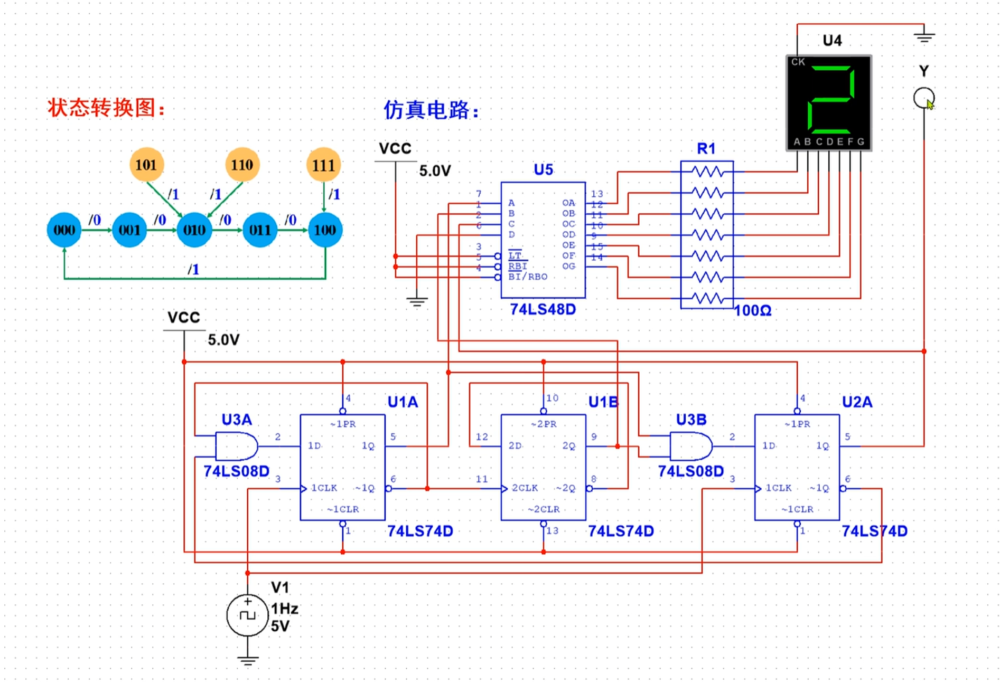

- 触发器型号：D 触发器采用 74LS74（上升沿触发，每片含 2 个 D 触发器，需 2 片芯片：U1A、U1B、U2A）。

- 辅助电路：置 1 端（\(\overline{S_D}\)）、置 0 端（\(\overline{R_D}\)）均接高电平；CP 接 1Hz、5V 脉冲；输出\(Q_2Q_1Q_0\)经 74LS48 显示译码器接共阴极数码管（显示十进制状态），\(Y\)为进位脉冲输出。

## 五、核心注意事项

1. **时钟条件是状态更新的关键**：分析时需逐次判断每个触发器的时钟是否满足有效边沿，避免遗漏 “次态保持现态” 的情况。

1. **状态表列写需细致**：建议标注触发器输出的边沿变化（如\(Q_0\)从 0→1 为上升沿），防止误判时钟有效性。

1. **无效状态必须分析**：通过无效状态的转移路径判断电路是否自启动，这是异步时序电路功能可靠性的重要指标。

1. **仿真与实际电路对应**：需熟悉常用触发器芯片型号（如 JK 触发器 74LS112、D 触发器 74LS74）及管脚连接（如\(\overline{S_D}\)/\(\overline{R_D}\)接高电平），确保仿真与硬件一致。


# 异步时序电路分析习题

## 1. 习题对应电路结构

- **核心元器件构成**：由 3 个边沿 JK 触发器作为核心存储单元，搭配 1 个三输入端与门（输出端标记为 Y）组成完整电路

- **关键芯片型号**：

- 三输入端与门：采用 74LS11 芯片（视频明确提及该型号为三输入与门）

- 补充对比芯片：提及 74LS10 芯片（为三输入端与非门，通过引脚标注 “A、B、C” 区分，该芯片用于辅助说明门电路型号识别方法）

- **仿真电路辅助组件**（视频后续仿真环节展示）：

- 时钟信号：1Hz 脉冲发生器（为触发器提供时钟触发信号）

- 显示模块：显示译码器 + 数码管（用于直观展示电路状态）

- 辅助元件：电阻排（用于电路分压或限流，保障显示模块正常工作）

- 进位标志：与门输出端 Y（作为计数器的进位信号输出）

## 2. 习题核心任务

视频明确给出 2 个需解决的核心问题，且标注判断依据：

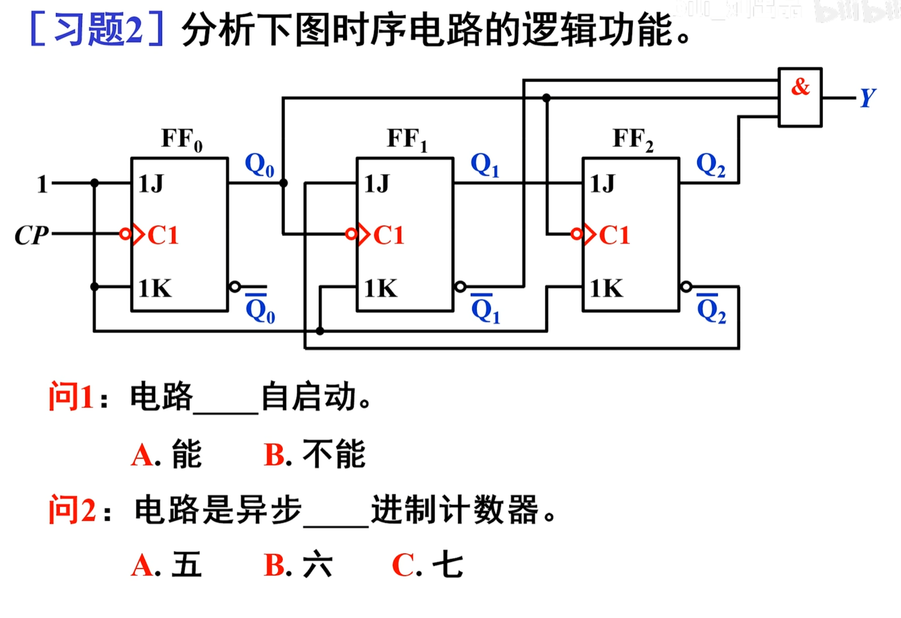

### 问题 1：判断电路能否自启动

- 判断标准：需分析电路的**无效状态是否构成独立循环**

- 若无效状态最终能返回到有效状态（无独立循环），则电路能自启动；

- 若无效状态形成闭环循环（无法进入有效状态），则电路不能自启动。

### 问题 2：判断电路为异步多少进制计数器

- 判断标准：统计电路**有效状态循环中的状态总数**

- 计数器进制数 = 有效循环内的独立状态个数（即完成一次完整循环所需的 CP 脉冲个数，循环结束返回到初始状态时的 CP 次数对应进制）。

## 3. 解题关键依据：电路状态转换图

视频以状态转换图为核心分析工具，明确给出完整状态转换路径（无方程式、状态表推导过程，仅展示最终转换关系）：

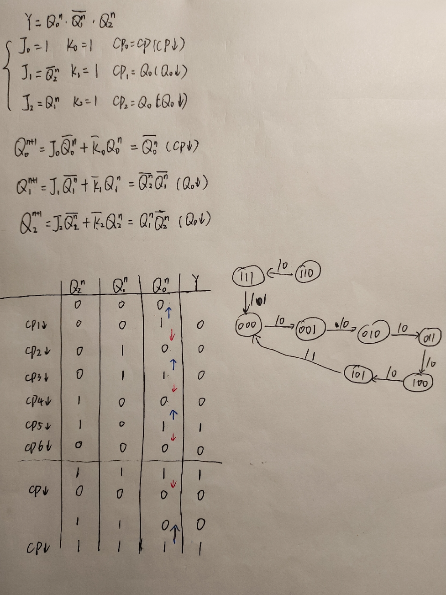

### 3.1 状态分类

- **有效状态**：参与正常计数循环的状态，共 6 个，分别为 000、001、010、011、100、101

- **无效状态**：不参与正常计数循环的状态，共 2 个（3 个 JK 触发器共 8 种状态，8-6=2），分别为 110、111

### 3.2 完整状态转换路径

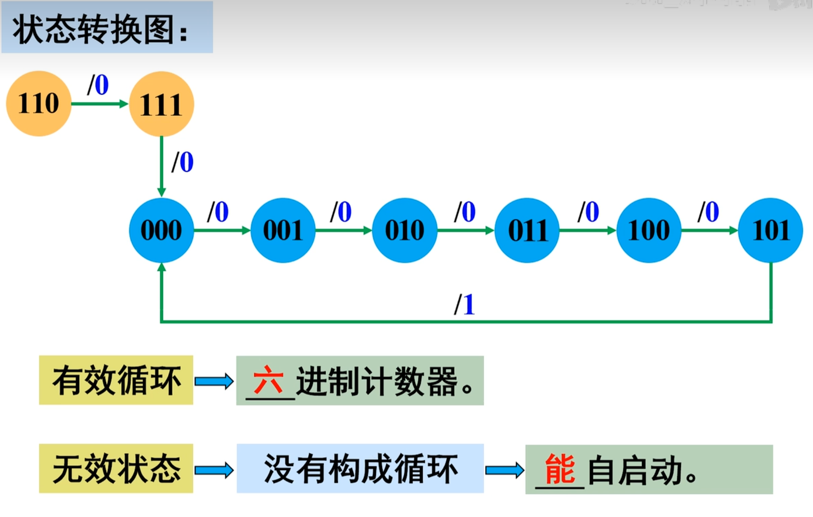

1. **有效状态循环**：

000 → 001 → 010 → 011 → 100 → 101 → 000

- 关键信号变化：当状态从 101 返回到 001 时，与门输出 Y 从 1 变为 0（产生下降沿），该下降沿作为计数器的进位信号（视频明确提及此为进位标志）。

1. **无效状态转换**：

110 → 111 → 000

- 无效状态无独立循环：110 先转换为 111，最终 111 直接返回到有效状态的初始值 000，未形成闭环。

## 4. 习题分析结论

### 4.1 问题 1：电路能否自启动？（结论：能自启动）

- 推导过程：

电路仅有的 2 个无效状态（110、111）未构成独立循环，具体路径为 110→111→000（000 为有效状态），无效状态最终能进入有效循环，符合 “能自启动” 的判断标准。

### 4.2 问题 2：电路为异步多少进制计数器？（结论：异步六进制计数器）

- 推导过程：

有效状态循环包含 6 个独立状态（000、001、010、011、100、101），状态总数为 6，根据 “进制数 = 有效循环状态数” 的判断标准，该电路为异步六进制计数器。

## 5. 仿真验证环节（视频实操展示）

### 5.1 仿真电路结构

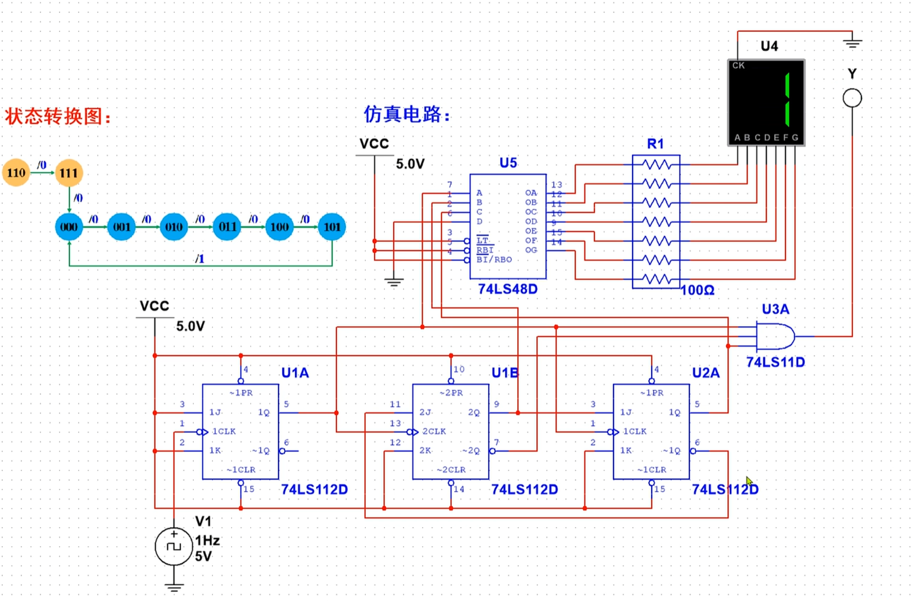

- 左侧：同步显示上述状态转换图（用于对比仿真结果）

- 右侧：实物仿真电路，包含 3 个边沿 JK 触发器、1Hz 脉冲发生器、显示译码器、数码管、电阻排、74LS11 三输入与门（输出 Y 为进位标志）

### 5.2 仿真关键现象

1. **无效状态验证**：仿真从无效状态 111（数码管显示 “7”）开始，下一个状态直接转换为 000（数码管显示 “0”），进入有效循环，验证无效状态可返回有效状态。

1. **有效循环验证**：有效循环过程为 0（000）→1（001）→2（010）→3（011）→4（100）→5（101）→0（000），与状态转换图完全一致；且当状态为 101（数码管显示 “5”）时，与门输出 Y 为 0，符合 “进位信号下降沿” 的分析结果。

## 6. 同步与异步时序电路分析的核心区别

视频明确指出两类时序电路分析步骤的差异：

- **不同点**：仅在 “时钟方程” 和 “状态表构建” 两部分存在区别（异步时序电路需考虑各触发器时钟信号的不同步性，状态表需标注各触发器的时钟触发条件；同步时序电路时钟信号统一，无此要求）。

- **相同点**：除时钟方程和状态表外，其余分析步骤（如驱动方程、状态转换图绘制、自启动判断、进制判断等）完全一致。

## 7. 考试答题注意事项

视频针对考试场景强调：

- 若为综合题，**不可仅绘制状态转换图**，需完整列写全部分析过程（包括驱动方程、时钟方程、状态表、状态转换图、结论推导等），尤其初学阶段需步骤完整，不可省略关键推导环节。


# 同步时序电路的设计

## 一、同步时序电路设计基础

### 1. 设计与分析的关系

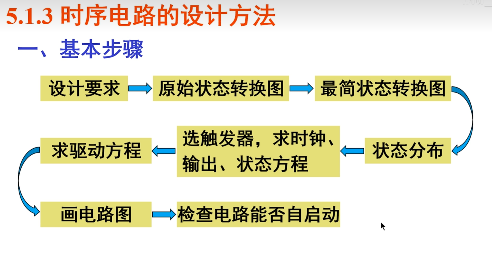

- 时序电路**分析**：给定同步 / 异步时序电路，通过步骤确定其逻辑功能；

- 时序电路**设计**：分析的逆过程，给定设计要求（文字描述 / 状态转换图），选择合适触发器，搭建符合要求的同步时序电路。

## 二、同步时序电路核心设计步骤

### 1. 步骤 1：逻辑抽象（得到原始状态转换图）

- **核心任务**：将设计要求转化为数学模型（原始状态转换图），需完成：

1. 确定**输入变量**（电路的输入信号）、**输出变量**（电路的输出信号）；

1. 确定电路**内部状态间的关系**及**状态数**（描述电路工作过程的不同阶段）；

1. 状态赋值与编号（为每个状态定义标识）；

1. 绘制原始状态转换图：

- 图例规则：箭头上方标注 “输入 / 输出”（斜杠左为输入，右为输出）；

- 需包含有效循环（正常工作的状态转换）、无效循环（无效状态的转换）、无效状态（未用到的状态）。

### 2. 步骤 2：状态化简（得到最简状态转换图）

- **化简目标**：合并等价状态，减少状态数，简化电路结构。

- **等价状态定义**：若两个状态满足 “输入相同→输出相同且次态相同”，则为等价状态，可合并（保留一个，删除另一个）。

- **结果**：无冗余等价状态的最简状态转换图。

### 3. 步骤 3：状态分配（二进制编码）

- **1. 确定二进制代码位数（n）**：

- 设电路状态数为 M，满足不等式：\(2^{n-1} < M \leq 2^n\)（n 为二进制代码位数）；

- 示例：M=7（七进制计数器）→ \(2^{2}=4 <7 \leq 8=2^3\) → n=3；M=3（串行数据检测）→ \(2^{1}=2 <3 \leq4=2^2\) → n=2。

- **2. 状态编码**：为每个最简状态分配二进制代码（如 S0=00、S1=01、S2=11，需结合设计要求选择，避免逻辑冗余）。

### 4. 步骤 4：选择触发器

- **常用类型**：边沿触发器（优先选边沿 JK 触发器，其次是边沿 D 触发器）；

- **触发器数量**：等于二进制代码位数 n（n 位代码需 n 个触发器）。

### 5. 步骤 5：求关键方程（时钟方程、输出方程、状态方程、驱动方程）

#### （1）时钟方程

- 同步时序电路：所有触发器的时钟端（CP）接同一时钟信号，即\(CP_0=CP_1=...=CP_{n-1}=CP\)（下标对应触发器编号）。

#### （2）输出方程

- **推导方法**：根据状态转换图中 “输出与现态、输入的关系”，绘制输出变量的卡诺图，化简得到逻辑表达式；

- **约束项处理**：无效状态对应的最小项作为约束项（用 “×” 表示），化简时 “有利则取 1，无利则取 0”。

#### （3）状态方程

- **核心定义**：描述触发器次态（\(Q^{n+1}\)）与现态（\(Q^n\)）、输入变量的关系；

- **推导步骤**：

1. 绘制**次态卡诺图**：以 “现态（n 位二进制）、输入变量” 为坐标轴，格子内填入对应次态（n 位二进制）；

1. 拆分次态卡诺图：将 n 位次态拆分为 n 个独立的 1 位卡诺图（分别对应每个触发器的次态\(Q_0^{n+1}、Q_1^{n+1}、...、Q_{n-1}^{n+1}\)）；

1. 化简每个 1 位卡诺图，得到各触发器的状态方程。

#### （4）驱动方程

- **核心逻辑**：将状态方程转换为所选触发器（如 JK 触发器）的**特性方程形式**，对比得到驱动端（J、K）的逻辑表达式；

- **JK 触发器特性方程**：\(Q^{n+1}=J\overline{Q^n}+\overline{K}Q^n\)；

- **转换技巧**：若状态方程中无\(Q^n\)或\(\overline{Q^n}\)，可乘以\(\overline{Q^n}+Q^n=1\)（逻辑恒等式），展开后匹配特性方程形式。

### 6. 步骤 6：绘制电路图

- **依据**：时钟方程（CP 连接）、驱动方程（触发器 J/K 端与输入 / 现态的连接）、输出方程（输出端逻辑门连接）；

- **注意事项**：标注触发器编号、输入 / 输出变量，确保接线与方程一致。

### 7. 步骤 7：判断电路自启动能力

- **自启动定义**：电路若进入无效状态，能在时钟脉冲作用下自动返回到有效循环，则具备自启动能力；否则不能。

- **判断方法**：将所有无效状态代入状态方程，计算其次态：

- 若所有无效状态的次态均在有效循环内→能自启动；

- 若存在无效状态形成独立循环→不能自启动（需修改电路）。

## 三、例题 1：同步七进制加法计数器设计（例 5）

### 1. 设计要求

- 功能：按自然态序（0→1→2→...→6）变化的同步七进制加法计数器；

- 规则：逢七进一（计数到 6 时，下一个 CP 触发后返回到 0），并产生进位输出 Y。

### 2. 详细设计过程

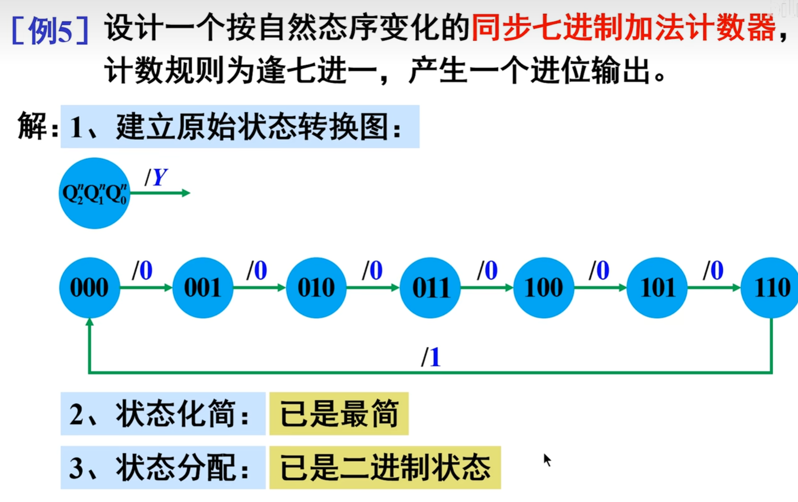

#### （1）逻辑抽象：绘制原始状态转换图

- 状态定义：7 个有效状态（000、001、010、011、100、101、110，对应十进制 0-6），1 个无效状态（111）；

- 转换规则：

- 000→001（Y=0）、001→010（Y=0）、010→011（Y=0）、011→100（Y=0）、100→101（Y=0）、101→110（Y=0）、110→000（Y=1）；

- 无效状态 111：暂定为约束项。

#### （2）状态化简

- 无等价状态（7 个有效状态均唯一，输入相同则输出、次态不同）→ 最简状态图与原始状态图一致。

#### （3）状态分配

- 状态数 M=7→二进制位数 n=3（\(2^2<7≤2^3\)）；

- 编码：自然态序编码（000→0、001→1、...、110→6）。

#### （4）选择触发器

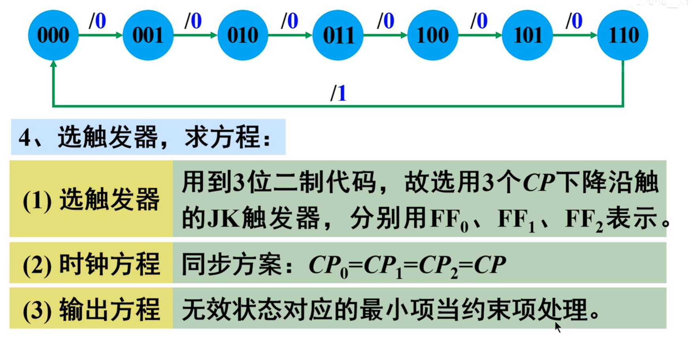

- 3 个下降沿触发的 JK 触发器（FF0：最低位 Q0，FF1：中间位 Q1，FF2：最高位 Q2）。

#### （5）求关键方程

##### ① 时钟方程

\(CP_0=CP_1=CP_2=CP\)（同步电路，共接 CP）。

##### ② 输出方程

- 输出 Y：仅当现态为 110 时 Y=1，其余有效状态 Y=0，无效状态 111 为约束项；

- 卡诺图（输入：Q2^n、Q1^n、Q0^n）：

| Q2^n\Q1^nQ0^n | 00   | 01   | 11   | 10   |
| ------------- | ---- | ---- | ---- | ---- |
| 0             | 0    | 0    | 0    | 0    |
| 1             | 0    | 0    | ×    | 1    |

- 化简得：\(Y=Q_2^nQ_1^n\)。

##### ③ 状态方程

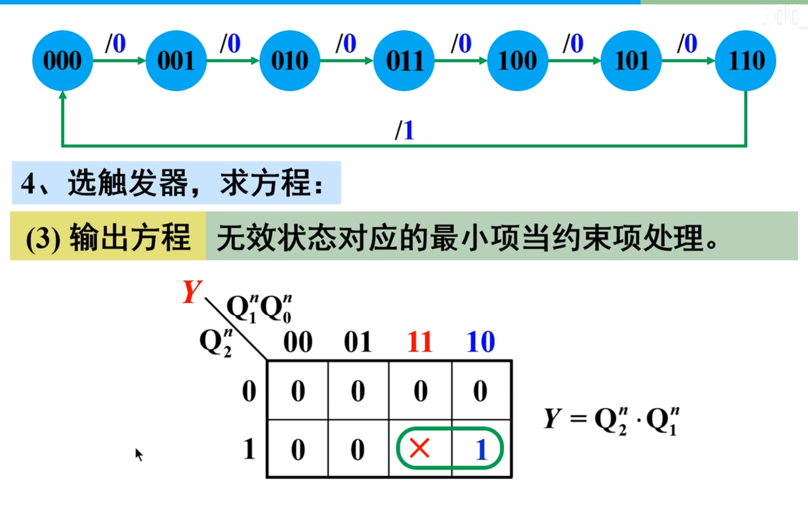

- 次态卡诺图（现态 Q2^nQ1^nQ0^n→次态 Q2^{n+1} Q1^{n+1} Q0^{n+1}）：
- 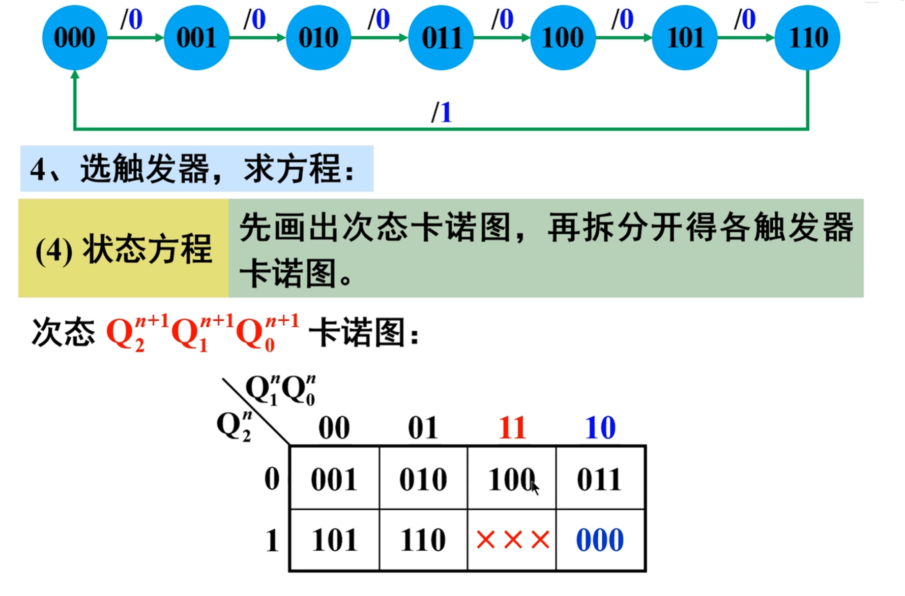


- 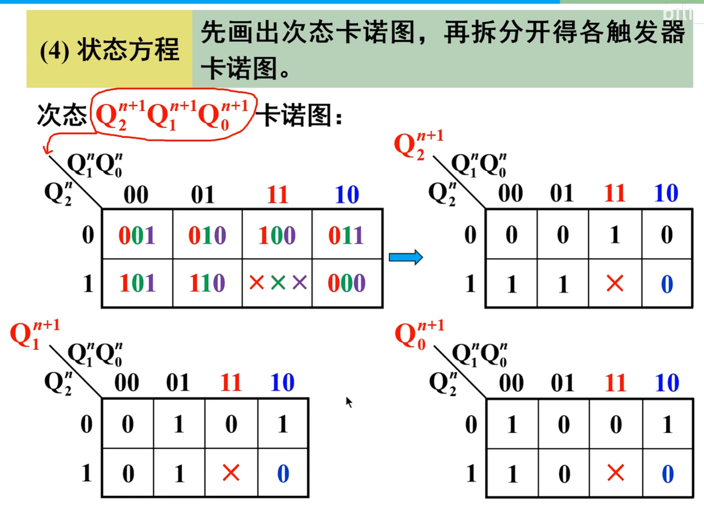

| Q2^n\Q1^nQ0^n | 00   | 01   | 11   | 10   |
| ------------- | ---- | ---- | ---- | ---- |
| 0             | 001  | 010  | 100  | 011  |
| 1             | 101  | 110  | ×××  | 000  |

- 拆分 3 个 1 位卡诺图并化简：

	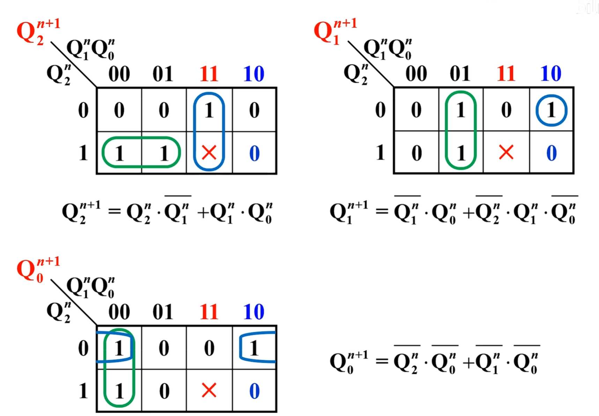

- \(Q_2^{n+1}=Q_2^n\overline{Q_1^n}+\overline{Q_2^n}Q_1^nQ_0^n\)（利用约束项 111=× 化简）；

- \(Q_1^{n+1}=\overline{Q_1^n}Q_0^n+Q_1^n\overline{Q_0^n}\overline{Q_2^n}\)；

- \(Q_0^{n+1}=\overline{Q_0^n}(\overline{Q_2^n}+\overline{Q_1^n})\)。

##### ④ 驱动方程

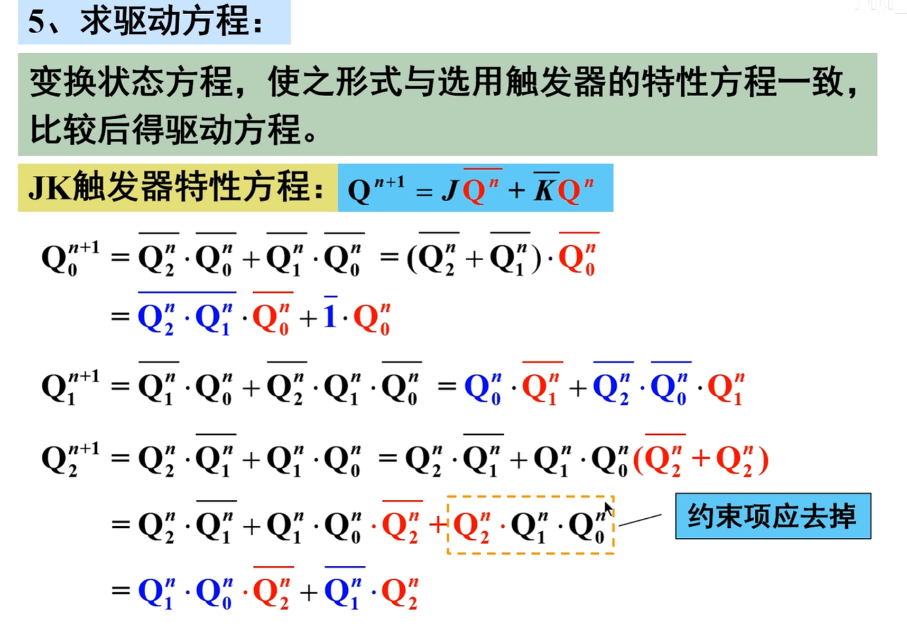


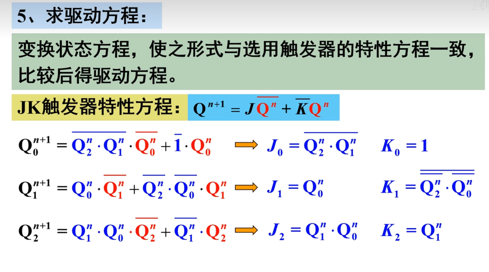

- 匹配 JK 触发器特性方程\(Q^{n+1}=J\overline{Q^n}+\overline{K}Q^n\)：

- FF0（Q0）：\(J_0=\overline{Q_2^n}\overline{Q_1^n}\)，\(K_0=1\)；

- FF1（Q1）：\(J_1=Q_0^n\)，\(K_1=\overline{Q_2^n}Q_0^n\)；

- FF2（Q2）：\(J_2=Q_1^nQ_0^n\)，\(K_2=Q_1^n\)。

#### （6）绘制电路图

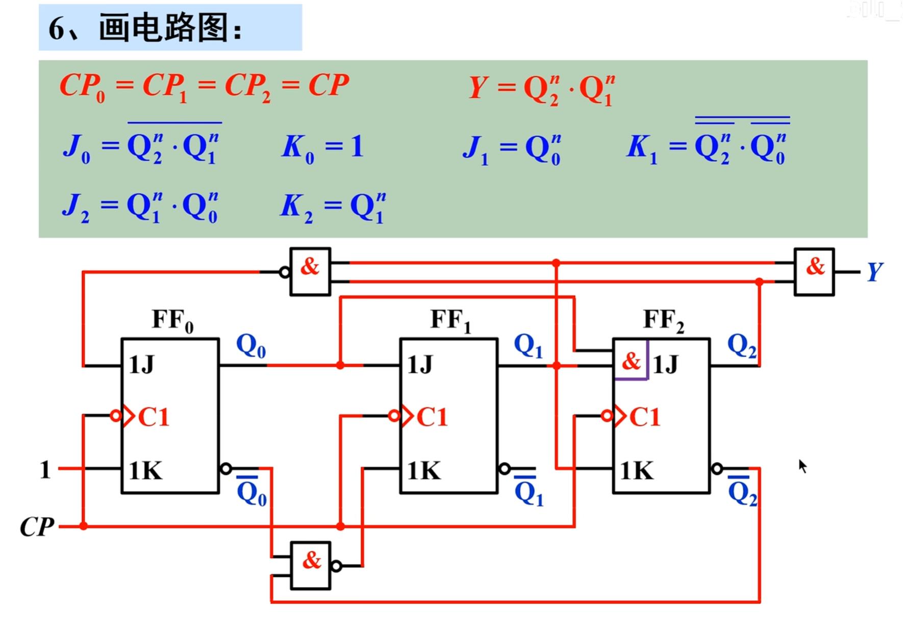

- CP 端：3 个触发器 CP 均接同一时钟；

- FF0：J0 接 Q2^n 非与 Q1^n 非的与门输出，K0 接高电平 1；

- FF1：J1 接 Q0^n，K1 接 Q2^n 非与 Q0^n 的与门输出；

- FF2：J2 接 Q1^n 与 Q0^n 的与门输出，K2 接 Q1^n；

- 输出 Y：接 Q2^n 与 Q1^n 的与门输出。

#### （7）自启动判断

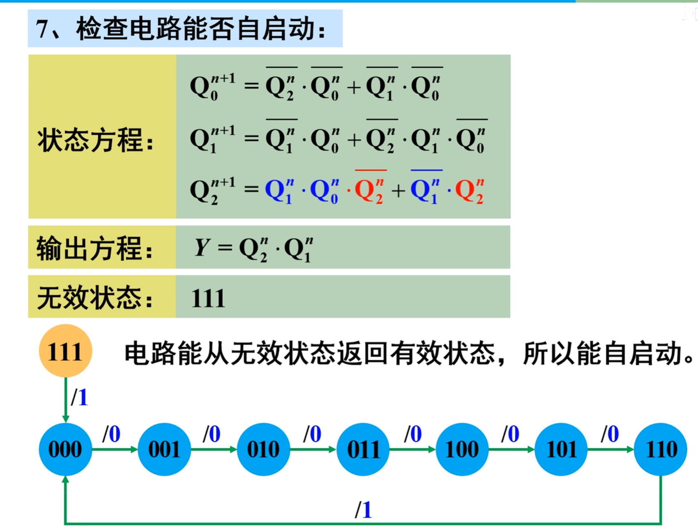

- 无效状态 111 代入状态方程：

- \(Q_2^{n+1}=1·\overline{1}+\overline{1}·1·1=0\)；

- \(Q_1^{n+1}=\overline{1}·1+1·\overline{1}·\overline{1}=0\)；

- \(Q_0^{n+1}=\overline{1}·(\overline{1}+\overline{1})=0\)；

- 次态为 000（有效状态）→ 电路能自启动。

#### （8）仿真验证

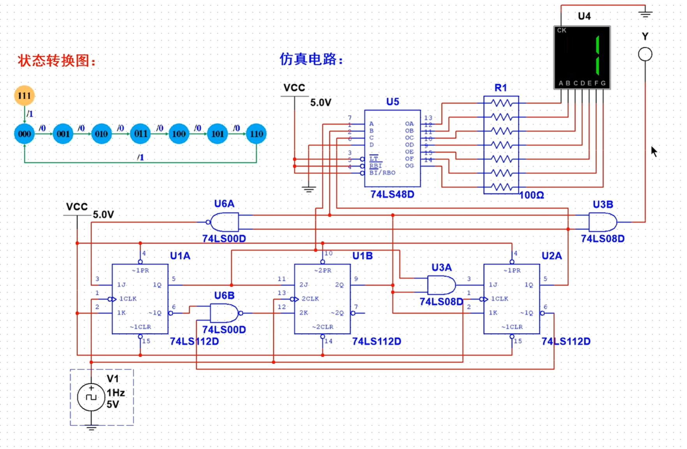

- 仿真结果：无效状态 111（十进制 7）触发后立即返回到 000，有效循环为 000→001→...→110→000，110 时 Y=1（进位输出），符合设计要求。

## 四、例题 2：串行数据检测电路设计（例 6）

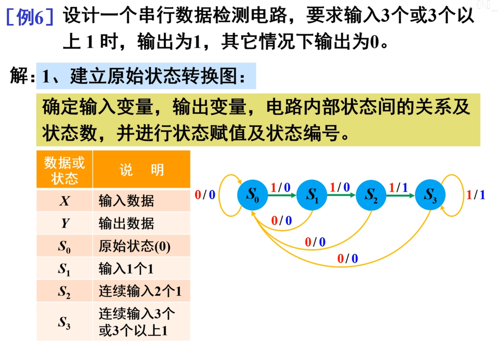

### 1. 设计要求

- 功能：串行数据检测（输入为串行信号 X，输出为 Y）；

- 规则：输入 3 个或 3 个以上连续 1 时，输出 Y=1；其余情况（输入 0、输入 1 不足 3 个）输出 Y=0。

### 2. 详细设计过程

#### （1）逻辑抽象：绘制原始状态转换图

- 状态定义：

- S0：未检测到有效 1（0 个连续 1）；

- S1：检测到 1 个连续 1；

- S2：检测到 2 个连续 1；

- S3：检测到 3 个及以上连续 1；

- 输入 X（0/1），输出 Y（0/1）；

- 转换规则：

- S0：X=0→S0（Y=0），X=1→S1（Y=0）；

- S1：X=0→S0（Y=0），X=1→S2（Y=0）；

- S2：X=0→S0（Y=0），X=1→S3（Y=1）；

- S3：X=0→S0（Y=0），X=1→S3（Y=1）。

#### （2）状态化简

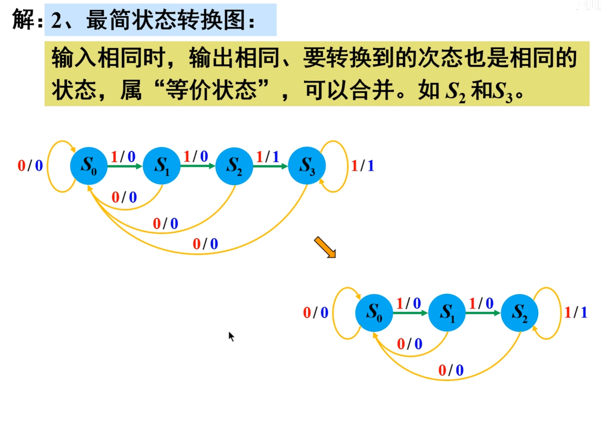

- 等价状态判断：S2 与 S3 为等价状态（输入 X=0 时，均→S0、Y=0；输入 X=1 时，均→S3、Y=1）；

- 合并后最简状态：S0（0 个 1）、S1（1 个 1）、S2（2 个及以上 1），共 3 个状态。

#### （3）状态分配

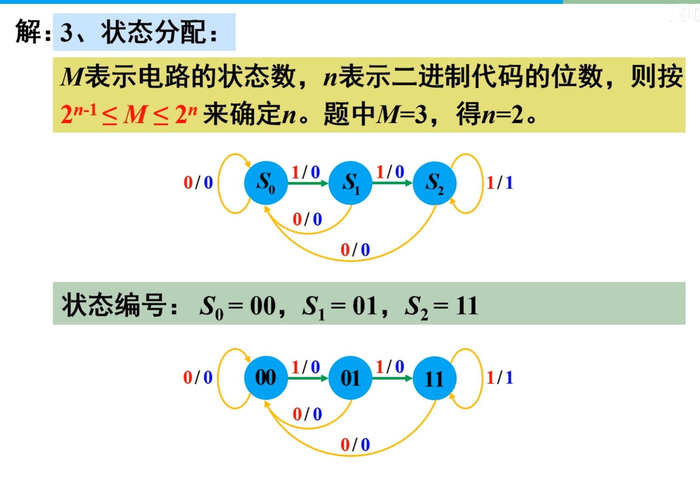

- 状态数 M=3→二进制位数 n=2（\(2^1<3≤2^2\)）；

- 编码：S0=00，S1=01，S2=11（无效状态：10）。

#### （4）选择触发器

- 2 个下降沿触发的 JK 触发器（FF0：Q0，FF1：Q1）。

#### （5）求关键方程

##### ① 时钟方程

\(CP_0=CP_1=CP\)（同步电路）。

##### ② 输出方程

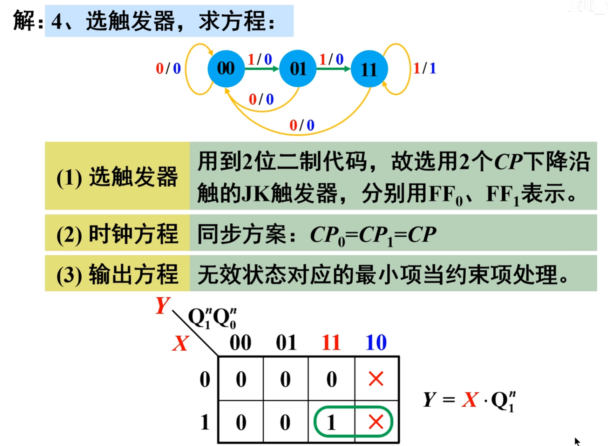

- 输出 Y：仅当 X=1 且现态为 S2（11）时 Y=1，其余情况 Y=0，无效状态 10 为约束项；

- 卡诺图（输入：X、Q1^n、Q0^n）：

	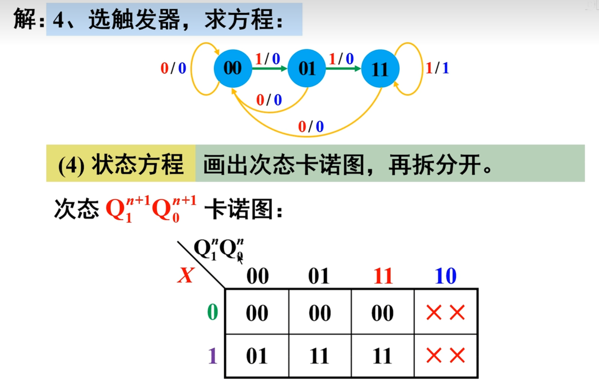

| X\Q1^nQ0^n | 00   | 01   | 11   | 10   |
| ---------- | ---- | ---- | ---- | ---- |
| 0          | 0    | 0    | 0    | ×    |
| 1          | 0    | 0    | 1    | ×    |

- 化简得：\(Y=XQ_1^n\)。

##### ③ 状态方程

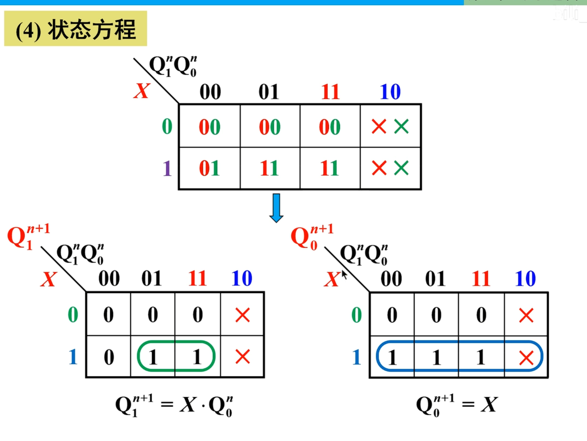

- 次态卡诺图（现态 Q1^nQ0^n、输入 X→次态 Q1^{n+1} Q0^{n+1}）：

| X\Q1^nQ0^n | 00   | 01   | 11   | 10   |
| ---------- | ---- | ---- | ---- | ---- |
| 0          | 00   | 00   | 00   | ××   |
| 1          | 01   | 11   | 11   | ××   |

- 拆分 2 个 1 位卡诺图并化简：

- \(Q_1^{n+1}=XQ_0^n\)（利用约束项化简）；

- \(Q_0^{n+1}=X\)。

##### ④ 驱动方程

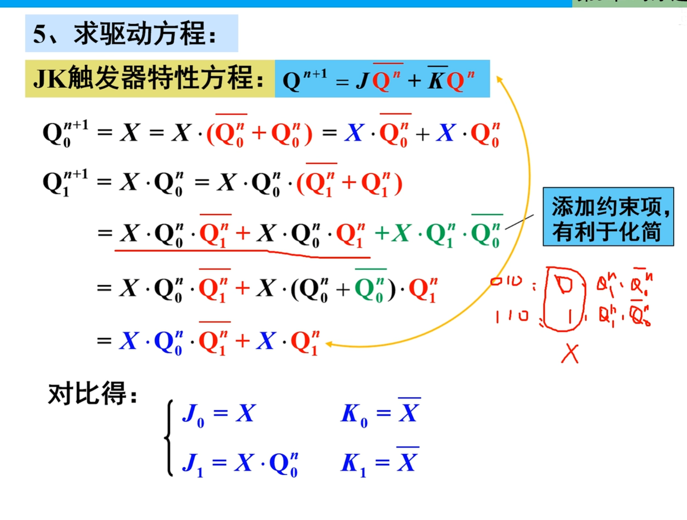

- 匹配 JK 触发器特性方程：

- FF0（Q0）：\(Q_0^{n+1}=X(\overline{Q_0^n}+Q_0^n)=X\overline{Q_0^n}+XQ_0^n\)→\(J_0=X\)，\(K_0=\overline{X}\)；

- FF1（Q1）：\(Q_1^{n+1}=XQ_0^n(\overline{Q_1^n}+Q_1^n)=XQ_0^n\overline{Q_1^n}+XQ_0^nQ_1^n\)→\(J_1=XQ_0^n\)，\(K_1=\overline{X}\)。

#### （6）绘制电路图

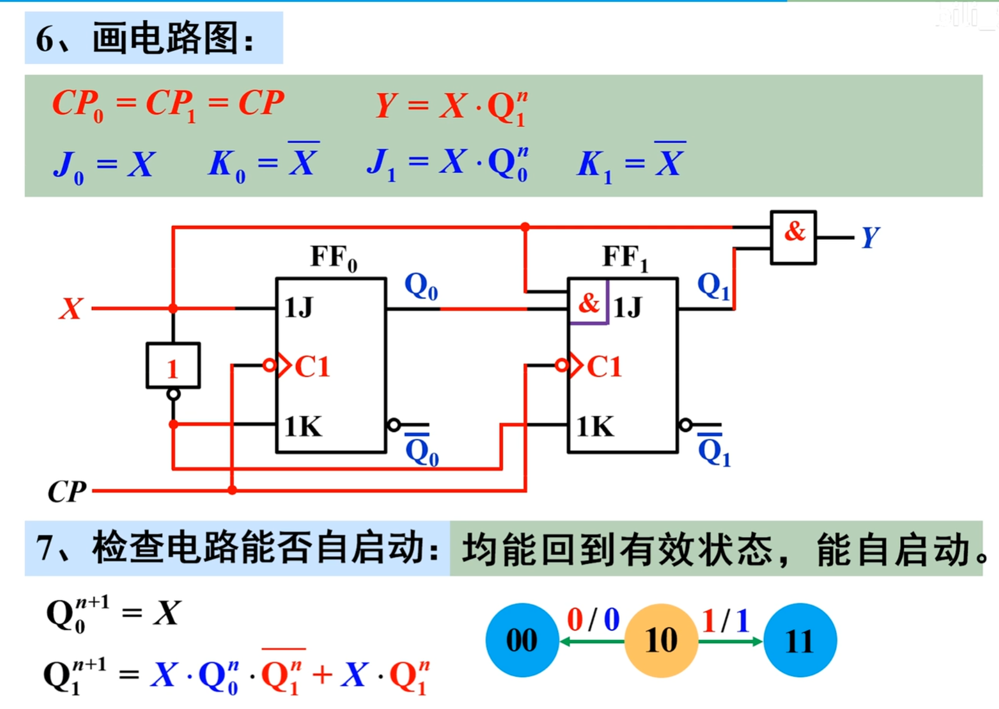

- CP 端：2 个触发器 CP 均接同一时钟；

- FF0：J0 接 X，K0 接 X 的非门输出；

- FF1：J1 接 X 与 Q0^n 的与门输出，K1 接 X 的非门输出；

- 输出 Y：接 X 与 Q1^n 的与门输出。

#### （7）自启动判断

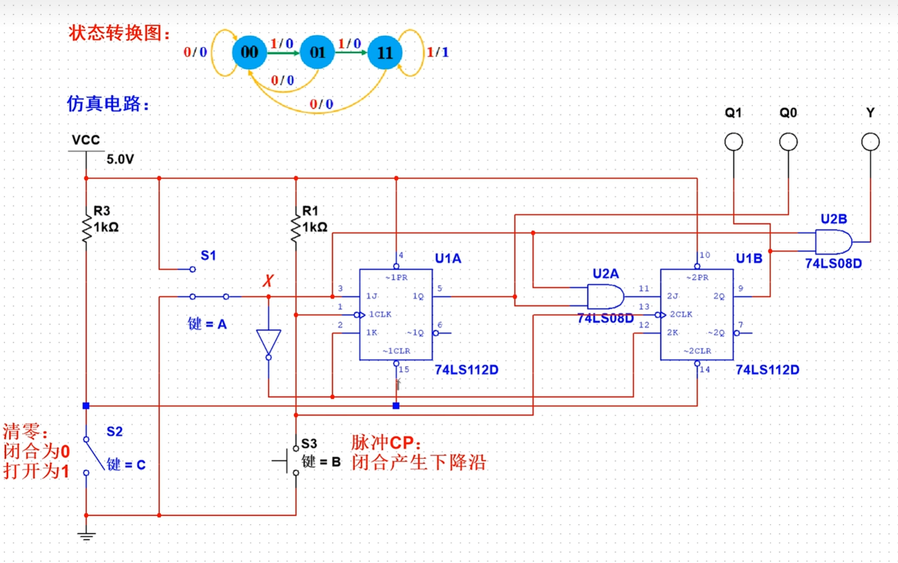

- 无效状态 10 代入状态方程：

- X=0 时：\(Q_1^{n+1}=0·Q_0^n=0\)，\(Q_0^{n+1}=0\)→次态 00（有效状态）；

- X=1 时：\(Q_1^{n+1}=1·Q_0^n=0\)，\(Q_0^{n+1}=1\)→次态 01（有效状态）；

- 无效状态 10 能返回到有效循环→电路能自启动。

	


# 同步时序电路设计习题

## 一、设计任务 设计一个**按自然态序变化的同步七进制减法计数器**，核心要求： 

- 计数规律：按“0（000）→6（110）→5（101）→4（100）→3（011）→2（010）→1（001）→0（000）”循环 - 借位输出：
- 当现态为“000”（十进制0）减1时，产生借位输出（用`Y`表示，此时`Y=1`；其他状态`Y=0`）

## 二、同步时序电路设计通用步骤（视频明确列举）

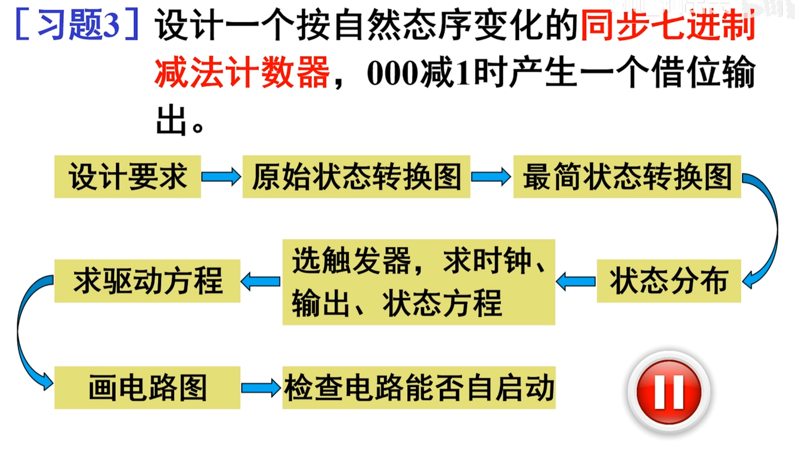

1. 绘制原始状态转换图 → 2. 状态化简 → 3. 状态分配 → 4. 选择触发器 → 5. 求时钟方程、输出方程、状态方程 → 6. 列卡诺图化简方程 → 7. 变换状态方程为触发器特性方程形式，求驱动方程 → 8. 绘制电路图 → 9. 判断电路自启动能力 → 10. 仿真验证（可选，用 Multisim）

## 三、本例题（同步七进制减法计数器）详细设计过程

### 1. 绘制原始状态转换图

#### （1）状态定义

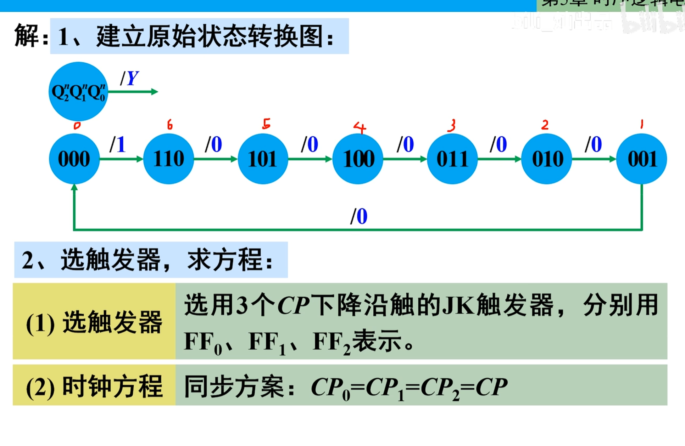

七进制计数器需 7 个有效状态，用 3 位二进制代码Q2Q1Q0表示（3 位二进制可表示 8 种状态，剩余 1 种 “111” 为无效状态），各状态对应关系：

| 十进制数 | 二进制代码（Q2Q1Q0） | 状态类型 |
| -------- | -------------------- | -------- |
| 0        | 000                  | 有效状态 |
| 1        | 001                  | 有效状态 |
| 2        | 010                  | 有效状态 |
| 3        | 011                  | 有效状态 |
| 4        | 100                  | 有效状态 |
| 5        | 101                  | 有效状态 |
| 6        | 110                  | 有效状态 |
| 7        | 111                  | 无效状态 |

#### （2）状态转换关系（含借位输出Y）

- 000（0）：减 1 时需借位，次态为 110（6），输出Y=1

- 110（6）：减 1 无借位，次态为 101（5），输出Y=0

- 101（5）：减 1 无借位，次态为 100（4），输出Y=0

- 100（4）：减 1 无借位，次态为 011（3），输出Y=0

- 011（3）：减 1 无借位，次态为 010（2），输出Y=0

- 010（2）：减 1 无借位，次态为 001（1），输出Y=0

- 001（1）：减 1 无借位，次态为 000（0），输出Y=0

- 111（7，无效）：作约束项，后续化简时用 “X” 表示

#### （3）状态化简

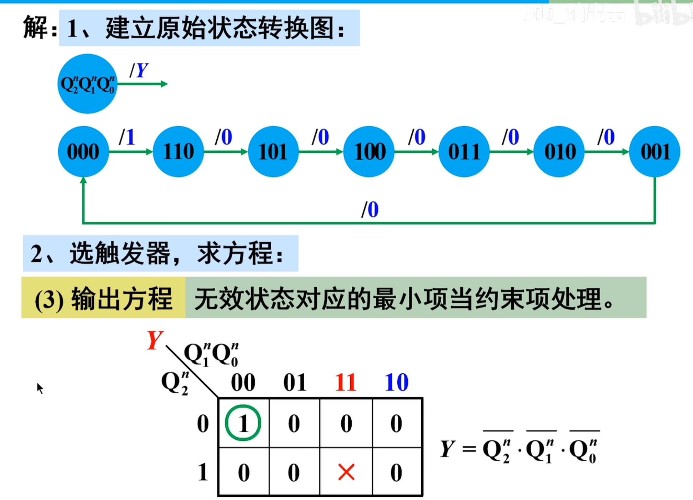

原始状态转换图中无等价状态（每个状态功能唯一），无需化简，直接使用上述状态转换关系。

### 2. 状态分配

已通过 “3 位二进制代码Q2Q1Q0对应十进制 0-6” 完成分配，符合自然态序要求。

### 3. 选择触发器

- 数量：3 个（对应 3 位二进制代码Q2Q1Q0，分别记为FF2、FF1、FF0）

- 类型：JK 触发器（下降沿触发，视频明确选用）

- 理由：JK 触发器特性灵活（可实现置 0、置 1、翻转、保持），适配减法计数的状态变化需求

### 4. 求核心方程（时钟、输出、状态）

#### （1）时钟方程（同步电路特性）

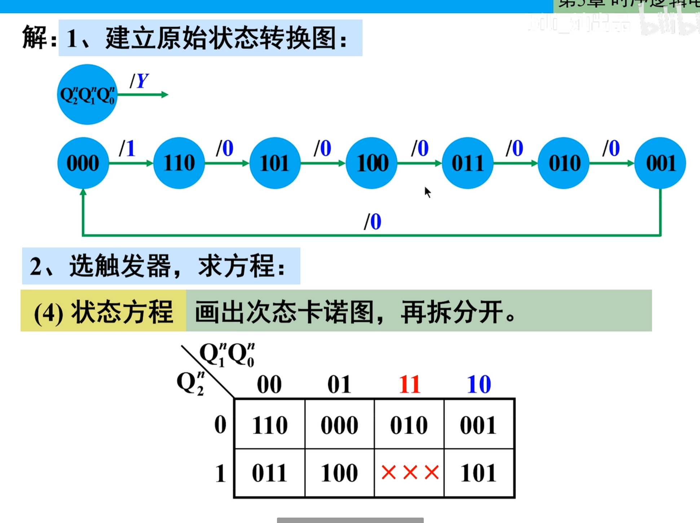

同步计数器中所有触发器共用同一时钟信号，因此：

CP2 = CP1 = CP0 = CP（CP为外部输入时钟）

#### （2）输出方程（借位输出Y）

通过**输出卡诺图**推导（现态为Q2Q1Q0，输出为Y）：

| Q2\Q1Q0   | 00（Q1=0,Q0=0）  | 01（Q1=0,Q0=1）  | 11（Q1=1,Q0=1）   | 10（Q1=1,Q0=0）  |
| --------- | ---------------- | ---------------- | ----------------- | ---------------- |
| 0（Q2=0） | 1（000 态，Y=1） | 0（001 态，Y=0） | 0（011 态，Y=0）  | 0（010 态，Y=0） |
| 1（Q2=1） | 0（100 态，Y=0） | 0（101 态，Y=0） | X（111 态，无效） | 0（110 态，Y=0） |

- 化简规则：无效状态 “X” 可视为 “1” 辅助化简，但本案例中仅 “000” 态Y=1，且与 “X” 不相邻，无法合并

- 最终输出方程：Y = ¬Q2 · ¬Q1 · ¬Q0（“¬” 表示非运算，即反码）

#### （3）状态方程（次态与现态的关系）

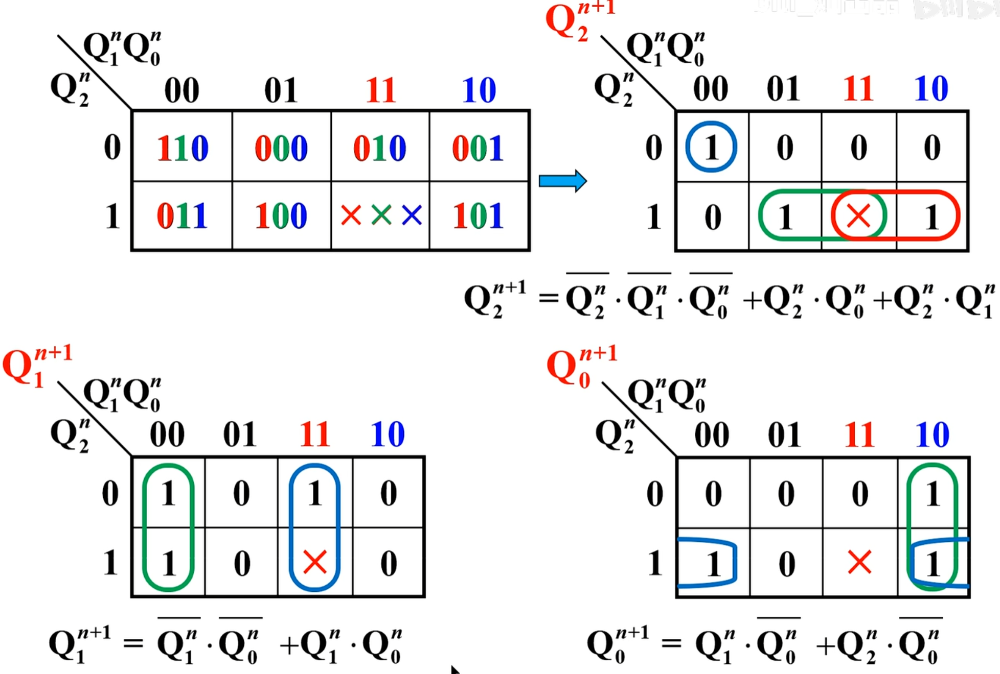

先绘制**次态卡诺图**（现态Q2Q1Q0→次态Q2^n+1 Q1^n+1 Q0^n+1，“^n+1” 表示次态），再拆分 3 个触发器的单独卡诺图，分别化简得状态方程：

##### ① 次态卡诺图（整体）

| Q2\Q1Q0 | 00             | 01             | 11                | 10             |
| ------- | -------------- | -------------- | ----------------- | -------------- |
| 0       | 110（000→110） | 000（001→000） | 010（011→010）    | 001（010→001） |
| 1       | 011（100→011） | 100（101→100） | X（111→？，无效） | 101（110→101） |

##### ② 拆分化简（各触发器次态方程）

- **Q2^n+1（FF2 次态）**：

卡诺图化简后：Q2^n+1 = ¬Q2·¬Q1·¬Q0 + Q2·Q1 + Q2·Q0

（含义：现态为 000 时，Q2 翻转为 1；现态含 Q2=1 且 Q1=1 或 Q0=1 时，Q2 保持 1）

- **Q1^n+1（FF1 次态）**：

卡诺图化简后：Q1^n+1 = ¬Q1·¬Q0 + Q1·Q0

（含义：Q0=0 时，Q1 翻转为 ¬Q1；Q0=1 时，Q1 保持原态）

- **Q0^n+1（FF0 次态）**：

卡诺图化简后：Q0^n+1 = Q2·¬Q0 + Q1·¬Q0

（含义：Q2=1 或 Q1=1 时，Q0 翻转为 ¬Q0；否则保持原态）

### 5. 求驱动方程（JK 触发器特性适配）

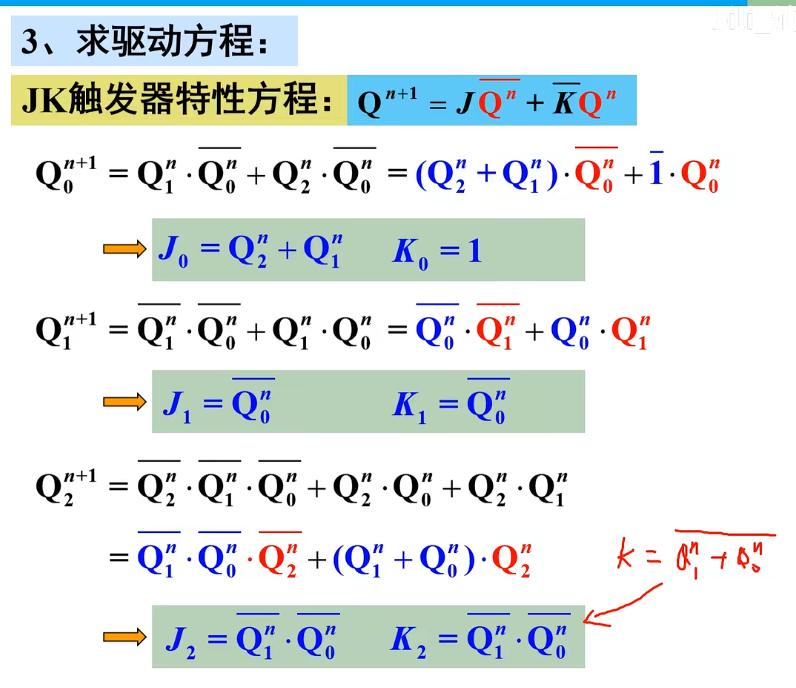

JK 触发器的**特性方程**为：Q^n+1 = J · ¬Q^n + ¬K · Q^n

将各触发器的状态方程变换为与特性方程一致的形式，对比可得J（置 1 端）和K（置 0 端）的表达式：

#### （1）FF0（对应 Q0）

状态方程变换：

Q0^n+1 = (Q2 + Q1) · ¬Q0 + ¬1 · Q0

对比特性方程，得：

J0 = Q2 + Q1（或运算），K0 = 1（恒为 1）

#### （2）FF1（对应 Q1）

状态方程变换：

Q1^n+1 = ¬Q0 · ¬Q1 + Q0 · Q1 = ¬Q0 · ¬Q1 + ¬(¬Q0) · Q1

对比特性方程，得：

J1 = ¬Q0，K1 = ¬Q0（J1=K1，实现 “Q0=0 时翻转，Q0=1 时保持”）

#### （3）FF2（对应 Q2）

状态方程变换：

Q2^n+1 = ¬Q1·¬Q0 · ¬Q2 + (Q1 + Q0) · Q2 = ¬(Q1 + Q0) · ¬Q2 + (Q1 + Q0) · Q2

（利用摩根定律：¬Q1·¬Q0 = ¬(Q1 + Q0)）

对比特性方程，得：

J2 = ¬Q1 · ¬Q0（与运算），K2 = ¬Q1 · ¬Q0（J2=K2，实现 “Q1=Q0=0 时翻转，否则保持”）

### 6. 绘制电路图

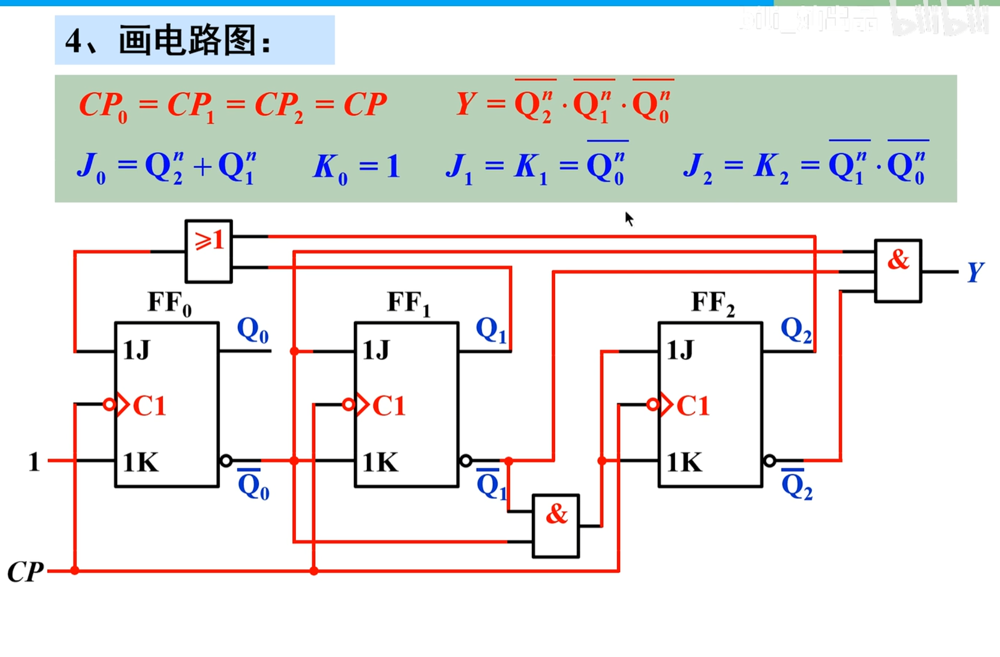

根据驱动方程、输出方程和时钟方程，电路组成如下：

- 核心器件：3 个 JK 触发器（FF2、FF1、FF0）

- 门电路：

- 1 个或门：实现J0 = Q2 + Q1

- 1 个与门：实现J2 = K2 = ¬Q1 · ¬Q0（需先通过非门获取¬Q1、¬Q0）

- 3 个非门：分别获取¬Q2、¬Q1、¬Q0（用于输出方程和驱动方程）

- 1 个 3 输入与门：实现Y = ¬Q2 · ¬Q1 · ¬Q0

- 连接关系：

- 时钟端：FF2.CP、FF1.CP、FF0.CP 均接外部 CP

- 驱动端：FF2.J=FF2.K=¬Q1・¬Q0；FF1.J=FF1.K=¬Q0；FF0.J=Q2+Q1，FF0.K=1

- 输出端：Y 接 3 输入与门输出

### 7. 电路自启动判断

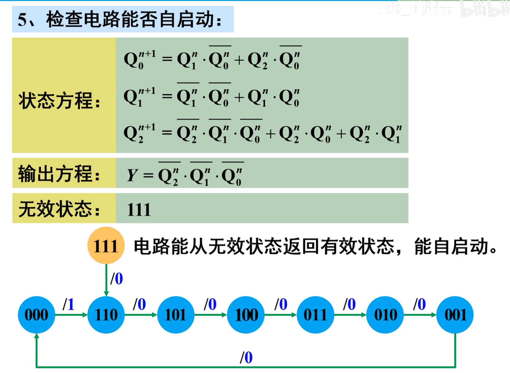

#### 核心逻辑

自启动能力：无效状态（本案例为 111）能否在时钟触发下跳转为有效状态。

将无效状态Q2Q1Q0=111代入状态方程，计算次态：

- Q2^n+1 = ¬1·¬1·¬1 + 1·1 + 1·1 = 0 + 1 + 1 = 1

- Q1^n+1 = ¬1·¬1 + 1·1 = 0 + 1 = 1

- Q0^n+1 = 1·¬1 + 1·¬1 = 0 + 0 = 0

#### 结果

无效状态 “111” 的次态为 “110”（有效状态），且输出Y=¬1·¬1·¬1=0，因此**电路能自启动**。

### 8. 仿真验证（Multisim 软件，视频演示）

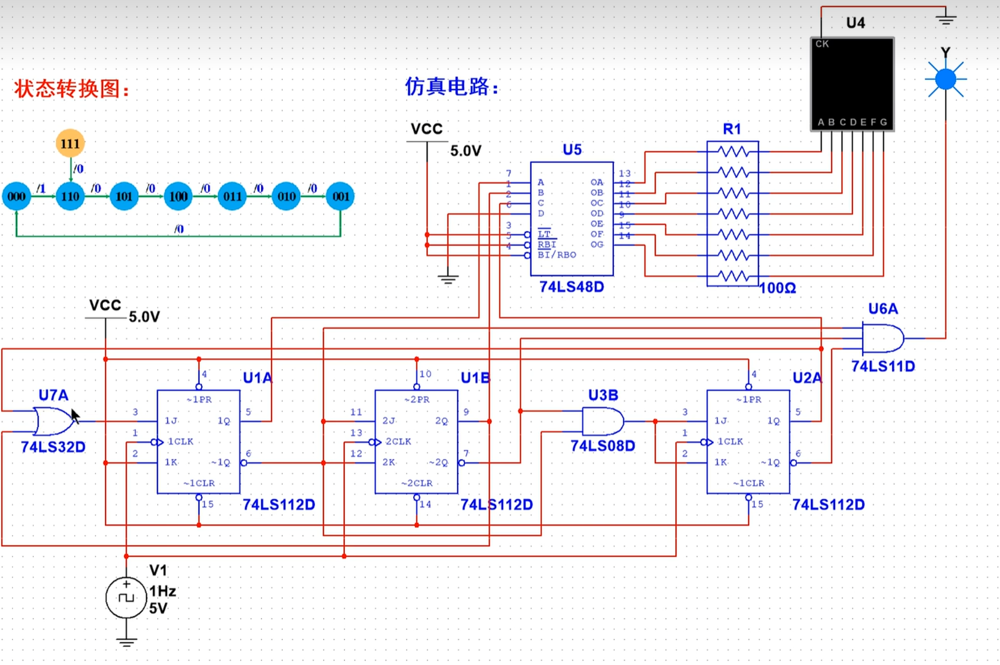

#### 仿真电路组成

- 核心器件：3 个 JK 触发器、或门（1 个）、与门（2 个，含 1 个 3 输入与门）、非门（3 个）、数码显示器（显示十进制数）

- 测试逻辑：输入连续 CP 时钟，观察数码管显示和借位输出Y

#### 仿真结果（符合设计要求）

- 无效状态跳转：上电若初始为 “111”（显示 7），触发 1 个 CP 后跳转为 “110”（显示 6）

- 正常计数循环：6→5→4→3→2→1→0→6（循环）

- 借位输出：当显示 “0”（000 态）时，Y=1（借位）；其他显示时Y=0

## 四、例题核心结论

1. 同步七进制减法计数器的关键是 “000→110” 的借位逻辑，需通过输出方程Y=¬Q2·¬Q1·¬Q0实现；

1. JK 触发器的驱动方程需严格匹配状态方程与特性方程的形式，确保状态跳转正确；

1. 无效状态 “111” 可跳转为有效状态 “110”，电路具备自启动能力，无需额外设计复位电路；

1. 仿真验证是验证设计正确性的关键步骤，可通过 Multisim 搭建电路直观观察计数规律。


# 异步时序电路的设计

## 一、异步时序电路与同步时序电路的核心区别

- **触发信号来源不同**：

同步时序电路中所有触发器均由外部统一时钟信号（CP）触发；

异步时序电路中**部分触发器由内部信号（如其他触发器的输出 Q/**\(\overline{Q}\)**）触发**，仅部分触发器受外部 CP 控制。

- **设计核心难点**：

1. 为受内部信号触发的触发器选择合适的时钟脉冲；

1. 受内部信号触发的触发器，其**次态卡诺图需进行修正**。

## 二、设计要求（例题背景：异步六进制加法计数器）

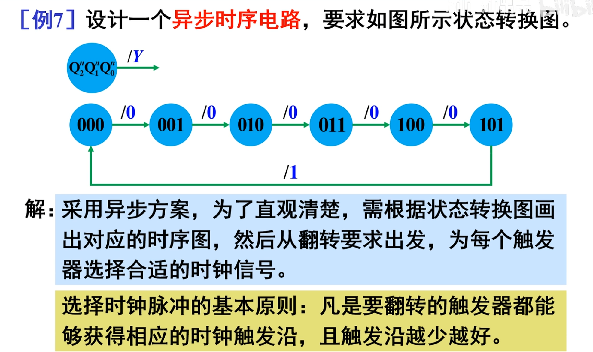

视频全程以 “异步六进制加法计数器” 为设计例题，具体要求如下：

1. **状态转换图**：给定状态转换图，状态分配为 3 位二进制码\(Q_2Q_1Q_0\)；

1. **有效循环**：包含 6 个有效状态，按自然态序递增：\(000 \to 001 \to 010 \to 011 \to 100 \to 101 \to 000\)；

1. **输出特性**：无输入信号，仅 1 个输出\(Y\)（进位标志）；当状态从\(101\)返回到\(000\)时，\(Y\)产生**下降沿**（表示计数循环完成）；

1. **无效状态**：3 位二进制共 8 个状态，剩余\(110\)、\(111\)为无效状态，需作为约束项（用 “X” 表示）处理。

## 三、详细设计步骤（含例题实操）

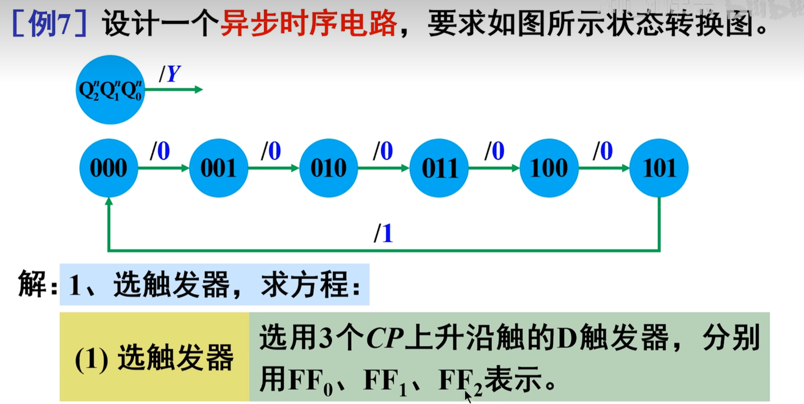

### 步骤 1：选择触发器类型与数量

- **数量确定**：需表示 3 位二进制状态（\(Q_2Q_1Q_0\)），故选择**3 个触发器**；

- **类型选择**：选用**上升沿触发的边沿 D 触发器（74LS74）** （视频明确指定，74LS74 为双 D 触发器，需用其中 3 个独立 D 触发单元）；

- **触发器标识**：3 个触发器分别对应\(Q_0\)（触发器 0）、\(Q_1\)（触发器 1）、\(Q_2\)（触发器 2）。

### 步骤 2：求输出方程（例题推导）

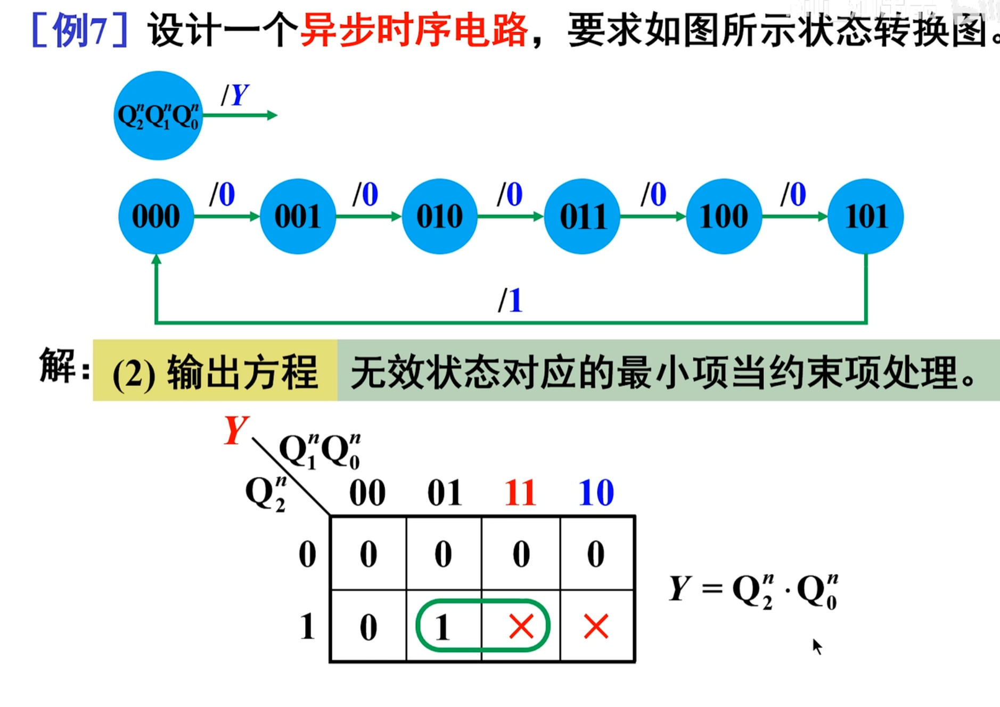

输出\(Y\)是现态\(Q_2Q_1Q_0\)的函数，需通过卡诺图化简：

1. **列输出卡诺图**：

| \(Q_2Q_1\) \ \(Q_0\)                                         | 0        | 1        |
| ------------------------------------------------------------ | -------- | -------- |
| 00                                                           | 0（000） | 0（001） |
| 01                                                           | 0（010） | 0（011） |
| 10                                                           | 0（100） | 1（101） |
| 11                                                           | X（110） | X（111） |
| 注：有效状态中仅\(101\)对应\(Y=1\)，无效状态\(110\)、\(111\)标为 “X”（约束项）。 |          |          |

1. **卡诺图化简**：

将\(101\)的 “1” 与\(111\)的 “X” 构成 2 个相邻格的卡诺圈（卡诺圈大小需为\(2^n\)），消去变量\(Q_1\)（因\(Q_1\)在圈中 0/1 交替），保留\(Q_2\)（均为 1）和\(Q_0\)（均为 1）；

1. **输出方程结果**：\(\boxed{Y = Q_2 \cdot Q_0}\)。

### 步骤 3：求时钟方程（核心难点 1）

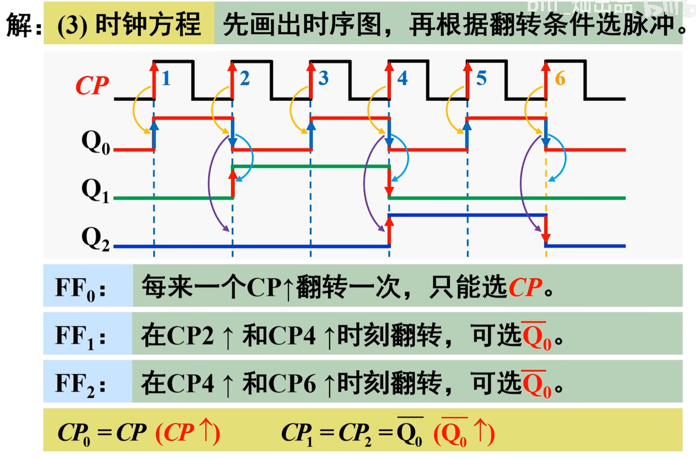

时钟方程需为每个触发器选择触发信号，**选择依据有 2 条**：

1. 触发器发生翻转（\(0 \to 1\)或\(1 \to 0\)）时，必须有对应的触发沿（上升沿 / 下降沿，匹配触发器类型）；

1. 触发沿数量越少越好（避免退化为同步电路，若全选 CP 则为同步电路）。

#### 例题中各触发器时钟信号选择（结合时序图分析）

- **触发器 0（**\(Q_0\)**）**：

时序图中\(Q_0\)每一个 CP 上升沿均翻转（6 个 CP 对应 6 次翻转），无其他内部信号（\(Q_1\)、\(Q_2\)）能提供足够触发沿（\(Q_1\)、\(Q_2\)仅 2 次翻转），故**时钟信号为外部 CP**，即\(\boxed{CP_0 = CP}\)（上升沿触发）。

- **触发器 1（**\(Q_1\)**）**：

时序图中\(Q_1\)仅在\(Q_0\)的下降沿翻转（\(Q_0\)下降沿对应\(\overline{Q_0}\)的上升沿，匹配 D 触发器上升沿触发要求）；若选 CP，触发沿数量过多（6 个），不符合 “越少越好” 原则，故**时钟信号为**\(\overline{Q_0}\)，即\(\boxed{CP_1 = \overline{Q_0}}\)（上升沿触发，等价于\(Q_0\)下降沿触发）。

- **触发器 2（**\(Q_2\)**）**：

时序图中\(Q_2\)仅在\(Q_0\)的下降沿翻转（与\(Q_1\)一致），选\(\overline{Q_0}\)可减少触发沿数量（仅 3 个），若选 CP 则触发沿过多，故**时钟信号为**\(\overline{Q_0}\)，即\(\boxed{CP_2 = \overline{Q_0}}\)（上升沿触发，等价于\(Q_0\)下降沿触发）。

### 步骤 4：求状态方程（核心难点 2：次态卡诺图修正）

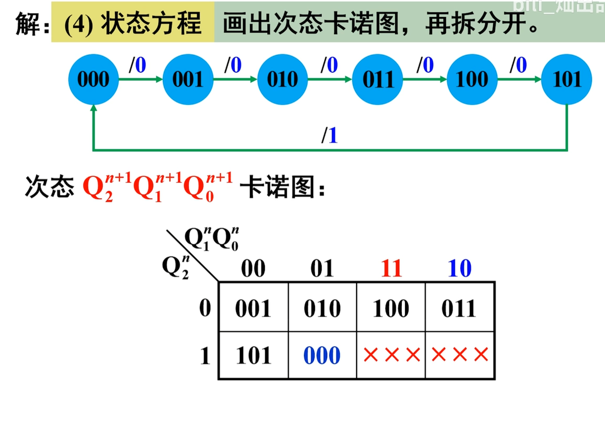

状态方程是次态\(Q_2^{n+1}Q_1^{n+1}Q_0^{n+1}\)与现态\(Q_2Q_1Q_0\)的函数，需先画次态卡诺图，再拆分并修正（仅修正受内部信号触发的触发器）。

#### 1. 绘制整体次态卡诺图

根据状态转换图，次态分配如下：

| \(Q_2Q_1\) \ \(Q_0\) | 0                  | 1                  |
| -------------------- | ------------------ | ------------------ |
| 00                   | \(001\)（000→001） | \(010\)（001→010） |
| 01                   | \(011\)（010→011） | \(100\)（011→100） |
| 10                   | \(101\)（100→101） | \(000\)（101→000） |
| 11                   | X（110，无效）     | X（111，无效）     |

#### 2. 拆分次态卡诺图（按\(Q_2^{n+1}\)、\(Q_1^{n+1}\)、\(Q_0^{n+1}\)拆分）

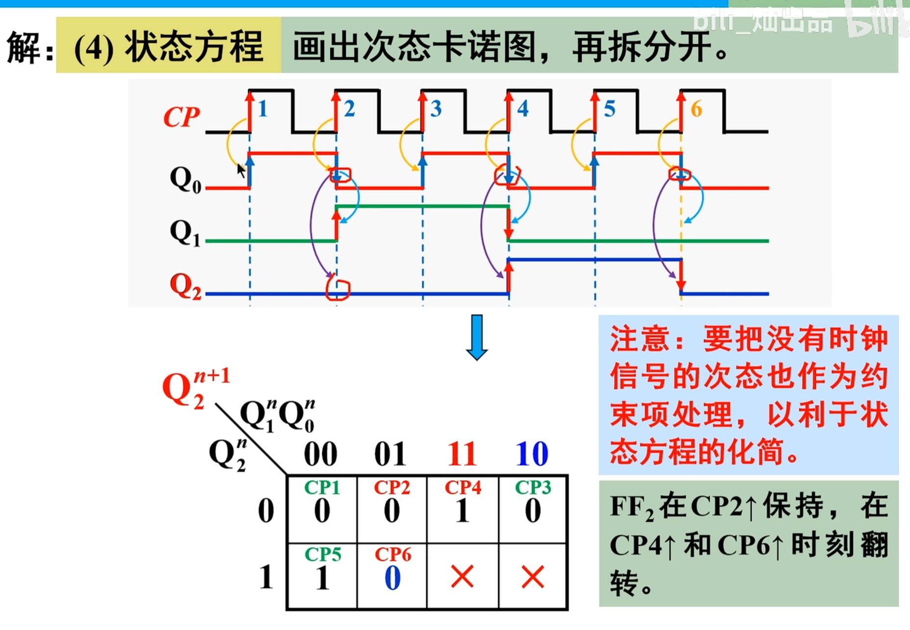

- **关键规则**：受内部信号触发的触发器（\(Q_1\)、\(Q_2\)，时钟为\(\overline{Q_0}\)）需**修正次态卡诺图**—— 将 “无对应时钟信号的次态” 标为 “X”（约束项）；受 CP 触发的触发器（\(Q_0\)）无需修正。

#### 3. 各触发器次态卡诺图修正与化简（例题推导）

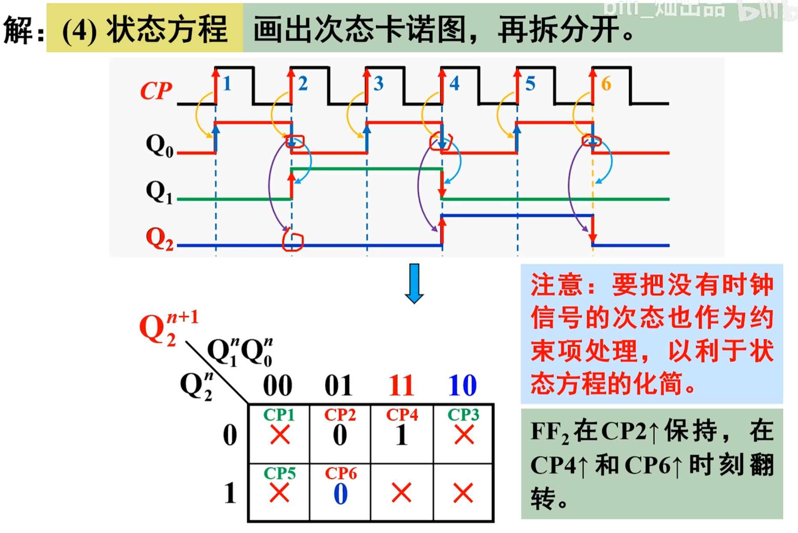

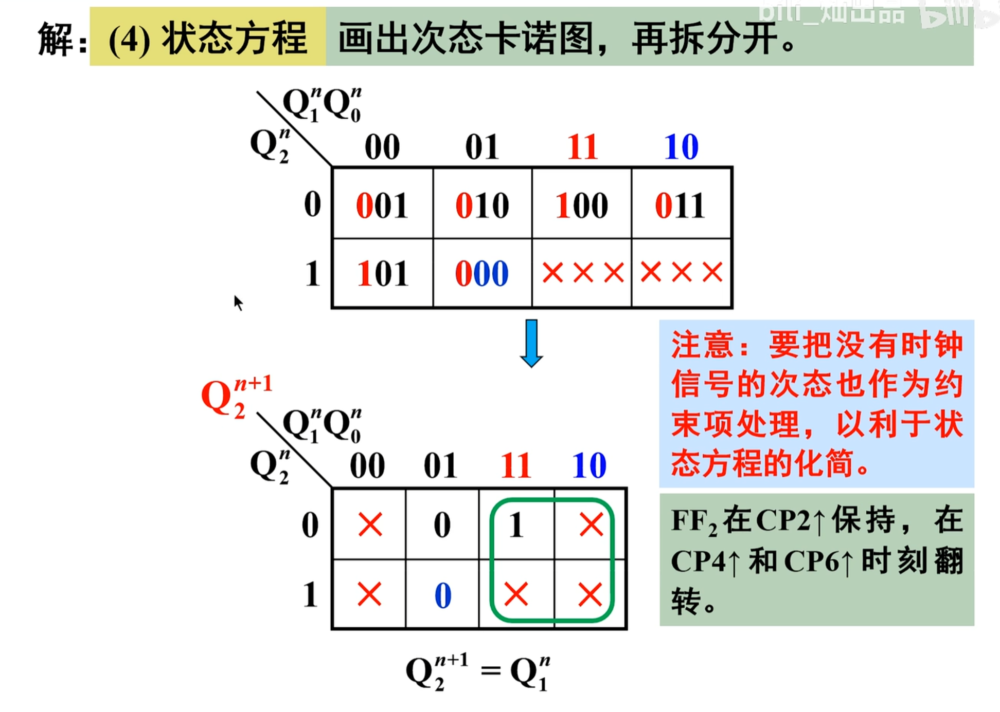

##### （1）\(Q_2^{n+1}\)的卡诺图（受\(\overline{Q_0}\)触发，需修正）


- **修正逻辑**：仅当\(\overline{Q_0}\)有上升沿（即\(Q_0\)下降沿）时，\(Q_2\)才可能翻转，无此触发沿的次态标为 “X”；

- **修正后卡诺图**：

| \(Q_2Q_1\) \ \(Q_0\) | 0    | 1    |
| -------------------- | ---- | ---- |
| 00                   | X    | 0    |
| 01                   | X    | 1    |
| 10                   | X    | 0    |
| 11                   | X    | X    |

- **化简结果**：\(\boxed{Q_2^{n+1} = Q_1}\)（仅当\(\overline{Q_0}\)上升沿有效）。

##### （2）\(Q_1^{n+1}\)的卡诺图（受\(\overline{Q_0}\)触发，需修正）

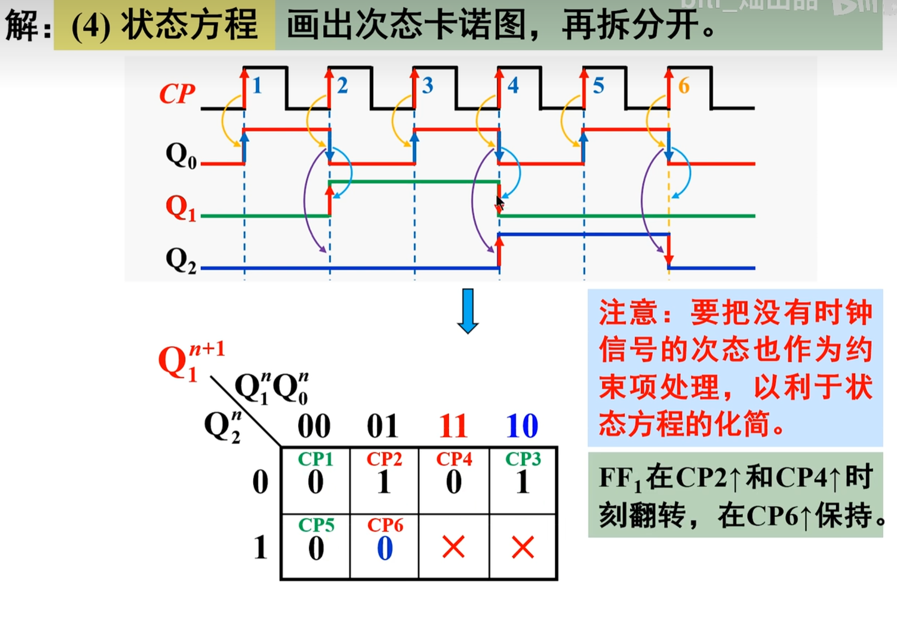

- **修正逻辑**：同\(Q_2\)，无\(\overline{Q_0}\)上升沿的次态标为 “X”；

- **修正后卡诺图**：

	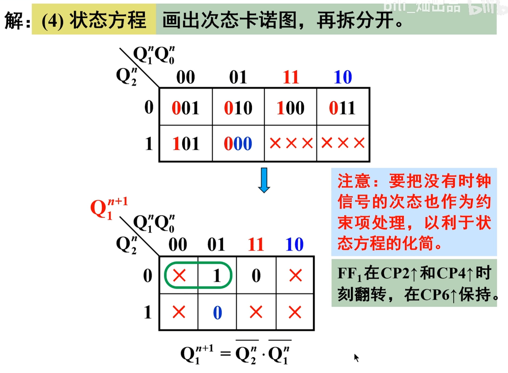

| \(Q_2Q_1\) \ \(Q_0\) | 0    | 1    |
| -------------------- | ---- | ---- |
| 00                   | X    | 1    |
| 01                   | X    | 0    |
| 10                   | X    | 0    |
| 11                   | X    | X    |

- **化简结果**：\(\boxed{Q_1^{n+1} = \overline{Q_2} \cdot \overline{Q_1}}\)（仅当\(\overline{Q_0}\)上升沿有效）。

##### （3）\(Q_0^{n+1}\)的卡诺图（受 CP 触发，无需修正）

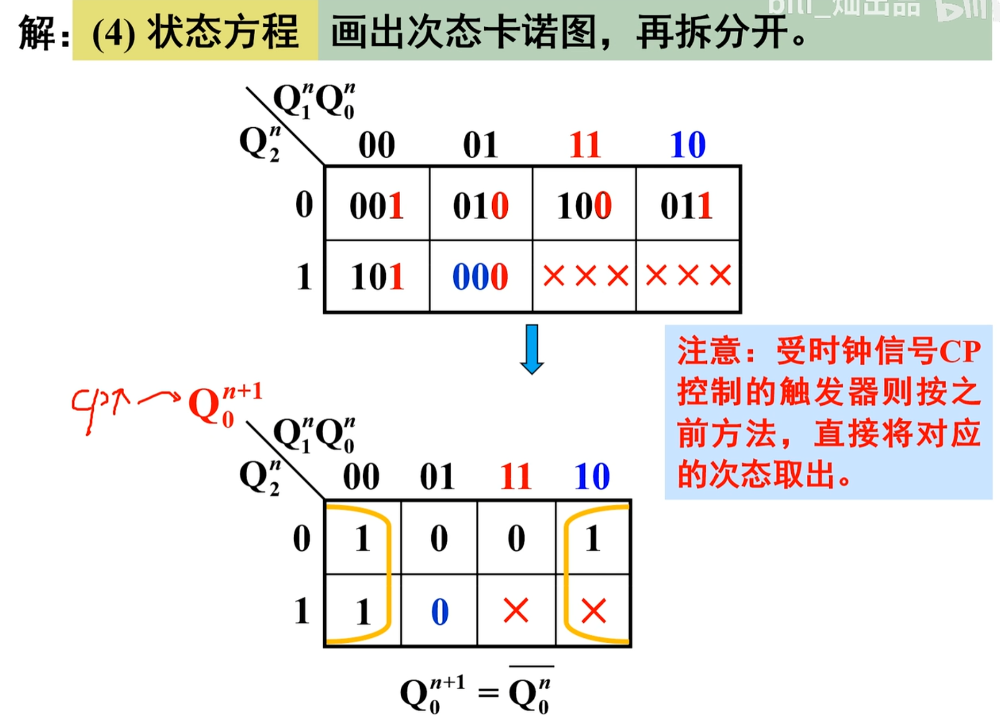

- **卡诺图**：

| \(Q_2Q_1\) \ \(Q_0\) | 0    | 1    |
| -------------------- | ---- | ---- |
| 00                   | 1    | 0    |
| 01                   | 1    | 0    |
| 10                   | 1    | 0    |
| 11                   | X    | X    |

- **化简结果**：\(\boxed{Q_0^{n+1} = \overline{Q_0}}\)（仅当 CP 上升沿有效）。

### 步骤 5：求驱动方程

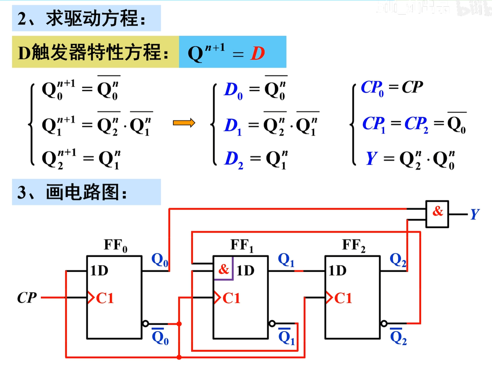

D 触发器的特性方程为\(\boxed{Q^{n+1} = D}\)（次态 = 驱动输入），因此驱动方程直接等于对应触发器的状态方程：

- 触发器 0（\(Q_0\)）：\(\boxed{D_0 = Q_0^{n+1} = \overline{Q_0}}\)；

- 触发器 1（\(Q_1\)）：\(\boxed{D_1 = Q_1^{n+1} = \overline{Q_2} \cdot \overline{Q_1}}\)；

- 触发器 2（\(Q_2\)）：\(\boxed{D_2 = Q_2^{n+1} = Q_1}\)。

### 步骤 6：绘制电路图（例题电路）

基于上述方程，电路图核心连接如下：

1. **触发器选型**：3 个上升沿 D 触发器（74LS74，用 2 片 74LS74：1 片提供 2 个触发器，另 1 片提供 1 个触发器）；

1. **时钟连接**：

- \(CP_0\)接外部 CP 信号；

- \(CP_1\)、\(CP_2\)接触发器 0 的\(\overline{Q_0}\)输出；

1. **驱动端连接**：

- \(D_0\)接\(\overline{Q_0}\)（需反相器，或直接引\(\overline{Q_0}\)输出）；

- \(D_1\)接\(\overline{Q_2}\)与\(\overline{Q_1}\)的与门输出（用 74LS08 与门）；

- \(D_2\)接\(Q_1\)输出；

1. **输出端连接**：\(Y\)接\(Q_2\)与\(Q_0\)的与门输出（74LS08 与门）；

1. **复位 / 置位端**：所有触发器的异步复位端（\(\overline{R_D}\)）、置位端（\(\overline{S_D}\)）均接高电平（禁用异步复位 / 置位）。

## 四、电路仿真验证（Multisim 仿真）

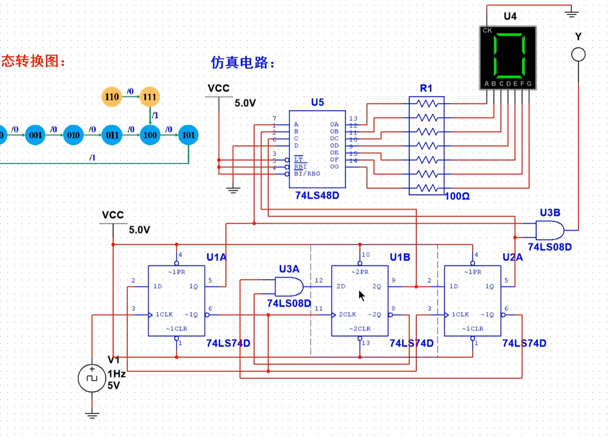

视频中使用 Multisim 软件搭建仿真电路，验证设计正确性：

1. **核心器件**：

- D 触发器：74LS74（双 D 触发器）；

- 与门：74LS08（四 2 输入与门）；

- 时钟信号：1Hz、5V 方波（CP）；

- 显示电路：74LS48（BCD - 七段显示译码器）+ 共阴极七段数码管（显示\(Q_2Q_1Q_0\)状态）；

- 进位指示：LED 灯（接输出\(Y\)，\(Y=1\)时灯亮）；

1. **仿真结果**：

数码管按\(0 \to 1 \to 2 \to 3 \to 4 \to 5 \to 0\)循环显示（对应\(000 \to 001 \to 010 \to 011 \to 100 \to 101 \to 000\)），当显示 “5”（\(101\)）时 LED 灯亮，返回到 “0”（\(000\)）时灯灭，符合六进制计数与进位要求。

## 五、自启动检查（例题无效状态分析）

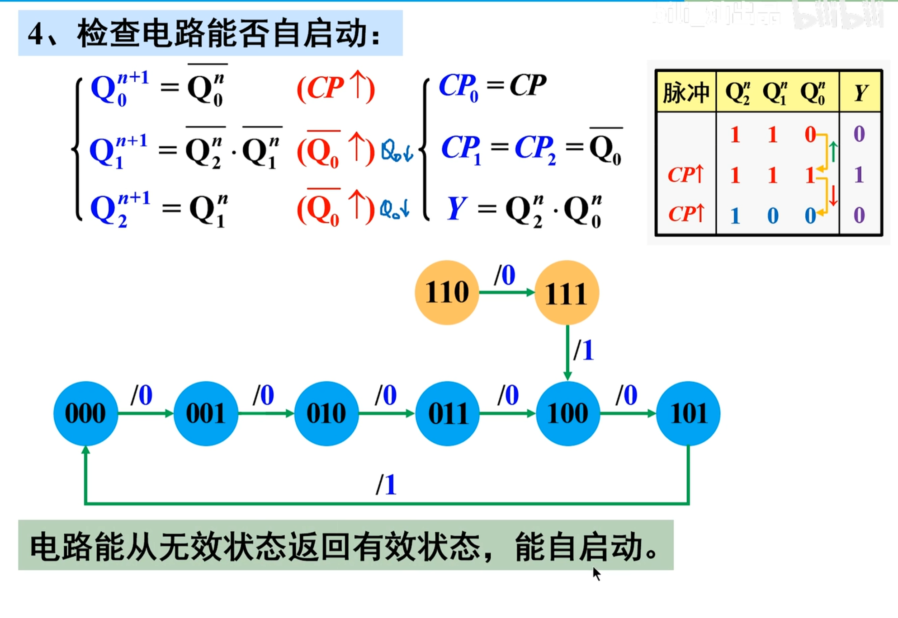

异步时序电路需检查无效状态是否能回到有效循环，视频中无效状态为\(110\)、\(111\)，采用 “异步时序电路分析方法” 验证：

### 1. 分析无效状态\(110\)的转换

- **现态**：\(Q_2Q_1Q_0=110\)，输出\(Y=Q_2 \cdot Q_0=1 \cdot 0=0\)；

- **触发条件判断**：

- 外部 CP 上升沿触发\(Q_0\)：\(Q_0^{n+1}=\overline{Q_0}=1\)，故\(Q_0\)从\(0 \to 1\)；

- \(\overline{Q_0}\)无上升沿（\(Q_0\)从\(0 \to 1\)，\(\overline{Q_0}\)从\(1 \to 0\)，为下降沿），故\(Q_1\)、\(Q_2\)保持原态（\(1\)）；

- **次态**：\(Q_2Q_1Q_0=111\)（仍为无效状态）。

### 2. 分析无效状态\(111\)的转换

- **现态**：\(Q_2Q_1Q_0=111\)，输出\(Y=Q_2 \cdot Q_0=1 \cdot 1=1\)；

- **触发条件判断**：

- 外部 CP 上升沿触发\(Q_0\)：\(Q_0^{n+1}=\overline{Q_0}=0\)，故\(Q_0\)从\(1 \to 0\)；

- \(\overline{Q_0}\)有上升沿（\(Q_0\)从\(1 \to 0\)，\(\overline{Q_0}\)从\(0 \to 1\)），触发\(Q_1\)、\(Q_2\)按状态方程更新：

- \(Q_1^{n+1}=\overline{Q_2} \cdot \overline{Q_1}=\overline{1} \cdot \overline{1}=0\)；

- \(Q_2^{n+1}=Q_1=1\)；

- **次态**：\(Q_2Q_1Q_0=100\)（有效状态）。

### 3. 自启动结论

无效状态转换路径：\(110 \to 111 \to 100\)（有效循环），故**电路能自启动**。

## 六、核心难点与注意事项

1. **时钟信号选择**：必须同时满足 “翻转有触发沿” 和 “触发沿最少”，避免选 CP 导致同步化；

1. **次态卡诺图修正**：仅修正**受内部信号触发的触发器**，修正逻辑是 “无对应时钟的次态标为 X”；

1. **自启动检查**：需按 “异步时序分析方法”，先判断触发条件是否满足，再更新次态，不可直接套用同步电路的状态转换；

1. **D 触发器特性**：驱动方程 = 状态方程（因\(Q^{n+1}=D\)），无需额外转换（与 JK 触发器不同）。


#  计数器概述

## 一、核心学习要求

1. 掌握二进制计数器的工作原理、逻辑功能及使用方法

1. 理解常用集成二进制和十进制计数器的功能及其应用

1. 掌握利用集成计数器构成 N 进制（任意进制）计数器的方法

## 二、N 进制（任意进制）计数器概念

1. **定义**：除二进制、十进制计数器外，其余进制的计数器统称 N 进制计数器，例如五进制、九进制、12 进制、50 进制、60 进制等。

1. **构成思路**：基于现有二进制 / 十进制计数器组合或反馈实现，示例如下：

- 12 进制计数器：用 4 位二进制计数器（本质 16 进制，12≤16，满足计数范围）构成

- 50 进制计数器：单个十进制计数器（模 10）无法满足，需将两个十进制计数器**级联**构成 100 进制计数器，再通过反馈连接剔除超出 50 的状态，最终实现 50 进制计数

## 三、计数器的作用与分类（5.2.1）

### （一）计数器的定义与作用

1. **定义**：用于统计（累计）输入脉冲 CP 的个数，每输入一个 CP 脉冲，计数器状态按规律加 1 或减 1。

1. **核心作用**：

- 分频：降低输入 CP 脉冲的频率

- 定时：根据计数周期产生固定时长的定时信号

- 产生脉冲序列：输出符合特定规律的脉冲信号

- 数字运算：实现简单的加法、减法等数字运算

1. **电路类型**：属于**Moore 型时序电路**，特点如下：

- 输出仅取决于电路的**现态**，与外部输入信号（如 X）无关

- 区别于 Mealy 型时序电路：Mealy 型输出依赖现态 + 外部输入信号（本视频提及 “含 X 外部输入的 Mealy 型例题，但未详细讲解”）

- 计数器电路无外加 X 输入（字幕明确 “计数器的电路结构都是没有外加那个 X 输入的”）

### （二）计数器的分类

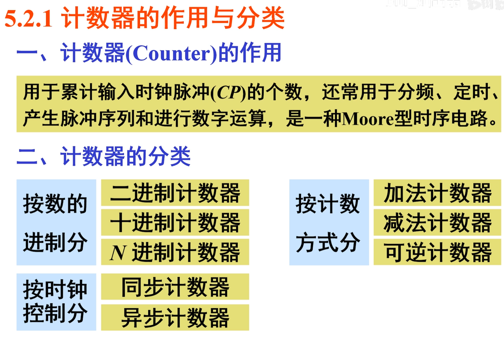

#### 1. 按数的进制分类

- **二进制计数器**：

- 可扩展为多位（1 位、2 位、3 位、4 位等），并非仅含 0、1 两个状态

- 计数容量（模）：n 位二进制计数器的模 = 2ⁿ（n 为触发器个数，1 个触发器对应 1 位）

- 示例 1：3 位二进制计数器（3 个触发器 Q2Q1Q0）→ 模 = 2³=8（八进制）

- 示例 2：4 位二进制计数器（4 个触发器 Q3Q2Q1Q0）→ 模 = 2⁴=16（十六进制，模 16＞十进制模 10）

- **十进制计数器**：模 = 10（0-9 共 10 个状态），用 4 位二进制码（如 8421BCD 码）表示 1 位十进制数（需 4 个触发器）

- **N 进制计数器**：除二进制、十进制外的其他进制，如五进制（模 5）、九进制（模 9）等（见 “二、N 进制计数器概念”）

#### 2. 按计数方式分类

- **加法计数器**：每输入一个 CP 脉冲，状态按自然态序加 1

- **减法计数器**：每输入一个 CP 脉冲，状态按自然态序减 1

- **可逆计数器**：在外部控制信号 / 脉冲作用下，可切换为加法或减法计数；设计思路为 “先分别设计加法、减法计数器，再组合”（本视频提及 “后续讲二进制计数器会展开设计”）

#### 3. 按时钟控制方式分类

- **同步计数器**：所有触发器的 CP 端均接同一外部 CP 信号，状态变化同步

- 判断依据：电路结构中所有 CP 端接同一信号

- **异步计数器**：部分触发器 CP 端接外部信号，部分接内部触发器输出，状态变化不同步

- 判断依据：电路结构中部分 CP 端接内部信号，非全部接同一外部 CP

#### 4. 按构成材料分类

- TTL 型计数器：由 TTL（晶体管 - 晶体管逻辑）电路构成

- CMOS 型计数器：由 CMOS（互补金属氧化物半导体）电路构成

## 四、计数器的计数规律

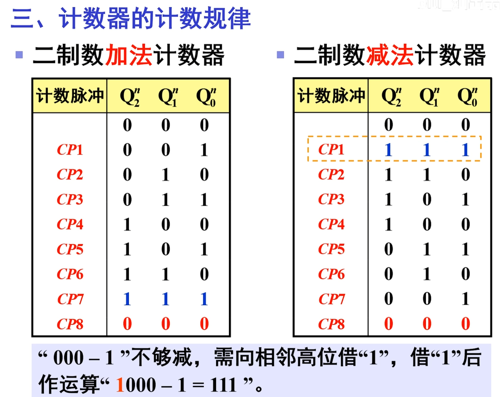

### （一）二进制加法计数器（以 3 位为例，3 个触发器 Q2Q1Q0）

1. **初始状态**：Q2Q1Q0=000（“一般从 000 开始”）

1. **计数规则**：每输入 1 个 CP 脉冲加 1；达到最大值（111，十进制 7）后，再输 CP 脉冲归零（000），完成循环

1. **状态变化序列**（CP 脉冲与状态对应）：

- CP0（初始）：000

- CP1：001（000+1）

- CP2：010（001+1）

- CP3：011（010+1）

- CP4：100（011+1）

- CP5：101（100+1）

- CP6：110（101+1）

- CP7：111（110+1，最大值）

- CP8：000（111+1，归零）

1. **指示信号**：状态为 111（CP7 时），通常输出 1（如接指示灯，灯亮），提示 “再输 CP 将归零”

### （二）二进制减法计数器（以 3 位为例，3 个触发器 Q2Q1Q0）

1. **初始状态**：Q2Q1Q0=000（字幕强调 “非从 111 开始，而是从 000 开始”）

1. **计数规则**：每输入 1 个 CP 脉冲减 1；状态为 000（最小值）时，需向高位**借 1 当 8**（3 位二进制最大容量），状态变为 111；后续减 1 至 000，完成循环

1. **关键注意点**：借位信号对应 “000 现态”，而非 “111 现态”（避免与加法混淆，字幕明确 “借位写在 000 的输出里”）

1. **状态变化序列**（CP 脉冲与状态对应）：

- CP0（初始）：000

- CP1：111（000-1，借 1 当 8，8-1=7→111）

- CP2：110（111-1）

- CP3：101（110-1）

- CP4：100（101-1）

- CP5：011（100-1）

- CP6：010（011-1）

- CP7：001（010-1）

- CP8：000（001-1，归零）

### （三）8421BCD 码十进制加法计数器（4 个触发器 Q3Q2Q1Q0）

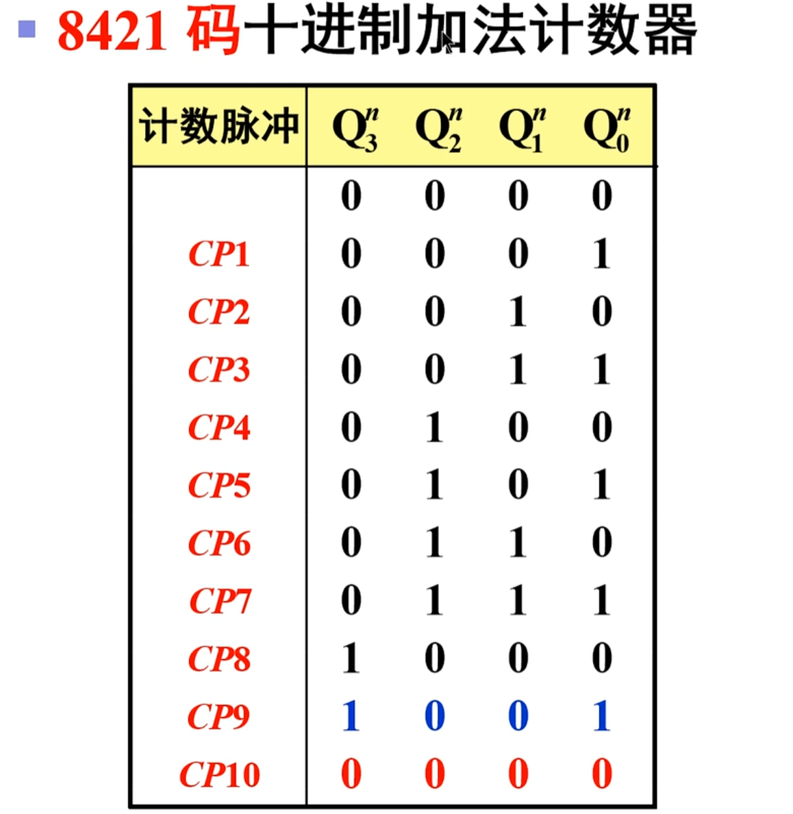

1. **8421BCD 码基础**：4 位二进制数表示 1 位十进制数（0-9），范围 0000-1001（剔除 1010-1111 无效状态）

1. **初始状态**：Q3Q2Q1Q0=0000

1. **计数规则**：每输入 1 个 CP 脉冲加 1；达到 1001（十进制 9）后，再输 CP 脉冲归零（0000），完成循环

1. **状态变化序列**（CP 脉冲与状态对应）：

- CP0（初始）：0000

- CP1：0001

- CP2：0010

- CP3：0011

- CP4：0100

- CP5：0101

- CP6：0110

- CP7：0111

- CP8：1000

- CP9：1001（最大值，进位信号 C=1）

- CP10：0000（1001+1，归零）

### （四）N 进制计数器（以五进制为例，3 个触发器 Q2Q1Q0）

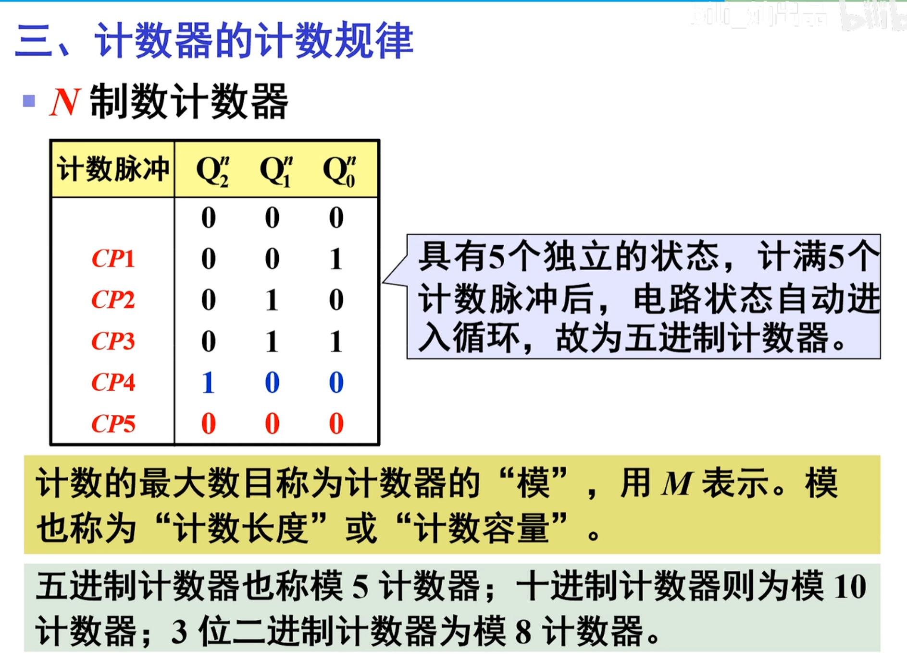

1. **定义**：含 N 个有效状态，输入 N 个 CP 脉冲后归零，模 = N

1. **五进制计数器（模 5）状态变化序列**（3 个触发器，仅用 5 个有效状态）：

	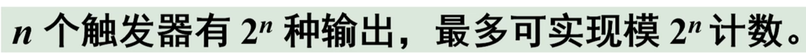

- CP0（初始）：000

- CP1：001

- CP2：010

- CP3：011

- CP4：100

- CP5：000（输入第 5 个 CP，归零，完成循环）

1. **特点**：有效状态数 = 进制数（五进制为 5 个），与触发器最大容量（3 个触发器最大 8 个状态）无关，需剔除无效状态

## 五、核心结论

1. **模（M）的定义**：计数器的最大计数数目（计数长度 / 容量），等于有效状态数

- 示例：五进制 M=5，十进制 M=10，3 位二进制 M=8

1. **触发器个数与最大模的关系**：n 个触发器可提供 2ⁿ种输出状态，最大可实现模 = 2ⁿ的计数器

- 示例 1：n=3→最大模 = 2³=8（3 位二进制计数器）

- 示例 2：n=4→最大模 = 2⁴=16（4 位二进制计数器）

## 六、本视频提及的例题

1. **Mealy 型时序电路例题**：提及 “含 X 外部输入的 Mealy 型例题，但本视频不讲”，仅用于对比 Moore 型计数器（无 X 输入）的特点

1. **计数器应用例题**：提及 “后续例题会介绍分频、定时、脉冲序列、数字运算的应用”，本视频暂未展开

1. **二进制可逆计数器设计例题**：提及 “先讲加法、减法计数器设计，再组合为可逆计数器”，本视频暂未展开


#  二进制同步计数器 

##  一、二进制同步计数器概述 

1. **分类维度** - 按触发同步性：同步计数器（所有触发器CP端相连） - 按计数规律：加法计数器、减法计数器、可逆计数器 
2. **核心共性** - 基于触发器（视频中均采用**下降沿触发JK触发器**） - 状态数：n位二进制计数器有\(2^n\)种状态，无无效状态，可自启动

## 二、二进制同步加法计数器

### 1. 核心特点

- 二进制：n 位表示\(2^n\)种状态（如 3 位对应 8 种状态：000~111）

- 同步性：所有触发器 CP 端连接同一脉冲源

- 加法性：每来一个 CP 脉冲，计数状态按二进制加法规律递增（000→001→010→…→111→000）

- 进位输出（C）：当状态为全 1（如 3 位的 111）时，C=1（向高位进位），其余状态 C=0

### 2. 设计方法（视频重点讲方法二）

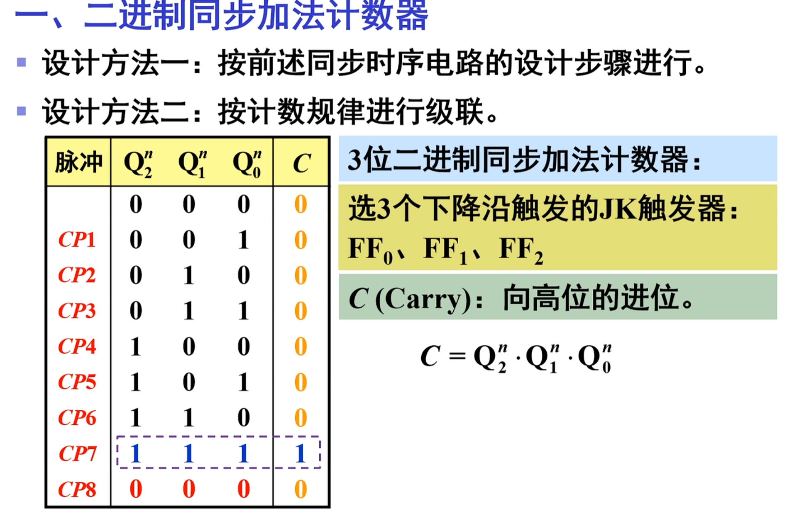

| 设计方法       | 核心思路                                                     | 适用范围         |
| -------------- | ------------------------------------------------------------ | ---------------- |
| 方法一（常规） | 状态转移图→选触发器→画输出 / 次态卡诺图→求输出方程 / 状态方程→推导驱动方程 | 所有同步时序电路 |
| 方法二（级联） | 利用二进制加法计数规律，直接推导触发器驱动方程，无需卡诺图   | 仅二进制计数器   |

### 3. 3 位二进制同步加法计数器实例（视频核心例题）

#### （1）基础参数

- 触发器：3 个下降沿 JK 触发器（编号 0、1、2，输出端\(Q_2Q_1Q_0\)）

- 计数状态：000（CP0）→001（CP1）→010（CP2）→011（CP3）→100（CP4）→101（CP5）→110（CP6）→111（CP7）→000（CP8）

#### （2）特性表（关键数据）

| CP 脉冲 | \(Q_2\)（现态） | \(Q_1\)（现态） | \(Q_0\)（现态） | 进位 C |
| ------- | --------------- | --------------- | --------------- | ------ |
| CP0     | 0               | 0               | 0               | 0      |
| CP1     | 0               | 0               | 1               | 0      |
| CP2     | 0               | 1               | 0               | 0      |
| CP3     | 0               | 1               | 1               | 0      |
| CP4     | 1               | 0               | 0               | 0      |
| CP5     | 1               | 0               | 1               | 0      |
| CP6     | 1               | 1               | 0               | 0      |
| CP7     | 1               | 1               | 1               | 1      |
| CP8     | 0               | 0               | 0               | 0      |

#### （3）方程推导（方法二）

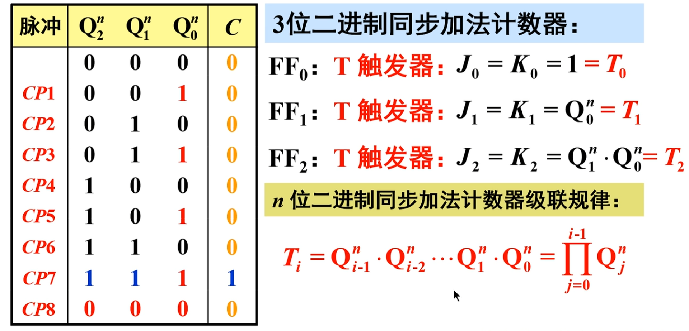

1. **输出方程（进位 C）**

仅当\(Q_2Q_1Q_0=111\)时 C=1，故：

\( C = Q_2 \cdot Q_1 \cdot Q_0 \)

（需 3 输入与门）

1. **驱动方程（JK 触发器转 T 触发器：J=K=T）**

- 触发器 0（\(Q_0\)）：每 CP 翻转（T' 触发器特性），故\(T_0=1\) → \(J_0=K_0=1\)

- 触发器 1（\(Q_1\)）：仅当\(Q_0=1\)时翻转，故\(T_1=Q_0\) → \(J_1=K_1=Q_0\)

- 触发器 2（\(Q_2\)）：仅当\(Q_1Q_0=11\)时翻转，故\(T_2=Q_1 \cdot Q_0\) → \(J_2=K_2=Q_1 \cdot Q_0\)

#### （4）接线图与进位方式对比

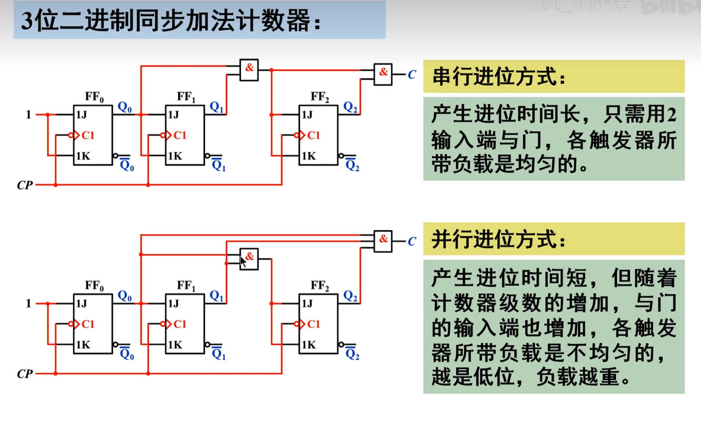

| 进位方式 | 接线特点                                                     | 优点                         | 缺点                                   |
| -------- | ------------------------------------------------------------ | ---------------------------- | -------------------------------------- |
| 串行进位 | C 由\(Q_2\)与 “\(Q_1 \cdot Q_0\)的与门输出” 再相与（每级用 2 输入与门） | 与门输入数少，触发器负载均匀 | 进位延时长（级联越多越明显）           |
| 并行进位 | C 直接由经 3 输入与门输出                                    | 进位延时短                   | 与门输入数随级数增加，低位触发器负载重 |

#### （5）T' 触发器设计方案（例题）

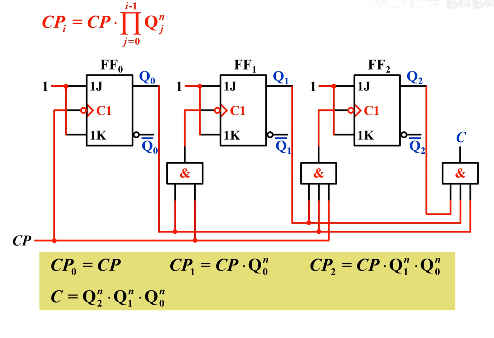

- 思路：JK 触发器均接 1（转 T' 触发器），将计数规律归入时钟方程

- 时钟方程：

\( CP_0 = CP \)

\( CP_1 = CP \cdot Q_0 \)

（2 输入与门）

\( CP_2 = CP \cdot Q_1 \cdot Q_0 \)

（3 输入与门）

波形图验证（重点分析）：

- 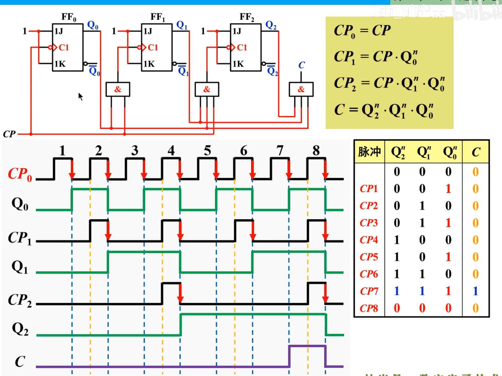

1. \(Q_0\)：每 CP 下降沿翻转（二分频）

1. \(CP_1\)：仅当 CP=1 且\(Q_0=1\)时有效，故\(Q_1\)每 2 个 CP 翻转（四分频）

1. \(CP_2\)：仅当 CP=1 且\(Q_1Q_0=11\)时有效，故\(Q_2\)每 4 个 CP 翻转（八分频）

1. 最终\(Q_2Q_1Q_0\)波形与加法计数规律一致，C 仅在 CP7 后为 1

## 三、二进制同步减法计数器

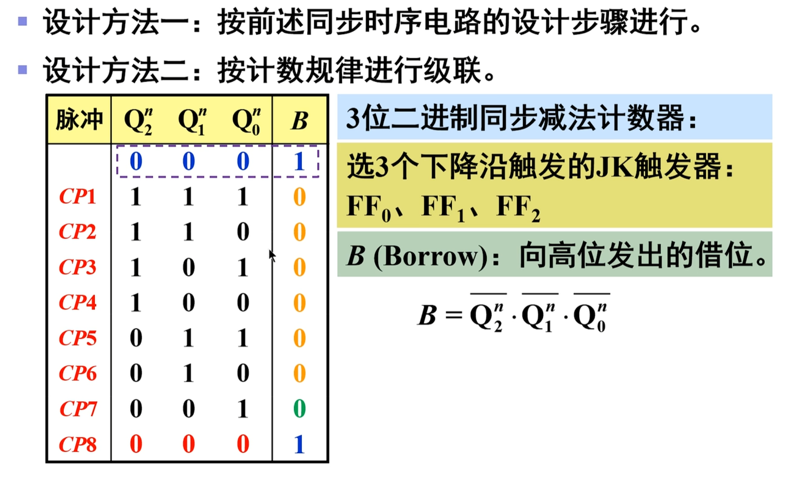

### 1. 核心特点

- 减法性：每来一个 CP 脉冲，计数状态按二进制减法规律递减（000→111→110→…→001→000）

- 借位输出（B）：当状态为全 0（如 3 位的 000）时，B=1（向高位借位），其余状态 B=0

### 2. 3 位二进制同步减法计数器实例（视频核心例题）

#### （1）特性表（关键数据）

| CP 脉冲 | \(Q_2\)（现态） | \(Q_1\)（现态） | \(Q_0\)（现态） | 借位 B |
| ------- | --------------- | --------------- | --------------- | ------ |
| CP0     | 0               | 0               | 0               | 1      |
| CP1     | 1               | 1               | 1               | 0      |
| CP2     | 1               | 1               | 0               | 0      |
| CP3     | 1               | 0               | 1               | 0      |
| CP4     | 1               | 0               | 0               | 0      |
| CP5     | 0               | 1               | 1               | 0      |
| CP6     | 0               | 1               | 0               | 0      |
| CP7     | 0               | 0               | 1               | 0      |
| CP8     | 0               | 0               | 0               | 1      |

#### （2）方程推导（方法二）

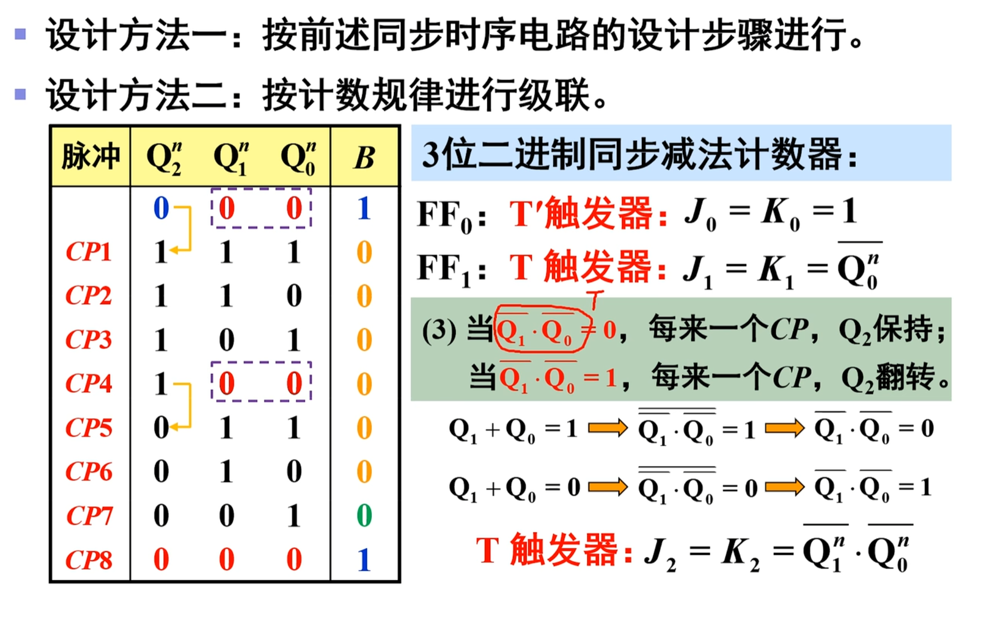

1. **输出方程（借位 B）**

仅当\(Q_2Q_1Q_0=000\)时 B=1，故：

\( B = \overline{Q_2} \cdot \overline{Q_1} \cdot \overline{Q_0} \)

（需 3 输入与门）

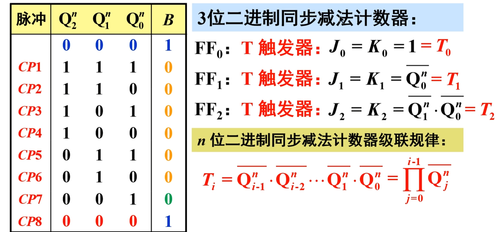

1. **驱动方程（JK 转 T 触发器）**

- 触发器 0（\(Q_0\)）：每 CP 翻转，故\(T_0=1\) → \(J_0=K_0=1\)

- 触发器 1（\(Q_1\)）：仅当\(\overline{Q_0}=1\)（即\(Q_0=0\)）时翻转，故\(T_1=\overline{Q_0}\) → \(J_1=K_1=\overline{Q_0}\)

- 触发器 2（\(Q_2\)）：仅当\(\overline{Q_1} \cdot \overline{Q_0}=11\)（即\(Q_1Q_0=00\)）时翻转，故\(T_2=\overline{Q_1} \cdot \overline{Q_0}\) → \(J_2=K_2=\overline{Q_1} \cdot \overline{Q_0}\)

#### （3）接线图与进位方式

- 串行进位：B 由\(\overline{Q_2}\)与 “\(\overline{Q_1} \cdot \overline{Q_0}\)的与门输出” 再相与（每级用 2 输入与门）

	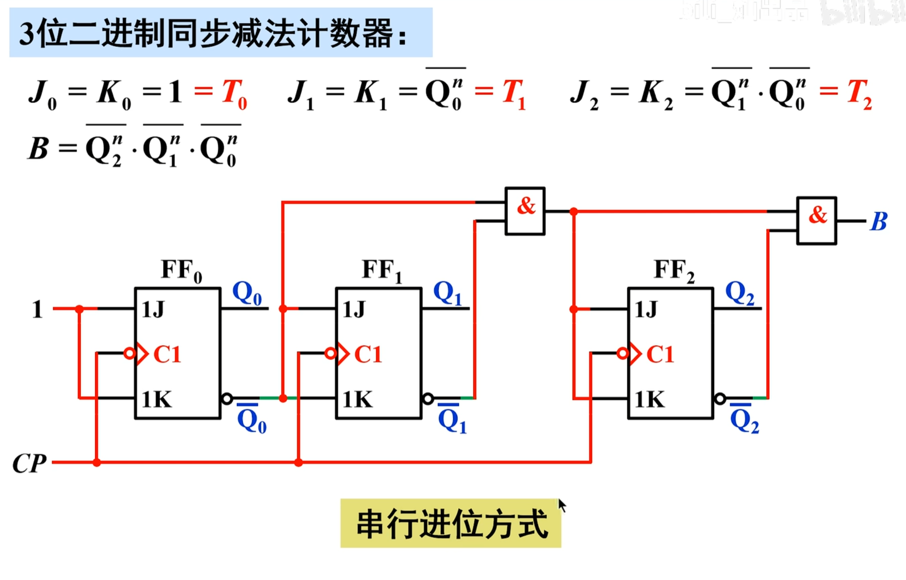

- 并行进位：B 直接由经 3 输入与门输出（优缺点同加法计数器）

	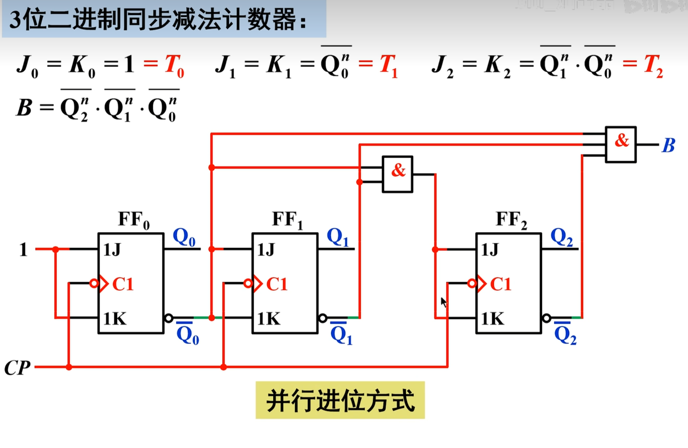

T' 触发器设计方案

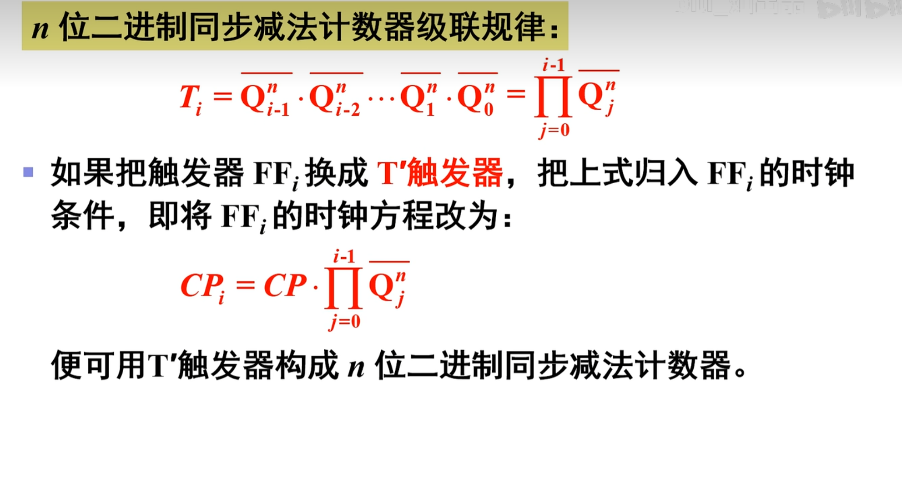

## 四、二进制同步可逆计数器（单时钟输入）

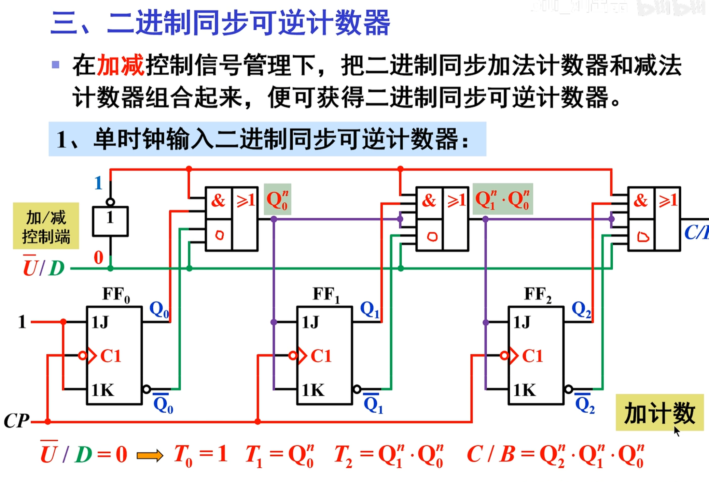


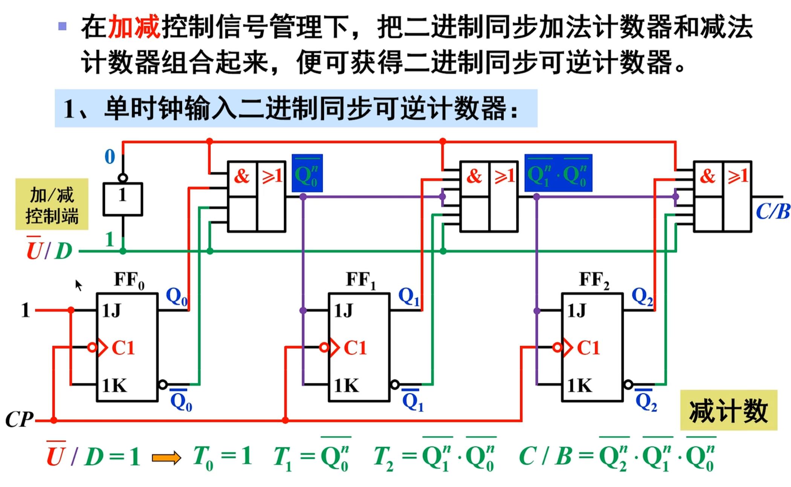

### 1. 核心原理

- 功能：通过 “加减控制端（\(\overline{U}/D\)）” 切换加法 / 减法计数

- 电路结构：整合加法计数器与减法计数器的驱动逻辑，用 “与或门” 实现控制端的选通

### 二进制同步可逆计数器（双时钟输入）

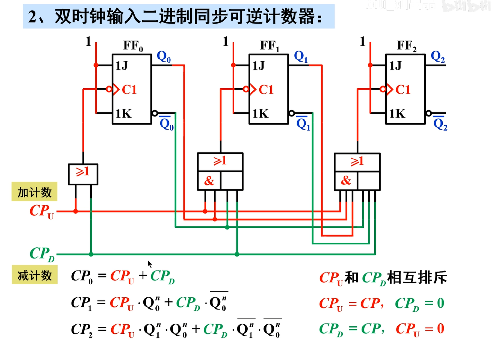

#### （1）控制端逻辑（\(\overline{U}/D\)）

| 控制端\(\overline{U}/D\) | 有效电平含义        | 工作模式 | 核心方程（T 触发器） | 输出端（C/B）                                                |
| ------------------------ | ------------------- | -------- | -------------------- | ------------------------------------------------------------ |
| 0（低电平）              | U（Up，加法）有效   | 加法计数 |                      | \(C = Q_2 \cdot Q_1 \cdot Q_0\)（进位）                      |
| 1（高电平）              | D（Down，减法）有效 | 减法计数 |                      | \(B = \overline{Q_2} \cdot \overline{Q_1} \cdot \overline{Q_0}\)（借位） |

#### （2）电路关键组件

- 非门：将\(\overline{U}/D\)转换为互补信号，控制与或门选通

- 与或门：加法逻辑（上支路）与减法逻辑（下支路）的选通，输出驱动 JK 触发器的 J/K 端

- 输出端 C/B：加法时为进位 C，减法时为借位 B


# 集成二进制同步计数器

## 一、集成 4 位同步二进制加法计数器（74LS161/74LS163）

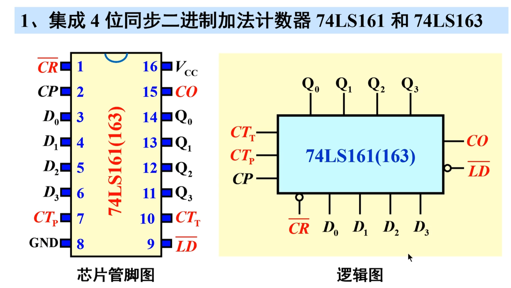

### 1.1 芯片基本信息

- **类型**：TTL 芯片，16 管脚，4 位同步二进制加法计数器（本质为 16 进制计数器，4 位输出对应 16 种状态：0000~1111）

- **核心标识**：74LS161 与 74LS163 管脚完全一致，唯一区别在于清零方式

- **电源管脚**：第 8 脚（GND，接地）、第 16 脚（VCC，接电源）

### 1.2 管脚功能（含逻辑符号含义）

| 管脚标识          | 英文全称 / 功能定义            | 电平有效性 | 核心作用                                                     |
| ----------------- | ------------------------------ | ---------- | ------------------------------------------------------------ |
| CTT               | Count Timer (计数控制端 1)     | 高电平有效 | 与 CTP 共同控制计数：仅当 CTT=1 且 CTP=1 时，计数器可加法计数；任一为 0 则停止计数（保持状态） |
| CTP               | Count Pulse (计数控制端 2)     | 高电平有效 | 同 CTT，二者需同时为高才允许计数                             |
| CP                | Clock Pulse (时钟脉冲端)       | 上升沿有效 | 计数触发信号：仅在 CP 上升沿时执行计数、置数等操作           |
| \(\overline{CR}\) | Clear (清零端)                 | 低电平有效 | 清除输出端状态：使 Q0~Q3 置 0（**74LS161 为异步清零，74LS163 为同步清零**） |
| \(\overline{LD}\) | Load (置数控制端)              | 低电平有效 | 同步置数：配合 D0~D3，在 CP 上升沿将并行数据送入 Q0~Q3       |
| D0~D3             | Parallel Data (并行数据输入端) | -          | 预置数据端：与\(\overline{LD}\)配合，将指定 4 位二进制数（如 0011）送入输出端 |
| CO                | Carry Output (进位输出端)      | 高电平有效 | 计数满标识：当 Q0~Q3=1111 且 CTT=1 时，CO=1（表示计数完成一圈，可用于级联或状态指示） |
| Q0~Q3             | State Output (状态输出端)      | -          | 计数器核心输出：Q0 为最低位（LSB），Q3 为最高位（MSB），输出当前计数状态 |

### 1.3 功能表解析（74LS161/74LS163 通用，仅清零行有差异）

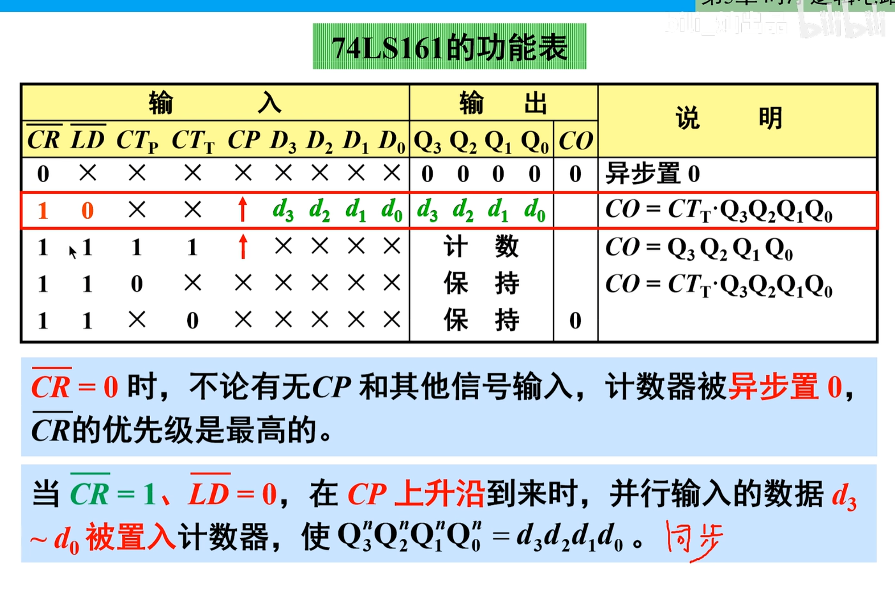

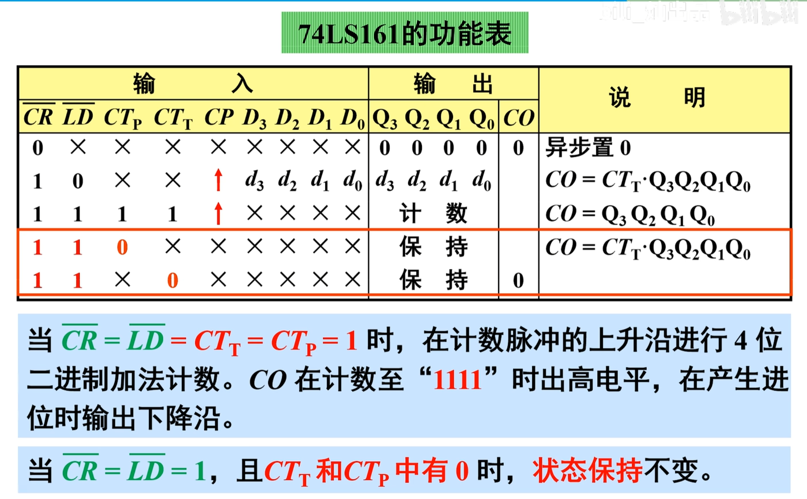

| \(\overline{CR}\) | \(\overline{LD}\) | CTT  | CTP  | CP   | D3~D0 | Q3~Q0   | CO                             | 功能说明                                                     |
| ----------------- | ----------------- | ---- | ---- | ---- | ----- | ------- | ------------------------------ | ------------------------------------------------------------ |
| 0                 | X                 | X    | X    | X    | X     | 0000    | 0                              | 74LS161：异步清零（无需等 CP，\(\overline{CR}=0\)立即置 0）；74LS163：同步清零（需 CP 上升沿才置 0） |
| 1                 | 0                 | X    | X    | ↑    | D3~D0 | D3~D0   | \(\overline{Q3·Q2·Q1·Q0}·CTT\) | 同步置数（\(\overline{CR}=1\)时，CP 上升沿将 D0~D3 送入 Q0~Q3） |
| 1                 | 1                 | 1    | 1    | ↑    | X     | Q3~Q0+1 | Q3·Q2·Q1·Q0·CTT                | 同步加法计数（CP 上升沿时计数 + 1，满 1111 时 CO=1）         |
| 1                 | 1                 | 0    | X    | X    | X     | 保持    | Q3·Q2·Q1·Q0·CTT                | 保持状态（CTT=0，无论 CP 如何，输出不变）                    |
| 1                 | 1                 | X    | 0    | X    | X     | 保持    | Q3·Q2·Q1·Q0·CTT                | 保持状态（CTP=0，无论 CP 如何，输出不变）                    |

- 注：“X” 表示 “任意电平”（0 或 1 均可），“↑” 表示 “时钟上升沿”

	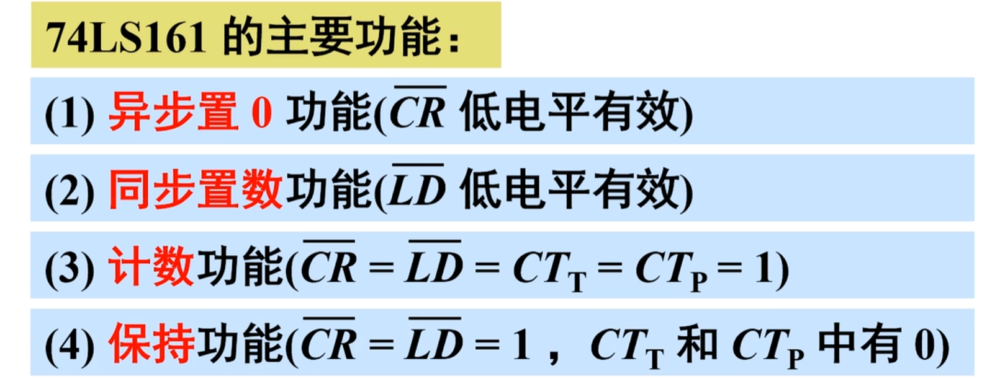

### 1.4 74LS161 与 74LS163 核心差异

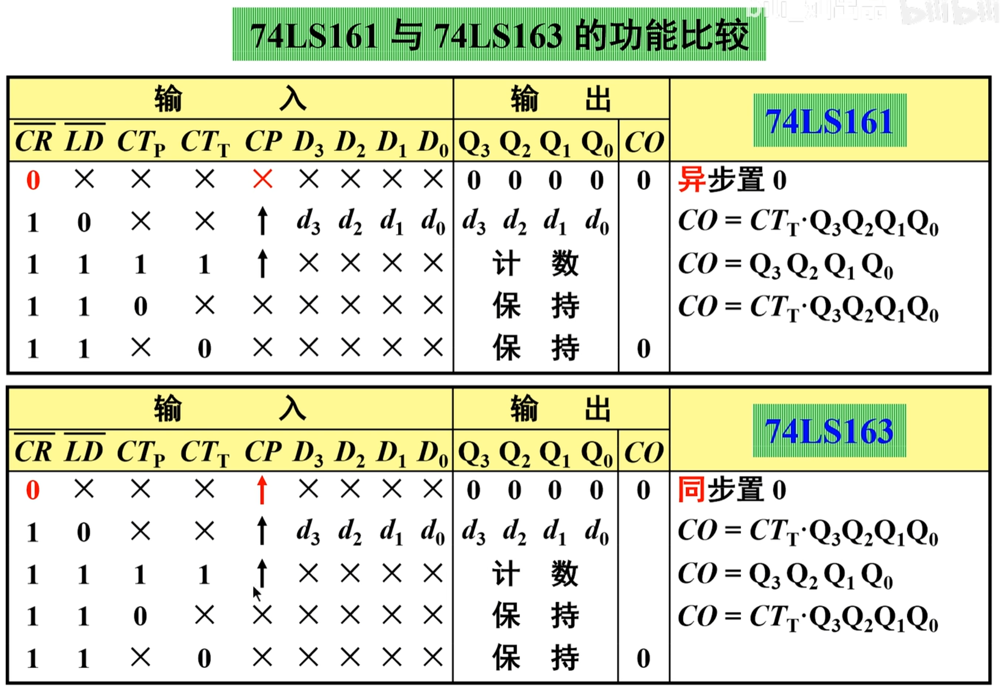


| 对比项                       | 74LS161                                 | 74LS163                                         |
| ---------------------------- | --------------------------------------- | ----------------------------------------------- |
| 清零方式                     | 异步清零（\(\overline{CR}=0\)立即置 0） | 同步清零（\(\overline{CR}=0\)+CP 上升沿才置 0） |
| 其他功能（置数、计数、保持） | 完全一致                                | 完全一致                                        |

### 1.5 仿真实例（视频中电路操作与现象）

#### 1.5.1 74LS161 仿真电路搭建

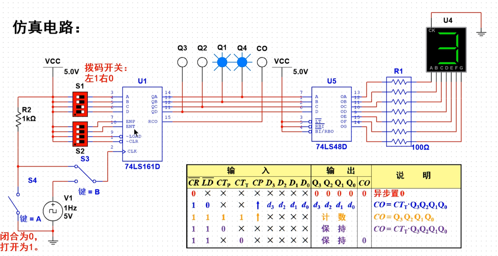

- 输出端 Q0~Q3 接 4 盏状态灯（显示当前计数），CO 接 1 盏指示灯（显示进位）

- 控制端（\(\overline{CR}\)、\(\overline{LD}\)、CTT、CTP）接拨码开关（拨左为 1，拨右为 0）

- 并行数据端 D0~D3 接拨码开关（设为 0011，即预置数 3）

- CP 端接 “手动 / 连续脉冲切换电路”：手动模式通过按键产生上升沿，连续模式接 1Hz 脉冲

#### 1.5.2 核心功能仿真操作与现象

1. **加法计数功能**

- 操作：拨码设\(\overline{CR}=1\)、\(\overline{LD}=1\)、CTT=1、CTP=1，CP 接连续脉冲

- 现象：输出从 0000（0）开始，每来一个 CP 上升沿 + 1，依次为 0001（1）→0010（2）→…→1111（15）；当计数到 1111 时，CO 灯亮（表示进位），下一个 CP 上升沿时输出归零（0000），CO 灯灭。

1. **异步清零功能**

- 操作：计数至 0110（6）时，拨\(\overline{CR}=0\)（其他端不变）

- 现象：Q0~Q3 立即变为 0000，无需等待 CP（体现异步特性）；拨回\(\overline{CR}=1\)，可恢复计数。

1. **同步置数功能**

- 操作：拨码设\(\overline{CR}=1\)、\(\overline{LD}=0\)（D0~D3=0011），CP 接手动脉冲

- 现象：\(\overline{LD}=0\)时输出不变，按下手动按键产生 CP 上升沿后，Q0~Q3 立即变为 0011（3）；拨回\(\overline{LD}=1\)，后续 CP 脉冲可继续计数（3→4→5…）。

1. **保持功能**

- 操作：计数至 0101（5）时，拨 CTT=0（或 CTP=0），CP 接连续脉冲

- 现象：无论 CP 如何输入，Q0~Q3 始终保持 0101（5），CO 状态也不变。

#### 1.5.3 74LS163 同步清零仿真差异

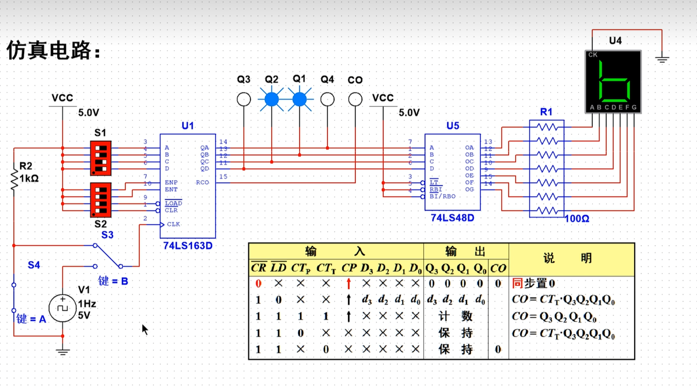

- 操作：计数至 0110（6）时，拨\(\overline{CR}=0\)，CP 接手动脉冲

- 现象：\(\overline{CR}=0\)时输出仍为 0110，按下手动按键产生 CP 上升沿后，Q0~Q3 才变为 0000（体现同步特性），与 74LS161 的 “立即清零” 形成对比。

## 二、集成 4 位二进制可逆计数器

### 2.1 单时钟可逆计数器（74LS191）

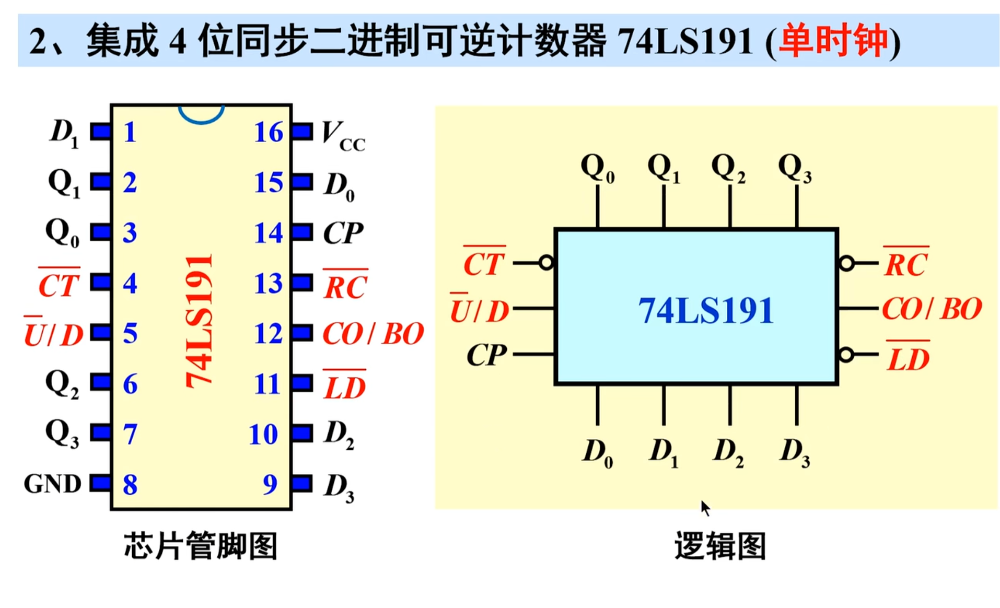

#### 2.1.1 芯片基本信息

- **类型**：TTL 芯片，16 管脚，4 位同步二进制可逆计数器（可加法 / 减法计数，单时钟控制）

- **核心特点**：无独立清零端，需通过置数端实现清零；置数方式为异步置数。

#### 2.1.2 管脚功能

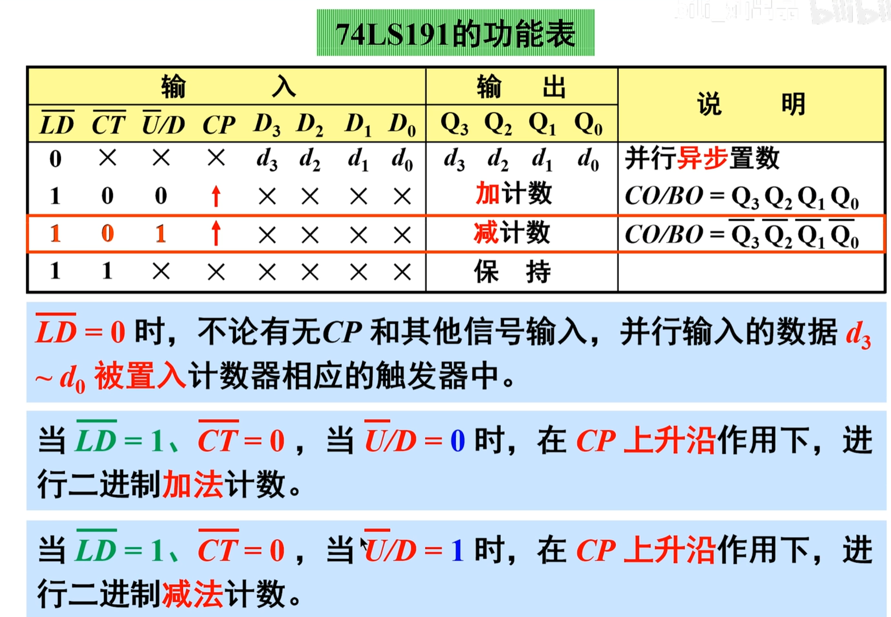

| 管脚标识           | 英文全称 / 功能定义                            | 电平有效性                                      | 核心作用                                                     |
| ------------------ | ---------------------------------------------- | ----------------------------------------------- | ------------------------------------------------------------ |
| \(\overline{CT}\)  | Count Control (计数控制端)                     | 低电平有效                                      | 允许计数：\(\overline{CT}=0\)时可加法 / 减法计数；\(\overline{CT}=1\)时保持 |
| \(\overline{U}/D\) | Up/Down (加减控制端)                           | \(\overline{U}=0\)（低）加法，\(D=1\)（高）减法 | 控制计数方向：\(\overline{U}/D=0\)时加法，\(\overline{U}/D=1\)时减法 |
| CP                 | Clock Pulse (时钟脉冲端)                       | 上升沿有效                                      | 触发信号：仅上升沿执行计数或置数（置数为异步，无需 CP）      |
| \(\overline{LD}\)  | Load (置数控制端)                              | 低电平有效                                      | 异步置数：\(\overline{LD}=0\)时，立即将 D0~D3 送入 Q0~Q3（无需 CP） |
| D0~D3              | Parallel Data (并行数据输入端)                 | -                                               | 预置数据端：可预置任意 4 位二进制数（如 0000 实现清零）      |
| CO/BO              | Carry Output/Borrow Output (进位 / 借位输出端) | 高电平有效                                      | 加法时：Q0~Q3=1111 则 CO=1；减法时：Q0~Q3=0000 则 BO=1       |
| \(\overline{RC}\)  | Ripple Carry (级联进位端)                      | 低电平有效                                      | 多芯片级联用：\(\overline{RC}=\overline{CP·\overline{CT}·CO/BO}\)，用于扩展计数器位数 |
| Q0~Q3              | State Output (状态输出端)                      | -                                               | 输出当前计数状态（Q0 为 LSB，Q3 为 MSB）                     |

#### 2.1.3 功能表解析

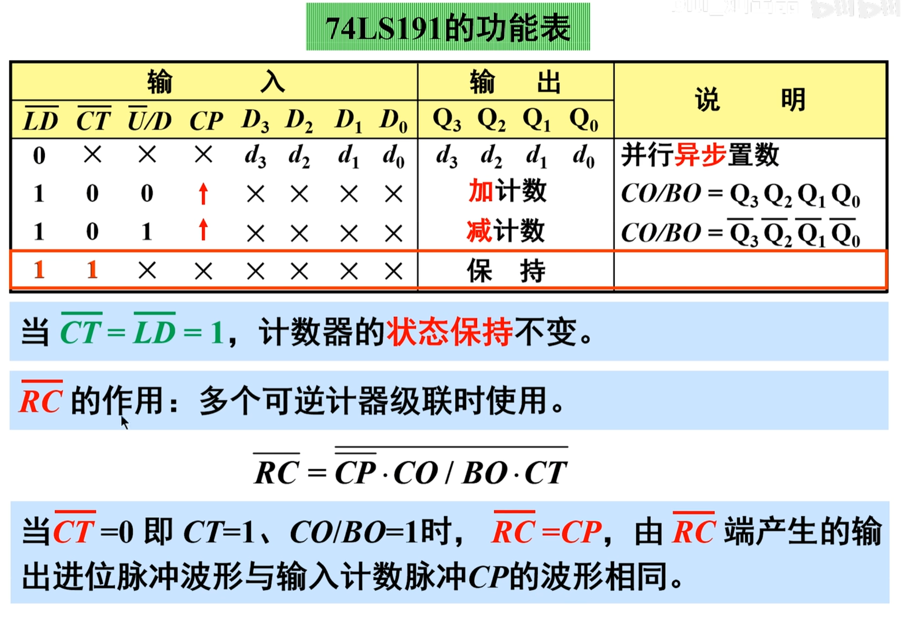

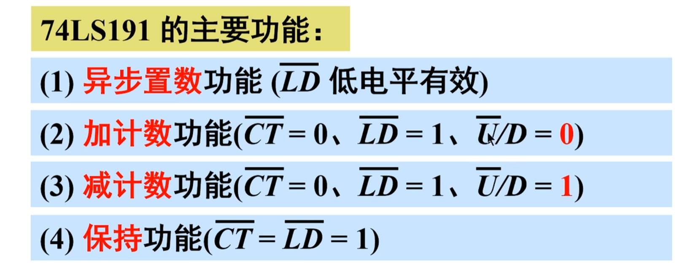

| \(\overline{LD}\) | \(\overline{CT}\) | \(\overline{U}/D\) | CP   | D3~D0 | Q3~Q0   | CO/BO                      | 功能说明                                         |
| ----------------- | ----------------- | ------------------ | ---- | ----- | ------- | -------------------------- | ------------------------------------------------ |
| 0                 | X                 | X                  | X    | D3~D0 | D3~D0   | 0                          | 异步置数（\(\overline{LD}=0\)立即送数，无需 CP） |
| 1                 | 0                 | 0                  | ↑    | X     | Q3~Q0+1 | Q3·Q2·Q1·Q0                | 同步加法计数（CP 上升沿 + 1，满 1111 时 CO=1）   |
| 1                 | 0                 | 1                  | ↑    | X     | Q3~Q0-1 | \(\overline{Q3·Q2·Q1·Q0}\) | 同步减法计数（CP 上升沿 - 1，减到 0000 时 BO=1） |
| 1                 | 1                 | X                  | X    | X     | 保持    | 保持                       | 保持状态（\(\overline{CT}=1\)，输出不变）        |

#### 2.1.4 仿真实例（视频中操作与现象）

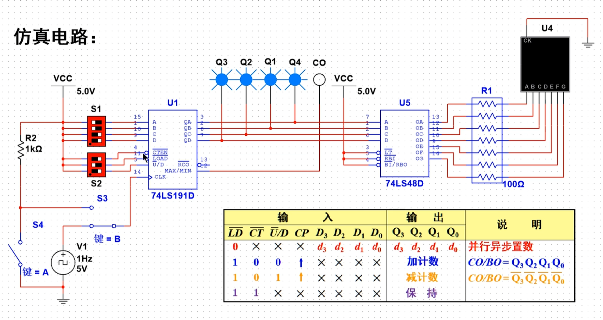

1. **电路搭建**：Q0~Q3 接状态灯，CO/BO 接指示灯，\(\overline{CT}\)、\(\overline{U}/D\)、\(\overline{LD}\)接拨码开关，D0~D3 设为 0011（预置 3），CP 接手动 / 连续脉冲。

1. **加法计数**

- 操作：\(\overline{LD}=1\)、\(\overline{CT}=0\)、\(\overline{U}/D=0\)，CP 接连续脉冲

- 现象：从 0000 开始 + 1，至 1111 时 CO 灯亮，下一个 CP 上升沿归零（0000），CO 灯灭。

1. **减法计数**

- 操作：\(\overline{LD}=1\)、\(\overline{CT}=0\)、\(\overline{U}/D=1\)，CP 接连续脉冲

- 现象：从 0000 开始 - 1（变为 1111），依次 1110→…→0000，至 0000 时 BO 灯亮，下一个 CP 上升沿变为 1111，BO 灯灭。

1. **异步置数与清零**

- 置数操作：计数至 0101（5）时，拨\(\overline{LD}=0\)（D0~D3=0011）

- 现象：Q0~Q3 立即变为 0011（3），无需等 CP；拨回\(\overline{LD}=1\)可恢复计数。

- 清零操作：将 D0~D3 设为 0000，拨\(\overline{LD}=0\)，Q0~Q3 立即变为 0000（无独立清零端的替代方案）。

1. **保持功能**

- 操作：计数至 0110（6）时，拨\(\overline{CT}=1\)，CP 接连续脉冲

- 现象：输出保持 0110，CO/BO 状态不变。

### 2.2 双时钟可逆计数器（74LS193）

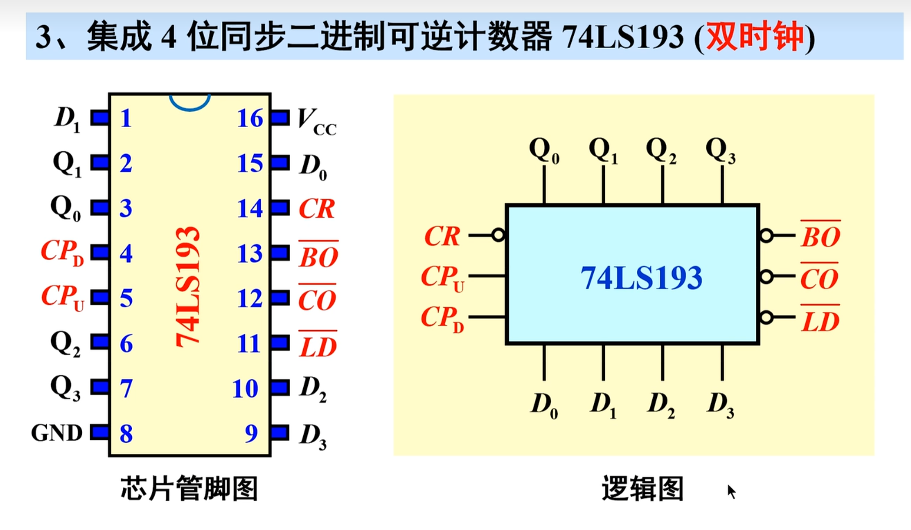

#### 2.2.1 芯片基本信息

- **类型**：TTL 芯片，16 管脚，4 位同步二进制可逆计数器（双时钟控制：加法 / 减法各一个时钟端）

- **核心特点**：含独立异步清零端（高电平有效）；置数方式为异步置数。

#### 2.2.2 管脚功能

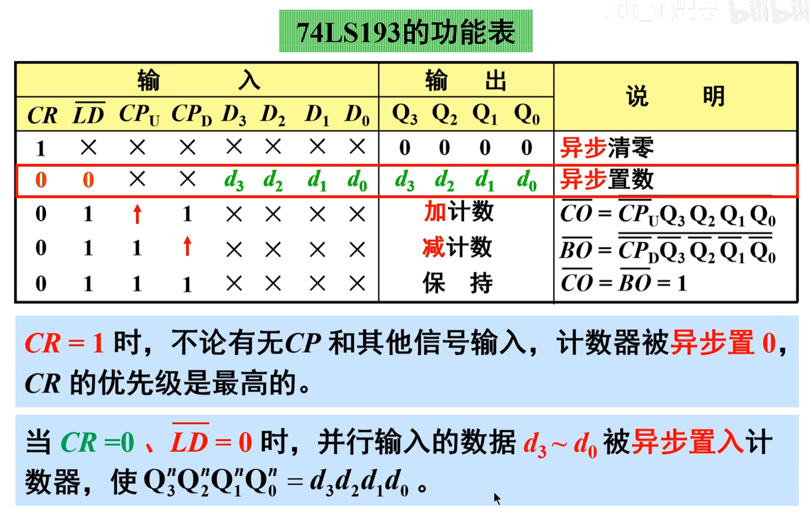

| 管脚标识          | 英文全称 / 功能定义            | 电平有效性 | 核心作用                                                     |
| ----------------- | ------------------------------ | ---------- | ------------------------------------------------------------ |
| CR                | Clear (清零端)                 | 高电平有效 | 异步清零：CR=1 时，立即将 Q0~Q3 置 0（无需 CP）              |
| CPU               | Count Up Pulse (加法时钟端)    | 上升沿有效 | 加法触发：仅当 CPU 上升沿时执行加法计数（需 CPD=1）          |
| CPD               | Count Down Pulse (减法时钟端)  | 上升沿有效 | 减法触发：仅当 CPD 上升沿时执行减法计数（需 CPU=1）          |
| \(\overline{LD}\) | Load (置数控制端)              | 低电平有效 | 异步置数：\(\overline{LD}=0\)时，立即将 D0~D3 送入 Q0~Q3（无需 CP） |
| D0~D3             | Parallel Data (并行数据输入端) | -          | 预置数据端：预置任意 4 位二进制数                            |
| \(\overline{CO}\) | Carry Output (进位输出端)      | 低电平有效 | 加法满标识：Q0~Q3=1111 且 CPU 上升沿时，\(\overline{CO}=0\)（级联用） |
| \(\overline{BO}\) | Borrow Output (借位输出端)     | 低电平有效 | 减法满标识：Q0~Q3=0000 且 CPD 上升沿时，\(\overline{BO}=0\)（级联用） |
| Q0~Q3             | State Output (状态输出端)      | -          | 输出当前计数状态（Q0 为 LSB，Q3 为 MSB）                     |

#### 2.2.3 功能表解析

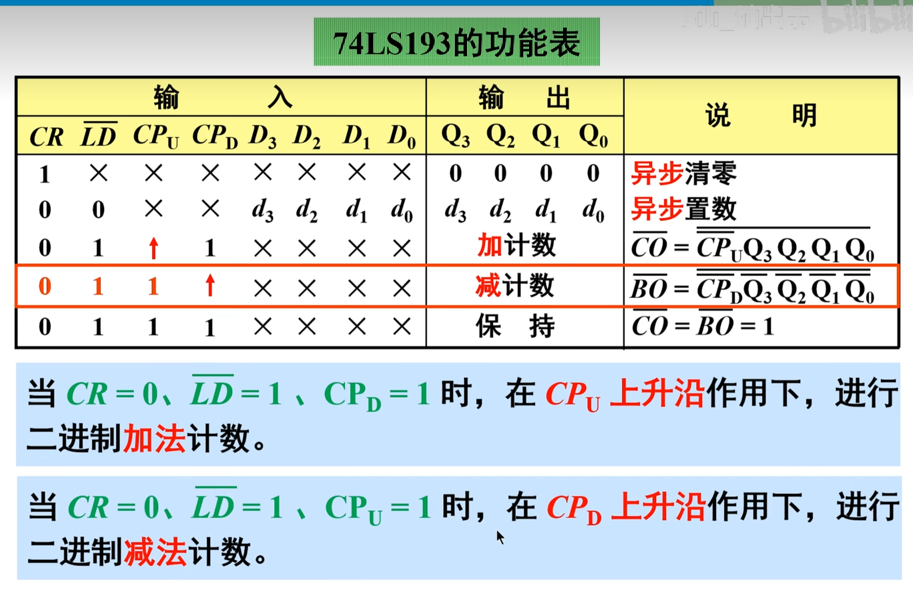

| CR   | \(\overline{LD}\) | CPU  | CPD  | D3~D0 | Q3~Q0   | \(\overline{CO}\)          | \(\overline{BO}\)                     | 功能说明                                                     |
| ---- | ----------------- | ---- | ---- | ----- | ------- | -------------------------- | ------------------------------------- | ------------------------------------------------------------ |
| 1    | X                 | X    | X    | X     | 0000    | 1                          | 1                                     | 异步清零（CR=1 立即置 0）                                    |
| 0    | 0                 | X    | X    | D3~D0 | D3~D0   | 1                          | 1                                     | 异步置数（\(\overline{LD}=0\)立即送数）                      |
| 0    | 1                 | ↑    | 1    | X     | Q3~Q0+1 | \(\overline{Q3·Q2·Q1·Q0}\) | 1                                     | 同步加法计数（CPU 上升沿 + 1，满 1111 时\(\overline{CO}=0\)） |
| 0    | 1                 | 1    | ↑    | X     | Q3~Q0-1 | 1                          | \(\overline{\overline{Q3·Q2·Q1·Q0}}\) | 同步减法计数（CPD 上升沿 - 1，减到 0000 时\(\overline{BO}=0\)） |
| 0    | 1                 | 1    | 1    | X     | 保持    | 1                          | 1                                     | 保持状态（无时钟触发，输出不变）                             |

#### 2.2.4 仿真实例（视频中操作与现象）

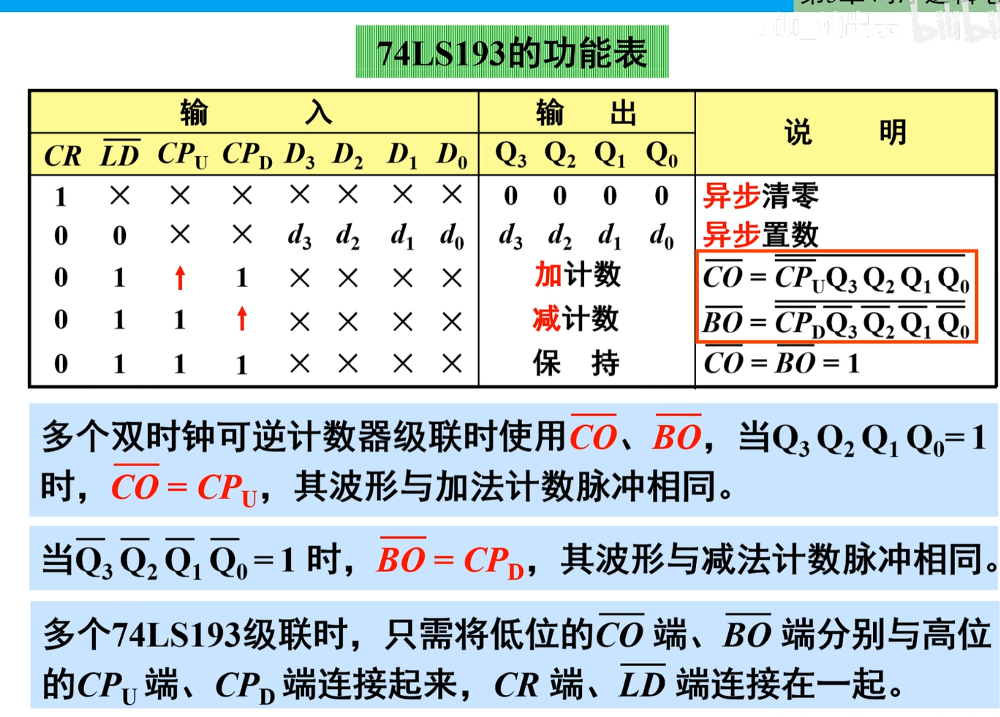

1. **电路搭建**：Q0~Q3 接状态灯，\(\overline{CO}\)、\(\overline{BO}\)接指示灯，CR、\(\overline{LD}\)接拨码开关，D0~D3 设为 0011（预置 3），CPU/CPD 分别接手动脉冲（按键 C 控制 CPU，按键 D 控制 CPD）。

1. **异步清零**

- 操作：计数至 0110（6）时，拨 CR=1

- 现象：Q0~Q3 立即变为 0000，无需等 CPU/CPD；拨回 CR=0，可恢复计数。

1. **加法计数**

	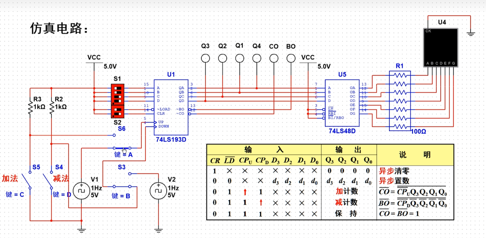

- 操作：CR=0、\(\overline{LD}=1\)、CPD=1（拨码置 1），按按键 C（触发 CPU 上升沿）

- 现象：每按一次 C，计数 + 1（0→1→…→15）；当计数到 1111 时，\(\overline{CO}\)灯灭（低电平有效），下一次按 C 时归零，\(\overline{CO}\)灯亮。

1. **减法计数**

- 操作：CR=0、\(\overline{LD}=1\)、CPU=1（拨码置 1），按按键 D（触发 CPD 上升沿）

- 现象：每按一次 D，计数 - 1（15→14→…→0）；当计数到 0000 时，\(\overline{BO}\)灯灭（低电平有效），下一次按 D 时变为 1111，\(\overline{BO}\)灯亮。

1. **异步置数**

- 操作：计数至 0101（5）时，拨\(\overline{LD}=0\)（D0~D3=0011）

- 现象：Q0~Q3 立即变为 0011（3），无需等 CPU/CPD；拨回\(\overline{LD}=1\)，按 C/D 可继续加减计数。

1. **多芯片级联（视频提及用法）**

- 原理：将低位芯片的\(\overline{CO}\)接高位芯片的 CPU（加法级联），低位的\(\overline{BO}\)接高位的 CPD（减法级联），实现大于 16 进制的计数器（如 2 片级联为 256 进制）。

- 示例：2 片 74LS193 级联，低位计数 0~15，满 15（1111）时\(\overline{CO}=0\)，触发高位 CPU 上升沿，高位 + 1；低位减到 0（0000）时\(\overline{BO}=0\)，触发高位 CPD 上升沿，高位 - 1。


# 二进制异步计数器

## 1. 前置回顾：同步计数器核心内容

- **同步计数器设计方法**：

1. 按时序逻辑电路设计步骤（复杂）；

1. 按状态表计数规律快速设计（常用 T 触发器，修改时钟方程可变为 T' 触发器，实现加 / 减 / 可逆计数）；

- **常见同步集成芯片**：

- 加法计数器：74LS161、74LS163；

- 可逆计数器：74LS191（单时钟）、74LS193（双时钟）；

- **异步与同步的核心区别**：异步计数器的时钟脉冲并非全部接在一起，需为每个触发器单独选择时钟信号。

## 2. 二进制异步加法计数器

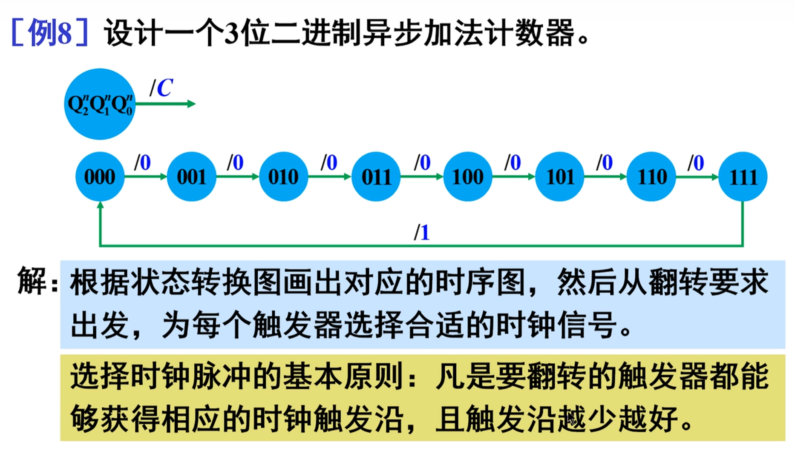

视频核心内容：以**3 位二进制异步加法计数器（即八进制计数器）** 为核心例题，分步骤讲解设计过程，并扩展不同触发器（JK、D）和触发边沿（下降沿、上升沿）的实现。

### 2.1 3 位二进制异步加法计数器设计通用步骤（时序逻辑电路设计法）

#### 步骤 1：确定状态表与状态转移图

- **计数范围**：3 位二进制数，状态为Q2Q1Q0，从000到111循环，共 8 个有效状态（无无效状态，电路可自启动）；

- **进位输出 C**：当状态为111（最大数），下一个状态回到000时，产生进位C=1；其余状态C=0；

- **状态转移顺序**：

000→001→010→011→100→101→110→111→000（C=1）

#### 步骤 2：选择触发器类型

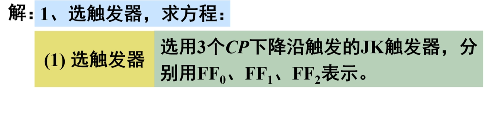

视频中优先选择**下降沿触发的 JK 触发器**（后续扩展上升沿 JK、下降沿 D、上升沿 D 触发器），共需 3 个触发器（FF0：Q0，FF1：Q1，FF2：Q2）。

#### 步骤 3：推导关键方程（输出方程、时钟方程、状态方程、驱动方程）

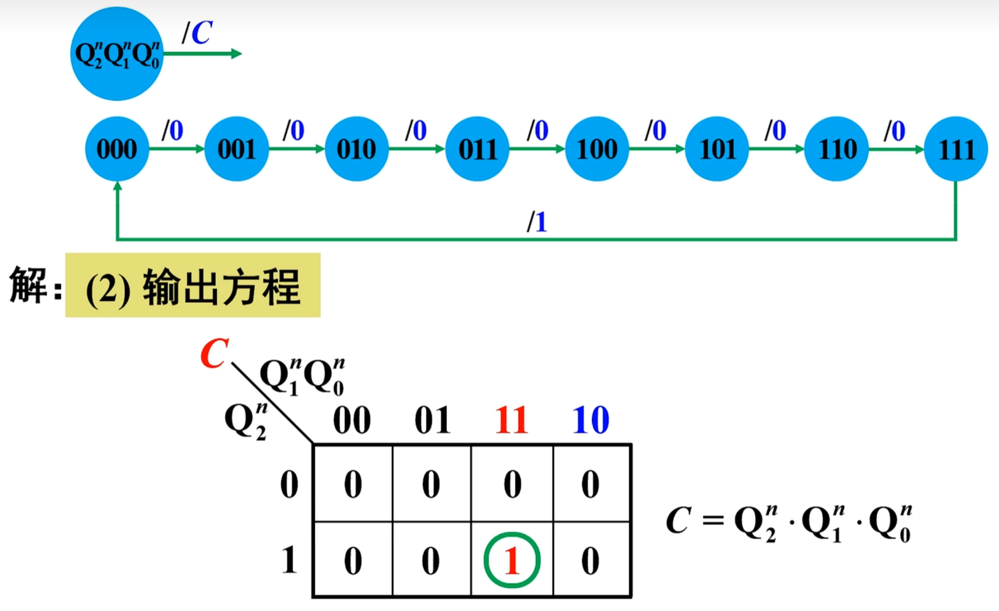

##### （1）输出方程（进位 C）

- 依据状态表：仅当Q2=1、Q1=1、Q0=1时，C=1；

- 方程：

```
C = Q2 · Q1 · Q0 （“·”表示逻辑与）
```

##### （2）时钟方程（核心：异步计数器的关键）

- **时钟选择原则**：触发器翻转时必须有触发脉冲，且触发源（脉冲）越少越好（避免冗余）；

- **推导方法**：先画时序图，再根据 Q0/Q1/Q2 的翻转时刻确定时钟源：

| 触发器    | 翻转时刻（CP 脉冲序号）  | 可选时钟源                          | 最优选择（触发源最少） | 时钟方程           |
| --------- | ------------------------ | ----------------------------------- | ---------------------- | ------------------ |
| FF0（Q0） | 每 1 个 CP 下降沿（1-8） | 外部 CP                             | 外部 CP                | CP0 = CP（下降沿） |
| FF1（Q1） | CP2、4、6、8 下降沿      | 外部 CP、Q0（下降沿）               | Q0（仅 4 个下降沿）    | CP1 = Q0（下降沿） |
| FF2（Q2） | CP4、8 下降沿            | 外部 CP、Q0（下降沿）、Q1（下降沿） | Q1（仅 2 个下降沿）    | CP2 = Q1（下降沿） |

##### （3）状态方程

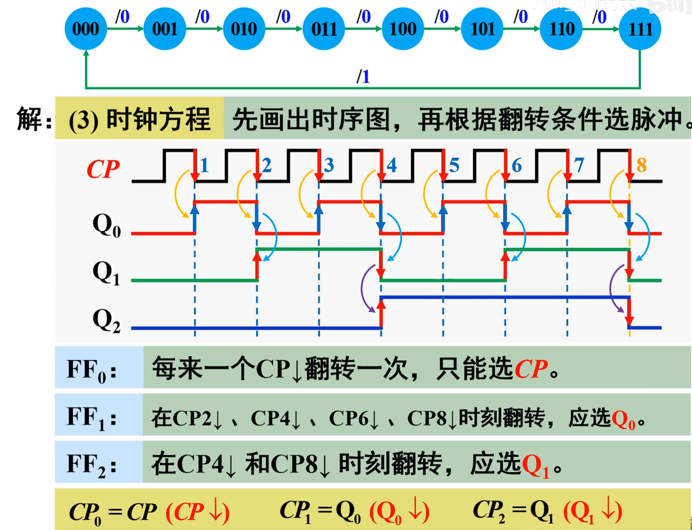

- **方法**：先画次态卡诺图，将 “无时钟信号的次态” 设为约束项（X），再化简；

- **次态卡诺图拆分**：将 3 位次态Q2ⁿ⁺¹Q1ⁿ⁺¹Q0ⁿ⁺¹拆分为 Q2ⁿ⁺¹、Q1ⁿ⁺¹、Q0ⁿ⁺¹ 三个独立卡诺图；

- Q0ⁿ⁺¹：FF0 受所有 CP 控制，无约束项，化简得Q0ⁿ⁺¹ = Q0ⁿ（“ⁿ” 表示现态，“” 表示非）；

- Q1ⁿ⁺¹：FF1 仅受 Q0 下降沿控制，其余时刻为约束项，化简得Q1ⁿ⁺¹ = Q1ⁿ；

- Q2ⁿ⁺¹：FF2 仅受 Q1 下降沿控制，其余时刻为约束项，化简得Q2ⁿ⁺¹ = Q2ⁿ；

- **最终状态方程**：

```
Q0ⁿ⁺¹ = Q0ⁿ （CP0=CP下降沿时有效）
Q1ⁿ⁺¹ = Q1ⁿ （CP1=Q0下降沿时有效）
Q2ⁿ⁺¹ = Q2ⁿ （CP2=Q1下降沿时有效）
```

##### （4）驱动方程

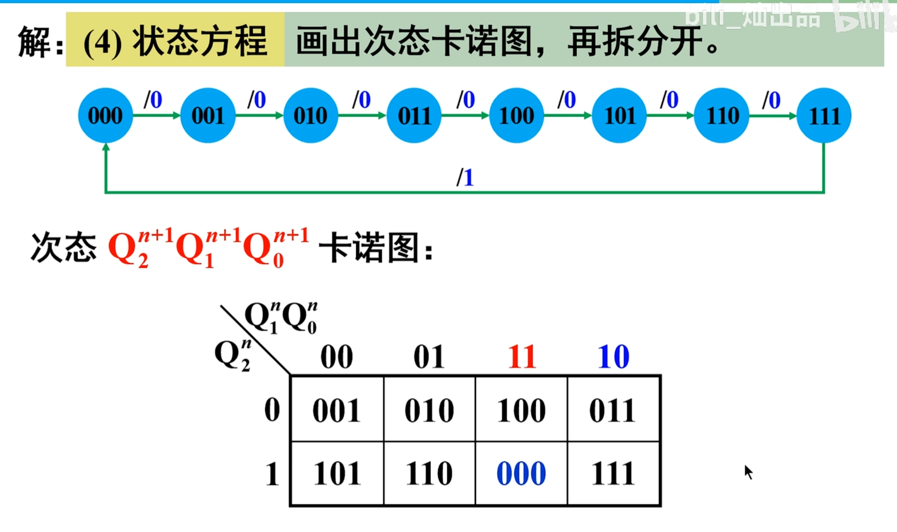

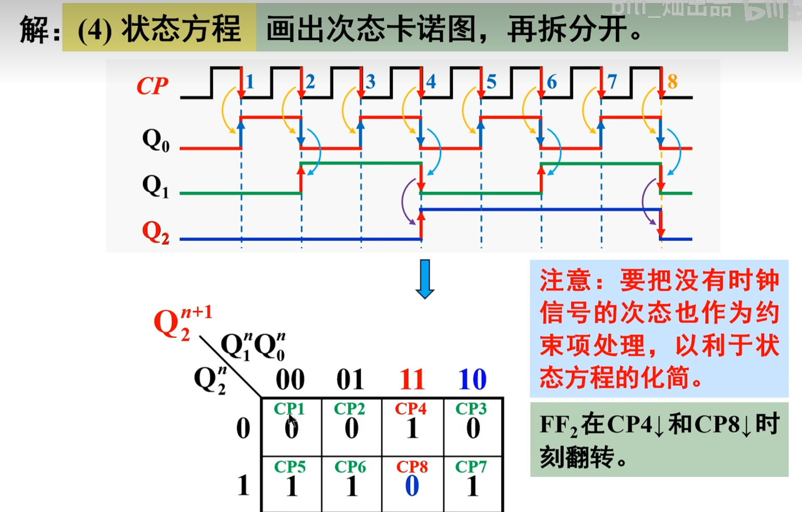

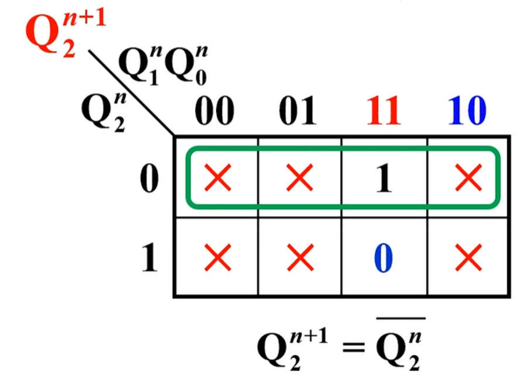


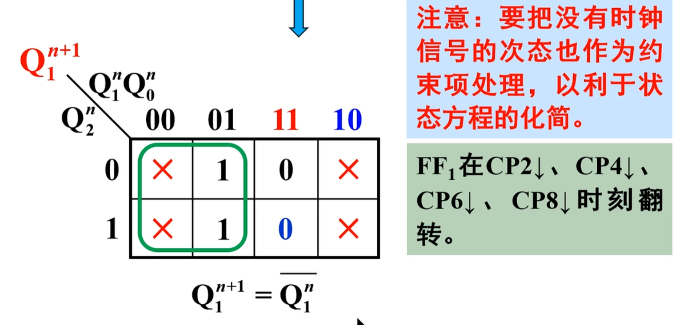

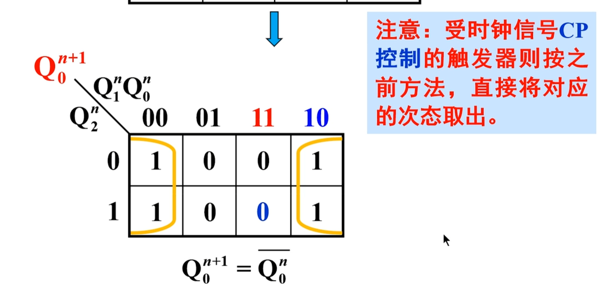


- JK 触发器特性方程：Qⁿ⁺¹ = J·Qⁿ + K·Qⁿ；

- 对比状态方程（Qⁿ⁺¹ = Qⁿ），需使 JK 触发器变为**T' 触发器**（翻转触发器），即J=1、K=1；

**驱动方程**：


- 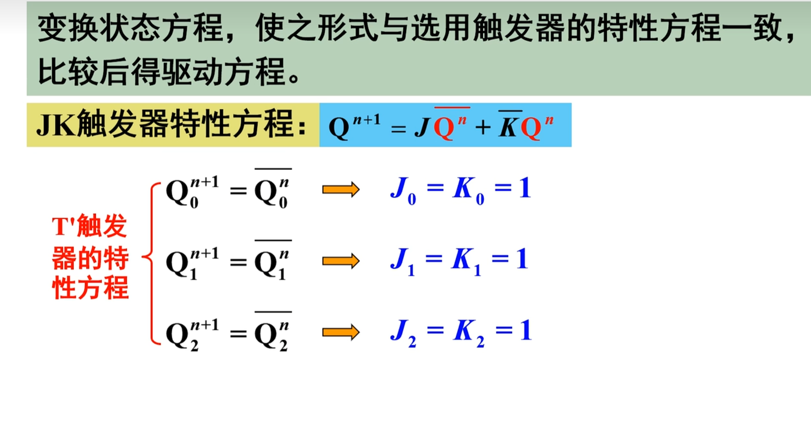

```
J0=K0=1，J1=K1=1，J2=K2=1
```

#### 步骤 4：绘制逻辑电路

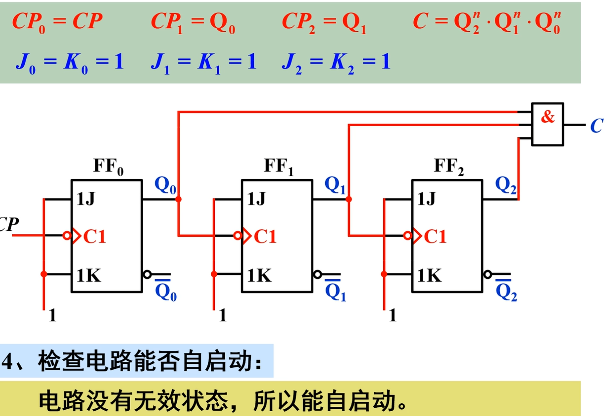

- 3 个下降沿 JK 触发器：CP0 接外部 CP，CP1 接 FF0 的 Q0，CP2 接 FF1 的 Q1；

- 驱动端：J0=K0=J1=K1=J2=K2=1（接高电平）；

- 进位输出：Q2、Q1、Q0 接入三输入与门，输出为 C。

### 2.2 不同触发器类型的扩展实现

视频中基于 3 位异步加法计数器，扩展 4 种触发器组合，核心差异在**时钟方程**和**驱动方程**，状态方程和输出方程不变。

#### （1）上升沿触发的 JK 触发器

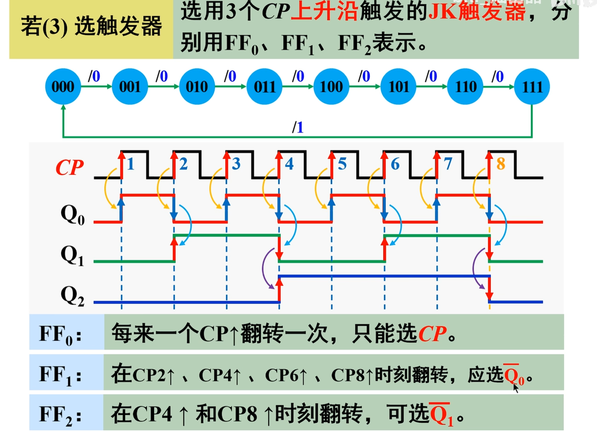


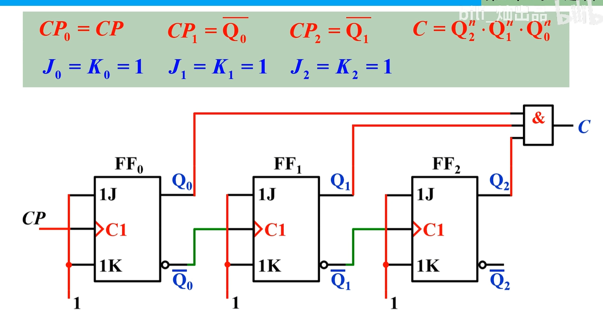

- **时钟选择差异**：上升沿触发时，原变量（Q0/Q1）的下降沿无效，需选**反变量（Q0、Q1）的上升沿**（触发源最少）；

- **时钟方程**：

```
CP0 = CP（上升沿），CP1 = Q0（上升沿），CP2 = Q1（上升沿）
```

- **驱动方程**：仍为J0=K0=J1=K1=J2=K2=1（T' 触发器）；

- **电路差异**：CP1 接 FF0 的 Q0，CP2 接 FF1 的 Q1（反变量输出端）。

#### （2）下降沿触发的 D 触发器

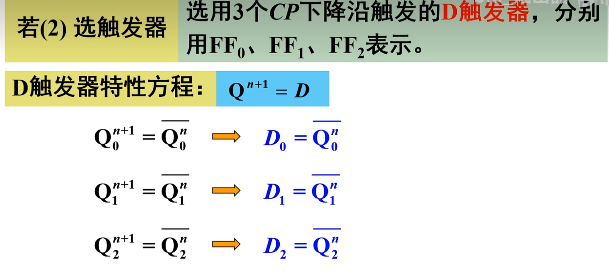

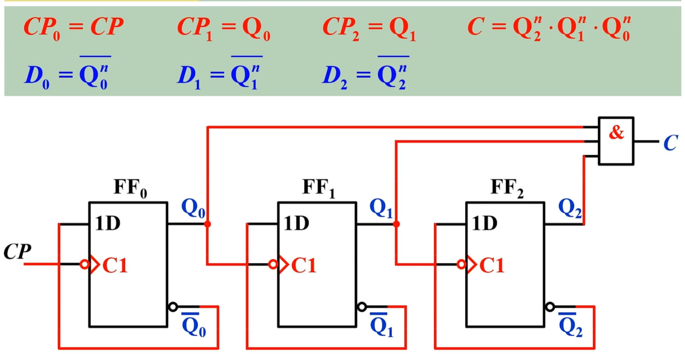

- D 触发器特性方程：Qⁿ⁺¹ = D；

- 对比状态方程（Qⁿ⁺¹ = Qⁿ），驱动方程为D = Qⁿ；

- **时钟方程**：与下降沿 JK 触发器一致（CP0=CP，CP1=Q0，CP2=Q1，均为下降沿）；

- **电路差异**：每个 D 触发器的 D 端接自身 Q 端（反变量反馈）。

#### （3）上升沿触发的 D 触发器

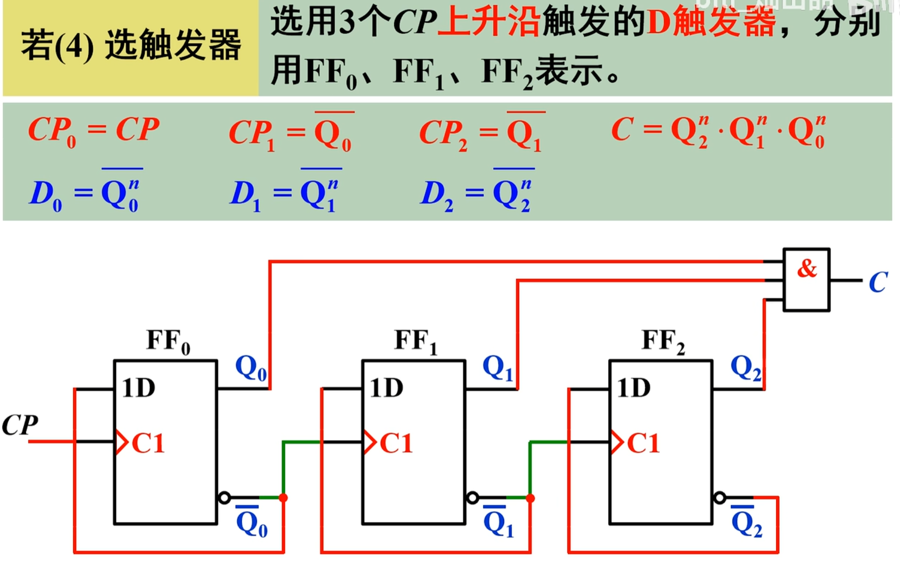

- **时钟方程**：与上升沿 JK 触发器一致（CP0=CP，CP1=Q0，CP2=Q1，均为上升沿）；

- **驱动方程**：D0=Q0，D1=Q1，D2=Q2；

- **电路差异**：CP1 接 FF0 的 Q0，CP2 接 FF1 的 Q1，D 端接自身 Q 端。

### 2.3 加法计数器仿真结论

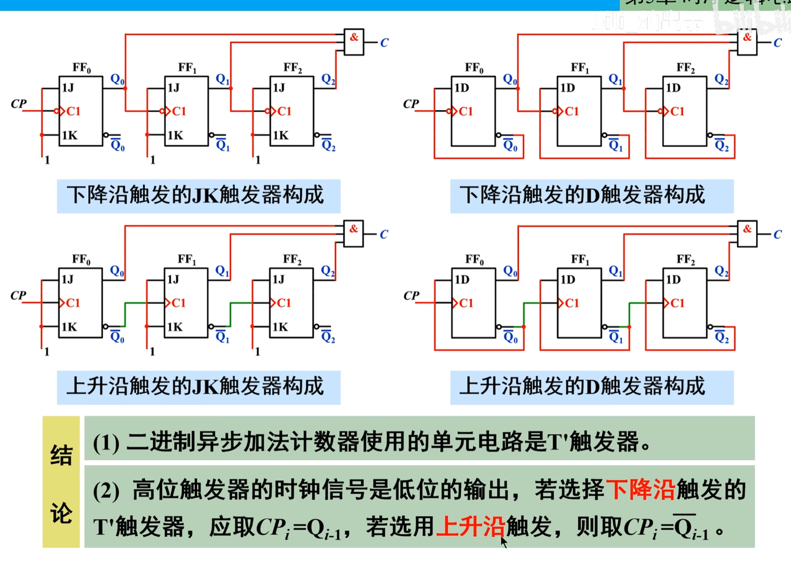

视频展示 2 种典型仿真电路：

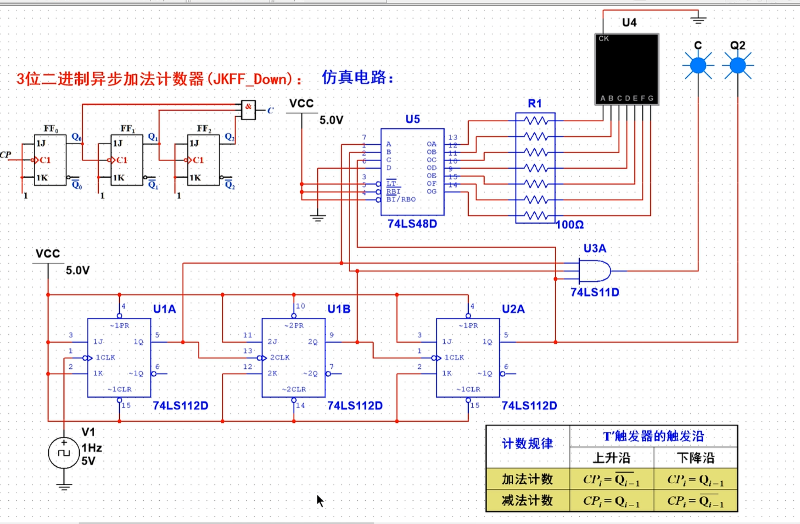

1. **下降沿 JK 触发器电路**：计数从 0→1→2→…→7→0 循环，C 在 7→0 时输出 1，且 C 的下降沿与 Q2 的下降沿同步（可将 Q2 作为进位标志）；

1. **上升沿 D 触发器电路**：计数规律与上述一致，C 的下降沿仍与 Q2 的下降沿同步，无差异。

## 3. 二进制异步减法计数器

视频核心例题：**3 位二进制异步减法计数器**，设计步骤与加法类似，核心差异在状态转移、输出（借位）和时钟方程。

### 3.1 3 位二进制异步减法计数器设计步骤

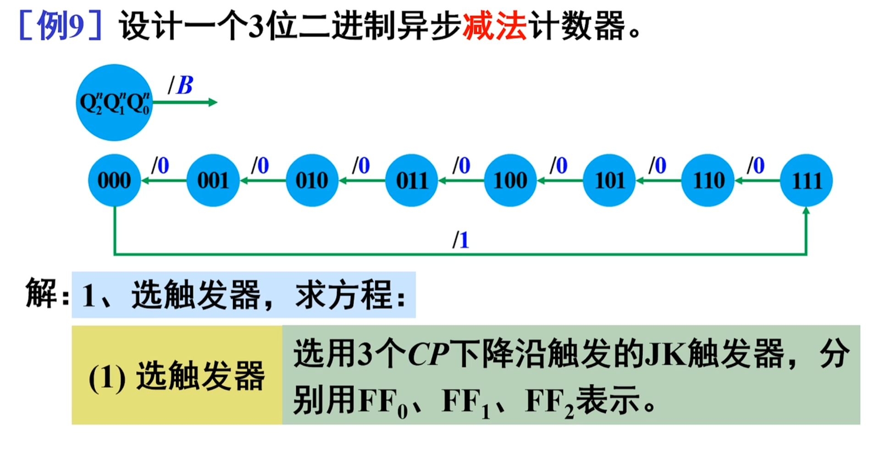

#### 步骤 1：状态表与状态转移图

- **计数范围**：状态Q2Q1Q0从000到111循环，共 8 个有效状态（可自启动）；

- **借位输出 B**：当状态为000（最小数），下一个状态回到111时，产生借位B=1；其余状态B=0；

- **状态转移顺序**：

000→111（B=1）→110→101→100→011→010→001→000

#### 步骤 2：选择触发器类型

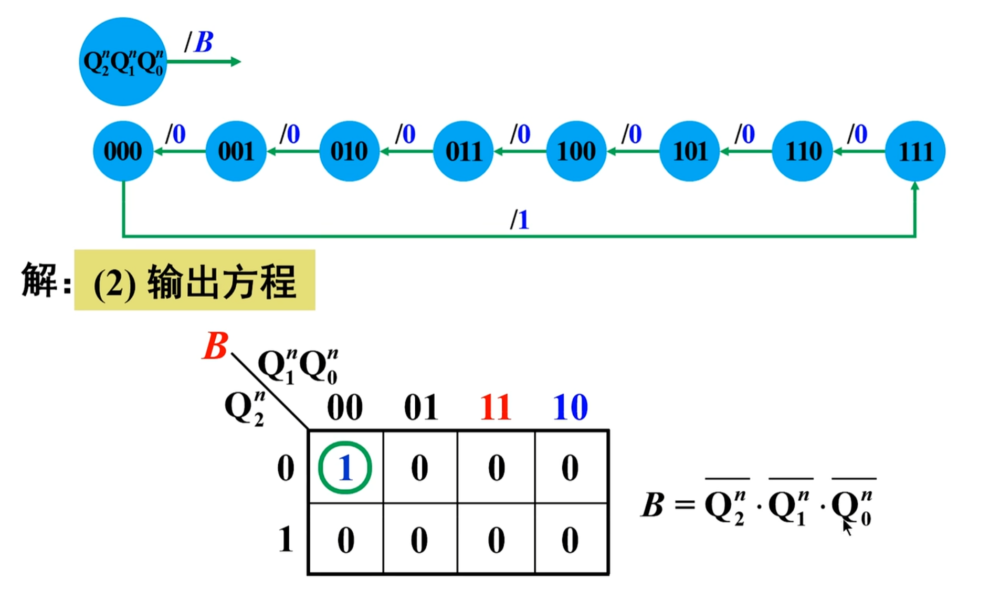

优先选择**下降沿触发的 JK 触发器**，后续扩展其他类型。

#### 步骤 3：推导关键方程

##### （1）输出方程（借位 B）

- 依据状态表：仅当Q2=0、Q1=0、Q0=0时，B=1；

- 方程：

```
B = Q2 · Q1 · Q0
```

##### （2）时钟方程（核心差异点）

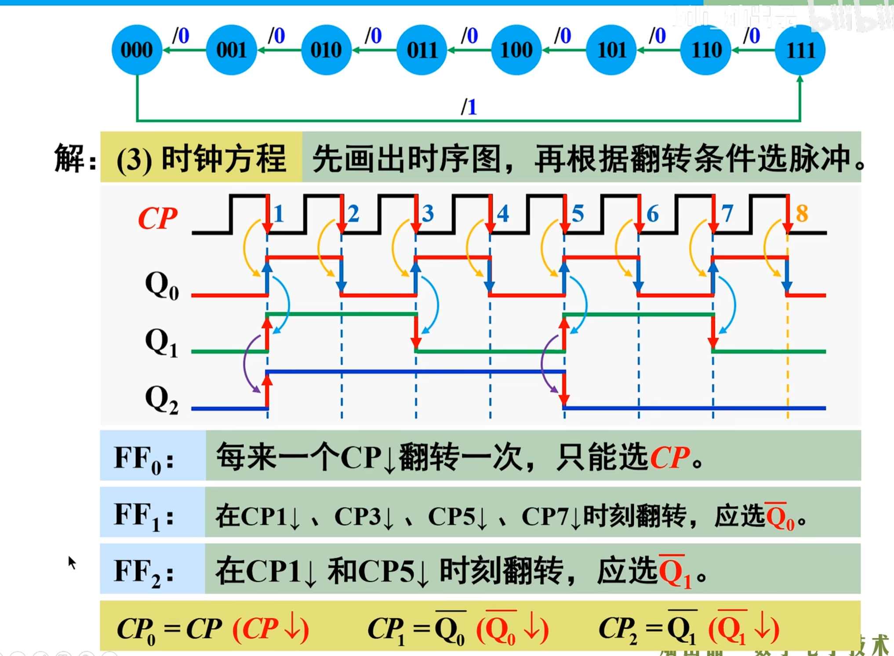

- 时序图分析：Q0 每 1 个 CP 下降沿翻转，Q1 在 CP1、3、5、7 下降沿翻转，Q2 在 CP1、5 下降沿翻转；

- **最优时钟选择**（下降沿 JK 触发器）：

| 触发器    | 翻转时刻             | 时钟源                          | 时钟方程           |
| --------- | -------------------- | ------------------------------- | ------------------ |
| FF0（Q0） | 1-8 CP 下降沿        | 外部 CP                         | CP0 = CP（下降沿） |
| FF1（Q1） | 1、3、5、7 CP 下降沿 | Q0（上升沿→反变量 Q0 的下降沿） | CP1 = Q0（下降沿） |
| FF2（Q2） | 1、5 CP 下降沿       | Q1（上升沿→反变量 Q1 的下降沿） | CP2 = Q1（下降沿） |

##### （3）状态方程

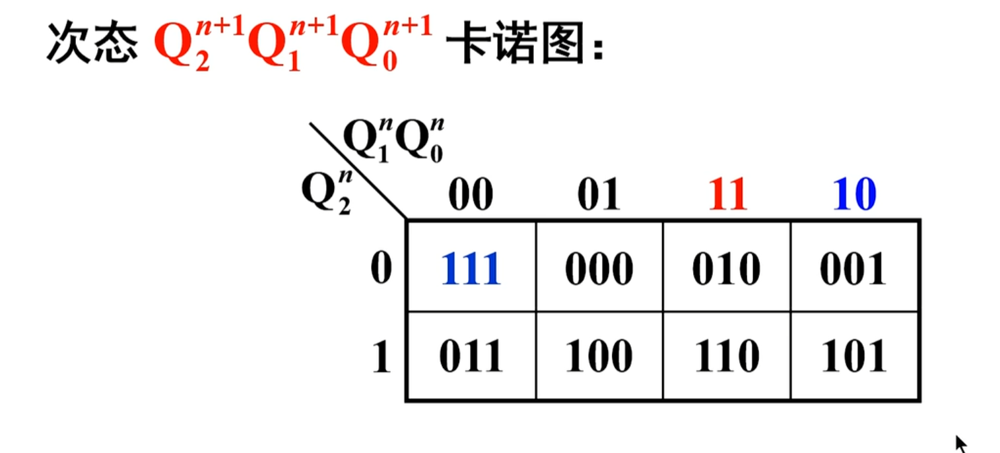

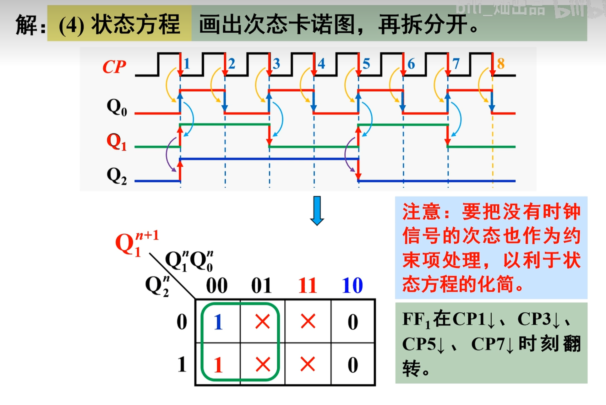


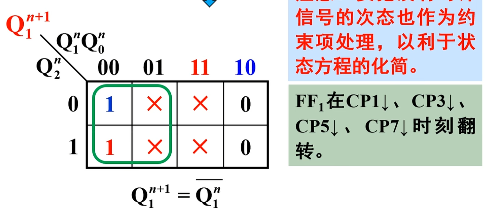


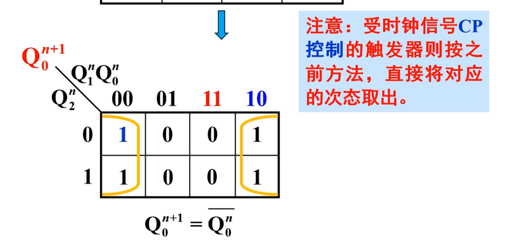


- 方法同加法：次态卡诺图含约束项，化简后仍为：

```
Q0ⁿ⁺¹ = Q0ⁿ，Q1ⁿ⁺¹ = Q1ⁿ，Q2ⁿ⁺¹ = Q2ⁿ
```

##### （4）驱动方程

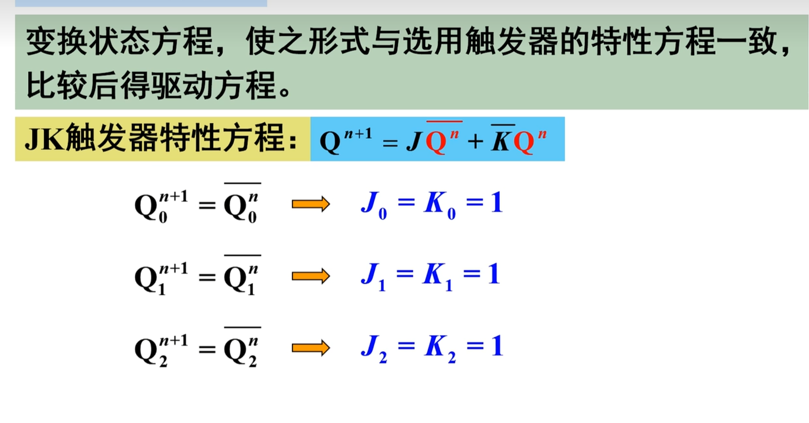

- JK 触发器仍需变为 T' 触发器，驱动方程：J0=K0=J1=K1=J2=K2=1；

- D 触发器驱动方程：D0=Q0，D1=Q1，D2=Q2。

#### 步骤 4：绘制逻辑电路

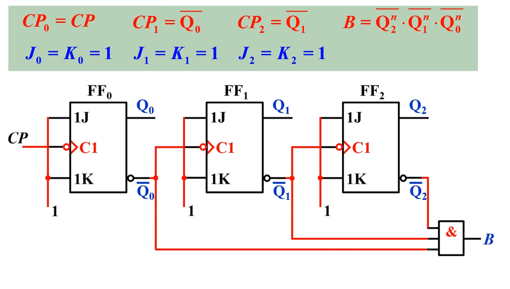

- 下降沿 JK 触发器：CP0 接外部 CP，CP1 接 FF0 的 Q0，CP2 接 FF1 的 Q1；

- 借位输出：Q2、Q1、Q0 接入三输入与门，输出为 B。

### 3.2 不同触发器类型的扩展实现

#### （1）上升沿触发的 JK 触发器

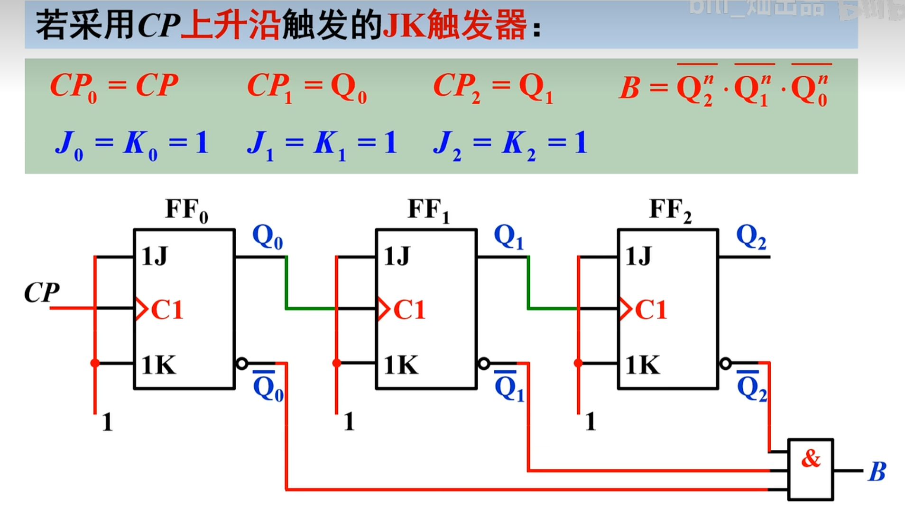

- **时钟方程**：CP0=CP（上升沿），CP1=Q0（上升沿），CP2=Q1（上升沿）（原变量输出端）；

- **驱动方程**：J0=K0=J1=K1=J2=K2=1。

#### （2）下降沿 / 上升沿触发的 D 触发器

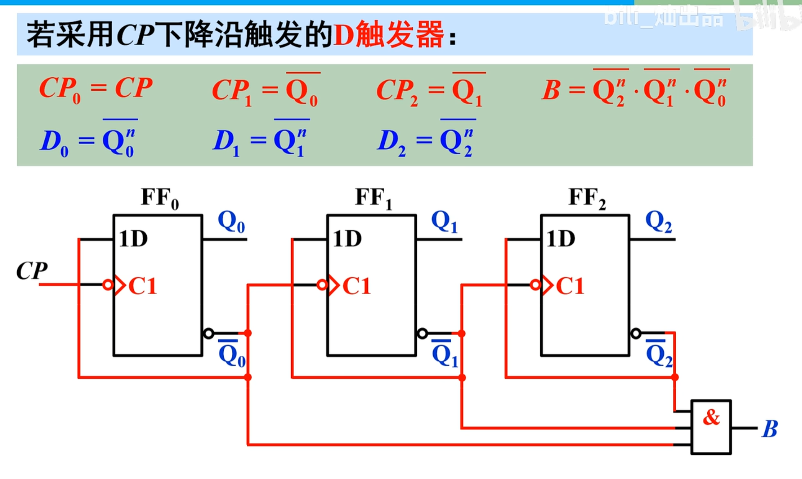


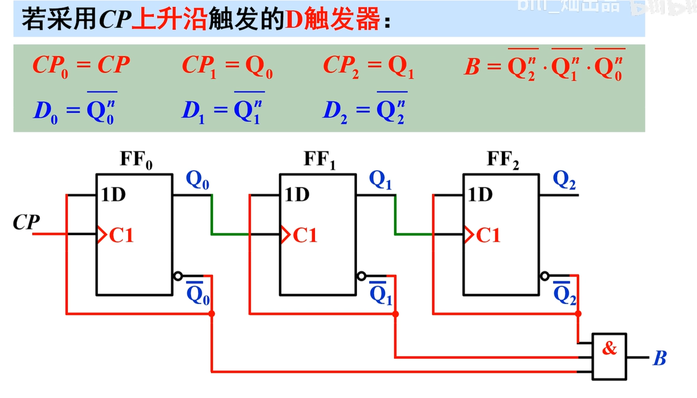

- 下降沿 D：时钟方程同下降沿 JK（CP1=Q0，CP2=Q1），驱动方程D=Q；

- 上升沿 D：时钟方程同上升沿 JK（CP1=Q0，CP2=Q1），驱动方程D=Q。

### 3.3 减法计数器仿真结论

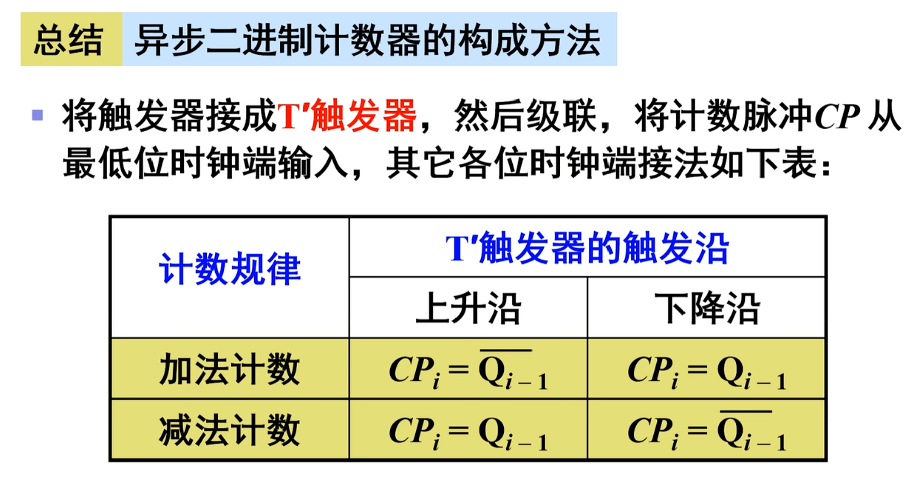

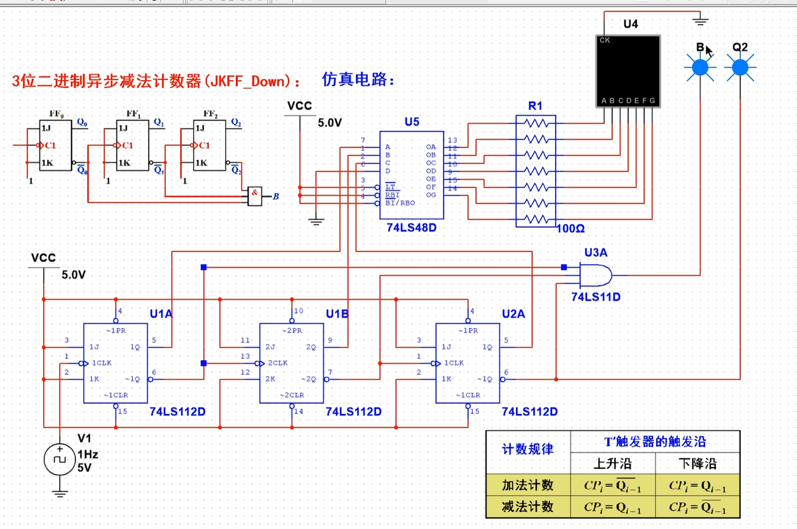

- **下降沿 JK 触发器电路**：计数从 0→7→6→…→1→0 循环，B 在 0→7 时输出 1，B 的下降沿与 Q2 的下降沿同步（可将 Q2 作为借位标志）；

- **上升沿 D 触发器电路**：计数规律一致，借位与 Q2 边沿同步。

## 4. 核心规律总结（视频重点归纳）

### 4.1 触发器类型与工作模式

- 无论加法 / 减法、上升沿 / 下降沿，异步计数器的触发器均需工作在**T' 模式**（翻转模式）：

- JK 触发器：J=K=1；

- D 触发器：D=Q。

### 4.2 时钟信号连接规律（关键区分点）

| 计数器类型 | 触发边沿 | 高位触发器时钟（CPi）连接    | 示例（CP1/CP2） |
| ---------- | -------- | ---------------------------- | --------------- |
| 加法计数器 | 下降沿   | 低位触发器原变量输出（Qi-1） | CP1=Q0，CP2=Q1  |
| 加法计数器 | 上升沿   | 低位触发器反变量输出（Qi-1） | CP1=Q0，CP2=Q1  |
| 减法计数器 | 下降沿   | 低位触发器反变量输出（Qi-1） | CP1=Q0，CP2=Q1  |
| 减法计数器 | 上升沿   | 低位触发器原变量输出（Qi-1） | CP1=Q0，CP2=Q1  |

### 4.3 进位 / 借位标志

- 异步计数器无专门集成进位 / 借位端，可使用**最高位触发器输出（Q2 或 Q2）** 作为标志：

- 加法：Q2 的下降沿对应进位；

- 减法：Q2 的下降沿对应借位。

### 4.4 自启动性

- 3 位二进制异步计数器（加 / 减）使用全部 8 个状态（无无效状态），电路**均可自启动**。


# 集成二进制异步计数器（74LS197）

## 一、芯片基本信息

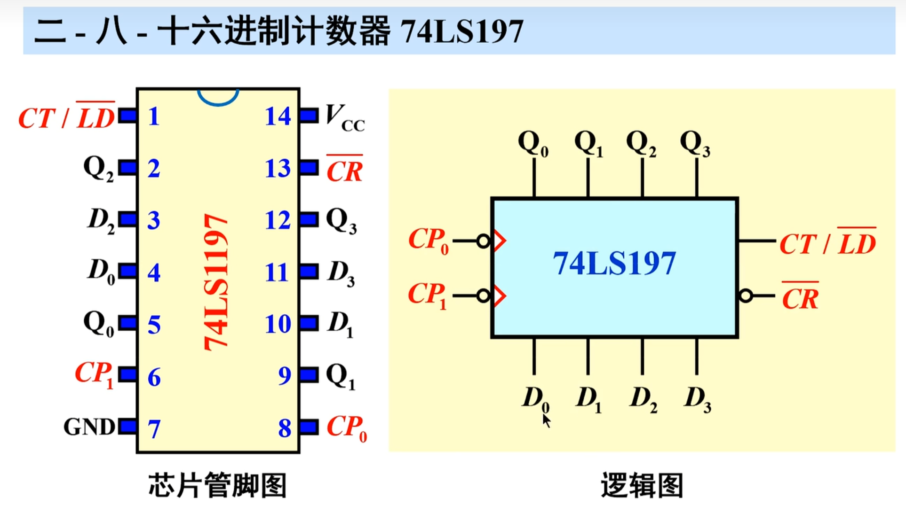

1. **型号与类型**：74LS197，集成二进制异步计数器，别名“二-八-十六进制计数器”（可灵活构造二进制、八进制、十六进制计数模式）
2. **管脚数量**：14个管脚（区别于同步计数器如74LS161、74LS191、74LS193的16个管脚）
3. **触发方式**：时钟信号（CP）为**下降沿触发**（管脚符号特征：“圈+三角”，表示低电平有效触发沿）

## 二、芯片内部结构

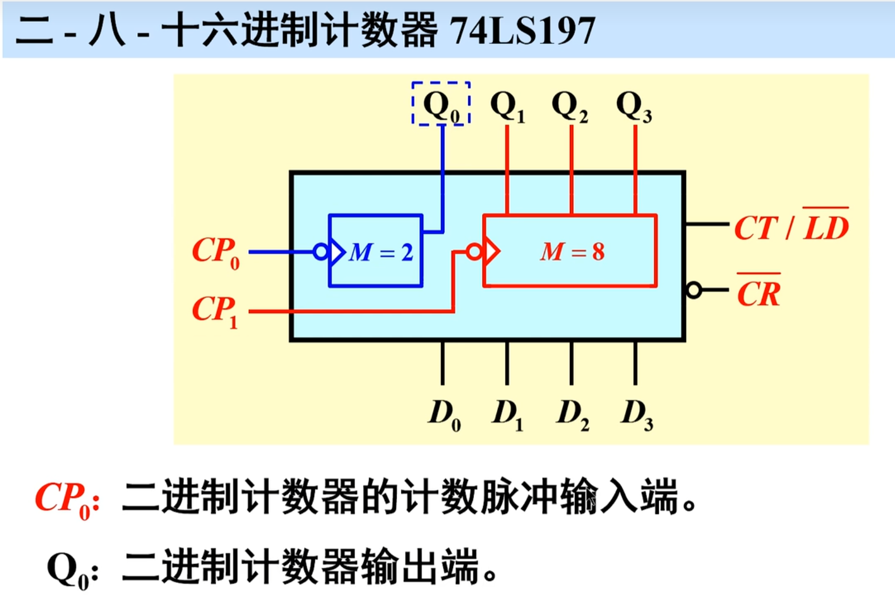

- 内含**两个独立的异步计数器模块**，无默认电气连接，需通过外部接线实现功能扩展：

1. **M=2 计数器**：二进制计数器（模 2），对应时钟端 CP0、输出端 Q0

1. **M=8 计数器**：八进制计数器（模 8），对应时钟端 CP1、输出端 Q1~Q3（Q3 为高位，Q1 为低位）

- “M” 表示计数器的 “模”（即计数循环周期，如 M=2 表示每 2 个脉冲完成一次循环）

## 三、关键管脚功能详解

| 管脚名称             | 功能描述                                                     | 对应内部模块             |
| -------------------- | ------------------------------------------------------------ | ------------------------ |
| D0~D3                | 并行数据输入端，用于 “置数” 功能（将预设数据送入计数器）     | 整体计数器               |
| Q0~Q3                | 状态输出端：- Q0：M=2（二进制）计数器的输出- Q1~Q3：M=8（八进制）计数器的输出 | M=2 模块、M=8 模块       |
| CP0                  | M=2（二进制）计数器的时钟输入端，下降沿触发计数              | M=2 模块                 |
| CP1                  | M=8（八进制）计数器的时钟输入端，下降沿触发计数              | M=8 模块                 |
| \(\overline{CR}\)    | 异步清零端（低电平有效，符号 “横线” 表示低电平有效）         | 整体计数器（优先级最高） |
| \(\overline{CT/LD}\) | 计数 / 置数控制端（低电平有效）：- 低电平：置数功能- 高电平：计数功能 | 整体计数器               |

## 四、控制端功能与优先级

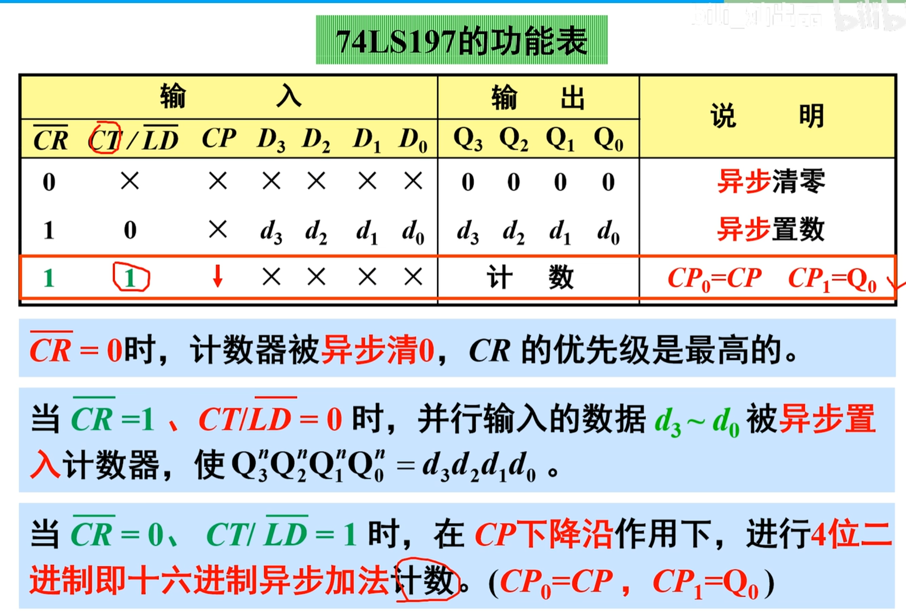

1. **优先级排序**：\(\overline{CR}\)（清零） > \(\overline{CT/LD}\)（置数 / 计数）

1. 各控制端详细功能：

- \(\overline{CR}\)**（异步清零）**：

- 功能：当\(\overline{CR}=0\)（低电平）时，无论 CP 是否有脉冲、\(\overline{CT/LD}\)状态如何，强制将输出端 Q0~Q3 全部置 0

- 特点：“异步” 操作，无需等待 CP 触发

- \(\overline{CT/LD}\)**（计数 / 置数控制）**：

- 仅当\(\overline{CR}=1\)（清零端无效）时生效：

- 置数功能（\(\overline{CT/LD}=0\)）：异步置数，将 D0~D3 的并行数据直接送入 Q0~Q3，无需 CP 触发

- 计数功能（\(\overline{CT/LD}=1\)）：计数器按预设进制（二 / 八 / 十六），在 CP 下降沿触发计数

## 五、芯片功能表（视频核心内容）

| \(\overline{CR}\)（清零） | \(\overline{CT/LD}\)（计数 / 置数） | CP（时钟）  | D0~D3（并行数据） | Q0~Q3（输出）    | 功能说明                     |
| ------------------------- | ----------------------------------- | ----------- | ----------------- | ---------------- | ---------------------------- |
| 0                         | X（任意）                           | X（任意）   | X（任意）         | 0000             | 异步清零（优先级最高）       |
| 1                         | 0                                   | X（任意）   | D0~D3             | D0~D3            | 异步置数                     |
| 1                         | 1                                   | ↓（下降沿） | X（任意）         | 按进制计数（+1） | 下降沿触发计数（见第六部分） |
| 1                         | 1                                   | ↑（上升沿） | X（任意）         | 保持原状态       | 非触发沿，计数不生效         |

- 注：“X” 表示 “无关项”，即该输入信号不影响输出结果

## 六、不同进制计数器的构造

### 1. 二进制计数器（M=2）

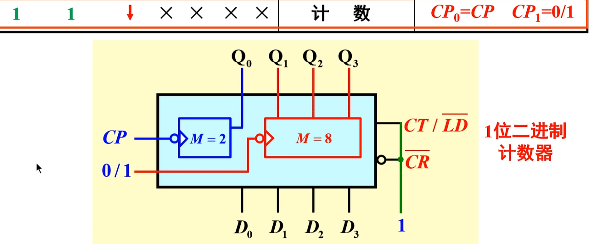

- **构造原理**：仅使用内部 M=2（二进制）模块，M=8 模块无时钟信号（不工作）

- **接线方式**：

- CP（外部时钟）→ CP0（M=2 模块时钟）

- CP1（M=8 模块时钟）→ 悬空（或接高电平 / 低电平，无脉冲输入）

- 控制端：\(\overline{CR}=1\)（清零无效），\(\overline{CT/LD}=1\)（计数模式）

- **计数示例**：

- 输入 CP 脉冲（下降沿）：1→2→3→4→...

- 输出 Q0 变化：0→1→0→1→0→...（Q1~Q3 始终为 0）

- 数码管显示：0→1→0→1→...（因 Q1~Q3=0，仅 Q0 变化）

### 2. 八进制计数器（M=8）

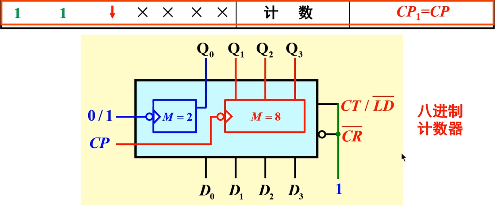

- **构造原理**：仅使用内部 M=8（八进制）模块，M=2 模块无时钟信号（不工作）

- **接线方式**：

- CP（外部时钟）→ CP1（M=8 模块时钟）

- CP0（M=2 模块时钟）→ 悬空（或接高电平 / 低电平，无脉冲输入）

- 控制端：\(\overline{CR}=1\)，\(\overline{CT/LD}=1\)

- **两种显示情况（视频仿真重点）**：

1. **未调整 Q0 时**：

- Q0 始终为 0（M=2 模块不工作），Q1~Q3 按八进制计数：000→001→010→011→100→101→110→111

- 数码管显示：0（0000）→2（0010）→4（0100）→6（0110）→8（1000，伪码）→...（因 Q0=0，显示双数）

1. **调整 Q0 接地后**：

- Q0 固定接地（=0），Q1~Q3 接数码管译码器（74LS48）

- 数码管显示：0（0000）→1（0001）→2（0010）→...→7（0111）→0（0000）（正常八进制循环）

- **计数示例**：

- 输入 CP 脉冲：1→2→...→8→9

- Q1~Q3 变化：000→001→...→111→000

- 数码管（调整后）：0→1→...→7→0

### 3. 十六进制计数器（M=16）

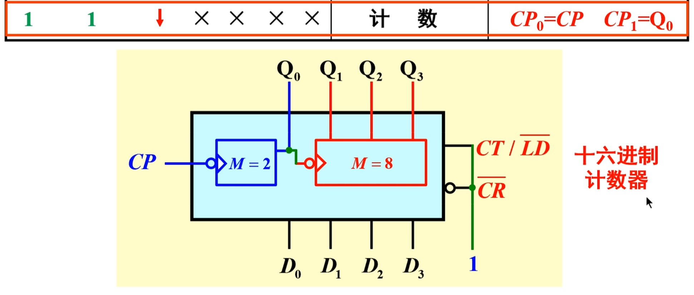

- **构造原理**：级联 M=2（二进制）和 M=8（八进制）模块，总模 = 2×8=16

- **接线方式**：

- CP（外部时钟）→ CP0（M=2 模块时钟）

- Q0（M=2 模块输出）→ CP1（M=8 模块时钟）（利用 Q0 的下降沿触发 M=8 计数）

- 控制端：\(\overline{CR}=1\)，\(\overline{CT/LD}=1\)

- **计数原理**：

- Q0 每 2 个 CP 脉冲产生 1 个下降沿（0→1→0），触发 M=8 模块计数 1 次

- 16 个 CP 脉冲后，M=2 循环 8 次，M=8 循环 2 次，整体完成 1 次十六进制循环

- **计数示例**：

| CP 脉冲数 | Q0（M=2） | Q1~Q3（M=8） | Q0~Q3（总输出） | 数码管显示 |
| --------- | --------- | ------------ | --------------- | ---------- |
| 1         | 1         | 000          | 0001            | 1          |
| 2         | 0         | 001          | 0010            | 2          |
| ...       | ...       | ...          | ...             | ...        |
| 8         | 0         | 100          | 1000            | 8          |
| ...       | ...       | ...          | ...             | ...        |
| 16        | 0         | 000          | 0000            | 0          |

- 最终循环：0000→0001→...→1111→0000（4 位二进制即十六进制）

## 七、视频仿真实验（Proteus 软件，Multisim 无 74LS197）

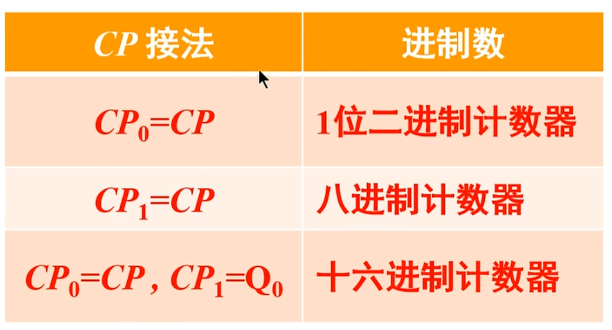

### 1. 仿真电路组成

- 核心芯片：74LS197

- 辅助电路：74LS48（共阴极数码管译码器，控制端接高电平）、共阴极数码管、1Hz 时钟（CP）、电子开关（控制\(\overline{CR}\)、\(\overline{CT/LD}\)、D0~D3）

- 开关逻辑：开关闭合→接地（输出 0），开关打开→接 VCC（输出 1）

### 2. 关键仿真场景（含操作步骤）

#### 场景 1：十六进制计数器（含清零功能）

1. 接线：CP→CP0，Q0→CP1，\(\overline{CR}\)接开关 S1，\(\overline{CT/LD}\)接开关 S2

1. 清零操作：闭合 S1（\(\overline{CR}=0\)），数码管显示 0000（Q0~Q3=0）

1. 计数操作：打开 S1（\(\overline{CR}=1\)）、打开 S2（\(\overline{CT/LD}=1\)），接入 1Hz 时钟

1. 现象：数码管从 0→1→...→9→伪码（10~15）→0，完成十六进制循环

#### 场景 2：置数功能（预置数 3）

1. 接线：D0~D3 接开关 S3~S6（设置 D0=1、D1=1、D2=0、D3=0，即 0011=3）

1. 准备：打开 S1（\(\overline{CR}=1\)），闭合 S2（\(\overline{CT/LD}=0\)，置数模式）

1. 置数：闭合 S2 后，数码管立即显示 3（Q0~Q3=0011）

1. 计数：打开 S2（\(\overline{CT/LD}=1\)），数码管从 3 开始计数（3→4→...→9→伪码→0→1→...）

#### 场景 3：二进制 / 八进制计数器验证

1. 二进制验证：接线 CP→CP0，CP1 悬空，\(\overline{CR}=1\)、\(\overline{CT/LD}=1\)，数码管显示 0→1→0→1 循环

1. 八进制验证：接线 CP→CP1，Q0 接地，\(\overline{CR}=1\)、\(\overline{CT/LD}=1\)，数码管显示 0→1→...→7→0 循环

## 八、视频核心注意事项

1. 仿真软件选择：Multisim 无 74LS197 芯片，需使用 Proteus（搜索 “74197” 可找到 74LS197）

1. 译码器与数码管：74LS48 仅适用于共阴极数码管，且其控制端（如\(\overline{LT}\)、\(\overline{RBI}\)）需接高电平才能正常工作

1. 异步操作特性：\(\overline{CR}\)（清零）和\(\overline{CT/LD}\)（置数）均为异步操作，无需等待 CP 触发，即时生效

1. 级联关键：十六进制计数必须将 Q0（M=2 输出）接 CP1（M=8 时钟），利用 Q0 的下降沿触发级联计数


# 十进制同步计数器

## 一、十进制同步计数器的分类

十进制同步计数器按功能分为三类：

1. **十进制同步加法计数器**：按 8421BCD 码从 0000→1001 递增计数，计数到 1001 时产生进位信号

1. **十进制同步减法计数器**：按 8421BCD 码从 0000→1001 递减计数，计数到 0000 时产生借位信号

1. **十进制同步可逆计数器**：通过控制信号切换 “加法” 或 “减法” 模式，不能同时进行加 / 减

## 二、十进制同步加法计数器（核心例题：8421BCD 码加法计数器设计）

视频以 “设计 8421BCD 码十进制同步加法计数器” 为核心例题，完整演示时序逻辑电路设计流程，步骤如下：

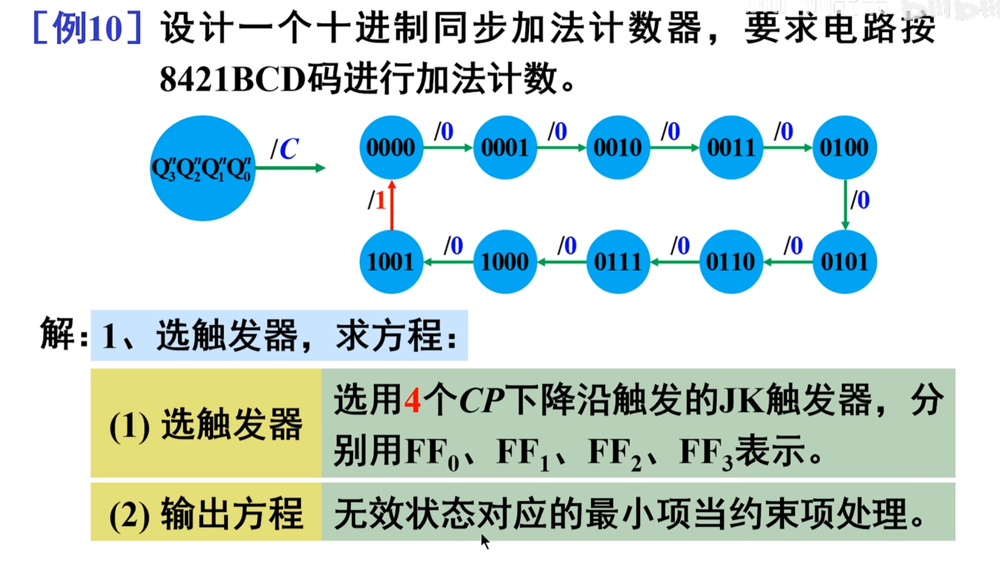

### 1. 设计要求

- 计数规则：按 8421BCD 码递增（0000→0001→…→1001→0000）

- 输出：4 位状态信号Q3Q2Q1Q0（现态记为Q3^nQ2^nQ1^nQ0^n）、1 位进位信号C（计数到 1001 时C=1，其他状态C=0）

### 2. 步骤 1：确定状态与状态转换图

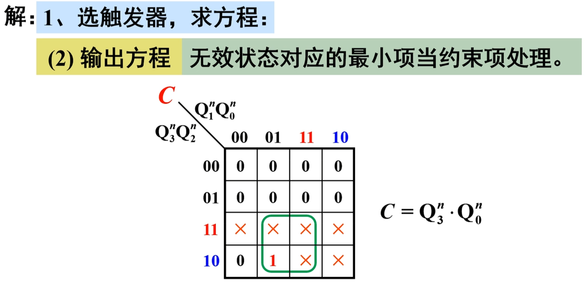

#### （1）状态位数与触发器数量

- 十进制需 10 种状态，4 位二进制可表示 16 种状态（足够），故用**4 个触发器**（FF0~FF3，对应Q0~Q3）

- 有效状态：0000~1001（10 种）；无效状态：1010~1111（6 种，视为约束项 “X”）

#### （2）状态转换图

```
0000(C=0) → 0001(C=0) → 0010(C=0) → 0011(C=0) → 0100(C=0) → 
0101(C=0) → 0110(C=0) → 0111(C=0) → 1000(C=0) → 1001(C=1) → 0000(C=0)
```

- 仅当现态为 1001 时，次态回到 0000，且进位C=1；其余现态次态为 “现态 + 1”，C=0

### 3. 步骤 2：选择触发器类型

- 选用**下降沿触发的 JK 触发器**（型号 74LS112），共 4 个（FF0~FF3）

- JK 触发器特性方程：Q^n+1 = J·Q^n非 + K非·Q^n（Q^n+1为次态）

### 4. 步骤 3：求输出方程（进位 C 的逻辑表达式）

#### （1）绘制 C 的卡诺图（4 变量，16 个方格）

| Q3^nQ2^n\Q1^nQ0^n | 00   | 01   | 11   | 10   |
| ----------------- | ---- | ---- | ---- | ---- |
| 00                | 0    | 0    | 0    | 0    |
| 01                | 0    | 0    | 0    | 0    |
| 11                | X    | X    | X    | X    |
| 10                | 0    | 0    | X    | 1    |

- 有效状态中仅Q3^nQ2^nQ1^nQ0^n=1001时C=1，其余有效态C=0；无效态（1010~1111）标 “X”

#### （2）卡诺图化简

将1（1001 位置）与右侧、上方的 “X” 构成 4 格圈，消去 2 个变量，得：

```
C = Q3^n · Q0^n
```

### 5. 步骤 4：求次态卡诺图与状态方程

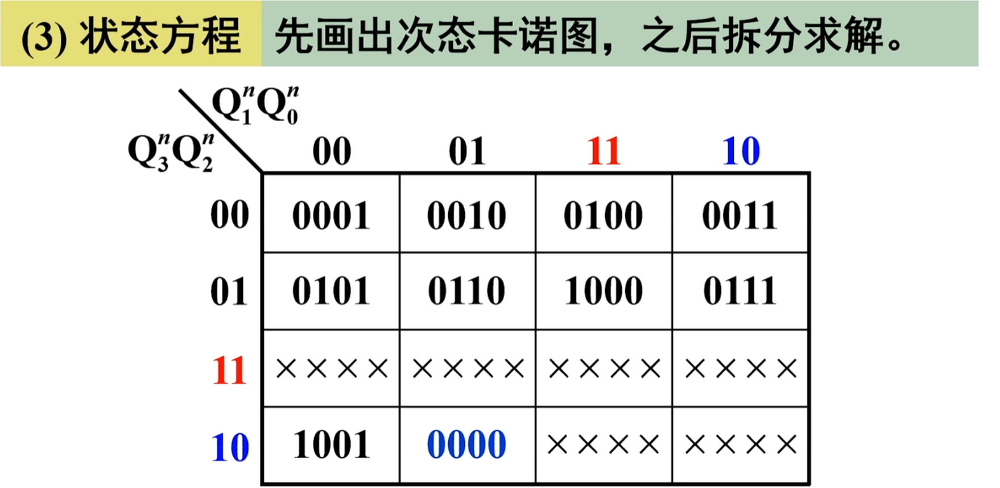

#### （1）绘制整体次态卡诺图

次态Q3^n+1Q2^n+1Q1^n+1Q0^n+1随现态变化规律：

- 现态 0000→次态 0001；现态 0001→次态 0010；…；现态 1001→次态 0000

- 无效态（1010~1111）的次态标 “XXXX”

#### （2）拆分 4 个单变量次态卡诺图（Q3^n+1、Q2^n+1、Q1^n+1、Q0^n+1）

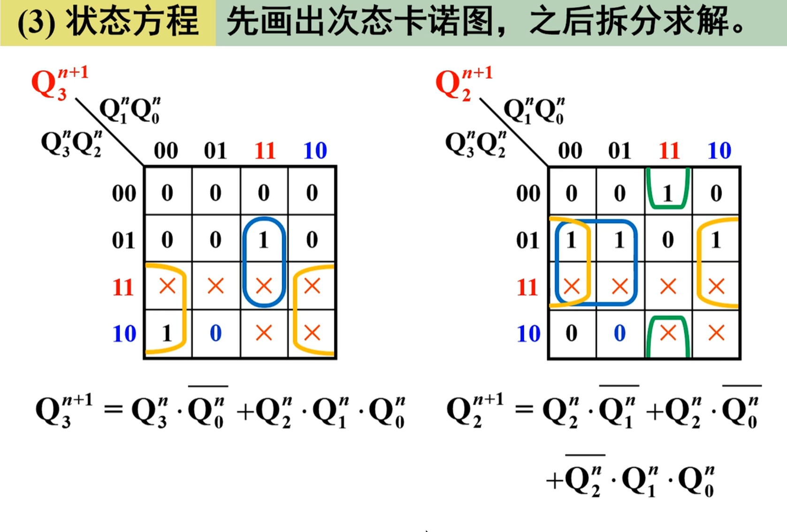

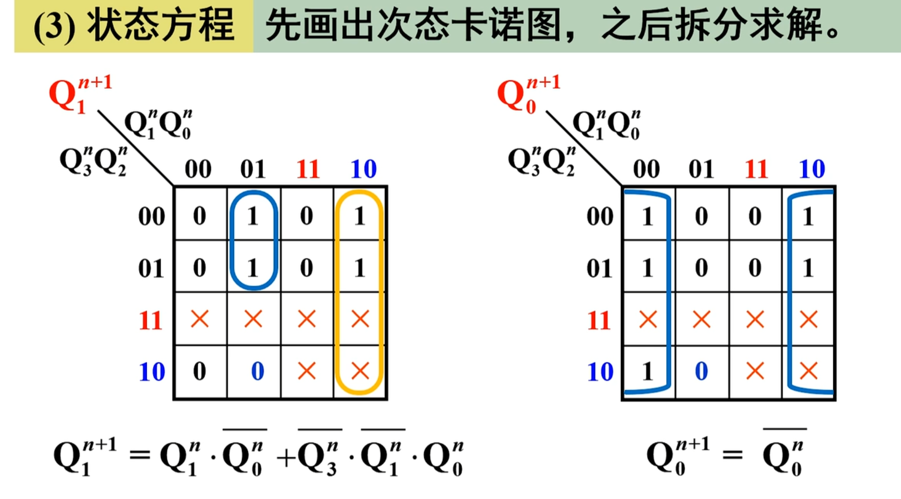

分别对每个次态变量的卡诺图化简，结合约束项 “X”，得状态方程：

1. Q0^n+1 = Q0^n非（FF0 次态：每拍翻转）

1. Q1^n+1 = Q3^n非 · Q0^n · Q1^n非 + Q0^n非 · Q1^n（FF1 次态：Q0=1 且 Q3=0 时翻转，Q0=0 时保持）

1. Q2^n+1 = Q1^n · Q0^n · Q2^n非 + (Q1^n · Q0^n)非 · Q2^n（FF2 次态：Q1=Q0=1 时翻转，否则保持）

1. Q3^n+1 = Q2^n · Q1^n · Q0^n · Q3^n非 + Q0^n非 · Q3^n（FF3 次态：Q2=Q1=Q0=1 时翻转，Q0=0 时保持；注：化简时多出来的 “Q3^n・Q2^n・Q1^n・Q0^n” 为约束项，可去掉）

### 6. 步骤 5：求驱动方程（JK 触发器的 J、K 端逻辑）

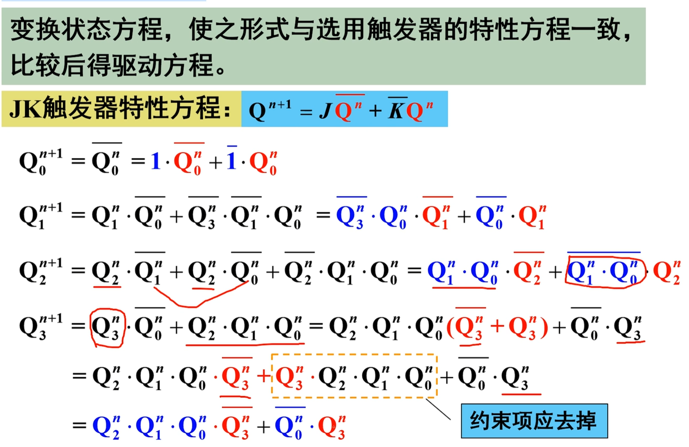

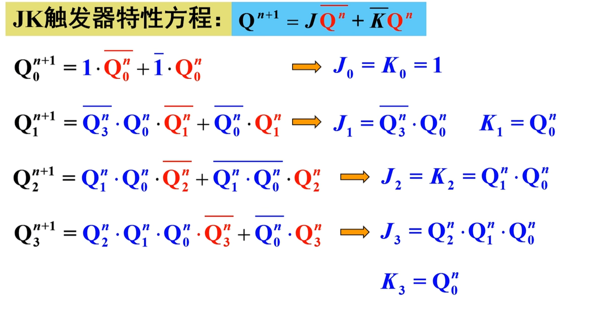

对比 JK 触发器特性方程Q^n+1 = J·Q^n非 + K非·Q^n与状态方程，得 4 个触发器的 J、K：

1. FF0（Q0）：J0=1，K0=1（T' 触发器模式，每拍翻转）

1. FF1（Q1）：J1=Q3^n非 · Q0^n，K1=Q0^n

1. FF2（Q2）：J2=Q1^n · Q0^n，K2=Q1^n · Q0^n（T 触发器模式，Q1=Q0=1 时翻转）

1. FF3（Q3）：J3=Q2^n · Q1^n · Q0^n，K3=Q0^n

### 7. 步骤 6：绘制逻辑电路图

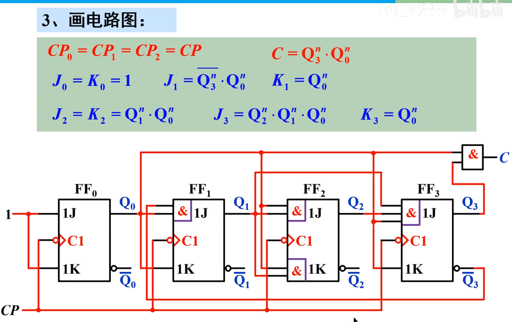

- **核心器件**：4 个 JK 触发器（74LS112）、与门（74LS08：两输入，用于 J1、J2、C；74LS11：三输入，用于 J3）

- **连接规则**：

1. 所有触发器的 CP 端连在一起（同步时钟）

1. 驱动端：J0=K0=1；J1 接 Q3 非与 Q0 的与输出；J2=K2 接 Q1 与 Q0 的与输出；J3 接 Q2、Q1、Q0 的与输出；K1=K3 接 Q0

1. 进位端 C：接 Q3 与 Q0 的与输出

### 8. 步骤 7：检查电路自启动能力

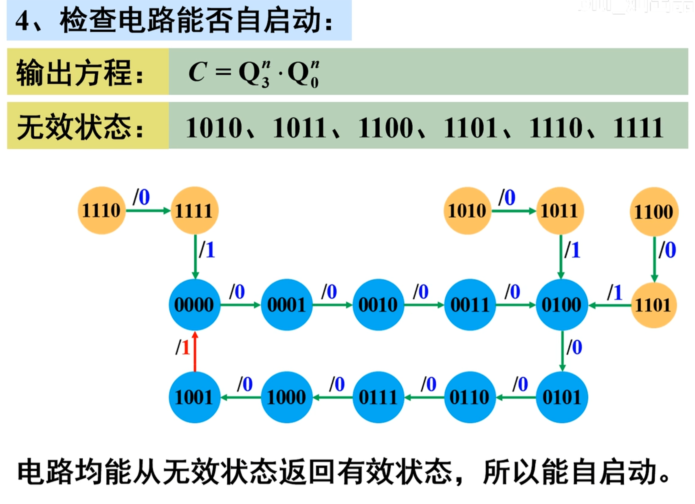

#### （1）无效状态代入验证

将 6 个无效态（1010~1111）代入状态方程，查看是否能回到有效循环：

1. 1010 → 1011 → 0100（有效态）

1. 1011 → 0100（有效态）

1. 1100 → 1101 → 0100（有效态）

1. 1101 → 0100（有效态）

1. 1110 → 1111 → 0000（有效态）

1. 1111 → 0000（有效态）

#### （2）结论：所有无效态均能回到有效循环，电路**可自启动**

## 三、十进制同步减法计数器

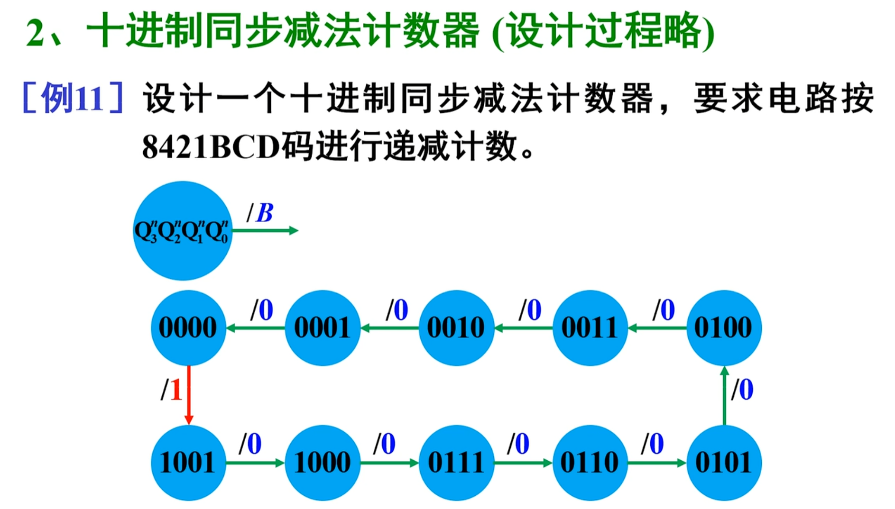

视频简要介绍设计思路，核心内容如下：

### 1. 设计要求

- 计数规则：按 8421BCD 码递减（0000→1001→1000→…→0001→0000）

- 输出：4 位状态信号Q3Q2Q1Q0、1 位借位信号B（计数到 0000 时B=1，其他状态B=0）

### 2. 核心设计要点

#### （1）状态转换图

```
0000(B=1) → 1001(B=0) → 1000(B=0) → 0111(B=0) → … → 0001(B=0) → 0000(B=1)
```

- 现态为 0000 时，次态跳至 1001（0 减 1 需借位），且B=1；其余现态次态为 “现态 - 1”，B=0

#### （2）关键方程（视频未细算，给出思路）

- 输出方程（借位 B）：B = Q3^n非 · Q2^n非 · Q1^n非 · Q0^n非（仅 0000 时 B=1）

- 状态方程 / 驱动方程：设计步骤与加法计数器一致（选 JK 触发器，画次态卡诺图→化简→求 J、K）

#### （3）仿真电路器件

- 触发器：4 个 JK 触发器（74LS112）

- 逻辑门：74LS00（两输入与非门）、74LS08（两输入与门）、74LS11（三输入与门）、74LS21（四输入与门）

- 显示：74LS48（BCD 译码器）+ 数码管（显示 0~9 递减）

## 四、十进制同步可逆计数器

视频介绍 3 种设计方法，核心是通过控制信号切换加 / 减模式：

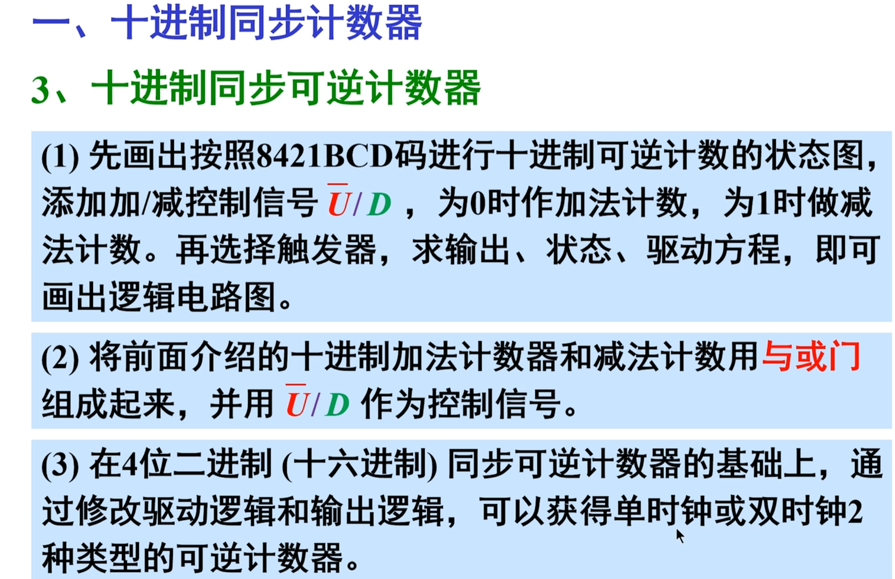

### 1. 方法 1：直接设计法（状态图结合）

- 绘制 “加法 + 减法” 融合的状态图，引入控制信号U非/D（U非=Up 非，D=Down）

- 当U非/D=0时：执行加法（状态转换同加法计数器）

- 当U非/D=1时：执行减法（状态转换同减法计数器）

- 后续步骤：选触发器→求输出方程（进位 / 借位）→次态卡诺图→状态方程→驱动方程→画电路

### 2. 方法 2：与或门组合法

- 复用 “十进制同步加法计数器” 和 “十进制同步减法计数器” 的驱动方程

- 用U非/D控制与或门：

- U非/D=0时：与或门选通加法驱动方程

- U非/D=1时：与或门选通减法驱动方程

- 优势：无需重新设计状态图，直接组合现有逻辑

### 3. 方法 3：修改二进制可逆计数器

- 以 “4 位二进制同步可逆计数器” 为基础，修改**驱动逻辑**和**输出逻辑**

- 分类：

- 单时钟型：仅 1 个 CP 端，用U非/D控制加 / 减

- 双时钟型：2 个 CP 端（CPU：加法时钟，CPD：减法时钟），仅当一个 CP 有效时执行对应操作

## 五、电路仿真验证（视频演示内容）

### 1. 十进制同步加法计数器仿真

- **器件连接**：

- CP 端：接 1Hz 方波（每秒 1 个脉冲）

- 状态输出：Q3Q2Q1Q0接 74LS48（BCD 译码器）→ 数码管

- 进位输出：C 接指示灯

- **仿真结果**：

- 数码管显示 0→1→2→…→9→0 循环

- 每循环 1 次（10 个脉冲），进位灯在 “9→0” 时亮 1 次（C=1）

### 2. 十进制同步减法计数器仿真

- **器件连接**：同加法仿真，借位 B 接指示灯

- **仿真结果**：

- 数码管显示 0→9→8→…→1→0 循环

- 每循环 1 次，借位灯在 “0→9” 时亮 1 次（B=1）


#  集成十进制同步计数器

 ## 一、集成十进制同步加法计数器（74LS160、74LS162）

### 1. 管脚特点

 与**集成二进制同步加法计数器（74LS161、74LS163）管脚完全一致**，可直接替换封装（D/N封装仅外观不同，功能管脚相同），无需修改电路接线

 核心管脚定义：

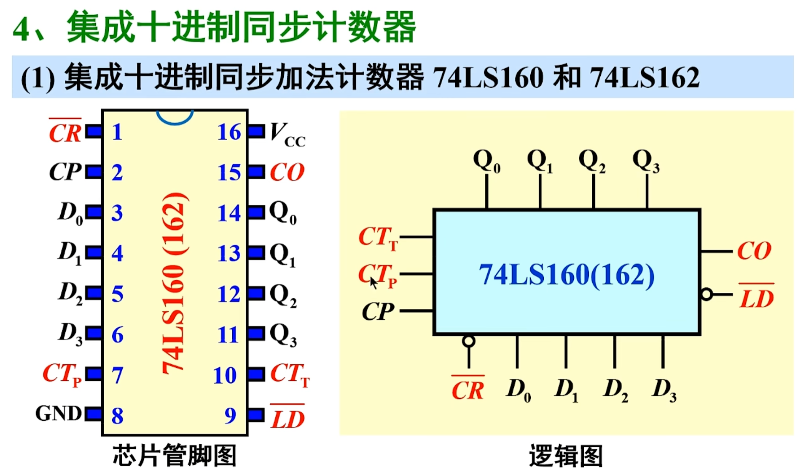

### 2. 核心功能（含与二进制芯片对比）

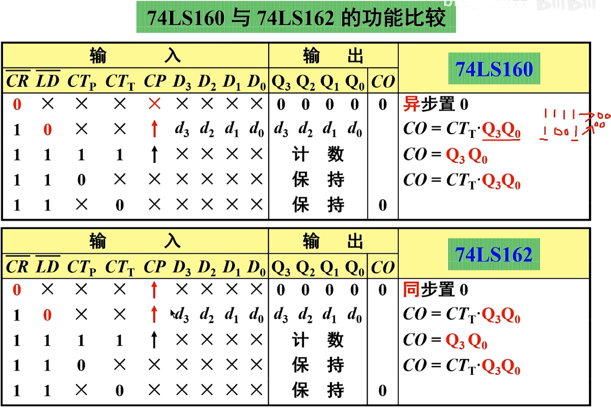

| 功能         | 74LS160（异步清零）                                          | 74LS162（同步清零）                                          | 与 74LS161（二进制）的区别                                   |
| ------------ | ------------------------------------------------------------ | ------------------------------------------------------------ | ------------------------------------------------------------ |
| **清零功能** | - 优先级最高，CR非=0时立即置 0（Q0~Q3=0000），不受 CP 控制（异步）- 无需等待 CP 边沿，其他管脚（如 CP、LD 非）状态不影响 | - CR非=0时不立即清零，需等待**CP 上升沿**才置 0（同步）- 需满足CR非=0且 CP 上升沿，才触发清零动作 | 74LS161 为异步清零（同 74LS160），74LS163 为同步清零（同 74LS162）；但二进制芯片计数到 1111（十六进制）清零，十进制芯片到 1001 清零 |
| **置数功能** | - 前提：CR非=1（清零无效）+ LD非=0（置数有效）- 需等待**CP 上升沿**，将 D0~D3 数据送入 Q0~Q3（同步置数）- 例：D0~D3=0011 时，CP 上升沿后 Q0~Q3=0011（十进制 3） | 与 74LS160 完全一致，同步置数逻辑无差异                      | 置数逻辑完全相同，仅计数循环范围不同（十进制 0000~1001，二进制 0000~1111） |
| **加法计数** | - 前提：CR非=1+LD非=1+CTT=1+CTP=1（所有控制端满足）- CP 上升沿触发计数，循环范围：0000→0001→…→1001→0000（十进制 0~9）- 进位逻辑：CO = CTT × Q3 × Q0（仅当计数到 1001 时，Q3=1、Q0=1，CO=1 输出进位） | 与 74LS160 完全一致，计数循环和进位逻辑相同                  | 74LS161 进位逻辑：CO=CTT×Q3×Q2×Q1×Q0（计数到 1111 时进位），十进制芯片仅 Q3 和 Q0 为 1 时进位 |
| **保持功能** | - 当CTT=0或CTP=0（任一计数控制端为低）- 无论 CP 是否有边沿，Q0~Q3 保持当前状态不变- 例：当前 Q0~Q3=0101（5），CTT=0 时，CP 上升沿后仍为 0101 | 与 74LS160 完全一致，保持逻辑无差异                          | 保持逻辑完全相同，仅依赖 CTT/CTP 状态                        |

### 3. 仿真电路操作示例

#### （1）74LS160 仿真操作

1. **清零操作**：

- 拨码开关将CR非置 0（低电平），无论 CP 是否触发、LD 非状态如何，Q0~Q3 立即变为 0000（十进制 0），数码管显示 0。

1. **置数操作**：

- 步骤 1：拨码开关设CR非=1（清零无效）、LD非=0（置数有效），D0~D3 拨为 0011（十进制 3）；

- 步骤 2：按下手动脉冲键（产生 CP 上升沿），Q0~Q3 变为 0011，数码管显示 3；

- 步骤 3：拨LD非=1（置数无效），完成置数。

1. **加法计数操作**：

- 前提：CR非=1+LD非=1+CTT=1+CTP=1；

- 手动脉冲触发：每次 CP 上升沿，计数依次为 3→4→5→…→9，当到 9（1001）时，CO 端指示灯亮（表示进位）；再触发 CP，计数归零为 0，CO 灯灭。

- 连续脉冲触发：开启连续 CP，计数循环 0~9，CO 灯在 9 时亮、0 时灭。

1. **保持操作**：

- 计数到 5（0101）时，拨CTT=0（计数控制端无效），无论 CP 是否触发，数码管始终显示 5，状态保持不变。

#### （2）74LS162 仿真操作（仅清零差异）

- **同步清零操作**：

- 步骤 1：先置数（D0~D3=0011，CP 上升沿后显示 3）；

- 步骤 2：拨CR非=0（低电平），此时数码管仍显示 3（未立即清零）；

- 步骤 3：按下 CP 手动脉冲（上升沿），Q0~Q3 变为 0000，数码管显示 0（同步清零生效）；

- 其他操作（置数、计数、保持）与 74LS160 完全一致。

## 二、集成十进制同步可逆计数器（74LS190，单时钟）

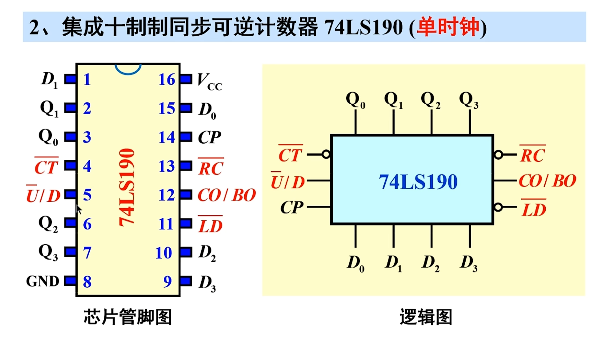

### 1. 管脚特点

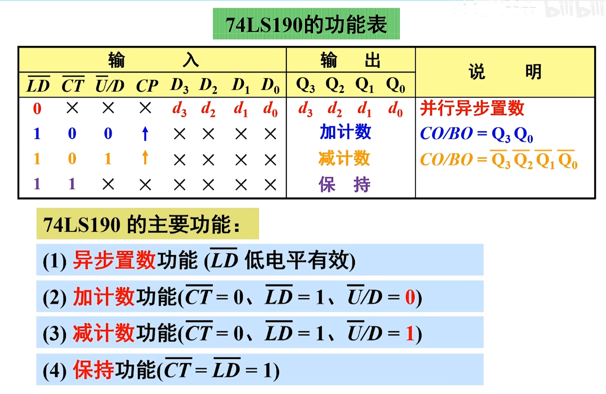

- 与**集成二进制同步可逆计数器（74LS191，单时钟）管脚完全一致**，可直接替换封装，无需修改电路接线

- 核心管脚定义（新增 / 差异管脚）：

| 管脚     | 功能描述                         | 配合关系                   |
| -------- | -------------------------------- | -------------------------- |
| U 非 / D | 加 / 减计数控制端                | 0 = 加法计数，1 = 减法计数 |
| CT 非    | 计数使能端（低电平有效）         | 0 = 允许计数，1 = 保持     |
| CO/BO    | 进位 / 借位输出端                | 加法时为 CO，减法时为 BO   |
| 无 CR 非 | 无专门清零端，需通过置数实现清零 | -                          |

### 2. 核心功能（含与二进制芯片对比）

| 功能         | 74LS190（十进制）                                            | 与 74LS191（二进制）的区别                                   |
| ------------ | ------------------------------------------------------------ | ------------------------------------------------------------ |
| **清零功能** | 无专门清零端，通过**异步置数**实现：- 置LD非=0（低电平），D0~D3=0000，无需 CP，Q0~Q3 立即 = 0000（异步清零） | 74LS191 同样无专门清零端，需异步置数清零；但二进制芯片计数到 1111，十进制到 1001 |
| **置数功能** | - 异步置数：LD非=0时立即将 D0~D3 送入 Q0~Q3，不受 CP 控制- 例：D0~D3=0101（5），LD 非 = 0 时，Q0~Q3 立即 = 0101 | 置数逻辑完全相同（异步），仅数据范围不同                     |
| **可逆计数** | 前提：LD非=1+CT非=0（计数使能），CP 上升沿触发：- 加法（U 非 / D=0）：0000→0001→…→1001→0000，CO=CT 非 ' × Q3×Q0（1001 时 CO=1）- 减法（U 非 / D=1）：1001→1000→…→0000→1001，BO=CT 非 ' × Q3'×Q2'×Q1'×Q0'（0000 时 BO=1） | 74LS191 加法到 1111（CO=1）、减法到 0000（BO=1）；十进制芯片 CO/BO 触发条件不同（Q3×Q0 vs Q3×Q2×Q1×Q0） |
| **保持功能** | - CT非=1时，无论 CP、U 非 / D 状态如何，Q0~Q3 保持当前状态- 例：当前 Q=0110（6），CT 非 = 1 时，CP 上升沿后仍为 0110 | 保持逻辑完全相同，仅依赖 CT 非状态                           |

### 3. 仿真电路操作示例（视频例题）

1. **异步置数（含清零）**：

- 置数 3：拨LD非=0，D0~D3=0011，数码管立即显示 3（无需 CP）；拨LD非=1，完成置数。

- 清零：拨LD非=0，D0~D3=0000，数码管立即显示 0（通过置数实现清零）。

1. **加法计数**：

- 前提：LD非=1+CT非=0+U非/D=0；

- 手动脉冲触发：3→4→5→…→9，9 时 CO 灯亮（Q3=1、Q0=1）；再触发 CP，归零为 0，CO 灯灭。

1. **减法计数**：

- 前提：LD非=1+CT非=0+U非/D=1；

- 手动脉冲触发：3→2→1→0，0 时 BO 灯亮（Q3~Q0 全 0）；再触发 CP，变为 9，BO 灯灭。

1. **保持操作**：

- 计数到 5 时，拨CT非=1（计数使能无效），无论 CP 是否触发，数码管始终显示 5。

## 三、集成十进制同步可逆计数器（74LS192，双时钟）

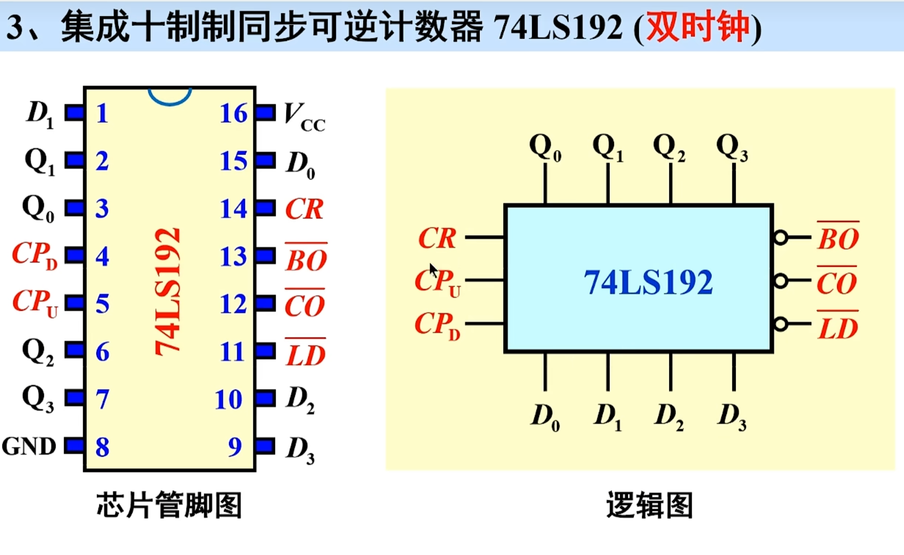

### 1. 管脚特点

- 与**集成二进制同步可逆计数器（74LS193，双时钟）管脚完全一致**，可直接替换封装，无需修改电路接线

- 核心管脚定义（新增 / 差异管脚）：

| 管脚          | 功能描述                        | 配合关系                       |
| ------------- | ------------------------------- | ------------------------------ |
| CPU           | 加法时钟端（上升沿触发加法）    | 高电平无效，上升沿有效         |
| CPD           | 减法时钟端（上升沿触发减法）    | 高电平无效，上升沿有效         |
| CR            | 清零端（高电平有效，异步）      | 1 = 清零，0 = 无效             |
| CO 非 / BO 非 | 进位 / 借位输出端（低电平有效） | 加法时为 CO 非，减法时为 BO 非 |

### 2. 核心功能（含与二进制芯片对比）

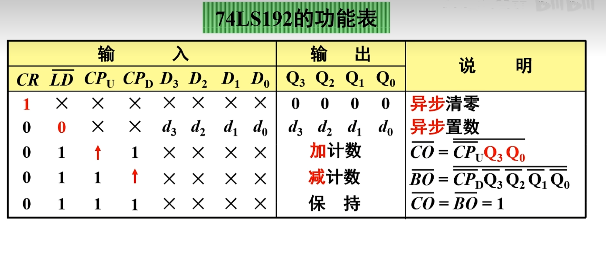

| 功能               | 74LS192（十进制）                                            | 与 74LS193（二进制）的区别                                   |
| ------------------ | ------------------------------------------------------------ | ------------------------------------------------------------ |
| **清零功能**       | - 异步清零：CR=1时立即置 0（Q0~Q3=0000），不受 CPU/CPD 控制- 例：CR=1 时，无论计数状态如何，数码管立即显示 0 | 74LS193 同样为异步清零（CR=1）；但二进制计数到 1111，十进制到 1001 |
| **置数功能**       | - 异步置数：CR=0+LD非=0时，立即将 D0~D3 送入 Q0~Q3，不受 CPU/CPD 控制- 例：D0~D3=0011（3），CR=0+LD 非 = 0 时，Q=0011 | 置数逻辑完全相同（异步），仅数据范围不同                     |
| **双时钟可逆计数** | 前提：CR=0+LD非=1（控制端有效）：- 加法：仅 CPU 上升沿触发，0000→…→1001→0000，CO 非 =（CPU' × Q3×Q0）'（1001 时 CO 非 = 0，灯灭）- 减法：仅 CPD 上升沿触发，1001→…→0000→1001，BO 非 =（CPD' × Q3'Q2'Q1'Q0'）'（0000 时 BO 非 = 0，灯灭） | 74LS193 加法到 1111（CO 非 = 0）、减法到 0000（BO 非 = 0）；十进制芯片 CO 非 / BO 非触发条件不同（Q3×Q0 vs Q3×Q2×Q1×Q0） |
| **保持功能**       | - CPU=1且CPD=1（双时钟均为高电平）时，Q0~Q3 保持当前状态- 例：当前 Q=0110（6），CPU=1+CPD=1 时，无计数动作 | 保持逻辑完全相同，仅依赖 CPU/CPD 状态                        |

### 3. 仿真电路操作示例（视频例题）

1. **异步清零**：

- 拨CR=1（高电平），无论当前计数为 3 还是 9，数码管立即显示 0；拨CR=0，清零无效。

1. **异步置数**：

- 步骤 1：CR=0（清零无效）+LD非=0（置数有效），D0~D3=0011（3）；

- 步骤 2：数码管立即显示 3（无需 CPU/CPD）；拨LD非=1，完成置数。

1. **加法计数（CPU 控制）**：

- 前提：CR=0+LD非=1+CPD=1（减法时钟无效）；

- 手动脉冲触发 CPU：3→4→…→9，9 时 CO 非灯灭（低电平有效）；再触发 CPU，归零为 0，CO 非灯亮。

1. **减法计数（CPD 控制）**：

- 前提：CR=0+LD非=1+CPU=1（加法时钟无效）；

- 手动脉冲触发 CPD：3→2→…→0，0 时 BO 非灯灭（低电平有效）；再触发 CPD，变为 9，BO 非灯亮。

1. **保持操作**：

- 计数到 5 时，拨CPU=1+CPD=1（双时钟无效），无论是否触发脉冲，数码管始终显示 5。

## 四、四片芯片核心差异总结

| 芯片型号 | 类型                     | 清零方式          | 置数方式          | 计数时钟          | 进位 / 借位逻辑（高电平有效）                                | 对应二进制芯片 |
| -------- | ------------------------ | ----------------- | ----------------- | ----------------- | ------------------------------------------------------------ | -------------- |
| 74LS160  | 同步加法计数器           | 异步（CR 非 = 0） | 同步（CP 上升沿） | 单时钟（CP）      | CO=CTT×Q3×Q0（1001 时有效）                                  | 74LS161        |
| 74LS162  | 同步加法计数器           | 同步（CP 上升沿） | 同步（CP 上升沿） | 单时钟（CP）      | CO=CTT×Q3×Q0（1001 时有效）                                  | 74LS163        |
| 74LS190  | 同步可逆计数器（单时钟） | 无，需异步置数    | 异步（LD 非 = 0） | 单时钟（CP）      | CO=Q3×Q0（加），BO=Q3'Q2'Q1'Q0'（减）                        | 74LS191        |
| 74LS192  | 同步可逆计数器（双时钟） | 异步（CR=1）      | 异步（LD 非 = 0） | 双时钟（CPU/CPD） | CO 非 =（CPU'×Q3×Q0）'（加），BO 非 =（CPD'×Q3'Q2'Q1'Q0'）'（减） | 74LS19         |


# 十进制异步计数器(含74LS290)

## 一、十进制异步加法计数器

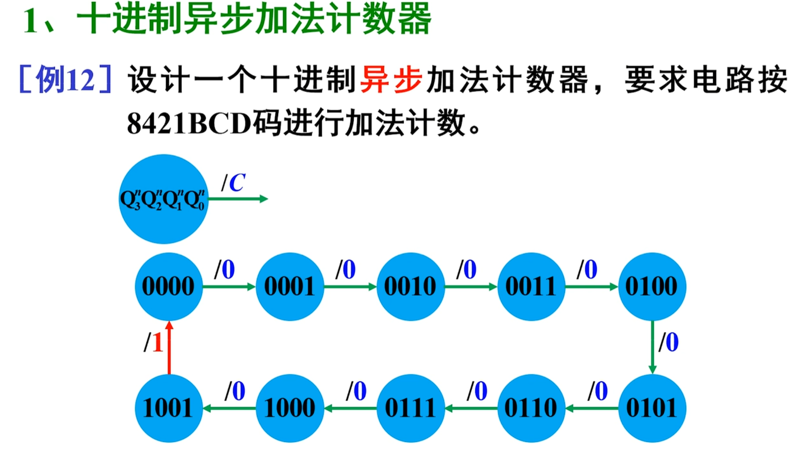

### 1. 设计核心要求

- **计数规律**：按 8421BCD 码实现加法计数，状态范围为0000（0）~1001（9），计满1001后自动归零，同时产生进位信号C=1。

- **状态转换图**：

0000→0001→0010→0011→0100→0101→0110→0111→1000→1001→0000（循环），需 4 个**下降沿触发的 JK 触发器**（视频默认选型）。

### 2. 关键设计步骤：时序图与时钟方程

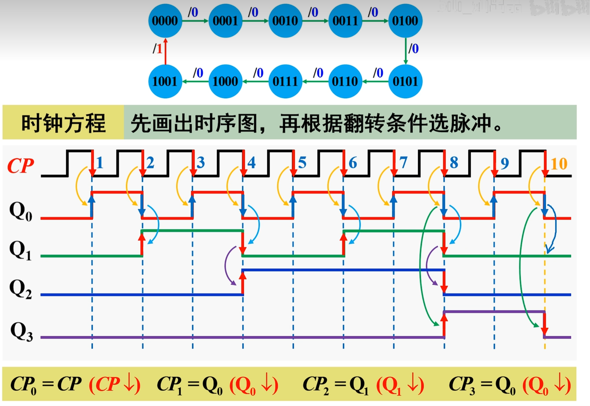

#### （1）时序图绘制（基于 10 个 CP 脉冲，下降沿触发）

| CP 脉冲序号 | Q3 Q2 Q1 Q0（输出状态） | 核心变化说明                      |
| ----------- | ----------------------- | --------------------------------- |
| 初始状态    | 0  0  0  0              | 无 CP 输入时，触发器保持初始态    |
| 1           | 0  0  0  1              | 第 1 个 CP 下降沿，Q0 翻转（0→1） |
| 2           | 0  0  1  0              | 第 2 个 CP 下降沿，Q1 翻转（0→1） |
| 3           | 0  0  1  1              | 第 3 个 CP 下降沿，Q0 翻转（1→0） |
| 4           | 0  1  0  0              | 第 4 个 CP 下降沿，Q2 翻转（0→1） |
| 5           | 0  1  0  1              | 第 5 个 CP 下降沿，Q0 翻转（0→1） |
| 6           | 0  1  1  0              | 第 6 个 CP 下降沿，Q1 翻转（1→0） |
| 7           | 0  1  1  1              | 第 7 个 CP 下降沿，Q0 翻转（0→1） |
| 8           | 1  0  0  0              | 第 8 个 CP 下降沿，Q3 翻转（0→1） |
| 9           | 1  0  0  1              | 第 9 个 CP 下降沿，Q0 翻转（0→1） |
| 10          | 0  0  0  0              | 第 10 个 CP 下降沿，全位归零      |

#### （2）时钟方程确定（核心原则：触发边沿最少）

异步计数器的时钟信号可来自外部 CP 或内部触发器输出，需根据时序图中 “翻转时刻” 选择：

- **触发器 0（对应 Q0）**：每 1 个 CP 下降沿均翻转，时钟端必须接外部 CP，即 CP0 = CP（无其他信号能提供所有翻转所需的下降沿）。

- **触发器 1（对应 Q1）**：每 2 个 CP 下降沿翻转，Q0 的下降沿与翻转时刻完全匹配，故 CP1 = Q0（用 Q0 比用 CP 少 6 个无效边沿）。

- **触发器 2（对应 Q2）**：每 4 个 CP 下降沿翻转，Q1 的下降沿与翻转时刻匹配，故 CP2 = Q1（仅需 2 个有效边沿，远少于 CP 的 10 个）。

- **触发器 3（对应 Q3）**：每 8 个 CP 下降沿翻转，仅 Q0 和 CP 能提供下降沿，选 Q0 可减少边沿数量，故 CP3 = Q0。

### 3. 后续推导步骤（视频提及框架，未细算）

- **状态方程**：根据时序图，触发器未触发时状态保持（用 “×” 表示无关项，如 Q0 未触发时 Q0* = Q0）。

- **驱动方程**：JK 触发器特性为 “J=K=1 时翻转”，结合状态方程推导各触发器的 J、K 端输入（如 Q0 需每次翻转，故 J0=K0=1）。

- **电路图**：按时钟方程连接 CP 端，按驱动方程连接 J、K 端，最终构成完整电路。

## 二、十进制异步减法计数器

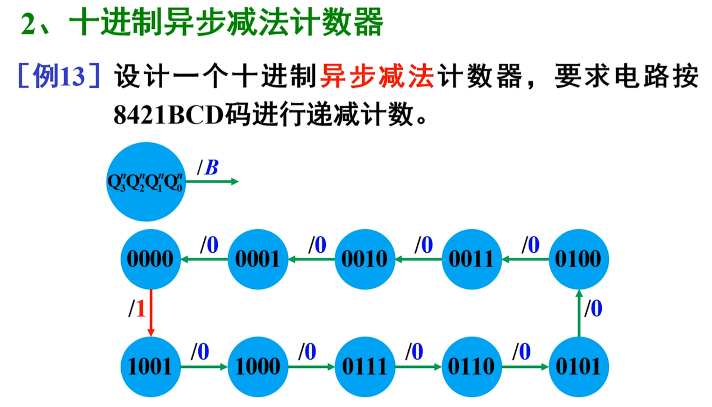

### 1. 设计核心要求

- **计数规律**：按 8421BCD 码实现减法计数，状态范围0000（0）~1001（9）；0000减 1 时产生借位信号B=1，同时跳变为1001。

- **状态转换图**：

0000→1001→1000→0111→0110→0101→0100→0011→0010→0001→0000（循环），仍用 4 个下降沿 JK 触发器。

### 2. 关键设计步骤：时序图与时钟方程

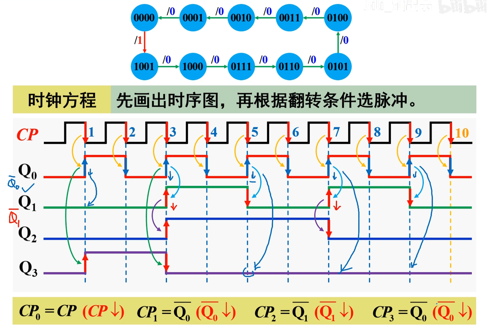

#### （1）时序图绘制（基于 10 个 CP 脉冲，下降沿触发）

| CP 脉冲序号 | Q3 Q2 Q1 Q0（输出状态） | 核心变化说明                       |
| ----------- | ----------------------- | ---------------------------------- |
| 初始状态    | 0  0  0  0              | 无 CP 输入时，触发器保持初始态     |
| 1           | 1  0  0  1              | 第 1 个 CP 下降沿，借位变 1001     |
| 2           | 1  0  0  0              | 第 2 个 CP 下降沿，Q0 翻转（1→0）  |
| 3           | 0  1  1  1              | 第 3 个 CP 下降沿，Q1-Q3 翻转      |
| 4           | 0  1  1  0              | 第 4 个 CP 下降沿，Q0 翻转（1→0）  |
| 5           | 0  1  0  1              | 第 5 个 CP 下降沿，Q1 翻转（1→0）  |
| 6           | 0  1  0  0              | 第 6 个 CP 下降沿，Q0 翻转（1→0）  |
| 7           | 0  0  1  1              | 第 7 个 CP 下降沿，Q1-Q2 翻转      |
| 8           | 0  0  1  0              | 第 8 个 CP 下降沿，Q0 翻转（1→0）  |
| 9           | 0  0  0  1              | 第 9 个 CP 下降沿，Q1 翻转（1→0）  |
| 10          | 0  0  0  0              | 第 10 个 CP 下降沿，Q0 翻转（1→0） |

#### （2）时钟方程确定（关键：用 “Q 非” 提供下降沿）

减法计数中，触发器输出多为 “上升沿”，需通过 “Q 非” 转换为下降沿：

- **触发器 0（对应 Q0）**：每 1 个 CP 下降沿翻转，时钟端接外部 CP，即 CP0 = CP。

- **触发器 1（对应 Q1）**：Q0 为上升沿，“Q0 非” 为下降沿，故 CP1 = Q0非（匹配翻转时刻）。

- **触发器 2（对应 Q2）**：Q1 为上升沿，“Q1 非” 为下降沿，故 CP2 = Q1非。

- **触发器 3（对应 Q3）**：Q0 为上升沿，“Q0 非” 为下降沿，故 CP3 = Q0非。

## 三、集成十进制异步计数器：74LS290

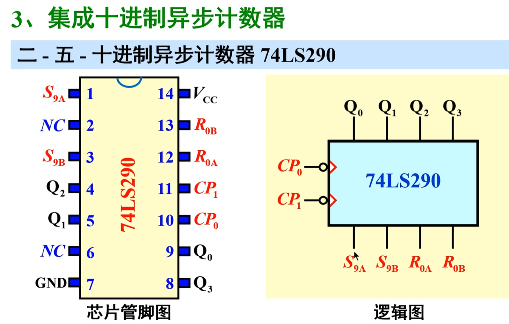

### 1. 芯片基本信息

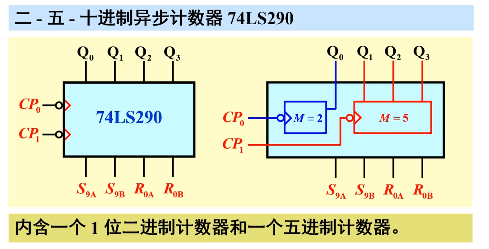

- **类型**：二 - 五 - 十进制异步加法计数器（可灵活组合为二进制、五进制、十进制）。

- **管脚配置（14 脚）**：

	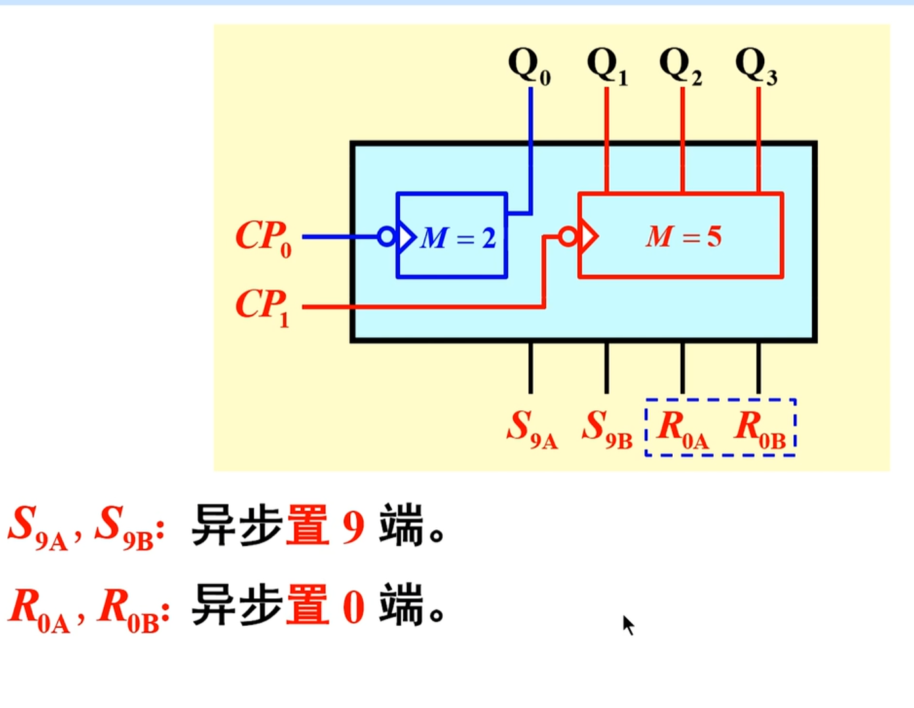

| 管脚号 | 功能标识 | 功能说明                               |
| ------ | -------- | -------------------------------------- |
| 1      | Q1       | 五进制计数器输出（低位）               |
| 2      | NC       | 空脚（无功能）                         |
| 3      | Q2       | 五进制计数器输出（中位）               |
| 4      | Q3       | 五进制计数器输出（高位）               |
| 5      | S9B      | 异步置 9 端（高电平有效，与 S9A 联动） |
| 6      | NC       | 空脚（无功能）                         |
| 7      | GND      | 接地（电源负极）                       |
| 8      | R0B      | 异步清零端（高电平有效，与 R0A 联动）  |
| 9      | R0A      | 异步清零端（高电平有效，与 R0B 联动）  |
| 10     | S9A      | 异步置 9 端（高电平有效，与 S9B 联动） |
| 11     | CP1      | 五进制计数器时钟端（下降沿触发）       |
| 12     | CP0      | 二进制计数器时钟端（下降沿触发）       |
| 13     | Q0       | 二进制计数器输出                       |
| 14     | VCC      | 电源正极（5V）                         |

- **内部结构**：含 2 个独立计数器 ——

① 1 位二进制计数器（CP0→Q0）；② 五进制计数器（CP1→Q1/Q2/Q3）。

### 2. 核心特性表（功能逻辑）

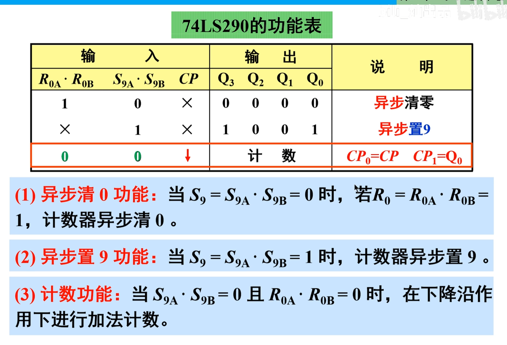

| S9A・S9B（置 9 逻辑） | R0A・R0B（清零逻辑） | CP（时钟）  | Q3 Q2 Q1 Q0 | 功能说明                |
| --------------------- | -------------------- | ----------- | ----------- | ----------------------- |
| 0（置 9 无效）        | 1（清零有效）        | ×（无关）   | 0  0  0  0  | 异步清零（优先级次之）  |
| 1（置 9 有效）        | ×（无关）            | ×（无关）   | 1  0  0  1  | 异步置 9（优先级最高）  |
| 0（置 9 无效）        | 0（清零无效）        | ↓（下降沿） | 加法计数    | 正常计数（需接对应 CP） |

- 注：“异步” 指无需等待 CP，立即执行置 9 / 清零；“×” 表示该信号不影响结果。

### 3. 四种典型接法（含视频仿真案例）

#### （1）接法 1：8421BCD 码十进制计数器（最常用）

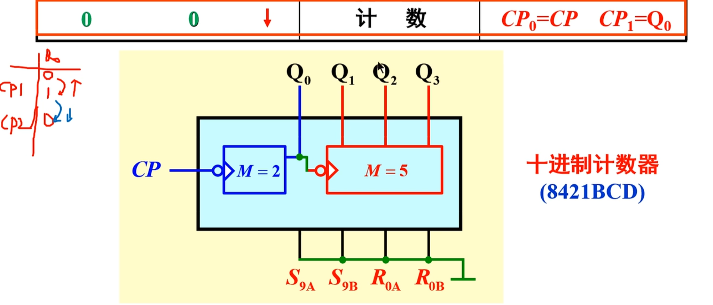

- **接线要求**：

- 控制端：S9A=S9B=R0A=R0B=0（接地，使置 9、清零均无效）。

- 时钟端：CP0接外部 CP，CP1接Q0（二进制输出作为五进制时钟）。

- **计数规律**：Q3Q2Q1Q0为输出（Q3 最高位，Q0 最低位），按 8421BCD 码循环0000~1001。

- **视频仿真现象**：

- 连续 CP 输入：数码管显示0→1→2→...→9→0循环。

- 置 9 测试：将S9A/S9B接 1，数码管瞬间显示9（状态1001），与 CP 无关。

- 清零测试：将R0A/R0B接 1，数码管瞬间显示0（状态0000），与 CP 无关。

#### （2）接法 2：1 位二进制计数器

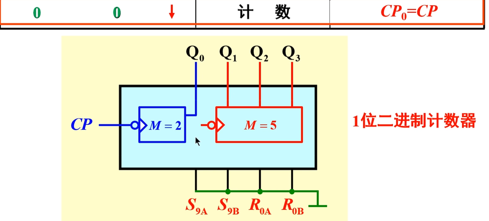

- **接线要求**：

- 控制端：S9A=S9B=R0A=R0B=0。

- 时钟端：CP0接外部 CP，CP1悬空（五进制计数器无时钟，不工作）。

- **计数规律**：仅二进制计数器工作，Q0为输出，循环0→1→0。

- **视频仿真现象**：数码管仅显示0、1交替，Q1-Q3 始终为 0。

#### （3）接法 3：五进制计数器

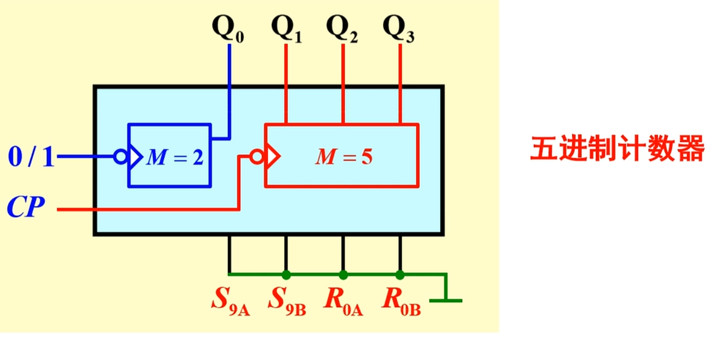

- **接线要求**：

- 控制端：S9A=S9B=R0A=R0B=0。

- 时钟端：CP1接外部 CP，CP0悬空（二进制计数器无时钟，不工作）。

- **计数规律**：仅五进制计数器工作，Q1Q2Q3为输出（Q3 最高位），循环000→001→010→011→100→000。

- **视频仿真现象**：

数码管需修改接线（Q1→A、Q2→B、Q3→C，Q0 接地），显示0→1→2→3→4→0循环。

#### （4）接法 4：5421BCD 码十进制计数器（特殊用途）

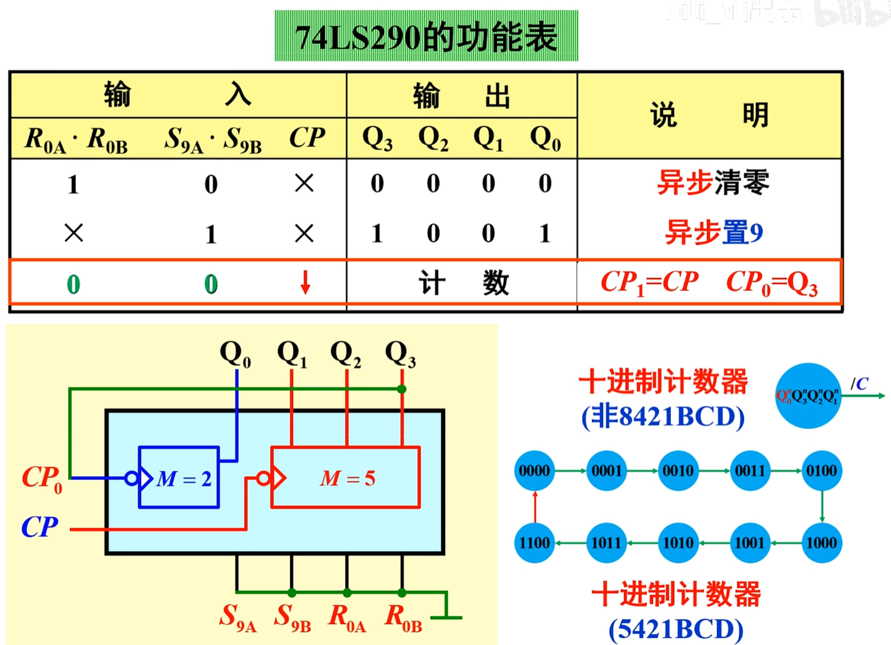

- **接线要求**：

- 控制端：S9A=S9B=R0A=R0B=0。

- 时钟端：CP1接外部 CP，CP0接Q3（五进制输出作为二进制时钟）。

- **计数规律**：按 5421BCD 码计数，Q0Q3Q2Q1为输出（Q0 最高位，位权：Q0=5、Q3=4、Q2=2、Q1=1），状态序列：

0000→0001→0010→0011→0100→1000→1001→1010→1011→1100→0000。

- **核心特点**：Q0 输出对称方波（5 个 0→5 个 1→循环），可用于方波生成。

- **视频仿真现象**：

	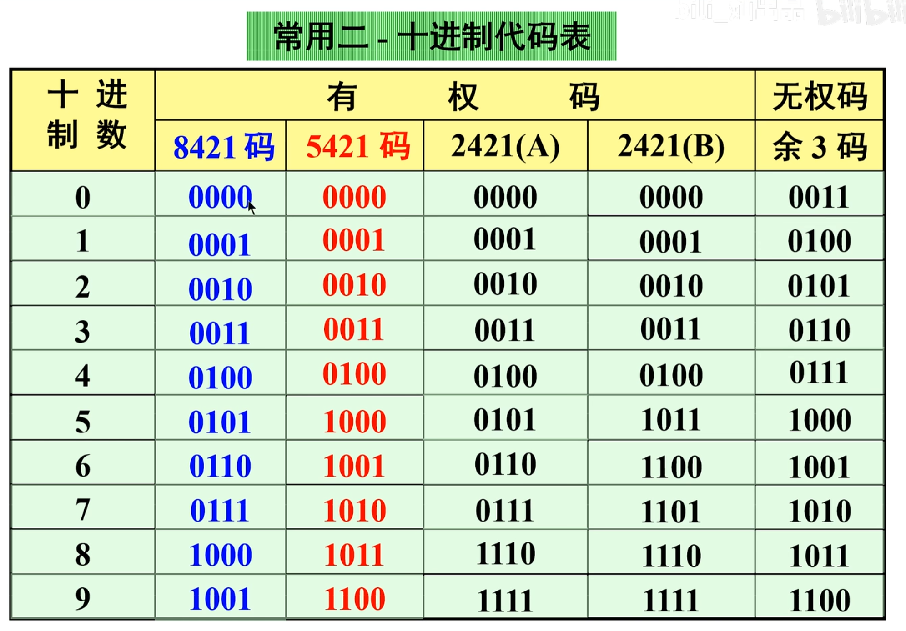

- 正常状态（0-9）：数码管显示正常。

- 超范围状态（1010-1100）：数码管显示乱码（无对应十进制数）。

## 四、视频中的关键例题与仿真案例

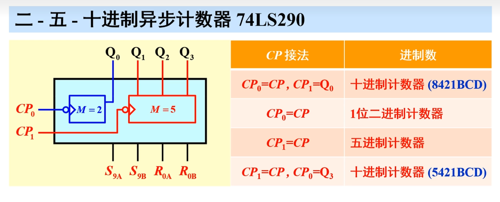

### 例题 1：十进制异步加法计数器时序图绘制

- **题目**：用 4 个下降沿 JK 触发器设计 8421BCD 码异步加法计数器，绘制 10 个 CP 脉冲下的 Q3-Q0 时序图。

- **解答**：见 “一、2.（1）时序图”，核心是确保每个 CP 下降沿对应正确的状态翻转，Q0 每 CP 翻转，Q1 每 2CP 翻转，Q2 每 4CP 翻转，Q3 每 8CP 翻转。

### 例题 2：74LS290 置 9 / 清零功能验证

- **题目**：74LS290 当前状态为0101（5），分别执行置 9 和清零操作，观察状态变化。

- **解答**：

- 置 9 操作：将S9A=S9B=1，R0A=R0B=0，状态瞬间变为1001（9），无需等待 CP。

- 清零操作：将R0A=R0B=1，S9A=S9B=0，状态瞬间变为0000（0），无需等待 CP。

### 例题 3：74LS290 五进制计数器仿真

- **题目**：用 74LS290 实现五进制计数器，说明接线并预测仿真现象。

- **解答**：

- 接线：CP1接 CP，CP0悬空，S9A=S9B=R0A=R0B=0，数码管A接Q1、B接Q2、C接Q3、D接地。

- 仿真现象：CP 输入时，数码管显示0→1→2→3→4→0，循环 5 个状态，Q0 始终为 0。


# 小容量 N 进制计数器的设计

## 一、N 进制计数器设计概述

### 1. 设计方法分类

- 方法 1：基于触发器 + 门电路的时序逻辑电路设计，过程繁琐，实际应用少。

- 方法 2：基于集成计数器的二次设计（核心方法），无需了解集成计数器内部结构，仅需参考芯片引脚图和功能表，利用**清零端**和**置数端**实现，需区分**同步**和**异步**两种工作方式。

### 2. 常用集成计数器的清零 / 置数特性

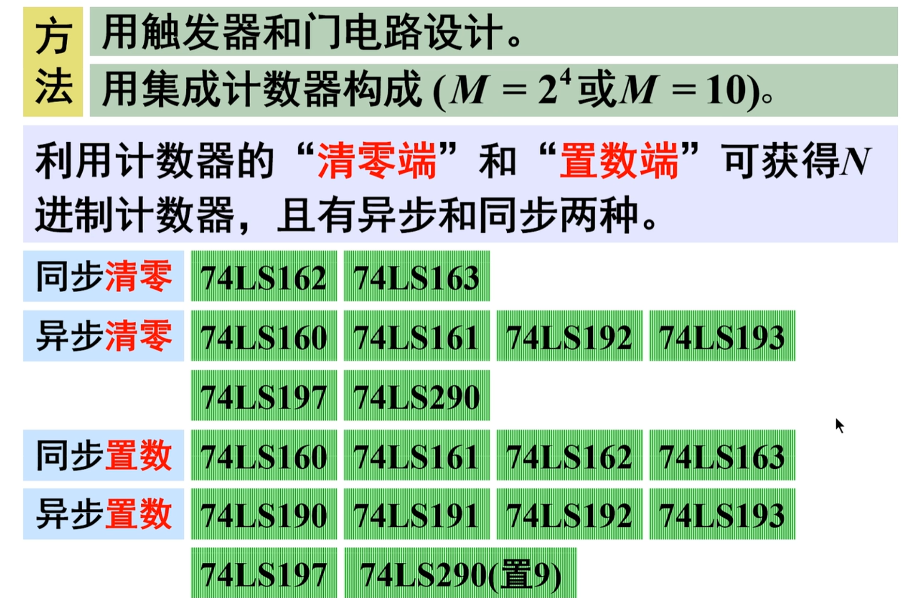

| 功能类型            | 芯片型号    | 计数器类型                   | 关键特性                                                     |
| ------------------- | ----------- | ---------------------------- | ------------------------------------------------------------ |
| 同步清零 + 同步置数 | 74LS162     | 十进制计数器                 | 清零、置数均需等待 CP 脉冲，引脚与 74LS160/161 一致          |
| 同步清零 + 同步置数 | 74LS163     | 4 位二进制（十六进制）计数器 | 清零、置数均需等待 CP 脉冲                                   |
| 异步清零 + 同步置数 | 74LS160     | 十进制加法计数器             | 异步清零（无需 CP），同步置数，引脚与 74LS161/162/163 一致   |
| 异步清零 + 同步置数 | 74LS161     | 4 位二进制加法计数器         | 异步清零（无需 CP），同步置数                                |
| 异步清零 + 异步置数 | 74LS192     | 双时钟十进制可逆计数器       | 加法时钟 CPu、减法时钟 CPd，异步清零、异步置数，引脚与 74LS193 一致 |
| 异步清零 + 异步置数 | 74LS193     | 双时钟 4 位二进制可逆计数器  | 加法时钟 CPu、减法时钟 CPd，异步清零、异步置数               |
| 异步清零 + 异步置数 | 74LS197     | 二 - 八 - 十六进制计数器     | 通过脉冲端连接实现不同进制（二进制：仅 CP0；八进制：仅 CP1；十六进制：CP0→Q0 接 CP1） |
| 异步清零 + 异步置 9 | 74LS290     | 二 - 五 - 十进制计数器       | 无置数端，有 “置 9 端”（S9A/S9B），异步清零（R0A/R0B），通过脉冲端连接实现不同进制（十进制：CP0→Q0 接 CP1；五进制：仅 CP1；二进制：仅 CP0） |
| 异步置数            | 74LS190/191 | 单时钟可逆计数器             | 190 为十进制，191 为 4 位二进制，通过 “U 非 / D” 端控制方向，异步置数 |

## 二、利用同步清零端 / 置数端设计 N 进制计数器

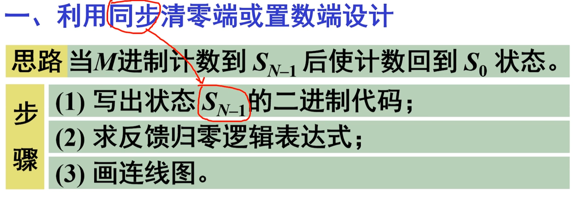

### 1. 核心原理

- 同步特性：清零 / 置数操作需**等待 CP 脉冲到来**才执行。

- 设计前提：集成计数器的最大模为M（如十进制M=10，十六进制M=16），需设计的 N 进制满足N < M（单片集成计数器）。

- 核心思路：计数器从初始状态S0（通常为 0000）计数到SN-1（第 N-1 个状态）时，通过反馈逻辑触发同步清零 / 置数，等待下一个 CP 脉冲后回到S0，完成 N 个状态循环（S0~SN-1）。

### 2. 例题 1：用 74LS163（同步清零 + 同步置数，十六进制）设计十二进制计数器（同步清零法）

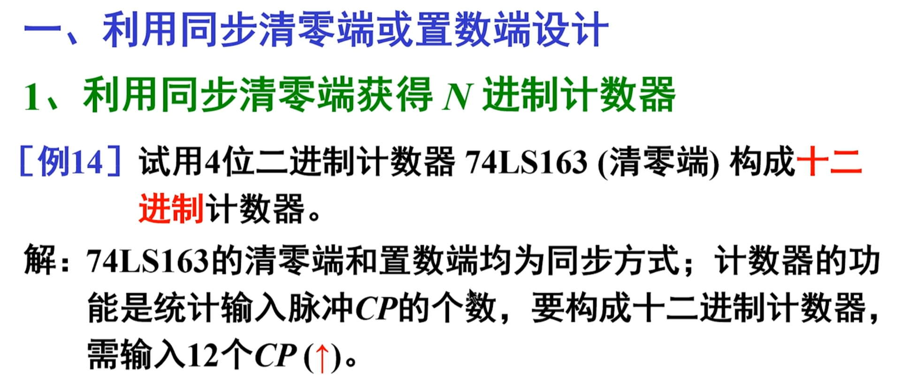

#### 步骤 1：确定关键参数

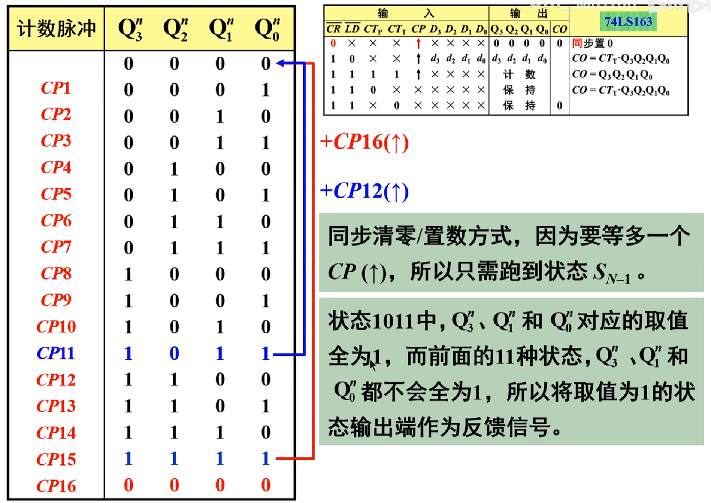

- 集成计数器模M=16（4 位二进制），设计N=12，需找SN-1 = S11状态。

- S11对应的二进制代码：1011（Q3=1，Q2=0，Q1=1，Q0=1）。

#### 步骤 2：推导反馈清零逻辑

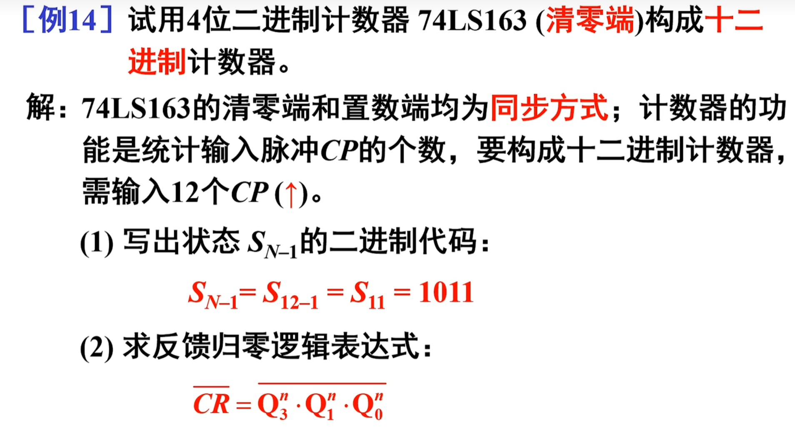

- 74LS163 的同步清零端为CR非（低电平有效）：当CR非=0时，等待 CP 到来后清零。

- 仅当计数器处于S11（1011）时，Q3、Q1、Q0 同时为 1，其他状态无此组合，因此反馈逻辑为：

CR非 = (Q3 · Q1 · Q0)非（需 3 输入端与非门）。

#### 步骤 3：绘制连线图

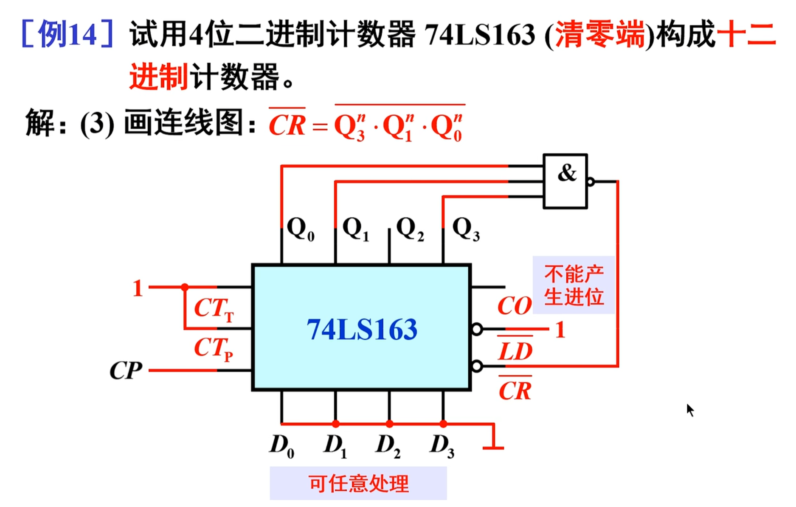

- 电源与使能端：CTT（计数使能 1）、CTP（计数使能 2）接高电平（确保计数器工作）。

- 清零与置数端：CR非接与非门输出，LD非（置数端）接高电平（无效）。

- 数据输入端：D0~D3 接地（因LD非无效，D0~D3 可任意处理）。

- 脉冲与输出：CP 接外部脉冲，Q3~Q0 为计数器输出。

#### 关键注意点

- 计数器状态循环：0000~1011（12 个状态），未到1111，因此进位端 CO（CO=Q3·Q2·Q1·Q0）无输出，无法作为高位芯片控制信号。

### 3. 例题 2：用 74LS163 设计十二进制计数器（同步置数法）

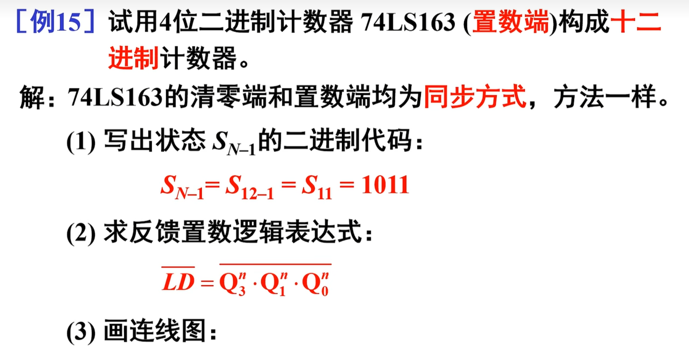

#### 步骤 1：确定关键参数

- 同步置数特性：LD非=0时，等待 CP 到来后将 D0~D3 数据置入 Q3~Q0。

- 设计N=12，仍取SN-1 = S11（1011）作为反馈触发状态。

#### 步骤 2：推导反馈置数逻辑

- 仅当计数器处于S11（1011）时，Q3、Q1、Q0 同时为 1，因此反馈逻辑为：

LD非 = (Q3 · Q1 · Q0)非（3 输入端与非门）。

#### 步骤 3：绘制连线图

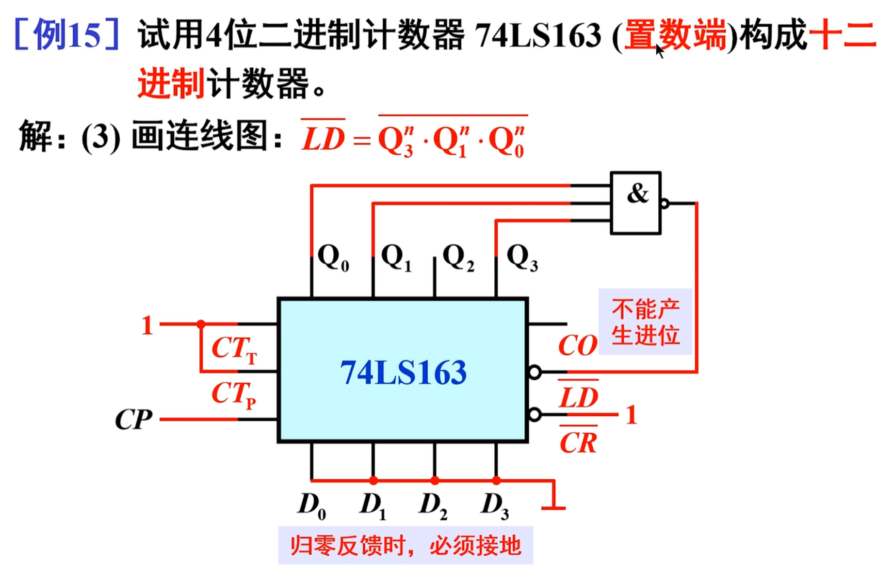

- 电源与使能端：CTT、CTP 接高电平。

- 置数与清零端：LD非接与非门输出，CR非接高电平（无效）。

- 数据输入端：D0~D3 接地（需置入初始状态S0=0000，因此 D0~D3 必须为 0）。

- 脉冲与输出：CP 接外部脉冲，Q3~Q0 为输出。

#### 关键注意点

- 与同步清零法区别：LD非有效时 D0~D3 必须明确（需置入目标初始状态），而CR非有效时 D0~D3 可任意；仍无 CO 输出（未到1111）。

### 4. 例题 3：用 74LS163 设计带进位的十二进制计数器（同步置数法优化）

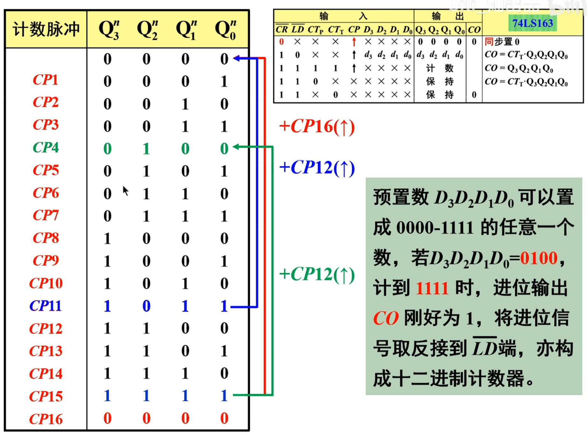

#### 核心需求：利用 CO 输出（需计数器到1111状态）

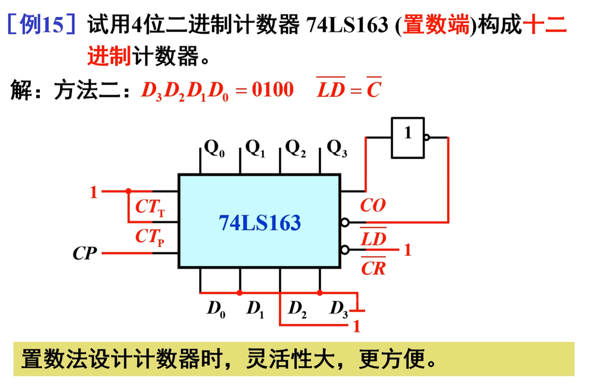

#### 步骤 1：确定初始预置数

- 集成计数器模M=16，设计N=12，需让计数器从S初计数到1111（共 12 个状态），则S初 = M - N = 16 - 12 = 4，对应二进制0100。

- 状态循环：0100~1111（12 个状态），到1111时 CO=1（产生进位）。

#### 步骤 2：推导反馈置数逻辑

- 当计数器到1111时，CO=1，将 CO 取反后接LD非（LD非=CO非），等待 CP 到来后置入0100。

- 反馈逻辑：LD非 = CO非（仅需 1 个非门）。

#### 步骤 3：绘制连线图

- 电源与使能端：CTT、CTP 接高电平。

- 置数与清零端：LD非接 CO 经非门后的输出，CR非接高电平。

- 数据输入端：D0~D3 接0100（D3=0，D2=1，D1=0，D0=0）。

- 脉冲与输出：CP 接外部脉冲，CO 可作为高位芯片控制信号。

#### 优势

- 无需多输入端与非门，仅需非门；CO 有效，便于多片级联。

## 三、利用异步清零端 / 置数端设计 N 进制计数器

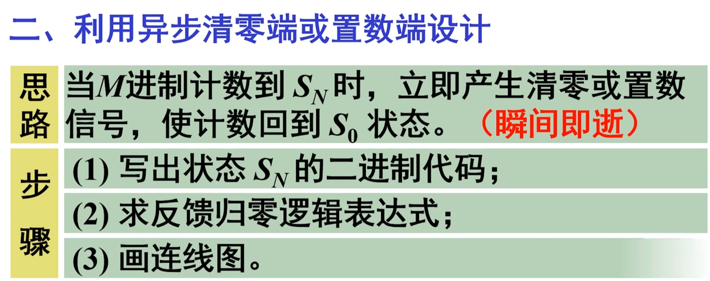

### 1. 核心原理

- 异步特性：清零 / 置数操作**无需等待 CP 脉冲**，一旦有效电平触发立即执行。

- 设计思路：计数器从S0计数到SN（第 N 个状态）时，通过反馈逻辑触发异步清零 / 置数，立即回到S0；SN为**过渡状态**（持续时间极短，仅几十纳秒，仿真中一闪而过，实际忽略），确保总计数脉冲数为 N。

### 2. 例题 1：用 74LS161（异步清零 + 同步置数，十六进制）设计十二进制计数器

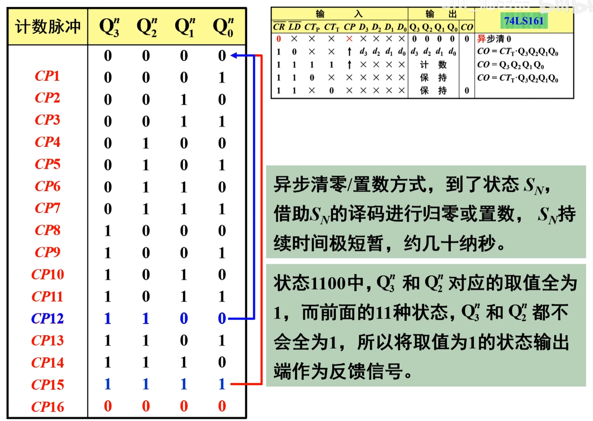

#### 步骤 1：确定关键参数

- 74LS161 异步清零端CR非（低电平有效，立即清零），设计N=12，需找SN = S12状态。

- S12对应的二进制代码：1100（Q3=1，Q2=1，Q1=0，Q0=0）。

#### 步骤 2：推导反馈清零逻辑

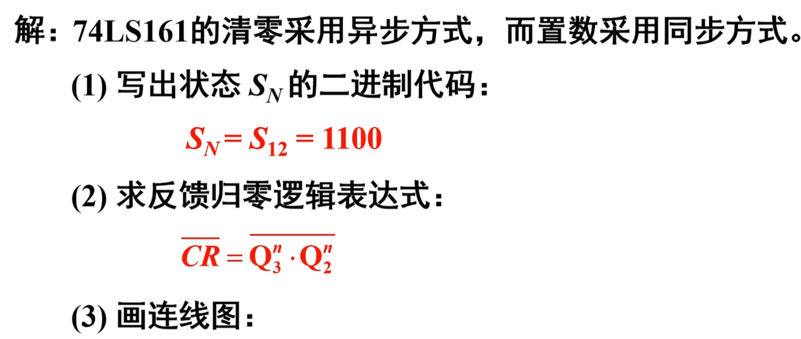

- 仅当计数器处于S12（1100）时，Q3、Q2 同时为 1，因此反馈逻辑为：

CR非 = (Q3 · Q2)非（2 输入端与非门）。

#### 步骤 3：绘制连线图

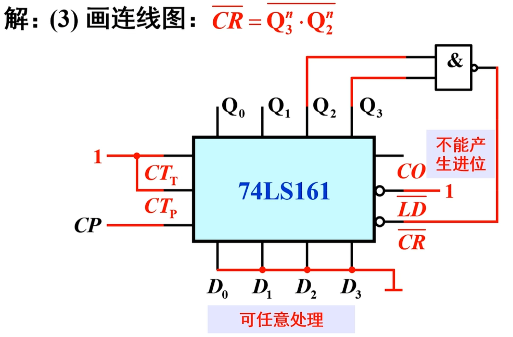

- 电源与使能端：CTT、CTP 接高电平。

- 清零与置数端：CR非接与非门输出，LD非接高电平（无效）。

- 数据输入端：D0~D3 接地（LD非无效，可任意）。

- 脉冲与输出：CP 接外部脉冲，Q3~Q0 为输出。

#### 关键注意点

- 过渡状态S12（1100）存在但可忽略，实际有效状态为0000~1011（12 个）；未到1111，CO 无输出。

### 3. 例题 2：用 74LS197（异步清零 + 异步置数，二 - 八 - 十六进制）设计十二进制计数器

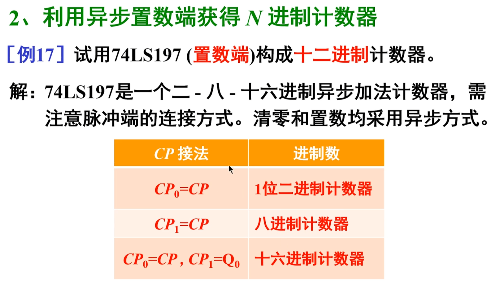

#### 步骤 1：将 74LS197 配置为十六进制计数器

- 74LS197 引脚：CP0（二进制计数端）、CP1（八进制计数端）、CT/LD 非（计数 / 置数控制，0 = 置数，1 = 计数）、MR（异步清零，高电平有效）。

- 十六进制配置：外部脉冲接 CP0，Q0（二进制输出）接 CP1，MR 接低电平（无效），CT/LD 非接高电平（先计数）。

#### 步骤 2：确定关键参数

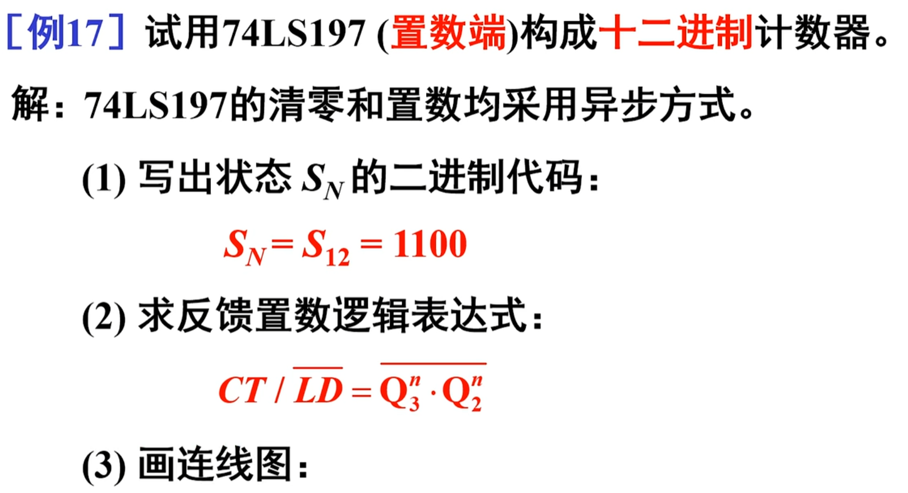

- 设计N=12，异步置数（CT/LD 非 = 0 时立即置数），需找SN = S12（1100）。

#### 步骤 3：推导反馈置数逻辑

- 仅当计数器处于1100时，Q3、Q2 同时为 1，反馈逻辑为：

CT/LD非 = (Q3 · Q2)非（2 输入端与非门）。

#### 步骤 4：绘制连线图

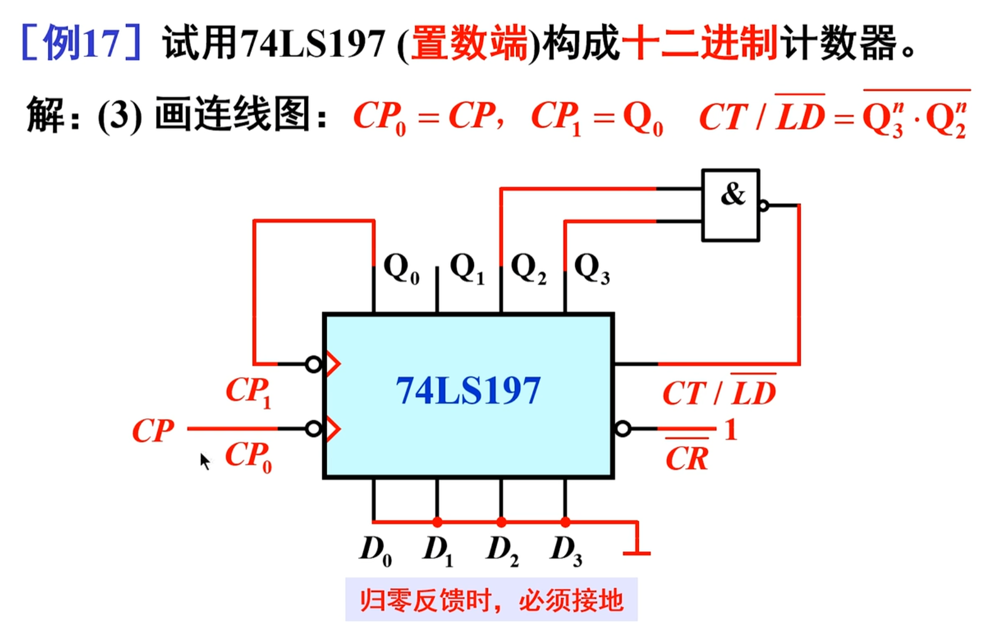

- 脉冲端：外部 CP 接 CP0，Q0 接 CP1（十六进制）。

- 置数与清零端：CT/LD 非接与非门输出，MR 接低电平。

- 数据输入端：D0~D3 接地（需置入S0=0000）。

- 输出：Q3~Q0 为计数器输出。

### 4. 例题 3：用 74LS290（异步清零 + 异步置 9，二 - 五 - 十进制）设计九进制计数器

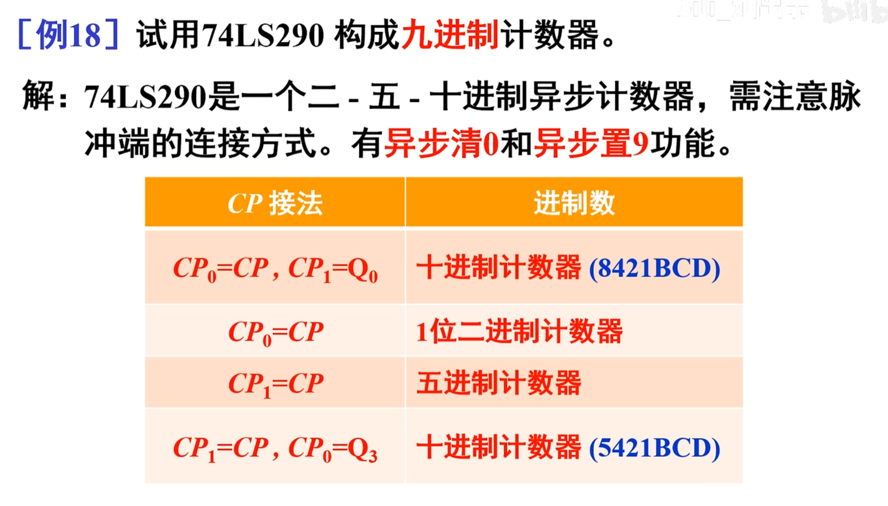

#### 步骤 1：将 74LS290 配置为十进制计数器（8421BCD 码）

- 74LS290 引脚：CP0（二进制端）、CP1（五进制端）、R0A/R0B（异步清零，需同时为 1 才有效）、S9A/S9B（异步置 9，需同时为 1 才有效，置 9 为 1001）。

- 十进制配置：外部脉冲接 CP0，Q0 接 CP1，S9A/S9B 接低电平（无效，禁止置 9）。

#### 步骤 2：确定关键参数

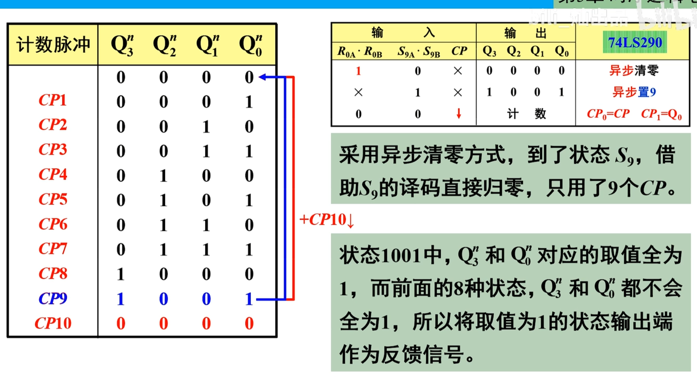

- 设计N=9，异步清零（R0A/R0B=1 时立即清零），需找SN = S9（1001，十进制 9）。

- S9对应的二进制代码：1001（Q3=1，Q0=1）。

#### 步骤 3：推导反馈清零逻辑

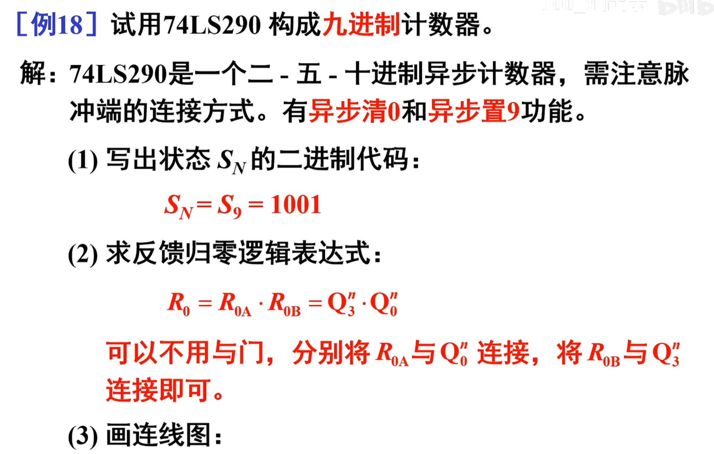

- 仅当计数器处于1001时，Q3、Q0 同时为 1，反馈逻辑为：

R0A = Q3，R0B = Q0（无需门电路，直接连接，因 R0A/R0B 需同时为 1）。

#### 步骤 4：绘制连线图

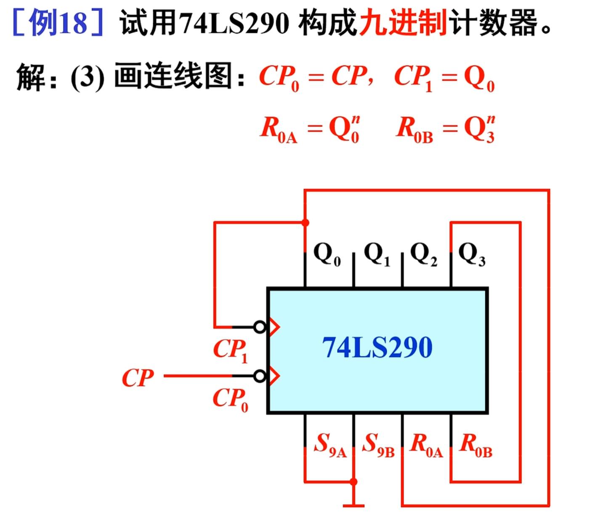

- 脉冲端：外部 CP 接 CP0，Q0 接 CP1（十进制）。

- 清零与置 9 端：R0A 接 Q3，R0B 接 Q0，S9A/S9B 接地。

- 输出：Q3~Q0 为计数器输出（状态循环0000~1000，9 个状态，1001为过渡态）。

#### 仿真注意点

- 部分仿真软件（如 Proteus）中，直接连接 R0A/R0B 可能导致状态异常，需增加与门确保 Q3、Q0 同时为 1 时触发清零。

## 四、仿真验证要点

1. **同步方式仿真现象**：

- 无过渡状态，状态循环稳定（如十二进制0000~1011）。

- 带进位的同步置数设计中，第二圈开始状态循环正常（第一圈可能从0000到1111）。

1. **异步方式仿真现象**：

- 过渡状态（如1100、1001）一闪而过，肉眼难捕捉。

- 74LS290 仿真需注意 R0A/R0B 的触发条件，必要时增加与门优化。

1. **软件工具**：

- Multisim：适合 74LS161/163 仿真，可直观观察 LED 灯状态变化。

- Proteus：适合 74LS197/290 仿真，需注意芯片模型匹配。

## 五、关键总结

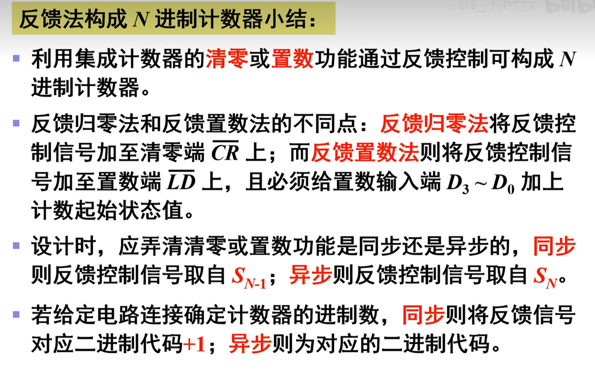

1. **同步 vs 异步核心区别**：

- 同步：触发状态为SN-1，需等 CP 执行操作，无过渡态。

- 异步：触发状态为SN，无需等 CP，SN为过渡态（忽略）。

1. **反馈门选择**：

- 低电平有效端（CR非、LD非）：用与非门（将 “1” 组合转为低电平）。

- 高电平有效端（R0A/R0B）：直接连接或用与门（将 “1” 组合转为高电平）。

- 带进位设计：用非门（CO=1 时转为LD非=0）。

1. **预置数处理**：

- 同步 / 异步置数：D0~D3 必须接目标初始状态（如0000、0100）。

- 同步 / 异步清零：D0~D3 可任意（因置数端无效）。

1. **CO 输出条件**：

- 仅当计数器到1111（全 1）时，CO=1；未到全 1 状态（如同步清零十二进制），CO 无输出。

## 六**、**习题练习

### 列一：

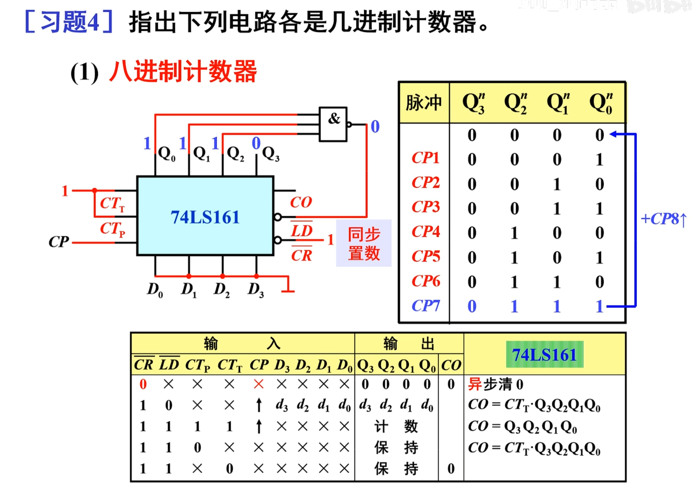

### 列二：

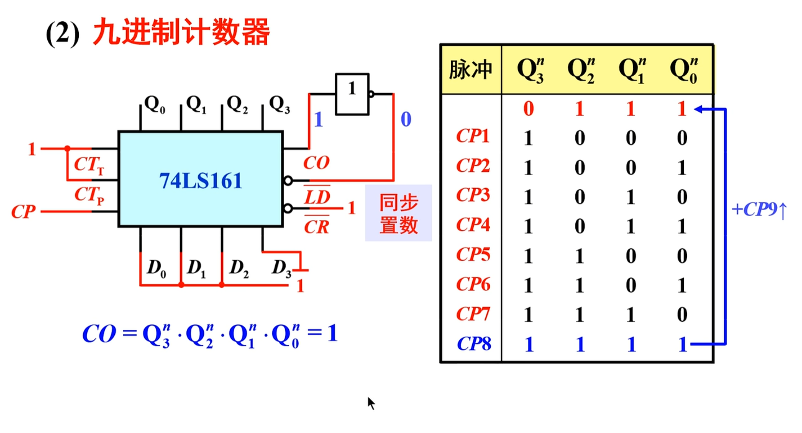

同步置数：可以直接减去，1111-0111=16-7=9  或者8+1=9


### 例三：

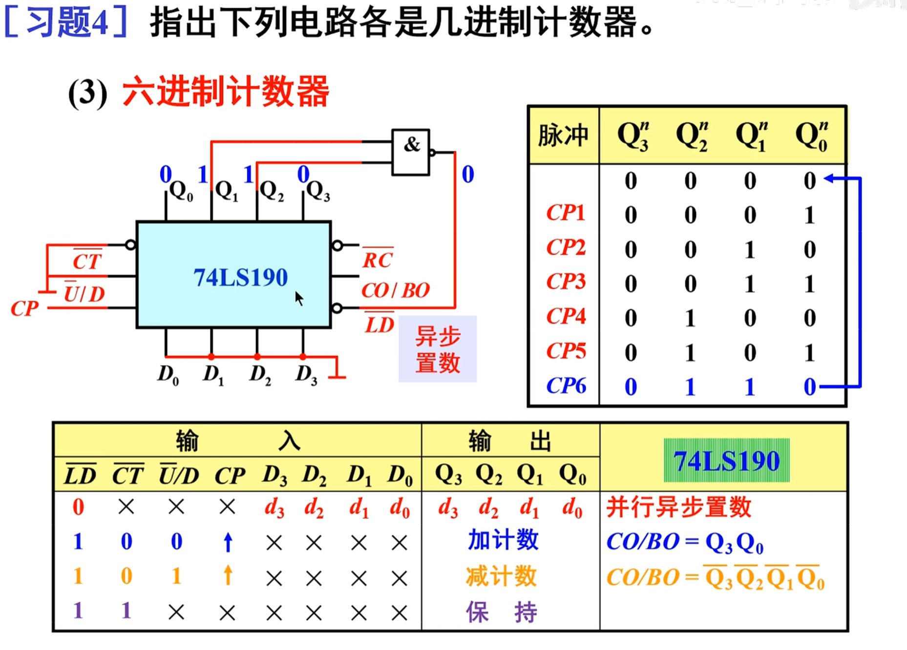

### 列四：

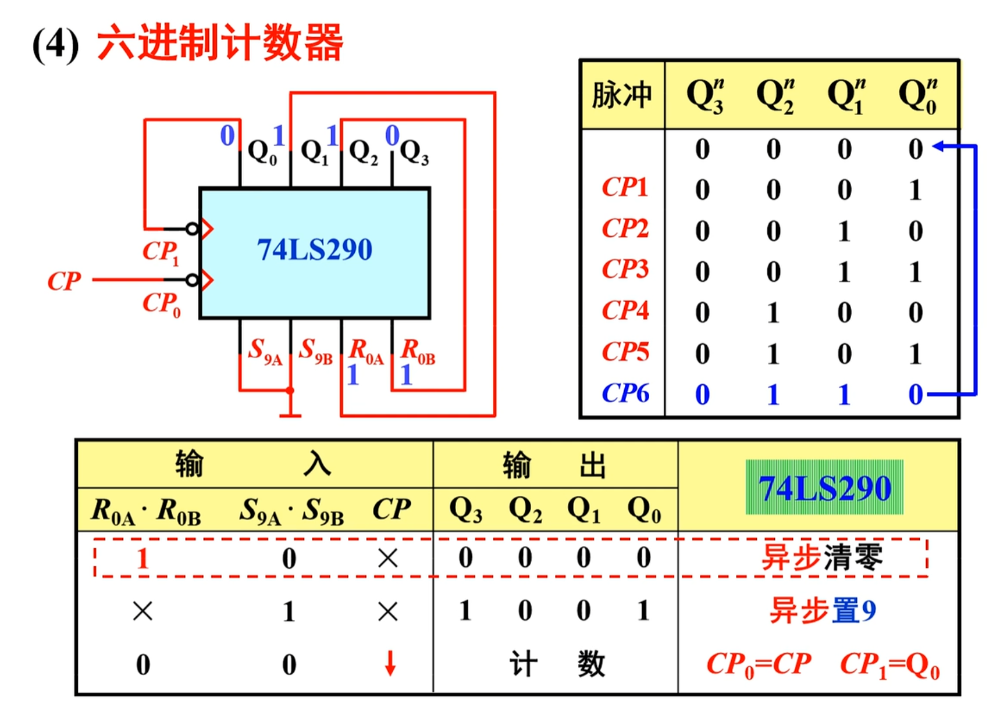


### 列五：

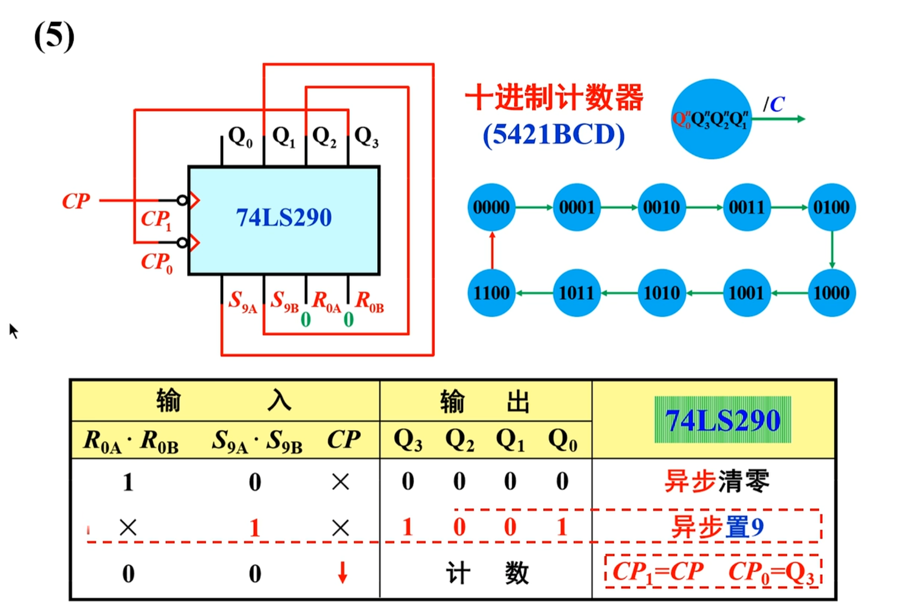

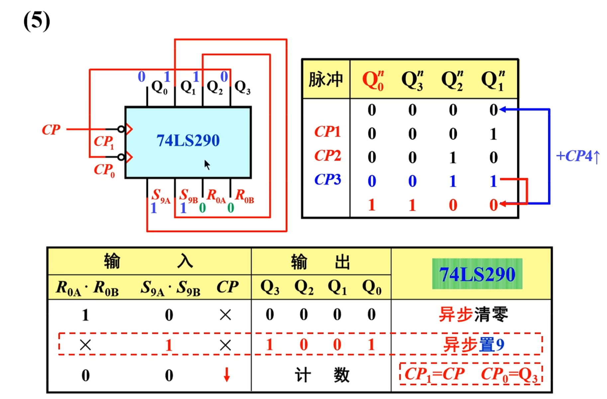

5421bcd码编制，根据题意0110时输出，而输出的是1001，即异步置九，所以需要多走一步才可以回到0000，所以是四进制的

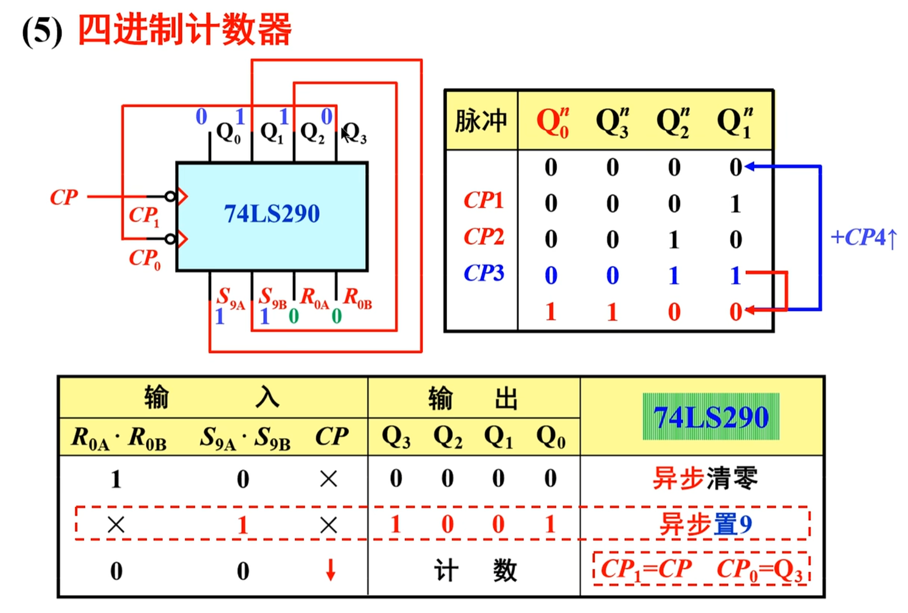


# 大容量 N 进制计数器的设计

## 一、集成计数器容量扩展的核心原理

反馈归零法、反馈置数法仅能实现**小于单芯片模 M**的 N 进制计数器；若需更大容量，需采用**级联**方式：将模分别为 M₁、M₂、…、Mₘ的多片同类型计数器串联，总计数容量（总模）为各芯片模的乘积，即**总模 = M₁×M₂×…×Mₘ**。级联是实现大容量 N 进制计数器的基础手段。

## 二、集成计数器级联扩展的具体实现（含例题）

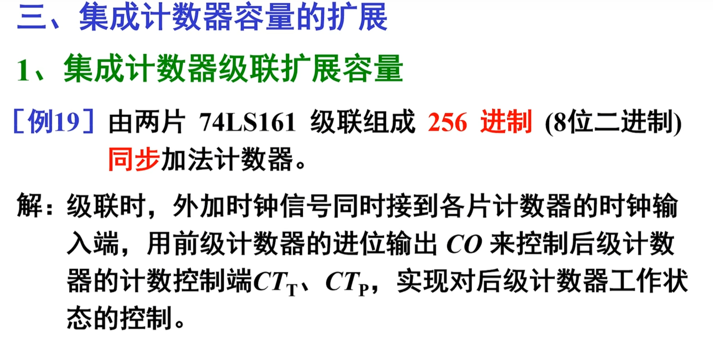

级联分为**同步级联**（多片时钟同步）和**异步级联**（多片时钟异步），视频分别以 74LS161（同步计数器）、74LS290（异步计数器）为核心芯片讲解实例。

### （一）同步级联：两片 74LS161 构成 256 进制同步加法计数器（例 19）

#### 1. 74LS161 芯片基础参数

- 类型：4 位二进制同步加法计数器；

- 单芯片模 M：16（计数范围 0000~1111）；

- 核心控制端：

- CTT、CTP：计数使能端，**需同时为 1**才允许计数器加 1；

- CR 非（清零端）：低电平有效，**异步清零**（无需时钟触发）；

- LD 非（置数端）：低电平有效，**同步置数**（需时钟触发才载入并行数据）；

- CO（进位输出端）：仅当计数到 1111 时，CO=1（表示进位），其余状态 CO=0。

#### 2. 级联逻辑

两片 74LS161 级联，单芯片模 16，总模 = 16×16=256，对应 8 位二进制计数（范围 00000000~11111111），需保证多片时钟同步以避免计数误差。

#### 3. 具体连线方案

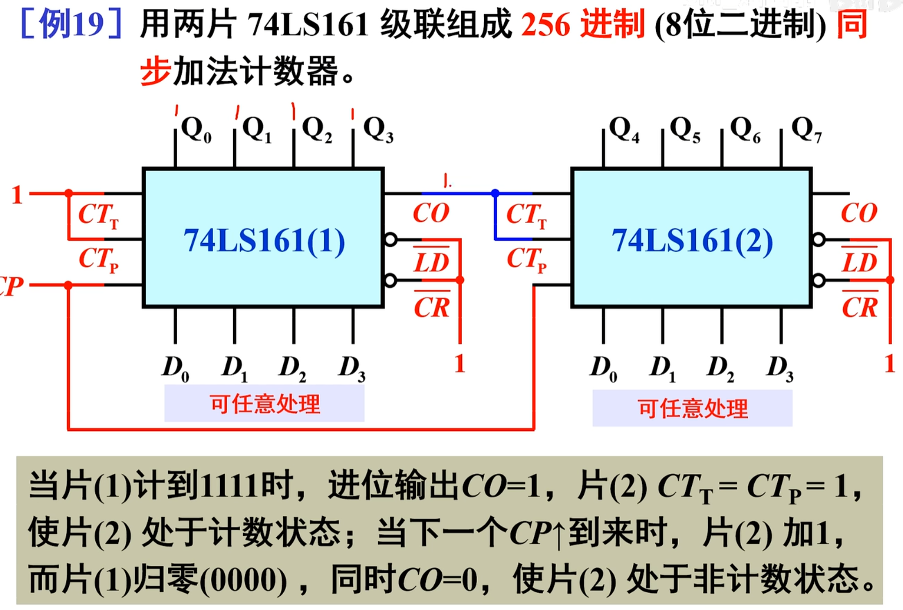

| 连接对象                       | 连接方式                                                     |
| ------------------------------ | ------------------------------------------------------------ |
| 时钟端（CP）                   | 两片 74LS161 的 CP 端共接外部时钟信号（确保所有芯片同步计数） |
| 计数使能端（CTT/CTP）          | 低位片（片 1）CTT、CTP 接高电平（始终允许计数）；低位片 CO 端接高位片（片 2）CTT、CTP（控制高位片使能） |
| 清零 / 置数端（CR 非 / LD 非） | 两片 CR 非、LD 非均接高电平（不触发清零、不触发置数）        |
| 并行数据端（D0~D3）            | 两片 D0~D3（片 2 为 D4~D7）任意处理（因 LD 非无效，并行数据不载入） |
| 输出端                         | 片 1 输出 Q0~Q3（低 4 位），片 2 输出 Q4~Q7（高 4 位），构成 8 位二进制输出 |

#### 4. 工作过程分析

1. 初始状态：两片均为 0000（整体 00000000）；

1. 第 1~16 个 CP 上升沿：低位片从 0000→0001→…→1111，高位片因 CTT/CTP=0（低位 CO=0），保持 0000；

1. 第 16 个 CP 后：低位片计数到 1111，CO=1，高位片 CTT/CTP=1（允许计数）；

1. 第 17 个 CP 上升沿：低位片归零（1111→0000），高位片加 1（0000→0001）；

1. 重复步骤 2~4，直至整体计数到 11111111（第 256 个 CP），下一个 CP 整体归零，完成一次 256 进制计数。

### （二）异步级联：两片 74LS290 构成 100 进制异步加法计数器

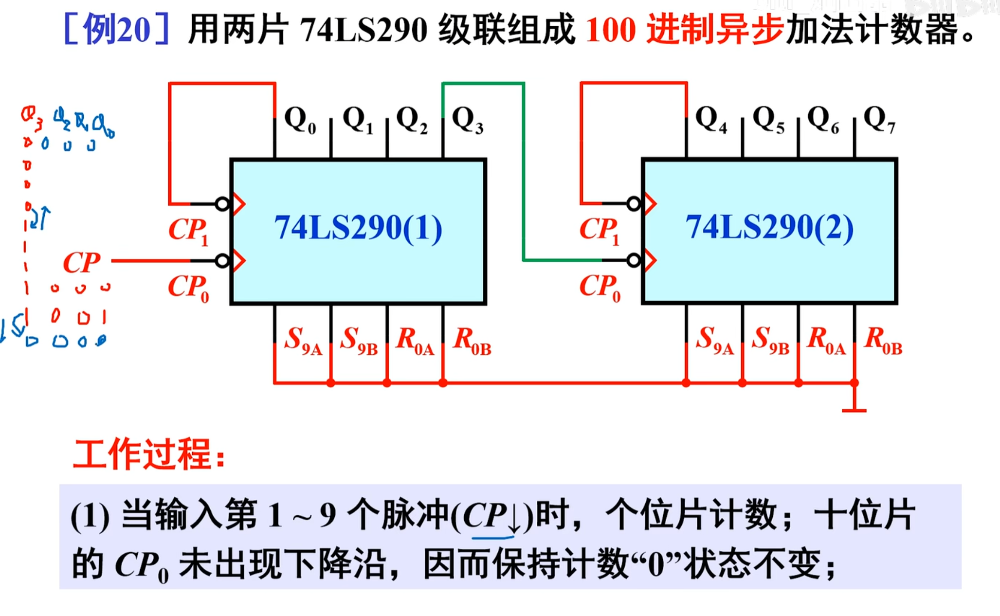

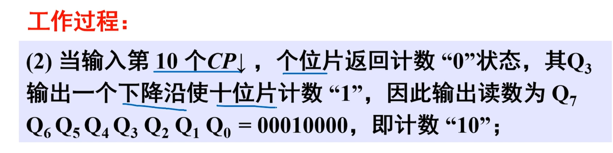

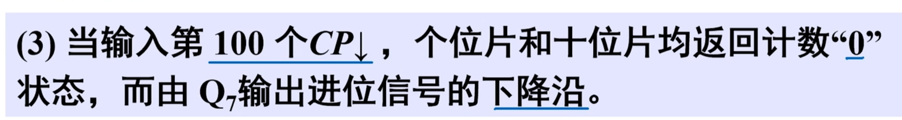

#### 1. 74LS290 芯片基础参数

- 类型：二 - 五 - 十进制异步加法计数器（需手动配置为十进制）；

- 十进制配置方法：将 Q0（2 进制输出端）接 CP1（5 进制时钟端），构成 10 进制（模 M=10，计数范围 0000~1001）；

- 核心控制端：

- S9A、S9B：置 9 端，**均为 1 时置 9**（直接输出 1001）；

- R0A、R0B：清零端，**均为 1 时异步清零**；

- CP0、CP1：时钟端，**下降沿触发**（仅时钟从 1→0 时触发计数）。

#### 2. 级联逻辑

两片配置为十进制的 74LS290 级联，总模 = 10×10=100（对应 2 位 BCD 码，范围 00000000~00001001 00001001），高位时钟由低位输出控制（异步）。

#### 3. 具体连线方案

| 连接对象                | 连接方式                                                     |
| ----------------------- | ------------------------------------------------------------ |
| 时钟端（CP0/CP1）       | 低位片（片 1，个位）CP0 接外部时钟；低位片 Q0 接 CP1（配置为十进制）；低位片 Q3 接高位片（片 2，十位）CP0（控制高位时钟） |
| 清零 / 置 9 端（R0/S9） | 两片 S9A、S9B、R0A、R0B 均接地（不置 9、不清零）             |
| 输出端                  | 片 1 输出 Q0~Q3（个位 BCD 码），片 2 输出 Q4~Q7（十位 BCD 码） |

#### 4. 工作过程分析

1. 初始状态：两片均为 0000（整体 00000000）；

1. 第 1~9 个 CP 下降沿：低位片从 0000→0001→…→1001，高位片因 CP0 无下降沿（低位 Q3=1 未变），保持 0000；

1. 第 10 个 CP 下降沿：低位片从 1001→0000，Q3 产生下降沿（1→0），触发高位片加 1（0000→0001）；

1. 第 11~19 个 CP 下降沿：低位片重复 0000→1001，高位片保持 0001；

1. 重复步骤 2~4，直至整体计数到 00001001 00001001（第 100 个 CP），下一个 CP 整体归零，完成一次 100 进制计数。

## 三、级联结合反馈法设计大容量 N 进制计数器（以 60 进制为例）

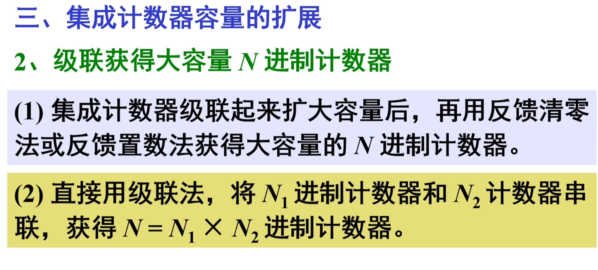

当需设计 “单芯片模 < M < 级联总模” 的 N 进制计数器时，视频给出两类思路：①先级联成总模，再用反馈归零 / 置数；②先将单芯片构造成小进制，再级联。均以 “两片 74LS161 设计 60 进制” 为例讲解。

### （一）方法 1：先级联 256 进制，再异步清零（利用 CR 非）

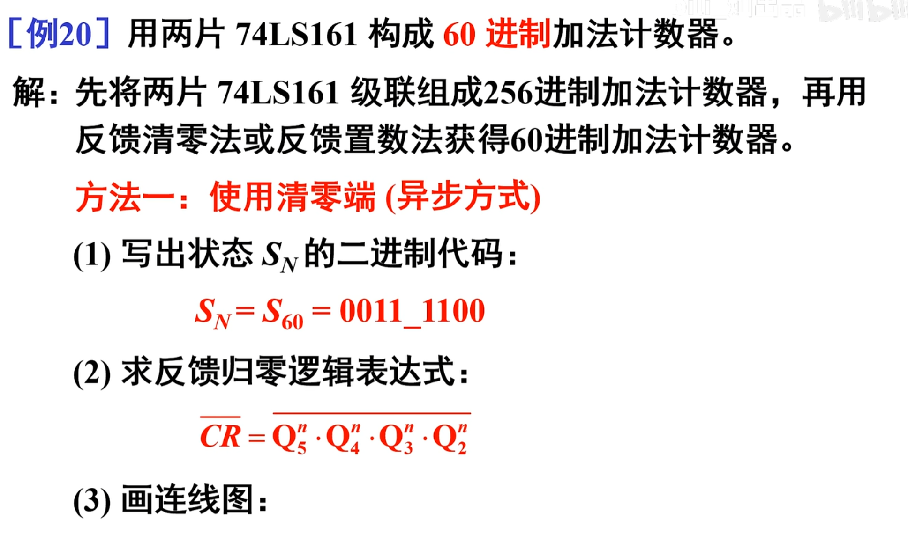

#### 1. 核心逻辑

先按 “例 19” 将两片 74LS161 接成 256 进制，再通过**异步清零**（CR 非低电平有效），使计数到 60 时整体清零，最终实现 60 进制。

#### 2. 关键计算与反馈逻辑

- 60 的 8 位二进制码：00111100（对应 Q7~Q0：Q5=1、Q4=1、Q3=1、Q2=1，其余为 0）；

- 反馈电路：需检测 “计数到 60” 的状态，通过**四输入与非门**将 Q5、Q4、Q3、Q2 的高电平信号转换为低电平，触发两片 CR 非异步清零。

#### 3. 具体连线

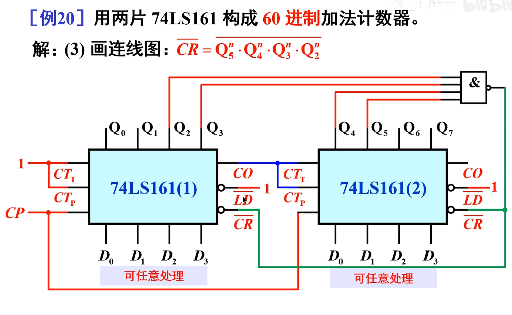

- 基础连线：同 256 进制（CP 共接、低位 CO 接高位 CTT/CTP、LD 非接高）；

- 反馈新增：四输入与非门输入端接 Q5、Q4、Q3、Q2，输出端接两片 CR 非。

#### 4. 工作过程

1. 计数从 00000000 开始，每 CP 上升沿 + 1；

1. 当计数到 00111100（60）时，与非门输出低电平，CR 非有效，两片立即清零（无需 CP）；

1. 清零后，Q5~Q2 恢复低电平，与非门输出高电平，CR 非无效，进入下一轮计数，实现 60 进制。

### （二）方法 2：先级联 256 进制，再同步置数（利用 LD 非）

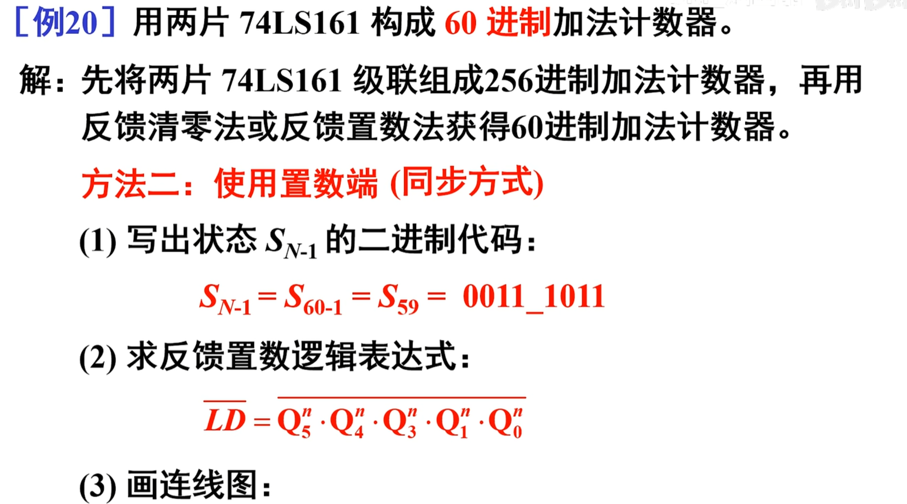

#### 1. 核心逻辑

74LS161 的 LD 非为**同步置数**（需 CP 触发），需计数到 “60-1=59” 时触发置数，下一个 CP 将计数器置 0，避免异步清零的 “短暂过渡状态”。

#### 2. 关键计算与反馈逻辑

- 59 的 8 位二进制码：00111011（对应 Q7~Q0：Q5=1、Q4=1、Q3=1、Q1=1、Q0=1，其余为 0）；

- 反馈电路：无 5 输入与非门，需用 “3 输入与门 + 2 输入与门 + 非门” 组合：3 输入与门接 Q5、Q4、Q3，2 输入与门接 Q1、Q0，两与门输出接另一与门，最终经非门输出低电平，触发两片 LD 非；

- 并行数据端：两片 D0~D7 接地（置数目标为 00000000）。

#### 3. 具体连线

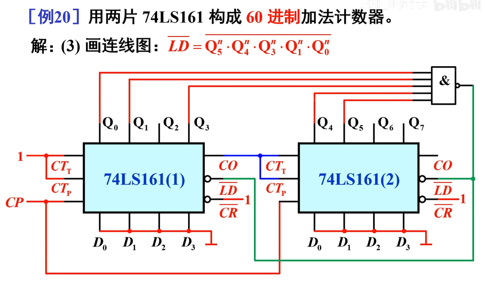

- 基础连线：同 256 进制（CP 共接、低位 CO 接高位 CTT/CTP、CR 非接高）；

- 反馈新增：上述 “与门 + 非门” 组合，输出接两片 LD 非；

- 数据端：两片 D0~D7 接地。

#### 4. 工作过程

1. 计数从 00000000 开始，每 CP 上升沿 + 1；

1. 当计数到 00111011（59）时，反馈电路输出低电平，LD 非有效；

1. 下一个 CP 上升沿：计数器同步置 0（载入 D0~D7 的 0 信号），进入下一轮计数，实现 60 进制。

### （三）方法 3：先构小进制，再级联（十进制 + 六进制 = 60 进制）


核心逻辑：将两片 74LS161 分别构造成十进制（N₁=10）和六进制（N₂=6），级联后总模 = 10×6=60，分 3 种子情况优化。

#### 子情况 1：用异步清零构小进制，反馈信号级联

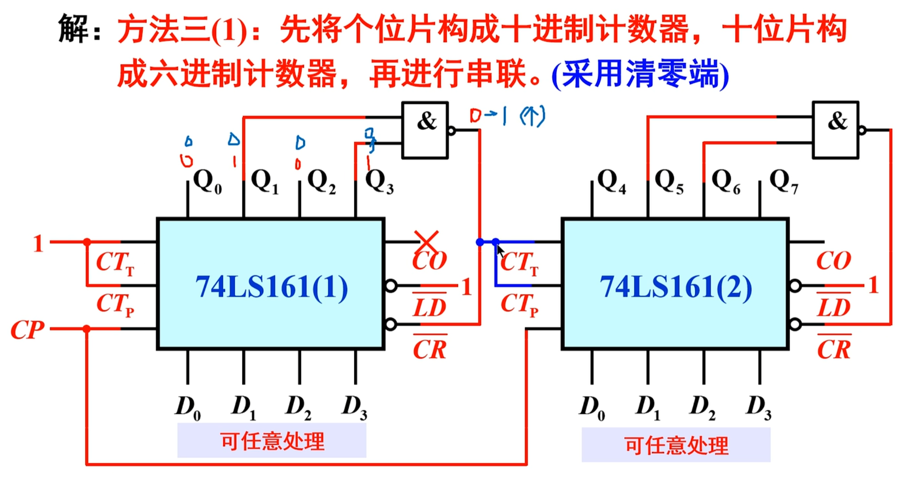

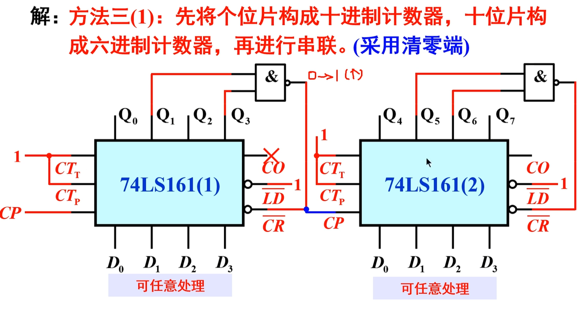

1. 小进制构造：

- 低位片（十进制）：S₁₀=1010（二进制），Q3、Q1 接两输入与非门，输出接低位 CR 非（计数到 10 时异步清零）；CTT、CTP 接高，CP 接外部时钟；

- 高位片（六进制）：S₆=0110（二进制），Q6、Q5 接两输入与非门，输出接高位 CR 非（计数到 6 时异步清零）；CTT、CTP 接高。

1. 级联逻辑：低位片的清零反馈信号（与非门输出）接高位片 CP 端（低位归零触发高位计数）；

1. 工作过程：低位每 10 个 CP 清零一次，清零信号触发高位 + 1；高位每 6 次 “低位清零” 清零一次，总计数 = 10×6=60。

#### 子情况 2：用同步置数构小进制，反馈信号级联

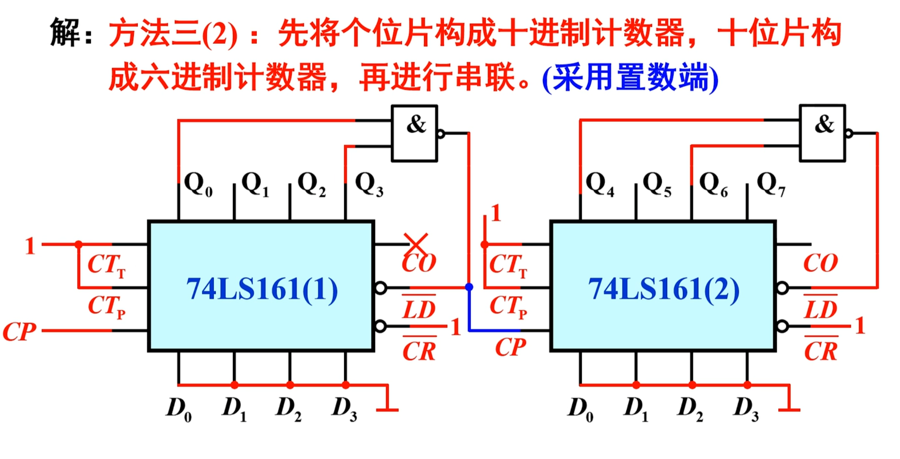

1. 小进制构造：

- 低位片（十进制）：S₉=1001（10-1=9，二进制），Q3、Q0 接两输入与非门，输出接低位 LD 非；D0~D3 接地（置 0）；CTT、CTP 接高，CP 接外部时钟；

- 高位片（六进制）：S₅=0101（6-1=5，二进制），Q6、Q4 接两输入与非门，输出接高位 LD 非；D0~D3 接地；CTT、CTP 接高。

1. 级联逻辑：低位片的置数反馈信号接高位片 CP 端（低位置 0 触发高位计数）；

1. 工作过程：低位每 10 个 CP 置 0 一次，置 0 信号触发高位 + 1；高位每 6 次 “低位置 0” 置 0 一次，总计数 = 10×6=60。

#### 子情况 3：用置数 + CO 级联（避免反馈信号误差）

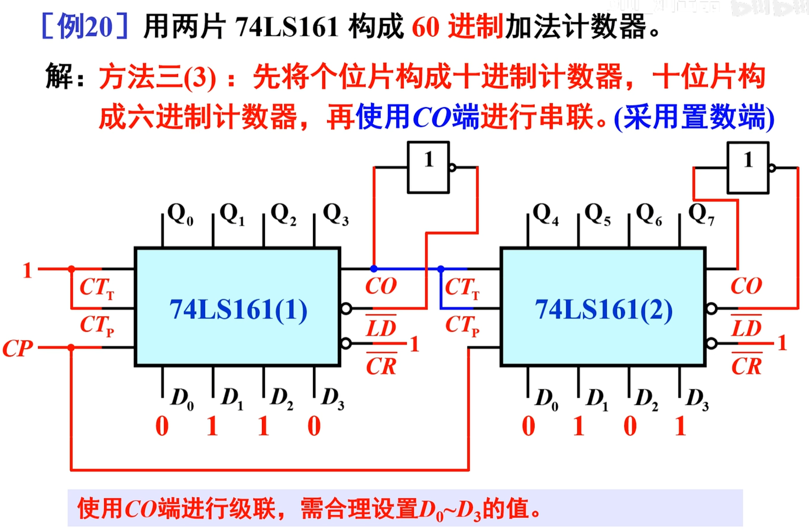

1. 核心优势：利用 CO 端（仅 1111 时输出 1）控制级联，需调整预置数使小进制计数能到 1111（CO 有效），电路更稳定。

1. 预置数计算：预置数 = 单芯片最大模 - 小进制模（74LS161 最大模 16）：

- 低位片（十进制）：预置数 = 16-10=6（二进制 0110），D0~D3 接 0110；CO 经非门接低位 LD 非（计数到 1111 时置数为 0110）；

- 高位片（六进制）：预置数 = 16-6=10（二进制 1010），D0~D3 接 1010；CO 经非门接高位 LD 非（计数到 1111 时置数为 1010）。

1. 级联逻辑：低位 CO 接高位 CTT/CTP（低位到 1111 时，高位允许计数）；

1. 工作过程：

- 低位从 0110 开始，10 个 CP 后到 1111，CO=1：触发低位置 0110，同时允许高位计数；

- 高位从 1010 开始，6 次 “低位 CO=1” 后到 1111，触发高位置 1010；

- 总计数 = 10×6=60，且 CO 端稳定，无需复杂反馈信号。

## 四、视频强调的关键注意事项

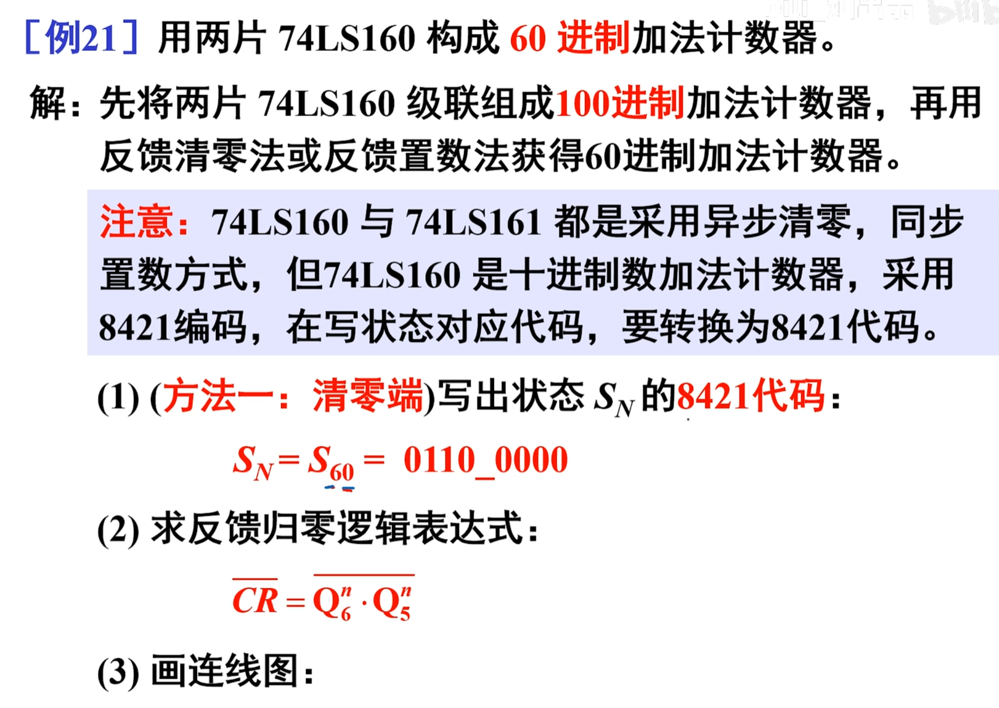

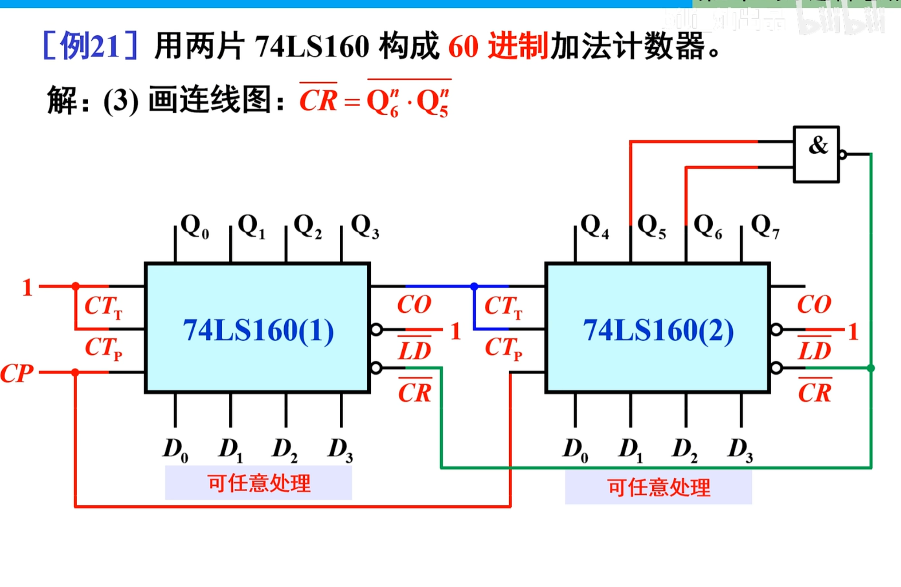

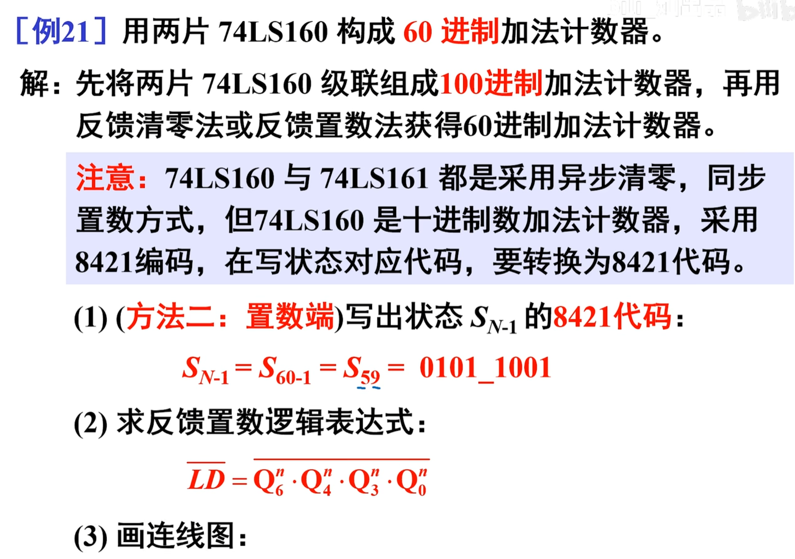

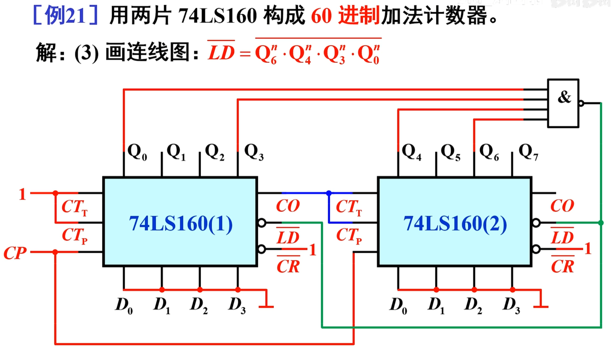

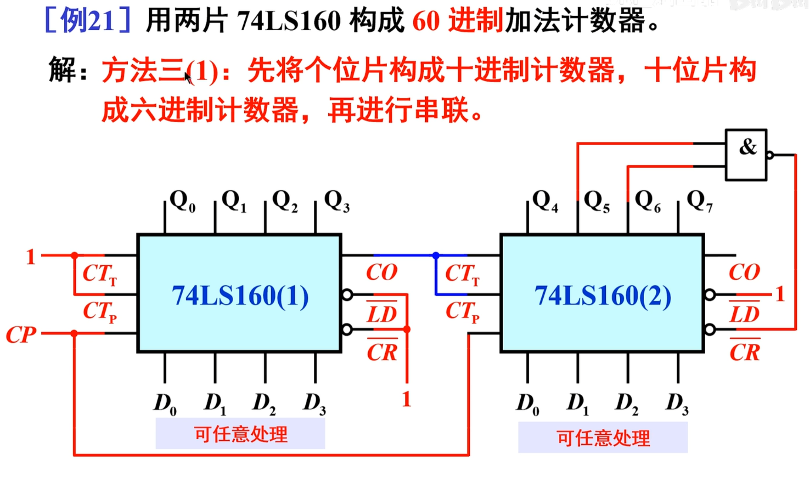

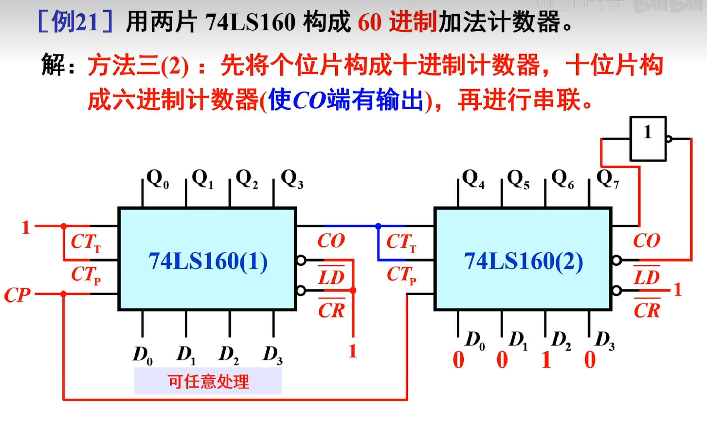

1. 同步 vs 异步级联区别：

- 同步级联：CP 共接，高位由低位 CO 控制，计数无时延（适合高速场景，如 74LS161）；

- 异步级联：高位 CP 由低位输出控制，存在时延（适合低速场景，如 74LS290）。

1. CO 端使用条件：

- 仅当计数器到最大状态（74LS161→1111、74LS290→1001）时，CO=1；

- 若小进制未到最大状态（如方法 3 子情况 1 的十进制），CO 始终为 0，需用反馈信号（而非 CO）控制级联。

1. 异步清零 vs 同步置数区别：

- 异步清零：到目标值直接清零，状态短暂（如方法 1）；

- 同步置数：到目标值 - 1 时，下一个 CP 置数，状态稳定（如方法 2）。

1. 预置数计算规则：

- 当用 CO 反馈置数时，预置数 = 单芯片最大模 - 小进制模（如 74LS161 十进制预置数 = 16-10=6）。


# 寄存器

 ## 一、本节学习要求

1. 掌握基本寄存器和移位寄存器的工作原理、逻辑功能及使用方法 
2. 了解集成移位寄存器的应用

## 二、寄存器的作用与分类

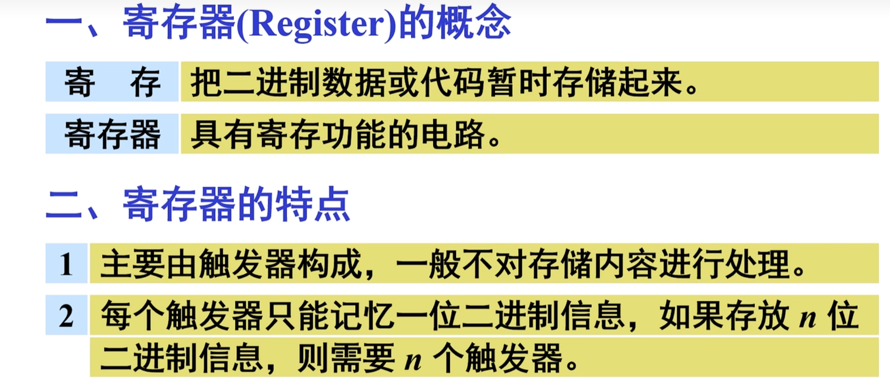

### （一）寄存器的概念

1. 日常生活类比：外出旅行寄存行李、超市物品寄存柜（临时存放物品）

1. 数字电路定义：暂存二进制数据或代码的操作称为 “寄存”，实现该功能的电子电路称为 “寄存器”

1. 应用场景：

- 集成电路中重要的存储单元

- CPU 内部核心元件，包括通用寄存器、专用寄存器、控制寄存器，用于暂存指令、数据和地址

### （二）寄存器的特点

1. 构成：由触发器组成，且不对存储内容进行处理（输入数据与输出数据一致）

1. 存储容量：1 个触发器仅能记忆 1 位二进制信息，存放 n 位二进制信息需 n 个触发器

### （三）寄存器的分类

1. 按功能分类

| 类型       | 功能特点                               | 输入输出方式                               |
| ---------- | -------------------------------------- | ------------------------------------------ |
| 基本寄存器 | 功能简单，仅实现 “暂存数据”            | 仅支持**并入并出**                         |
| 移位寄存器 | 功能丰富，可实现数据串并转换、并串转换 | 支持并入并出、并入串出、串入并出、串入串出 |

1. 按开关元件分类

- TTL 型寄存器：采用 TTL 工艺的开关元件

- CMOS 型寄存器：采用 CMOS 工艺的开关元件

## 三、基本寄存器

### （一）4 边沿 D 触发器构成的基本寄存器（示例电路）

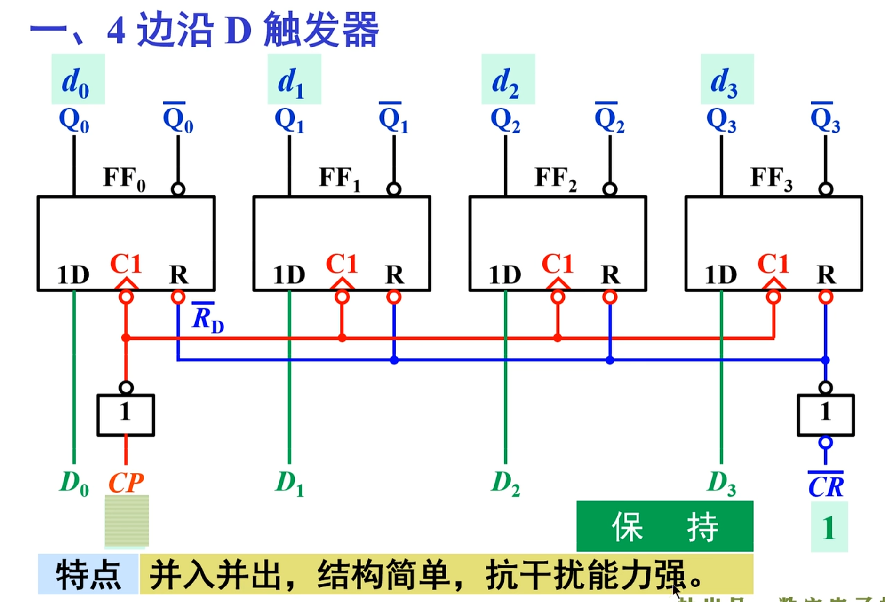

1. 电路结构

- 核心：4 个**下降沿触发的 D 触发器**（FF0~FF3）

- 控制端连接：

- 所有触发器的 “RD 非”（异步清零端）连在一起，经非门接 “CR 非”（清零控制端）

- 所有触发器的 CP 端连在一起，经非门接外部 CP 脉冲（使原下降沿触发变为**上升沿触发**）

- 数据端：D0~D3（并行数据输入端），Q0~Q3（并行数据输出端）

1. 工作过程

| 控制信号                        | 操作功能 | 具体表现                                                     |
| ------------------------------- | -------- | ------------------------------------------------------------ |
| CR 非 = 0（低电平）             | 异步清零 | 无需等待 CP 脉冲，Q0~Q3 立即变为 0，Q0 非～Q3 非立即变为 1   |
| CR 非 = 1（高电平）且 CP 上升沿 | 同步送数 | D0~D3 的并行数据经 CP 上升沿锁存到触发器，Q0=D0、Q1=D1、Q2=D2、Q3=D3 |
| CR 非 = 1 且无 CP 边沿          | 数据保持 | Q0~Q3 保持当前值，不随 D0~D3 变化                            |

1. 功能总结：仅支持 “并入并出”，结构简单、抗干扰能力强

### （二）集成基本寄存器：74LS175（16 管脚）

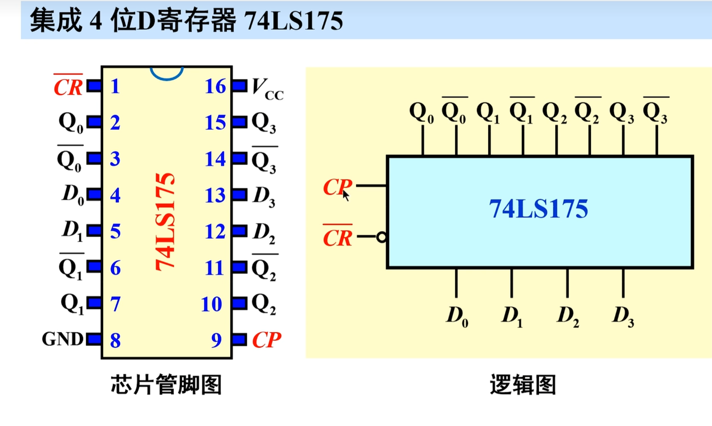

1. 管脚功能

- 数据输入：D0~D3（4 位并行数据输入端）

- 数据输出：Q0~Q3（4 位并行数据输出端）、Q0 非～Q3 非（4 位反相并行输出端）

- 控制端：CP（时钟脉冲端，上升沿触发）、CR 非（异步清零端，低电平有效）

1. 仿真实验（视频示例）

- 电路连接：

- D0~D3 接拨码开关（拨左为 1，拨右为 0）

- CR 非接单刀开关（打开为 1，闭合为 0）

- CP 接单刀双掷开关（可切换手动脉冲 / 连续脉冲，手动脉冲 “闭合为 0、打开为 1”，打开时产生上升沿）

- 实验过程：

1. 清零操作：闭合 CR 非开关（CR 非 = 0），Q0~Q3 立即全为 0（与 CP 无关）

1. 送数操作：打开 CR 非开关（CR 非 = 1），拨码开关设为 “0101”，打开 CP 手动脉冲（产生上升沿），Q0~Q3 变为 0101

1. 保持操作：CR 非 = 1 且无 CP 边沿，Q0~Q3 保持 0101，即使拨码开关改为 “1111” 也不变

## 四、移位寄存器

### （一）移位寄存器的分类

- **单向移位寄存器**：**仅支持**左移或右移，包括**左移寄存器、右移寄存器**

- **双向移位寄存器**：可通过**控制端**切换左移 / 右移方向

### （二）单向移位寄存器（示例电路：4 位）

#### 1. 右移寄存器

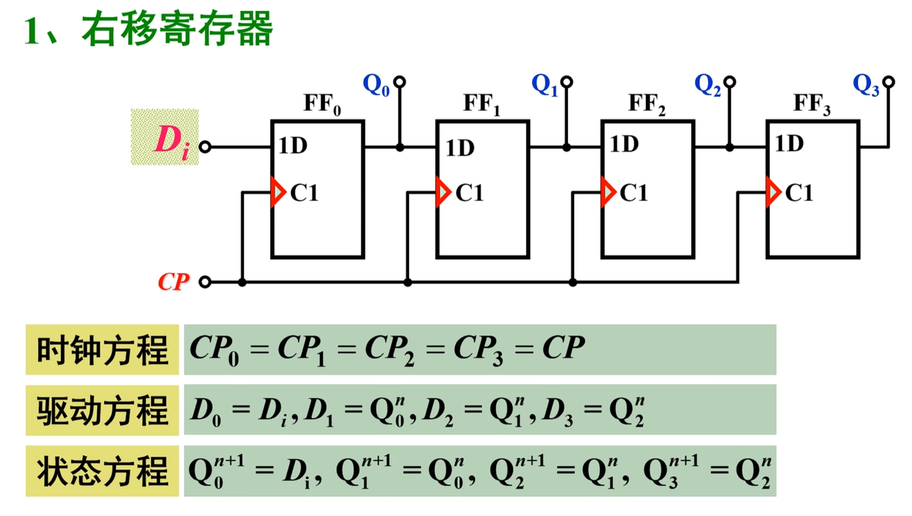

1. 电路结构

- 核心：4 个**上升沿触发的 D 触发器**（FF0~FF3）

- 数据连接：FF1 的 D1 接 FF0 的 Q0，FF2 的 D2 接 FF1 的 Q1，FF3 的 D3 接 FF2 的 Q2，FF0 的 D0 接外部串行数据 Di

- 控制端：CP（同步移位脉冲，上升沿有效）

- 输出端：Q0~Q3（并行输出）、Q3（串行输出）

1. 工作过程（视频示例：输入串行数据 Di=0000_1011）

| CP 脉冲次数 | 串行输入 Di | 触发器状态（Q0Q1Q2Q3） | 输出方式          | 输出结果             |
| ----------- | ----------- | ---------------------- | ----------------- | -------------------- |
| 0           | -           | 0000                   | -                 | -                    |
| 1           | 1（最低位） | 1000                   | -                 | -                    |
| 2           | 1           | 1100                   | -                 | -                    |
| 3           | 0           | 0110                   | -                 | -                    |
| 4           | 1（最高位） | 1011                   | 并行输出（Q0~Q3） | 1011                 |
| 5           | 0           | 0101                   | 串行输出（Q3）    | 1（第 1 位串行输出） |
| 6           | 0           | 0010                   | 串行输出（Q3）    | 1（第 2 位串行输出） |
| 7           | 0           | 0001                   | 串行输出（Q3）    | 0（第 3 位串行输出） |
| 8           | 0           | 0000                   | 串行输出（Q3）    | 1（第 4 位串行输出） |

1. 功能总结：实现 “串入并出”（4 个 CP 后并行输出 1011）、“串入串出”（8 个 CP 后串行输出 1011）

#### 2. 左移寄存器

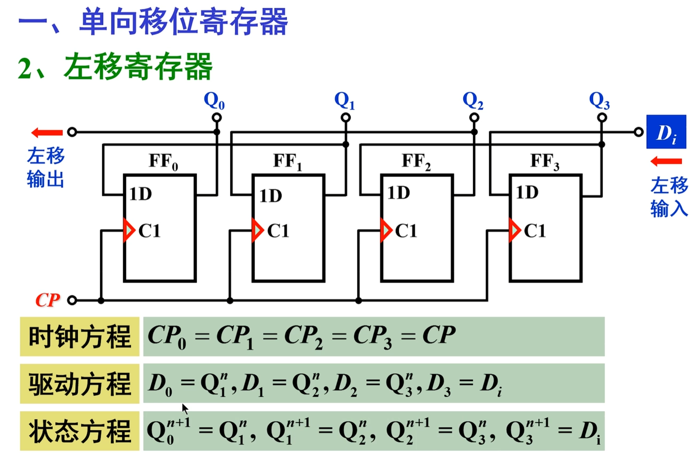

1. 电路结构：与右移寄存器对称，FF0 的 D0 接 FF1 的 Q1，FF1 的 D1 接 FF2 的 Q2，FF2 的 D2 接 FF3 的 Q3，FF3 的 D3 接外部串行数据 Di

1. 工作特点：串行数据从 FF3 的 D3 输入，CP 上升沿时数据向左移位，Q0 为串行输出端

### （三）集成移位寄存器

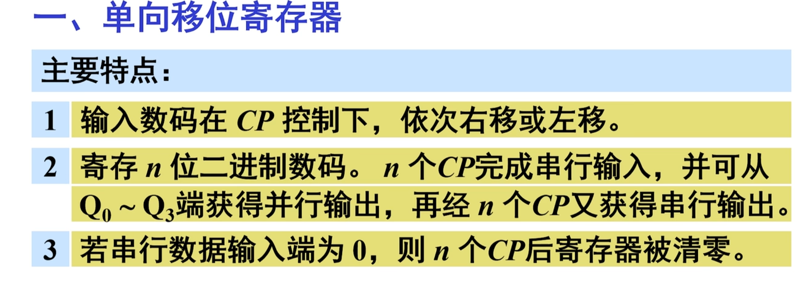

#### 1. 8 位右移寄存器：74LS164（14 管脚）

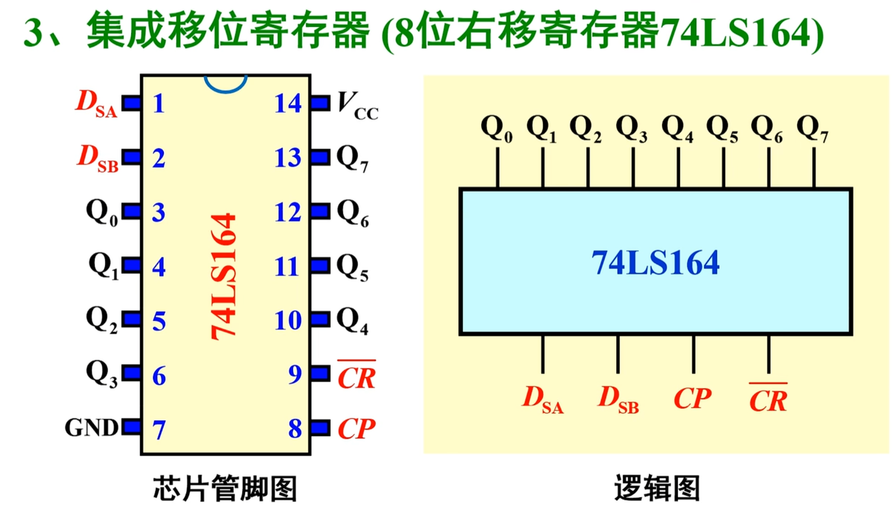

1. 管脚功能

	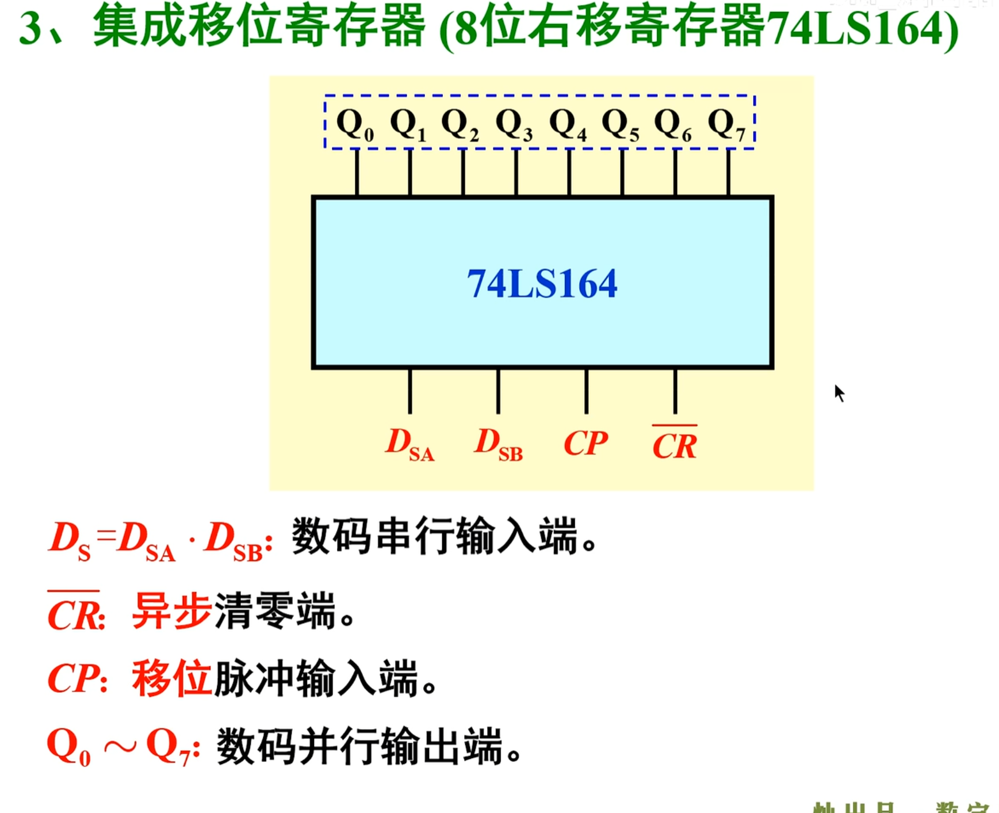

- 串行数据输入：DSA、DSB（需同时为 1 才输入 1，相当于 “与” 逻辑，仅 1 个有效时输入 0）

- 并行数据输出：Q0~Q7（8 位并行输出端）

- 控制端：CP（移位脉冲，上升沿有效）、CR 非（异步清零端，低电平有效）

1. 功能表

	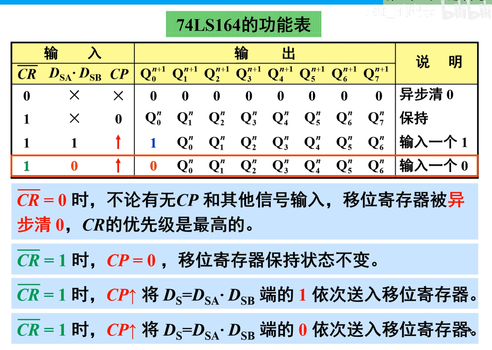

| CR 非 | DSA & DSB | CP         | 功能       | Q0~Q7 状态                  |
| ----- | --------- | ---------- | ---------- | --------------------------- |
| 0     | ×         | ×          | 异步清零   | 全 0                        |
| 1     | ×         | 0 或无边沿 | 数据保持   | 保持当前值                  |
| 1     | 1         | 上升沿     | 右移输入 1 | Q0=1，Q1=Q0 旧，…，Q7=Q6 旧 |
| 1     | 0         | 上升沿     | 右移输入 0 | Q0=0，Q1=Q0 旧，…，Q7=Q6 旧 |

1. 仿真实验（视频示例）

- 电路连接：DSA、DSB 接同一拨码开关，CR 非接单刀开关，CP 接手动脉冲，Q0~Q7 接 8 盏 LED 灯

- 实验过程：

1. 清零：CR 非 = 0，8 盏灯全灭（Q0~Q7=0）

1. 右移输入 1：CR 非 = 1，DSA=DSB=1，每按 1 次 CP 手动脉冲，LED 灯从 Q0 到 Q7 依次点亮（1 右移）

1. 右移输入 0：DSA=DSB=0，每按 1 次 CP 手动脉冲，LED 灯从 Q0 到 Q7 依次熄灭（0 右移）

#### 2. 4 位双向移位寄存器：74LS194（16 管脚）

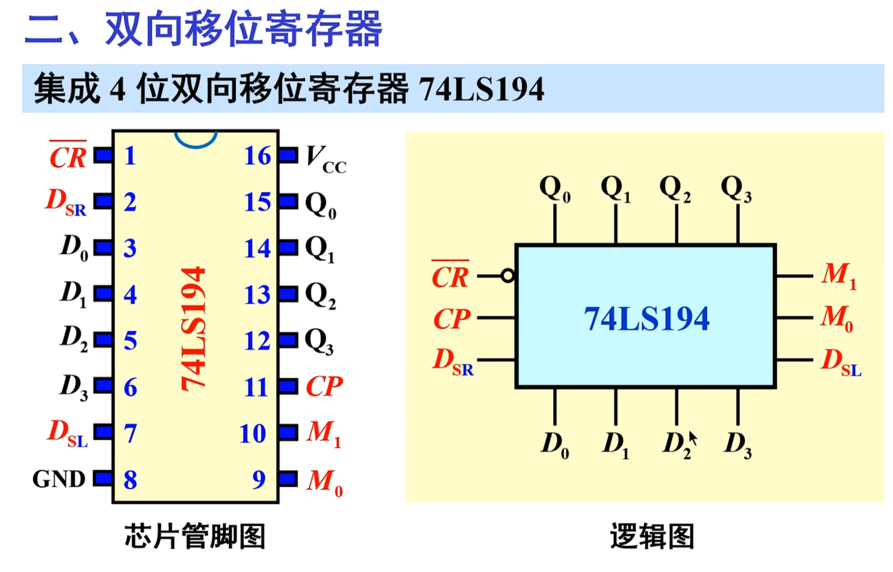

1. 管脚功能

	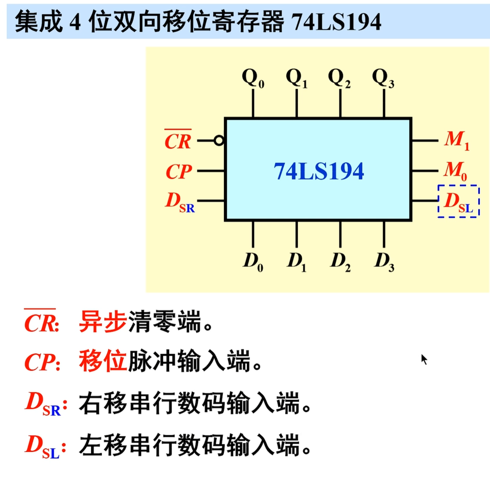

	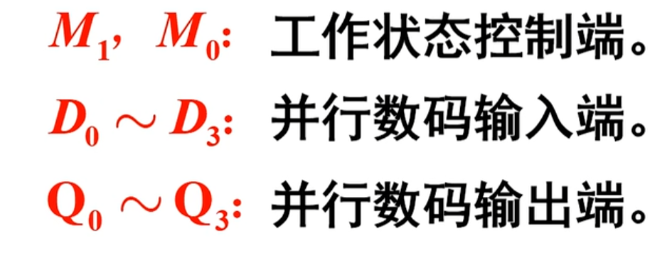

- 并行数据输入：D0~D3（4 位并行输入端）

- 并行数据输出：Q0~Q3（4 位并行输出端）

- 串行数据输入：DSR（右移串行输入端）、DSL（左移串行输入端）

- 控制端：

- CR 非：异步清零端（低电平有效）

- CP：移位脉冲（上升沿有效）

- M1、M0：工作状态控制端（00 = 保持，01 = 右移，10 = 左移，11 = 并行置数）

1. 功能表

	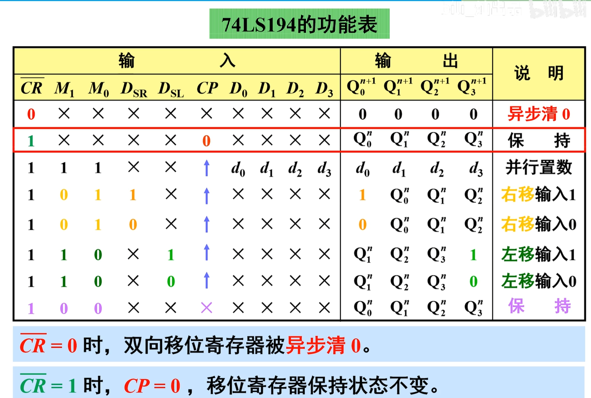

	

	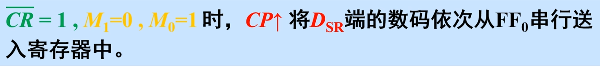

	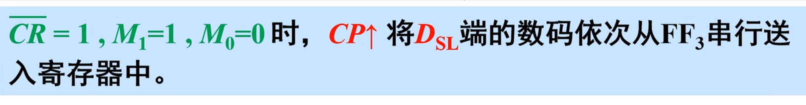

	

| CR 非 | M1 M0 | DSL  | DSR  | CP     | 功能       | Q0~Q3 状态                         |
| ----- | ----- | ---- | ---- | ------ | ---------- | ---------------------------------- |
| 0     | × ×   | ×    | ×    | ×      | 异步清零   | 全 0                               |
| 1     | 00    | ×    | ×    | ×      | 数据保持   | 保持当前值                         |
| 1     | 01    | ×    | 1    | 上升沿 | 右移输入 1 | Q0=1，Q1=Q0 旧，Q2=Q1 旧，Q3=Q2 旧 |
| 1     | 01    | ×    | 0    | 上升沿 | 右移输入 0 | Q0=0，Q1=Q0 旧，Q2=Q1 旧，Q3=Q2 旧 |
| 1     | 10    | 1    | ×    | 上升沿 | 左移输入 1 | Q3=1，Q2=Q3 旧，Q1=Q2 旧，Q0=Q1 旧 |
| 1     | 10    | 0    | ×    | 上升沿 | 左移输入 0 | Q3=0，Q2=Q3 旧，Q1=Q2 旧，Q0=Q1 旧 |
| 1     | 11    | ×    | ×    | 上升沿 | 并行置数   | Q0=D0，Q1=D1，Q2=D2，Q3=D3         |

1. 仿真实验（视频示例）

- 电路连接：D0~D3、DSR、DSL、M1、M0 接拨码开关，CR 非接单刀开关，CP 接手动脉冲，Q0~Q3 接 4 盏 LED 灯

- 实验过程：

1. 并行置数：M1M0=11，D0~D3=0101，CP 上升沿，LED 灯显示 0101（Q0=1、Q1=0、Q2=1、Q3=0）

1. 右移：M1M0=01，DSR=1，3 次 CP 后，Q0Q1Q2Q3=1110（1 从 Q0 右移至 Q2）

1. 左移：M1M0=10，DSL=1，3 次 CP 后，Q0Q1Q2Q3=0111（1 从 Q3 左移至 Q1）

1. 保持：M1M0=00，CP 脉冲无效，Q0~Q3 保持 0111

## 五、移位寄存器型计数器

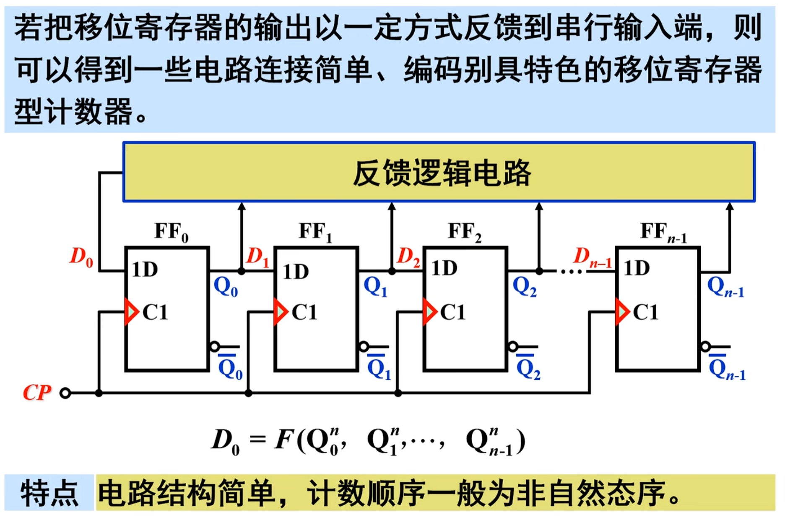

### （一）环形计数器（基于右移寄存器）

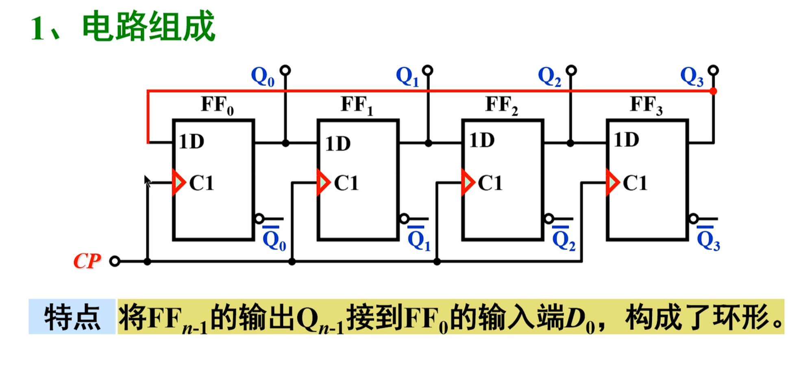

1. 电路结构：4 位右移寄存器的 Q3（串行输出端）直接反馈连接到 D0（串行输入端），形成 “环形” 回路

1. 工作特点

	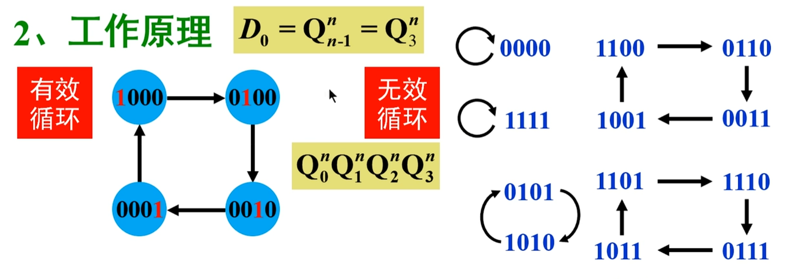

- 需预置初始状态：若初始为 0000，将始终保持 0000；需预置为 “1000”“0100”“0010”“0001”（仅 1 个 1）

- 有效循环（预置 1000 为例）：1000 → 0100 → 0010 → 0001 → 1000（4 个有效状态）

- 无效状态：4 个触发器共 16 种状态，12 种为无效状态（如 0000、1111、0101 等），且无效状态构成独立循环，**不能自启动**

1. 自启动改进：修改反馈逻辑，将 D0 改为 “Q0 非 & Q1 非 & Q2 非”（三输入与门），使无效状态可跳转至有效循环

	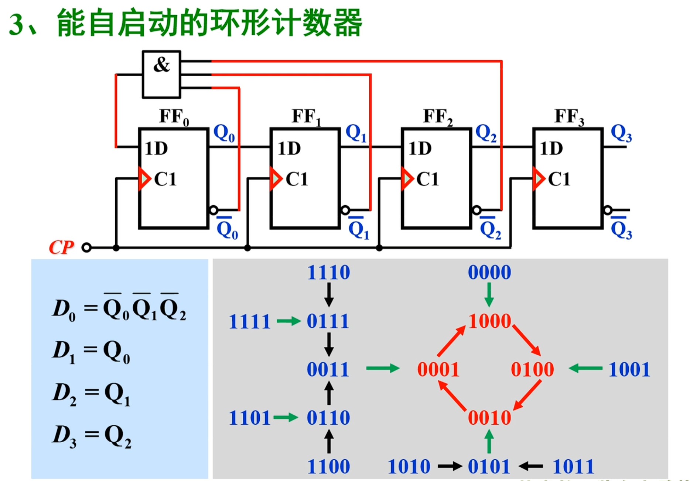

1. 仿真实验（视频示例）

	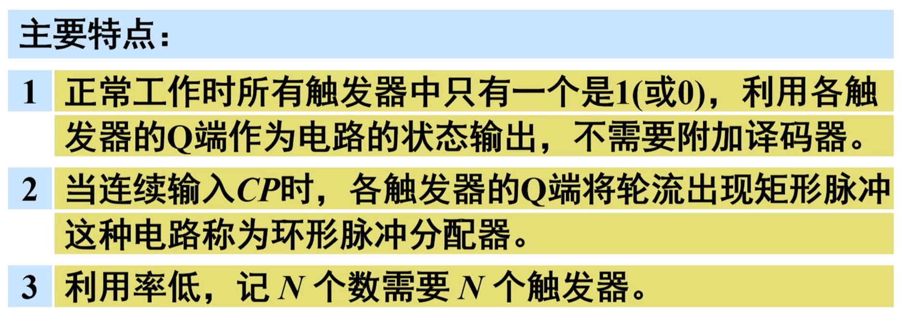

- 电路连接：4 位右移寄存器 Q3 接 D0，Q0~Q3 接 4 盏 LED 灯，预置端接拨码开关

- 实验过程：预置 Q0=1、Q1~Q3=0（1000），连续 CP 脉冲下，LED 灯从 Q0 到 Q3 依次点亮（循环）

### （二）扭环计数器（基于右移寄存器）

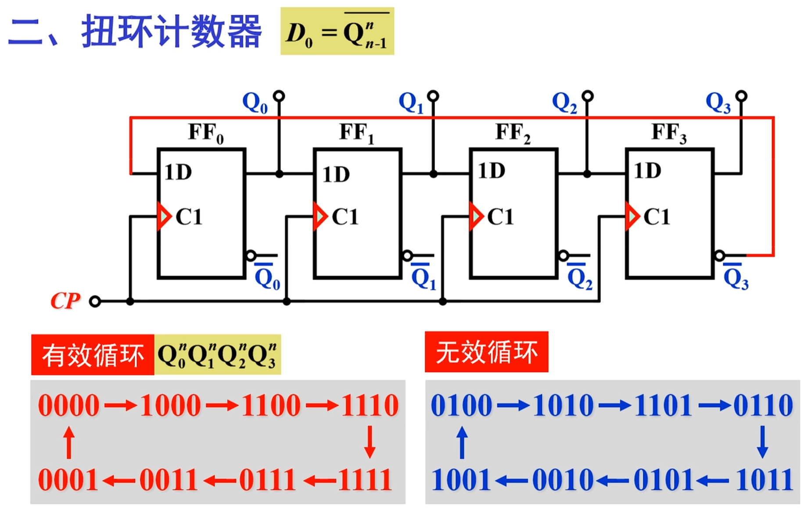

1. 电路结构：4 位右移寄存器的 Q3 非（反相串行输出端）反馈连接到 D0，与环形计数器相比多 1 个反相器（“扭环” 得名）

1. 工作特点

- 有效循环：0000 → 1000 → 1100 → 1110 → 1111 → 0111 → 0011 → 0001 → 0000（8 个有效状态）

- 状态优势：任意两个相邻状态仅 1 位不同，无竞争冒险（输出稳定）

- 无效状态：8 种无效状态，构成独立循环，**不能自启动**

1. 自启动改进：修改反馈逻辑，将 D0 改为 “(Q1 & Q2 非) 非 & Q3 非”（两个与非门），使无效状态跳转至有效循环

	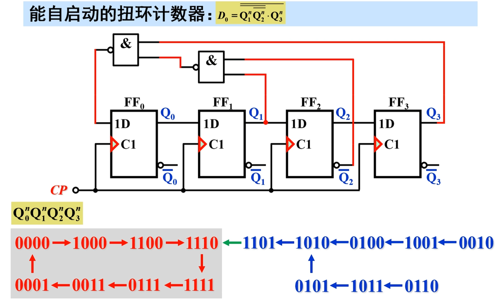

1. 特点总结：利用率高于环形计数器（n 个触发器对应 2n 个有效状态），无需译码器，无竞争冒险

	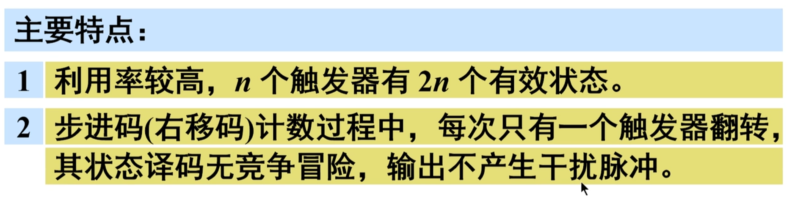


## 六、扭环计数器（十进制计数 / 分配器）**CC4017**

### 一、内部结构：扭环寄存器（约翰逊计数器）+ 十进制译码器

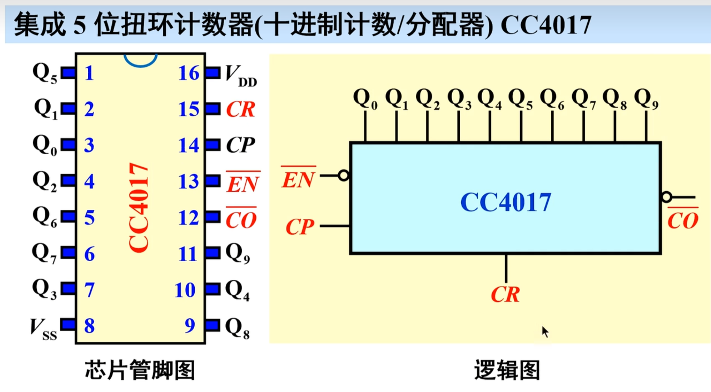

CC4017 的核心是**5 级约翰逊计数器（扭环寄存器）**，结合十进制译码器构成。

- **扭环寄存器（约翰逊计数器）**：是一种移位寄存器结构，将最后一级的输出反相后反馈到第一级的串行输入端，形成循环。5 级扭环寄存器可产生 \( 2 \times 5 = 10 \) 个状态，恰好对应十进制计数。

- **十进制译码器**：将扭环寄存器的 10 种状态译码为 10 个输出端（\( Q_0 \sim Q_9 \)），每次只有一个输出端为有效电平（通常高电平），实现 “分配器” 功能。

### 二、引脚与功能

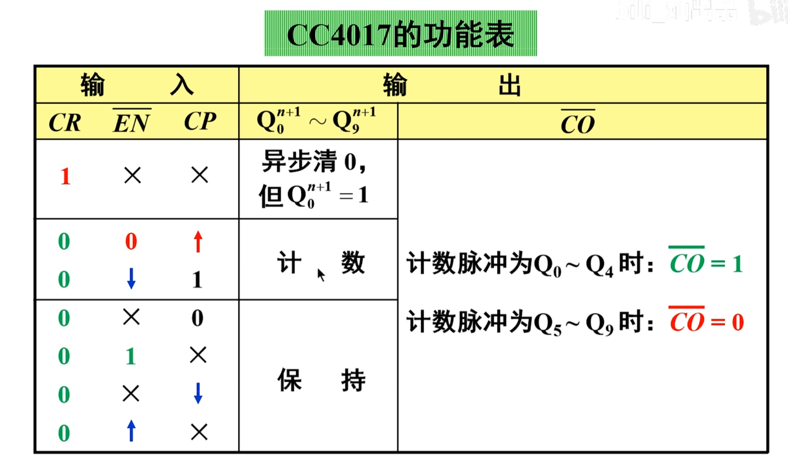

| 引脚                      | 功能说明                                                     |
| ------------------------- | ------------------------------------------------------------ |
| \( \text{CR} \)（复位端） | 高电平有效，复位后 \( Q_0 \) 输出高电平，其余输出端低电平    |
| \( \text{CP} \)（时钟端） | 时钟脉冲输入端，上升沿触发计数（部分场景也支持下降沿，需参考手册） |
| \( \text{CO} \)（进位端） | 每输入 10 个时钟脉冲，输出一个进位脉冲（可用于级联扩展）     |
| \( Q_0 \sim Q_9 \)        | 10 个译码输出端，每次仅一个端为高电平，依次循环              |

### 三、工作原理

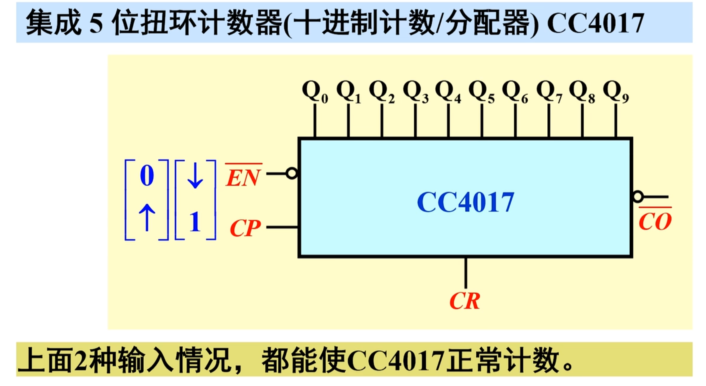

1. **计数过程**：时钟脉冲从\( \text{CP} \)输入，扭环寄存器依次移位计数，译码器将状态译为\( Q_0 \sim Q_9 \)的单路高电平，实现 “十进制计数 + 输出分配”。

1. **复位功能**：\( \text{CR} \) 输入高电平时，计数器强制复位到初始状态（\( Q_0 \) 高电平，其余低电平）。

### 四、典型应用

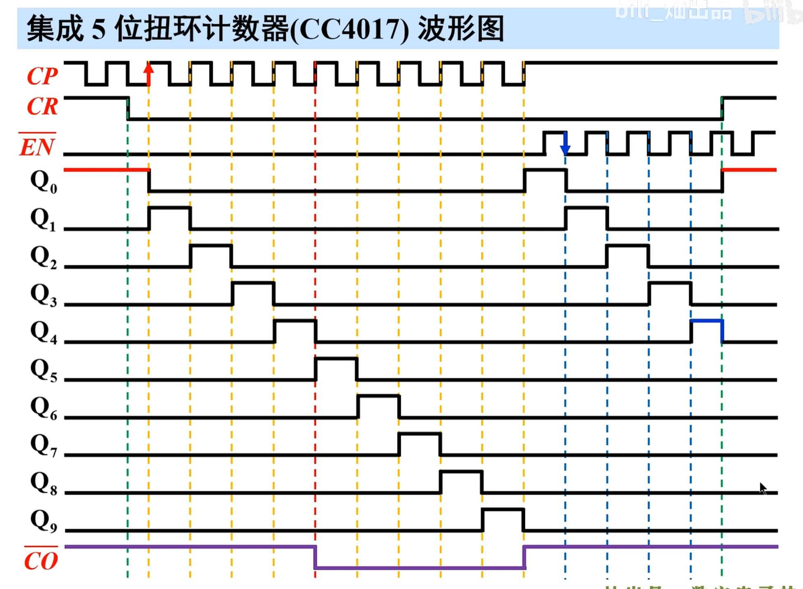

利用其 “计数 + 分配” 的特性，CC4017 在数字电路中应用广泛：

- **脉冲分配**：将输入时钟分配为 10 路依次出现的脉冲，用于时序控制。

- **彩灯控制**：\( Q_0 \sim Q_9 \) 分别控制 10 路 LED，实现 “流水灯” 效果。

- **节拍产生**：在数字系统中生成多组时序节拍，驱动不同模块分时工作。

### 五、与其他计数器的区别

| 类型                   | 结构与功能差异                                               |
| ---------------------- | ------------------------------------------------------------ |
| 二进制计数器           | 多位输出同时表示二进制数，无译码单路输出                     |
| CC4017（十进制分配器） | 5 级扭环寄存器 + 译码器，单路输出依次有效，专注十进制 “计数 + 分配” |


# 顺序脉冲发生器

## 一、学习要求

1. 了解顺序脉冲发生器的特点及产生原理；

1. 掌握移位型顺序脉冲发生器的工作原理；

1. 理解 MSI（中规模集成电路）构成顺序脉冲发生器的工作原理。

## 二、顺序脉冲发生器基本概念

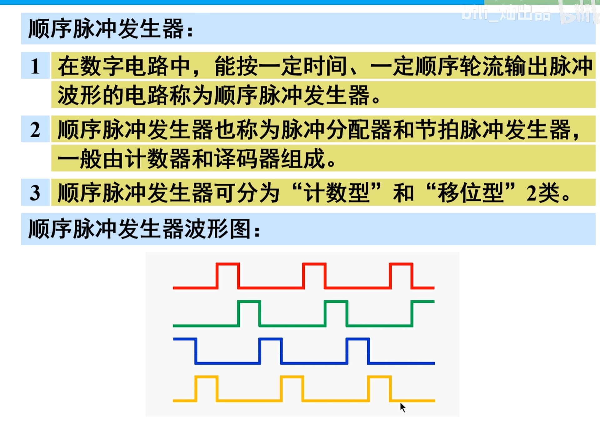

1. **定义**：能按一定时间、一定顺序轮流输出脉冲波形的电路；

1. **别名**：脉冲分配器、节拍脉冲发生器；

1. **核心组成**：通常由 “计数器” 和 “译码器” 构成；

1. **分类**：分为**计数型**和**移位型**两类；

1. **波形特点**：

- 多输出端（如 4 路、8 路），某一时刻仅 1 个输出端为高电平（有效），其余为低电平；

- 有效电平按固定顺序循环切换（如 Y0→Y1→Y2→Y3→Y0），示例波形如下（以 4 路输出为例）：

```
Y0: 1 0 0 0 1 0 0 0...
Y1: 0 1 0 0 0 1 0 0...
Y2: 0 0 1 0 0 0 1 0...
Y3: 0 0 0 1 0 0 0 1...
```

## 三、计数型顺序脉冲发生器（5.4.1）

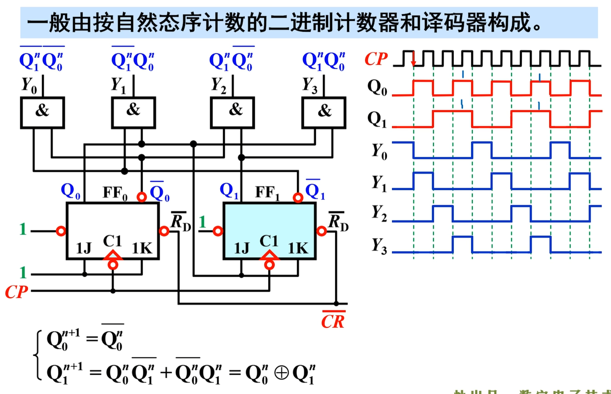

### 1. 核心原理

由 “按自然态序计数的二进制计数器”+“译码器” 构成；

- 二进制计数器：按自然态序（如 2 位计数器：00→01→10→11→00）循环；

- 译码器：将计数器的状态（如 Q1Q0）译为对应的单路有效脉冲（如 Y0~Y3）。

### 2. 视频示例电路（4 路输出）

#### （1）电路组成

- **计数器**：2 个下降沿触发的 JK 触发器（FF0、FF1）；

- FF0（低位）：J=1、K=1→构成 T' 触发器，每遇 CP 下降沿翻转（二分频）；

- FF1（高位）：J=Q0、K=Q0→构成 T 触发器，仅当 Q0=1 时，遇 CP 下降沿翻转（对 Q0 二分频）；

- 异步清零端（\(\overline{CR}\)）：FF0、FF1 的\(\overline{CR}\)连在一起，低电平清零；

- CP：FF0、FF1 的 CP 连在一起，同步触发。

- **译码器**：4 个 2 输入与门（Y0~Y3），输入为计数器的原变量 / 反变量，对应 “最小项”：

- Y0 = \(\overline{Q1}\) & \(\overline{Q0}\)（对应状态 00）；

- Y1 = \(\overline{Q1}\) & Q0（对应状态 01）；

- Y2 = Q1 & \(\overline{Q0}\)（对应状态 10）；

- Y3 = Q1 & Q0（对应状态 11）。

#### （2）状态方程

- FF0（T' 触发器）：\(Q0^{n+1} = \overline{Q0^n}\)（CP 下降沿有效）；

- FF1（T 触发器）：\(Q1^{n+1} = Q0^n \oplus Q1^n\)（CP 下降沿有效，T=Q0）。

#### （3）输出波形绘制

1. 先画 CP 波形（连续方波，标注下降沿）；

1. 画 Q0、Q1 波形：

- Q0：初始 0，每 CP 下降沿翻转（0→1→0→1...）；

- Q1：初始 0，仅当 Q0=1 时，CP 下降沿翻转（0→0→1→1→0...）；

1. 画 Y0~Y3 波形：仅当对应 “最小项状态” 时为高电平，其余为低电平（如 Q1Q0=00 时 Y0=1，其余 Y=0）。

#### （4）仿真电路

- 芯片选型：JK 触发器用 74LS112（双下降沿 JK 触发器），与门用 74LS08（四 2 输入与门）；

- 连接：按示例电路接线，输出端接 LED 灯和逻辑分析仪；

- 效果：LED 灯按 Y0→Y1→Y2→Y3 顺序轮流点亮，逻辑分析仪显示与理论波形一致。

## 四、移位型顺序脉冲发生器（5.4.2）

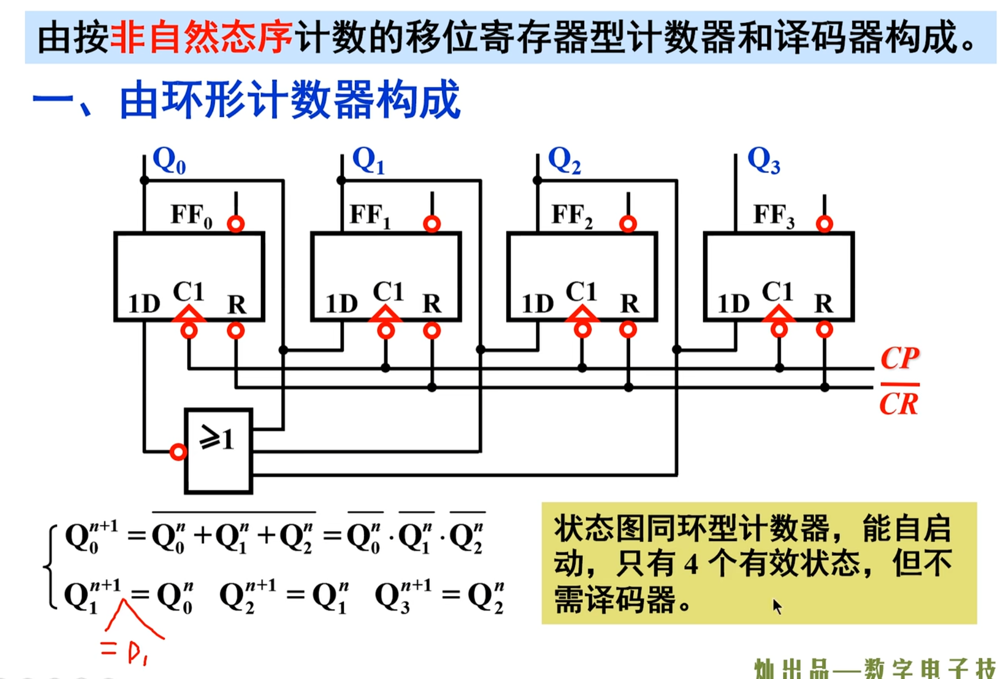

核心原理：由 “移位寄存器型计数器”（非自然态序）构成，无需额外译码器，寄存器输出端直接作为顺序脉冲输出；分为 “环形计数器” 和 “扭环计数器” 两类。

### 1. 环形计数器构成的顺序脉冲发生器

#### （1）视频示例电路（4 路输出）

- **组成**：4 个下降沿触发的 D 触发器（FF0~FF3）+1 个 3 输入或非门；

- 同步控制：FF0~FF3 的 CP 连在一起（同步触发），异步清零端（\(\overline{RD}\)）连在一起；

- 反馈逻辑：D0 = \(\overline{Q0 + Q1 + Q2}\)（或非门输出），通过摩根定律等价于\(\overline{Q0}\) & \(\overline{Q1}\) & \(\overline{Q2}\)；

- 移位逻辑：D1=Q0、D2=Q1、D3=Q2（右移结构）。

#### （2）有效循环与输出

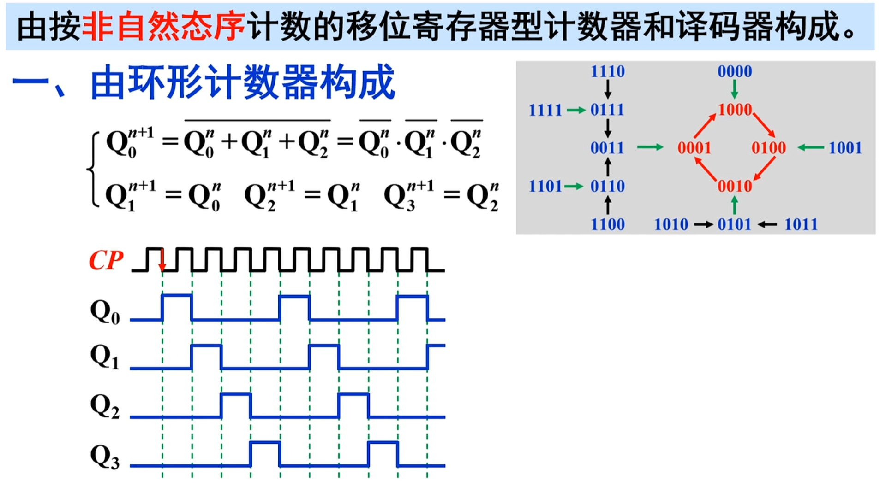

- 有效循环（自启动）：1000→0100→0010→0001→1000；

- 输出：Q0~Q3 直接作为顺序脉冲输出，某一时刻仅 1 个 Q 为高电平（如 1000 时 Q0=1，其余 Q=0），符合顺序脉冲特性。

#### （3）仿真电路

- 芯片选型：D 触发器（可用上升沿型替代，仅触发沿不同，效果一致），或非门用 74LS27（三 3 输入或非门）；

- 连接：CP 接连续脉冲，输出端接 LED 灯；

- 效果：LED 灯按 Q0→Q1→Q2→Q3 顺序轮流点亮，实现顺序脉冲输出。

### 2. 扭环计数器构成的顺序脉冲发生器

- 视频说明：电路较复杂，核心是 “移位寄存器 + 特定反馈”，输出效果与环形计数器类似（轮流有效），但有效状态数更多（如 4 位扭环计数器有效状态 8 个）；

- 特点：无需预置数，自启动能力强，可用于分频（如奇数分频、偶数分频）。

## 五、由 MSI 构成的顺序脉冲发生器（5.4.3）

视频通过 3 个例题，讲解用 MSI 芯片（移位寄存器、计数器、译码器）搭建顺序脉冲发生器的方法。

### 例题 1：用双向移位寄存器 74LS194 构成左移顺序脉冲发生器

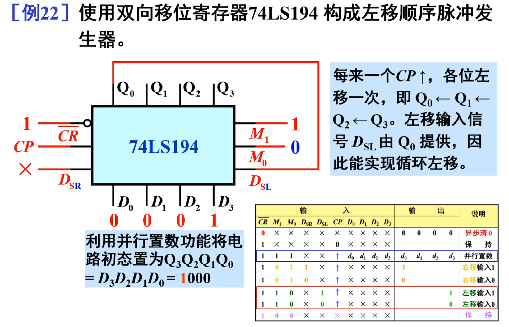

#### （1）74LS194 核心特性（4 位双向移位寄存器）

| \(\overline{CR}\)（清零） | M1（控制 1） | M0（控制 2） | 工作模式 | 说明                                         |
| ------------------------- | ------------ | ------------ | -------- | -------------------------------------------- |
| 0                         | ×            | ×            | 异步清零 | 输出 Q3Q2Q1Q0=0000                           |
| 1                         | 1            | 1            | 并行置数 | CP 上升沿，Q=D3D2D1D0                        |
| 1                         | 0            | 1            | 右移     | CP 上升沿，Q0→Q1→Q2→Q3，DSR（右移输入）送 Q0 |
| 1                         | 1            | 0            | 左移     | CP 上升沿，Q3→Q2→Q1→Q0，DSL（左移输入）送 Q3 |
| 1                         | 0            | 0            | 保持     | 输出不变                                     |

#### （2）电路设计（左移顺序脉冲，4 路输出）

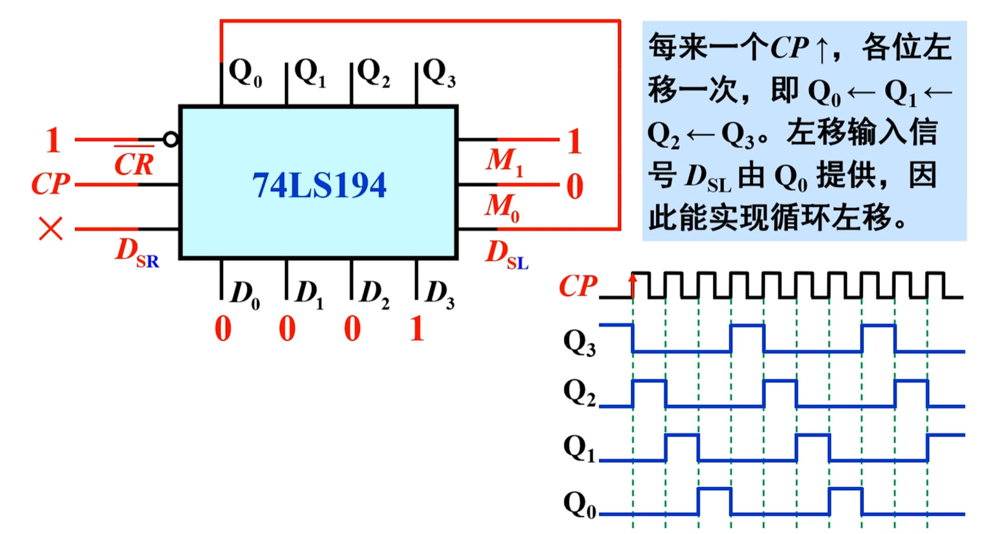

1. **初始化（预置数）**：

- \(\overline{CR}=1\)（不清零），M1=1、M0=1（并行置数模式）；

- 并行数据端 D3D2D1D0=1000（预置初始状态 1000，使 Q3=1，其余 Q=0）；

- 加 1 个 CP 上升沿，Q3Q2Q1Q0=1000（预置完成）。

1. **左移工作**：

- M1=1、M0=0（左移模式）；

- 反馈逻辑：DSL（左移输入）接 Q0（使 Q0 的 1 反馈到 Q3，实现循环左移）；

- 连续 CP：Q3Q2Q1Q0 按 1000→0100→0010→0001→1000 循环，Q3~Q0 直接作为顺序脉冲输出。

#### （3）仿真电路

- 连接：D3D2D1D0 接拨码开关（置 1000），DSL 接 Q0，M1/M0 接开关（先 11 后 10），CP 接连续脉冲，输出接 LED 和逻辑分析仪；

- 效果：LED 按 Q3→Q2→Q1→Q0 顺序轮流点亮，逻辑分析仪显示顺序脉冲波形。

### 例题 2：用双向移位寄存器 74LS194 构成七进制 / 六进制扭环计数器（分频 + 顺序脉冲）

#### （1）核心规律（视频总结）

- **奇数进制（2N-1）**：将移位寄存器第 N 位、第 N-1 位输出通过 “与非门” 反馈到右移输入（DSR），构成 2N-1 进制扭环计数器（奇数分频）；

- **偶数进制（2N）**：将移位寄存器第 N 位输出通过 “非门” 反馈到右移输入（DSR），构成 2N 进制扭环计数器（偶数分频）。

#### （2）七进制扭环计数器（N=4，2×4-1=7，奇数分频）

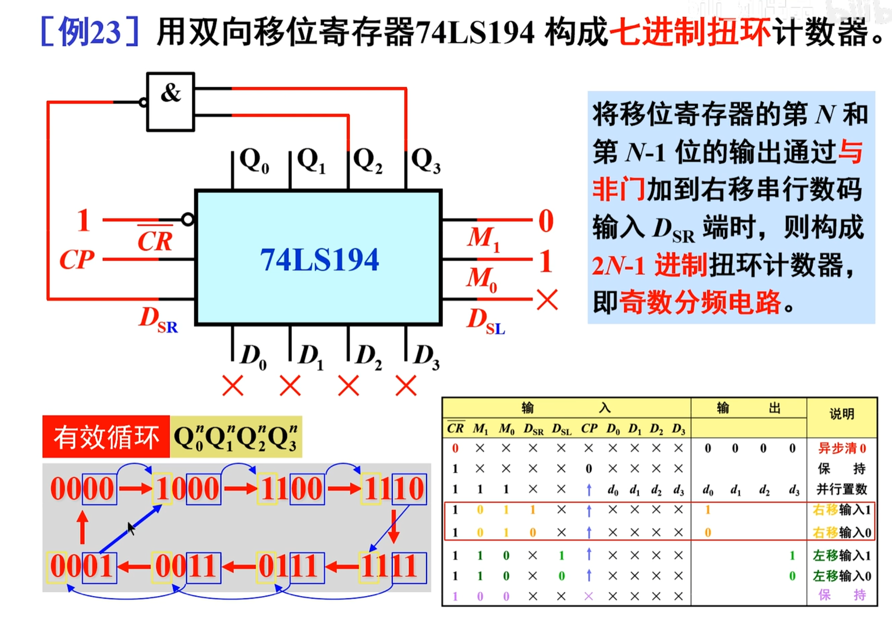

1. **电路设计**：

- 模式：M1=0、M0=1（右移模式），\(\overline{CR}=1\)（不清零）；

- 反馈逻辑：DSR = \(\overline{Q3 & Q2}\)（第 4 位 Q3、第 3 位 Q2 通过与非门反馈）；

- 并行数据端 D3~D0 任意（无需预置）。

1. **有效循环（7 个状态）**：

	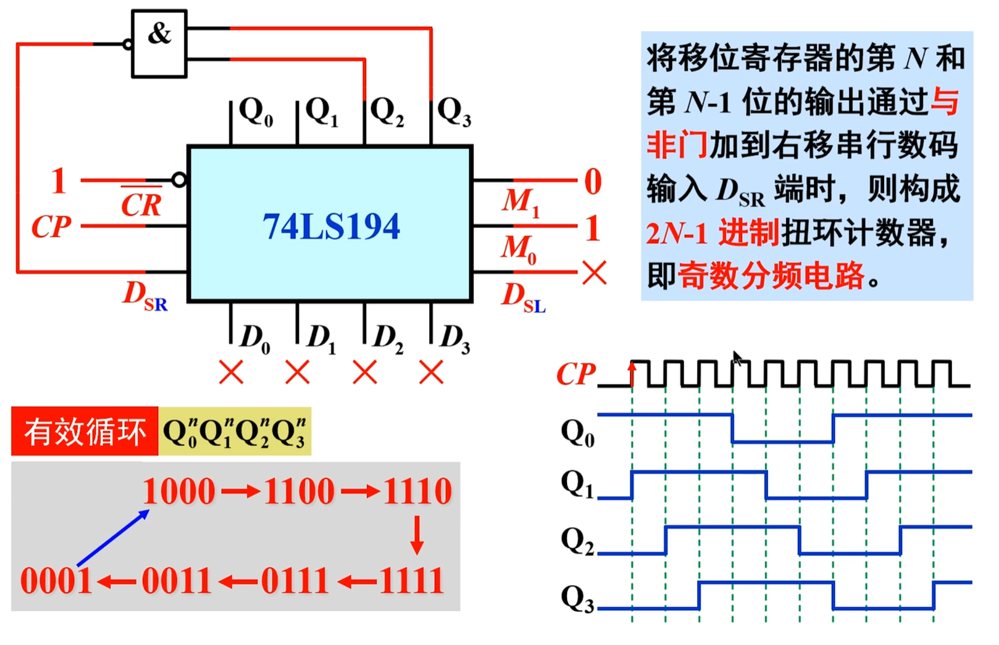

1000→1100→1110→1111→0111→0011→0001→1000；

1. **特性**：

- 分频：CP 每 7 个脉冲，输出完成 1 次循环（七分频，奇数分频）；

- 输出：Q3~Q0 虽非 “仅 1 路有效”，但按顺序切换，可作为特定场景的顺序脉冲。

#### （3）六进制扭环计数器（N=3，2×3=6，偶数分频）

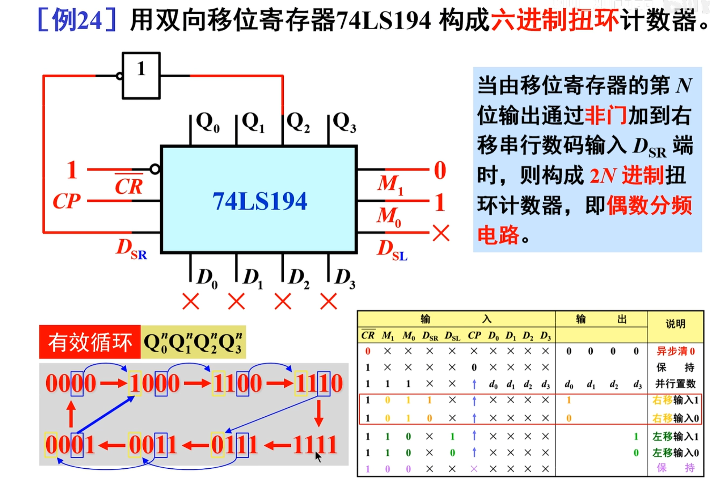

1. **电路设计**：

- 模式：M1=0、M0=1（右移模式），\(\overline{CR}=1\)（不清零）；

- 反馈逻辑：DSR = \(\overline{Q2}\)（第 3 位 Q2 通过非门反馈）；

- 并行数据端 D3~D0 任意。

1. **有效循环（6 个状态）**：

	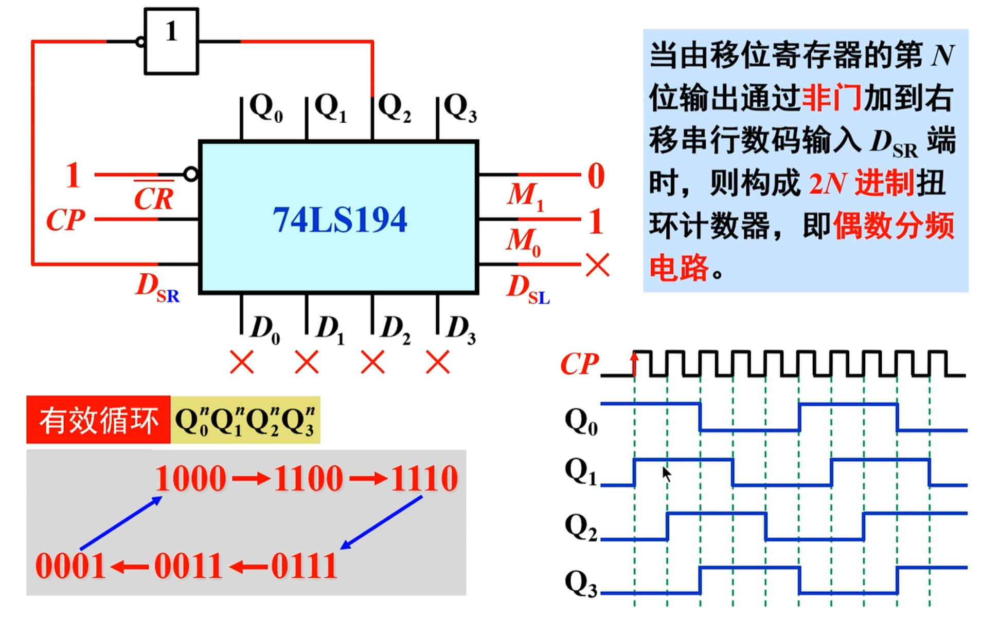

1000→1100→1110→0111→0011→0001→1000（跳过 0000、1111）；

1. **特性**：

- 分频：CP 每 6 个脉冲，输出完成 1 次循环（六分频，偶数分频）；

- 输出：Q3~Q0 按顺序切换，符合特定顺序脉冲需求。

#### （4）仿真电路

- 七进制：反馈用 74LS00（与非门），输出接 LED；

- 六进制：反馈用 74LS04（非门），输出接 LED；

- 效果：LED 按有效循环顺序切换，与理论状态一致。

### 例题 25：用集成计数器 74LS163+3 线 - 8 线译码器 74LS138 构成 8 输出顺序脉冲发生器

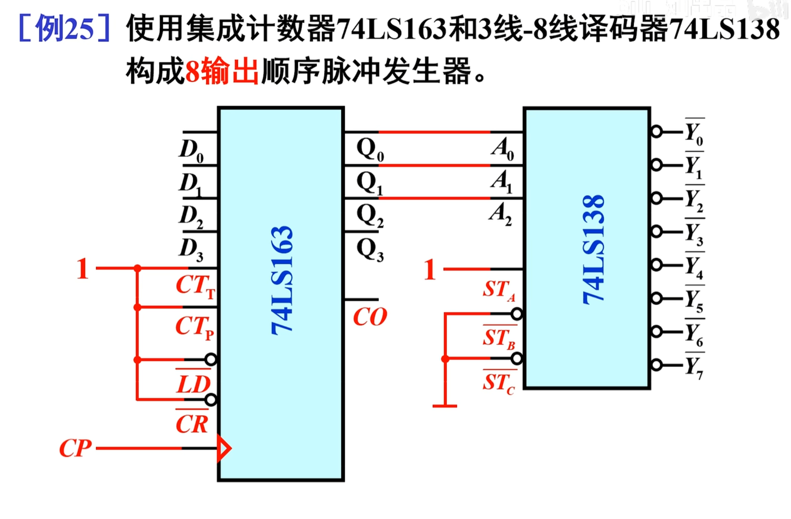

#### （1）芯片核心特性

1. **74LS163（4 位同步二进制计数器）**：

- 同步清零（\(\overline{CR}=0\)，CP 上升沿清零）、同步置数（\(\overline{LD}=0\)，CP 上升沿置数）；

- 计数使能：CTT=1 且 CTP=1 时，CP 上升沿计数（自然态序：0000→1111）；

- 输出：Q3Q2Q1Q0（4 位状态），CO（进位端，计数到 1111 时为 1）。

1. **74LS138（3 线 - 8 线译码器）**：

- 使能条件：STA=1，\(\overline{STB}=0\)，\(\overline{STC}=0\)（满足时正常译码）；

- 输入：A2A1A0（3 位代码，000~111）；

- 输出：\(\overline{Y0}\)~\(\overline{Y7}\)（低电平有效，某一时刻仅 1 路为 0，其余为 1）。

#### （2）电路设计（8 路输出，低电平有效）

1. **74LS163 配置**：

- \(\overline{CR}=1\)（不清零），\(\overline{LD}=1\)（不置数），CTT=1、CTP=1（允许计数）；

- 仅用低 3 位输出 Q2Q1Q0（对应 000~111，8 个状态），Q3 悬空（不用）。

1. **74LS138 配置**：

- 使能：STA=1，\(\overline{STB}=0\)，\(\overline{STC}=0\)（满足译码条件）；

- 输入：A2=Q2，A1=Q1，A0=Q0（将计数器状态译为 8 路输出）；

- 输出：\(\overline{Y0}\)~\(\overline{Y7}\)（直接作为 8 路顺序脉冲，低电平有效）。

#### （3）输出波形

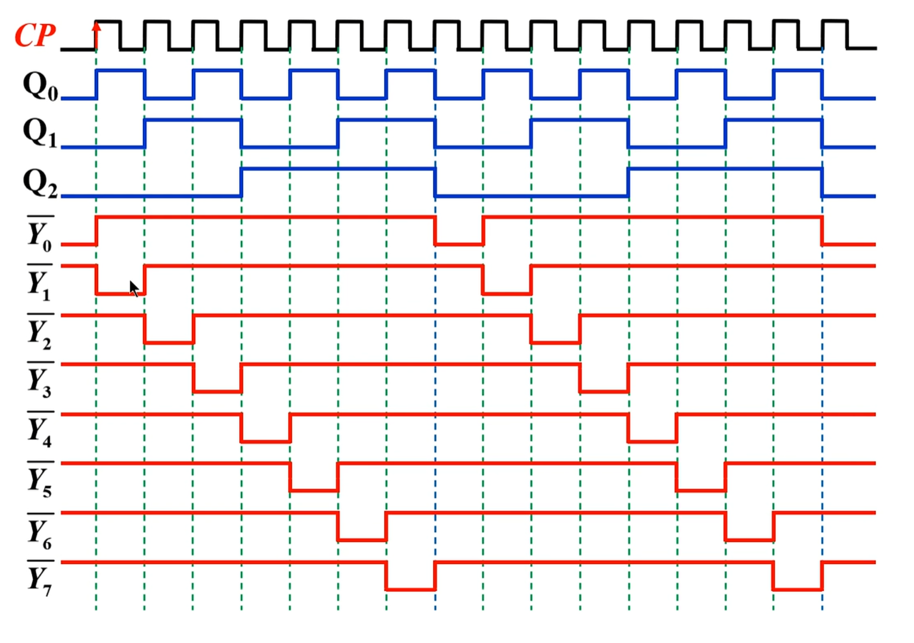

1. 74LS163 的 Q2Q1Q0 按 000→001→010→011→100→101→110→111→000 循环（CP 上升沿计数）；

1. 74LS138 的\(\overline{Y0}\)~\(\overline{Y7}\)按顺序轮流为低电平（如 Q2Q1Q0=000 时\(\overline{Y0}=0\)，其余\(\overline{Y}=1\)），构成 8 路顺序脉冲。

#### （4）仿真电路

- 连接：74LS163 的 Q2Q1Q0 接 74LS138 的 A2A1A0，\(\overline{Y0}\)~\(\overline{Y7}\)接 LED（低电平点亮）和逻辑分析仪；

- 效果：LED 按\(\overline{Y0}\)→\(\overline{Y1}\)→...→\(\overline{Y7}\)顺序轮流点亮，逻辑分析仪显示低电平有效顺序脉冲。

## 六、视频知识总结

1. 顺序脉冲发生器核心是 “按顺序轮流输出有效脉冲”，核心组成是 “计数器 + 译码器”（计数型）或 “移位寄存器”（移位型）；

1. 计数型依赖 “自然态序计数器 + 译码器”，需注意译码器输出的唯一性；

1. 移位型依赖 “非自然态序移位寄存器”，无需译码器，输出直接来自寄存器；

1. MSI 构成时，需熟练掌握芯片特性（如 74LS194 的移位模式、74LS163 的计数使能、74LS138 的译码使能），通过 “反馈逻辑” 实现循环；

1. 仿真验证是关键：通过 LED 灯观察输出顺序，通过逻辑分析仪验证波形与理论一致。


# 第 5 章时序逻辑电路小结

## 一、时序逻辑电路基本概念

### 1.1 定义及与组合逻辑电路的核心区别

- **定义**：时序逻辑电路由**触发器**和**组合逻辑电路**共同组成，其输出不仅取决于当前输入信号，还与电路**原来的状态**（即触发器存储的信息）有关。

- **与组合逻辑电路的本质区别**：

组合逻辑电路无触发器，输出仅由当前输入决定；时序逻辑电路必须包含触发器，输出与 “当前输入 + 电路原状态” 相关 —— 判断某电路是否为时序电路，核心看是否存在触发器。

### 1.2 按时钟控制方式分类

根据触发器翻转是否同步，分为**同步时序电路**和**异步时序电路**，二者结构与工作特性差异如下：

| 类型         | 触发器时钟控制方式                                           | 翻转特性                                  |
| ------------ | ------------------------------------------------------------ | ----------------------------------------- |
| 同步时序电路 | 所有触发器的脉冲端（CP 端）连在一起，受**同一 CP 信号**控制  | CP 边沿到达时，所有触发器**同步更新**状态 |
| 异步时序电路 | 仅部分触发器受 CP 控制，其余触发器由**内部信号**（如其他触发器输出）触发 | 触发器翻转不同步，先后顺序由内部信号决定  |

## 二、时序逻辑电路的描述方法

视频中明确时序电路的描述形式共 7 种，按 “分析流程” 依次关联，具体如下：

### 2.1 各描述形式的定义与推导关系

1. **逻辑图**：电路的硬件结构示意图，包含触发器、门电路等元件及连接关系，是分析的**起点**。

1. **输出方程**：描述电路输出信号（如 Y）与 “现态（触发器当前状态，用\(Q^n\)表示）” 的逻辑关系，形式为\(Y = f(Q^n)\)（无输入时仅与现态相关，有输入时含输入变量）。

1. **驱动方程**：描述触发器**输入端**（如 JK 触发器的 J、K 端，D 触发器的 D 端）与 “现态 + 输入” 的逻辑关系，形式为\(J = g(Q^n, 输入)\)、\(K = h(Q^n, 输入)\)，仅用现态（或现态 + 输入）表示。

1. **状态方程（次态方程）**：描述触发器**次态**（CP 触发后新状态，用\(Q^{n+1}\)表示）与 “现态 + 输入” 的关系，推导逻辑为：

将**驱动方程**代入对应触发器的**特性方程**（如 JK 触发器特性方程\(Q^{n+1}=J\overline{Q^n}+\overline{K}Q^n\)），最终形式为\(Q^{n+1} = f(Q^n, 输入)\)。

1. **状态表**：以表格形式列举 “现态→次态” 的对应关系，视频中提到两种形式：

- 书本标准形式：分两列，左列 “现态”，右列 “次态”，需逐一列举所有现态；

- 简化形式：仅一列，通过行内逻辑隐含 “现态→次态” 关系，需结合电路逻辑理解，可节省分析时间。

1. **状态转换图**：以图形形式直观展示状态变化规律，用 “圆圈” 表示状态，“箭头” 表示状态转换方向（箭头上标注输入条件，无输入时省略）。

- 核心用途：可直接观察**有效循环**（正常工作的状态循环）和**无效循环**（冗余状态的循环），进而判断电路是否能**自启动**（若无效状态不构成循环，最终能进入有效循环，则电路可自启动）。

1. **时序图**：以时间为横轴，绘制 CP、输入、触发器状态（\(Q^n\)/\(Q^{n+1}\)）、输出（Y）的波形图。

- 应用场景：分析时可省略（状态转换图已能明确功能）；**异步时序电路设计时必须优先绘制**，用于确定各触发器的时钟方程（CP 信号来源）。

## 三、时序逻辑电路的分析与设计关键

时序电路的分析与设计是逆向过程，视频中明确二者核心步骤如下：

### 3.1 分析关键步骤（从 “硬件” 到 “功能”）

1. 从**逻辑图**出发，识别触发器类型（如 JK、D 触发器）和组合电路结构；

1. 根据逻辑图列写**驱动方程**（触发器输入端逻辑）和**输出方程**（电路输出逻辑）；

1. 将驱动方程代入触发器**特性方程**，推导得到**状态方程**；

1. 根据状态方程，列举所有现态，列写**状态表**；

1. 由状态表绘制**状态转换图**；

1. 通过状态转换图或状态表，分析电路的核心功能（如计数、移位等）。

### 3.2 设计关键步骤（从 “功能” 到 “硬件”）

1. 根据设计需求，确定电路功能，建立**原始状态表**（同步时序电路可直接用状态表；异步时序电路需先绘制**时序图**，确定各触发器的 CP 脉冲来源，再推导状态表）；

1. 基于原始状态表，确定触发器个数，对状态进行编码（如 2 个触发器编码 4 种状态）；

1. 绘制**卡诺图**：

- 用输出卡诺图化简得到**输出方程**；

- 用**次态卡诺图**化简得到次态逻辑（同步时序电路：按触发器个数拆分次态卡诺图，如 3 个触发器拆分为 3 张次态卡诺图；异步时序电路：需先判断各触发器的 “翻转条件”，不满足翻转条件的次态格用**无关项（X）** 表示，再化简）；

1. 由次态逻辑推导**驱动方程**（结合触发器特性方程反推输入端逻辑），同时确定**时钟方程**（尤其异步电路）；

1. 根据驱动方程、输出方程、时钟方程，绘制最终**逻辑图**。

## 四、计数器（时序电路核心应用器件）

### 4.1 计数器的定义与分类

- **定义**：用于记录输入 CP 脉冲个数的时序器件，核心功能是 “计数”，额外可实现**分频**（如 16 进制计数器可将 CP 频率分频为 1/16）和**定时**（通过计数个数控制输出持续时间）。

- **分类方式**：

1. 按计数进制：二进制计数器、十进制计数器、N 进制计数器（自定义进制）；

1. 按计数方向：加法计数器（递增计数）、减法计数器（递减计数）、可逆计数器（可加可减）；

1. 按触发器同步性：同步计数器（触发器同步翻转）、异步计数器（触发器异步翻转）。

### 4.2 常用集成计数器芯片（视频中重点提及型号及功能）

视频中详细列举了二进制和十进制集成计数器，包含同步 / 异步类型，具体参数如下：

#### （1）二进制集成计数器

| 芯片型号 | 类型     | 计数进制           | 核心特性                                  |
| -------- | -------- | ------------------ | ----------------------------------------- |
| 74LS161  | 同步加法 | 十六进制（0~15）   | 含同步清零端、同步置数端，可异步置数      |
| 74LS163  | 同步加法 | 十六进制（0~15）   | 功能与 74LS161 一致，性能优化             |
| 74LS191  | 同步可逆 | 十六进制（0~15）   | 单时钟控制（通过控制端切换加 / 减）       |
| 74LS193  | 同步可逆 | 十六进制（0~15）   | 双时钟控制（加计数 CP+、减计数 CP-）      |
| 74LS197  | 异步加法 | 二 - 八 - 十六进制 | 可通过引脚配置为 2 进制、8 进制或 16 进制 |

#### （2）十进制集成计数器

| 芯片型号 | 类型     | 计数进制         | 核心特性                          |
| -------- | -------- | ---------------- | --------------------------------- |
| 74LS160  | 同步加法 | 十进制（0~9）    | 含同步清零端、同步置数端          |
| 74LS162  | 同步加法 | 十进制（0~9）    | 功能与 74LS160 一致，性能优化     |
| 74LS190  | 同步可逆 | 十进制（0~9）    | 单时钟控制（加 / 减切换）         |
| 74LS192  | 同步可逆 | 十进制（0~9）    | 双时钟控制（CP + 加、CP - 减）    |
| 74LS290  | 异步加法 | 二 - 五 - 十进制 | 可配置为 2 进制、5 进制或 10 进制 |

### 4.3 N 进制计数器设计方法（含视频例题）

N 进制计数器指计数循环为 “N 个状态” 的计数器，设计需基于集成计数器，分 “小容量”（N≤单芯片最大进制，如 N≤16 for 74LS161）和 “大容量”（N > 单芯片最大进制，需多片级联）两类，核心利用集成芯片的**清零端**（CR）和**置数端**（LD），同步 / 异步控制方式差异显著。

#### （1）小容量 N 进制计数器设计（N≤单芯片最大进制）

设计关键：根据芯片 “清零 / 置数端的同步性”，确定反馈函数（即触发清零 / 置数的状态）。

##### 例题 1：用 74LS161（十六进制同步加法计数器，含同步清零 / 置数端）设计 12 进制加法计数器

- 74LS161 特性：最大进制 16（0000~1111），同步清零 / 置数 —— 需等待 CP 边沿到达才执行清零 / 置数，因此反馈函数对应 “N-1” 的二进制状态（而非 N）。

- 设计步骤：

1. 确定目标进制：N=12，需跳过 16-12=4 个状态；

1. 同步清零 / 置数的反馈状态：SN-1 = 12-1 = 11，对应二进制代码**1011**；

1. 反馈电路设计：将 74LS161 的 Q3（1）、Q1（0）、Q0（1）端（即 1011 的 “1” 位）接入**三输入与非门**，与非门输出接至芯片的同步清零端（CR）或同步置数端（LD）；

1. 若用同步置数端（LD）：需额外设置并行数据输入端（D0~D3）为初始状态（通常为 0000）；若用同步清零端（CR）：无需设置 D0~D3（清零后状态为 0000）。

##### 例题 2：用 74LS161 设计 12 进制加法计数器（异步清零 / 置数端假设场景，视频对比说明）

- 若芯片为**异步清零 / 置数**（无需等 CP），反馈函数对应 “N” 的二进制状态：

1. N=12，对应二进制代码**1100**；

1. 反馈电路：将 Q3（1）、Q2（1）端（1100 的 “1” 位）接入二输入与非门，输出接异步清零 / 置数端；

1. 注意：异步方式会产生短暂的 “SN 状态”（如 1100），持续时间为纳秒级（硬件仿真 / 实际电路中不可见），但不影响正常计数循环。

#### （2）大容量 N 进制计数器设计（N > 单芯片最大进制）

设计核心：多片集成计数器**级联**，总进制 = 各片进制的乘积（N=N1×N2×...×Nk，N1、N2 为单芯片设计的进制）。

##### 例题 3：用 74LS161（十六进制）设计 60 进制加法计数器

- 60>16，需 2 片 74LS161 级联，采用 “10 进制 + 6 进制” 拆分（10×6=60）；

- 级联方式：前片（低位）为 6 进制，后片（高位）为 10 进制，前片的进位输出（CO）接后片的 CP 端（或使能端），确保前片计满 6 个状态时，后片触发一次计数；

- 单片设计：

1. 6 进制：用第 1 片 74LS161，同步方式反馈状态 SN-1=5（0101），与非门接同步清零端；

1. 10 进制：用第 2 片 74LS161，同步方式反馈状态 SN-1=9（1001），与非门接同步清零端；

- 总电路：2 片级联后，计数循环为 0000 0000（0）~0000 0101（5）→0001 0000（10）~0001 0101（15）→...→0001 1001（25）→...→0011 1001（59）→0000 0000（0），实现 60 进制。

## 五、寄存器

### 5.1 寄存器的定义与分类

- **定义**：用于存储二进制数码（如 4 位、8 位数据）的时序器件，核心由触发器组成（1 个触发器存储 1 位数码）。

- **分类**：按功能分为**基本寄存器**和**移位寄存器**，差异如下：

| 类型       | 功能                            | 数据传输方式                               |
| ---------- | ------------------------------- | ------------------------------------------ |
| 基本寄存器 | 仅能存储数码，无移位功能        | 仅支持**并入并出**（同时输入、同时输出）   |
| 移位寄存器 | 可存储数码 + 对数码进行移位操作 | 支持并入并出、串入串出、串入并出、并入串出 |

### 5.2 集成移位寄存器及应用（视频提及型号与功能）

#### （1）常用集成移位寄存器

- **74LS164**：单向移位寄存器（仅支持左移或右移，视频未明确方向，核心为 “单向”）；

- **74LS194**：双向移位寄存器，可通过控制端切换 “左移”“右移”“保持”“并行置数” 功能。

#### （2）移位寄存器的典型应用

1. **串并行转换**：

- 串入并出：将串行数据（逐位输入）转换为并行数据（同时输出），如 74LS194 接成串入并出模式，4 位串行数据依次输入后，Q3~Q0 同时输出 4 位并行数据；

- 并入串出：将并行数据转换为串行数据，用于长距离数据传输。

1. **环形计数器**：

- 结构：将移位寄存器的 “最后一位输出” 接回 “第一位输入”，形成环形；

- 特性：利用率低，N 个触发器仅能表示 N 个有效状态（如 4 个触发器对应 0001→0010→0100→1000→0001）；需预置初始状态（如 0001），否则会出现 “全 0 循环”（0000→0000），无法工作。

1. **扭环计数器（约翰逊计数器）**：

- 结构：将移位寄存器的 “最后一位反相输出” 接回 “第一位输入”；

- 特性：利用率是环形计数器的 2 倍，N 个触发器可表示 2N 个有效状态（如 4 个触发器对应 0000→0001→0011→0111→1111→1110→1100→1000→0000），无需预置初始状态（无全 0 循环问题）。

## 六、顺序脉冲发生器

- **定义**：在特定场景下，按 “固定顺序” 和 “一定时间间隔” 产生脉冲信号的时序器件；

- **功能**：为其他电路提供时序控制信号，如控制多个模块按顺序工作（如先读数据、再处理数据、最后写数据）；

- **实现方式**：视频中未提及具体芯片，仅明确其核心作用 —— 通过时序逻辑电路（如移位寄存器 + 译码器）生成按序排列的脉冲，满足特定流程控制需求。
