# 第6章概述 （了解即可）

## 一、第6章核心学习内容 本章聚焦“脉冲产生与整形电路”，核心学习模块包括：

1. 概述（含矩形脉冲参数、脉冲产生/整形方法、555定时器原理） 
2. 555定时器构成的三类核心电路（施密特触发器、单稳态触发器、多谐振荡器） 
3. 本章小结（本视频仅覆盖“概述”部分）

## 二、矩形脉冲的特性参数

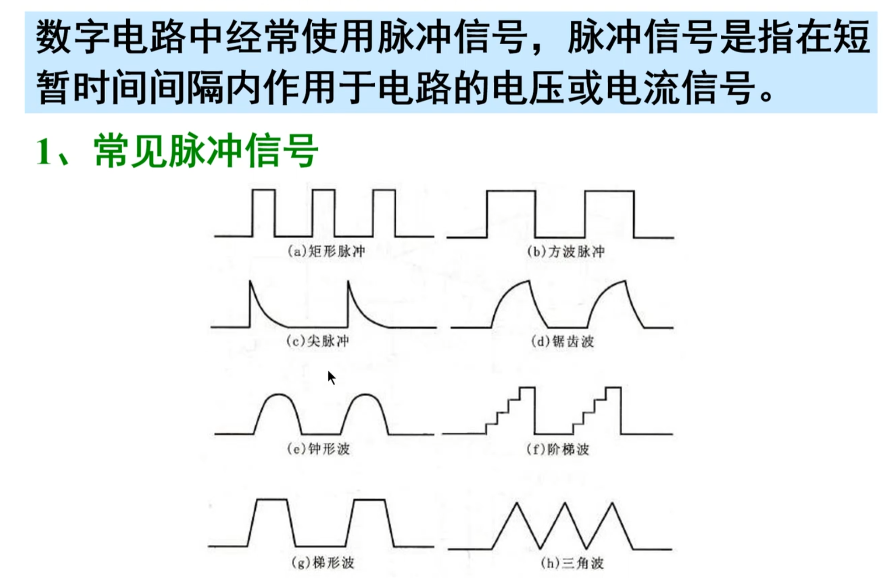

### 1. 脉冲信号的定义与分类

- **定义**：短暂时间间隔内作用于电路的电压或电流信号。

- **常见类型（共 8 种）**：

- 矩形脉冲、方波脉冲（矩形脉冲的特殊形式，高 / 低电平宽度相等）

- 尖脉冲、锯齿波、钟型波、阶梯波、梯形波、三角波

- **重点研究对象**：矩形脉冲（实际电路中应用最广）。

### 2. 理想与实际矩形脉冲的区别

- **理想矩形脉冲**：上升沿、下降沿瞬间完成，无过渡过程。
- **实际矩形脉冲**：上升沿（低→高）、下降沿（高→低）均存在过渡过程，需一定时间完成。

### 3. 实际矩形脉冲的 7 个核心参数（结合波形定义）

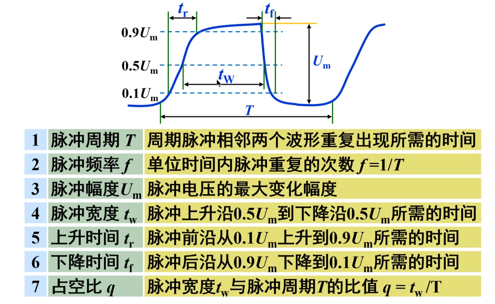

| 参数名称         | 符号 | 定义                                                         | 关键说明                                                    |
| ---------------- | ---- | ------------------------------------------------------------ | ----------------------------------------------------------- |
| 脉冲周期         | T    | 相邻两个波形重复单元的 “相同点” 之间的时间间隔               | 与正弦波周期概念一致，反映脉冲重复的时间间隔                |
| 脉冲频率         | f    | 单位时间内矩形脉冲的重复次数                                 | 与周期成倒数关系：f = 1/T                                   |
| 脉冲幅值         | Um   | 脉冲电压的最大变化幅度（最高电平与最低电平的差值）           | “Um” 中 “m” 表示 “Max（最大）”                              |
| 脉冲宽度（脉宽） | Tw   | 脉冲幅值的 50%（0.5Um）处，上升沿与下降沿对应点之间的时间间隔 | 反映脉冲 “高电平持续时间” 的核心参数                        |
| 上升时间         | Tr   | 脉冲从 0.1Um（幅值的 10%）上升到 0.9Um（幅值的 90%）所需的时间 | 描述上升沿过渡过程的快慢，越小表示上升沿越陡峭              |
| 下降时间         | Tf   | 脉冲从 0.9Um（幅值的 90%）下降到 0.1Um（幅值的 10%）所需的时间 | 描述下降沿过渡过程的快慢，与 Tr 无必然相等关系              |
| 占空比           | q    | 脉宽与周期的比值：q = Tw / T                                 | 方波的占空比q=0.5（高 / 低电平宽度相等）；普通矩形脉冲q≠0.5 |

## 三、脉冲信号的产生与整形方法

### 1. 脉冲信号的两种获取方式

#### （1）直接产生：从无到有

- **实现电路**：多谐振荡器。

- **功能**：无需外部输入信号，直接输出符合要求的矩形脉冲。

#### （2）整形变换：优化已有波形

- **适用场景**：已有波形（如缓慢变化的梯形波、非矩形波）不符合要求，需调整为陡峭矩形脉冲。

- **两类核心整形电路**：

| 电路类型     | 核心作用                                                     |
| ------------ | ------------------------------------------------------------ |
| 施密特触发器 | 将缓慢变化或非矩形脉冲，变换为上升沿 / 下降沿陡峭的标准矩形脉冲 |
| 单稳态触发器 | 将宽度不符合要求的脉冲，调整为宽度达标（用户所需）的矩形脉冲 |

### 2. 脉冲电路的三种实现方案

| 实现方式       | 特点                                                         | 应用场景                   |
| -------------- | ------------------------------------------------------------ | -------------------------- |
| 门电路搭建     | 需按原理逐步设计，过程复杂，灵活性低                         | 实验验证、简单场景         |
| 专用集成电路   | 集成度高、性能稳定，但功能固定，扩展性差                     | 标准化场景                 |
| 555 定时器构成 | 仅需外接少量电阻、电容，即可实现三类核心电路（施密特 / 单稳态 / 多谐），灵活性高 | 最常用的方案（本视频重点） |

## 四、555 定时器详解

### 1. 基本简介

- **开发背景**：1972 年开发的多功能集成电路，结构简单、使用灵活、用途广泛。

- **电源电压范围**：

- TTL 型：4.5V ~ 16V（兼容 TTL 数字电路）

- CMOS 型：3V ~ 18V（兼容 CMOS 数字电路）

- **接口与驱动能力**：

- 可提供与 TTL/CMOS 兼容的电平信号；

- 能输出一定功率，驱动微电机、指示灯、扬声器等负载。

- **型号规则（逻辑功能 + 引脚排列完全一致，均为 8 脚）**：

| 类型    | 单定时器型号 | 双定时器型号（一片芯片含 2 个 555 核心） |
| ------- | ------------ | ---------------------------------------- |
| TTL 型  | 555          | 556                                      |
| CMOS 型 | 7555         | 7556                                     |

### 2. 内部电路结构（8 脚封装，核心由 5 部分组成）

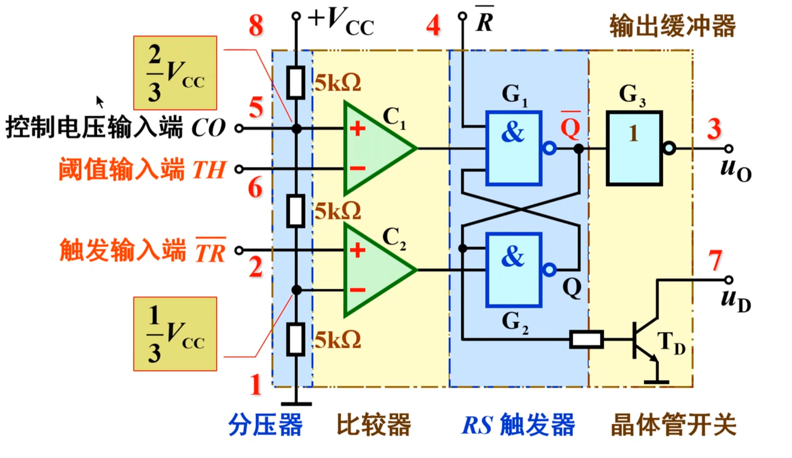

#### （1）3 个 5kΩ 电阻分压网络（“555” 名称由来）

- **功能**：提供两个固定基准电压（未外接控制电压时）：

- 上分压点：2/3 VCC（给比较器 C1 作为基准）；

- 下分压点：1/3 VCC（给比较器 C2 作为基准）。

- **特殊场景**：若第 5 脚（控制电压输入端 CO）外接电压Us，则基准电压变为：

- 比较器 C1 基准：Us；

- 比较器 C2 基准：1/2 Us。

- **常规用法**：若无需调整基准电压，第 5 脚需通过0.01μF电容接地（稳定基准电压）。

#### （2）两个电压比较器（C1、C2）

- **功能**：将输入电压与基准电压比较，输出高低电平（1/0），控制后续 RS 触发器。

- **比较规则**：

- 比较器 C1（阈值比较器）：反相端接2/3 VCC（或 Us），同相端接第 6 脚（TH，阈值电压输入端）；

→ 若UTH > 2/3 VCC（或 Us），C1 输出0；若UTH < 2/3 VCC（或 Us），C1 输出1。

- 比较器 C2（触发比较器）：同相端接1/3 VCC（或 1/2 Us），反相端接第 2 脚（TR 非，触发电压输入端）；

→ 若U(TR非) > 1/3 VCC（或 1/2 Us），C2 输出1；若U(TR非) < 1/3 VCC（或 1/2 Us），C2 输出0。

#### （3）RS 触发器（由两个与非门交叉耦合构成）

- **输入信号**：比较器 C1 的输出（接 RS 触发器的 “R 非” 端）、比较器 C2 的输出（接 RS 触发器的 “S 非” 端）、第 4 脚（R 非，异步清零端）。

- **核心特性**：“低电平有效”（仅当输入为0时触发状态变化），且第 4 脚（R 非）优先级最高（异步清零）。

#### （4）输出缓冲器（非门 G3）

- **功能**：

1. 提高 555 定时器的带负载能力；

1. 隔离外部负载对内部电路的影响（避免负载干扰内部逻辑）。

- **逻辑关系**：输出Uo与 RS 触发器的Q端反相（Uo = ¬Q）。

#### （5）晶体管开关（TD，NPN 型）

- **控制信号**：RS 触发器的 “Q 非” 端（Q非接晶体管基极）。

- **工作状态**：

- 若Q非 = 1：晶体管饱和导通，第 7 脚（DIS，放电端）相当于接地（可用于电容放电）；

- 若Q非 = 0：晶体管截止，第 7 脚与地断开（无放电功能）。

### 3. 8 个引脚的功能定义（关键！）

| 引脚编号 | 引脚名称       | 符号  | 核心功能                                                     |
| -------- | -------------- | ----- | ------------------------------------------------------------ |
| 1        | 接地端         | GND   | 电路地，电压参考点                                           |
| 2        | 触发输入端     | TR 非 | 输入触发信号，低电平（<1/3 VCC）触发 RS 触发器置 1           |
| 3        | 输出端         | Uo    | 输出矩形脉冲，高 / 低电平兼容 TTL/CMOS                       |
| 4        | 异步清零端     | R 非  | 优先级最高，低电平（0）时直接使输出 Uo=0，正常工作时需接高电平（1） |
| 5        | 控制电压输入端 | CO    | 调整比较器基准电压，不使用时接 0.01μF 电容接地               |
| 6        | 阈值电压输入端 | TH    | 输入阈值信号，高电平（>2/3 VCC）触发 RS 触发器置 0           |
| 7        | 放电端         | DIS   | 配合晶体管 TD 实现电容放电，外接电阻 / 电容时需用到          |
| 8        | 电源正极       | VCC   | 接入工作电源（TTL：4.5~16V；CMOS：3~18V）                    |

### 4. 工作原理（分 “异步清零” 和 “正常工作” 两类场景）

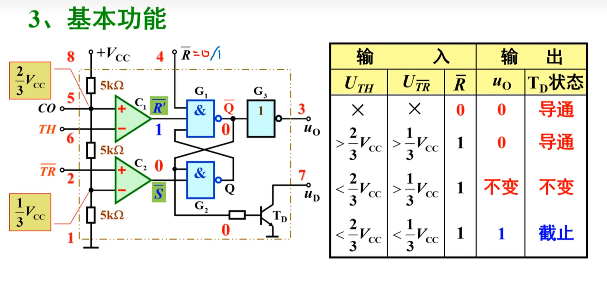

#### 前提：第 4 脚（R 非）的优先级最高

- **场景 1：R 非 = 0（异步清零）**

→ 无论 TH、TR 非输入如何，RS 触发器强制置 0（Q=0，Q 非 = 1）；

→ 输出端 Uo = ¬Q = 1→0（Uo=0）；

→ 晶体管 TD 饱和导通（Q 非 = 1 控制），第 7 脚（DIS）接地。

- **场景 2：R 非 = 1（正常工作）**

由 TH（第 6 脚）和 TR 非（第 2 脚）的输入电压决定状态，共 3 种情况：

| 条件（R 非 = 1）                     | 比较器输出 | RS 触发器状态 | 输出 Uo | 晶体管 TD 状态 |
| ------------------------------------ | ---------- | ------------- | ------- | -------------- |
| UTH > 2/3 VCC 且 U (TR 非) > 1/3 VCC | C1=0，C2=1 | 置 0（Q=0）   | 0       | 饱和导通       |
| UTH <2/3 VCC 且 U (TR 非) > 1/3 VCC  | C1=1，C2=1 | 保持原状态    | 不变    | 保持原状态     |
| UTH <2/3 VCC 且 U (TR 非) < 1/3 VCC  | C1=1，C2=0 | 置 1（Q=1）   | 1       | 截止           |

- **举例说明**：

	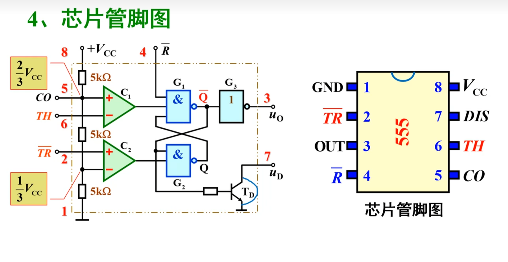

若 VCC=9V（常见电源），则基准电压为 2/3×9=6V、1/3×9=3V：

1. 当 TH=7V（>6V）、TR 非 = 4V（>3V）时，Uo=0，TD 导通；

1. 当 TH=5V（<6V）、TR 非 = 4V（>3V）时，Uo 保持前一状态（若前为 0 则仍为 0）；

1. 当 TH=5V（<6V）、TR 非 = 2V（<3V）时，Uo=1，TD 截止。

## 五、本视频涉及的实例与应用提示

1. **方波的判定实例**：若某矩形脉冲的周期 T=2ms，脉宽 Tw=1ms，则占空比 q=1ms/2ms=0.5，判定为方波。

1. **555 定时器的典型应用提示**：

视频提到 “第 4 章中的时钟脉冲 CP（矩形 / 方波），大多由 555 定时器搭建的多谐振荡器产生”（后续章节将详细讲解搭建方法）。

1. **555 型号选型实例**：若需单个定时器且用 TTL 电源（5V），选 555；若需两个定时器且用低压（3V），选 7556。

1. **第 5 脚（CO）的使用实例**：若需将比较器基准电压调整为 5V 和 2.5V，可在第 5 脚接入 Us=5V，此时 C1 基准 = 5V，C2 基准 = 2.5V。


# 施密特触发器

## 一、学习要求

1. 理解施密特触发器的逻辑功能及工作特点
2. 理解施密特触发器的典型应用

## 二、555 定时器构成的施密特触发器

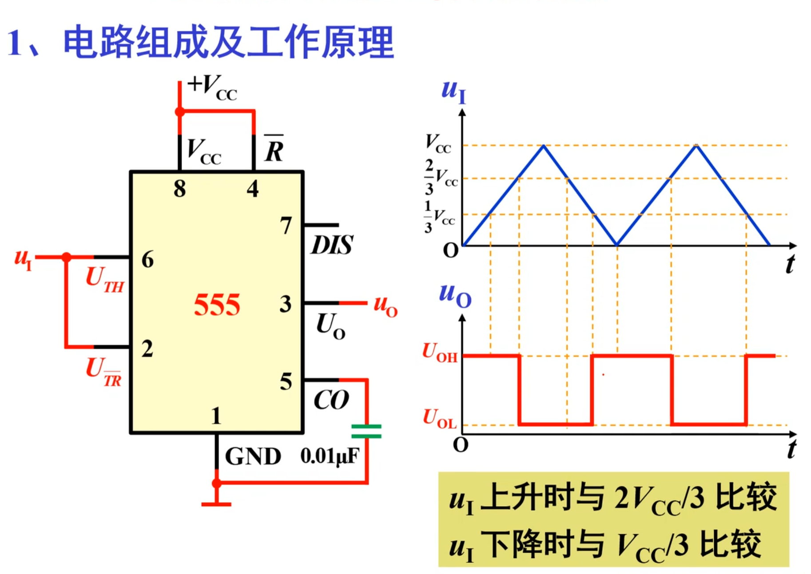

### 1. 电路组成（基于 555 定时器 8 脚结构）

#### （1）555 定时器管脚功能回顾

| 管脚编号 | 名称 / 功能                          | 关键说明                                                     |
| -------- | ------------------------------------ | ------------------------------------------------------------ |
| 1 脚     | 接地端（GND）                        | 电路接地                                                     |
| 2 脚     | 触发电压输入端（\(\overline{UTR}\)） | 与 1/3VCC 基准电压比较                                       |
| 3 脚     | 输出端（Uo）                         | 输出高 / 低电平                                              |
| 4 脚     | 异步清零端（\(\overline{R}\)）       | 低电平时清零，无需清零时接 VCC（强制为高电平 1）             |
| 5 脚     | 控制电压端（CO）                     | 改变内部两个比较器基准电压；不使用时通过 0.01μF 电容接地（保留 1/3VCC、2/3VCC 基准） |
| 6 脚     | 阈值电压输入端（UTH）                | 与 2/3VCC 基准电压比较                                       |
| 7 脚     | 放电端（DIS）                        | 无需额外输出时可闲置；需使用时需外接电源控制                 |
| 8 脚     | 电源端（VCC）                        | 接入电源正负极                                               |

#### （2）施密特触发器连接方式

- 电源：8 脚接 VCC，1 脚接地

- 异步清零端：4 脚接 VCC（禁用清零功能）

- 控制电压端：5 脚通过 0.01μF 电容接地（不改变基准电压）

- 输入 / 输出：6 脚（UTH）与 2 脚（\(\overline{UTR}\)）短接，作为公共输入端（UI）；3 脚作为输出端（Uo）

- 核心：仅需额外添加 0.01μF 电容，无其他多余元件

### 2. 工作原理（以三角波输入为例）

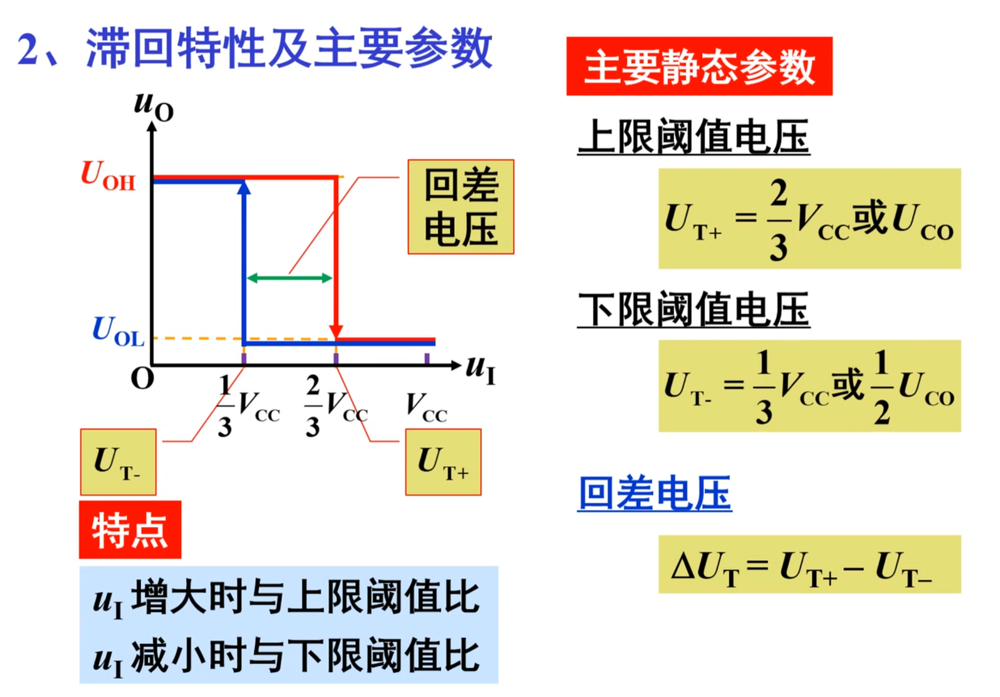

#### （1）基准电压设定

- 内部两个比较器基准电压：1/3VCC（下限）、2/3VCC（上限）

- 输入信号：UI 为三角波（幅值 0~VCC，缓慢上升 / 下降）

#### （2）输出波形分析（分两个阶段）

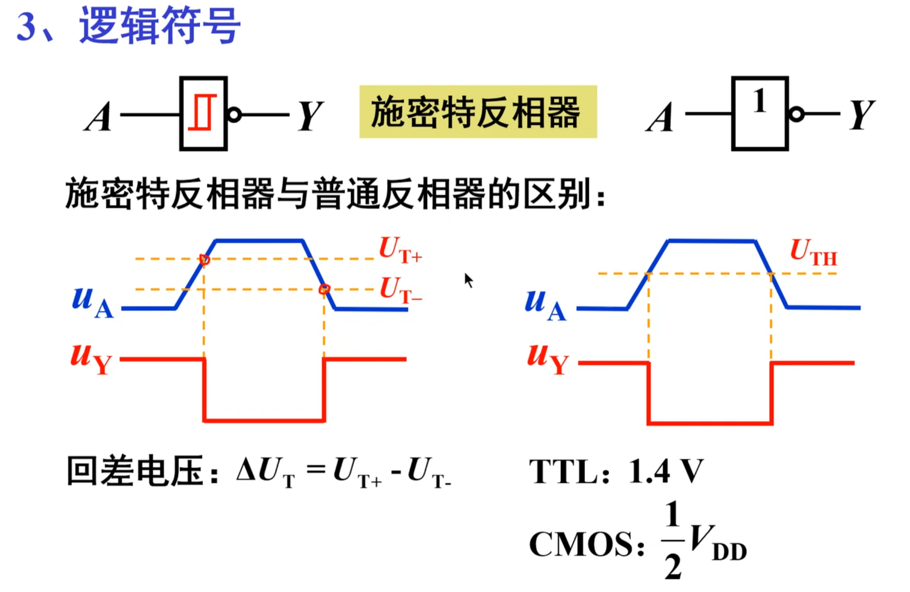

| 阶段           | UI 变化范围     | 与基准电压比较结果   | 输出 Uo 状态      | 关键跳变点              |
| -------------- | --------------- | -------------------- | ----------------- | ----------------------- |
| 三角波上升阶段 | 0 ~ 1/3VCC      | UI < 1/3VCC < 2/3VCC | 高电平（H）       | -                       |
|                | 1/3VCC ~ 2/3VCC | 1/3VCC < UI < 2/3VCC | 保持高电平（H）   | -                       |
|                | > 2/3VCC        | UI > 2/3VCC > 1/3VCC | 跳变为低电平（L） | UI = 2/3VCC（上升阈值） |
| 三角波下降阶段 | 2/3VCC ~ 1/3VCC | 1/3VCC < UI < 2/3VCC | 保持低电平（L）   | -                       |
|                | < 1/3VCC        | UI < 1/3VCC < 2/3VCC | 跳变为高电平（H） | UI = 1/3VCC（下降阈值） |

#### （3）核心特点

- 输入缓慢变化的三角波，输出为**跳变的矩形脉冲**（高 / 低电平瞬间切换）

- 输出电平跳变对应的输入电压不同（上升沿 2/3VCC，下降沿 1/3VCC）

## 三、滞回特性及主要参数

### 1. 滞回特性曲线（横坐标：UI，纵坐标：Uo）

#### （1）曲线绘制过程

- **上升段**：UI 从 0→VCC

- UI < 1/3VCC：Uo = 高电平

- 1/3VCC < UI < 2/3VCC：Uo 保持高电平

- UI > 2/3VCC：Uo 瞬间跳变为低电平

- **下降段**：UI 从 VCC→0

- UI > 2/3VCC：Uo = 低电平

- 1/3VCC < UI < 2/3VCC：Uo 保持低电平

- UI < 1/3VCC：Uo 瞬间跳变为高电平

- 曲线呈现 “滞回环” 形状，体现 “滞后特性”

### 2. 主要参数

| 参数名称     | 符号           | 定义 / 计算（默认 5 脚接电容接地场景）          | 变化场景（5 脚接外部电压 UCO）     |
| ------------ | -------------- | ----------------------------------------------- | ---------------------------------- |
| 上限阈值电压 | \(U_{T+}\)     | 输出从高→低对应的 UI（2/3VCC）                  | 变为\(U_{CO}\)                     |
| 下限阈值电压 | \(U_{T-}\)     | 输出从低→高对应的 UI（1/3VCC）                  | 变为\(1/2U_{CO}\)                  |
| 回差电压     | \(\Delta U_T\) | \(U_{T+} - U_{T-}\)（2/3VCC - 1/3VCC = 1/3VCC） | \(U_{CO} - 1/2U_{CO} = 1/2U_{CO}\) |

## 四、逻辑符号及与普通反相器的区别

### 1. 施密特触发器逻辑符号

- 核心标识：符号内部含 “滞回特性曲线” 标记（表示存在两个阈值电压）

- 施密特反相器：输入 A→输出 Y=\(\overline{A}\)，但具备滞回特性

### 2. 与普通反相器的区别（以阶梯波输入 UA 为例）

| 对比项       | 施密特反相器                                                 | 普通反相器（TTL/CMOS）                     |
| ------------ | ------------------------------------------------------------ | ------------------------------------------ |
| 阈值电压数量 | 2 个（\(U_{T+}\)、\(U_{T-}\)）                               | 1 个（TTL：1.4V；CMOS：1/2VDD）            |
| 输出跳变规则 | 上升沿跳变：UA > \(U_{T+}\)→Uo 低；下降沿跳变：UA < \(U_{T-}\)→Uo 高 | 上升 / 下降沿跳变：UA 过阈值电压即切换电平 |
| 输出波形示例 | 高电平持续到\(U_{T+}\)，低电平持续到\(U_{T-}\)               | 电平随阈值电压即时切换，无滞回             |

## 五、集成施密特触发器

### 1. TTL 型集成施密特触发器（74LS132）

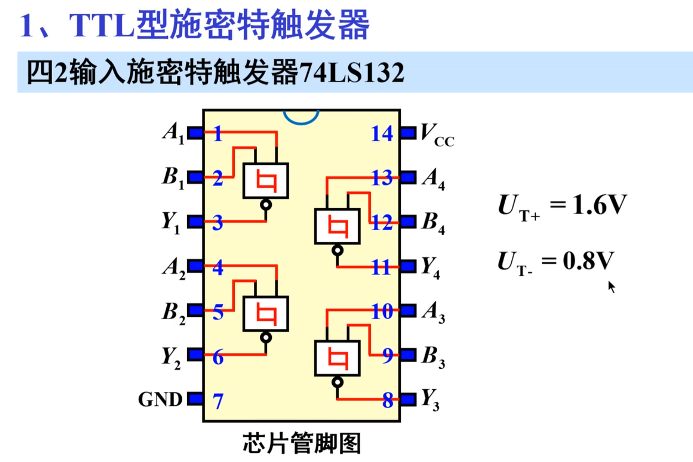

- 封装：14 脚双列直插

- 内部结构：4 个独立的 2 输入施密特与非门（共电源、接地）

- 管脚连接示例（单个与非门）：

- 输入：1 脚（A1）、2 脚（B1）

- 输出：3 脚（Y1）

- 电源：14 脚（VCC）、7 脚（GND）

- 关键参数：\(U_{T+}=1.6V\)，\(U_{T-}=0.8V\)，\(\Delta U_T=0.8V\)

- 逻辑功能：\(Y = \overline{A \cdot B}\)（与非逻辑 + 滞回特性）

### 2. CMOS 型集成施密特触发器（CC40106）

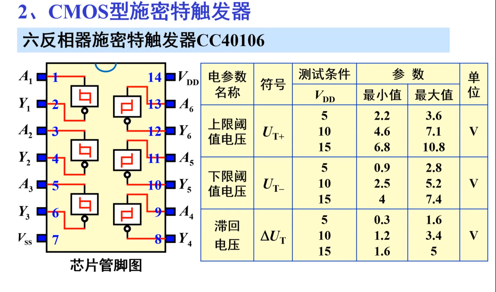

- 封装：14 脚双列直插

- 内部结构：6 个独立的施密特反相器（共电源、接地）

- 管脚连接示例（单个反相器）：

- 输入：1 脚（A1）

- 输出：2 脚（Y1）

- 电源：14 脚（VDD）、7 脚（GND）

- 关键参数（随 VDD 变化，范围值）：

| VDD（V） | \(U_{T+}\)（V） | \(U_{T-}\)（V） | \(\Delta U_T\)（V） |
| -------- | --------------- | --------------- | ------------------- |
| 5        | 2.2~3.6         | 0.9~2.8         | 0.3~1.6             |
| 10       | 4.6~7.1         | 2.5~5.2         | 1.2~3.4             |
| 15       | 6.8~10.8        | 4.0~7.4         | 1.6~5.0             |

- 逻辑功能：\(Y = \overline{A}\)（反相逻辑 + 滞回特性）

## 六、施密特触发器的典型应用

### 1. 应用 1：接口与整形

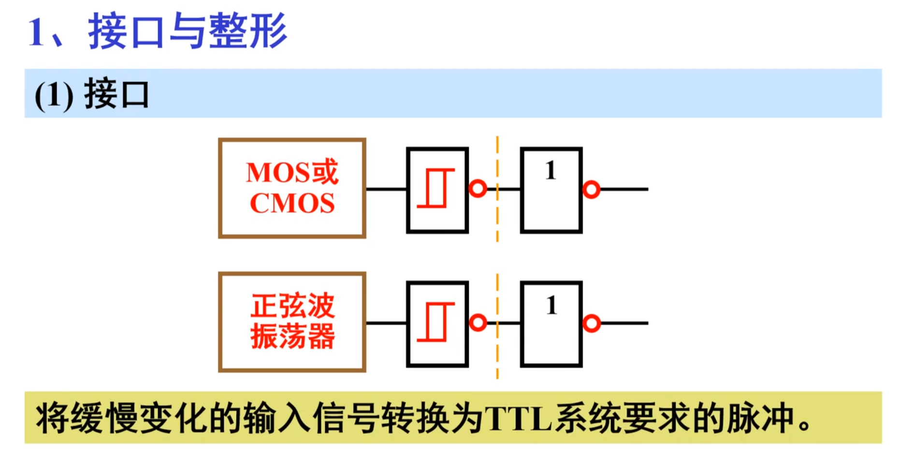

#### （1）接口功能（电平匹配）

- 场景：MOS/CMOS 电路输出→TTL 电路输入（电平不匹配）

- 解决方案：MOS/CMOS 输出端接**施密特反相器**，将 MOS/CMOS 电平转换为 TTL 标准高低电平；若需保持相位，可再级联 1 个普通反相器

- 示例：正弦波振荡器输出（无法直接驱动 TTL）→施密特反相器→矩形波（TTL 兼容）→（可选）普通反相器（恢复原相位）

#### （2）整形功能（波形规整）

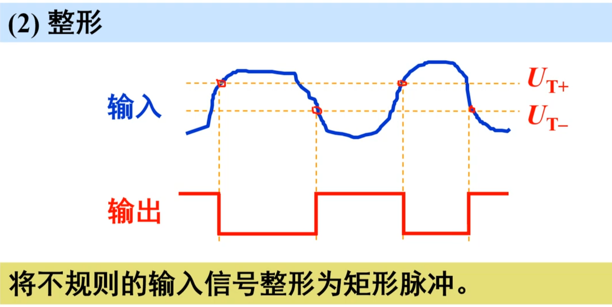

- 场景：输入为**不规则波形**（含干扰、失真，如 “类正弦波 + 噪声”）

- 解决方案：将不规则波形输入施密特反相器，利用滞回特性过滤干扰

- 示例：

- 输入：幅值波动、边缘模糊的不规则波形

- 处理：通过\(U_{T+}\)（2/3VCC）和\(U_{T-}\)（1/3VCC）筛选，仅当 UI 超过\(U_{T+}\)或低于\(U_{T-}\)时切换电平

- 输出：边缘陡峭、幅值稳定的矩形波

### 2. 应用 2：波形变换

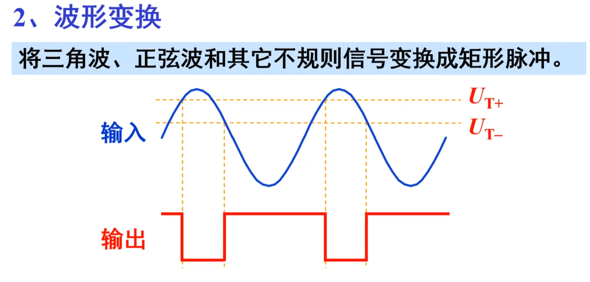

- 核心功能：将**缓慢变化的波形**转换为**跳变矩形波**

- 典型示例：

| 输入波形 | 转换过程                                                     | 输出波形 |
| -------- | ------------------------------------------------------------ | -------- |
| 三角波   | 上升沿：UI>2/3VCC→Uo 低；下降沿：UI<1/3VCC→Uo 高             | 矩形波   |
| 正弦波   | 上升沿：UI>2/3VCC→Uo 低；下降沿：UI<1/3VCC→Uo 高（过滤正弦波负半周干扰） | 矩形波   |

### 3. 应用 3：脉冲鉴幅（鉴别脉冲幅值）

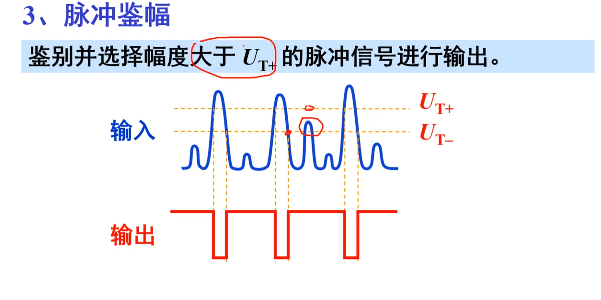

- 核心功能：仅保留**幅值大于**\(U_{T+}\) 的脉冲，过滤小幅值脉冲

- 示例分析：

- 输入：幅值不规则的脉冲序列（部分脉冲 > 2/3VCC，部分 < 2/3VCC）

- 施密特反相器参数：\(U_{T+}=2/3VCC\)，\(U_{T-}=1/3VCC\)

- 输出规则：

- 输入脉冲 > 2/3VCC：上升沿触发 Uo 跳变为低电平，下降沿 < 1/3VCC 时跳回高电平（输出 1 个低电平脉冲）

- 输入脉冲 < 2/3VCC：UI 始终未超过\(U_{T+}\)，Uo 保持高电平（无输出）

- 结果：仅幅值 > 2/3VCC 的输入脉冲被 “鉴别” 并输出对应低电平脉冲

## 七、施密特触发器仿真电路（基于 555 定时器）

### 1. 仿真电路组成

- 核心芯片：LMC555CN（555 定时器）

- 电路连接：

- 电源：8 脚（VCC）接电源，1 脚（GND）接地

- 异步清零端：4 脚（\(\overline{R}\)）接 VCC（禁用清零）

- 控制电压端：5 脚（CO）通过 0.01μF 电容接地（基准 1/3VCC、2/3VCC）

- 输入：2 脚（\(\overline{UTR}\)）与 6 脚（UTH）短接，接函数发生器（输入信号源）

- 输出：3 脚（Uo）接双踪示波器通道 2

- 测量：示波器通道 1 接函数发生器（观测输入），通道 2 接 3 脚（观测输出）

### 2. 仿真参数设置

- 函数发生器：

- 波形类型：三角波

- 频率：2Hz

- 占空比：50%

- 振幅：5V（峰 - 峰值 10V，对应 UI 范围 0~10V）

- 示波器：

- 通道 1（输入）：每格 10V（显示 0~10V 三角波）

- 通道 2（输出）：每格 5V（显示高电平 5V、低电平 0V 的矩形波）

### 3. 仿真结果验证

- 输入三角波：0→10V 上升，10V→0V 下降

- 输出矩形波：

- 上升沿：UI=2/3VCC（若 VCC=10V，即～6.67V）时，Uo 从 5V 跳变为 0V

- 下降沿：UI=1/3VCC（若 VCC=10V，即～3.33V）时，Uo 从 0V 跳变为 5V

- 结论：仿真结果与理论分析一致，验证了滞回特性和阈值电压的存在


# 单稳态触发器

## 一、学习要求 

1. 理解单稳态触发器的逻辑功能和工作特点
2.  理解单稳态触发器的典型应用

## 二、单稳态触发器的主要特点

### 1. 状态特性

- 包含两种状态：**稳态**和**暂稳态**（区别于施密特触发器的 “两种状态均为稳态”）

- 状态转换条件：需外来窄触发脉冲（触发脉冲宽度不影响暂稳态持续时间），触发后从稳态转入暂稳态，暂稳态持续一段时间后自动返回稳态

- 暂稳态持续时间：仅取决于电路参数（如电阻 R、电容 C），与触发脉冲无关

### 2. 典型用途

1. **定时**：产生固定宽度的方波

1. **延时**：将输入信号延迟一定时间后输出

1. **整形**：将不规则波形转换为宽度、幅度均相等的标准脉冲（与施密特触发器功能重合）

## 三、555 定时器构成的单稳态触发器

### 1. 电路结构

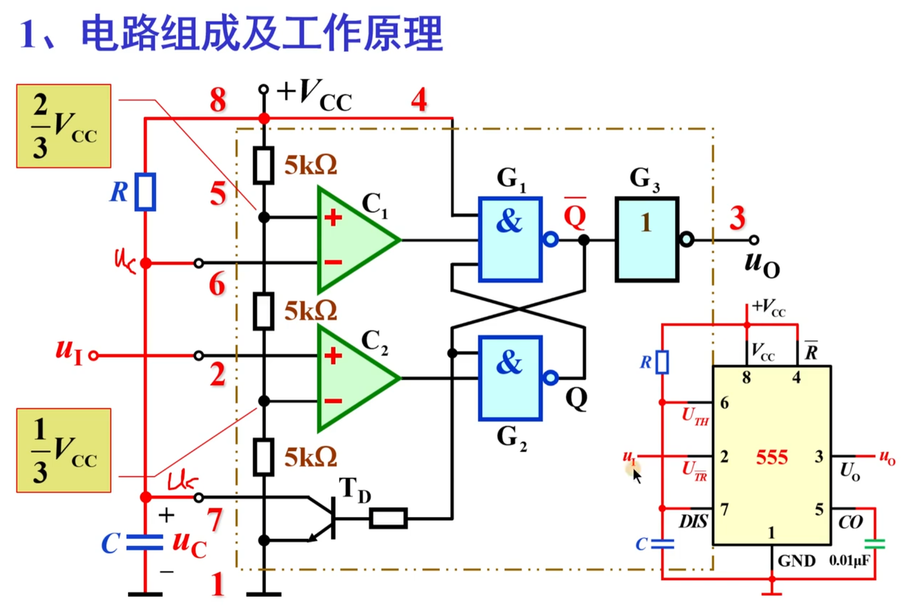

#### （1）555 定时器基础管脚与连接

- 555 定时器共 8 个管脚，核心为内部两个比较器（C1、C2）和 RS 触发器

- 关键管脚连接：

- **R 非端（异步清零端）**：不使用时直接接 VCC（高电平），避免误清零

- **5 管脚（参考电压控制端）**：

- 若不改变比较器参考电压：经 0.01μF 小电容接地

- 若改变参考电压：可外接小于 VCC 的电源 Us（此时 C1 参考电压为 Us，C2 参考电压为 1/2Us），或外接 10K 电阻（此时参考电压变为 1/4VCC，因内部电阻与外接 10K 电阻并联后分压变化）

- **外围器件（R、C）**：VCC 经电阻 R 接电容 C，C 接地；555 的 6 管脚（C1 同相端）、7 管脚（放电端）接 R 与 C 之间；2 管脚（C2 反相端）接输入信号 UI；3 管脚为输出 UO

#### （2）简化电路

- 用 555 逻辑符号表示时，仅需标注电源、地、R、C、UI（输入）、UO（输出），5 管脚经 0.01μF 接地（实际电路必需，画图时可简化）

### 2. 工作原理（结合波形：UI、UC、UO）

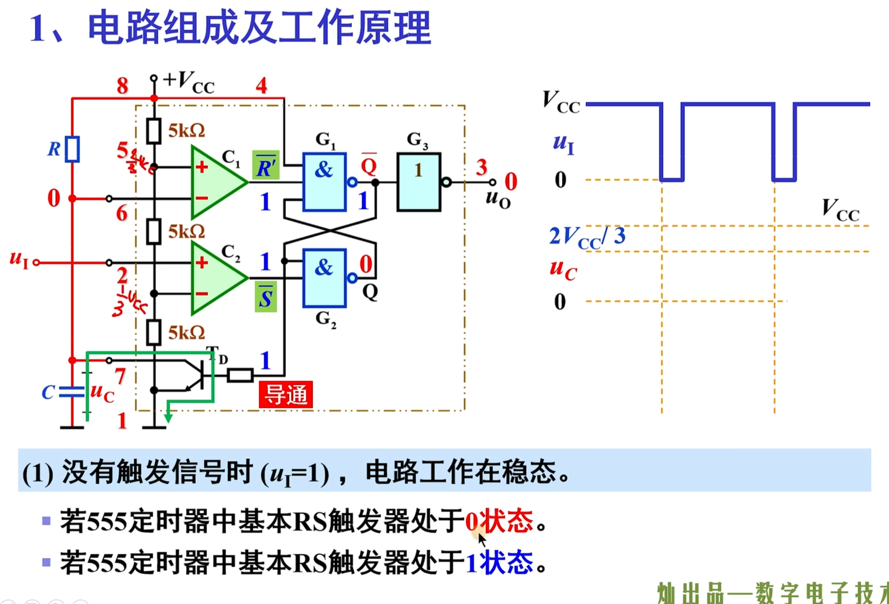

#### （1）无触发信号时（UI = 高电平，稳态）

- 核心分析 555 内部 RS 触发器的两种初始状态：

- **情况 1：RS 触发器初始为 0 状态（Q=0，Q 非 = 1）**

- Q 非 = 1→三极管 TD 饱和导通→7 管脚相当于接地→电容 C 无充电回路，UC=0V

- C1（同相端接 UC=0V，反相端接 2/3VCC）：0V < 2/3VCC→C1 输出 1

- C2（反相端接 UI=VCC，同相端接 1/3VCC）：VCC > 1/3VCC→C2 输出 1

- RS 触发器输入（S 非 = 1，R 非 = 1）→保持 0 状态→UO=Q 非 = 1？不，视频中明确：Q=0 时，UO 经非门后为 0（需结合内部非门），最终 UO=0V（稳态低电平）。

- **情况 2：RS 触发器初始为 1 状态（Q=1，Q 非 = 0）**

- Q 非 = 0→三极管 TD 截止→VCC 经 R 对 C 充电（零状态响应，τ1=RC）→UC 按指数规律上升

- 当 UC 上升至 2/3VCC 时→C1（0V→2/3VCC）：2/3VCC = 2/3VCC→C1 输出 0

- RS 触发器输入（S 非 = 1，R 非 = 0）→置 0 状态→Q=0，Q 非 = 1→TD 导通→C 放电至 UC=0V，UO=0V（回归稳态）

- 结论：无触发时，电路最终稳定在 UO=0V、UC=0V 的状态。

#### （2）有触发信号时（UI = 下降沿窄脉冲，暂稳态转换）

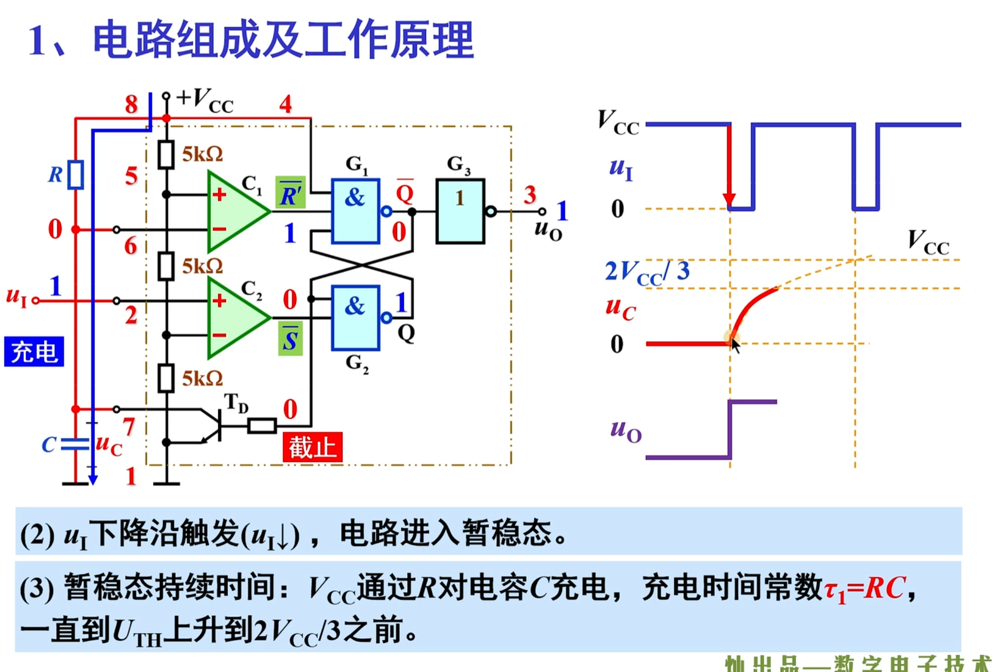

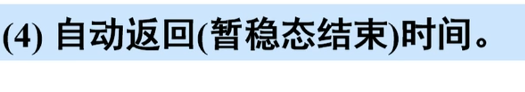

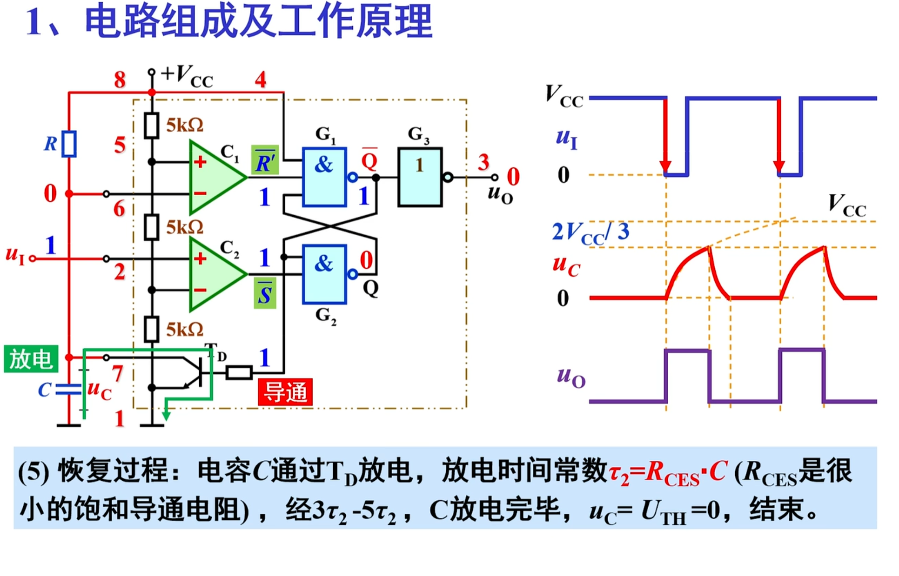

- **触发阶段（UI 从 VCC 跳变为 0V）**：

- C2（反相端接 UI=0V，同相端接 1/3VCC）：0V < 1/3VCC→C2 输出 0（S 非 = 0）

- C1（UC=0V < 2/3VCC）→C1 输出 1（R 非 = 1）

- RS 触发器输入（S 非 = 0，R 非 = 1）→置 1 状态→Q=1，Q 非 = 0→TD 截止，UO 跳变为高电平（进入暂稳态）。

- **暂稳态阶段（充电过程）**：

- TD 截止→VCC 经 R 对 C 充电，UC 按指数规律上升（τ1=RC），UC (t)=VCC (1-e^(-t/RC))

- 此阶段 UI 已恢复高电平（因触发脉冲为窄脉冲），C2 输出回归 1（S 非 = 1）。

- **恢复稳态阶段（放电过程）**：

- 当 UC 上升至 2/3VCC 时→C1 输出 0（R 非 = 0）

- RS 触发器输入（S 非 = 1，R 非 = 0）→置 0 状态→Q=0，Q 非 = 1→TD 导通

- C 经 TD 放电（τ2=RCES*C，RCES 为三极管饱和导通电阻，极小，放电极快），UC 快速降至 0V

- UO 跳回低电平，电路恢复稳态。

### 3. 主要参数计算

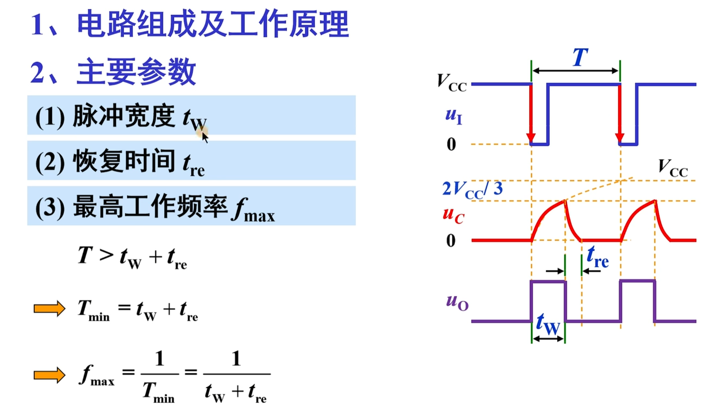

#### （1）脉冲宽度 Tw（暂稳态持续时间）

- 定义：UO 高电平的持续时间，对应 UC 从 0V 充电至 2/3VCC 的时间

- 推导过程：

充电时 UC (Tw)=2/3VCC，代入 UC (t)=VCC (1-e^(-t/RC))：

2/3VCC = VCC(1-e^(-Tw/RC))

→ 1/3 = e^(-Tw/RC)

→ 两边取自然对数：ln (3) = Tw/RC

→ Tw = RC・ln3 ≈ 1.1RC（核心公式）

- 特点：仅与 R、C 有关，与触发脉冲无关。

#### （2）恢复时间 Tre

- 定义：电容 C 从 2/3VCC 放电至 0V 的时间

- 工程近似：Tre = 3τ2 ~ 5τ2（τ2=RCES*C，因 RCES 极小，Tre 很短）。

#### （3）最高工作频率 fmax

- 定义：单位时间内触发器可稳定工作的最大脉冲数

- 公式：fmax = 1/(Tw + Tre)（需满足触发脉冲周期 T > Tw + Tre）。

## 四、具有 RC 微分电路的单稳态触发器

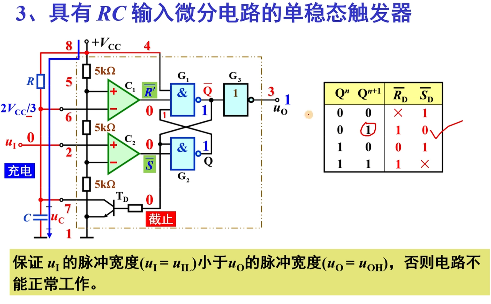

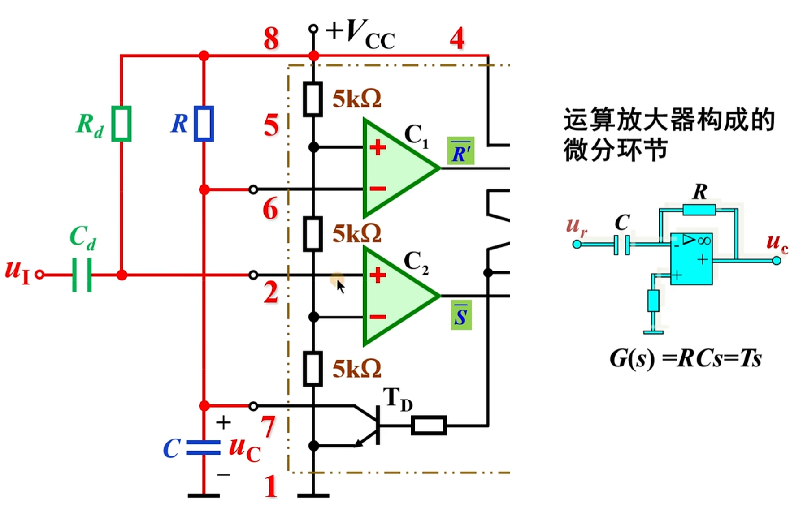

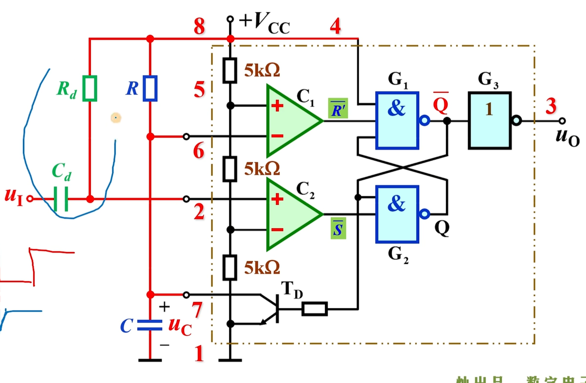

### 1. 引入原因

- 问题：若 UI 低电平脉宽 > Tw，会导致：

UC 充电至 2/3VCC 时，C1 输出 0（R 非 = 0），但 UI 仍为低电平→C2 输出 0（S 非 = 0），RS 触发器输入为（S 非 = 0，R 非 = 0），出现不允许的 “双 0 输入”，Q 和 Q 非同时为 1，UO 跳变为 0，随后 C 放电→UC<2/3VCC→C1 输出 1→RS 触发器又置 1，循环往复，UO 输出高频振荡波形（不符合要求）。

- 解决方案：在 UI 输入端增加**RC 微分电路（Rd、Cd）**，将宽低电平脉冲转换为窄下降沿脉冲，确保 UI 低电平脉宽 < Tw，避免上述问题。

## 五、集成单稳态触发器

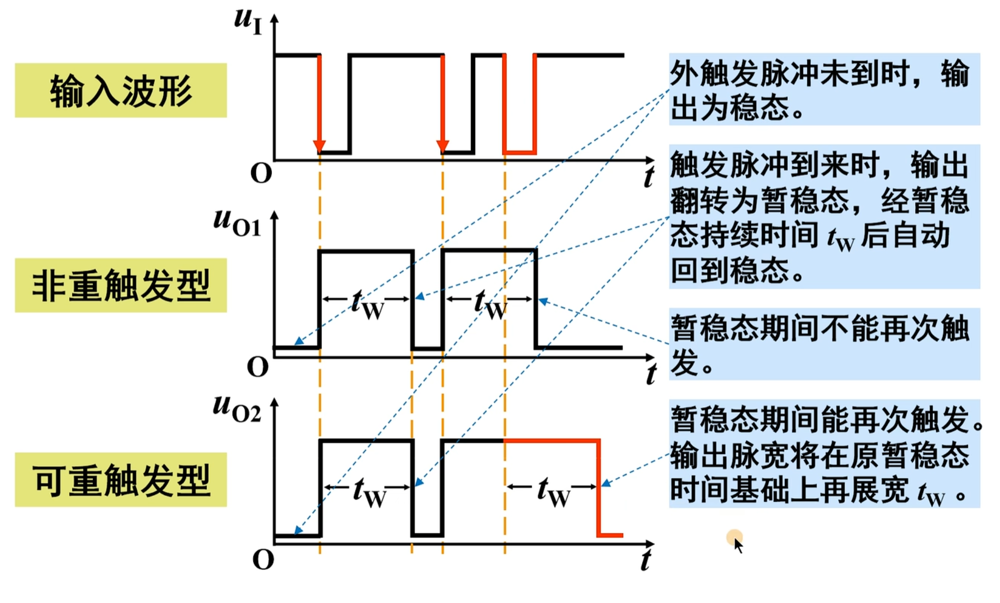

### 1. 分类与核心区别

| 类型     | 代表芯片 | 关键特性                                                     |
| -------- | -------- | ------------------------------------------------------------ |
| 非重触发 | 74LS121  | 暂稳态期间接收新触发脉冲，**不延长 Tw**（仅保持原 Tw，触发无效） |
| 可重触发 | 74LS122  | 暂稳态期间接收新触发脉冲，**延长 Tw**（以新触发时刻为起点，重新计算 Tw） |

- 共性：单个触发脉冲时，输出波形一致（稳态低电平→触发后高电平 Tw→恢复低电平）。

### 2. 非重触发集成单稳态触发器（74LS121）

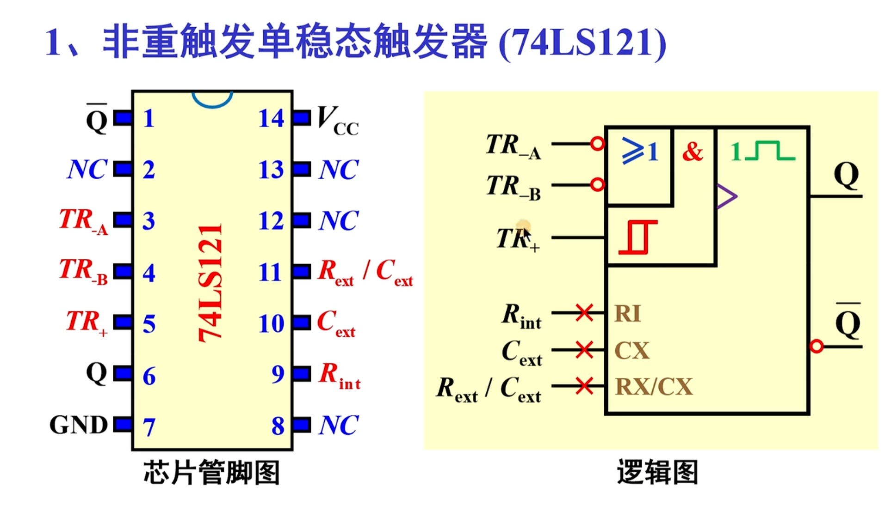

#### （1）管脚与功能

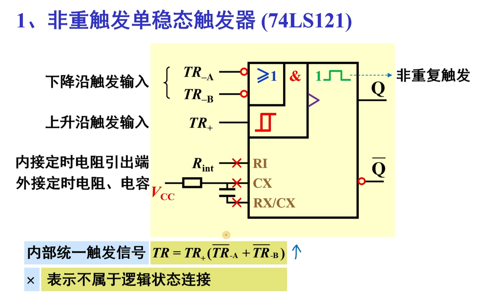

- 14 管脚芯片，关键管脚：

- 触发端：TR-A、TR-B（下降沿触发）、TR+（上升沿触发）

- 定时端：Cext（外接电容）、Rext/Cext（外接电阻或与 Rint 配合）、Rint（内置 2kΩ 定时电阻）

- 输出端：Q（正输出）、Q 非（反输出）

- 逻辑结构：TR-A、TR-B 取反后经或门，再与 TR+（施密特特性）、内部触发逻辑相与，输出上升沿触发信号（仅接收 1 次触发，非重触发）。

#### （2）功能表（核心逻辑）

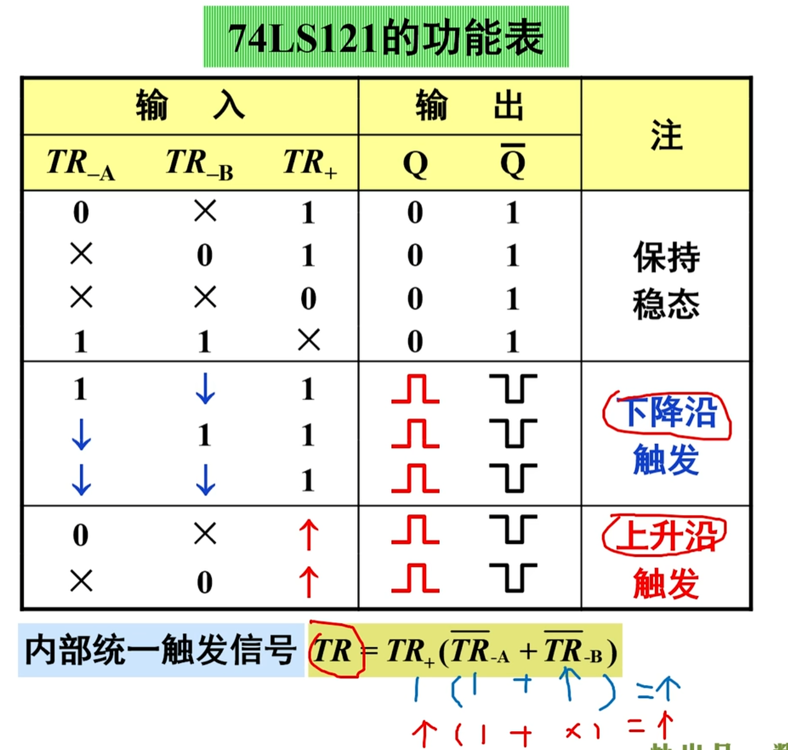

| 输入条件（TR-A、TR-B、TR+）              | 状态         | 输出 Q              |
| ---------------------------------------- | ------------ | ------------------- |
| 无上升沿触发（如 TR-A=1、TR-B=1、TR+=0） | 保持         | 原状态              |
| 下降沿触发（如 TR-A=↓、TR-B=1、TR+=1）   | 触发（置 1） | 高电平（Tw）→低电平 |
| 上升沿触发（如 TR-A=0、TR-B=0、TR+=↑）   | 触发（置 1） | 高电平（Tw）→低电平 |

#### （3）典型接线方式

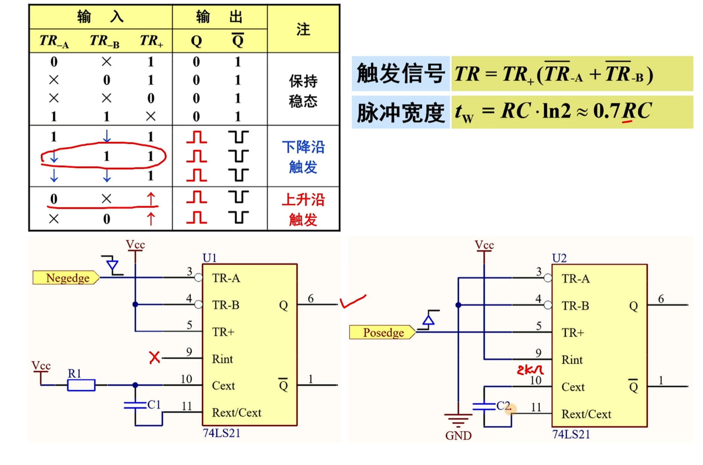

1. **下降沿触发（外接 RC）**：

- TR-B=1、TR+=1，TR-A 接下降沿输入；

- Cext 接电容 C，Rext/Cext 接外接电阻 R（Rint 悬空）；

- 脉冲宽度：Tw = 0.7RC。

1. **上升沿触发（用内置 R）**：

- TR-A=0、TR-B=0，TR + 接上升沿输入；

- Cext 接电容 C，Rint 接 VCC（启用内置 2kΩ 电阻），Rext/Cext 悬空；

- 脉冲宽度：Tw = 0.7×2kΩ×C。

#### （4）占空比特性

- 最大占空比：当 R=2kΩ（内置）时约 67%；

- 外接 R 范围 1.4kΩ~40kΩ 时，最大占空比可达 90%。

### 3. 可重触发集成单稳态触发器（74LS122）

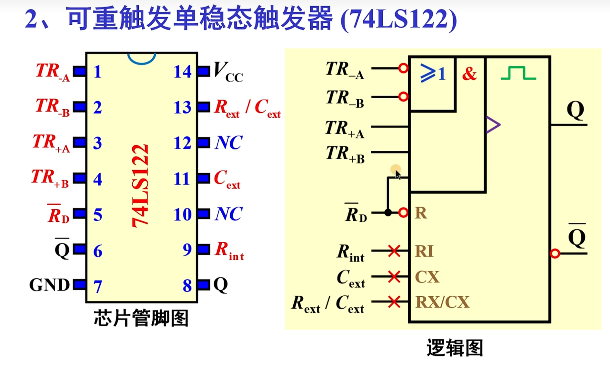

#### （1）关键特性（与 74LS121 区别）

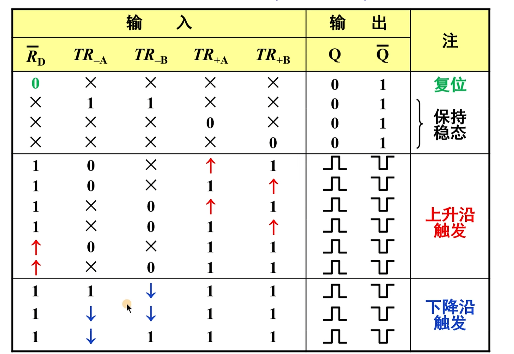

- 多 “TR+B”（额外上升沿触发端）和 “RD 非”（直接复位端）：RD 非 = 0 时，强制 Q=0（立即复位）；

- 暂稳态期间接收新触发脉冲（TR-A、TR-B 下降沿或 TR+、TR+B 上升沿），Tw 重新计算（延长暂稳态）；

- 脉冲宽度：当外接电容 C>1000pF 时，Tw = 0.32RC。

#### （2）核心逻辑

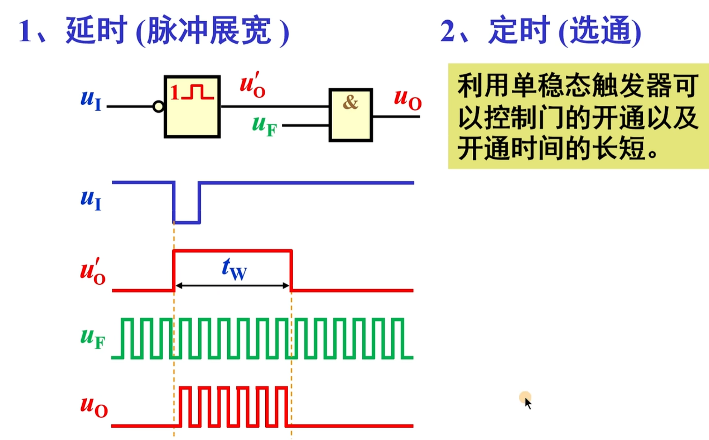

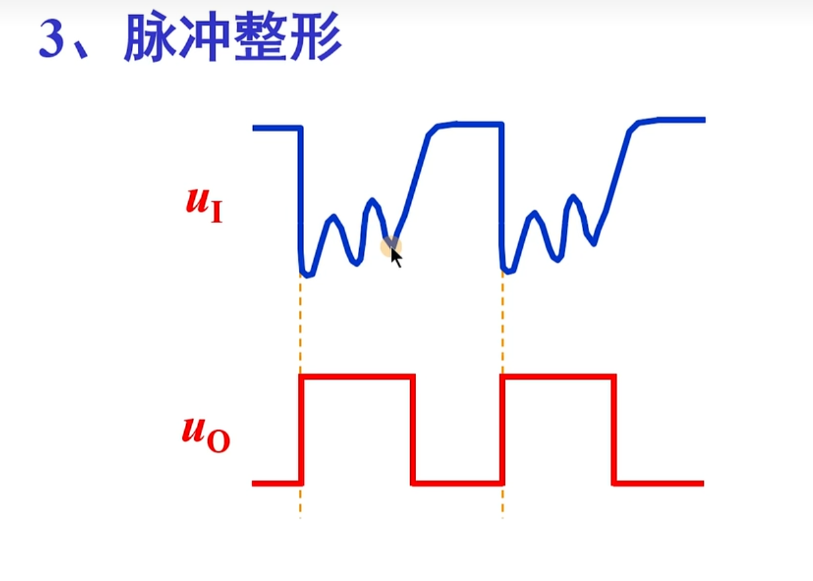

- 触发条件：TR-A、TR-B 取反或后，与 TR+、TR+B、RD 非（RD 非 = 1 时有效）相与，产生上升沿触发信号（可重复触发）；

- 复位逻辑：RD 非 = 0 时，无论触发状态，Q 立即置 0。


# 多谐振荡器

## 一、多谐振荡器基本概念

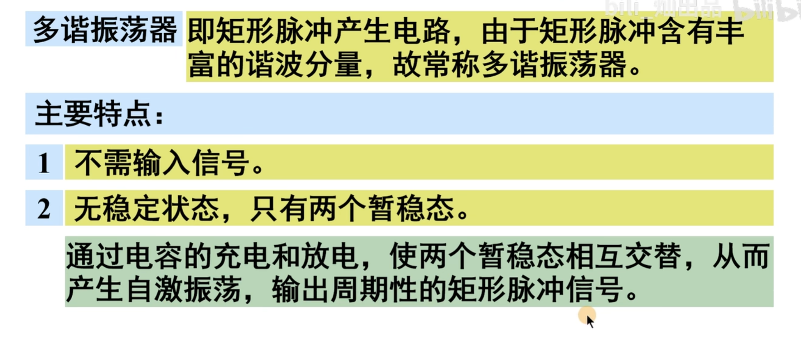

### 1.1 定义

多谐振荡器是一种**矩形脉冲产生电路**，因矩形脉冲包含丰富的谐波分量，故得名 “多谐振荡器”。

### 1.2 核心特点

1. **无需外接输入信号**：仅需接入电源（VCC）即可工作，区别于施密特触发器、单稳态触发器（均需外接输入信号进行整形 / 触发）；

1. **双暂稳态特性**：电路无稳定状态，仅存在两个暂稳态，通过**电容充放电**实现两个暂稳态的交替切换；

1. **暂稳态时间由 RC 决定**：两个暂稳态的持续时间完全由电路中的电容（C）和充放电回路的电阻（R）参数决定；

1. **自激振荡输出**：最终能产生周期性的矩形脉冲信号。

### 1.3 与其他触发器的对比

| 电路类型     | 稳定状态数量 | 暂稳态数量 | 核心依赖         |
| ------------ | ------------ | ---------- | ---------------- |
| 施密特触发器 | 2 个         | 0 个       | 外接输入信号整形 |
| 单稳态触发器 | 1 个         | 1 个       | 外接输入信号触发 |
| 多谐振荡器   | 0 个         | 2 个       | 电容充放电       |

## 二、555 定时器构成的多谐振荡器

### 2.1 不可调占空比的 555 多谐振荡器

#### 2.1.1 电路组成

- **核心器件**：555 定时器；

- **引脚连接**：

1. 4 脚（异步清零端）：接高电平 VCC（无需清零功能时）；

1. 外围元件：电阻 R₁、R₂，电容 C；

1. 5 脚（比较器参考电压控制端）：接 0.01μF 小电容接地（无需调整参考电压时，简化电路可暂不画，但实际需接）；

1. 6 脚（阈值端）与 2 脚（触发端）：短接后接至 R₂与 C 的连接点（该点电位即电容电压 U_C）；

1. 7 脚（放电端）：接至 R₁与 R₂的连接点；

1. 1 脚接地，8 脚接 VCC，3 脚为矩形脉冲输出端（U_O）。

#### 2.1.2 工作原理（基于换路定则与比较器特性）

555 定时器内部包含两个比较器（C₁、C₂）和 RS 触发器：

- C₁（阈值比较器）：同相输入端参考电压为 2/3VCC，反相输入端接 U_C；

- C₂（触发比较器）：反相输入端参考电压为 1/3VCC，同相输入端接 U_C；

- RS 触发器：由 C₁、C₂的输出（\(\overline{R}\)、\(\overline{S}\)）控制，低电平有效（\(\overline{S}=0\)置 1，\(\overline{R}=0\)置 0，\(\overline{R}=\overline{S}=1\)保持）；

- 三极管 TD（放电管）：基极接 RS 触发器的\(\overline{Q}\)端，\(\overline{Q}=0\)时截止，\(\overline{Q}=1\)时饱和导通。

工作过程分两个暂稳态，循环交替：

1. **暂稳态 1（U_O 为高电平）**：

- 起始状态：通电前电容 C 无电荷，U_C=0；通电瞬间（换路定则）U_C 保持 0；

- 比较器输出：C₁（0 < 2/3VCC）→ \(\overline{R}=1\)；C₂（0 < 1/3VCC）→ \(\overline{S}=0\)；

- RS 触发器：\(\overline{S}=0\)置 1 → Q=1，\(\overline{Q}=0\)；

- 放电管 TD：\(\overline{Q}=0\) → 截止（发射极 - 集电极断开）；

- 充电回路：VCC → R₁ → R₂ → C → 地，U_C 按指数规律从 0 上升至 2/3VCC；

- 状态保持：U_C 在 1/3VCC~2/3VCC 间时，C₁（U_C < 2/3VCC）→ \(\overline{R}=1\)，C₂（U_C > 1/3VCC）→ \(\overline{S}=1\)，RS 触发器保持 Q=1，U_O 维持高电平。

1. **暂稳态 2（U_O 为低电平）**：

- 自动翻转条件：U_C 上升至 2/3VCC 时；

- 比较器输出：C₁（U_C ≥ 2/3VCC）→ \(\overline{R}=0\)；C₂（U_C > 1/3VCC）→ \(\overline{S}=1\)；

- RS 触发器：\(\overline{R}=0\)置 0 → Q=0，\(\overline{Q}=1\)；

- 放电管 TD：\(\overline{Q}=1\) → 饱和导通（发射极 - 集电极近似短路）；

- 放电回路：C → R₂ → TD → 地，U_C 按指数规律从 2/3VCC 下降至 1/3VCC；

- 状态保持：U_C 在 1/3VCC~2/3VCC 间时，C₁（U_C < 2/3VCC）→ \(\overline{R}=1\)，C₂（U_C > 1/3VCC）→ \(\overline{S}=1\)，RS 触发器保持 Q=0，U_O 维持低电平。

1. **循环振荡**：当 U_C 下降至 1/3VCC 时，C₂（U_C ≤ 1/3VCC）→ \(\overline{S}=0\)，RS 触发器置 1，回到暂稳态 1，如此循环，输出周期性矩形脉冲。

#### 2.1.3 参数计算（基于一阶 RC 电路三要素法）

设充电常数\(\tau_1=(R_1+R_2)C\)，放电常数\(\tau_2=R_2C\)，三要素为：初始值\(U_{C(0^+)}\)、稳态值\(U_{C(\infty)}\)、时间常数\(\tau\)。

1. **充电时间（暂稳态 1 持续时间）**\(T_{W1}\)：

- 条件：U_C 从 1/3VCC 上升至 2/3VCC，\(U_{C(0^+)}=1/3VCC\)，\(U_{C(\infty)}=VCC\)；

- 公式：\(T_{W1}=\tau_1 \cdot \ln2 = 0.7(R_1+R_2)C\)。

1. **放电时间（暂稳态 2 持续时间）**\(T_{W2}\)：

- 条件：U_C 从 2/3VCC 下降至 1/3VCC，\(U_{C(0^+)}=2/3VCC\)，\(U_{C(\infty)}=0\)；

- 公式：\(T_{W2}=\tau_2 \cdot \ln2 = 0.7R_2C\)。

1. **振荡周期**\(T\)：

- 公式：\(T=T_{W1}+T_{W2}=0.7(R_1+2R_2)C\)。

1. **振荡频率**\(f\)：

- 公式：\(f=\frac{1}{T}=\frac{1}{0.7(R_1+2R_2)C}\)。

1. **占空比**\(q\)**（高电平时间占周期的比例）**：

- 公式：\(q=\frac{T_{W1}}{T}=\frac{R_1+R_2}{R_1+2R_2}\)；

- 特点：无论如何调整 R₁、R₂，均无法使占空比达到 50%（因分子≠分母的 1/2）。

#### 2.1.4 计算示例

已知 R₁=1kΩ，R₂=1kΩ，C=1μF，计算参数：

- \(T_{W1}=0.7×(1kΩ+1kΩ)×1μF=1.4ms\)；

- \(T_{W2}=0.7×1kΩ×1μF=0.7ms\)；

- \(T=1.4ms+0.7ms=2.1ms\)；

- \(f=\frac{1}{2.1ms}≈476Hz\)；

- \(q=\frac{1kΩ+1kΩ}{1kΩ+2×1kΩ}=\frac{2}{3}≈66.7\%\)。

### 2.2 可调占空比的 555 多谐振荡器

#### 2.2.1 电路改进（解决占空比不可调问题）

在不可调电路基础上增加：

- 1 个滑动变阻器\(R_P\)（中间抽头）；

- 2 个反向串联的二极管 D₁、D₂（D₁阳极接 R₂与\(R_P\)下端，阴极接 7 脚；D₂阳极接 7 脚，阴极接\(R_P\)上端与 R₁）；

- 其他引脚连接与不可调电路一致（5 脚接 0.01μF 接地，4 脚接 VCC）。

#### 2.2.2 工作原理（二极管单向导电性分离充放电回路）

- **充电过程（TD 截止）**：电流路径为 VCC→R₁→\(R_P\)上半部分→D₂→C→地，充电电阻为\(R_1'=R_1+R_{P上}\)，充电常数\(\tau_1'=R_1'C\)；

- **放电过程（TD 导通）**：电流路径为 C→\(R_P\)下半部分→R₂→D₁→TD→地，放电电阻为\(R_2'=R_2+R_{P下}\)，放电常数\(\tau_2'=R_2'C\)；

- 二极管导通时忽略压降与导通电阻，仅允许电流沿单一方向流动，实现充放电回路电阻独立调节。

#### 2.2.3 参数计算（占空比可调）

1. **充电时间**\(T_{W1}'\)：\(T_{W1}'=0.7R_1'C=0.7(R_1+R_{P上})C\)；

1. **放电时间**\(T_{W2}'\)：\(T_{W2}'=0.7R_2'C=0.7(R_2+R_{P下})C\)；

1. **占空比**\(q'\)：\(q'=\frac{T_{W1}'}{T_{W1}'+T_{W2}'}=\frac{R_1'}{R_1'+R_2'}\)；

1. **特点**：调节滑动变阻器\(R_P\)的抽头位置，可改变\(R_{P上}\)、\(R_{P下}\)，进而调整\(R_1'\)、\(R_2'\)，实现占空比连续可调（包括 50%）。

#### 2.2.4 计算示例

已知 R₁=5kΩ，R₂=5kΩ，\(R_P=10kΩ\)（抽头居中，\(R_{P上}=5kΩ\)，\(R_{P下}=5kΩ\)），C=1μF：

- \(R_1'=5kΩ+5kΩ=10kΩ\)，\(R_2'=5kΩ+5kΩ=10kΩ\)；

- \(T_{W1}'=0.7×10kΩ×1μF=7ms\)，\(T_{W2}'=0.7×10kΩ×1μF=7ms\)；

- \(T=14ms\)，\(f≈71.4Hz\)；

- \(q'=\frac{10kΩ}{10kΩ+10kΩ}=50\%\)（输出方波）。

## 三、555 多谐振荡器仿真实验

### 3.1 不可调占空比仿真

#### 3.1.1 仿真电路搭建

- 555 定时器为核心，6 脚与 2 脚短接后接 R₂-C 节点，7 脚接 R₁-R₂节点，5 脚接 0.01μF 接地，4 脚接 VCC；

- 双踪示波器：通道 1 接 C 两端（测 U_C），通道 2 接 3 脚（测 U_O），负极均接地。

#### 3.1.2 仿真现象

- 初始阶段：U_C 从 0 上升至 1/3VCC，此阶段 U_O 高电平持续时间较长（非稳定周期）；

- 稳定阶段：U_C 在 1/3VCC~2/3VCC 间周期性充放电，U_O 高电平（\(T_{W1}\)）宽于低电平（\(T_{W2}\)），符合参数计算结果；

- U_O 高低电平幅值接近 VCC 和 0V（如 VCC=5V 时，U_O≈5V/0V）。

### 3.2 可调占空比仿真

#### 3.2.1 仿真电路搭建

- 在不可调电路基础上添加滑动变阻器\(R_P\)（基础元件库中选择，带中间抽头）和二极管 D₁、D₂（型号选 1N4001 或 1N4007）；

- 示波器连接与不可调仿真一致。

#### 3.2.2 仿真现象

- 当\(R_P\)抽头居中（\(R_{P上}=R_{P下}\)）：U_O 高、低电平持续时间相等（\(T_{W1}'=T_{W2}'\)），输出标准方波；

- 当\(R_P\)抽头上移（\(R_{P上}>R_{P下}\)）：\(R_1'\)增大，\(T_{W1}'\)变长，占空比\(q'>50\%\)（例：\(R_{P上}=7kΩ\)，\(R_{P下}=3kΩ\)，\(q'≈70\%\)）；

- 当\(R_P\)抽头下移（\(R_{P上}<R_{P下}\)）：\(R_2'\)增大，\(T_{W2}'\)变长，占空比\(q'<50\%\)（例：\(R_{P上}=3kΩ\)，\(R_{P下}=7kΩ\)，\(q'≈30\%\)）；

- 注意：电容需选电解电容（大容值时），参数设置不当可能导致仿真报错（需反复调试 R、C 值）。

## 四、石英晶体多谐振荡器（高频 / 高稳定性场景）

### 4.1 石英晶体的核心特性

#### 4.1.1 压电效应

- 正向效应：给石英晶体加交变电压，晶体产生机械振动；

- 反向效应：晶体机械振动时，表面产生交变电压；

- 谐振特性：振动在某一频率（谐振频率\(f_0\)）时幅值最大，此时频率稳定性极高（10⁻¹⁰~10⁻¹¹ 量级）。

#### 4.1.2 等效电路与参数

- 等效电路：由 RLC 串联回路（模拟机械振动）和并联电容 C₀（模拟电极电容）组成；

- 典型参数：

- C₀（静态电容）：几十 pF；

- R（损耗电阻）：约 100Ω；

- L（惯性电感）：几百～几十 mH；

- C（弹性电容）：10⁻¹~10⁻⁴pF（极小）。

#### 4.1.3 选频特性

- 串联谐振频率\(f_0\)：当\(f=f_0\)时，RLC 串联回路谐振，电抗\(X=0\)，晶体呈纯阻性；

- 公式：\(f_0=\frac{1}{2\pi\sqrt{LC}}\)；

- 频率区间特性：

- \(f<f_0\)：晶体呈容性（C₀起主导作用）；

- \(f=f_0\)：晶体呈纯阻性（电抗最小，损耗最低）；

- \(f>f_0\)：晶体呈感性（RLC 串联回路呈感性，与 C₀并联）；

- 忽略并联谐振频率（与\(f_0\)极接近，工程上视为同一频率）。

### 4.2 串联式石英晶体多谐振荡器

#### 4.2.1 电路组成

- 核心器件：2 个反相器（TTL 或 CMOS）、石英晶体（工作在\(f_0\)）、耦合电容 C₁/C₂（几十 pF）、偏置电阻 R₁/R₂；

- 连接方式：

- 反相器 1 输出端→C₁→石英晶体→C₂→反相器 2 输入端；

- 反相器 2 输出端→R₂→反相器 1 输入端（正反馈回路）；

- 反相器 1、2 的电源端接 VCC，接地端接地；

- R₁、R₂接在反相器输入端与电源 / 地之间（调节反相器工作点）。

#### 4.2.2 工作原理

1. R₁、R₂的作用：使两个反相器工作在**转折区**（放大区），具备信号放大能力（TTL 电路 R₁/R₂取 0.7~2kΩ，CMOS 电路取 10~100MΩ）；

1. 正反馈与自激振荡：石英晶体工作在\(f_0\)（呈纯阻性，电抗 X=0），信号经反相器 1 放大→C₁→晶体→C₂→反相器 2 放大→R₂反馈回反相器 1，形成正反馈，满足自激振荡条件；

1. 输出：反相器 2 输出周期性矩形脉冲，频率等于晶体的谐振频率\(f_0\)。

### 4.3 并联式石英晶体多谐振荡器（CMOS 电路常用）

#### 4.3.1 电路组成

- 核心器件：1 个 CMOS 反相器、石英晶体、反馈电阻 Rf、电容 C₁（固定 20pF）、可调电容 C₂（5~50pF）；

- 连接方式：

- 反相器输出端→C₁→地，同时→石英晶体→反相器输入端；

- 反相器输入端→Rf→反相器输出端（正反馈回路）；

- 反相器输入端→C₂→地；

- 反相器电源端接 VCC，接地端接地。

#### 4.3.2 工作原理

1. Rf 的作用：使反相器工作在转折区（放大状态），Rf 取 10~100MΩ；

1. 选频与振荡：C₁、C₂与石英晶体构成**电容三点式选频网络**，仅当频率为\(f_0\)时，晶体呈感性，选频网络满足正反馈条件，产生自激振荡；

1. 频率调节：可调电容 C₂用于微调振荡频率（补偿晶体参数偏差）；

1. 输出：反相器输出矩形脉冲，频率稳定为\(f_0\)。

## 五、多谐振荡器的应用

### 5.1 秒信号发生器（计时系统基准源）

#### 5.1.1 电路组成

- 核心模块：并联式石英晶体多谐振荡器（\(f_0=32768Hz\)）+15 个 T' 触发器（级联）；

- T' 触发器特性：每输入一个上升沿，输出翻转一次（实现 “二分频”，频率减半，周期加倍）。

#### 5.1.2 工作原理（二分频级联）

1. 石英晶体输出 32768Hz 脉冲，送入第一个 T' 触发器；

1. 每级 T' 触发器实现二分频：

- 第 1 级：32768Hz → 16384Hz；

- 第 2 级：16384Hz → 8192Hz；

- ...

- 第 14 级：2Hz；

- 第 15 级：1Hz；

1. 1Hz 脉冲即 “秒信号”（周期 1 秒），稳定性由石英晶体保证（误差极小）。

#### 5.1.3 用途

作为电子钟、计时器、数据采集系统等的时间基准信号源。

### 5.2 防盗报警器（基于 555 多谐振荡器）

- 电路基础：采用不可调占空比 555 多谐振荡器；

- 工作逻辑：通过传感器（如红外、振动传感器）控制 555 定时器的 4 脚（异步清零端）：

- 无异常时，传感器输出低电平，4 脚接低电平→555 清零，U_O 无输出；

- 有异常时，传感器输出高电平，4 脚接高电平→555 工作，产生周期性脉冲，驱动蜂鸣器 / LED 报警；

- 特点：电路简单，成本低，适用于简易防盗场景。


# 第6章小结

## 一、 核心基础

1. 学习内容：555定时器的**内部结构**与**工作原理** 
2. 核心特性：外围仅需接入少量电阻、电容元件，即可构造3种典型电路 
3. 性能优势：使用方便灵活、负载能力强、触发灵敏度高 
4. 应用领域：自动控制仪器、仪表、家用电器等多个领域，还可组成其他多种实用电路

## 二、555 定时器构成的三大典型电路

### （一）施密特触发器

#### 1. 电路结构（视频图示左图）

- 管脚连接：2 管脚与 6 管脚直接相连，外来输入信号ui从该连接点引入；7 管脚可悬空；VCC（电源）与R非（复位端）接电源端

- 关键元件：5 管脚通过**0.01μF 电容**接地

- 参考电压：因 5 管脚接固定电容，两个比较器的参考电压固定为2/3 VCC（上限）和1/3 VCC（下限）

#### 2. 核心特性：回差特性

- 定义：存在两个不同触发电平，即**上限阈值电压 UT+**（高电平→低电平翻转时对应电压，值为 2/3 VCC）和**下限阈值电压 UT-**（低电平→高电平翻转时对应电压，值为 1/3 VCC）

- 回差电压：ΔUT = UT+ - UT-，是施密特触发器的核心标识

#### 3. 功能与应用

- 波形整形：可将任意波形（如变化缓慢、不规则的波形）变换为规则的矩形脉冲，输出脉冲宽度（TW）取决于输入信号波形和回差电压大小

- 幅度鉴别（鉴幅）：通过设定合适的回差电压，可筛选出幅度符合要求的输入信号（例：从多个幅度不同的信号中，仅保留幅度超过 UT + 或介于 UT-~UT + 的信号）

- 扩展能力：可进一步构造成单稳态触发器、多谐振荡器（视频提示 “可阅读相关资料深入了解”）

#### 4. 电路选用建议

- 两种方案：可选用集成施密特触发器，或用 555 定时器构成（后者仅需 5 管脚接小电容，无需额外电阻，操作简便）

### （二）单稳态触发器

#### 1. 电路结构（视频图示中图）

- 管脚连接：输入信号ui从 2 管脚引入；6 管脚与 7 管脚直接相连；6 管脚上侧接电阻 R，下侧接电容 C；输出信号从 3 管脚引出；5 管脚通过小电容（同施密特触发器，推测为 0.01μF）接地

- 电源连接：VCC 与R非接电源端

#### 2. 核心特性：稳态与暂稳态

- 状态特点：仅存在 1 个**稳定状态**和 1 个**暂稳态**

- 状态转换：需输入信号ui触发，触发后从稳态过渡到暂稳态；暂稳态结束后自动返回稳态，输入信号仅起触发作用，不影响暂稳态持续时间

#### 3. 脉宽特性

- 脉宽决定因素：仅取决于电路自身的**RC 定时元件参数**（与输入信号无关）

- 调节方式：改变电阻 R 和电容 C 的数值即可调节输出脉冲宽度（TW），视频提及常见计算公式形式为 “TW≈1.1RC” 或 “TW≈1.3RC”（提示 “可自行查阅具体公式”）

#### 4. 功能与应用

- 波形整形：将输入触发脉冲变换为宽度、幅度均符合要求的矩形脉冲

- 脉冲展宽：扩展输入脉冲的宽度（视频提及 “前面应用中已介绍，可回顾相关内容”）

- 定时功能：利用固定的 RC 参数实现精准定时

#### 5. 电路选用建议

- 两种方案：可选用集成单稳态触发器，或用 555 定时器 + RC 元件构成

### （三）多谐振荡器

#### 1. 电路结构（视频图示右图，占空比不可调型）

- 管脚连接：无外接输入信号ui；外围接 R1、R2 两个电阻和 1 个电容 C；7 管脚接在 R1 与 R2 的连接点；6 管脚与 2 管脚直接相连，并接至电容 C 的上侧；5 管脚通过小电容（0.01μF）接地

- 电源连接：VCC 与R非接电源端

#### 2. 核心特性：无稳定状态

- 工作机制：通过电容 C 的充放电过程实现两个暂稳态的自动转换

- 充电阶段：电容充电至 2/3 VCC 时，输出从高电平翻转到低电平

- 放电阶段：电容放电至 1/3 VCC 时，输出从低电平翻转到高电平

- 输出结果：产生周期性矩形脉冲，改变 R1、R2、C 的数值可调节振荡频率（或周期）

#### 3. 占空比可调型电路改造

- 改造需求：若需灵活调节占空比，需额外增加**1 个滑线变阻器**和**2 个二极管**（视频提示 “可回顾前面内容了解具体电路”）

#### 4. 石英晶体多谐振荡器（高频稳定性需求场景）

##### （1）核心优势：高频稳定性

- 适用场景：当振荡频率稳定性要求较高时，优先选用石英晶体构成的多谐振荡器

##### （2）选频特性

- 谐振机制：石英晶体内部等效为 RLC 电路，外接静态电容后，当 RLC 发生**串联谐振**时，振荡频率（f0）极具稳定性

- 品质因素 Q：决定选频特性优劣的关键参数

- 串联谐振时计算公式：Q = WL/R = 1/(WCR)（W 为角频率，W=2πf）

- 参数范围：晶体内部 R≈100Ω（较小）、L≈几十～几百 mH（较大）、C≈10⁻¹~10⁻⁴pF（较小）

- Q 值意义：Q 值越大，振荡能量损失速率越慢、损耗越小、效率越高、选频特性越好（通带越窄）

##### （3）电路类型

- 两种结构：视频提及 “串联谐振型” 和 “并联谐振型” 石英晶体多谐振荡器

- 整形设计：振荡初期产生接近正弦波的波形，需在外围增加**1 个反相器**进行整形，最终输出矩形波（视频提示 “弹幕中已补充该设计细节”）

#### 5. 功能与应用：产生周期性矩形脉冲，作为时钟信号或驱动信号

## 三、电路设计与实践建议

### （一）学习目标

- 基础要求：掌握本章知识点，能根据需求快速匹配对应的电路类型及集成芯片

- 进阶要求：具备电路设计、仿真与硬件验证能力

### （二）设计流程

1. 仿真验证：使用 Multisim 软件搭建电路并进行仿真，验证功能正确性

1. 硬件验证：仿真通过后进行实物搭建

- 搭建方式：①利用实验室数电箱搭建；②使用面包板 + 配套配件 + 对应芯片搭建

- 核心目标：验证实物电路是否实现设计要求

### （三）芯片选用原则

- 优先选择：根据功能需求，可直接选用集成化电路（如集成施密特触发器、集成单稳态触发器），或用 555 定时器灵活构成目标电路


# 第8章概述

## 一、存储器的基本概念与半导体存储器的作用

### 1. 存储器的定义

- 用于存储**一系列二进制数码**的器件，是数字系统（如计算机、数码相机、手机）存储数据的核心组件。

### 2. 半导体存储器的核心问题与解决办法

- **核心问题**：半导体存储器属于大规模集成电路，存储单元数目极其庞大，无法像寄存器那样直接引出每个存储单元的输入 / 输出（I/O）引脚（引脚数量有限）。

- **解决办法**：

1. 给每个存储单元分配唯一的**地址代码**；

1. 仅当输入的地址代码与某存储单元地址匹配时，该单元才与公共 I/O 引脚接通；

1. 通过 “地址输入→地址译码器定位单元→读写数据” 的流程，实现数据的读出或写入（后续存储器工作原理均基于此逻辑）。

### 3. 半导体存储器的应用场景

- 大型数字系统：计算机的核心存储部件；

- 小型便携设备：数码相机、手机等数码产品的存储模块。

## 二、半导体存储器的分类

### （一）按存取功能分类：ROM 与 RAM

#### 1. 只读存储器（ROM，Read Only Memory）

- **核心特点**：

- 正常工作时，仅能**读出数据**，无法写入数据；

- 断电后，内部数据**不丢失**（非易失性）；

- 用途：存放不变数据，如重要常数、系统管理程序（如计算机开机启动程序）。

- **电路结构**：由**与阵列、或阵列、输出缓冲级**三部分组成，属于**大规模组合逻辑电路**（无记忆功能的触发器）。

#### 2. 随机存取存储器（RAM，Random Access Memory）

- 别称：读 / 写存储器；

- **核心特点**：

- 既能读出数据，也能写入数据（双向操作）；

- 断电后，内部数据**全部丢失**（易失性）；

- 用途：存放临时数据、中间处理结果，如计算机的 “内存（主存）”。

- **电路结构**：由**地址译码器、存储矩阵、读 / 写控制电路**三部分组成，属于**大规模时序逻辑电路**（包含具有记忆功能的触发器）。

### （二）按 ROM 内容存入方式分类（4 类）

#### 1. 掩膜 ROM（固定 ROM）

- 数据写入方式：**芯片制作阶段通过掩膜技术写入数据**（掩膜技术：集成电路光刻环节，将掩膜图形转移到硅片光刻胶上，类似相机底片成像）；

- 特点：数据写入后**永久不可更改**，适用于量产的固定程序场景（如早期家电的固化控制程序）。

#### 2. 可编程 ROM（PROM）

- 数据写入方式：用户可自行编写数据并写入（首次可编程）；

- 特点：写入后**无法再次更改**；若需擦除，需使用**紫外光照射（约 20 分钟）** ，操作复杂。

#### 3. 可擦除可编程 ROM（EPROM）

- 核心特点：支持 “擦除→重新编程”，但**改写过程繁琐**（需专用设备）；

- 工作状态：正常工作时仍以 “只读” 方式运行，仅在需要更新数据时进行擦除和重写。

#### 4. 电擦除可编程 ROM（E²PROM/EEPROM）

- 核心特点：采用**电擦除方式**，擦除时间短（仅需几十毫秒），无需紫外光，操作更便捷；

- 优势：兼顾非易失性和可改写性，广泛用于需要频繁更新小容量数据的场景（如手机的 BIOS 设置存储）。

### （三）按 RAM 工作方式分类：SRAM 与 DRAM

#### 1. 静态 RAM（SRAM，Static RAM）

- 结构：以**静态触发器**为核心，附加门控制管构成；

- **核心特点**：

- 依靠触发器的 “保持功能” 存储数据，电路工作稳定；

- 存取速度快，**无需定期刷新**（只要不断电，数据持续保留）；

- 用途：作为 CPU 内部的**高速缓存（Cache）** ，匹配 CPU 的高速运算需求。

#### 2. 动态 RAM（DRAM，Dynamic RAM）

- 结构：利用**电容存储电荷**的原理保存数据；

- **核心特点**：

- 电路结构简单，集成度高（相同芯片面积可容纳更多存储单元）；

- 缺陷：电容存在**漏电现象**，电荷会逐渐流失，需**每 2ms 定期刷新**（补充电荷）以避免数据丢失；

- 用途：作为计算机的 “主存（内存）”，提供大容量临时存储。

#### 3. DRAM 的常见子类（扩展知识点）

- **SDRAM（同步 DRAM）**：与 CPU 的时钟速度同步，减少数据传输延迟，提升整体性能；

- **DDR SDRAM（双倍速率 SDRAM）**：

- 核心优势：数据传输速率是 SDRAM 的 2 倍，且每代（DDR4、DDR5 等）迭代均追求 “更低功耗、更高速度、更高密度”；

- 应用：当前主流计算机内存（如 DDR5-5600 内存条）；

- **GDDR SDRAM（图形 DRAM）**：专为图形处理设计，用于显卡的高速显存，满足 3D 渲染等大数据量运算需求。

## 三、计算机存储设备的整体构成（视频总结）

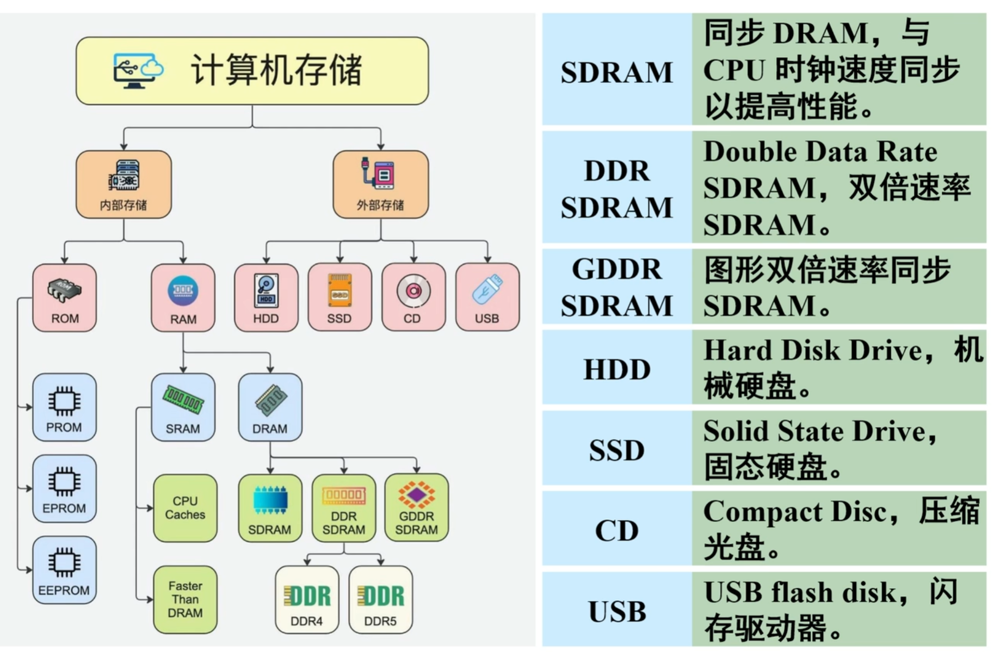

### 1. 内部存储设备（核心为半导体存储器）

| 类别          | 具体类型                                             | 用途示例                   |
| ------------- | ---------------------------------------------------- | -------------------------- |
| ROM（非易失） | 掩膜 ROM（固定）、PROM、EPROM、EEPROM                | 存储开机程序、BIOS 设置    |
| RAM（易失）   | SRAM（高速缓存 Cache）、DRAM（SDRAM/DDR/GDDR SDRAM） | 存储运行中的程序、临时数据 |

### 2. 外部存储设备（辅助存储，非半导体存储器核心，但视频提及）

| 设备类型       | 英文全称                 | 特点与用途                   |
| -------------- | ------------------------ | ---------------------------- |
| 机械硬盘       | HDD（Hard Disc Drive）   | 大容量、低成本，存长期数据   |
| 固态硬盘       | SSD（Solid State Drive） | 高速、无机械结构，存常用数据 |
| 压缩光盘       | CD（Compact Disc）       | 早期数据刻录、音视频存储     |
| USB 闪存驱动器 | USB Flash Disc           | 便携、即插即用，存小型文件   |

## 四、关键区分点（核心对比）

| 对比维度     | ROM                        | RAM                            |
| ------------ | -------------------------- | ------------------------------ |
| 存取功能     | 仅读（正常工作）           | 可读可写                       |
| 断电数据保留 | 不丢失（非易失）           | 丢失（易失）                   |
| 电路类型     | 组合逻辑电路（无触发器）   | 时序逻辑电路（有触发器）       |
| 核心用途     | 固定数据（系统程序、常数） | 临时数据（运行程序、中间结果） |

| 对比维度     | SRAM                  | DRAM               |
| ------------ | --------------------- | ------------------ |
| 存储原理     | 静态触发器            | 电容存电荷         |
| 刷新需求     | 无需刷新              | 每 2ms 定期刷新    |
| 速度与集成度 | 速度快、集成度低      | 速度慢、集成度高   |
| 核心用途     | CPU 高速缓存（Cache） | 计算机主存（内存） |


# ROM的工作原理

## 一、ROM 基本概念

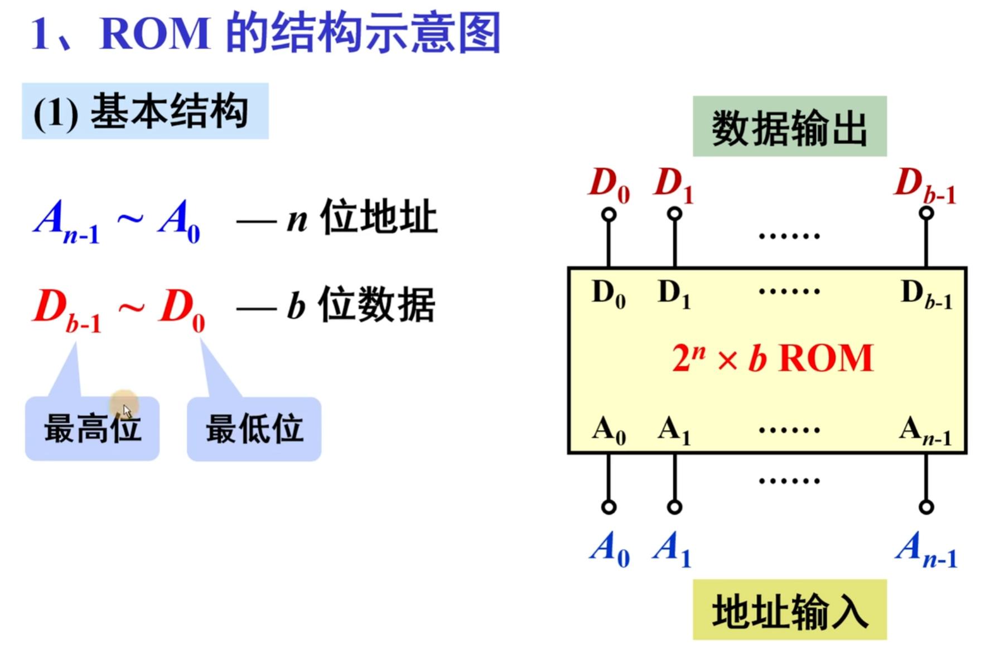

### 1. 定义

只读存储器（Read-Only Memory，简称 ROM）：一种固定存储器，用于长期存放数据、程序表格或字符等信息。

### 2. 核心特点

- **非易失性**：断电后存储内容不丢失（与 RAM 的 “易失性” 相反，RAM 断电内容丢失）；

- **只读特性**：工作时仅能读出存储单元信息，不能写入（命名来源）。

### 3. 学习要求

1. 理解 ROM 的电路结构和工作原理；

1. 理解用 ROM 实现组合逻辑函数的方法。

## 二、ROM 的电路结构

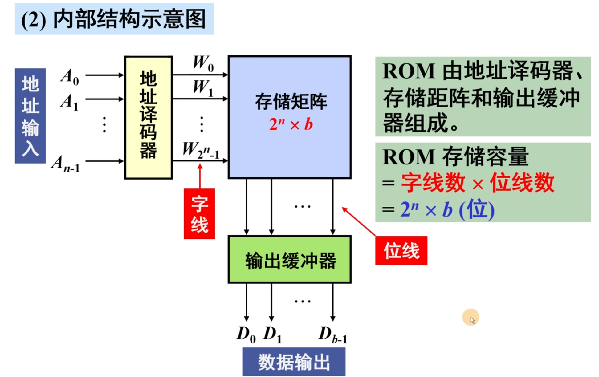

### 1. 基本结构框图

- **地址输入端**：A₀~Aₙ₋₁（共n个），用于输入地址信号；

- **数据输出端**：D₀~Dᵦ₋₁（共b个），用于输出存储的b位数据；

- 核心逻辑：n个地址经译码可生成2ⁿ个电平信号（对应字线），控制存储矩阵输出b位数据。

### 2. 内部三部分组成

ROM 内部由 “地址译码器”“存储矩阵”“输出缓冲器” 三部分构成，具体功能如下：

#### （1）地址译码器

- 输入：A₀~Aₙ₋₁（n位地址）；

- 输出：W₀~W₂ⁿ⁻¹（共2ⁿ条 “字线”，Word 线）；

- 功能：将地址信号译码为对应的字线信号，每条字线对应一个 “最小项”（如n=2时，W₀=Ā₁·Ā₀、W₁=Ā₁·A₀、W₂=A₁·Ā₀、W₃=A₁·A₀）。

#### （2）存储矩阵

- 主体：ROM 的核心，由大量 “存储单元” 组成（每个单元存 1 位二进制数码）；

- 结构：行（字线W₀~W₂ⁿ⁻¹）、列（“位线”D₀~Dᵦ₋₁），行列交点即为存储单元；

- 功能：通过字线选通对应行，将该行存储的b位数据输出到位线。

#### （3）输出缓冲器

- 结构：由**三态门**构成；

- 核心作用：

1. 提高 ROM 的带负载能力；

1. 实现输出三态控制，便于与系统总线连接（解决 CPU 与 ROM 的速度匹配问题，减少 CPU 中断频率，提高并行性）；

1. 三态门类型：

- 同相输出（无圆圈，Y=A）；

- 反相输出（有圆圈，Y=Ā）；

- 互补输出（同时有同相 + 反相，Y=A、Z=Ā）。

### 3. 门电路简化画法

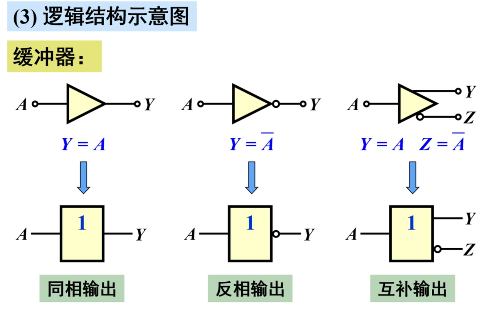

视频中为简化集成电路绘图，定义了以下符号规则：

| 门类型 | 符号规则                                                     | 示例（以 4 输入与门为例）                         |
| ------ | ------------------------------------------------------------ | ------------------------------------------------- |
| 与门   | 左侧 1 条横线 + 输入竖线，交点符号表示连接关系：- 实心点：硬连接（不可编程）；- ×：可编程连接（可断开）；- 无符号：不连接 | 输入A、B、C、D，输出Y=A·B·D（C 不连接，B 可编程） |
| 或门   | 左侧 1 条横线 + 输入竖线，交点符号规则同与门                 | 输入A、B、C、D，输出Y=A+B+C（D 不连接，C 可编程） |
| 缓冲器 | 三角形符号（同相）、三角形 + 圆圈（反相）、双输出（互补）    | 同相：Y=A；反相：Y=Ā；互补：Y=A、Z=Ā              |

### 4. 存储容量计算

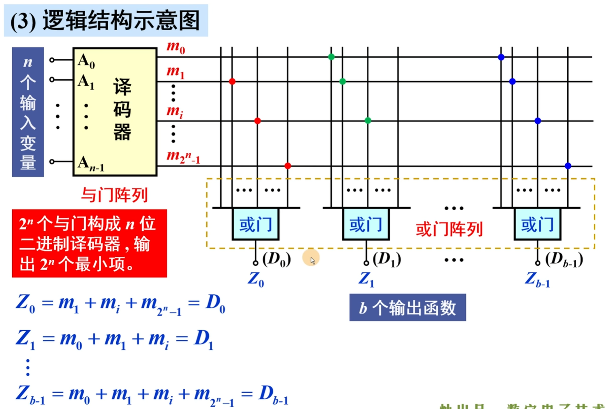

- 公式：存储容量 = 字线数量 × 位线数量 = 2ⁿ × b（单位：位）；

- 说明：n为地址位数（字线数2ⁿ），b为数据输出位数（位线数b）；

- 示例：

- 若n=2（2 个地址端）、b=4（4 个数据端），则容量 = 2² × 4 = 16位；

- 常见容量解读：1k×1（1024 字，每字 1 位）、1k×4（1024 字，每字 4 位）、256×8（256 字，每字 8 位）、64k×16（65536 字，每字 16 位 = 1M 位）。

## 三、ROM 的工作原理

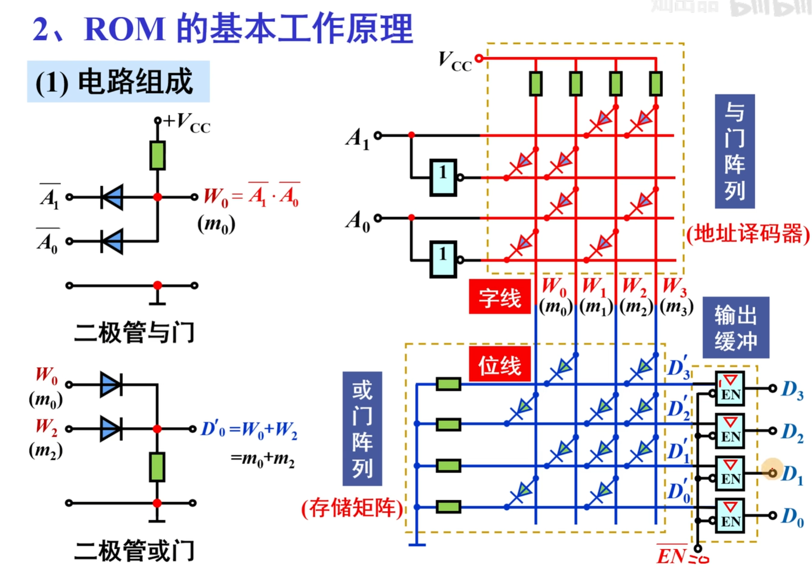

### 1. 基础：二极管门电路复习

视频通过二极管与门、或门，铺垫 ROM 内部逻辑：

#### （1）二极管与门

- 电路：输入Ā₁、Ā₀（地址反变量），经二极管连接到输出W₀，串联电阻接 VCC；

- 逻辑功能：W₀=Ā₁·Ā₀（利用二极管 “优先导通 + 钳位” 特性，如输入 0V 导通、3V 截止）；

- 扩展：n=2时，可生成 4 个最小项：W₀=Ā₁·Ā₀、W₁=Ā₁·A₀、W₂=A₁·Ā₀、W₃=A₁·A₀。

#### （2）二极管或门

- 电路：输入W₀、W₂（字线），经二极管连接到输出D₀'，串联电阻接地；

- 逻辑功能：D₀'=W₀+W₂（任一输入为高，对应二极管导通，输出高）。

### 2. ROM 内部电路工作过程（示例：n=2地址、b=4数据）

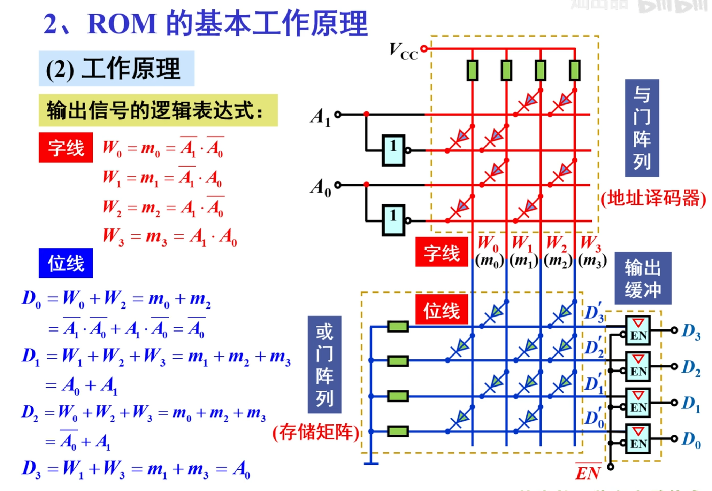

#### （1）电路结构

- 与门阵列（地址译码器）：A₁、A₀→生成W₀~W₃（4 条字线，最小项）；

- 或门阵列（存储矩阵）：W₀~W₃→经可编程连接（打点）输出D₀'~D₃'（4 条位线）；

- 输出缓冲器：D₀'~D₃'→缓冲后输出D₀~D₃（三态控制，EN=0时有效）。

#### （2）输出逻辑表达式推导

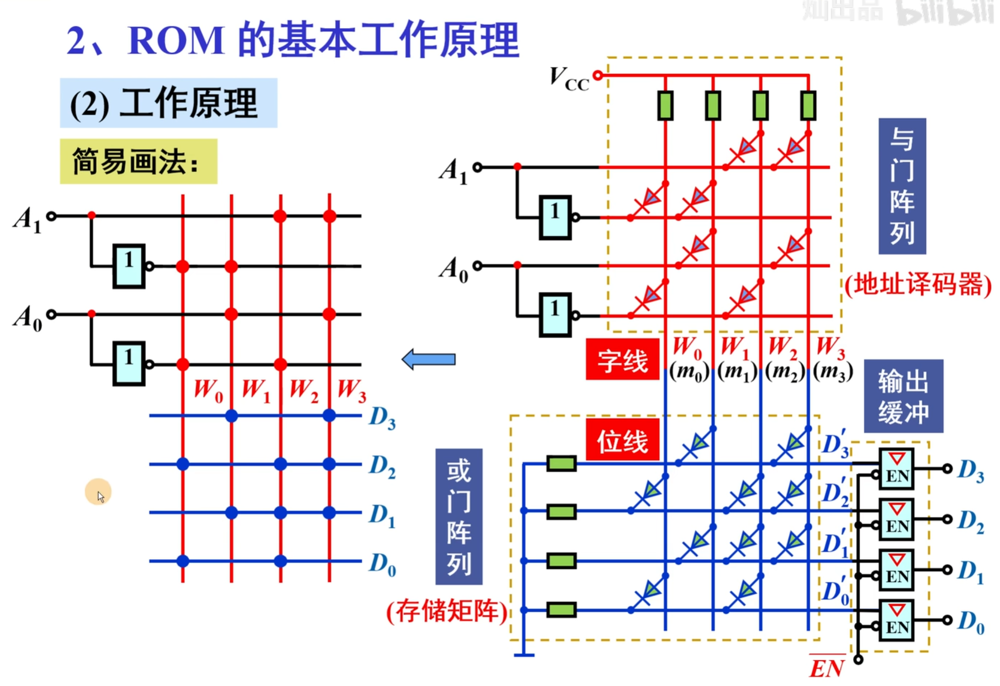

- 字线（最小项）：W₀=Ā₁·Ā₀、W₁=Ā₁·A₀、W₂=A₁·Ā₀、W₃=A₁·A₀；

- 位线（或运算，按打点连接）：

- D₀'=W₀+W₂ → 化简：D₀=Ā₀（因W₀+W₂=Ā₁·Ā₀ + A₁·Ā₀=Ā₀）；

- D₁'=W₁+W₂+W₃ → 化简：D₁=A₀+A₁；

- D₂'=W₀+W₂+W₃ → 化简：D₂=Ā₀+A₁；

- D₃'=W₁+W₃ → 化简：D₃=A₀。

#### （3）真值表示例（地址 - 字线 - 数据对应关系）

| 地址输入 | 字线输出（最小项） | 数据输出      |
| -------- | ------------------ | ------------- |
| A₁A₀=00  | W₀=1，W₁=W₂=W₃=0   | D₃D₂D₁D₀=0101 |
| A₁A₀=01  | W₁=1，W₀=W₂=W₃=0   | D₃D₂D₁D₀=1010 |
| A₁A₀=10  | W₂=1，W₀=W₁=W₃=0   | D₃D₂D₁D₀=0111 |
| A₁A₀=11  | W₃=1，W₀=W₁=W₂=0   | D₃D₂D₁D₀=1110 |

#### （4）ROM 的核心功能

1. **存储功能**：通过或门阵列的可编程连接（打点）存储二进制数据；

1. **函数发生器**：利用与门阵列生成最小项、或门阵列组合最小项，实现任意组合逻辑函数；

1. **译码与编码**：地址译码（与门阵列）+ 数据编码（或门阵列可编程）。

## 四、不同类型的 ROM

视频中介绍了 4 类 ROM，核心差异在于 “存储单元是否可编程” 及 “擦除方式”：

### 1. 掩膜 ROM（固定 ROM）

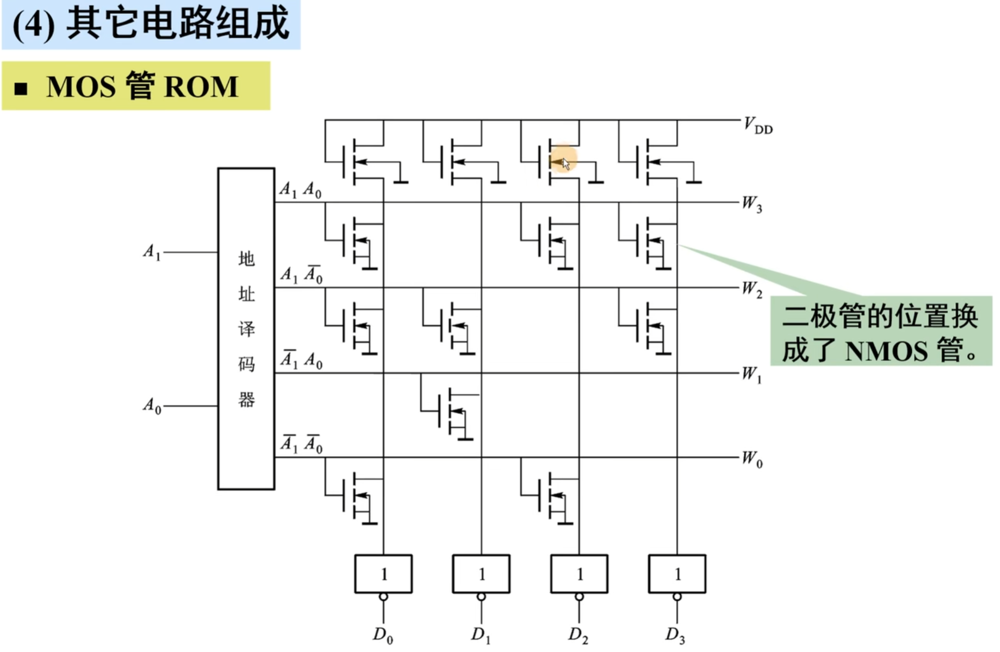

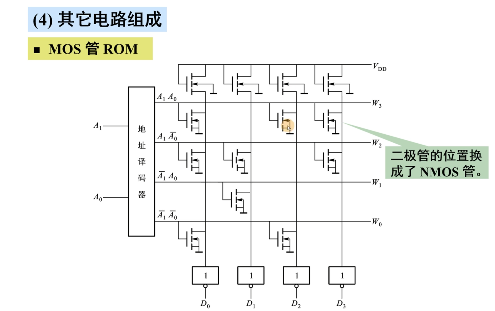

- 特点：生产时通过 “掩膜工艺” 固定存储单元连接（硬连接，实心点）；

- 存储单元：二极管、双极型晶体管或 MOS 管；

- 缺点：不可修改，仅适用于批量生产的固定数据场景。

### 2. PROM（可编程只读存储器）

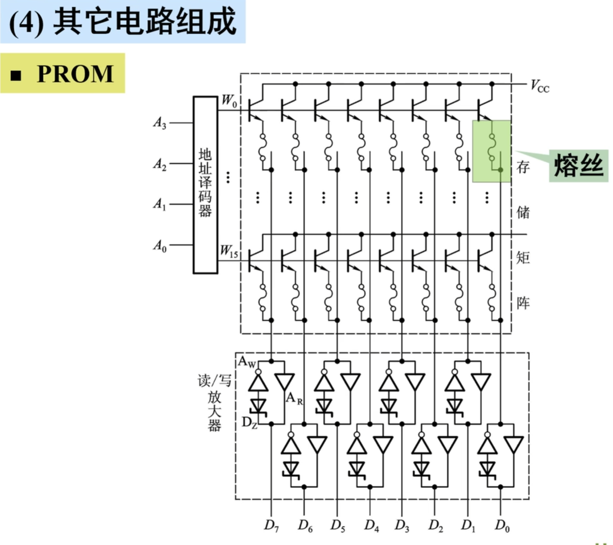

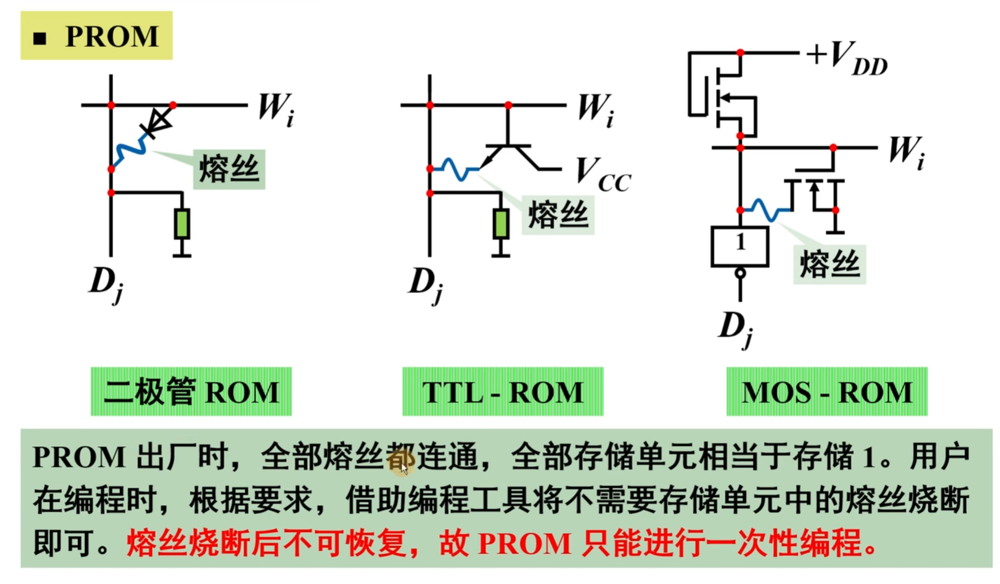

- 结构：存储单元含 “熔丝”（串联在字线与位线之间）；

- 编程原理：

- 出厂状态：所有熔丝连通（默认存储 “1”）；

- 编程操作：通过编程工具给不需要的熔丝通高压，使其熔断（断开，对应存储 “0”）；

- 缺点：熔丝熔断后不可恢复，仅支持**一次性编程**。

### 3. EPROM（可擦除可编程 ROM）

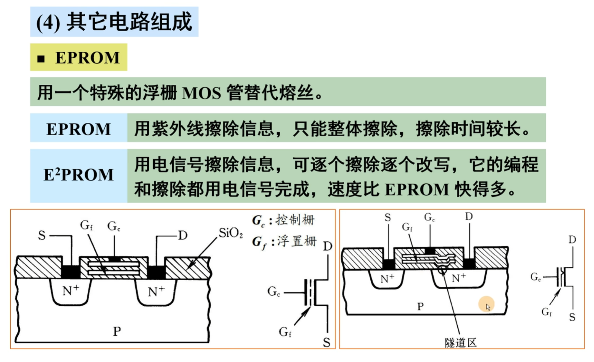

- 核心器件：**叠栅注入 MOS 管（SIMOS 管）**（N 沟道增强型，含两个栅极：控制栅Gc、浮置栅Gf）；

- 结构特点：Gf（浮置栅）无电极，可长期存储注入的负电荷；Gc（控制栅）用于读写控制。

#### （1）工作原理

| 状态       | 条件与现象                                                   |
| ---------- | ------------------------------------------------------------ |
| 无电荷时   | Gf无负电荷 → Gc加正常电压（如 2V）→ 漏源间形成导电沟道 → SIMOS 管导通； |
| 注入电荷后 | Gf注入负电荷 → 开启电压升高（需 20-25V）→ Gc加正常电压时管截止； |

#### （2）写入与擦除

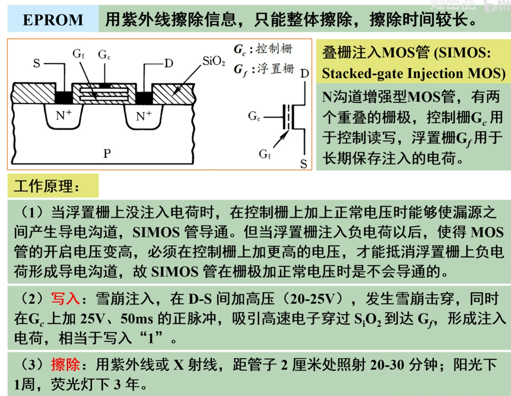

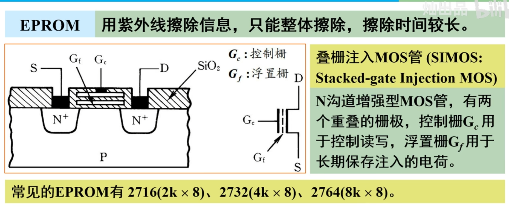

- 写入（注入电荷，存 “1”）：

- D-S间加 20-25V 高压（雪崩击穿）；

- Gc加 25V、50ms 正脉冲 → 高速电子穿过氧化层注入Gf；

- 擦除（移除电荷，存 “0”）：

- 用紫外线（或 X 射线）在距离芯片 2cm 处照射 20-30 分钟（阳光需 1 周，荧光灯需 3 年，不实用）；

- 常见型号：

- 2716：2k×8（2048 字，每字 8 位，13 位地址线）；

- 2732：4k×8（14 位地址线）；

- 2764：8k×8（13 位地址线，A₀~A₁₂）。

### 4. E²PROM（电擦除可编程 ROM）

- 核心器件：**浮栅隧道氧化层 MOS 管（Flotox 管）**（N 沟道，Gf与漏极间有极薄 “隧道区”）；

- 结构特点：隧道区电场达10⁷V/cm时，电子可双向通过（隧道效应）。

#### （1）工作原理

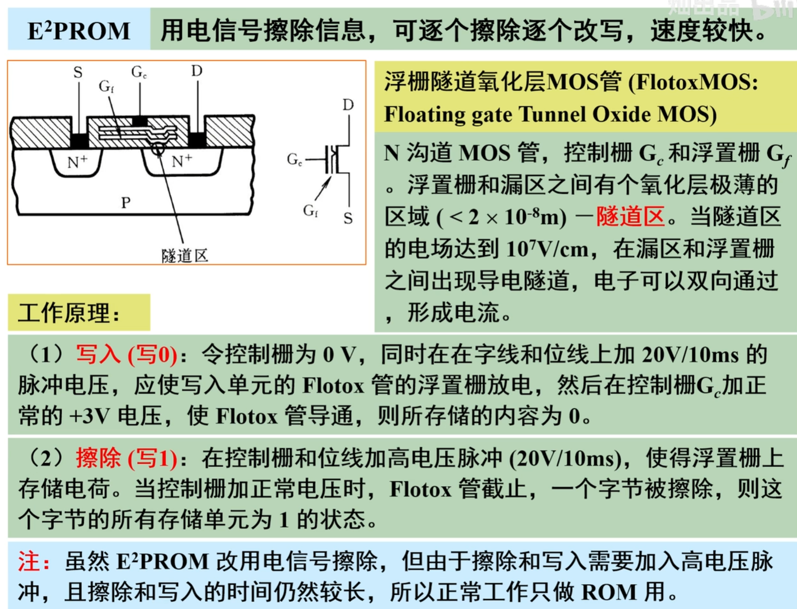

| 操作     | 条件与现象                                                   |
| -------- | ------------------------------------------------------------ |
| 写入 “0” | Gc=0V + 字线 / 位线加 20V、10ms 高压脉冲 → Gf放电 → 管导通； |
| 擦除 “1” | Gc与位线加高压脉冲 → 电子注入Gf → 管截止；                   |

#### （2）特点

- 优势：电擦除（无需紫外线）、可逐个擦除 / 改写；

- 缺点：写入 / 擦除需高压脉冲，写入速度慢；正常工作时仍作 “只读” 使用。

## 五、ROM 的容量扩展

### 1. 容量与地址位数的关系

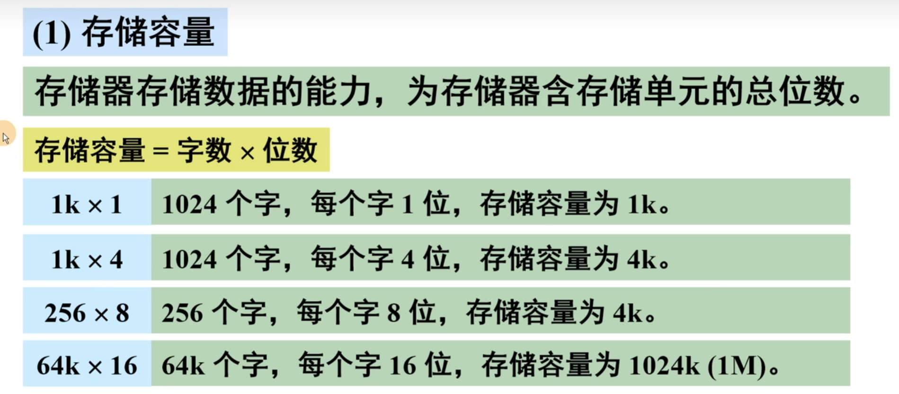

- 公式：字线数量 = 2ⁿ（n为地址位数）；

- 示例：

	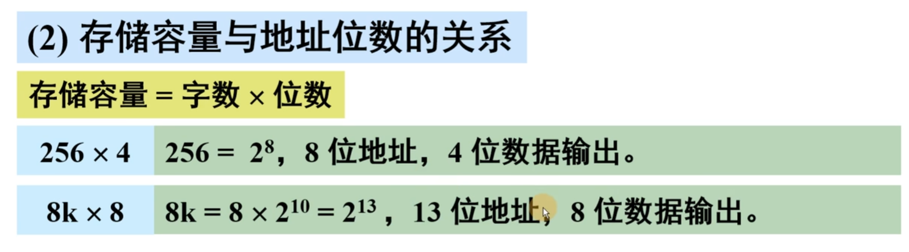

- 256×4 ROM：2⁸=256 → 8 位地址线；

- 8k×8 ROM：8k=2³×2¹⁰=2¹³ → 13 位地址线；

- 64k×16 ROM：64k=2⁶×2¹⁰=2¹⁶ → 16 位地址线。

### 2. 位扩展（字长扩展：增加数据输出位数）

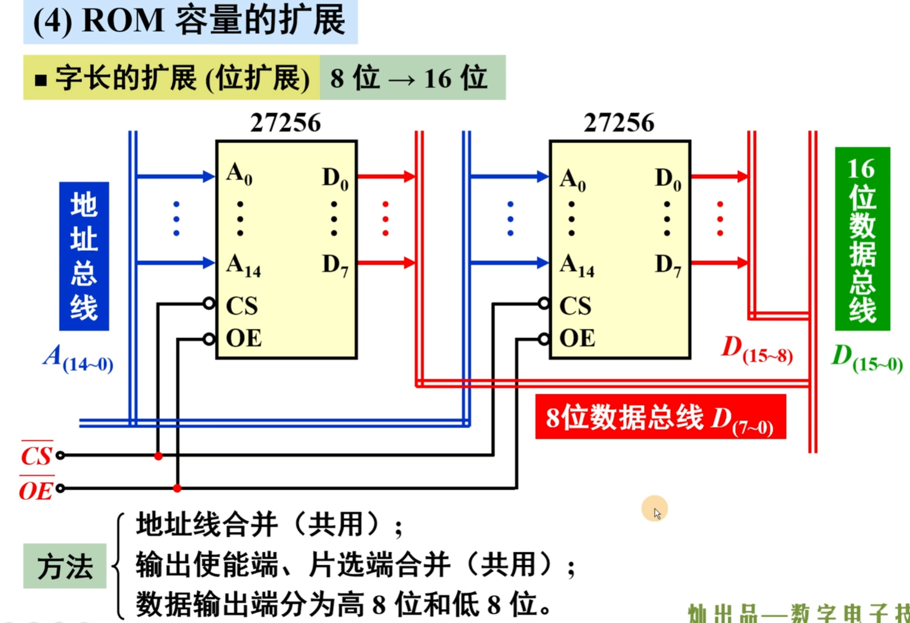

#### （1）示例需求

将 2 片27256（32k×8，15 位地址线A₀~A₁₄，8 位输出D₀~D₇）扩展为32k×16（16 位输出）。

#### （2）连接方式

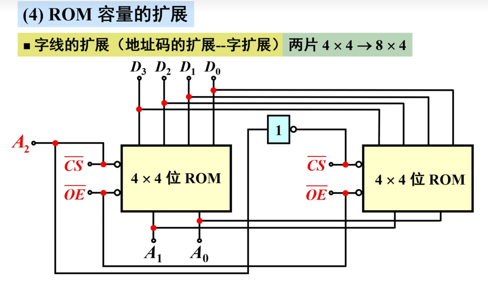

- 地址总线：2 片 ROM 的A₀~A₁₄并联（地址信号共享）；

- 控制端：2 片 ROM 的OE（输出使能）、CS（片选，低电平有效，优先级高于OE）并联；

- 数据总线：

- 第 1 片输出D₀~D₇ → 扩展后低 8 位D₀~D₇；

- 第 2 片输出D₀~D₇ → 扩展后高 8 位D₈~D₁₅；

### 3. 常用 EPROM（2764）引脚功能

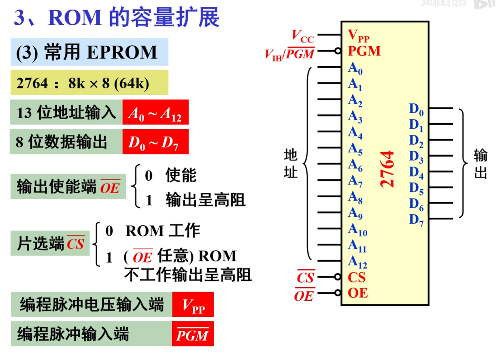

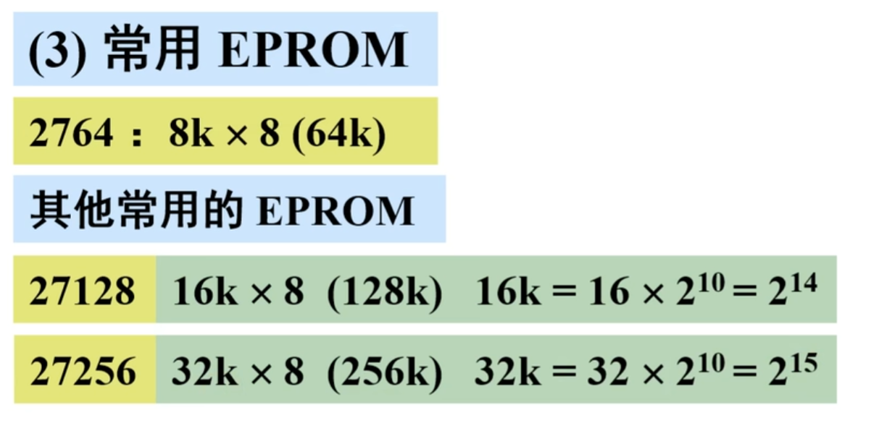

| 引脚      | 功能描述                                                     |
| --------- | ------------------------------------------------------------ |
| A₀~A₁₂    | 13 位地址输入端（对应8k=2¹³字线）；                          |
| D₀~D₇     | 8 位数据输出端；                                             |
| OE（非）  | 输出使能端（低电平有效：OE=0时输出有效，OE=1时输出高阻）；   |
| CS（非）  | 片选端（低电平有效：CS=0时 ROM 工作，CS=1时 ROM 不工作且输出高阻，优先级高于OE）； |
| VPP       | 编程脉冲电压输入端（写入时加高压）；                         |
| PGM（非） | 编程控制端（低电平时可对存储单元编程）；                     |


# 用ROM实现组合逻辑函数

## 一、ROM 基础回顾（支撑组合逻辑实现的核心结构

1. **ROM 的基本结构**

由「地址译码器」「存储矩阵」「输出缓冲器」三部分组成，各模块功能如下：

| 模块       | 核心功能                                                     |
| ---------- | ------------------------------------------------------------ |
| 地址译码器 | 接收 n 位地址输入（Aₙ₋₁~A₀），通过全译码生成 2ⁿ个互不重叠的最小项（m₀~m₂ⁿ⁻¹），对应 ROM 的 “字线”（WL） |
| 存储矩阵   | 由大量存储单元构成，每个存储单元可存储 1 位二进制数（0/1），存储内容由组合逻辑函数值决定，输出对应 “位线”（BL） |
| 输出缓冲器 | 对存储矩阵输出的位线信号进行缓冲、驱动，最终输出组合逻辑函数值（Yₖ~Y₀），部分含三态控制功能 |

1. **ROM 的核心特性**

- 地址译码器输出为**最小项全集**：若输入 n 个变量，必然产生 2ⁿ个最小项（m₀到 m₂ⁿ⁻¹），无遗漏、无重复；

- 存储矩阵为**可编程数据阵列**：每个最小项（字线）对应的数据（位线值）可预先设定，且设定后直接决定输出函数值；

- 输出与输入的关系：ROM 输出是 “地址译码器生成的最小项” 与 “存储矩阵数据” 的「与或运算」，天然匹配组合逻辑函数的 “最小项之和” 形式。

## 二、组合逻辑函数与 ROM 的核心对应关系

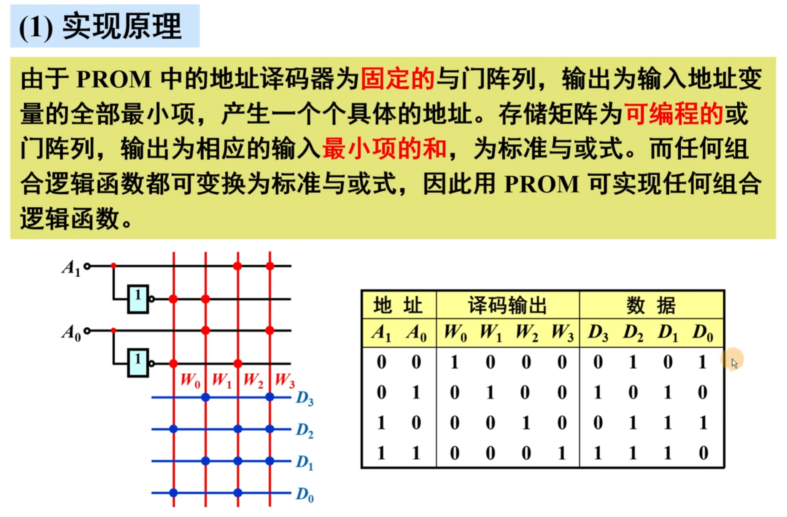

视频重点推导 “组合逻辑函数可通过 ROM 实现” 的本质逻辑，核心是**三者一一对应**，具体如下：

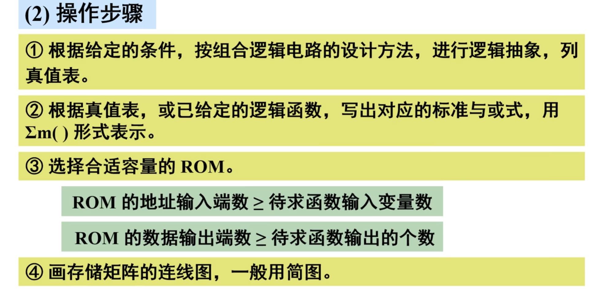

| 组合逻辑函数要素    | ROM 对应硬件要素             | 对应关系说明                                                 |
| ------------------- | ---------------------------- | ------------------------------------------------------------ |
| 输入变量（Xₙ₋₁~X₀） | ROM 地址线（Aₙ₋₁~A₀）        | 函数的 n 个输入变量直接接入 ROM 的 n 根地址线，每一组输入变量组合对应一个唯一的 ROM 地址（如输入 X₁X₀=01，对应 ROM 地址 A₁A₀=01） |
| 最小项（m₀~m₂ⁿ⁻¹）  | ROM 字线（WL₀~WL₂ⁿ⁻¹）       | ROM 地址译码器对地址线信号全译码，每根字线对应一个最小项（如地址 00 对应 m₀，地址 01 对应 m₁） |
| 函数值（Y=0/1）     | ROM 存储单元数据（位线输出） | 若组合逻辑函数在某最小项处值为 1，则 ROM 对应字线的存储单元存 1；值为 0 则存 0，最终位线输出即为函数值 |
| 多输出函数（Yₖ~Y₀） | ROM 多根位线（BLₖ~BL₀）      | 每一个输出函数对应 ROM 的一根位线，多输出函数可通过单块多位数 ROM 实现（如 2 输出函数用 “2 位宽” ROM） |

## 三、用 ROM 实现组合逻辑函数的步

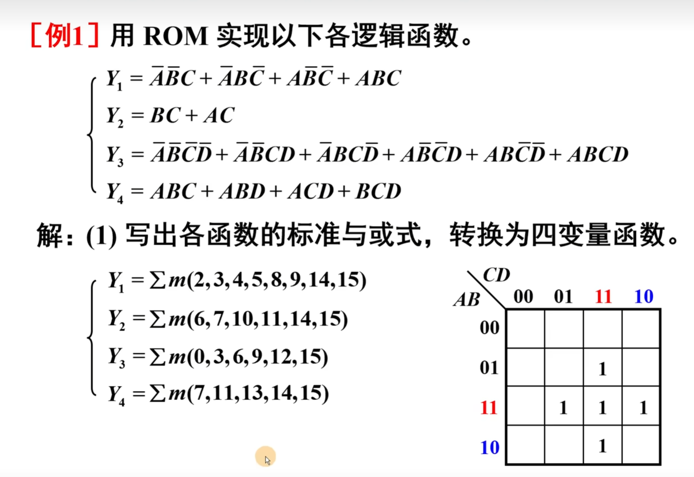

### 步骤 1：确定输入 / 输出变量数，匹配 ROM 容量

- 输入变量数 = ROM 地址线数（设为 n）；

- 输出变量数 = ROM 位线数（设为 k）；

- ROM 容量公式：2ⁿ × k（“字长 × 位数”，字长 = 2ⁿ，位数 = k）。

**示例**：实现 Y=A⊕B（输入 A、B 共 2 个，输出 Y 共 1 个）

- 地址线 n=2 → 字长 = 2²=4；

- 位线 k=1 → 位数 = 1；

- 需选择 ROM 容量：4×1（如 4 字 1 位掩膜 ROM 或 PROM）。

### 步骤 2：写出组合逻辑函数的最小项表达式（标准与或式）

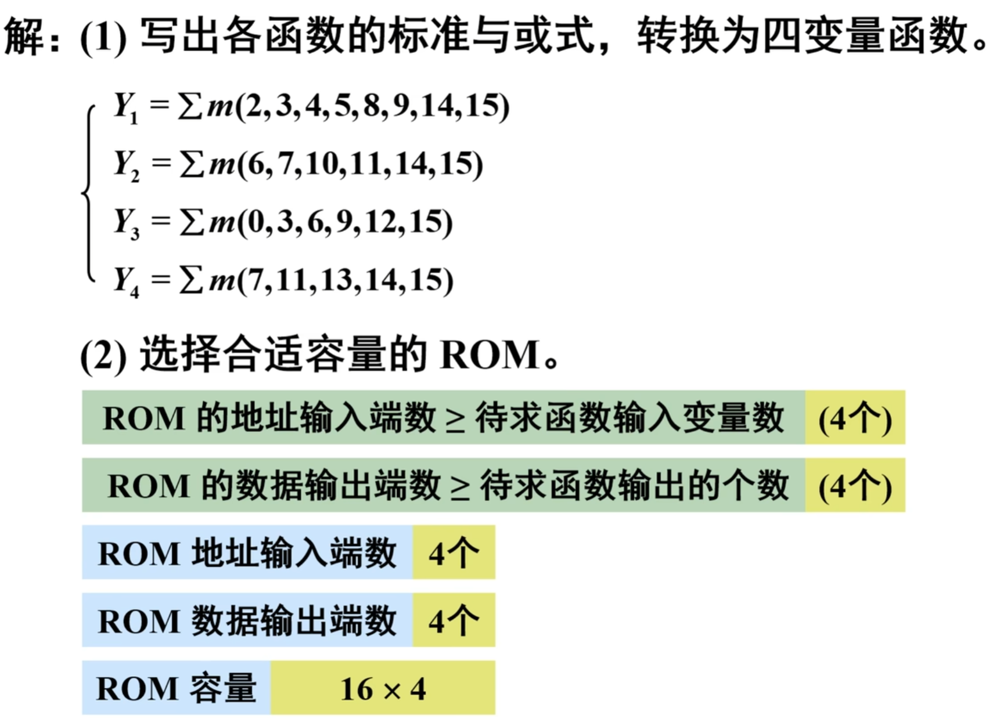

将函数展开为 “最小项之和” 形式，确保包含所有输入变量对应的最小项（系数为 0 的可省略，但 ROM 需覆盖所有最小项）。

**示例**：Y=A⊕B

- 逻辑表达式：Y = A'B + AB'

- 最小项展开：Y = m₁ + m₂（注：A 为高位、B 为低位，m₀=A'B'，m₁=A'B，m₂=AB'，m₃=AB）

### 步骤 3：构建 “输入变量 - 函数值” 真值表

列出所有输入变量组合（共 2ⁿ组），对应每组输入计算函数值，形成真值表（ROM 地址与输出的映射关系表）。

**示例**：Y=A⊕B 的真值表（对应 ROM 地址与输出）

| 输入变量（A,B） | ROM 地址（A₁,A₀） | 最小项（m） | 函数值（Y） |
| --------------- | ----------------- | ----------- | ----------- |
| 0,0             | 00                | m₀          | 0           |
| 0,1             | 01                | m₁          | 1           |
| 1,0             | 10                | m₂          | 1           |
| 1,1             | 11                | m₃          | 0           |

### 步骤 4：确定 ROM 的存储内容（核心：填充存储矩阵）

根据真值表，将每组 ROM 地址对应的 “函数值” 写入 ROM 存储矩阵（1 存 1，0 存 0），形成 “ROM 存储内容表”（地址→位线数据的映射）。

**示例**：Y=A⊕B 对应的 ROM 存储内容（4×1 ROM）

| ROM 地址（A₁,A₀） | 存储单元数据（位线输出 Y） |
| ----------------- | -------------------------- |
| 00                | 0                          |
| 01                | 1                          |
| 10                | 1                          |
| 11                | 0                          |

### 步骤 5：绘制 ROM 实现的逻辑电路图

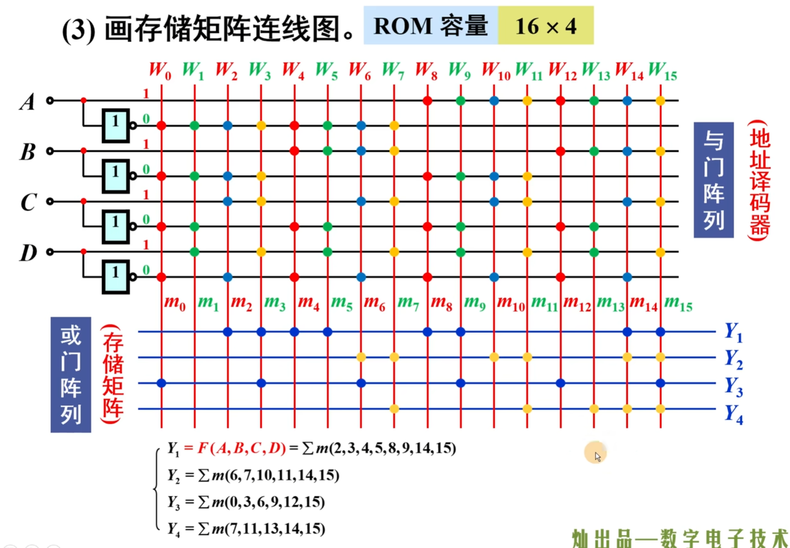

- 输入侧：将组合逻辑的输入变量（如 A,B）直接连接到 ROM 的地址端（A₁,A₀）；

- 输出侧：将 ROM 的位线（对应函数值）连接到输出缓冲器，缓冲器输出即为组合逻辑函数（如 Y）；

- 标注：在 ROM 符号旁标注 “存储内容”（或关联存储内容表），明确各地址对应的输出值。

**示例**：Y=A⊕B 的 ROM 实现逻辑图

```
       +-------------------+
A（A₁）→| 地址端          |
B（A₀）→| （A₁,A₀）       | 4×1 ROM
       | 存储内容：       |→ Y（位线输出）
       | 00→0, 01→1,      | （经输出缓冲器）
       | 10→1, 11→0       |
       +-------------------+
```

## 四、视频中的典型例题

### 例题 1：用 ROM 实现 2 输出组合逻辑函数（Y₁=A⊕B，Y₂=A・B）

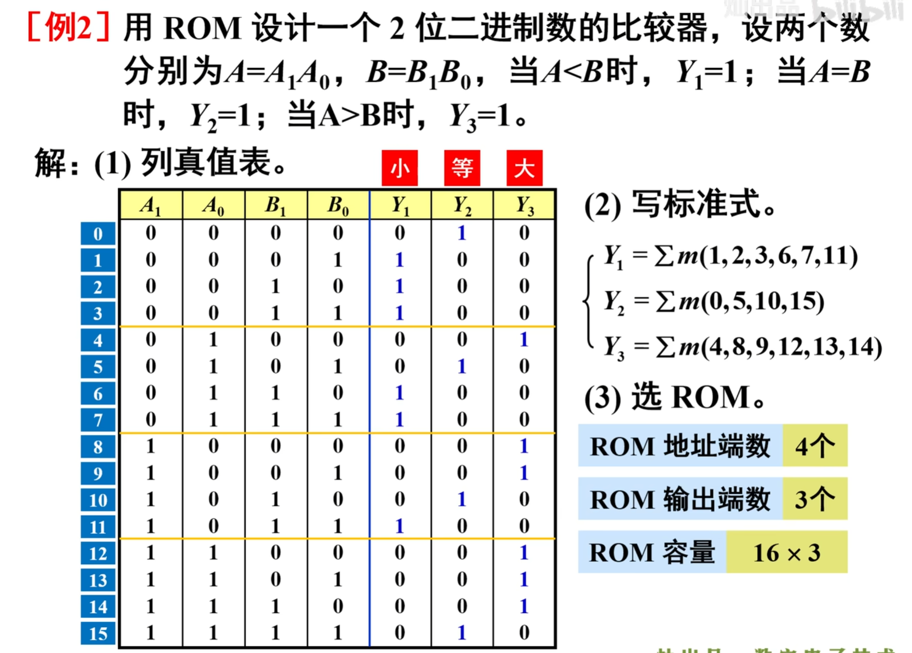

#### 步骤 1：确定 ROM 参数

- 输入变量：A、B（2 个）→ ROM 地址线 n=2 → 字长 = 4；

- 输出变量：Y₁、Y₂（2 个）→ ROM 位线 k=2 → ROM 容量 = 4×2（4 字 2 位）。

#### 步骤 2：展开最小项表达式

- Y₁=A⊕B = A'B + AB' = m₁ + m₂；

- Y₂=A·B = AB = m₃。

#### 步骤 3：构建真值表（输入 - 双输出映射）

| 输入（A,B） | ROM 地址（A₁,A₀） | 最小项 | Y₁（异或） | Y₂（与） |
| ----------- | ----------------- | ------ | ---------- | -------- |
| 0,0         | 00                | m₀     | 0          | 0        |
| 0,1         | 01                | m₁     | 1          | 0        |
| 1,0         | 10                | m₂     | 1          | 0        |
| 1,1         | 11                | m₃     | 0          | 1        |

#### 步骤 4：确定 ROM 存储内容（4×2 ROM）

| ROM 地址（A₁,A₀） | 存储内容（Y₂,Y₁） | 说明（对应输出值） |
| ----------------- | ----------------- | ------------------ |
| 00                | 00                | Y₁=0, Y₂=0         |
| 01                | 01                | Y₁=1, Y₂=0         |
| 10                | 01                | Y₁=1, Y₂=0         |
| 11                | 10                | Y₁=0, Y₂=1         |

#### 步骤 5：逻辑图实现

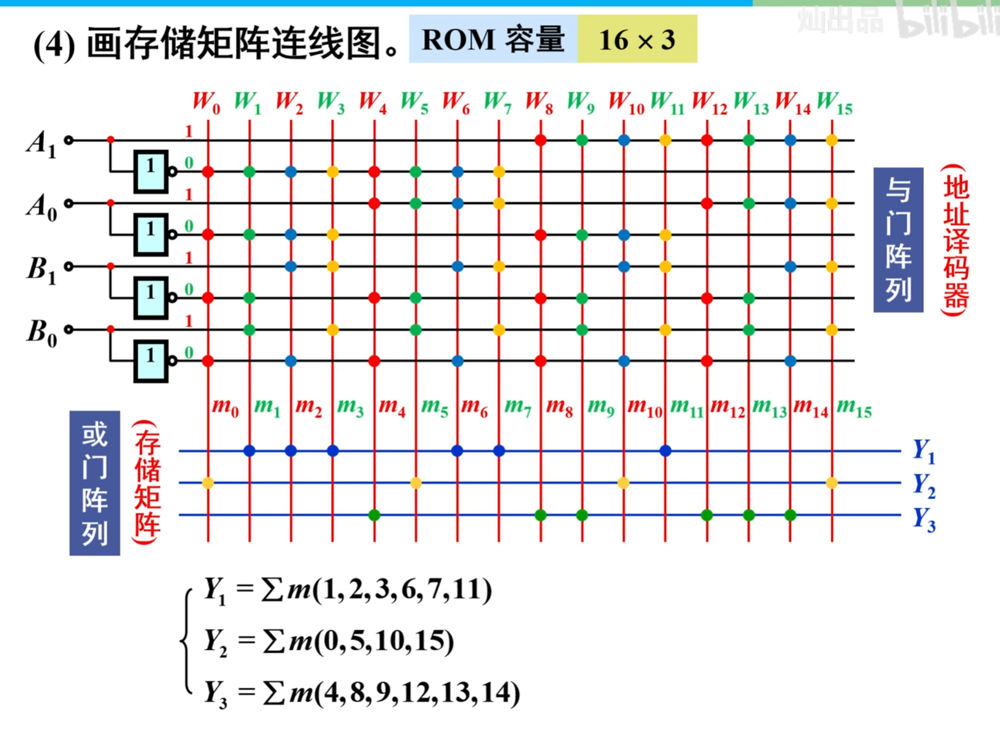

- 地址端：A→A₁，B→A₀；

- 位线输出：ROM 位线 1→Y₁，位线 2→Y₂；

- 核心：单块 4×2 ROM 同时实现两个 2 输入组合逻辑函数，无需额外门电路。

### 例题 2：用 ROM 实现 3 输入组合逻辑函数（Y=A'B'C + A'BC' + AB'C' + ABC，奇偶校验函数）

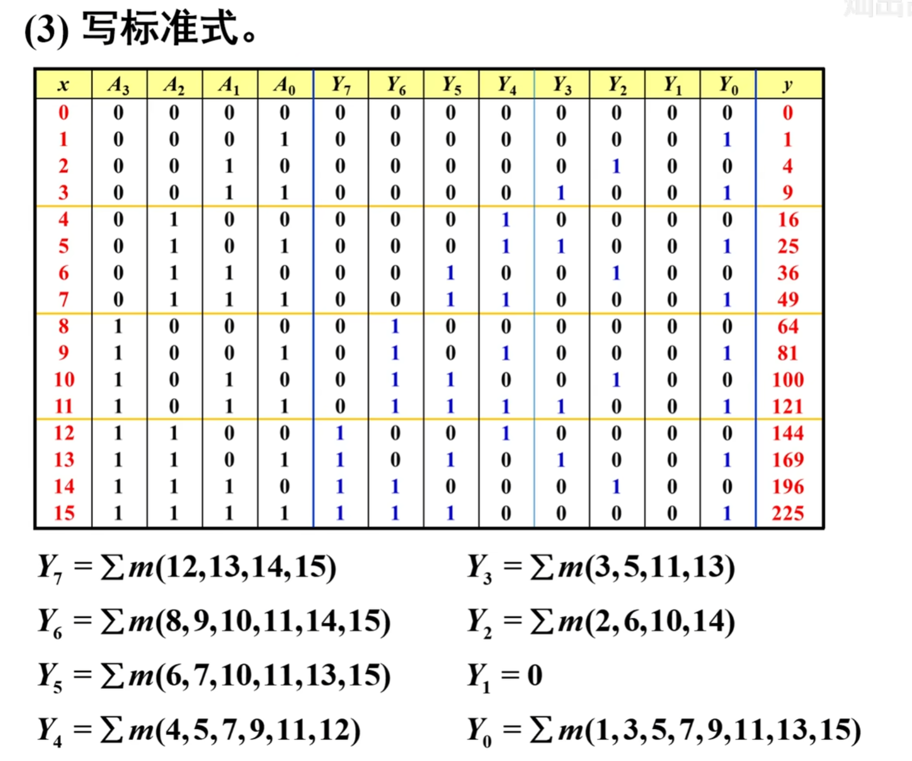

#### 步骤 1：确定 ROM 参数

- 输入变量：A、B、C（3 个）→ ROM 地址线 n=3 → 字长 = 8（2³=8）；

- 输出变量：Y（1 个）→ ROM 位线 k=1 → ROM 容量 = 8×1（8 字 1 位）。

#### 步骤 2：展开最小项表达式

- 函数逻辑：Y 为 “输入 1 的个数为奇数时输出 1”（奇校验）；

- 最小项展开：Y = m₁（001） + m₂（010） + m₄（100） + m₇（111）（注：A 为最高位，C 为最低位，m₀=A'B'C'，m₁=A'B'C，…，m₇=ABC）。

#### 步骤 3：构建真值表（3 输入全组合）

| 输入（A,B,C） | ROM 地址（A₂,A₁,A₀） | 最小项 | 输入 1 的个数 | 函数值 Y（奇校验） |
| ------------- | -------------------- | ------ | ------------- | ------------------ |
| 0,0,0         | 000                  | m₀     | 0（偶）       | 0                  |
| 0,0,1         | 001                  | m₁     | 1（奇）       | 1                  |
| 0,1,0         | 010                  | m₂     | 1（奇）       | 1                  |
| 0,1,1         | 011                  | m₃     | 2（偶）       | 0                  |
| 1,0,0         | 100                  | m₄     | 1（奇）       | 1                  |
| 1,0,1         | 101                  | m₅     | 2（偶）       | 0                  |
| 1,1,0         | 110                  | m₆     | 2（偶）       | 0                  |
| 1,1,1         | 111                  | m₇     | 3（奇）       | 1                  |

#### 步骤 4：确定 ROM 存储内容（8×1 ROM）

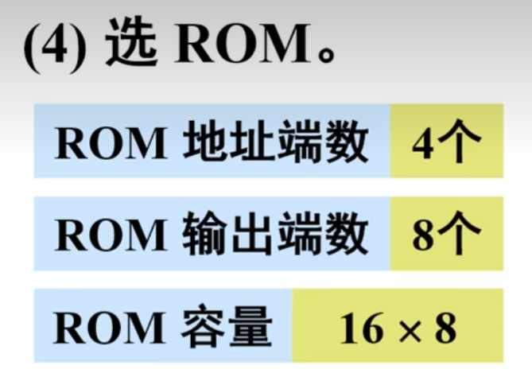

| ROM 地址（A₂,A₁,A₀） | 存储单元数据（Y） |
| -------------------- | ----------------- |
| 000                  | 0                 |
| 001                  | 1                 |
| 010                  | 1                 |
| 011                  | 0                 |
| 100                  | 1                 |
| 101                  | 0                 |
| 110                  | 0                 |
| 111                  | 1                 |

#### 步骤 5：逻辑图与仿真验证

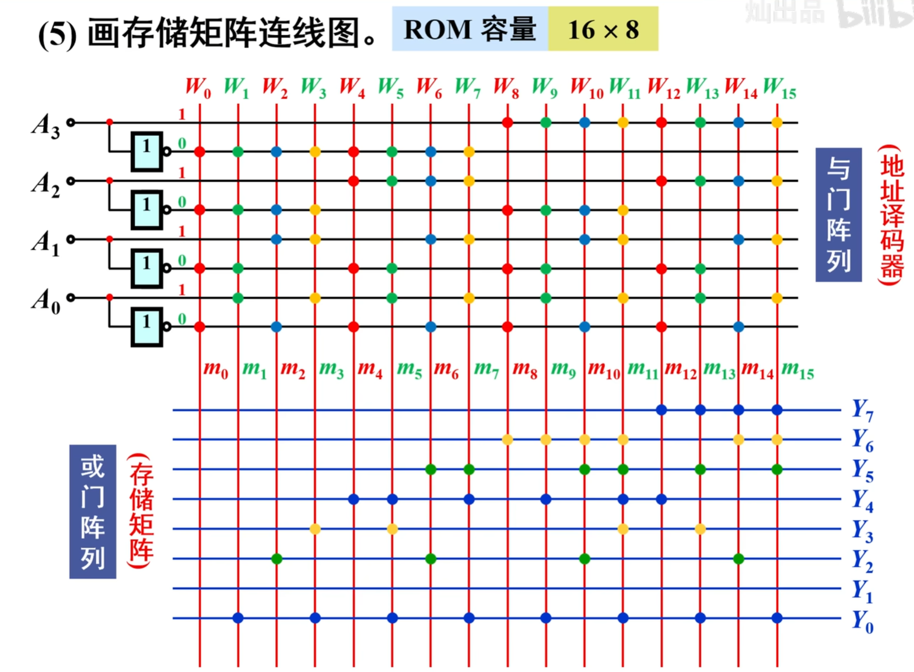

- 逻辑图：A→A₂、B→A₁、C→A₀接入 8×1 ROM 地址端，ROM 位线经缓冲器输出 Y；

- 仿真要点：视频提及通过 “输入不同地址（A,B,C 组合）” 观察输出 Y，验证是否符合奇校验规则（如输入 001 时 Y=1，输入 011 时 Y=0），确保存储内容正确。

## 五、ROM 实现组合逻辑的特点与 ROM 类型选择

### 1. 核心特点（优劣势）

| 类别 | 具体说明                                                     |
| ---- | ------------------------------------------------------------ |
| 优点 | 1. 无需设计门电路：仅需确定 “输入 - 输出映射”（存储内容），简化硬件设计；2. 支持多输出：单块 ROM 可同时实现多个组合逻辑函数（每输出对应 1 位）；3. 灵活性高：修改函数仅需更新 ROM 存储内容（可编程 ROM 无需改硬件）；4. 稳定性强：ROM 存储内容非易失，无门电路时延累积问题。 |
| 缺点 | 1. 存储利用率可能低：若函数仅用到少数最小项，ROM 大部分存储单元存 0，造成浪费；2. 速度受 ROM 类型影响：掩膜 ROM 速度快，但不可改；EEPROM 可改但速度较慢；3. 成本：大容量 ROM 成本高于专用门电路（简单函数场景）。 |

### 2. ROM 类型选择建议（应用场景）

| ROM 类型                   | 适用场景                                                     |
| -------------------------- | ------------------------------------------------------------ |
| 掩膜 ROM（MROM）           | 批量生产、函数固定不变的场景（如工业控制中的固定逻辑），成本低、速度快。 |
| 可编程 ROM（PROM）         | 原型验证、小批量生产场景，可一次性编程（熔断式），适合函数确定后无需修改的情况。 |
| 可擦除 ROM（EPROM/EEPROM） | 研发阶段、函数需反复调试的场景（如学生实验、电路原型），EPROM 需紫外擦除，EEPROM 电擦除更便捷。 |

## 六、关键注意事项（易错点）

1. **地址与最小项的位序匹配**：输入变量高位对应 ROM 地址高位，低位对应地址低位（如 A 为高位、B 为低位时，AB=10 对应地址 10，而非 01），否则会导致存储内容错位；

1. **多输出函数的位线分配**：明确每根位线对应哪个输出函数，存储内容需按 “高位输出对应高位位线” 或 “低位输出对应高位位线” 统一规则填写；

1. **ROM 容量计算**：若输入 n 个变量，ROM 地址线必须为 n 根（确保覆盖 2ⁿ个最小项），不可少接地址线；

1. **仿真验证的必要性**：即使理论推导正确，需通过输入全组合验证 ROM 输出是否与函数值一致，排除存储内容填写错误。


# 随机存取存储器 (RAM)

## 一、RAM 学习要求

1. 理解 RAM 的电路结构和工作原理

1. 理解 RAM 扩展存储容量的方法（视频重点铺垫结构与原理基础）

## 二、RAM 基本概念与特性

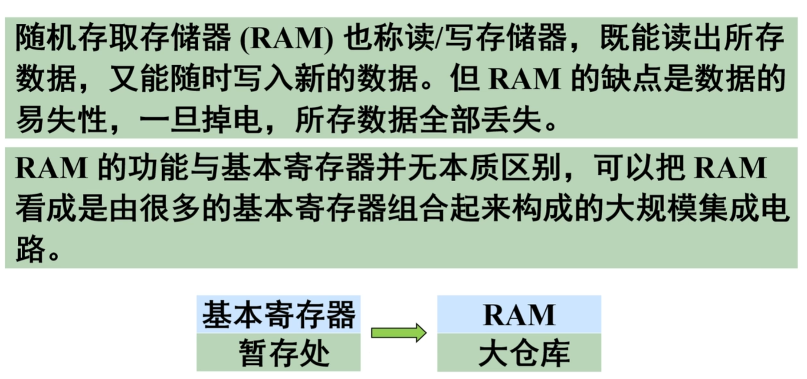

### 1. RAM 定义与核心功能

- 全称 “随机存取存储器”，又称 “读 / 写存储器（Read/Write Memory）”，可随时读出已存数据、写入新数据。

- 功能本质：与第 5 章 “基本寄存器”（时序逻辑电路）一致，是**多个基本寄存器组成的大规模时序逻辑电路**（类比：基本寄存器 = 单个暂存柜，RAM = 多个暂存柜组成的 “大仓库 / 寄存柜群”）。

### 2. RAM 与 ROM 的核心区别

| 对比项     | RAM                          | ROM（只读存储器）              |
| ---------- | ---------------------------- | ------------------------------ |
| 读写能力   | 可读可写，操作简便           | 仅能读出，写入需出厂预设或编程 |
| 数据易失性 | 断电后数据全部丢失（易失性） | 断电后数据不丢失（非易失性）   |
| 用途       | 存储 CPU 运算中间数据        | 存储固定程序 / 数据            |
| 电路类型   | 大规模时序逻辑电路           | 大规模组合逻辑电路             |

### 3. RAM 数据保护

- 因易失性，需配备备用电源 / 紧急电源防止断电丢数据；若需长期存储，需将数据转移至外部存储设备（视频中 “存到 ROM” 为口误更正）。

## 三、RAM 的基本结构

RAM 由**地址译码器、存储矩阵、读 / 写控制器**三部分组成，辅以片选信号（CS），结构如下：

```
[CPU] ←→ [读/写控制器（R/$\overline{W}$、I/O口）] ←→ [存储矩阵] ←→ [地址译码器]
                                                  ↑
                                              [片选CS]
```

### 1. 各组成部分功能

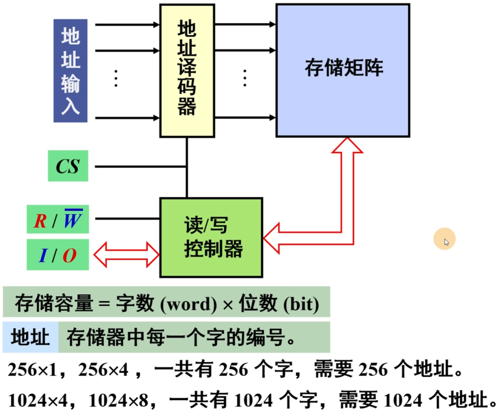

#### （1）地址译码器

- 作用：将输入的 n 位地址信号，译码为 2ⁿ个输出信号，每个输出对应 1 个存储单元的 “地址”，实现存储单元的精准定位。

- 核心公式：n 条地址输入线 → 2ⁿ条地址输出线（对应 2ⁿ个存储单元）。

示例：10 条地址线（n=10）→ 2¹⁰=1024 个存储单元；4 条地址线（n=4）→ 16 个存储单元。

#### （2）存储矩阵

- 作用：存储数据的核心区域，由大量 “存储单元” 按**矩阵形式排列**（如 32×32、16×16 矩阵），每个单元存储 1 位二进制数（0/1）。

#### （3）读 / 写控制器

- 包含两个关键组件：

1. 读 / 写控制端（R/\(\overline{W}\)）：一线两用，**高电平 = 读操作**（从 RAM 读数据到 CPU），**低电平 = 写操作**（从 CPU 写数据到 RAM）。

1. 输入 / 输出口（I/O 口）：数据传输通道，I/O 口线数 = 存储单元的 “位数”（如 4 条 I/O 线对应每个单元存 4 位数据）。

#### （4）片选信号（CS）

- 背景：CPU 需连接多片 RAM 以扩展容量，但同一时间仅能访问 1 片 / 几片 RAM。

- 作用：CS 信号有效时（如低电平有效），对应 RAM 被选中，可与 CPU 交换数据；CS 无效时，RAM 处于高阻态，不参与数据交互。

### 2. RAM 存储容量计算

- 公式：存储容量 = 字数 × 位数

- 字数：存储单元的总个数 = 2ⁿ（n 为地址线数）

- 位数：每个存储单元存储的二进制位数 = I/O 口线数

- 示例：

- 256×1：256 个单元（8 条地址线，2⁸=256），每个单元 1 位（1 条 I/O 线），总容量 256bit。

- 256×4：256 个单元（8 条地址线），每个单元 4 位（4 条 I/O 线），总容量 1024bit=1KB。

- 1024×8：1024 个单元（10 条地址线），每个单元 8 位（8 条 I/O 线），总容量 8192bit=8KB。

## 四、RAM 的地址译码方式

### 1. 一元地址译码（不常用）

#### （1）原理

- 将 n 条地址线直接输入 1 个译码器，译码器输出 2ⁿ条线，每条线对应 1 个存储单元，直接选中单个单元。

#### （2）示例：256×4 RAM 的一元译码

- 地址线：8 条（A0~A7），2⁸=256 → 译码器输出 256 条线（W0~W255）。

- 存储单元：256 个，每个单元存 4 位数据（如 W1 存 1010、W255 存 0111）。

- 选中逻辑：

- 地址输入 0000_0000 → 选中 W0，输出 W0 中 4 位数据；

- 地址输入 0000_0001 → 选中 W1，输出 1010；

- 地址输入 1111_1111 → 选中 W255，输出 0111。

#### （3）缺点

- 地址线增多时，译码器输出线暴增（如 10 条地址线需 1024 条输出线），电路复杂、成本高，仅适用于小容量 RAM。

### 2. 二元地址译码（行 - 列译码，常用）

#### （1）原理

- 将 n 条地址线分成**行地址组**和**列地址组**，分别输入 “行译码器” 和 “列译码器”；

- 行译码器输出 “行选线（X0~Xm）”，列译码器输出 “列选线（Y0~Yn）”；

- 行选线与列选线的交点，即为选中的存储单元（单元数 = 行选线数 × 列选线数）。

#### （2）示例 1：256×4 RAM 的二元译码

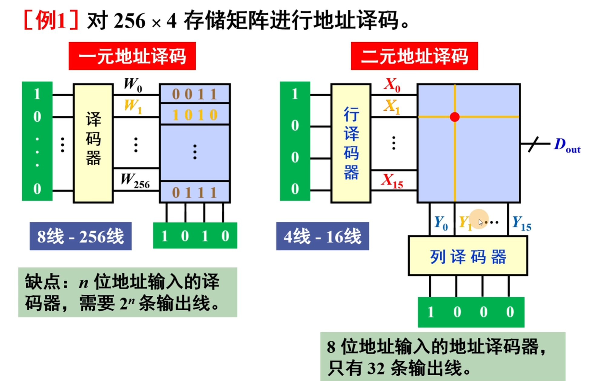

- 地址线：8 条（A0~A7），分 2 组：

- 行地址组：4 条（A0~A3）→ 行译码器输出 16 条行选线（X0~X15）；

- 列地址组：4 条（A4~A7）→ 列译码器输出 16 条列选线（Y0~Y15）；

- 单元数：16×16=256 个（与一元译码一致），总输出线 16+16=32 条（远少于一元译码的 256 条）。

- 选中逻辑：

- 地址输入 0001_0001（行地址 A0~A3=0001，列地址 A4~A7=0001）→ 行选线 X1 有效、列选线 Y1 有效 → 选中 X1 与 Y1 交点的单元，输出该单元 4 位数据。

#### （3）示例 2：1024×1 RAM 的二元译码

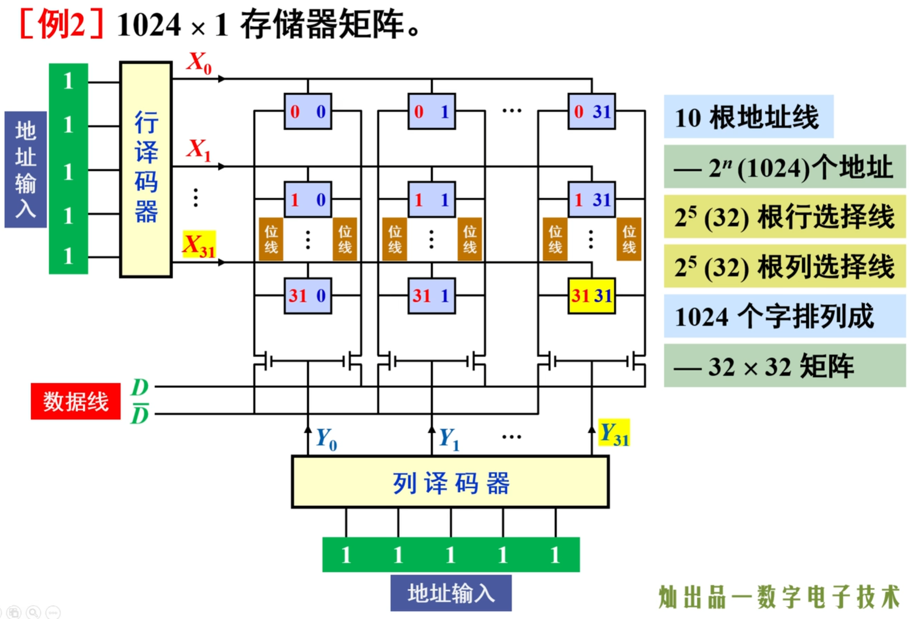

- 地址线：10 条（A0~A9），分 2 组：

- 行地址组：5 条（A0~A4）→ 行译码器输出 32 条行选线（X0~X31）；

- 列地址组：5 条（A5~A9）→ 列译码器输出 32 条列选线（Y0~Y31）；

- 单元数：32×32=1024 个（2¹⁰=1024），每个单元存 1 位数据（1 条 I/O 线）。

- 选中逻辑：

- 地址输入 00000_00000（行 A0~A4=00000，列 A5~A9=00000）→ 选中 X0 与 Y0 交点的 “0-0 单元”；

- 地址输入 00001_00001（行 A0~A4=00001，列 A5~A9=00001）→ 选中 X1 与 Y1 交点的 “1-1 单元”；

- 地址输入 11111_11111（行 A0~A4=11111，列 A5~A9=11111）→ 选中 X31 与 Y31 交点的 “31-31 单元”；

- 数据传输：选中单元的 1 位数据，通过 MOS 管（视频中简化画法）传输至 I/O 口（D 和\(\overline{D}\)），实现读 / 写。

## 五、RAM 的存储单元类型

RAM 存储单元分**静态存储单元（SRAM）** 和**动态存储单元（DRAM）** 两类，视频详细讲解了两者的结构与原理。

### 1. 静态存储单元（SRAM）

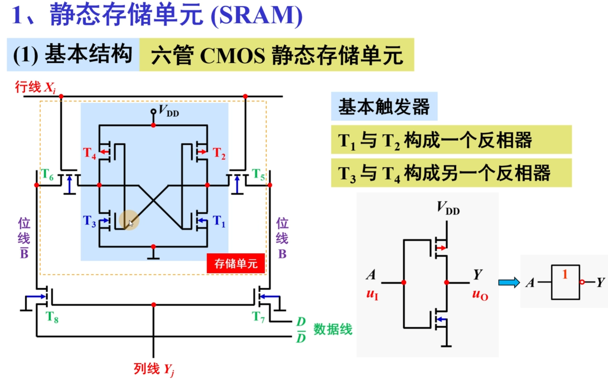

#### （1）结构：六管 CMOS 静态存储单元

- 核心组成：6 个 MOS 管（T1~T6），另有 2 个列共用 MOS 管（T7~T8，不计入单元本身）：

- T1（N 沟道）、T2（P 沟道）：构成 1 个 CMOS 反相器；

- T3（N 沟道）、T4（P 沟道）：构成另 1 个 CMOS 反相器；

- T1~T4 交叉耦合 → 组成 “基本触发器”（存储 1 位二进制数）；

- T5~T6（N 沟道）：行控门控管，由行选线 Xi 控制导通 / 截止；

- T7~T8（N 沟道）：列控门控管，由列选线 Yj 控制导通 / 截止；

- 位线：B 和\(\overline{B}\)（对应数据线 D 和\(\overline{D}\)），用于传输数据。

#### （2）工作原理

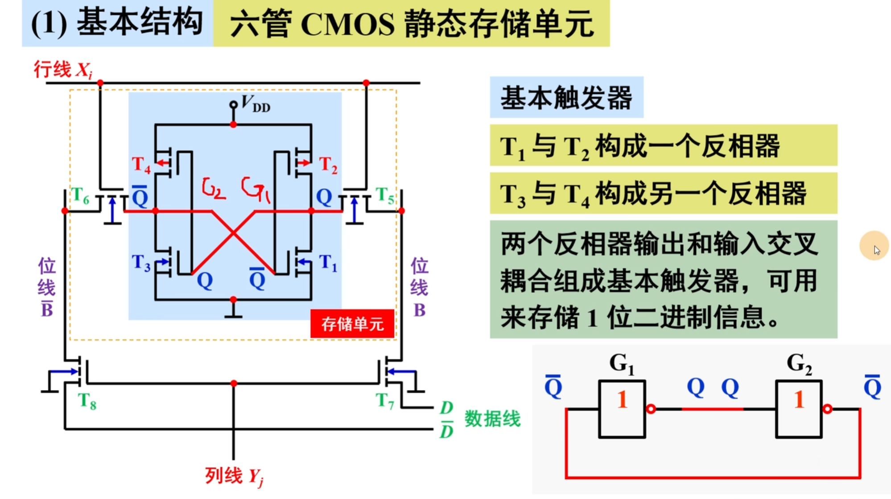

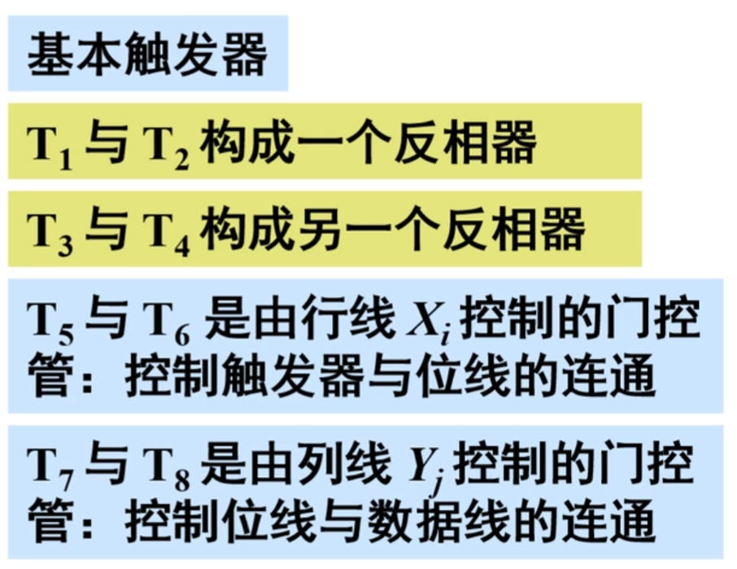

- 前提：仅当**Xi=1 且 Yj=1**时，T5~T8 全部导通，单元被选中；Xi=0 或 Yj=0 时，T5~T8 截止，单元未选中，触发器保持原有状态。

##### ① 未选中状态（Xi=0 或 Yj=0）

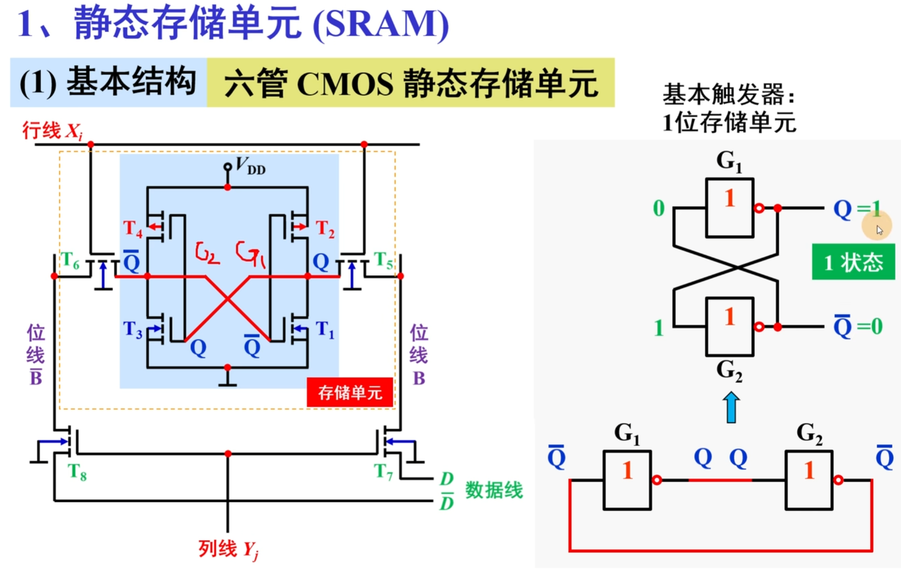

- T5~T8 截止，基本触发器与位线断开，触发器通过交叉耦合保持原有状态：

- 若原状态 Q=0、\(\overline{Q}\)=1 → 保持 Q=0；

- 若原状态 Q=1、\(\overline{Q}\)=0 → 保持 Q=1。

##### ② 选中状态（Xi=1 且 Yj=1）

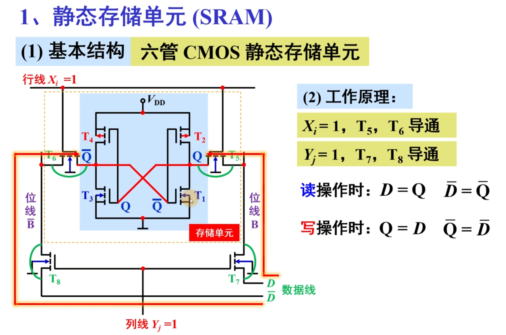

1. 读操作：

- 触发器状态（Q、\(\overline{Q}\)）通过 T5~T6→位线（B=Q，\(\overline{B}\)=\(\overline{Q}\)）→T7~T8→数据线（D=Q，\(\overline{D}\)=\(\overline{Q}\)）→CPU。

1. 写操作：

- CPU 数据通过数据线（D、\(\overline{D}\)）→T7~T8→位线（B=D，\(\overline{B}\)=\(\overline{D}\)）→T5~T6→触发器（Q=D，\(\overline{Q}\)=\(\overline{D}\)）→触发器保持该状态。

#### （3）工作特点

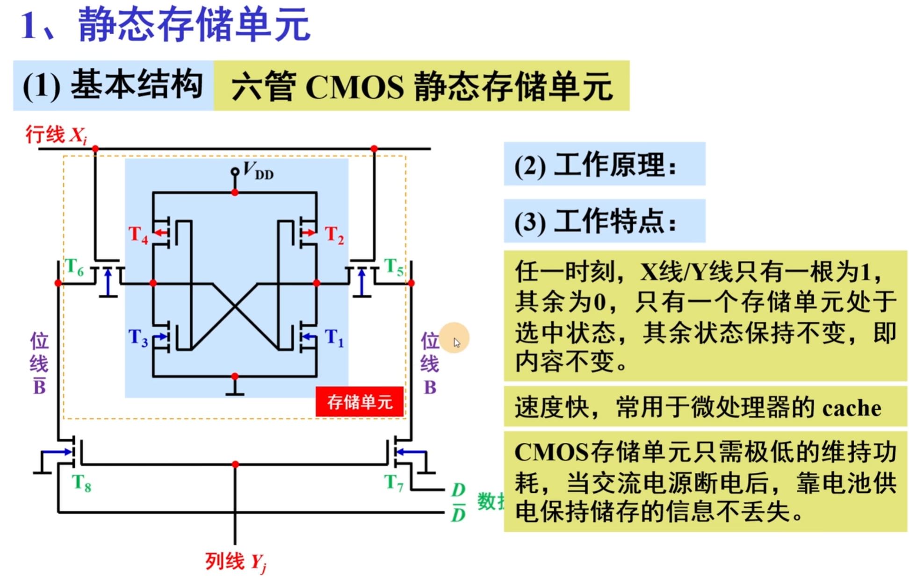

- 选中规则：任意时刻仅 1 条 Xi 和 1 条 Yj 为 1，仅 1 个单元被选中；

- 速度：存储速度快，常用于 CPU 的高速缓存（cache）；

- 功耗：CMOS 结构功耗极低，断电后可通过备用电池供电，保持数据不丢失。

### 2. 动态存储单元（DRAM）

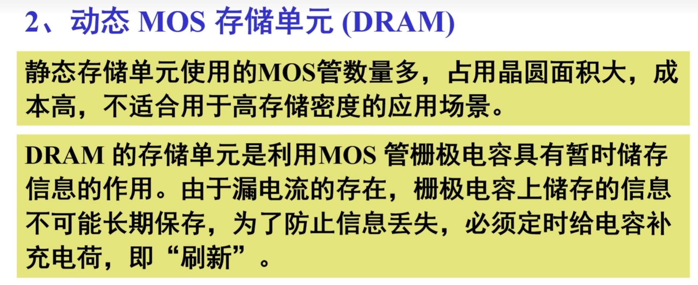

#### （1）核心特性与结构

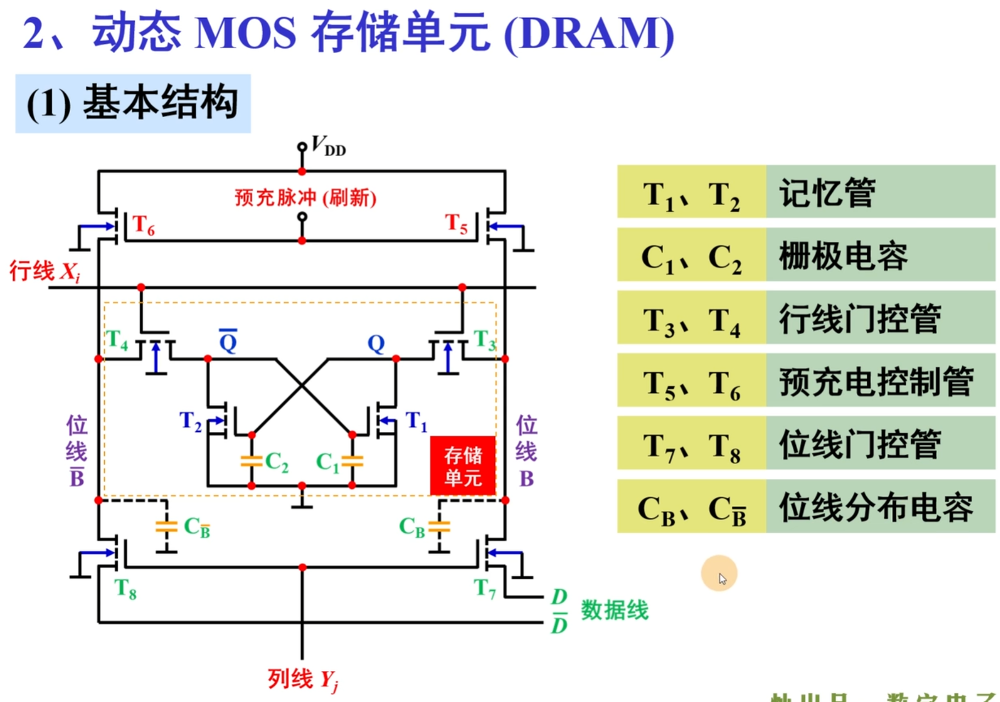

- 核心原理：利用**MOS 管栅极电容的充放电**存储信息（充电→1，放电→0）；

- 缺点：电容存在漏电流，需**定时刷新**（约 2ms 补充电荷），防止数据丢失；

- 结构（视频简化模型）：

- 存储单元：T1~T4（T1~T2 为 “记忆管”，控制栅极电容 C1~C2；T3~T4 为行控门控管）；

- 预充电组件：T5~T6（预充脉冲控制，用于位线预充电）；

- 列控门控管：T7~T8（列选线 Yj 控制）；

- 电容：C1~C2（栅极电容，存电荷）、CB 和\(\overline{CB}\)（位线分布电容）。

#### （2）工作原理

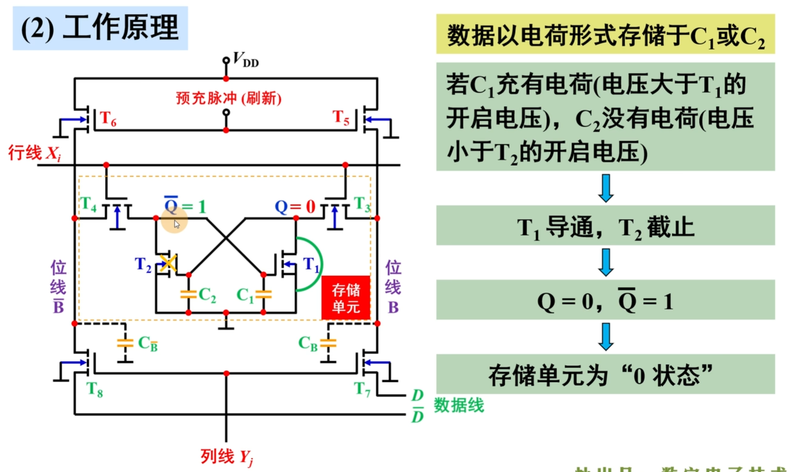

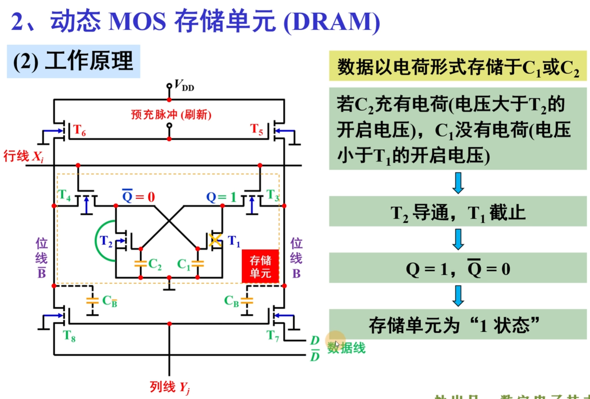

##### ① 存储状态

- 0 状态：C1 充电（电压 > T1 导通电压）→T1 导通→Q=0；C2 放电→T2 截止→\(\overline{Q}\)=1；

- 1 状态：C2 充电（电压 > T2 导通电压）→T2 导通→Q=1；C1 放电→T1 截止→\(\overline{Q}\)=0。

##### ② 预充电（读操作前置步骤）

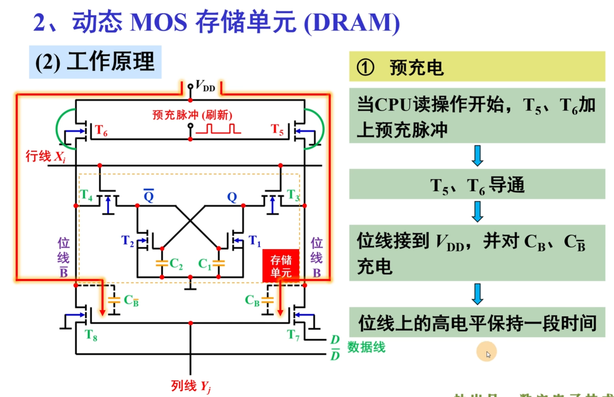

- 触发条件：CPU 发起读操作时，预充脉冲生效；

- 过程：预充脉冲→T5~T6 导通→VDD 对 CB 和\(\overline{CB}\)充电→位线 B 和\(\overline{B}\)变为高电平（因电容放电慢，高电平可保持一段时间）。

##### ③ 读操作（以 0 状态为例）

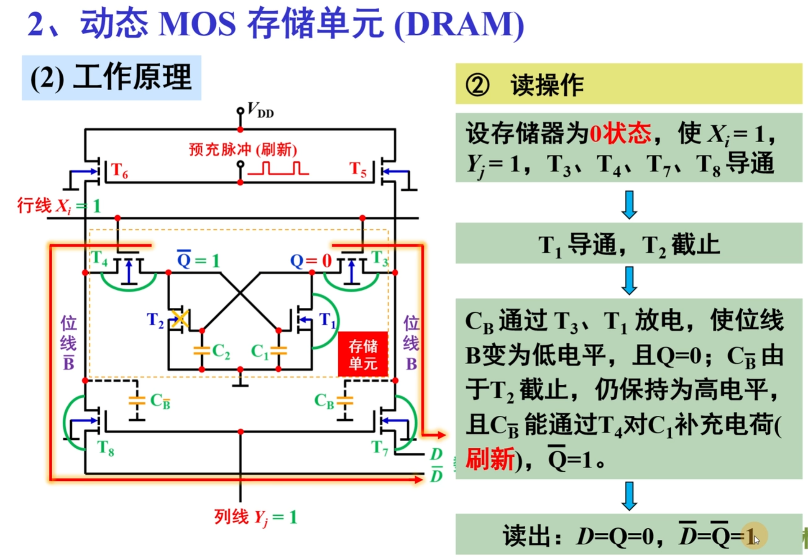

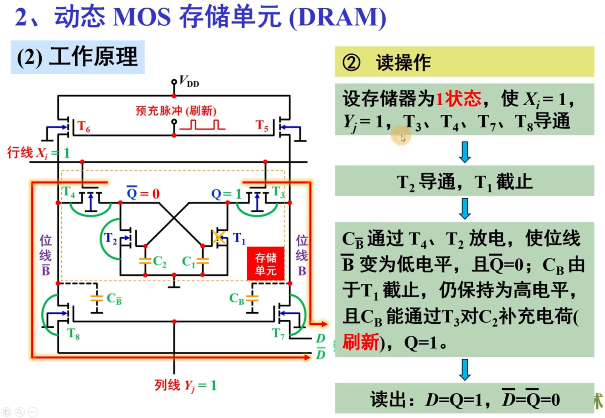

1. 选中：Xi=1 且 Yj=1→T3~T4（行控）、T7~T8（列控）导通；

1. 放电：T1 导通→CB 通过 T3→T1→地放电→位线 B 变为低电平；

1. 保持与刷新：\(\overline{CB}\)因 T2 截止无放电回路→保持高电平→\(\overline{Q}\)=1，同时\(\overline{CB}\)高电平对 C1 充电（完成刷新）；

1. 数据输出：位线 B（低电平）→\(\overline{B}\)（高电平）→数据线（D=0，\(\overline{D}\)=1）→CPU。

	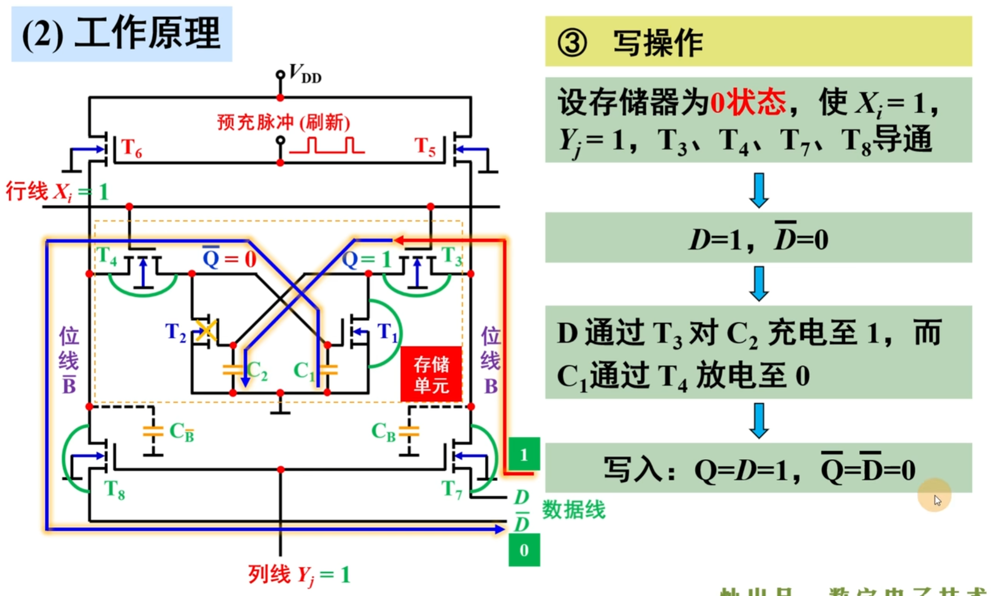

	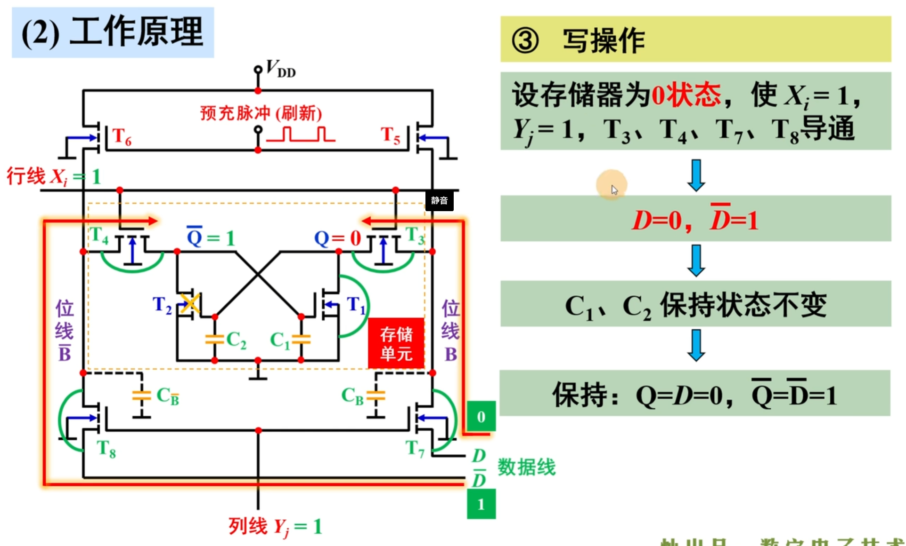

## 六、典型例题总结

### 例题 1：256×4 RAM 的地址编码（对比一元与二元译码）

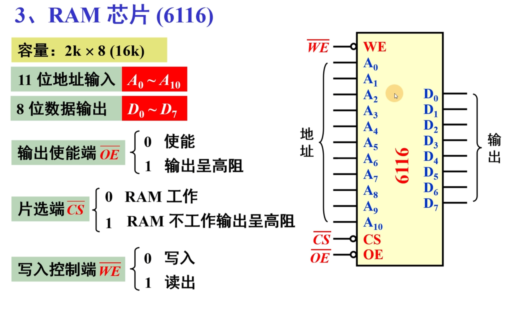

#### 已知条件

- 存储容量：256×4（256 个存储单元，每个单元 4 位，总容量 1024bit=1KB）。

#### 问题 1：确定地址线与 I/O 线数

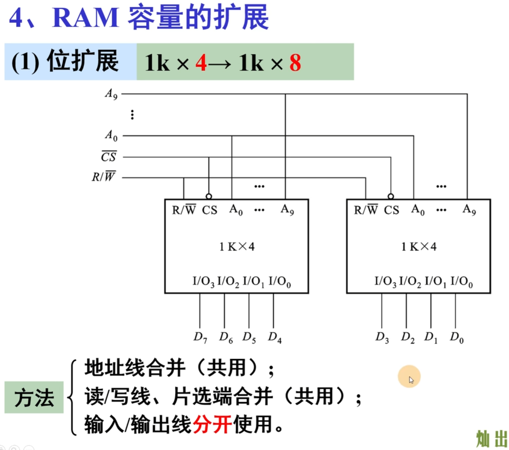

- 地址线数：2ⁿ=256 → n=8（A0~A7）；

- I/O 线数：4 条（对应每个单元 4 位数据）。

#### 问题 2：一元地址译码设计

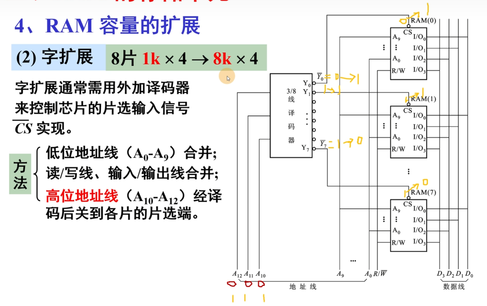

- 地址输入：8 条（A0~A7）；

- 译码器输出：256 条（W0~W255），每条对应 1 个 4 位存储单元；

- 选中示例：地址 0000_0001→选中 W1，输出 W1 中 4 位数据（如 1010）。

#### 问题 3：二元地址译码设计

- 地址分组：8 条地址线分 2 组（行 A0~A3，列 A4~A7）；

- 译码输出：行选线 16 条（X0~X15），列选线 16 条（Y0~Y15）；

- 选中示例：地址 0001_0001→行 X1、列 Y1 有效→选中交点单元，输出 4 位数据。

### 例题 2：1024×1 RAM 的二元地址译码设计

#### 已知条件

- 存储容量：1024×1（1024 个存储单元，每个单元 1 位，总容量 1024bit=1KB）。

#### 问题 1：确定地址线与 I/O 线数

- 地址线数：2ⁿ=1024 → n=10（A0~A9）；

- I/O 线数：1 条（对应每个单元 1 位数据，含 D 和\(\overline{D}\)）。

#### 问题 2：二元地址译码设计

- 地址分组：10 条地址线分 2 组（行 A0~A4，列 A5~A9）；

- 译码输出：行选线 32 条（X0~X31），列选线 32 条（Y0~Y31）；

- 单元排列：32×32 矩阵（32×32=1024 个单元），单元编号为 “行号 - 列号”（如 0-0、1-1…31-31）。

#### 问题 3：选中逻辑与数据传输

- 选中示例：

- 地址 00000_00000→行 X0、列 Y0→选中 0-0 单元；

- 地址 11111_11111→行 X31、列 Y31→选中 31-31 单元；

- 数据传输：选中单元的 1 位数据通过 MOS 管→位线→I/O 口，实现读 / 写。


# 第8章小结

## 1.半导体存储器基础认知

1.  **组成单元**：由多个存储单元构成，每个存储单元仅能存储1位二进制数（0或1）。
2.  **核心分类**：根据存储功能差异，分为**只读存储器（ROM）** 和**随机存取存储器（RAM）**，二者存储单元结构、逻辑类型完全不同。

## 2. 只读存储器（ROM）

### 2.1 核心特性与逻辑类型

- **逻辑电路类型**：属于**大规模组合逻辑电路**，其存储矩阵由二极管构成的 “与门” 和 “或门” 组成（固定逻辑结构，无时序特性）。

- **存储特点**：

1. 用于存放**固定不变的数据**，正常工作时仅能 “按地址码读出” 数据，不能随意改写；

1. 断电后数据不丢失（非易失性）。

### 2.2 ROM 的具体类型

#### 2.2.1 掩膜 ROM（固定 ROM）

- **结构特性**：出厂前已通过工艺固定内部 “与门”“或门” 的连接关系（即固定存储内容），生产后无法修改；

- **应用场景**：适用于存储无需变更的固定程序或数据（如设备底层驱动）。

#### 2.2.2 可编程 ROM（PROM）

- **编程原理**：用户可通过物理手段（如紫外线擦除、电擦除）修改内部 “或门” 的连接状态（控制 “导通 / 断开”），“与门阵列” 则为固定结构；

- **逻辑函数实现能力**：

- 若 PROM 有n个地址输入端，其固定 “与门阵列” 可产生2ⁿ个最小项（如 4 个地址端对应 16 个最小项）；

- 通过编程调整 “或门阵列” 对最小项的组合，可实现**任意组合逻辑函数**（例：通过选择不同最小项的导通 / 断开，构成与、或、非等基础逻辑，或更复杂的组合逻辑）。

## 3. 随机存取存储器（RAM）

### 3.1 核心特性与逻辑类型

- **逻辑电路类型**：属于**大规模时序逻辑电路**，由多个 “基本存储单元” 构成，满足条件时可实现 “数据读出” 或 “数据写入”（时序可控）。

- **存储特点**：

1. 读写速度快，适用于**数据频繁更换的场景**（典型应用：计算机内存，暂存计算过程中的数据）；

1. 断电后数据全部丢失（易失性），需配套 “备用电源” 等断电保护措施；

1. 最终需将重要数据转移至外部存储器（非易失性）长期保存。

### 3.2 RAM 的组成结构

- 由**存储矩阵**、**译码器**、**读写控制电路**三部分组成：

- 存储矩阵：核心存储区域，由大量基本存储单元构成；

- 译码器：通过地址码选择存储矩阵中的目标单元；

- 读写控制电路：控制数据的读出或写入操作。

## 4. ROM 与 RAM 的扩展（位扩展与字扩展）

### 4.1 扩展的核心概念

- **位**：指存储器与 CPU 连接的 “输入 / 输出端” 数量，对应单次读写的数据位数；

- **字**：指存储器可寻址的 “存储单元数量”，与地址端数量满足字的数量=2ⁿ（n为地址输入端数量）。

### 4.2 位扩展（扩展读写数据位数）

- **适用场景**：当存储器单次读写位数（I/O 端数量）小于 CPU 需求时使用；

- **实现方法**：

1. 将多片存储器的 “地址端”“控制端”（如读写控制、使能端）全部并联；

1. 每片存储器的 “输入 / 输出端（I/O）” 单独排列，共同构成扩展后的 I/O 端（例：2 片 8 位 I/O 的存储器，位扩展后可实现 16 位 I/O）。

### 4.3 字扩展（扩展存储单元数量）

- **适用场景**：当存储器的存储单元数量（字数量）小于需求时使用；

- **实现方法**：

1. 核心原理：通过 “译码器” 控制多片存储器的 “片选端（\(\overline{CS}\)）”，使多片存储器轮流工作；

1. 典型示例（视频提及）：

- 采用74LS138译码器实现字扩展：

- 译码器 “输入端” 接入 “扩展地址”（原地址端之外的新增地址）；

- 译码器 “8 个输出端” 分别连接 8 片 RAM 的\(\overline{CS}\)端；

- 当 “扩展地址” 输入不同信号时，译码器仅选通 1 个输出端，使对应 RAM 片工作；

- 工作的 RAM 再通过自身地址端选择内部存储单元，完成数据读写。

### 4.4 组合扩展

- 视频提及：可同时进行 “位扩展” 与 “字扩展”，实现 “位数 + 存储单元数量” 的双重扩展，具体方法需参考额外资料。

## 5. RAM 的具体类型（静态 RAM 与动态 RAM）

### 5.1 静态 RAM（SRAM）

- **存储单元结构**：由6管CMOS触发器构成（视频重点示例）：

- T1、T2 构成 1 对反相器，T3、T4 构成另一对反相器；

- 两对反相器通过 “交叉耦合” 形成稳定的触发器结构，可存储 1 位二进制数（0 或 1）。

- **工作特性**：

1. 无需周期性刷新（触发器状态稳定，通电即保持存储数据）；

1. 存储容量较小（6 个 MOS 管构成 1 个单元，相同体积下单元数量少，成本高、体积大）。

### 5.2 动态 RAM（DRAM）

- **存储单元结构**：利用MOS管栅极电容（C1、C2）暂存电荷实现存储（视频重点示例）：

- 电容 “充电” 状态对应存储 “1”，电容 “放电” 状态对应存储 “0”；

- 依赖 MOS 管极高的输入电阻（>10¹⁰Ω）减少电荷泄露。

- **工作特性**：

1. 存在电荷泄露问题，需**每 2 毫秒周期性刷新**（视频明确时间）；

1. 刷新原理：通过 “预充电” 过程，利用分布电容（\(\text{C}_\text{B}\)、\(\overline{\text{C}_\text{B}}\)）为存储电容补充电荷；

1. 存储容量大（单个单元 MOS 管数量少，体积小、成本低）。


