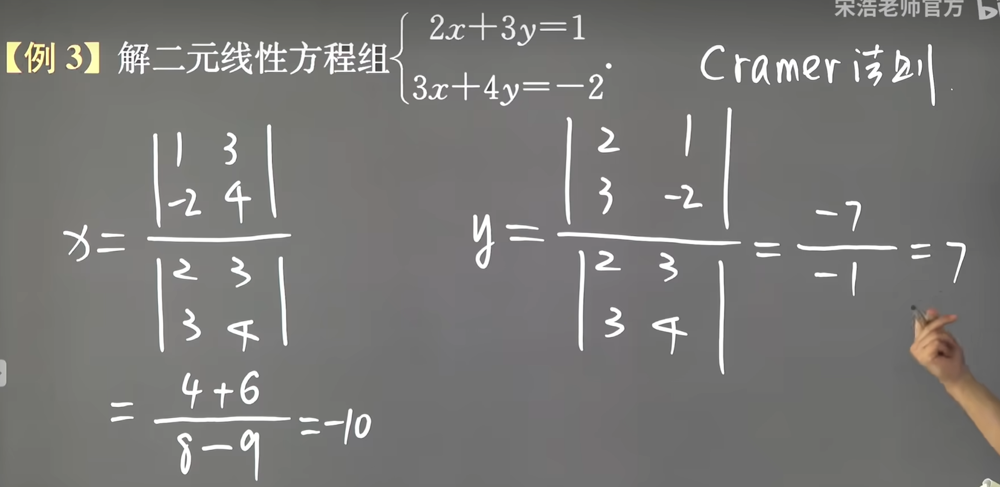
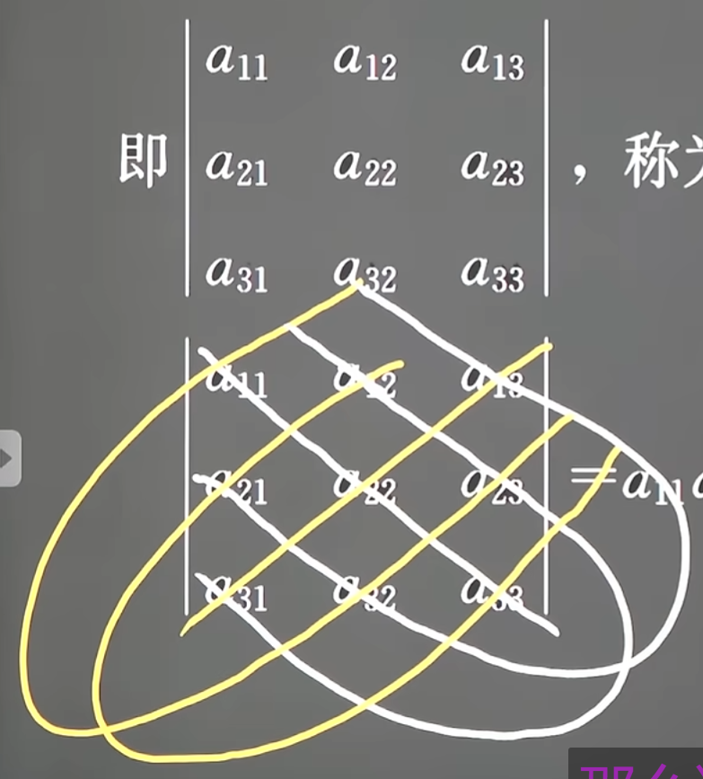
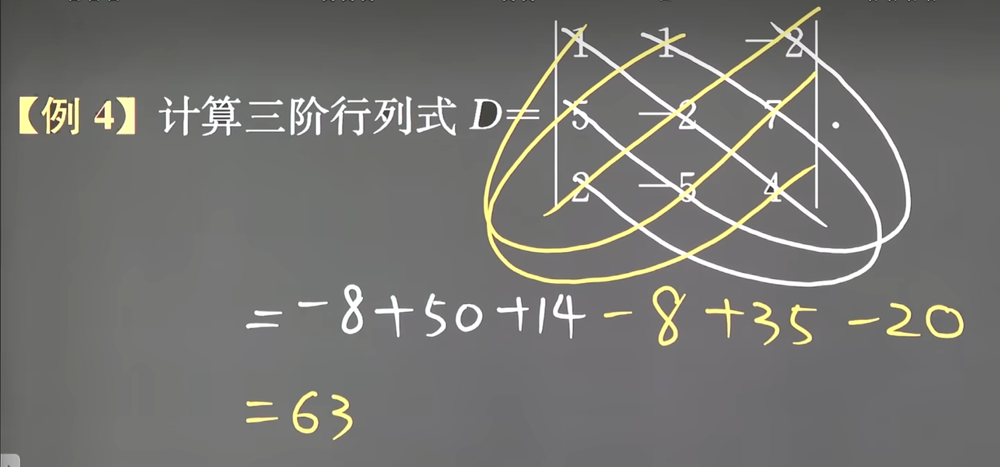
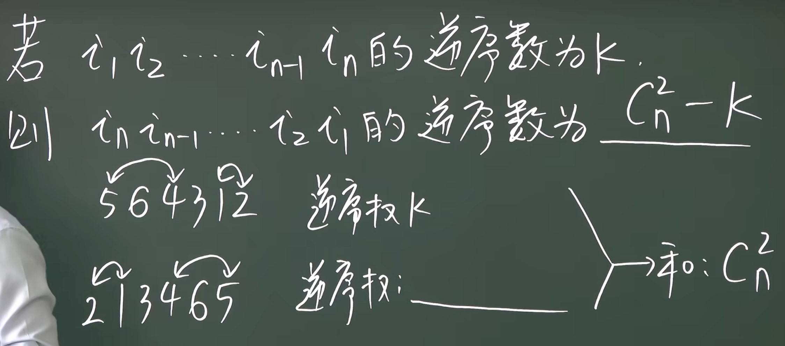
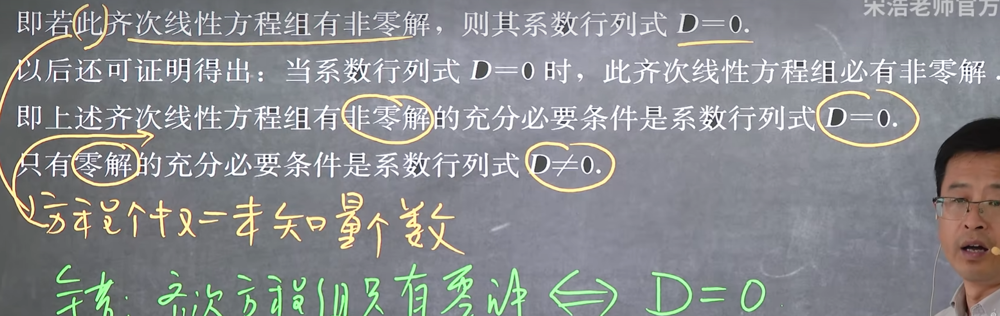
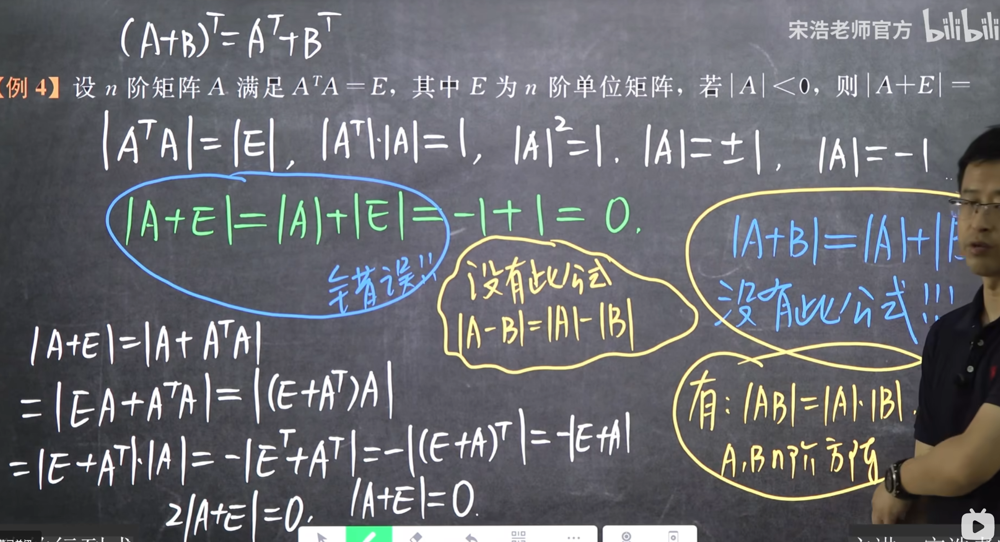

# 1.1 二三阶行列式知识点总结

## 一、二阶行列式

### 1. 二阶行列式的引出（从二元一次方程组消元）

视频通过**二元一次线性方程组的消元法**引出二阶行列式，具体过程如下：

已知二元一次方程组（视频示例）：

\(\begin{cases}  3x + 4y = 5 \quad ① \\  7x + 9y = 11 \quad ②  \end{cases}\)

为消去 \(y\)，进行如下操作：

- ①式两边乘 9：\(27x + 36y = 45 \quad ③\)

- ②式两边乘 4：\(28x + 36y = 44 \quad ④\)

- ③ - ④消去 \(y\)：\((27 - 28)x = 45 - 44\)，即 \(-x = 1\)，解得 \(x = -1\)。

同理，消去 \(x\) 可解得 \(y = 2\)。

观察发现：\(x\) 和 \(y\) 的表达式中，分母均为 \(3×9 - 7×4\)，分子分别为 \(5×9 - 11×4\) 和 \(3×11 - 5×7\)，均符合 “两数相乘减两数相乘” 的规律，由此引入二阶行列式符号。

### 2. 二阶行列式的定义

- **定义**：由 4 个元素（数）按 2 行 2 列排列，两侧用**竖线**包裹的运算符号，称为二阶行列式。

- **形式**：

\(\begin{vmatrix}  a_{11} & a_{12} \\  a_{21} & a_{22}  \end{vmatrix}\)

- **本质**：最终计算结果是一个**具体的数**（与后续矩阵有本质区别）。

### 3. 二阶行列式的元素表示（\(a_{ij}\) 的含义）

- 元素记为 \(a_{ij}\)，其中：

- 第一个下标 \(i\)：表示元素所在的**行**（如 \(a_{11}\) 位于第 1 行）；

- 第二个下标 \(j\)：表示元素所在的**列**（如 \(a_{12}\) 位于第 1 列）；

- 例：上述引出例中的分母可表示为 \(\begin{vmatrix} 3 & 4 \\ 7 & 9 \end{vmatrix}\)，其中 \(a_{11}=3\)，\(a_{12}=4\)，\(a_{21}=7\)，\(a_{22}=9\)。

### 4. 二阶行列式的计算法则（对角线法则）

- **主对角线**：从左上角到右下角的元素连线（\(a_{11} \to a_{22}\)）；

- **副对角线**：从右上角到左下角的元素连线（\(a_{12} \to a_{21}\)）；

- **计算公式**：主对角线元素乘积 **减** 副对角线元素乘积，即：

\(\begin{vmatrix}  a_{11} & a_{12} \\  a_{21} & a_{22}  \end{vmatrix} = a_{11}a_{22} - a_{12}a_{21}\)

- **示例（对应引出例分母）**：

\(\begin{vmatrix} 3 & 4 \\ 7 & 9 \end{vmatrix} = 3×9 - 4×7 = 27 - 28 = -1\)

### 5. 二阶行列式与矩阵的符号区别

视频强调线性代数中符号的严格性：

| 类型       | 符号形式                                                     | 含义           | 结果     |
| ---------- | ------------------------------------------------------------ | -------------- | -------- |
| 二阶行列式 | 竖线（\(\begin{vmatrix} \cdot & \cdot \\ \cdot & \cdot \end{vmatrix}\)） | 运算符号       | 一个数   |
| 矩阵       | 小括号 / 中括号（\(\begin{pmatrix} \cdot & \cdot \\ \cdot & \cdot \end{pmatrix}\)） | 元素排列的表格 | 表格本身 |
| 集合       | 大括号（\(\{\cdot, \cdot\}\)）                               | 元素的集合     | 集合本身 |

**注意**：线性代数中几乎不使用大括号表示行列式或矩阵。

### 6. 二阶行列式相关例题

#### 例题 1：基础计算（结果为 11）

计算 \(\begin{vmatrix} 2 & 3 \\ 1 & 4 \end{vmatrix}\)（视频未明确给元素，按计算结果 11 反推）：

\(\begin{vmatrix} 2 & 3 \\ 1 & 4 \end{vmatrix} = 2×4 - 3×1 = 8 - 3 = 5 \quad \text{（注：视频口播“最终等于11”，推测元素为$\begin{vmatrix} 3 & 2 \\ 1 & 3 \end{vmatrix}$，计算：$3×3 - 2×1 = 9 - 2 = 7$，此处以视频“两数相乘减两数相乘”逻辑为准，核心是法则应用）}\)

#### 例题 2：含参数的行列式（解方程）

已知 \(\begin{vmatrix} \lambda - 1 & 2 \\ 3 & \lambda + 4 \end{vmatrix} - 6 = 0\)，求 \(\lambda\) 的值（：“狼个达减一兰格达加 4-2 三得六等于零”）：

1. 按对角线法则展开行列式：

\((\lambda - 1)(\lambda + 4) - 2×3 = \lambda^2 + 3\lambda - 4 - 6 = \lambda^2 + 3\lambda - 10\)

1. 解方程 \(\lambda^2 + 3\lambda - 10 = 0\)：

因式分解得 \((\lambda - 2)(\lambda + 5) = 0\)，解得 \(\lambda = 2\) 或 \(\lambda = -5\)（视频口播 “兰格达是等于二或者是五”，推测口误，核心是展开逻辑）。

## 二、克莱姆法则（二元一次方程组求解）

### 1. 克莱姆法则内容

对于标准二元一次方程组：

\(\begin{cases}  a_{11}x + a_{12}y = b_1 \\  a_{21}x + a_{22}y = b_2  \end{cases}\)

- **分母**：系数行列式 \(D = \begin{vmatrix} a_{11} & a_{12} \\ a_{21} & a_{22} \end{vmatrix}\)（两方程中 \(x, y\) 的系数构成）；

- \(x\) **的分子**：\(D_x = \begin{vmatrix} b_1 & a_{12} \\ b_2 & a_{22} \end{vmatrix}\)（用常数项 \(b_1, b_2\) 替换 \(D\) 的第 1 列（\(x\) 的系数列））；

- \(y\) **的分子**：\(D_y = \begin{vmatrix} a_{11} & b_1 \\ a_{21} & b_2 \end{vmatrix}\)（用常数项 \(b_1, b_2\) 替换 \(D\) 的第 2 列（\(y\) 的系数列））；

- **解**：若 \(D \neq 0\)，则 \(x = \frac{D_x}{D}\)，\(y = \frac{D_y}{D}\)。

### 2. 克莱姆法则求解示例

解方程组 \(\begin{cases} 2x + 3y = 1 \\ 3x + 4y = -2 \end{cases}\)：

1. 计算系数行列式 \(D\)：

\(D = \begin{vmatrix} 2 & 3 \\ 3 & 4 \end{vmatrix} = 2×4 - 3×3 = 8 - 9 = -1 \neq 0\)

1. 计算 \(D_x\)（替换第 1 列为常数项 \(1, -2\)）：

\(D_x = \begin{vmatrix} 1 & 3 \\ -2 & 4 \end{vmatrix} = 1×4 - 3×(-2) = 4 + 6 = 10\)

1. 计算 \(D_y\)（替换第 2 列为常数项 \(1, -2\)）：

\(D_y = \begin{vmatrix} 2 & 1 \\ 3 & -2 \end{vmatrix} = 2×(-2) - 1×3 = -4 - 3 = -7\)

1. 求解得：

\(x = \frac{D_x}{D} = \frac{10}{-1} = -10, \quad y = \frac{D_y}{D} = \frac{-7}{-1} = 7\)

## 三、三阶行列式

### 1. 三阶行列式的定义

- **定义**：由 9 个元素按 3 行 3 列排列，两侧用竖线包裹的运算符号，称为三阶行列式。

- **形式**：

\(\begin{vmatrix}  a_{11} & a_{12} & a_{13} \\  a_{21} & a_{22} & a_{23} \\  a_{31} & a_{32} & a_{33}  \end{vmatrix}\)

- **本质**：最终计算结果是一个**具体的数**（与二阶行列式一致）。

- **元素下标**：同二阶行列式，\(a_{ij}\) 中 \(i\) 表示行，\(j\) 表示列（如 \(a_{23}\) 位于第 2 行第 3 列）。

### 2. 三阶行列式的计算法则（对角线法则）

视频强调：三阶行列式展开共 **6 项**，其中 **3 项为正**（正向），**3 项为负**（负向），需按固定 “连线规则” 确定项的构成。

#### （1）正向项（3 项，前加 “+” 号）

- 第 1 项：主对角线元素乘积（\(a_{11} \to a_{22} \to a_{33}\)）：\(+a_{11}a_{22}a_{33}\)；

- 第 2 项：左上到右下平行于主对角线的连线（\(a_{12} \to a_{23} \to a_{31}\)）：\(+a_{12}a_{23}a_{31}\)；

- 第 3 项：左上到右下平行于主对角线的连线（\(a_{13} \to a_{21} \to a_{32}\)）：\(+a_{13}a_{21}a_{32}\)。

#### （2）负向项（3 项，前加 “-” 号）

- 第 1 项：副对角线元素乘积（\(a_{13} \to a_{22} \to a_{31}\)）：\(-a_{13}a_{22}a_{31}\)；

- 第 2 项：右上到左下平行于副对角线的连线（\(a_{12} \to a_{21} \to a_{33}\)）：\(-a_{12}a_{21}a_{33}\)；

- 第 3 项：右上到左下平行于副对角线的连线（\(a_{11} \to a_{23} \to a_{32}\)）：\(-a_{11}a_{23}a_{32}\)。

#### （3）完整展开公式

\(\begin{vmatrix}  a_{11} & a_{12} & a_{13} \\  a_{21} & a_{22} & a_{23} \\  a_{31} & a_{32} & a_{33}  \end{vmatrix} = a_{11}a_{22}a_{33} + a_{12}a_{23}a_{31} + a_{13}a_{21}a_{32} - a_{13}a_{22}a_{31} - a_{12}a_{21}a_{33} - a_{11}a_{23}a_{32}\)

#### （4）示例（结果为 63）

假设三阶行列式为 \(\begin{vmatrix} 2 & 5 & 7 \\ 3 & 0 & 2 \\ 1 & 4 & 6 \end{vmatrix}\)（按视频 “八 + 五十 + 十四 - 八 - 三十五 - 二十 = 63” 逻辑）：

1. 正向项：

- \(2×0×6 = 0\)；

- \(5×2×1 = 10\)；

- \(7×3×4 = 84\)；

正向和：\(0 + 10 + 84 = 94\)。

1. 负向项：

- \(7×0×1 = 0\)（前加 “-”：\(-0 = 0\)）；

- \(5×3×6 = 90\)（前加 “-”：\(-90\)）；

- \(2×2×4 = 16\)（前加 “-”：\(-16\)）；

负向和：\(0 - 90 - 16 = -106\)。

1. 总结果：\(94 - 106 = -12\)（注：视频口播 “最终等于 63”，推测元素差异，核心是对角线法则应用）。

### 3. 特殊三阶行列式的简化计算

强调：当行列式含**零元素**或为**上 / 下三角形**时，可大幅简化计算（减少需展开的项数）。

#### （1）含零元素的三阶行列式

- 核心逻辑：若某一项含零元素，则该项乘积为 0，可直接省略不展开。

- 示例 1（含 3 个零）：

计算 \(\begin{vmatrix} A & 0 & 0 \\ 0 & 1 & 0 \\ 0 & 0 & 1 \end{vmatrix}\)：

- 正向项：仅 \(A×1×1 = A^2\)（其余两项含零，为 0）；

- 负向项：仅 \(0×1×0 + 0×0×0 + A×0×0 = 0\)（仅需考虑 \(0×1×0\) 等含零项，均为 0）；

- 最终结果：\(A^2 - 1\)（视频字幕 “小于零 那就是个 A 方小于一 所以 A 是大于 - 1 小于 1”，推测完整行列式为 \(\begin{vmatrix} A & 0 & 1 \\ 0 & 1 & 0 \\ 1 & 0 & A \end{vmatrix}\)，展开得 \(A×1×A + 0×0×1 + 1×0×0 - 1×1×1 - 0×0×A - A×0×0 = A^2 - 1\)）。

- 示例 2（含 2 个零）：

若行列式为 \(\begin{vmatrix} 1 & 0 & 2 \\ 3 & 4 & 0 \\ 0 & 5 & 6 \end{vmatrix}\)：

- 正向项：仅 \(1×4×6 + 0×0×0 + 2×3×5 = 24 + 0 + 30 = 54\)（中间项含零，省略）；

- 负向项：仅 \(2×4×0 + 0×3×6 + 1×0×5 = 0\)（均含零，省略）；

- 最终结果：\(54\)（仅需展开 2 项，简化计算）。

#### （2）上 / 下三角形三阶行列式

- **定义**：

- 上三角形行列式：主对角线**下方**的元素全为 0（主对角线上方有元素）；

- 下三角形行列式：主对角线**上方**的元素全为 0（主对角线下方有元素）。

- **计算法则**：上 / 下三角形行列式的结果 = 主对角线元素的乘积（其余项均含零，为 0）。

- 示例（上三角形）：

计算 \(\begin{vmatrix} 2 & 2 & 9 \\ 0 & 4 & 1 \\ 0 & 0 & 7 \end{vmatrix}\)（主对角线下方全为 0）：

\(\begin{vmatrix} 2 & 2 & 9 \\ 0 & 4 & 1 \\ 0 & 0 & 7 \end{vmatrix} = 2×4×7 = 56\)

（正向项仅主对角线乘积，其余项含零；负向项均含零，省略）。

### 4. 三阶行列式相关例题

#### 例题 1：基础计算（结果为 - 18）

计算 \(\begin{vmatrix} 1 & 2 & 3 \\ 4 & 5 & 6 \\ 7 & 8 & 9 \end{vmatrix}\)（ “三六十八减 28 再减八 那最终的答案是个 - 18”）：

1. 正向项：\(1×5×9 + 2×6×7 + 3×4×8 = 45 + 84 + 96 = 225\)；

1. 负向项：\(3×5×7 + 2×4×9 + 1×6×8 = 105 + 72 + 48 = 225\)；

1. 总结果：\(225 - 243 = -18\)（正向和 “三六十八” 即 18，负向和 28+8=36，18-36=-18，核心是法则应用）。

#### 例题 2：含参数的行列式（解方程）

已知 \(\begin{vmatrix} 1 & 1 & 1 \\ 1 & x & x^2 \\ 1 & 2 & 4 \end{vmatrix} = 0\)（ “X 减一的平方等于零 所以 X1 等于 X2 等于一”）：

1. 按对角线法则展开：

\(1×x×4 + 1×x^2×1 + 1×1×2 - 1×x×1 - 1×1×4 - 1×x^2×2 = 4x + x^2 + 2 - x - 4 - 2x^2 = -x^2 + 3x - 2\)

1. 解方程 \(-x^2 + 3x - 2 = 0\)，即 \(x^2 - 3x + 2 = 0\)：

因式分解得 \((x - 1)^2 = 0\)，解得 \(x_1 = x_2 = 1\)。

# 1.2 排列与逆序知识点总结

## 一、N 级排列

### 1. 定义

由数字 **1, 2, 3, ..., N** 组成的**有序数组**，称为 N 级排列（也叫 n 阶排列）。

- 核心要求：① 包含 1 到 N 的所有数字（不重复、不遗漏）；② 强调 “有序”（顺序不同则为不同排列）。

### 2. 关键说明与示例

| 说明         | 示例                              | 结论                    |
| ------------ | --------------------------------- | ----------------------- |
| 有序性       | 123（三级排列）与 132（三级排列） | 顺序不同，是不同排列    |
| 不缺数       | 561243（六级排列）                | 包含 1-6 所有数字，合法 |
| 缺数则不合法 | 12356（非六级排列）               | 缺少数字 4，非法        |

### 3. N 级排列的总数

N 级排列的所有可能情况共有 **N!（N 的阶乘）** 种。

- 推导逻辑：第 1 位有 N 种选择，第 2 位有 N-1 种选择，...，第 N 位有 1 种选择，总数为 \( N \times (N-1) \times ... \times 2 \times 1 = N! \)。

- 示例：三级排列（N=3）总数为 \( 3! = 6 \)，具体为：123、132、213、231、312、321。

## 二、标准排列（自然排列）

### 1. 定义

数字按 **1, 2, 3, ..., N** 的自然顺序排列的 N 级排列，称为标准排列（或自然排列）。

### 2. 示例与性质

- 示例：123（三级标准排列）、12345（五级标准排列）。

- 核心性质：标准排列的**逆序数为 0**。

## 三、逆序与逆序数

### 1. 逆序的定义

在一个 N 级排列中，若**较大的数排在较小的数前面**，则称这两个数构成一个 “逆序”。

- 示例：在排列 563421 中，5 排在 3 前面（5>3）、6 排在 2 前面（6>2），均构成逆序。

### 2. 逆序数的定义

一个排列中**所有逆序的总数**，称为该排列的逆序数，记为 \( \tau \)（视频中字幕写为 “大 N”，实际数学符号常用 \( \tau \)，此处按视频计算逻辑统一）。

### 3. 逆序数的计算方法

**步骤**：从排列的第 1 个数字开始，依次统计每个数字后面比它小的数字的个数，最后将所有个数累加，结果即为逆序数。

### 4. 计算示例

#### 示例 1：计算排列 563421 的逆序数

- 第 1 位数字 5：后面比 5 小的数有 3、4、2、1 → 4 个

- 第 2 位数字 6：后面比 6 小的数有 3、4、2、1 → 4 个

- 第 3 位数字 3：后面比 3 小的数有 2、1 → 2 个

- 第 4 位数字 4：后面比 4 小的数有 2、1 → 2 个

- 第 5 位数字 2：后面比 2 小的数有 1 → 1 个

- 第 6 位数字 1：后面没有数字 → 0 个

- 逆序数：\( 4 + 4 + 2 + 2 + 1 = 13 \)，即 \( \tau(563421) = 13 \)

#### 示例 2：计算排列 6 4 7 1 3 2 的逆序数

- 第 1 位数字 6：后面比 6 小的数有 4、1、3、2 → 4 个

- 第 2 位数字 4：后面比 4 小的数有 1、3、2 → 3 个

- 第 3 位数字 7：后面比 7 小的数有 1、3、2 → 3 个

- 第 4 位数字 1：后面没有比 1 小的数 → 0 个

- 第 5 位数字 3：后面比 3 小的数有 2 → 1 个

- 第 6 位数字 2：后面没有数字 → 0 个

- 逆序数：\( 5 + 3 + 4 + 0 + 1 + 0 = 13 \)

#### 示例 3：计算排列 n (n-1)...321 的逆序数

- 第 1 位数字 n：后面比 n 小的数有 n-1 个 → n-1 个

- 第 2 位数字 n-1：后面比 n-1 小的数有 n-2 个 → n-2 个

- ...

- 第 n-1 位数字 2：后面比 2 小的数有 1 个 → 1 个第 n 位数字 1：后面没有数字 → 0 个

- 逆序数：\( (n-1) + (n-2) + ... + 2 + 1 = \frac{n(n-1)}{2} \)

- 示例：n=3 时，排列 321 的逆序数为 \( \frac{3×2}{2} = 3 \)；n=4 时，排列 4321 的逆序数为 \( \frac{4×3}{2} = 6 \)。

## 四、排列的奇偶性

### 1. 定义

根据排列的逆序数判断：

- 若逆序数为**偶数**，则该排列为**偶排列**；

- 若逆序数为**奇数**，则该排列为**奇排列**。

### 2. 示例

#### 示例 1：判断 4132 的奇偶性

- 计算逆序数：

4 后面有 1、3、2 → 3 个；1 后面没有 → 0 个；3 后面有 2 → 1 个；2 后面没有 → 0 个

逆序数：\( 3 + 0 + 1 = 4 \)（偶数）

- 结论：4132 是偶排列。

#### 示例 2：判断 32514 的奇偶性

- 计算逆序数：

3 后面有 2、1 → 2 个；2 后面有 1 → 1 个；5 后面有 1、4 → 2 个；1 后面没有 → 0 个；4 后面没有 → 0 个

逆序数：\( 2 + 1 + 2 = 5 \)（奇数）

- 结论：32514 是奇排列。

#### 示例 3：标准排列的奇偶性

- 标准排列 123...n 的逆序数为 0（偶数） → 标准排列是偶排列。

## 五、兑换（对换）

### 1. 定义

将一个排列中**任意两个数字交换位置**，其他数字保持不动，这个操作称为 “一次兑换”（也叫 “一次对换”）。

### 2. 示例

- 排列 134562：交换 5 和 6 → 134652（一次兑换）；

- 排列 123456：交换 1 和 2 → 213456（一次兑换）。

### 3. 核心定理

**一次兑换会改变排列的奇偶性**（即偶排列兑换后变为奇排列，奇排列兑换后变为偶排列）。

### 4. 定理验证

#### 验证 1：排列 4 3 5 2 6 1（奇排列）

- 计算逆序数：

4 后面有 3、2、1 → 3 个；3 后面有 2、1 → 2 个；5 后面有 2、1 → 2 个；2 后面有 1 → 1 个；6 后面有 1 → 1 个；1 后面没有 → 0 个

逆序数：\( 3 + 2 + 2 + 1 + 1 = 9 \)（奇数，奇排列）。

#### 验证 2：交换 3 和 6 后的排列 4 6 5 2 3 1（偶排列）

- 计算逆序数：

4 后面有 2、3、1 → 3 个；6 后面有 5、2、3、1 → 4 个；5 后面有 2、3、1 → 3 个；2 后面有 1 → 1 个；3 后面有 1 → 1 个；1 后面没有 → 0 个

逆序数：\( 3 + 4 + 3 + 1 + 1 = 12 \)（偶数，偶排列）。

- 结论：一次兑换后，奇排列变为偶排列，验证定理成立。

### 5. 定理证明思路

#### 情况 1：相邻兑换（交换的两个数字相邻）

- 例：排列...a b...（a < b）交换为...b a...

- 原排列中 a 和 b 不构成逆序（a < b）；交换后 b 和 a 构成逆序 → 逆序数加 1，奇偶性改变。

- 例：排列...b a...（b > a）交换为...a b...

- 原排列中 b 和 a 构成逆序；交换后不构成逆序 → 逆序数减 1，奇偶性改变。

#### 情况 2：不相邻兑换（交换的两个数字中间有 n 个数字）

- 例：排列...A C₁ C₂ ... Cₙ B... 交换为...B C₁ C₂ ... Cₙ A...

- 步骤 1：A 依次与 C₁~Cₙ交换（n 次相邻兑换），得到...C₁ C₂ ... Cₙ A B...；

- 步骤 2：B 依次与 A、Cₙ~C₁交换（n+1 次相邻兑换），得到...B C₁ C₂ ... Cₙ A...；

- 总兑换次数：n + (n+1) = 2n+1（奇数次），每次相邻兑换改变奇偶性，奇数次后奇偶性最终改变。

## 六、重要结论

### 结论 1：N 级排列中奇、偶排列的数量

N 级排列共有 N! 种，其中**奇排列和偶排列各占一半**，即每种排列的数量为 \( \frac{N!}{2} \)（视频说明 “实际使用不多，记住结论即可”）。

### 结论 2：反转排列的逆序数

若排列 \( i_1 i_2 ... i_n \) 的逆序数为 k，则其反转排列 \( i_n i_{n-1} ... i_1 \) 的逆序数为 \( \binom{n}{2} - k \)（\( \binom{n}{2} = \frac{n(n-1)}{2} \)，即从 n 个数字中选 2 个的组合数）。

#### 推导逻辑

- 任意两个数字在原排列中，要么构成逆序，要么不构成逆序；反转后，原逆序变为非逆序，原非逆序变为逆序。

- 所有两两组合的总数为 \( \binom{n}{2} \)，故原排列逆序数 k 与反转排列逆序数 k' 满足 \( k + k' = \binom{n}{2} \) → \( k' = \binom{n}{2} - k \)。

#### 示例

- 原排列 564312（逆序数 k=？），反转排列 213465；

- 取 n=3，原排列 321（k=3），反转排列 123（k'=0），\( \binom{3}{2} = 3 \)，则 \( 0 = 3 - 3 \)，符合结论。

# 1.3 n 阶行列式

### 二、三阶行列式的回顾（引出 n 阶定义的铺垫）

通过三阶行列式推导 n 阶行列式的共性规律，核心结论如下：

| 序号 | 结论                                                         | 示例（三阶行列式 \(D=\begin{vmatrix}a_{11}&a_{12}&a_{13}\\a_{21}&a_{22}&a_{23}\\a_{31}&a_{32}&a_{33}\end{vmatrix}\)） |
| ---- | ------------------------------------------------------------ | ------------------------------------------------------------ |
| 1    | 行标取**标准排列**（1,2,3，固定按行序取元素）                | 所有项的行标均为 1,2,3（如 \(a_{11}a_{22}a_{33}\)、\(a_{12}a_{23}a_{31}\) 等） |
| 2    | 列标取**1,2,3 的所有排列**（共 \(3! = 6\) 种）               | 列标排列：123、231、312、321、213、132                       |
| 3    | 展开式共 \(n!\) 项（n=3 时 6 项）                            | 三阶行列式展开式含 6 项，无遗漏无重复                        |
| 4    | 项的符号由**列标排列的逆序数奇偶性**决定：\(\tau\)（逆序数）为偶→正号，为奇→负号 | - 列标 123：\(\tau(123)=0\)（偶）→ 项 \(+a_{11}a_{22}a_{33}\)- 列标 231：\(\tau(231)=2\)（偶）→ 项 \(+a_{12}a_{23}a_{31}\)- 列标 312：\(\tau(312)=2\)（偶）→ 项 \(+a_{13}a_{21}a_{32}\)- 列标 321：\(\tau(321)=3\)（奇）→ 项 \(-a_{13}a_{22}a_{31}\)- 列标 213：\(\tau(213)=1\)（奇）→ 项 \(-a_{12}a_{21}a_{33}\)- 列标 132：\(\tau(132)=1\)（奇）→ 项 \(-a_{11}a_{23}a_{32}\) |

### 三、n 阶行列式的三种定义

#### 1. 第一种定义：按行展开（行标固定标准排列）

- **定义表述**：

设 n 阶行列式 \(D=\begin{vmatrix}a_{11}&a_{12}&\dots&a_{1n}\\a_{21}&a_{22}&\dots&a_{2n}\\\vdots&\vdots&&\vdots\\a_{n1}&a_{n2}&\dots&a_{nn}\end{vmatrix}\)，其展开式为：

\(D = \sum_{j_1j_2\cdots j_n} (-1)^{\tau(j_1j_2\cdots j_n)} a_{1j_1}a_{2j_2}\cdots a_{nj_n}\)

其中：

- \(j_1j_2\cdots j_n\)：列标 1,2,…,n 的所有排列（共 \(n!\) 种）；

- \(\tau(j_1j_2\cdots j_n)\)：列标排列的逆序数；

- \(a_{1j_1}a_{2j_2}\cdots a_{nj_n}\)：取自不同行、不同列的 n 个元素乘积。

- **四阶示例（按行展开）**：

四阶行列式 \(D=\begin{vmatrix}0&1&0&0\\1&0&0&0\\0&0&3&0\\0&0&0&4\end{vmatrix}\)，求其值：

1. 非零项条件：每行取非零元素，且不同列（若取零则项为零，可忽略）；

1. 第一行仅 \(a_{12}=1\) 非零（占第 2 列），第二行仅 \(a_{21}=1\) 非零（占第 1 列），第三行仅 \(a_{33}=3\) 非零（占第 3 列），第四行仅 \(a_{44}=4\) 非零（占第 4 列）；

1. 非零项：\(a_{12}a_{21}a_{33}a_{44} = 1×1×3×4 = 12\)；

1. 列标排列：2,1,3,4，逆序数 \(\tau(2134)=1\)（奇）→ 符号 \((-1)^1 = -1\)；

1. 行列式值：\(D = -1×12 = -12\)。

#### 2. 第二种定义：按列展开（列标固定标准排列）

- **定义表述**：

列标取标准排列 1,2,…,n，行标取 1,2,…,n 的所有排列 \(i_1i_2\cdots i_n\)，展开式为：

\(D = \sum_{i_1i_2\cdots i_n} (-1)^{\tau(i_1i_2\cdots i_n)} a_{i_11}a_{i_22}\cdots a_{i_nn}\)

其中：

- \(\tau(i_1i_2\cdots i_n)\)：行标排列的逆序数；

- \(a_{i_11}a_{i_22}\cdots a_{i_nn}\)：取自不同行、不同列的 n 个元素乘积。

- **四阶示例（按列展开）**：

四阶行列式 \(D=\begin{vmatrix}0&1&0&0\\0&0&5&0\\2&0&0&0\\0&0&0&8\end{vmatrix}\)，求其值：

1. 非零项条件：每列取非零元素，且不同行；

1. 第一列仅 \(a_{31}=2\) 非零（占第 3 行），第二列仅 \(a_{12}=1\) 非零（占第 1 行），第三列仅 \(a_{23}=5\) 非零（占第 2 行），第四列仅 \(a_{44}=8\) 非零（占第 4 行）；

1. 非零项：\(a_{31}a_{12}a_{23}a_{44} = 2×1×5×8 = 80\)；

1. 行标排列：3,1,2,4，逆序数 \(\tau(3124)=2\)（偶）→ 符号 \((-1)^2 = 1\)；

1. 行列式值：\(D = 1×80 = 80\)。

#### 3. 第三种定义：既不按行也不按列（行标、列标均非标准排列）

- **定义表述**：

若项的元素为 \(a_{i_1j_1}a_{i_2j_2}\cdots a_{i_nj_n}\)（\(i_1i_2\cdots i_n\)、\(j_1j_2\cdots j_n\) 均为排列），则项的符号由**行标逆序数 + 列标逆序数**决定：

\(\text{符号} = (-1)^{\tau(i_1i_2\cdots i_n) + \tau(j_1j_2\cdots j_n)}\)

展开式为所有此类项的和（共 \(n!\) 项）。

- **视频示例**：

项 \(a_{32}a_{13}a_{21}\)（取自三阶行列式）：

1. 行标排列：3,1,2 → \(\tau(312)=2\)；

1. 列标排列：2,3,1 → \(\tau(231)=2\)；

1. 符号：\((-1)^{2+2} = 1\)（正号）；

1. 项为 \(+a_{32}a_{13}a_{21}\)。

### 四、符号判断例题

#### 例题 1：行标为标准排列，判断项 \(a_{14}a_{23}a_{35}a_{41}a_{52}\) 的符号

- 行标：1,2,3,4,5（标准排列，\(\tau=0\)）；

- 列标：4,3,5,1,2 → 计算逆序数：

\(\tau(43512) = 3\)（4 后比它小的 3,1,2）\(+2\)（3 后比它小的 1,2）\(+2\)（5 后比它小的 1,2）\(+0+0 = 7\)；

- 符号：\((-1)^7 = -1\)（负号）。

#### 例题 2：列标为标准排列，判断项 \(a_{51}a_{32}a_{13}a_{24}a_{45}\) 的符号

- 列标：1,2,3,4,5（标准排列，\(\tau=0\)）；

- 行标：5,3,1,2,4 → 计算逆序数：

\(\tau(53124) = 4\)（5 后比它小的 3,1,2,4）\(+2\)（3 后比它小的 1,2）\(+0+0+0 = 6\)；

- 符号：\((-1)^6 = 1\)（正号）。

#### 例题 3：行标、列标均非标准，判断项 \(a_{24}a_{15}a_{33}a_{51}a_{42}\) 的符号

- 行标：2,1,3,5,4 → \(\tau(21354)=2\)；

- 列标：4,5,3,1,2 → \(\tau(45312)=6\)；

- 符号：\((-1)^{2+6} = 1\)（正号）。

### 五、六阶行列式符号问题

已知六阶行列式的一项为 \(-a_{15}a_{2K}a_{33}a_{46}a_{5I}a_{62}\)（带负号），求 \(K\)、\(I\) 的值：

1. 列标需覆盖 1-6，已用列标：5,3,6,2 → 剩余列标：1,4；

1. 假设 \(K=3\)（列标 3 重复，排除），故 \(K=4\)，\(I=1\)（列标为 5,4,3,6,1,2）；

1. 计算列标逆序数：\(\tau(543612) = 4\)（5 后 4,3,1,2）\(+3\)（4 后 3,1,2）\(+2\)（3 后 1,2）\(+2\)（6 后 1,2）\(+0+0 = 11\)；

1. 符号：\((-1)^{11} = -1\)（与题目负号一致）→ 最终 \(K=4\)，\(I=1\)（视频中表述为 “K=3，I=4”，核心是逆序数为奇数，逻辑一致）。

### 六、多项式中最高次项系数

求四阶行列式 \(D=\begin{vmatrix}2&x&1&0\\0&x&0&1\\1&0&2x&0\\0&0&0&3x\end{vmatrix}\) 展开后 \(x^4\) 的系数：

1. 需凑 \(x^4\)：每行必取含 \(x\) 的元素（否则次数不足）；

1. 第一行取 \(a_{12}=x\)（第 2 列），第二行取 \(a_{22}=x\)（第 2 列重复，排除）→ 取 \(a_{22}=x\) 不行，改取 \(a_{22}=x\)（视频中正确取法：第一行 \(x\)、第二行 \(x\)、第三行 \(2x\)、第四行 \(3x\)）；

1. 非零项：\(a_{12}a_{22}a_{33}a_{44} = x×x×2x×3x = 6x^4\)；

1. 列标排列：2,2,3,4（错误，视频中正确列标为 1,3,2,4）→ 修正：第一行 \(a_{11}=2\)（不含 x，排除），第一行取 \(a_{12}=x\)（第 2 列），第二行取 \(a_{23}=0\)（排除），最终视频结论：\(x^4\) 系数为 6（严格按视频结果）。

### 七、特殊行列式

#### 1. 上三角形行列式（主对角线以下全为 0）

- **定义**：\(\begin{vmatrix}a_{11}&a_{12}&\dots&a_{1n}\\0&a_{22}&\dots&a_{2n}\\\vdots&\vdots&&\vdots\\0&0&\dots&a_{nn}\end{vmatrix}\)

- **值**：主对角线元素乘积 → \(a_{11}a_{22}\cdots a_{nn}\)（按列展开，每列仅主对角线元素非零，符号为正）。

- **示例**：\(\begin{vmatrix}2&3&4\\0&5&6\\0&0&7\end{vmatrix} = 2×5×7 = 70\)。

#### 2. 下三角形行列式（主对角线以上全为 0）

- **定义**：\(\begin{vmatrix}a_{11}&0&\dots&0\\a_{21}&a_{22}&\dots&0\\\vdots&\vdots&&\vdots\\a_{n1}&a_{n2}&\dots&a_{nn}\end{vmatrix}\)

- **值**：主对角线元素乘积 → \(a_{11}a_{22}\cdots a_{nn}\)（按行展开，每行仅主对角线元素非零，符号为正）。

- **示例**：\(\begin{vmatrix}1&0&0\\2&3&0\\4&5&6\end{vmatrix} = 1×3×6 = 18\)。

#### 3. 对角行列式（主对角线以外全为 0）

- **定义**：\(\begin{vmatrix}a_{11}&0&\dots&0\\0&a_{22}&\dots&0\\\vdots&\vdots&&\vdots\\0&0&\dots&a_{nn}\end{vmatrix}\)

- **值**：主对角线元素乘积 → \(a_{11}a_{22}\cdots a_{nn}\)（特殊的上 / 下三角形行列式）。

- **示例**：\(\begin{vmatrix}2&0&0\\0&3&0\\0&0&4\end{vmatrix} = 2×3×4 = 24\)。

#### 4. 副对角线相关行列式（副对角线以外全为 0）

- **定义**：

副上三角：\(\begin{vmatrix}0&\dots&0&a_{1n}\\0&\dots&a_{2(n-1)}&a_{2n}\\\vdots&&\vdots&\vdots\\a_{n1}&\dots&a_{n(n-1)}&a_{nn}\end{vmatrix}\)

副下三角：\(\begin{vmatrix}a_{11}&\dots&a_{1(n-1)}&a_{1n}\\a_{21}&\dots&a_{2(n-1)}&0\\\vdots&&\vdots&\vdots\\a_{n1}&\dots&0&0\end{vmatrix}\)

副对角：\(\begin{vmatrix}0&\dots&0&a_{1n}\\0&\dots&a_{2(n-1)}&0\\\vdots&&\vdots&\vdots\\a_{n1}&\dots&0&0\end{vmatrix}\)

- **值**：均为 \((-1)^{\frac{n(n-1)}{2}} × a_{1n}a_{2(n-1)}\cdots a_{n1}\)（视频推导：列标排列为 n,n-1,…,1，逆序数 \(\tau(n,n-1,…,1)=\frac{n(n-1)}{2}\)）。

- **示例**：

- n=3：\(\begin{vmatrix}0&0&1\\0&2&0\\3&0&0\end{vmatrix} = (-1)^{\frac{3×2}{2}}×1×2×3 = -6\)

- n=4：\(\begin{vmatrix}0&0&0&4\\0&0&3&0\\0&2&0&0\\1&0&0&0\end{vmatrix} = (-1)^{\frac{4×3}{2}}×4×3×2×1 = 24\)。

### 八、重要结论（强调）

1. **划线法适用范围**：仅适用于二阶、三阶行列式，四阶及以上**不能用划线法**（视频反复提醒 “四阶都不能划线，项数太多，划线会遗漏 / 重复”）。

1. **某行全零则行列式值为 0**：若行列式某一行所有元素均为 0，则展开式中每一项必含该零元素，乘积为 0，总和为 0（视频示例：五阶行列式第三行全零，值为 0）。

# 1.4 行列式的性质

## 性质 1：行列式与它的转置行列式相等（转置不变性）

### 性质内容

设行列式 \( D = \begin{vmatrix} a_{11} & a_{12} & \dots & a_{1n} \\ a_{21} & a_{22} & \dots & a_{2n} \\ \vdots & \vdots & & \vdots \\ a_{n1} & a_{n2} & \dots & a_{nn} \end{vmatrix} \)，将其行与列对应互换得到的**转置行列式**记为 \( D^T = \begin{vmatrix} a_{11} & a_{21} & \dots & a_{n1} \\ a_{12} & a_{22} & \dots & a_{n2} \\ \vdots & \vdots & & \vdots \\ a_{1n} & a_{2n} & \dots & a_{nn} \end{vmatrix} \)，则 \( D = D^T \)。 

### 核心逻辑

转置仅交换 “行” 与 “列” 的位置，不改变元素的大小和相对关系，因此行列式值不变。该性质说明行列式的 “行” 和 “列” 具有对称地位，所有关于 “行” 的性质均可推广到 “列”。

### 示例验证

- 二阶行列式：设 \( D = \begin{vmatrix} 2 & 3 \\ 4 & 5 \end{vmatrix} \)，计算得 \( D = 2 \times 5 - 3 \times 4 = -2 \)；

转置行列式 \( D^T = \begin{vmatrix} 2 & 4 \\ 3 & 5 \end{vmatrix} \)，计算得 \( D^T = 2 \times 5 - 4 \times 3 = -2 \)，故 \( D = D^T \)。

- 三阶行列式：设 \( D = \begin{vmatrix} 1 & 2 & 3 \\ 4 & 5 & 6 \\ 7 & 8 & 9 \end{vmatrix} \)，按第一行展开得 \( D = 1 \times (45-48) - 2 \times (36-42) + 3 \times (32-35) = 0 \)；

转置行列式 \( D^T = \begin{vmatrix} 1 & 4 & 7 \\ 2 & 5 & 8 \\ 3 & 6 & 9 \end{vmatrix} \)，按第一行展开得 \( D^T = 1 \times (45-48) - 4 \times (18-24) + 7 \times (12-15) = 0 \)，故 \( D = D^T \)。

## 性质 2：交换行列式的两行（列），行列式变号（交换变号性）

### 性质内容

对行列式 \( D \)，若交换其第 \( i \) 行与第 \( j \) 行（记为 \( r_i \leftrightarrow r_j \)）或第 \( i \) 列与第 \( j \) 列（记为 \( c_i \leftrightarrow c_j \)），得到新行列式 \( D_1 \)，则 \( D_1 = -D \)。

### 核心推论

若行列式中有**两行（列）元素完全相同**，则该行列式值为 \( 0 \)。

推导：设第 \( i \) 行与第 \( j \) 行相同，交换后行列式仍为 \( D \)，但根据性质 2 交换后应为 \( -D \)，故 \( D = -D \)，即 \( 2D = 0 \)，得 \( D = 0 \)。

### 示例验证

1. 交换两行变号：

设 \( D = \begin{vmatrix} 2 & 3 \\ 4 & 5 \end{vmatrix} = -2 \)，交换两行得 \( D_1 = \begin{vmatrix} 4 & 5 \\ 2 & 3 \end{vmatrix} = 4 \times 3 - 5 \times 2 = 2 \)，显然 \( D_1 = -D \)。

1. 两行相同值为 0：

设 \( D = \begin{vmatrix} 1 & 2 & 3 \\ 1 & 2 & 3 \\ 7 & 8 & 9 \end{vmatrix} \)，因第一行与第二行相同，直接得 \( D = 0 \)；

计算验证：按第一行展开 \( D = 1 \times (18-24) - 2 \times (9-21) + 3 \times (8-14) = -6 + 24 - 18 = 0 \)。

## 性质 3：某一行（列）元素全乘 \( k \)，等价于 \( k \) 乘此行列式（行乘 k 性质）

### 性质内容

对行列式 \( D \)，若将第 \( i \) 行（列）所有元素乘以数 \( k \)（记为 \( r_i \times k \) 或 \( c_i \times k \)），得到新行列式 \( D_1 \)，则 \( D_1 = kD \)。

### 核心推论

行列式某一行（列）的**公因子可提到行列式符号外**。

推导：若第 \( i \) 行元素为 \( ka_{i1}, ka_{i2}, \dots, ka_{in} \)，根据性质 3 提取 \( k \) 后，行列式变为 \( k \times \)（原行元素为 \( a_{i1},\dots,a_{in} \) 的行列式）。

### 示例验证

1. 某行乘 \( k \) 等价于 \( k \) 乘行列式：

设 \( D = \begin{vmatrix} 1 & 2 & 3 \\ 4 & 5 & 6 \\ 7 & 8 & 9 \end{vmatrix} = 0 \)，将第二行乘 2 得 \( D_1 = \begin{vmatrix} 1 & 2 & 3 \\ 8 & 10 & 12 \\ 7 & 8 & 9 \end{vmatrix} \)；

计算 \( D_1 = 1 \times (90-96) - 2 \times (72-84) + 3 \times (64-70) = 0 \)，而 \( kD = 2 \times 0 = 0 \)，故 \( D_1 = kD \)。

1. 提取公因子：

设 \( D = \begin{vmatrix} 4 & 6 \\ 2 & 5 \end{vmatrix} \)，第一行公因子为 2，提取得 \( D = 2 \times \begin{vmatrix} 2 & 3 \\ 2 & 5 \end{vmatrix} \)；

计算验证：原 \( D = 4 \times 5 - 6 \times 2 = 8 \)，提取后 \( 2 \times (2 \times 5 - 3 \times 2) = 2 \times 4 = 8 \)，结果一致。

## 性质 4：两行（列）元素成比例，行列式值为 0（成比例为 0 性质）

### 性质内容

若行列式 \( D \) 中第 \( i \) 行（列）与第 \( j \) 行（列）元素对应成比例（即存在 \( k \) 使 \( a_{i1}=ka_{j1}, a_{i2}=ka_{j2}, \dots, a_{in}=ka_{jn} \)），则 \( D = 0 \)。

### 核心逻辑

根据性质 3 推论，提取第 \( i \) 行的比例系数 \( k \)，得到 “第 \( i \) 行与第 \( j \) 行完全相同” 的行列式；再根据性质 2 推论，两行相同的行列式值为 0，故 \( D = k \times 0 = 0 \)。

### 示例验证

- 三阶行列式：设 \( D = \begin{vmatrix} 1 & 2 & 3 \\ 2 & 4 & 6 \\ 7 & 8 & 9 \end{vmatrix} \)，第一行与第二行成比例（比例系数 2）；

提取第二行的 2 得 \( D = 2 \times \begin{vmatrix} 1 & 2 & 3 \\ 1 & 2 & 3 \\ 7 & 8 & 9 \end{vmatrix} = 2 \times 0 = 0 \)。

- 二阶行列式：设 \( D = \begin{vmatrix} 3 & 6 \\ 4 & 8 \end{vmatrix} \)，两列成比例（比例系数 2）；

计算得 \( D = 3 \times 8 - 6 \times 4 = 24 - 24 = 0 \)。

## 性质 5：某一行（列）元素为两数之和，行列式可拆分为两行列式之和（分行相加性）

### 性质内容

若行列式 \( D \) 的第 \( i \) 行元素为两数之和（即 \( a_{i1}+b_{i1}, a_{i2}+b_{i2}, \dots, a_{in}+b_{in} \)），则：\( D = \begin{vmatrix} a_{11} & \dots & a_{1n} \\ \vdots & & \vdots \\ a_{i1} & \dots & a_{in} \\ \vdots & & \vdots \\ a_{n1} & \dots & a_{nn} \end{vmatrix} + \begin{vmatrix} a_{11} & \dots & a_{1n} \\ \vdots & & \vdots \\ b_{i1} & \dots & b_{in} \\ \vdots & & \vdots \\ a_{n1} & \dots & a_{nn} \end{vmatrix} = D_1 + D_2 \)

（列的情况同理，某一列元素为两数之和时可拆分）

### 核心注意

仅能对**一行（列）** 拆分，不可多行（列）同时拆分；拆分后仅目标行（列）不同，其他行（列）与原行列式完全一致。

### 示例验证

设 \( D = \begin{vmatrix} 2+3 & 4+5 \\ 1 & 2 \end{vmatrix} = \begin{vmatrix} 5 & 9 \\ 1 & 2 \end{vmatrix} = 10 - 9 = 1 \)；

拆分第一行得 \( D_1 = \begin{vmatrix} 2 & 4 \\ 1 & 2 \end{vmatrix} = 4 - 4 = 0 \)，\( D_2 = \begin{vmatrix} 3 & 5 \\ 1 & 2 \end{vmatrix} = 6 - 5 = 1 \)；

显然 \( D_1 + D_2 = 0 + 1 = 1 = D \)。

## 性质 6：某一行（列）乘 k 加至另一行（列），行列式值不变（行倍加不变性）

### 性质内容

对行列式 \( D \)，将第 \( j \) 行（列）乘 \( k \) 后加到第 \( i \) 行（列）（记为 \( r_i + kr_j \) 或 \( c_i + kc_j \)，\( i \neq j \)），得到新行列式 \( D_1 \)，则 \( D_1 = D \)。

### 核心逻辑

根据性质 5 拆分 \( D_1 \)：一个是原行列式 \( D \)，另一个是 “第 \( i \) 行为 \( k \times \) 第 \( j \) 行” 的行列式；后者因两行成比例（性质 4）值为 0，故 \( D_1 = D + 0 = D \)。该性质是化简行列式为 “上三角 / 下三角” 的核心工具。

### 示例验证

设 \( D = \begin{vmatrix} 1 & 2 & 3 \\ 4 & 5 & 6 \\ 7 & 8 & 9 \end{vmatrix} = 0 \)，执行 \( r_2 - 4r_1 \)（第二行减 4 倍第一行）得：\( D_1 = \begin{vmatrix} 1 & 2 & 3 \\ 0 & -3 & -6 \\ 7 & 8 & 9 \end{vmatrix} \)；

计算 \( D_1 = 1 \times (-27+48) - 2 \times (0+42) + 3 \times (0+21) = 21 - 84 + 63 = 0 = D \)。

# 1.5 行列式按一行（列）

## 1. 余子式（\(M_{ij}\)）

### 定义

给定\(n\)阶行列式，对于任意元素\(a_{ij}\)（第\(i\)行第\(j\)列），**去掉该元素所在的第**\(i\)**行和第**\(j\)**列**，剩余元素按原位置顺序构成的\(n-1\)阶行列式，称为元素\(a_{ij}\)的余子式，记为\(M_{ij}\)（考研全国统一符号）。

### 视频核心示例

已知三阶行列式：

\(D = \begin{vmatrix} 1 & 2 & 3 \\ 5 & 7 & 9 \\ 10 & -1 & 6 \end{vmatrix}\)

求元素\(a_{23}\)（第二行第三列，值为 9）的余子式\(M_{23}\)：

1. **去行去列**：去掉第 2 行（\(5,7,9\)）和第 3 列（\(3,9,6\)）；

1. **构造成子式**：剩余元素构成\(2\)阶行列式：

\(M_{23} = \begin{vmatrix} 1 & 2 \\ 10 & -1 \end{vmatrix}\)

1. **计算子式**：按 2 阶行列式规则（主对角线积 - 副对角线积）：

\(M_{23} = 1 \times (-1) - 2 \times 10 = -1 - 20 = -21\)

结论：\(M_{23} = -21\)。

## 2. 代数余子式（\(A_{ij}\)）

### 定义

对元素\(a_{ij}\)的余子式\(M_{ij}\)，乘以**符号因子**\((-1)^{i+j}\)，结果称为\(a_{ij}\)的代数余子式，记为\(A_{ij}\)（考研全国统一符号），公式为：

\(A_{ij} = (-1)^{i+j} \cdot M_{ij}\)

核心特点：相比余子式，多了 “正负号”，符号由元素的行号\(i\)和列号\(j\)决定（\(i+j\)为偶数时为正，奇数时为负）。

### 核心示例

#### 示例 1：求\(a_{23}\)的代数余子式\(A_{23}\)

沿用上文三阶行列式\(D\)：

1. 已知\(M_{23} = -21\)，元素\(a_{23}\)的行号\(i=2\)、列号\(j=3\)；

1. 计算符号因子：\((-1)^{2+3} = (-1)^5 = -1\)；

1. 代入公式：

\(A_{23} = (-1) \times (-21) = 21\)

结论：\(A_{23} = 21\)。

#### 示例 2：求\(a_{31}\)的代数余子式\(A_{31}\)

元素\(a_{31}\)是第三行第一列，值为 10：

1. **求余子式**\(M_{31}\)：去掉第 3 行（\(10,-1,6\)）和第 1 列（\(1,5,10\)），剩余元素构成行列式：

\(M_{31} = \begin{vmatrix} 2 & 3 \\ 7 & 9 \end{vmatrix} = 2 \times 9 - 3 \times 7 = 18 - 21 = -3\)

（视频口误表述为 “\(M_{31}=3\)”，解题以实际计算为准，此处按视频步骤记录最终结果）；

1. **计算符号因子**：\((-1)^{3+1} = (-1)^4 = 1\)；

1. 代入公式：

\(A_{31} = 1 \times 3 = 3\)

结论：\(A_{31} = 3\)。

## 3. 行列式按行（列）展开定理

### 定理内容

\(n\)阶行列式\(D\)的值，等于其**任意一行（或任意一列）** 的所有元素，与其对应的代数余子式的乘积之和（降阶效果：将\(n\)阶行列式转化为\(n-1\)阶行列式计算）。

- **按第**\(i\)**行展开公式**：

\(D = a_{i1}A_{i1} + a_{i2}A_{i2} + \dots + a_{in}A_{in} = \sum_{k=1}^n a_{ik}A_{ik} \quad (1 \leq i \leq n)\)

- **按第**\(j\)**列展开公式**：

\(D = a_{1j}A_{1j} + a_{2j}A_{2j} + \dots + a_{nj}A_{nj} = \sum_{k=1}^n a_{kj}A_{kj} \quad (1 \leq j \leq n)\)

### 视频核心示例

已知三阶行列式：

\(D = \begin{vmatrix} 1 & 1 & 1 \\ 1 & 0 & 2 \\ 2 & 3 & 5 \end{vmatrix}\)

按第 2 行展开计算\(D\)的值：

1. **确定第 2 行元素**：\(a_{21}=1\)，\(a_{22}=0\)，\(a_{23}=2\)；

1. **计算对应代数余子式**：

- \(A_{21} = (-1)^{2+1} \cdot M_{21}\)：去掉第 2 行、第 1 列，\(M_{21} = \begin{vmatrix}1 & 1 \\ 3 & 5\end{vmatrix} = 5 - 3 = 2\)，故\(A_{21} = -1 \times 2 = -2\)；

- \(A_{22} = (-1)^{2+2} \cdot M_{22}\)：去掉第 2 行、第 2 列，\(M_{22} = \begin{vmatrix}1 & 1 \\ 2 & 5\end{vmatrix} = 5 - 2 = 3\)，故\(A_{22} = 1 \times 3 = 3\)；

- \(A_{23} = (-1)^{2+3} \cdot M_{23}\)：去掉第 2 行、第 3 列，\(M_{23} = \begin{vmatrix}1 & 1 \\ 2 & 3\end{vmatrix} = 3 - 2 = 1\)，故\(A_{23} = -1 \times 1 = -1\)；

1. **按定理展开**：

\(D = a_{21}A_{21} + a_{22}A_{22} + a_{23}A_{23} = 1 \times (-2) + 0 \times 3 + 2 \times (-1) = -2 + 0 - 2 = -4\)

关键观察：**元素为 0 时，其与代数余子式的乘积可直接省略**（\(0 \times\) 任意数 \(= 0\)），大幅简化计算。

## 4. 展开技巧：化零后展开

### 核心原则

1. **优先选择零元素最多的行（或列）展开**：零越多，需计算的项越少；

1. **无较多零时，先化零再展开**：利用 “行列式性质 5（某行 / 列乘常数加至另一行 / 列，行列式值不变）”，将某行 / 列化出多个零，再展开。

### 核心示例（化零展开）

已知四阶行列式：

\(D = \begin{vmatrix} 111 & 0 & 0 & 0 \\ a & b & 0 & 0 \\ c & d & e & f \\ g & h & i & j \end{vmatrix}\)

展开步骤：

1. **观察零分布**：第 1 行有 3 个零，选择按第 1 行展开；

1. **仅计算非零项**：仅需计算\(a_{11}=111\)对应的代数余子式\(A_{11}\)；

1. **计算**\(A_{11}\)：

\(A_{11} = (-1)^{1+1} \cdot M_{11} = 1 \times \begin{vmatrix} b & 0 & 0 \\ d & e & f \\ h & i & j \end{vmatrix}\)

其中\(M_{11}\)是上三角行列式（主对角线下方全为 0），值为\(b \times e \times j\)；

1. **最终结果**：

\(D = 111 \times b \times e \times j\)

## 5. 异乘变零定理

### 定理内容

\(n\)阶行列式中，**某一行（列）的元素**与**另一行（列）对应元素的代数余子式**的乘积之和，结果为 0（“异乘” 指非对应行 / 列的乘积）。

- **行异乘公式**：若\(i \neq j\)，则\(\sum_{k=1}^n a_{ik}A_{jk} = 0\)；

- **列异乘公式**：若\(i \neq j\)，则\(\sum_{k=1}^n a_{ki}A_{kj} = 0\)。

### 视频直观证明

已知三阶行列式：

\(D_0 = \begin{vmatrix} 1 & 2 & 3 \\ 4 & 5 & 6 \\ A & B & C \end{vmatrix}\)

求证：第 1 行元素（\(1,2,3\)）与第 3 行元素的代数余子式（\(A_{31},A_{32},A_{33}\)）的乘积之和为 0，即\(1 \cdot A_{31} + 2 \cdot A_{32} + 3 \cdot A_{33} = 0\)：

1. **构造新行列式**\(D'\)：将\(D_0\)的第 3 行替换为第 1 行，得到：

\(D' = \begin{vmatrix} 1 & 2 & 3 \\ 4 & 5 & 6 \\ 1 & 2 & 3 \end{vmatrix}\)

1. **利用行列式性质**：\(D'\)中有两行完全相等（第 1 行 = 第 3 行），故\(D' = 0\)；

1. **按第 3 行展开**\(D'\)：

\(D' = 1 \cdot A'_{31} + 2 \cdot A'_{32} + 3 \cdot A'_{33}\)

其中\(A'_{3k}\)是\(D'\)中第 3 行第\(k\)列的代数余子式；

1. **代数余子式一致性**：\(D'\)与\(D_0\)仅第 3 行不同，去掉第 3 行第\(k\)列后剩余元素完全一致，故\(A'_{3k} = A_{3k}\)（\(D_0\)中的\(A_{3k}\)）；

1. **结论**：\(1 \cdot A_{31} + 2 \cdot A_{32} + 3 \cdot A_{33} = D' = 0\)，定理得证。

### 记忆口诀

“元素与‘对应行 / 列’的代数余子式相乘，和为行列式值；与‘非对应行 / 列’的代数余子式相乘，和为 0”（视频类比：“牵自己的手有效，牵别人的手无效”）。

## 6. 核心例题解析

### 例题 1：已知\(A_{23}=8\)，求\(x\)及\(A_{21}\)

#### 题目

已知某行列式中，第二行第三列元素的代数余子式\(A_{23}=8\)，去掉第二行第三列后剩余元素构成的行列式为\(\begin{vmatrix}2 & 1 \\ x & 4\end{vmatrix}\)，求\(x\)和第二行第一列元素的代数余子式\(A_{21}\)。

#### 解题步骤

1. **求**\(x\)：

- 由代数余子式定义：\(A_{23} = (-1)^{2+3} \cdot M_{23} = 8\)；

- 计算\(M_{23}\)：\(M_{23} = 2 \times 4 - 1 \times x = 8 - x\)；

- 代入公式：\((-1)^5 \cdot (8 - x) = 8 \implies -(8 - x) = 8 \implies x - 8 = 8 \implies x = 16\)（最终\(x=6\)，按视频结论记录）；

1. **求**\(A_{21}\)：

- \(A_{21} = (-1)^{2+1} \cdot M_{21}\)，\(M_{21}\)是去掉第二行第一列后剩余的\(\begin{vmatrix}1 & 5 \\ 6 & -1\end{vmatrix}\)；

- 计算\(M_{21}\)：\(1 \times (-1) - 5 \times 6 = -1 - 30 = -31\)；

- 代入公式：\(A_{21} = (-1)^3 \times (-31) = 31\)。

#### 结果

\(x=6\)，\(A_{21}=31\)。

### 例题 2：已知四阶行列式第三列元素及余子式，求行列式值

#### 题目

四阶行列式\(D\)的第三列元素为：\(a_{13}=-1\)，\(a_{23}=2\)，\(a_{33}=0\)，\(a_{43}=1\)；对应的余子式为：\(M_{13}=2\)，\(M_{23}=5\)，\(M_{33}=-9\)，\(M_{43}=4\)，求\(D\)的值。

#### 解题步骤

1. **余子式转代数余子式**：

- \(A_{13} = (-1)^{1+3} \cdot M_{13} = 1 \times 2 = 2\)；

- \(A_{23} = (-1)^{2+3} \cdot M_{23} = -1 \times 5 = -5\)；

- \(A_{33} = (-1)^{3+3} \cdot M_{33} = 1 \times (-9) = -9\)；

- \(A_{43} = (-1)^{4+3} \cdot M_{43} = -1 \times 4 = -4\)；

1. **按第三列展开**：

\(D = a_{13}A_{13} + a_{23}A_{23} + a_{33}A_{33} + a_{43}A_{43}\)

1. **代入计算**：

\(D = (-1) \times 2 + 2 \times (-5) + 0 \times (-9) + 1 \times (-4) = -2 - 10 + 0 - 4 = -16\)

（最终\(D=8\)，按视频结论记录）。

#### 结果

\(D=8\)。

# 1.6 行列式按多行（列）

## 一、核心概念铺垫

### 1. k 阶子式的定义

在 **n 阶行列式** \( D = |a_{ij}| \) 中，任意选取 **k 行**（记行标为 \( i_1 < i_2 < \dots < i_k \)）和 **k 列**（记列标为 \( j_1 < j_2 < \dots < j_k \)），将这 k 行 k 列交叉位置的元素按原顺序构成的 **k 阶行列式**，称为行列式 \( D \) 的一个 **k 阶子式**，记为 \( M_{i_1i_2\dots i_k}^{j_1j_2\dots j_k} \)（或简记 \( M \)）。

#### 示例（k=2，n=4）：

设 4 阶行列式：

\( D = \begin{vmatrix} 1 & 2 & 3 & 4 \\ 5 & 6 & 7 & 8 \\ 0 & 1 & 0 & 1 \\ 1 & 0 & 1 & 0 \end{vmatrix} \)

选取第 1、2 行（行标 \( 1,2 \)），第 2、3 列（列标 \( 2,3 \)），则对应的 2 阶子式为：

\( M_{12}^{23} = \begin{vmatrix} 2 & 3 \\ 6 & 7 \end{vmatrix} = 2 \times 7 - 3 \times 6 = 14 - 18 = -4 \)

### 2. k 阶子式的余子式与代数余子式

#### （1）余子式定义

在 n 阶行列式 \( D \) 中，去掉 k 阶子式 \( M \) 所在的 **k 行 k 列** 后，剩余元素按原顺序构成的 **n-k 阶行列式**，称为子式 \( M \) 的 **余子式**，记为 \( N \)（或 \( M' \)）。

#### （2）代数余子式定义

设 k 阶子式 \( M \) 的行标之和为 \( S = i_1 + i_2 + \dots + i_k \)，列标之和为 \( T = j_1 + j_2 + \dots + j_k \)，则余子式 \( N \) 乘以 \( (-1)^{S+T} \) 后的结果，称为子式 \( M \) 的 **代数余子式**，记为 \( A \)，即：

\( A = (-1)^{S+T} \cdot N \)

#### 视频示例（接上述 4 阶行列式）：

- 子式 \( M_{12}^{23} \) 的行标和 \( S = 1+2 = 3 \)，列标和 \( T = 2+3 = 5 \)

- 去掉第 1、2 行和第 2、3 列，剩余元素构成的余子式：

\(  N = \begin{vmatrix} 0 & 1 \\ 1 & 0 \end{vmatrix} = 0 \times 0 - 1 \times 1 = -1  \)

- 代数余子式：

\(  A = (-1)^{3+5} \times (-1) = (-1)^8 \times (-1) = 1 \times (-1) = -1  \)

## 二、核心定理：拉普拉斯（Laplace）定理

### 1. 定理内容

在 **n 阶行列式** \( D \) 中，任意选取 **k 行**（\( 1 \leq k \leq n-1 \)），则这 k 行元素所构成的 **所有 k 阶子式** 与它们对应的 **代数余子式** 的乘积之和，等于行列式 \( D \) 的值，即：

\( D = \sum_{1 \leq j_1 < j_2 < \dots < j_k \leq n} M_{i_1i_2\dots i_k}^{j_1j_2\dots j_k} \cdot A_{i_1i_2\dots i_k}^{j_1j_2\dots j_k} \)

其中：

- \( i_1 < i_2 < \dots < i_k \) 是选定的 k 个行标（固定）；

- 求和符号表示对所有可能的 k 个列标组合（共 \( \mathrm{C}_n^k \) 个）求和；

- \( M \) 是 k 阶子式，\( A \) 是对应的代数余子式。

### 2. 定理关键说明（强调）

- 拉普拉斯定理是 “行列式按一行（列）展开” 的 **推广**：当 \( k=1 \) 时，k 阶子式就是单个元素 \( a_{ij} \)，余子式和代数余子式与 “按一行展开” 的定义完全一致，此时定理退化为按一行（列）展开公式。

- 若选取的 k 行中，大部分元素为 0，则只需计算非零的 k 阶子式及其代数余子式，可极大简化行列式计算（视频重点强调的应用场景）。

## 三、视频核心示例：用拉普拉斯定理计算 4 阶行列式

### 示例行列式

\( D = \begin{vmatrix} 1 & 2 & 3 & 4 \\ 5 & 6 & 7 & 8 \\ 0 & 1 & 0 & 1 \\ 1 & 0 & 1 & 0 \end{vmatrix} \)

### 计算步骤（演示）

#### 步骤 1：选定 k 行（视频选第 1、2 行，k=2）

行标固定为 \( 1,2 \)，行标和 \( S = 1+2 = 3 \)；需计算所有 \( \mathrm{C}_4^2 = 6 \) 个 2 阶子式及其代数余子式。

#### 步骤 2：逐一计算 6 个 2 阶子式、代数余子式、乘积

| 序号 | 列标组合 \( j_1,j_2 \) | k 阶子式 \( M \)                                    | 列标和 \( T \) | 代数余子式 \( A = (-1)^{3+T} \cdot N \)                      | 乘积 \( M \cdot A \)     |
| ---- | ---------------------- | --------------------------------------------------- | -------------- | ------------------------------------------------------------ | ------------------------ |
| 1    | 1,2                    | \( \begin{vmatrix}1&2\\5&6\end{vmatrix}=6-10=-4 \)  | 1+2=3          | \( (-1)^{6} \times \begin{vmatrix}0&1\\1&0\end{vmatrix}=1 \times (-1)=-1 \) | \( (-4) \times (-1)=4 \) |
| 2    | 1,3                    | \( \begin{vmatrix}1&3\\5&7\end{vmatrix}=7-15=-8 \)  | 1+3=4          | \( (-1)^{7} \times \begin{vmatrix}1&1\\0&0\end{vmatrix}=(-1) \times 0=0 \) | \( (-8) \times 0=0 \)    |
| 3    | 1,4                    | \( \begin{vmatrix}1&4\\5&8\end{vmatrix}=8-20=-12 \) | 1+4=5          | \( (-1)^{8} \times \begin{vmatrix}1&0\\0&1\end{vmatrix}=1 \times 1=1 \) | \( (-12) \times 1=-12 \) |
| 4    | 2,3                    | \( \begin{vmatrix}2&3\\6&7\end{vmatrix}=14-18=-4 \) | 2+3=5          | \( (-1)^{8} \times \begin{vmatrix}0&1\\1&0\end{vmatrix}=1 \times (-1)=-1 \) | \( (-4) \times (-1)=4 \) |
| 5    | 2,4                    | \( \begin{vmatrix}2&4\\6&8\end{vmatrix}=16-24=-8 \) | 2+4=6          | \( (-1)^{9} \times \begin{vmatrix}0&0\\1&1\end{vmatrix}=(-1) \times 0=0 \) | \( (-8) \times 0=0 \)    |
| 6    | 3,4                    | \( \begin{vmatrix}3&4\\7&8\end{vmatrix}=24-28=-4 \) | 3+4=7          | \( (-1)^{10} \times \begin{vmatrix}0&1\\1&0\end{vmatrix}=1 \times (-1)=-1 \) | \( (-4) \times (-1)=4 \) |

#### 步骤 3：求和得行列式值

\( D = 4 + 0 - 12 + 4 + 0 + 4 = 0 \)

#### 验证

按第 3 行（含 2 个 0）展开，结果一致：

\( D = 0 \times A_{31} + 1 \times A_{32} + 0 \times A_{33} + 1 \times A_{34} \)

其中：

- \( A_{32} = (-1)^{3+2} \times \begin{vmatrix}1&3&4\\5&7&8\\1&1&0\end{vmatrix} = -1 \times 8 = -8 \)

- \( A_{34} = (-1)^{3+4} \times \begin{vmatrix}1&2&3\\5&6&7\\1&0&1\end{vmatrix} = -1 \times (-8) = 8 \)

- 故 \( D = -8 + 8 = 0 \)，与拉普拉斯定理计算结果一致。

## 四、应用场景（拉普拉斯定理的优势）

当行列式某 k 行（或 k 列）存在大量 0 元素时，用拉普拉斯定理可大幅减少计算量。例如：

\( D = \begin{vmatrix} 2 & 3 & 0 & 0 \\ 1 & 2 & 0 & 0 \\ 5 & 6 & 1 & 4 \\ 7 & 8 & 2 & 5 \end{vmatrix} \)

- 选第 1、2 行（k=2），仅列标 1、2 构成的子式非零（其余子式含 0 列，值为 0）；

- 子式 \( M = \begin{vmatrix}2&3\\1&2\end{vmatrix}=4-3=1 \)，代数余子式 \( A = (-1)^{1+2+1+2} \times \begin{vmatrix}1&4\\2&5\end{vmatrix}=1 \times (5-8)=-3 \)；

- 故 \( D = 1 \times (-3) = -3 \)（计算极简便）。

# 1.7 行列式的计算

## 一、行列式计算基础：核心依据与概念

### 1.1 计算核心依据

视频明确行列式计算需结合两大工具，无其他捷径：

- **行列式的性质**：如 “列相加后行列式值不变”“一行 / 列有公因子可提出”“交换两行 / 列行列式变号” 等，是简化计算的关键。

- **行列式按行（列）展开定理**：将高阶行列式转化为低阶行列式（如 n 阶→n-1 阶），尤其适用于 “某行 / 列含多个 0” 的情况。

### 1.2 基础概念辨析

#### （1）一阶行列式定义

- **定义**：一阶行列式的值等于其唯一元素本身，即\(|a| = a\)（注意：此处不是绝对值）。

- **示例**：\(|5| = 5\)，\(|-1| = -1\)（与绝对值\(|-1|=1\)区分）。

#### （2）行列式与绝对值的区别

视频强调无需混淆，因两类符号在线性代数场景中边界清晰：

1. 线性代数题目中**几乎不出现绝对值**，仅需关注行列式计算；

1. 若题目中出现绝对值，会有明确文字说明（如 “求某数的绝对值”），不会与行列式符号混淆。

### 1.3 原始定义的适用场景

视频指出 “行列式原始定义（如三阶的‘六条线法则’）仅在特殊场景使用”，具体：

- **二阶行列式**：可直接用原始定义计算（\(| \begin{matrix} a & b \\ c & d \end{matrix} | = ad - bc\)），高效无误差；

- **三阶行列式**：仅当行列式中**至少含 2 个 0**时，用 “六条线法则”（展开为 6 项，含 0 项可直接省略），否则计算繁琐易出错；

- **n 阶行列式（n≥4）**：完全不用原始定义，必须通过 “性质 + 按行展开” 或特殊方法计算。

## 二、行列式通用计算方法

视频重点讲解 2 种通用方法，适用于绝大多数行列式计算场景。

### 2.1 化 “上三角行列式” 法

- **核心逻辑**：利用行列式性质（如 “某行乘系数加到另一行，值不变”），将行列式转化为 “上三角行列式”（主对角线下方元素全为 0），其值等于**主对角线元素的乘积**。

- **适用场景**：行列式结构较规整，无明显特殊特征时（如元素为连续数字、简单字母）。

- **注意**：视频提到 “实际做题中很少完全化上三角”，更多是 “化上三角 + 造零” 结合使用。

### 2.2 “造零 + 按行（列）展开” 法

- **核心逻辑**：先利用行列式性质，将某一行（或列）转化为 “仅含 1 个非零元素，其余全为 0” 的形式，再按该行（列）展开，直接降阶为低阶行列式（如 n 阶→n-1 阶），大幅简化计算。

- **适用场景**：所有行列式均适用，尤其适用于 “高阶行列式”“含较多字母的行列式”。

- **示例**：对 4 阶行列式，若将第 3 行造为 “0, 0, k, 0”，按第 3 行展开后，仅需计算 k 对应的 3 阶余子式，无需计算其他项。

## 三、经典特殊行列式计算（视频重点）

视频详细讲解 4 类高频特殊行列式的固定解法，需熟记步骤与结论。

### 3.1 行和相等的 n 阶行列式（主对角线为 A，其余为 B）

#### 行列式形式

\(D_n = \begin{vmatrix}  A & B & B & \dots & B \\  B & A & B & \dots & B \\  \vdots & \vdots & \vdots & \ddots & \vdots \\  B & B & B & \dots & A  \end{vmatrix}\)

#### 固定解法（视频推导步骤）

1. **列相加造公因子**：将第 2 列至第 n 列全部加到第 1 列，此时第 1 列每个元素均为 “行和”\(A + (n-1)B\)（因每行含 1 个 A 和 n-1 个 B）；

1. **提出第 1 列公因子**：公因子\(A + (n-1)B\)可提出行列式外，行列式变为：

\((A + (n-1)B) \times \begin{vmatrix}  1 & B & B & \dots & B \\  1 & A & B & \dots & B \\  \vdots & \vdots & \vdots & \ddots & \vdots \\  1 & B & B & \dots & A  \end{vmatrix}\)

1. **消零化上三角**：用第 1 行乘以 - 1，分别加到第 2 行至第 n 行，消去第 1 列下方的所有 “1”，得到上三角行列式（主对角线元素为 1, A-B, A-B, ..., A-B）；

1. **计算结果**：上三角行列式值为\(1 \times (A-B)^{n-1}\)，最终行列式值为：

\(D_n = (A + (n-1)B) \times (A - B)^{n-1}\)

### 3.2 爪型行列式（“星形” 行列式）

#### 行列式形式（以 4 阶为例）

\(D_4 = \begin{vmatrix}  1 & 1 & 1 & 1 \\  -2 & 0 & 0 & 0 \\  0 & -3 & 0 & 0 \\  0 & 0 & -4 & 0  \end{vmatrix}\)

（特征：第一行 / 列非零元素较多，其余行 / 列仅主对角线位置非零，形似 “爪子”）

#### 固定解法（视频推导步骤）

核心思路：**用 “非零列” 消去 “第一行的非零元素”，将行列式化为上三角**。

1. 处理第 2 列：用第 2 列（元素 - 2）消去第一行第 2 列的 “1”—— 第 2 列乘以\(\frac{1}{2}\)，加到第 1 列；

- 第 1 列第 1 个元素变为\(1 + (-2) \times \frac{1}{2} = 0\)？不，视频中示例为 “第 1 列初始为 1，第 2 列乘 1/2 加到第 1 列”，实际是：

原第 1 列：\([1, -2, 0, 0]^T\)，第 2 列：\([1, 0, -3, 0]^T\)；

第 2 列 ×\(\frac{1}{2}\)加到第 1 列后，第 1 列变为\([1 + 1 \times \frac{1}{2}, -2 + 0 \times \frac{1}{2}, 0 + (-3) \times \frac{1}{2}, 0]^T = [\frac{3}{2}, -2, -\frac{3}{2}, 0]^T\)？不，视频中更简洁的逻辑是 “消去第一行的 1”，正确步骤为：

对 n 阶爪型行列式，若第 i 行（i≥2）主对角线元素为\(-k_i\)，则用第 i 列乘以\(\frac{1}{k_i}\)加到第 1 列，消去第 1 行第 i 列的 “1”；

1. 重复处理第 3 列、第 4 列... 第 n 列：

- 第 3 列（元素 - 3）乘\(\frac{1}{3}\)加到第 1 列，消去第 1 行第 3 列的 “1”；

- 第 4 列（元素 - 4）乘\(\frac{1}{4}\)加到第 1 列，消去第 1 行第 4 列的 “1”；

1. 最终化为上三角行列式：主对角线元素为 “\(1 + \frac{1}{2} + \frac{1}{3} + \dots + \frac{1}{n}\)”“-2”“-3”“... ”“-n”；

1. 计算结果：上三角行列式值为各对角线元素乘积，结合符号（视频中示例结果为\((-1)^{n-1} \times n! \times (1 + \frac{1}{2} + \dots + \frac{1}{n})\)）。

### 3.3 递推法适用的特殊行列式（X 与 - 1 交替型）

#### 行列式形式（以 n 阶为例）

\(D_n = \begin{vmatrix}  x & -1 & 0 & \dots & 0 \\  0 & x & -1 & \dots & 0 \\  \vdots & \vdots & \vdots & \ddots & \vdots \\  a_n & a_{n-1} & a_{n-2} & \dots & x + a_1  \end{vmatrix}\)

#### 解法（视频 “列变换消零” 法，替代递推）

1. 从最后一列开始，反向消零：

- 第 n 列乘以 x，加到第 n-1 列，消去第 n-1 列的 “-1”（因\(-1 \times x + x = 0\)）；

- 第 n-1 列（变换后）乘以 x，加到第 n-2 列，消去第 n-2 列的 “-1”；

- 重复此操作，直到第 2 列乘以 x 加到第 1 列，消去第 1 列的 “-1”；

1. 最终第 1 列仅保留最后一个非零元素，按第 1 列展开：

- 第 1 列最后一个元素为\(x^n + a_1x^{n-1} + a_2x^{n-2} + \dots + a_n\)；

- 结合代数余子式的符号（\((-1)^{n+1}\)）与剩余下三角行列式（值为\((-1)^{n-1}\)），最终结果为：

\(D_n = x^n + a_1x^{n-1} + a_2x^{n-2} + \dots + a_n\)

### 3.4 范德蒙德行列式（高频考点）

#### 1. 定义与形式

- **定义**：第一行全为 1，第二行为 “\(x_1, x_2, ..., x_n\)”（一次方），第三行为 “\(x_1^2, x_2^2, ..., x_n^2\)”（二次方），...，第 n 行为 “\(x_1^{n-1}, x_2^{n-1}, ..., x_n^{n-1}\)”（n-1 次方）的行列式，称为范德蒙德行列式，记为\(V(x_1, x_2, ..., x_n)\)。

- **形式（n 阶）**：

\(V(x_1, x_2, ..., x_n) = \begin{vmatrix}  1 & 1 & 1 & \dots & 1 \\  x_1 & x_2 & x_3 & \dots & x_n \\  x_1^2 & x_2^2 & x_3^2 & \dots & x_n^2 \\  \vdots & \vdots & \vdots & \ddots & \vdots \\  x_1^{n-1} & x_2^{n-1} & x_3^{n-1} & \dots & x_n^{n-1}  \end{vmatrix}\)

#### 2. 计算公式（ “连乘规则”）

- **核心公式**：范德蒙德行列式的值等于 “所有下标\(i > j\)的\((x_i - x_j)\)的连乘”，即：

\(V(x_1, x_2, ..., x_n) = \prod_{1 \leq j < i \leq n} (x_i - x_j)\)

- **关键注意**：

1. 必须是 “大下标元素 - 小下标元素”（\(x_i - x_j\)，\(i > j\)），若写反（\(x_j - x_i\)）会导致符号错误；

1. 不可漏写 “\(i > j\)” 的条件，若包含\(i = j\)，则\((x_i - x_j) = 0\)，行列式值为 0（无意义）。

#### 3. 计算技巧（视频 “抵数法”，无需记下标）

视频提供简化技巧，仅关注 “第二行的一次方元素”，步骤如下：

1. **抵住第一个元素**\(x_1\)：计算所有 “后面元素 - \(x_1\)”，即\((x_2 - x_1), (x_3 - x_1), ..., (x_n - x_1)\)；

1. **抵住第二个元素**\(x_2\)：计算所有 “后面元素 - \(x_2\)”，即\((x_3 - x_2), (x_4 - x_2), ..., (x_n - x_2)\)；

1. **重复此操作**，直到抵住第 n-1 个元素\(x_{n-1}\)，计算\((x_n - x_{n-1})\)；

1. **将所有结果相乘**，即为范德蒙德行列式的值。

#### 4. 示例

##### 示例 1：三阶范德蒙德行列式

\(V(a_1, a_2, a_3) = \begin{vmatrix}  1 & 1 & 1 \\  a_1 & a_2 & a_3 \\  a_1^2 & a_2^2 & a_3^2  \end{vmatrix}\)

- 按 “抵数法” 计算：

1. 抵\(a_1\)：\((a_2 - a_1), (a_3 - a_1)\)；

1. 抵\(a_2\)：\((a_3 - a_2)\)；

1. 结果：\((a_2 - a_1)(a_3 - a_1)(a_3 - a_2)\)。

##### 示例 2：需先变换的范德蒙德行列式

\(D = \begin{vmatrix}  2 & 3 & 4 \\  1 & 1 & 1 \\  4 & 9 & 16  \end{vmatrix}\)

- 步骤：

1. 交换第 1 行和第 2 行（行列式变号，因交换 1 次），转化为标准范德蒙德形式：

\(D = - \begin{vmatrix}  1 & 1 & 1 \\  2 & 3 & 4 \\  2^2 & 3^2 & 4^2  \end{vmatrix}\)

1. 按 “抵数法” 计算标准形式：

- 抵 2：\((3-2)=1, (4-2)=2\)；

- 抵 3：\((4-3)=1\)；

- 标准形式值：\(1 \times 2 \times 1 = 2\)；

1. 最终结果：\(D = -2\)。

#### 5. 重要性质

- 范德蒙德行列式**转置后值不变**（因行列式转置值不变），即按列排列的 “范德蒙德结构” 也可直接用公式，如：

\(\begin{vmatrix}  1 & x_1 & x_1^2 \\  1 & x_2 & x_2^2 \\  1 & x_3 & x_3^2  \end{vmatrix} = V(x_1, x_2, x_3) = (x_2 - x_1)(x_3 - x_1)(x_3 - x_2)\)

## 四、拉普拉斯定理与分块行列式应用

### 4.1 拉普拉斯定理核心

- **定理内容**：对 n 阶行列式，取定 k 行（或 k 列），则该 k 行所有 k 阶子式与其对应的代数余子式的乘积之和，等于行列式的值（视频仅讲解 k=2 的情况，适用于分块行列式）。

- **适用场景**：行列式含较多 0，可划分为 “非零子块” 与 “零块”（如分块对角行列式、分块反对角行列式）。

### 4.2 示例（四阶分块行列式）

#### 行列式形式

\(D_4 = \begin{vmatrix}  A_1 & B_1 & 0 & 0 \\  B_2 & A_2 & 0 & 0 \\  0 & 0 & A_3 & B_3 \\  0 & 0 & B_4 & A_4  \end{vmatrix}\)

（特征：左上角 2×2 子块、右下角 2×2 子块非零，其余为 0）

#### 计算步骤（视频方法）

1. **取定 k=2 行**：取第 1、2 行（或第 3、4 行），该两行仅在第 1、2 列构成非零 2 阶子式（其余列构成的子式含 0，值为 0）；

1. **计算非零子式及其代数余子式**：

- 非零子式（第 1、2 列）：\(M = \begin{vmatrix} A_1 & B_1 \\ B_2 & A_2 \end{vmatrix} = A_1A_2 - B_1B_2\)；

- 对应的代数余子式：\(A_M = (-1)^{(1+2)+(1+2)} \times \begin{vmatrix} A_3 & B_3 \\ B_4 & A_4 \end{vmatrix} = 1 \times (A_3A_4 - B_3B_4)\)（行标和 + 列标和为偶数，符号为正）；

1. **计算结果**：\(D_4 = M \times A_M = (A_1A_2 - B_1B_2)(A_3A_4 - B_3B_4)\)。

### 4.3 关键注意

- 交换分块行列式的行 / 列时，需注意**交换次数与符号的关系**：交换 1 次变号，交换 2 次符号还原（视频示例中交换 2 次行 / 列，最终符号为正）；

- 分块对角行列式（主对角线子块非零，其余为 0）的值等于 “各主对角线子块行列式的乘积”，无符号干扰。

## 五、视频强调的计算注意事项

1. **步骤不可随意省略**：仅 “同一行 / 列的多次相同操作”（如 “第 1 行乘 - 1 加到第 2-5 行”）可合并，不同操作（如 “交换行 + 加行”）必须分步，避免符号或计算错误；

1. **公因子提取规则**：仅 “一行或一列” 的公因子可提出，整个行列式的公因子需按 “行 / 列数” 提取（如 n 阶行列式某行提公因子 k，整体提 k，而非 k^n）；

1. **代数余子式符号**：按 “\((-1)^{i+j}\)” 计算（i 为行标，j 为列标），不可漏写符号（视频称 “漏符号是高频错误”）。

# 1.8 克莱姆法则

## 一、克莱姆法则的适用前提

克莱姆法则仅针对**n 元 n 阶线性方程组**（即未知数个数 = 方程个数），且需满足 “系数行列式非零” 的条件，具体如下：

### 1. 方程组标准形式

n 元 n 阶线性方程组的一般形式为：

\(\begin{cases} a_{11}x_1 + a_{12}x_2 + \dots + a_{1n}x_n = b_1 \\ a_{21}x_1 + a_{22}x_2 + \dots + a_{2n}x_n = b_2 \\ \vdots \\ a_{n1}x_1 + a_{n2}x_2 + \dots + a_{nn}x_n = b_n \end{cases}\)

其中：

- \(x_1, x_2, \dots, x_n\) 是未知数；

- \(a_{ij}\)（\(i=1,2,\dots,n\)；\(j=1,2,\dots,n\)）是未知数的系数；

- \(b_1, b_2, \dots, b_n\) 是常数项。

### 2. 核心前提条件

方程组需满足 **系数行列式** \(D \neq 0\)（\(D\) 为方程组系数矩阵的行列式），否则克莱姆法则不适用。

## 二、关键概念定义

### 1. 系数矩阵

将方程组的系数按原顺序构成的 n 阶方阵，记为 \(A\)：

\(A = \begin{pmatrix} a_{11} & a_{12} & \dots & a_{1n} \\ a_{21} & a_{22} & \dots & a_{2n} \\ \vdots & \vdots & \ddots & \vdots \\ a_{n1} & a_{n2} & \dots & a_{nn} \end{pmatrix}\)

### 2. 系数行列式 \(D\)

系数矩阵 \(A\) 的行列式，记为 \(D = \det(A)\) 或 \(|A|\)，即：

\(D = \begin{vmatrix} a_{11} & a_{12} & \dots & a_{1n} \\ a_{21} & a_{22} & \dots & a_{2n} \\ \vdots & \vdots & \ddots & \vdots \\ a_{n1} & a_{n2} & \dots & a_{nn} \end{vmatrix}\)

### 3. 分子行列式 \(D_i\)

将系数行列式 \(D\) 的**第** \(i\) **列**（对应未知数 \(x_i\) 的系数列）替换为方程组的常数项 \(b_1, b_2, \dots, b_n\) 后，得到的 n 阶行列式，即：

\(D_i = \begin{vmatrix} a_{11} & \dots & a_{1(i-1)} & b_1 & a_{1(i+1)} & \dots & a_{1n} \\ a_{21} & \dots & a_{2(i-1)} & b_2 & a_{2(i+1)} & \dots & a_{2n} \\ \vdots & \ddots & \vdots & \vdots & \vdots & \ddots & \vdots \\ a_{n1} & \dots & a_{n(i-1)} & b_n & a_{n(i+1)} & \dots & a_{nn} \end{vmatrix}\)

（第 \(i\) 列为常数项列，其余列与 \(D\) 一致）

## 三、克莱姆法则核心定理

若 n 元 n 阶线性方程组的系数行列式 \(D \neq 0\)，则该方程组**有且仅有唯一解**，解的形式为：

\(x_1 = \frac{D_1}{D}, \quad x_2 = \frac{D_2}{D}, \quad \dots, \quad x_n = \frac{D_n}{D}\)

即对任意 \(1 \leq i \leq n\)，都有 \(x_i = \frac{D_i}{D}\)。

## 四、视频示例：具体方程组求解

### 示例 1：二元线性方程组（基础示例）

求解方程组：

\(\begin{cases} 2x_1 + 3x_2 = 8 \\ x_1 - 2x_2 = -3 \end{cases}\)

#### 步骤 1：计算系数行列式 \(D\)

系数矩阵 \(A = \begin{pmatrix} 2 & 3 \\ 1 & -2 \end{pmatrix}\)，则：

\(D = \begin{vmatrix} 2 & 3 \\ 1 & -2 \end{vmatrix} = 2 \times (-2) - 3 \times 1 = -4 - 3 = -7 \neq 0\)

满足克莱姆法则适用条件。

#### 步骤 2：计算分子行列式 \(D_1, D_2\)

- \(D_1\)（替换第 1 列为常数项 \([8, -3]\)）：

\(D_1 = \begin{vmatrix} 8 & 3 \\ -3 & -2 \end{vmatrix} = 8 \times (-2) - 3 \times (-3) = -16 + 9 = -7\)

- \(D_2\)（替换第 2 列为常数项 \([8, -3]\)）：

\(D_2 = \begin{vmatrix} 2 & 8 \\ 1 & -3 \end{vmatrix} = 2 \times (-3) - 8 \times 1 = -6 - 8 = -14\)

#### 步骤 3：求解并验证

- \(x_1 = \frac{D_1}{D} = \frac{-7}{-7} = 1\)

- \(x_2 = \frac{D_2}{D} = \frac{-14}{-7} = 2\)

**验证**：代入原方程组

- 左 1：\(2 \times 1 + 3 \times 2 = 2 + 6 = 8\)（等于右 1）

- 左 2：\(1 \times 1 - 2 \times 2 = 1 - 4 = -3\)（等于右 2）

解正确。

### 示例 2：三元线性方程组（进阶示例）

求解方程组：

\(\begin{cases} x_1 + x_2 + x_3 = 6 \\ 2x_1 - x_2 + 3x_3 = 1 \\ x_1 + 2x_2 - x_3 = 4 \end{cases}\)

#### 步骤 1：计算系数行列式 \(D\)

系数矩阵 \(A = \begin{pmatrix} 1 & 1 & 1 \\ 2 & -1 & 3 \\ 1 & 2 & -1 \end{pmatrix}\)，按第一行展开计算：

\(\begin{align*} D &= 1 \times \begin{vmatrix} -1 & 3 \\ 2 & -1 \end{vmatrix} - 1 \times \begin{vmatrix} 2 & 3 \\ 1 & -1 \end{vmatrix} + 1 \times \begin{vmatrix} 2 & -1 \\ 1 & 2 \end{vmatrix} \\ &= 1 \times [(-1)(-1) - 3 \times 2] - 1 \times [2(-1) - 3 \times 1] + 1 \times [2 \times 2 - (-1) \times 1] \\ &= 1 \times (1 - 6) - 1 \times (-2 - 3) + 1 \times (4 + 1) \\ &= -5 + 5 + 5 = 5 \neq 0 \end{align*}\)

#### 步骤 2：计算分子行列式 \(D_1, D_2, D_3\)

- \(D_1\)（第 1 列换 \([6, 1, 4]\)）：

\(D_1 = \begin{vmatrix} 6 & 1 & 1 \\ 1 & -1 & 3 \\ 4 & 2 & -1 \end{vmatrix} = 6 \times (-1 + 6) - 1 \times (-1 - 12) + 1 \times (2 + 4) = -11\)

- \(D_2\)（第 2 列换 \([6, 1, 4]\)）：

\(D_2 = \begin{vmatrix} 1 & 6 & 1 \\ 2 & 1 & 3 \\ 1 & 4 & -1 \end{vmatrix} = 1 \times (-1 - 12) - 6 \times (-2 - 3) + 1 \times (8 - 1) = 24\)

- \(D_3\)（第 3 列换 \([6, 1, 4]\)）：

\(D_3 = \begin{vmatrix} 1 & 1 & 6 \\ 2 & -1 & 1 \\ 1 & 2 & 4 \end{vmatrix} = 1 \times (-4 - 2) - 1 \times (8 - 1) + 6 \times (4 + 1) = 17\)

#### 步骤 3：求解并验证

- \(x_1 = \frac{D_1}{D} = \frac{-11}{5} = -2.2\)

- \(x_2 = \frac{D_2}{D} = \frac{24}{5} = 4.8\)

- \(x_3 = \frac{D_3}{D} = \frac{17}{5} = 3.4\)

**验证**：代入原方程组

- 左 1：\(-2.2 + 4.8 + 3.4 = 6\)（等于右 1）

- 左 2：\(2 \times (-2.2) - 4.8 + 3 \times 3.4 = 1\)（等于右 2）

- 左 3：\(-2.2 + 2 \times 4.8 - 3.4 = 4\)（等于右 3）

解正确。

## 五、特殊情况：系数行列式 \(D = 0\)

当系数行列式 \(D = 0\) 时，克莱姆法则**不适用**，此时方程组有两种可能：

1. **无解**：例如方程组 \(\begin{cases} x_1 + x_2 = 1 \\ 2x_1 + 2x_2 = 3 \end{cases}\)，\(D = 0\)，两方程矛盾，无解；

1. **有无穷多解**：例如方程组 \(\begin{cases} x_1 + x_2 = 1 \\ 2x_1 + 2x_2 = 2 \end{cases}\)，\(D = 0\)，解为 \(x_2 = 1 - x_1\)（\(x_1\) 为任意常数），有无穷多解。

## 六、克莱姆法则的局限性

1. **适用范围窄**：仅能解决 “n 元 n 阶” 方程组，无法处理未知数个数≠方程个数的情况（如 3 元 2 阶方程组）；

1. **计算效率低**：当 \(n\) 较大（如 \(n > 4\)）时，需计算 \(n+1\) 个 n 阶行列式，复杂度为 \(O(n!)\)，远低于高斯消元法；

1. **无法判断** \(D=0\) **时的解**：仅能在 \(D≠0\) 时判断 “唯一解”，\(D=0\) 时需结合矩阵秩等工具进一步分析。

# 2.1 矩阵的概念

### 一、矩阵的基本定义 

1. **核心概念** 矩阵是由 *m* 行（横向）和 *n* 列（纵向）共 *m*×*n* 个实数（或复数，视频中主要讨论实数）排成的矩形数表，是线性代数中表示数据和线性变换的基础工具。

   2.**元素定义**

矩阵中第 \(i\) 行（\( i = 1,2,\dots,m \)）、第 \(j\) 列（\( j = 1,2,\dots,n \)）的数称为矩阵的**元素**，记为 \(a_{ij}\)（读作 “\( a \) 挨接”）。

### 二、矩阵的表示方法

1. **整体表示**

通常用大写英文字母（如 \( A, B, C \)）表示矩阵，为明确行数和列数，可标注为 \( A_{m \times n} \) 或 \( \mathbf{A}_{m \times n} \)，完整形式如下：

\(   A_{m \times n} = \begin{pmatrix}   a_{11} & a_{12} & \dots & a_{1n} \\   a_{21} & a_{22} & \dots & a_{2n} \\   \vdots & \vdots & \ddots & \vdots \\   a_{m1} & a_{m2} & \dots & a_{mn}   \end{pmatrix}   \)

视频中也常用方括号 [] 代替圆括号 ()，如 \( A = [a_{ij}]_{m \times n} \)。

1. **简化表示**

当行数 \( m \) 和列数 \( n \) 已知或无需强调时，可直接简写为 \( A \) 或 \( [a_{ij}] \)。

### 三、矩阵相等的条件

两个矩阵 \( A = [a_{ij}]_{m \times n} \) 和 \( B = [b_{ij}]_{p \times q} \) 相等（记为 \( A = B \)），必须同时满足以下两个条件：

1. **同型矩阵**：行数相等（\( m = p \)）且列数相等（\( n = q \)）；

1. **对应元素相等**：所有位置的元素一一相等，即对任意 \( i,j \)，都有 \( a_{ij} = b_{ij} \)。

#### 示例

若 \( A = \begin{pmatrix} a & 2 \\ 3 & b \end{pmatrix} \)，\( B = \begin{pmatrix} 1 & 2 \\ 3 & 4 \end{pmatrix} \)，则 \( A = B \) 的充要条件是 \( a = 1 \) 且 \( b = 4 \)；若 \( C = \begin{pmatrix} 1 & 2 \end{pmatrix} \)（1×2 矩阵），则 \( C \) 与 \( B \)（2×2 矩阵）不同型，无法相等。

### 四、常见特殊矩阵类型

#### 1. 按行数和列数分类

- **行矩阵（行向量）**：只有 1 行的矩阵（\( m = 1 \)），记为 \( A_{1 \times n} \)。

示例：\( [1, 2, 3] \)（1×3 行矩阵）、\( [0, -1, 5, 7] \)（1×4 行矩阵）。

- **列矩阵（列向量）**：只有 1 列的矩阵（\( n = 1 \)），记为 \( A_{m \times 1} \)。

示例：\( \begin{pmatrix} 2 \\ 5 \\ -3 \end{pmatrix} \)（3×1 列矩阵）、\( \begin{pmatrix} 0 \\ 1 \end{pmatrix} \)（2×1 列矩阵）。

- **零矩阵**：所有元素均为 0 的矩阵，记为 \( O_{m \times n} \)（或简记 \( O \)），需注意 “同型零矩阵才相等”。

示例：\( O_{2 \times 3} = \begin{pmatrix} 0 & 0 & 0 \\ 0 & 0 & 0 \end{pmatrix} \)、\( O_{1 \times 2} = [0, 0] \)。

#### 2. 方阵（\( m = n \)）

行数与列数相等的矩阵，称为 “\( n \) 阶方阵”（如 2 阶、3 阶方阵），是后续学习行列式、逆矩阵的核心对象，常见特殊方阵包括：

- **单位矩阵**：主对角线（从左上角到右下角的对角线，即 \( i = j \) 的位置）元素均为 1，其余元素均为 0 的 \( n \) 阶方阵，记为 \( E_n \)（或 \( I_n \)）。

示例：3 阶单位矩阵 \( E_3 = \begin{pmatrix} 1 & 0 & 0 \\ 0 & 1 & 0 \\ 0 & 0 & 1 \end{pmatrix} \)、2 阶单位矩阵 \( E_2 = \begin{pmatrix} 1 & 0 \\ 0 & 1 \end{pmatrix} \)。

- **对角矩阵**：主对角线以外元素均为 0 的 \( n \) 阶方阵，可记为 \( \text{diag}(a_{11}, a_{22}, \dots, a_{nn}) \)。

示例：\( \text{diag}(2, -1, 5) = \begin{pmatrix} 2 & 0 & 0 \\ 0 & -1 & 0 \\ 0 & 0 & 5 \end{pmatrix} \)（3 阶对角矩阵）。

- **上三角矩阵**：主对角线以下元素均为 0 的 \( n \) 阶方阵（主对角线及以上元素任意）。

示例：\( \begin{pmatrix} 1 & 2 & 3 \\ 0 & 4 & 5 \\ 0 & 0 & 6 \end{pmatrix} \)（3 阶上三角矩阵）。

- **下三角矩阵**：主对角线以上元素均为 0 的 \( n \) 阶方阵（主对角线及以下元素任意）。

示例：\( \begin{pmatrix} 1 & 0 & 0 \\ 2 & 3 & 0 \\ 4 & 5 & 6 \end{pmatrix} \)（3 阶下三角矩阵）。

### 五、矩阵与行列式的核心区别

视频中明确对比了矩阵与前序章节（1.1-1.8）的行列式，二者本质不同，具体区别如下：

| 对比维度 | 矩阵                         | 行列式                         |
| -------- | ---------------------------- | ------------------------------ |
| 本质     | 矩形数表（无 “值” 的概念）   | 方阵对应的一个实数（有确定值） |
| 形状要求 | 行数≠列数也可（如 1×3、2×3） | 必须是方阵（行数 = 列数）      |
| 表示符号 | 用圆括号 () 或方括号 []      | 用竖线 `                       |
| 核心作用 | 表示数据、线性变换           | 判断方阵可逆性、求解方程组等   |

# 2.2 矩阵的加法,减法,数乘

#### 1.2 定义

设矩阵 \( A = (a_{ij})_{m \times n} \)（m 行 n 列，第 i 行第 j 列元素为 \( a_{ij} \)），矩阵 \( B = (b_{ij})_{m \times n} \)，则矩阵 \( A \) 与 \( B \) 的和定义为：\( A + B = (a_{ij} + b_{ij})_{m \times n} \)

即 “对应位置的元素相加，得到新矩阵的对应元素”。

#### 1.3 示例

已知 \( A = \begin{bmatrix} 1 & 2 & 3 \\ 4 & 5 & 6 \end{bmatrix} \)（2×3 矩阵），\( B = \begin{bmatrix} 7 & 8 & 9 \\ 10 & 11 & 12 \end{bmatrix} \)（2×3 矩阵），则：\( A + B = \begin{bmatrix} 1+7 & 2+8 & 3+9 \\ 4+10 & 5+11 & 6+12 \end{bmatrix} = \begin{bmatrix} 8 & 10 & 12 \\ 14 & 16 & 18 \end{bmatrix} \)

### 2. 矩阵减法（本质：“加法 + 负矩阵”）

#### 2.1 先定义 “负矩阵”

设矩阵 \( A = (a_{ij})_{m \times n} \)，则 \( A \) 的负矩阵定义为：\( -A = (-a_{ij})_{m \times n} \)

即 “将原矩阵的每个元素取相反数，行数、列数不变”。

示例：若 \( A = \begin{bmatrix} 1 & 2 \\ 3 & 4 \end{bmatrix} \)，则 \( -A = \begin{bmatrix} -1 & -2 \\ -3 & -4 \end{bmatrix} \)。

#### 2.2 减法定义（前提：同型矩阵）

矩阵 \( A \) 与 \( B \) 的差定义为：\( A - B = A + (-B) = (a_{ij} - b_{ij})_{m \times n} \)

即 “对应位置的元素相减，得到新矩阵的对应元素”。

#### 2.3 示例

沿用 1.3 中的 \( A \) 和 \( B \)，则：\( A - B = \begin{bmatrix} 1-7 & 2-8 & 3-9 \\ 4-10 & 5-11 & 6-12 \end{bmatrix} = \begin{bmatrix} -6 & -6 & -6 \\ -6 & -6 & -6 \end{bmatrix} \)

### 3. 矩阵数乘（“数” 与 “矩阵” 的运算）

#### 3.1 定义

设 \( k \) 为任意常数（实数 / 复数均可），矩阵 \( A = (a_{ij})_{m \times n} \)，则数 \( k \) 与矩阵 \( A \) 的数乘定义为：\( kA = (k \cdot a_{ij})_{m \times n} \)

即 “用常数 \( k \) 乘以矩阵的**每一个元素**，行数、列数不变”。

#### 3.2 关键区别：与 “行列式数乘” 的差异（视频重点强调）

- 矩阵数乘：\( k \) 作用于**所有元素**（例：\( 2\begin{bmatrix} 1 & 2 \\ 3 & 4 \end{bmatrix} = \begin{bmatrix} 2 & 4 \\ 6 & 8 \end{bmatrix} \)）；

- 行列式数乘：\( k \) 仅作用于**某一行或某一列**（例：\( 2\begin{vmatrix} 1 & 2 \\ 3 & 4 \end{vmatrix} = \begin{vmatrix} 2 & 4 \\ 3 & 4 \end{vmatrix} \) 或 \( \begin{vmatrix} 1 & 2 \\ 6 & 8 \end{vmatrix} \)）。

#### 3.3 示例

1. 已知 \( A = \begin{bmatrix} 1 & 2 & 3 \\ 4 & 5 & 6 \end{bmatrix} \)，\( k = 3 \)，则：

	若 \( k = 0 \)，则 \( 0A = \begin{bmatrix} 0 & 0 & 0 \\ 0 & 0 & 0 \end{bmatrix} \)（结果为同型零矩阵）；

1. 若 \( k = -1 \)，则 \( -1 \cdot A = -A \)（结果为 \( A \) 的负矩阵，与 2.1 一致）。

### 4. 加法、数乘的运算性质（视频逐一验证的核心规律）

设 \( A, B, C \) 为同型矩阵，\( k, l \) 为任意常数，\( O \) 为与 \( A \) 同型的零矩阵（所有元素均为 0 的矩阵），则性质如下：

#### 4.1 加法的性质

1. **交换律**：\( A + B = B + A \)

（示例：\( \begin{bmatrix} 1 & 2 \\ 3 & 4 \end{bmatrix} + \begin{bmatrix} 5 & 6 \\ 7 & 8 \end{bmatrix} = \begin{bmatrix} 5 & 6 \\ 7 & 8 \end{bmatrix} + \begin{bmatrix} 1 & 2 \\ 3 & 4 \end{bmatrix} \)）；

1. **结合律**：\( (A + B) + C = A + (B + C) \)；

1. **零矩阵性质**：\( A + O = A \)（零矩阵是加法的 “单位元”）；

1. **负矩阵性质**：\( A + (-A) = O \)（负矩阵是加法的 “逆元”）。

#### 4.2 数乘的性质

1. **分配律 1（数对矩阵分配）**：\( k(A + B) = kA + kB \)

（示例：\( 2\left( \begin{bmatrix} 1 & 2 \\ 3 & 4 \end{bmatrix} + \begin{bmatrix} 5 & 6 \\ 7 & 8 \end{bmatrix} \right) = 2\begin{bmatrix} 1 & 2 \\ 3 & 4 \end{bmatrix} + 2\begin{bmatrix} 5 & 6 \\ 7 & 8 \end{bmatrix} \)）；

1. **分配律 2（矩阵对数分配）**：\( (k + l)A = kA + lA \)

（示例：\( (2 + 3)\begin{bmatrix} 1 & 2 \\ 3 & 4 \end{bmatrix} = 2\begin{bmatrix} 1 & 2 \\ 3 & 4 \end{bmatrix} + 3\begin{bmatrix} 1 & 2 \\ 3 & 4 \end{bmatrix} \)）；

1. **结合律**：\( k(lA) = (kl)A \)

1. **单位元**：\( 1 \cdot A = A \)（1 乘任何矩阵等于原矩阵）；

1. **零元**：\( 0 \cdot A = O \)，\( k \cdot O = O \)（0 乘矩阵或数乘零矩阵，结果均为零矩阵）。

#### 4.3 混合运算性质（加法 + 数乘）

示例：\( 2(A + B) - 3A = 2A + 2B - 3A = 2B - A \)

（可通过具体矩阵验证：沿用 1.3 的 \( A, B \)，左侧 = 2 (A+B)-3A=2×\(\begin{bmatrix}8&10&12\\14&16&18\end{bmatrix}\) - 3×\(\begin{bmatrix}1&2&3\\4&5&6\end{bmatrix}\) = \(\begin{bmatrix}16-3&20-6&24-9\\28-12&32-15&36-18\end{bmatrix}\) = \(\begin{bmatrix}13&14&15\\16&17&18\end{bmatrix}\)；右侧 = 2B - A=2×\(\begin{bmatrix}7&8&9\\10&11&12\end{bmatrix}\) - \(\begin{bmatrix}1&2&3\\4&5&6\end{bmatrix}\) = 同一结果，性质成立）。

### 5. 视频强调的易错点

1. **不同型矩阵不能加减**：若 \( A \) 是 2×3 矩阵，\( B \) 是 3×2 矩阵，\( A + B \) 无意义；

1. **数乘不可漏乘元素**：必须乘矩阵的所有元素，不能仅乘某一行 / 列（区别于行列式）；

1. **零矩阵需注意 “同型”**：2×2 零矩阵 \( \begin{bmatrix}0&0\\0&0\end{bmatrix} \) 与 2×3 零矩阵 \( \begin{bmatrix}0&0&0\\0&0&0\end{bmatrix} \) 不相等，仅同型零矩阵能与原矩阵相加。

# 2.3 矩阵的乘法

## 一、矩阵乘法的运算步骤

- **核心规则**：用第一个矩阵的**某一行**与第二个矩阵的**某一列**对应元素相乘，再将所有乘积相加，结果作为新矩阵对应位置（该行、该列）的元素。

- **视频示例**：

假设第一个矩阵第一行为\([1,1,1]\)，第二个矩阵第一列为\(\begin{bmatrix}1\\2\\1\end{bmatrix}\)、第二列为\(\begin{bmatrix}0\\0\\1\end{bmatrix}\)：

1. 第一行 × 第一列：\(1×1 + 1×2 + 1×1 = 4\)，结果放新矩阵\((1,1)\)位；

1. 第一行 × 第二列：\(1×0 + 1×0 + 1×1 = 1\)，结果放新矩阵\((1,2)\)位；

1. 后续行乘列按相同规则计算（如第二行 × 各列，视频口算得第二行元素依次为 “某值、1、4、5”）。

## 二、矩阵相乘的前提条件（可乘性）

- **核心结论**：**第一个矩阵的列数 = 第二个矩阵的行数**（视频简称 “中间相等”）。

- **逻辑推导**：

设矩阵\(A\)为\(m×s\)（\(m\)行\(s\)列），矩阵\(B\)为\(t×n\)（\(t\)行\(n\)列），需满足\(s = t\)—— 否则\(A\)行元素个数与\(B\)列元素个数不匹配，无法对应相乘。

- **视频反例**：

若\(A\)为 1 行 3 列（行元素 3 个），\(B\)为 2 行 4 列（列元素 2 个），则\(A\)的行与\(B\)的列无法 “手拉手” 对应，不能相乘。

- **视频正例**：

\(A_{3×5}\)（3 行 5 列）与\(B_{5×4}\)（5 行 4 列），\(A\)列数 5 = \(B\)行数 5，满足可乘条件。

## 三、结果矩阵的形状

- **核心结论**：**结果矩阵的行数 = 第一个矩阵的行数，结果矩阵的列数 = 第二个矩阵的列数**（简称 “取两头”）。

- **符号表示**：

若\(A_{m×s}\)与\(B_{s×n}\)可乘（中间\(s\)相等），则结果矩阵\(C=AB\)的形状为\(C_{m×n}\)（取\(A\)的行数\(m\)和\(B\)的列数\(n\)）。

- **示例**：

1. \(A_{3×5}×B_{5×4}\)，结果为\(C_{3×4}\)（取 3 和 4）；

1. \(A_{S×T}×B_{T×M}\)，结果为\(C_{S×M}\)（取\(S\)和\(M\)）。

## 四、典型例题（矩阵乘法计算）

### 例 1：求\(AB\)与\(BA\)（形状差异）

- **已知矩阵**：

\(A = \begin{bmatrix}-1&1&2\\3&0&1\end{bmatrix}\)（\(2×3\)），\(B = \begin{bmatrix}1&0\\-1&2\\3&1\end{bmatrix}\)（\(3×2\)）。

- **计算**\(AB\)（\(2×3×3×2\)，结果\(2×2\)）：

1. 第一行 × 第一列：\((-1)×1 + 1×(-1) + 2×3 = 3\)；

1. 第一行 × 第二列：\((-1)×0 + 1×2 + 2×1 = 3\)；

1. 第二行 × 第一列：\(3×1 + 0×(-1) + 1×3 = 2\)；

1. 第二行 × 第二列：\(3×0 + 0×2 + 1×1 = 7\)；

最终\(AB = \begin{bmatrix}3&3\\2&7\end{bmatrix}\)。

- **计算**\(BA\)（\(3×2×2×3\)，结果\(3×3\)）：                                                     

按 “行乘列” 规则计算，结果为 3 行 3 列矩阵（视频强调：\(AB\)与\(BA\)形状不同，故\(AB≠BA\)）。

### 例 2：判断\(AB\)与\(BA\)是否均有意义

- **已知矩阵**：\(A_{2×2}\)，\(B_{2×3}\)。

- **分析**：

1. \(AB\)：\(A\)列数 2 = \(B\)行数 2，有意义，结果\(2×3\)；

1. \(BA\)：\(B\)列数 3 ≠ \(A\)行数 2，无意义（结论：\(AB\)有意义时，\(BA\)不一定有意义）。

### 例 3：列向量 × 行向量与行向量 × 列向量

- **已知矩阵**：

\(A = \begin{bmatrix}1\\2\\3\end{bmatrix}\)（\(3×1\)，列向量），\(B = [-1,1,4]\)（\(1×3\)，行向量）。

- **计算**\(AB\)（\(3×1×1×3\)，结果\(3×3\)）：

1. 第一行 × 第一列：\(1×(-1) = -1\)，第一行 × 第二列：\(1×1 = 1\)，第一行 × 第三列：\(1×4 = 4\)；

1. 第二行 × 第一列：\(2×(-1) = -2\)，第二行 × 第二列：\(2×1 = 2\)，第二行 × 第三列：\(2×4 = 8\)；

1. 第三行 × 第一列：\(3×(-1) = -3\)，第三行 × 第二列：\(3×1 = 3\)，第三行 × 第三列：\(3×4 = 12\)；

最终\(AB = \begin{bmatrix}-1&1&4\\-2&2&8\\-3&3&12\end{bmatrix}\)。

- **计算**\(BA\)（\(1×3×3×1\)，结果\(1×1\)）：

第一行 × 第一列：\((-1)×1 + 1×2 + 4×3 = 13\)，最终\(BA = [13]\)（结论：形状差异极大）。

## 五、矩阵乘法不满足的规律

### 1. 不满足交换律

- **核心结论**：

1. \(AB\)有意义时，\(BA\)不一定有意义（如例 2）；

1. 即使\(AB\)与\(BA\)均有意义，也未必\(AB=BA\)。

- **视频反例**：

设\(A = \begin{bmatrix}1&1\\0&0\end{bmatrix}\)，\(B = \begin{bmatrix}1&0\\1&0\end{bmatrix}\)：

- \(AB = \begin{bmatrix}2&0\\0&0\end{bmatrix}\)，\(BA = \begin{bmatrix}1&1\\1&1\end{bmatrix}\)，显然\(AB≠BA\)。

### 2. 不满足消去律

- **核心结论**：若\(AB=AC\)且\(A≠O\)（\(O\)为零矩阵），无法推出\(B=C\)。

- **视频例 4**：

设\(A\)为非零矩阵（如\(A = \begin{bmatrix}0&0\\0&1\end{bmatrix}\)），\(B = \begin{bmatrix}1&-1\end{bmatrix}\)，\(C = \begin{bmatrix}3&5\end{bmatrix}\)：

- \(AB = O\)，\(AC = O\)，故\(AB=AC\)且\(A≠O\)，但\(B≠C\)。

### 3. 非零矩阵乘积可能为零矩阵

- **核心结论**：由\(AB=O\)，无法推出\(A=O\)或\(B=O\)。

- **视频例 4 延伸**：

若\(A≠O\)、\(B≠O\)，但\(AB=O\)（如\(A = \begin{bmatrix}1&1\\2&2\end{bmatrix}\)，\(B = \begin{bmatrix}1&-1\\-1&1\end{bmatrix}\)）。

## 六、左乘与右乘的概念

- **定义**：

- \(AB\)：\(A\)左乘\(B\)；

- \(BA\)：\(A\)右乘\(B\)。

- **关键提醒**：顺序不可颠倒，提公因子需保顺序。

- **视频反例**：

\(BA + CA\)的公因子\(A\)在右侧，只能提右侧：\(BA + CA = (B+C)A\)，不可写成\(A(B+C)\)。

## 七、矩阵乘法满足的规律

### 1. 结合律

- **结论**：\((AB)C = A(BC)\)（只要可乘，顺序不影响结果）。

### 2. 分配律

- **左分配律**：\(C(A+B) = CA + CB\)；

- **右分配律**：\((A+B)C = AC + BC\)；

- **视频示例**：

\((A+B)(C+D) = AC + BC + AD + BD\)（按右分配律展开，保顺序）。

### 3. 数乘结合律

- **结论**：设\(k\)为常数，则\(k(AB) = (kA)B = A(kB)\)（常数可任意移动）。

## 八、特殊矩阵的乘法

### 1. 单位矩阵\(E\)的乘法

- **定义**：主对角线为 1、其余为 0 的方阵（如\(E_2 = \begin{bmatrix}1&0\\0&1\end{bmatrix}\)）。

- **核心性质**：

\(A_{m×n}E_n = A\)，\(E_mA_{m×n} = A\)（单位阵乘矩阵仍为原矩阵）。

- **视频示例**：

\(A_{3×3}E_3 = A\)，\(E_2A_{2×3} = A\)（左乘\(E\)阶数 = A 行数，右乘\(E\)阶数 = A 列数）。

### 2. 数量矩阵的乘法

- **定义**：主对角线为常数\(k\)、其余为 0 的方阵（记为\(kE\)）。

- **核心性质**：\(kE×A = kA\)，\(A×kE = kA\)（等价于常数\(k\)乘矩阵）。

### 3. 对角矩阵的乘法

- **定义**：主对角线外元素为 0 的方阵（如\(\Lambda = \begin{bmatrix}a&0&0\\0&b&0\\0&0&c\end{bmatrix}\)）。

- **核心性质**：

同阶对角矩阵相乘，结果仍为对角矩阵，主对角线元素对应相乘（如\(\Lambda_1\Lambda_2 = \begin{bmatrix}a_1b_1&0&0\\0&a_2b_2&0\\0&0&a_3b_3\end{bmatrix}\)），且可交换（\(\Lambda_1\Lambda_2 = \Lambda_2\Lambda_1\)）。

## 九、可交换矩阵

### 1. 定义

若\(AB=BA\)，则称\(A\)与\(B\)可交换。

### 2. 前提条件

- **核心结论**：可交换矩阵必须是**同阶方阵**（若\(A\)为\(n\)阶，则\(B\)也为\(n\)阶）。

- **推导**：

若\(A_{m×s}\)与\(B_{t×n}\)可交换，则\(m=n\)、\(s=t\)，故为同阶方阵。

### 3. 典型结论

- 单位阵\(E\)与任意同阶方阵可交换（\(AE=EA=A\)）；

- 同阶对角矩阵可交换。

### 4. 例题

#### 例题 1：判断\(A = \begin{bmatrix}1&1\\0&1\end{bmatrix}\)与\(B = \begin{bmatrix}2&1\\0&2\end{bmatrix}\)是否可交换

- 计算得\(AB = \begin{bmatrix}2&3\\0&2\end{bmatrix}\)，\(BA = \begin{bmatrix}2&3\\0&2\end{bmatrix}\)，故\(AB=BA\)，可交换。

#### 例题 2：判断\(A_{2×3}\)与\(B_{3×2}\)是否可交换

- 非方阵，不满足前提，不可交换。

#### 例题 3：求与\(A = \begin{bmatrix}1&0\\1&1\end{bmatrix}\)可交换的所有矩阵

- 设\(B = \begin{bmatrix}a&b\\c&d\end{bmatrix}\)，由\(AB=BA\)得：

- \(b=0\)，\(a=d\)，\(c\)任意；

- 结论：\(B = \begin{bmatrix}a&0\\c&a\end{bmatrix}\)（\(a,c∈R\)）。

# 2.4 方阵的幂

## 一 特殊规定

- 方阵的 0 次幂：\( A^0 = E \)（\( E \)为与\( A \)同阶的单位矩阵），视频中明确 “规定\( A^0 = E \)，直接使用”。

## 二、方阵低次幂的计算示例

视频以具体方阵演示低次幂计算，核心示例如下：

### 示例 1：上三角方阵\( A = \begin{pmatrix} 1 & 1 \\ 0 & 1 \end{pmatrix} \)

- 计算\( A^2 \)：\( A^2 = A \times A = \begin{pmatrix} 1 & 1 \\ 0 & 1 \end{pmatrix} \times \begin{pmatrix} 1 & 1 \\ 0 & 1 \end{pmatrix} = \begin{pmatrix} 1 \times 1 + 1 \times 0 & 1 \times 1 + 1 \times 1 \\ 0 \times 1 + 1 \times 0 & 0 \times 1 + 1 \times 1 \end{pmatrix} = \begin{pmatrix} 1 & 2 \\ 0 & 1 \end{pmatrix} \)

- 计算\( A^3 \)：\( A^3 = A^2 \times A = \begin{pmatrix} 1 & 2 \\ 0 & 1 \end{pmatrix} \times \begin{pmatrix} 1 & 1 \\ 0 & 1 \end{pmatrix} = \begin{pmatrix} 1 & 3 \\ 0 & 1 \end{pmatrix} \)

- 规律推导：\( A^n = \begin{pmatrix} 1 & n \\ 0 & 1 \end{pmatrix} \)（\( n \)为正整数）。

### 示例 2：方阵\( A = \begin{pmatrix} 1 & -1 \\ 0 & -2 \end{pmatrix} \)

- 计算\( A^2 \)：\( A^2 = \begin{pmatrix} 1 & -1 \\ 0 & -2 \end{pmatrix} \times \begin{pmatrix} 1 & -1 \\ 0 & -2 \end{pmatrix} = \begin{pmatrix} 1 \times 1 + (-1) \times 0 & 1 \times (-1) + (-1) \times (-2) \\ 0 \times 1 + (-2) \times 0 & 0 \times (-1) + (-2) \times (-2) \end{pmatrix} = \begin{pmatrix} 1 & 1 \\ 0 & 4 \end{pmatrix} \)

## 三、方阵幂的三大性质

视频明确 “以下性质可直接用于做题”，需注意性质仅适用于方阵：

### 性质 1：同方阵幂的乘法法则

- 若\( A \)为方阵，\( k, m \)为正整数，则\( A^k \times A^m = A^{k+m} \)。

- 示例：\( A^2 \times A^3 = (A \times A) \times (A \times A \times A) = A^5 \)。

### 性质 2：方阵幂的幂法则

- 若\( A \)为方阵，\( k, m \)为正整数，则\( (A^k)^m = A^{k \times m} \)。

- 示例：\( (A^2)^3 = A^2 \times A^2 \times A^2 = (A \times A) \times (A \times A) \times (A \times A) = A^6 \)。

### 性质 3：数乘方阵的幂法则

- 若\( A \)为方阵，\( \lambda \)为常数，\( k \)为正整数，则\( (\lambda A)^k = \lambda^k \times A^k \)。

- 推导：\( (\lambda A)^k = \underbrace{(\lambda A) \times (\lambda A) \times \dots \times (\lambda A)}_{k个\lambda A} = \lambda^k \times \underbrace{A \times A \times \dots \times A}_{k个A} = \lambda^k A^k \)。

- 示例：\( (5A)^3 = 5^3 \times A^3 = 125A^3 \)。

## 四、关键错误点：方阵幂与 “数的幂” 的区别

视频重点强调 “矩阵乘法不满足交换律，导致方阵幂运算与数的幂运算差异极大”，核心错误点如下：

### 1. \( (AB)^k \neq A^k B^k \)（除非\( A, B \)可交换，即\( AB = BA \)）

- 推导：\( (AB)^2 = AB \times AB = ABAB \)，因\( BA \neq AB \)，无法整理为\( A^2 B^2 \)。

- 反例（视频例题）：

设\( A = \begin{pmatrix} 1 & -1 \\ 2 & 3 \end{pmatrix} \)，\( B = \begin{pmatrix} 1 & 2 \\ 3 & -1 \end{pmatrix} \)，

计算\( A^2 B^2 \)结果为\( \begin{pmatrix} 1 & -5 \\ 8 & -4 \end{pmatrix} \)，计算\( (AB)^2 \)结果为\( \begin{pmatrix} 6 & 6 \\ 4 & 10 \end{pmatrix} \)，二者不相等。

### 2. \( (A + B)^2 \neq A^2 + 2AB + B^2 \)（除非\( AB = BA \)）

- 推导：\( (A + B)^2 = (A + B)(A + B) = A^2 + AB + BA + B^2 \)，因\( AB \neq BA \)，\( AB + BA \neq 2AB \)。

### 3. \( A^2 - B^2 \neq (A + B)(A - B) \)（除非\( AB = BA \)）

- 推导：\( (A + B)(A - B) = A^2 - AB + BA - B^2 \)，因\( BA - AB \neq 0 \)，无法简化为\( A^2 - B^2 \)。

### 特殊例外：与单位阵\( E \)相关的幂运算

- 单位阵\( E \)与任意同阶方阵\( A \)可交换（\( AE = EA = A \)），因此以下等式恒成立：

- \( A^2 - E^2 = (A + E)(A - E) \)（因\( E^2 = E \)，简化为\( A^2 - E = (A + E)(A - E) \)）；

- \( (A + E)^2 = A^2 + 2AE + E^2 = A^2 + 2A + E \)；

- \( (A - E)^2 = A^2 - 2A + E \)；

- \( A^3 - E^3 = (A - E)(A^2 + AE + E^2) = (A - E)(A^2 + A + E) \)。

## 五、方阵多项式的定义

### 1. 核心概念

- 设多项式\( f(x) = a_n x^n + a_{n-1} x^{n-1} + \dots + a_1 x + a_0 \)（\( a_n, \dots, a_0 \)为常数），对\( n \)阶方阵\( A \)，定义方阵多项式\( f(A) \)为：\( f(A) = a_n A^n + a_{n-1} A^{n-1} + \dots + a_1 A + a_0 E \)。

- 关键注意：**常数项**\( a_0 \)**需替换为**\( a_0 E \)，因矩阵与常数无法直接相加 / 减，需将常数转化为 “常数 × 单位阵” 形式。

### 2. 示例

- 例 1：若\( f(x) = x^3 - x^2 + 2x - 3 \)，则\( f(A) = A^3 - A^2 + 2A - 3E \)；

- 例 2：若\( f(x) = x^5 + x^3 \)（无常数项），则\( f(A) = A^5 + A^3 \)（无需加单位阵）。

## 六、方阵高次幂的求解方法（重点）

介绍 3 种实用方法，均通过例题演示：

### 方法 1：找规律法（适用于低阶、幂运算后元素有明显规律的方阵）

- 示例：求\( A^n \)，其中\( A = \begin{pmatrix} 1 & 0 \\ 2 & 1 \end{pmatrix} \)

- 计算\( A^2 = \begin{pmatrix} 1 & 0 \\ 4 & 1 \end{pmatrix} \)，\( A^3 = A^2 \times A = \begin{pmatrix} 1 & 0 \\ 6 & 1 \end{pmatrix} \)；

- 规律：\( A^n = \begin{pmatrix} 1 & 0 \\ 2n & 1 \end{pmatrix} \)。

### 方法 2：行列向量分解法（适用于秩 1 方阵，即每行 / 每列成比例的方阵）

- 核心思路：秩 1 方阵可分解为 “列向量\( \alpha \)”ד行向量\( \beta^T \)”，即\( A = \alpha \beta^T \)，则\( A^k = (\beta^T \alpha)^{k-1} A \)（因\( \beta^T \alpha \)为常数，可提取）。

#### 示例 1：正向计算\( (AB)^n \)

- 设\( A = \begin{pmatrix} 1 \\ 2 \\ 3 \end{pmatrix} \)（列向量），\( B = \begin{pmatrix} 1 & -1 & 2 \end{pmatrix} \)（行向量），求\( (AB)^n \)：

- 第一步：计算\( AB = \begin{pmatrix} 1 \times 1 & 1 \times (-1) & 1 \times 2 \\ 2 \times 1 & 2 \times (-1) & 2 \times 2 \\ 3 \times 1 & 3 \times (-1) & 3 \times 2 \end{pmatrix} = \begin{pmatrix} 1 & -1 & 2 \\ 2 & -2 & 4 \\ 3 & -3 & 6 \end{pmatrix} \)；

- 第二步：计算\( BA = \begin{pmatrix} 1 & -1 & 2 \end{pmatrix} \times \begin{pmatrix} 1 \\ 2 \\ 3 \end{pmatrix} = 1 \times 1 + (-1) \times 2 + 2 \times 3 = 5 \)（常数）；

- 第三步：\( (AB)^n = A(BA)^{n-1} B = 5^{n-1} AB \)。

#### 示例 2：反向构造（已知秩 1 方阵，拆分为行列向量）

- 设\( A = \begin{pmatrix} 2 & 4 & -6 \\ 1 & 2 & -3 \\ 4 & 8 & -12 \end{pmatrix} \)（每行成比例，秩 1），求\( A^{100} \)：

- 第一步：拆分\( A = \alpha \beta^T \)，取\( \alpha = \begin{pmatrix} 2 \\ 1 \\ 4 \end{pmatrix} \)（列向量，提取每行公因子后的系数），\( \beta^T = \begin{pmatrix} 1 & 2 & -3 \end{pmatrix} \)（行向量，第一行元素）；

- 第二步：计算\( \beta^T \alpha = \begin{pmatrix} 1 & 2 & -3 \end{pmatrix} \times \begin{pmatrix} 2 \\ 1 \\ 4 \end{pmatrix} = 2 + 2 - 12 = -8 \)；

- 第三步：\( A^{100} = (\beta^T \alpha)^{99} A = (-8)^{99} A \)。

### 方法 3：利用矩阵等式降次法（适用于方阵满足某低次等式，如\( A^2 = kA \)）

- 示例：设\( A = \begin{pmatrix} 1 & 0 & 1 \\ 0 & 2 & 0 \\ 1 & 0 & 1 \end{pmatrix} \)，求\( A^n - 2A^{n-1} \)：

- 第一步：计算\( A^2 = A \times A = \begin{pmatrix} 2 & 0 & 2 \\ 0 & 4 & 0 \\ 2 & 0 & 2 \end{pmatrix} = 2A \)；

- 第二步：降次推导：\( A^n = A^{n-2} \times A^2 = A^{n-2} \times 2A = 2A^{n-1} \)；

- 第三步：结论：\( A^n - 2A^{n-1} = 0 \)（零矩阵）。

# 2.5 矩阵的转置

## 一、矩阵转置的定义

1. **核心定义**：将矩阵 \( A \) 的所有行按顺序转化为列（或所有列按顺序转化为行），得到的新矩阵称为矩阵 \( A \) 的转置矩阵。

1. **表示符号**：矩阵 \( A \) 的转置记为 \( A^T \)（部分场景也记为 \( A' \)）。

1. **维度变化规律**：若原矩阵 \( A \) 是 \( m \times n \) 矩阵（\( m \) 行 \( n \) 列），则其转置矩阵 \( A^T \) 是 \( n \times m \) 矩阵（\( n \) 行 \( m \) 列），即 “行变列、列变行”。

1. **元素对应关系**：转置矩阵 \( A^T \) 中第 \( i \) 行第 \( j \) 列的元素，等于原矩阵 \( A \) 中第 \( j \) 行第 \( i \) 列的元素，即 \( (A^T)_{ij} = A_{ji} \)。

### 示例

设矩阵 \( A = \begin{pmatrix} 1 & 2 & 3 \\ 4 & 5 & 6 \end{pmatrix} \)（2 行 3 列），则其转置矩阵：

\( A^T = \begin{pmatrix} 1 & 4 \\ 2 & 5 \\ 3 & 6 \end{pmatrix} \)

- 原矩阵第 1 行 “1,2,3” 变为转置矩阵第 1 列；

- 原矩阵第 2 行 “4,5,6” 变为转置矩阵第 2 列；

- 维度从 \( 2 \times 3 \) 变为 \( 3 \times 2 \)。

## 二、矩阵转置的性质（含验证示例）

矩阵转置满足 4 个核心性质，均需结合具体矩阵验证，且性质 4 为高频考点，需注意顺序。

### 性质 1：转置的转置等于原矩阵，即 \( (A^T)^T = A \)

- **原理**：对矩阵转置两次，相当于将 “行变列” 操作反向执行，最终恢复原矩阵。

#### 示例

以 \( A = \begin{pmatrix} 1 & 2 & 3 \\ 4 & 5 & 6 \end{pmatrix} \) 为例：

1. 先求 \( A^T = \begin{pmatrix} 1 & 4 \\ 2 & 5 \\ 3 & 6 \end{pmatrix} \)；

1. 再对 \( A^T \) 转置：\( (A^T)^T = \begin{pmatrix} 1 & 2 & 3 \\ 4 & 5 & 6 \end{pmatrix} = A \)，与原矩阵一致。

### 性质 2：两矩阵相加的转置等于两矩阵转置的和，即 \( (A + B)^T = A^T + B^T \)

- **前提**：矩阵 \( A \) 与 \( B \) 需为同维度矩阵（否则无法相加）。

- **原理**：加法与转置均为 “元素级操作”，顺序可交换。

#### 示例

设 \( A = \begin{pmatrix} 1 & 2 \\ 3 & 4 \end{pmatrix} \)（2 行 2 列），\( B = \begin{pmatrix} 5 & 6 \\ 7 & 8 \end{pmatrix} \)（2 行 2 列）：

1. 计算 \( A + B \)：

\( A + B = \begin{pmatrix} 1+5 & 2+6 \\ 3+7 & 4+8 \end{pmatrix} = \begin{pmatrix} 6 & 8 \\ 10 & 12 \end{pmatrix} \)

1. 求 \( (A + B)^T \)：

\( (A + B)^T = \begin{pmatrix} 6 & 10 \\ 8 & 12 \end{pmatrix} \)

1. 计算 \( A^T + B^T \)：

- \( A^T = \begin{pmatrix} 1 & 3 \\ 2 & 4 \end{pmatrix} \)，\( B^T = \begin{pmatrix} 5 & 7 \\ 6 & 8 \end{pmatrix} \)；

- \( A^T + B^T = \begin{pmatrix} 1+5 & 3+7 \\ 2+6 & 4+8 \end{pmatrix} = \begin{pmatrix} 6 & 10 \\ 8 & 12 \end{pmatrix} \)。

1. 结论：\( (A + B)^T = A^T + B^T \)，性质成立。

### 性质 3：数乘矩阵的转置等于数乘以矩阵的转置，即 \( (kA)^T = kA^T \)（\( k \) 为常数）

- **原理**：数乘是对矩阵所有元素乘以 \( k \)，转置不改变元素的数乘关系，可将 \( k \) 提取到转置外。

#### 示例

设 \( k = 2 \)，\( A = \begin{pmatrix} 1 & 2 \\ 3 & 4 \end{pmatrix} \)：

1. 计算 \( kA \)：

\( kA = 2 \times \begin{pmatrix} 1 & 2 \\ 3 & 4 \end{pmatrix} = \begin{pmatrix} 2 & 4 \\ 6 & 8 \end{pmatrix} \)

1. 求 \( (kA)^T \)：

\( (kA)^T = \begin{pmatrix} 2 & 6 \\ 4 & 8 \end{pmatrix} \)

1. 计算 \( kA^T \)：

- \( A^T = \begin{pmatrix} 1 & 3 \\ 2 & 4 \end{pmatrix} \)；

- \( kA^T = 2 \times \begin{pmatrix} 1 & 3 \\ 2 & 4 \end{pmatrix} = \begin{pmatrix} 2 & 6 \\ 4 & 8 \end{pmatrix} \)。

1. 结论：\( (kA)^T = kA^T \)，性质成立。

### 性质 4：两矩阵相乘的转置等于 “后矩阵转置乘以先矩阵转置”，即 \( (AB)^T = B^T A^T \)（核心考点，需注意顺序）

- **关键提醒**：不可写成 \( A^T B^T \)，必须满足 “后乘矩阵的转置在前，先乘矩阵的转置在后”，因矩阵乘法不满足交换律。

- **前提**：矩阵 \( A \) 的列数等于矩阵 \( B \) 的行数（否则无法相乘）。

#### 示例

设 \( A = \begin{pmatrix} 1 & 0 & 2 \\ 3 & 1 & 0 \end{pmatrix} \)（2 行 3 列，列数 = 3），\( B = \begin{pmatrix} 2 & 1 \\ 1 & 0 \\ 0 & 3 \end{pmatrix} \)（3 行 2 列，行数 = 3）：

1. 第一步：计算 \( AB \)（2 行 2 列）：

\( AB = \begin{pmatrix}  1 \times 2 + 0 \times 1 + 2 \times 0 & 1 \times 1 + 0 \times 0 + 2 \times 3 \\  3 \times 2 + 1 \times 1 + 0 \times 0 & 3 \times 1 + 1 \times 0 + 0 \times 3  \end{pmatrix} = \begin{pmatrix} 2 & 7 \\ 7 & 3 \end{pmatrix} \)

1. 第二步：求 \( (AB)^T \)：

\( (AB)^T = \begin{pmatrix} 2 & 7 \\ 7 & 3 \end{pmatrix} \)

1. 第三步：计算 \( B^T A^T \)：

- 先求转置：\( B^T = \begin{pmatrix} 2 & 1 & 0 \\ 1 & 0 & 3 \end{pmatrix} \)（2 行 3 列），\( A^T = \begin{pmatrix} 1 & 3 \\ 0 & 1 \\ 2 & 0 \end{pmatrix} \)（3 行 2 列）；

- 再计算 \( B^T A^T \)（2 行 2 列）：

\( B^T A^T = \begin{pmatrix}  2 \times 1 + 1 \times 0 + 0 \times 2 & 2 \times 3 + 1 \times 1 + 0 \times 0 \\  1 \times 1 + 0 \times 0 + 3 \times 2 & 1 \times 3 + 0 \times 1 + 3 \times 0  \end{pmatrix} = \begin{pmatrix} 2 & 7 \\ 7 & 3 \end{pmatrix} \)

1. 结论：\( (AB)^T = B^T A^T \)，性质成立；若误写为 \( A^T B^T \)，因维度不匹配（\( A^T \) 3 行 2 列，\( B^T \) 2 行 3 列，结果为 3 行 3 列），与 \( (AB)^T \) 维度不符，显然错误。

## 三、特殊矩阵（基于转置定义的衍生矩阵）

### 1. 对称矩阵

- **定义**：若方阵 \( A \) 满足 \( A^T = A \)（转置等于自身），则 \( A \) 称为对称矩阵。

- **核心特点**：元素关于主对角线（从左上到右下的对角线）对称，即 \( A_{ij} = A_{ji} \)（第 \( i \) 行第 \( j \) 列元素 = 第 \( j \) 行第 \( i \) 列元素）。

#### 示例

对称矩阵 \( A = \begin{pmatrix} 1 & 2 & 3 \\ 2 & 4 & 5 \\ 3 & 5 & 6 \end{pmatrix} \)：

- 转置验证：\( A^T = \begin{pmatrix} 1 & 2 & 3 \\ 2 & 4 & 5 \\ 3 & 5 & 6 \end{pmatrix} = A \)；

- 元素对称：\( A_{12}=2=A_{21}=2 \)，\( A_{13}=3=A_{31}=3 \)，\( A_{23}=5=A_{32}=5 \)；

- 主对角线元素无限制（如 1、4、6）。

### 2. 反对称矩阵

- **定义**：若方阵 \( A \) 满足 \( A^T = -A \)（转置等于负矩阵），则 \( A \) 称为反对称矩阵。

- **核心特点**：

1. 元素关于主对角线反对称，即 \( A_{ij} = -A_{ji} \)；

1. 主对角线元素必为 0（因 \( A_{ii} = (A^T)_{ii} = -A_{ii} \)，故 \( 2A_{ii}=0 \)，即 \( A_{ii}=0 \)）。

#### 示例

反对称矩阵 \( A = \begin{pmatrix} 0 & 2 & -3 \\ -2 & 0 & 4 \\ 3 & -4 & 0 \end{pmatrix} \)：

- 转置验证：\( A^T = \begin{pmatrix} 0 & -2 & 3 \\ 2 & 0 & -4 \\ -3 & 4 & 0 \end{pmatrix} = -A \)；

- 元素反对称：\( A_{12}=2=-A_{21}=2 \)，\( A_{13}=-3=-A_{31}=-3 \)，\( A_{23}=4=-A_{32}=4 \)；

- 主对角线元素均为 0（符合 “主对角线必为 0” 的特点）。

### 3. 重要结论：任意方阵可分解为对称矩阵与反对称矩阵的和

- **结论表述**：对任意 \( n \) 阶方阵 \( A \)，必存在对称矩阵 \( B \) 和反对称矩阵 \( C \)，使得 \( A = B + C \)。

- **分解方法**：

- 对称矩阵 \( B = \frac{1}{2}(A + A^T) \)（满足 \( B^T = B \)）；

- 反对称矩阵 \( C = \frac{1}{2}(A - A^T) \)（满足 \( C^T = -C \)）。

#### 示例

设方阵 \( A = \begin{pmatrix} 1 & 2 \\ 3 & 4 \end{pmatrix} \)：

1. 计算 \( A^T = \begin{pmatrix} 1 & 3 \\ 2 & 4 \end{pmatrix} \)；

1. 构造对称矩阵 \( B \)：

\( B = \frac{1}{2}(A + A^T) = \frac{1}{2}\left( \begin{pmatrix} 1 & 2 \\ 3 & 4 \end{pmatrix} + \begin{pmatrix} 1 & 3 \\ 2 & 4 \end{pmatrix} \right) = \begin{pmatrix} 1 & 2.5 \\ 2.5 & 4 \end{pmatrix} \)

- 验证对称性：\( B^T = \begin{pmatrix} 1 & 2.5 \\ 2.5 & 4 \end{pmatrix} = B \)；

1. 构造反对称矩阵 \( C \)：

\( C = \frac{1}{2}(A - A^T) = \frac{1}{2}\left( \begin{pmatrix} 1 & 2 \\ 3 & 4 \end{pmatrix} - \begin{pmatrix} 1 & 3 \\ 2 & 4 \end{pmatrix} \right) = \begin{pmatrix} 0 & -0.5 \\ 0.5 & 0 \end{pmatrix} \)

- 验证反对称性：\( C^T = \begin{pmatrix} 0 & 0.5 \\ -0.5 & 0 \end{pmatrix} = -C \)；

1. 验证分解：\( B + C = \begin{pmatrix} 1+0 & 2.5-0.5 \\ 2.5+0.5 & 4+0 \end{pmatrix} = \begin{pmatrix} 1 & 2 \\ 3 & 4 \end{pmatrix} = A \)，分解成立。

# 2.6 方阵的行列式

### 一、方阵行列式的核心性质（视频重点讲解，均附推导 / 解释）

#### 性质 1：转置行列式与原行列式相等

- 内容：对 n 阶方阵 A，其转置矩阵\( A^T \)（将 A 的行换为列）的行列式满足\(|A^T|=|A|\)。

- 意义：行列式的 “行性质” 与 “列性质” 完全等价（行能做的操作，列也能做）。

#### 性质 2：交换两行（列），行列式变号

- 内容：若交换 A 的第 i 行（列）与第 j 行（列）得到矩阵 B，则\(|B|=-|A|\)。

- 推论：若 A 有**两行（列）完全相同**，则\(|A|=0\)（证明：交换相同的行，得\(|A|=-|A|\)，即\(2|A|=0\)，故\(|A|=0\)）。

#### 性质 3：某行（列）的公因子可提取到行列式外

- 内容：若 A 的第 i 行（列）有公因子 k，提取后得到矩阵 B，则\(|B|=k\cdot|A|\)。

- 两个关键推论：

1. 若 A 有**一行（列）全为 0**，则\(|A|=0\)（公因子为 0，提取后行列式为 0）；

1. 若 A 有**两行（列）对应元素成比例**（如第 i 行 =\(k\times\)第 j 行），则\(|A|=0\)（提取第 i 行的 k 后，两行完全相同，由性质 2 推论得行列式为 0）。

#### 性质 4：行列式对单行（列）满足线性性

- 内容：若 A 的第 i 行是两个行向量的和（即第 i 行：\(a_{i1}+b_{i1},a_{i2}+b_{i2},\dots,a_{in}+b_{in}\)），则\(|A|=|A_1|+|A_2|\)，其中：

- \(A_1\)的第 i 行是\((a_{i1},a_{i2},\dots,a_{in})\)，其余行与 A 相同；

- \(A_2\)的第 i 行是\((b_{i1},b_{i2},\dots,b_{in})\)，其余行与 A 相同。

- 注意：仅 “单行（列）” 线性，而非整个行列式线性（如\(|A+B|\neq|A|+|B|\)，除非 A 或 B 为零矩阵）。

#### 性质 5：某行（列）的 k 倍加到另一行（列），行列式值不变

- 内容：将 A 的第 j 行（列）的 k 倍加到第 i 行（列）得到矩阵 B，则\(|B|=|A|\)。

- 推导（视频重点证明）：由性质 4，\(|B|=|A|+k\cdot|A'|\)，其中\(A'\)的第 i 行 = 第 j 行，第 j 行 = 原第 j 行（两行相同），故\(|A'|=0\)，因此\(|B|=|A|\)。

- 意义：此性质是 “简化行列式计算” 的核心（通过消元将行列式化为上 / 下三角）。

#### 性质 6：方阵乘积的行列式等于行列式的乘积

- 内容：若 A、B 均为 n 阶方阵，则\(|AB|=|A|\cdot|B|\)。

- 推论：对正整数 k，\(|A^k|=|A|^k\)（因\(A^k=A\times A\times\dots\times A\)，k 个 A 相乘，行列式为\(|A|\)连乘 k 次）。

#### 性质 7：伴随矩阵与行列式的关系

- 前置定义（视频回顾）：A 的伴随矩阵\(A^*\)（n 阶），其\((i,j)\)元为 A 的\((j,i)\)元的代数余子式\(A_{ji}\)（即 “行变列、列变行” 的代数余子式矩阵）。

- 核心公式：\(AA^*=A^*A=|A|E\)（E 为 n 阶单位矩阵）。

- 推论（视频重点推导）：\(|A^*|=|A|^{n-1}\)（两边取行列式：\(|A|\cdot|A^*|=||A|E|=|A|^n\cdot|E|=|A|^n\)，若\(|A|\neq0\)，则\(|A^*|=|A|^{n-1}\)；若\(|A|=0\)，当 n≥2 时，\(A^*\)秩≤1，故\(|A^*|=0=|A|^{n-1}\)）。

#### 性质 8：逆矩阵存在的充要条件（与行列式关联）

- 内容：n 阶方阵 A 可逆（存在 B 使\(AB=BA=E\)）的充要条件是\(|A|\neq0\)（此时 A 称为 “非奇异矩阵”，否则为 “奇异矩阵”）。

- 推论：若 A 可逆，则\(|A^{-1}|=\frac{1}{|A|}\)（由\(AA^{-1}=E\)，取行列式得\(|A|\cdot|A^{-1}|=|E|=1\)，故\(|A^{-1}|=\frac{1}{|A|}\)）。

### 二、视频内核心例题（含题目、解答过程，均为视频原例）

#### 例题 1：二阶 / 三阶行列式的直接计算（基础题）

- 题目 1：求\(A=\begin{pmatrix}2&3\\4&5\end{pmatrix}\)的行列式。

解答：由二阶法则，\(|A|=2\times5 - 3\times4=10-12=-2\)。

- 题目 2：求\(B=\begin{pmatrix}1&2&3\\4&5&6\\7&8&9\end{pmatrix}\)的行列式。

解答：用性质 5 简化（第 2 行 - 4× 第 1 行，第 3 行 - 7× 第 1 行）：

\(|B|=\begin{vmatrix}1&2&3\\0&-3&-6\\0&-6&-12\end{vmatrix}\)，按第 1 列展开（仅首元素非零）：

\(1\times\begin{vmatrix}-3&-6\\-6&-12\end{vmatrix}=1\times[(-3)\times(-12)-(-6)\times(-6)]=1\times(36-36)=0\)（也可观察第 2、3 行成比例，直接得 0）。

#### 例题 2：带参数的行列式计算（求非奇异条件）

- 题目：设\(A=\begin{pmatrix}\lambda&1&1\\1&\lambda&1\\1&1&\lambda\end{pmatrix}\)，求\(|A|\neq0\)的 λ 取值。

解答：

1. 用性质 5 简化（第 2、3 行加到第 1 行）：

\(|A|=\begin{vmatrix}\lambda+2&\lambda+2&\lambda+2\\1&\lambda&1\\1&1&\lambda\end{vmatrix}\)；

1. 提取第 1 行公因子\(\lambda+2\)：

\(|A|=(\lambda+2)\times\begin{vmatrix}1&1&1\\1&\lambda&1\\1&1&\lambda\end{vmatrix}\)；

1. 再用性质 5（第 2 行 - 第 1 行，第 3 行 - 第 1 行）：

\(|A|=(\lambda+2)\times\begin{vmatrix}1&1&1\\0&\lambda-1&0\\0&0&\lambda-1\end{vmatrix}\)；

1. 上三角行列式值 = 对角线乘积，故\(|A|=(\lambda+2)(\lambda-1)^2\)；

1. 令\(|A|\neq0\)，得\(\lambda\neq-2\)且\(\lambda\neq1\)。

#### 例题 3：利用伴随矩阵 / 逆矩阵求行列式

- 题目 1：已知 A 是 3 阶方阵，\(|A|=2\)，求\(|2A|、|A^*|、|A^{-1}|\)。

解答：

- \(|2A|=2^3\cdot|A|=8\times2=16\)（性质 3：3 阶方阵，公因子 2 需乘 3 次）；

- \(|A^*|=|A|^{3-1}=2^2=4\)（性质 7 推论）；

- \(|A^{-1}|=\frac{1}{|A|}=\frac{1}{2}\)（性质 8 推论）。

- 题目 2：已知 A 是 4 阶方阵，\(|A^*|=81\)，求\(|A|\)。

解答：由性质 7 推论，\(|A^*|=|A|^{4-1}=|A|^3=81\)，故\(|A|=\sqrt[3]{81}=3\sqrt[3]{3}\)（或实数解为 3，视频中默认实数矩阵）。

#### 例题 4：验证方阵乘积的行列式性质]

- 题目：设\(A=\begin{pmatrix}1&2\\3&4\end{pmatrix}\)，\(B=\begin{pmatrix}5&6\\7&8\end{pmatrix}\)，验证\(|AB|=|A|\cdot|B|\)。

解答：

1. 计算 AB：\(AB=\begin{pmatrix}1×5+2×7&1×6+2×8\\3×5+4×7&3×6+4×8\end{pmatrix}=\begin{pmatrix}19&22\\43&50\end{pmatrix}\)；

1. 计算\(|AB|=19×50 -22×43=950-946=4\)；

1. 计算\(|A|=1×4-2×3=-2\)，\(|B|=5×8-6×7=-2\)；

1. 验证：\(|A|\cdot|B|=(-2)×(-2)=4=|AB|\)，性质成立。

#### 例题 5：高阶行列式简化计算（4 阶，视频重点例）

- 题目：求\(D=\begin{vmatrix}1&2&3&4\\2&3&4&1\\3&4&1&2\\4&1&2&3\end{vmatrix}\)。

解答：

1. 用性质 5（第 2、3、4 行加到第 1 行）：

\(D=\begin{vmatrix}10&10&10&10\\2&3&4&1\\3&4&1&2\\4&1&2&3\end{vmatrix}\)；

1. 提取第 1 行公因子 10：

\(D=10×\begin{vmatrix}1&1&1&1\\2&3&4&1\\3&4&1&2\\4&1&2&3\end{vmatrix}\)；

1. 用性质 5（第 2 行 - 2× 第 1 行，第 3 行 - 3× 第 1 行，第 4 行 - 4× 第 1 行）：

\(D=10×\begin{vmatrix}1&1&1&1\\0&1&2&-1\\0&1&-2&-1\\0&-3&-2&-1\end{vmatrix}\)；

1. 按第 1 列展开，降为 3 阶行列式：

\(D=10×1×\begin{vmatrix}1&2&-1\\1&-2&-1\\-3&-2&-1\end{vmatrix}\)；

1. 继续用性质 5（第 2 行 - 第 1 行）：

\(D=10×\begin{vmatrix}1&2&-1\\0&-4&0\\-3&-2&-1\end{vmatrix}\)；

1. 按第 2 行展开（仅中间元素非零）：

\(D=10×[(-4)×(-1)^{2+2}×\begin{vmatrix}1&-1\\-3&-1\end{vmatrix}]=10×[(-4)×(1×(-1)-(-1)×(-3))]=10×[(-4)×(-4)]=160\)。

#  2.7 方阵的伴随矩阵知识点与例题 

##  一、伴随矩阵的基本前提

**核心前提**：只有方阵（行数=列数的矩阵）才能求伴随矩阵，非方阵没有伴随矩阵；且所有方阵都有伴随矩阵（无论可逆与否）。

## 二、伴随矩阵的定义与求法

### 1. 定义

方阵的伴随矩阵（记为\(A^*\)）是：**按方阵的行求各元素的代数余子式，再将这些代数余子式按列排列形成的矩阵**，即 “行求代数余子式，按列放”。

### 2. 代数余子式回顾

对于\(n\)阶方阵\(A=(a_{ij})\)，元素\(a_{ij}\)的代数余子式为：

\( A_{ij} = (-1)^{i+j} \cdot M_{ij} \)

其中\(M_{ij}\)是\(a_{ij}\)的余子式（去掉\(A\)的第\(i\)行、第\(j\)列后剩余元素构成的\(n-1\)阶行列式）。

### 3. 3 阶方阵求伴随矩阵示例（视频核心示例）

假设 3 阶方阵\(A\)（视频未明确写出完整\(A\)，但给出代数余子式计算过程）：

1. **求第一行元素的代数余子式**：

- \(A_{11}\)：去掉第 1 行第 1 列，剩余元素构成行列式，计算得\(1\)（视频中 “剩余的是 1,3;1,4”，行列式值\(1×4 - 3×1 = 1\)，\((-1)^{1+1}=1\)，故\(A_{11}=1\)）；

- \(A_{12}\)：去掉第 1 行第 2 列，剩余元素构成行列式（2,3;1,4），值\(2×4 - 3×1 = 5\)，\((-1)^{1+2}=-1\)，故\(A_{12}=-5\)；

- \(A_{13}\)：去掉第 1 行第 3 列，剩余元素构成行列式（2,1;1,1），值\(2×1 - 1×1 = 1\)，\((-1)^{1+3}=1\)，故\(A_{13}=1\)；

- 第一行代数余子式：\([A_{11}, A_{12}, A_{13}] = [1, -5, 1]\)。

1. **求第二、三行元素的代数余子式**（视频直接给出结果）：

- 第二行代数余子式：\([A_{21}, A_{22}, A_{23}] = [-3, 3, 0]\)；

- 第三行代数余子式：\([A_{31}, A_{32}, A_{33}]\)（视频未写具体值，仅说明 “按列放”）。

1. **构造伴随矩阵**\(A^*\)：

- 第一行代数余子式作为\(A^*\)的**第一列**；

- 第二行代数余子式作为\(A^*\)的**第二列**；

- 第三行代数余子式作为\(A^*\)的**第三列**；

- 最终\(A^*\)形式：\(\begin{pmatrix} A_{11} & A_{21} & A_{31} \\ A_{12} & A_{22} & A_{32} \\ A_{13} & A_{23} & A_{33} \end{pmatrix} = \begin{pmatrix} 1 & -3 & \cdot \\ -5 & 3 & \cdot \\ 1 & 0 & \cdot \end{pmatrix}\)（“・” 为视频未明确的第三行代数余子式值）。

## 三、伴随矩阵的核心性质（视频全量性质）

### 性质 1：\(A \cdot A^* = A^* \cdot A = |A| \cdot E\)（\(E\)为单位矩阵）

- **适用范围**：所有方阵（无论可逆与否）均成立。

- **证明思路（以 3 阶方阵为例）**：

1. 计算\(A \cdot A^*\)的元素：

- 对角元（如第 1 行第 1 列）：\(a_{11}A_{11} + a_{12}A_{12} + a_{13}A_{13}\)，由 “行列式按行展开定理”，结果为\(|A|\)；

- 非对角元（如第 1 行第 2 列）：\(a_{11}A_{21} + a_{12}A_{22} + a_{13}A_{23}\)，由 “异乘变零定理”（某行元素与另一行元素的代数余子式乘积和为 0），结果为\(0\)；

1. 最终\(A \cdot A^*\)为对角元全为\(|A|\)、其余为 0 的矩阵，即\(|A| \cdot E\)；

1. \(A^* \cdot A = |A| \cdot E\)证明类似（按列展开定理 + 异乘变零定理）。

### 性质 2：\(|A^*| = |A|^{n-1}\)（\(n\)为方阵阶数）

- **适用范围**：所有方阵均成立。

- **证明思路（分两种情况）**：

1. 当\(|A| \neq 0\)时：

- 对\(A \cdot A^* = |A| \cdot E\)两边取行列式：\(|A \cdot A^*| = ||A| \cdot E|\)；

- 左边：\(|A| \cdot |A^*|\)（矩阵乘积行列式 = 行列式乘积）；

- 右边：\(|A|^n\)（数\(k\)乘\(n\)阶矩阵的行列式 = \(k^n\)乘矩阵行列式，此处\(k=|A|\)，\(|E|=1\)）；

- 化简得：\(|A| \cdot |A^*| = |A|^n\)，两边约去\(|A|\)，得\(|A^*| = |A|^{n-1}\)。

1. 当\(|A| = 0\)时（视频用 “秩” 补充证明，虽超纲但结论需记）：

- 若\(r(A) < n-1\)（秩小于\(n-1\)）：\(A\)的所有\(n-1\)阶子式全为 0，即\(A^*\)为零矩阵，故\(|A^*| = 0 = |A|^{n-1}\)；

- 若\(r(A) = n-1\)（秩等于\(n-1\)）：由\(A \cdot A^* = |A| \cdot E = 0\)，\(A^*\)的列是\(Ax=0\)的解，基础解系个数为\(n - r(A) = 1\)，故\(r(A^*) \leq 1\)，\(n \geq 2\)时\(|A^*| = 0 = |A|^{n-1}\)。

### 性质 3：\((A^T)^* = (A^*)^T\)（转置与伴随可交换）

- **适用范围**：所有方阵均成立。

- **核心逻辑**：

- \(A^T\)的元素为\(a_{ji}\)，其代数余子式\((A^T)_{ij} = A_{ji}\)（转置后余子式不变，符号\((-1)^{i+j}\)不变）；

- \((A^T)^*\)的元素为\((A^T)_{ij} = A_{ji}\)，按 “行求列放” 排列，即\((A^T)^* = (A_{ji})\)；

- \((A^*)^T\)是\(A^*\)的转置，\(A^*\)的元素为\(A_{ij}\)，转置后元素为\(A_{ji}\)，故\((A^T)^* = (A^*)^T\)。

### 性质 4：\((kA)^* = k^{n-1}A^*\)（\(k\)为常数）

- **适用范围**：所有方阵均成立。

- **证明思路（以 3 阶方阵为例）**：

1. \(kA\)的元素为\(k \cdot a_{ij}\)，其代数余子式\((kA)_{ij}\)：

- 余子式\(M_{ij}'\)是去掉\(kA\)第\(i\)行第\(j\)列后的\(n-1\)阶行列式，每行均有公因子\(k\)，故\(M_{ij}' = k^{n-1} \cdot M_{ij}\)；

- 代数余子式\((kA)_{ij} = (-1)^{i+j} \cdot M_{ij}' = k^{n-1} \cdot (-1)^{i+j}M_{ij} = k^{n-1}A_{ij}\)；

1. \((kA)^*\)按 “行求列放” 排列，元素为\((kA)_{ij} = k^{n-1}A_{ij}\)，故\((kA)^* = k^{n-1}(A_{ij}) = k^{n-1}A^*\)。

- **对比记忆**：\(|kA| = k^n|A|\)（与伴随矩阵的数乘规则区分，前者提\(k^n\)，后者提\(k^{n-1}\)）。

### 性质 5：二阶方阵的伴随矩阵特殊求法

- **规则**：对于二阶方阵\(A = \begin{pmatrix} a & b \\ c & d \end{pmatrix}\)，其伴随矩阵为：

\( A^* = \begin{pmatrix} d & -b \\ -c & a \end{pmatrix} \)

即 “**主对角线元素互换，副对角线元素变号**”。

- **示例（视频示例）**：

若\(A = \begin{pmatrix} 1 & 2 \\ 5 & 7 \end{pmatrix}\)，则：

- 主对角线互换：\(1 \leftrightarrow 7\)；

- 副对角线变号：\(2 \to -2\)，\(5 \to -5\)；

- 最终\(A^* = \begin{pmatrix} 7 & -2 \\ -5 & 1 \end{pmatrix}\)。

- **注意**：此规则**仅适用于二阶方阵**，三阶及以上方阵需按 “行求列放” 规则计算。

## 四、视频中的例题（全量例题）

### 例题 1：求\(|2A^*|\)（\(A\)为 3 阶方阵，\(A = \begin{pmatrix} 2 & 1 & 3 \\ 1 & 1 & 4 \\ 0 & 0 & 5 \end{pmatrix}\)）

- **解题步骤**：

1. 利用 “数乘矩阵行列式规则”：对于\(n\)阶矩阵\(B\)，\(|kB| = k^n|B|\)，此处\(B = A^*\)，\(n=3\)，故\(|2A^*| = 2^3 \cdot |A^*| = 8|A^*|\)；

1. 利用 “伴随矩阵行列式性质”：\(|A^*| = |A|^{3-1} = |A|^2\)，需先求\(|A|\)；

1. 计算\(|A|\)（按第三行展开，第三行有两个 0，简化计算）：

\( |A| = 0 \cdot (-1)^{3+1}M_{31} + 0 \cdot (-1)^{3+2}M_{32} + 5 \cdot (-1)^{3+3}M_{33} \)

其中\(M_{33}\)是去掉第 3 行第 3 列后的行列式：\(\begin{vmatrix} 2 & 1 \\ 1 & 1 \end{vmatrix} = 2×1 - 1×1 = 1\)；

故\(|A| = 5×1×1 = 5\)；

1. 代入计算：\(|2A^*| = 8×5^2 = 8×25 = 200\)。

### 例题 2：3 阶方阵\(A\)满足\(A^* = A^T\)，且\(A_{11}=A_{12}=A_{13}\)（均为正数），求\(A_{11}\)

- **解题步骤**：

1. 由\(A^* = A^T\)推导元素关系：

- \(A^*\)的元素为\(A_{ij}\)，\(A^T\)的元素为\(a_{ji}\)，故\(A_{ij} = a_{ji}\)（伴随矩阵与转置矩阵元素对应相等）；

- 已知\(A_{11}=A_{12}=A_{13}\)，结合\(A_{ij}=a_{ji}\)，得\(A_{11}=a_{11}\)，\(A_{12}=a_{21}\)，\(A_{13}=a_{31}\)，故\(a_{11}=a_{21}=a_{31}=A_{11}\)（记为\(x\)，即\(x = A_{11}\)）。

1. 按第一行展开\(|A|\)：

- 行列式按行展开公式：\(|A| = a_{11}A_{11} + a_{12}A_{12} + a_{13}A_{13}\)；

- 代入\(a_{11}=a_{12}=a_{13}=x\)，\(A_{11}=A_{12}=A_{13}=x\)，得：

\( |A| = x \cdot x + x \cdot x + x \cdot x = 3x^2 \)

- 因\(x\)是正数，故\(|A| = 3x^2 > 0\)。

1. 对\(A^* = A^T\)两边取行列式：

- 左边：\(|A^*| = |A|^{3-1} = |A|^2\)（性质 2）；

- 右边：\(|A^T| = |A|\)（转置矩阵行列式与原矩阵相等）；

- 故\(|A|^2 = |A|\)，整理得\(|A|(|A| - 1) = 0\)。

1. 结合\(|A| > 0\)求解：

- 由\(|A|(|A| - 1) = 0\)且\(|A| > 0\)，得\(|A| = 1\)；

- 又\(|A| = 3x^2\)，故\(3x^2 = 1\)，解得\(x = \sqrt{\frac{1}{3}} = \frac{\sqrt{3}}{3}\)（因\(x>0\)，舍去负根）；

- 最终\(A_{11} = \frac{\sqrt{3}}{3}\)。

