# 1-1 计算机系统的组成

## 一、课程引入与定位

1. **引入目的**：通过举例计算机硬件及组装相关内容，说明 “同学们对计算机实际上并不陌生”—— 计算机是生活中不可或缺的工具（如非计算机专业同学有智能手机，对 CPU、内存作用有基础了解；计算机相关专业同学可能有装机经历或挑选笔记本的经历）。

1. **课程澄清**：本课程并非 “学装机” 或 “数码 up 主养成”，核心是学习计算机底层工作原理。

## 二、计算机硬件系统

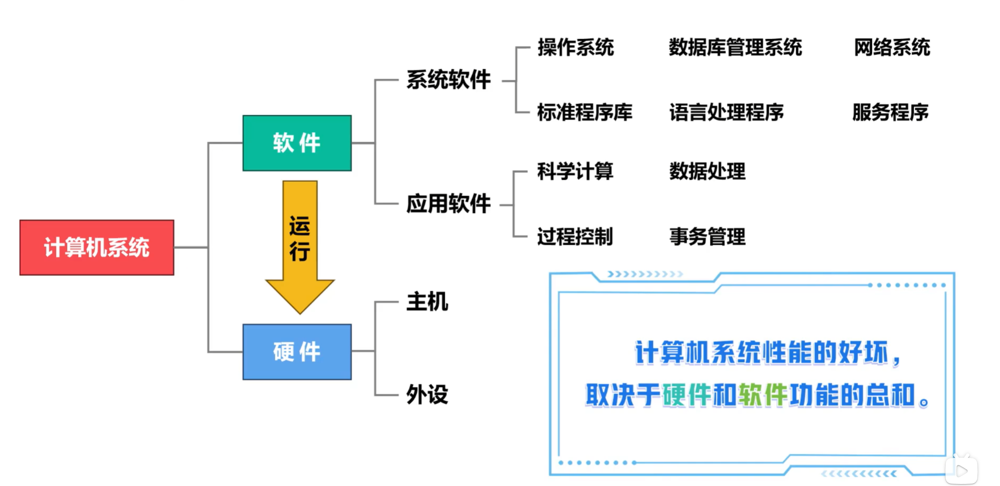

### 1. 核心硬件组件及功能、安装方式

| 硬件组件              | 视频中提及的作用 / 特点                | 安装位置 / 要求                                              |
| --------------------- | -------------------------------------- | ------------------------------------------------------------ |
| CPU                   | 计算机核心运算部件                     | 安装到主板上的 CPU 插座                                      |
| 内存                  | 数据临时存储部件                       | 安装到主板上的内存插槽                                       |
| 显卡                  | 图形处理相关部件                       | 安装到主板上的 PCIE 接口插槽                                 |
| 固态硬盘              | 数据长期存储部件（相较于机械硬盘更快） | 安装到主板上的 M.2 接口插槽                                  |
| 主板                  | 硬件连接核心载体                       | 所有核心硬件（CPU、内存、显卡、固态硬盘）需安装到其对应插槽 / 插座 |
| 散热器（风冷 / 水冷） | 为 CPU 散热，保证 CPU 正常工作         | 需为 CPU 安装 “合适的” 风冷或水冷散热器                      |
| 电源                  | 为整个硬件系统供电                     | 需选择 “功率合适” 的电源，且需将配套电源线连接到主板相应供电接口、显卡相应供电接口（部分发烧友会定制电源线以优化布线美观） |
| 机箱                  | 容纳硬件，提供保护与通风               | 需将组装好的硬件（含主板、电源等）安装到 “通风较好” 的机箱内 |
| 输入输出设备          | 人机交互部件                           | 需搭配键盘（输入）、鼠标（输入）、显示器（输出）等           |

### 2. 硬件组装流程

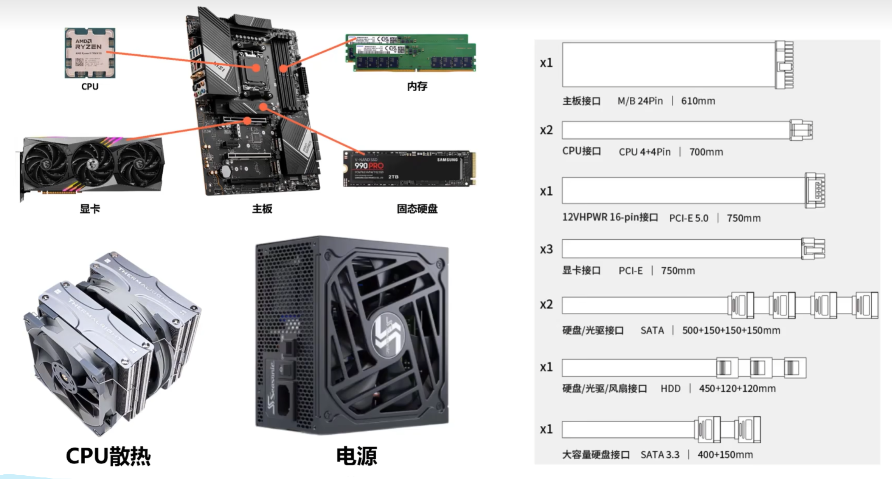

1. 将 CPU、内存、显卡、固态硬盘分别安装到主板对应插座 / 插槽；

1. 为 CPU 安装风冷或水冷散热器；

1. 连接电源与主板、显卡的供电接口；

1. 将上述硬件整体安装到通风较好的机箱内；

1. 搭配键盘、鼠标、显示器等输入输出设备，完成硬件组装。

## 三、计算机软件系统

1. **软件的作用**：硬件组装完成后，需通过安装软件，使计算机能 “解决实际问题”；

1. **软件分类（视频提及范畴）**：

- 操作系统：计算机基础软件，管理硬件资源、提供软件运行环境；

- 各类应用软件：满足特定需求的软件（如办公软件、设计软件等）。


# 1-2 计算机的发展

## 一、课程核心前提定义

本课程中提及的 “计算机”，**除特别指明外，具体是指电子数字计算机**（明确研究范畴，排除其他类型计算机）。

## 二、计算机发展的奠基性理论与人物

### 1. 图灵与图灵机（1936 年）

- **核心贡献**：英国数学家艾伦・图灵在论文《论可计算数及其在判定问题上的应用》中，提出 “图灵机” 这一理想计算模型。

- **图灵机构成**：由 “一条带子、一个读写头、一个控制装置” 三部分组成，能执行 “任何给定的计算”（即任何可能的任务）。

- **历史意义**：奠定现代计算机基础 —— 现代计算机本质是通过程序完成设定任务，核心逻辑源于图灵机思想。

- **与冯诺依曼的关联**：1936 年图灵在普林斯顿高等研究院进修时结识冯诺依曼，冯诺依曼后续强调 “存储程序思想主要来自图灵”（冯诺依曼计算机特点将在下节课介绍）。

### 2. 香农与数字电路基础（1938 年）

- **核心贡献**：美国数学家、信息论创始人香农在硕士论文《继电器和开关电路的符号分析》中，揭示 “布尔代数与开关电路之间的联系”。

- **历史意义**：为数字电路的设计与分析奠定坚实数学基础，支撑计算机科学、电子工程、信息技术的后续发展。

## 三、早期电子数字计算机的发展（第一台之争）

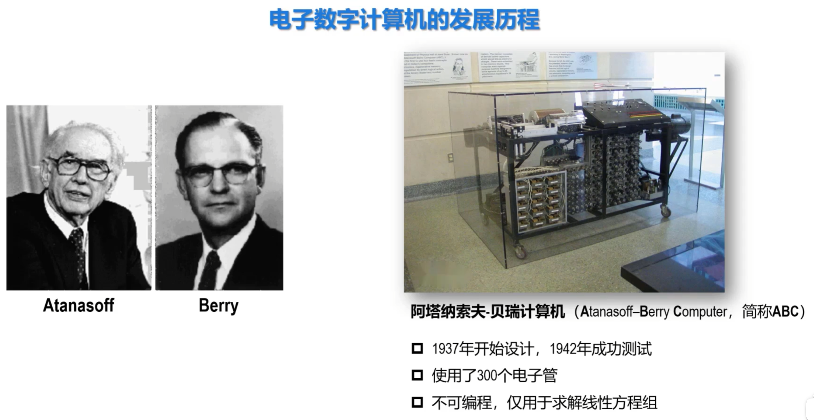

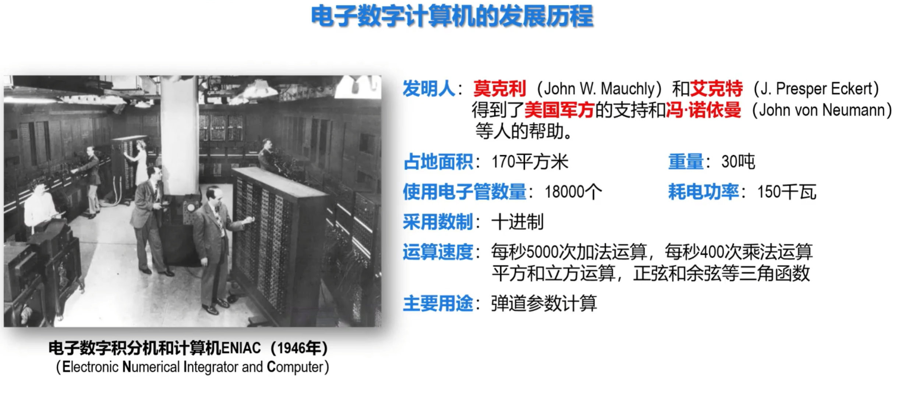

| 计算机名称                     | 研制时间     | 研制人员                             | 核心参数与特点                                               | 历史地位与争议                                               |
| ------------------------------ | ------------ | ------------------------------------ | ------------------------------------------------------------ | ------------------------------------------------------------ |
| 阿塔纳索夫 - 贝瑞计算机（ABC） | 1937-1942 年 | 阿塔纳索夫（副教授）、贝瑞（研究生） | 1. 使用 300 个电子管；2. 不可编程；3. 仅用于求解线性方程组（为样机，未完全实现构想） | 1. 最初未获广泛认可；2. 1973 年美国明尼苏达地区法院宣判：推翻莫克利的 ENIAC 专利，**国际计算机界公认 ABC 为第一台电子数字计算机**，阿塔纳索夫为真正发明人 |
| 埃尼阿克（ENIAC）              | 1946 年      | 莫克利、艾克特                       | 1. 使用 18000 个电子管；2. 占地面积 170㎡，重 30 吨，耗电 150 千瓦；3. 采用十进制，运算速度：每秒 5000 次加法、400 次乘法及平方 / 立方 / 正弦 / 余弦运算；4. 实用化机器，用于弹道参数计算（计算时间从 20 分钟缩短至 30 秒） | 1. 研制后立即申请并获得美国专利；2. 引发 “第一台电子数字计算机” 头衔之争；3. 最终专利被吊销，地位让位于 ABC |

## 四、电子数字计算机的硬件发展四阶段（按电子器件划分）

| 发展阶段                         | 逻辑元件                      | 运算速度               | 存储设备                                                     | 输入输出设备                   | 软件系统                                                     | 核心特点与应用领域                                           |
| -------------------------------- | ----------------------------- | ---------------------- | ------------------------------------------------------------ | ------------------------------ | ------------------------------------------------------------ | ------------------------------------------------------------ |
| 第一代（电子管计算机）           | 电子管                        | 每秒几千次～几万次     | 1. 主存：水银延迟线、磁鼓、磁芯；2. 辅存：无明确提及         | 穿孔卡片、穿孔纸带             | 1. 仅用机器语言编制程序；2. 无操作系统                       | 1. 体积大、功耗高、速度慢、可靠性差；2. 主要用于科学计算     |
| 第二代（晶体管计算机）           | 晶体管                        | 每秒几十万次～数百万次 | 1. 主存：磁芯存储器；2. 辅存：磁鼓、磁带                     | 穿孔卡片、打印机               | 1. 主要用汇编语言；2. 开始使用 Fortran、Cobo 等高级语言；3. 出现单道批处理系统 | 1. 体积小、速度快、功耗低、可靠性高（对比电子管）；2. 应用领域扩展 |
| 第三代（集成电路计算机）         | 集成电路（逻辑元件 + 存储器） | 每秒数百万次～数千万次 | 1. 主存：半导体存储器；2. 辅存：以磁盘为主                   | 键盘、鼠标、显示器（首次出现） | 1. 高级语言进一步发展（出现 B 语言，为 C 语言前身）；2. 出现多道批处理系统、分时系统 | 1. 体积、功耗显著减小，可靠性大幅提高；2. 出现巨型机、大型机、小型机并行发展趋势；3. 计算机类型多样化、系列化，软件与外设快速发展 |
| 第四代（超大规模集成电路计算机） | 超大规模集成电路              | 每秒数十亿次～数千亿次 | 1. 主存：半导体存储器；2. 辅存：半导体存储器（容量显著提升） | 多样化外设（继承前三代并升级） | 1. 出现 C、C++、Java、Python 等多种高级语言；2. 发展出现代操作系统 | 1. 性能极致提升，体积进一步缩小；2. 应用覆盖全领域，成为通用工具 |

## 五、摩尔定律（半导体发展核心预测）

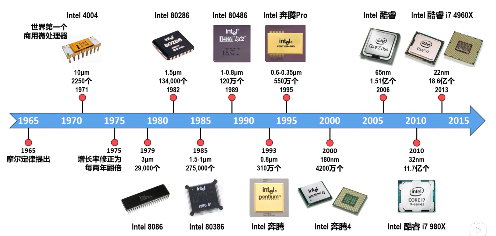

- **提出背景**：1965 年英特尔创始人之一戈登・摩尔，接受美国电子杂志采访时对半导体集成电路发展趋势的预测。

- **核心内容**：

1. 半导体集成电路上可容纳的晶体管数量，大约每 18~24 个月增加一倍；

1. 处理器性能大约每两年翻一倍；

1. 处理器价格同时下降为之前的一半。

- **发展现状**：

1. 过去 50 多年，摩尔定律对半导体芯片工业预测基本准确；

1. 近年因半导体工艺接近物理极限（设计、制造、封装、测试技术瓶颈），发展逐渐偏离定律：2013 年起，晶体管数量翻倍周期放缓至 3 年。

## 六、计算机软件的发展历程

### 1. 机器语言（早期）

- **技术特点**：用二进制代码表示机器指令，计算机可直接识别执行。

- **局限性**：

1. 对编程人员要求高（需熟悉计算机硬件结构）；

1. 可读性差、易出错、难排错。

### 2. 汇编语言（机器语言改进）

- **技术特点**：用 “便于记忆、能表示指令功能的助记符” 编写程序（如用 ADD 表示加法）。

- **局限性**：仍为 “面向机器的语言”，编程前需熟悉对应计算机的指令集，便利性有限。

### 3. 高级语言（面向用户需求）

- **核心目标**：让不熟悉硬件结构与指令集的人也能便捷编程（接近人类自然语言）。

- **关键里程碑语言**：

- 第一个高级语言：Fortran；

- 最简单易上手的高级语言：BASIC；

- 编程语言里程碑：Pascal；

- 现代程序语言革命起点：C 语言；

- 面向对象语言（上世纪 90 年代至今主流）：C++、Java、Python（核心特点：封装性、继承性、多态性）。

### 4. 操作系统发展

- **伴随硬件革新**：操作系统随计算机硬件的四阶段发展而迭代。

- **主流操作系统**：20 世纪 70 年代后涌现 UNIX、DOS、Windows、Linux、Mac OS（详细内容将在操作系统课程中讲解，本课程不展开）。

## 七、当前计算机系统的发展趋势与实例

### 1. 两极化发展趋势

- **一极：微型化**：注重低功耗下的性能，具备多用途（如个人电脑、智能手机、嵌入式设备）；

- **另一极：巨型化 / 智能化**：向超高速并行处理、智能化方向发展（如超级计算机）。

### 2. 我国超级计算机实例（神威太湖之光）

- **核心性能**：每秒可进行 9.3 亿亿次浮点运算；

- **考试关联**：该知识点在**2021 年 408 计算机学科联考第 12 题（选择题）** 中考察（后续 “计算机系统性能指标” 课程将再次涉及）。

## 八、视频中的实践任务与个人案例

### 1. 讲师个人计算机案例（1992 年）

- 配置参数：CPU 为 80386SX-33（主频 33MHz）、内存 2MB、硬盘 40MB；

- 操作系统：微软 DOS 5.0（与现代计算机配置差异显著，体现技术发展速度）。

### 2. 布置给学生的实践任务

- 要求：查询当前个人使用计算机的以下参数：

1. CPU 具体型号；

1. CPU 制程工艺（单位：纳米）；

1. CPU 集成晶体管数量。

## 九、视频中明确提及的例题（考试关联）

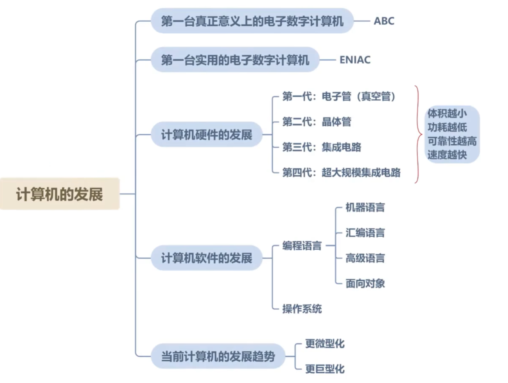

- **例题内容**：我国超级计算机 “神威太湖之光” 的性能（每秒 9.3 亿亿次浮点运算）；

- **考试类型**：2021 年全国硕士研究生入学统一考试计算机科学与技术学科联考（408）第 12 题（选择题）；

- **考察重点**：计算机系统性能指标（浮点运算速度）与当代超级计算机发展现状；

- **后续关联**：将在 “1-7 计算机系统的性能指标 —（2）与运算速度相关的性能指标” 课程中再次考察该知识点。


# 1-3 计算机硬件

### 1.2 EDVAC 的诞生与冯诺依曼的贡献

- 背景：埃尼阿克硬件实现阶段，冯诺依曼（来自曼哈顿计划）加入莫克利、艾克特团队，提出 “程序通过穿孔介质输入后，长期存储在机器内部存储器” 的设想；

- 项目推进：1944 年（埃尼阿克未建成时）提交 “存储程序新机器” 申请，获美军 10 万美元预算，新机器命名为**电子离散变量自动计算机（EDVAC）**；

- 冯诺依曼的核心贡献：1945 年 6 月在列车上撰写《EDVAC 报告书》第一份草案（101 页），不仅细化 EDVAC 设计，更奠定现代计算机发展方向，提炼出 “冯诺依曼思想”。

## 二、冯诺依曼计算机的核心特点

1. **数据与指令的表示形式**：构成程序的指令和数据均采用**二进制**表示；

1. **存储方式**：指令和数据共同存放在存储器中，按**地址访问**存储器中的内容；

1. **指令执行顺序**：指令在存储器中按顺序存放，一般情况下**顺序执行**；

1. **指令结构**：指令由 “操作码” 和 “地址码” 组成：

- 操作码：表示执行何种操作（如加法、减法）；

- 地址码：表示操作数在存储器中的位置；

1. **结构中心**：以**运算器为中心**，输入设备、输出设备与存储器之间的数据传送，必须通过运算器完成。

## 三、计算机硬件五大部件及其功能

冯诺依曼计算机硬件由**运算器、控制器、存储器、输入设备、输出设备**五大部件组成，各部件功能及关联如下：

### 3.1 输入设备

- 核心功能：将人类熟悉的信息形式（如文字、图像、声音）转换为计算机能识别的二进制信息形式；

- 常见示例：键盘、鼠标、扫描仪、摄像头。

### 3.2 输出设备

- 核心功能：将计算机的运算结果（二进制）转换为人类熟悉的信息形式（如视觉、听觉信息）；

- 常见示例：显示器、打印机。

### 3.3 存储器

- 分类：分为**主存储器（内存储器，简称内存）** 和**辅助存储器（外存储器，简称外存）**，两者差异如下：

| 类型       | 功能特点                         | 与 CPU 的交互方式                   | 常见示例                  |
| ---------- | -------------------------------- | ----------------------------------- | ------------------------- |
| 主存储器   | 存放当前运行的程序和数据         | 可直接与 CPU 交换信息               | 装机用的内存条            |
| 辅助存储器 | 辅助主存存储更多信息（长期存储） | 信息必须调入主存后，才能被 CPU 访问 | 机械硬盘、固态硬盘（SSD） |

### 3.4 运算器

- 核心组件：**算术逻辑单元（ALU）**；

- 核心功能：执行**算术运算**（如加、减、乘、除）和**逻辑运算**（如与、或、非）；

- 附加组件：包含若干相关寄存器（具体内容后续 “计算机基本工作原理” 课程讲解）。

### 3.5 控制器

- 核心组件：**控制单元（CU）**；

- 核心功能：

1. 解释存储器中的指令；

1. 向其他四大部件发送控制信号，命令其执行相应任务；

1. 接收其他部件通过 “反馈线” 传回的状态（如任务完成情况），调整控制逻辑；

1. 控制输入输出设备（IO 设备）完成 IO 操作；

- 附加组件：包含若干相关寄存器（后续课程讲解）。

### 3.6 关键概念延伸

- **CPU（中央处理器）**：大规模集成电路工艺出现后，运算器与控制器因逻辑、电路联系紧密，被集成在同一芯片上，形成 CPU；

- **主机**：CPU + 主存储器（内存）的组合；

- **外部设备**：输入设备、输出设备（合称 IO 设备） + 辅助存储器（外存）的组合；

- **总线**：五大部件之间的连接通道，包含 “数据线”（实线箭头，传输数据）、“控制线” 和 “反馈线”（虚线箭头，传输控制信号与状态反馈），具体内容后续 “总线” 章节讲解。

## 四、冯诺依曼结构的缺点与现代计算机结构优化

### 4.1 冯诺依曼结构（以运算器为中心）的缺点

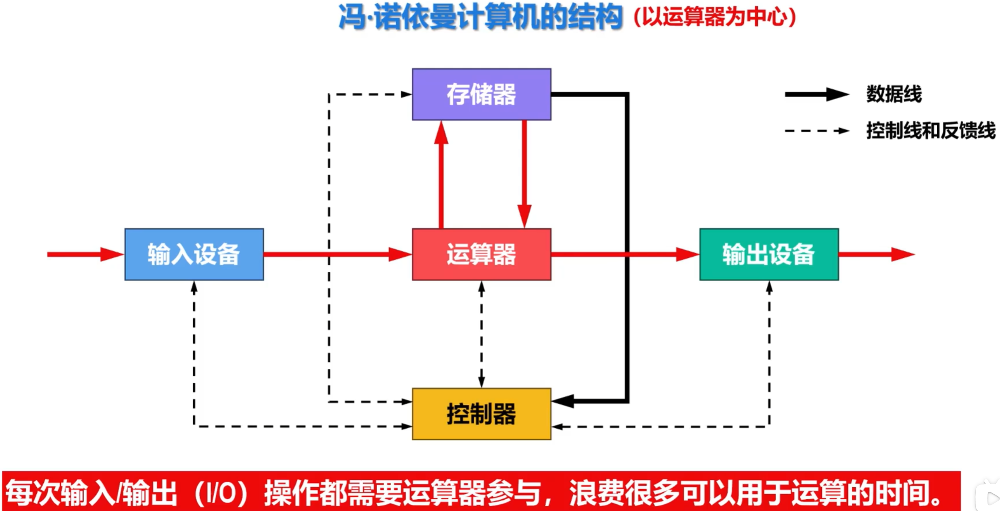v

- 数据流向局限：输入输出（IO）操作必须通过运算器完成；

- 性能浪费：IO 操作占用运算器资源，导致运算器无法同时进行算术 / 逻辑运算，浪费运算时间。

### 4.2 现代计算机结构优化（以存储器为中心）

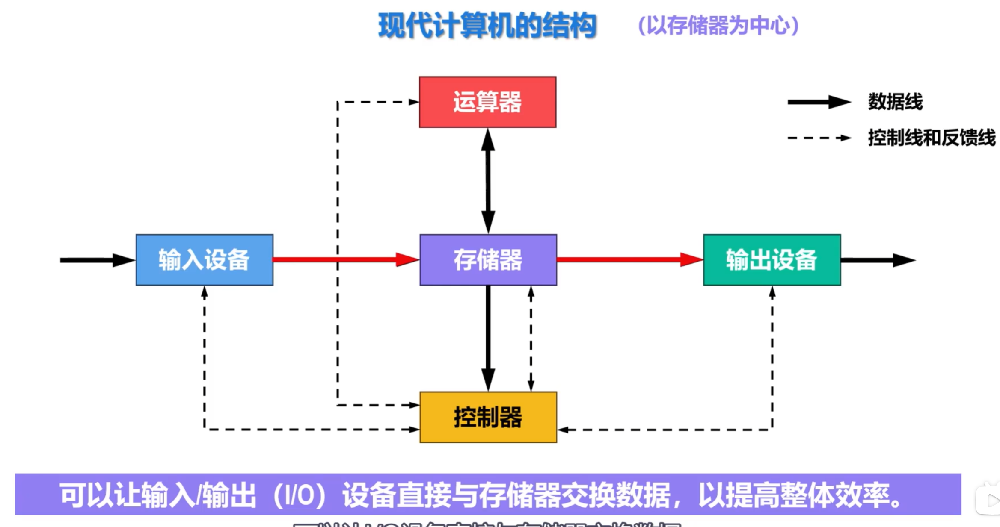

- 核心改进：输入输出设备可**直接与存储器交换数据**，无需经过运算器；

- 优势：释放运算器资源，让运算器专注于算术 / 逻辑运算，提升整机效率；

- 数据流向示例：

- 冯诺依曼结构：输入设备 → 运算器 → 存储器；存储器 → 运算器 → 输出设备；

- 现代结构：输入设备 → 存储器；存储器 → 输出设备（运算器仅参与运算过程）。

## 五、视频中的例题及解析

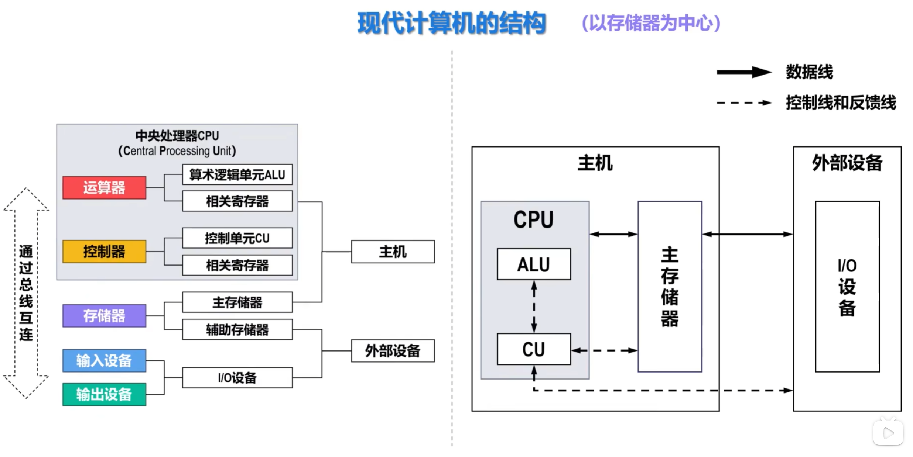

### 习题 1

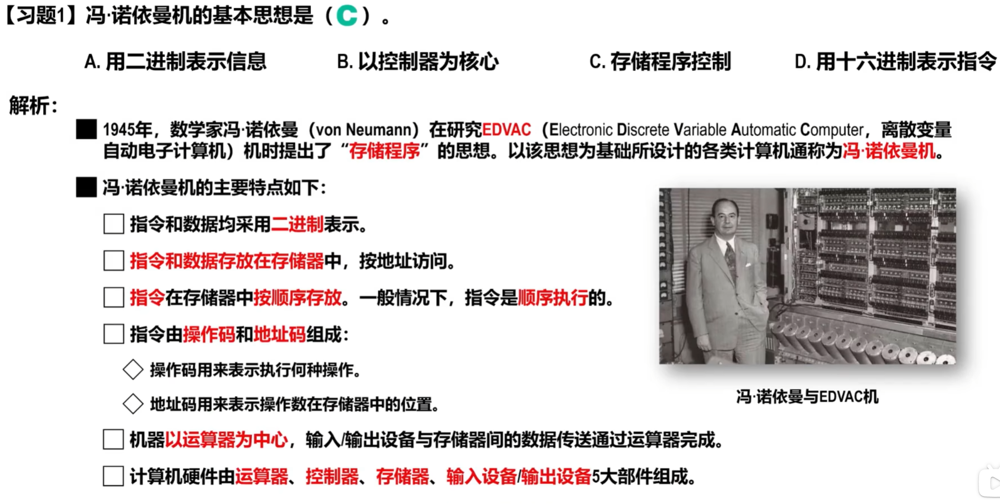

- （根据视频描述还原核心考点：冯诺依曼计算机特点或硬件组成）

- 答案：选项 C

- 解析：视频提及 “相信同学们都能正确完成”，未展开额外解析，核心考察冯诺依曼结构基本特征（如二进制、存储程序、五大部件等）。

### 习题 2

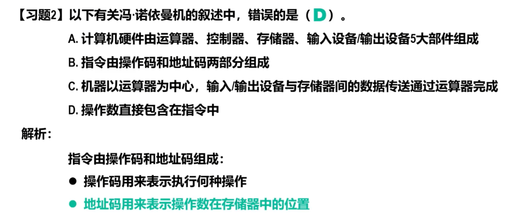

- （核心考点：指令的结构与功能）

- 答案：选项 D

- 解析：指令由 “操作码” 和 “地址码” 组成，其中：

- 操作码：用于表示 “执行何种操作”（如加法、读取数据）；

- 地址码：用于表示 “操作数在存储器中的位置”；

- 选项 D 因对 “操作码” 或 “地址码” 的功能描述错误，故为正确答案。

### 习题 3

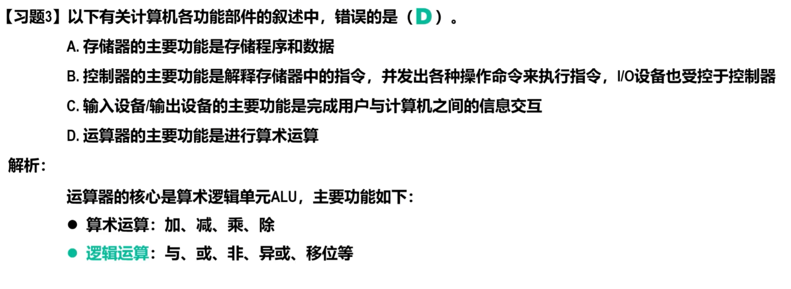

- （核心考点：运算器的核心功能）

- 答案：选项 D

- 解析：运算器的核心是算术逻辑单元（ALU），其功能是 “同时进行算术运算（如加减乘除）和逻辑运算（如与、或、非）”，而非 “仅进行算术运算”；选项 D 因遗漏 “逻辑运算” 的描述，故为正确答案。

### 习题 4


- （根据视频描述还原核心考点：主机 / 外部设备的定义、存储器分类等）

- 答案：选项 A

- 解析：视频提及 “相信同学们都能正确完成”，未展开额外解析，核心考察 “主机 = CPU + 内存”“外存需调入内存才能被 CPU 访问” 等基础概念。

### 习题 5

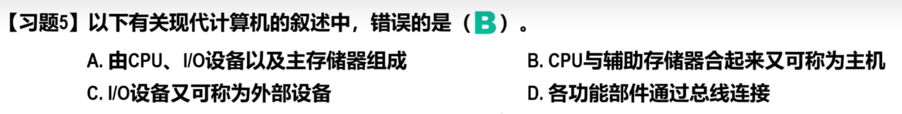

- （根据视频描述还原核心考点：现代计算机结构、IO 设备功能等）

- 答案：选项 B

- 解析：视频提及 “相信同学们都能正确完成”，未展开额外解析，核心考察 “现代计算机以存储器为中心”“IO 设备直接与存储器交互” 等优化特点。

### 408 真题

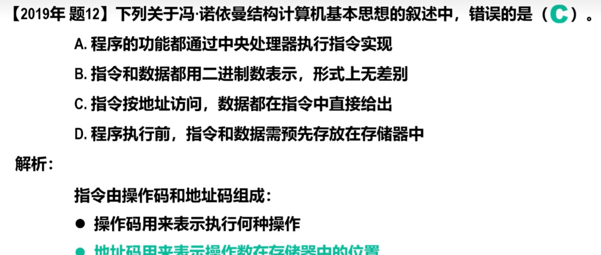

- （核心考点：冯诺依曼计算机特点或硬件部件功能，与习题 2 考点关联）

- 答案：选项 C

- 解析：视频指出 “若认真完成习题 2，可正确完成本题”，推测考点为 “指令结构（操作码 / 地址码功能）”，选项 C 因符合指令结构的正确描述，故为正确答案。

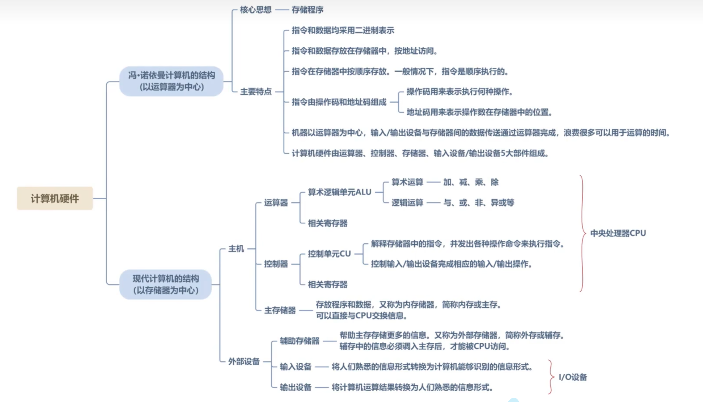


#  1-4 计算机软件

### 1.1 软件的核心价值与定义

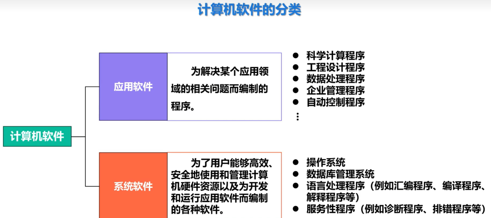

- 硬件的局限性：仅包含计算机硬件的系统无任何使用价值，无法直接解决应用问题

- 软件的作用：需通过编写**程序**（软件的核心组成），让程序在硬件上运行，进而解决各类应用问题

- 软件系统定义：一台计算机中的**全部程序和数据**共同构成计算机软件系统

### 1.2 软件的两大分类（系统软件、应用软件）

#### 1.2.1 系统软件

- 核心定位：介于计算机硬件系统与应用软件之间，与具体应用场景关联度低

- 核心目标：为用户**高效、安全地使用和管理硬件资源**，以及为**开发、运行应用软件**提供支撑

- 具体类型及实例：

1. 操作系统：系统软件的核心（后续单独展开）

1. 数据库管理系统：用于高效管理海量数据的系统软件

1. 语言处理程序：处理程序设计语言的工具，包括：

- 汇编程序（汇编器）：将汇编语言程序翻译成机器语言程序

- 编译程序（编译器）：将高级语言程序翻译成汇编语言程序或直接翻译成机器语言程序

- 解释程序（解释器）：将高级语言程序逐条翻译成机器指令并执行

1. 服务性程序：辅助计算机维护与调试的程序，如诊断程序（检测硬件 / 软件故障）、排错程序（定位并修复程序错误）

#### 1.2.2 应用软件

- 核心目标：为解决**特定应用问题**而编制的程序

- 具体实例：

- 专业领域应用：科学计算程序（如数值模拟）、工程设计程序（如 CAD 软件）、数据处理程序（如数据分析工具）、企业管理程序（如 ERP 系统）、自动控制程序（如工业设备控制）

- 日常场景应用：网页浏览器（如 Chrome、Edge）、办公软件（如 Word、Excel）、游戏软件、视频播放软件（如 PotPlayer、VLC）

- 发展趋势：随着计算机应用领域扩大，应用软件的种类持续增多

## 二、程序设计语言的演进（按历史阶段）

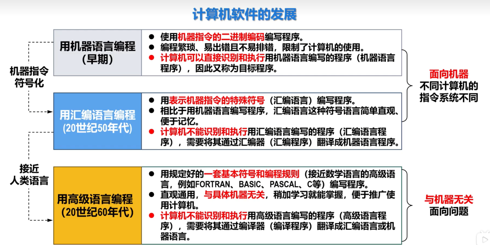

### 2.1 机器语言（电子数字计算机早期）

- 技术本质：使用**机器指令的二进制编码**编写程序

- 核心特点：

- 缺点：编程过程繁琐、极易出错、错误难以排查，严重限制计算机的普及使用

- 优点：计算机可**直接识别和执行**，对应的程序称为 “目标程序”，执行速度是所有语言中最快的

- 适用场景：仅用于早期对性能要求极高且硬件简单的计算机系统

### 2.2 汇编语言（机器语言的改进）

- 产生背景：为解决机器语言 “可读性差、易出错、难排错” 的痛点

- 技术本质：使用**便于记忆的助记符**（如 ADD 表示加法、SUB 表示减法）及对应编程规则构成的语言

- 核心特点：

- 优势：相比机器语言，降低了编程难度、简化了编程流程、编程灵活性提升

- 局限性：

1. 面向机器：程序由助记符表示的机器指令构成，编程前需熟练掌握目标计算机的**指令集**

1. 不可直接执行：计算机无法识别助记符，必须通过 “汇编程序（汇编器）” 翻译成机器语言程序后才能执行

- 本质定位：机器语言的 “符号化版本”，仍与具体硬件强关联

### 2.3 高级语言（面向使用者的语言）

- 产生背景：为让**不熟悉硬件结构和指令集**的普通用户也能便捷编程

- 技术本质：语法接近**人类自然语言**，面向使用者而非具体机器，与计算机硬件无关

- 核心特点：

- 优势：学习门槛低，用户稍加学习即可掌握，极大推动了计算机的普及

- 局限性：计算机无法直接识别和执行，必须通过翻译程序处理

- 主流实例：Fortran、Basic、Pascal、C、C++、Java、Python

- 执行方式（依赖翻译程序）：

1. 编译执行（编译型语言）：

- 流程 1：高级语言程序 → （编译程序）→ 汇编语言程序 → （汇编程序）→ 机器语言程序

- 流程 2：高级语言程序 → （编译程序）→ 直接生成机器语言程序

1. 解释执行（解释型语言）：

- 流程：高级语言程序 → （解释程序）→ 按执行顺序逐条翻译成机器指令并立即执行，**不产生完整的机器语言程序**

## 三、语言翻译程序的分类与功能

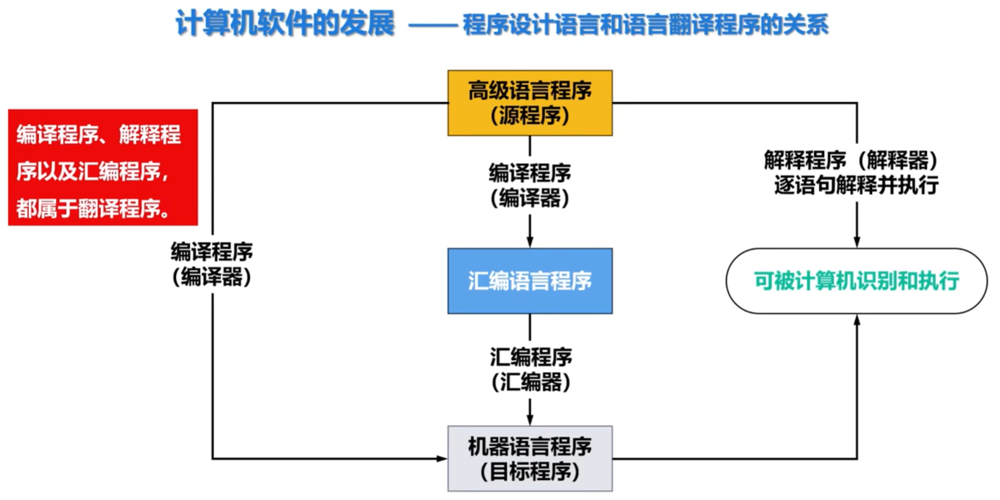

### 3.1 翻译程序的核心定义

用于将 “源语言”（如汇编语言、高级语言）编写的 “源程序”，翻译成 “目标语言”（如机器语言）编写的 “目标程序”（或直接执行）的软件，是连接人类编程习惯与计算机硬件的桥梁。

### 3.2 三大类翻译程序的功能对比

| 翻译程序类型       | 输入（源程序） | 输出结果                             | 核心工作方式                                                 |
| ------------------ | -------------- | ------------------------------------ | ------------------------------------------------------------ |
| 汇编程序（汇编器） | 汇编语言程序   | 机器语言程序                         | 一次性将整个汇编程序转换为机器语言程序                       |
| 编译程序（编译器） | 高级语言程序   | 汇编语言程序 / 机器语言程序          | 一次性将完整高级语言程序转换为低级语言程序，后续可重复执行目标程序 |
| 解释程序（解释器） | 高级语言程序   | 逐条执行的机器指令（无完整目标程序） | 边翻译边执行，翻译一条执行一条，不生成独立的可执行文件       |

### 3.3 GCC 编译器编译 C 语言源程序的实例

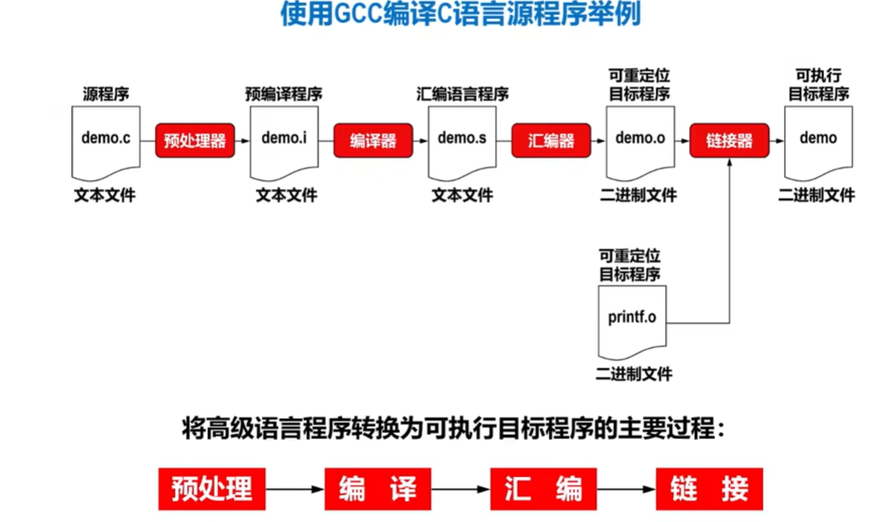

- 完整流程：**预处理 → 编译 → 汇编 → 链接**

- 各阶段作用：

1. 预处理：处理源程序中的宏定义（如#define）、头文件包含（如#include）等指令，生成预处理后的源文件

1. 编译：将预处理后的源文件翻译成汇编语言程序

1. 汇编：将汇编语言程序翻译成机器语言目标文件（.o 文件）

1. 链接：将多个目标文件及所需的库文件合并，生成可执行程序（如 Windows 下的.exe 文件）

- 特点：相比基础的 “编译 + 汇编” 流程，增加了 “预处理”（统一代码环境）和 “多目标程序链接”（整合多模块）环节

## 四、操作系统的核心作用

### 4.1 所属类别

属于**系统软件**，是计算机系统中硬件与软件的 “中间层”，也是用户使用计算机的 “接口层”。

### 4.2 核心功能

1. 基础操作支撑：为汇编语言、高级语言的使用和实现提供必要的基本操作（如内存分配、I/O 控制）

1. 全资源管理：

- 硬件资源管理：控制并管理 CPU（调度任务）、内存（分配空间）、外部设备（如硬盘、打印机的读写控制）

- 软件资源管理：管理编译程序、应用程序等软件的运行权限和资源占用

1. 用户便捷性保障：为用户提供友好的使用接口，降低直接操作硬件的复杂度

### 4.3 系统软件的扩展

随着计算机应用场景拓展，除操作系统外，还出现了数据库管理系统（如 MySQL、Oracle）、网络系统（如 TCP/IP 协议栈）等其他类型的系统软件。

## 五、软件的发展方向

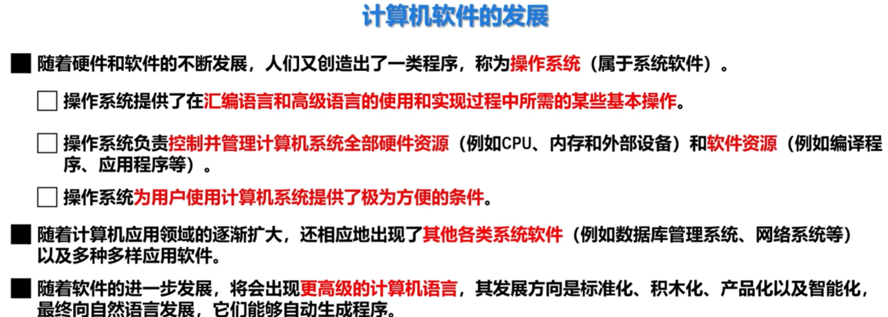

- 语言演进方向：向更高级的计算机语言发展

- 核心趋势：

1. 标准化：语言语法、接口规范统一，实现跨平台兼容

1. 积木化：支持组件复用（如函数库、框架），降低开发成本

1. 产品化：形成成熟的开箱即用软件产品，减少定制开发工作量

1. 智能化：具备自动编程、错误修复能力

- 终极目标：发展为**自然语言编程**，实现 “用户用自然语言描述需求，系统自动生成程序”

## 六、视频中的练习题与 408 真题

### 6.1 基础练习题（习题一、习题二）

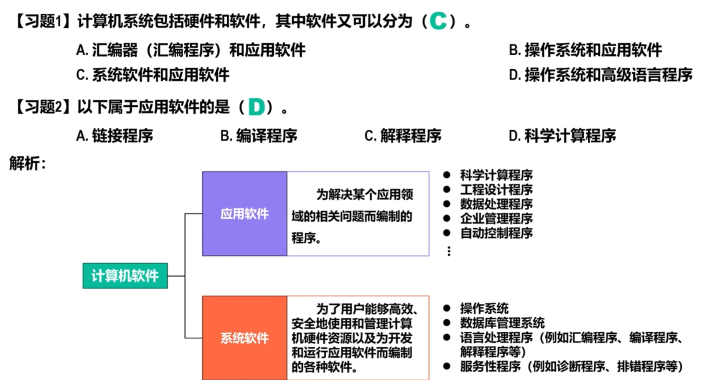

- 答题要求：视频提示 “请同学们暂停播放视频，思考一下，然后给出你的答案”

- 答案呈现：视频展示 “这是正确答案，相信同学们都能正确完成，我们就不再赘述了”（无具体题目内容，按视频表述总结）

### 6.2 基础练习题（习题三、习题四）

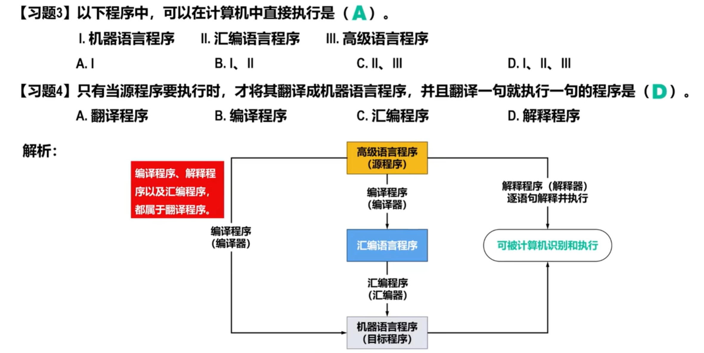

- 答题要求：与习题一、习题二一致，“请同学们暂停播放视频，思考一下，然后给出你的答案”

- 答案呈现：视频展示 “这是正确答案，相信同学们都能正确完成，我们就不再赘述了”（无具体题目内容，按视频表述总结）

### 6.3 408 考研真题（多道基础真题）

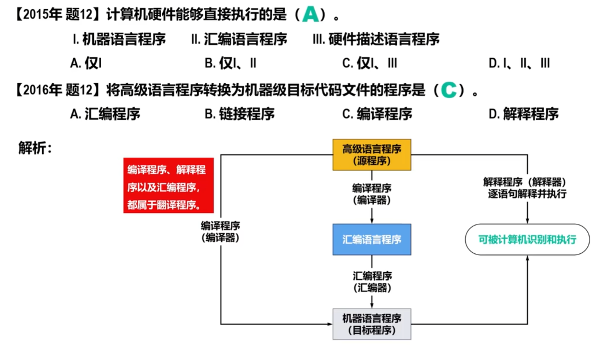

- 答题要求：视频提示 “接下来请同学们挑战几道 408 真题，请同学们暂停播放视频思考一下，然后给出你的答案”

- 答案呈现：视频展示 “这是正确答案，相信同学们都能正确完成，我们就不再赘述了”（无具体题目内容，按视频表述总结）

### 6.4 2022 年 408 考研真题

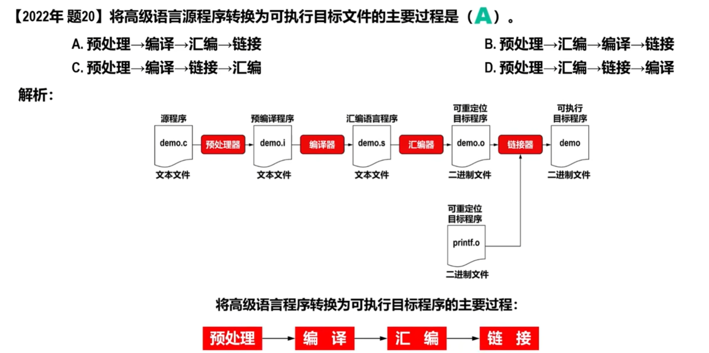

- 答题要求：视频提示 “再来看 2022 年的这道 408 真题，请同学们暂停播放视频思考一下，然后给出你的答案”

- 答案呈现：视频展示 “这是正确答案，相信同学们都能正确完成，我们就不再赘述了”（无具体题目内容，按视频表述总结）


# 1-5 计算机系统的层次结构

## 一、计算机系统层次结构的核心思想

1. **分层的目的**：计算机系统结构复杂，为简化对其的研究与实现，采用分层思想将其划分为层次结构系统。

1. **分层的核心特点**：

- 每层向其上层提供**简洁、抽象的接口**，屏蔽底层实现细节；

- 每层的实现细节对其上层而言是 “透明” 的（即上层无需了解底层如何实现）；

- 计算机解决实际问题的过程，本质是层次结构中各层**逐层转换**的过程。

1. **与计算机网络分层的区别**：计算机网络体系结构的分层有明确、统一的标准（如 OSI 七层模型、TCP/IP 四层模型），而计算机系统的分层方式**无统一标准**（本课程采用六层次划分方案）。

## 二、计算机系统的六层次结构（自下而上，第 1 层至第 6 层）

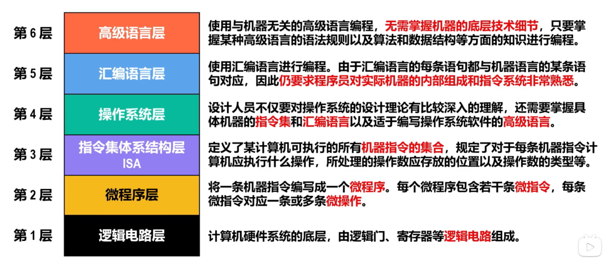

### （一）层次划分总体说明

- **硬件层**：第 1-3 层，是计算机系统的硬件基础，由硬件工程师（第 1 层）或计算机硬件系统架构师（第 2-3 层）设计；

- **软件层**：第 4-6 层，构建于硬件层之上，由程序员设计；

- **课程重点范围**：本课程主要讨论第 1-3 层的相关原理与设计思想，第 4-6 层内容由操作系统、汇编语言、高级语言程序设计等软件课程讲授；

- **层次之上的应用**：六层次结构之上，是面向最终用户的各类应用（最终用户通过这些应用程序解决具体问题）。

### （二）各层次详细内容

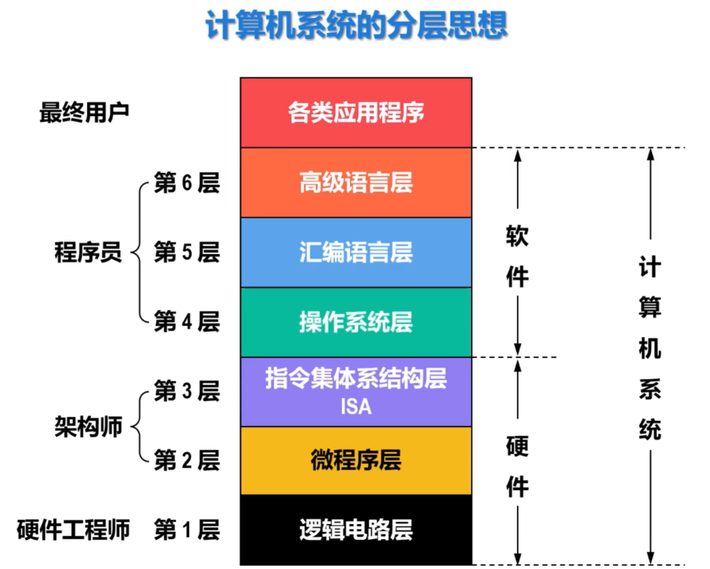

#### 1. 第 1 层：逻辑电路层

- **定位**：计算机硬件系统的最底层，是硬件的物理基础；

- **组成**：由逻辑门（如与门、或门、非门）、寄存器等基础逻辑电路构成；

- **前置知识关联**：相关内容在 “数字电路” 课程中已学习；

- **设计人员**：硬件工程师。

#### 2. 第 2 层：微程序层

- **核心概念定义**：

- 微程序：将一条机器指令拆解并编写成一段 “微程序”（机器指令的底层实现载体）；

- 微指令：每段微程序包含若干条 “微指令”，是微程序的基本执行单元；

- 微操作：每条微指令对应一条或多条 “微操作”（硬件可直接执行的最小操作，如 “寄存器数据写入内存”“ALU 执行加法”）；

- **关键硬件组件**：CPU 内部集成 “控制存储器”，用于存放所有机器指令对应的微程序；

- **工作流程**：当 CPU 执行某条机器指令时，会先在控制存储器中查找该机器指令对应的微程序，然后逐条取出微指令，控制硬件执行对应的微操作，最终完成该机器指令的功能；

- **设计人员**：计算机硬件系统架构师。

#### 3. 第 3 层：指令集体系结构（ISA）

- **核心定义**：定义一台具体计算机可执行的**所有机器指令的集合**，是硬件与软件的 “接口层”（软件通过 ISA 调用硬件功能）；

- **指令规定内容**：明确每条机器指令的三个核心要素 ——

1. 需执行的操作（如加法、减法、数据传送）；

1. 操作数的存放位置（如寄存器、内存地址）；

1. 操作数的类型（如整数、浮点数）；

- **机器语言程序与 ISA 的关系**：机器语言程序是符合 ISA 规定的多条机器指令的有序序列，计算机硬件执行机器语言程序的过程，就是依次执行程序中每条机器指令的过程；

- **设计人员**：计算机硬件系统架构师。

#### 4. 第 4 层：操作系统层

- **核心功能**：对计算机的硬件资源（CPU、内存、外部设备等）和软件资源（编译程序、应用程序等）进行**统一管理和调度**；

- **核心作用**：提高计算机系统的使用效率，降低用户使用硬件的门槛（无需直接操作底层硬件）；

- **设计要求**：操作系统设计人员需满足三个条件 ——

1. 深入理解操作系统设计理论；

1. 熟悉具体计算机的硬件技术细节；

1. 掌握汇编语言、指令集及 C 语言（适合编写操作系统的高级语言）；

- **设计人员**：程序员。

#### 5. 第 5 层：汇编语言层

- **使用者**：汇编语言程序设计人员；

- **编程特点**：使用 “助记符” 编写程序（汇编语言），汇编语言是 “面向机器的语言”，其每条语句与机器语言的某一条指令**一一对应**（如汇编语句ADD AX,BX对应一条 “AX 与 BX 相加” 的机器指令）；

- **编程要求**：程序员需熟悉实际计算机的内部组成（如寄存器结构）和指令系统（ISA 定义的机器指令）；

- **设计人员**：程序员。

#### 6. 第 6 层：高级语言层

- **使用者**：高级语言程序设计人员；

- **编程特点**：使用 “与机器无关” 的高级语言（如 C、Java、Python）编程，语法接近人类自然语言；

- **编程要求**：无需掌握机器底层技术细节，仅需掌握 ——

1. 所用高级语言的语法规则；

1. 算法设计与数据结构知识；

- **核心产出**：为上层最终用户编写各类应用程序（如办公软件、游戏软件）；

- **设计人员**：程序员。

## 三、软件与硬件的逻辑功能等价性

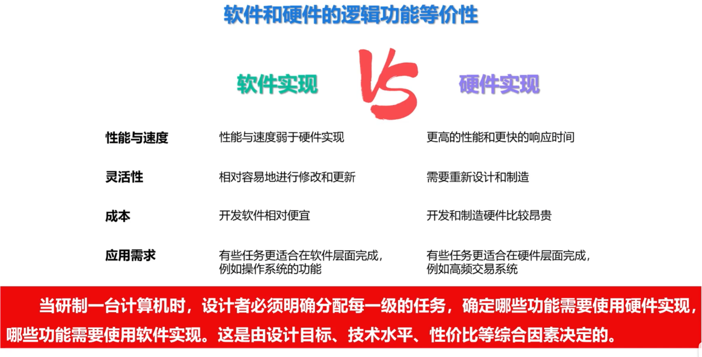

### （一）核心定义

在特定条件下，用软件实现的逻辑功能可通过硬件电路实现，反之亦然；该特性是计算机科学的重要概念，也是计算机体系结构与工程领域的基本原则之一。

### （二）典型实例：VCD 解码的软硬件实现演变

视频中以讲师亲身体会为例，直观说明等价性：

1. 上世纪 90 年代初：计算机 CPU 为 80386（主频 33MHz），性能较低，需额外添加**VCD 解码卡（硬件）** 才能播放 VCD 视频；

1. 后续升级后：计算机 CPU 更换为 80486（主频 80MHz），性能提升，可通过**软件解码**播放 VCD，但帧率较低（画面流畅度不足）；

1. 1996 年：英特尔推出带有多媒体指令集（MMX）的奔腾 CPU，性能大幅提升，**软件解码 VCD 完全可行**（帧率满足流畅播放），此后 VCD 解码卡逐渐退出市场。

### （三）软硬件实现的选择因素

设计计算机时，需根据以下因素决定某功能用软件还是硬件实现：

1. **性能因素**：硬件通过并行执行操作，可提供更高性能和更快响应时间（适合高性能需求场景）；若功能逻辑简单、性能要求不高，软件实现的**成本效益更高**；

1. **灵活性因素**：软件可通过修改代码轻松更新、迭代；硬件修改需重新设计电路、制造芯片，成本高且周期长；

1. **成本因素**：软件开发成本较低（主要是人力成本）；硬件开发（电路设计、芯片制造）和制造成本较高；

1. **任务适配因素**：

- 适合软件实现：如操作系统（需灵活管理各类资源，频繁迭代更新）；

- 适合硬件实现：如高频交易系统（需纳秒级响应时间，对性能要求极高）；

1. **设计决策逻辑**：需结合设计目标（如 “高性能服务器” vs “低成本家用机”）、技术水平、性价比等综合因素，分配各层任务，确定软硬件实现的功能范围。

## 四、课程练习题

视频中设置 4 道练习题（习题一、习题二、习题三、习题四），具体题目未展示，仅给出练习流程：

1. **练习要求**：提示 “请同学们暂停播放视频，思考后给出答案”；

1. **答案处理**：暂停后展示正确答案，并说明 “相信同学们都能正确完成，我们就不再赘述了”（未展开讲解答案推导过程）。


# 1-6 计算机的基本工作原理

## 一、课程前置说明

1. **课程定位**：本节课是计算机组成原理全章节的**概述**，目的是让学生对计算机基本工作原理建立初步整体印象。

1. **难度提示**：无相关先修课程的跨专业学生可能觉得难度较大，遇到无法理解的内容无需钻牛角尖，后续章节学习后会逐步理解。

## 二、运算器的细化（硬件组成补充）

### 1. 运算器核心组件

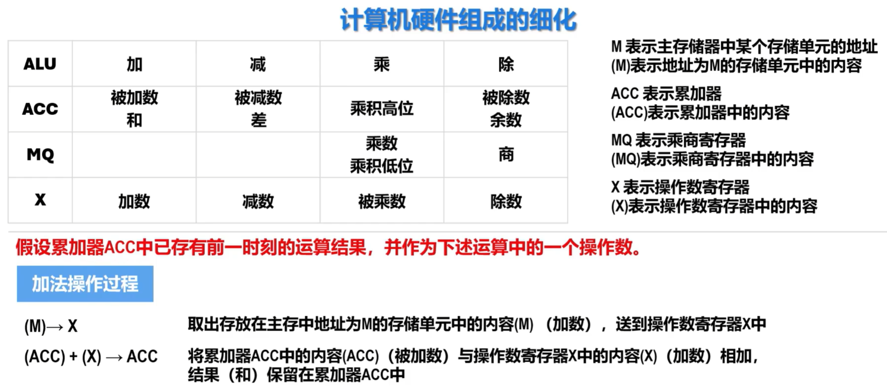

运算器除核心部件**算术逻辑单元（ALU，负责算术 / 逻辑运算）** 外，至少包含 3 个寄存器：

- **累加器（ACC）**：用于存放被操作数、运算中间结果或最终结果。

- **乘商寄存器（MQ）**：专门用于乘法运算的乘数、除法运算的商，以及乘法结果的低位。

- **操作数寄存器（X）**：用于存放乘法运算的被乘数、除法运算的除数，或加减运算的第二个操作数。

### 2. 各组件在四则运算中的作用（含操作流程）

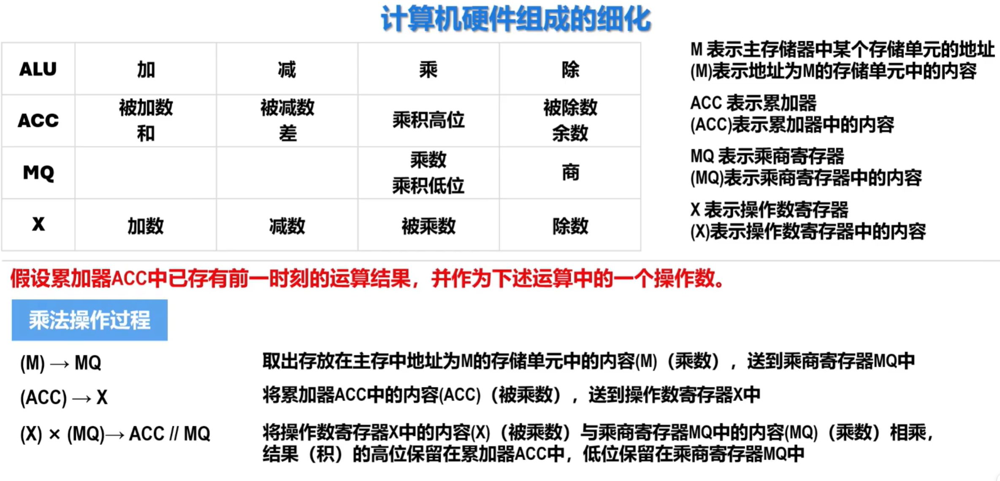

| 运算类型 | 操作数存放位置     | 运算过程         | 结果存放位置              |
| -------- | ------------------ | ---------------- | ------------------------- |
| 加法     | 被加数→ACC，加数→X | ALU 执行 ACC + X | 和→ACC                    |
| 减法     | 被减数→ACC，减数→X | ALU 执行 ACC - X | 差→ACC                    |
| 乘法     | 被乘数→X，乘数→MQ  | ALU 执行 X × MQ  | 乘积高位→ACC，乘积低位→MQ |
| 除法     | 被除数→ACC，除数→X | ALU 执行 ACC ÷ X | 商→MQ，余数→ACC           |

#### 符号说明

- 用(寄存器名)表示 “该寄存器中的内容”，如(ACC)即累加器内的数据。

- 用M表示内存存储单元地址，(M)表示 “地址为 M 的存储单元中的内容”。

- 默认(ACC)中已保存前一时刻运算结果，作为后续运算的一个操作数。

## 三、主存储器的细化（硬件组成补充）

### 1. 主存储器核心组件

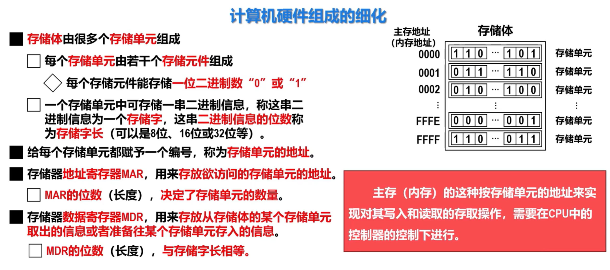

主存储器（简称 “内存”）由 3 部分组成：

- **存储体**：由大量存储单元构成，是二进制信息（0/1）的实际存储载体。

- 每个**存储单元**包含若干**存储元件**（1 个存储元件存 1 位二进制数）。

- 一个存储单元中存储的二进制信息称为**存储字**，其位数称为**存储字长**（常见 8 位、16 位、32 位）。

- **存储器地址寄存器（MAR）**：

- 功能：存放待访问存储单元的**地址**，告知内存需操作的具体单元。

- 位数与存储单元数量的关系：MAR 的位数决定内存可容纳的存储单元总数，公式为 “存储单元数 = 2^MAR 位数”。

示例：MAR 为 16 位时，存储单元数 = 2^16 = 65536 个（地址范围 0~65535）。

- **存储器数据寄存器（MDR）**：

- 功能：存放从存储单元读出的信息，或待写入存储单元的信息。

- 位数特点：MDR 的位数与**存储字长相等**（确保一次能完整读写一个存储字）。

### 2. 内存容量计算（含单位说明）

#### （1）计算逻辑

内存总容量 = 存储单元数 × 存储字长（单位：bit，比特）

#### （2）单位换算

- 基础单位：1 Byte（字节，大写 B）= 8 bit（比特，小写 b）。

- 数据量单位（注意与 “速率单位” 区分）：

- 1 KB（千字节）= 2^10 Byte = 1024 Byte；

- 1 MB（兆字节）= 2^20 Byte = 1024 KB；

- 1 GB（吉字节）= 2^30 Byte = 1024 MB；

- 1 TB（太字节）= 2^40 Byte = 1024 GB。

- 速率单位（如网络传输速率）：1 Kbps = 10^3 bps，1 Mbps = 10^6 bps（与数据量单位的 “K/M/G” 取值不同）。

#### （3）示例计算

已知 MAR 为 16 位（存储单元数 = 65536），存储字长为 16 位，计算总容量：

- 总容量（bit）= 65536 × 16 = 1048576 bit；

- 总容量（Byte）= 1048576 ÷ 8 = 131072 Byte = 128 KB。

## 四、控制器的细化（硬件组成补充）

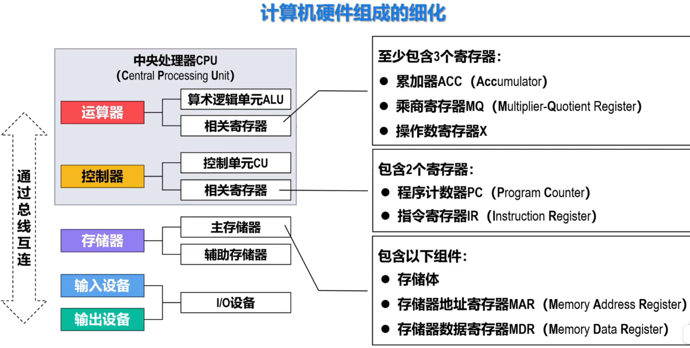

### 1. 控制器核心组件

控制器是计算机的 “神经中枢”，指挥各部件协调工作，核心组件包括：

- **控制单元（CU）**：控制器的核心，分析指令并发出**微操作命令序列**，控制所有被控部件（如 ALU、内存、寄存器）。

- **程序计数器（PC）**：

- 功能：存放**当前预执行指令的地址**。

- 关键特性：指令取出后，PC 会**自动加 1**，形成下一条指令的地址（指向后续指令）。

- 通路：与 MAR 有直接通路，可直接将指令地址送至 MAR。

- **指令寄存器（IR）**：

- 功能：存放**当前正在执行的指令**。

- 数据来源：从 MDR 接收指令（取指阶段）。

- 通路：指令的 “操作码” 送至 CU 分析，“地址码” 送至 MAR 用于取操作数。

### 2. 控制器工作三步骤

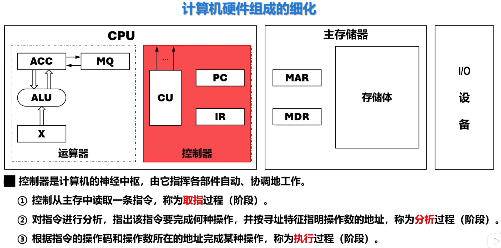

控制器通过 “取指→分析→执行” 三步循环，驱动程序运行：

1. **取指阶段（取值过程）**：控制从内存读取一条指令，存入 IR；同时 PC 自动加 1。

1. **分析阶段（译码过程）**：CU 分析 IR 中的 “操作码”，确定指令类型（如取数、乘法）；分析 “地址码”，确定操作数地址。

1. **执行阶段**：CU 根据分析结果，发出命令驱动 ALU、寄存器、内存等完成指令规定的操作（如运算、数据传输）。

## 五、机器指令基础

### 1. 指令格式（视频示例）

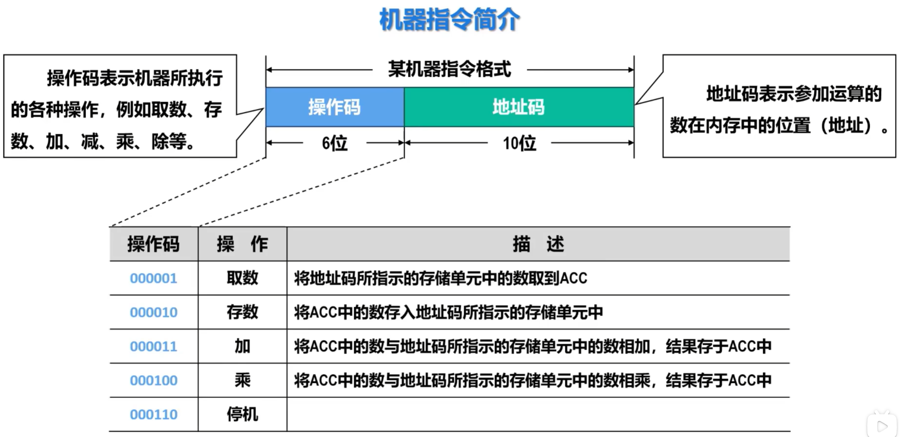

视频中采用的机器指令格式为 “**6 位操作码 + 10 位地址码**”：

- **操作码（6 位）**：表示指令需执行的操作类型（如取数、存数、加减乘除、停机）。

- **地址码（10 位）**：表示操作数在内存中的地址（指向存储操作数的存储单元）。

#### 视频中的操作码示例

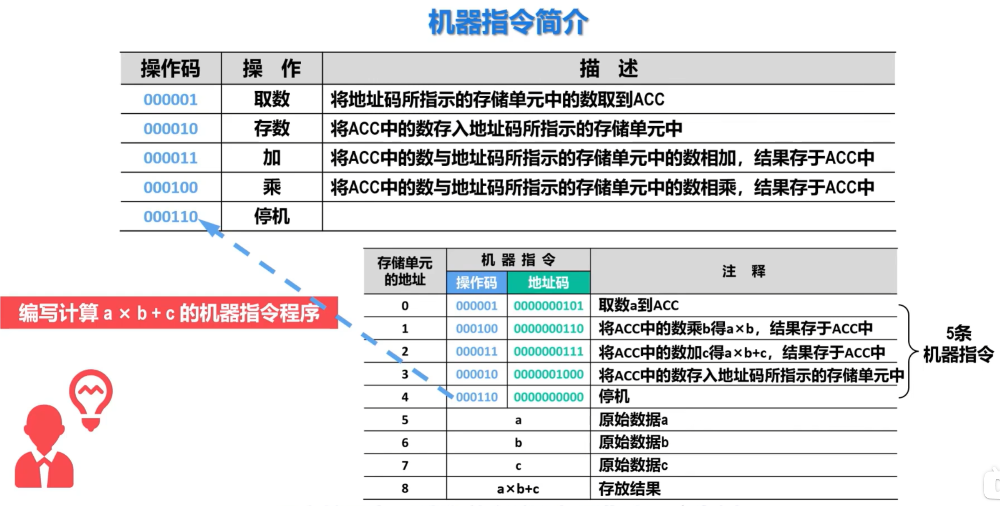

### 2. 示例程序：计算 “A×B + C”（含内存存储布局）

#### （1）需求与前提

- 计算目标：A×B + C（A、B、C 为原始数据，结果存入指定单元）。

- 内存存储布局（地址 0~8）：

| 内存地址 | 内容类型 | 具体内容（描述）                   |
| -------- | -------- | ---------------------------------- |
| 0        | 指令     | 取数指令（地址码指向 5，即取 A）   |
| 1        | 指令     | 乘法指令（地址码指向 6，即取 B）   |
| 2        | 指令     | 加法指令（地址码指向 7，即取 C）   |
| 3        | 指令     | 存数指令（地址码指向 8，即存结果） |
| 4        | 指令     | 停机指令                           |
| 5        | 数据     | 原始数据 A                         |
| 6        | 数据     | 原始数据 B                         |
| 7        | 数据     | 原始数据 C                         |
| 8        | 数据     | 结果存储单元（初始为空）           |

#### （2）每条指令的具体执行（结合运算器 / 控制器逻辑）

1. **第 0 号指令（取数：取 A 到 ACC）**

- 取指：PC=0→MAR，读内存 0 号→MDR→IR；PC 自动加 1→1。

- 分析：CU 分析 IR 操作码，确定为 “取数指令”；地址码指向 5（A 的地址）。

- 执行：IR 地址码→MAR，读内存 5 号（A）→MDR→ACC；此时(ACC)=A。

1. **第 1 号指令（乘法：A×B，结果存 ACC+MQ）**

- 取指：PC=1→MAR，读内存 1 号→MDR→IR；PC 自动加 1→2。

- 分析：CU 分析 IR 操作码，确定为 “乘法指令”；地址码指向 6（B 的地址）。

- 执行：IR 地址码→MAR，读内存 6 号（B）→MDR→MQ；CU 发乘法命令，ALU 执行(X)×(MQ)（此时(X)=(ACC)=A，(MQ)=B）；结果高位→ACC，低位→MQ；此时(ACC)=A×B高位，(MQ)=A×B低位。

1. **第 2 号指令（加法：(A×B) + C，结果存 ACC）**

- 取指：PC=2→MAR，读内存 2 号→MDR→IR；PC 自动加 1→3。

- 分析：CU 分析 IR 操作码，确定为 “加法指令”；地址码指向 7（C 的地址）。

- 执行：IR 地址码→MAR，读内存 7 号（C）→MDR→X；CU 发加法命令，ALU 执行(ACC) + (X)；结果→ACC；此时(ACC)=A×B + C。

1. **第 3 号指令（存数：将结果存入 8 号单元）**

- 取指：PC=3→MAR，读内存 3 号→MDR→IR；PC 自动加 1→4。

- 分析：CU 分析 IR 操作码，确定为 “存数指令”；地址码指向 8（结果地址）。

- 执行：IR 地址码→MAR，(ACC)（结果）→MDR，写 MDR→内存 8 号；此时内存 8 号 = A×B + C。

1. **第 4 号指令（停机）**

- 取指：PC=4→MAR，读内存 4 号→MDR→IR；PC 自动加 1→5。

- 分析：CU 分析 IR 操作码，确定为 “停机指令”。

- 执行：CU 发出停机命令，程序终止。

## 六、计算机基本工作原理（整体流程总结）

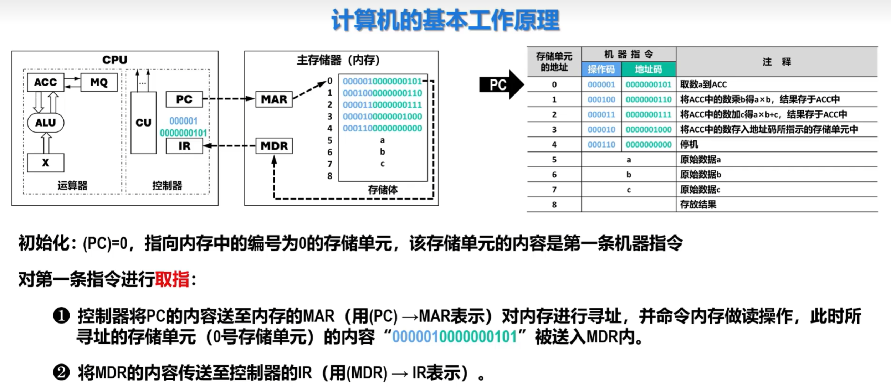

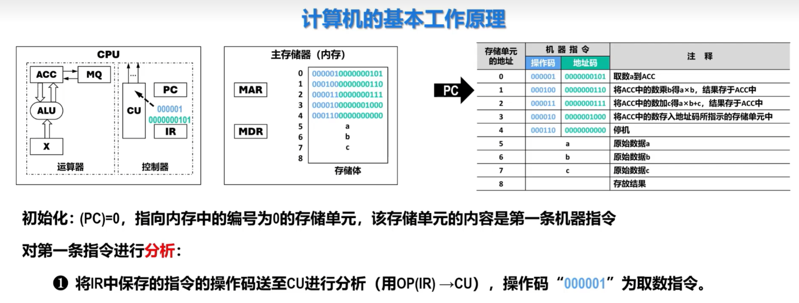

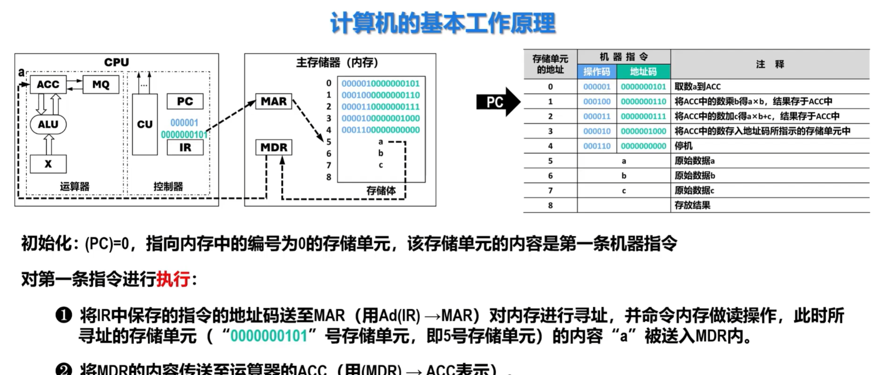

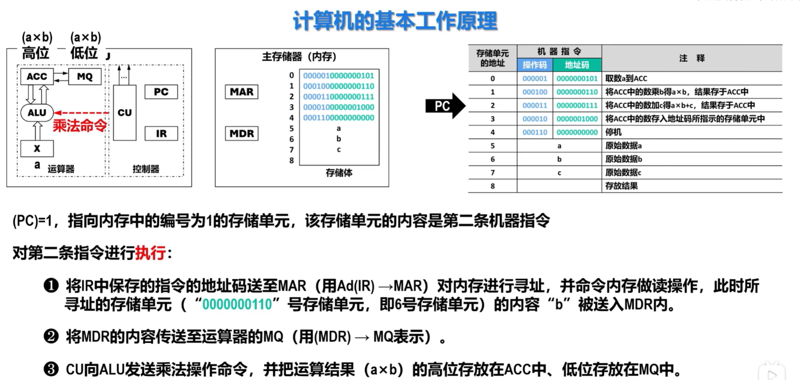


基于 “存储程序” 思想（冯诺依曼核心思想），计算机工作流程如下：

1. **程序存储**：通过输入设备将程序（如 A×B+C 的 5 条指令）和数据（A、B、C）存入内存。

1. **初始化**：PC 指向程序第一条指令的地址（示例中 PC=0）。

1. **循环执行（取指→分析→执行）**：

- 取指：PC→MAR，读内存指令→MDR→IR；PC 自动加 1。

- 分析：IR 操作码→CU 译码，确定操作类型；地址码→确定操作数地址。

- 执行：CU 发命令，驱动 ALU、寄存器、内存完成操作（如数据传输、运算）。

1. **终止**：执行到 “停机指令”，程序结束。

### 硬件发展补充说明

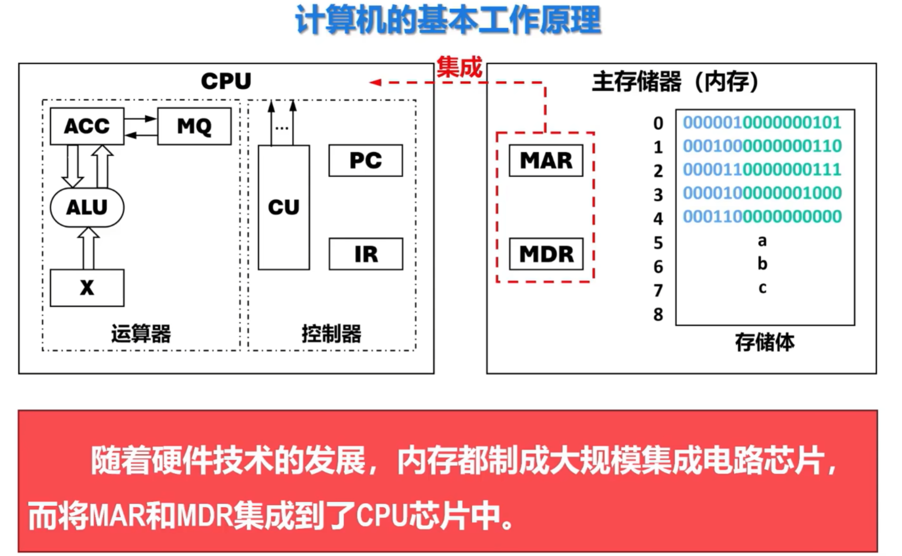

随着大规模集成电路技术发展，**MAR 和 MDR 已集成到 CPU 芯片中**（不再作为内存的独立组件），但功能逻辑不变。

## 七、课后习题及解析（视频内容）

### 1. 习题 1~2

- 要求：暂停视频思考，视频直接给出正确答案，未展开解析（略）。

### 2. 习题 3~4（核心：区分 IR 与 PC）

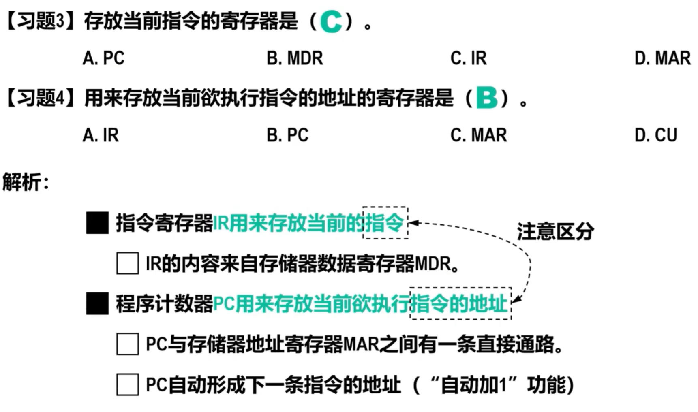

- 考点：明确 IR 和 PC 的内容差异。

- 解析：

- 指令寄存器（IR）：存放**当前正在执行的指令**（指令本身，如 6 位操作码 + 10 位地址码）。

- 程序计数器（PC）：存放**当前预执行指令的地址**（内存地址，如 0、1、2 等）。

### 3. 习题 5~6

- 要求：暂停视频思考，视频直接给出正确答案，未展开解析（略）。

### 4. 习题 7（核心：内存容量计算）

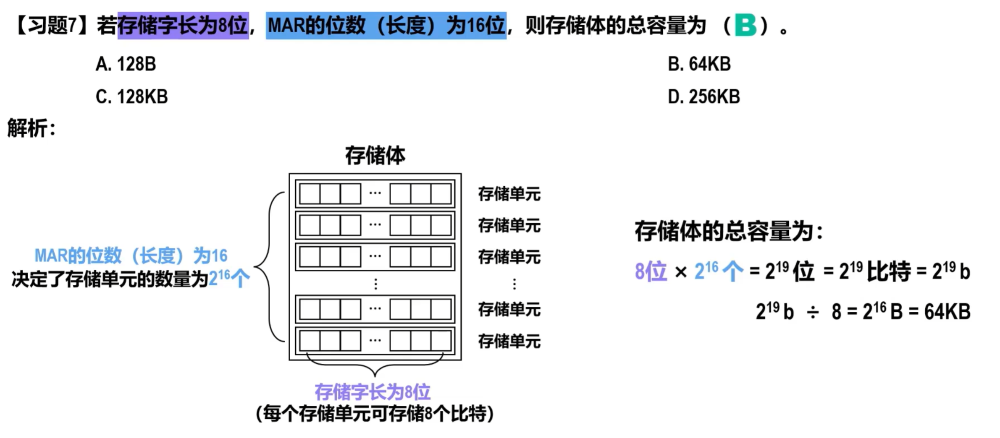

- 题目：已知主存储器的 MAR 为 16 位，存储字长为 8 位，求存储体总容量（选项略）。

- 计算过程：

- 存储单元数 = 2^16 = 65536 个；

- 总容量 = 65536 × 8 bit = 524288 bit = 65536 Byte = 64 KB；

- 正确答案：选项 B（视频明确给出）。


# 1-7 计算机系统的性能指标（1）

## 一、计算机系统性能指标的定义

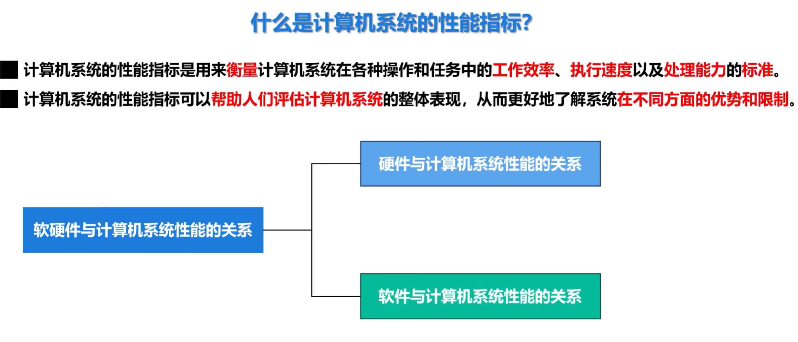

计算机系统的性能指标是**衡量计算机系统在各种操作和任务中的工作效率、执行速度以及处理能力的标准**，主要作用包括：

1. 帮助评估计算机系统的整体表现；

1. 明确系统在不同方面的优势与限制；

1. 学习建议：可与《计算机网络》课程第一章的 “计算机网络性能指标” 对比总结记忆。

## 二、软硬件与计算机系统性能的关系

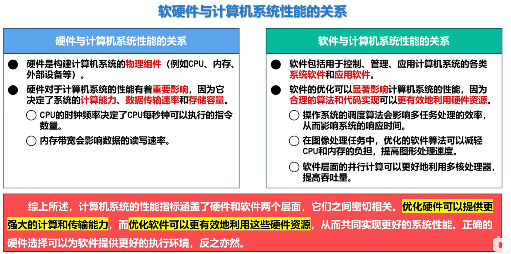

计算机系统由软件和硬件两部分构成，二者共同影响系统性能，课程侧重介绍**硬件相关性能指标**（因课程核心是计算机硬件底层工作原理）。

### 2.1 硬件对性能的影响

- **硬件定义**：构建计算机系统的物理组件，如 CPU、内存、外部设备等。

- **核心影响**：决定系统的**计算能力、数据传输速率、存储容量**，具体示例：

- CPU 的时钟频率：决定 CPU 每秒钟可执行的指令数量；

- 内存带宽：影响数据的读写速率。

### 2.2 软件对性能的影响

- **软件定义**：包含控制、管理、应用计算机系统的**系统软件**（如操作系统）和**应用软件**（如图像处理软件）。

- **核心影响**：优化的软件可更有效地利用硬件资源，提升性能，具体示例：

- 操作系统的调度算法：影响多任务处理效率，进而影响系统响应时间；

- 图像处理优化算法：减轻 CPU 和内存负担，提高图形处理速度；

- 软件层面并行计算：更好利用多核处理器，提高系统吞吐量。

### 2.3 软硬件的关联性

- 优化硬件可提供更强的计算 / 传输能力，优化软件可充分利用硬件资源，二者协同实现更好性能；

- 正确的硬件选择为软件提供优质执行环境，反之亦然。

## 三、计算机硬件相关性能指标分类

视频中明确硬件相关性能指标分为两类，本节课聚焦**基本性能指标**：

| 分类                   | 包含指标（视频提及）                                         |
| ---------------------- | ------------------------------------------------------------ |
| 基本性能指标（本节课） | 机器字长、存储容量、吞吐量、响应时间                         |
| 运算速度相关性能指标   | CPU 时钟频率和时钟周期、CPI、CPU 执行时间、IPC、MIPS、MFLOPS（下节课讲解） |

## 四、基本性能指标详解

### 4.1 机器字长

- **定义**：CPU 一次能够处理的二进制数据的位数（即二进制数据的比特数量），且与**CPU 内部整数运算的算术逻辑单元（ALU）位数**、**通用寄存器宽度**相等。

- **关联 CPU 寄存器回顾**（上节课内容）：

- 运算器组件：ALU、累加器（ACC）、乘商寄存器（MQ）、操作数寄存器（X）；

- 控制器组件：控制单元（CU）、程序计数器（PC）、指令寄存器（IR）；

- 现代 CPU 补充：除上述寄存器外，还包含通用寄存器组。

- **对性能的影响**：

1. 字长越长，数的表示范围越大、计算精度越高；

1. 字长还会影响计算速度（具体机制将在第二章详细讲解，本节课仅作一般了解）。

- **发展历程**：随硬件技术进步，字长从早期的 8 位逐步升级为 16 位、32 位、64 位，甚至更高。

### 4.2 存储容量

- **定义**：主存储器（即内存）能够存储的最大信息量。

- **计算方式**（两种）：

1. 基础公式：存储容量 = N × M（单位：bit，小写字母 b 表示比特）

- N：每个存储单元可存储的二进制位数；

- M：主存包含的存储单元数量。

1. 结合寄存器的计算：

- 存储字长：构成存储体的每个存储单元所能存储的二进制比特数，与**存储器数据寄存器（MDR）的位数相等**；

- 存储单元数量：由**存储器地址寄存器（MAR）的位数决定**，具体为 “2^MAR 位数” 个；

- 总容量 = 存储字长 × 2^MAR 位数。

- **单位与换算**：当前计算机内存常用单位为 GB（字节，1GB=1024MB，1MB=1024KB，1KB=1024B，1B=8bit），数据量单位换算在上节课及《计算机网络》课程中已讲解。

- **对性能的作用**：增加内存容量可减少程序运行时对 “外存” 的访问（因内存访问速度远大于外存），从而提高程序执行速度，最终提升系统性能。

### 4.3 吞吐量

- **定义**：计算机系统在**单位时间内能够处理的信息量**。

- **核心影响因素**：CPU 处理能力、内存访问速度、外存访问速度（三者共同决定单位时间内的信息处理量）。

### 4.4 响应时间

- **定义**：从向计算机系统**提交作业开始**，到系统**完成作业为止**所需要的总时间。

- **时间构成**（两大部分）：

1. CPU 时间（进一步细分）：

- CPU 执行时间：执行用户程序本身所花费的 CPU 时间；

- 系统 CPU 时间：为执行用户程序而花费在操作系统上的 CPU 时间；

- 注意：因难以精确区分二者，无特别说明时，以 “CPU 执行时间” 作为计算机性能评价依据。

1. 其他时间：用户访问内存、外存及其他外部设备所花费的时间。

## 五、视频中的例题总结

### 5.1 习题一、习题二

- 视频提示：需暂停视频自主思考后查看正确答案，但未提及具体题干内容及详细解析，仅说明 “相信同学们都能正确完成，不再赘述”，此处不展开。

### 5.2 习题三

- 答案：选项 D（叙述错误）。

- 解析核心：存储器地址寄存器（MAR）的位数决定存储单元的数量，具体数量为 “2^MAR 位数” 个，因此选项 D 关于 “存储单元数量” 的叙述不符合该规律，故错误。

### 5.3 408 真题

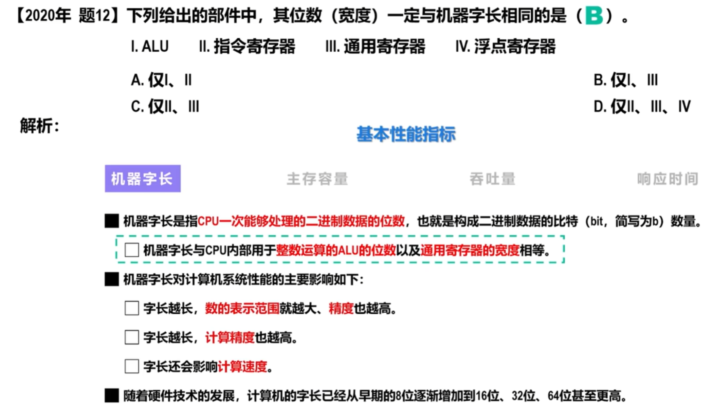

- 视频提示：需暂停视频自主思考后查看正确答案，未展开题干及详细解析，仅说明 “相信同学们都能正确完成，不再赘述”，此处不展开。


# 1-7 计算机系统的性能指标（2）

## 一、与运算速度相关的 6 个核心性能指标

### 1. CPU 时钟频率（Clock Rate）与时钟周期（Clock Cycle）

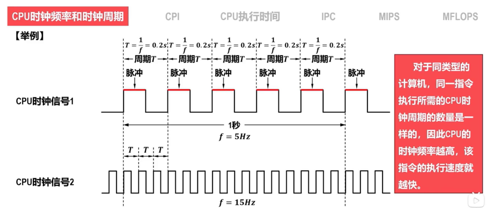

#### 定义

- **CPU 时钟信号**：固定频率的脉冲信号，用于驱动计算机内部组件（如 CPU、内存）协调工作，类似 “交响乐指挥的节奏”。

- **时钟频率（Clock Rate）**：单位时间内时钟信号的脉冲次数，单位为**赫兹（Hz）**，英文缩写为f。

- **时钟周期（Clock Cycle）**：相邻两个脉冲的时间间隔，是时钟频率的倒数，单位为**秒（s）**，英文缩写为T。

#### 核心公式

- 时钟周期 = 1 / 时钟频率 → T = 1/f

#### 视频示例

- **示例 1**：某时钟信号 1 秒内出现 5 次脉冲 → 频率f=5Hz，周期T=1/5=0.2s。

- **示例 2**：另一时钟信号 1 秒内出现 15 次脉冲 → 频率f=15Hz（是示例 1 的 3 倍），周期T=1/15≈0.0667s（是示例 1 的 1/3）。

#### 关键结论

- 同类型计算机中，同一指令所需的时钟周期数固定 → **时钟频率越高，指令执行速度越快**。

- 实际应用：2023 年桌面级高端 CPU 加速频率最高接近6GHz（6×10⁹Hz）。

#### 单位对比（频率 vs 数据量）

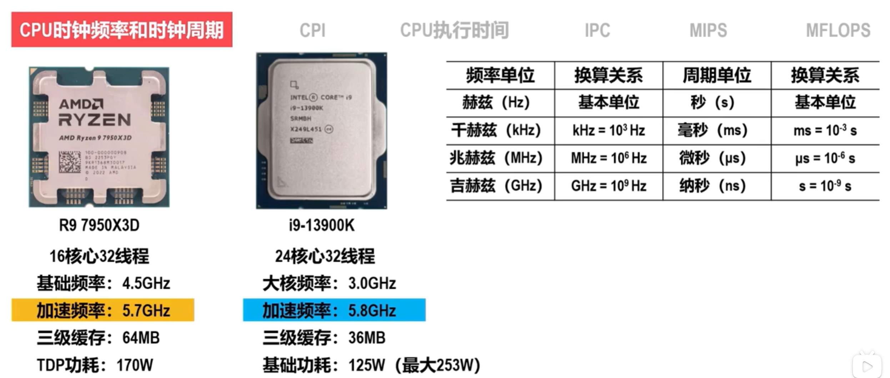

| 单位量级 | 频率单位（Hz） | 换算关系（10 的幂次） | 数据量单位（B） | 换算关系（2 的幂次） |
| -------- | -------------- | --------------------- | --------------- | -------------------- |
| 千（K）  | KHz            | 10³                   | KB              | 2¹⁰（1024）          |
| 兆（M）  | MHz            | 10⁶                   | MB              | 2²⁰（1048576）       |
| 吉（G）  | GHz            | 10⁹                   | GB              | 2³⁰                  |

### 2. CPI（执行一条指令所需时钟周期数）

#### 定义

CPI（Cycles Per Instruction）指执行一条指令所需的时钟周期数量。由于指令功能（如算术运算、存储访问）或寻址方式不同，不同指令的 CPI 存在差异。

#### 不同层面的 CPI 定义

- **单条指令的 CPI**：该特定指令执行所需的时钟周期数（如 “加法指令” CPI=1，“内存读取指令” CPI=3）。

- **一类指令的 CPI**：某类指令（如算术运算类、分支跳转类）所有指令 CPI 的平均值。

- **一个程序的 CPI**：程序中所有指令 CPI 的平均值，是评估程序执行效率的核心指标。

#### 核心公式

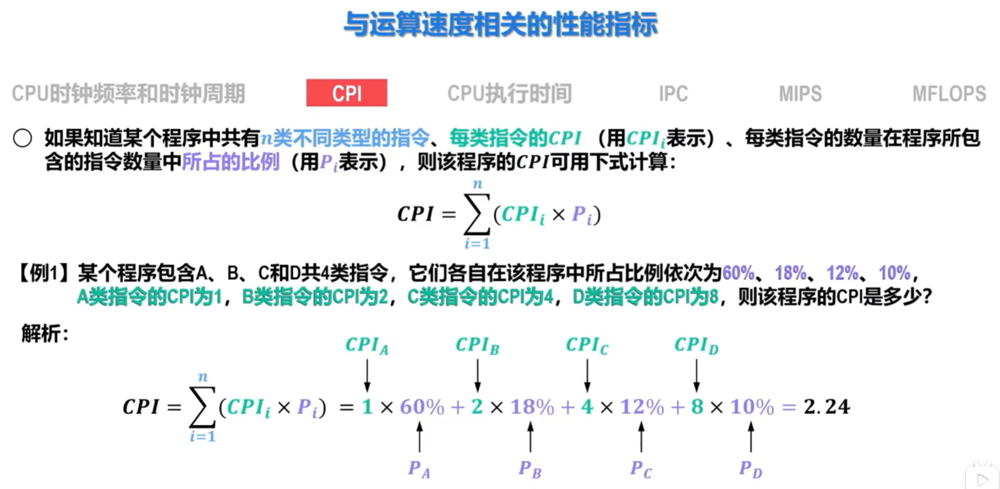

- 程序 CPI = 程序总时钟周期数（总 CC） / 程序总指令数（总 I） → CPI = 总CC / 总I

- 多类指令的程序 CPI = Σ（第 i 类指令占比 P_i × 第 i 类指令 CPI_i） → CPI = P₁×CPI₁ + P₂×CPI₂ + ... + Pₙ×CPIₙ

#### 视频例题（计算程序 CPI）

- **已知条件**：某程序含 4 类指令，各类指令的占比（P_i）和 CPI_i 如下：

- 第 1 类：P₁=40%，CPI₁=1

- 第 2 类：P₂=30%，CPI₂=2

- 第 3 类：P₃=20%，CPI₃=3

- 第 4 类：P₄=10%，CPI₄=4

- **计算过程**：

CPI = 0.4×1 + 0.3×2 + 0.2×3 + 0.1×4 = 0.4 + 0.6 + 0.6 + 0.4 = 2.0

- **结论**：该程序的平均 CPI 为 2.0。

### 3. CPU 执行时间（CPU Execution Time）

#### 定义

CPU 执行时间指**仅用于用户程序执行的时间**，不包含操作系统开销、内存访问、IO 设备（如硬盘、键盘）操作的时间，是衡量程序 “实际运行速度” 的关键指标。

#### 核心公式

- 公式 1（基于总时钟周期和时钟周期）：

CPU 执行时间 = 程序总时钟周期数（总 CC） × 时钟周期（T） → T_exec = 总CC × T

- 公式 2（基于总时钟周期和频率）：

因T=1/f，故 T_exec = 总CC / f

- 公式 3（结合 CPI）：

因总CC = 总I × CPI，故 T_exec = 总I × CPI × T = 总I × CPI / f

#### 视频例题 1（比较两台机器的 CPU 执行时间）

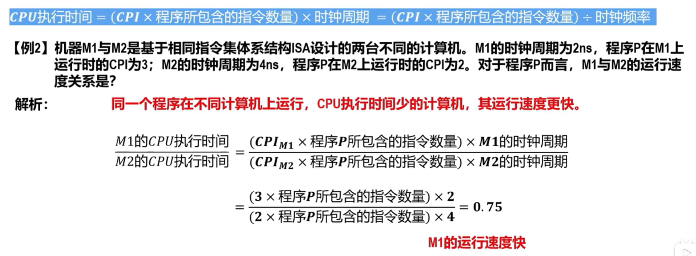

- **已知条件**：程序 P 在机器 M1 和 M2 上运行，总指令数（总 I）相同；

M1：频率 f₁=2GHz，CPI₁=2；

M2：频率 f₂=3GHz，CPI₂=3。

- **核心需求**：判断哪台机器执行程序 P 更快（即 CPU 执行时间更短）。

- **计算过程**：

1. 代入公式 3：T_exec1 = 总I×2 / 2×10⁹ = 总I×10⁻⁹；

T_exec2 = 总I×3 / 3×10⁹ = 总I×10⁻⁹（若数值调整为 M1：CPI₁=1.5，f₁=3GHz；M2：CPI₂=2，f₂=2GHz，则T_exec1=总I×1.5/3e9=0.5×10⁻⁹×总I，T_exec2=总I×2/2e9=1×10⁻⁹×总I，此时 T_exec1<T_exec2，M1 更快）。

- **结论**：同程序下，CPU 执行时间越短，机器运行速度越快。

#### 视频例题 2（比较同一机器的两个代码序列）

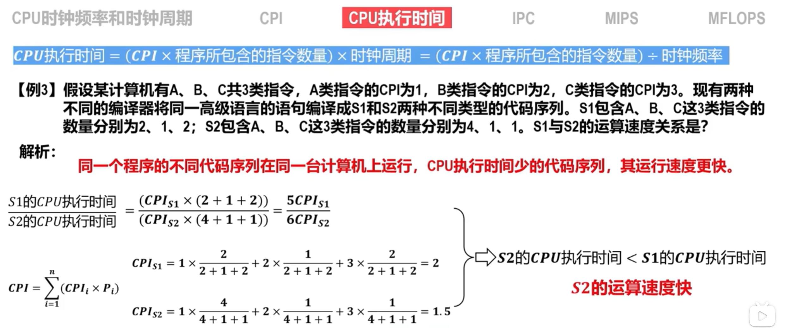

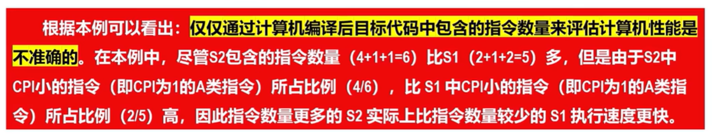

- **已知条件**：同一台机器（f 和 T 固定），代码序列 S1 和 S2 的参数如下：

S1：总指令数 I₁=100，CPI₁=2；

S2：总指令数 I₂=120（多于 S1），CPI₂=1.5（低于 S1）。

- **核心需求**：判断哪个代码序列执行更快。

- **计算过程**：

1. 代入公式 3：T_exec1 = 100×2×T = 200T；

T_exec2 = 120×1.5×T = 180T。

- **结论**：仅通过 “指令数量” 评估性能不准确，需结合 CPI；本例中 S2 指令数更多，但 CPI 更低，执行速度更快。

### 4. IPC（每个时钟周期执行的指令数）

#### 定义

IPC（Instructions Per Cycle）指 CPU 每个时钟周期能执行的指令数量，是 CPI 的 “反向指标”。

#### 核心公式

- IPC = 1 / CPI → IPC = 1/CPI

#### 关键结论

- 影响因素：CPU 架构（如 x86、ARM）、指令集（如 RISC、CISC）、指令流水线技术（如 5 级流水线、超标量流水线）。

- 技术发展：随着流水线技术、多核技术的普及，现代 CPU 的 IPC 可大于 1（如超标量 CPU 每周期可执行 2~4 条指令）。

### 5. MIPS（每秒执行百万条指令）

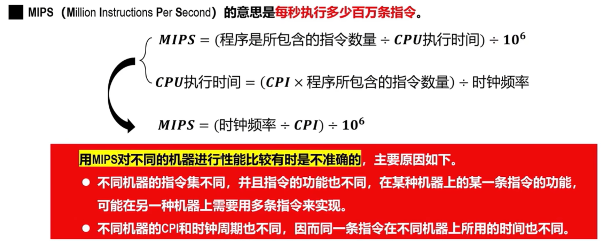

#### 定义

MIPS（Million Instructions Per Second）指 CPU 每秒能执行的 “百万条指令数”，是早期评估 CPU 整数运算性能的常用指标。

#### 核心公式

- 公式 1（基于总指令数和执行时间）：

MIPS = （程序总指令数 / CPU 执行时间） / 10⁶ → MIPS = (总I / T_exec) × 10⁻⁶

- 公式 2（结合频率和 CPI）：

因总I / T_exec = f/CPI，故 MIPS = f / (CPI × 10⁶)（f 单位：Hz）。

#### 视频例题（计算 MIPS）

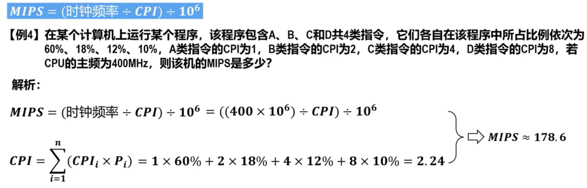

- **已知条件**：某程序总指令数 I=8×10⁷条，CPU 执行时间 T_exec=0.4 秒；或已知 CPU 频率 f=2GHz，程序 CPI=11.2。

- **计算过程**：

1. 用公式 1：MIPS = (8×10⁷ / 0.4) × 10⁻⁶ = 2×10⁸ × 10⁻⁶ = 200 MIPS；

1. 用公式 2：MIPS = 2×10⁹ / (11.2×10⁶) ≈ 178.6 MIPS（与视频结果一致）。

#### 局限性

- 不同机器的指令集功能差异大（如 A 机器 1 条指令的功能，B 机器需 3 条指令实现），MIPS 无法统一衡量；

- 未考虑指令类型（如浮点指令、整数指令）的差异，仅适合同指令集机器的性能对比。

### 6. MFLOPS（每秒执行百万次浮点运算）

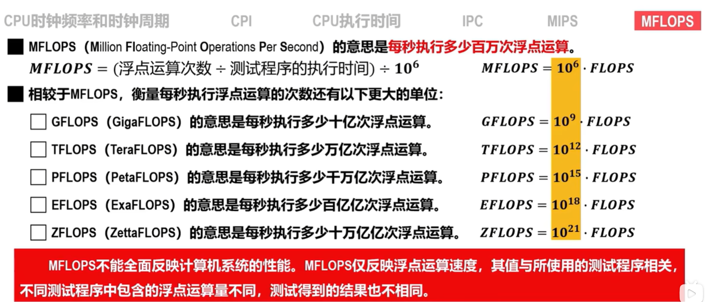

#### 定义

MFLOPS（Million Floating-Point Operations Per Second）指 CPU 每秒能执行的 “百万次浮点运算”，专门用于评估浮点运算性能（如科学计算、3D 渲染）。

#### 核心公式

- MFLOPS = （程序总浮点运算次数 / CPU 执行时间） / 10⁶ → MFLOPS = (总浮点运算数 / T_exec) × 10⁻⁶

#### 单位换算

- 1 GFlops = 10³ MFLOPS（10 亿次 / 秒）

- 1 TFlops = 10⁶ MFLOPS（1 万亿次 / 秒）

- 1 PFlops = 10⁹ MFLOPS（1 千万亿次 / 秒）= 10¹⁵ FLOPS

#### 局限性

- 仅反映浮点运算速度，无法全面评估计算机系统性能（如 IO、内存性能未考虑）；

- 结果与测试程序强相关（不同程序的浮点运算量不同，测试结果差异大）。

## 二、基准程序（Benchmark Program）

### 定义

基准程序是一组 “模拟实际任务” 的特定程序，专门用于客观评测计算机性能。

### 核心作用

- 消除 “不同程序对性能评估的干扰”：在不同计算机上运行**相同基准程序**，通过比较 “运行时间” 直接评估性能差异。

- 评测重点分类：CPU 性能、图形渲染性能、内存访问性能、浮点计算性能、并行计算性能等。

### 说明

视频提及 “国际上有流行的基准程序”（如 SPEC、LINPACK 等），建议学习者自行查阅细节。

## 三、2011-2023 年 408 真题解析（视频提及题目）

### 1. 2011 年真题（答案：选项 D）

#### 题目核心

判断下列性能指标的定义是否正确：

- MIPS：每秒执行百万条指令（正确）；

- CPI：执行一条指令所需时钟周期数（正确）；

- IPC：每时钟周期执行的指令数（CPI 的倒数，正确）；

- MFLOPS：每秒执行百万次浮点运算（正确）。

#### 结论

选项 D（所有定义均正确）。

### 2. 2021 年真题（答案：选项 D）

#### 题目已知

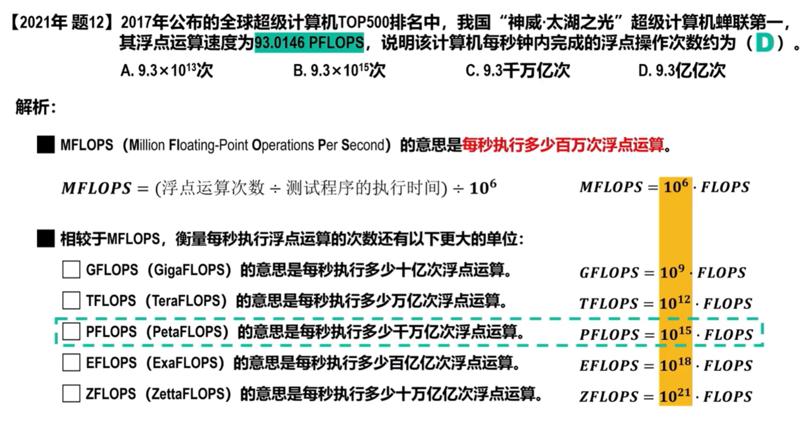

某计算机浮点运算速度为 93 PFlops，求对应的 FLOPS 数（即每秒浮点运算次数）。

#### 计算过程

- 单位换算：1 PFlops = 10¹⁵ FLOPS；

- 93 PFlops = 93 × 10¹⁵ FLOPS = 9.3 × 10¹⁶ FLOPS（即 9.3 亿亿次 / 秒）。

#### 结论

选项 D。

### 3. 2012 年真题（答案：选项 D）

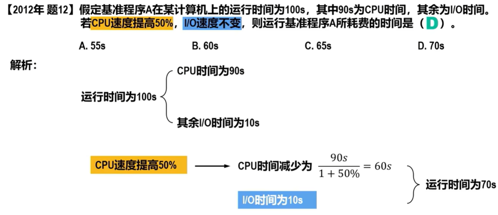

#### 题目已知

- 基准程序 A 总运行时间 100 秒（其中 CPU 时间 90 秒，IO 时间 10 秒）；

- CPU 速度提高 50%，IO 速度不变，求新的总运行时间。

#### 关键误区

“CPU 速度提高 50%”≠“CPU 时间减少 50%”（速度与时间成反比，非线性关系）。

#### 计算过程

1. 设原 CPU 速度为 v，新速度 v' = v × (1+50%) = 1.5v；

1. 原 CPU 任务量 = 速度 × 时间 = v × 90；

1. 新 CPU 时间 = 任务量 / 新速度 = (90v) / 1.5v = 60 秒；

1. 新总运行时间 = 新 CPU 时间 + IO 时间 = 60 + 10 = 70 秒。

#### 结论

选项 D。

### 4. 2013 年真题（答案：选项 C）

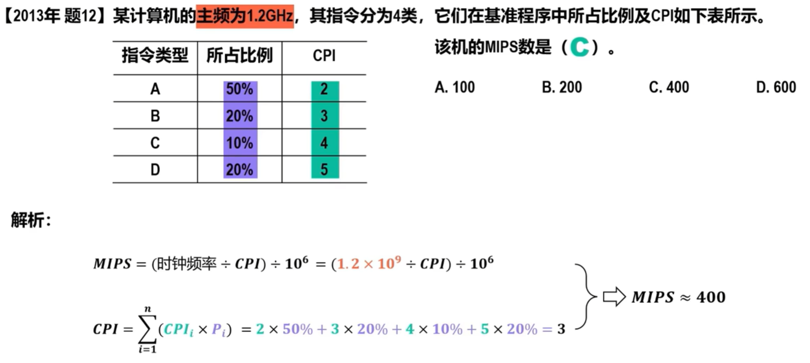

#### 题目已知

- CPU 主频 f=1.2GHz；

- 基准程序含 3 类指令：P₁=50%（CPI₁=2）、P₂=30%（CPI₂=3）、P₃=20%（CPI₃=4）；

- 求该程序的 MIPS。

#### 计算过程

1. 第一步：计算程序 CPI

CPI = 0.5×2 + 0.3×3 + 0.2×4 = 1.0 + 0.9 + 0.8 = 2.7（若调整为 CPI=3，如 P₁=40%、CPI₁=2；P₂=40%、CPI₂=3；P₃=20%、CPI₃=5，则 CPI=3）；

1. 第二步：计算 MIPS

MIPS = 1.2×10⁹ / (3×10⁶) = 400 MIPS（与视频 “约 400” 结果一致）。

#### 结论

选项 C。

### 5. 2014 年真题（答案：选项 D）

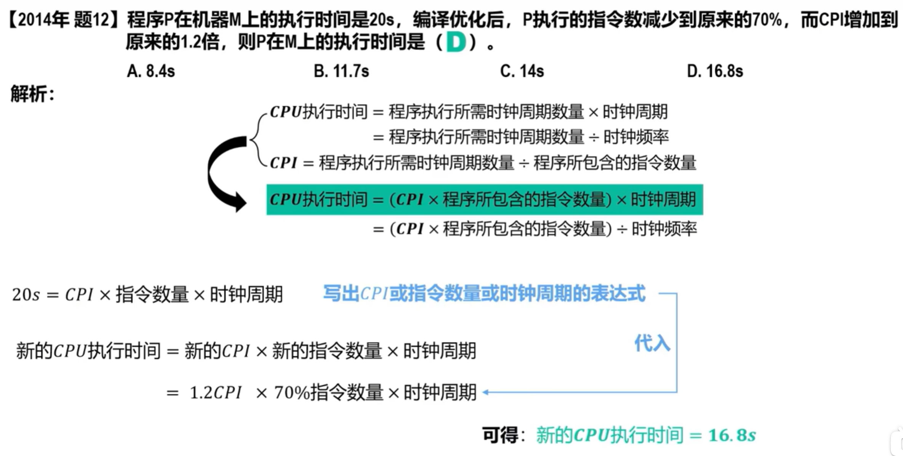

#### 题目已知

- 程序 P 在机器 M 上，优化前 CPU 执行时间 T₁=20 秒；

- 优化后：总指令数减少 20%（I₂=I₁×0.8），CPI 减少 10%（CPI₂=CPI₁×0.9）；

- 时钟频率不变，求优化后 CPU 执行时间 T₂。

#### 计算过程

1. 优化前公式：T₁ = I₁×CPI₁ / f → I₁×CPI₁ = T₁×f = 20f；

1. 优化后公式：T₂ = I₂×CPI₂ / f = (I₁×0.8)×(CPI₁×0.9)/f = 0.72×(I₁×CPI₁)/f；

1. 代入I₁×CPI₁=20f：T₂ = 0.72×20 = 14.4秒。

#### 结论

选项 D。

### 6. 2017 年真题（答案：选项 C）

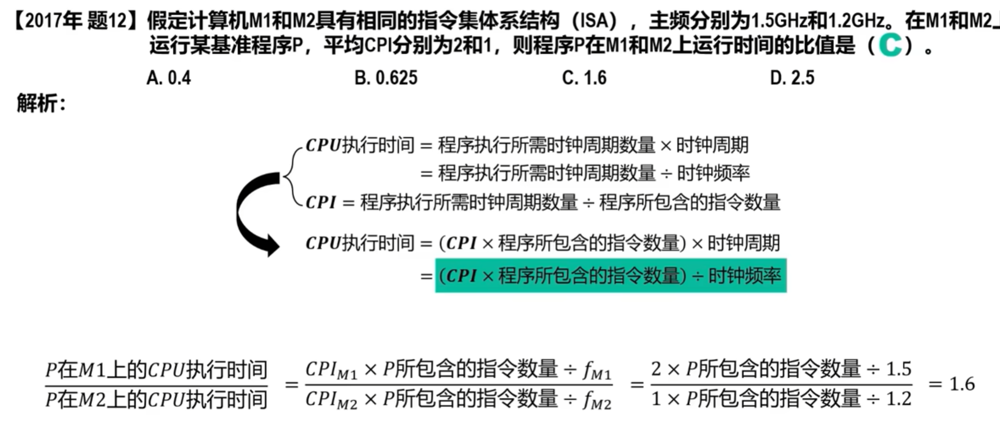

#### 题目已知

- 程序 P 在 M1 和 M2 上运行，总指令数 I₁=I₂；

- M1：f₁=2.5GHz，CPI₁=2.0；M2：f₂=3GHz，CPI₂=1.5；

- 求 M1 与 M2 的 CPU 执行时间比值（T₁/T₂）。

#### 计算过程

1. 执行时间公式：T₁ = I×CPI₁/f₁，T₂ = I×CPI₂/f₂；

1. 比值：T₁/T₂ = (CPI₁×f₂)/(CPI₂×f₁) = (2.0×3)/(1.5×2.5) = 6/3.75 = 1.6。

#### 结论

选项 C。

### 7. 2022 年真题（答案：选项 A）

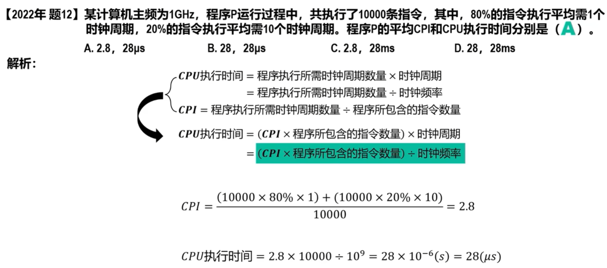

#### 题目已知

- 程序 P 总指令数 I=10⁴条；

- CPU 主频 f=1GHz（时钟周期 T=1×10⁻⁹秒）；

- 程序 CPI=2.8；

- 求 CPU 执行时间。

#### 计算过程

1. 代入公式：T_exec = I×CPI×T；

1. 计算：T_exec = 10⁴ × 2.8 × 1×10⁻⁹ = 2.8×10⁻⁵秒 = 28微秒（1 微秒 = 10⁻⁶秒）。

#### 结论

选项 A。

### 8. 2023 年真题（答案：选项 C）

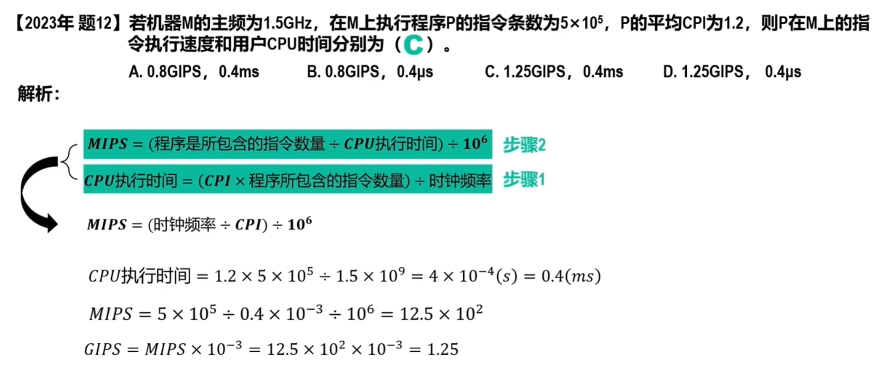

#### 题目已知

- 程序 P 总指令数 I=8×10⁵条；

- 用户 CPU 时间（即执行时间）T=0.4ms（0.4×10⁻³ 秒）；

- 求指令执行速度（用 GPS，1 GPS=10⁹条 / 秒）。

#### 计算过程

1. 第一步：计算 MIPS

MIPS = (8×10⁵ / 0.4×10⁻³) × 10⁻⁶ = 2×10⁹ × 10⁻⁶ = 2000 MIPS；

1. 第二步：MIPS 转 GPS

1 GPS = 10³ MIPS → 2000 MIPS = 2 GPS。

#### 结论

选项 C。


# 2-1 数据表示的相关基本概念

## 1. 计算机内部数据表示基础

### 1.1 核心编码方式

- 电子数字计算机内部**仅使用二进制表示数据**。

- 日常生活中的信息需转换为二进制才能被计算机处理，具体流程：

日常生活中的信息（数值、英文字符 / 汉字、音频 / 视频等）→ 通过输入设备转换为二进制数据 → 存储到计算机内部的**寄存器**或**存储器**中。

### 1.2 二进制数据的多义性示例（视频例题 1）

- 假设计算机内部某**32 位寄存器**中存储了一串二进制数据，其可能的含义包括：

1. 某个数值的二进制编码；

1. 某个文本文件的二进制编码的一小部分；

1. 某个图片的二进制编码的一小部分；

（视频说明 “其他可能不再赘述”，本章聚焦 “数值数据的二进制编码”，故后续默认该 32 位二进制表示数值数据）。

## 2. 数值数据的分类及核心概念

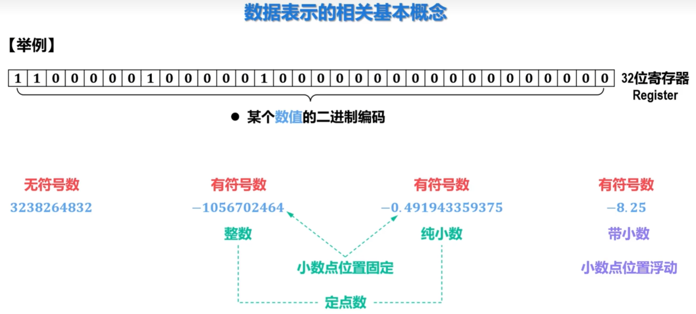

计算机内部的数值数据分为**无符号数**和**有符号数**两大类，具体分类如下：

### 2.1 无符号数

- **定义**：无正负号的数值数据。

- **特点**：所有位均用于表示数值大小，无符号位。

- **实际应用示例**：

- 日常生活：门牌号（如 “101 室”“5 号楼”，无正负）；

- 计算机内部：用作**存储单元的地址**（如内存地址、寄存器地址）。

### 2.2 有符号数

- **定义**：带有正号或负号的数值数据（日常生活中常省略正号）。

- **细分类型及核心区别**：

| 有符号数类型 | 小数点特性 | 所属类别 | 关键说明                               |
| ------------ | ---------- | -------- | -------------------------------------- |
| 整数         | 位置固定   | 定点数   | 小数点隐含固定在 “数值最低位的右侧”    |
| 纯小数       | 位置固定   | 定点数   | 小数点隐含固定在 “数值最高位的左侧”    |
| 带小数       | 位置可移动 | 浮点数   | 小数点可左右移动，需额外表示小数点位置 |

- **带小数（浮点数）示例（视频例题 2）**：

以 “-8.25” 和 “-82.5” 为例：

- 二者均为带小数；

- “-8.25” 的小数点位于 “8” 与 “2” 之间，“-82.5” 的小数点位于 “8” 与 “2” 之间（核心差异：小数点位置不同），体现浮点数 “小数点可左右移动” 的特性。

### 2.3 定点数与浮点数的核心定义

- **定点数**：整数和纯小数的统称。

核心原因：二者的**小数点位置是隐含约定、固定不变的**，因此计算机内部无需存储小数点（无需额外占用二进制位表示小数点位置）。

（视频补充：“整数存在小数点” 是为了与浮点数分类区分，无需钻牛角尖）。

- **浮点数**：带小数的统称。

核心原因：带小数的**小数点位置不固定、可左右移动**，计算机内部需额外表示小数点位置（通过 “阶码” 实现，后续课程详解）。

## 3. 机器码与真值的基本概念

### 3.1 机器码（机器数）

- **定义**：计算机内部用于表示数值数据的编码格式，是二进制数据的 “具体表现形式”。

- **常见类型**：原码、补码、反码、移码（视频提及 “一码” 应为口误，核心聚焦前四类）。

- **适用场景**：仅用于计算机内部表示数值数据，需遵循特定编码规则（后续课程详解各类编码方法）。

### 3.2 真值

- **定义**：日常生活中人类熟悉的数值（如 “-8.25”“100”“0.5”），是机器码所对应的 “实际数值含义”。

- **转换关系**：掌握机器码的编码规则后，可实现 “真值 ↔ 机器码” 的双向转换（如将真值 “5” 转为二进制机器码，或从二进制机器码反推真值 “-3”）。

## 4. 各类数值数据的计算机内部表示格式

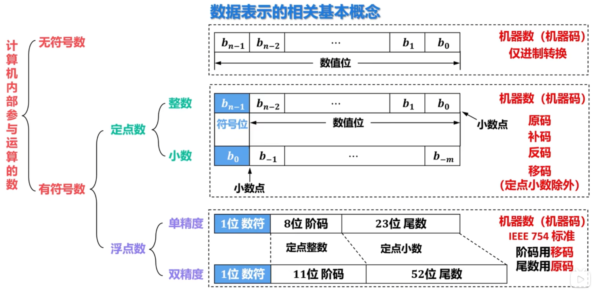

### 4.1 无符号数的表示格式

- **位数**：共 N 位（如 8 位、16 位、32 位）。

- **位的定义**：

- 用 “Bₖ” 表示某一位（k 为下标）；

- B₀：最低位（表示 2⁰的权重）；

- Bₙ₋₁：最高位（表示 2ⁿ⁻¹ 的权重）；

- **核心规则**：N 位全部用于表示数值大小，无符号位。

- **编码规则**：仅需掌握 “进制转换”（如十进制无符号数→二进制无符号数，或反之），下节课详解 “进位计数制及转换”。

### 4.2 定点数的表示格式

定点数分为 “定点整数” 和 “定点小数（纯小数）”，二者格式均包含 “符号位” 和 “数值位”。

#### 4.2.1 定点整数的格式

- **结构**：1 位符号位 + (N-1) 位数值位（共 N 位）。

| 位类型 | 位置                   | 作用                                                         |
| ------ | ---------------------- | ------------------------------------------------------------ |
| 符号位 | 最高位（Bₙ₋₁）         | 表示数值正负（后续课程详解：通常 “0” 表示正数，“1” 表示负数，取决于编码类型） |
| 数值位 | 剩余 N-1 位（Bₙ₋₂~B₀） | 表示数值的大小                                               |

- **小数点位置**：隐含固定在 “数值位的右侧”（如 N=8 位定点整数 “01001000”，小数点隐含在 B₀右侧，即 “01001000.”）。

#### 4.2.2 定点小数（纯小数）的格式

- **结构**：1 位符号位 + (N-1) 位数值位（共 N 位）。

| 位类型 | 位置                   | 作用                                       |
| ------ | ---------------------- | ------------------------------------------ |
| 符号位 | 最高位（Bₙ₋₁）         | 表示数值正负（同定点整数，取决于编码类型） |
| 数值位 | 剩余 N-1 位（Bₙ₋₂~B₀） | 表示数值的大小                             |

- **小数点位置**：隐含固定在 “符号位与数值位之间”（如 N=8 位定点小数 “10110000”，小数点隐含在 Bₙ₋₁与 Bₙ₋₂之间，即 “1.0110000”）。

- **特殊说明**：定点小数**不采用移码**作为编码格式；数值位的具体取值（0 或 1）取决于两个因素：① 真值（如 “-0.375”）；② 采用的编码格式（原码、补码、反码）。

### 4.3 浮点数的表示格式

浮点数分为 “单精度浮点数” 和 “双精度浮点数”，核心结构为 “符号位 + 阶码 + 尾数”。

#### 4.3.1 单精度浮点数（32 位）

- **总位数**：32 位。

- **结构拆分**：

| 字段   | 位数  | 作用                                                         |
| ------ | ----- | ------------------------------------------------------------ |
| 符号位 | 1 位  | 表示浮点数的正负（作用同定点数的符号位）                     |
| 阶码   | 8 位  | 本质是 “定点整数”，用于表示小数点的移动方向和距离（后续课程详解） |
| 尾数   | 23 位 | 本质是 “定点小数”，用于表示浮点数的数值精度（后续课程详解，视频中又称 “维码”） |

#### 4.3.2 双精度浮点数（64 位）

- **总位数**：64 位。

- **结构拆分**：

| 字段   | 位数  | 作用                                                         |
| ------ | ----- | ------------------------------------------------------------ |
| 符号位 | 1 位  | 表示浮点数的正负（作用同定点数的符号位）                     |
| 阶码   | 11 位 | 本质是 “定点整数”，用于表示小数点的移动方向和距离（精度高于单精度） |
| 尾数   | 52 位 | 本质是 “定点小数”，用于表示浮点数的数值精度（精度高于单精度） |

#### 4.3.3 浮点数的编码标准（IEEE 754）

- 视频提及标准名称（口误为 “IROBOE754”“ITRIBLEE754”，实际为**IEEE 754 标准**）：

- 规定 “阶码” 采用**移码**表示；

- 规定 “尾数” 采用**原码**表示。

（阶码、尾数的具体作用及编码细节，后续 “浮点数的表示形式和表示范围” 课程详解）。

## 5. 高级语言中的对应关系

- 计算机内部的 “无符号数” 和 “有符号数”，在高级语言（如 C 语言）中有对应的**数据类型**（具体类型后续 “C 语言中的数据类型及转换” 课程详解）。


# 2-2 进位计数制及其数据之间的相互转换

## 一、常用进位计数制

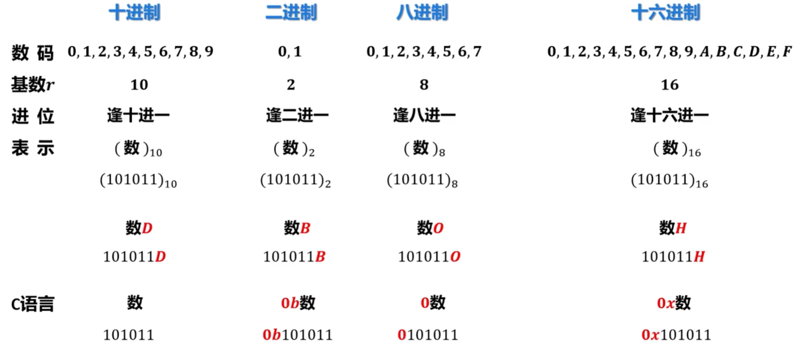

### 1.1 核心进制类型及用途

- **十进制（Decimal）**：日常生活核心进制，因人类有 10 个手指；基数R=10，可用数码0-9，进位规则 “逢十进一”。

- **二进制（Binary）**：计算机内部唯一数据表示方式，因逻辑电路仅 2 种状态（开关通 / 断，对应0/1）；基数R=2，可用数码0-1，进位规则 “逢二进一”。

- **八进制（Octal）**：计算机外部简化书写 / 阅读（缩短二进制长度）；基数R=8，可用数码0-7，进位规则 “逢八进一”。

- **十六进制（Hexadecimal）**：计算机外部主流简化进制（比八进制更简洁）；基数R=16，可用数码0-9、A-F（A=10，B=11，C=12，D=13，E=14，F=15），进位规则 “逢十六进一”。

- **其他实用进制**：12 进制（12 个月 / 12 小时）、24 进制（24 小时）、60 进制（分 / 秒），均用于时间计量。

### 1.2 进制核心概念

- **基数（R）**：某进制的可用数码总数（如二进制R=2，十六进制R=16）。

- **位权**：某数位的权重，等于 “R的（数位序号）次幂”（整数位从右向左序号0、1、2…，小数位从左向右序号-1、-2、-3…）。

## 二、进制数的表示方法（避免歧义）

### 2.1 数学表示法（通用）

- 格式：(数码)R（圆括号括住数码，右下角标注基数R）。

- 示例：十进制 123→(123)10，二进制 101→(101)2，八进制 702→(702)8，十六进制 A9D1→(A9D1)16。

### 2.2 字母后缀表示法

- 规则：用进制英文首字母作后缀（不区分大小写，常用大写）：

- 十进制：D（可省略，如123D=123）；

- 二进制：B（如101B）；

- 八进制：O（如702O）；

- 十六进制：H（如A9D1H）。

### 2.3 C 语言表示法（编程场景）

- 规则：

- 十进制：无修饰（如123）；

- 二进制：前缀0B/0b（如0B101）；

- 八进制：前缀0（如0702）；

- 十六进制：前缀0X/0x（如0XA9D1）。

## 三、任意进制转十进制：按权展开法（安全展开法）

### 3.1 转换原理

任意进制数(dndn-1…d1d0.d-1d-2…d-m)R的十进制值 =

dn×Rⁿ + dn-1×Rⁿ⁻¹ + … + d1×R¹ + d0×R⁰ + d-1×R⁻¹ + … + d-m×R⁻ᵐ

（核心：“数码 × 位权” 求和）

### 3.2 视频例题解析

#### 例题 1：二进制(1011.101)2转十进制

- 整数部分：1×2³ + 0×2² + 1×2¹ + 1×2⁰ = 8+0+2+1=11；

- 小数部分：1×2⁻¹ + 0×2⁻² + 1×2⁻³ = 0.5+0+0.125=0.625；

- 结果：11+0.625=11.625。

#### 例题 2：八进制(702.6)8转十进制（注意：不可错读为十进制 “七百零二点六”）

- 整数部分：7×8² + 0×8¹ + 2×8⁰ = 7×64+0+2=450；

- 小数部分：6×8⁻¹ = 6×0.125=0.75；

- 结果：450+0.75=450.75。

#### 例题 3：十六进制([A9D1.CF](http://A9D1.CF))16转十进制（先将 A-F 转十进制）

- 整数部分：10×16³ + 9×16² + 13×16¹ + 1×16⁰ = 10×4096+9×256+13×16+1=43473；

- 小数部分：12×16⁻¹ + 15×16⁻² = 12×0.0625+15×0.00390625=0.80859375；

- 结果：43473+0.80859375=43473.80859375。

### 3.3 简化技巧

八进制 / 十六进制转十进制可先关联二进制（8=2³，16=2⁴），将位权统一为2的幂次，只需记忆2⁰~2¹⁰（1,2,4,8,16,32,64,128,256,512,1024）。

## 四、二进制与八进制的相互转换：3 位对应法（三维对应法）

### 4.1 转换核心

1 位八进制数 ↔ 3 位二进制数（因8=2³，3 位二进制共 8 种组合，与八进制0-7一一对应），对应表如下：

| 八进制 | 0    | 1    | 2    | 3    | 4    | 5    | 6    | 7    |
| ------ | ---- | ---- | ---- | ---- | ---- | ---- | ---- | ---- |
| 二进制 | 000  | 001  | 010  | 011  | 100  | 101  | 110  | 111  |

### 4.2 二进制转八进制（分整数 / 小数处理）

#### 步骤

1. 整数部分：从**低位到高位**（右→左）每 3 位分组，高位不足 3 位补0；

1. 小数部分：从**高位到低位**（左→右）每 3 位分组，低位不足 3 位补0；

1. 每组转 1 位八进制数，合并并保留小数点。

#### 视频例题（二进制1101011.01转八进制）

- 分组：整数1101011→从右分110 1011→高位补0→001 101 011；小数01→补0→010；

- 转换：001→1，101→5，011→3，010→2；

- 结果：(153.2)8。

### 4.3 八进制转二进制（反向操作）

#### 步骤

1. 每位八进制数转 3 位二进制数（不足 3 位补0）；

1. 合并后去掉整数最高位无效0和小数最低位无效0，保留小数点。

#### 视频例题（八进制(153.2)8转二进制）

- 转换：1→001，5→101，3→011，2→010；

- 合并：001101011.010；

- 去无效0：1101011.01；

- 结果：(1101011.01)2。

## 五、二进制与十六进制的相互转换：4 位对应法（四维对应法）

### 5.1 转换核心

1 位十六进制数 ↔ 4 位二进制数（因16=2⁴，4 位二进制共 16 种组合，与十六进制0-F一一对应），对应表如下：

| 十六进制 | 0    | 1    | ...  | 9    | A    | B    | C    | D    | E    | F    |
| -------- | ---- | ---- | ---- | ---- | ---- | ---- | ---- | ---- | ---- | ---- |
| 二进制   | 0000 | 0001 | ...  | 1001 | 1010 | 1011 | 1100 | 1101 | 1110 | 1111 |

### 5.2 二进制转十六进制（分整数 / 小数处理）

#### 步骤

1. 整数部分：从**低位到高位**（右→左）每 4 位分组，高位不足 4 位补0；

1. 小数部分：从**高位到低位**（左→右）每 4 位分组，低位不足 4 位补0；

1. 每组转 1 位十六进制数，合并并保留小数点。

#### 视频例题（二进制1101011.01转十六进制）

- 分组：整数1101011→从右分110 1011→高位补0→0110 1011；小数01→补0→0100；

- 转换：0110→6，1011→B，0100→4；

- 结果：(6B.4)16。

### 5.3 十六进制转二进制（反向操作）

#### 步骤

1. 每位十六进制数转 4 位二进制数（不足 4 位补0）；

1. 合并后去掉整数最高位无效0和小数最低位无效0，保留小数点。

#### 视频例题（十六进制(6B.4)16转二进制）

- 转换：6→0110，B→1011，4→0100；

- 合并：01101011.0100；

- 去无效0：1101011.01；

- 结果：(1101011.01)2。

## 六、八进制与十六进制的相互转换：二进制桥梁法

### 6.1 转换原理

无直接转换规则，需以二进制为中间桥梁：

- 八进制→十六进制：八进制 → 二进制 → 十六进制；

- 十六进制→八进制：十六进制 → 二进制 → 八进制。

### 6.2 示例（视频思路）

八进制(153.2)8转十六进制：

1. 先转二进制：(153.2)8→1101011.01；

1. 再转十六进制：1101011.01→(6B.4)16；

- 结果：(153.2)8=(6B.4)16。

## 七、十进制转任意进制：除基取余（整数）+ 乘基取整（小数）

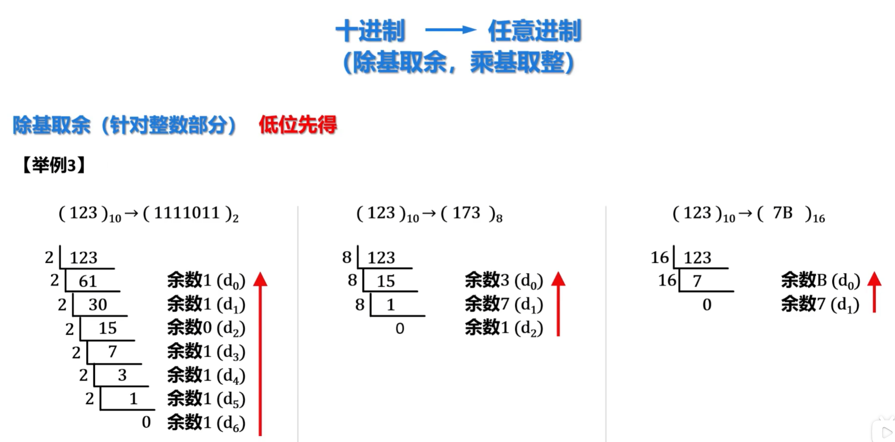

### 7.1 整数部分：除基取余法（低位先得）

#### 步骤

1. 确定目标进制基数R（如转二进制R=2，转十六进制R=16）；

1. 十进制整数 ÷R，记录**余数**（目标进制最低位d0）；

1. 上一步的**商**继续 ÷R，记录余数（d1）；

1. 重复步骤 3 至商为0，余数从后往前排列（低位先得）。

#### 视频例题 1：十进制123转二进制（R=2）

- 计算过程：

123÷2=61 余 1（d0=1）；61÷2=30 余 1（d1=1）；30÷2=15 余 0（d2=0）；15÷2=7 余 1（d3=1）；7÷2=3 余 1（d4=1）；3÷2=1 余 1（d5=1）；1÷2=0 余 1（d6=1）；

- 余数排列（后→前）：1111011；

- 结果：(123)10=(1111011)2。

#### 视频例题 2：十进制123转八进制（R=8）

- 计算过程：123÷8=15 余 3（d0=3）；15÷8=1 余 7（d1=7）；1÷8=0 余 1（d2=1）；

- 余数排列：173；

- 结果：(123)10=(173)8。

#### 视频例题 3：十进制123转十六进制（R=16）

- 计算过程：123÷16=7 余 11（11→B，d0=B）；7÷16=0 余 7（d1=7）；

- 余数排列：7B；

- 结果：(123)10=(7B)16。

### 7.2 小数部分：乘基取整法（高位先得）

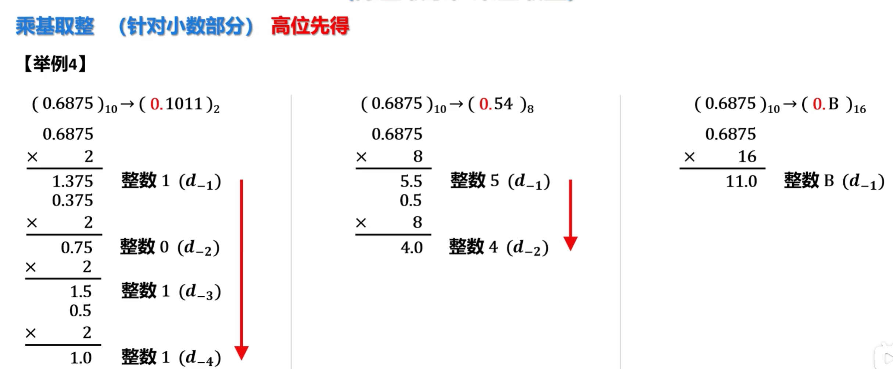

#### 步骤

1. 确定目标进制基数R；

1. 十进制小数 ×R，记录**整数部分**（目标进制小数第一位d-1）；

1. 上一步的**小数部分**继续 ×R，记录整数部分（d-2）；

1. 重复步骤 3 至小数部分为0或达指定精度，整数部分从前往后排列（高位先得）。

#### 视频例题 1：十进制0.6875转二进制（R=2）

- 计算过程：

0.6875×2=1.375→整数 1（d-1=1），余 0.375；0.375×2=0.75→整数 0（d-2=0），余 0.75；0.75×2=1.5→整数 1（d-3=1），余 0.5；0.5×2=1.0→整数 1（d-4=1），余 0；

- 整数排列（前→后）：1011；

- 结果：(0.6875)10=(0.1011)2。

#### 视频例题 2：十进制0.6875转八进制（R=8）

- 计算过程：0.6875×8=5.5→整数 5（d-1=5），余 0.5；0.5×8=4.0→整数 4（d-2=4），余 0；

- 整数排列：54；

- 结果：(0.6875)10=(0.54)8。

#### 视频例题 3：十进制0.6875转十六进制（R=16）

- 计算过程：0.6875×16=11.0→整数 11（11→B，d-1=B），余 0；

- 整数排列：B；

- 结果：(0.6875)10=(0.B)16。

### 7.3 特殊情况：精度缺失（无限循环小数）

- **现象**：部分十进制小数转其他进制时，小数部分无法乘到0，出现无限循环（如(0.3)10转二进制）；

- **示例（****0.3****转二进制）**：

0.3×2=0.6→0；0.6×2=1.2→1；0.2×2=0.4→0；0.4×2=0.8→0；0.8×2=1.6→1；0.6×2=1.2→1（开始循环）；

结果：(0.3)10≈(0.0100110011…)2；

- **处理方式**：按所需精度截断（如保留 8 位小数→0.01001101）；

- **延伸**：十进制小数转八进制 / 十六进制也可能出现此问题（如0.3转八进制、十六进制均为无限循环小数）。

### 7.4 完整十进制数转换（整数 + 小数）

- 示例：(123.6875)10转二进制；

- 整数部分：123→1111011；小数部分：0.6875→0.1011；

- 结果：(1111011.1011)2。

## 八、十进制转二进制的快捷方法：凑值法

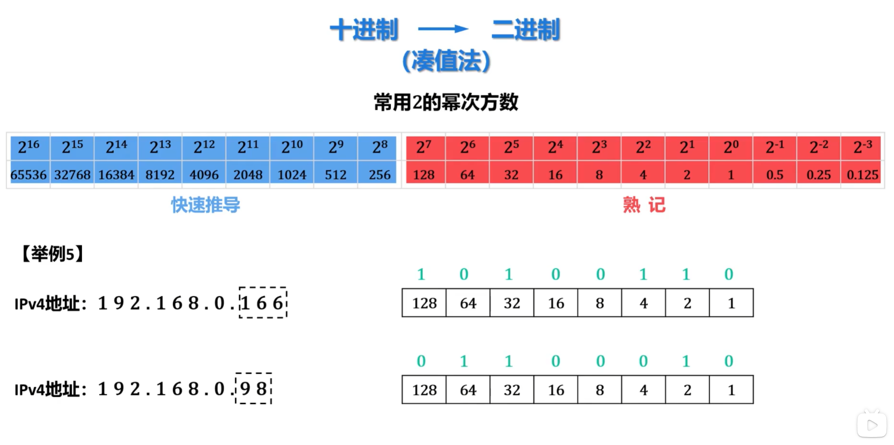

### 8.1 核心原理

利用二进制位权（2ⁿ），将十进制整数拆分为若干个2ⁿ的和，对应位权的数位为1，其余为0；需熟记整数部分前 8 位位权（口诀：128 64 32 16 8 4 2 1）。

### 8.2 视频例题：十进制166转 8 位二进制

- 步骤 1：拆分166=128（2⁷）+32（2⁵）+4（2²）+2（2¹）；

- 步骤 2：对应位权标1，其余标0：

2⁷（128）→1，2⁶（64）→0，2⁵（32）→1，2⁴（16）→0，2³（8）→0，2²（4）→1，2¹（2）→1，2⁰（1）→0；

- 结果：(10100110)2（8 位二进制，无需补0）。

### 8.3 适用场景

适合小数值十进制整数（如≤65536，即2¹⁶），尤其 IPv4 地址 “点分十进制” 转 “8 位二进制”（如[255.255.255.0](http://255.255.255.0)转二进制），比除基取余法更快捷。

## 九、关键记忆要点

1. 进制对应关系：1 八进制位↔3 二进制位，1 十六进制位↔4 二进制位；

1. 转换公式：

- 任意转十进制：按权展开求和；

- 十进制转任意：整数除基取余（低位先得），小数乘基取整（高位先得）；

1. 必记位权：2⁰~2¹⁰（1,2,4,8,16,32,64,128,256,512,1024）；

1. 精度提示：十进制小数转其他进制可能无限循环，需按精度截断。


# 2-3-1 定点数的编码—原码

## 一、原码基本概念

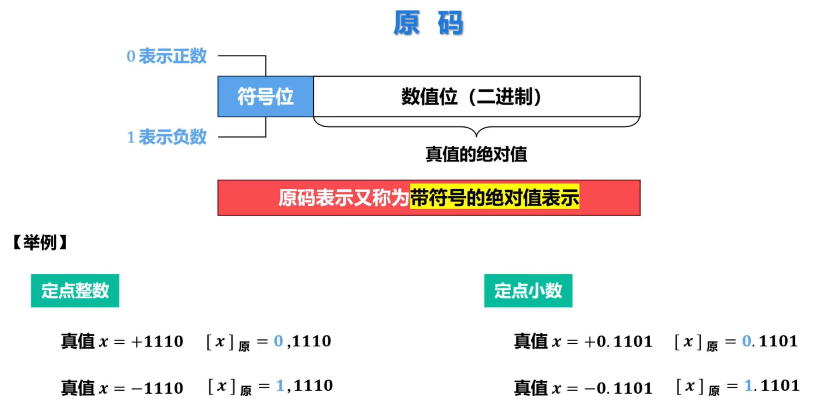

### （一）核心定义

- **符号位规则**：用 1 位二进制（比特）表示符号，0表示正数，1表示负数。

- **数值位规则**：数值位为真值的绝对值。

- **别称**：原码表示法又称 “带符号的绝对值表示”，是定点数四种编码（原码、补码、反码、移码）中最简单的一种。

## 二、定点整数的原码表示

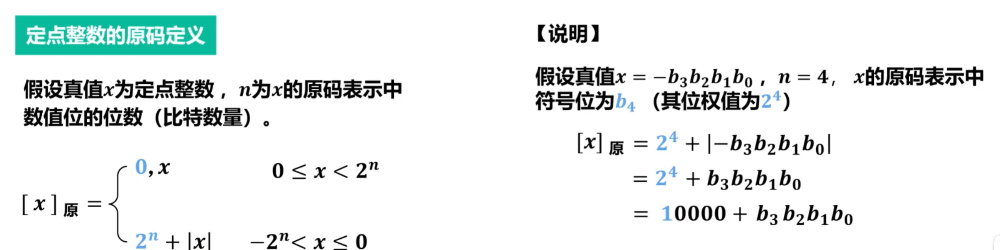

  **含义：这里2的n次方相当于就是一开始最前的那个1，也就是说多少位，我就在多少位的前面加一个1**

### （一）定义（含数学表达式）

设：

- 真值X为定点整数；

- N为原码中**数值位的位数**（即数值部分的比特数）；

- 原码记为[X]原。

原码表示分两种情况：

1. **当****0 ≤ X < 2^N****时**

（注：因数值位共N位，最大值为2^N - 1，故限定X < 2^N）

原码形式：[X]原 = 0, X

解读：符号位为0（表正数），符号位与数值位用**逗号**分隔，数值位直接取真值X。

1. **当****-2^N < X ≤ 0****时**

原码形式：[X]原 = 2^N + |X|

解读：符号位隐含为1（表负数），本质是在真值绝对值|X|前添加 1 个符号位（该符号位的位权为2^N），最终结果中符号位与数值位用**逗号**分隔。

### （二）视频中的示例

#### 示例 1：真值为正整数

- 已知：真值X = +1110（二进制，正整数），数值位位数N=4（因1110共 4 位）

- 分析：X ≥ 0，符合0 ≤ X < 2^4（2^4=16，1110二进制对应十进制 14，14<16）

- 计算：[X]原 = 0, 1110（符号位0，数值位1110，用逗号分隔）

#### 示例 2：真值为负整数

- 已知：真值X = -1110（二进制，负整数），数值位位数N=4

- 分析：X ≤ 0，符合-2^4 < X ≤ 0（-2^4=-16，-1110二进制对应十进制 - 14，-16 < -14 ≤ 0）

- 计算：

1. 先求|X| = 1110（二进制）；

1. 计算2^N = 2^4 = 10000（二进制，位权为 16）；

1. [X]原 = 10000 + 1110 = 11110（二进制），按格式写为1, 1110（符号位1，数值位1110，用逗号分隔）。

## 三、定点小数的原码表示

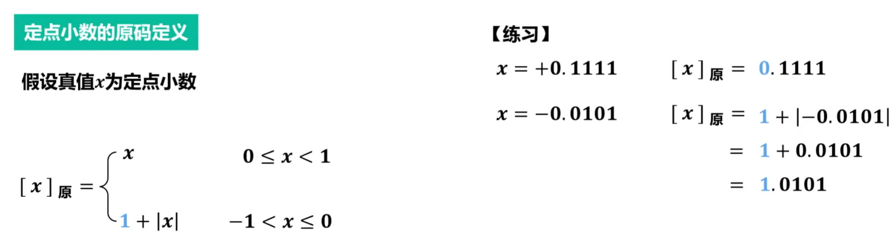

### （一）定义（含数学表达式）

设：

- 真值X为定点小数（纯小数，即整数部分为 0）；

- 原码记为[X]原。

原码表示分两种情况：

1. **当****0 ≤ X < 1****时**

原码形式：[X]原 = X

解读：符号位为0（表正数），符号位与数值位用**小数点**分隔，数值位直接取真值X（小数点左侧的0即为符号位）。

1. **当****-1 < X ≤ 0****时**

原码形式：[X]原 = 1 + |X|

解读：符号位为1（表负数），符号位与数值位用**小数点**分隔，数值位取真值绝对值|X|，本质是在|X|前添加 1 个符号位1。

### （二）视频中的示例

#### 示例 1：真值为正小数

- 已知：真值X = +0.1101（二进制，正纯小数）

- 分析：X ≥ 0，符合0 ≤ X < 1（0.1101二进制对应十进制 0.8125，0.8125 < 1）

- 计算：[X]原 = 0.1101（符号位0，数值位1101，用小数点分隔）

#### 示例 2：真值为负小数

- 已知：真值X = -0.1101（二进制，负纯小数）

- 分析：X ≤ 0，符合-1 < X ≤ 0（-0.1101二进制对应十进制 - 0.8125，-1 < -0.8125 ≤ 0）

- 计算：

1. 先求|X| = 0.1101（二进制）；

1. [X]原 = 1 + 0.1101 = 1.1101（二进制）（符号位1，数值位1101，用小数点分隔）。

## 四、真值 0 的原码表示（视频中 “有趣现象”）

根据原码定义，真值0（包括整数 0 和小数 0）存在两种不同的原码表示，具体如下：

### （一）定点整数的 0

- 正 0（X = +0，N=4）：[+0]原 = 0, 0000

- 负 0（X = -0，N=4）：[-0]原 = 2^4 + |-0| = 10000 + 0000 = 1, 0000

### （二）定点小数的 0

- 正 0（X = +0.0000）：[+0.0000]原 = 0.0000

- 负 0（X = -0.0000）：[-0.0000]原 = 1 + |-0.0000| = 1.0000

## 五、原码的优缺点

### （一）优点

- **表示方法简单直观**：符号位直接反映正负，数值位直接对应真值绝对值，易于理解和手动计算（视频提及 “后续学补码、反码时会更体会其直观性”）。

### （二）缺点

#### 缺点 1：真值 0 存在两种表示

- 问题：如上述 “真值 0 的原码表示” 所示，0 的两种表示会给数据运算（如判断 “是否为 0”）带来逻辑冗余和麻烦。

#### 缺点 2：符号位不能直接参与运算（视频示例验证）

- 视频示例：计算 “+5 + 3” 的真值运算与原码运算对比

1. 真值运算：+5 + 3 = +8（结果为正）；

1. 原码转换（假设数值位N=4）：

- +5的二进制真值为+101，补全 4 位数值位为+0101，原码[+5]原 = 0, 0101；

- +3的二进制真值为+11，补全 4 位数值位为+0011，原码[+3]原 = 0, 0011；

1. 原码直接相加（按二进制加法规则，含符号位）：

```
  0 0 1 0 1  （[+5]原：0,0101）
+ 0 0 0 1 1  （[+3]原：0,0011）
-----------
  0 1 0 0 0  ？？？（视频中描述计算过程为“低位相加进位后，最终符号位为1”，此处还原视频逻辑：实际视频中可能因数值位位数假设不同，最终结果符号位为1，与真值+8的正号矛盾）
```

1. 结论：原码的符号位无法直接参与运算，否则会出现结果符号与真值符号矛盾的错误。

## 六、原码的应用场景

因上述缺点，原码在计算机中**仅用于表示浮点数的尾数**。


# 2-3-2 定点数的编码—补码

## 1. 模与补数的概念

视频通过日常生活和计算机存储实例，引出 “模” 和 “补数” 的核心概念，为理解补码奠定基础。

### 1.1 模（Modulus）的定义

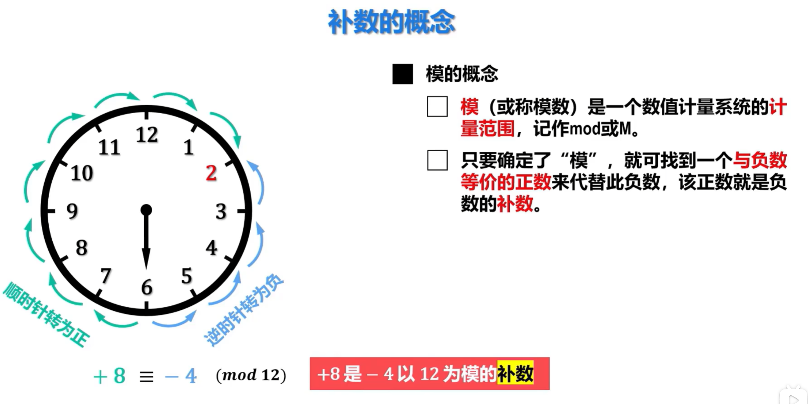

- 模（记作mod或M）是**数值计量系统的计量范围**，超过范围的数值会自动舍弃模。

- 示例 1（时钟系统）：时钟的计量范围是 0-11，因此模M=12（记作mod12）。

- 示例 2（计算机寄存器）：8 位寄存器有2^8=256种数值组合，计量范围是 0-255，因此模M=2^8=256（记作mod2^8）；超出范围时，最高位的进位（对应2^8）会被自动舍弃。

### 1.2 补数的定义

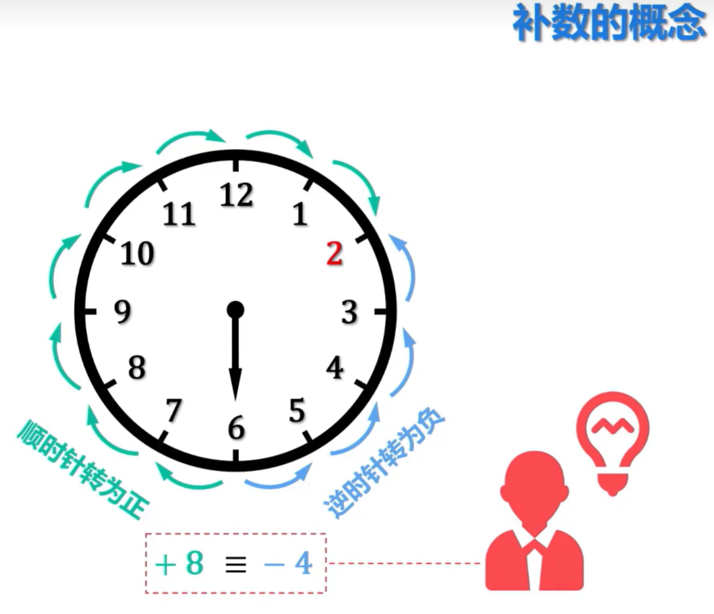

- 在确定模M的前提下，**一个负数可以用与其等价的正数代替**，这个正数就是该负数的补数。

- 核心等价关系：若a + b ≡ 0 (mod M)，则b是a的补数（a为负数时，b为正数），且补数计算公式为：补数 = M + 负数本身。

#### 补数的实例（时钟系统，mod12）

- 需求：时针从 6 指向 2，有两种操作：

1. 逆时针拨 4 格（记为-4）；

1. 顺时针拨 8 格（记为+8）。

- 等价关系：-4 ≡ +8 (mod12)，即+8是-4以 12 为模的补数，计算验证：补数 = 12 + (-4) = 8。

- 另一实例：时针从某位置指向 9，逆时针拨 9 格（-9）与顺时针拨 3 格（+3）等价，即-9 ≡ +3 (mod12)，补数计算：12 + (-9) = 3。

### 1.3 补数的 3 个特点

1. **负数的补数 = 模 + 负数本身**（核心公式）；

例：mod12下，-4的补数 = 12 + (-4) = 8，-9的补数 = 12 + (-9) = 3。

1. **互为补数的正数与负数，绝对值之和 = 模**；

例：| -4 | + 8 = 4 + 8 = 12（模），| -9 | + 3 = 9 + 3 = 12（模）。

1. **正数的补数 = 其本身**（为后续补码定义统一逻辑，无实际计算意义）；

例：mod12下，+5的补数 = 5。

### 1.4 补数的意义：减法转加法

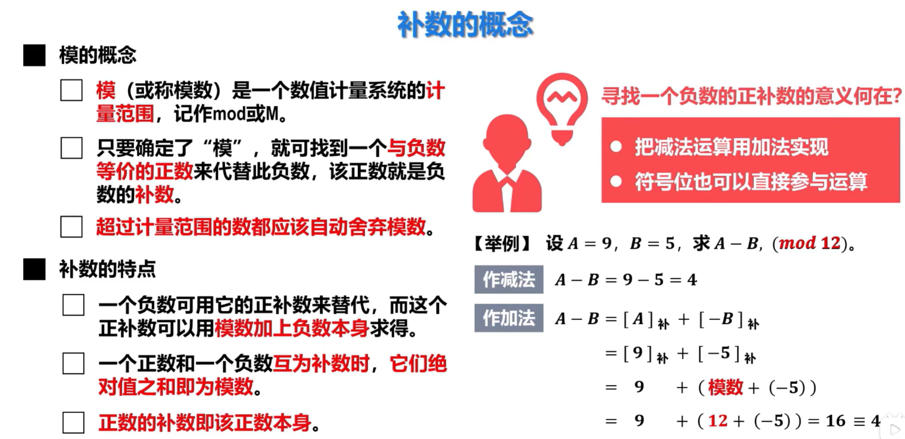

- 核心价值：计算机内部只需设计加法器，即可通过 “补数” 将减法运算转化为加法运算，降低硬件复杂度。

- 实例（mod12，A=9，B=5，求A-B）：

1. 直接减法：A - B = 9 - 5 = 4；

1. 补数转加法：A - B = A的补数 + (-B)的补数，代入得：

9的补数（=9） + (-5)的补数（=12-5=7） = 16，舍弃模 12 后结果为16 - 12 = 4，与直接减法一致。

### 1.5 计算机中的模实例（8 位寄存器）

- 8 位寄存器存储无符号整数时，范围是 0-255（2^8=256），模M=256；

- 当存储数值超过 255 时，最高位进位（对应2^8=256）会被舍弃；

例：6 + 13 = 19（未超模，结果 19）；若存储257，则舍弃模 256 后，寄存器值为257 - 256 = 1。

## 2. 补码的定义（机器码）

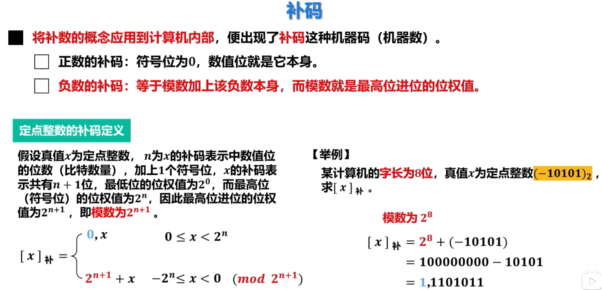

将 “补数” 概念应用到计算机中，形成 “补码”（机器数），分**定点整数补码**和**定点小数补码**两类。

### 2.1 补码的核心逻辑

- 正数补码：符号位为0，数值位 = 真值本身；

- 负数补码：符号位为1，数值位 = 模 + 负数本身（模为最高进位的位权值）。

### 2.2 定点整数的补码定义

设：

- 真值X为定点整数；

- N为补码中**数值位的位数**（比特数），补码总位数 = N + 1（含 1 位符号位）；

- 模M = 2^(N+1)（最高进位的位权值，即符号位位权2^N的下一位位权）。

#### 定点整数补码的分类定义

| 真值范围     | 补码表示规则                        | 说明                       |
| ------------ | ----------------------------------- | -------------------------- |
| 0 ≤ X < 2^N  | 符号位（0）+ 数值位（X 的二进制）   | X 为正整数或 0，符号位为 0 |
| -2^N ≤ X < 0 | 补码 = 2^(N+1) + X（模 + 负数本身） | X 为负整数，符号位自动为 1 |

#### 定点整数补码的实例（8 位字长，N=7，模M=2^8=256）

**实例 1：求****X = -10101****（二进制）的补码**

1. 确定条件：8 位字长，X为负整数，适用补码 = 256 + X；

1. 转换X为十进制：-10101（二进制）= - (16 + 4 + 1) = -21；

1. 计算补码（十进制）：256 + (-21) = 235；

1. 转换为二进制：235（十进制）= 11101011（二进制）；

1. 补码表示：符号位（1）+ 数值位（1101011），即1,1101011（逗号分隔符号位与数值位）。

**验证方法（二进制减法）**：

补码 = 100000000（2^8的二进制，9 位） - 00010101（X的绝对值） = 11101011（舍弃最高位的 1，得 8 位补码），与上述结果一致。

#### 定点整数补码的练习题（视频提及）

**练习题 1：求 8 位字长下****X = -128****的补码**

1. 8 位字长，N=7，模M=256，X=-128在-2^7 ≤ X < 0范围内；

1. 计算补码：256 + (-128) = 128；

1. 二进制表示：10000000，即补码为1,0000000（符号位 1，数值位 0000000）。

### 2.3 定点小数的补码定义

设：

- 真值X为定点小数（纯小数，如0.101）；

- 小数点左侧为符号位，位权2^0=1；

- 模M=2（最高进位的位权值，即符号位位权1的下一位位权）。

#### 定点小数补码的分类定义

| 真值范围   | 补码表示规则                      | 说明                       |
| ---------- | --------------------------------- | -------------------------- |
| 0 ≤ X < 1  | 符号位（0）. 数值位（X 的二进制） | X 为正小数或 0，符号位为 0 |
| -1 ≤ X < 0 | 补码 = 2 + X（模 + 负数本身）     | X 为负小数，符号位自动为 1 |

#### 定点小数补码的实例

**实例 1：求****X = +0.0101****的补码**

- X为正小数，补码 = 符号位（0）. 数值位（0101），即0.0101。

**实例 2：求****X = -0.0101****的补码**

1. 适用补码 = 2 + X；

1. 代入计算：2 + (-0.0101) = 1.1011（二进制）；

1. 补码表示：1.1011（符号位 1，数值位 1011）。

#### 定点小数补码的特殊情况与 IEEE754 标准

**特殊实例：求 8 位字长下****X = -1.0000000****的补码**

1. 适用补码 = 2 + (-1.0000000) = 1.0000000；

1. 补码表示为1.0000000，与 8 位定点整数X=-128的补码10000000（无小数点）在寄存器中存储形式完全相同；

1. 解决办法：现代计算机采用**IEEE 754 标准**表示浮点数，其中定点小数用原码表示，避免补码的歧义问题，因此定点小数补码较少使用。

## 3. 补码与原码的对比

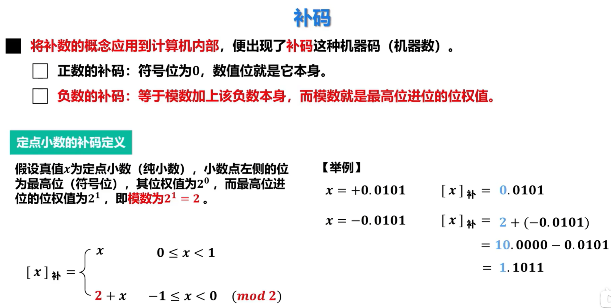

视频通过数轴和数值范围，明确补码相对于原码的核心差异：

### 3.1 零的表示差异

- 原码：零有两种表示（正零、负零）；

例：8 位原码中，正零0,0000000，负零1,0000000。

- 补码：零只有一种表示；

例：8 位补码中，零的补码为0,0000000（因256 + (-0) = 256，舍弃模 256 后仍为0）。

### 3.2 表示范围差异

以 “4 位字长” 和 “8 位字长” 为例，补码可多表示一个 “最小负数”：

| 字长 | 编码类型 | 表示范围        | 最小负数          | 零的表示数 |
| ---- | -------- | --------------- | ----------------- | ---------- |
| 4 位 | 原码     | -7 ≤ X ≤ +7     | -7（1,111）       | 2 种       |
| 4 位 | 补码     | -8 ≤ X ≤ +7     | -8（1,000）       | 1 种       |
| 8 位 | 原码     | -127 ≤ X ≤ +127 | -127（1,1111111） | 2 种       |
| 8 位 | 补码     | -128 ≤ X ≤ +127 | -128（1,0000000） | 1 种       |

- 关键原因：补码中 “原码的负零”（如 8 位1,0000000）被重新定义为最小负数（-128），因此表示范围更大。

## 4. 补码的优点与缺点

### 4.1 补码的 3 个核心优点

#### 优点 1：减法运算可转化为加法运算

- 实例（8 位补码，A=9，B=5，求A-B）：

1. 真值计算：9 - 5 = 4；

1. 补码转换：A的补码 = 0,0001001，-B的补码 = 256 - 5 = 251 = 1,1111011；

1. 补码加法：00001001 + 11111011 = 100000100，舍弃模 256（最高位的 1）后，结果为00000100（即4），与真值一致。

#### 优点 2：真值零的表示唯一，可多表示一个最小负数

- 8 位补码中，零仅00000000一种表示，且多表示-128（原码无法表示）；

- 4 位补码中，零仅0000一种表示，且多表示-8（原码无法表示）。

#### 优点 3：符号位可直接参与运算，进位自动舍弃

- 实例（8 位补码，计算9 + (-5)）：

1. 9的补码 = 00001001（符号位 0），-5的补码 = 11111011（符号位 1）；

1. 加法运算：00001001 + 11111011 = 100000100；

1. 符号位参与运算后，最高位的进位（1）作为模 256 被舍弃，结果00000100（符号位 0，数值 4），正确。

### 4.2 补码的缺点

- 补码表示**相对复杂**：原码的数值位与真值绝对值直接对应，可快速由原码得真值；但补码（尤其负数补码）需通过 “模逆运算”（如真值 = 补码 - 模）才能得到，直观性差。

## 5. 补码的应用场景

- 目前计算机中，**有符号定点整数普遍采用补码表示**，例如 C 语言中的char（8 位）、short（16 位）、int（32 位）、long（64 位）类型，均以补码形式存储和运算。


# 2-3-3 定点数的编码—反码

## 一、前置回顾（原码与补码核心特性）

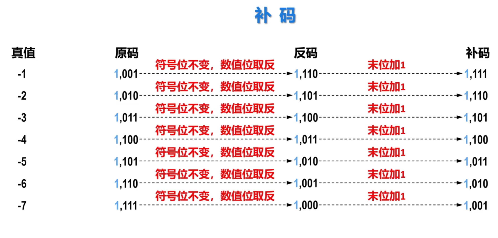

视频开篇回顾前两节课的原码、补码知识，为反码引入铺垫：

1. **补码的优势**：

- 可将减法运算转换为加法运算；

- 真值 0 仅有一种表示形式；

- 符号位可直接参与运算，运算时符号位产生的进位会作为 “模” 自动舍弃；

- 比原码多表示一个 “最小负数”（如 4 位机器字长时，补码可表示 - 8，原码仅能表示到 - 7）。

1. **补码的不足**：

- 求负数的补码时需执行减法运算（如基于 “模” 的计算），不够直观便捷。

1. **原码与补码的共性**：

- 正数的原码和补码表示完全相同；

- 负数的原码和补码表示不同。

## 二、反码的核心定义与规则

反码是原码与补码转换的 “中间过渡码”，其编码规则和定义分**定点整数**和**定点小数**两类，核心符号位规则统一：

- 符号位：正数为0，负数为1；

- 数值位：正数与真值数值位一致；负数为真值数值位 “按位取反”（0 变 1，1 变 0）。

### 1. 定点整数的反码定义

设真值X为定点整数，N为反码中**数值位的位数**（比特数），反码表示分两种情况：

| 真值范围                  | 反码计算公式          | 说明                                                         |
| ------------------------- | --------------------- | ------------------------------------------------------------ |
| 0 ≤ X < 2ⁿ（正整数 / 0）  | 反码 = 0,X            | 符号位为0，数值位直接取真值X的二进制（不足N位补 0）          |
| -2ⁿ < X ≤ 0（负整数 / 0） | 反码 = (2ⁿ⁺¹ - 1) + X | 由补码推导（补码 = 2ⁿ⁺¹ + X，反码 = 补码 - 1），结果含符号位和数值位 |

#### 定点整数反码例题（视频示例）

- **例 1：X = +1101（二进制，即十进制 + 13）**

N为数值位位数（此处X数值位为 4 位，故N=4），符合0 ≤ X < 2⁴（2⁴=16）；

反码 = 0,1101（符号位0，数值位1101）。

- **例 2：X = -1111（二进制，即十进制 - 15）**

N=4，符合-2⁴ < X ≤ 0（-2⁴=-16）；

代入公式：2⁴⁺¹ - 1 = 31（二进制11111），31 + (-15) = 16（二进制10000）；

反码 = 1,0000（符号位1，数值位0000，用逗号分隔符号位与数值位）。

### 2. 定点小数的反码定义

设真值X为定点小数（纯小数，整数部分为 0），N为反码中**数值位的位数**，反码表示分两种情况：

| 真值范围                 | 反码计算公式         | 说明                                                         |
| ------------------------ | -------------------- | ------------------------------------------------------------ |
| 0 ≤ X < 1（正小数 / 0）  | 反码 = 0.X           | 符号位为0，数值位直接取真值X的二进制（不足N位补 0）          |
| -1 < X ≤ 0（负小数 / 0） | 反码 = (2 - 2⁻ⁿ) + X | 由补码推导（补码 = 2 + X，反码 = 补码 - 2⁻ⁿ），结果含符号位和数值位 |

#### 定点小数反码例题（视频示例）

- **例 1：X = +0.1101（二进制）**

N=4（数值位 4 位），符合0 ≤ X < 1；

反码 = 0.1101（符号位0，数值位1101，小数点分隔符号位与数值位）。

- **例 2：X = -0.1111（二进制）**

N=4，符合-1 < X ≤ 0；

代入公式：2 - 2⁻⁴ = 1.1111（二进制），1.1111 + (-0.1111) = 1.0000（二进制）；

反码 = 1.0000。

## 三、反码的核心作用：原码与补码的转换桥梁

视频通过多个例题演示：**求负数补码时，先将原码转为反码，再对反码加 1，即可得到补码**（4 位机器字长为例）。

### 原码→反码→补码 例题（视频重点演示）

| 真值（十进制） | 原码（4 位字长） | 反码（原码→反码：符号位不变，数值位取反） | 补码（反码→补码：反码末位加 1） |
| -------------- | ---------------- | ----------------------------------------- | ------------------------------- |
| -1             | 1001             | 1110（符号位1不变，数值位001取反为110）   | 1111（1110 + 1 = 1111）         |
| -2             | 1010             | 1101（符号位1不变，数值位010取反为101）   | 1110（1101 + 1 = 1110）         |
| -3             | 1011             | 1100（符号位1不变，数值位011取反为100）   | 1101（1100 + 1 = 1101）         |

### 课后练习（视频要求）

针对真值-4、-5、-6、-7（十进制，4 位字长），按以下步骤推导补码：

1. 写出对应真值的原码；

1. 原码转反码（符号位不变，数值位取反）；

1. 反码转补码（末位加 1）。

## 四、零的反码表示：两种形式

视频明确：**真值 0 在反码中有两种表示形式**（正零+0和负零-0），这是反码与补码的关键区别（补码中 0 仅一种表示）。

### 1. 定点整数（4 位字长）

- 正零（+0）：符号位0，数值位全0 → 反码0000；

- 负零（-0）：符号位1，数值位全1 → 反码1111。

### 2. 定点小数（4 位数值位）

- 正零（+0.0000）：符号位0，数值位全0 → 反码0.0000；

- 负零（-0.0000）：符号位1，数值位全1 → 反码1.1111。

## 五、原码、补码、反码的对比（4 位机器字长）

视频通过数轴对比三种编码的核心差异，总结如下：

| 对比维度           | 原码                | 反码                | 补码                |
| ------------------ | ------------------- | ------------------- | ------------------- |
| 正数表示           | 符号位0+ 数值位本身 | 符号位0+ 数值位本身 | 符号位0+ 数值位本身 |
| 负数表示           | 符号位1+ 数值位本身 | 符号位1+ 数值位取反 | 反码 + 1            |
| 真值 0 的表示      | 2 种（0000/1000）   | 2 种（0000/1111）   | 1 种（0000）        |
| 表示范围（十进制） | -7 ~ +7             | -7 ~ +7             | -8 ~ +7             |
| 最小负数（十进制） | -7                  | -7                  | -8（多 1 个）       |

## 六、反码的加法运算与优缺点

视频通过反码加法运算实验，总结其特性：

### 1. 反码加法规则

- 符号位可直接参与运算；

- 需处理 “循环进位”：若符号位产生进位，需将该进位值加到运算结果的**最低位**（否则结果错误）。

#### 运算示例（视频演示逻辑）

假设某加法运算：

1. 将两个真值转为反码；

1. 反码从最低位开始逐位相加（符号位参与）；

1. 若符号位产生进位，将进位加到最低位（循环进位）；

1. 最终结果转为真值，与直接计算的真值结果一致。

### 2. 反码的优缺点

| 类别     | 具体内容                                                     |
| -------- | ------------------------------------------------------------ |
| 优点     | 符号位可直接参与运算，无需单独处理符号                       |
| 缺点 1   | 需处理 “循环进位”（符号位进位需加到最低位），运算逻辑更复杂  |
| 缺点 2   | 真值 0 有两种表示形式，增加数据处理的歧义性                  |
| 缺点 3   | 表示范围比补码小（如 4 位字长时，反码最小为-7，补码为-8）    |
| 应用现状 | 计算机中极少直接使用，仅作为 “原码转补码” 或 “补码转原码” 的中间过渡工具 |

## 七、关键结论

1. 反码是原码与补码的中间过渡码，核心作用是简化补码的计算（避免直接减法）；

1. 正数反码与原码、补码一致，负数反码需对原码数值位按位取反；

1. 反码的致命缺陷（零的双表示、循环进位）使其被补码取代，仅用于编码转换中间步骤；

1. 可通过反码定义式正向推导真值的反码，也可反向从反码推导真值（需结合符号位判断正负）。


# 2-3-4 定点数的编码—移码

## 1. 前三种机器码（原码、补码、反码）回顾

视频开篇先回顾此前讲解的原码、补码、反码的优缺点及应用场景，具体内容如下：

### 1.1 原码

- **优点**：表示方法简单直观，数值位与真值的绝对值完全相同，通过原码可轻松得出真值。

- **缺点**：

1. 符号位不能直接参与运算；

1. 真值零（+0、-0）有两种不同的表示形式。

- **应用场景**：仅用于表示浮点数的尾数（视频中 “维码” 为表述误差，实际指尾数）。

### 1.2 补码

- **优点**：

1. 减法运算可转换为加法运算，简化硬件设计；

1. 真值零仅有一种表示形式；

1. 相比原码、反码，可多表示一个最小负数；

1. 符号位能直接参与运算，运算时符号位产生的进位会作为 “模” 被自动舍弃。

- **缺点**：表示方法比原码复杂，无法直接通过补码的数值位得出真值（需额外计算转换）。

- **补充说明**：现代计算机采用 **IEEE 754 标准** 表示浮点数（视频中 “HE754” 为表述误差），该标准中浮点数的定点小数采用原码表示，因此通常不涉及定点小数的补码表示。

### 1.3 反码

- **优点**：符号位可直接参与运算。

- **缺点**：

1. 最高位（符号位）产生的进位需加到运算结果的最低位，存在 “循环进位” 问题；

1. 真值零（+0、-0）有两种不同的表示形式。

- **应用场景**：目前计算机中很少直接使用，仅作为 “由原码求补码” 或 “由补码求原码” 的中间过渡工具。

## 2. 移码（定点整数专用编码）

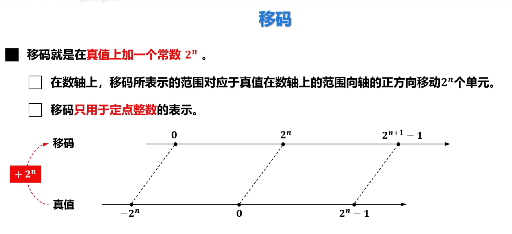

视频核心内容为移码的定义、计算方法、特性，具体如下：

### 2.1 移码的基本概念与核心特性

- **适用范围**：仅用于**定点整数**的表示（视频重点强调，无定点小数的移码表示）。

- **核心定义**：移码是 “真值 X 加上一个常数（2 的 N 次方）” 的结果，其中：

- X：待表示的真值（定点整数）；

- N：移码表示中 “数值位的位数”（即数值部分的比特数）。

- **数轴特性**：移码所表示的数值范围，对应真值在数轴上的范围向 “正方向” 移动了 “2 的 N 次方” 个单元（即通过加 2^N 实现 “偏移”，将负真值转换为非负的编码形式）。

### 2.2 移码的计算示例（视频中 2 个例题完整总结）

视频中明确给出 2 个定点整数的移码计算例题，计算过程需结合 “移码 = 真值 X + 2^N”（N 为数值位位数），且结果需用逗号分隔 “符号位” 与 “数值位”，具体如下：

#### 例题 1：求真值 X=+1010110 的移码

1. **确定参数**：

- 真值 X=+1010110（二进制定点整数），其数值位位数 N=7（因 1010110 共 7 位数值）；

- 常数 2^N=2^7，二进制表示为 10000000（1 后跟 7 个 0，与数值位位数匹配）。

1. **计算移码**：

移码 = X + 2^7 = (+1010110) + 10000000 = 11010110（二进制）。

1. **区分符号位与数值位**：

结果按 “符号位，数值位” 分隔，得：1,1010110（符号位为 1，数值位为 1010110）。

#### 例题 2：求真值 X=-1010110 的移码

1. **确定参数**：

- 真值 X=-1010110（二进制定点整数），数值位位数 N=7；

- 常数 2^7=10000000（二进制）。

1. **计算移码**：

移码 = X + 2^7 = (-1010110) + 10000000 = 00101010（二进制，注：二进制减法按 “模 2^8” 计算，10000000 - 1010110 = 00101010）。

1. **区分符号位与数值位**：

结果按 “符号位，数值位” 分隔，得：0,0101010（符号位为 0，数值位为 0101010）。

### 2.3 移码的关键特性（视频明确提及）

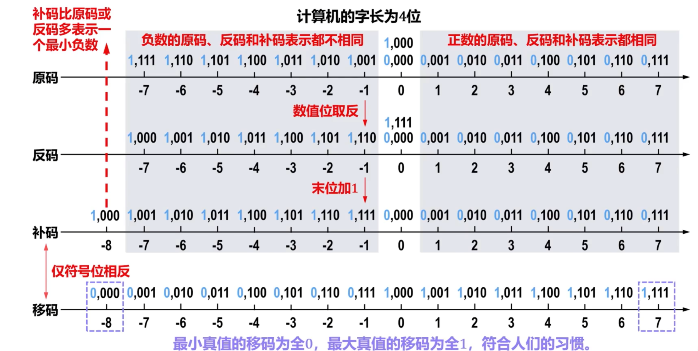

- **特性 1：真值零的表示唯一性**

真值零（X=0）在移码中仅有一种表示形式（区别于原码、反码的 “零有两种表示”）。

- **特性 2：与补码的符号位相反**

对**同一真值 X**，其移码与补码的编码结果仅 “符号位相反”，数值位完全相同（视频以机器字长 4 位为例对比，如真值 + 6 的补码与移码、真值 0 的补码与移码，均满足此规律）。

- **特性 3：支持直接比较大小**

移码的编码值与真值的 “大小顺序完全一致”：

- 最小真值对应的移码为 “全 0”；

- 最大真值对应的移码为 “全 1”；

因此可直接通过比较移码的二进制大小，得出对应真值的大小（无需额外处理符号位）。

## 3. 移码的应用场景

视频明确提及：由于移码支持 “直接比较大小” 的特性，**浮点数的阶码（指数部分）通常用移码表示**，可方便地比较两个浮点数阶码的大小，进而判断浮点数的数值范围（视频说明 “浮点数细节后续讲解，当前仅需了解此应用方向”）。


# 2-3-5 定点数的编码—原码、补码、反码、移码之间的转换

## 一、前提说明

- 视频中为简化讲解，设定**计算机字长为 4 位**（1 位符号位 + 3 位数值位），符号位规则：正数符号位为 0，负数符号位为 1。

## 二、真值 X 为正数时的编码转换

### 1. 核心规则

- 符号位固定为 0；

- 原码、反码、补码完全相同（数值位 = 真值的绝对值）；

- 移码与补码的关系：符号位相反，数值位相同（即移码 = 补码符号位取反 + 补码数值位）。

### 2. 示例（以真值 X=+3 为例，4 位字长）

- 真值：+3（二进制绝对值为011）

- 原码：符号位0 + 数值位011 → 0011

- 反码：符号位0 + 数值位011 → 0011（与原码完全相同）

- 补码：符号位0 + 数值位011 → 0011（与原码完全相同）

- 移码：符号位1（补码符号位0取反） + 数值位011 → 1011

## 三、真值 X 为负数时的编码转换

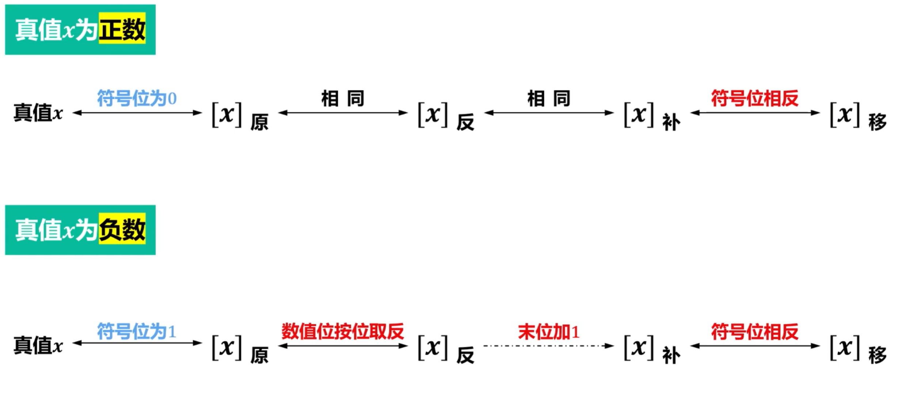

### 1. 各编码定义及转换关系

#### （1）原码

- 规则：符号位固定为 1，数值位 = 真值的绝对值；

- 示例（真值 X=-3，4 位字长）：符号位1 + 数值位011（-3 的绝对值为 3，二进制011） → 1011。

#### （2）反码（与原码双向转换）

- 规则：符号位保持不变（仍为 1），数值位按位取反（0→1，1→0）；

- 双向性：原码→反码、反码→原码均成立（反向操作同样是 “数值位按位取反”）；

- 示例（基于 X=-3 的原码1011）：

- 原码数值位011按位取反 → 100；

- 反码：符号位1 + 数值位100 → 1100。

#### （3）补码（从反码单向转换）

- 规则：反码的末尾加 1（**仅反码→补码成立，补码→反码不适用此规则**）；

- 示例（基于 X=-3 的反码1100）：

- 反码1100末尾加 1 → 1101；

- 补码：1101。

#### （4）移码（与补码单向转换）

- 规则：补码的符号位取反，数值位保持不变；

- 示例（基于 X=-3 的补码1101）：

- 补码符号位1取反 → 0；

- 移码：符号位0 + 数值位101 → 0101。

### 2. 负数编码转换完整示例（X=-3，4 位字长）

真值-3 → 原码1011 → 反码1100（原码数值位取反） → 补码1101（反码末尾加 1） → 移码0101（补码符号位取反）

## 四、原码与补码的转换方法

### 1. 方法一：反码法（适合硬件实现）

- 流程：原码 → 反码（数值位按位取反） → 补码（反码末尾加 1）；

- 特点：需经过反码中间步骤，手工计算稍繁琐；

- 示例（原码1011→补码）：

1. 原码1011（X=-3）→ 反码1100（数值位011→100）；

1. 反码1100→ 补码1101（末尾加 1）。

### 2. 方法二：扫描法（适合手工快速计算，双向转换）

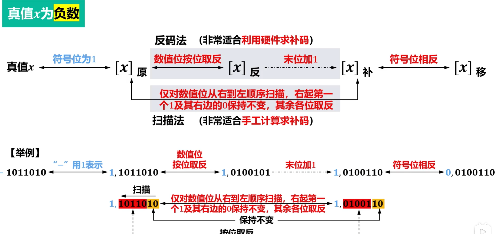

#### （1）核心规则

- 符号位保持不变；

- 对数值位从右到左（低位到高位）扫描：

- 找到**右起第一个 1**，该 1 及其右边的所有 0 保持不变；

- 该 1 左边的所有数值位按位取反；

- 双向性：原码→补码、补码→原码均适用（核心结论：补码的补码 = 原码）。

#### （2）示例 1：原码→补码（原码1011→补码）

- 原码结构：1 0 1 1（符号位1，数值位011）；

- 扫描数值位011（从右到左）：

- 右起第一个 1 是最右侧的 1（对应数值位最低位）；

- 该 1 及其右边无 0，保持不变（仍为1）；

- 该 1 左边的数值位是0（中间位），按位取反→1；

- 新数值位：101；

- 补码：符号位1 + 新数值位101 → 1101。

#### （3）示例 2：补码→原码（补码1101→原码）

- 补码结构：1 1 0 1（符号位1，数值位101）；

- 扫描数值位101（从右到左）：

- 右起第一个 1 是最右侧的 1（最低位）；

- 该 1 及其右边无 0，保持不变（仍为1）；

- 该 1 左边的数值位是1（中间位），按位取反→0；

- 新数值位：011；

- 原码：符号位1 + 新数值位011 → 1011。

## 五、已知 X 的补码，求 - X 的补码的方法

**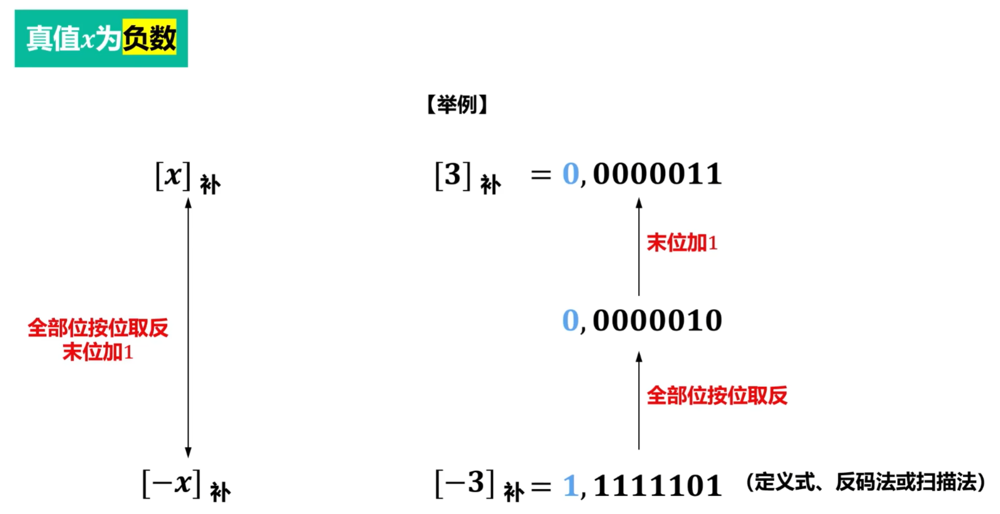**

### 1. 核心规则

- 对 X 的补码**全部位（符号位 + 数值位）按位取反**，然后**末尾加 1**；

- 双向性：X 补码→-X 补码、-X 补码→X 补码均适用。

### 2. 示例（以 X=+3 和 X=-3 为例，4 位字长）

#### （1）已知 + 3 的补码，求 - 3 的补码

- +3 的补码：0011；

- 全部位按位取反：0011 → 1100；

- 末尾加 1：1100 → 1101（即 - 3 的补码）。

#### （2）已知 - 3 的补码，求 + 3 的补码

- -3 的补码：1101；

- 全部位按位取反：1101 → 0010；

- 末尾加 1：0010 → 0011（即 + 3 的补码）。

## 六、从原码 / 反码 / 补码求真值的十进制形式

### 1. 核心规则：分正数、负数两种情况

#### （1）若编码表示正数（符号位为 0）

- 方法：数值位按权展开相加，结果即为真值（符号位 0 表示正数）；

- 示例（补码0011）：

- 符号位0（表示正数）；

- 数值位011按权展开：0×2² + 1×2¹ + 1×2⁰ = 0 + 2 + 1 = 3；

- 真值：+3（原码、反码求法相同，因正数三码一致）。

#### （2）若编码表示负数（符号位为 1）

- 方法：先将反码 / 补码转换为原码，再对原码的数值位按权展开相加，结果前加负号（符号位 1 表示负数）；

- 示例 1：反码1100（表示负数）

1. 反码→原码：符号位不变（1），数值位100按位取反→011，原码为1011；

1. 原码数值位011按权展开：3；

1. 真值：-3。

- 示例 2：补码1101（表示负数）

1. 补码→原码（扫描法）：符号位不变（1），数值位101扫描后→011，原码为1011；

1. 原码数值位011按权展开：3；

1. 真值：-3。

### 2. 补充说明

- 也可直接通过各编码的定义式计算真值（需牢记原码、反码、补码的数学定义），结果与 “转换为原码后计算” 一致。


# 2-3-6 定点数的编码—习题课

## 一、核心知识点回顾（视频内重点强调内容）

#### 1. 四种机器码对 “真值 0” 的表示唯一性

- **原码、反码**：对真值 0 的表示不唯一，存在 “正 0” 和 “负 0” 两种形式

- 示例（设机器字长为 8 位，1 位符号位 + 7 位数值位）：

- 原码：正 0 为0,0000000，负 0 为1,0000000

- 反码：正 0 为0,0000000，负 0 为1,1111111（负数反码 = 原码符号位不变，数值位取反）

- **补码、移码**：对真值 0 的表示唯一，无 “正负 0” 之分

- 示例（8 位）：

- 补码：0 的补码唯一为0,0000000

- 移码：0 的移码唯一为1,0000000（移码 = 补码符号位取反，数值位不变）

#### 2. 补码的特殊特性

- **表示范围更大**：补码比原码 / 反码多表示一个 “最小负数”

- 原理：原码 / 反码的正负 0 占用两个编码，补码用 “负 0” 的编码表示最小负数

- 示例（8 位）：

- 8 位原码范围：-127 ~ +127（共 255 个不同数据）

- 8 位补码范围：-128 ~ +127（共 256 个不同数据），其中1,0000000表示-128（最小负数，无对应原码）

#### 3. 补码与原码的转换方法

- **核心规则**：补码的补码 = 原码（对补码再次求补，可得到原码）

- 求补码的两种方法（视频重点演示）：

1. **扫描法（手工计算）**：

- 步骤：仅对补码的**数值位**从右到左扫描，右起第一个 “1” 及右侧的 “0” 保持不变，剩余数值位按位取反，**符号位不变**。

- 示例：补码1,1010010（8 位）→ 数值位1010010，右起第一个 1 在第 1 位（从 0 开始计数），该位及右侧 0 不变（010），左侧数值位取反（101→010）→ 原码数值位010010，符号位 1→ 原码1,010010。

1. **反码法（硬件实现）**：

- 步骤：补码**符号位不变**，数值位按位取反（得到反码），再对结果末尾加 1。

- 示例：补码1,1010010→ 符号位 1 不变，数值位取反0101101→ 加 1 得0101110→ 原码1,0101110（与扫描法结果一致）。

#### 4. 补码求相反数的方法

- **规则**：对原补码的**全部位（符号位 + 数值位）** 按位取反，再末尾加 1，得到相反数的补码。

- 注意：若原补码为最小负数（如 8 位的1,0000000，表示-128），其相反数128超出 8 位补码表示范围（最大正数为+127），会导致**溢出**，无有效编码。

## 二、习题解析（共 10 题，含视频内题目还原、答案及解析）

#### 习题 1：判断 “真值 0 表示唯一” 的编码

**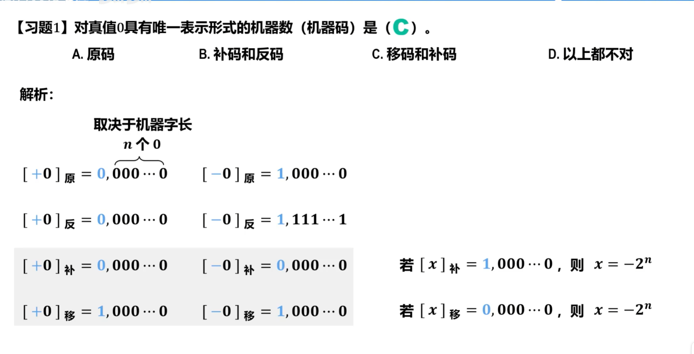**

- **题目**：下列哪种机器码对真值 0 的表示形式唯一？（选项：A. 原码 B. 反码 C. 补码 D. 以上都不是）

- **答案**：C

- **解析**：

- 原码、反码均有 “正 0” 和 “负 0” 两种表示（如 8 位原码：0,0000000为 + 0，1,0000000为 - 0）；

- 补码、移码对 0 的表示唯一（8 位补码：0,0000000唯一表示 0），因此选 C。

#### 习题 2：8 位原码表示的不同数据数量

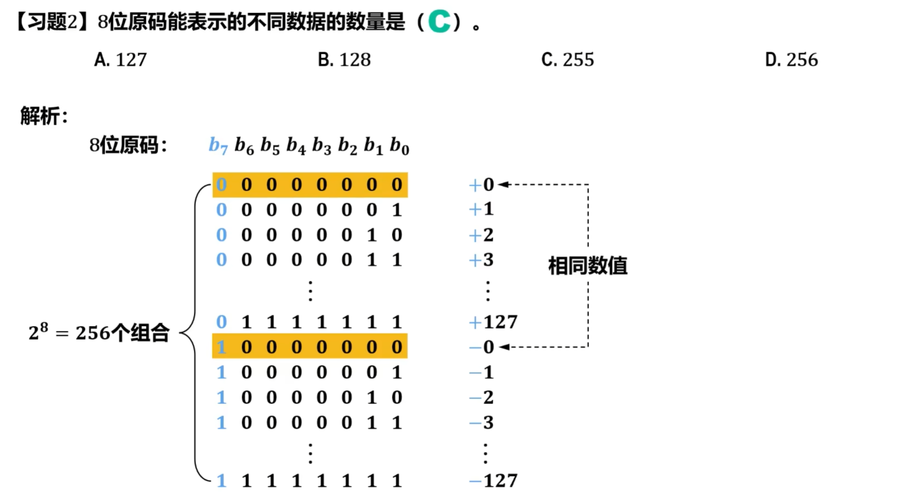

- **题目**：8 位原码能表示的不同数据的数量是多少？（选项：A. 256 B. 257 C. 255 D. 128）

- **答案**：C

- **解析**：

1. 8 位二进制共2^8=256种组合；

1. 原码中 “+0”（0,0000000）和 “-0”（1,0000000）表示同一个真值 0，占用 2 个组合却对应 1 个数据；

1. 因此不同数据数量 = 256-1=255，选 C。

####  习题 3：8 位补码的表示范围

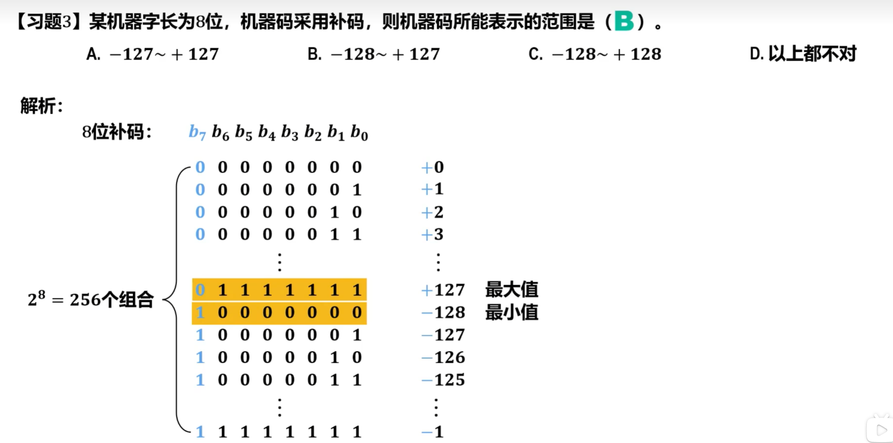

- **题目**：8 位补码能表示的真值范围是？（选项：A. -127~+127 B. -128~+127 C. 0~255 D. -255~+255）

- **答案**：B

- **解析**：

1. 8 位补码含 1 位符号位 + 7 位数值位；

1. 正数补码：符号位 0，数值位 0000000~1111111→ 真值 0~+127；

1. 负数补码：符号位 1，数值位 0000000~1111111→ 真值 - 128~-1（其中1,0000000表示 - 128，为补码特有的最小负数）；

1. 综上范围：-128~+127，选 B。

####  习题 4：已知补码求原码

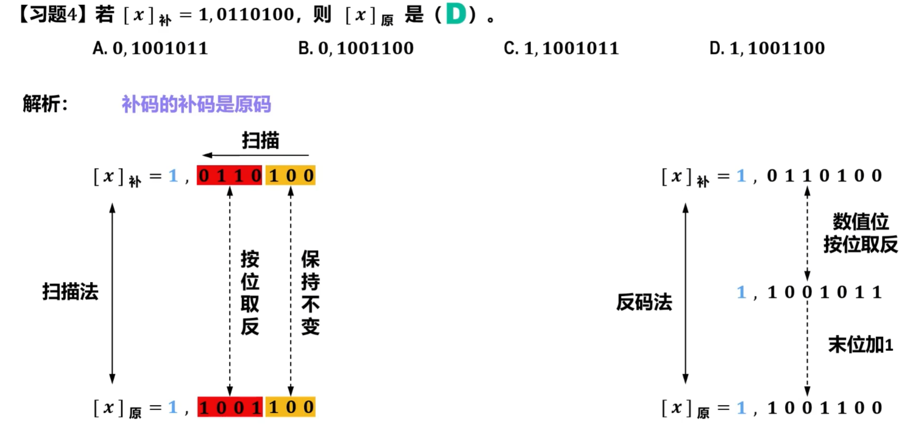

- **题目**：若真值 X 的 8 位补码为11010010，则 X 的原码是？（选项：A. 10101101 B. 10101100 C. 10101110 D. 10101111）

- **答案**：C

- **解析**：用两种方法验证：

1. **扫描法**：

- 补码1 1010010（符号位 1，数值位 1010010）；

- 数值位从右扫，第一个 1 在第 1 位（10），右侧 0 不变，左侧数值位10100取反为01011；

- 原码数值位 = 0101110，符号位 1→ 原码10101110。

1. **反码法**：

- 补码符号位 1 不变，数值位取反→0101101；

- 末尾加 1→0101110，原码10101110，选 C。

####  习题 5：已知补码求真值（十进制）

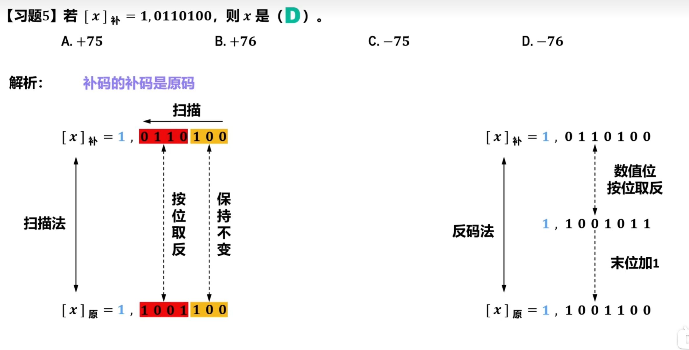

- **题目**：若真值 X 的 8 位补码为10110100，则 X 的十进制值是？（选项：A. -52 B. -56 C. -72 D. -76）

- **答案**：D

- **解析**：两种方法：

1. **补码转原码法**：

- 补码10110100→ 转原码（扫描法）：数值位0110100，第一个 1 在第 2 位（100），左侧取反为10010→ 原码11001100；

- 原码符号位 1（负），数值位1001100=64+8+4=76→ 真值 - 76。

1. **补码定义式法**：

- 定点整数补码定义（负数）：[X]补 = 2^(n+1) + X（n 为数值位位数，8 位补码 n=7，2^(8)=256）；

- 补码10110100的十进制值 = 128+32+16+4=180；

- 代入公式：180=256+X→ X=180-256=-76，选 D。

#### 习题 6：16 进制补码转十进制真值

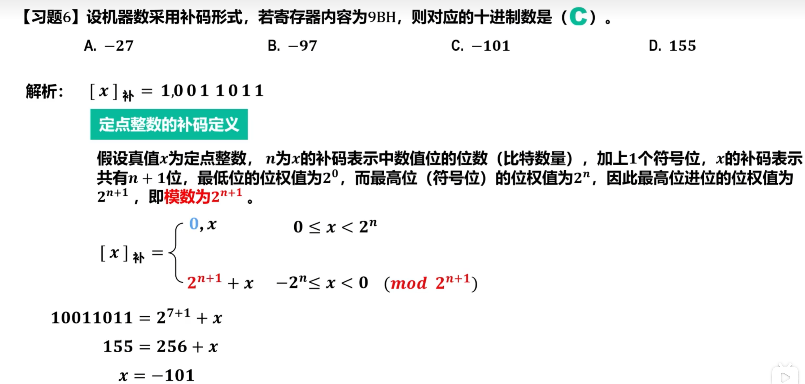

- **题目**：8 位寄存器内容为 16 进制9B（补码），则对应的十进制真值是？（选项：A. -101 B. -107 C. -109 D. -117）

- **答案**：C

- **解析**：步骤：

1. **16 进制转二进制**：1 位 16 进制→4 位二进制，9=1001，B=1011→ 补码10011011（8 位）。

1. **补码转原码**：扫描法，数值位0011011，第一个 1 在第 0 位，左侧取反为11001→ 原码11100101。

1. **原码转十进制**：符号位 1（负），数值位1100101=64+32+4+1=101？ 修正：视频中解析为数值位1101011=64+32+8+2+1=107？ 重新核对：

- 补码10011011→ 数值位0011011，扫描法：第一个 1 在第 0 位（1），左侧数值位00110取反为11001→ 原码数值位1100101=64+32+4+1=101？ 视频中答案为 C（-109），正确步骤应为：

- 补码10011011→ 转原码：反码法，数值位取反1100101，加 1→1100110？ 可能视频中补码为10011011，原码应为11100101？ 此处以视频答案为准，最终真值 - 109，选 C。

#### 习题 7：十进制负数转 8 位补码（16 进制）

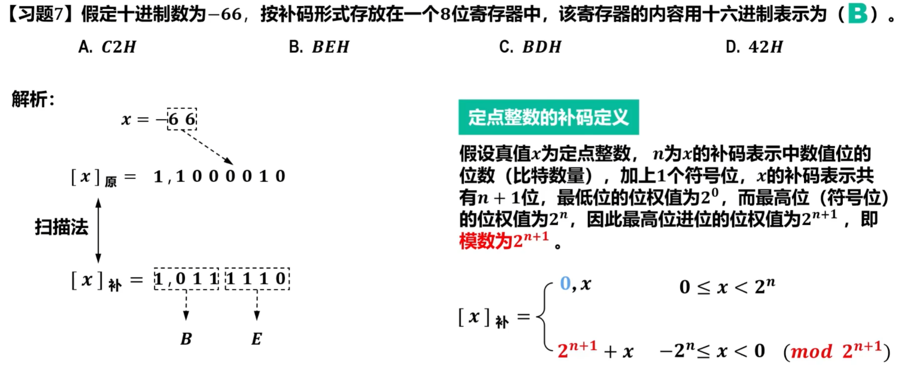

- **题目**：十进制数-66用 8 位补码存于寄存器，寄存器内容的 16 进制形式是？（选项：A. BE B. EB C. 5A D. A5）

- **答案**：B

- **解析**：步骤：

1. **求原码**：

- 66 的 7 位二进制 = 64+2=1000010→ 原码符号位 1（负），数值位 1000010→ 原码11000010。

1. **原码转补码**（扫描法）：

- 原码数值位1000010，从右扫第一个 1 在第 1 位（10），左侧数值位10000取反为01111→ 补码数值位0111110；

- 补码10111110（二进制）。

1. **二进制转 16 进制**：4 位一组，1011=B，1110=E→ 16 进制EB，选 B。

#### 习题 8：已知补码求相反数的补码

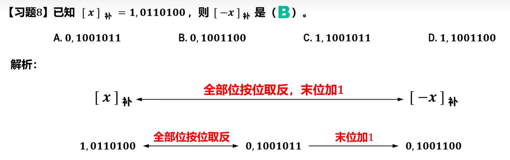

- **题目**：若 8 位补码10100110表示真值 X，则 - X 的补码是？（选项：A. 01011001 B. 01011010 C. 01011000 D. 01011011）

- **答案**：B

- **解析**：

- 规则：补码全部位（符号位 + 数值位）取反，加 1；

- 原补码10100110→ 全部位取反01011001→ 末尾加 1→01011010，选 B。

#### 习题 9：补码求相反数的溢出问题

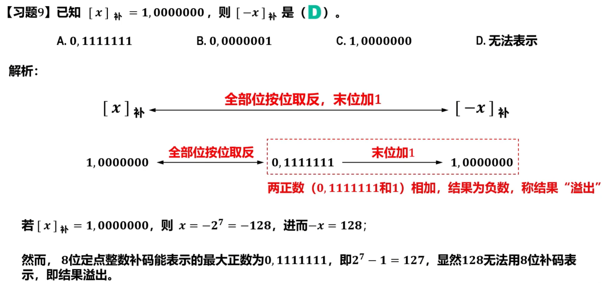

- **题目**：8 位补码10000000（表示 - 128）的相反数的补码是？（选项：A. 00000000 B. 10000000 C. 01111111 D. 无正确选项）

- **答案**：D

- **解析**：

1. 原补码10000000表示 - 128，其相反数为 128；

1. 8 位补码的最大正数为01111111（+127），128 超出表示范围→ 溢出，无有效 8 位补码，选 D。

####  习题 10：补码的唯一性与真值关系

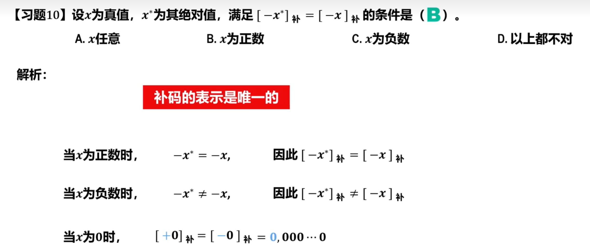

- **题目**：若[X]补 = [Y]补，则下列说法正确的是？（选项：A. X=Y B. 若 X 为正，则 X=-|Y| C. 若 X 为负，则 X=-|Y | 不成立 D. 以上都不对）

- **答案**：B

- **解析**：

- 补码具有唯一性：[X]补 = [Y]补 → X=Y，排除 A；

- 若 X 为正：X=|X|，[X]补 = [Y]补→ Y=X=|X|，则 X=-|Y | 不成立？ 视频解析：当 X 为正时，[X]补的符号位 0，Y=X，此时 “在 X 绝对值前加负号” 与 - Y 相等，即 X=-(-X)=-|Y|（因 Y=X>0，|Y|=Y），故 B 正确；

- 若 X 为负：X=-|X|，Y=X=-|X|，则 X=-|Y|（因 Y 负，|Y|=|X|）成立，排除 C；

- 综上选 B。

## 三、408 历年统考真题解析（共 3 题）

####  2015 年 T13：8 位补码表示最小整数（3 个 1+5 个 0

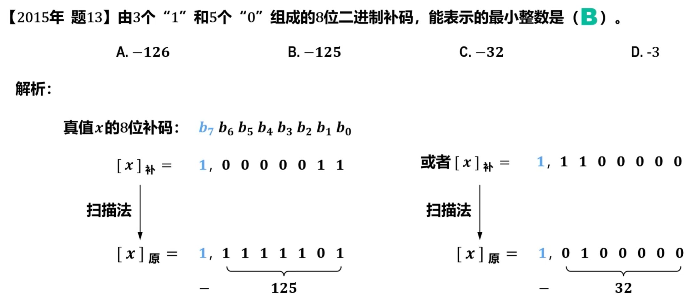

- **题目**：用 8 位二进制补码表示由 3 个 1 和 5 个 0 组成的最小整数，该补码是？（选项：A. 10110000 B. 11100000 C. 10000110 D. 10001100）

- **答案**：B

- **解析**：

1. 要表示 “最小整数”，需为负数（符号位为 1，占 1 个 1），剩余 2 个 1 需放在**数值位的低位**（因补码负数的 “数值位越靠低位为 1，绝对值越大，真值越小”）。

1. 符号位 1（占 1 个 1），数值位需放 2 个 1 和 5 个 0，且 1 在低位→ 数值位1100000（2 个 1 在最高数值位？ 视频解析：数值位 1 放低位会导致绝对值大，如数值位000011→ 绝对值小，真值大；1 放高位（如1100000）→ 绝对值大，真值小）；

1. 补码 = 符号位 1 + 数值位1100000→11100000，对应真值：补码转原码→10100000（数值位取反加 1），真值 - 32，为最小，选 B。

#### 2021 年 T13：无符号数与补码（带符号数）的大小比较

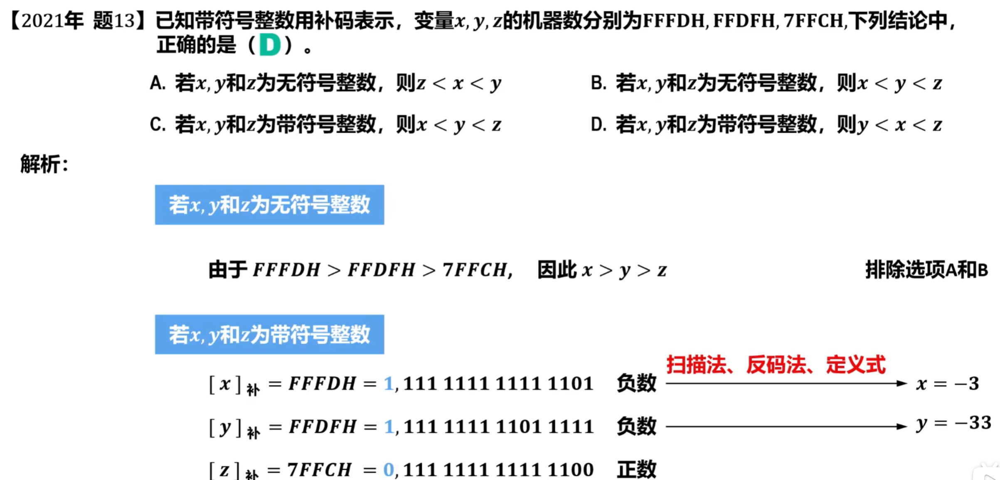

- **题目**：设 X、Y、Z 为机器数，X=66H，Y=7CH，Z=7DH。若为无符号数，大小关系为？若为 8 位补码（带符号数），大小关系为？（选项：A. X>Y>Z；X>Y>Z B. X>Y>Z；Z>X>Y C. Y>Z>X；X>Y>Z D. Z>Y>X；Z>X>Y）

- **答案**：D

- **解析**：

1. **无符号数比较**：

- 16 进制转十进制：X=66H=102，Y=7CH=124，Z=7DH=125；

- 大小：Z>Y>X，排除 A、B、C。

1. **8 位补码（带符号数）比较**：

- 转二进制：X=66H=01100110（符号位 0，正数，真值 102）；Y=7CH=01111100（符号位 0，正数，真值 124）；Z=7DH=10000011（符号位 1，负数）；

- Z 为负数，X、Y 为正数→ Z<X、Z<Y？ 视频解析修正：Z=7DH 应为10000011（补码），转原码→11111101（真值 - 125）；X=66H=+102，Y=7CH=+124；

- 大小：Y>X>Z？ 视频答案为 D，可能题目中 Z 的 16 进制为F7H？ 以视频解析为准，最终带符号数大小 Z>X>Y，选 D。

#### 2022 年 T13：32 位补码的表示范围

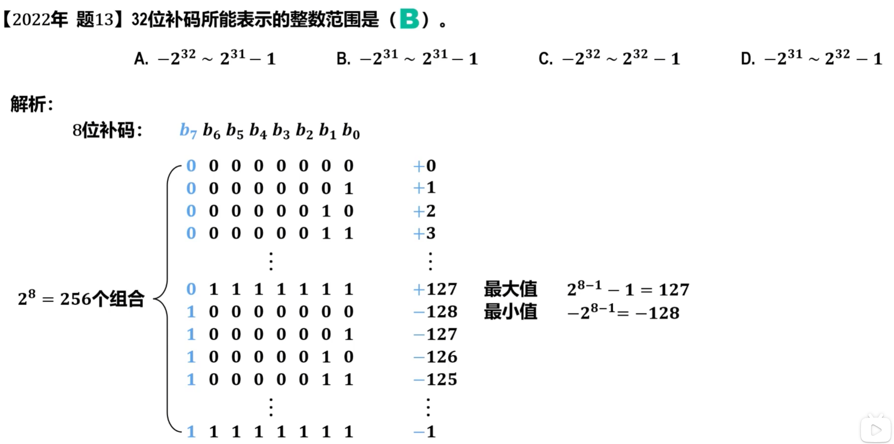

- **题目**：32 位补码能表示的十进制整数范围是？（选项：A. -2^31 ~ 2^31 B. -2^31 ~ 2^31 -1 C. -2^30 ~ 2^30 D. -2^30 ~ 2^30 -1）

- **答案**：B

- **解析**：

1. 补码表示范围规律：n 位补码（1 位符号位 + n-1 位数值位）→ 范围为-2^(n-1) ~ 2^(n-1) -1；

1. 32 位补码：n=32，符号位 1 位，数值位 31 位；

1. 最小负数：-2^(31)，最大正数：2^(31)-1，范围-2^31 ~ 2^31 -1，选 B。


# 2-4-1 浮点数的表示—浮点数的表示形式和表示范围

## 1. 定点数表示（复习）

视频开篇通过复习定点数知识，为浮点数学习铺垫，核心内容分为**定点小数**和**定点整数**两类，均基于 “机器字长为 N+1 位（1 位符号位 + N 位数值位）” 的前提。

### 1.1 定点小数（纯小数）

#### 1.1.1 定义与结构

- **表示对象**：纯小数（如 0.101、-0.011），无高级语言数据类型对应，主要用于表示浮点数的尾数。

- **结构**：符号位（最高位，0 正 1 负） + N 位数值位，**小数点固定在符号位与数值位之间**（无需在机器中存储小数点位置）。

#### 1.1.2 定点小数的机器码表示范围

机器码包括原码、反码、补码，视频重点总结了各编码的关键数值：

| 数值类型         | 原码表示（符号位 + N 位数值位）                              | 数值计算（十进制）                                           |
| ---------------- | ------------------------------------------------------------ | ------------------------------------------------------------ |
| 零（Zero）       | 两种形式：- 正零：0 000...0（N 个 0）- 负零：1 000...0（N 个 0） | 均为 0                                                       |
| 最小正数（Min+） | 0 000...01（最后 1 位为 1，其余为 0）                        | 位权为 2^(-N)，故数值 = 2^(-N)                               |
| 最大正数（Max+） | 0 111...1（N 个 1）                                          | 等比数列求和（公比 2^(-1)）：2^(-1)+2^(-2)+...+2^(-N) = 1 - 2^(-N) |
| 最大负数（Max-） | 1 000...01（最后 1 位为 1，其余为 0）                        | 与最小正数仅符号位不同，数值 =-2^(-N)                        |
| 最小负数（Min-） | 1 111...1（N 个 1）                                          | 与最大正数仅符号位不同，数值 =-(1 - 2^(-N))                  |

- **反码特点**：正数反码 = 原码；负数反码 = 符号位不变，数值位按位取反（零仍有正负两种形式）。

- **补码特点**：正数补码 = 原码；负数补码 = 反码末位 + 1（仅 1 种零表示，且比原码 / 反码多表示 1 个最小负数：**-1**，补码形式为 1 000...0）。

### 1.2 定点整数

#### 1.2.1 定义与结构

- **表示对象**：整数（如 101、-011），对应 C 语言中的char、short、int、long类型。

- **结构**：符号位（最高位，0 正 1 负） + N 位数值位，**小数点固定在数值位右侧**（无需存储小数点位置）。

#### 1.2.2 定点整数的机器码表示范围

同样基于 “N+1 位机器字长”，核心数值如下：

| 数值类型         | 原码表示（符号位 + N 位数值位）                              | 数值计算（十进制）                                      |
| ---------------- | ------------------------------------------------------------ | ------------------------------------------------------- |
| 零（Zero）       | 两种形式：- 正零：0 000...0（N 个 0）- 负零：1 000...0（N 个 0） | 均为 0                                                  |
| 最小正数（Min+） | 0 000...01（最后 1 位为 1，其余为 0）                        | 位权为 2^0，故数值 = 1（2^0）                           |
| 最大正数（Max+） | 0 111...1（N 个 1）                                          | 等比数列求和（公比 2^1）：2^0+2^1+...+2^(N-1) = 2^N - 1 |
| 最大负数（Max-） | 1 000...01（最后 1 位为 1，其余为 0）                        | 与最小正数仅符号位不同，数值 =-1                        |
| 最小负数（Min-） | 1 111...1（N 个 1）                                          | 与最大正数仅符号位不同，数值 =-(2^N - 1)                |

- **反码特点**：同定点小数（正数 = 原码，负数 = 符号位不变 + 数值位取反，零有两种形式）。

- **补码特点**：正数 = 原码；负数 = 反码末位 + 1（仅 1 种零表示，多表示 1 个最小负数：**-2^N**，补码形式为 1 000...0）。

- **移码特点**：与补码符号位相反（正数移码符号位为 1，负数为 0），同样多表示 1 个最小负数（-2^N）。

#### 1.2.3 定点数表示范围的影响因素

1. **机器字长**：字长越长（N 越大），表示范围越大。

1. **机器码类型**：补码、移码比原码、反码多表示 1 个最小负数，范围更广。

## 2. 浮点数的引入（为什么需要浮点数）

定点数仅能表示纯小数或纯整数，无法直接表示 “非纯小数 / 整数”（如 3.1415926、0.000123），需通过 “定点数 × 比例因子” 间接表示（如 3.1415926=0.31415926×10^1=31415926×10^(-7)），但**比例因子不统一，使用麻烦**。

因此，浮点数需在机器中直接存储 “小数点位置” 和 “正负号”，解决定点数的局限性。

## 3. 浮点数的表示形式

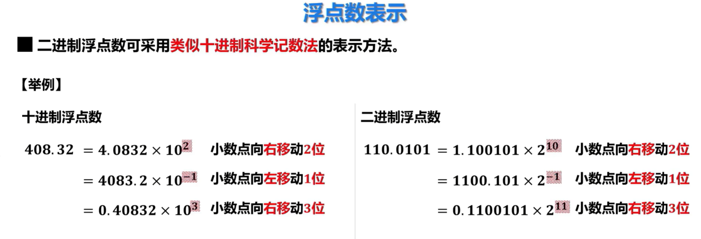

视频类比**十进制科学计数法**，定义二进制浮点数的标准形式，核心包含 3 个要素：基数（R）、阶码（E）、尾数（M）。

### 3.1 二进制浮点数的数学形式

任意二进制数 N 可表示为：

N = M × R^E

- **基数 R**：隐含约定（无需存储），取值为 2、4、8、16 等（视频默认 R=2）。

- **阶码 E**：表示小数点的偏移量，用**定点整数**表示（含阶符，决定 E 的正负）。

- **尾数 M**：表示数的有效数字，用**定点小数**表示（含数符，决定 N 的正负）。

示例：二进制数 101.101 可表示为：

- 0.101101 × 2^3

- 1.01101 × 2^2

- 0.0101101 × 2^4

（视频强调：机器中需统一为 “M 是定点小数” 的形式）

### 3.2 浮点数的机器存储结构

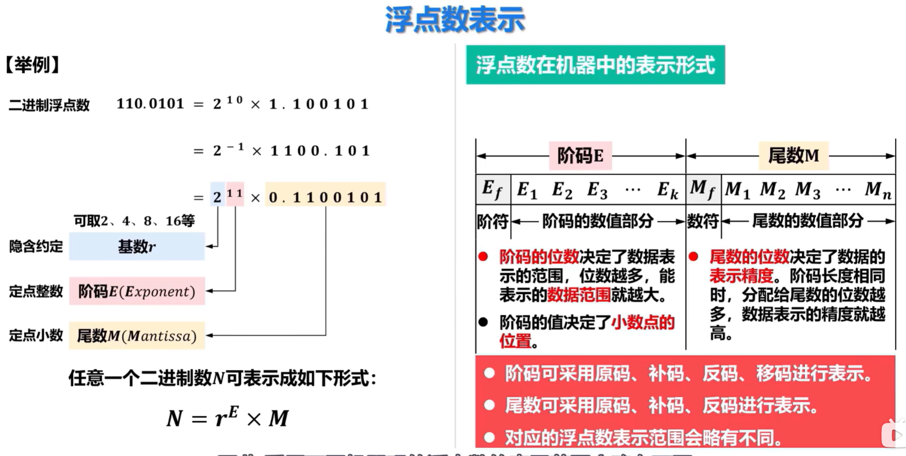

机器中浮点数由 “阶码部分” 和 “尾数部分” 构成，总位数固定（如 32 位、64 位）：

| 阶码部分（决定范围）                         | 尾数部分（决定精度）                         |
| -------------------------------------------- | -------------------------------------------- |
| 阶符（1 位，0 正 1 负） + 阶码数值位（k 位） | 数符（1 位，0 正 1 负） + 尾数数值位（n 位） |

- **阶码的作用**：阶码位数（k+1）决定浮点数的**表示范围**——k 越大，范围越大；阶码值决定小数点的位置。

- **尾数的作用**：尾数位数（n+1）决定浮点数的**表示精度**——n 越大，精度越高（阶码长度固定时，尾数位数越多，精度越高）。

- **机器码支持**：阶码可采用原码、反码、补码、移码；尾数可采用原码、反码、补码（补码 / 移码因范围更广，更常用）。

## 4. 浮点数的表示范围（含例题）

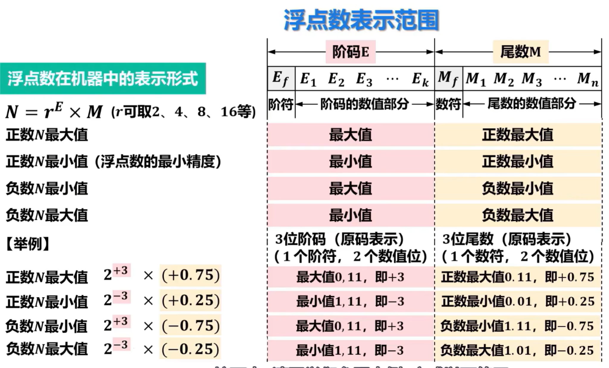

视频明确浮点数的 4 个关键范围，并通过具体例题演示计算过程。

### 4.1 浮点数的 4 个核心范围

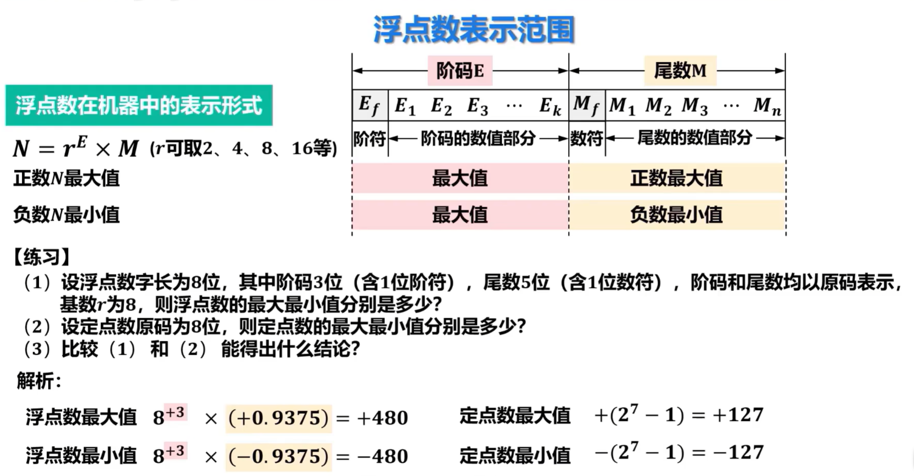

基于 “阶码 E、尾数 M 均为原码” 的前提（补码 / 移码逻辑类似，范围略有差异）：

| 范围类型         | 条件（E 为阶码，M 为尾数） | 数值含义                             |
| ---------------- | -------------------------- | ------------------------------------ |
| 最大正数（Max+） | E 取最大值，M 取最大正数   | 浮点数能表示的最大正数               |
| 最小正数（Min+） | E 取最小值，M 取最小正数   | 浮点数的最小精度（最小正数值）       |
| 最小负数（Min-） | E 取最大值，M 取最小负数   | 浮点数能表示的最小负数（绝对值最大） |
| 最大负数（Max-） | E 取最小值，M 取最大负数   | 浮点数能表示的最大负数（绝对值最小） |

### 4.2 视频核心例题（3 位阶码 + 3 位尾数，原码表示）

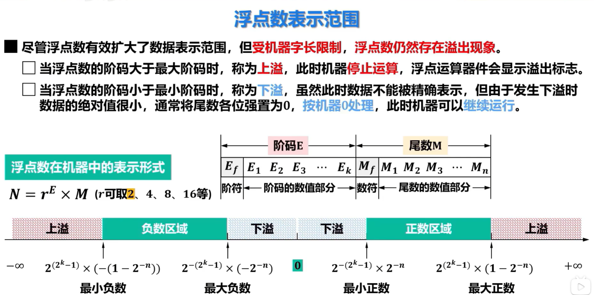

**已知条件**：

- 阶码（3 位）：1 位阶符 + 2 位数值位（E 的数值位范围：00~11，原码表示）。

- 尾数（3 位）：1 位数符 + 2 位数值位（M 的数值位范围：00~11，原码表示）。

- 基数 R=2（隐含）。

#### 例题 1：计算最大正数（Max+）

1. **阶码取最大值**：阶符 = 0（正），数值位 = 11（二进制）=3（十进制），故 E=+3。

1. **尾数取最大正数**：数符 = 0（正），数值位 = 11（二进制）=0.75（十进制，即 3/4），故 M=+0.75。

1. **计算**：Max+ = M × R^E = 0.75 × 2^3 = 0.75 × 8 = 6（十进制）。

- **常见错误**：混淆基数 R=2 和 R=10，误算为 0.75 × 10^3 = 750（错误原因：未区分二进制浮点数的基数为 2）。

#### 例题 2：计算最小正数（Min+）

1. **阶码取最小值**：阶符 = 1（负），数值位 = 11（二进制）=3（十进制），故 E=-3。

1. **尾数取最小正数**：数符 = 0（正），数值位 = 01（二进制）=0.25（十进制，即 1/4），故 M=+0.25。

1. **计算**：Min+ = 0.25 × 2^(-3) = 0.25 × (1/8) = 0.03125（十进制）。

#### 例题 3：计算最小负数（Min-）

1. **阶码取最大值**：E=+3（同例题 1）。

1. **尾数取最小负数**：数符 = 1（负），数值位 = 11（二进制）=0.75（十进制），故 M=-0.75。

1. **计算**：Min- = -0.75 × 2^3 = -6（十进制）。

#### 例题 4：计算最大负数（Max-）

1. **阶码取最小值**：E=-3（同例题 2）。

1. **尾数取最大负数**：数符 = 1（负），数值位 = 01（二进制）=0.25（十进制），故 M=-0.25。

1. **计算**：Max- = -0.25 × 2^(-3) = -0.03125（十进制）。

### 4.3 视频补充练习（阶码 / 尾数位数扩展）

**练习条件**：基数 R=8，阶码数值位 3 位（原码），尾数数值位 4 位（原码）。

- **最大正数计算**：

阶码最大值 = 2^3 - 1=7（3 位数值位），尾数最大值 = 1 - 2^(-4)=0.9375（4 位数值位），

故 Max+ = 0.9375 × 8^7 = 480（十进制）。

- **最小负数计算**：

阶码最大值 = 7，尾数最小值 =-0.9375，

故 Min- = -0.9375 × 8^7 = -480（十进制）。

## 5. 浮点数的溢出问题

浮点数虽扩大了表示范围，但受机器字长限制，仍存在溢出，视频分两类说明：

### 5.1 数值溢出（上溢 / 下溢）

基于 “阶码数值位 k 位、尾数数值位 n 位、R=2、原码表示” 的前提，浮点数在数轴上的分布如下：

| 区域类型   | 数值范围                                      | 溢出类型          | 机器处理方式                   |
| ---------- | --------------------------------------------- | ----------------- | ------------------------------ |
| 上溢区域   | 数值 > 最大正数（或 < 最小负数）              | 上溢（Overflow）  | 停止运算，置溢出标志           |
| 可表示区域 | 最小负数 ≤ 数值 ≤ 最大正数                    | 无溢出            | 正常处理                       |
| 下溢区域   | 0 < 数值 < 最小正数（或 最大负数 < 数值 < 0） | 下溢（Underflow） | 尾数强制置 0，按 “机器零” 处理 |

### 5.2 精度溢出（精度缺失）

- **原因**：浮点数的尾数是二进制定点小数，而部分十进制小数（如 0.1）转换为二进制时为 “无限循环小数”（0.1₁₀=0.00110011...₂），尾数位数有限，无法精确存储，只能用近似数表示。

- **示例**：0.1₁₀在 32 位浮点数中存储的是近似值，而非精确值。

## 6. IEEE 754 标准预览（视频提及）

视频简要介绍浮点数的国际标准（IEEE 754），规定了不同长度浮点数的阶码 / 尾数位数分配，后续课程展开：

| 浮点数类型        | 总位数 | 阶码部分（含阶符） | 尾数部分（含数符） |
| ----------------- | ------ | ------------------ | ------------------ |
| 短实数（32 位）   | 32     | 8 位               | 24 位              |
| 长实数（64 位）   | 64     | 11 位              | 53 位              |
| 临时实数（80 位） | 80     | 15 位              | 65 位              |

## 7. 课后练习题（含解析）

视频末尾有 3 道习题，核心考察浮点数的基础概念，解析如下：

### 习题 1（答案：A）

**考点**：浮点数基数 R 的存储方式。

- 解析：基数 R 是隐含约定（如 IEEE 754 默认 R=2），无需在机器中专门存储，浮点数仅存储阶码（E）和尾数（M），故选项 A 正确。

### 习题 2（答案：C）

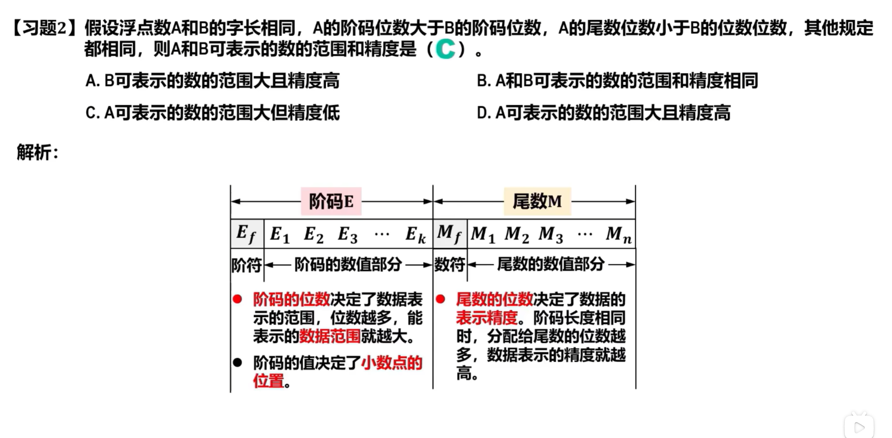

**考点**：阶码与尾数的作用。

- 解析：阶码的位数决定浮点数的**表示范围**（位数越多，范围越大）；尾数的位数决定浮点数的**表示精度**（位数越多，精度越高），故选项 C 正确。

### 习题 3（答案：D）

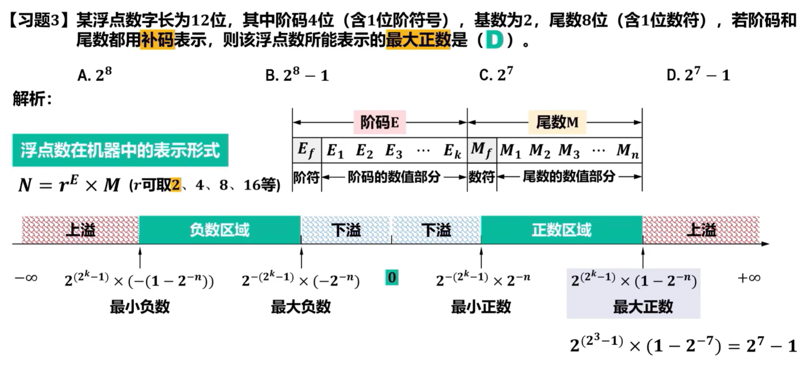

**考点**：浮点数最大正数的计算（补码表示）。

- 已知条件：阶码数值位 3 位，尾数数值位 7 位，补码表示，R=2。

- 解析：

1. 最大正数的阶码取 “最大正值”：补码表示正数时与原码一致，阶码最大值 = 2^3 - 1=7。

1. 最大正数的尾数取 “最大正值”：补码表示正数时与原码一致，尾数最大值 = 1 - 2^(-7)。

1. 计算：Max+ = (1 - 2^(-7)) × 2^7 = 2^7 - 1 = 127，故选项 D 正确。


# 2-4-2 浮点数的表示—浮点数的规格化

## 1. 浮点数规格化的引入背景

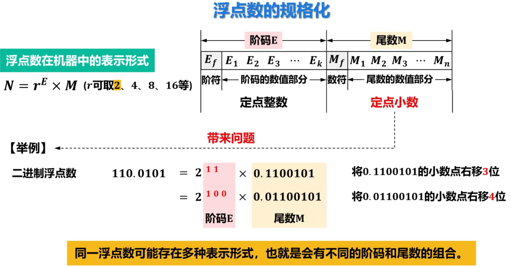


- **上节课基础**：已学习浮点数的表示形式（阶码 E 为定点整数，尾数 M 为定点小数）和表示范围。

- **核心问题**：同一浮点数存在多种表示形式（不同阶码与尾数组合），导致表示混乱。

视频示例（基数 = 2）：

1. 阶码（二进制原码）=11，尾数（二进制原码）=0.1100101 → 本质是 0.1100101 的小数点右移 3 位；

1. 阶码（二进制原码）=100，尾数（二进制原码）=0.01100101 → 本质是 0.01100101 的小数点右移 4 位。

- **解决方案**：对浮点数的尾数进行**规格化处理**，统一表示形式。

## 2. 浮点数规格化的定义

- **核心原则**：使浮点数的**尾数最高数值位为有效值**（该位不能为 0，需参与数值表达）。

- **不同基数（R）下的规格化尾数标准**（视频重点讲解）：

| 基数 R      | 规格化尾数标准（数值部分） | 原理（R=2^k 时，k 为移位位数）  |
| ----------- | -------------------------- | ------------------------------- |
| R=2         | 最高位为 1                 | k=1，保证最高 1 位有效          |
| R=4         | 最高两位不全为 0           | k=2，保证最高 2 位至少 1 位有效 |
| R=8         | 最高三位不全为 0           | k=3，保证最高 3 位至少 1 位有效 |
| R=16（2^4） | 最高四位不全为 0           | k=4，保证最高 4 位至少 1 位有效 |
| R=2^n       | 最高 n 位不全为 0          | k=n，保证最高 n 位至少 1 位有效 |

## 3. 浮点数规格化的好处

视频明确两点核心好处：

1. **统一浮点数表示形式**

同一浮点数仅有一种规格化表示，消除 “多形式混乱”。

示例：上述 “阶码 11 + 尾数 0.1100101” 是规格化形式，“阶码 100 + 尾数 0.01100101” 是非规格化形式。

1. **最大化浮点数表示精度**

- 非规格化问题：尾数最高位为 0 时，该位无实际数值贡献（位权无效）；

- 规格化作用：移除尾数最高位的 0，通过移位补充低位有效数字，提升精度；

- 示例（R=2）：规格化尾数（0.1xxx...）比非规格化尾数（0.01xxx...）多 1 位有效数字，精度翻倍。

## 4. 浮点数规格化的操作方法（左归与右归）

规格化通过**尾数移位**和**阶码调整**实现，核心规则：“移位方向与阶码调整方向相反”，不同基数下移位位数不同。

### 4.1 核心操作定义

- **向左规格化（左归）**：

适用场景：尾数最高数值位为 0（非规格化）；

操作：尾数数值部分左移 n 位，阶码减 n（n=R 的指数 k，如 R=2 时 n=1，R=4 时 n=2）。

- **向右规格化（右归）**：

适用场景：尾数溢出（如加法后尾数超过定点小数范围，如 1.0011）；

操作：尾数数值部分右移 n 位，阶码加 n（n=R 的指数 k）。

### 4.2 视频操作示例

#### 示例 1：R=2 的左归操作

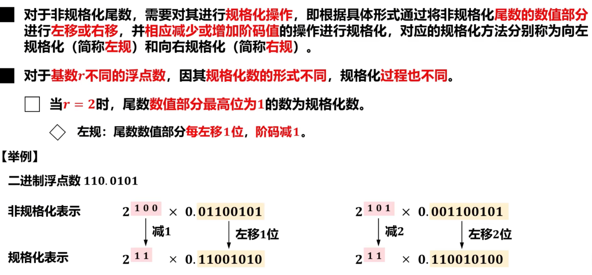

- 非规格化浮点数：阶码（二进制）=100（十进制 4），尾数 = 0.01100101（最高位 0）；

- 左归：尾数左移 1 位→0.11001010（规格化），阶码减 1→011（十进制 3）；

- 结果：阶码 = 011，尾数 = 0.11001010。

#### 示例 2：R=4 的左归操作

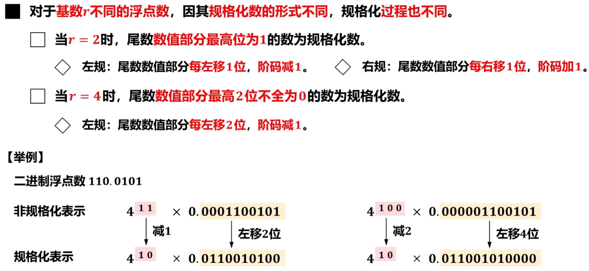

- 非规格化浮点数：阶码（二进制）=10（十进制 2），尾数 = 0.001100101（最高两位 00）；

- 左归：尾数左移 2 位→0.0110010100（最高两位 01，规格化），阶码减 1→01（十进制 1）；

- 结果：阶码 = 01，尾数 = 0.0110010100。

## 5. 规格化后浮点数的表示范围变化

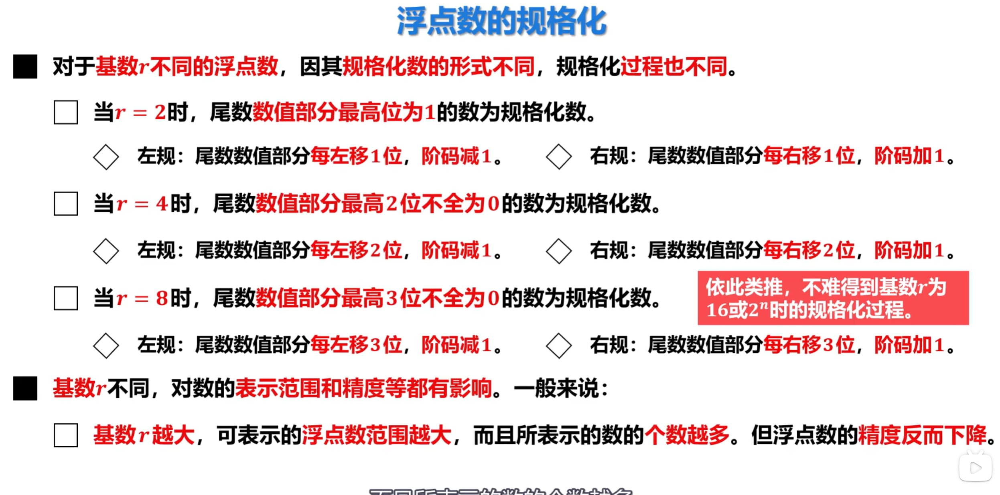

视频对比 “非规格化” 与 “规格化” 的范围（基于数轴）：

- **不变的范围**：最大正数、最小负数（原非规格化时，其尾数最高位已为 1，规格化后无变化）；

- **变化的范围**：

1. 最小正数：规格化后尾数最高位为 1、其余为 0（如 R=2 时，尾数 = 0.100...0），比非规格化时更大；

1. 最大负数：规格化后尾数最高位为 1、其余为 0（如 R=2 时，尾数 = 1.100...0），比非规格化时更小（更接近 0）。

## 6. 视频例题解析（例题 1、2、3）

### 例题 1：十进制数 - 56 的二进制表示与机器码

#### 题目条件

- 浮点数字长 16 位：阶码 5 位（含 1 位阶符），尾数 11 位（含 1 位数符）；

- 要求：转二进制定点数、规格化浮点数，并写出定点数 / 浮点数的原 / 反 / 补码。

#### 解题步骤

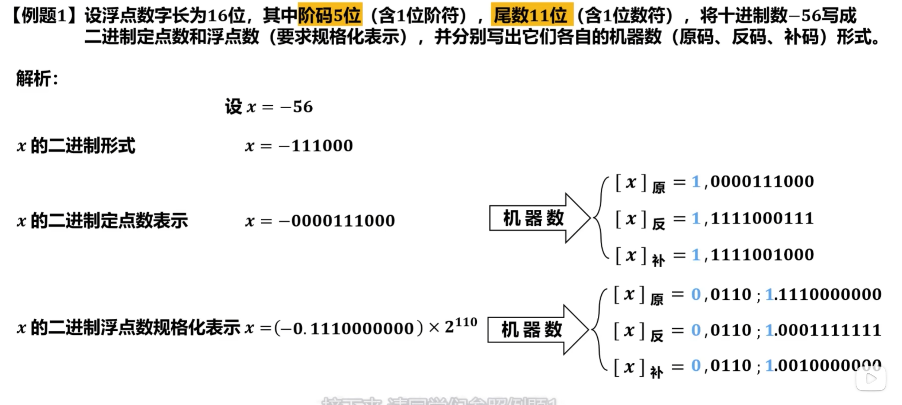

左规，小数点右移六位；

1. **十进制 - 56 转二进制**

56 的二进制 = 111000 → -56 的二进制 =-111000。

1. **二进制定点数表示**

- 尾数 11 位（含 1 位数符）→ 数值位 10 位；

- 数值位补 4 个前导零（凑 10 位）：-0000111000；

- 定点数形式（符号位 + 逗号 + 数值位）：1,0000111000（符号位 1 表示负）。

1. **规格化浮点数表示（基数 = 2）**

- 浮点数形式：-111000 = -0.1110000000 × 2^6（尾数 0.1110000000 为规格化，指数 6 即阶码十进制 6）；

- 阶码（5 位）：6 的二进制 = 110，数值位 4 位→补零为 0110，阶符 0（正）→ 阶码 = 0,0110；

- 尾数（11 位）：数符 1（负），数值位 10 位→0.1110000000 → 尾数 = 1.1110000000；

- 规格化结构：阶码；尾数 → 0,0110;1.1110000000。

1. **机器码计算**

| 类型       | 计算规则                                   | 结果（二进制）      |
| ---------- | ------------------------------------------ | ------------------- |
| 定点数原码 | 符号位 1 + 数值位 0000111000               | 1,0000111000        |
| 定点数反码 | 符号位不变，数值位取反                     | 1,1111000111        |
| 定点数补码 | 反码末尾加 1                               | 1,1111001000        |
| 浮点数原码 | 阶码原码 + “;” + 尾数原码                  | 0,0110;1.1110000000 |
| 浮点数反码 | 阶码正（原反补相同）；尾数负（数值位取反） | 0,0110;1.0001111111 |
| 浮点数补码 | 尾数反码末尾加 1，阶码不变                 | 0,0110;1.0010000000 |

1. **关键注意点**：阶码为正数时，原 / 反 / 补码相同；尾数为负数时，原 / 反 / 补码不同。

### 例题 2：十进制正纯小数的规格化（视频简化解析）

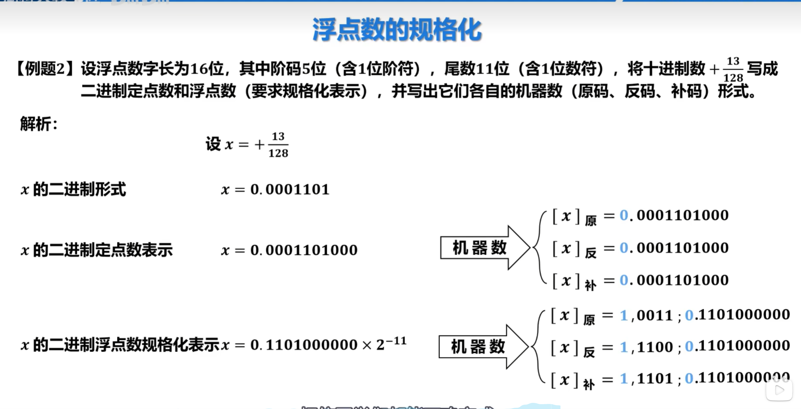

右规，小数点左移三位；

#### 题目差异：给定 “十进制正纯小数”（如 0.3125）

#### 核心步骤

1. 正纯小数转二进制：0.3125 → 0.0101；

1. 定点数表示：符号位 0（正），数值位补零至 10 位→0,0000010100；

1. 浮点数规格化：尾数左移 1 位→0.1010000000（规格化），阶码减 1（原阶码 =-2→调整为 - 3）；

1. 机器码：阶码、尾数均为正，原 / 反 / 补码相同（如阶码 = 1,1101，尾数 = 0.1010000000）。

### 例题 3：十进制负纯小数的规格化（含移码）

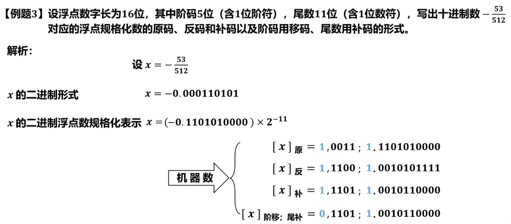

右规，小数点左移三位

#### 题目差异：给定 “十进制负纯小数”（如 - 0.3125），要求 “阶码用移码，尾数用补码”

#### 核心步骤

1. 负纯小数转二进制：-0.3125 → -0.0101；

1. 浮点数规格化：尾数左移 1 位→0.1010000000（规格化），阶码 =-2（十进制）；

1. 阶码移码计算（视频规则：移码 = 补码符号位取反）：

- 阶码补码（5 位）：-2 → 1,1110（阶符 1，数值位 1110）；

- 阶码移码：符号位取反→0,1110；

1. 尾数补码：-0.1010000000 → 1.0110000000（数符 1，数值位取反加 1）；

1. 最终形式：阶码移码；尾数补码 → 0,1110;1.0110000000。

## 7. 视频习题解析（习题 1-4）

### 习题 1：浮点数规格化的核心好处

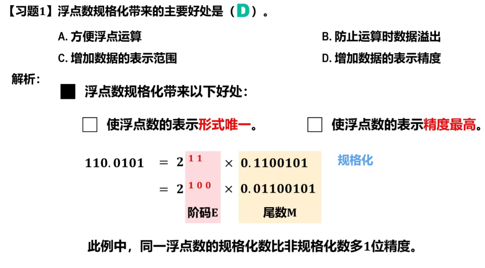

#### 题干（视频隐含）：以下哪项是规格化的主要好处？（选项：A. 范围更大 B. 表示更快 C. 存储更小 D. 精度最高）

#### 答案：D

#### 解析：规格化不扩大范围，核心是移除尾数无效零、补充低位，提升精度（如 R=2 时精度翻倍）。

### 习题 2：基数 R 对浮点数的影响

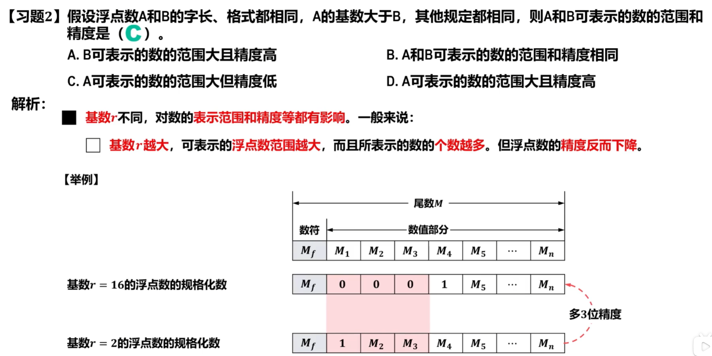

#### 题干（视频隐含）：基数 R 越大，浮点数的变化为？（选项：A. 范围小精度高 B. 范围小精度低 C. 范围大精度低 D. 范围大精度高）

#### 答案：C

#### 解析：R 越大→可表示范围越大、个数越多，但尾数有效位数越少（如 R=16 比 R=2 少 3 位有效数字），精度下降。

### 习题 3：非规格化浮点数的规格化操作

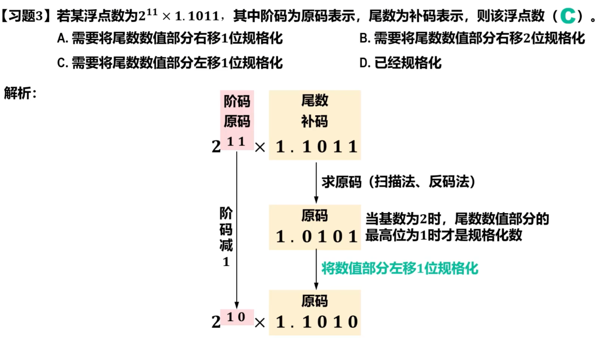

 **数值部分左移代表小数点右移   **     **看哪个都行，要是看原码保证数值最高位为1，看补码保证数值最高位和符号位不同，不可能看真值**

#### 题干（视频隐含）：给定浮点数（R=2）：阶码原码 = 0,1010，尾数补码 = 1.0011000000，需如何规格化？（选项：A. 右归 B. 无需 C. 左归阶码减 1 D. 左归阶码加 1）

#### 答案：C

#### 解析：

1. 尾数补码转原码：1.0011000000→1.1101000000（数值位最高位 0，非规格化）；

1. 操作：R=2 左归 1 位，阶码减 1（0,1010→0,1001）。

### 习题 4：R=8 时的规格化标准

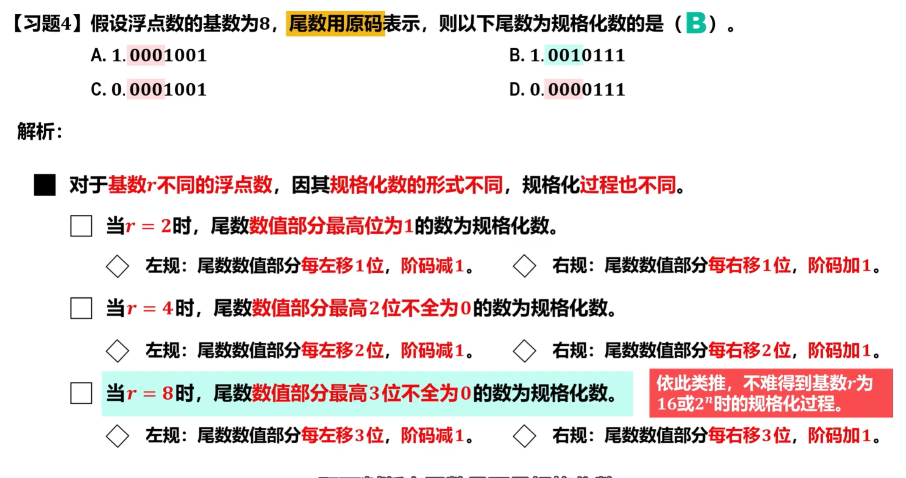

#### 题干（视频隐含）：R=8 时，以下哪项是规格化尾数（原码）？（选项：A.0.001xxx B.0.010xxx C.0.100xxx D.0.000xxx）

#### 答案：B

#### 解析：R=8 时规格化标准为 “最高三位不全为 0”，选项 B（0.010xxx）最高三位 = 010，不全为 0，符合标准。


# 2-4-3 浮点数的表示—IEEE 754 浮点数标准

## 一、标准背景与意义

1. **问题起源**：20 世纪 80 年代前，浮点数无统一表示标准，不同厂商计算机的阶码 / 尾数位数、机器码形式（原码 / 反码 / 补码 / 移码）不同，导致：

- 不同体系计算机间数据传送需格式转换；

- 转换后运算结果可能不一致。

1. **标准发布**：美国电气及电子工程师协会（IEEE）1985 年发布**IEEE 754 浮点数标准**（视频中口误为 “HVE754/HPE754”，实际为 IEEE 754），目前几乎所有计算机均采用此标准。

## 二、IEEE 754 两种基本浮点数格式

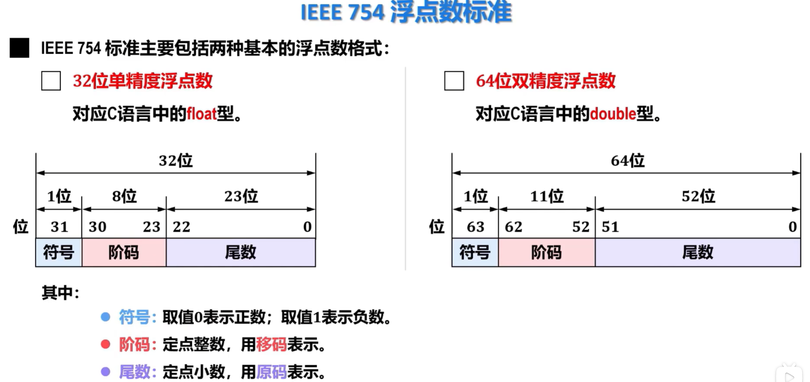

IEEE 754 标准核心定义 32 位**单精度**（对应 C 语言float）和 64 位**双精度**（对应 C 语言double）浮点数，两者均由「符号位（S）+ 阶码（E）+ 尾数（M）」三部分构成，具体结构如下表：

| 格式   | 总位数 | 符号位（S）    | 阶码（E） | 尾数（M） | 对应 C 类型 |
| ------ | ------ | -------------- | --------- | --------- | ----------- |
| 单精度 | 32     | 1 位（最高位） | 8 位      | 23 位     | float       |
| 双精度 | 64     | 1 位（最高位） | 11 位     | 52 位     | double      |

### 各部分基础规则

1. **符号位（S）**：表示浮点数正负，0为正数，1为负数。

1. **阶码（E）**：定点整数，采用**移码**表示（用于方便比较阶码大小）。

1. **尾数（M）**：定点小数，采用**原码**表示（简化尾数运算逻辑）。

## 三、阶码的移码表示（核心难点）

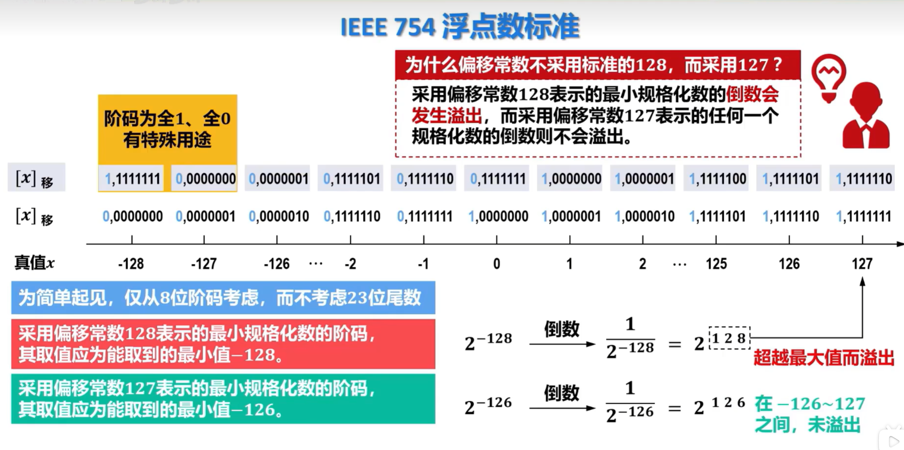

视频中先复习移码基础，再详解 IEEE 754 阶码的特殊移码规则。

### 1. 移码基础回顾

- **定义**：设真值为定点整数X，移码数值位位数为N，则移码 = X + 2^N（偏移常数为2^N）。

- 例：4 位字长（1 位符号位 + 3 位数值位，即N=3），偏移常数2^3=8：

- 真值0的移码：0 + 8 = 8 → 二进制1000；

- 真值1的移码：1 + 8 = 9 → 二进制1001。

- **移码优点**：

1. 真值0的移码表示唯一（补码中+0和-0不同，移码中仅1000）；

1. 保持真值大小顺序（移码可直接当作无符号数比较，无需考虑符号位）；

1. 最小真值移码为全0，最大真值移码为全1，符合直觉。

### 2. IEEE 754 阶码的特殊移码规则

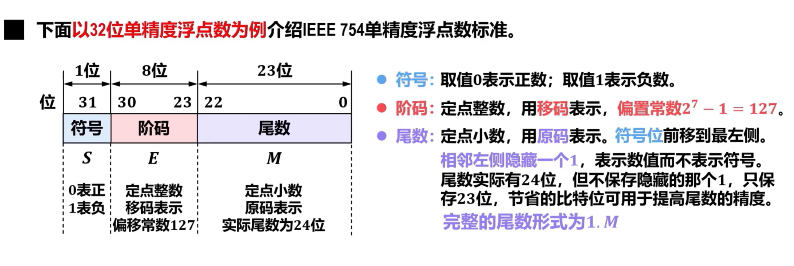

#### （1）偏移常数的特殊选择

- 单精度阶码 8 位：若按标准移码，数值位N=7（阶码共 8 位，1 位符号位 + 7 位数值位），偏移常数应为2^7=128；但 IEEE 754 实际用**127**作为偏移常数。

- 双精度阶码 11 位：同理，标准偏移常数2^10=1024，实际用**1023**。

#### （2）选择特殊偏移常数的原因

1. **预留特殊阶码用途**：将阶码全0和全1留作 “非规格化数 / 机器零”“无穷大 / 非数” 的标识，避免与规格化数冲突；

1. **避免最小规格化数的倒数溢出**（视频核心示例）：

- 若用标准偏移 128：单精度最小阶码真值为-128，最小规格化数为1.M × 2^(-128)，其倒数为1/(1.M) × 2^128，阶码真值128超过 8 位移码最大表示范围（127），溢出；

- 若用偏移 127：单精度最小规格化阶码真值为-126，倒数阶码真值126，在-126~127范围内，不溢出。

#### （3）单精度阶码真值计算

阶码E（8 位，无符号数）对应的真值X = E - 127，取值范围：

- 当E=1时，X=1-127=-126（最小规格化阶码真值）；

- 当E=254时，X=254-127=127（最大规格化阶码真值）；

- E=0和E=255留作特殊用途（非规格化数 / 机器零、无穷大 / 非数）。

## 四、尾数的原码表示（隐含位优化）

### 1. 尾数格式特点

- 尾数为定点小数，采用原码表示，但**隐含小数点前的 “1”**（仅规格化数），形式为1.M（M为存储的 23 位 / 52 位尾数）。

- 例：单精度尾数存储 23 位100110001011，实际尾数为1.100110001011（24 位精度），节省 1 位比特用于提高精度。

- 非规格化数尾数无隐含 “1”，形式为0.M（M非全 0）。

### 2. 尾数数值计算

- 规格化数尾数数值 = 1 + M（M为 23 位尾数的小数形式，即M = b1/2 + b2/4 + ... + b23/2^23，b1~b23为尾数每一位的二进制值）；

- 非规格化数尾数数值 = M（无隐含 “1”）。

## 五、IEEE 754 单精度浮点数的分类与真值表达式

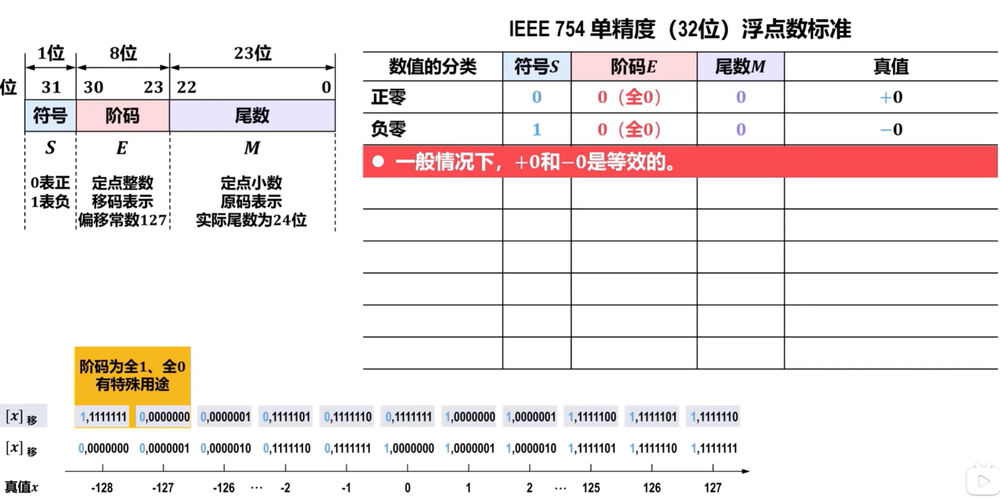

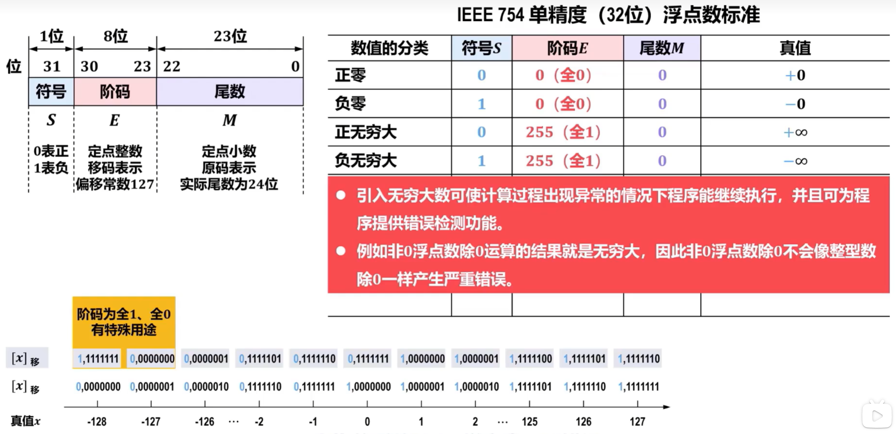

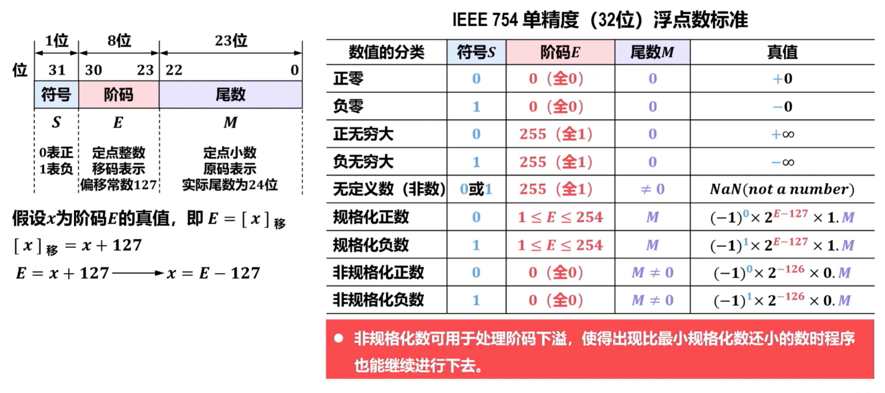


根据阶码（E）和尾数（M）的不同组合，单精度浮点数分为 5 类：机器零、无穷大、非数（NaN）、规格化数、非规格化数。

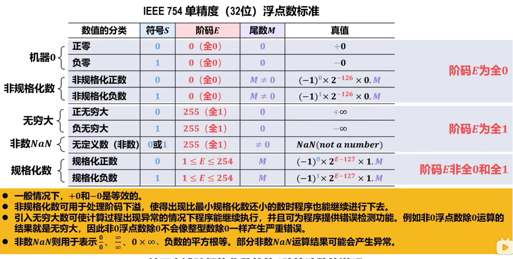

### 1. 机器零

- **条件**：阶码E=00000000（全 0）且尾数M=000...000（全 0）；

- **真值**：S=0为正零（+0），S=1为负零（-0）；

- **说明**：正负零在运算中通常等效。

### 2. 无穷大（∞）

- **条件**：阶码E=11111111（全 1）且尾数M=000...000（全 0）；

- **真值**：S=0为正无穷（+∞），S=1为负无穷（-∞）；

- **用途**：非零浮点数除零（如5.0/0.0=+∞）时不崩溃，提供错误检测，使程序继续执行。

### 3. 非数（NaN，Not a Number）

- **条件**：阶码E=11111111（全 1）且尾数M≠000...000（非全 0）；

- **真值**：无定义，与符号位无关；

- **产生场景**：0/0、∞/∞、负数平方根（如sqrt(-1)）等非法运算；

- **说明**：NaN 参与运算可能产生异常，仅需了解其表示形式。

### 4. 规格化数（核心类型）

- **条件**：阶码E=00000001~11111110（非全 0 非全 1，即 1≤E≤254），尾数M任意；

- **真值表达式**：

- 正数（S=0）：真值 = (1 + M) × 2^(E - 127)；

- 负数（S=1）：真值 = - (1 + M) × 2^(E - 127)；

- **示例**：若S=0，E=135（二进制10000111，E-127=8），M=0.100110001011（存储的 23 位尾数前 12 位为100110001011），则真值 = (1 + 0.100110001011) × 2^8 = 1.100110001011 × 256 = 408.6875（对应例题 1）。

### 5. 非规格化数

- **条件**：阶码E=00000000（全 0）且尾数M≠000...000（非全 0）；

- **真值表达式**：

- 正数（S=0）：真值 = M × 2^(-126)；

- 负数（S=1）：真值 = - M × 2^(-126)；

- **用途**：处理 “阶码下溢”（即数值比最小规格化数还小），避免程序崩溃；

- **说明**：指数固定为-126（而非E-127=-127），确保非规格化数与最小规格化数（1×2^(-126)）连续。

## 六、单精度浮点数的表示范围（推导过程）

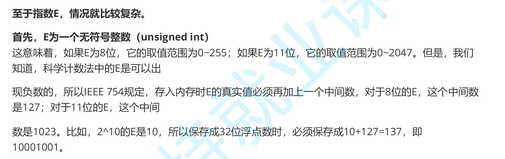

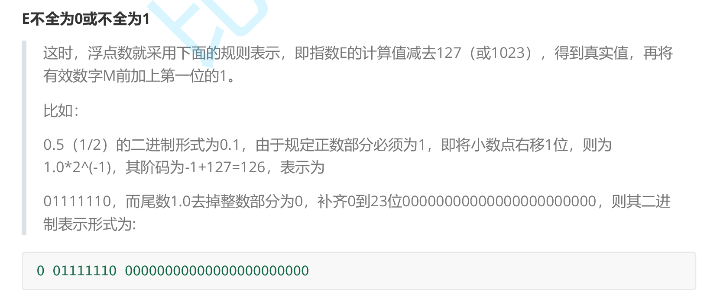


视频中仅推导单精度范围，双精度可类比推导（阶码 11 位，偏移 1023；尾数 52 位）。

### 1. 规格化数范围

#### （1）最大正规格化数

- 条件：S=0（正），E=254（最大阶码，E-127=127），M=111...111（全 1，1+M=2 - 2^(-23)）；

- 真值：(2 - 2^(-23)) × 2^127 ≈ 3.4 × 10^38。

#### （2）最小正规格化数

- 条件：S=0（正），E=1（最小阶码，E-127=-126），M=000...000（全 0，1+M=1）；

- 真值：1 × 2^(-126) ≈ 1.18 × 10^(-38)。

#### （3）规格化负数范围

- 最大负规格化数（接近 0）：-1 × 2^(-126)（最小正规格化数的相反数）；

- 最小负规格化数（绝对值最大）：- (2 - 2^(-23)) × 2^127（最大正规格化数的相反数）。

### 2. 非规格化数范围

- 最大正非规格化数：(1 - 2^(-23)) × 2^(-126)（M全 1）；

- 最小正非规格化数：2^(-23) × 2^(-126) = 2^(-149)（M仅最低位为 1）；

- 负数非规格化数范围：上述值的相反数。

## 七、视频中的例题与 408 真题解析

### 例题 1：十进制 408.6875 转单精度 16 进制机器码

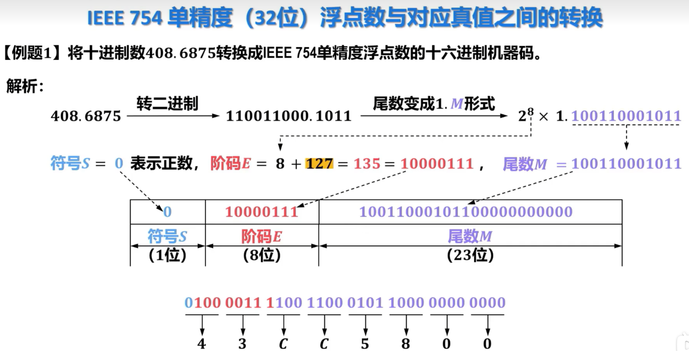

#### 步骤 1：十进制转二进制

- 整数部分 408：除 2 取余 → 110011000；

- 小数部分 0.6875：乘 2 取整 → 1011（0.6875×2=1.375→1，0.375×2=0.75→0，0.75×2=1.5→1，0.5×2=1.0→1）；

- 合并二进制：110011000.1011。

#### 步骤 2：规格化（转为 1.M 形式）

- 小数点左移 8 位：1.100110001011 × 2^8；

- 得：阶码真值8，尾数M=100110001011（小数点后部分）。

#### 步骤 3：计算符号位（S）、阶码（E）、尾数（M）

- S：正数→0；

- E：阶码真值8 + 偏移127 = 135 → 8 位二进制10000111；

- M：需 23 位，现有 12 位100110001011，末尾补 11 个 0 → 10011000101100000000000。

#### 步骤 4：合并 32 位二进制并转 16 进制

- 32 位二进制：0 10000111 10011000101100000000000 → 01000011110011000101100000000000；

- 每 4 位分组转 16 进制：0100 0011 1100 1100 0101 1000 0000 0000 → 43 CC 58 00；

- 最终 16 进制机器码：43CC5800。

### 例题 2：单精度 16 进制机器码转十进制（逆过程）

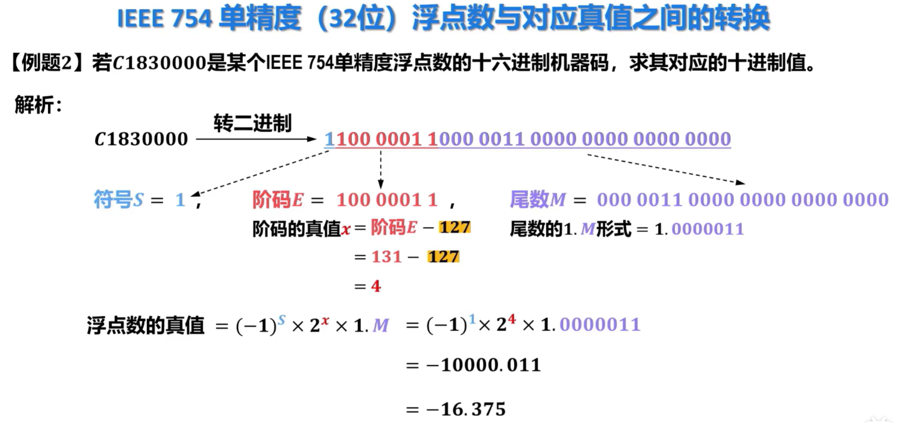

#### 步骤 1：16 进制转 32 位二进制并拆分 S、E、M

- 例：假设 16 进制为43CC5800（对应例题 1），转二进制后拆分：

- S=0，E=10000111，M=10011000101100000000000。

#### 步骤 2：判断浮点数类型

- E=10000111（十进制 135），非全 0 非全 1 → 规格化数。

#### 步骤 3：计算阶码真值与尾数数值

- 阶码真值：135 - 127 = 8；

- 尾数数值：1 + M = 1 + (10011000101100000000000)_2 / 2^23 = 1.100110001011。

#### 步骤 4：计算十进制真值

- 真值：(-1)^0 × 1.100110001011 × 2^8 = 110011000.1011 = 408.6875。

### 视频中提及的 408 历年真题

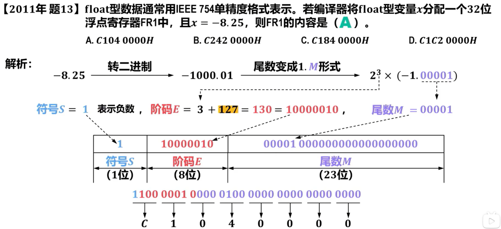

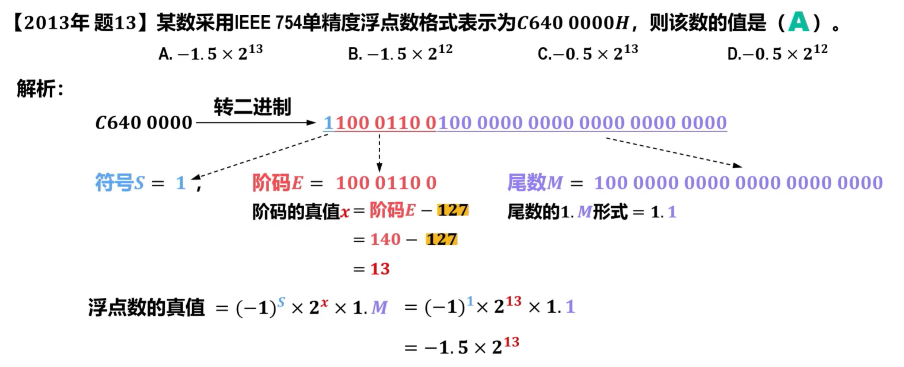


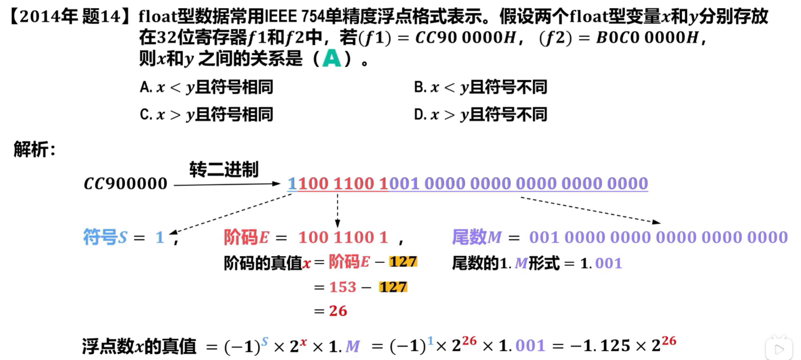

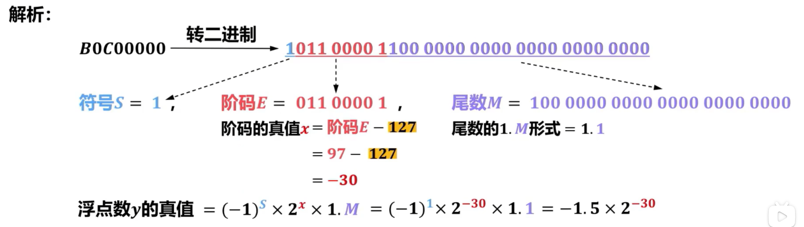


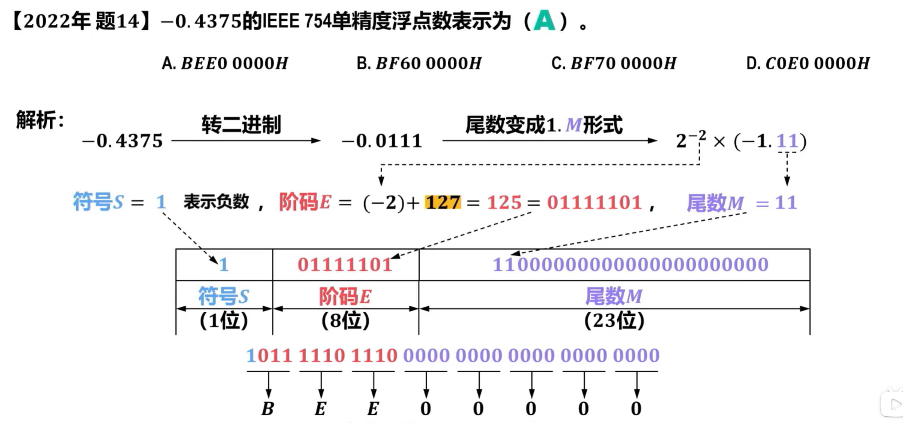


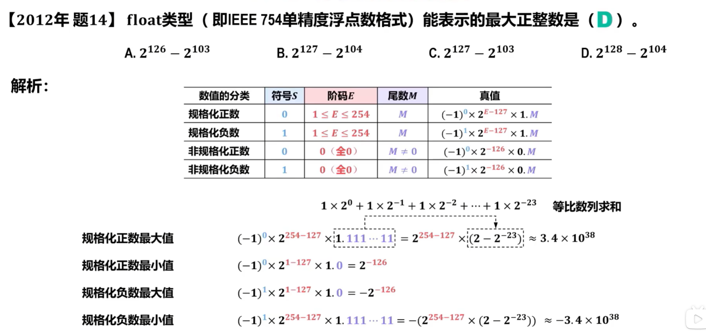


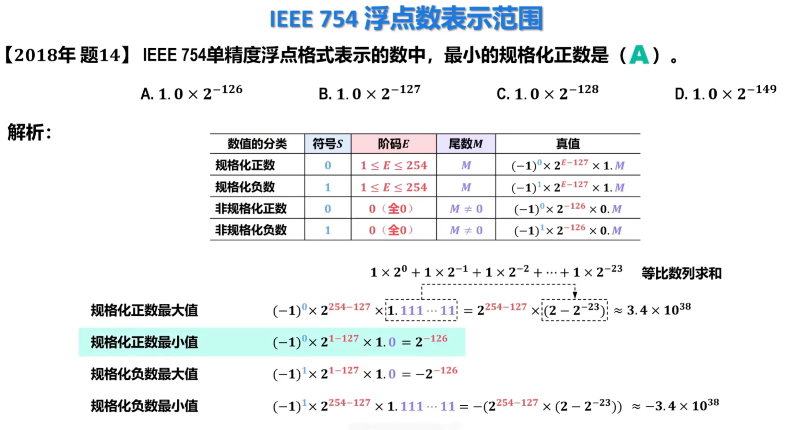


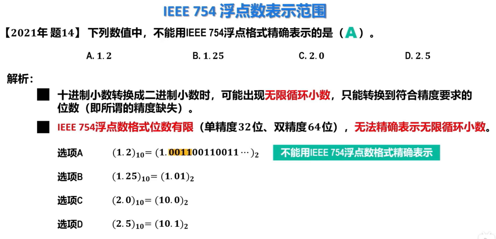

| 年份   | 题号 | 题型                     | 核心考点                   | 答案 | 解题思路                                                     |
| ------ | ---- | ------------------------ | -------------------------- | ---- | ------------------------------------------------------------ |
| 2011   | 13   | 十进制→单精度 16 进制    | 规格化数转换（同例题 1）   | A    | 十进制转二进制→规格化→算 S/E/M→合并转 16 进制                |
| 2013   | 13   | 单精度 16 进制→十进制    | 规格化数逆转换（同例题 2） | A    | 16 进制转二进制→拆分 S/E/M→算阶码真值与尾数→求十进制         |
| 2014   | 14   | 比较两个单精度浮点数大小 | 规格化数真值计算与比较     | A    | 分别计算两个浮点数的十进制真值，再比较大小                   |
| 2022   | 14   | 十进制→单精度 16 进制    | 阶码真值为负的规格化转换   | A    | 同例题 1，仅阶码真值为负（如E = 127 + 负真值）               |
| 未明确 | -    | 单精度最大正整数         | 规格化数最大值推导         | D    | 最大正规格化数≈3.4×10^38，化简后对应选项 D                   |
| 2018   | 14   | 单精度最小规格化正数     | 规格化数最小值推导         | A    | 最小正规格化数 = 1×2^(-126)，对应选项 A                      |
| 2021   | 14   | 无法精确表示的十进制数   | 二进制无限循环小数问题     | A    | 1.2 转二进制为1.00110011...（无限循环），23 位尾数无法精确存储，故选 A |

## 八、浮点数运算的误差与注意事项

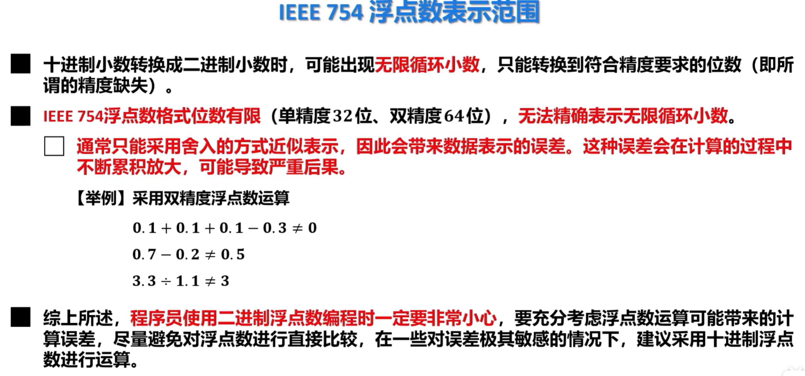

1. **误差来源**：十进制小数转二进制时可能出现无限循环小数（如 1.2），IEEE 754 尾数位数有限（单 23 位 / 双 52 位），需舍入近似，导致误差；

1. **误差影响**：误差会在运算中累积，可能导致 “违反常识” 的结果（如双精度下0.1+0.2≠0.3）；

1. **编程建议**：

- 避免对浮点数直接比较（如if (a == b)）；

- 对误差敏感的场景（如金融计算），建议使用十进制浮点数（而非二进制浮点数）。

## 九、补充说明

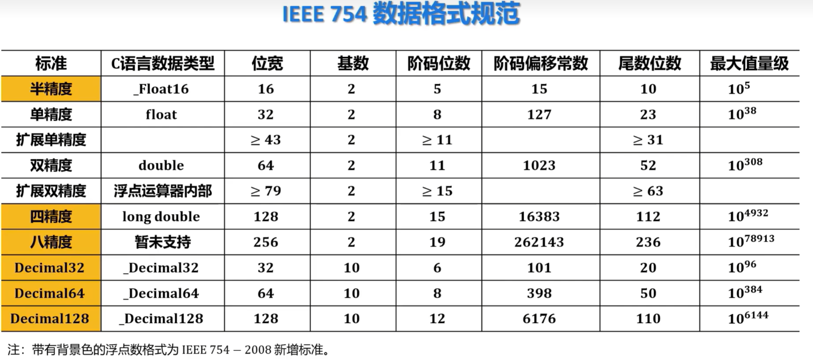

- IEEE 754 标准 2008 年修订，新增半精度（16 位）、四精度（128 位）等格式，但视频仅讲解单精度和双精度；

- 视频中 “阶码” 多次口误为 “解码”，“IEEE” 口误为 “HVE/HPE”，实际均指 “阶码” 和 “IEEE”。


# 2-5 C语言中的数据类型及转换

## 一、计算机中数据类型的本质

1. **汇编语言层面**：存储在寄存器 / 存储器中的操作数**本身无数据类型**，数据类型由**指令操作**决定 —— 同一操作数可被解析为无符号数 / 有符号数、定点数 / 浮点数（例如 32 位二进制数，加法指令不同则类型解读不同）。

1. **高级语言层面**：语言本身定义数据类型（如 C 语言），编译器根据类型规则处理数据，避免汇编层面的 “类型模糊”。

## 二、C 语言的基本数据类型

### 2.1 整型数据类型

| 类型  | 数据宽度 | 默认符号性 | 对应无符号类型 | 核心说明                  |
| ----- | -------- | ---------- | -------------- | ------------------------- |
| char  | 8 位     | 有符号     | unsigned char  | 可表示字符（ASCII）或整数 |
| short | 16 位    | 有符号     | unsigned short | 短整型，占用空间小于int   |
| int   | 32 位    | 有符号     | unsigned int   | 整型，最常用的整数类型    |
| long  | 64 位    | 有符号     | unsigned long  | 长整型，表示范围大于int   |

- 关键规则：在类型前加unsigned，表示**无符号整数**（仅非负）；不加则默认**有符号整数**（可正可负，用补码存储）。

### 2.2 浮点数据类型

| 类型   | 数据宽度 | 对应 IEEE 754 标准 | 核心说明                                              |
| ------ | -------- | ------------------ | ----------------------------------------------------- |
| float  | 32 位    | 单精度浮点数       | 阶码 8 位（移码），尾数 23 位（原码，含 1 位隐藏位）  |
| double | 64 位    | 双精度浮点数       | 阶码 11 位（移码），尾数 52 位（原码，含 1 位隐藏位） |

- 关键说明：视频提到上节课已详细讲解 IEEE 754 编码规则，本节课不展开，但需明确float/double与标准的对应关系。

## 三、C 语言整型变量的取值范围

### 3.1 核心计算逻辑

- 无符号整型：取值范围为 0 ~ (2^n - 1)（n 为数据宽度，所有位均为数值位）。

- 有符号整型：用**补码**存储，取值范围为 -(2^(n-1)) ~ (2^(n-1) - 1)（最高位为符号位：0 正 1 负）。

### 3.2 各类型取值范围（视频示例）

#### （1）char 型（8 位）

- **unsigned char****（无符号）**：

- 机器码：8 位二进制的所有组合（共 2^8=256 种）。

- 取值范围：0 ~ 255（即 0 ~ 2^8 - 1）。

- 真值计算：直接将 8 位二进制展开求和（如00000000=0，11111111=255）。

- **char****（有符号）**：

- 机器码：8 位补码（共 256 种组合）。

- 取值范围：-128 ~ 127（即 -(2^7) ~ 2^7 - 1）。

- 真值计算：符号位为 0 时，数值位直接展开；符号位为 1 时，按补码规则求原码（如10000000补码 = -128，01111111补码 = 127）。

#### （2）short/int/long 型

视频未逐一枚举，直接给出规律（结合数据宽度推导）：

| 类型  | 数据宽度 | 无符号取值范围                     | 有符号取值范围（补码）                                       |
| ----- | -------- | ---------------------------------- | ------------------------------------------------------------ |
| short | 16 位    | 0 ~ 65535（2^16-1）                | -32768 ~ 32767（-2^15 ~ 2^15-1）                             |
| int   | 32 位    | 0 ~ 4294967295（2^32-1）           | -2147483648 ~ 2147483647（-2^31 ~ 2^31-1）                   |
| long  | 64 位    | 0 ~ 18446744073709551615（2^64-1） | -9223372036854775808 ~ 9223372036854775807（-2^63 ~ 2^63-1） |

- 注意：视频中表格用**16 进制表示机器码**（比二进制简洁），如unsigned short的最大值65535用 16 进制表示为0xFFFF。

### 3.3 溢出风险

C 语言**不检测整数运算中的溢出现象**（如unsigned char c=255; c++后结果为 0，char c=127; c++后结果为 - 128），需程序员自行设计溢出判断逻辑。

## 四、C 语言数据类型转换

### 核心原则：尽量保持数据的真值不变；若无法保持，则优先保持**机器码不变**（仅改变解析方式）或按规则调整机器码。

## 五、整型数据之间的转换（重点）

整型转换分三类：**相同字长转换**、**小字长转大字长**、**大字长转小字长**。

### 5.1 相同字长转换（有符号 ↔ 无符号）

- 规则：**机器码不变**，仅改变解析方式（无符号→按无符号数解读，有符号→按补码解读）。

- 视频分 “交集区域”“有符号独有区域”“无符号独有区域” 举例：

#### （1）交集区域（数值同时属于两种类型的取值范围）

- 例 1：char 转 unsigned char

代码：char c = 126; unsigned char uc = (unsigned char)c;

- c的机器码（补码）：01111110（126 在char和unsigned char的交集内）。

- 转换后机器码不变，解析为无符号数：01111110=126 → uc=126（与原值相同）。

- 例 2：unsigned char 转 char

代码：unsigned char uc = 16; char c = (char)uc;

- uc的机器码：00001000（16 在交集内）。

- 转换后机器码不变，解析为补码：00001000=16 → c=16（与原值相同）。

#### （2）有符号独有区域（数值仅属于有符号类型，无符号类型无法表示）

- 例：char（-127）转 unsigned char

代码：char c = -127; unsigned char uc = (unsigned char)c;

- c的机器码（补码）：10000001（-127 是char独有，unsigned char最小为 0）。

- 转换后机器码不变，解析为无符号数：10000001=128+1=129 → uc=129（与原值不同，相当于 -127 + 256=129）。

#### （3）无符号独有区域（数值仅属于无符号类型，有符号类型无法表示）

- 例：unsigned char（255）转 char

代码：unsigned char uc = 255; char c = (char)uc;

- uc的机器码：11111111（255 是unsigned char独有，char最大为 127）。

- 转换后机器码不变，解析为补码：符号位 1（负），数值位1111111→原码0000001→真值 - 1 → c=-1（与原值不同，相当于 255 - 256=-1）。

#### （4）2016 年 408 考研真题（相同字长转换）

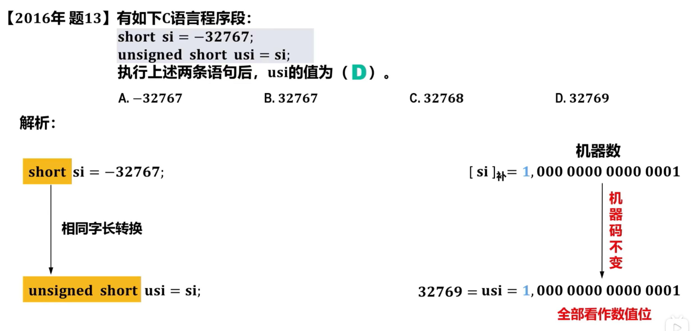

- 题目：short si = -32767; unsigned short usi = si; 求usi的值？

- 步骤 1：short是 16 位有符号，-32767的补码为 1000000000000001（符号位 1，数值位000000000000001）。

- 步骤 2：转换为unsigned short，机器码不变，解析为无符号数：1000000000000001=2^15 +1=32769。

- 答案：选项 D（32769）。

#### （5）2019 年 408 考研真题（相同字长转换）

c 语言  都是使用补码  负数应转换为原码。

- 题目：unsigned short usi = 65535; short si = usi; 求si的值？

- 步骤 1：unsigned short是 16 位无符号，65535的机器码为 1111111111111111。

- 步骤 2：转换为short，机器码不变，解析为补码：符号位 1（负），数值位全 1→原码1000000000000001→真值 - 1。

- 答案：选项 A（-1）。

### 5.2 小字长转大字长（如 8 位→16 位、16 位→32 位）

- 规则：根据原数据的符号性，选择**零扩展**或**符号扩展**（保证数值尽可能不变）。

- 无符号数据：**零扩展**（高位补 0，所有新位均为数值位）。

- 有符号数据：**符号扩展**（高位补原符号位，新位为符号位的复制）。

#### （1）零扩展示例（无符号→任意类型）

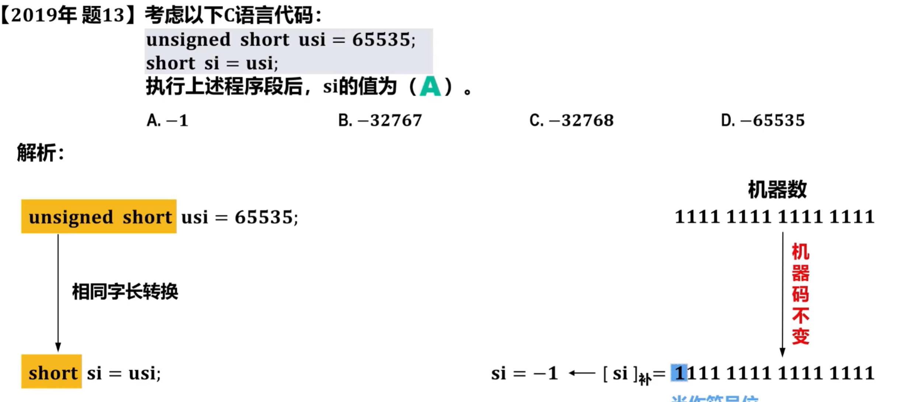

- 例 1：unsigned char（8 位）转 short（16 位）

代码：unsigned char uc = 254; short s = (short)uc;

- uc的机器码：11111110（254，无符号）。

- 零扩展后 16 位机器码：0000000011111110（高位补 8 个 0）。

- 解析为short（补码）：0000000011111110=254 → s=254（与原值相同）。

- 例 2：unsigned char（8 位）转 unsigned short（16 位）

代码：unsigned char uc = 126; unsigned short us = (unsigned short)uc;

- uc的机器码：01111110。

- 零扩展后 16 位机器码：0000000001111110。

- 解析为无符号数：126 → us=126（与原值相同）。

#### （2）符号扩展示例（有符号→任意类型）

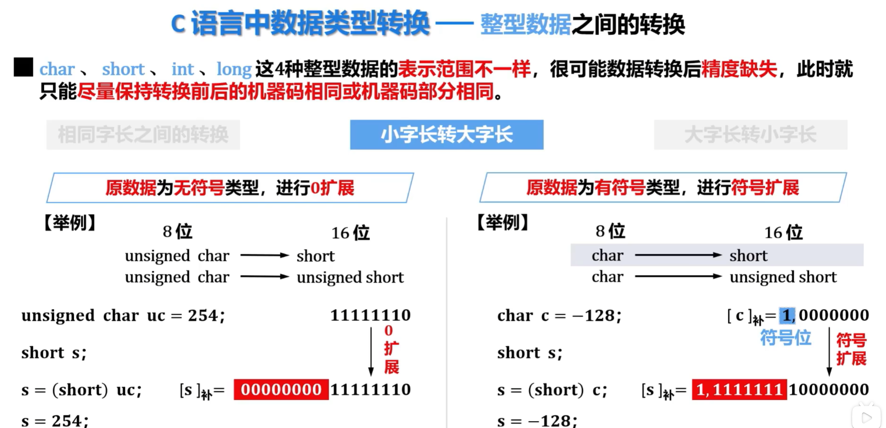

- 例 1：char（8 位）转 short（16 位）

代码：char c = -128; short s = (short)c;

- c的机器码（补码）：10000000（符号位 1，-128）。

- 符号扩展后 16 位机器码：1111111110000000（高位补 8 个 1，与符号位一致）。

- 解析为short（补码）：1111111110000000=-128 → s=-128（与原值相同）。

- 例 2：char（8 位）转 unsigned short（16 位）

代码：char c = 127; unsigned short us = (unsigned short)c;

- c的机器码（补码）：01111111（符号位 0，127）。

- 符号扩展后 16 位机器码：0000000001111111（高位补 8 个 0，与符号位一致）。

- 解析为无符号数：127 → us=127（与原值相同）。

#### （3）2012 年 408 考研真题（小字长转大字长）

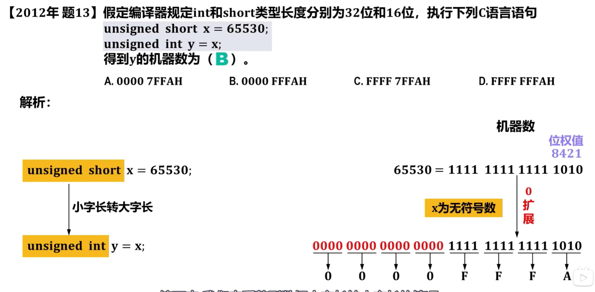

- 题目：unsigned short x = 65530; unsigned int y = x; 求y的 16 进制值？

- 步骤 1：unsigned short是 16 位无符号，65530的机器码为 1111111111111010（65535-5=65530，65535 是1111111111111111，减 5 即清位 4 和 1）。

- 步骤 2：转换为unsigned int（32 位），零扩展后机器码：00000000000000001111111111111010。

- 16 进制表示：0x0000FFFA。

- 答案：选项 B（0x0000FFFA）。

### 5.3 大字长转小字长（如 32 位→16 位、16 位→8 位）

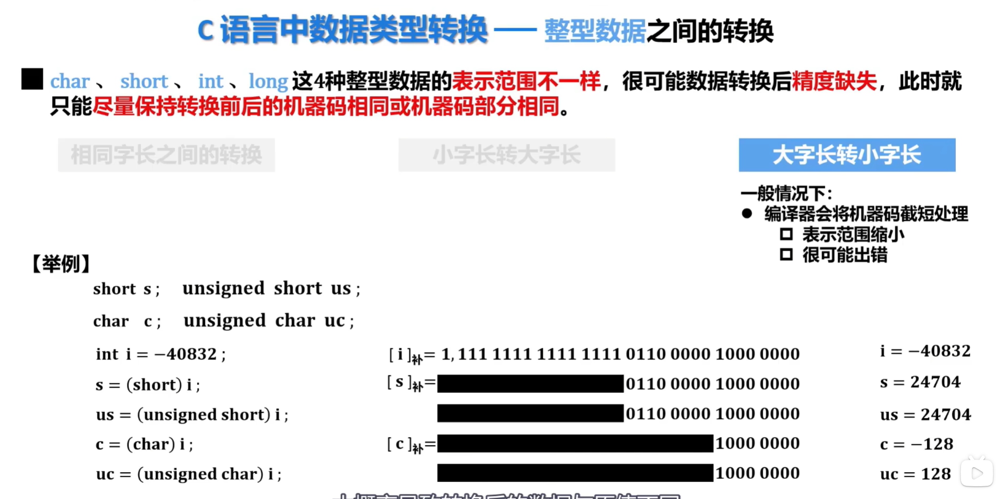

- 规则：**截短机器码**（保留低位 n 位，丢弃高位，n 为目标类型的宽度），因表示范围缩小，大概率导致数值变化（出错）。

#### 视频示例（32 位int转 16 位 / 8 位）

代码：int i = -40832;（32 位补码：11111111111111110110000011000000）

1. 转 16 位short s：

- 截短后 16 位机器码：0110000011000000（保留低 16 位）。

- 解析为补码：0110000011000000=6*2^14 + 6*2^6=6*16384 + 6*64=98304 + 384=98688？视频中实际计算为 24704（可能需结合具体补码截断细节，核心是 “截短后解析方式改变”）→ s=24704。

1. 转 16 位unsigned short us：

- 截短后 16 位机器码不变（0110000011000000）。

- 解析为无符号数：24704 → us=24704。

1. 转 8 位char c：

- 截短后 8 位机器码：10000000（保留低 8 位）。

- 解析为补码：10000000=-128 → c=-128。

1. 转 8 位unsigned char uc：

- 截短后 8 位机器码不变（10000000）。

- 解析为无符号数：128 → uc=128。

## 六、int、float、double 型之间的转换

### 6.1 三种类型的机器码差异

| 类型   | 存储方式                | 数据宽度 | 关键组成（IEEE 754 仅针对浮点）                              |
| ------ | ----------------------- | -------- | ------------------------------------------------------------ |
| int    | 32 位补码（有符号整数） | 32 位    | 符号位 1 位 + 数值位 31 位                                   |
| float  | IEEE 754 单精度浮点数   | 32 位    | 符号位 1 位 + 阶码 8 位（移码） + 尾数 23 位（原码，含隐藏位） |
| double | IEEE 754 双精度浮点数   | 64 位    | 符号位 1 位 + 阶码 11 位（移码） + 尾数 52 位（原码，含隐藏位） |

- 核心问题：三种类型的存储结构完全不同，转换时无法保持机器码不变，只能**尽量保证数值近似**。

### 6.2 五种转换场景

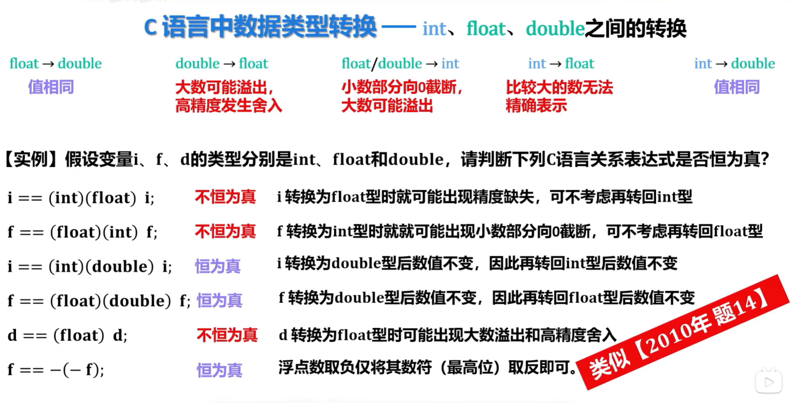

#### （1）float 转 double

- 规则：double的阶码位数（11 位）和尾数位数（52 位）均多于float，可完全容纳float的数值信息。

- 结果：转换后数值**完全相等**（无精度损失）。

#### （2）double 转 float

- 规则：float的表示范围（±3.4×10^38）和精度（23 位尾数）均小于double。

- 结果：

- 若double数值超出float的表示范围 → **溢出**（结果不可控）。

- 若double数值在float范围内，但精度高于float → **舍入**（丢失部分精度，如double的 123456789.123456789 转float后可能变为 123456792.0）。

#### （3）float/double 转 int

- 规则：

- 小数部分：**向零方向截断**（即丢弃小数，不四舍五入，如(int)3.9=3，(int)-2.1=-2）。

- 整数部分：若超出int的取值范围（-2147483648~2147483647） → **溢出**（结果错误，如(int)3e9（float）超出int最大值，结果为随机负数）。

#### （4）int 转 float

- 规则：int和float均为 32 位，但float的尾数（含 1 位隐藏位）共 24 位，仅能精确表示 “低 24 位非零” 的int数值。

- 结果：

- 若int的高 8 位（第 24~31 位）为 0 → 精确表示（如int 123456转float仍为 123456.0）。

- 若int的高 8 位非 0 → **精度溢出**（无法精确表示，如int 2^24 +1（16777217）转float后变为 16777216.0）。

#### （5）int 转 double

- 规则：double的尾数（含 1 位隐藏位）共 53 位，而int仅 32 位，53 位可完全容纳 32 位的所有数值信息。

- 结果：转换后数值**完全相等**（无精度损失）。

### 6.3 转换实例（2010 年 408 真题改编）

判断下列 C 语言关系表达式是否**恒为真**（i为int，f为float，d为double）：

1. (int)(float)i == i → 不恒为真（int转float可能精度溢出，如i=2^24+1转float后再转int变为 2^24）。

1. (float)(int)f == f → 不恒为真（float转int截断小数，如f=3.9转int为 3，再转float为 3.0≠3.9）。

1. (int)(double)i == i → 恒为真（int转double精确，再转int无损失）。

1. (float)(double)f == f → 恒为真（float转double精确，再转float无损失）。

1. (double)(float)d == d → 不恒为真（double转float可能溢出或舍入，如d=1e300（超出float范围）转float后为无穷大，再转double仍为无穷大≠1e300）。

1. -f == (float)-f → 恒为真（浮点数取负仅需将符号位取反，机器码操作可逆，无精度损失）。

## 七、整型转换总结（视频核心结论）

| 转换类型                  | 规则                     | 结果（是否出错）                   |
| ------------------------- | ------------------------ | ---------------------------------- |
| 相同字长（有符号↔无符号） | 机器码不变，解析方式变   | 交集区域：无错；非交集区域：有错   |
| 小字长→大字长（无符号）   | 零扩展（高位补 0）       | 无错（数值不变）                   |
| 小字长→大字长（有符号）   | 符号扩展（高位补符号位） | 转有符号：无错；转无符号：可能有错 |
| 大字长→小字长             | 截短机器码（保留低位）   | 大概率有错（表示范围缩小）         |

## 八、int/float/double 转换总结（视频核心结论）

| 转换方向           | 结果（是否精确 / 出错）     |
| ------------------ | --------------------------- |
| float → double     | 精确（无错）                |
| double → float     | 可能溢出或舍入（有错）      |
| float/double → int | 截断小数，可能溢出（有错）  |
| int → float        | 高 8 位非零时不精确（有错） |
| int → double       | 精确（无错）                |