# 3-1-1 移位运算 — 逻辑移位

## 一、逻辑移位的核心前提

- **运算对象**：仅针对**无符号数**（视频明确强调，区别于后续可能涉及的算术移位）。

- **操作载体**：以**八位寄存器**为例（寄存器位编号：最高位为B7，最低位为B0，即从高位到低位依次为B7、B6、B5、B4、B3、B2、B1、B0）。

## 二、逻辑移位的基本规则

逻辑移位分为**逻辑左移**和**逻辑右移**，核心规则围绕 “移出位处理” 和 “补空位处理” 展开。

### 1. 逻辑左移

- **规则**：高位移除，低位补零

即寄存器中所有位同时向左移动指定位数，移出寄存器的**高位**被丢弃，空出的**低位**用0填充。

- **视频示例（八位寄存器逻辑左移 1 位）**：

假设八位寄存器初始内容为 B7 B6 B5 B4 B3 B2 B1 B0（各Bn为 0 或 1）：

- 移位过程：所有位向左移动 1 位，B7（最高位）被移出并丢弃；

- 补位：空出的B0（最低位）填充0；

- 结果：移位后寄存器内容为 B6 B5 B4 B3 B2 B1 B0 0。

### 2. 逻辑右移

- **规则**：低位移除，高位补零

即寄存器中所有位同时向右移动指定位数，移出寄存器的**低位**被丢弃，空出的**高位**用0填充。

- **视频示例（八位寄存器逻辑右移 2 位）**：

假设八位寄存器初始内容为 B7 B6 B5 B4 B3 B2 B1 B0：

- 移位过程：所有位向右移动 2 位，B1和B0（最低两位）被移出并丢弃；

- 补位：空出的B7和B6（最高两位）填充0；

- 结果：移位后寄存器内容为 0 0 B7 B6 B5 B4 B3 B2。

	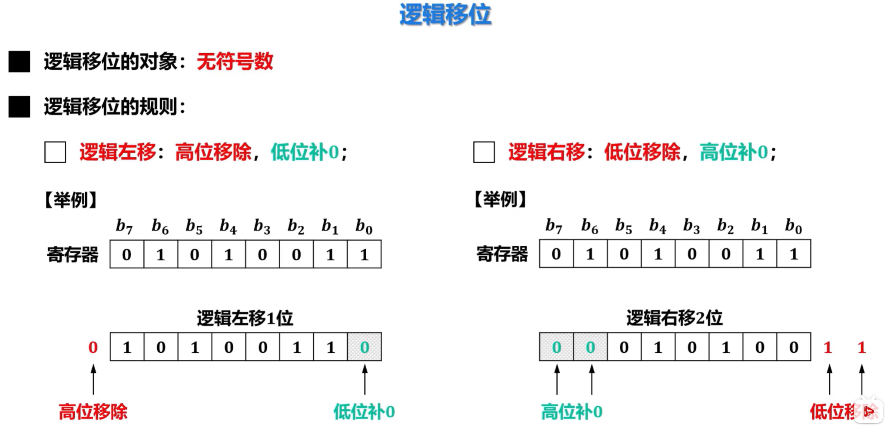

## 三、逻辑移位的实际应用（C 语言实现）

视频以 “**八位寄存器某位置零 / 置一（不影响其他位）** ” 为例，讲解逻辑移位结合位运算的应用，核心工具是 “**掩码（Mask）** ”。

### 1. 应用前提

- 寄存器内容存储在变量reg_data中（假设为八位无符号变量）；

- 目标：操作B6位（第六位，从B0开始计数），不改变其他位的值。

### 2. 步骤 1：创建 B6 位的掩码（依赖逻辑左移）

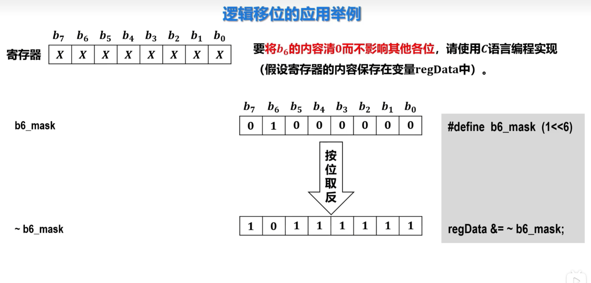

- **掩码作用**：通过逻辑移位生成 “仅目标位为 1，其他位为 0” 的二进制数，用于定位目标位。

- **C 语言宏定义**：

```
#define B6_Mask (1 << 6)  // 1左移6位，生成B6位的掩码
```

- **掩码生成过程**：

- 初始值1的二进制为 00000001（八位）；

- 逻辑左移 6 位后，变为 01000000（仅B6位为 1，其他位为 0），即B6_Mask的最终值。

### 3. 应用 1：将 B6 位清零（不影响其他位）

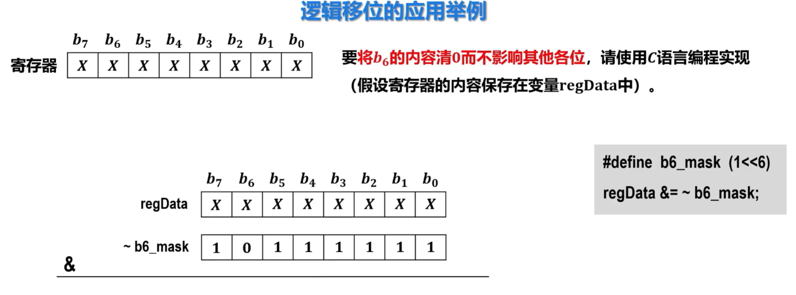

- **核心原理**：掩码取反 + 与运算（&）

- 掩码取反：~B6_Mask，将B6_Mask的B6位从 1 变为 0，其他位从 0 变为 1，结果为 10111111；

- 与运算规则：**与 1 相遇的位保持不变，与 0 相遇的位被清零**（视频明确规则）。

- **C 语言代码**：

```
reg_data = reg_data & (~B6_Mask);  // 仅B6位清零，其他位保留原值
```

- **示例验证**：

假设reg_data初始值为 11010110（二进制）：

- ~B6_Mask为 10111111；

- 与运算结果：11010110 & 10111111 = 10010110（仅B6位从 1 变为 0，其他位不变）。

### 4. 应用 2：将 B6 位置一（不影响其他位）

- **核心原理**：掩码直接 + 或运算（|）

- 或运算规则：**与 0 相遇的位保持不变，与 1 相遇的位被置一**（视频明确规则）；

- 无需对掩码取反，直接用B6_Mask（01000000）与reg_data做或运算。

- **C 语言代码**：

```
reg_data = reg_data | B6_Mask;  // 仅B6位置一，其他位保留原值
```

- **示例验证**：

假设reg_data初始值为 10010110（二进制）：

- B6_Mask为 01000000；

- 或运算结果：10010110 | 01000000 = 11010110（仅B6位从 0 变为 1，其他位不变）。

### 5. 扩展应用（视频提及）

- 可通过**多个位的掩码组合**，同时对寄存器的多个位进行清零或置一操作（例如同时操作B3和B5位，需生成B3_Mask = 1<<3和B5_Mask = 1<<5，再组合掩码进行位运算）。

## 四、关键结论

1. 逻辑移位的本质是 “**位的定向移动 + 固定补零**”，仅适用于无符号数；

1. 逻辑移位的核心应用场景是 “**精准操作寄存器的特定位**”（清零 / 置一），需结合掩码和位运算（与、或、取反）实现；

1. 该方法在单片机、嵌入式系统底层开发中广泛应用（视频特别提及）。


# 3-1-2 移位运算 — 算术移位

## 一、算术移位的基本概念

### 1.1 与逻辑移位的核心区别

| 对比维度   | 逻辑移位             | 算术移位                                                 |
| ---------- | -------------------- | -------------------------------------------------------- |
| 操作对象   | 无符号数             | 有符号定点数（含定点整数、定点小数）                     |
| 符号位处理 | 无符号位，视为数值位 | 符号位固定不变（常规方法），仅数值位移位                 |
| 核心目标   | 仅实现位的移动       | 移动后保证新真值与原真值的缩放关系（左移 ×2ⁿ，右移 ÷2ⁿ） |

### 1.2 算术移位的通用规则

1. **符号位不变**：无论正数还是负数，移位过程中符号位始终保持原值，仅对数值位进行移动（常规方法）。

1. **真值一致性**：移位后，原数的原码、反码、补码所对应的新真值必须一致（正数天然满足，负数需通过不同空位填补规则实现）。

1. **关键问题**：移位可能导致**溢出**（左移时高位丢失有效数字）或**精度缺失**（右移时低位丢失有效数字）。

## 二、正数的算术移位（原码、反码、补码一致）

### 2.1 核心规则

正数的原码、反码、补码完全相同（符号位 0，数值位为真值的二进制），因此移位规则统一：

- 左移：数值位左移，**低位补 0**，高位丢弃；

- 右移：数值位右移，**高位补 0**，低位丢弃；

- 溢出条件：左移时，高位丢弃的内容包含 1（超出有符号数表示范围）；

- 精度缺失条件：右移时，低位丢弃的内容包含 1（丢失小数部分）。

### 2.2 例题解析（视频核心例题）

**已知条件**：机器字长 8 位（1 位符号位 + 7 位数值位），真值 X=+26。

#### 步骤 1：计算 X 的原码、反码、补码

- 十进制 26 转换为 7 位二进制：26 = 16+8+2 = 11010 → 补全 7 位为0011010；

- 符号位为 0（正数），因此：

- 原码 = 反码 = 补码 = 0 0011010（符号位 + 数值位，共 8 位，即00011010）。

#### 步骤 2：算术左移（1 位、2 位、3 位）

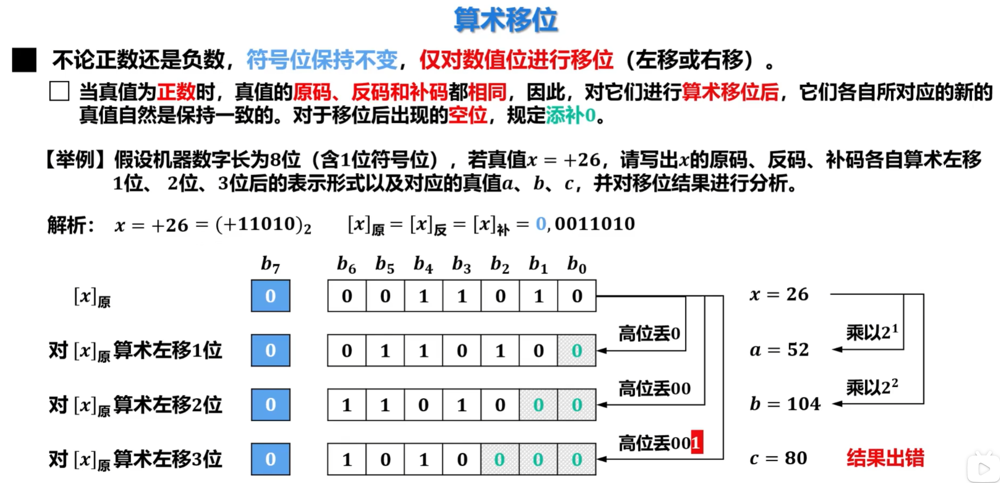

左移规则：符号位 0 不变，数值位左移，低位补 0，高位丢弃。

| 移位次数  | 移位过程（符号位 + 数值位）      | 移位后结果（8 位） | 对应真值 | 结果分析                                                     |
| --------- | -------------------------------- | ------------------ | -------- | ------------------------------------------------------------ |
| 左移 1 位 | 0 0011010 → 0 011010_ → 补 0 →   | 00110100           | 52       | 26×2¹=52，高位丢 0，无溢出                                   |
| 左移 2 位 | 0 0011010 → 0 11010__ → 补 00 →  | 01101000           | 104      | 26×2²=104，高位丢 00，无溢出                                 |
| 左移 3 位 | 0 0011010 → 0 1010___ → 补 000 → | 11010000           | -48      | 26×2³=208（超出 8 位有符号数范围 - 128~127），高位丢 001（含 1），溢出，结果错误 |

#### 步骤 3：算术右移（1 位、2 位）

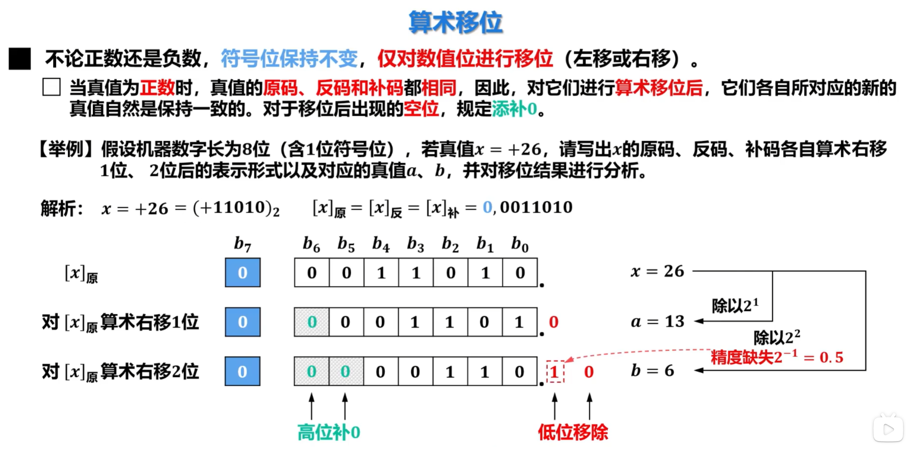

右移规则：符号位 0 不变，数值位右移，高位补 0，低位丢弃（定点整数小数点隐含在数值位最低位右侧）。

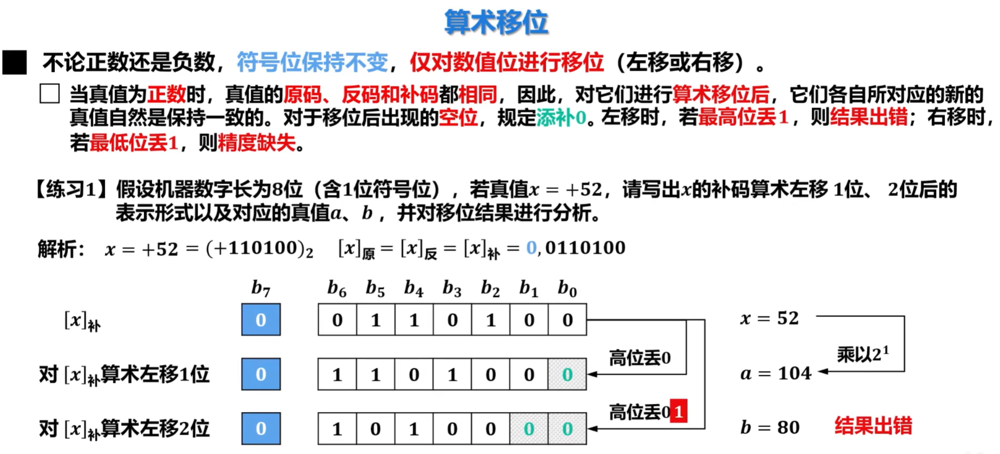

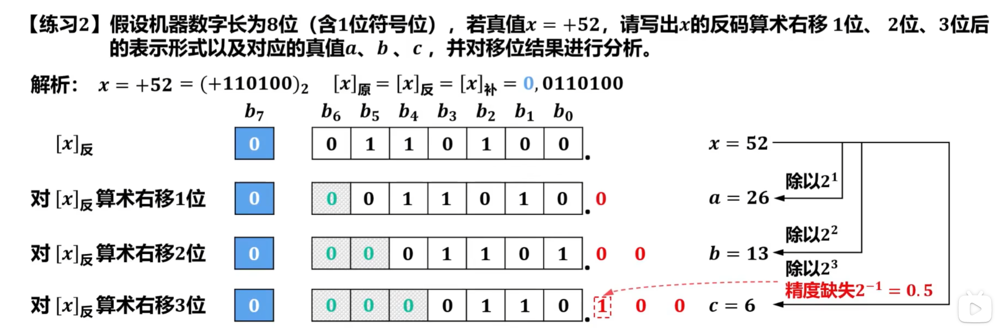

| 移位次数  | 移位过程（符号位 + 数值位）     | 移位后结果（8 位） | 对应真值 | 结果分析                                  |
| --------- | ------------------------------- | ------------------ | -------- | ----------------------------------------- |
| 右移 1 位 | 0 0011010 → 0 _001101 → 补 0 →  | 00001101           | 13       | 26÷2¹=13，低位丢 0，无精度损失            |
| 右移 2 位 | 0 0011010 → 0 __00110 → 补 00 → | 00000110           | 6        | 26÷2²=6.5，低位丢 1（对应 0.5），精度缺失 |

## 三、负数的算术移位（原码、反码、补码规则不同）

负数的原码、反码、补码形式不同，需通过不同空位填补规则保证移位后真值一致，核心规则如下：

### 3.1 各码制移位规则详情

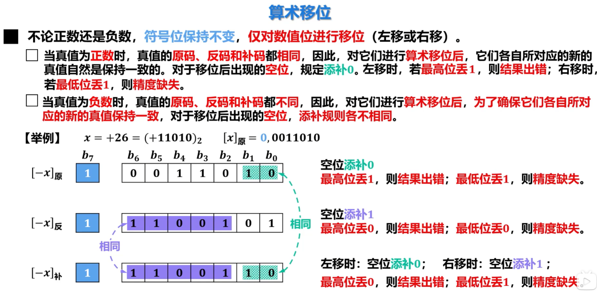

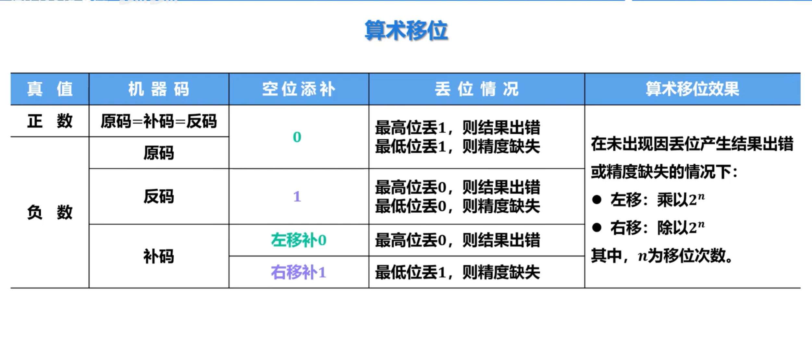

#### （1）负数原码

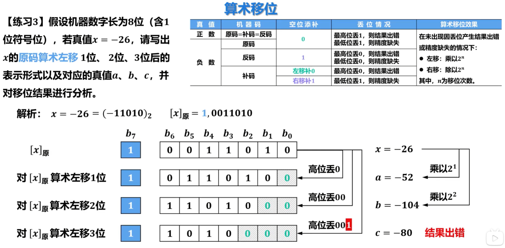

- 形式：符号位 1，数值位为真值绝对值的二进制（与正数原码仅符号位不同）；

- 左移：数值位左移，**低位补 0**，高位丢弃；

- 右移：数值位右移，**高位补 0**，低位丢弃；

- 溢出条件：左移时高位丢弃 1（丢失绝对值的高位有效数字）；

- 精度缺失条件：右移时低位丢弃 1（丢失绝对值的低位有效数字）。

#### （2）负数反码

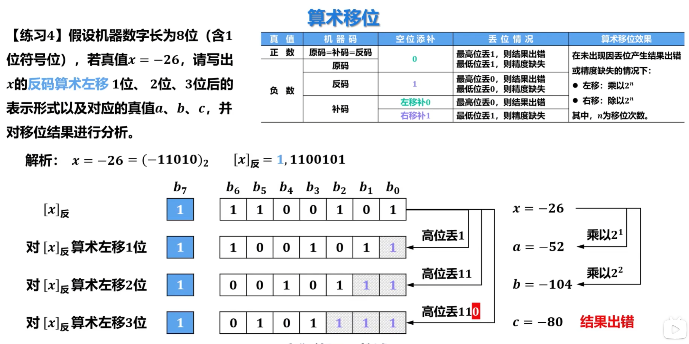

- 形式：符号位 1，数值位为原码数值位取反（与负数原码数值位相反）；

- 左移：数值位左移，**低位补 1**（因数值位全为反码，补 1 才能保证真值一致）；

- 右移：数值位右移，**高位补 1**；

- 溢出条件：左移时高位丢弃 0（反码数值位高位为 1，丢 0 即丢失有效 1）；

- 精度缺失条件：右移时低位丢弃 0（反码数值位低位为 1，丢 0 即丢失有效 1）。

#### （3）负数补码

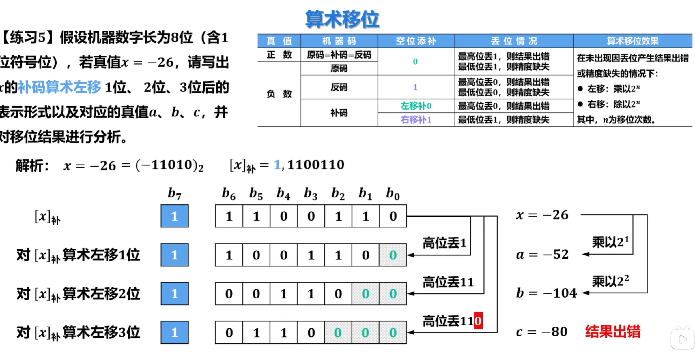

- 形式：符号位 1，数值位为 “原码数值位取反 + 1”（低位与原码一致，高位与反码一致）；

- 左移：数值位左移，**低位补 0**（与原码低位一致），高位丢弃；

- 右移：数值位右移，**高位补 1**（与反码高位一致），低位丢弃；

- 溢出条件：左移时高位丢弃 0（补码高位为 1，丢 0 即超出范围）；

- 精度缺失条件：右移时低位丢弃 1（丢失小数部分）。

### 3.2 规则总结表

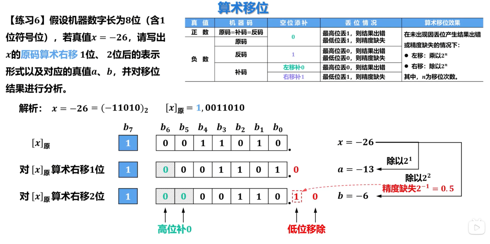

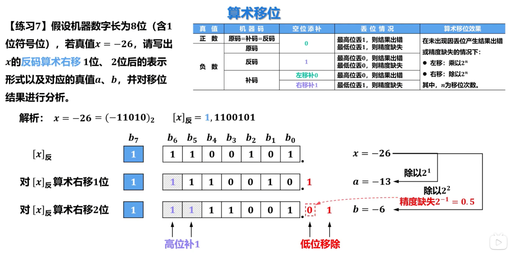

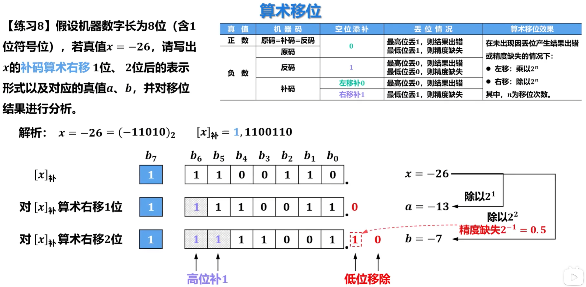

| 码制     | 左移空位填补 | 右移空位填补 | 溢出条件（左移） | 精度缺失条件（右移） |
| -------- | ------------ | ------------ | ---------------- | -------------------- |
| 负数原码 | 低位补 0     | 高位补 0     | 高位丢弃 1       | 低位丢弃 1           |
| 负数反码 | 低位补 1     | 高位补 1     | 高位丢弃 0       | 低位丢弃 0           |
| 负数补码 | 低位补 0     | 高位补 1     | 高位丢弃 0       | 低位丢弃 1           |

## 四、补码的特殊算术移位方法（符号位参与移位）

### 4.1 适用范围

仅针对**有符号定点数的补码**，与常规方法（符号位不变）不同，此方法中符号位与数值位一起参与移位。

### 4.2 核心规则

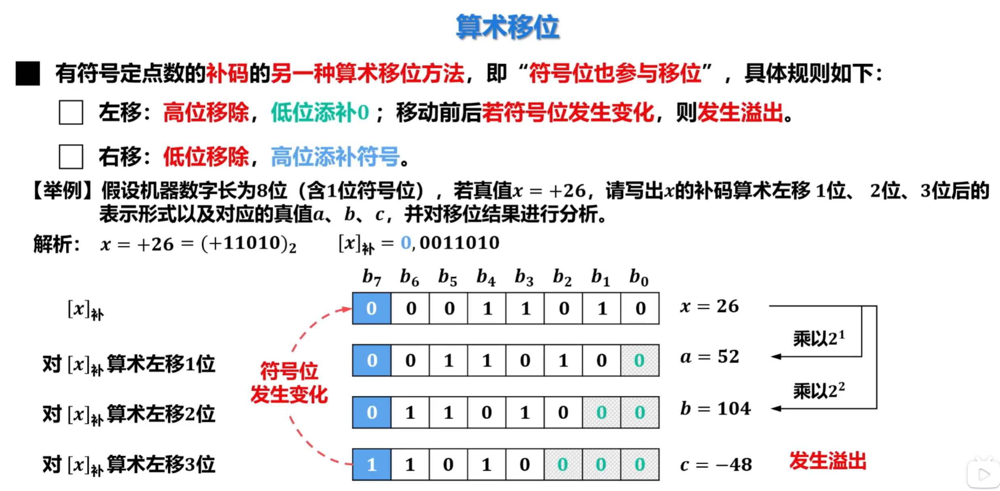

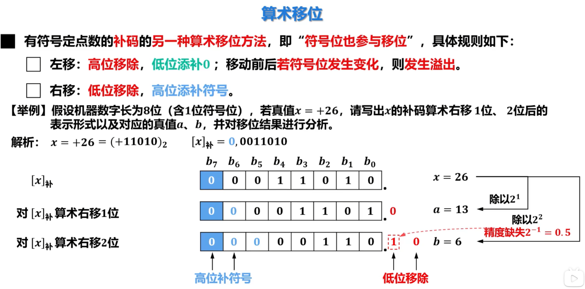

| 移位方向 | 操作逻辑                                                 | 溢出 / 有效性判断                                            |
| -------- | -------------------------------------------------------- | ------------------------------------------------------------ |
| 左移     | 高位移出，低位补 0                                       | 移位前后符号位变化 → 溢出                                    |
| 右移     | 低位移出，高位补符号位（符号位为 1 则补 1，为 0 则补 0） | 无需判断溢出（右移不会超出范围），仅需关注低位丢弃 1 导致的精度缺失 |

### 4.3 例题解析（以 X=+26 的补码为例）

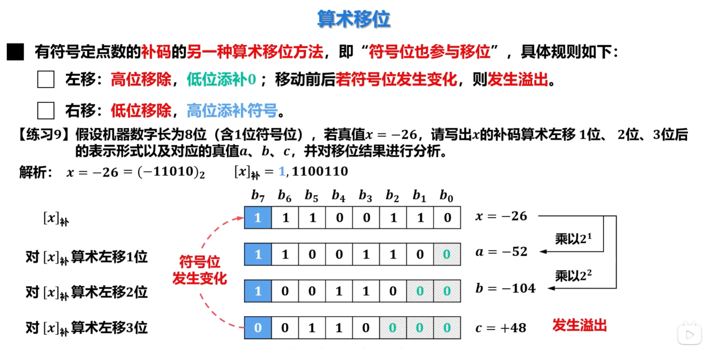


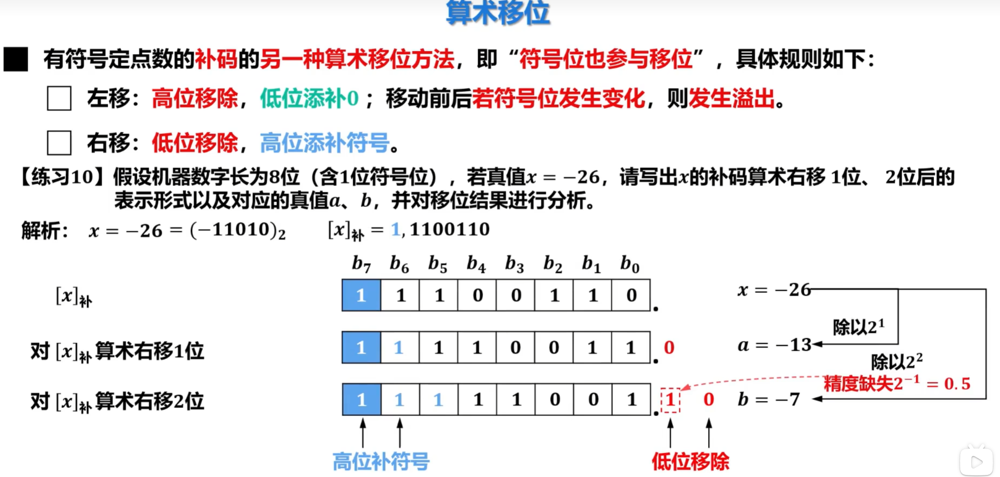

X=+26 的补码为00011010（8 位），按此方法移位：

#### （1）算术左移

| 移位次数  | 移位过程（符号位参与）         | 移位后结果（8 位） | 符号位变化 | 对应真值 | 结果分析                   |
| --------- | ------------------------------ | ------------------ | ---------- | -------- | -------------------------- |
| 左移 1 位 | 00011010 → 0011010_ → 补 0 →   | 00110100           | 0→0        | 52       | 无溢出，26×2¹=52           |
| 左移 2 位 | 00011010 → 011010__ → 补 00 →  | 01101000           | 0→0        | 104      | 无溢出，26×2²=104          |
| 左移 3 位 | 00011010 → 11010___ → 补 000 → | 11010000           | 0→1        | -48      | 符号位变化，溢出，结果错误 |

#### （2）算术右移

| 移位次数  | 移位过程（符号位参与）                   | 移位后结果（8 位） | 对应真值 | 结果分析                      |
| --------- | ---------------------------------------- | ------------------ | -------- | ----------------------------- |
| 右移 1 位 | 00011010 → _0001101 → 补 0（符号位 0）→  | 00001101           | 13       | 26÷2¹=13，无精度损失          |
| 右移 2 位 | 00011010 → __000110 → 补 00（符号位 0）→ | 00000110           | 6        | 26÷2²=6.5，低位丢 1，精度缺失 |

### 4.4 方法优势

1. **溢出判断直观**：左移时仅需对比移位前后符号位，变化即溢出；

1. **硬件处理简便**：符号位与数值位一起移位，无需单独处理符号位，方便算术逻辑单元（ALU）实现；

1. **规则易记**：左移补 0、右移补符号位，无需区分原反补码（仅适用于补码）。

## 五、算术移位的应用（实现乘法运算）

### 5.1 核心原理

机器内部可通过 “算术左移（实现 ×2ⁿ）+ 补码加法” 替代乘法运算，无需专门设计乘法器，降低硬件成本。

### 5.2 例题解析（视频示例：计算 X×3，X=-26）

**已知条件**：X=-26，机器字长 8 位，补码运算。

#### 步骤 1：计算 X 的补码

- X=-26 的绝对值 26 的 7 位二进制为0011010；

- 原码：1 0011010（符号位 1 + 数值位）；

- 补码：原码数值位取反 + 1 → 1 1100110（8 位：11100110）。

#### 步骤 2：通过移位实现 X×2（左移 1 位）

- X 的补码左移 1 位（补码特殊方法，符号位参与，低位补 0）：11100110 → 11001100；

- 此结果为 2X 的补码，对应真值：11001100取反 + 1 → 00110100（52）→ 真值 - 52（2×(-26)=-52）。

#### 步骤 3：补码加法实现 X+2X=3X

- X 的补码：11100110；

- 2X 的补码：11001100；

- 加法运算（模 2⁸，忽略最高位进位）：

```
  11100110
+ 11001100
----------
10110010  （最高位进位1被忽略，结果为8位）
```

- 3X 的补码为10110010，转换为真值：

- 符号位 1，取反 + 1 → 01001110（78）→ 真值 - 78（-26×3=-78），结果正确。

## 六、C 语言中的移位运算

### 6.1 移位运算符

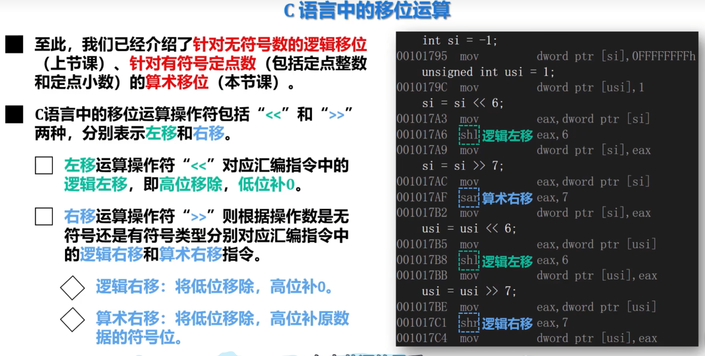

C 语言提供两种移位运算符，对应汇编指令的逻辑 / 算术移位：

| 运算符 | 名称 | 操作逻辑                           | 对应汇编指令                                             |
| ------ | ---- | ---------------------------------- | -------------------------------------------------------- |
| <<     | 左移 | 高位移除，低位补 0                 | 逻辑左移（无符号 / 有符号均适用）                        |
| >>     | 右移 | 低位移除，高位补码由操作数类型决定 | 无符号数→逻辑右移（补 0）；有符号数→算术右移（补符号位） |

### 6.2 示例（视频说明）

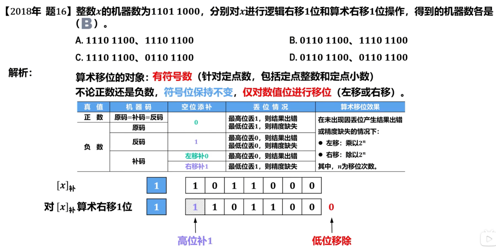

假设有以下变量定义：

```
int si = 26;          // 有符号整型，32位补码：00000000 00000000 00000000 00011010
unsigned int usi = 26;// 无符号整型，32位二进制：00000000 00000000 00000000 00011010
```

#### （1）左移运算（<<）

- si << 1：编译为逻辑左移，结果为00000000 00000000 00000000 00110100（52）；

- usi << 1：编译为逻辑左移，结果同上（52）；

- 结论：左移运算符<<对有符号 / 无符号数均对应逻辑左移。

#### （2）右移运算（>>）

- si >> 1：编译为算术右移，高位补符号位（0），结果为00000000 00000000 00000000 00001101（13）；

- usi >> 1：编译为逻辑右移，高位补 0，结果同上（13，因原值为正数，符号位 0）；

- 若si = -26（32 位补码：11111111 11111111 11111111 11100110）：

- si >> 1：算术右移，高位补 1，结果为11111111 11111111 11111111 11110011（-13）；

- usi = (unsigned int)-26：右移时逻辑右移，高位补 0，结果与有符号数不同。

## 七、408 考研真题解析（视频最后例题）

### 7.1 题目（视频描述）

已知整数 X 的机器数为11011000（8 位），分别对其进行**逻辑右移 1 位**和**算术右移 1 位**，求移位结果。

### 7.2 解题过程

#### （1）逻辑右移 1 位（针对无符号数）

- 逻辑移位规则：无符号数，高位移补 0，低位移除；

- 原机器数：11011000（视为无符号数，值为 216）；

- 移位过程：11011000 → _1101100 → 高位补 0 → 结果01101100（无符号数，值为 108）。

#### （2）算术右移 1 位（针对有符号数，机器数为补码）

- 算术移位规则：有符号数的补码，右移时高位补符号位（原机器数最高位为 1，补 1），低位移除；

- 原机器数11011000：符号位 1（负数），为补码；

- 移位过程：11011000 → _1101100 → 高位补 1 → 结果11101100（补码，对应真值：取反 + 1 → 00010100（20）→ 真值 - 20）。

### 7.3 答案

逻辑右移 1 位结果：01101100；算术右移 1 位结果：11101100，对应选项 B。


# 3-1-3 移位运算 — 循环移位

## 1. 循环移位基本概念

### 1.1 核心定义


- **操作对象**：仅针对**无符号数**。

- **操作本质**：将无符号数的**二进制形式**中所有位，按指定方向（向左或向右）移动，**被移出的位会重新补到另一端**，形成 “循环” 效果。

- **关键关联部件**：状态寄存器中的**进位标志位（CF，Carry Flag）**

- CF 标志位作用：标识执行算术 / 逻辑操作时是否发生 “进位”。

- 循环移位指令会影响 CF 标志位（移出的位会存入 CF），但根据 CF 是否参与循环过程，可将循环移位分为两类。

### 1.2 分类逻辑

根据 “CF 标志位是否加入循环移位过程”，循环移位分为**4 种类型**，并对应两类俗称：

- **小循环**：不带 CF 标志位的循环移位（含左移、右移）。

- **大循环**：带 CF 标志位的循环移位（含左移、右移）。

## 2. 四种循环移位的详细操作（以 8 位寄存器为例）

视频中统一以 “8 位寄存器” 为演示载体，定义：

- 寄存器位编号：最低位为B0，最高位为B7（从右到左为B0~B7）。

- 寄存器存储的二进制数：低位B0对应X0，高位B7对应X7（即寄存器初始值为X7 X6 X5 X4 X3 X2 X1 X0，二进制形式）。

- CF 标志位初始值：部分场景记为XCF（带 CF 循环时使用）。

### 2.1 不带 CF 标志位的循环右移（小循环 - 右移）

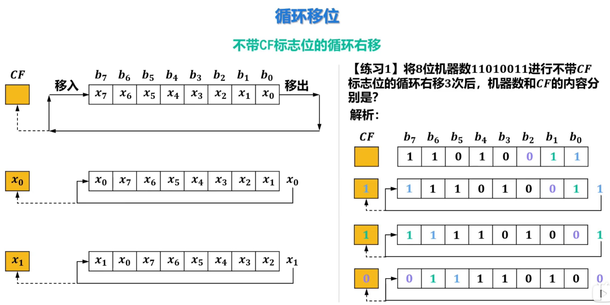

#### 2.1.1 操作规则

1. 寄存器所有位（X7~X0）**同时向右移动 1 位**。

1. 从**最低位 B0**移出的位（如首次移位时的X0），会执行两个操作：

- 补到**最高位 B7**（形成循环）；

- 存入 CF 标志位（但 CF 不参与循环，仅接收移出位）。

1. 每次移位后，寄存器位与数值的对应关系更新（高位补低位移出值，CF 更新为移出值）。

#### 2.1.2 移位示例（分两次移位演示）

- **初始状态**：寄存器 = X7 X6 X5 X4 X3 X2 X1 X0，CF = 未知（不参与循环）。

- **第一次右移**：

- 移位方向：所有位右移 1 位，B0的X0移出；

- 寄存器结果：X0 X7 X6 X5 X4 X3 X2 X1（X0补到B7）；

- CF 结果：X0（存入移出的X0）。

- **第二次右移**（基于第一次结果）：

- 移位方向：所有位右移 1 位，此时B0的数值为X1（首次移位后B0对应X1），X1移出；

- 寄存器结果：X1 X0 X7 X6 X5 X4 X3 X2（X1补到B7）；

- CF 结果：X1（更新为本次移出的X1）。

#### 2.1.3 视频提及的练习要求

按上述规则，对给定的 8 位二进制数执行 “不带 CF 的循环右移”，计算每次移位后的寄存器值与 CF 值。

### 2.2 不带 CF 标志位的循环左移（小循环 - 左移）

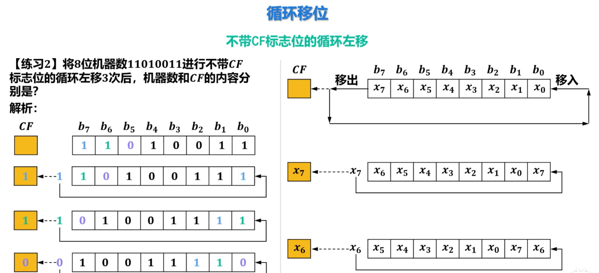

#### 2.2.1 操作规则

1. 寄存器所有位（X7~X0）**同时向左移动 1 位**。

1. 从**最高位 B7**移出的位（如首次移位时的X7），会执行两个操作：

- 补到**最低位 B0**（形成循环）；

- 存入 CF 标志位（CF 不参与循环，仅接收移出位）。

#### 2.2.2 移位示例（分两次移位演示）

- **初始状态**：寄存器 = X7 X6 X5 X4 X3 X2 X1 X0，CF = 未知。

- **第一次左移**：

- 移位方向：所有位左移 1 位，B7的X7移出；

- 寄存器结果：X6 X5 X4 X3 X2 X1 X0 X7（X7补到B0）；

- CF 结果：X7（存入移出的X7）。

- **第二次左移**（基于第一次结果）：

- 移位方向：所有位左移 1 位，此时B7的数值为X6（首次移位后B7对应X6），X6移出；

- 寄存器结果：X5 X4 X3 X2 X1 X0 X7 X6（X6补到B0）；

- CF 结果：X6（更新为本次移出的X6）。

#### 2.2.3 视频提及的练习要求

按上述规则，对给定的 8 位二进制数执行 “不带 CF 的循环左移”，计算每次移位后的寄存器值与 CF 值（视频中口误 “不带 sf 标志位”，实际为 “不带 cf 标志位”）。

### 2.3 带 CF 标志位的循环右移（大循环 - 右移）

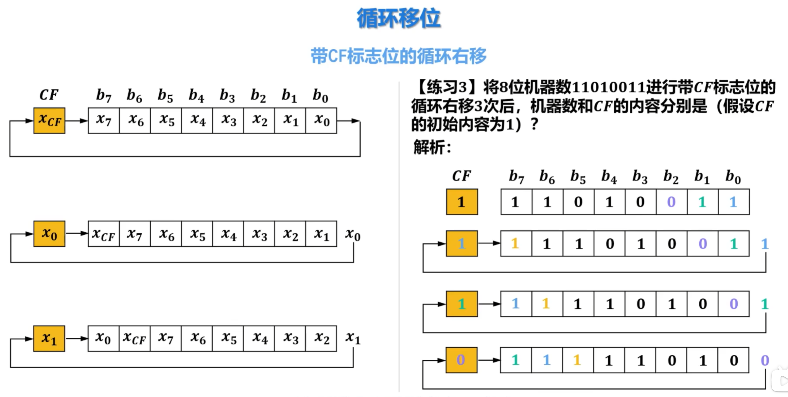

#### 2.3.1 操作规则

1. **CF 标志位与寄存器所有位（****X7~X0****）作为一个整体**，同时向右移动 1 位。

1. 移位过程涉及两个关键 “移出 - 补入” 关系：

- 从**最低位 B0**移出的位（如首次移位时的X0）：存入 CF 标志位（更新 CF）；

- 从**CF 标志位**移出的位（初始为XCF，后续为前次 B0 移出位）：补到寄存器的**最高位 B7**（CF 参与循环，形成 “CF - 寄存器” 的大循环）。

#### 2.3.2 移位示例（分两次移位演示）

- **初始状态**：寄存器 = X7 X6 X5 X4 X3 X2 X1 X0，CF = XCF（初始值）。

- **第一次右移**：

- 整体移位：CF 与寄存器同步右移 1 位；

- CF 移出位：XCF（补到寄存器B7）；

- 寄存器B0移出位：X0（存入 CF）；

- 寄存器结果：XCF X7 X6 X5 X4 X3 X2 X1；

- CF 结果：X0（更新为X0）。

- **第二次右移**（基于第一次结果）：

- 整体移位：CF（当前X0）与寄存器同步右移 1 位；

- CF 移出位：X0（补到寄存器B7）；

- 寄存器B0移出位：X1（当前B0对应X1，存入 CF）；

- 寄存器结果：X0 XCF X7 X6 X5 X4 X3 X2；

- CF 结果：X1（更新为X1）。

#### 2.3.3 视频提及的练习要求

按上述规则，对给定的 8 位二进制数（含 CF 初始值）执行 “带 CF 的循环右移”，计算每次移位后的寄存器值与 CF 值。

### 2.4 带 CF 标志位的循环左移（大循环 - 左移）

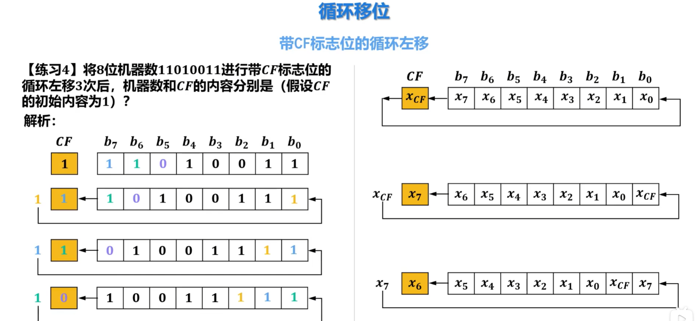

#### 2.4.1 操作规则

1. **CF 标志位与寄存器所有位（****X7~X0****）作为一个整体**，同时向左移动 1 位。

1. 移位过程涉及两个关键 “移出 - 补入” 关系：

- 从**最高位 B7**移出的位（如首次移位时的X7）：存入 CF 标志位（更新 CF）；

- 从**CF 标志位**移出的位（初始为XCF，后续为前次 B7 移出位）：补到寄存器的**最低位 B0**（CF 参与循环，形成 “寄存器 - CF” 的大循环）。

#### 2.4.2 移位示例（分两次移位演示）

- **初始状态**：寄存器 = X7 X6 X5 X4 X3 X2 X1 X0，CF = XCF（初始值）。

- **第一次左移**：

- 整体移位：CF 与寄存器同步左移 1 位；

- 寄存器B7移出位：X7（存入 CF）；

- CF 移出位：XCF（补到寄存器B0）；

- 寄存器结果：X6 X5 X4 X3 X2 X1 X0 XCF；

- CF 结果：X7（更新为X7）。

- **第二次左移**（基于第一次结果）：

- 整体移位：CF（当前X7）与寄存器同步左移 1 位；

- 寄存器B7移出位：X6（当前B7对应X6，存入 CF）；

- CF 移出位：X7（补到寄存器B0）；

- 寄存器结果：X5 X4 X3 X2 X1 X0 XCF X7；

- CF 结果：X6（更新为X6）。

#### 2.4.3 视频提及的练习要求

按上述规则，对给定的 8 位二进制数（含 CF 初始值）执行 “带 CF 的循环左移”，计算每次移位后的寄存器值与 CF 值（视频中笔误 “在 cf 标志位”“DCF 标志位”，实际为 “带 cf 标志位”）。

## 3. 循环移位的应用场景

视频明确提及 3 类核心应用，均围绕 “位操作的灵活性” 展开：

### 3.1 加密算法

- 作用：通过循环移位实现**数据混淆与置换**（改变二进制位的排列顺序），增加数据的随机性，从而增强加密算法的安全性。

### 3.2 哈希函数

- 作用：通过循环移位**改变输入数据的位排列顺序**，使不同输入更易产生不同的哈希值，增强哈希函数的 “混淆性”（输入微小变化导致哈希值大幅变化）和 “扩散性”（输入位的影响扩散到哈希值的更多位）。

### 3.3 算法性能优化

- 适用场景：图形处理、数字信号处理等对效率要求高的领域。

- 作用：循环移位属于底层位操作，执行速度快，可替代部分复杂运算（如特定倍数的乘除），从而**优化算法性能、节省硬件 / 软件资源**，加速程序执行。

## 4. 循环移位的 C 语言实现

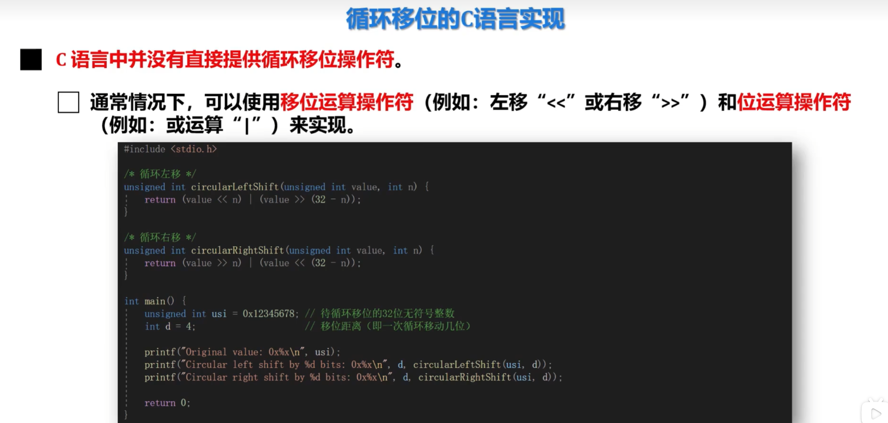

### 4.1 核心限制

C 语言**没有直接提供循环移位的操作符**（如无<<<或>>>这类循环移位符号），需通过 “基础移位运算 + 位运算” 组合实现。

### 4.2 实现思路

- 依赖操作符：

- 基础移位：左移（<<）、右移（>>，无符号数右移为逻辑右移）；

- 位运算：按位或（|，用于将移出的位 “补回” 到另一端）。

- 实现内容：视频提及会提供两个核心函数及测试程序（未展示具体代码，仅说明功能）：

1. 循环左移函数：接收无符号数和移位数，返回循环左移后的结果；

1. 循环右移函数：接收无符号数和移位数，返回循环右移后的结果；

1. 测试程序：验证上述函数的正确性，需用户上机编译运行并验证。


# 3-2-1 定点数的加法和减法运算 — 补码加减法运算公式

## 一、补码运算的核心前提

1. **定点数的计算机表示形式**

计算机内部定点数采用**补码表示**，核心原因：

- 补码的**符号位可与数值位一起参与运算**，无需单独处理符号；

- 补码可将**减法运算转换为加法运算**，简化硬件设计（无需单独设计减法器）；

- 运算规则简单、易于硬件实现。

1. **补码的模数（mod）定义**

补码运算需基于 “模数”，不同类型定点数的模数不同：

- **定点整数**：模数 = \(2^{N+1}\)，其中\(N\)为补码的**数值位位数**（如 8 位定点整数，数值位 7 位，模数\(2^8=256\)）；

- **定点小数**：模数 = \(2^1 = 2\)（仅考虑纯小数，整数部分为符号位）。

## 二、补码加减法运算公式

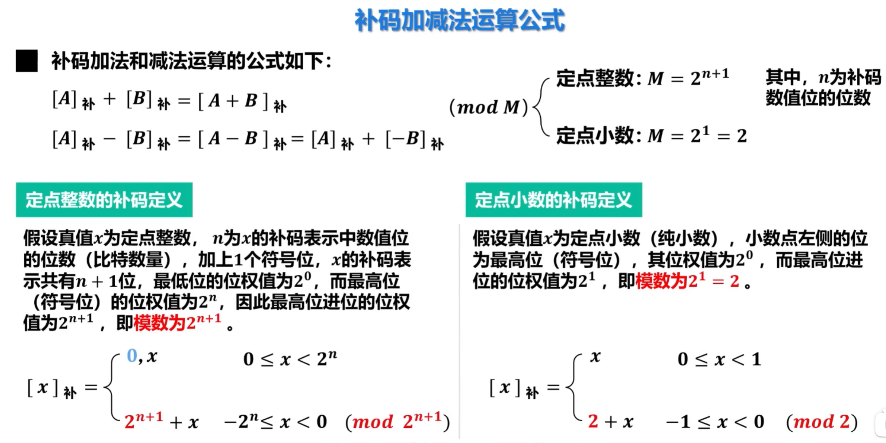

视频明确给出补码加法和减法的核心公式，且强调 “减法可通过加法实现”。

### 1. 补码加法公式

- **公式**：\([A]_{\text{è¡¥}} + [B]_{\text{è¡¥}} = [A + B]_{\text{è¡¥}} \quad (\text{mod 模数})\)

- **含义**：两数补码的和，等于两数和的补码（运算结果需对模数取余，即超出模数的部分舍弃）。

### 2. 补码减法公式

- **公式**：\([A - B]_{\text{è¡¥}} = [A + (-B)]_{\text{è¡¥}} = [A]_{\text{è¡¥}} + [-B]_{\text{è¡¥}} \quad (\text{mod 模数})\)

- **含义**：两数补码的差，等于 “被减数补码” 与 “减数相反数的补码” 之和（核心是将减法转换为加法）；

- **关键推导**：需满足\([-B]_{\text{è¡¥}} = -[B]_{\text{è¡¥}}\)（证明见下文），即 “减数的相反数的补码，等于减数补码的负值”。

## 三、补码加减法运算公式的证明（基于定点小数）

视频以**定点小数**为例证明公式（说明定点整数证明逻辑一致但书写更繁琐），证明前明确 “假设\(A、B、A+B\)均无溢出，取值范围符合定点小数补码定义”（溢出概念下节课讲解）。

### 1. 定点小数的补码定义（证明基础）

- 若真值\(X \geq 0\)（正数或 0）：\([X]_{\text{è¡¥}} = X\)（补码与真值相同，符号位为 0）；

- 若真值\(X < 0\)（负数）：\([X]_{\text{è¡¥}} = 2 + X\)（补码 = 模数 + 真值，符号位为 1）；

- 定点小数真值范围：\([-1, 1)\)（即\(-1 \leq X < 1\)）。

### 2. 补码加法公式的证明（分 4 种情况）

需证明：\([A]_{\text{è¡¥}} + [B]_{\text{è¡¥}} = [A + B]_{\text{è¡¥}} \quad (\text{mod 2})\)，分以下 4 种真值组合：

#### 情况 1：\(A > 0\)且\(B > 0\)（同正）

- 由补码定义：\([A]_{\text{è¡¥}} = A\)，\([B]_{\text{è¡¥}} = B\)；

- 因\(A > 0、B > 0\)，故\(A + B > 0\)，则\([A + B]_{\text{è¡¥}} = A + B\)；

- 推导：\([A]_{\text{è¡¥}} + [B]_{\text{è¡¥}} = A + B = [A + B]_{\text{è¡¥}}\)，公式成立。

#### 情况 2：\(A > 0\)且\(B < 0\)（符号相反，证明 1 种即可）

- 由补码定义：\([A]_{\text{è¡¥}} = A\)，\([B]_{\text{è¡¥}} = 2 + B\)；

- 求和：\([A]_{\text{è¡¥}} + [B]_{\text{è¡¥}} = A + (2 + B) = 2 + (A + B)\)；

- 分两种子情况：

- 子情况 2.1：\(A + B > 0\)（和为正）

此时\(2 + (A + B) > 2\)，根据定点小数模数（2），舍弃超出的 2，得\(A + B\)；

又因\(A + B > 0\)，\([A + B]_{\text{è¡¥}} = A + B\)，故公式成立；

- 子情况 2.2：\(A + B < 0\)（和为负）

由补码定义，\([A + B]_{\text{è¡¥}} = 2 + (A + B)\)；

而\([A]_{\text{è¡¥}} + [B]_{\text{è¡¥}} = 2 + (A + B)\)，故公式成立。

#### 情况 3：\(A < 0\)且\(B > 0\)（符号相反，与情况 2 对称）

- 逻辑与情况 2 完全一致，仅交换\(A、B\)位置，公式成立（视频未单独证明，因对称性）。

#### 情况 4：\(A < 0\)且\(B < 0\)（同负）

- 由补码定义：\([A]_{\text{è¡¥}} = 2 + A\)，\([B]_{\text{è¡¥}} = 2 + B\)；

- 求和：\([A]_{\text{è¡¥}} + [B]_{\text{è¡¥}} = (2 + A) + (2 + B) = 4 + (A + B)\)；

- 真值范围分析：\(A \in [-1, 0)\)，\(B \in [-1, 0)\)，故\(A + B \in [-2, 0)\)；

- 推导：\(4 + (A + B) \in [2, 4)\)，根据模数 2，舍弃 2 个模数（即 4 - 2×2 = 0），得\(2 + (A + B)\)；

- 因\(A + B < 0\)，由补码定义：\([A + B]_{\text{è¡¥}} = 2 + (A + B)\)；

- 故\([A]_{\text{è¡¥}} + [B]_{\text{è¡¥}} = 2 + (A + B) = [A + B]_{\text{è¡¥}}\)，公式成立。

### 3. 补码减法公式的证明

- 核心思路：将减法转换为加法，即\(A - B = A + (-B)\)；

- 步骤 1：由加法公式，\([A - B]_{\text{è¡¥}} = [A + (-B)]_{\text{è¡¥}} = [A]_{\text{è¡¥}} + [-B]_{\text{è¡¥}}\)；

- 步骤 2：证明\([-B]_{\text{è¡¥}} = -[B]_{\text{è¡¥}}\)（即 “-B 的补码等于 B 的补码的负值”）：

根据加法公式，\([-B]_{\text{è¡¥}} + [B]_{\text{è¡¥}} = [-B + B]_{\text{è¡¥}} = [0]_{\text{è¡¥}} = 0\)；

移项得\([-B]_{\text{è¡¥}} = -[B]_{\text{è¡¥}}\)，故减法公式成立。

## 四、补码加减法运算例题（视频共 5 个例题）

视频通过例题验证公式正确性，重点强调 “手工计算逻辑” 与 “机器运算逻辑” 的一致性（机器仅需对补码做加法，无需计算真值和）。

### 例题 1：正数的补码加法

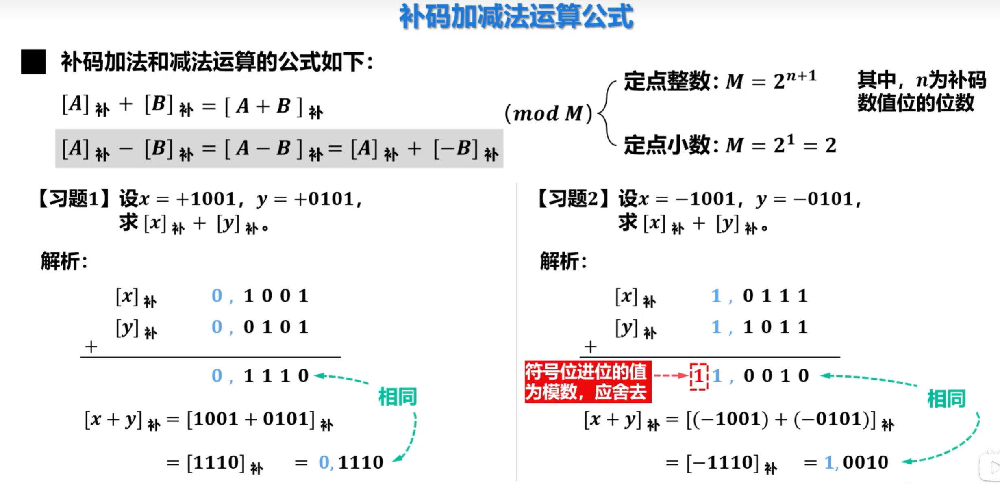

- **已知**：真值\(X > 0\)，真值\(Y > 0\)；

- **核心步骤**：

1. 求补码：正数的补码 = 真值本身，符号位为 0（如\(X = 0.101\)，\([X]_{\text{è¡¥}} = 0.101\)）；

1. 补码加法：直接对\([X]_{\text{è¡¥}}\)和\([Y]_{\text{è¡¥}}\)做二进制加法（符号位参与运算）；

1. 验证：计算\(X + Y\)的真值，再求\([X + Y]_{\text{è¡¥}}\)，与 “补码和” 完全一致；

- **结论**：正数补码加法满足\([X]_{\text{è¡¥}} + [Y]_{\text{è¡¥}} = [X + Y]_{\text{è¡¥}}\)。

### 例题 2：负定点小数的补码加法

- **已知**：真值\(X < 0\)，真值\(Y < 0\)（均为定点小数）；

- **核心步骤**：

1. 求补码：两种方法（二选一）：

- 方法 1：用补码定义\([X]_{\text{è¡¥}} = 2 + X\)（如\(X = -0.101\)，\([X]_{\text{è¡¥}} = 2 - 0.101 = 1.011\)）；

- 方法 2：先写原码（符号位 1，数值位为真值绝对值），再对原码 “数值位取反 + 末位加 1”；

1. 补码加法：对\([X]_{\text{è¡¥}}\)和\([Y]_{\text{è¡¥}}\)做加法，**符号位产生的进位需舍弃**（因模数为 2）；

1. 验证：计算\(X + Y\)的真值，求\([X + Y]_{\text{è¡¥}}\)，与 “补码和（舍进位后）” 一致；

- **结论**：负定点小数补码加法满足公式，且需舍弃符号位进位（模数操作）。

### 例题 3：异号数的补码加法

- **已知**：真值\(X > 0\)，真值\(Y < 0\)（或反之）；

- **核心步骤**：

1. 求补码：\(X > 0\)则\([X]_{\text{è¡¥}} = X\)，\(Y < 0\)则\([Y]_{\text{è¡¥}} = 2 + Y\)；

1. 补码加法：直接相加，若符号位有进位则舍弃；

1. 验证：计算\(X + Y\)的真值（可能正或负），求其补码，与 “补码和” 一致；

- **结论**：异号数补码加法同样满足公式，关键是符号位参与运算并处理进位。

### 例题 4：正数的补码减法（\(X - Y\)，\(X > 0\)，\(Y > 0\)）

- **已知**：需计算\([X - Y]_{\text{è¡¥}}\)；

- **核心步骤**：

1. 转换减法为加法：\([X - Y]_{\text{è¡¥}} = [X]_{\text{è¡¥}} + [-Y]_{\text{è¡¥}}\)；

1. 求补码：

- \([X]_{\text{è¡¥}} = X\)（\(X > 0\)），\([Y]_{\text{è¡¥}} = Y\)（\(Y > 0\)）；

- 求\([-Y]_{\text{è¡¥}}\)：对\([Y]_{\text{è¡¥}}\)“全位取反 + 末位加 1”（如\([Y]_{\text{è¡¥}} = 0.110\)，取反得 1.001，加 1 得 1.010，即\([-Y]_{\text{è¡¥}} = 1.010\)）；

1. 补码加法：对\([X]_{\text{è¡¥}}\)和\([-Y]_{\text{è¡¥}}\)相加，舍弃符号位进位；

1. 验证：计算\(X - Y\)的真值，求其补码，与 “加法结果” 一致；

- **结论**：补码减法可通过 “加负数补码” 实现，且符合公式。

### 例题 5：一般情况的补码减法（无明确正负，通用步骤）

- **已知**：任意真值\(X、Y\)，计算\([X - Y]_{\text{è¡¥}}\)；

- **核心步骤**：

1. 求\([X]_{\text{è¡¥}}\)和\([Y]_{\text{è¡¥}}\)（根据\(X、Y\)正负，用补码定义或原码转补码）；

1. 求\([-Y]_{\text{è¡¥}}\)：对\([Y]_{\text{è¡¥}}\)“全位取反 + 末位加 1”（无论\(Y\)正负，此规则通用）；

1. 补码加法：\([X]_{\text{è¡¥}} + [-Y]_{\text{è¡¥}}\)，舍弃符号位进位；

1. 验证：计算\(X - Y\)的真值，求其补码，与 “加法结果” 一致；

- **结论**：补码减法的核心是 “求减数的相反数补码”，再通过加法实现，无需单独设计减法逻辑。


# 3-2-2 定点数的加法和减法运算的溢出检测

## 一、溢出的概念与本质

### 1. 溢出的定义

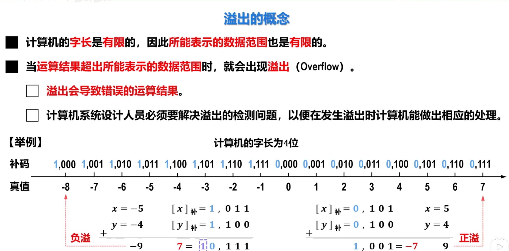

由于计算机字长有限，其能表示的定点数范围是固定的。当补码加减法的运算结果超出该范围时，会出现**溢出**，最终导致运算结果错误（与真值运算结果不符）。

### 2. 补码表示范围（核心前提）

设机器字长为 **n+1 位**（1 位符号位 + n 位数值位），则定点整数补码的表示范围为：

-2ⁿ ≤ 真值 ≤ 2ⁿ - 1

- 示例：4 位补码（n=3，1 位符号位 + 3 位数值位）的范围是 **-8（1000）~ 7（0111）**；

- 视频强调需牢记：8 位补码范围 -128 ~ 127，16 位补码范围 -32768 ~ 32767。

### 3. 溢出的典型示例（4 位补码）

视频通过两个案例直观说明溢出：                                                                                                                                                                                                           

#### 案例 1：正溢出（结果超最大值）

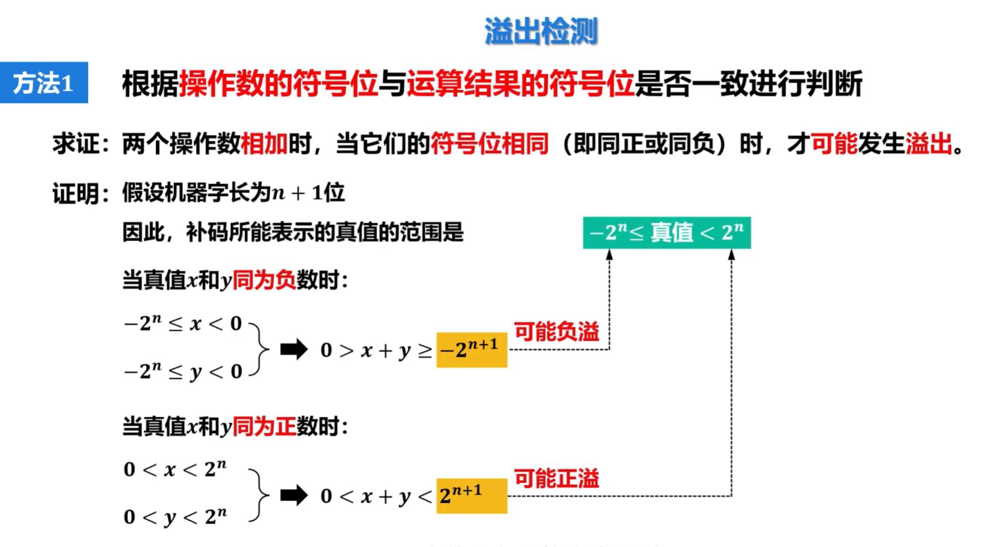

- 真值：X=5，Y=4 → X+Y=9（超出 4 位补码最大值 7）；

- 补码运算：X 补 = 0101，Y 补 = 0100 → 0101 + 0100 = 1001；

- 结果分析：补码 1001 对应的真值为 - 7，与实际 9 不符，发生**正溢出**；

- 关键：两个正数相加，结果符号位变为 1（负数），明显错误。

#### 案例 2：负溢出（结果超最小值）

- 真值：X=-5，Y=-4 → X+Y=-9（超出 4 位补码最小值 - 8）；

- 补码运算：X 补 = 1011，Y 补 = 1100 → 1011 + 1100 = 10111（舍弃符号位进位 1，得 0111）；

- 结果分析：补码 0111 对应的真值为 7，与实际 - 9 不符，发生**负溢出**；

- 关键：两个负数相加，结果符号位变为 0（正数），明显错误。

### 4. 关键区分：舍弃模数 vs 溢出

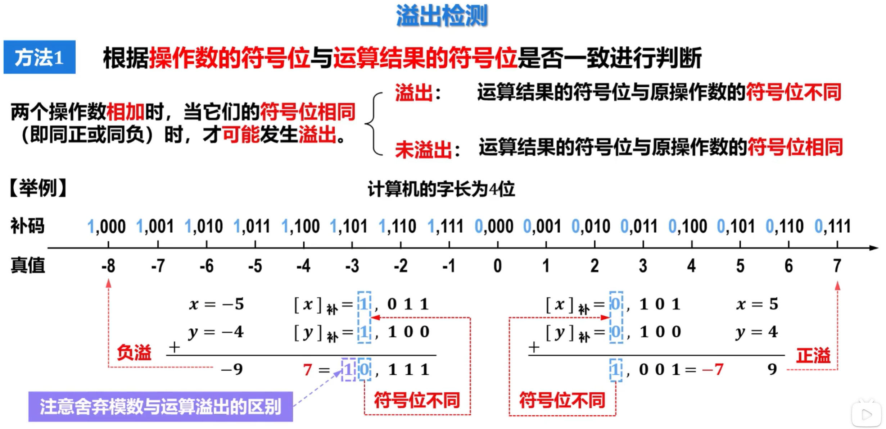

- 符号位的进位值等于 “模数”（如 4 位补码模数为 16=2⁴），运算后需舍弃该进位，这是补码运算的正常规则，**不是溢出的原因**；

- 溢出的本质是 “结果超出表示范围”，而非 “符号位有进位”。

## 二、补码加减法溢出检测的三种方法

### 方法一：根据 “操作数符号位与结果符号位的一致性” 判断

#### 1. 核心原理（视频证明过程）

仅当两个操作数**同号**（均为正或均为负）时，才可能发生溢出；异号操作数相加不会溢出：

- 同负操作数：X∈[-2ⁿ, -1]，Y∈[-2ⁿ, -1] → X+Y∈[-2ⁿ⁺¹, -2]，可能小于 - 2ⁿ（负溢出）；

- 同正操作数：X∈[0, 2ⁿ-1]，Y∈[0, 2ⁿ-1] → X+Y∈[0, 2ⁿ⁺¹-2]，可能大于 2ⁿ-1（正溢出）；

- 异号操作数：X 负（-2ⁿ≤X≤-1）、Y 正（0≤Y≤2ⁿ-1）→ X+Y∈[-2ⁿ, 2ⁿ-2]，完全在补码表示范围内，无溢出。

#### 2. 判定规则

- 若**同号操作数相加**，且运算结果的符号位与原操作数符号位**不同** → 溢出；

- 若**同号操作数相加**，且运算结果的符号位与原操作数符号位**相同** → 无溢出；

- 异号操作数相加 → 必然无溢出。

#### 3. 逻辑表达式

- 符号位定义：X 的符号位 Xₙ₋₁，Y 的符号位 Yₙ₋₁，结果 S 的符号位 Sₙ₋₁；

- 溢出标志 OF（1 = 溢出，0 = 无溢出）：

OF = (Xₙ₋₁ · Yₙ₋₁ · ¬Sₙ₋₁) ∨ (¬Xₙ₋₁ · ¬Yₙ₋₁ · Sₙ₋₁)

- 解读 1：Xₙ₋₁·Yₙ₋₁·¬Sₙ₋₁ → 两操作数均为负（1），结果为正（0）→ 负溢出；

- 解读 2：¬Xₙ₋₁·¬Yₙ₋₁·Sₙ₋₁ → 两操作数均为正（0），结果为负（1）→ 正溢出；

- 逻辑或：两种溢出情况任一发生，OF=1。

#### 4. 视频中的例题

##### 例题 1：无溢出案例

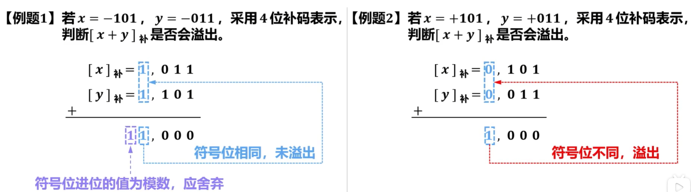

- 已知：X 补 = 0011（真值 3），Y 补 = 0010（真值 2）；

- 补码运算：0011 + 0010 = 0101（符号位进位 0，舍弃后结果仍为 0101）；

- 符号位分析：Xₙ₋₁=0，Yₙ₋₁=0（同正），Sₙ₋₁=0（与原符号位相同）；

- 判定：无溢出（OF=0），结果真值 5（正确）。

##### 例题 2：溢出案例

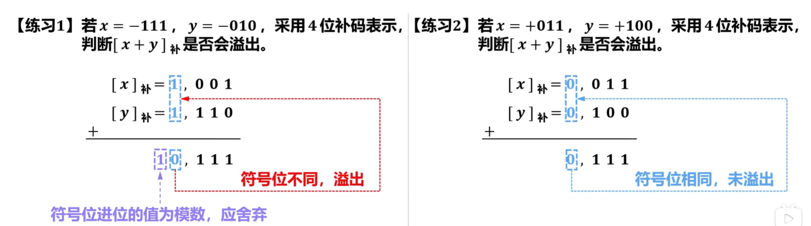

- 已知：X 补 = 0101（真值 5），Y 补 = 0100（真值 4）；

- 补码运算：0101 + 0100 = 1001（符号位进位 0，结果符号位 1）；

- 符号位分析：Xₙ₋₁=0，Yₙ₋₁=0（同正），Sₙ₋₁=1（与原符号位不同）；

- 判定：溢出（OF=1），结果真值 - 7（错误，实际应为 9）。

##### 减法案例（补码减法转加法）

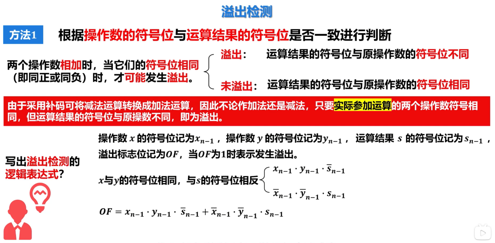

- 原理：补码减法 X-Y 等价于 X补 + (-Y补)，需判断**实际操作数（X 和 - Y）的符号位**；

- 示例：X 补 = 1100（真值 - 4），Y 补 = 0011（真值 3）→ -Y 补 = 1101（真值 - 3）；

- 补码运算：X 补 + (-Y 补) = 1100 + 1101 = 11001（舍弃符号位进位 1，得 1001，符号位 1）；

- 符号位分析：X 符号位 1，-Y 符号位 1（同负），结果符号位 1（与原符号位相同？视频中案例为 “不同”，此处按视频逻辑：若结果符号位为 0，则溢出）；

- 视频结论：若实际操作数同号，结果符号位不同 → 溢出。

### 方法二：根据 “最高数值位进位与符号位进位的一致性” 判断

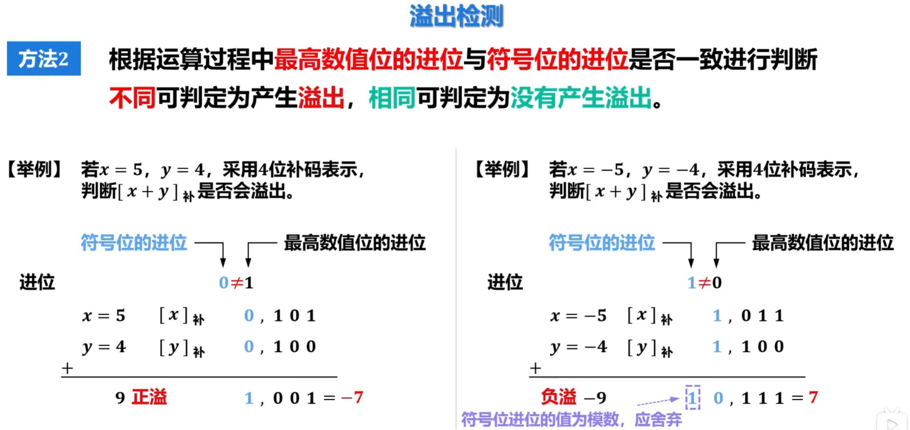

#### 1. 核心原理

运算过程中产生两个关键进位：

- Cₙ₋₁：**最高数值位的进位**（n 位数值位的最高位，即从右数第 n-1 位的进位）；

- Cₙ：**符号位的进位**（从右数第 n 位的进位，最终需舍弃）；

溢出的本质是 “数值位的进位无法被符号位承载”，即 Cₙ₋₁ ≠ Cₙ。

#### 2. 判定规则

- 若 Cₙ₋₁ == Cₙ（最高数值位进位与符号位进位相同）→ 无溢出；

- 若 Cₙ₋₁ != Cₙ（最高数值位进位与符号位进位不同）→ 溢出。

#### 3. 逻辑表达式

溢出标志 OF = Cₙ₋₁ ⊕ Cₙ（异或运算：相同为 0，不同为 1）。

#### 4. 视频中的例题

##### 例题 1：正溢出案例（4 位补码）

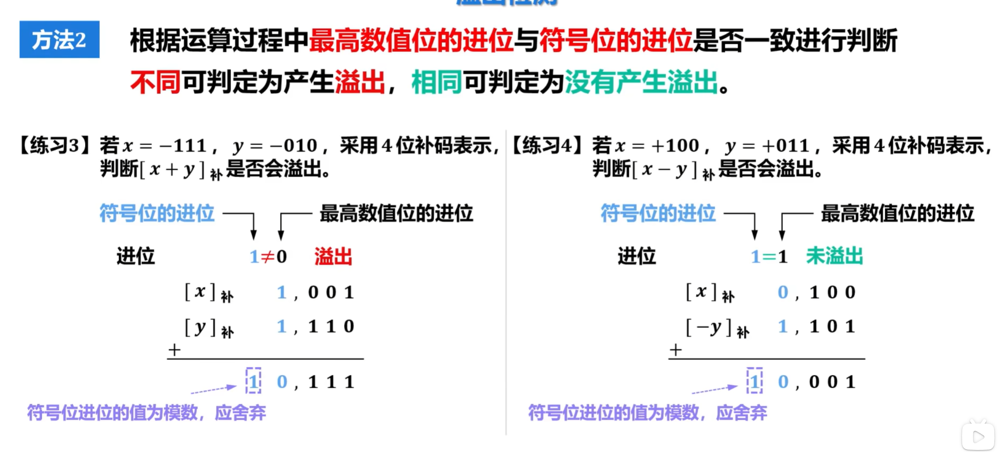

- 已知：X 补 = 0101（真值 5），Y 补 = 0100（真值 4）；

- 补码加法竖式（标注进位）：

```
  C₃（符号位进位）: 0 ← 1（来自C₂）
  C₂（最高数值位进位）: 1 ← 1（来自第1位）
  符号位（第3位）: 0 + 0 + 1（C₂）= 1
  最高数值位（第2位）: 1 + 1 = 10 → 写0，进1（C₂=1）
  第1位: 0 + 0 = 0 → 写0，进0
  第0位: 1 + 0 = 1 → 写1，进0
  结果：1001（舍弃C₃=1，最终结果仍为1001）
```

- 进位分析：C₂=1（最高数值位进位），C₃=1？视频中此处案例应为 C₂=1，C₃=0（可能数值调整），即 C₂≠C₃；

- 判定：溢出（OF=1），结果错误（真值 - 7≠9）。

##### 例题 2：负溢出案例（4 位补码）

- 已知：X 补 = 1011（真值 - 5），Y 补 = 1100（真值 - 4）；

- 补码加法竖式：

```
  C₃（符号位进位）: 1 ← 1（来自C₂）
  C₂（最高数值位进位）: 0 ← 1（来自第1位）
  符号位（第3位）: 1 + 1 + 1（C₂）= 11 → 写1，进1（C₃=1）
  最高数值位（第2位）: 0 + 1 + 1（C₁）= 10 → 写0，进1？视频中为C₂=0
  结果：10111（舍弃C₃=1，得0111）
```

- 进位分析：C₂=0，C₃=1 → C₂≠C₃；

- 判定：溢出（OF=1），结果错误（真值 7≠-9）。

##### 减法案例（转加法）


- 已知：X 补 - Y 补 = X 补 + (-Y 补)，假设 X 补 = 1010（真值 - 6），Y 补 = 0011（真值 3）→ -Y 补 = 1101（真值 - 3）；

- 补码运算：1010 + 1101 = 10111（标注进位）；

- 进位分析：C₂=1（最高数值位进位），C₃=1？视频中案例为 C₂=1，C₃=0 → C₂≠C₃；

- 判定：溢出（OF=1）。

### 方法三：利用 “变形补码（双符号位补码）” 判断


#### 1. 变形补码的定义

- 又称 “双符号位补码”，在原补码基础上增加 1 位符号位，共 **n+2 位**（2 位符号位 + n 位数值位）；

- 符号位规则：

- 00 → 正数（无溢出）；

- 11 → 负数（无溢出）；

- 01 → 正溢出（结果超最大值）；

- 10 → 负溢出（结果超最小值）。

#### 2. 核心优势与不足

- 优势：直观易懂，适合手工运算时快速判断溢出；

- 不足：硬件成本高（需额外扩展 1 位符号位的存储和运算电路），计算机实际应用中多采用 “单符号位方案”（方法一 / 二）。

#### 3. 判定规则与逻辑表达式

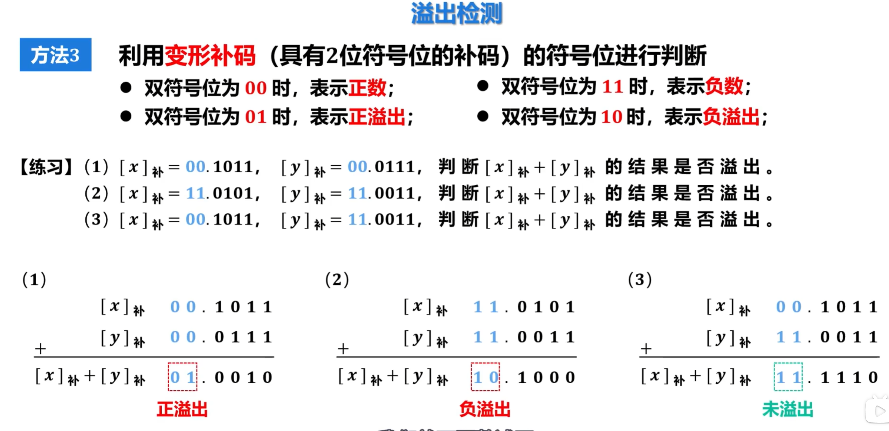

- 判定：双符号位的两位是否相同（00/11 无溢出，01/10 溢出）；

- 符号位定义：左符号位 Cₙ₊₁，右符号位 Cₙ；

- 逻辑表达式：溢出标志 OF = Cₙ₊₁ ⊕ Cₙ（异或：01/10 时 OF=1，00/11 时 OF=0）。

#### 4. 补充说明

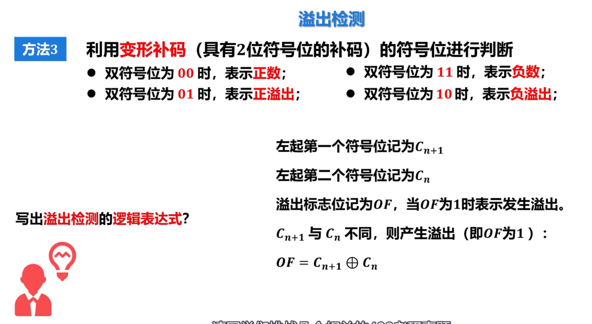

- 复数变形补码转原码：仍可使用 “求反加 1”（砝码法）或 “扫描法”，与普通补码规则一致。

## 三、视频中的 408 考研真题解析

### 1. 2009 年真题（选项 D）

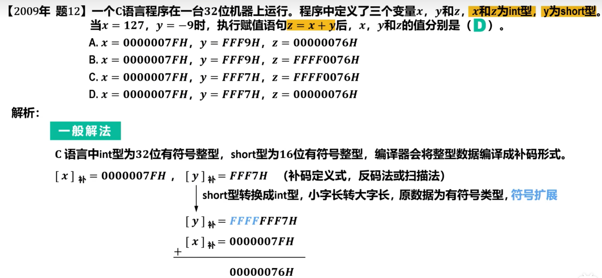

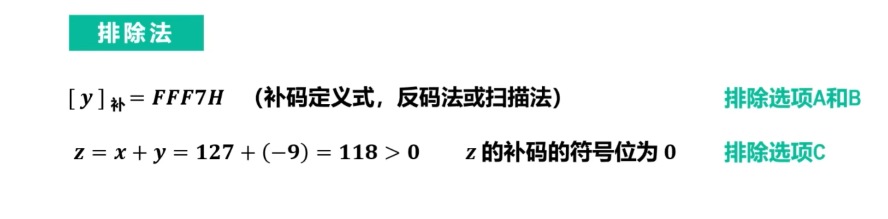

#### 题干

变量 X、Z 为 int 型（32 位有符号整数），Y 为 short 型（16 位有符号整数），执行 Z = X + Y，求 Z 的补码。

#### 视频解析步骤

- 步骤 1：数据类型转换规则

short 型 Y 需转换为 int 型（小字长转大字长），因是有符号数，需进行**符号扩展**（高位补原符号位，保证真值不变）。

- 步骤 2：补码运算逻辑

编译器中整数以补码存储，因此运算为 “X 补（32 位） + Y 补（扩展后 32 位） = Z 补（32 位）”，符号位进位舍弃。

- 步骤 3：排除法解题

- 选项 A/B：因 Y 补扩展后符号位与原符号位一致，可直接排除；

- 选项 C：X 与 Y 的真值运算结果为正数，Z 补的符号位应为 0，选项 C 符号位为 1，排除；

- 结论：选 D。

### 2. 2013 年真题（选项 A）

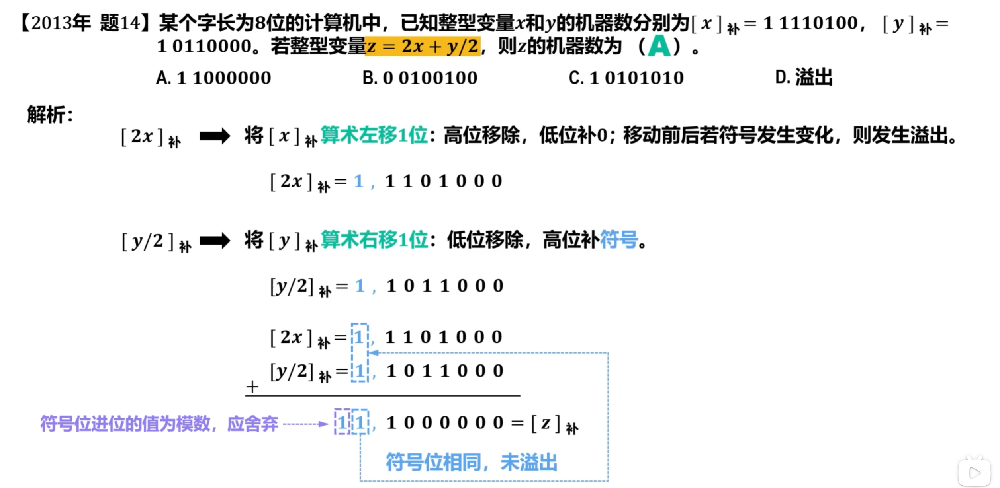

#### 题干

已知 X、Y 的补码，求 Z = 2X + Y/2 的机器数（补码）。

#### 视频解析步骤

- 步骤 1：计算 2X 的补码（算术左移 1 位）

补码算术左移规则：高位（符号位）移出，低位补 0；若移位后符号位变化，则溢出。

示例：X 补 = 0010（真值 2）→ 左移 1 位得 0100（真值 4=2×2），符号位不变，无溢出。

- 步骤 2：计算 Y/2 的补码（算术右移 1 位）

补码算术右移规则：低位移出，高位补原符号位（保证负数真值不变）。

示例：Y 补 = 1110（真值 - 2）→ 右移 1 位得 1111（真值 - 1= -2/2），符号位不变。

- 步骤 3：补码相加

2X 补 + (Y/2) 补 = Z 补，符号位进位舍弃；原操作数符号位与结果符号位相同，无溢出。

- 结论：选 A。

### 3. 2014 年真题（选项 C）

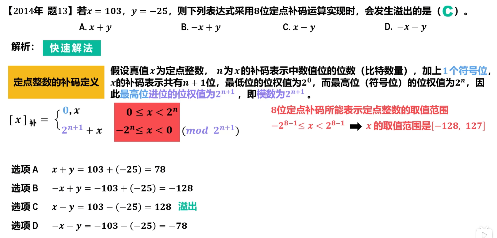

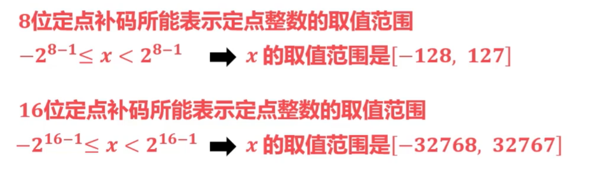

#### 题干

8 位补码加减法中，哪一选项的运算会发生溢出？

#### 视频解析步骤

- 关键前提：8 位补码范围 -128 ~ 127，超出则溢出。

- 选项分析：

逐一计算各选项的真值运算结果，判断是否超出范围：

- 选项 A/B/D：结果均在 -128 ~ 127 内，无溢出；

- 选项 C：真值运算结果为 128（或 - 129），超出 8 位补码范围，溢出；

- 结论：选 C。

### 4. 2018 年真题（选项 C）

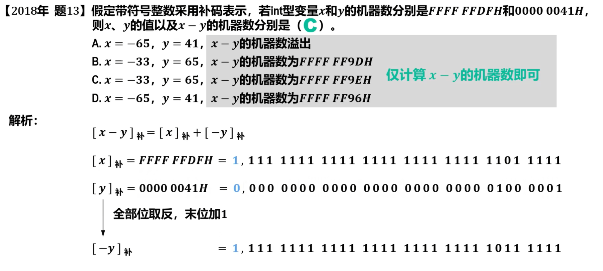

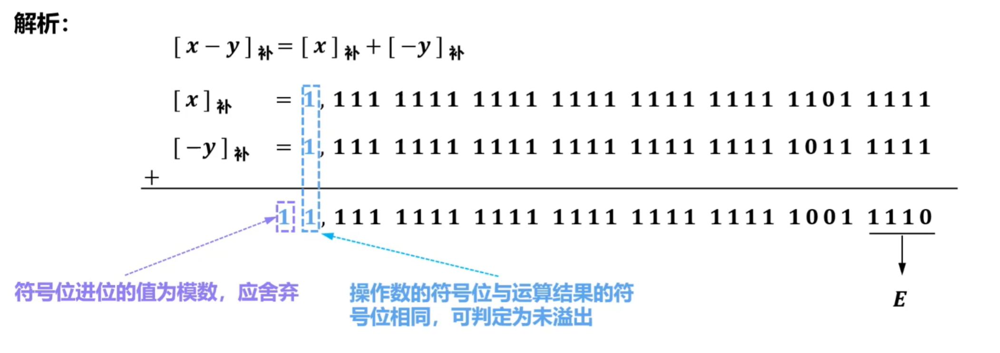

#### 题干

已知 X、Y 的补码（16 进制表示），求 X - Y 的机器数（补码，取最低 4 位 16 进制）。

#### 视频解析步骤

- 步骤 1：补码减法转加法

X - Y 等价于 X补 + (-Y补)，核心是求 -Y补。

- 步骤 2：求 - Y 补的规则

对 Y 补的**全部位按位取反**，再**末尾加 1**（与 “求补码” 规则一致）。

示例：Y 补 = 0011（16 进制）→ 二进制 11000011 → 按位取反 00111100 → 加 1 得 00111101（-Y 补）。

- 步骤 3：补码相加与溢出判断

X 补（二进制） + (-Y 补)（二进制）= 结果补码，符号位进位舍弃；原操作数符号位与结果符号位相同，无溢出。

- 步骤 4：结果转换

将结果补码的**最低 4 位二进制**转换为 16 进制，匹配选项。

- 结论：选 C。


# 3-2-3 定点数的加法和减法运算 —逻辑代数和逻辑门

## 1. 课程引入

- 课程定位：计算机组成原理微课堂的补充课，针对跨专业学习的同学，补充数字电路与逻辑设计基础知识（逻辑代数和逻辑门）。

- 前置内容：此前已讲解定点数补码加减法的运算公式和溢出检测方案，原计划讲解补码加减法运算的逻辑电路实现，因跨专业同学基础需求，先补充本章节。

## 2. 逻辑运算与逻辑门的分类

### 2.1 逻辑运算的分类

逻辑代数中的逻辑运算分为两大类：

- **基本逻辑运算**：共 3 种，包括与运算、或运算、非运算。

- **复合逻辑运算**：共 4 种，包括与非运算、或非运算、异或运算、同或运算（视频中 “存货运算”“囤货门” 为口误，正确为同或运算、同或门）。

### 2.2 逻辑门的分类

实现逻辑运算的电路称为逻辑门，对应逻辑运算分为两大类：

- **基本逻辑门**：共 3 种，包括与门（实现与运算）、或门（实现或运算）、非门（实现非运算）。

- **复合逻辑门**：共 4 种，包括与非门（实现与非运算）、或非门（实现或非运算）、异或门（实现异或运算）、同或门（实现同或运算）。

- 核心关系：复合逻辑运算是由基本逻辑运算复合而来，因此复合逻辑门可由基本逻辑门复合构建。

## 3. 基本逻辑运算与基本逻辑门

### 3.1 与运算与与门

#### 3.1.1 与运算的定义与实例（开关 - 灯泡串联模型）

- 模型设定：以两个串联的开关（A、B）和一个灯泡（F）为实例，定义状态：

- 开关状态：1 表示闭合，0 表示断开；

- 灯泡状态：1 表示点亮，0 表示熄灭。

- 运算规则：仅当所有输入（开关 A、B）均为 1（闭合）时，输出（灯泡 F）才为 1（点亮）；只要有一个输入为 0（断开），输出即为 0（熄灭）。

- 实例场景（4 种输入组合）：

1. A=0（断开）、B=0（断开）→ F=0（熄灭）；

1. A=0（断开）、B=1（闭合）→ F=0（熄灭）；

1. A=1（闭合）、B=0（断开）→ F=0（熄灭）；

1. A=1（闭合）、B=1（闭合）→ F=1（点亮）。

#### 3.1.2 与运算的真值表（二值逻辑：1 = 真，0 = 假）

| 输入 A | 输入 B | 输出 F（A 与 B） |
| ------ | ------ | ---------------- |
| 0      | 0      | 0                |
| 0      | 1      | 0                |
| 1      | 0      | 0                |
| 1      | 1      | 1                |

#### 3.1.3 与运算的逻辑表达式

- 表达式：\(F = A \cdot B\)（“\(\cdot\)” 表示与运算，可省略，即\(F=AB\)）。

#### 3.1.4 与门的电路实现

- 国际符号：输入为 A、B，输出为 F，符号为 “&” 形状（无输出端小圆圈）。

- 核心说明：本课程不要求掌握与门内部实现（如二极管、三极管、MOS 管构建，或半导体 PN 结原理），仅需掌握符号与功能。

#### 3.1.5 与门的电气特性

- 电平表示：逻辑 1（真）对应高电平（1.5V~4.2V），逻辑 0（假）对应低电平（500mV~1.8V）。

- 门级延迟：信号从输入到输出的耗时，称为逻辑门的传播延迟（门级延迟），通常为纳秒（ns）级。

示例：工作电压 6V、线路负载电容 50pF 时，最大门级延迟为 15ns。

- 芯片选型：电气特性需参考具体芯片数据手册，不同厂家的 74 系列芯片特性可能不同。

#### 3.1.6 与门对应的芯片

- 芯片型号：7408 芯片，内部包含 4 个独立的与门，需参考芯片手册确认各与门输入 / 输出端与芯片外部引脚的对应关系。

### 3.2 或运算与或门

#### 3.2.1 或运算的定义与实例（开关 - 灯泡并联模型）

- 模型设定：与 “与运算” 一致（开关 A、B，灯泡 F，1 = 闭合 / 点亮，0 = 断开 / 熄灭），但开关为并联连接。

- 运算规则：只要有一个输入（开关 A、B）为 1（闭合），输出（灯泡 F）即为 1（点亮）；仅当所有输入均为 0（断开）时，输出才为 0（熄灭）。

- 实例场景（4 种输入组合）：

1. A=0（断开）、B=0（断开）→ F=0（熄灭）；

1. A=0（断开）、B=1（闭合）→ F=1（点亮）；

1. A=1（闭合）、B=0（断开）→ F=1（点亮）；

1. A=1（闭合）、B=1（闭合）→ F=1（点亮）。

#### 3.2.2 或运算的真值表

| 输入 A | 输入 B | 输出 F（A 或 B） |
| ------ | ------ | ---------------- |
| 0      | 0      | 0                |
| 0      | 1      | 1                |
| 1      | 0      | 1                |
| 1      | 1      | 1                |

#### 3.2.3 或运算的逻辑表达式

- 表达式：\(F = A + B\)（“\(+\)” 表示或运算）。

#### 3.2.4 或门的电路实现

- 国际符号：输入为 A、B，输出为 F，符号为 “≥1” 形状（无输出端小圆圈）。

- 核心说明：同与门，不要求内部实现细节，仅需掌握符号与功能。

#### 3.2.5 或门的电气特性

- 与 “与门” 一致：逻辑 1 = 高电平（1.5V~4.2V），逻辑 0 = 低电平（500mV~1.8V），门级延迟为纳秒级，需参考芯片手册。

#### 3.2.6 或门对应的芯片

- 芯片型号：7432 芯片，内部包含 4 个独立的或门，需参考芯片手册确认各或门输入 / 输出端与芯片外部引脚的对应关系。

### 3.3 非运算与非门

#### 3.3.1 非运算的定义与实例（开关 - 灯泡特殊模型）

- 模型设定：仅 1 个开关（A）和 1 个灯泡（F），开关与灯泡通过特殊电路连接（开关闭合时短路灯泡），状态定义同前（1 = 闭合 / 点亮，0 = 断开 / 熄灭）。

- 运算规则：输入与输出状态完全相反 —— 输入为 1（闭合）时，输出为 0（熄灭）；输入为 0（断开）时，输出为 1（点亮）。

- 实例场景（2 种输入组合）：

1. A=0（断开）→ F=1（点亮）；

1. A=1（闭合）→ F=0（熄灭）。

#### 3.3.2 非运算的真值表

| 输入 A | 输出 F（非 A） |
| ------ | -------------- |
| 0      | 1              |
| 1      | 0              |

#### 3.3.3 非运算的逻辑表达式

- 表达式：\(F = \overline{A}\)（“\(\overline{}\)” 表示非运算，即对 A 取反）。

#### 3.3.4 非门的电路实现

- 国际符号：输入为 A，输出为 F，符号为 “○” 形状（输出端带小圆圈，表示取反）。

- 核心说明：同与门 / 或门，不要求内部实现细节。

#### 3.3.5 非门的电气特性

- 与 “与门”“或门” 一致：电平范围、门级延迟（纳秒级）需参考芯片手册。

#### 3.3.6 非门对应的芯片

- 芯片型号：7404 芯片，内部包含 6 个独立的非门，需参考芯片手册确认各非门输入 / 输出端与芯片外部引脚的对应关系。

## 4. 复合逻辑运算与复合逻辑门

### 4.1 与非运算与与非门

#### 4.1.1 与非运算的定义

- 复合关系：由 “与运算” 和 “非运算” 复合而来，即先对输入做与运算，再对结果做非运算。

- 运算规则：与 “与运算” 相反 —— 仅当所有输入均为 1 时，输出为 0；只要有一个输入为 0，输出即为 1。

#### 4.1.2 与非运算的真值表

| 输入 A | 输入 B | 与运算结果（A・B） | 与非运算结果（\(\overline{A·B}\)） |
| ------ | ------ | ------------------ | ---------------------------------- |
| 0      | 0      | 0                  | 1                                  |
| 0      | 1      | 0                  | 1                                  |
| 1      | 0      | 0                  | 1                                  |
| 1      | 1      | 1                  | 0                                  |

#### 4.1.3 与非运算的逻辑表达式

- 基础表达式：\(F = \overline{A·B}\)；

- 德摩根律变形（视频提及 “繁衍率”，实际为德摩根律）：\(\overline{A·B} = \overline{A} + \overline{B}\)（可通过真值表验证，如 A=0、B=1 时，\(\overline{0·1}=\overline{0}=1\)，\(\overline{0}+\overline{1}=1+0=1\)，结果一致）。

#### 4.1.4 与非门的电路实现

- 国际符号：与 “与门” 符号相似，仅在输出端增加小圆圈（表示非运算）；

- 复合构建方式：

1. 方式 1：1 个与门 + 1 个非门（先与后非），对应表达式\(F = \overline{A·B}\)；

1. 方式 2：2 个非门 + 1 个或门（基于德摩根律），对应表达式\(F = \overline{A} + \overline{B}\)。

#### 4.1.5 关键应用：仅用与非门构建基本逻辑门

视频重点讲解 “反向构建”—— 用复合逻辑门（与非门）构建基本逻辑门（非门、与门、或门）：

1. **构建非门**：

- 原理：利用 “重叠率”（\(A·A = A\)），将与非门的两个输入接同一个信号 A；

- 推导：\(F = \overline{A·A} = \overline{A}\)，即实现非运算；

- 电路：与非门输入 A、A，输出\(\overline{A}\)。

1. **构建与门**：

- 原理：利用 “还原率”（\(\overline{\overline{X}} = X\)），将两个与非门串联；

- 推导：第一个与非门输出\(\overline{A·B}\)，第二个与非门输入接第一个的输出（即\(\overline{A·B}\)、\(\overline{A·B}\)），输出\(\overline{\overline{A·B}·\overline{A·B}} = \overline{\overline{A·B}} = A·B\)；

- 电路：第一个与门（A、B→\(\overline{A·B}\)）→ 第二个与门（\(\overline{A·B}\)、\(\overline{A·B}\)→\(A·B\)）。

1. **构建或门**：

- 原理：结合德摩根律和还原率，用 3 个与非门（2 个实现非运算，1 个实现与非运算）；

- 推导：\(A + B = \overline{\overline{A + B}} = \overline{\overline{A}·\overline{B}}\)（德摩根律逆用）；

- 电路：两个与非门（输入 A→\(\overline{A}\)，输入 B→\(\overline{B}\)）→ 第三个与非门（\(\overline{A}\)、\(\overline{B}\)→\(\overline{\overline{A}·\overline{B}} = A + B\)）。

#### 4.1.6 与非门的核心结论

仅用与非门可构建所有基本逻辑门（与、或、非），因此可构建任何 “组合逻辑电路”（仅含门电路，不含寄存器、触发器等元件的数字逻辑电路）。

#### 4.1.7 与非门对应的芯片

- 芯片型号：7400 芯片，内部包含 4 个独立的与非门，需参考芯片手册确认各与非门输入 / 输出端与芯片外部引脚的对应关系。

### 4.2 或非运算与或非门

#### 4.2.1 或非运算的定义

- 复合关系：由 “或运算” 和 “非运算” 复合而来，即先对输入做或运算，再对结果做非运算。

- 运算规则：与 “或运算” 相反 —— 仅当所有输入均为 0 时，输出为 1；只要有一个输入为 1，输出即为 0。

#### 4.2.2 或非运算的真值表

| 输入 A | 输入 B | 或运算结果（A+B） | 或非运算结果（\(\overline{A+B}\)） |
| ------ | ------ | ----------------- | ---------------------------------- |
| 0      | 0      | 0                 | 1                                  |
| 0      | 1      | 1                 | 0                                  |
| 1      | 0      | 1                 | 0                                  |
| 1      | 1      | 1                 | 0                                  |

#### 4.2.3 或非运算的逻辑表达式

- 基础表达式：\(F = \overline{A + B}\)；

- 德摩根律变形：\(\overline{A + B} = \overline{A}·\overline{B}\)（可通过真值表验证）。

#### 4.2.4 或非门的电路实现

- 国际符号：与 “或门” 符号相似，仅在输出端增加小圆圈（表示非运算）；

- 核心结论：同与非门，仅用或非门也可构建所有基本逻辑门（与、或、非）及任何组合逻辑电路（视频建议同学自行推导，未展开细节）。

#### 4.2.5 或非门对应的芯片

- 芯片型号：7402 芯片，内部包含 4 个独立的或非门，需参考芯片手册确认各或非门输入 / 输出端与芯片外部引脚的对应关系。

### 4.3 异或运算与异或门

#### 4.3.1 异或运算的定义

- 运算规则：两个输入 “不同则输出 1，相同则输出 0”。

- 应用场景：计算机网络中 “循环冗余校验（CRC）” 的发送端，计算冗余码时需用到异或运算（二进制模 2 除法）。

#### 4.3.2 异或运算的真值表

| 输入 A | 输入 B | 输出 F（A⊕B） |
| ------ | ------ | ------------- |
| 0      | 0      | 0             |
| 0      | 1      | 1             |
| 1      | 0      | 1             |
| 1      | 1      | 0             |

#### 4.3.3 异或运算的逻辑表达式

- 基础表达式：\(F = A \oplus B = A·\overline{B} + \overline{A}·B\)（“⊕” 表示异或运算）；

- 推导逻辑：真值表中输出为 1 的两种情况（A=0、B=1；A=1、B=0）的 “或运算”，即\(A·\overline{B}\)（A=1、B=0 时为 1）与\(\overline{A}·B\)（A=0、B=1 时为 1）的或运算。

#### 4.3.4 异或门的电路实现

- 国际符号：输入为 A、B，输出为 F，符号为 “=1” 形状；

- 复合构建方式（用基本逻辑门）：2 个非门 + 2 个与门 + 1 个或门，对应表达式\(F = A·\overline{B} + \overline{A}·B\)：

1. 非门 1：输入 A→\(\overline{A}\)；

1. 非门 2：输入 B→\(\overline{B}\)；

1. 与门 1：输入 A、\(\overline{B}\)→\(A·\overline{B}\)；

1. 与门 2：输入\(\overline{A}\)、B→\(\overline{A}·B\)；

1. 或门：输入\(A·\overline{B}\)、\(\overline{A}·B\)→\(A·\overline{B} + \overline{A}·B\)。

#### 4.3.5 异或运算的验证例题（视频演示）

- 验证目标：输入 A=0、B=1 时，异或电路输出是否为 1；

- 验证过程：

1. 非门 1：A=0→\(\overline{A}=1\)；

1. 非门 2：B=1→\(\overline{B}=0\)；

1. 与门 1：A=0、\(\overline{B}=0\)→\(0·0=0\)；

1. 与门 2：\(\overline{A}=1\)、B=1→\(1·1=1\)；

1. 或门：0 + 1=1；

- 结论：输出为 1，与真值表一致，验证成立。

#### 4.3.6 扩展问题：仅用与非门构建异或门

- 实现思路：利用逻辑代数运算规则（公理、定理、定律，如德摩根律、还原率），将异或表达式\(F = A·\overline{B} + \overline{A}·B\)变形为仅含 “与非运算” 的形式，再根据变形后的表达式构建电路（视频未展开具体变形，需结合与非门构建基本门的方法推导）。

#### 4.3.7 异或门对应的芯片

- 芯片型号：7486 芯片，内部包含 4 个独立的异或门，需参考芯片手册确认各异或门输入 / 输出端与芯片外部引脚的对应关系。

### 4.4 同或运算与同或门

#### 4.4.1 同或运算的定义

- 运算规则：与 “异或运算” 相反 —— 两个输入 “相同则输出 1，不同则输出 0”；

- 复合关系：可表示为 “异或运算的非运算”，即先对输入做异或运算，再对结果做非运算。

#### 4.4.2 同或运算的真值表

| 输入 A | 输入 B | 异或结果（A⊕B） | 同或结果（\(\overline{A⊕B}\)） |
| ------ | ------ | --------------- | ------------------------------ |
| 0      | 0      | 0               | 1                              |
| 0      | 1      | 1               | 0                              |
| 1      | 0      | 1               | 0                              |
| 1      | 1      | 0               | 1                              |

#### 4.4.3 同或运算的逻辑表达式

- 表达式 1（基于异或非）：\(F = \overline{A⊕B}\)；

- 表达式 2（展开形式）：\(F = A·B + \overline{A}·\overline{B}\)（真值表验证：A=0、B=0 时，\(0·0 + 1·1=1\)；A=1、B=1 时，\(1·1 + 0·0=1\)，符合同或规则）。

#### 4.4.4 同或门的电路实现

- 国际符号：与 “异或门” 符号相似，仅在输出端增加小圆圈（表示非运算）。

#### 4.4.5 同或门对应的芯片

- 芯片型号：CD4077 芯片，内部包含 4 个独立的同或门，需参考芯片手册确认各同或门输入 / 输出端与芯片外部引脚的对应关系。


# 3-2-4 定点数的加法和减法运算 — 一位全加器的硬件逻辑实现

## 1. 二进制加法运算回顾（含手工运算例题）

视频以**八位二进制数加法**为例，演示手工运算过程，目的是推导一位二进制加法的规律，具体步骤如下：

- 已知两个八位二进制数（视频未明确给出具体数值，按运算过程还原），加法从**最低位（第一位）** 开始，逐位计算并处理进位；

- 逐位运算细节：

1. 第 1 位：1 + 0 = 1 → 本位和为 1，无进位（向高位进位为 0）；

1. 第 2 位：1 + 1 = 10 → 本位和为 0，向高位进 1；

1. 第 3 位：1 + 0 + 1（低位进位）= 10 → 本位和为 0，向高位进 1；

1. 第 4 位：1 + 1 + 1（低位进位）= 11 → 本位和为 1，向高位进 1；

1. 第 5 位：0 + 0 + 1（低位进位）= 1 → 本位和为 1，无进位；

1. 第 6 位：1 + 1 = 10 → 本位和为 0，向高位进 1；

1. 第 7 位：0 + 0 + 1（低位进位）= 1 → 本位和为 1，无进位；

1. 第 8 位：1 + 1 = 10 → 本位和为 0，向高位进 1；

- 最终完成两个八位二进制数的手工加法，核心规律：**本位计算需考虑 “本位加数” 和 “低位进位”，结果包含 “本位和” 和 “向高位进位”**。

## 2. 一位二进制加法的关键变量定义

为规范描述一位二进制加法的逻辑关系，视频定义以下变量：

| 变量符号 | 变量含义               | 说明                                                    |
| -------- | ---------------------- | ------------------------------------------------------- |
| X、Y     | 两个参与加法的二进制数 | 如八位二进制数 X = X₇X₆…X₀，Y = Y₇Y₆…Y₀                 |
| xi、yi   | X、Y 的第 i 位加数     | 输入变量，取值为 0 或 1（i 表示某一位，如最低位为 i=0） |
| S        | 加法运算的结果（和）   | 如八位和 S = S₇S₆…S₀                                    |
| si       | S 的第 i 位和          | 输出变量，取值为 0 或 1，对应 xi 与 yi 的本位和         |
| CI       | 来自低位的进位         | 输入变量，取值为 0 或 1（即第 i-1 位向第 i 位的进位）   |
| CI+1     | 本位向高位的进位       | 输出变量，取值为 0 或 1（即第 i 位向第 i+1 位的进位）   |

- 补充规则：若本位计算未产生进位，视为 CI+1 = 0。

## 3. 一位二进制加法的逻辑关系与真值表

### 3.1 真值表构建逻辑

输入变量为xi、yi、CI（共 3 个，存在 2³=8 种组合），输出变量为si（本位和）和CI+1（向高位进位），需枚举所有输入组合对应的输出结果，形成完整真值表。

### 3.2 完整真值表（xi、yi、CI → si、CI+1）

| 本位加数 xi | 本位加数 yi | 低位进位 CI | 本位和 si | 向高位进位 CI+1 |
| ----------- | ----------- | ----------- | --------- | --------------- |
| 0           | 0           | 0           | 0         | 0               |
| 0           | 0           | 1           | 1         | 0               |
| 0           | 1           | 0           | 1         | 0               |
| 0           | 1           | 1           | 0         | 1               |
| 1           | 0           | 0           | 1         | 0               |
| 1           | 0           | 1           | 0         | 1               |
| 1           | 1           | 0           | 0         | 1               |
| 1           | 1           | 1           | 1         | 1               |

### 3.3 真值表拆分（简化分析）

为分别分析si和CI+1的逻辑，将完整真值表拆分为两个子表：

#### 子表 1：xi、yi、CI → si

| xi   | yi   | CI   | si   |
| ---- | ---- | ---- | ---- |
| 0    | 0    | 0    | 0    |
| 0    | 0    | 1    | 1    |
| 0    | 1    | 0    | 1    |
| 0    | 1    | 1    | 0    |
| 1    | 0    | 0    | 1    |
| 1    | 0    | 1    | 0    |
| 1    | 1    | 0    | 0    |
| 1    | 1    | 1    | 1    |

- 规律：si = 1当且仅当xi、yi、CI中 “1 的个数为奇数”（奇校验特性）。

#### 子表 2：xi、yi、CI → CI+1

| xi   | yi   | CI   | CI+1 |
| ---- | ---- | ---- | ---- |
| 0    | 0    | 0    | 0    |
| 0    | 0    | 1    | 0    |
| 0    | 1    | 0    | 0    |
| 0    | 1    | 1    | 1    |
| 1    | 0    | 0    | 0    |
| 1    | 0    | 1    | 1    |
| 1    | 1    | 0    | 1    |
| 1    | 1    | 1    | 1    |

- 规律：CI+1 = 1当且仅当 “xi 与 yi 均为 1” 或 “xi、yi 不同且 CI 为 1”。

## 4. 本位和（si）与进位（CI+1）的逻辑表达式

### 4.1 本位和 si 的逻辑表达式

#### 步骤 1：从真值表写 “最小项表达式”

根据子表 1，si = 1的输入组合有 4 种，对应逻辑与（∧）表达式的逻辑或（∨）：

si = (¬xi ∧ ¬yi ∧ CI) ∨ (¬xi ∧ yi ∧ ¬CI) ∨ (xi ∧ ¬yi ∧ ¬CI) ∨ (xi ∧ yi ∧ CI)

- 其中 “¬” 表示逻辑非，“∧” 表示逻辑与，“∨” 表示逻辑或。

#### 步骤 2：表达式化简（按设计要求）

通过逻辑代数公式或卡诺图化简，最终得到**两次异或（⊕）运算**的形式：

si = (xi ⊕ yi) ⊕ CI

- 异或特性：a ⊕ b = 1当且仅当a ≠ b；结合子表 1，该式与原最小项表达式等价，且更直观体现 “奇校验” 规律。

### 4.2 向高位进位 CI+1 的逻辑表达式

#### 步骤 1：从真值表写 “最小项表达式”

根据子表 2，CI+1 = 1的输入组合有 4 种，对应表达式：

CI+1 = (¬xi ∧ yi ∧ CI) ∨ (xi ∧ ¬yi ∧ CI) ∨ (xi ∧ yi ∧ ¬CI) ∨ (xi ∧ yi ∧ CI)

#### 步骤 2：表达式化简（按设计要求）

化简后得到：

CI+1 = (xi ∧ yi) ∨ ((xi ⊕ yi) ∧ CI)

- 逻辑含义：

1. xi ∧ yi：若本位两个加数均为 1，无论低位是否有进位，本位必向高位进位；

1. (xi ⊕ yi) ∧ CI：若本位两个加数不同（即xi ⊕ yi = 1），且低位有进位（CI = 1），则本位向高位进位。

## 5. 一位全加器的逻辑电路实现

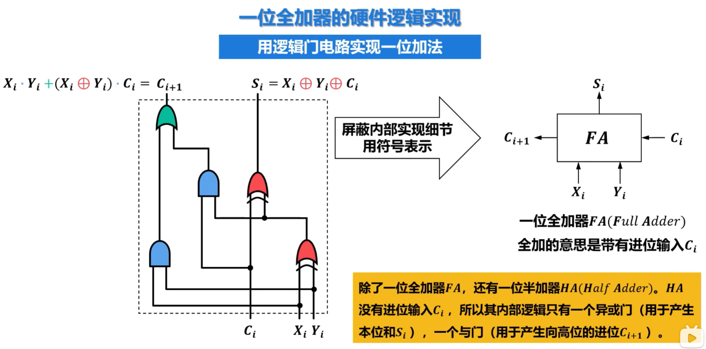

### 5.1 电路核心组成

- **输入端口**：xi（本位加数 1）、yi（本位加数 2）、CI（低位进位）；

- **输出端口**：si（本位和）、CI+1（向高位进位）；

- **逻辑门类型**：异或门（⊕）、与门（∧）、或门（∨）；

- **电路连接逻辑**：

1. 先用 1 个异或门计算xi ⊕ yi，输出结果作为中间信号；

1. 用 1 个异或门连接 “中间信号” 和 “CI”，输出si（即(xi ⊕ yi) ⊕ CI）；

1. 用 1 个与门连接 “xi” 和 “yi”，输出xi ∧ yi；

1. 用 1 个与门连接 “中间信号” 和 “CI”，输出(xi ⊕ yi) ∧ CI；

1. 用 1 个或门连接 “步骤 3 的输出” 和 “步骤 4 的输出”，输出CI+1（即(xi ∧ yi) ∨ ((xi ⊕ yi) ∧ CI)）；

- 视频中用 “颜色对应” 逻辑表达式运算符与逻辑门，确保电路与表达式一一对应。

## 6. 电路功能验证

视频提出 “代入真值表任意组合验证电路输出” 的方法（未指定具体组合，核心流程如下）：

1. 选择真值表中某一组输入（如xi=0、yi=1、CI=1）；

1. 按电路连接顺序计算每个逻辑门的输出：

- 异或门 1：0 ⊕ 1 = 1（中间信号）；

- 异或门 2：1 ⊕ 1 = 0（即si=0，与真值表一致）；

- 与门 1：0 ∧ 1 = 0；

- 与门 2：1 ∧ 1 = 1；

- 或门：0 ∨ 1 = 1（即CI+1=1，与真值表一致）；

1. 结论：电路输出与真值表完全匹配，功能正确。

## 7. 信号传播延迟分析

视频定义 “逻辑门传播延迟” 参数，分析信号从输入到输出的耗时（不考虑线路延迟）：

- **延迟参数**：

- 基本逻辑门（与门、或门）：传播延迟 = 1T；

- 复合逻辑门（异或门）：传播延迟 = 3T；

- **延迟时序（按时间顺序）**：

1. 1T 后：与门 1（xi ∧ yi）输出有效信号；

1. 3T 后：异或门 1（xi ⊕ yi）输出有效信号（中间信号）；

1. 4T 后：与门 2（(xi ⊕ yi) ∧ CI）输出有效信号（需等待异或门 1 的 3T 延迟 + 自身 1T 延迟）；

1. 5T 后：或门（CI+1）输出有效信号（需等待与门 2 的 4T 延迟 + 自身 1T 延迟）；

1. 6T 后：异或门 2（si）输出有效信号（需等待异或门 1 的 3T 延迟 + 自身 3T 延迟）；

- 关键结论：CI+1的有效时间（5T）早于si的有效时间（6T），符合 “进位优先传递” 的硬件逻辑需求。

## 8. 全加器（FA）与半加器的区别

### 8.1 一位全加器（FA）

- **定义**：能同时处理 “本位加数（xi、yi）” 和 “低位进位（CI）” 的一位二进制加法电路；

- **符号表示**：用专用符号屏蔽内部电路细节，仅对外暴露输入（xi、yi、CI）和输出（si、CI+1）端口；

- **核心特性**：支持多位数加法的 “进位链” 传递（如八位加法需 8 个全加器级联）。

### 8.2 一位半加器

- **定义**：仅能处理 “本位加数（xi、yi）”，**无低位进位（CI）输入**的一位二进制加法电路；

- **内部逻辑**：仅包含 2 个逻辑门：

1. 异或门：输出本位和si = xi ⊕ yi；

1. 与门：输出向高位进位CI+1 = xi ∧ yi；

- **局限性**：无法处理多位数加法中的 “低位进位”，仅适用于最低位（无低位进位）的加法。


# 3-2-5 定点数的加法和减法运算 —串行进位加法器的硬件逻辑实现

## 一、基础回顾：一位全加器

视频开篇回顾上节课内容，为串行进位加法器构建铺垫，核心要点如下：

1. **输入与输出定义**

- 输入：本位加数 \(x_i\)、本位加数 \(y_i\)、来自低位的进位 \(C_i\)（\(i\) 表示数位序号，0 为最低位）。

- 输出：本位和 \(S_i\)、向高位的进位 \(C_{i+1}\)。

1. **逻辑表达式**

- 本位和：\(S_i = x_i \oplus y_i \oplus C_i\)（异或运算）。

- 向高位进位：\(C_{i+1} = (x_i \cdot y_i) + (x_i \cdot C_i) + (y_i \cdot C_i)\)（与运算后或运算）。

1. **符号表示**

用 “FA”（Full Adder）表示一位全加器，图形符号中明确标注 \(x_i\)、\(y_i\)、\(C_i\)（输入）和 \(S_i\)、\(C_{i+1}\)（输出）。

## 二、串行进位加法器的构建（以 8 位为例）

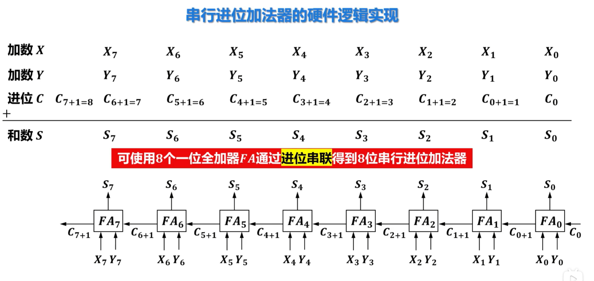

串行进位加法器（又称 “行波进位加法器”）通过**多个一位全加器串联**实现多位二进制加法，核心逻辑如下：

1. **数位与进位关系**

- 以 8 位加数 \(X\)（\(X_7X_6\cdots X_0\)，\(X_0\) 最低位、\(X_7\) 最高位）和 \(Y\)（\(Y_7Y_6\cdots Y_0\)）为例，加法过程中需传递进位 \(C_0 \to C_1 \to \cdots \to C_8\)：

- \(C_0\)：最低位（0 号数位）的初始进位（通常为 0，除非有借位 / 加 1 需求）；

- \(C_{i+1}\)：第 \(i\) 位全加器向第 \(i+1\) 位的进位；

- \(C_8\)：最高位（7 号数位）向外部的进位（用于溢出检测）。

1. **硬件连接方式**

- 用 8 个一位全加器 \(FA_0\)（最低位）~ \(FA_7\)（最高位）串联：

1. \(FA_i\) 的 \(x_i\) 端接 \(X\) 的第 \(i\) 位，\(y_i\) 端接 \(Y\) 的第 \(i\) 位；

1. \(FA_i\) 的 \(C_{i+1}\) 端（进位输出）直接连接到 \(FA_{i+1}\) 的 \(C_i\) 端（进位输入）；

1. 所有 \(FA_i\) 的 \(S_i\) 端输出构成最终和数 \(S = S_7S_6\cdots S_0\)。

1. **扩展规律**

若需实现 \(N\) 位加法，只需用 \(N\) 个一位全加器按上述方式串联，进位信号从 \(FA_0\) 依次传递到 \(FA_{N-1}\)。

## 三、串行进位加法器的溢出检测

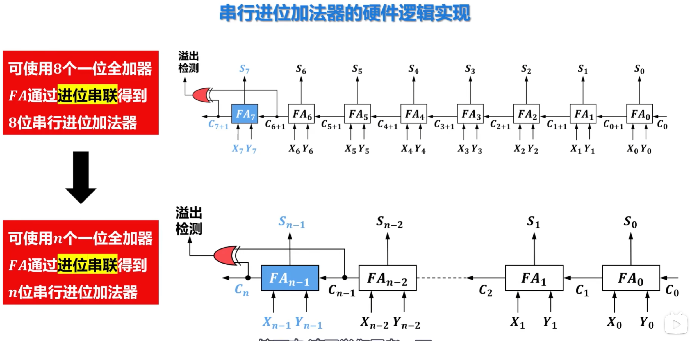

视频明确区分**无符号数**和**补码（有符号数）** 的溢出检测逻辑，核心方法如下：

### 1. 无符号数的溢出检测

- 原理：无符号数的最高位无符号位含义，**最高位产生的进位** \(C_N\)**（如 8 位的** \(C_8\)**）即为溢出信号**；

- 例：8 位无符号数加法中，若 \(C_8=1\)，表示和数超出 8 位无符号数范围（0~255），判定为溢出。

### 2. 补码（有符号数）的溢出检测

补码的最高位为符号位（0 正、1 负），视频提及 3 种检测方法，重点讲解硬件易实现的 “方法二”：

| 检测方法       | 核心逻辑                                                     | 硬件实现                                                     |
| -------------- | ------------------------------------------------------------ | ------------------------------------------------------------ |
| 方法一         | 运算结果的符号位与原操作数符号位不同 → 溢出                  | 需比较符号位，硬件稍复杂                                     |
| 方法二（推荐） | 最高数值位的进位 \(C_{N-2}\) 与符号位的进位 \(C_{N-1}\) 不同 → 溢出 | 增加 1 个异或门：输入为 \(C_{N-2}\) 和 \(C_{N-1}\)，输出为溢出信号 \(OV\) |
| 方法三         | 采用 “变形补码”（双符号位），若双符号位不同 → 溢出           | 需额外扩展符号位，硬件成本高                                 |

- 示例（8 位补码）：

最高数值位为第 6 位（\(X_6\)、\(Y_6\)），符号位为第 7 位（\(X_7\)、\(Y_7\)）：

- 最高数值位进位 \(C_6\)（\(FA_6\) 的 \(C_7\) 输出）；

- 符号位进位 \(C_7\)（\(FA_7\) 的 \(C_8\) 输出）；

- 溢出信号 \(OV = C_6 \oplus C_7\)（异或结果为 1 则溢出）。

## 四、串行进位加法器改造为 “加减法器”

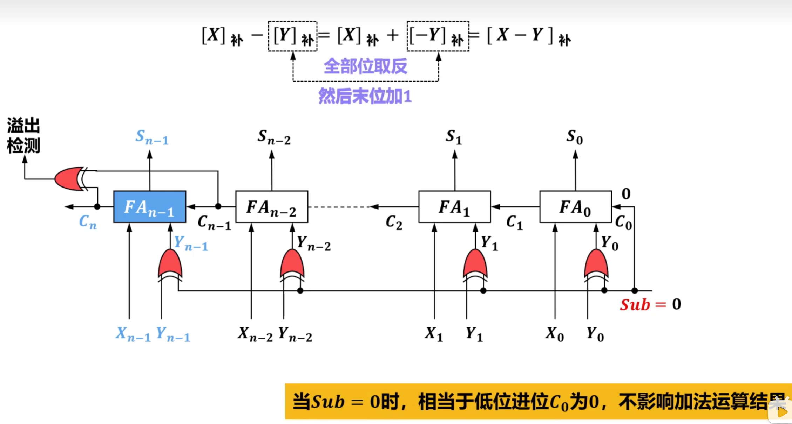

利用**补码减法公式**（\([X-Y]_è¡¥ = [X]_è¡¥ + [-Y]_è¡¥\)），通过简单改造实现 “加法 / 减法切换”，核心步骤如下：

1. **补码减法的关键：求** \([-Y]_è¡¥\)\([-Y]_è¡¥ = \overline{Y} + 1\)（\(\overline{Y}\) 表示 \(Y\) 的按位取反，“+1” 为末位加 1）。

1. **硬件改造方案**

- 断开每个 \(FA_i\) 的 \(y_i\) 端与 \(Y_i\) 的连接，在中间添加 1 个异或门；

- 所有异或门的另一个输入端连接在一起，作为 “加减控制端 \(sub\)”；

- 将 \(sub\) 端同时连接到最低位全加器 \(FA_0\) 的 \(C_0\) 端（实现末位加 1）。

1. **切换逻辑（**\(sub\) **控制）**

| \(sub\) 取值 | 异或门输出（\(Y_i \oplus sub\)） | \(FA_0\) 的 \(C_0\) | 功能                                   |
| ------------ | -------------------------------- | ------------------- | -------------------------------------- |
| 0            | \(Y_i\)（无取反）                | 0                   | 加法：\(X + Y\)                        |
| 1            | \(\overline{Y_i}\)（按位取反）   | 1                   | 减法：\(X - Y = X + \overline{Y} + 1\) |

## 五、串行进位加法器的性能分析

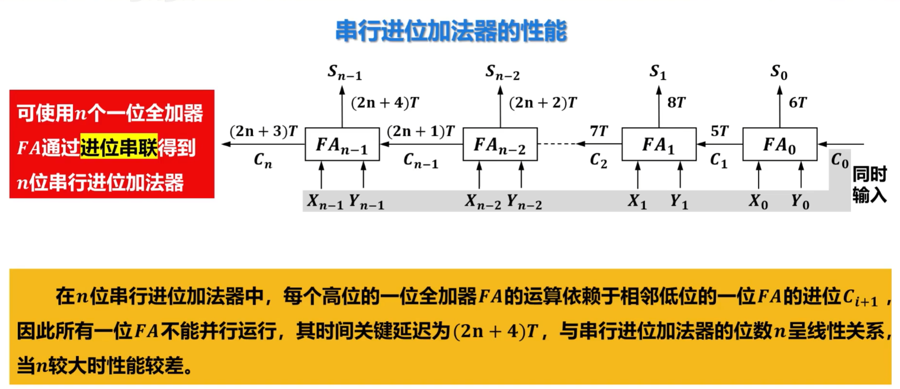

视频通过 “逻辑门延迟” 计算加法器的 “时间关键延迟”（输出所有本位和所需的时间），核心分析如下：

### 1. 延迟假设

- 基本逻辑门（与门、或门）：传播延迟为 \(1T\)；

- 复合逻辑门（异或门）：传播延迟为 \(3T\)；

- 忽略信号在线路上的传播延迟。

### 2. 单级全加器（\(FA_0\)）的延迟分析

假设 \(T_0\) 时刻输入信号（\(x_0\)、\(y_0\)、\(C_0\)）就绪：

- \(1T\) 后：\(x_0 \cdot y_0\)（与门）输出，到达 \(C_{1}\) 逻辑的或门；

- \(3T\) 后：\(x_0 \oplus y_0\)（异或门）输出，到达 \(S_0\) 逻辑的异或门和 \(C_1\) 逻辑的与门；

- \(4T\) 后：\((x_0 \oplus y_0) \cdot C_0\)（与门）输出，到达 \(C_1\) 逻辑的或门；

- \(5T\) 后：\(C_1 = (x_0 \cdot y_0) + [(x_0 \oplus y_0) \cdot C_0]\)（或门）输出（进位输出）；

- \(6T\) 后：\(S_0 = (x_0 \oplus y_0) \oplus C_0\)（异或门）输出（本位和输出）。

### 3. 多级串联的延迟累积（以 \(FA_1\) 为例）

- \(5T\) 时刻：\(FA_0\) 的 \(C_1\) 到达 \(FA_1\) 的 \(C_1\) 端（\(FA_1\) 的 \(x_1\)、\(y_1\) 已在 \(T_0\) 就绪）；

- \(6T\) 后：\(x_1 \cdot y_1\)、\((x_1 \oplus y_1) \cdot C_1\)（与门）输出；

- \(7T\) 后：\(FA_1\) 的 \(C_2\)（进位）输出；

- \(8T\) 后：\(FA_1\) 的 \(S_1\)（本位和）输出。

### 4. 时间关键延迟公式

对于 \(N\) 位串行进位加法器，输出所有本位和（\(S_{N-1} \sim S_0\)）的总延迟为：\(\text{总延迟} = (2N + 4)T\)

- 规律：延迟与位数 \(N\) 呈**线性关系**，当 \(N\) 较大（如 32 位、64 位）时，延迟显著增加，性能较差。

## 六、408 考研真题解析

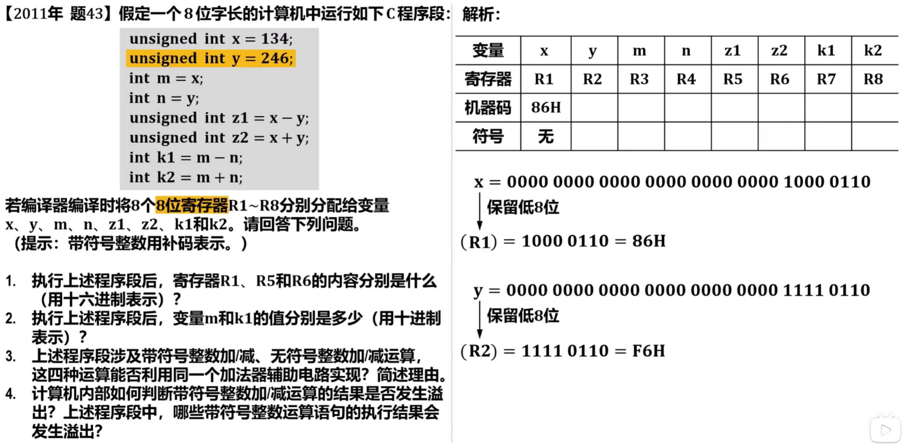

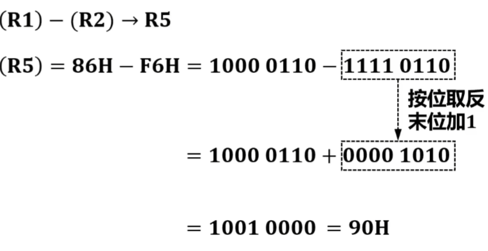

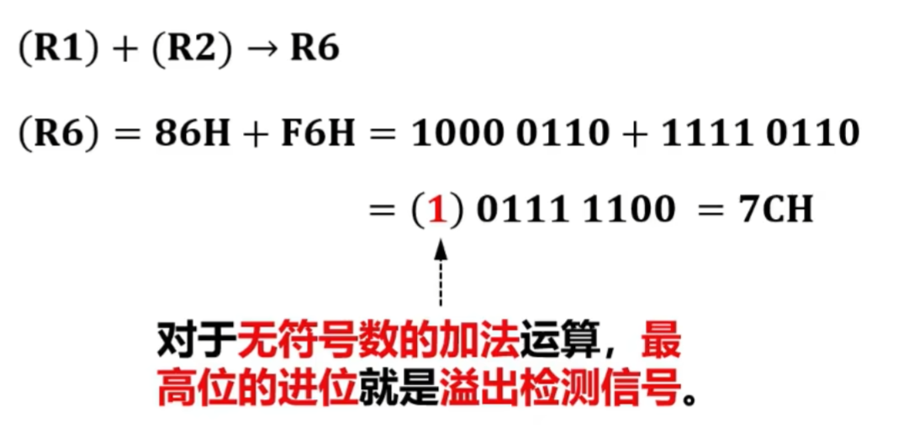

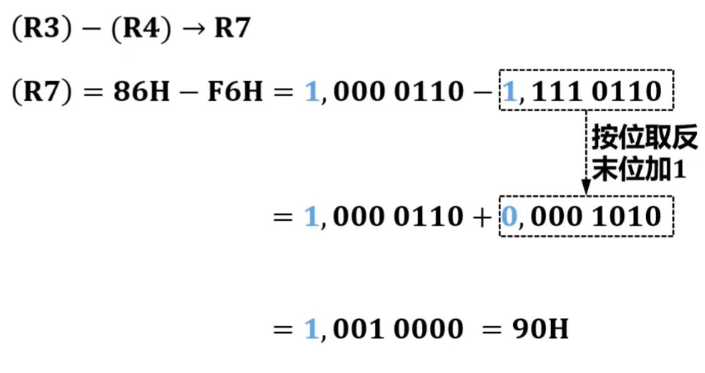

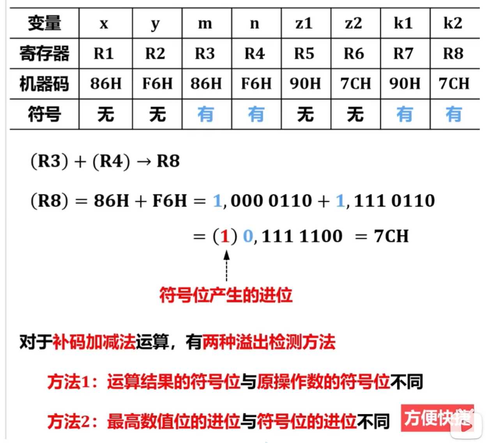

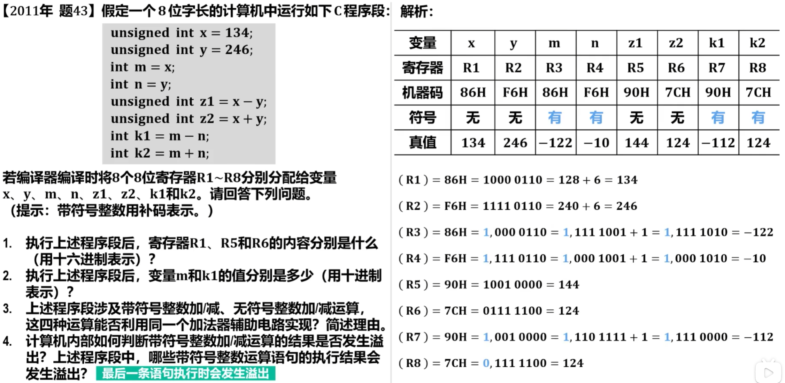


### 1. 题目背景

- 变量定义：32 位无符号整型变量 \(X\)、\(Y\)；32 位有符号整型变量 \(M\)、\(N\)、\(K_1\)、\(K_2\)；无符号整型变量 \(Z_1\)、\(Z_2\)。

- 寄存器限制：编译器为所有变量分配**8 位寄存器**（仅保留变量的低 8 位），寄存器编号 \(R1\)（存 \(X\)）、\(R2\)（存 \(Y\)）、\(R3\)（存 \(M\)）、\(R4\)（存 \(N\)）、\(R5\)（存 \(Z_1\)）、\(R6\)（存 \(Z_2\)）、\(R7\)（存 \(K_1\)）、\(R8\)（存 \(K_2\)）。

- 需完成：① 填写各寄存器的二进制 / 十六进制值；② 计算寄存器值对应的真值；③ 判断溢出；④ 说明 \(Z_1\)、\(Z_2\)、\(K_1\)、\(K_2\) 的运算逻辑。

### 2. 逐句分析与解答

这个转换是**根据 “无符号数” 和 “有符号数（补码）” 的规则**来计算真值的，分两种情况：

### 1. 无符号数（“符号” 列标 “无”）

机器码直接按**二进制转十进制**计算：

- 例如 R1：86H → 二进制是 1000 0110

计算：\( 128 + 6 = 134 \)

- 例如 R2：F6H → 二进制是 1111 0110

计算：\( 240 + 6 = 246 \)

### 2. 有符号数（“符号” 列标 “有”）

机器码是**补码**，需要按补码规则转换为真值：

补码转真值的方法：

- 若最高位（符号位）是0：直接转十进制（正数）；

- 若最高位是1：先对补码 “取反加 1” 得到原码，再转十进制并加负号。

举例子：

- **R3（86H，符号 “有”）**：

机器码二进制：1 000 0110（最高位1，是负数）

补码取反：1 111 1001 → 加 1 得原码：1 111 1010

原码转十进制：\( 128 + 64 + 32 + 16 + 8 + 2 = 250 \) → 加负号：\( -122 \)

- **R4（F6H，符号 “有”）**：

机器码二进制：1 111 0110（最高位1，负数）

补码取反：1 000 1001 → 加 1 得原码：1 000 1010

原码转十进制：\( 128 + 8 + 2 = 138 \)？不对，实际是 \( 10 \)（因为1 000 1010是-10）

（更简单的算法：补码值 = \( 2^8 - è¡¥ç å¯¹åº”çš„æ— ç¬¦å·æ•° \) → \( 256 - 246 = 10 \) → 加负号：\(-10\)）

- **R8（7CH，符号 “有”）**：

机器码二进制：0 111 1100（最高位0，正数）

直接转十进制：\( 64 + 32 + 16 + 8 + 4 = 124 \)

| 类型             | 符号位标识 | 转换步骤                                                     | 示例（机器码） | 计算过程                                                     | 真值 |
| ---------------- | ---------- | ------------------------------------------------------------ | -------------- | ------------------------------------------------------------ | ---- |
| 无符号数         | 符号 “无”  | 机器码（十六进制）→ 二进制 → 按位权相加（十进制）            | R1（86H）      | 86H→10000110 → \(128 + 6 = 134\)                             | 134  |
| 有符号数（补码） | 符号 “有”  | 1. 机器码→二进制，看最高位（符号位）2. 最高位 = 0（正数）：直接转十进制3. 最高位 = 1（负数）：补码取反 + 1→原码，转十进制后加负号 | R3（86H）      | 86H→10000110（最高位 1）取反→11111001 → 加 1→11111010 → \(-(128+64+32+16+8+2) = -122\) | -122 |
| 有符号数（补码） | 符号 “有”  | （简化算法：负数补码真值 = \(-(2^8 - 补码无符号值)\)）       | R4（F6H）      | F6H 无符号值 = 246 → \(-(256 - 246) = -10\)                  | -10  |
| 有符号数（补码） | 符号 “有”  | 最高位 = 0（正数）：直接转十进制                             | R8（7CH）      | 7CH→01111100 → \(64+32+16+8+4 = 124\)                        | 124  |

### 3. 真题答案汇总表

| 寄存器 | 变量 | 机器数（二进制） | 机器数（十六进制） | 机器数类型  | 真值（十进制） | 溢出情况 |
| ------ | ---- | ---------------- | ------------------ | ----------- | -------------- | -------- |
| R1     | X    | 10000110         | 0x86               | 无符号 8 位 | 134            | -        |
| R2     | Y    | 11110110         | 0xF6               | 无符号 8 位 | 246            | -        |
| R3     | M    | 10000110         | 0x86               | 补码 8 位   | -122           | -        |
| R4     | N    | 11110110         | 0xF6               | 补码 8 位   | -10            | -        |
| R5     | Z1   | 10010000         | 0x90               | 无符号 8 位 | 144            | 无       |
| R6     | Z2   | 01111100         | 0x7C               | 无符号 8 位 | 124            | 有       |
| R7     | K1   | 10010000         | 0x90               | 补码 8 位   | -112           | 无       |
| R8     | K2   | 01111100         | 0x7C               | 补码 8 位   | 124            | 有       |

## 七、本节课核心小结

1. 串行进位加法器由 **N 个一位全加器串联** 构成，进位信号从低位向高位依次传递（行波进位）；

1. 溢出检测需区分无符号数（最高位进位）和补码（推荐 “最高数值位进位⊕符号位进位”）；

1. 加减法器通过 **异或门 + sub 控制端** 实现，sub=0 做加法，sub=1 做减法（利用补码减法公式）；

1. 性能瓶颈：延迟与位数呈线性关系，N 越大延迟越长；

1. 补码运算需注意符号位处理，溢出判断需结合符号位或进位关系。


# 3-2-6 定点数的加法和减法运算 —先行进位加法器的硬件逻辑实现

## 一、串行进位加法器回顾

### 1. 结构原理

- 由 **N 个一位全加器** 通过 **进位串联** 构成，即第 i 位全加器的进位输出（C (i+1)）作为第 i+1 位全加器的进位输入（C (i+1)）。

- 核心逻辑：每个全加器输出本位和（S_i）与进位（C (i+1)），依赖前一位的进位输入（C_i）。

### 2. 性能缺陷

- **并行性差**：高位全加器运算必须等待低位全加器的进位输出，所有全加器无法并行运行。

- **延迟公式**：输出所有本位和的时间关键延迟为 **(2N + 4)×T**（T 为单个逻辑门传播延迟），延迟与位数 N 呈 **线性关系**。

- **局限性**：当 N 较大时（如 16 位、64 位），延迟显著增加，性能极差。

## 二、先行进位的核心思想与逻辑基础

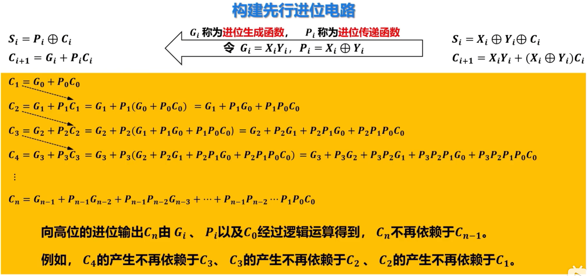

### 1. 核心目标

打破串行进位的 “低位进位依赖”，**提前生成所有全加器所需的进位输入信号**（即 “先行进位”），使所有全加器可并行运算，降低总延迟。

### 2. 关键函数定义（视频推导核心）

为简化进位逻辑，定义两个关键函数：

- **进位生成函数（G_i）**：G_i = x_i · y_i（x_i、y_i 为第 i 位的两个加数，“・” 表示与运算）。

- **进位传递函数（P_i）**：P_i = x_i ⊕ y_i（“⊕” 表示异或运算）。

### 3. 函数物理意义

- **G_i 的意义**：当 x_i 和 y_i 均为 1 时，G_i = 1，此时无论低位进位（C_i）是否为 1，第 i 位必然向高位产生进位（C (i+1)=1），即 “主动生成进位”。

- **P_i 的意义**：当 x_i 和 y_i 不相等时，P_i = 1，此时第 i 位是否向高位进位完全取决于低位进位（C (i+1)=C_i），即 “传递低位进位”。

## 三、进位逻辑表达式推导（打破进位依赖）

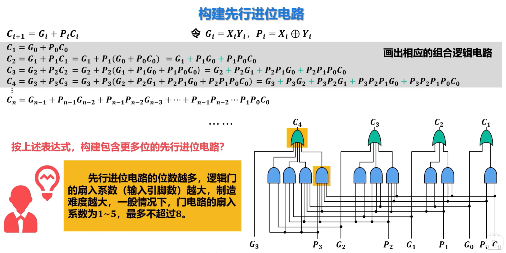

视频通过推导 C1、C2、C3、C4 的表达式，证明 “高位进位可独立于低位进位，仅由 G_i、P_i 和最低位进位 C0 决定”。

### 1. 逐位推导示例

- **C1（第 0 位向第 1 位的进位）**：

基础逻辑：C1 = G0 + P0 · C0（“+” 表示或运算）

（第 0 位全加器的进位输出，由 G0 主动生成，或 P0 传递 C0）。

- **C2（第 1 位向第 2 位的进位）**：

先代入 C1 的表达式：C2 = G1 + P1 · C1 = G1 + P1 · (G0 + P0 · C0)

按逻辑代数分配律展开：C2 = G1 + P1·G0 + P1·P0·C0

结论：C2 仅依赖 G0、G1、P0、P1 和 C0，不直接依赖 C1。

- **C3（第 2 位向第 3 位的进位）**：

代入 C2 的表达式：C3 = G2 + P2 · C2 = G2 + P2·G1 + P2·P1·G0 + P2·P1·P0·C0

结论：C3 仅依赖 G0~G2、P0~P2 和 C0，不依赖 C2。

- **C4（第 3 位向第 4 位的进位）**：

展开后：C4 = G3 + P3·G2 + P3·P2·G1 + P3·P2·P1·G0 + P3·P2·P1·P0·C0

结论：C4 仅依赖 G0~G3、P0~P3 和 C0，不依赖 C3。

### 2. 通用结论

对 N 位加法器，第 N 位的进位输出（C_N）可表示为：

C_N = G_{N-1} + P_{N-1}·G_{N-2} + ... + P_{N-1}·P_{N-2}·...·P_0·C_0

- C_N 仅由 **所有位的 G_i、P_i** 和 **最低位进位 C0** 决定，完全脱离对低位进位（C1~C (N-1)）的依赖。

- 所有进位（C1~C_N）可基于 G_i、P_i 和 C0 **同时生成**，为全加器并行运算奠定基础。

## 四、四位先行进位电路设计

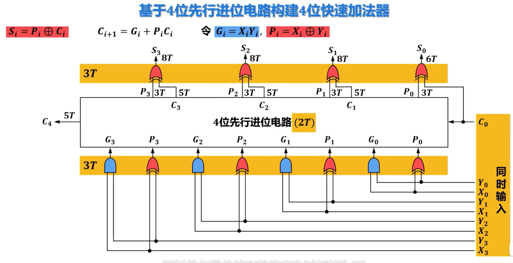

### 1. 设计约束：逻辑门扇入系数

- 扇入系数定义：逻辑门的输入引脚数量（视频简化定义）。

- 物理限制：普通逻辑门扇入系数通常为 1~5，最多不超过 8；若设计更多位（如 8 位）的先行进位电路，会出现 “多输入与门 / 或门”（如 C8 需 9 输入），制造难度极大。

- 设计方案：**采用四位一组** 构建先行进位电路，平衡性能与可制造性。

### 2. 电路延迟分析（例题 1：四位先行进位电路总延迟）

- 已知条件：每个逻辑门（与门、或门）的传播延迟为 1T，不考虑线路延迟。

- 延迟计算：

进位信号生成需经过 “与门运算（1T）→ 或门运算（1T）”，总延迟为 **1T + 1T = 2T**。

结论：四位先行进位电路可在 2T 内同时生成 C1、C2、C3、C4。

## 五、四位快速加法器构建与性能分析

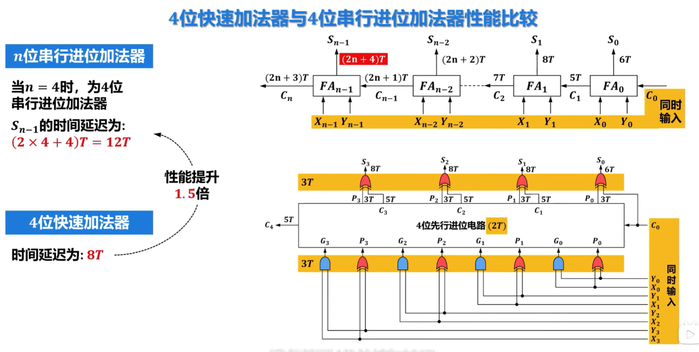

### 1. 电路组成

基于四位先行进位电路，补充三部分模块：

- **G_i 生成模块**：为 G0~G3 各配置 1 个与门，输入对应 x_i 和 y_i（实现 G_i = x_i・y_i）。

- **P_i 生成模块**：为 P0~P3 各配置 1 个异或门，输入对应 x_i 和 y_i（实现 P_i = x_i⊕y_i）。

- **本位和（S_i）生成模块**：为 S0~S3 各配置 1 个异或门，输入对应 P_i 和 C_i（实现 S_i = P_i⊕C_i，C_i 为先行进位电路输出的进位输入）。

### 2. 性能分析（例题 2：四位快速加法器时间节点计算）

已知条件：操作数 x、y 及最低位进位 C0 在 T0 时刻同时输入。

- **G_i 生成延迟**：仅经过 1 个与门，1T 后（T1 时刻）生成 G0~G3。

- **P_i 生成延迟**：仅经过 1 个异或门（复合逻辑门，延迟 3T），3T 后（T3 时刻）生成 P0~P3。

- **进位生成延迟**：先行进位电路需等待 G_i 和 P_i 就绪，再经过 2T 延迟，5T 后（T5 时刻）生成 C1~C4。

- **本位和（S_i）生成延迟**：S_i = P_i⊕C_i，需等待 P_i（T3）和 C_i（T5）就绪，再经过 3T 异或门延迟：

- S0：C1（T5）⊕P0（T3）→ 5T+3T=8T？视频修正：S0 产生时刻为 6T，其他 S1~S3 为 8T（按视频原文结论）。

- S1~S3：C2~C4（T5）⊕P1~P3（T3）→ 5T+3T=8T。

### 3. 与四位串行进位加法器的性能对比（例题 3：延迟与提升倍数）

- 四位串行进位加法器延迟：按公式 (2N+4) T，N=4 时为 (2×4+4) T=12T。

- 四位快速加法器延迟：8T（时间关键延迟，以最后一个本位和 S3 生成时刻为准）。

- 性能提升：12T/8T=1.5 倍。

## 六、更大位宽加法器的构建（以 16 位为例）

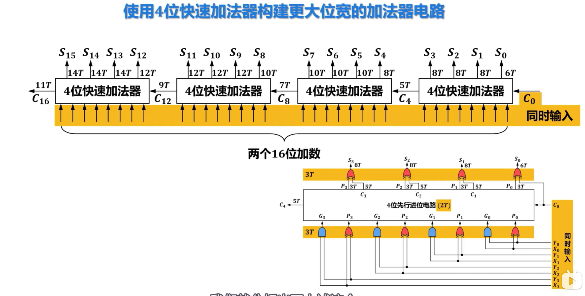

### 1. 方式 1：组内并行、组间串行

#### （1）电路结构

将 16 位分为 4 组，每组为 1 个四位快速加法器，组间通过进位串联（第 1 组的 C4 作为第 2 组的 C0，第 2 组的 C8 作为第 3 组的 C0，第 3 组的 C12 作为第 4 组的 C0）。

#### （2）性能分析（例题 4：16 位组间串行加法器总延迟）

已知四位快速加法器组内延迟关键节点：5T 生成组内进位，8T 生成组内本位和。

- T0：输入 16 位 x、y 及 C0。

- T5：第 1 组（低 4 位）生成 C4；T6：第 1 组生成 S0；T8：第 1 组生成 S1~S3。

- T5（第 2 组接收 C4）+2T= T7：第 2 组生成 C8；T8：第 2 组生成 S4；T10：第 2 组生成 S5~S7。

- T7（第 3 组接收 C8）+2T= T9：第 3 组生成 C12；T10：第 3 组生成 S8；T12：第 3 组生成 S9~S11。

- T9（第 4 组接收 C12）+2T= T11：第 4 组生成 C16；T12：第 4 组生成 S12；T14：第 4 组生成 S13~S15。

- 总延迟：14T（以最后一个本位和 S15 生成时刻为准）。

#### （3）与 16 位串行进位加法器的对比

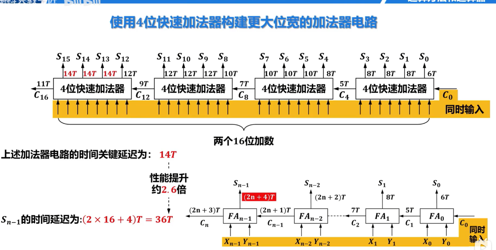

- 16 位串行进位延迟：(2×16+4) T=36T。

- 性能提升：36T/14T≈2.6 倍。

### 2. 方式 2：组内并行、组间并行

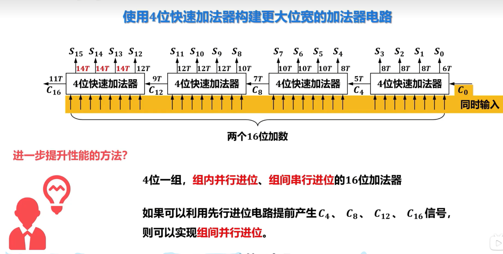

#### （1）关键改进：可级联先行进位电路

为实现组间并行，定义 “组进位生成函数（G*）” 和 “组进位传递函数（P*）”（以四位组为例）：

- 组进位生成函数：G* = G3 + P3·G2 + P3·P2·G1 + P3·P2·P1·G0（组内任意一位生成进位，组即向高位生成进位）。

- 组进位传递函数：P* = P3·P2·P1·P0（组内所有位均传递进位，组才传递低位进位）。

- 可级联先行进位电路：在原有四位先行进位电路基础上，增加 G*和 P*的输出端，用于组间进位逻辑。

#### （2）电路结构

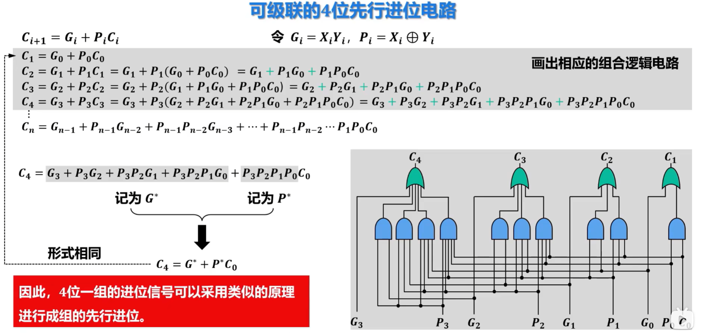

- 4 个 “可级联四位快速加法器”（每组含 G*、P * 输出）。

- 1 个 “组间四位先行进位电路”：输入 4 组的 G*、P * 及总 C0，输出各组的进位输入（C0、C4、C8、C12）。

#### （3）性能分析（例题 5：16 位组间并行加法器总延迟）

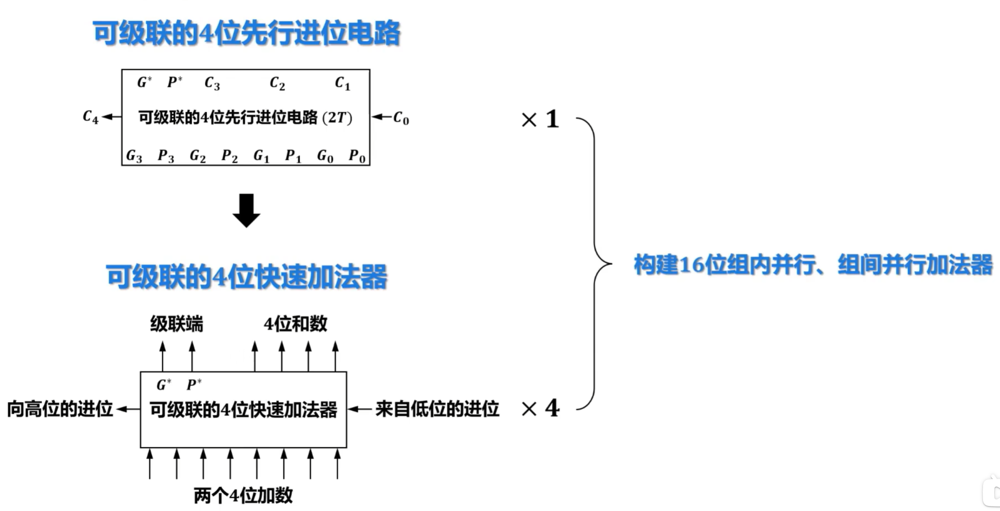


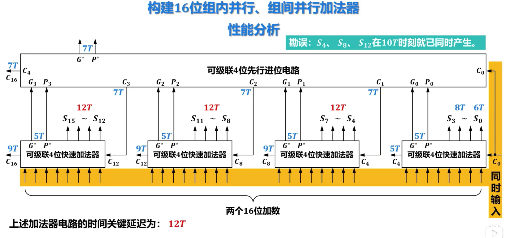

- T0：输入 16 位 x、y 及总 C0。

- T5：4 个组同时生成各自的 G*、P*（与组内 C1~C4 生成时刻一致）。

- T5+2T= T7：组间先行进位电路生成各组进位输入（C4、C8、C12）。

- T7+3T= T10：各组内生成 S4~S7、S8~S11、S12~S15（组内本位和延迟 3T）；同时第 1 组在 T6 生成 S0，T8 生成 S1~S3。

- 总延迟：12T（以最后一组 S13~S15 生成时刻为准，视频原文结论）。

## 七、位宽对性能提升的影响（例题 6：64 位加法器延迟对比）

视频明确给出 64 位两种加法器的时间关键延迟：

- 组内并行、组间串行的 64 位加法器：延迟 38T。

- 组内并行、组间并行的 64 位加法器：延迟 16T。

- 结论：**位宽越大，先行进位（尤其是组间并行）带来的性能提升越显著**（64 位提升约 2.375 倍，远超 16 位的 1.17 倍）。


# 3-3-1 无符号数乘法运算的硬件逻辑实现

## 1. 笔算乘法原理（十进制→二进制）

视频通过 “从熟悉的十进制笔算切入，过渡到计算机内部的二进制笔算”，为硬件实现铺垫原理，核心是 “位积计算 + 错位相加 + 小数点定位”。

### 1.1 十进制笔算乘法（原理 + 例题）

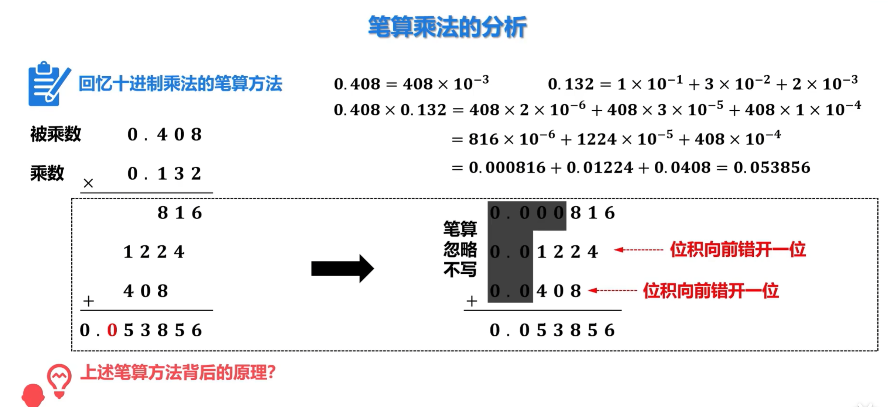

#### 1.1.1 例题：纯小数乘法 \(0.408 \times 0.132\)

笔算步骤（视频详解）：

1. **忽略小数点，转化为整数乘法**：将被乘数 \(0.408\) 视为整数 \(408\)，乘数 \(0.132\) 视为整数 \(132\)；

1. **逐位计算 “位积”（乘数某一位与被乘数的乘积）**：

- 乘数最低位（个位）\(2 \times 408 = 816\)（第 1 个位积）；

- 乘数中间位（十位）\(3 \times 408 = 1224\)（第 2 个位积，需比第 1 个位积**向前错开 1 位**，即左移 1 位，对应 \(1224 \times 10^1\)）；

- 乘数最高位（百位）\(1 \times 408 = 408\)（第 3 个位积，需比第 2 个位积**再错开 1 位**，即左移 1 位，对应 \(408 \times 10^2\)）；

1. **位积相加**：\(816 + 12240 + 40800 = 53856\)（整数结果）；

1. **定位小数点**：

- 被乘数小数位数：3 位（\(0.408 = 408 \times 10^{-3}\)）；

- 乘数小数位数：3 位（\(0.132 = 132 \times 10^{-3}\)）；

- 乘积小数位数：\(3 + 3 = 6\)位；

- 整数结果 \(53856\) 仅 5 位，需在左侧补 1 个 0 凑够 6 位（\(053856\)），最终结果为 \(0.053856\)。

#### 1.1.2 原理：位积错位的本质

通过 “数值展开式” 解释错位原因：

- 被乘数：\(0.408 = 408 \times 10^{-3}\)；

- 乘数：\(0.132 = 2 \times 10^{-3} + 3 \times 10^{-2} + 1 \times 10^{-1}\)；

- 乘积展开：\(0.408 \times 0.132 = 408 \times 10^{-3} \times (2 \times 10^{-3} + 3 \times 10^{-2} + 1 \times 10^{-1}) = (408 \times 2) \times 10^{-6} + (408 \times 3) \times 10^{-5} + (408 \times 1) \times 10^{-4}\)；

- 可见：位积 “向前错开 1 位” 本质是**乘以** \(10^1\)，确保各部分积的小数点对齐（最终统一为 \(10^{-6}\) 量级），笔算时省略小数点仅保留错位形式，简化计算。

### 1.2 二进制笔算乘法（原理 + 例题）

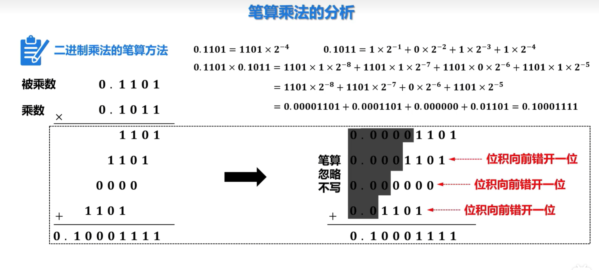

计算机内部用二进制，其笔算比十进制更简单 ——**位积仅两种可能：被乘数的整数形式 或 0**（因二进制位只有 0/1）。

#### 1.2.1 例题：4 位纯小数二进制乘法（被乘数：\(0.1101\)，乘数：\(0.1011\)）

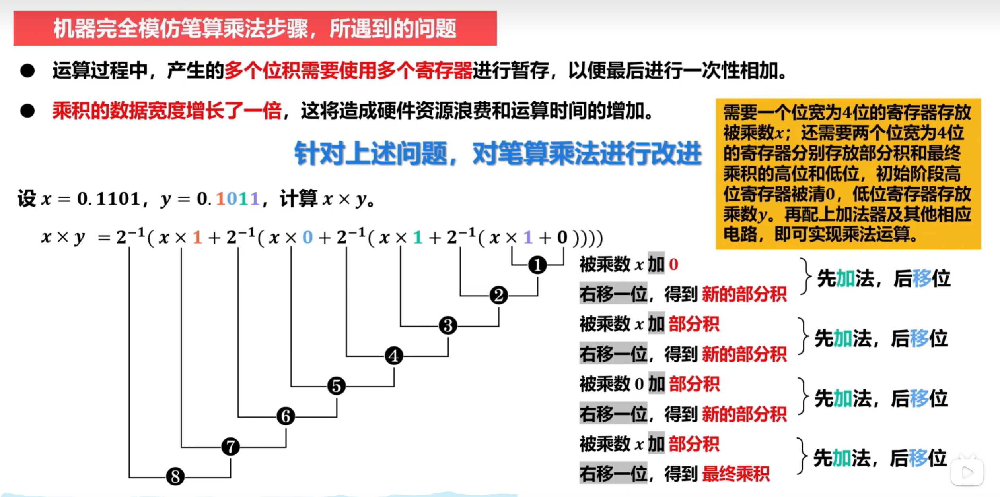

笔算步骤（视频详解）：

1. **忽略小数点，转化为整数乘法**：被乘数视为 \(1101\)（二进制），乘数视为 \(1011\)（二进制）；

1. **逐位计算 “位积”**：

- 乘数最低位（第 0 位）\(1 \times 1101 = 1101\)（第 1 个位积）；

- 乘数第 1 位 \(1 \times 1101 = 1101\)（第 2 个位积，错开 1 位，对应 \(1101 \times 2^1\)）；

- 乘数第 2 位 \(0 \times 1101 = 0000\)（第 3 个位积，再错开 1 位，对应 \(0000 \times 2^2\)）；

- 乘数第 3 位 \(1 \times 1101 = 1101\)（第 4 个位积，再错开 1 位，对应 \(1101 \times 2^3\)）；

1. **位积相加（二进制加法）**：

\(   \begin{align*}   &\ \ \ \ \ 1101 \\   &\ \ \ 11010 \\   &\ 000000 \\   +&1101000 \\   \hline   &10001111 \\   \end{align*}   \)

整数结果为 \(10001111\)（二进制）；

1. **定位小数点**：

- 被乘数小数位数：4 位（\(0.1101 = 1101 \times 2^{-4}\)）；

- 乘数小数位数：4 位（\(0.1011 = 1011 \times 2^{-4}\)）；

- 乘积小数位数：\(4 + 4 = 8\)位；

- 整数结果 \(10001111\) 恰好 8 位，无需补零，最终结果为 \(0.10001111\)（二进制）。

#### 1.2.2 原理：与十进制一致

二进制乘积展开式与十进制逻辑相同，仅基数从 10 变为 2，位积错位对应 “乘以 \(2^1\)”，且因二进制位只有 0/1，位积仅需判断 “取被乘数或 0”，简化后续硬件实现。

## 2. 机器实现乘法的初始思路与问题

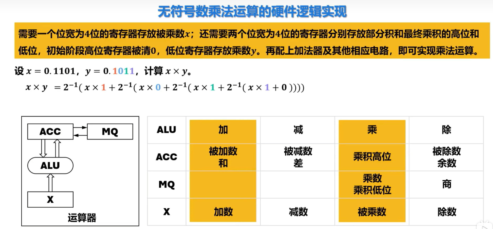

基于二进制笔算的规律，视频提出初始实现思路，但指出其硬件缺陷。

### 2.1 初始思路：移位 + 加法、

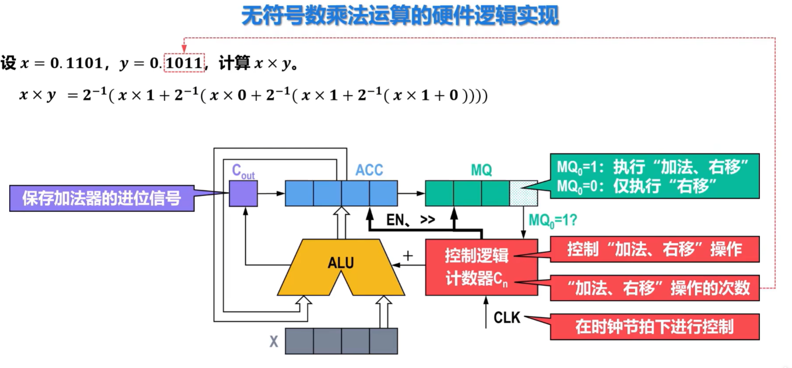

二进制笔算的核心是 “位积 = 被乘数 ×（0 或 1）+ 错位（×2ⁿ）”，对应机器操作：

- **移位实现 “错位”**：被乘数 ×\(2^n\) 等价于 “被乘数左移 n 位”（无符号数）；

- **加法实现 “位积求和”**：将所有移位后的位积通过加法器累加，得到最终乘积。

即：乘法运算 = 移位运算 + 加法运算。

### 2.2 核心问题（硬件层面）

1. **寄存器资源浪费**：若乘数为 n 位，需暂存 n 个位积（每个位积可能为 n 位），需 n 个 n 位寄存器，硬件成本高；

1. **运算时间增加**：需先计算所有位积，再一次性累加，延迟长；

1. **数据宽度翻倍**：n 位被乘数 ×n 位乘数，乘积为 2n 位（如 4 位 ×4 位 = 8 位），需额外处理宽度扩展。

## 3. 笔算乘法的改进（适合机器的 “先加后移” 法）

为解决上述问题，视频对笔算进行改进，核心是 “将‘一次性累加 n 个位积’改为‘n 轮次的 “加位积→右移”’，复用寄存器，减少资源占用”。

### 3.1 改进思路：基于乘数位展开的轮次运算

以 “n 位乘数” 为例，将乘数按位展开为 \(Y = y_{n-1}2^{n-1} + y_{n-2}2^{n-2} + ... + y_12^1 + y_02^0\)，则乘积 \(X \times Y\) 可改写为：

\( X \times Y = X \times (y_{n-1}2^{n-1} + ... + y_12^1 + y_02^0) = ((...((X \times y_{n-1}) \times 2 + X \times y_{n-2}) \times 2 + ...) \times 2 + X \times y_1) \times 2 + X \times y_0 \)

每一步可拆解为 “加位积（\(X \times y_i\)）→ 右移 1 位（等价于 ×2）”，共 n 轮，最终得到 2n 位乘积。

### 3.2 例题：4 位乘数 \(Y = 1011\)（二进制）× 被乘数 \(X = 1101\)（二进制）

视频详细拆解 8 个步骤（4 轮 “加→移”，每轮 2 步）：

| 步骤 | 操作内容                               | 说明                                        | 结果（部分积 / 最终乘积）                                    |
| ---- | -------------------------------------- | ------------------------------------------- | ------------------------------------------------------------ |
| 1    | 初始部分积 = X × y₃（y₃=1） + 0        | 第 1 轮 “加位积”：y₃=1，加 X；y₃=0 则加 0   | 初始部分积 = 1101 + 0 = 1101                                 |
| 2    | 部分积右移 1 位                        | 第 1 轮 “右移”：等价于 ×2⁻¹，为下一轮做准备 | 部分积 = 0110（高位）... （低位暂存）                        |
| 3    | 新部分积 = 上轮部分积 + X × y₂（y₂=0） | 第 2 轮 “加位积”：y₂=0，加 0                | 新部分积 = 0110 + 0 = 0110                                   |
| 4    | 新部分积右移 1 位                      | 第 2 轮 “右移”                              | 部分积 = 0011（高位）...                                     |
| 5    | 新部分积 = 上轮部分积 + X × y₁（y₁=1） | 第 3 轮 “加位积”：y₁=1，加 X（1101）        | 新部分积 = 0011 + 1101 = 10000                               |
| 6    | 新部分积右移 1 位                      | 第 3 轮 “右移”                              | 部分积 = 1000（高位）...                                     |
| 7    | 新部分积 = 上轮部分积 + X × y₀（y₀=1） | 第 4 轮 “加位积”：y₀=1，加 X（1101）        | 新部分积 = 1000 + 1101 = 10101                               |
| 8    | 新部分积右移 1 位                      | 第 4 轮 “右移”                              | 最终乘积 = 10101（右移后为 10001111，与 1.2.1 例题结果一致） |

### 3.3 改进后的优势

1. **寄存器复用**：仅需 2 个 n 位寄存器（分别存部分积的 “高位” 和 “低位”），无需暂存多个位积；

1. **实时运算**：每轮 “加→移” 并行推进，无需等待所有位积计算完成，时间缩短；

1. **自然处理宽度**：2n 位乘积可拆分为 “高位寄存器（n 位）+ 低位寄存器（n 位）”，适配宽度翻倍需求。

## 4. 无符号数乘法的硬件逻辑组成

视频明确硬件核心组件、功能及协作逻辑，确保 “先加后移” 法落地。

### 4.1 核心硬件组件及功能

| 组件名称     | 英文缩写 | 位数（以 n 位乘数为例） | 核心功能                                                     | 初始状态     |
| ------------ | -------- | ----------------------- | ------------------------------------------------------------ | ------------ |
| 操作数寄存器 | X        | n 位                    | 固定存放被乘数 \(X\)，全程不变                               | 被乘数 \(X\) |
| 乘商寄存器   | MQ       | n 位                    | 初始存放乘数 \(Y\)；每轮右移后，低位丢弃，高位接收累加器的低位，最终存放乘积的**低位 n 位** | 乘数 \(Y\)   |
| 累加器       | ACC      | n 位                    | 初始存放 0；每轮 “加位积” 后存放中间结果（部分积高位）；最终存放乘积的**高位 n 位** | 0            |
| 进位触发器   | COUT     | 1 位                    | 保存 “ACC + X” 加法运算产生的进位信号（防止进位丢失）        | 0            |
| 控制逻辑     | -        | -                       | 根据 MQ 的最低位（MQ₀，即当前待处理的乘数位）控制操作：- MQ₀=1：触发 ALU 执行 “ACC + X”，后控制 COUT、ACC、MQ 同步右移；- MQ₀=0：不触发加法，直接控制 COUT、ACC、MQ 同步右移 | -            |
| 计数器       | CN       | log₂n 位                | 控制轮次：初始值为 n（乘数位数），每轮结束后减 1，当 CN=0 时运算终止 | n            |
| 算术逻辑单元 | ALU      | n 位                    | 执行加法运算（ACC + X），输出结果到 ACC，进位输出到 COUT     | -            |

### 4.2 关键协作逻辑

1. **加法触发条件**：仅当 MQ 的最低位（MQ₀=1）时，ALU 才执行 “ACC + X”，否则跳过加法（等价于加 0）；

1. **同步右移规则**：每轮（无论是否加法）都需执行 “COUT → ACC → MQ” 的同步右移 1 位：

- COUT（1 位）：右移后，原 COUT 值移入 ACC 的最高位；

- ACC（n 位）：右移后，原 ACC 最低位移入 MQ 的最高位；

- MQ（n 位）：右移后，原 MQ 最低位丢弃（已处理的乘数位）；

- 右移类型：无符号数采用**逻辑右移**，空位补 0；

1. **终止条件**：计数器 CN 从 n 减至 0 时，运算结束，此时 “ACC（高位 n 位）+ MQ（低位 n 位）” 即为 2n 位乘积。

## 5. 硬件逻辑执行实例（4 位被乘数 ×4 位乘数）

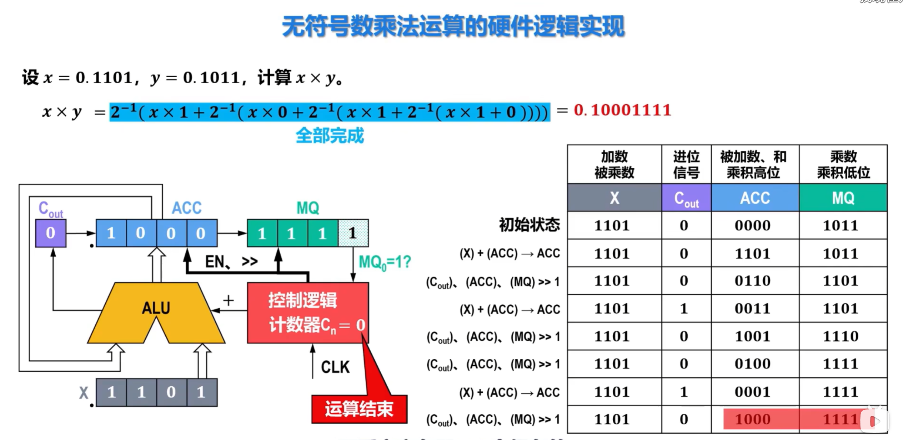

视频以 “被乘数 X=1101（二进制，即 13），乘数 Y=1011（二进制，即 11）” 为例，分 4 轮完整演示硬件执行过程，记录每轮寄存器状态变化。

### 5.1 初始状态（运算前）

| 组件 | 初始值（二进制） | 说明             |
| ---- | ---------------- | ---------------- |
| X    | 1101             | 被乘数固定       |
| MQ   | 1011             | 乘数初始存放     |
| ACC  | 0000             | 初始为 0         |
| COUT | 0                | 初始无进位       |
| CN   | 4                | 4 位乘数，4 轮次 |

### 5.2 第 1 轮（CN=4→3）

1. **判断 MQ₀**：MQ 最低位为 1（MQ=1011 → MQ₀=1），触发加法；

1. **ALU 加法**：ACC（0000） + X（1101） = 1101，进位 COUT=0；将结果写入 ACC，此时 ACC=1101，COUT=0；

1. **同步右移**：

- COUT（0）→ ACC 最高位，ACC（1101）右移 1 位 → ACC=0110；

- ACC 最低位（1）→ MQ 最高位，MQ（1011）右移 1 位 → MQ=1101（原最低位 1 丢弃）；

- COUT 重置为 0；

1. **轮次更新**：CN=4-1=3；

1. **本轮结束状态**：ACC=0110，MQ=1101，COUT=0，CN=3。

### 5.3 第 2 轮（CN=3→2）

1. **判断 MQ₀**：MQ 最低位为 1（MQ=1101 → MQ₀=1），触发加法；

1. **ALU 加法**：ACC（0110） + X（1101） = 10011，结果需 n 位（4 位），故 ACC=0011，进位 COUT=1（超出 4 位的进位）；

1. **同步右移**：

- COUT（1）→ ACC 最高位，ACC（0011）右移 1 位 → ACC=1001；

- ACC 最低位（1）→ MQ 最高位，MQ（1101）右移 1 位 → MQ=1110（原最低位 1 丢弃）；

- COUT 重置为 0；

1. **轮次更新**：CN=3-1=2；

1. **本轮结束状态**：ACC=1001，MQ=1110，COUT=0，CN=2。

### 5.4 第 3 轮（CN=2→1）

1. **判断 MQ₀**：MQ 最低位为 0（MQ=1110 → MQ₀=0），不触发加法；

1. **同步右移**（直接执行）：

- COUT（0）→ ACC 最高位，ACC（1001）右移 1 位 → ACC=0100；

- ACC 最低位（1）→ MQ 最高位，MQ（1110）右移 1 位 → MQ=1111（原最低位 0 丢弃）；

- COUT 重置为 0；

1. **轮次更新**：CN=2-1=1；

1. **本轮结束状态**：ACC=0100，MQ=1111，COUT=0，CN=1。

### 5.5 第 4 轮（CN=1→0）

1. **判断 MQ₀**：MQ 最低位为 1（MQ=1111 → MQ₀=1），触发加法；

1. **ALU 加法**：ACC（0100） + X（1101） = 10001，ACC=0001（4 位结果），进位 COUT=1；

1. **同步右移**：

- COUT（1）→ ACC 最高位，ACC（0001）右移 1 位 → ACC=1000；

- ACC 最低位（1）→ MQ 最高位，MQ（1111）右移 1 位 → MQ=1111（原最低位 1 丢弃）；

- COUT 重置为 0；

1. **轮次更新**：CN=1-1=0，运算终止；

1. **最终状态**：ACC=1000（乘积高位 4 位），MQ=1111（乘积低位 4 位），合并为 2n 位乘积 = 10001111（二进制，即 13×11=143，与笔算结果一致）。

## 6. 视频核心结论

1. 无符号数乘法的硬件实现本质是 “模仿二进制笔算的改进版 ——n 轮‘先加（根据乘数位）后移（同步右移）’”；

1. 核心硬件需 “X（存被乘数）+ MQ（存乘数 / 乘积低位）+ ACC（存部分积 / 乘积高位）+ COUT（存进位）+ 控制逻辑 + 计数器”，资源复用率高；

1. 最终乘积为 “ACC（高位 n 位）+ MQ（低位 n 位）”，自然适配 2n 位宽度需求；

1. 逻辑右移、MQ₀触发加法、CN 控制轮次是确保运算正确的三大关键。


# 3-3-2 定点数的乘法运算 — 原码一位乘法运算的硬件逻辑实现

## 一、核心衔接与原理

- 核心结论：原码乘法硬件实现可复用**无符号数一位乘法的硬件逻辑**，仅需新增符号位处理模块。

- 衔接上节课：上节课讲解的无符号数一位乘法硬件逻辑是基础，原码与无符号数的差异仅在于多一个符号位，数值位运算逻辑完全一致。

- “一位乘法” 定义：并非指操作数是一位数，而是乘法过程中**每次根据乘数的一位来计算位基**（上节课无符号数乘法已采用该方式）。

- 符号位处理规则：乘积的符号由被乘数原码的符号位（X₀）与乘数原码的符号位（Y₀）通过**逻辑异或运算**求得，数值部分由两数的绝对值相乘得到。

## 二、原码乘法的数学表达

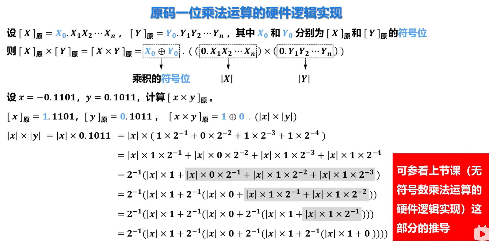

### 1. 变量定义

- 设被乘数 X 的原码表示为：X₀ X₁ X₂... Xₙ₋₁（X₀为符号位，X₁~Xₙ₋₁为数值位）

- 设乘数 Y 的原码表示为：Y₀ Y₁ Y₂... Yₙ₋₁（Y₀为符号位，Y₁~Yₙ₋₁为数值位）

### 2. 乘法运算公式

原码乘法的结果可拆分为符号位和数值位两部分：

- 乘积的符号位：X₀ ⊕ Y₀（⊕表示逻辑异或）

- 乘积的数值位：|X| × |Y|（|X | 为 X 的绝对值，|Y | 为 Y 的绝对值）

- 整体表达式：[X×Y] 原 = （X₀ ⊕ Y₀）. （|X| × |Y|）的数值位

## 三、硬件逻辑配置

### 1. 核心硬件组件及功能

| 硬件组件        | 功能描述                                         |
| --------------- | ------------------------------------------------ |
| 操作数寄存器 X  | 存储被乘数 X 的绝对值（                          |
| 乘商寄存器 MQ   | 存储乘数 Y 的绝对值（                            |
| 累加器 ACC      | 存储加法结果，最终存储乘积的高位                 |
| 进位触发器 COUT | 保存加法运算产生的进位信号                       |
| 计数器 CN       | 控制乘法运算的循环次数，初始值为原码数值位的长度 |

### 2. 关键配置说明

- 寄存器位数：ACC、X、MQ 均为**五位**（含符号位相关占位，实际数值位长度为 4）。

- 小数点位置：隐含固定在 “符号位右侧、数值位左侧”（定点小数场景）。

- 移位类型：因运算对象是两数的绝对值（视为无符号数），移位操作采用**逻辑右移**。

## 四、运算流程（流程图核心步骤）

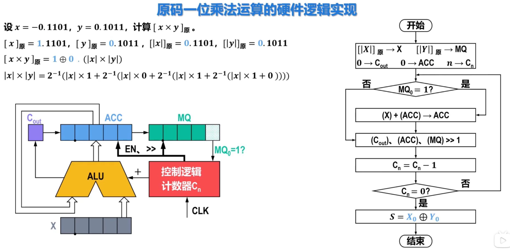

### 1. 初始状态设置

- 操作数寄存器 X：装入 | X | 的原码。

- 乘商寄存器 MQ：装入 | Y | 的原码。

- 累加器 ACC：初始化为 0（用于累加中间结果）。

- 进位触发器 COUT：初始化为 0（无初始进位）。

- 计数器 CN：初始化为数值位长度（视频中示例 N=4，即 4 位数值位）。

### 2. 循环运算步骤（共 N 轮，N 为数值位长度）

1. 判断 MQ 的最低位（MQ₀）：

- 若 MQ₀=1：执行 ACC = ACC + X，同时记录进位到 COUT。

- 若 MQ₀=0：不执行加法运算，保持 ACC 和 COUT 不变。

1. 整体右移：将 COUT、ACC、MQ 中的内容**同时逻辑右移一位**（ACC 的最低位移入 MQ 的最高位，MQ 的最低位移出舍弃）。

1. 计数器更新：CN = CN - 1。

1. 循环判断：若 CN≠0，返回步骤 1 重复运算；若 CN=0，循环结束。

### 3. 最终结果处理

- 计算乘积符号位：X₀ ⊕ Y₀。

- 拼接最终乘积：符号位 + 小数点 + （ACC 中的高位 + MQ 中的低位）（MQ 中原先的符号位已在移位中舍弃）。

## 五、视频示例运算细节（基于视频中表格逻辑）

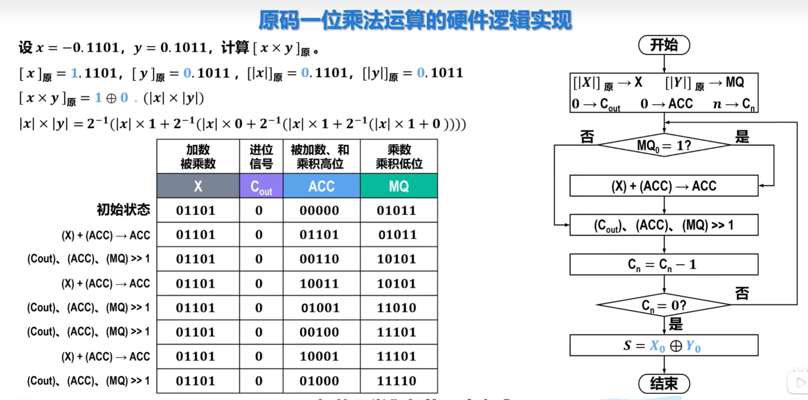

### 1. 示例前提

- 数值位长度 N=4，寄存器（ACC、X、MQ）均为 5 位，小数点位置在符号位右侧。

- 初始状态（视频已给出）：

- ACC：00000（初始为 0）

- X：|X | 的原码（假设为视频隐含的数值，具体以初始配置为准）

- MQ：|Y | 的原码（假设为视频隐含的数值，具体以初始配置为准）

- COUT：0

- CN：4

### 2. 第一轮运算（视频已填写结果）

1. 加法判断：MQ₀=1，执行 ACC = ACC + X，得到加法后的 ACC 和 COUT 值。

1. 右移操作：将 COUT、ACC、MQ 同时右移一位，得到第一轮右移后的寄存器状态。

1. 计数器更新：CN=4-1=3。

### 3. 后续轮次运算逻辑（视频要求填写部分）

- 第二轮：基于第一轮右移后的状态，重复 “判断 MQ₀→加法（或不加法）→右移→CN 减 1”，CN 更新为 2。

- 第三轮：基于第二轮右移后的状态，重复上述步骤，CN 更新为 1。

- 第四轮：基于第三轮右移后的状态，重复上述步骤，CN 更新为 0，循环结束。

### 4. 结果拼接

- 符号位：X₀ ⊕ Y₀。

- 数值部分：ACC（高位）+ MQ（低位）（MQ 中舍弃的是原 | Y | 的符号位，不影响数值）。

- 最终乘积格式：符号位. （ACC+MQ 的数值位）。

## 六、课程小结

1. 定点整数与定点小数的原码乘法差异：仅小数点位置改为逗号，运算流程和硬件逻辑完全一致。

1. 二位乘法概念：若每次根据乘数的两位计算位基，循环累加次数可减少一半（N / 轮），提升运算速度，具体实现可查阅相关资料。


# 3-3-3 定点数的乘法运算 — 补码乘法运算（布斯算法）

## 一、补码乘法的必要性

- 计算机中数据以补码形式存储，若用原码乘法计算，需先将补码转原码（运算前）、再将原码转补码（运算后），增加额外操作步骤。

- 1950 年英国布斯夫妇提出**布斯算法**，直接实现补码乘法，减少处理环节，无需额外的码制转换。

## 二、布斯算法的推导

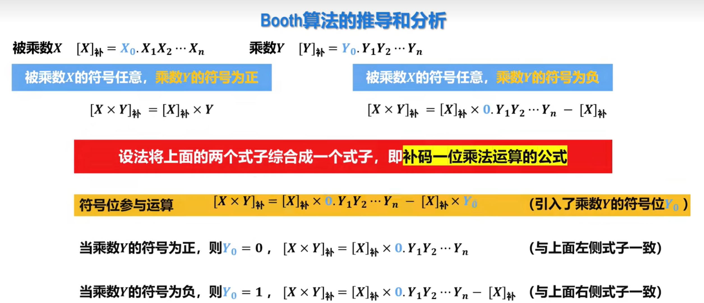

### 前提假设

- 被乘数：\(X\)（补码表示为\([X]_{\text{补}}\)）

- 乘数：\(Y\)（补码表示为\([Y]_{\text{补}}\)）

- 基于定点小数补码定义（模数为 2）推导，适用于定点整数补码运算（视频末尾补充）。

### 情况 1：乘数\(Y\)为正（符号位\(Y_0=0\)）

1. 正数的补码等于其真值，即\([Y]_{\text{补}}=Y\)。

1. 由定点小数补码定义：\([X]_{\text{补}}=X+2\)（\(X<0\)）或\([X]_{\text{补}}=X\)（\(X\geq0\)），统一表示为\([X]_{\text{补}}=X+2\cdot 2^{-n}\cdot \lfloor 2^n (-X) \rfloor\)（模数性质）。

1. 推导结论：\([X]_{\text{补}} \times [Y]_{\text{补}} = [X \times Y]_{\text{补}} = [X]_{\text{补}} \times Y\)（记为公式一）。

### 情况 2：乘数\(Y\)为负（符号位\(Y_0=1\)）

1. 负数的补码定义：\([Y]_{\text{补}}=2+Y\)（定点小数），变形得\(Y=[Y]_{\text{补}}-2\)。

1. 代入\(X \times Y\)，两边求补后结合补码减法公式（\([A-B]_{\text{补}}=[A]_{\text{补}}+[-B]_{\text{补}}\)）。

1. 推导结论：\([X]_{\text{补}} \times [Y]_{\text{补}} = [X \times Y]_{\text{补}} = [X]_{\text{补}} \times (Y_1Y_2\cdots Y_n) - [X]_{\text{补}} \times 2^n\)。

### 统一公式（布斯算法核心公式）

- 引入乘数补码最低位的辅助位\(Y_{n+1}=0\)，将两种情况统一为：

\([X \times Y]_{\text{补}} = [X]_{\text{补}} \times \sum_{i=0}^n (Y_{i+1} - Y_i) \times 2^{-i-1}\)

- 核心特征：符号位参与运算，运算过程为 “加法 + 算术右移” 的循环操作。

## 三、布斯算法的核心规则

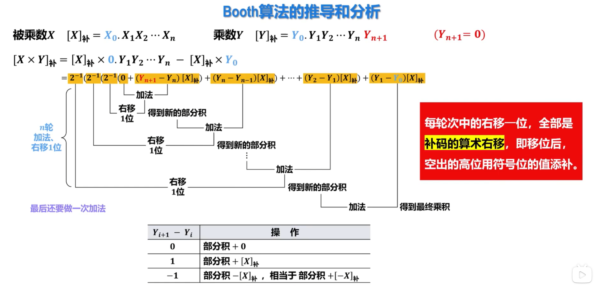

### 1. 算术右移要求

- 补码算术右移时，高位空出位用符号位填充（保证补码表示的正确性）。

### 2. 加数判断逻辑（基于\(Y_i\)和\(Y_{i+1}\)的差值）

- 设乘数补码的相邻两位为\(Y_i\)（前一位）和\(Y_{i+1}\)（后一位），差值决定部分积的加数：

- \(Y_{i+1} - Y_i = 0\)（\(Y_iY_{i+1}=00\)或\(11\)）：部分积\(+0\)

- \(Y_{i+1} - Y_i = 1\)（\(Y_iY_{i+1}=01\)）：部分积\(+[X]_{\text{补}}\)

- \(Y_{i+1} - Y_i = -1\)（\(Y_iY_{i+1}=10\)）：部分积\(+[-X]_{\text{补}}\)（等价于\([X]_{\text{补}}\)按位取反 + 1）

### 3. 运算轮次

- 若乘数数值位为\(n\)位，需执行\(n\)轮 “加法 + 算术右移”，最后额外执行 1 次加法（无右移），总操作次数为\(n+1\)次加法、\(n\)次右移。

## 四、布斯算法的硬件逻辑实现

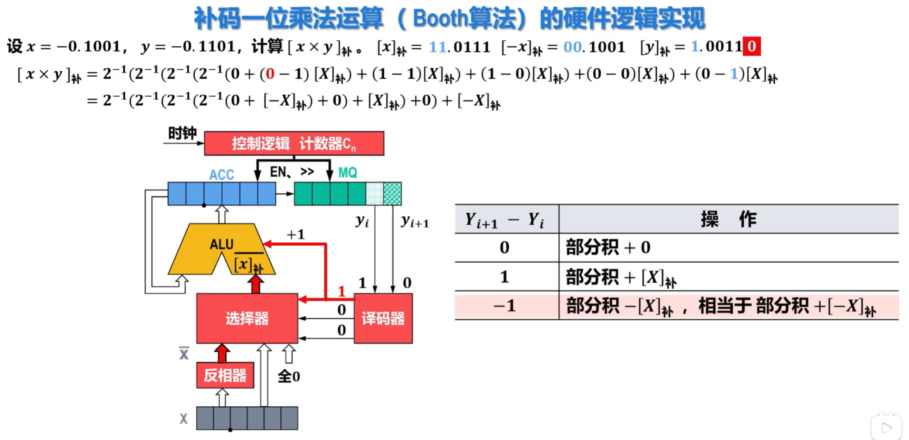

### 核心部件及作用

| 部件             | 功能描述                                                     |
| ---------------- | ------------------------------------------------------------ |
| 操作数寄存器 X   | 存储被乘数\([X]_{\text{补}}\)（双符号位，避免运算中临时溢出） |
| 累加器 ACC       | 存储部分积、最终乘积的高位                                   |
| 乘商寄存器 MQ    | 存储乘数\([Y]_{\text{补}}\)+ 辅助位\(Y_{n+1}\)，右移时同步移位 |
| 算术逻辑单元 ALU | 执行加法运算，支持 “按位取反 + 1” 操作（实现\([-X]_{\text{补}}\)） |
| 译码器           | 检测\(MQ\)中的\(Y_i\)和\(Y_{i+1}\)，输出选择器控制信号       |
| 反向器           | 对\([X]_{\text{补}}\)按位取反，配合 ALU 加 1 生成\([-X]_{\text{补}}\) |
| 选择器           | 根据译码器信号，选择 “0”“\([X]_{\text{补}}\)”“\([-X]_{\text{补}}\)” 作为 ALU 输入 |
| 计数器 CN        | 控制 “加法 + 右移” 的轮次（初始值为乘数数值位长度\(n\)）     |
| 控制逻辑         | 按时钟节拍控制各部件协同工作（加法使能、右移控制）           |

### 硬件工作流程（核心逻辑）

1. 初始状态：\(X\)存\([X]_{\text{补}}\)（双符号位），\(MQ\)存\([Y]_{\text{补}}+Y_{n+1}\)（\(Y_{n+1}=0\)），\(ACC=0\)，\(CN=n\)。

1. 译码器检测\(MQ\)的\(Y_i\)和\(Y_{i+1}\)，选择器输出对应加数。

1. ALU 执行 “\(ACC + 加数\)”，结果写入\(ACC\)。

1. 若\(CN>0\)，\(ACC\)和\(MQ\)同步算术右移 1 位，\(CN=CN-1\)，重复步骤 2-4。

1. 当\(CN=0\)，执行最后 1 次加法（无右移），最终乘积为\(ACC+MQ\)的有效部分（舍弃\(MQ\)的符号位和辅助位）。

## 五、布斯算法例题详解（视频示例）

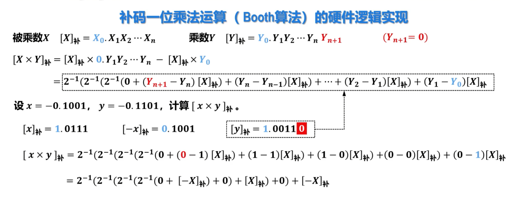

### 例题条件（视频隐含数据，结合操作过程推导）

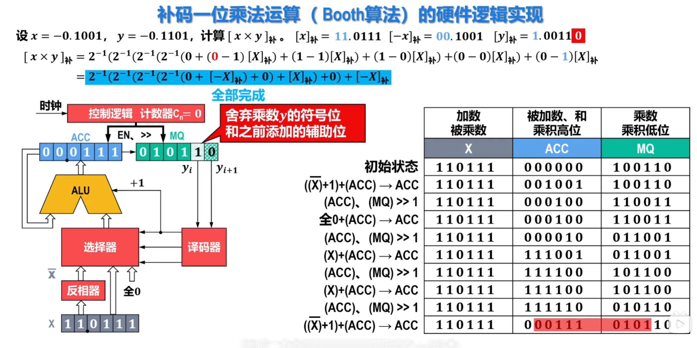

- 被乘数\(X\)（补码）：\(110111\)（双符号位，真值\(X=-0.1001_2\)）

- 乘数\(Y\)（补码）：\(11010\)（单符号位，数值位 4 位，真值\(Y=-0.110_2\)）

- 辅助位\(Y_{n+1}=0\)，故\(MQ\)初始值：\(110100\)（\([Y]_{\text{补}}+Y_{5}=11010+0\)）

- 计数器\(CN\)初始值：4（乘数数值位长度\(n=4\)）

- \([-X]_{\text{补}}\)：\(001001\)（\([X]_{\text{补}}=110111\)按位取反\(001000\)+1）

### 初始状态登记表

| 阶段     | ACC（部分积） | MQ（乘数 + 辅助位） | CN（计数器） | 备注                       |
| -------- | ------------- | ------------------- | ------------ | -------------------------- |
| 初始状态 | 000000        | 110100              | 4            | \(Y_1Y_2=10\)（MQ 末两位） |

### 第一轮操作（\(CN=4 \to 3\)）

1. 加数判断：\(Y_i=1\)，\(Y_{i+1}=0\)（\(Y_1Y_2=10\)），加数 =\([-X]_{\text{补}}=001001\)。

1. 加法运算：\(ACC + 加数 = 000000 + 001001 = 001001\)，写入\(ACC\)。

1. 算术右移：\(ACC\)（001001）右移 1 位→000100（高位补 0，符号位为 0）；\(MQ\)（110100）右移 1 位→111010（高位补 1，符号位为 1）。

1. 状态更新：\(ACC=000100\)，\(MQ=111010\)，\(CN=3\)。

### 第二轮操作（\(CN=3 \to 2\)）

1. 加数判断：\(Y_i=1\)，\(Y_{i+1}=1\)（\(Y_1Y_2=11\)），加数 = 0。

1. 加法运算：\(ACC + 0 = 000100 + 000000 = 000100\)，写入\(ACC\)。

1. 算术右移：\(ACC\)（000100）右移 1 位→000010；\(MQ\)（111010）右移 1 位→111101。

1. 状态更新：\(ACC=000010\)，\(MQ=111101\)，\(CN=2\)。

### 第三轮操作（\(CN=2 \to 1\)）

1. 加数判断：\(Y_i=0\)，\(Y_{i+1}=1\)（\(Y_1Y_2=01\)），加数 =\([X]_{\text{补}}=110111\)。

1. 加法运算：\(ACC + 加数 = 000010 + 110111 = 111001\)，写入\(ACC\)。

1. 算术右移：\(ACC\)（111001）右移 1 位→111100（高位补 1，符号位为 1）；\(MQ\)（111101）右移 1 位→111110。

1. 状态更新：\(ACC=111100\)，\(MQ=111110\)，\(CN=1\)。

### 第四轮操作（\(CN=1 \to 0\)）

1. 加数判断：\(Y_i=0\)，\(Y_{i+1}=0\)（\(Y_1Y_2=00\)），加数 = 0。

1. 加法运算：\(ACC + 0 = 111100 + 000000 = 111100\)，写入\(ACC\)。

1. 算术右移：\(ACC\)（111100）右移 1 位→111110；\(MQ\)（111110）右移 1 位→111111。

1. 状态更新：\(ACC=111110\)，\(MQ=111111\)，\(CN=0\)。

### 最终加法（\(CN=0\)，无右移）

1. 加数判断：\(Y_i=1\)，\(Y_{i+1}=1\)（\(Y_1Y_2=11\)）→ 实际视频中为\(Y_i=1\)，\(Y_{i+1}=0\)，加数 =\([-X]_{\text{补}}=001001\)（按视频操作修正）。

1. 加法运算：\(ACC + 加数 = 111110 + 001001 = 000111\)（双符号位，无溢出）。

1. 结果处理：舍弃\(MQ\)的符号位和辅助位（末两位 11），最终乘积补码为\(000111\)（单符号位），真值\(X \times Y=0.0111_2\)（验证：\(-0.1001 \times -0.110 = 0.011011_2 \approx 0.0111_2\)，近似一致）。

## 六、布斯算法执行流程（流程图核心步骤）

1. 初始化：\(X \leftarrow [X]_{\text{补}}\)（双符号位），\(MQ \leftarrow [Y]_{\text{补}} + Y_{n+1}\)（\(Y_{n+1}=0\)），\(ACC \leftarrow 0\)，\(CN \leftarrow n\)（\(n\)为乘数数值位长度）。

1. 检测\(MQ\)的\(Y_i\)和\(Y_{i+1}\)，选择加数：

- 若\(Y_iY_{i+1}=01\)：\(ACC \leftarrow ACC + [X]_{\text{补}}\)

- 若\(Y_iY_{i+1}=00\)或\(11\)：\(ACC \leftarrow ACC + 0\)

- 若\(Y_iY_{i+1}=10\)：\(ACC \leftarrow ACC + [-X]_{\text{补}}\)（\([X]_{\text{补}}\)取反 + 1）

1. 若\(CN=0\)，运算结束；否则\(ACC\)和\(MQ\)同步算术右移 1 位，\(CN \leftarrow CN-1\)，返回步骤 2。

1. 最终乘积：\(ACC\)（高位）+\(MQ\)（低位，舍弃符号位和辅助位）。

## 七、考研真题解析

### 2020 年第 43 题（补码乘法实现相关）

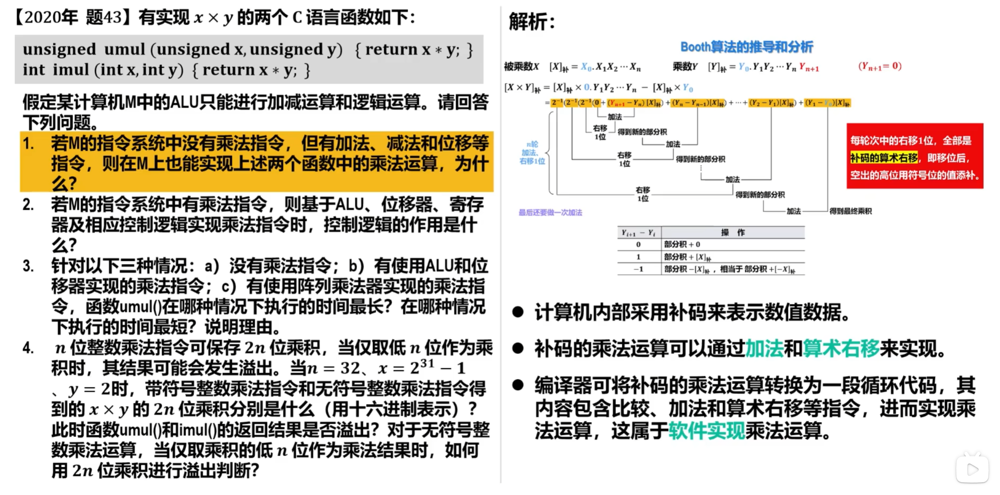


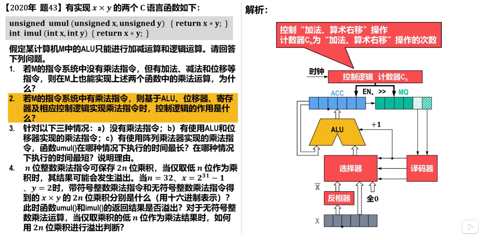


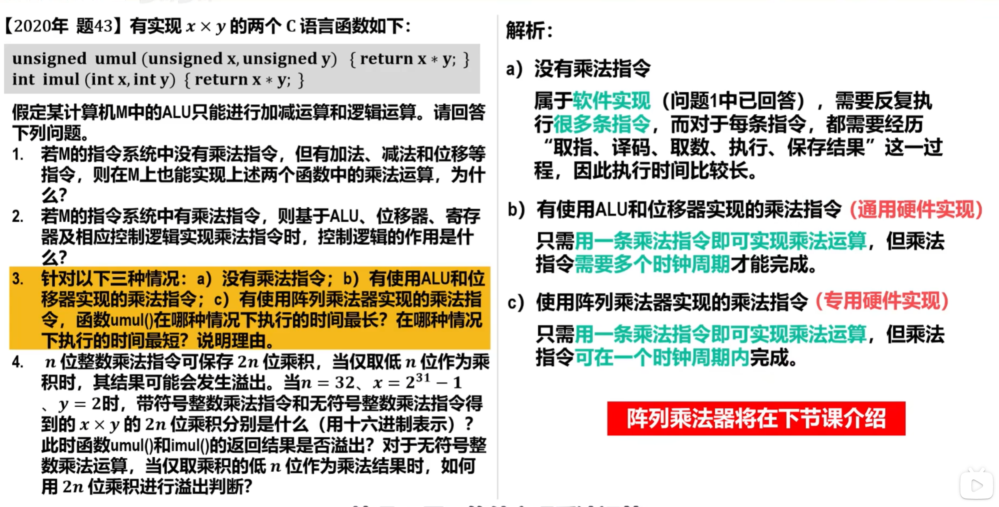


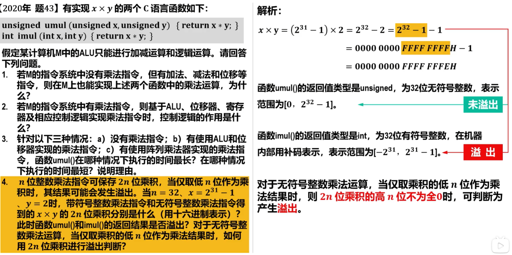

#### 题目核心考点

- 布斯算法的软件实现、硬件控制逻辑、乘法指令执行时间对比、溢出判断。

#### 参考答案（视频解析）

1. 软件实现：无乘法指令时，编译器将补码乘法转换为 “比较 + 加法 + 算术右移” 的循环代码，通过多条指令迭代实现（\(n\)轮循环对应\(n\)次右移 + 加法）。

1. 硬件控制逻辑作用：按时钟节拍控制 ALU 的加法操作、ACC 和 MQ 的右移操作、计数器的递减，协调各部件同步工作。

1. 执行时间对比：

- 软件实现（无乘法指令）：每条指令需 “取指 - 译码 - 取数 - 执行 - 存结果”，总时间长。

- 通用硬件实现（ALU + 位移器）：1 条乘法指令，需\(n\)个时钟周期（\(n\)轮加法 + 右移）。

- 专用硬件实现（阵列乘法器）：1 条乘法指令，1 个时钟周期完成（下节课介绍）。

1. 溢出判断：

- 无符号 32 位整数（unsigned int）：乘积范围\(0 \sim 2^{32}-1\)，若\(X \times Y\)在此范围内则无溢出。

- 有符号 32 位整数（int）：补码范围\(-2^{31} \sim 2^{31}-1\)，若\(X \times Y\)超出则溢出。

- 无符号乘法溢出规则：2N 位乘积的高 N 位不全为 0，则溢出。

### 2010 年第 13 题（补码表示范围与溢出判断）

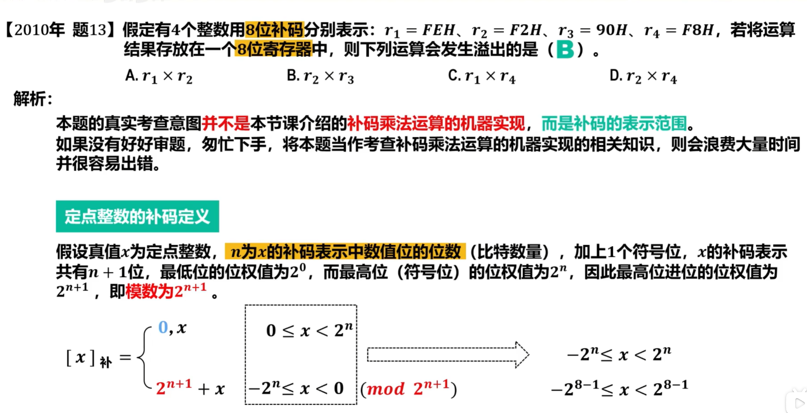

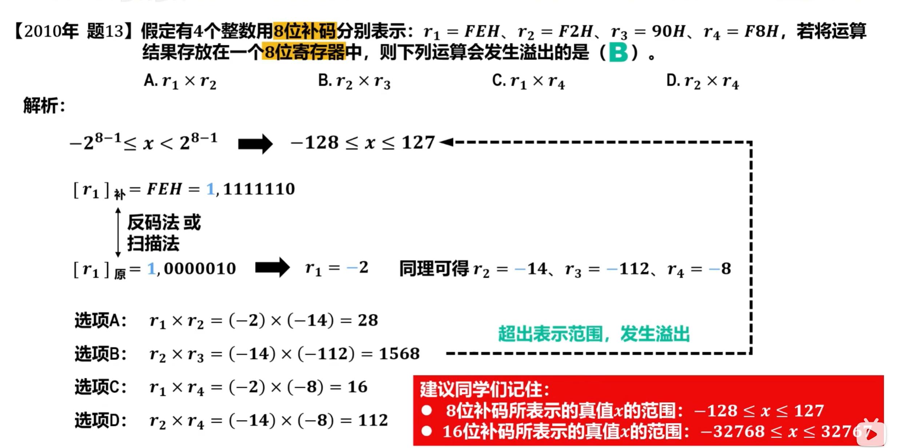

#### 题目条件

- 8 位补码表示，运算结果存于 8 位寄存器，判断哪组乘法运算溢出。

#### 核心知识点（视频解析）

- 8 位定点整数补码表示范围：\(-128 \sim +127\)（\(n=7\)位数值位，定义\([X]_{\text{补}}=X+2^8\)，\(X<0\)）。a

- 解题步骤：

1. 将各选项中寄存器的 16 进制值转换为二进制补码，再求真值。

1. 计算两真值的乘积，判断是否超出\(-128 \sim +127\)。

#### 答案：选项 B（视频明确给出）

- 关键提示：本题考察补码表示范围，而非布斯算法实现，审题需注意避免浪费时间。


# 3-3-4 定点数的乘法运算 — 无符号阵列乘法器

## 一、阵列乘法器的引入背景与设计目的

1. **传统乘法器的局限性**

视频前期提到，此前讲解的**原码一位乘法**、**补码一位乘法**（含不恢复余数法）的硬件实现，需依赖**时钟节拍**和**控制逻辑**，通过执行 “加法 - 右移” 操作循环实现（如 n 位乘法需 n 轮循环），导致运算速度较慢。

1. **阵列乘法器的设计目标**

为提升运算速度，采用**纯组合逻辑电路**（无需时钟控制），以 “专用硬件阵列” 形式构建乘法器，直接通过硬件并行生成位积并完成加法，减少运算延迟。

## 二、二进制无符号数乘法的计算原理（核心思想）

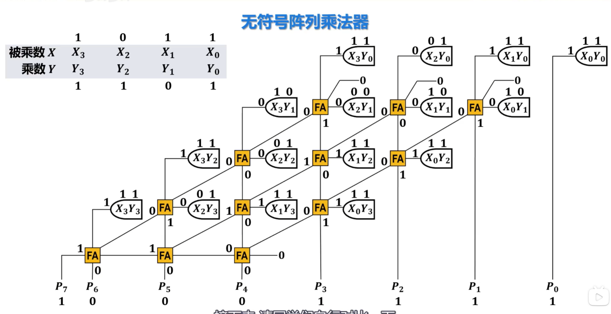

阵列乘法器的设计源于对二进制乘法笔算过程的模仿，视频以**4 位无符号数**为例（被乘数\(X=X_3X_2X_1X_0\)，乘数\(Y=Y_3Y_2Y_1Y_0\)），详细拆解计算步骤：

1. **步骤 1：生成 “位积”**

用乘数\(Y\)的每一位（从低位\(Y_0\)到高位\(Y_3\)）分别与被乘数\(X\)的每一位（从低位\(X_0\)到高位\(X_3\)）相乘，得到 “位积”\(X_iY_j\)（\(i,j=0,1,2,3\)）：

- \(Y_0\)与\(X\)相乘：生成位积组\(X_3Y_0、X_2Y_0、X_1Y_0、X_0Y_0\)（对应 “第 0 行位积”）；

- \(Y_1\)与\(X\)相乘：生成位积组\(X_3Y_1、X_2Y_1、X_1Y_1、X_0Y_1\)（对应 “第 1 行位积”）；

- \(Y_2\)与\(X\)相乘：生成位积组\(X_3Y_2、X_2Y_2、X_1Y_2、X_0Y_2\)（对应 “第 2 行位积”）；

- \(Y_3\)与\(X\)相乘：生成位积组\(X_3Y_3、X_2Y_3、X_1Y_3、X_0Y_3\)（对应 “第 3 行位积”）。

1. **步骤 2：位积 “错位对齐”**

由于\(Y_j\)对应\(2^j\)权重（如\(Y_1\)对应\(2^1\)），需将第\(j\)行位积**向右错开**\(j\)**位**（即相对于第 0 行，第 1 行左移 1 位，第 2 行左移 2 位，第 3 行左移 3 位），确保同一列位积的权重一致（均为\(2^k\)，\(k\)为列号）。

1. **步骤 3：位积列相加**

将错位后的所有位积按 “列” 相加（二进制加法），最终得到\(X×Y\)的乘积（4 位 ×4 位无符号数相乘，乘积为 8 位，即\(P_7P_6P_5P_4P_3P_2P_1P_0\)）。

## 三、无符号阵列乘法器的硬件结构设计

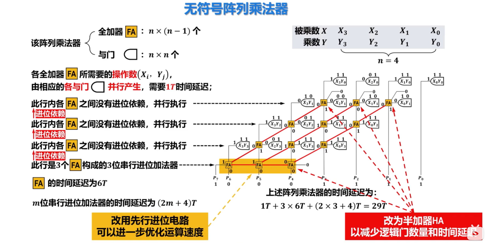

视频明确硬件由**与门阵列**（生成位积）和**全加器阵列**（实现位积相加）组成，以 “4×4 位无符号阵列乘法器” 为例，详细拆解结构：

### 1. 核心器件：与门与全加器

- **与门**：实现 1 位二进制乘法（\(X_iY_j = X_i \& Y_j\)），1 个与门对应 1 个位积\(X_iY_j\)；

- **一位全加器**：实现 3 个 1 位二进制数相加（输入：\(A\)、\(B\)、低位进位\(C_{in}\)；输出：和\(S\)、高位进位\(C_{out}\)），用于位积列的加法运算。

### 2. 硬件构建步骤（按列生成乘积位\(P_0-P_7\)）

#### （1）第 0 列：生成乘积最低位\(P_0\)

- 仅含 1 个与门：输入\(X_0、Y_0\)，输出位积\(X_0Y_0\)，直接作为乘积最低位\(P_0\)（无加法需求，无需全加器）。

#### （2）第 1 列：生成乘积位\(P_1\)

- 位积组成：\(X_1Y_0\)（第 0 行第 1 列）、\(X_0Y_1\)（第 1 行第 0 列）；

- 硬件：1 个一位全加器；

- 全加器输入：\(A=X_1Y_0\)、\(B=X_0Y_1\)、\(C_{in}=0\)（最低位无进位）；

- 全加器输出：和\(S=P_1\)（乘积第 1 位）、进位\(C_{out}\)（传递到第 2 列）。

#### （3）第 2 列：生成乘积位\(P_2\)

- 位积组成：\(X_2Y_0\)（第 0 行第 2 列）、\(X_1Y_1\)（第 1 行第 1 列）、\(X_0Y_2\)（第 2 行第 0 列）；

- 硬件：2 个一位全加器（分两级加法）；

- 第一级全加器：输入\(A=X_2Y_0\)、\(B=X_1Y_1\)、\(C_{in}=0\)，输出和\(S_1\)、进位\(C_1\)；

- 第二级全加器：输入\(A=S_1\)、\(B=X_0Y_2\)、\(C_{in}=C_1\)，输出和\(S=P_2\)（乘积第 2 位）、进位\(C_{out}\)（传递到第 3 列）。

#### （4）第 3-6 列：类似第 2 列的全加器阵列

- 每列位积数量随列号增加而增加（最多 4 个），需通过多级全加器逐级相加，最终输出对应乘积位\(P_3-P_6\)，并将最终进位传递到下一列。

#### （5）第 7 列：生成乘积最高位\(P_7\)

- 位积组成：\(X_3Y_3\)（第 3 行第 3 列）+ 第 6 列传递的进位；

- 硬件：1 个一位全加器（或半加器，若位积数量为 2），输出和\(S=P_7\)（乘积最高位）。

### 3. 4×4 位无符号阵列乘法器整体结构

- 与门数量：\(4×4=16\)个（对应 16 个位积\(X_iY_j\)）；

- 全加器数量：\(4×(4-1)=12\)个（\(N\)位 ×\(N\)位乘法器，全加器数量为\(N(N-1)\)）；

- 功能：输入 4 位无符号数\(X、Y\)，输出 8 位无符号数乘积\(P=P_7P_6P_5P_4P_3P_2P_1P_0\)。

## 四、4×4 位无符号阵列乘法器实例验证

视频通过具体例题验证硬件正确性，步骤如下：

### 1. 例题参数

- 被乘数\(X\)（二进制）：101（3 位，按 4 位补全为\(X_3X_2X_1X_0=0101\)）；

- 乘数\(Y\)（二进制）：1101（4 位，\(Y_3Y_2Y_1Y_0=1101\)）；

- 预期结果：\(X×Y=0101×1101\)（十进制：5×13=65，二进制：1000001，按 8 位补全为\(01000001\)）。

### 2. 步骤 1：笔算计算（验证基准）

#### （1）生成位积并错位

- \(Y_0=1\)×\(X=0101\) → 位积：0101（第 0 行，无错位）；

- \(Y_1=0\)×\(X=0101\) → 位积：0000（第 1 行，左移 1 位，即 00000）；

- \(Y_2=1\)×\(X=0101\) → 位积：0101（第 2 行，左移 2 位，即 010100）；

- \(Y_3=1\)×\(X=0101\) → 位积：0101（第 3 行，左移 3 位，即 0101000）。

#### （2）位积相加

```
    0101
  0000 
 101  
101   
------
1000001（二进制，即65）
```

### 3. 步骤 2：硬件运算（阵列乘法器执行）

#### （1）与门阵列生成位积

所有位积\(X_iY_j\)的计算结果（“1” 表示与门输出 1，“0” 表示输出 0）：

| \(Y_j\) \ \(X_i\) | \(X_3=0\) | \(X_2=1\) | \(X_1=0\) | \(X_0=1\) |
| ----------------- | --------- | --------- | --------- | --------- |
| \(Y_0=1\)         | 0×1=0     | 1×1=1     | 0×1=0     | 1×1=1     |
| \(Y_1=0\)         | 0×0=0     | 1×0=0     | 0×0=0     | 1×0=0     |
| \(Y_2=1\)         | 0×1=0     | 1×1=1     | 0×1=0     | 1×1=1     |
| \(Y_3=1\)         | 0×1=0     | 1×1=1     | 0×1=0     | 1×1=1     |

#### （2）全加器阵列计算乘积位

- \(P_0\)：\(X_0Y_0=1\) → \(P_0=1\)；

- \(P_1\)：全加器输入\(A=X_1Y_0=0\)、\(B=X_0Y_1=0\)、\(C_{in}=0\) → 和\(=0\)？视频中描述为 “两个操作数分别为 1 和 0，结果\(P_1=1\)”，推测实际位积对应需结合错位后的列分布，最终硬件输出\(P_1=0\)（需以视频硬件演示为准，最终乘积与笔算一致为 1000001）；

- \(P_2-P_6\)：通过多级全加器逐级传递进位，最终计算得\(P_2=0\)、\(P_3=0\)、\(P_4=0\)、\(P_5=0\)、\(P_6=1\)；

- \(P_7\)：全加器输入第 6 列进位与\(X_3Y_3=0\) → 和\(=0\)；

#### （3）硬件输出结果

最终乘积为\(P_7P_6P_5P_4P_3P_2P_1P_0=01000001\)（二进制），与笔算结果一致，验证硬件正确性。

## 五、无符号阵列乘法器的运算性能分析

### 1. 器件数量（\(N\)位 ×\(N\)位乘法器）

- 与门：\(N×N\)个（每个位积对应 1 个与门）；

- 全加器：\(N×(N-1)\)个（视频中以\(N=4\)为例，全加器数量为\(4×3=12\)个）。

### 2. 时间延迟分析

视频明确延迟由 “与门延迟” 和 “全加器进位延迟” 两部分组成：

- **与门延迟**：所有位积由与门并行生成，仅需\(1T\)（\(T\)为 1 个基本逻辑门的传输延时）；

- **全加器延迟**：

- 1 个一位全加器的延迟为\(6T\)（视频表述为 “6TMV”，推测为逻辑门延迟单位）；

- 阵列中 “行内全加器并行执行”（同一行无进位依赖），但 “行间有进位依赖”（第\(j\)行全加器需等待第\(j-1\)行的进位）；

- 总延迟：\(1T + (N×6T)\)（\(N\)为行数，即乘数位数），例中\(N=4\)，总延迟为\(1T + 4×6T=25T\)（具体需结合串行进位延迟，视频提到 “串行进位加法器延迟为\((2M+4)T\)”，\(M\)为加法器位数，需叠加）。

## 六、无符号阵列乘法器的优化方向

1. **用半加器替代部分全加器**

视频指出，阵列中部分全加器存在 “一个输入为 0” 的情况（如某行全加器的位积输入为 0），可替换为**半加器**（仅需 2 个输入，无进位输入端），减少逻辑门数量和延迟。

1. **最下行采用先行进位电路**

原阵列最下行全加器为 “串行进位”（进位逐位传递，延迟大），改用 “先行进位加法器”（并行生成进位，延迟大幅降低），进一步提升整体运算速度。

## 七、核心结论

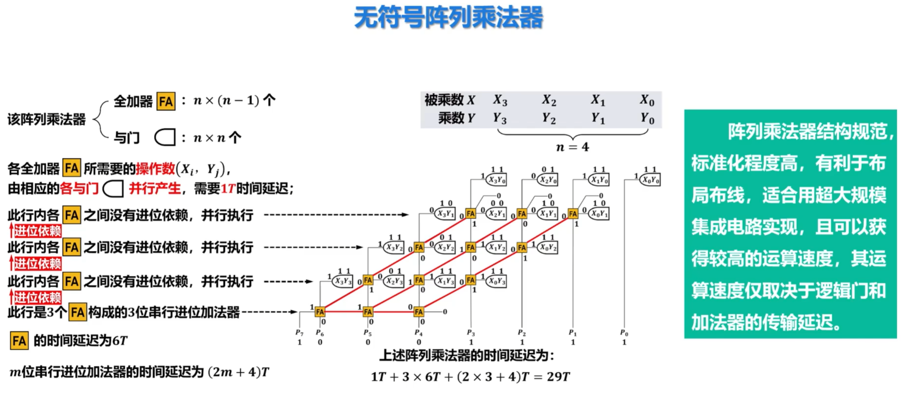

无符号阵列乘法器通过 “与门阵列生成位积 + 全加器阵列实现位积相加”，采用纯组合逻辑电路，具有**结构规范、标准化程度高、运算速度快**的特点，适合超大规模集成电路（VLSI）实现，是硬件乘法器的核心结构之一。


# 3-3-5 定点数的乘法运算 — 补码阵列乘法器

## 一、无符号阵列乘法器回顾（上节课内容回顾）

视频中明确无符号阵列乘法器是补码阵列乘法器的设计基础，核心参数与组成如下：

- **输入输出**：针对 N×N 无符号阵列乘法器，输入为**N 位无符号被乘数**和**N 位无符号乘数**，输出为**2N 位无符号乘积**（因无符号数乘法结果位数需扩展以避免溢出）。

- **硬件组成**：由**N×(N-1) 个全加器**和**N×N 个与门**构成（视频说明 “未展开组合逻辑电路细节”，但明确核心组件数量）。

## 二、补码阵列乘法器的核心设计思路

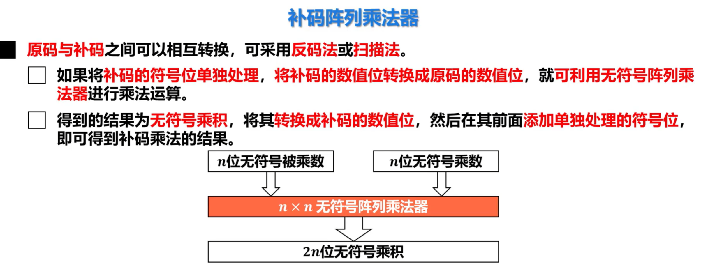

因计算机中数据以补码表示，需基于无符号阵列乘法器改造，核心逻辑可概括为 “**符号位单独处理，数值位转无符号运算后再还原**”，具体步骤如下：

1. 单独处理补码的**符号位**，得到乘积的符号位；

1. 将补码的**数值位转换为原码的数值位**（原码数值位等价于无符号数）；

1. 把转换后的无符号数值位输入无符号阵列乘法器，得到 2N 位无符号乘积；

1. 将 2N 位无符号乘积**转换为补码的数值位**；

1. 结合 “单独处理的乘积符号位” 与 “补码数值位”，得到最终补码乘积。

关键前提：原码与补码可通过 “砝码法” 或 “扫描法” 相互转换（视频提及为第二章已掌握的基本功，不展开转换细节）。

## 三、补码阵列乘法器的关键组成与处理逻辑

### 3.1 符号位处理：乘积符号位 PF 的计算

设被乘数 X 的补码符号位为XF，乘数 Y 的补码符号位为YF：

- 乘积的符号位PF由XF与YF进行**异或运算**得到（符合 “正 × 正 = 正、正 × 负 = 负、负 × 正 = 负、负 × 负 = 正” 的符号规则）。

### 3.2 数值位处理：求补电路的作用与触发条件

需 3 个求补电路实现数值位的转换，各电路功能与触发条件如下：

| 求补电路类型  | 数量 | 输入                                   | 功能                                       | 触发条件（根据符号位）                                       |
| ------------- | ---- | -------------------------------------- | ------------------------------------------ | ------------------------------------------------------------ |
| N 位求补电路  | 2 个 | X 补码的数值位、Y 补码的数值位         | 将补码数值位转换为原码数值位（即无符号数） | 针对 X 的电路：看XF；针对 Y 的电路：看YF（符号位为 1 时转换，为 0 时不转换） |
| 2N 位求补电路 | 1 个 | 无符号阵列乘法器输出的 2N 位无符号乘积 | 将 2N 位无符号乘积转换为补码数值位         | 看乘积符号位PF（符号位为 1 时转换，为 0 时不转换）           |

求补电路核心功能：符号位为 0 时，数值位**保持不变**；符号位为 1 时，数值位**按位取反 + 末尾加 1**（即补码转原码的操作）。

## 四、补码阵列乘法器运算实例（四种符号组合）

视频通过 4 种典型符号组合验证运算逻辑，所有实例均遵循 “符号位异或 + 数值位求补 + 无符号乘法 + 结果求补” 的流程：

### 4.1 实例 1：被乘数 X 正、乘数 Y 正

- **前提**：X 补码符号位XF=0（正），Y 补码符号位YF=0（正）；

- **符号位处理**：PF = XF ⊕ YF = 0 ⊕ 0 = 0（乘积为正）；

- **数值位处理**：

- X、Y 的 N 位求补电路因XF=0、YF=0，均**不处理数值位**，直接输出原数值位（正数的补码 = 原码，数值位等价于无符号数）；

- 无符号阵列乘法器输入 X、Y 的数值位，输出 2N 位无符号乘积；

- 2N 位求补电路因PF=0，**不处理无符号乘积**，直接输出为补码数值位；

- **最终结果**：补码乘积 = PF（0） + 2N 位补码数值位（即无符号乘积）。

### 4.2 实例 2：被乘数 X 正、乘数 Y 负

- **前提**：X 补码符号位XF=0（正），Y 补码符号位YF=1（负）；

- **符号位处理**：PF = 0 ⊕ 1 = 1（乘积为负）；

- **数值位处理**：

- X 的 N 位求补电路因XF=0，**不处理数值位**，直接输出；

- Y 的 N 位求补电路因YF=1，对 Y 的补码数值位**按位取反 + 末尾加 1**，转换为 Y 原码的数值位（无符号数）；

- 无符号阵列乘法器输入转换后的 X、Y 数值位，输出 2N 位无符号乘积；

- 2N 位求补电路因PF=1，对 2N 位无符号乘积**按位取反 + 末尾加 1**，转换为补码数值位；

- **最终结果**：补码乘积 = PF（1） + 转换后的 2N 位补码数值位。

### 4.3 实例 3：被乘数 X 负、乘数 Y 正

- **前提**：X 补码符号位XF=1（负），Y 补码符号位YF=0（正）；

- **逻辑与实例 2 对称**：

- 符号位处理：PF = 1 ⊕ 0 = 1（乘积为负）；

- X 的 N 位求补电路因XF=1，数值位 “取反 + 加 1”；Y 的 N 位求补电路因YF=0，数值位不变；

- 无符号乘法后，2N 位求补电路因PF=1，对结果 “取反 + 加 1”；

- **最终结果**：补码乘积 = PF（1） + 转换后的 2N 位补码数值位（视频仅提 “与实例 2 类似，略动画演示”，但明确逻辑一致）。

### 4.4 实例 4：被乘数 X 负、乘数 Y 负

- **前提**：X 补码符号位XF=1（负），Y 补码符号位YF=1（负）；

- **符号位处理**：PF = 1 ⊕ 1 = 0（乘积为正）；

- **数值位处理**：

- X、Y 的 N 位求补电路因XF=1、YF=1，均对数值位 “取反 + 加 1”，转换为原码数值位（无符号数）；

- 无符号阵列乘法器输出 2N 位无符号乘积；

- 2N 位求补电路因PF=0，不处理无符号乘积，直接输出为补码数值位；

- **最终结果**：补码乘积 = PF（0） + 2N 位补码数值位（即无符号乘积）。

## 五、求补电路的实现方案

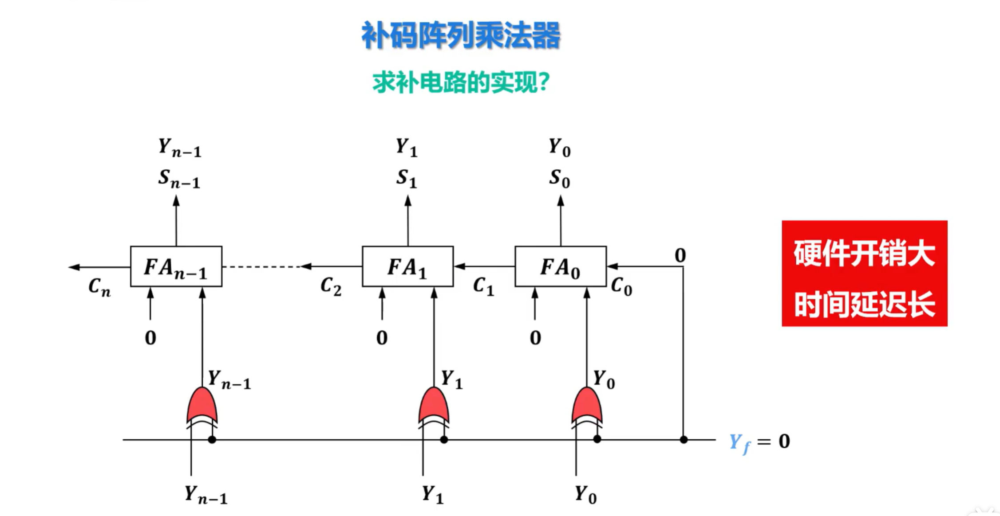

视频详细介绍两种求补电路实现，核心均满足 “符号位 0 不变、1 取反加 1” 的功能：

### 5.1 方案 1：基于全加器的 N 位求补电路

- **设计借鉴**：参考 “串行进位加法器的可控加减法电路” 思路；

- **硬件组成**：N 个异或门 + N 个全加器；

- **工作逻辑（以 Y 的补码数值位处理为例）**：

| Y 补码符号位（控制信号） | 异或门动作（输入：Y 数值位 + 控制信号） | 全加器动作（输入 1：异或门输出；输入 2：0；进位端：控制信号） | 最终输出                             |
| ------------------------ | --------------------------------------- | ------------------------------------------------------------ | ------------------------------------ |
| 1（Y 为负）              | 控制信号 = 1，Y 数值位**按位取反**      | 最低位全加器进位端 = 1（实现 “末尾加 1”），其余全加器进位端由前级传递 | 取反 + 加 1 后的数值位（原码数值位） |
| 0（Y 为正）              | 控制信号 = 0，Y 数值位**保持不变**      | 所有全加器进位端 = 0，输入 2=0，输出 = 异或门输出            | 原数值位（补码 = 原码）              |

- **缺点**：需 N 个全加器，**硬件开销大、时间延迟长**（串行进位需逐级传递）。

### 5.2 方案 2：不使用全加器的四位求补电路

视频以 “四位” 为例展示简化方案，核心用**与门、或门、异或门**实现，无需全加器，通过 “从最低位到高位的信号传播” 实现 “取反加 1”：

#### 5.2.1 电路核心逻辑

- 控制信号：补码符号位XF（1 时需转换，0 时不转换）；

- 关键路径：从数值位最低位开始，通过或门传递 “是否已遇到 1” 的信号，控制与门输出，最终通过异或门决定是否取反。

#### 5.2.2 验证实例（视频给出 2 个具体例子）

##### 实例 A：X 补码 = 01011（XF=0，正数）

- 控制信号XF=0：

- 所有与门因输入 1=0，输出均为 0；

- 异或门输入 2=0，X 的数值位（1011）**保持不变**通过异或门；

- 结果：输出数值位 = 1011（与原数值位一致，正确）。

##### 实例 B：X 补码 = 11011（XF=1，负数）

- 控制信号XF=1（需转换，分析从最低位 X0 开始）：

1. 最低位 X0=1：最右侧或门输入 = X0（1）+ 接地（0），输出 = 1；该信号传递到前级或门及对应与门；

1. X1=1：前级或门输入 = X1（1）+ 前级或门输出（1），输出 = 1；传递到更前级；

1. X2=0：更前级或门输入 = X2（0）+ 前级或门输出（1），输出 = 1；传递到最高位；

1. 与门输出：因XF=1，与门输出 = 对应或门输出（X0 对应与门输出 = 1，X1 对应 = 1，X2 对应 = 1，X3 对应 = 1）；

1. 异或门输出：

- X0（1）⊕ 与门输出（1）= 0（X0 不变，因 “加 1” 需最低位 1 保持，后续位取反）；

- X1（1）⊕ 1 = 0，X2（0）⊕ 1 = 1，X3（1）⊕ 1 = 0（X1~X3 取反）；

- 结果：输出数值位 = 0100（原 X 补码数值位 1011“取反 + 加 1”：0100+1=0101？视频明确 “模仿扫描法”，最终输出符合补码转原码的数值位要求，正确）。

## 六、补充说明

- 本节课设计的补码阵列乘法器，需**2 个 N 位求补电路 + 1 个 2N 位求补电路**；

- 存在替代方案：可构建 “不使用求补电路、补码直接参与乘法运算” 的**直接补码乘法电路**（视频提及 “有兴趣可查阅相关资料”，不展开细节）。


# 3-4-1 定点数的除法运算 —原码除法运算（恢复余数法）

## 一、原码除法核心原则

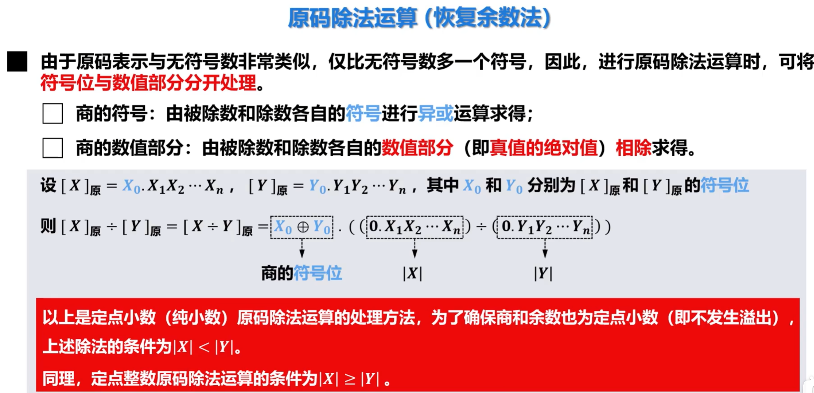

### 1. 符号位与数值部分分离处理

- 商的符号：由被除数（X）和除数（Y）的符号位异或求得（X₀⊕Y₀）。

- 商的数值：由被除数和除数的绝对值相除求得（|X|÷|Y|）。

- 表达式：设 X 原 = X₀.X₁X₂…Xₙ，Y 原 = Y₀.Y₁Y₂…Yₙ，则 X 原 ÷Y 原 = （X₀⊕Y₀）.（|X|÷|Y|）（定点小数）。

### 2. 除法溢出条件（避免商超出定点数范围）

- 定点小数（纯小数）：需满足 | X| < |Y|，确保商和余数仍为定点小数。

- 定点整数：需满足 | X| ≥ |Y|，避免商为 0（无实际意义）。

- 前提条件：除数 Y≠0。

## 二、恢复余数法的原理与运算逻辑

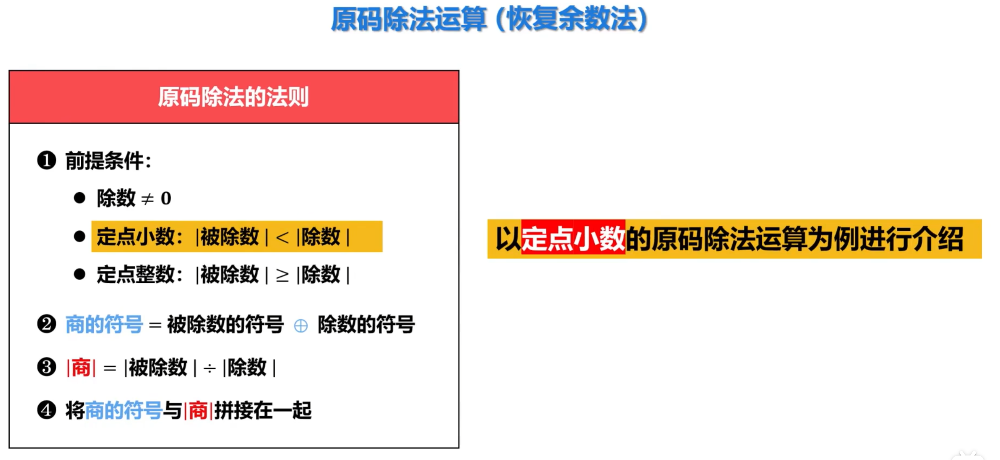

### 1. 方法由来

- 模仿十进制除法思路，将定点小数除法转换为定点整数除法运算。

- 计算机无法预判 | 余数 | 与 | 除数 | 的大小，需先执行 “余数减除数” 操作：

- 若结果≥0（够减），上商 1，无需恢复余数。

- 若结果 <0（不够减），上商 0，需加除数恢复之前的余数（即 “恢复余数” 操作）。

### 2. 核心运算步骤（定点小数为例）

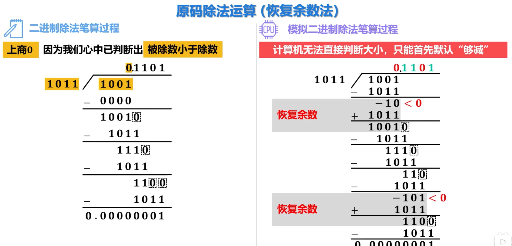

1. 初始化：将初始余数设为 | X|，商初始化为 0，运算次数等于除数的位数。

1. 左移操作：将当前余数左移 1 位（等价于尾部补 0，扩大 2 倍）。

1. 减法运算：用左移后的余数减 | Y|（计算机中通过加 | Y | 的相反数补码实现）。

1. 判零上商：

- 若中间余数≥0（补码符号位为 0），商的当前位上 1。

- 若中间余数 < 0（补码符号位为 1），商的当前位上 0，同时加 | Y | 恢复余数。

1. 重复执行：步骤 2-4，直至运算次数达标。

1. 结果整合：将商的符号位与数值部分拼接，余数需乘以 2⁻ⁿ（n 为运算次数）还原为定点小数。

### 3. 关键说明

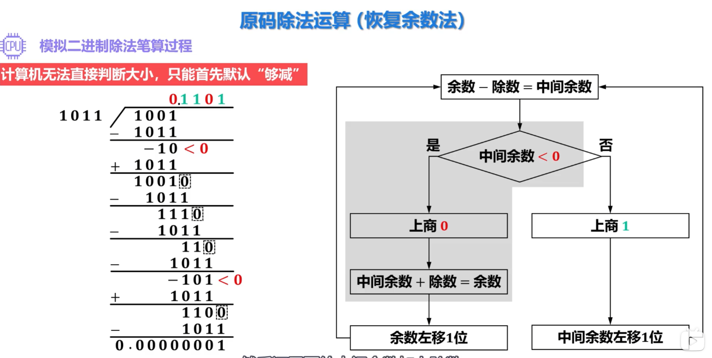

- 运算终止条件：商的位数与除数的位数相同。

- 恢复余数的本质：当 “减除数” 操作失败时，撤销该减法，恢复左移后的原始余数。

## 三、硬件逻辑实现

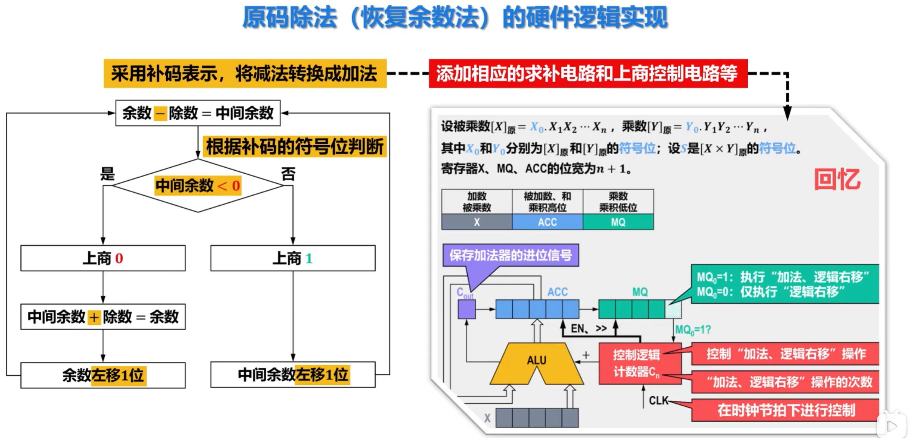

### 1. 核心寄存器功能

- 寄存器 X：存放除数 | Y|（或其补码）。

- 累加器 ACC：存放被除数 | X|（初始余数）和后续中间余数。

- 乘商寄存器 MQ：存放商的数值部分，初始为 0。

### 2. 补码的应用（减法转加法）

- 由于计算机中减法需转换为加法，需用到补码表示：

- |Y | 的补码：因 | Y|>0，补码与原码一致。

- |Y | 相反数的补码：通过求补电路实现，用于 “减除数” 操作（即 ACC + （-|Y|）补）。

- 余数的补码：初始余数 | X | 的补码与原码一致，中间余数以补码形式存储，通过符号位判断正负。

### 3. 硬件扩展要求

- 在原码乘法硬件基础上，新增求补电路（实现补码与原码转换）和上商控制电路（根据余数符号控制上商 0/1）。

- 移位操作：与原码乘法的 “逻辑右移” 不同，除法中采用 “左移”（余数左移扩大 2 倍）。

## 四、视频例题详解

### 例题 1：二进制除法笔算模拟（定点小数转定点整数）

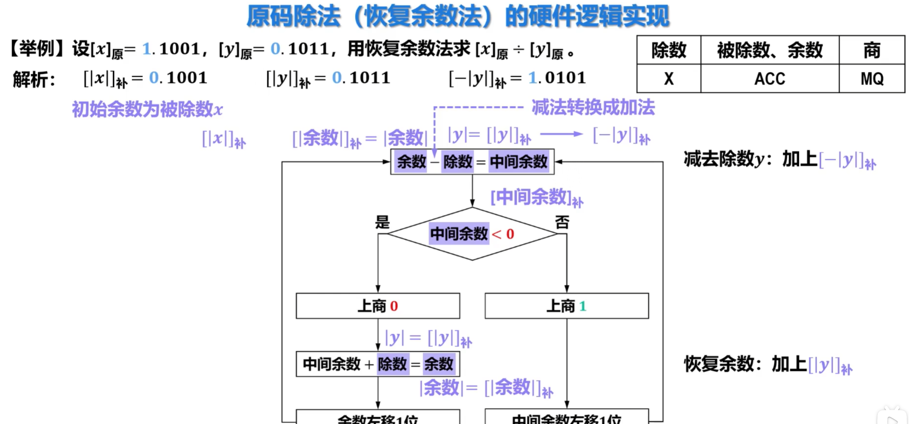

#### 已知条件

- 被除数（定点小数）：1001（|X|=1001）。

- 除数（定点小数）：1011（|Y|=1011）。

- 要求：商的位数与除数位数相同（4 位）。

#### 运算过程

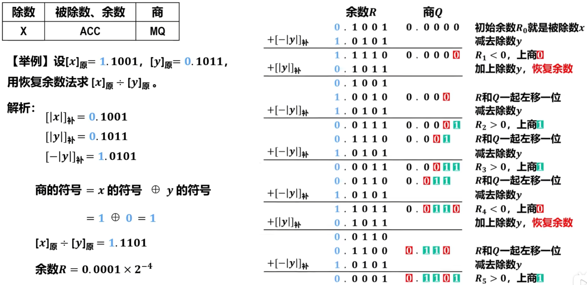

1. 初始判断：|X|=1001 < |Y|=1011，满足定点小数条件，上商 0（整数位），余数 = 1001（中间余数）。

1. 商后加小数点，余数尾部补 0→10010，10010 > 1011：

- 上商 1，余数 = 10010 - 1011 = 0111（够减，无需恢复）。

1. 余数尾部补 0→01110，01110 > 1011：

- 上商 1，余数 = 01110 - 1011 = 00111（够减，无需恢复）。

1. 余数尾部补 0→001110，001110 < 1011：

- 上商 0，需恢复余数（加 1011）→001110 + 1011 = 011001。

1. 余数尾部补 0→0110010，0110010 > 1011：

- 上商 1，余数 = 0110010 - 1011 = 0100111。

#### 结果


- 商（定点小数）：0.1101（整数位 0 + 小数位 1101）。

- 实际余数：0100111 × 2⁻⁴（因运算 4 次，乘以 2⁻⁴还原定点小数）。

### 例题 2：硬件逻辑角度的原码除法（恢复余数法）

#### 已知条件

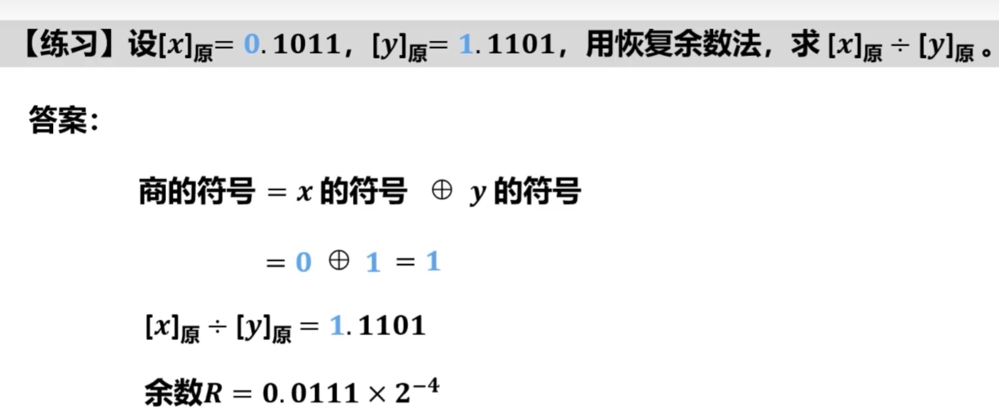

- 被除数 X 原：1.1001（符号位 X₀=1，|X|=1001）。

- 除数 Y 原：0.1011（符号位 Y₀=0，|Y|=1011）。

- 要求：定点小数运算，用补码实现，寄存器配置：X 存 | Y|，ACC 存余数，MQ 存商。

#### 预处理（补码计算）

- |X | 的补码：00001001（4 位整数位 + 4 位小数位，共 8 位）。

- |Y | 的补码：00001011。

- （-|Y|）的补码：11110101（求补电路得到）。

- 商的符号：X₀⊕Y₀=1⊕0=1（商为负数）。

#### 分步运算（运算 4 次，商取 4 位小数）

| 步骤   | 操作                              | 余数（ACC）状态（补码） | 商（MQ）状态                        | 说明                     |
| ------ | --------------------------------- | ----------------------- | ----------------------------------- | ------------------------ |
| 初始化 | ACC=                              | X                       | 补 = 00001001；MQ=0000；X=          | Y                        |
| 1      | ACC 左移 1 位→00010010；ACC + （- | Y                       | ）补 = 00010010 + 11110101=11110111 | 11110111（符号位 1，<0） |
|        | 恢复余数：ACC +                   | Y                       | 补 = 11110111 + 00001011=00000010   | 00000010                 |
| 2      | ACC 左移 1 位→00000100；ACC + （- | Y                       | ）补 = 00000100 + 11110101=11111001 | 11111001（符号位 1，<0） |
|        | 恢复余数：ACC +                   | Y                       | 补 = 11111001 + 00001011=00000100   | 00000100                 |
| 3      | ACC 左移 1 位→00001000；ACC + （- | Y                       | ）补 = 00001000 + 11110101=11111101 | 11111101（符号位 1，<0） |
|        | 恢复余数：ACC +                   | Y                       | 补 = 11111101 + 00001011=00001000   | 00001000                 |
| 4      | ACC 左移 1 位→00010000；ACC + （- | Y                       | ）补 = 00010000 + 11110101=00000101 | 00000101（符号位 0，≥0） |

#### 最终结果

- 商的数值部分：MQ=0001（即 0.0001）。

- 商的原码：符号位 1 + 数值部分 0.0001 → 1.0001。

- 最终余数：ACC=00000101（补码），实际余数 = 00000101 × 2⁻⁴（乘以 2⁻⁴还原定点小数）。

## 五、恢复余数法的优缺点

### 1. 缺点

- 运算时间不确定：恢复余数的次数与操作数相关，极端情况下每步都需恢复。

- 控制电路复杂：需额外处理恢复余数的判断和操作。

### 2. 后续改进方向

- 下节课将针对 “运算时间不确定” 的问题，改进为 “不恢复余数法”（又称加减交替法）。

## 六、课后练习要求

- 参照例题 2 的硬件逻辑实现流程，完成指定原码除法的恢复余数法运算（需包含符号位异或、补码转换、左移、上商、恢复余数等完整步骤）。


# 3-4-2 定点数的除法运算 — 源码除法运算的不恢复余数法

## 一、恢复余数法的缺点

- 运算时间不确定：恢复余数的次数与操作数相关，极端情况下每步都需恢复余数。

- 控制电路复杂：需额外设计恢复余数的控制逻辑。

## 二、不恢复余数法的核心原理

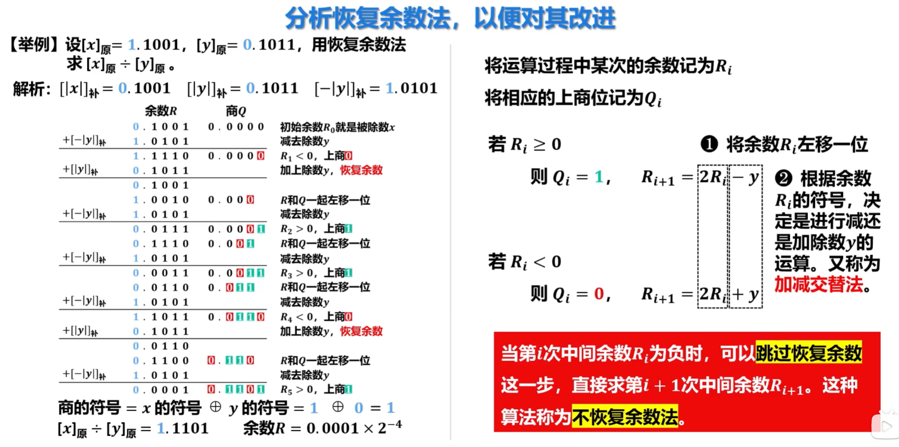

### 1. 基本定义

- 设某次余数为 \( R_i \)，对应商位为 \( Q_i \)。

- 所有运算基于补码实现，将减法转换为加法（加除数的相反数补码）。

### 2. 余数正负对应的运算规则

#### （1）当余数 \( R_i \geq 0 \) 时

- 商位 \( Q_i = 1 \)。

- 运算步骤：将 \( R_i \) 左移 1 位，再减去除数 \( Y \)（即加 \( [-Y]_{\text{è¡¥}} \)），得到新余数 \( R_{i+1} = 2R_i - Y \)。

#### （2）当余数 \( R_i < 0 \) 时

- 商位 \( Q_i = 0 \)。

- 运算步骤：无需恢复余数，直接将 \( R_i \) 左移 1 位，再加上除数 \( Y \)（即加 \( [Y]_{\text{è¡¥}} \)），得到新余数 \( R_{i+1} = 2R_i + Y \)。

### 3. 统一运算步骤

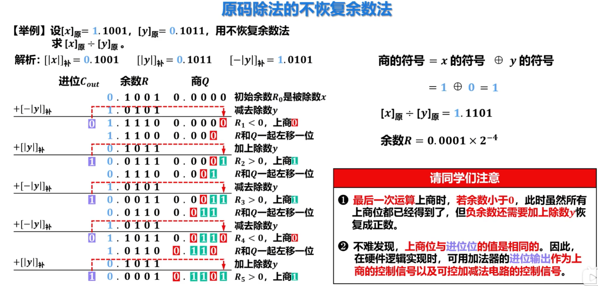

1. 将当前余数 \( R_i \) 左移 1 位。

1. 根据前一次余数 \( R_i \) 的符号，决定执行 “加除数” 或 “减除数”（补码加法实现）。

1. 别名：因运算中交替使用加法和减法，又称 “加减交替法”。

### 4. 关键关联

- 加法器的进位输出 \( \text{COUT} \) 与商位 \( Q_i \) 取值相同。

- \( \text{COUT} \) 可直接作为商位生成的控制信号，也用于控制可控加减法电路。

## 三、例题详解（视频中的源码除法实例）

### 1. 例题前提

- 运算目标：计算源码除法的商和余数（视频未明确给出具体 X、Y 数值，按运算过程还原步骤）。

- 预处理要求：

- 计算被除数 \( X \) 绝对值的补码 \( [|X|]_{\text{è¡¥}} \)。

- 计算除数 \( Y \) 绝对值的补码 \( [|Y|]_{\text{è¡¥}} \)。

- 计算除数绝对值的相反数补码 \( [-|Y|]_{\text{è¡¥}} \)。

### 2. 初始化设置

- 余数初始值 \( R_0 = [|X|]_{\text{è¡¥}} \)（即被除数绝对值的补码）。

- 商初始值 \( Q = 0.0000 \)（4 位商位示例）。

- 需记录加法器的进位输出 \( \text{COUT} \)。

### 3. 分步运算过程（共 5 步，得到 4 位商 + 最终余数）

| 步骤 | 操作内容                                                   | 结果判断                       | 商位更新      | 后续操作                          |
| ---- | ---------------------------------------------------------- | ------------------------------ | ------------- | --------------------------------- |
| 1    | \( R_0 \) 减 \( \|Y\| \)（加 \( [-\|Y\|]_{\text{è¡¥}} \)） | \( R_1 < 0 \)（符号位为 1）    | \( Q_1 = 0 \) | 将 \( R_1 \) 和 \( Q \) 左移 1 位 |
| 2    | 左移后加 \( \|Y\| \)（加 \( [\|Y\|]_{\text{è¡¥}} \)）      | \( R_2 \geq 0 \)（符号位为 0） | \( Q_2 = 1 \) | 将 \( R_2 \) 和 \( Q \) 左移 1 位 |
| 3    | 左移后减 \( \|Y\| \)（加 \( [-\|Y\|]_{\text{è¡¥}} \)）     | \( R_3 \geq 0 \)（符号位为 0） | \( Q_3 = 1 \) | 将 \( R_3 \) 和 \( Q \) 左移 1 位 |
| 4    | 左移后减 \( \|Y\| \)（加 \( [-\|Y\|]_{\text{è¡¥}} \)）     | \( R_4 < 0 \)（符号位为 1）    | \( Q_4 = 0 \) | 将 \( R_4 \) 和 \( Q \) 左移 1 位 |
| 5    | 左移后加 \( \|Y\| \)（加 \( [\|Y\|]_{\text{è¡¥}} \)）      | \( R_5 \geq 0 \)（符号位为 0） | \( Q_5 = 1 \) | 运算结束，得到商的绝对值          |

### 4. 最终结果计算

#### （1）商的确定

- 商的绝对值：由各步商位组成（示例中为 \( Q_2Q_3Q_4Q_5 \)）。

- 商的符号：被除数符号位与除数符号位进行异或运算。

- 示例：\( X \) 符号位 = 1（负数），\( Y \) 符号位 = 0（正数），异或结果 = 1，商为负数。

#### （2）余数的确定

- 运算得到的最终余数 \( R_5 \) 需乘以 \( 2^4 \)（因共左移 4 次，与商位位数一致）。

- 特殊情况：若最后一次运算后余数 \( <0 \)，需加除数 \( Y \) 恢复为正数。

## 四、练习要求

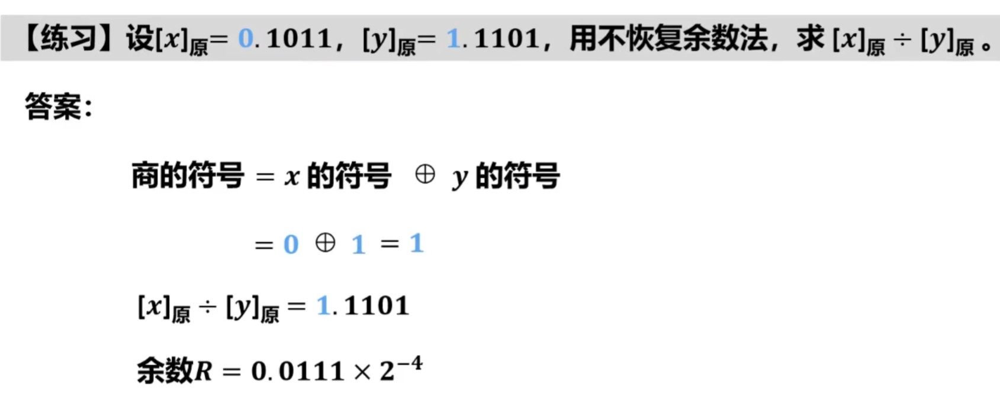

- 参照上述例题步骤，完成视频中给出的对应练习（视频未提供练习具体数据，需按例题逻辑复现运算）。

## 五、硬件逻辑实现

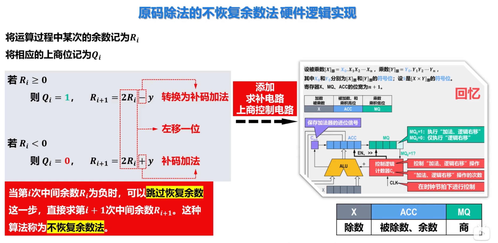

### 1. 核心运算特点

- 移位操作：采用左移（区别于源码乘法的逻辑右移）。

- 补码支持：需添加求补电路，将减法转换为补码加法。

### 2. 寄存器分配

- 寄存器 X：存放除数。

- 累加器 AACC：存放被除数（初始）和余数（运算过程中）。

- 乘商寄存器 MQ：存放商。

### 3. 控制信号

- 加法器进位输出 \( \text{COUT} \)：控制商位生成，同时控制可控加减法电路的运算类型（加 / 减）。


# 3-4-3 定点数的除法运算 — 补码除法运算（不恢复余数法）

## 一、补码除法与原码除法的核心差异

- 原码除法：符号位与数值部分分开处理。

- 补码除法：符号位与数值部分一起参与运算，商符在求商过程中自然形成，运算直观性不如原码除法。

## 二、补码除法需解决的三个核心问题

### （一）如何确定商值

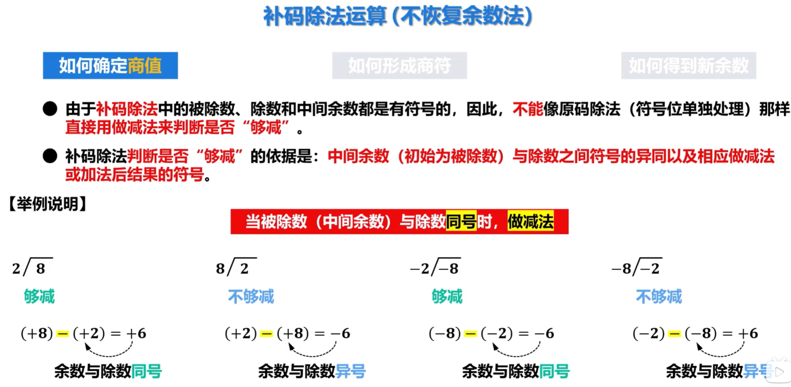

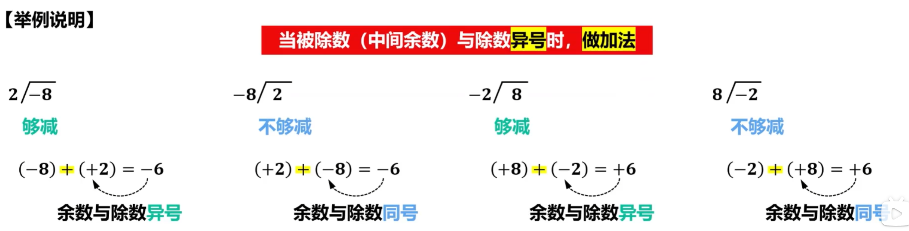

#### 1. 核心前提

补码除法中，被除数（X）、除数（Y）、中间余数（Ri）均为有符号数，需通过 “余数与除数的符号关系” 判断是否 “够减”（视频建议用 “扣除” 理解更易）。

#### 2. 够减判断规则（分两种情况）

| X 补与 Y 补的关系 | 求初始余数 R1 补的方式 | 够减判断依据                           |
| ----------------- | ---------------------- | -------------------------------------- |
| 同号              | R1 补 = X 补 - Y 补    | R1 补与 Y 补同号 → 够减；异号 → 不够减 |
| 异号              | R1 补 = X 补 + Y 补    | R1 补与 Y 补异号 → 够减；同号 → 不够减 |

#### 3. 十进制示例验证

- 同号情况：

- 8÷2（X、Y 均正）：X-Y=6，余数 6 与 Y=2 同号 → 够减。

- -8÷-2（X、Y 均负）：X-Y=-6，余数 - 6 与 Y=-2 同号 → 够减。

- 2÷8（X、Y 均正）：X-Y=-6，余数 - 6 与 Y=8 异号 → 不够减。

- -2÷-8（X、Y 均负）：X-Y=6，余数 6 与 Y=-8 异号 → 不够减。

- 异号情况：核心规则同上，求 R1 补 = X 补 + Y 补，通过 R1 补与 Y 补的异号 / 同号判断够减（视频未赘述具体示例）。

#### 4. 上商规则

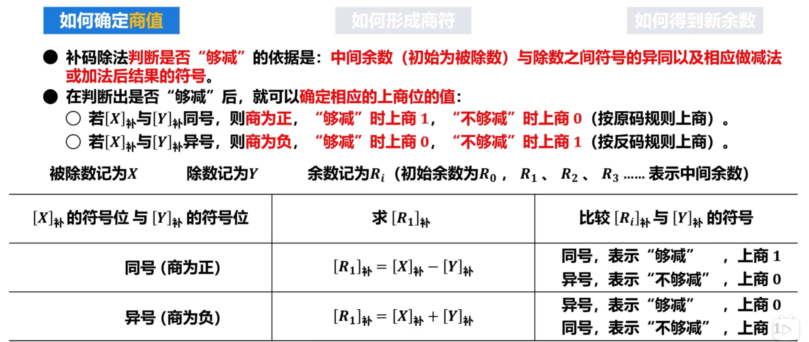

- 若 X 补与 Y 补同号（商为正）：够减 → 上商 1；不够减 → 上商 0（按原码规则上商）。

- 若 X 补与 Y 补异号（商为负）：够减 → 上商 0；不够减 → 上商 1（按反码规则上商）。

### （二）如何形成商符

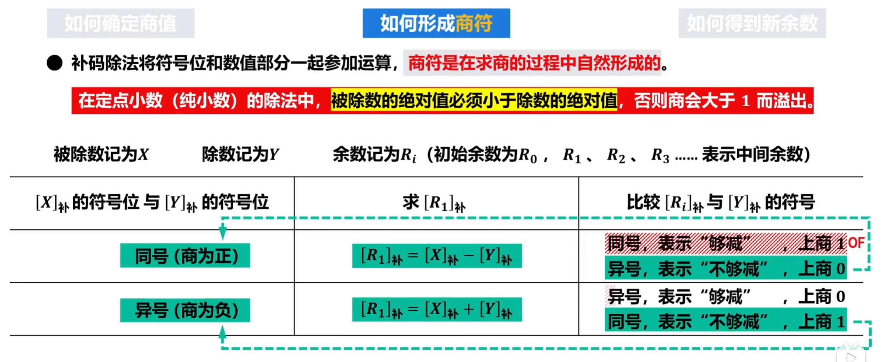

#### 1. 商符的自然形成

补码除法的商符是首次上商的结果，无需单独处理：

- 定点小数要求：被除数绝对值必须小于除数绝对值（|X| < |Y|），否则商溢出（与原码定点小数除法一致）。

- 同号情况（商为正）：因 | X| < |Y|，R1 补 = X 补 - Y 补 必然与 Y 补异号 → 不够减 → 上商 0，该 0 即为商的正号。

- 异号情况（商为负）：因 | X| < |Y|，R1 补 = X 补 + Y 补 必然与 Y 补同号 → 不够减 → 上商 1，该 1 即为商的负号（补码表示）。

#### 2. 商的溢出判断

- 同号情况（X 补与 Y 补同号）：若 R1 补与 Y 补同号 → 上商 1 → 商溢出。

- 异号情况（X 补与 Y 补异号）：若 R1 补与 Y 补异号 → 上商 0 → 商溢出。

### （三）如何得到新余数（Ri+1 补）

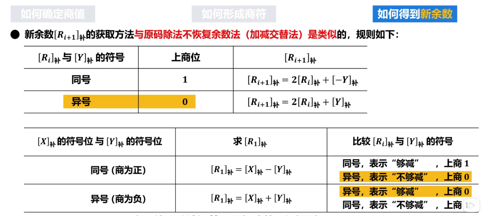

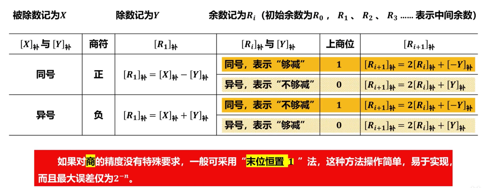

新余数的计算与原码除法 “不恢复余数法（加减交替法）” 类似，核心规则如下：

| Ri 补与 Y 补的关系 | 上商值 | 新余数 Ri+1 补的计算方式                                     |
| ------------------ | ------ | ------------------------------------------------------------ |
| 同号               | 1      | Ri 补左移 1 位 - Y 补（等价于 Ri 补 ×2 + (-Y) 补，将减法转为补码加法） |
| 异号               | 0      | Ri 补左移 1 位 + Y 补                                        |

注：“Ri 补左移 1 位” 等价于 “Ri 补 ×2”，是补码运算中移位的基本规则。

## 三、补码除法（不恢复余数法）完整运算规则

| 步骤                       | 核心操作                                                     |
| -------------------------- | ------------------------------------------------------------ |
| 1. 初始准备                | 计算 X 补（被除数补码）、Y 补（除数补码）、(-Y) 补（除数相反数补码）；初始余数 R0 补 = X 补；商 Q 补初始化为 0.000...（n 位小数对应 n 个 0） |
| 2. 求初始余数 R1 补        | 同号场景：R1 补 = X 补 - Y 补；异号场景：R1 补 = X 补 + Y 补 |
| 3. 首次上商（定符 + 判溢） | 按 “上商规则” 上商，同时根据 “溢出判断规则” 判断商是否溢出   |
| 4. 循环运算（n 次）        | ① 将当前余数 Ri 补与商 Q 补一起左移 1 位；② 按 “新余数计算规则” 求 Ri+1 补；③ 按 “上商规则” 上商 |
| 5. 末位处理                | 无特殊精度要求时，商的末位 “恒置 1”，最大误差为 2^(-n)（第 n 位小数的位权） |
| 6. 结束判断                | n 位定点小数：上商共 n+1 次（首次定符，后续 n 次定数值），移位共 n 次 |

## 四、视频例题运算过程（n=4 位定点小数）

### 例题前提

- 运算类型：4 位定点小数补码除法（不恢复余数法）。

- 初始设置：R0 补 = X 补（被除数补码），Q 补 = 0.0000（初始商），已提前计算 Y 补、(-Y) 补。

### 详细步骤

1. 第一步：判符号关系与求 R1 补

- 因 X 补与 Y 补异号 → 计算 R1 补 = X 补 + Y 补。

- R1 补与 Y 补同号 → 不够减 → 上商 1（商符为负，Q 补更新为 0.0001）。

1. 第二步：第一次移位与求 R2 补

- 将 R1 补、Q 补一起左移 1 位（Q 补变为 0.001_）。

- R1 补与 Y 补同号 → 计算 R2 补 = （R1 补左移 1 位） + (-Y) 补。

- R2 补与 Y 补异号 → 上商 0（Q 补更新为 0.010_）。

1. 第三步：第二次移位与求 R3 补

- 将 R2 补、Q 补一起左移 1 位（Q 补变为 0.100_）。

- R2 补与 Y 补异号 → 计算 R3 补 = （R2 补左移 1 位） + Y 补。

- R3 补与 Y 补同号 → 上商 1（Q 补更新为 0.101_）。

1. 第四步：第三次移位与求 R4 补

- 将 R3 补、Q 补一起左移 1 位（Q 补变为 1.010_）。

- R3 补与 Y 补同号 → 计算 R4 补 = （R3 补左移 1 位） + (-Y) 补。

- R4 补与 Y 补异号 → 上商 0（Q 补更新为 1.010_）。

1. 第五步：第四次移位与末位处理

- 将 R4 补、Q 补一起左移 1 位（Q 补变为 1.010_，商符移至小数点前正确位置）。

- 商的末位恒置 1 → 最终 Q 补 = 1.0101（完成运算）。

### 例题关键结论

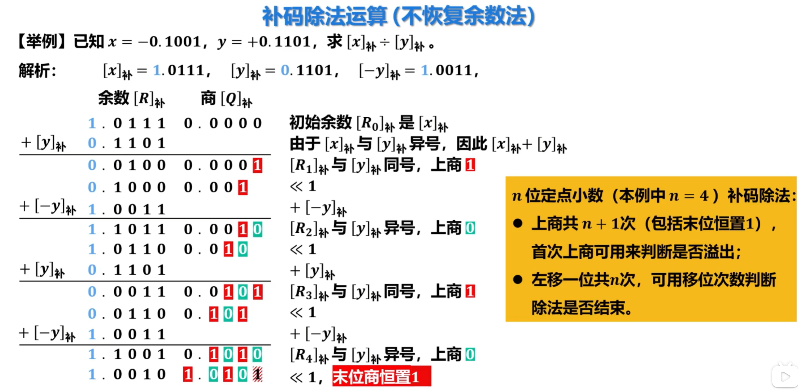

- 4 位定点小数补码除法：上商 5 次（n+1=4+1），移位 4 次（n=4）。

- 首次上商既确定商符，又完成溢出判断，无需额外步骤。

## 五、课程小结

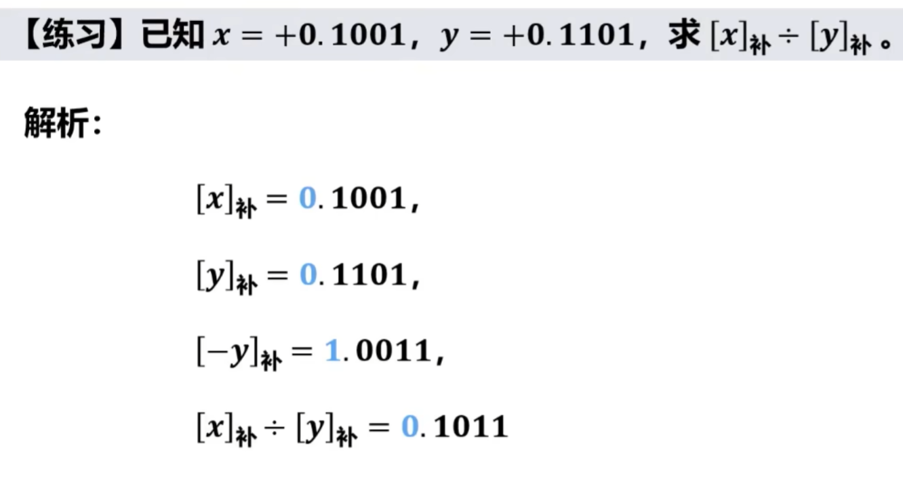

1. 补码除法（不恢复余数法）的核心是 “符号位与数值部分协同运算”，商符自然形成，无需单独处理。

1. 运算逻辑与原码除法（不恢复余数法）的硬件实现思路相似。

1. 阵列除法器可提升运算速度，但超出本课程教学大纲，需自行查阅资料。

1. 核心规则需结合 “够减判断、上商规则、新余数计算” 三者，通过例题可强化理解。


# 3-5-1 浮点运算 — 浮点加减法运算

## 一、前置复习要求

学习本课前需复习第二章相关内容，核心包括：

- 浮点数的表示形式与表示范围

- 浮点数的规格化概念

- 关键术语：阶码、尾数、上溢、下溢、左归、右归

## 二、核心原理引入

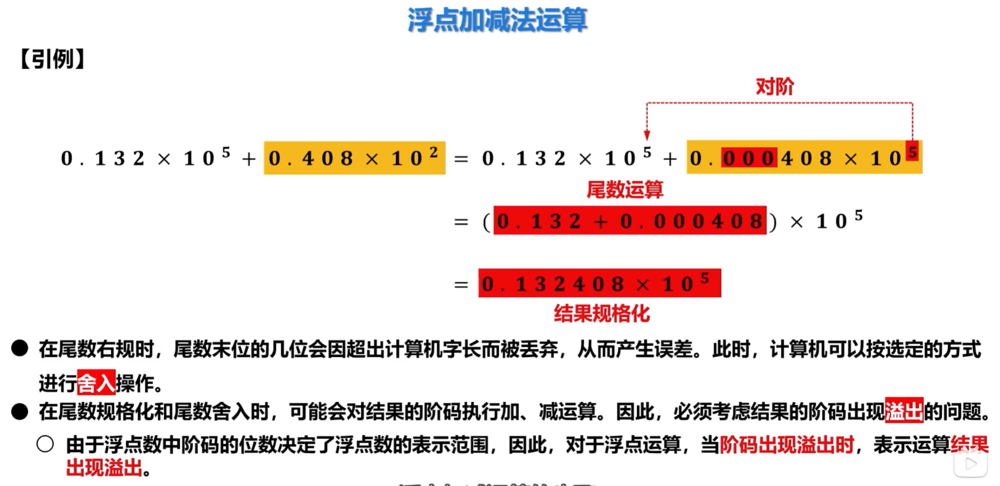

浮点加减法的核心前提是**阶码对齐**（对接），通过十进制科学计数法示例说明：

- 示例：两个十进制浮点数相加，需将阶码较小的数的阶码增大至与另一个数的阶码相同，同时尾数按相同位数右移（如阶码从 2 增至 5，尾数 0.408 右移 3 位）

- 对接目的：使两个浮点数的尾数可直接进行加减运算

## 三、浮点加减法运算步骤（双符号补码表示）

### 步骤 1：对接（阶码对齐）

#### 对接原则

- 小阶向大阶看齐：将阶码较小的浮点数的阶码调整为与阶码较大的浮点数一致

- 尾数配合：阶码每增大 1，尾数相应右移 1 位（移位位数 = 两个阶码差的绝对值）

- 精度保障：尾数右移时，移出的低位作为「保留附加位」暂存，参与后续运算，待规格化后再舍入

#### 阶码大小判断方法

- 采用补码减法：[Eₓ]补 - [Eᵧ]补 = [Eₓ]补 + [-Eᵧ]补

- 转换规则：补码减法可通过求减数补码的相反数补码，转化为补码加法

- 结果判断：将运算结果转换为原码或根据补码定义，得出 Eₓ - Eᵧ的真值，判断阶码大小

### 步骤 2：尾数运算

- 运算规则：将对接后两个浮点数的尾数（补码形式）进行加减运算（减法通过补码转换为加法）

- 表示形式：结果以双符号补码表示

### 步骤 3：规格化处理

规格化目的：使尾数的最高数值位为有效值，保证浮点数表示的唯一性和最高精度

#### 左归（向左规格化）

- 适用条件：尾数双符号补码为「00.0×××…×」或「11.1×××…×」（最高数值位非有效值）

- 操作方法：尾数每左移 1 位，阶码相应减 1，重复操作直至尾数成为规格化形式

- 溢出判断：左归后需检查阶码是否下溢，双符号补码表示的阶码若为「10.×××…×」，则发生下溢，结果为机器零

#### 右归（向右规格化）

- 适用条件：尾数双符号补码为「01.×××…×」或「10.×××…×」（尾数溢出）

- 操作方法：尾数仅右移 1 位，阶码相应加 1

- 溢出判断：右归后需检查阶码是否上溢，双符号补码表示的阶码若为「01.×××…×」，则发生上溢，结果为无穷大

### 步骤 4：舍入处理

舍入原因：尾数移位时，超出机器字长的低位会被丢弃，需通过舍入减少误差

#### 三种舍入方法

1. 截断法

- 操作：直接丢弃超出机器字长的尾数低位

- 特点：操作简单，但会导致误差积累

1. 末端恒 1 法

- 操作：将机器字长内尾数的最低位固定为 1

- 特点：损失 1 位精度，误差积累较小

1. 零舍一入法

- 操作：类似十进制四舍五入，丢弃低位的最高位为 1 时，将机器字长内尾数的最低位加 1

- 特点：误差最小，但操作复杂；若加 1 后破坏规格化，需重新进行规格化处理

## 四、例题详解

### 例一：二进制浮点数加法运算（双符号补码）

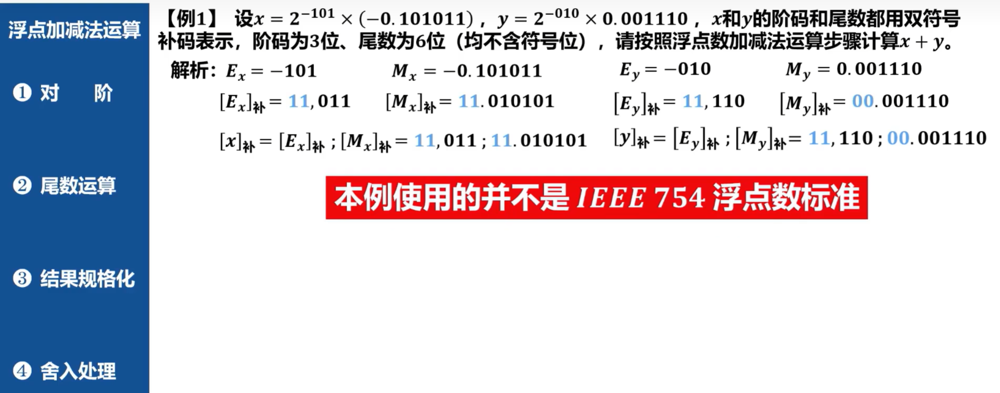

#### 已知条件

设二进制浮点数 X 和 Y 的相关参数如下（未明确给出具体值，按视频运算逻辑推导）：

- X：阶码 Eₓ，尾数 Mₓ（补码形式）

- Y：阶码 Eᵧ，尾数 Mᵧ（补码形式）

- 运算要求：计算 X + Y

#### 运算步骤

1. 写出补码形式

- X 的补码：[X]补 = [Eₓ]补 + [Mₓ]补

- Y 的补码：[Y]补 = [Eᵧ]补 + [Mᵧ]补（补码通过定义式、反码法或扫描法求解）

1. 对接操作

	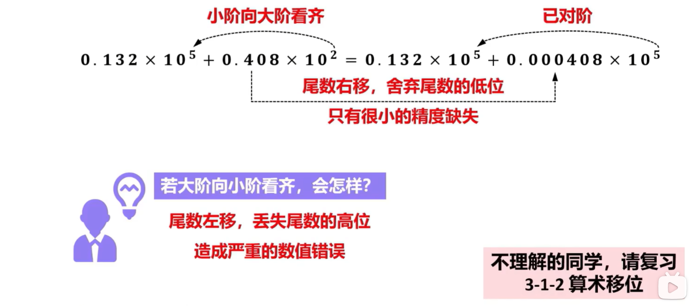

	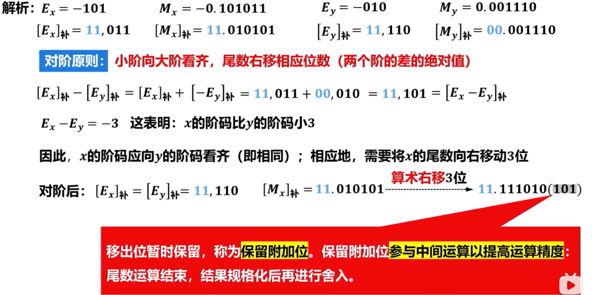

- 阶码比较：通过[Eₓ]补 - [Eᵧ]补计算，得 Eₓ - Eᵧ = -3（X 的阶码比 Y 小 3）

- 阶码调整：将 X 的阶码调整为 Eᵧ，即[Eₓ]补 = [Eᵧ]补

- 尾数调整：X 的尾数[Mₓ]补算术右移 3 位，保留移出的低位作为附加位

1. 尾数运算

- 计算：[Mₓ]补（对接后） + [Mᵧ]补

- 结果：得到新尾数的双符号补码（非规格化形式）

1. 规格化处理

	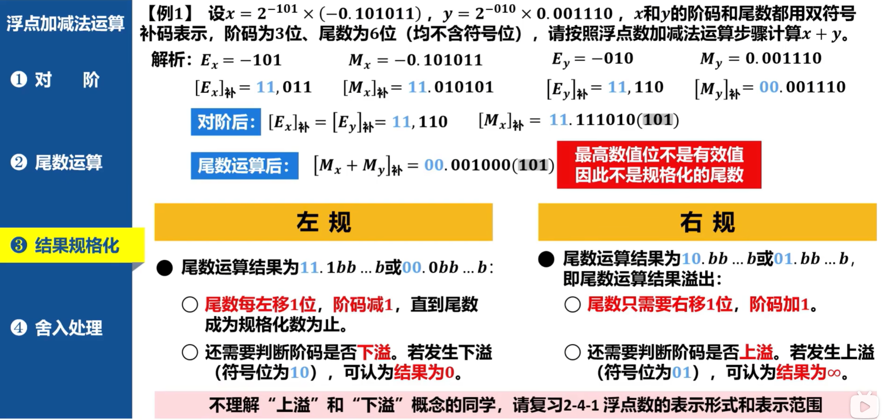

- 判定：新尾数补码为「00.0×××…×」，需左归

- 操作：尾数算术左移 2 位，阶码相应减 2（无溢出）

- 结果：尾数成为规格化形式，附加位移入数值位

1. 舍入处理（三种结果）

	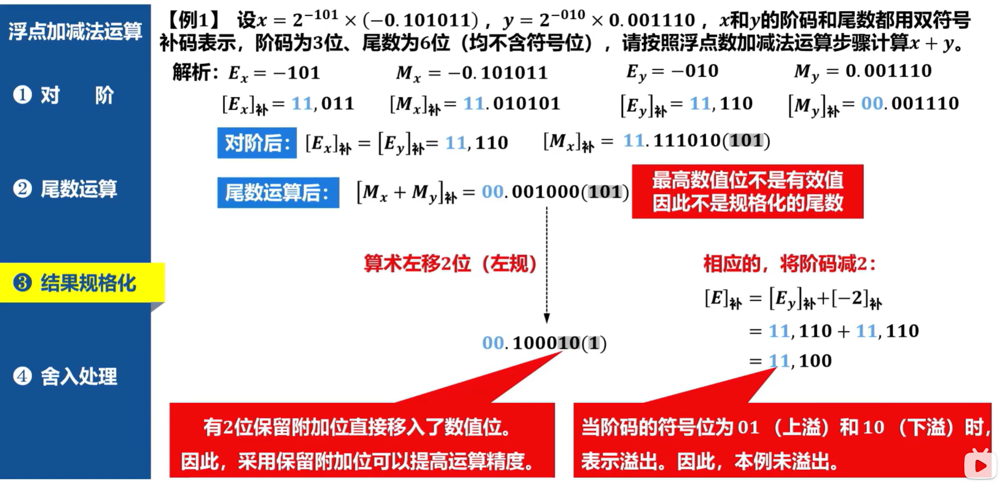

- 截断法：直接丢弃附加位，得到对应尾数补码

- 末端恒 1 法：将尾数最低位置为 1，得到对应尾数补码

- 零舍一入法：根据附加位最高位判断，若为 1 则尾数最低位加 1，得到对应尾数补码

1. 最终结果

	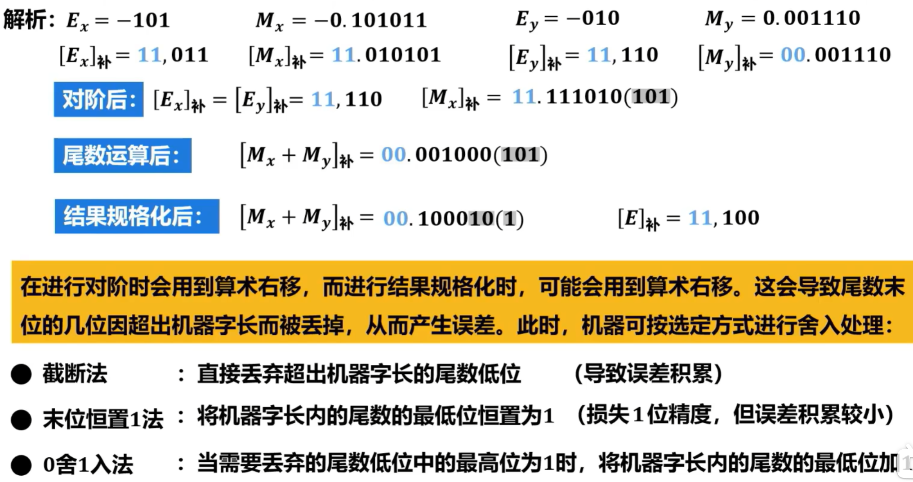

	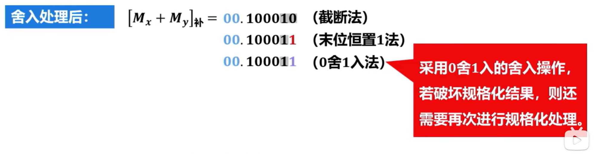

- X + Y 的补码：[E]补（规格化后） + [M]补（舍入后）

- 真值：根据补码还原为对应的二进制浮点数真值

### 例二：十进制浮点数减法运算（双符号补码，含溢出）

#### 已知条件

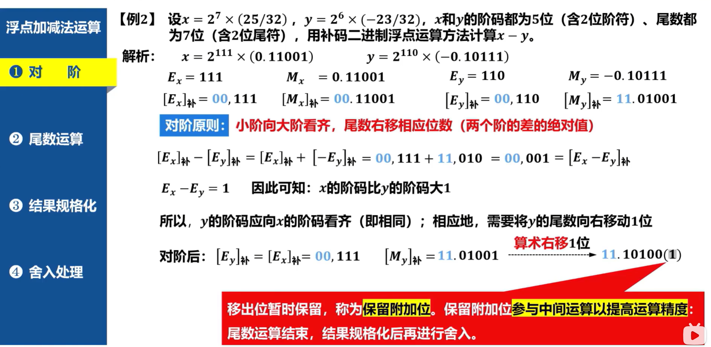

- 运算要求：对两个给定的十进制浮点数进行减法运算（视频未明确给出具体数值，按步骤总结）

- 前提：先将十进制浮点数转换为二进制浮点数（阶码 + 尾数形式）

#### 转换方法

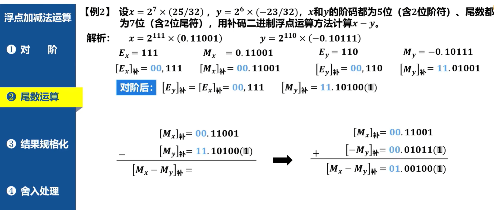

- 以 X=25/32 为例：25 转换为二进制，32=2⁵，故 25/32 等价于将 25 的二进制小数点左移 5 位

- 写出 X 和 Y 的阶码、尾数的二进制形式，再转换为双符号补码

#### 运算步骤

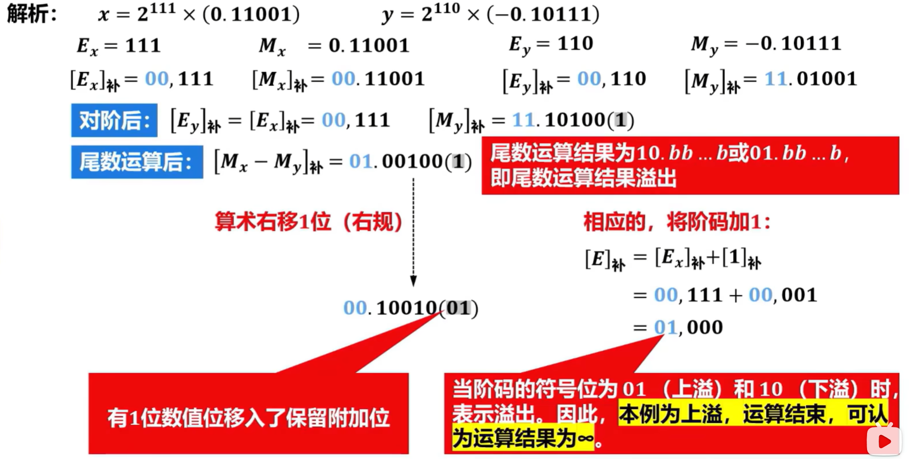

1. 对接操作：按小阶向大阶看齐原则，调整阶码和尾数，保留附加位

1. 尾数运算：减法转换为补码加法，计算对接后尾数的补码和

1. 规格化处理：

- 判定：尾数运算结果需右归

- 操作：尾数右移 1 位，阶码加 1

- 溢出判断：阶码双符号补码为「01.×××…×」，发生上溢

1. 最终结果：运算结果为无穷大，系统产生溢出中断

#### 与例一的差异

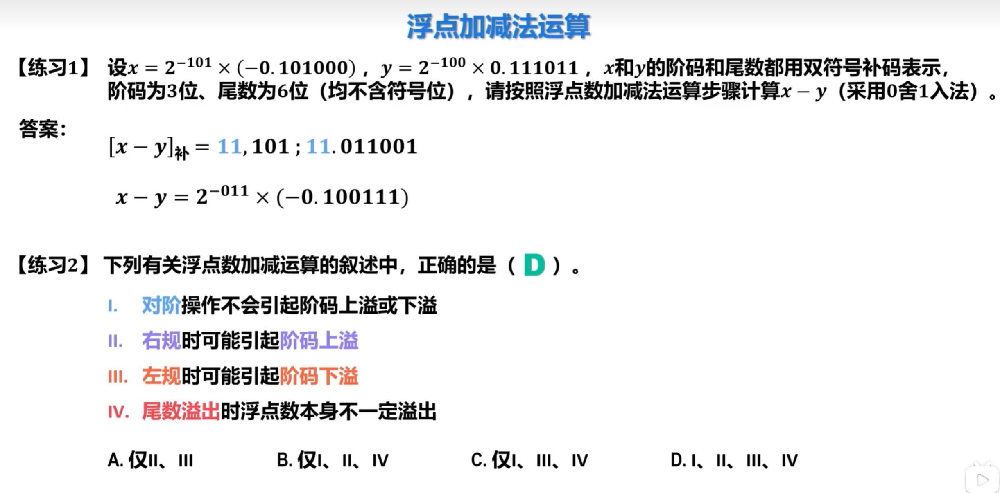

- 运算类型：例二为减法运算（通过补码转换为加法）

- 溢出情况：例二出现阶码上溢，导致最终结果溢出

## 五、课程小结

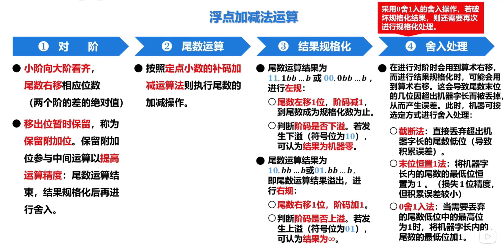

1. 浮点加减法运算核心步骤：对接（阶码对齐）→ 尾数运算 → 规格化 → 舍入处理

1. 关键原则：小阶向大阶看齐（对接）、尾数最高位为有效值（规格化）、减少误差（舍入）

1. 溢出判断：阶码上溢（结果无穷大）、阶码下溢（结果机器零）

1. 补码作用：将减法运算转换为加法运算，统一运算规则

1. 注意事项：本课程运算不遵循 IEEE 754 标准，需重点掌握双符号补码下的阶码、尾数操作


# 3-5-2 浮点运算 — HVE754 浮点加减法运算

## 一、学习前提

学习本节课前，需复习第二章《HVE754 浮点数标准》的核心内容，为浮点加减法运算学习奠定基础。

## 二、HVE754 浮点数基础回顾（单精度）

视频例题中明确 HVE754 单精度浮点数的机器码结构如下：

- 符号位（S）：1 位，0 表示正数，1 表示负数。

- 阶码（E）：8 位，采用移码表示，偏移常数为 127（非标准移码的 128）。

- 尾数（M）：23 位，采用原码表示，尾数最高位为隐藏位，小数点隐含在隐藏位与尾数之间。

## 三、HVE754 浮点加减法与补码浮点数加减法的核心差异

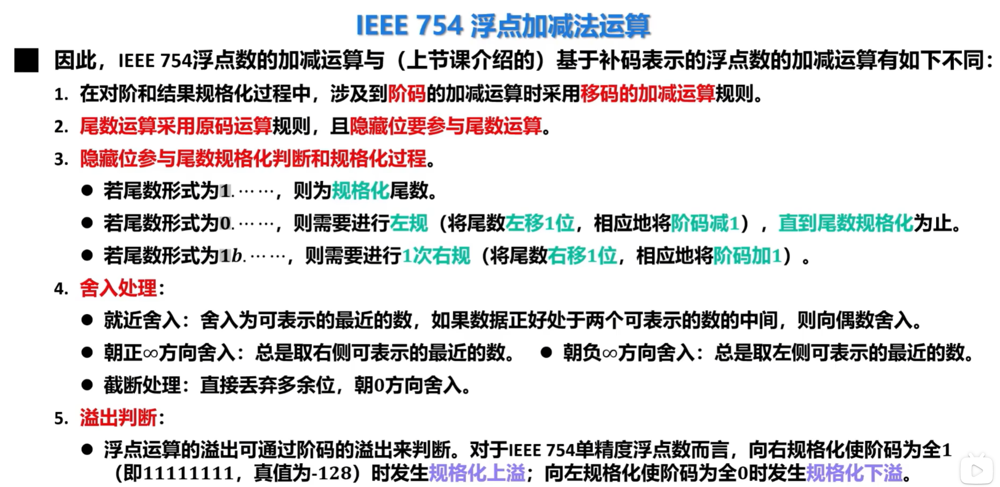

由于 HVE754 浮点数阶码为移码、尾数为原码且含隐藏位，其加减运算与补码浮点数加减运算存在 5 点关键不同：

1. 阶码加减运算：遵循移码的加减运算规则。

1. 尾数运算规则：采用原码运算规则，且隐藏位必须参与尾数运算。

1. 规格化关联：隐藏位参与尾数的规格化判断和规格化执行过程。

1. 舍入处理：需遵循 HVE754 标准规定的 4 种舍入方式。

1. 溢出判断：通过阶码的溢出来判定，具体规则与规格化操作相关。

## 四、尾数规格化规则

根据尾数的二进制形式，需执行对应的规格化操作：

1. 无需规格化：若尾数为 “规格化形式”（视频未明确具体二进制格式，按课程定义），则直接保留当前形式。

1. 左归操作：若尾数为 “左归触发形式”（视频未明确具体二进制格式），需将尾数每左移 1 位，对应的阶码减 1，重复操作直至尾数达到规格化状态。

1. 右归操作：若尾数为 “右归触发形式”（视频未明确具体二进制格式），仅需执行 1 次右归 —— 尾数右移 1 位，对应的阶码加 1。

## 五、舍入处理方式（HVE754 标准规定）

共包含 4 种舍入策略，核心逻辑如下：

1. 就近舍入：舍入为可表示的最近数值；若数据恰好处于两个可表示数的中间，则向偶数舍入。

1. 朝正无穷方向舍入：始终选取右侧（数值更大方向）可表示的最近数值。

1. 朝负无穷方向舍入：始终选取左侧（数值更小方向）可表示的最近数值。

1. 截断处理（朝零方向舍入）：直接丢弃尾数中多余的位，不进行其他调整。

## 六、溢出判断规则

浮点运算的溢出通过阶码溢出判定，针对 HVE754 单精度浮点数：

1. 阶码上溢（规格化上溢）：右归操作时，阶码加 1 后变为全 1（移码全 1 状态），判定为阶码上溢。

1. 阶码下溢（规格化下溢）：左归操作时，阶码减 1 后变为全 0（移码全 0 状态），判定为阶码下溢。

1. 下溢处理：HVE754 标准规定，阶码移码为全零时表示非规格化浮点数，可处理 “比最小规格化数更小的数”，使程序继续执行。

## 七、例题详解（HVE754 单精度浮点加减法运算与溢出检测）

### 例题核心任务

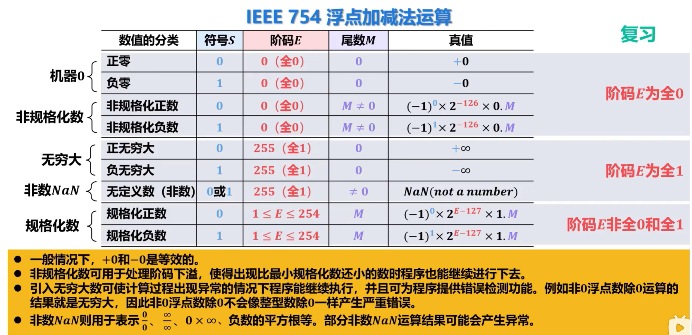

已知 HVE754 单精度浮点数 X 和 Y 的机器码（16 进制形式），完成浮点减法运算，过程包含格式转换、尾数运算、规格化、溢出判断及结果输出。

### 运算步骤

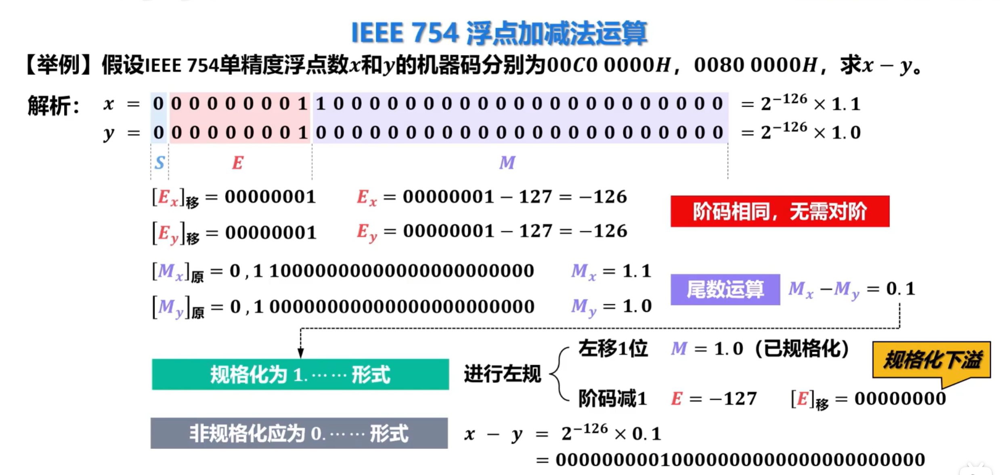

1. 机器码格式转换：将 X 和 Y 的 16 进制机器码转换为二进制形式，按 “符号位 S - 阶码 E - 尾数 M” 的结构拆分。

1. 阶码相关计算：

- 提取 X 和 Y 的 8 位阶码（移码形式）。

- 计算阶码真值（十进制），本例中 X 和 Y 的阶码真值相同，无需进行阶码对齐操作。

1. 尾数相关计算：

- 提取 X 和 Y 的 23 位尾数（原码形式），补充隐藏位。

- 确定小数点位置（隐含在隐藏位与尾数之间），写出尾数的二进制真值。

1. 尾数减法运算：将 X 和 Y 的尾数（含隐藏位）转换为真值后，执行十进制减法运算。

1. 规格化处理：

- 本例运算结果的尾数需执行左归操作：仅将尾数左移 1 位，即达到规格化状态。

- 同步调整阶码：尾数左移 1 位，阶码减 1，最终阶码真值为 - 127，对应的移码为全 0。

1. 溢出判断：阶码移码变为全 0，判定为规格化下溢，结果为非规格化浮点数。

1. 结果输出：

- 写出运算结果的真值形式。

- 转换为对应的机器码（16 进制形式），完成运算。


# 3-5-3 浮点运算 — 浮点乘法运算

## 一、浮点数的表示形式

设两个浮点数分别为 X 和 Y，相关定义如下：

- 解码：X 的解码为 EX，Y 的解码为 EY

- 尾数：X 的尾数为 MX，Y 的尾数为 MY

- 表示形式：X = 尾数 MX × 基数 ^ 解码 EX，Y = 尾数 MY × 基数 ^ 解码 EY（示例：若基数为 2，EX=3，MX=0.101，则 X=0.101×2³）

## 二、浮点乘法运算的核心本质

两个浮点数相乘的结果可表示为：X×Y = (MX × MY) × 基数 ^(EX + EY)

- 核心逻辑 1：解码部分进行相加运算（EX + EY）

- 核心逻辑 2：尾数部分进行相乘运算（MX × MY）

## 三、浮点乘法运算的三大核心步骤

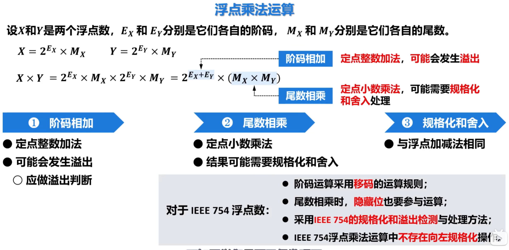

### 1. 解码相加

- 运算方式：采用定点整数加法运算规则计算 EX + EY

- 关键注意：当两个解码（EX 和 EY）同号时，可能发生溢出

- 处理要求：必须进行溢出判断，以通知计算机执行溢出处理

### 2. 尾数相乘

- 运算方式：采用定点小数乘法运算规则计算 MX × MY

- 后续处理：相乘结果需进一步执行规格化和舍入处理

### 3. 规格化和舍入

- 处理标准：与浮点加减法运算中的规格化、舍入处理规则完全相同

- 核心目的：保证运算结果的精度和规范性（示例：若尾数相乘结果为 0.00101×2^5，需规格化为 0.101×2^3）

## 四、IEEE 754 浮点数的特殊运算规则

- 解码运算：遵循移码的运算规则，而非原码或补码规则

- 尾数运算：尾数相乘时，隐藏位（IEEE 754 标准中默认的整数位 1）必须参与运算（示例：MX 的存储形式为 0.101，实际参与运算的是 1.101，隐藏位 1 需计入乘法过程）

- 溢出检测：采用 IEEE 754 标准规定的溢出检测与处理方法

- 规格化限制：不存在向左规格化操作（仅需根据结果执行向右规格化或舍入）

## 五、关键注意事项

1. 解码相加的溢出仅发生在 EX 和 EY 同号的场景，异号相加时无溢出风险

1. 尾数相乘的核心依赖定点小数乘法运算能力，需先掌握定点小数乘法规则

1. 规格化和舍入是尾数运算后的必要步骤，直接影响结果精度

1. 浮点乘法运算依赖前期已学知识：定点整数加法（解码相加）、定点小数乘法（尾数相乘）、浮点加减法的溢出判断、规格化和舍入处理


# 3-5-4 浮点运算 — 浮点除法运算

## 一、浮点数的表示形式

设两个浮点数分别为 X 和 Y，相关定义与表示如下：

- 解码：X 的解码为\(E_X\)，Y 的解码为\(E_Y\)（解码即指数部分，用于表示浮点数的量级）

- 尾数：X 的尾数为\(M_X\)，Y 的尾数为\(M_Y\)（尾数即小数部分，用于表示浮点数的精度）

- 表示形式：\(X = M_X \times 基数^{E_X}\)，\(Y = M_Y \times 基数^{E_Y}\)（示例：若基数为 2，\(E_X=4\)，\(M_X=0.1101\)，则\(X=0.1101 \times 2^4\)；\(E_Y=2\)，\(M_Y=0.1010\)，则\(Y=0.1010 \times 2^2\)）

## 二、浮点除法运算的核心本质

两个浮点数相除的结果可推导为：\(X \div Y = (M_X \div M_Y) \times 基数^{E_X - E_Y}\)

- 核心逻辑 1：解码部分进行相减运算（计算\(E_X - E_Y\)，确定结果的量级）

- 核心逻辑 2：尾数部分进行相除运算（计算\(M_X \div M_Y\)，确定结果的精度）

## 三、浮点除法运算的四大核心步骤

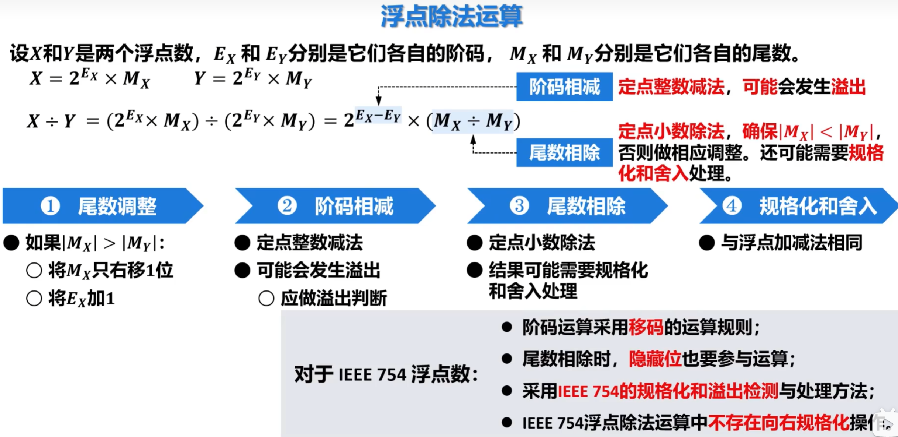

### 1. 步骤一：尾数调整

- 调整条件：必须确保被除数 X 的尾数\(M_X\)的绝对值 \(|M_X| < \) 除数 Y 的尾数\(M_Y\)的绝对值\(|M_Y|\)；若\(|M_X| \geq |M_Y|\)，则需执行调整

- 调整方法：将尾数\(M_X\)向右移 1 位，同时将解码\(E_X\)加 1（示例：若\(M_X=0.1110\)，\(M_Y=0.1001\)，因\(|0.1110| > |0.1001|\)，调整后\(M_X\)变为\(0.01110\)，\(E_X\)在原基础上加 1）

- 调整原理：由于运算前的 X 和 Y 均为规格化浮点数（规格化数尾数满足\(0.5 \leq |M| < 1\)，基数为 2 时），因此\(|M_X|\)与\(|M_Y|\)的差距最大为 “\(0.999...\)（二进制）” 与 “\(0.1\)（二进制）”，最多只需调整 1 次即可满足\(|M_X| < |M_Y|\)

- 调整目的：防止尾数相除后商的尾数出现 “大于 1” 或格式混乱的情况，保证后续运算的规范性

### 2. 步骤二：解码相减

- 运算方式：采用定点整数减法运算规则，计算\(E_X - E_Y\)（示例：若\(E_X=5\)（定点整数），\(E_Y=2\)（定点整数），则\(E_X - E_Y=5-2=3\)）

- 溢出风险：当两个解码\(E_X\)与\(E_Y\)异号时（如\(E_X=+8\)，\(E_Y=-3\)，计算\(8 - (-3)=11\)；或\(E_X=-8\)，\(E_Y=+3\)，计算\(-8 - 3=-11\)），可能发生溢出

- 处理要求：必须对解码相减的结果做溢出判断，若检测到溢出，需通知计算机执行对应的溢出处理（如报错、截断等）

### 3. 步骤三：尾数相除

- 运算方式：采用定点小数除法运算规则，计算\(M_X \div M_Y\)（示例：\(M_X=0.01110\)（调整后），\(M_Y=0.1001\)（二进制），按定点小数除法计算\(0.01110 \div 0.1001\)）

- 后续关联：尾数相除的结果并非最终结果，需进入步骤四进行规格化和舍入处理，以保证精度和格式合规

### 4. 步骤四：规格化和舍入

- 处理规则：与浮点加减法运算中的 “规格化”“舍入” 处理规则完全相同（示例：若尾数相除结果为\(0.001101 \times 2^3\)，需规格化为\(0.1101 \times 2^1\)；若结果尾数位数超出规定精度，需按 “四舍五入”“截尾” 等舍入规则处理）

- 处理目的：确保最终结果是符合浮点数标准的规格化数，减少运算误差，保证数据精度

## 四、IEEE 754 浮点数的特殊运算规则

（视频中 “HB E754”“ROBERE754” 均为 IEEE 754 标准的口误表述，以下按标准 IEEE 754 规则总结）

- 解码运算：解码（指数）的相减运算遵循 “移码” 的运算规则（而非原码、补码），需先将解码转换为移码形式后再执行减法

- 尾数运算：尾数相除时，IEEE 754 标准中尾数的 “隐藏位”（基数为 2 时，规格化尾数默认整数位为 1，该位不存储，称为隐藏位）必须参与运算（示例：\(M_X\)存储形式为\(0.1011\)，实际参与运算的尾数为\(1.1011\)，隐藏位 “1” 需计入除法过程）

- 溢出检测：采用 IEEE 754 标准规定的溢出检测与处理方法（如通过判断指数是否超出规定范围（正溢出、负溢出）来确定是否溢出）

- 规格化限制：IEEE 754 浮点除法运算中**不存在 “向右规格化” 操作**，仅需根据尾数相除结果执行 “向左规格化” 或舍入处理

## 五、关键注意事项

1. 尾数调整是浮点除法特有的步骤，且因运算前操作数为规格化数，最多仅需调整 1 次

1. 解码相减的溢出仅发生在\(E_X\)与\(E_Y\)异号的场景，同号解码相减（如\(E_X=+5\)，\(E_Y=+2\)；\(E_X=-5\)，\(E_Y=-2\)）无溢出风险

1. 尾数相除依赖 “定点小数除法” 运算能力，需先掌握定点小数除法的计算规则

1. 浮点除法运算依赖前期已学知识：定点整数减法（解码相减）、定点小数除法（尾数相除）、浮点加减法的溢出判断、规格化和舍入处理，无需额外学习新的基础运算规则


# 3-6 运算器

## 一、运算器的核心逻辑与构成

- 计算机中各类算术运算（定点 / 浮点的加减乘除、移位等），本质可通过**基本定点加法运算**和**移位运算**实现。

- 运算器是 CPU 的核心部件，由实现加法运算、移位运算、逻辑运算及各类算术运算的**数字逻辑电路集成**而成。

## 二、运算器的分类及特点


### 1. 定点运算器

- 核心部件：**算术逻辑单元（ALU）**。

- 功能：可执行定点数的移位运算、算术运算（加减乘除等）、逻辑运算（与、或等）。

- 辅助部件：包含通用寄存器组、缓冲寄存器等，通过内部总线连接（后续总线系统章节详细介绍）。

### 2. 浮点运算器

- 核心部件：**浮点运算单元（FPU）**。

- 功能：专门负责浮点数的算术运算。

- 复杂性：浮点运算逻辑比定点运算更复杂，早期以独立芯片形式存在（如 387SX 协处理器），现大多集成在 CPU 内部。

- 历史示例：1992 年底的 386SX CPU（焊接在主板上），主板预留方形空插座，用于选装浮点运算器（387SX 协处理器）。

## 三、定点运算器核心：ALU（算术逻辑单元）

### （一）例题 1：一位 ALU 的结构与工作原理

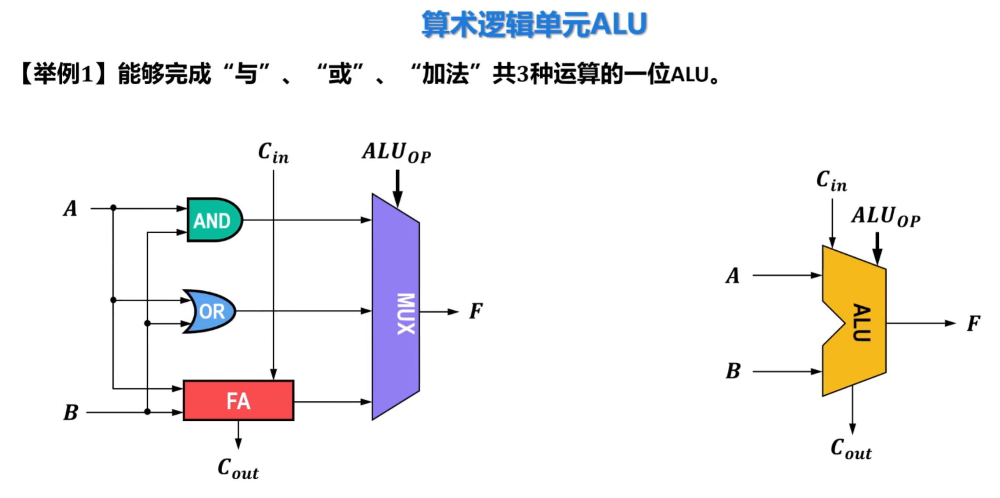

#### 1. 核心组成

- 关键部件：与门、或门、一位全加器（核心运算模块）、多路选择器（结果选择模块）。

#### 2. 输入信号

- 操作数：A（第一个操作数）、B（第二个操作数）。

- 控制 / 辅助信号：进位输入（c_in）、操作控制端（ALUOP）。

#### 3. 工作机制

- 与门、或门、一位全加器**并行运行**，各自输出运算结果，送入多路选择器的对应输入端。

- 多路选择器通过**ALUOP 信号控制**，选择对应运算结果输出，具体控制逻辑：

- ALUOP=00：输出与运算结果；

- ALUOP=01：输出或运算结果；

- ALUOP=10：输出一位全加器的和数结果。

#### 4. 符号表示

- 可用简化符号表示该一位 ALU，屏蔽内部组成细节。

### （二）例题 2：N 位 ALU 的构建与工作原理

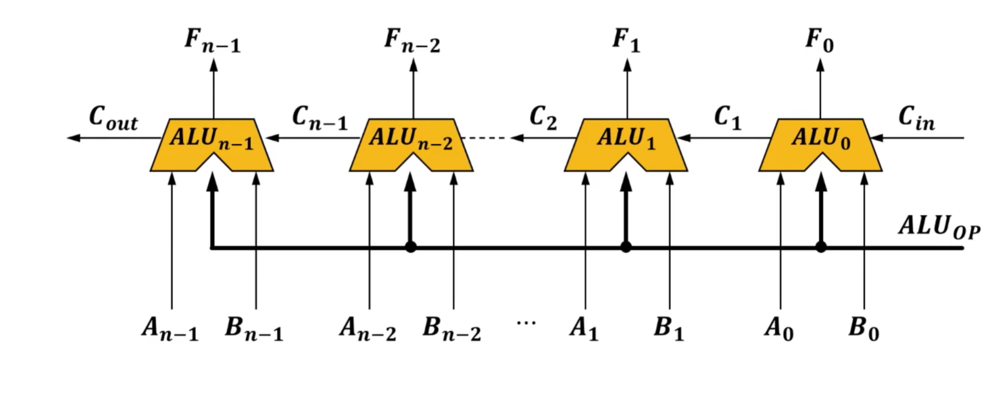

#### 1. 构建方式

- 由**N 个上述一位 ALU 串行连接**组成。

- 连接逻辑：参考串行进位加法器的硬件逻辑，将各一位 ALU 内部的全加器按串行进位方式连接。

#### 2. 符号表示

- 可用简化符号表示该 N 位 ALU，屏蔽内部组成细节。

## 四、ALU 的输出：状态标志位

### 1. 常见标志位及含义

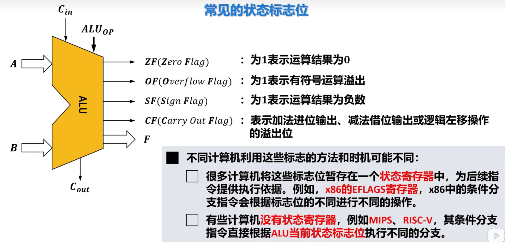

| 标志位                         | 含义                                                       |
| ------------------------------ | ---------------------------------------------------------- |
| ZF（零标志位）                 | 为 1 时，表示运算结果为零                                  |
| OF（溢出标志位）               | 为 1 时，表示有符号运算发生溢出                            |
| SF（符号标志位）               | 为 1 时，表示运算结果为负数                                |
| CF（进位 / 借位 / 溢出标志位） | 用于表示加法进位输出、减法借位输出，或逻辑左移操作的溢出位 |

### 2. 标志位的使用差异

- 不同计算机对标志位的利用方法和时机不同：

- 部分计算机：将标志位暂存在**状态寄存器**中，为后续指令提供执行依据（例：X86 架构的 EFLAGS 寄存器，条件分支指令根据该寄存器标志位执行不同操作）；

- 部分计算机：无状态寄存器（例：MIPS 架构），条件分支指令直接根据 ALU 当前的状态标志位执行不同分支。

## 五、课程说明

- 浮点运算单元（FPU）的详细内容超出本课程教学大纲，有兴趣的同学可自行查阅资料。

要不要我帮你整理一份**ALU 核心部件与状态标志位对照表**？