# 4-1 存储系统概述 

## 1. 章节引入

- 本节课为第四章 “存储系统” 的概述课，后续将围绕存储系统展开详细学习。

## 2. 存储器的核心定位

- 现代计算机以存储器为中心，是计算机中存放指令和数据的主要部件。

- 存储器容量越大，能存储的信息越多。

- 提高存储系统的访问速度，是提升计算机处理信息速度的重要措施。

## 3. 存储器与存储系统的区别

- 二者并非同一概念，计算机系统中包含多种类型的存储器。

- 这些不同类型的存储器共同构成了存储系统。

- 开发具有**大容量、高速度、低成本**的存储系统，是计算机技术发展的关键目标之一。

## 4. 计算机硬件中的存储器分类及实例

### 4.1 计算机硬件五大部件

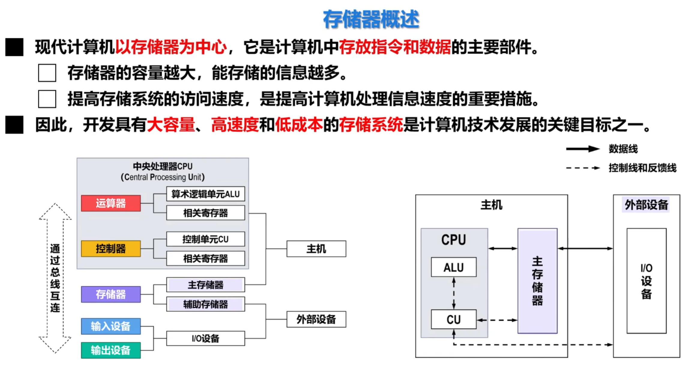

- 运算器、控制器、存储器、输入设备、输出设备。

### 4.2 存储器的具体分类

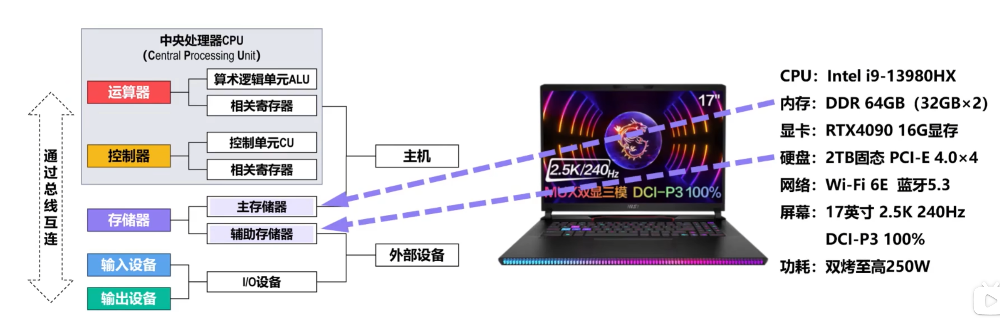

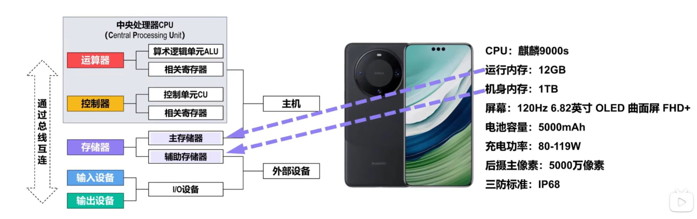

| 分类       | 所属部分 | 实例（普通设备） | 实例（智能手机） |
| ---------- | -------- | ---------------- | ---------------- |
| 主存储器   | 主机部分 | 内存             | 运行内存         |
| 辅助存储器 | 外部设备 | 硬盘             | 机身内存         |

## 5. 待解答的存储器相关问题

### 5.1 主存储器与辅助存储器相关问题

- 各自的作用是什么？

- 访问速度哪个更快？

- 断电后存储的内容会怎样？

- 各自采用的存储介质是什么？

- 结构是怎样的？

- 各自的存取原理是什么？

### 5.2 高速缓存相关问题

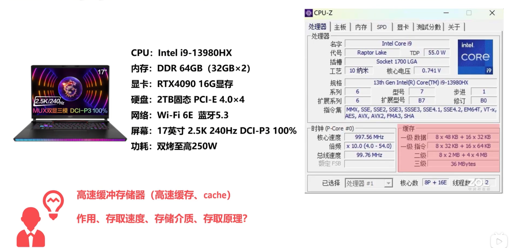

- 高速缓存是 CPU 内部的高速缓冲存储器，又称 cash（视频中写为 cash）。

- 作用是什么？

- 访问速度如何？

- 存储介质是什么？

- 存取原理是什么？

## 6. 本章主要学习内容

- 存储器的分类、组成与工作原理。

- 利用存储器芯片构建存储的基本方法。

- 高速缓存的工作原理。

- 虚拟存储器的工作原理。

# 4-1-1 存储器概述 — 存储器分类

### 一、存储器分类总述

存储器可从**存储介质、存取方式、可改写性、可保存性、功能和存取速度**五个角度分类，不同分类维度下包含多种具体类型，各类型有明确的定义、特点和应用实例。

### 二、按存储介质分类

根据存储数据的物理介质不同划分，核心分为磁存储器、光存储器、半导体存储器三类。

#### 2.1 磁存储器

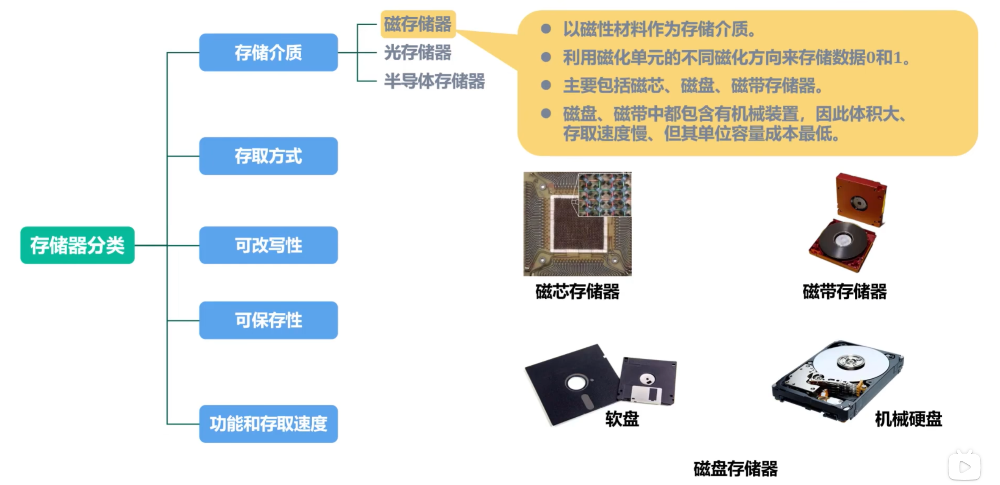

- 定义：以磁性材料为存储介质，利用磁化单元的不同磁化方向存储二进制比特（0 和 1）。

- 常见类型及示例：

1. 磁芯存储器：早期产品，已被淘汰，部分硬件爱好者会尝试自制。

1. 磁带存储器：20 世纪 50 年代初应用于计算机领域，我国 90 年代流行的录音带、录像带也属于此类。

- 特点：成本较低、存储容量较大，早期是大量数据备份和归档的主要方式。

- 现状：仍有专业应用市场，极少有家用产品。

1. 磁盘存储器：核心分为软盘和机械硬盘。

- 软盘：属于磁盘存储器，我国 90 年代广泛应用，常见五寸软盘容量 1.2 兆字节（MB），三寸软盘 1.44 兆字节（MB）。

- 淘汰原因：读写速度慢，21 世纪后被 U 盘、DVD 光盘等替代，2009 年彻底淘汰。

- 机械硬盘：当前主流磁存储器，1993 年主流容量 40MB，2024 年主流容量起步 4 太字节（TB），容量提升约 10 万倍，读写速度大幅提高。

- 应用现状：台式电脑中多作为资料盘，笔记本电脑已不再使用。

#### 2.2 光存储器

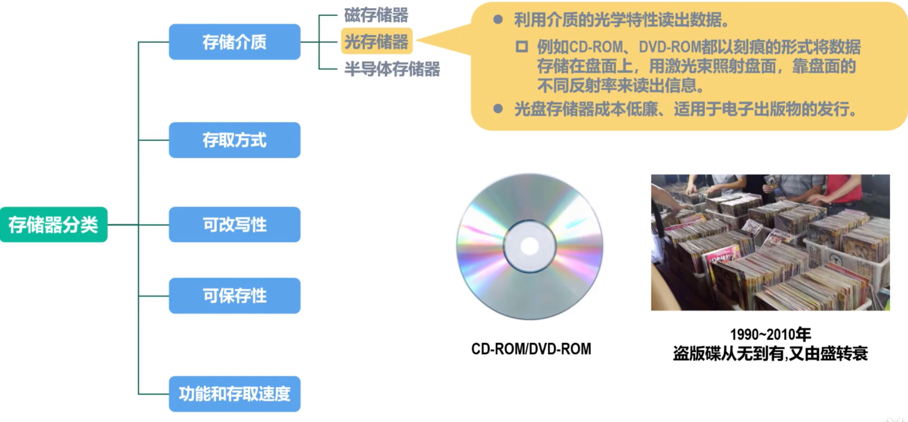

- 定义：利用介质的光学特性读出数据，以刻痕形式将数据存储在盘面上，通过激光束照射盘面的不同反射率读取信息。

- 常见类型：CD-ROM、DVD-ROM 等光盘存储器。

- 特点：成本低廉，适用于电子出版物发行。

- 时代背景：我国 1990-2010 年间盗版光盘流行（批发 5 元、零售 10 元、甩卖 10 元 3 张），2010 年后因在线视频行业兴起（土豆网、爱奇艺、腾讯视频、优酷等）和版权意识提升逐渐消失。

#### 2.3 半导体存储器

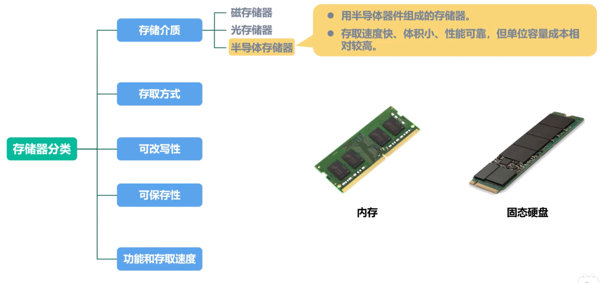

- 定义：用半导体器件组成的存储器。

- 常见类型：内存条、固态硬盘（SSD）。

- 特点：存取速度快、体积小、性能可靠，单位容量成本相对较高。

- 应用现状：固态硬盘因读写速度远高于机械硬盘、功耗更低、抗震动，且价格差距缩小，已成为笔记本电脑唯一存储选择；台式电脑中多作为系统盘。

- 关键区分：固态硬盘属于半导体存储器，机械硬盘属于磁存储器。

### 三、按存取方式分类

根据访问存储单元的方式不同划分，核心分为顺序存取、随机存取、直接存取三类（可省略 “存取” 二字）。

#### 3.1 顺序存取存储器

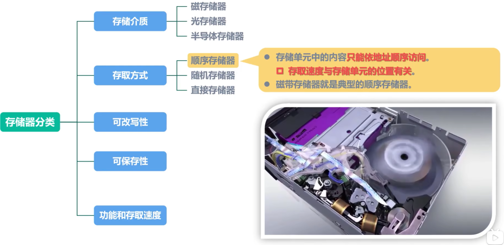

- 定义：访问存储单元时，必须按存储单元的地址顺序（物理位置顺序）进行，访问速度与存储单元物理位置相关。

- 典型示例：磁带存储器。

- 工作原理：磁带由磁带机旋转装置带动旋转，磁头贴近磁带进行存取操作，读取特定区域内容需等待磁带旋转至该区域到达磁头位置。

#### 3.2 随机存取存储器

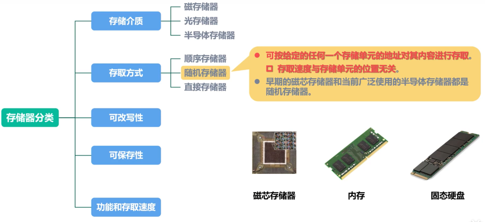

- 定义：可按任意存储单元的地址直接存取内容，存取速度与存储单元位置无关。

- 典型示例：早期磁芯存储器、当前广泛使用的半导体存储器（如内存条）。

- 工作原理：访问内存时，将存储单元地址写入存储器地址寄存器（MAR），即可直接读取或写入该单元内容。

#### 3.3 直接存取存储器

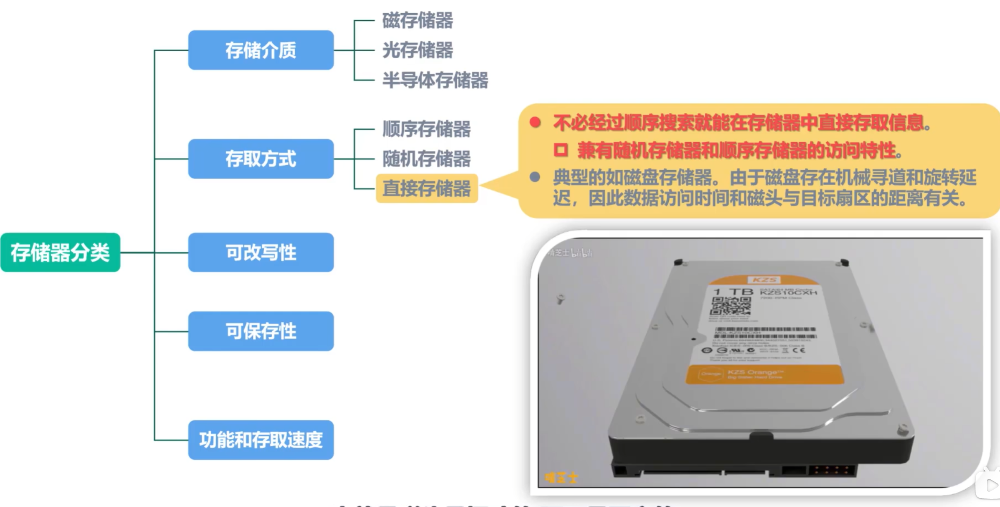

- 定义：不必经过顺序搜索，可直接存取信息，兼有随机存取和顺序存取的特性。

- 典型示例：磁盘存储器（如机械硬盘）。

- 工作原理：

1. 机械硬盘内部构成：PCB 印刷电路（电控部分）、电机（带动盘片高速旋转，如 7200 转 / 分钟）、永磁铁（控制磁头摆动）、磁头停泊区、磁头。

1. 存取特点：磁头悬浮在盘片上方（不到 0.3 微米），通过摆动访问不同区域，数据访问时间与磁头和目标扇区的距离相关（存在机械寻道和旋转延迟）。

- 关键优势：相比磁带存储器，多了磁头摆动的访问维度，效率更高。

### 四、按可改写性分类

根据是否能修改存储内容划分，核心分为读写存储器和只读存储器两类。

#### 4.1 读写存储器

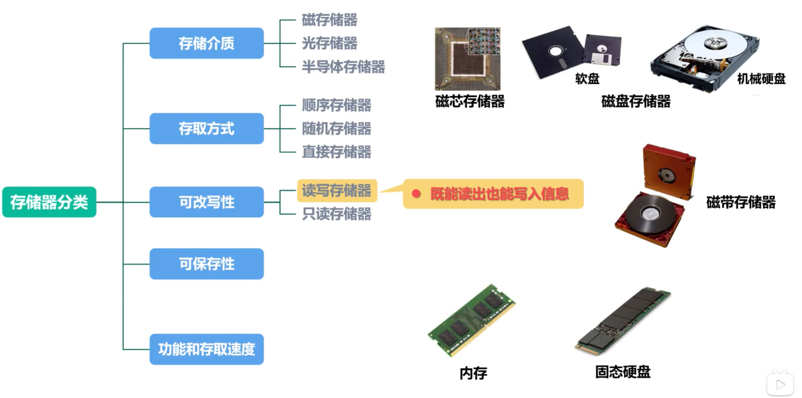

- 定义：既能向存储器写入信息，也能从存储器读出信息。

- 典型示例：磁芯存储器、磁盘存储器（软盘、机械硬盘）、磁带存储器、内存（内存条）、固态硬盘。

#### 4.2 只读存储器

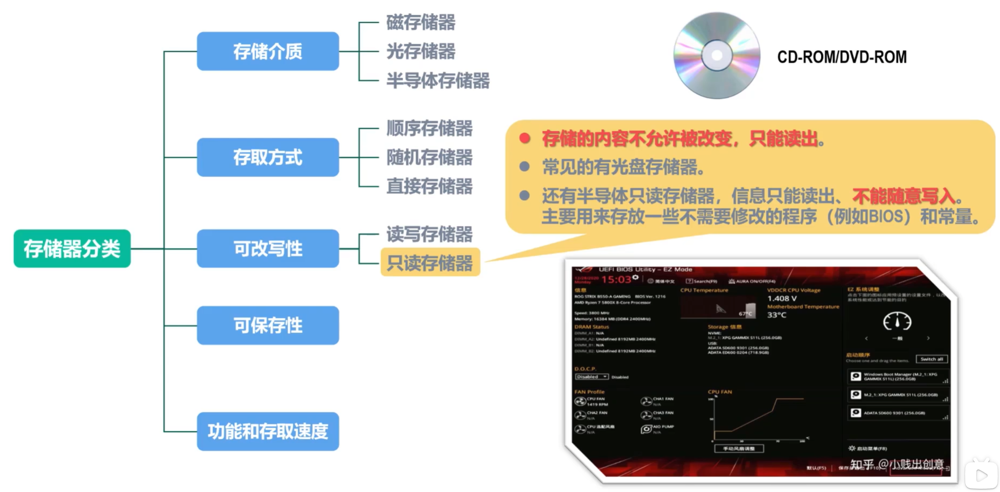

- 定义：存储的内容默认不允许改变，只能读出，部分类型需专用工具才能改写。

- 典型示例：

1. 光盘类：CD-ROM、DVD-ROM。

1. 半导体类：带电可擦可编程只读存储器（E1PROM，如 93C46 芯片）。

- 应用场景：存放无需修改的程序和常量，例如主板上的 BIOS 程序（其代码和配置参数存储在半导体只读存储器芯片中）、以太网卡上固化的 Mac 地址。

### 五、按可保存性分类

根据断电后是否保留存储内容划分，核心分为易失性存储器和非易失性存储器两类。

#### 5.1 易失性存储器

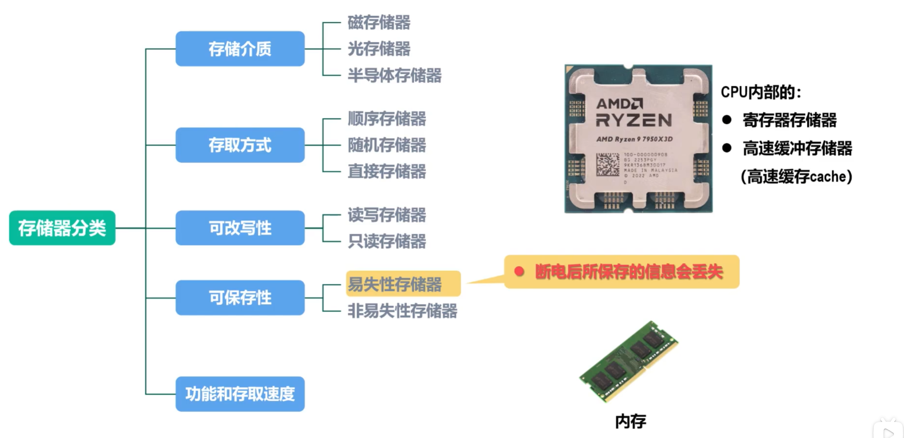

- 定义：断电后所保存的信息会丢失。

- 典型示例：计算机内存（内存条）、CPU 内部的寄存器、高速缓冲存储器（Cache）。

#### 5.2 非易失性存储器

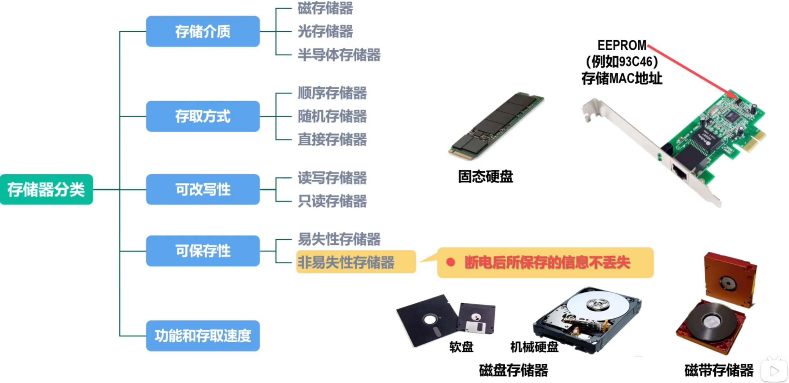

- 定义：断电后所保存的信息不会丢失。

- 典型示例：磁盘存储器（机械硬盘）、磁带存储器、固态硬盘、光盘存储器（CD-ROM、DVD-ROM）、带电可擦可编程只读存储器（E1PROM）。

- 注意事项：固态硬盘若长期（两年以上）不通电，可能因环境温度、产品级别（消费级 / 企业级）等因素导致信息丢失。

### 六、按功能和存取速度分类

根据在计算机系统中的功能定位和存取速度划分，核心分为四类，存取速度从快到慢、容量从小到大依次为：寄存器 → 高速缓冲存储器 → 主存储器 → 辅助存储器。

#### 6.1 寄存器存储器

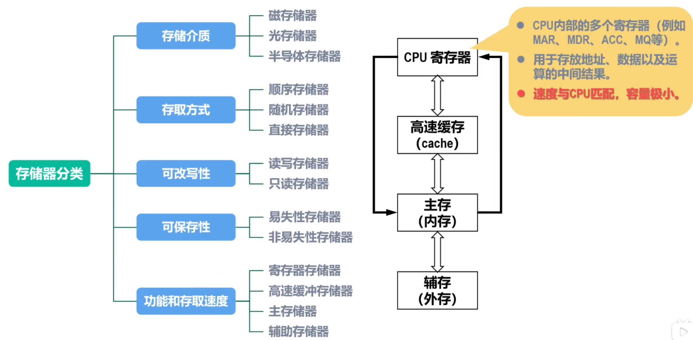

- 位置：CPU 内部。

- 功能：存放地址、数据以及运算的中间结果。

- 特点：存取速度极快（与 CPU 匹配），容量极小。

- 示例：存储器地址寄存器（MAR）、存储器数据寄存器（MDR）、累加器（ACC）、乘商寄存器（MQ）。

#### 6.2 高速缓冲存储器（高速缓存 / Cache）

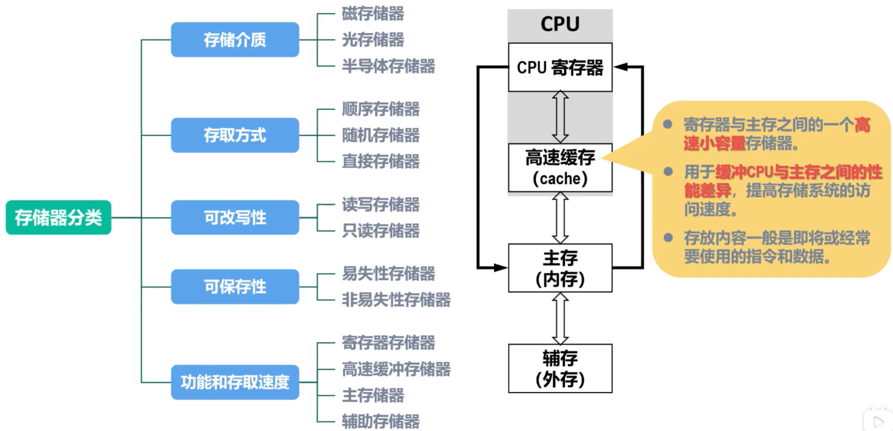

- 位置：CPU 内部。

- 功能：作为 CPU 内部寄存器与外部主存之间的高速小容量缓冲，弥补两者性能差异，提高存储系统访问速度。

- 特点：存取速度快于主存、慢于寄存器，容量大于寄存器、小于主存。

- 存储内容：即将或经常使用的指令和数据。

#### 6.3 主存储器（主存 / 内存）

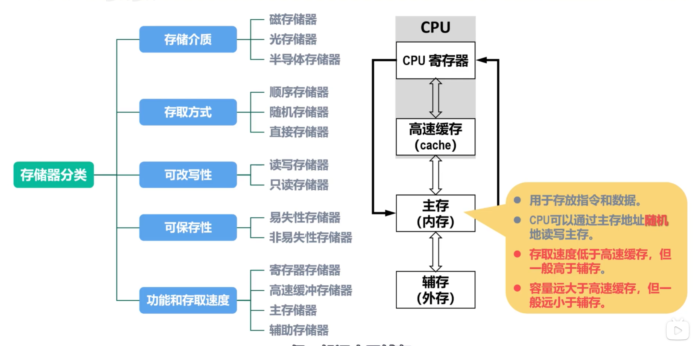

- 功能：存放当前运行的指令和数据，CPU 可通过存储地址随机读写。

- 特点：存取速度低于高速缓存、高于辅助存储器，容量大于高速缓存、小于辅助存储器。

- 示例：内存条。

#### 6.4 辅助存储器（辅存 / 外存）

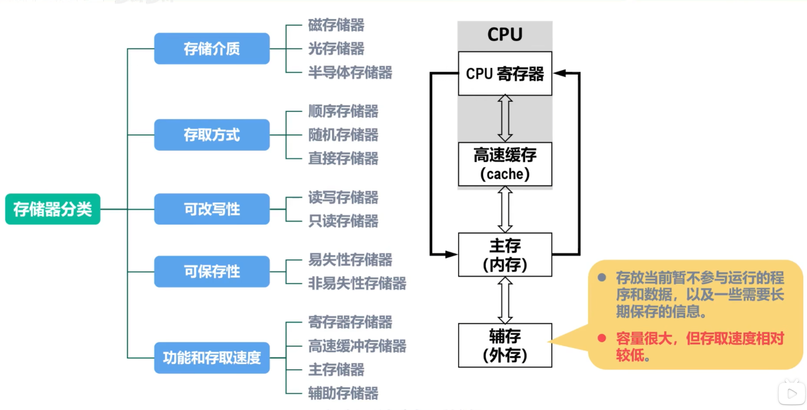

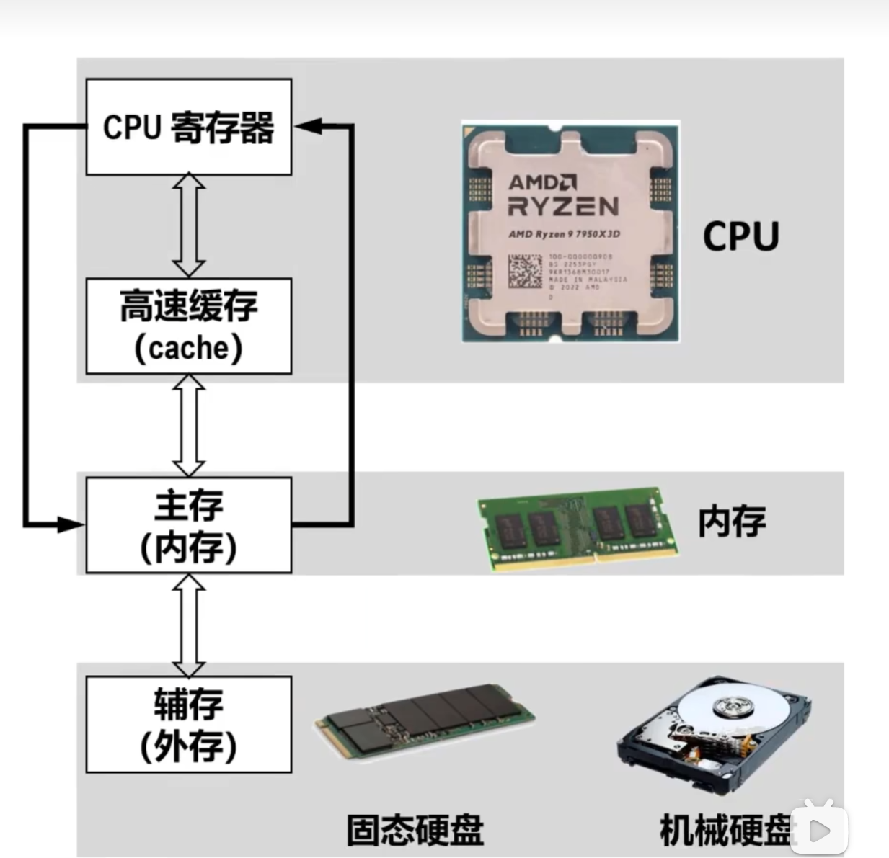

- 功能：存放当前暂不参与运行的程序和数据，以及需要长期保存的信息。

- 特点：容量极大，存取速度相对较低。

- 示例：机械硬盘、固态硬盘、磁带存储器、光盘存储器（CD-ROM、DVD-ROM）、U 盘。

	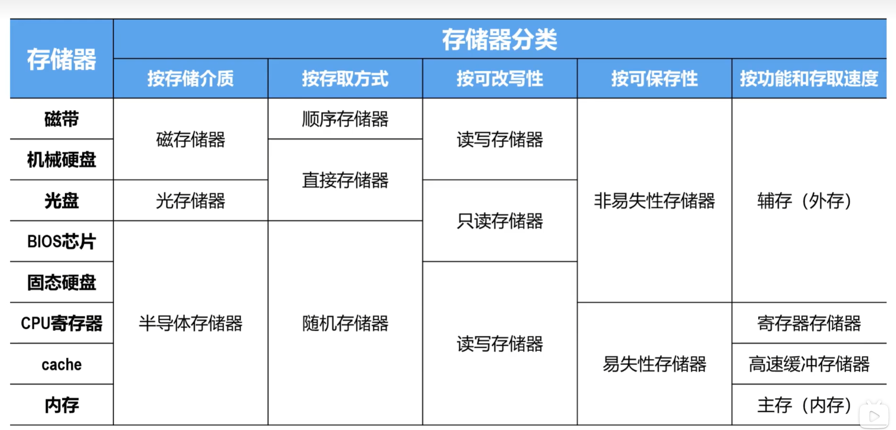

# 4-1-2 存储器概述 — 存储器性能指标与存储系统层次结构

## 一、存储器的常用性能指标

存储器的常用性能指标包括**存储容量**和**存取速度**两类。

### （一）存储容量

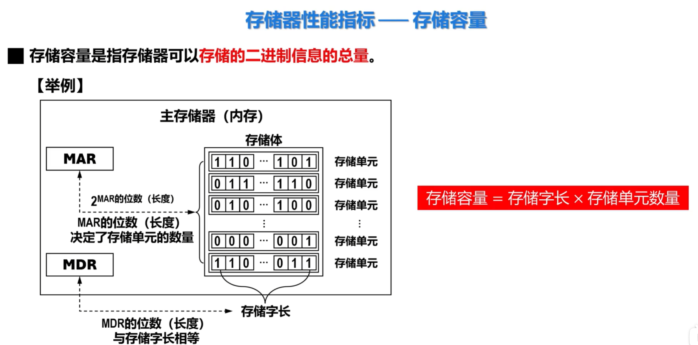

1. 定义：存储器可以存储的二进制信息的总量。

1. 核心相关概念（复习主存组成）：

- 存储体由若干个存储单元组成，所有存储单元的存储二进制比特数相同。

- 存储字长：每个存储单元所能存储的二进制比特数。

- 存储器数据寄存器（MDR）：位数与存储字长相等。

- 存储器地址寄存器（MAR）：位数决定存储单元的数量，具体为 2^（MAR 位数）个。

1. 容量计算方法：

- 主存容量：存储字长 × 2^（MAR 位数）（已知存储字长和 MAR 位数即可计算）。

- 其他类型存储器：存储字长 × 存储单元数量（已知两者即可计算）。

### （二）存取速度

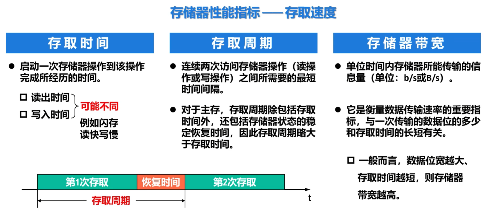

存取速度细分为**存取时间**、**存取周期**、**存储器带宽**三个具体指标：

#### 1. 存取时间

- 定义：启动一次存储器操作到该操作完成所经历的时间。

- 分类：对应存储器的读出操作和写入操作，分为读出时间和写入时间。

- 特点：读出时间和写入时间可能不同，示例为闪存（读快写慢）。

#### 2. 存取周期

- 定义：连续两次访问存储器的操作之间所需要的最短时间间隔。

- 构成（以主存为例）：包含存取时间 + 存储器状态的稳定恢复时间。

- 特点：存取周期略大于存取时间。

- 示例（时间轴说明）：横轴为时间，第一段为第一次存取时间，第二段为存储器状态稳定恢复时间，两段时间之和为存取周期，完成后可进行第二次存取。

#### 3. 存储器带宽

- 定义：单位时间内存储器所能传输的信息量。

- 单位：比特每秒（bit/s）或字节每秒（B/s）。

- 核心作用：衡量数据传输速率的重要指标。

- 影响因素：与一次传输的数据位宽、存取时间相关；数据位宽越大、存取时间越短，存储器带宽越高。

## 二、存储系统的层次结构

### （一）结构类型

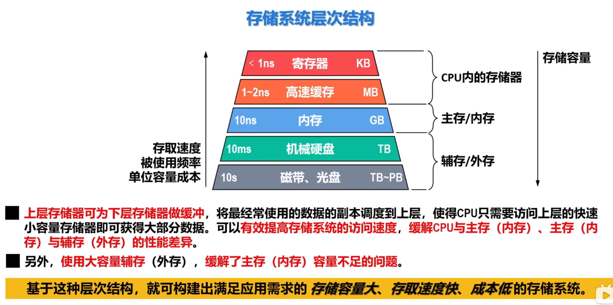

典型的**金字塔型层次结构**，从下到上依次为：磁带 / 光盘 → 机械硬盘 → 内存 → 高速缓存 → 寄存器。

### （二）存储器分类（基于位置与功能）

1. CPU 内部存储器：寄存器、高速缓存。

1. 主存储器（简称主存）：即内存，独立于 CPU 的核心存储部件。

1. 辅助存储器（简称辅存，又称外存）：机械硬盘、磁带、光盘等。

### （三）层次结构的核心特点

1. 从上到下（靠近 CPU 的程度递减）：

- 存取速度逐渐变慢。

- 单位容量成本逐渐降低。

- 使用频率逐渐降低。

1. 从下到上（靠近 CPU 的程度递增）：

- 存储容量逐渐减小。

### （四）层次结构的作用

1. 缓冲机制：上层存储器为下层存储器做缓冲，将最经常使用的数据的副本调度到上层。

1. 性能优化：CPU 只需访问上层快速小容量存储器即可获得大部分数据，有效提高存储系统访问速度，缓解 CPU 与主存、主存与辅存的性能差异。

1. 容量保障：通过大容量辅存缓解存储容量不足的问题。

1. 最终目标：构建出存储容量大、存取速度快、成本低的存储系统。

### （五）存储器淘汰原则

当一种存储器在存储速度、存储容量、价格成本上均被另一种存储器超越时，该存储器会被淘汰。

- 示例：软盘被 U 盘所取代。

### （六）思考问题

机械硬盘有可能被固态硬盘取代吗？

# 4-1-3 存储器概述 — 主存的基本结构

## 一、储存的核心定义与访问特性

- 储存是机器指令可直接操作的存储器。

- 访问方式：需基于储存地址进行随机访问。

## 二、储存的基本硬件组成

### 1. 核心组成部件

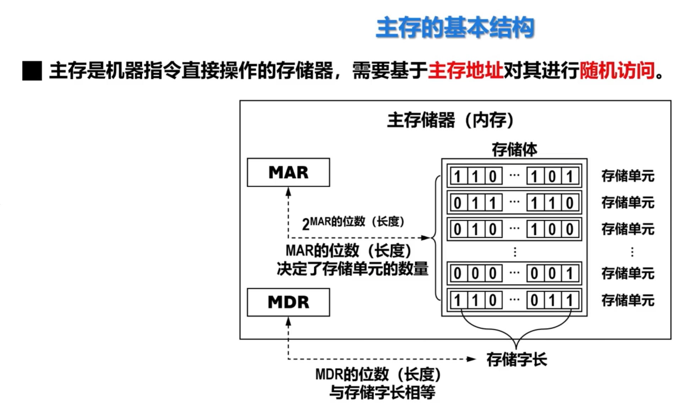

- 存储体：储存的核心硬件，是存储信息的物理载体。

- 存储器数据寄存器（MDR）：用于暂存数据的寄存器。

- 存储器地址寄存器（MAR）：用于存放存储单元地址的寄存器。

### 2. 各部件细节说明

#### （1）存储体的构成与相关概念

- 存储体由多个**存储单元**组成，每个存储单元包含若干**存储元件**。

- 每个存储元件仅能存储 1 位二进制数（0 或 1），因此每个存储单元可存储一串二进制信息。

- 存储单元中存储的一串二进制信息称为**存储字**，其位数称为**存储字长**，常见为 8 位、16 位或 32 位。

#### （2）存储器数据寄存器（MDR）

- 功能：存放从存储单元取出的信息，或准备存入存储单元的信息。

- 位数要求：与存储字长相等（需匹配存储单元的信息位数）。

#### （3）存储器地址寄存器（MAR）

- 功能：存放欲访问的存储单元的地址。

- 位数与存储单元数量的关系：MAR 的位数决定存储单元的最大数量，计算公式为 “存储单元数量 = 2^MAR 位数”。

- 访问流程：CPU 访问主存时，需先将目标存储单元地址送入 MAR。

## 三、地址译码器的作用与实例

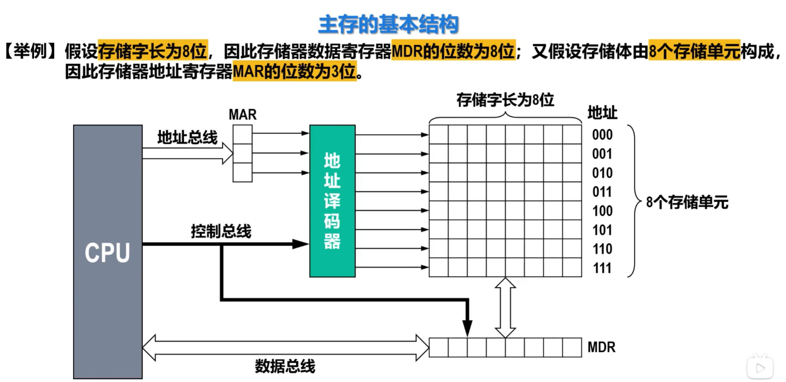

### 1. 核心功能

- 实现地址到存储单元的映射，将 MAR 中的地址信息转换为选中对应存储单元的控制信号。

- 输入：MAR 中存放的地址信息。

- 输出：与存储单元一一对应的控制信号，仅其中 1 位为有效信号，用于选中目标存储单元。

### 2. 视频示例（简化模型）

#### （1）示例前提条件

- 存储字长：8 位（每个存储单元含 8 个存储元件）。

- 存储单元数量：8 个（存储体由 8 个存储单元构成）。

- MAR 位数：3 位（因 2^3=8，可覆盖 8 个存储单元的地址编码）。

- 地址范围：3 位二进制地址，从 000（最小地址）到 111（最大地址）。

- 译码器类型：三八译码器（输入 3 位、输出 8 位，对应 8 个存储单元）。

- 有效信号定义：假设高电平为有效信号（用于选中存储单元）。

#### （2）译码器工作过程示例

- 当 MAR 中送入地址 000 时，地址译码器的 3 个输入端接收对应电平（0 为低电平、1 为高电平），译码后输出 8 位信号，仅对应地址 000 存储单元的输出线为高电平，该存储单元被选中。

- 当 MAR 中送入地址 001 时，地址译码器输出信号中，仅对应地址 001 存储单元的输出线为高电平，该存储单元被选中。

### 3. 课程要求

- 仅需理解地址译码器的 “地址映射与单元选中” 作用，无需掌握其逻辑门构建原理（属于数电课程内容）。

## 四、CPU 与主存的连接总线

- 地址总线：CPU 向 MAR 传输存储单元地址的通道。

- 数据总线：CPU 与 MDR 之间传输数据的通道（读取时 MDR 向 CPU 传数据，写入时 CPU 向 MDR 传数据）。

- 控制总线：传输 CPU 发出的各类控制信号（如译码控制、读写控制等），是各类操作的 “指挥信号通道”。

## 五、CPU 访问主存的过程（含示例）

### 1. 读取信息过程（示例：读取地址 110 的存储单元信息）

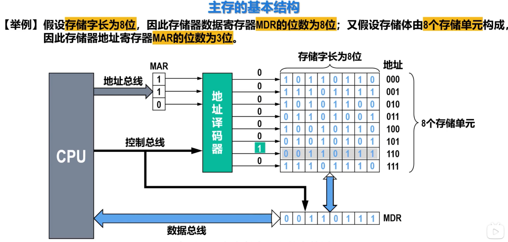

1. CPU 通过地址总线，将目标存储单元地址 110 送入 MAR。

1. CPU 通过控制总线发出控制信号，控制地址译码器进行译码。

1. 地址译码器输出有效电平，选中地址为 110 的存储单元。

1. CPU 通过控制信号控制储存，将该选中单元中的二进制信息读取到 MDR 中暂存。

1. CPU 通过控制信号，经由数据总线将 MDR 中的信息读取到 CPU 内部。

### 2. 写入信息过程（示例：向地址 111 的存储单元写入信息）

1. CPU 通过数据总线，将待写入的信息送入 MDR 中暂存。

1. CPU 通过地址总线，将目标存储单元地址 111 送入 MAR。

1. CPU 通过控制总线发出控制信号，控制地址译码器进行译码。

1. 地址译码器输出有效电平，选中地址为 111 的存储单元。

1. CPU 通过控制信号，将 MDR 中暂存的信息写入到该选中的存储单元。

## 六、补充说明

- 硬件发展现状：现在的储存（内存）均制成大规模集成电路芯片。

- 寄存器集成情况：存储器地址寄存器（MAR）和存储器数据寄存器（MDR）已集成到 CPU 内部。

# 4-1-4 存储器概述 — 用于地址译码的译码结构

## 一、上节课内容回顾

1. 已学习存储器的构成，引入了地址译码器。

1. 硬件技术发展后，存储器、地址寄存器（MAR）和存储器数据寄存器（MDR）均集成到 CPU 中。

1. 后续绘制存储器结构时，除特别需要外，不再单独画出 MAR 和 MDR。

## 二、核心主题：地址译码器的两种译码结构

本节课聚焦地址译码器的两类核心结构，分别为单译码结构和双译码结构，核心用于解决存储器存储单元的寻址问题。

## 三、单译码结构

### 1. 定义

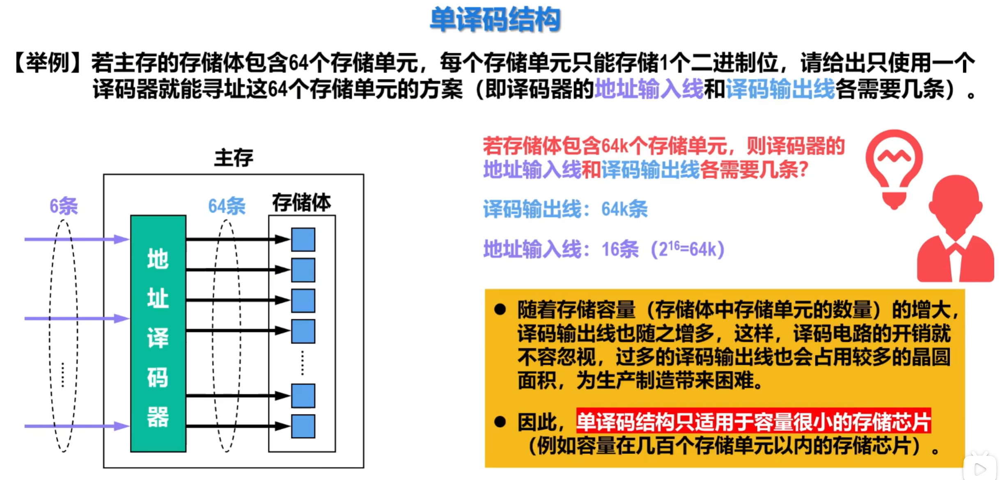

仅使用一个译码器，其每条译码输出线直接连接到存储体中对应的一个存储单元，通过该译码器实现所有存储单元的寻址。

### 2. 关键计算逻辑

- 译码输出线数量 = 存储体中存储单元的总数（需为 2 的整数次幂）。

- 地址输入线数量 = 满足 “2^ 输入线数量 = 存储单元总数” 的整数（即输入线数量为存储单元总数的 2 进制位数）。

### 3. 视频例题解析

#### 例题 1：64 个存储单元的单译码方案

- 已知条件：存储体含 64 个存储单元，每个单元存储 1 个二进制位。

- 译码输出线数量：需 64 条（与存储单元总数相等）。

- 地址输入线数量：因 2^6 = 64，故需 6 条。

#### 例题 2：64K 个存储单元的单译码方案

- 已知条件：存储体含 64K（64×1024 = 65536）个存储单元。

- 译码输出线数量：需 64K 条（与存储单元总数相等）。

- 地址输入线数量：因 2^16 = 65536，故需 16 条。

### 4. 适用场景与局限

- 适用场景：仅适用于容量很小的存储芯片（如几百个存储单元以内）。

- 局限：存储容量增大时，译码输出线会急剧增多，占用较多晶圆面积，增加生产制造难度，译码电路开销不可忽视。

## 四、双译码结构

### 1. 定义

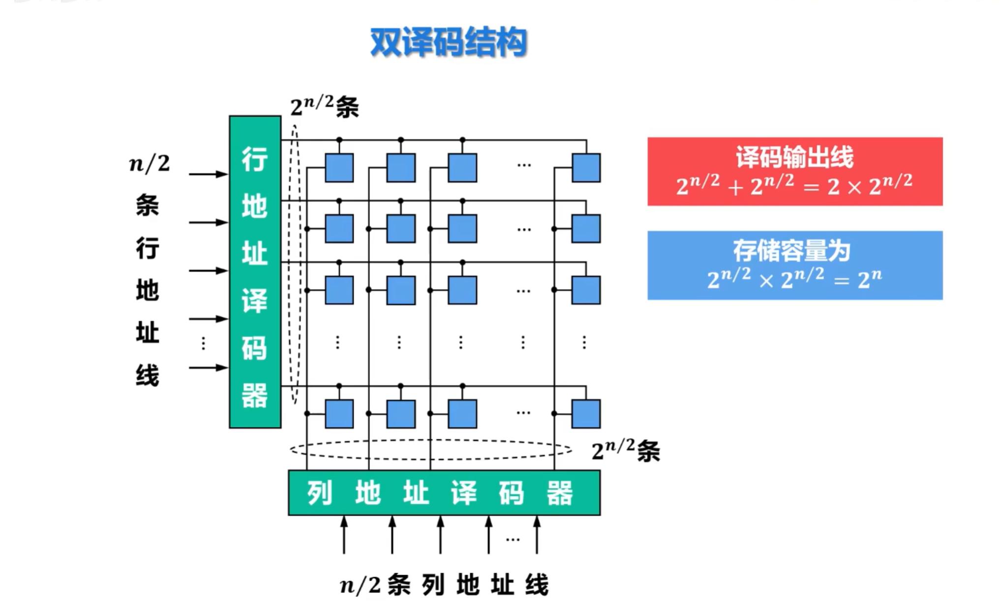

将存储单元排列成二维阵列（行 × 列），采用两个译码器（行地址译码器 + 列地址译码器）协同寻址：

- 行地址译码器的输出线连接对应行中的所有存储单元。

- 列地址译码器的输出线连接对应列中的所有存储单元。

- 行与列的交叉点即为被选中的存储单元。

### 2. 关键计算逻辑

设地址输入线总数量为 N，双译码结构将其平均分配给行、列译码器（各占 N/2 条）：

- 行地址译码器：输入线 N/2 条 → 输出线 2^(N/2) 条，可寻址 2^(N/2) 行存储单元。

- 列地址译码器：输入线 N/2 条 → 输出线 2^(N/2) 条，可寻址 2^(N/2) 列存储单元。

- 存储器总存储容量 = 行数 × 列数 = 2^(N/2) × 2^(N/2) = 2^N（与单译码结构相同输入线数量时，存储容量一致）。

- 译码输出线总数 = 行译码输出线数 + 列译码输出线数 = 2×2^(N/2)。

### 3. 与单译码结构的对比例题

#### 例题：地址输入线总数量为 16 条时的结构对比

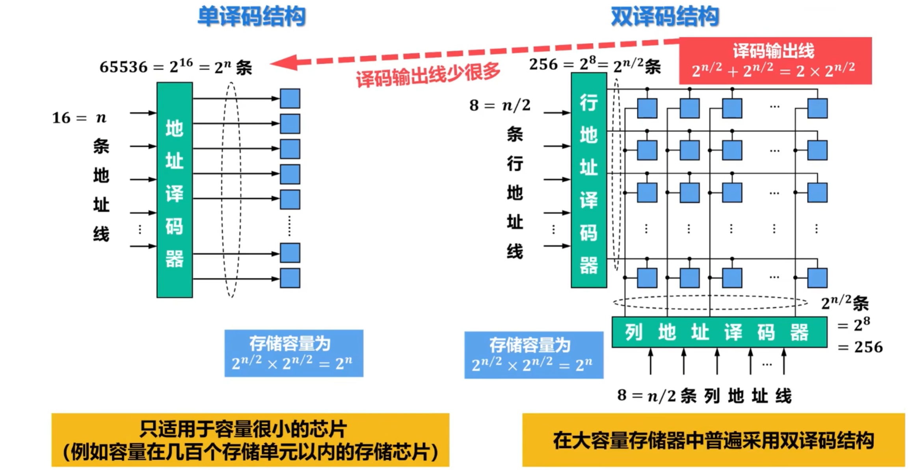

- 单译码结构：输入线 16 条 → 输出线 2^16 = 65536 条。

- 双译码结构：行输入线 8 条、列输入线 8 条（合计 16 条）。

- 行译码输出线：2^8 = 256 条。

- 列译码输出线：2^8 = 256 条。

- 译码输出线总数：256 + 256 = 512 条。

### 4. 适用场景

- 适用于大容量存储芯片，能显著减少译码输出线数量，降低电路开销和制造难度，是大容量存储器的普遍采用方案。

## 五、与单片机行列式按键的关联

- 单片机应用系统中，当按键数量较大时，采用行列式（矩阵）按键结构可节省单片机的 IO 口。

- 该原理与双译码结构本质相同，均通过 “二维拆分” 的方式减少资源占用（IO 口 / 译码输出线）。

# 4-1-5 存储器概述 — 主存中数据的存放

## 一、机器字长与存储字长的区别

### 1. 核心概念

- 机器字长：CPU 一次能够处理的二进制数据的位数。

- 存储字长：存储中一个存储单元所能存储的二进制位数。

### 2. 关键特性

- 两者不一定相同，是相互独立的概念。

- 示例：机器字长为 32 位的计算机，存储字长可选择 16 位、32 位或 64 位。

## 二、地址访问模式

### 1. 编址与存储字长基础

- 存储默认按字节编址。

- 存储字长是字节的 2 的整数次幂倍，常见取值为 1 字节、2 字节（半字）、4 字节（字）等。

### 2. 地址类型与转换

- 字节地址：按字节访问时使用的地址（存储按字节编址的原生地址）。

- 半字地址：按 16 位（2 字节）访问时使用的地址，由字节地址逻辑右移 1 位得到。

- 字地址：按 32 位（4 字节）访问时使用的地址，由字节地址逻辑右移 2 位得到（或半字地址逻辑右移 1 位）。

### 3. X86 汇编访问示例（假设 DS=0，存储单元内容如图示）

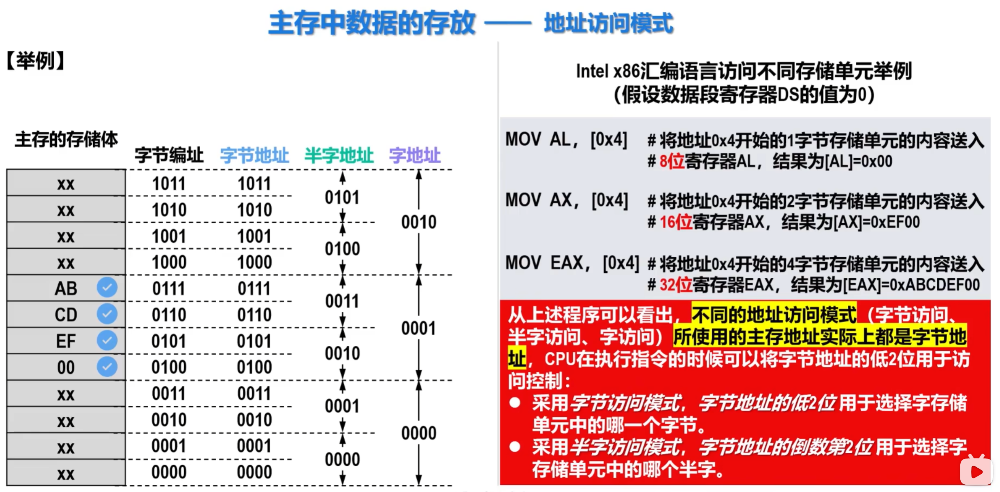

- 前提：存储单元按字节编址，内容以 16 进制表示，地址 0X4 开始的字节内容依次为 00、EF、CD、AB。

- 指令 1：将地址 0X4 开始的 1 字节送入 8 位寄存器 AL

- 功能：仅访问地址 0X4 对应的字节单元。

- 结果：AL 的内容为 00。

- 指令 2：将地址 0X4 开始的 2 字节送入 16 位寄存器 AX

- 功能：访问地址 0X4 和 0X5 对应的两个字节单元。

- 结果：AX 的内容为 EF00（受后续小端方式影响）。

- 指令 3：将地址 0X4 开始的 4 字节送入 32 位寄存器 EAX

- 功能：访问地址 0X4、0X5、0X6、0X7 对应的四个字节单元。

- 结果：EAX 的内容为 ABCDEF00（受小端方式影响）。

### 4. CPU 访问控制逻辑

- 若存储字长为 32 位（4 字节），字节地址的低 2 位用于访问控制：

- 字节访问模式：低 2 位选择存储单元中的某个字节。

- 半字访问模式：低 1 位选择存储单元中的某个半字。

## 三、大端与小端方式

### 1. 定义

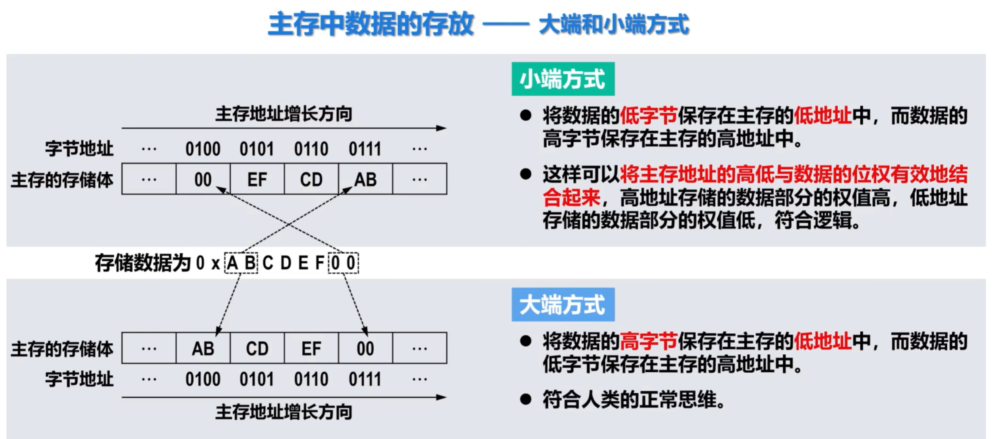

- 小端方式：数据的低字节保存在主存的低地址中，数据的高字节保存在主存的高地址中。

- 逻辑特点：存储地址高低与数据位权高低一致（低地址存低位、高地址存高位），符合逻辑运算习惯。

- 大端方式：数据的高字节保存在主存的低地址中，数据的低字节保存在主存的高地址中。

- 逻辑特点：符合人类读写习惯（从左到右为高位到低位）。

### 2. 示例验证（对应汇编指令 3）

- 存储地址（低→高）：0X4、0X5、0X6、0X7

- 存储内容（16 进制）：00、EF、CD、AB

- 小端方式存储结果：EAX=ABCDEF00（低地址 0X4 存 00（数据低字节），高地址 0X7 存 AB（数据高字节））

- 大端方式存储结果（本例不采用）：EAX=00EFCDAB（低地址 0X4 存 AB（数据高字节），高地址 0X7 存 00（数据低字节））

### 3. 适用场景

- 小端方式：Intel X86、X64、RISC-V 等处理器。

- 大端方式：Power PC 处理器。

- 双支持方式：ARM、MIPS 等处理器。

- 扩展应用：外部设备设计、网络数据传输、音视频文件保存等场景均涉及大小端选择；差异存在于寄存器、存储器、指令集、系统总线等多个层次。

## 四、数据的边界对齐

### 1. 核心目的

- 减少多字节变量的存取周期，提高数据访问效率。

- 问题背景：多字节变量若跨 32 位字存储单元分布，访问需多个周期；边界对齐通过合理分配地址避免该问题。

### 2. 基础前提

- 存储按字节编址，高级语言不同数据类型占用字节数不同（如 C 语言中 int=4 字节、short=2 字节、double=8 字节、char=1 字节）。

- 示例环境：存储字长 32 位（4 字节），存储单元按 4 字节划分，字节地址以十进制编址。

### 3. 边界对齐规则

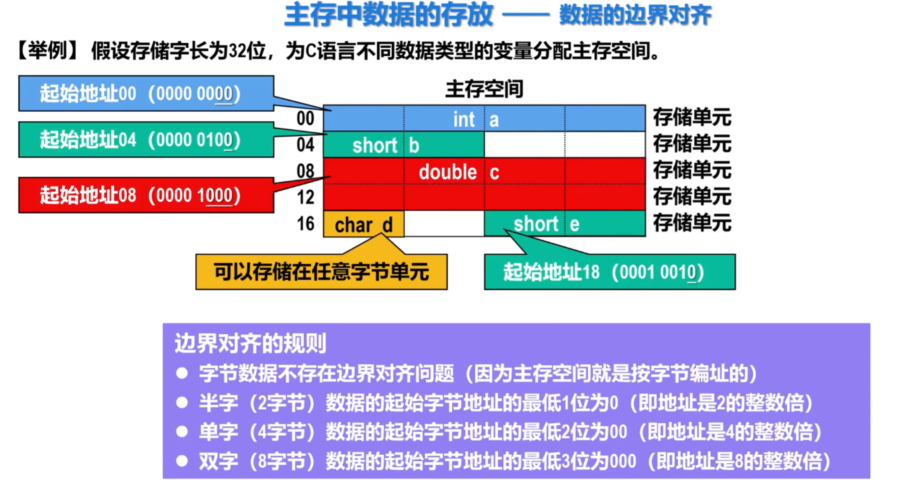

- 字节数据（如 char）：无对齐要求，可存储在任意字节地址。

- 半字数据（2 字节，如 short）：起始字节地址的最低 1 位为 0（地址是 2 的整数倍）。

- 单字数据（4 字节，如 int）：起始字节地址的最低 2 位为 0（地址是 4 的整数倍）。

- 双字数据（8 字节，如 double）：起始字节地址的最低 3 位为 0（地址是 8 的整数倍）。

### 4. 分配方案对比示例（C 语言变量分配）

#### （1）未对齐方案（空间利用率高，性能差）

- int 变量 A（4 字节）：地址 00~03

- short 变量 B（2 字节）：地址 04~05

- double 变量 C（8 字节）：地址 06~13（跨 3 个存储单元，访问需 3 个周期）

- char 变量 D（1 字节）：地址 14

- short 变量 E（2 字节）：地址 15~16（跨 2 个存储单元，访问需 2 个周期）

#### （2）对齐方案（空间有浪费，性能优）

- int 变量 A（4 字节）：地址 00~03

- short 变量 B（2 字节）：地址 04~05

- double 变量 C（8 字节）：地址 08~15（占 2 个存储单元，访问需 2 个周期）

- char 变量 D（1 字节）：地址 16

- short 变量 E（2 字节）：地址 18~19（占 1 个存储单元，访问需 1 个周期）

### 5. 编译器行为

- 主流编译器默认采用边界对齐方案，不仅对单个变量对齐，也对复杂数据结构对齐。

## 五、历年真题解析（408 真题）

### 1. 2012 年第 15 题

#### 考点：小端方式、数据边界对齐、C 语言数据类型长度

#### 题干条件

- 结构体变量 record 首地址为 0XC008，按边界对齐、小端方式存储。

- 结构体成员：int A（初值 273）、char B、short C。

- 选项为 16 进制表示的存储内容。

#### 解析步骤

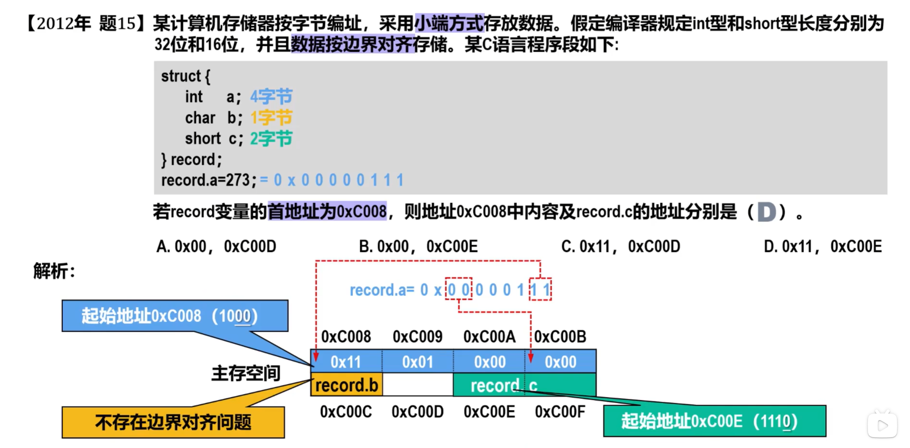

- 步骤 1：273 转换为 16 进制，结果为 0X111。

- 步骤 2：按对齐规则分配地址：

- int A（4 字节）：地址 0XC008~0XC00B（4 的整数倍起始）。

- char B（1 字节）：地址 0XC00C（任意地址）。

- short C（2 字节）：地址 0XC00E~0XC00F（2 的整数倍起始，跳过 0XC00D 实现对齐）。

- 步骤 3：小端方式存储 int A（0X0111）：

- 低地址 0XC008 存 0X11（低字节），0XC009 存 0X1，0XC00A 存 0X0，0XC00B 存 0X0。

- 步骤 4：结合成员存储顺序，匹配选项。

#### 答案：选项 D

### 2. 2016 年第 14 题

#### 考点：小端方式（送分题）

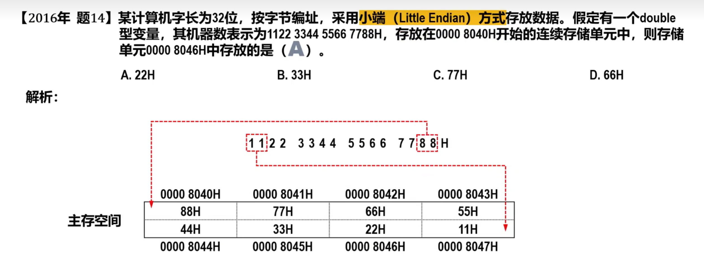

#### 解析：仅考察小端方式的定义，直接根据 “低字节存低地址” 判断选项。

#### 答案：选项 A

### 3. 2018 年第 15 题

#### 考点：小端方式、补码表示

#### 题干条件

- 给 int 型变量 I 赋值 - 64，指令代码前 3 字节为指令，后 4 字节为数据（小端存储）。

#### 解析步骤

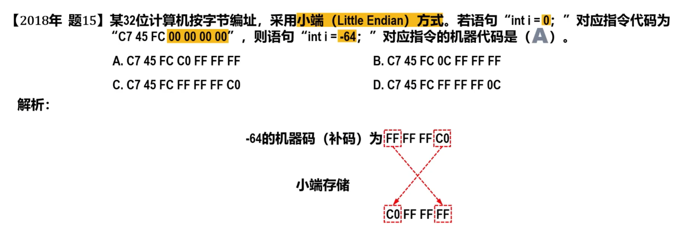

- 步骤 1：计算 - 64 的补码（计算机中数值以补码存储）。

- 64 的二进制为 00000000 00000000 00000000 01000000。

- 反码：11111111 11111111 11111111 10111111。

- 补码：11111111 11111111 11111111 11000000（16 进制：0XFFFFFFC0）。

- 步骤 2：小端方式存储补码：低字节存低地址，后 4 字节数据顺序为 0XC0、0XFF、0XFF、0XFF。

- 步骤 3：匹配指令代码格式（前 3 字节指令 + 后 4 字节数据）。

#### 答案：选项 A

### 4. 2020 年第 14 题

#### 考点：小端方式、数据边界对齐（与 2012 年第 15 题题型一致）

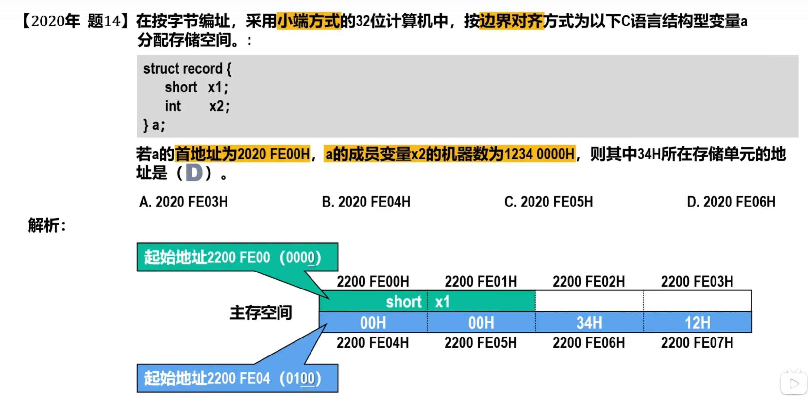

#### 解析：同 2012 年真题逻辑，按对齐规则分配地址，结合小端存储特性判断。

#### 答案：选项 D

# 4-2-1 静态随机存取存储器SRAM — 存储元

## 一、SRAM 基本定义与分类关联

1. **英文全称与缩写**：静态随机存取存储器（Static Random Access Memory，简称 SRAM）。

1. **所属类别**：是随机存取存储器（RAM）的一种，按存取方式分类属于随机存取存储器。

1. **存取方式分类回顾**：存储器按存取方式可分为三类 —— 顺序存取存储器、直接存取存储器、随机存取存储器（SRAM 所属类别）。

1. 与其他存储器的核心区别：

- 与 DRAM（动态随机存取存储器）：SRAM 通电后无需周期性刷新，数据可保持；DRAM 需周期性刷新。

- 与 ROM（只读存储器）：SRAM 和 DRAM 均为易失性存储器（断电后数据消失）；ROM 为非易失性存储器。

## 二、SRAM 存储单元的构成

SRAM 的存储源（存储 1 位二进制信息的单元）由多个 MOS 管（金属氧化物半导体场效应晶体管，英文缩写 MOSFET）构成，具体分工如下：

- **工作管**：2 个（标记为 T1、T2，橙色），核心作用是通过导通 / 截止状态存储二进制信息。

- **负载管**：2 个（标记为 T3、T4，紫色），可看作上拉电阻，栅极连接电源 VCC（高电平 5V），始终导通。

- **门控管**：4 个（标记为 T5、T6、T7、T8，蓝色），由行选通线 X 和列选通线 Y 控制导通 / 截止。

- 行选通线 X 控制 T5、T6；

- 列选通线 Y 控制 T7、T8；

- 行选通线 X、列选通线 Y 本质是行 / 列地址译码器的译码输出线。

## 三、MOS 管的开关特性（数字电路场景）

1. **MOS 管引脚定义**：栅极（G）、源极（S）、漏极（D）（视频使用非国标简化符号，便于初学者理解）。

1. **开关工作规则**：

- 栅极输入高电平（用 “1” 表示）：源极与漏极导通；

- 栅极输入低电平（用 “0” 表示）：源极与漏极截止（不导通）。

1. 应用前提：本课程中 MOS 管仅作为开关看待（无需考虑放大、阻抗变换等模电特性），仅需初中电路知识即可分析工作原理。

## 四、SRAM 存储单元的工作原理

### （一）上电后的初始状态（随机稳定状态）

1. 初始条件：行选通线 X、列选通线 Y 均为低电平（无效信号 “0”），T5-T8 门控管全部截止。

1. 负载管状态：T3、T4 栅极接 VCC（高电平），始终导通，A 点和 B 点初始被上拉为高电平（“1”）。

1. 稳定状态形成（因 A、B 点上升到高电平的时间不同，形成两种随机稳定状态）：

- 示例 1（存储 “1”）：

1. 假设 A 点先上升到高电平（“1”）；

1. A 点连接 T2 的栅极，T2 栅极高电平→T2 导通；

1. T2 导通后，B 点通过 T2 连接 GND（接地）→B 点被拉低为低电平（“0”）；

1. B 点连接 T1 的栅极，T1 栅极低电平→T1 截止；

1. 最终稳定状态：A 点 “1”、B 点 “0”，对应存储比特 “1”。

- 示例 2（存储 “0”）：

1. 假设 B 点先上升到高电平（“1”）；

1. B 点连接 T1 的栅极，T1 栅极高电平→T1 导通；

1. T1 导通后，A 点通过 T1 连接 GND→A 点被拉低为低电平（“0”）；

1. A 点连接 T2 的栅极，T2 栅极低电平→T2 截止；

1. 最终稳定状态：A 点 “0”、B 点 “1”，对应存储比特 “0”。

1. 核心结论：SRAM 上电后各存储单元的初始状态是随机的。

### （二）读操作原理

1. 操作条件：行选通线 X 和列选通线 Y 均输入高电平（有效信号 “1”）。

1. 操作过程：

- X、Y 为高电平→T5-T8 门控管全部导通；

- A 点通过 T5、T7 与位线 IO 连通，B 点通过 T6、T8 与位线 IO 反连通；

- 位线输出信号经差分放大器处理，根据电流方向输出对应数据（“1” 或 “0”）。

1. 关键特性：读操作不会破坏存储单元原有数据（A 点、B 点电平保持不变）。

1. 对比提示：与后续将学习的 DRAM 不同，DRAM 的读操作是破坏性的，需读后写恢复数据。

### （三）写操作原理

1. 操作条件：行选通线 X 和列选通线 Y 均输入高电平（有效信号 “1”）。

1. 操作示例（原存储 “1”，写入 “0”）：

- 初始状态：A 点 “1”、B 点 “0”（存储 “1”）；

- 写入准备：向位线 IO 输入低电平（“0”），向位线 IO 反输入高电平（“1”）；

- 电平变化：A 点通过导通的门控管被拉低为 “0”，此时 T2 栅极低电平→T2 截止；

- 稳定新状态：T2 截止后，B 点通过负载管 T4 接 VCC→B 点被拉高为 “1”；B 点 “1” 使 T1 栅极高电平→T1 导通，A 点通过 T1 接地保持 “0”；

- 最终结果：A 点 “0”、B 点 “1”，成功写入比特 “0”。

1. 操作后状态保持：写操作完成后，撤掉 X、Y 的有效信号（恢复低电平 “0”），T5-T8 截止，存储单元与位线断开。

### （四）数据保持原理

1. 断电前：电源 VCC 通过负载管 T3、T4 持续为工作管 T1 或 T2 提供电流，维持 A、B 点的稳定电平。

1. 核心特性：只要不断电，存储单元的状态（存储的数据）就会一直保持不变，无需额外刷新操作。

## 五、SRAM 存储单元的核心特点

1. **初始状态**：上电后初始存储内容随机，无固定初始值。

1. **读写特性**：读操作非破坏性（不改变原有数据），写操作可覆盖原有数据。

1. **数据保存**：无需周期性刷新，通电即可持续保存数据，断电后数据丢失（易失性）。

1. **性能参数**：

- 速度快：无刷新延迟，适合高速数据存取场景。

- 功耗大：VCC 需持续通过负载管供电，电流消耗稳定且较大。

- 成本高：单个存储单元使用 MOS 管数量多（共 8 个），占用晶圆面积大，生产制造成本高。

1. **典型应用**：常用于微处理器的高速缓冲存储器（Cache）；因成本和功耗问题，不适合 PC 内存等高密度、低成本场景。